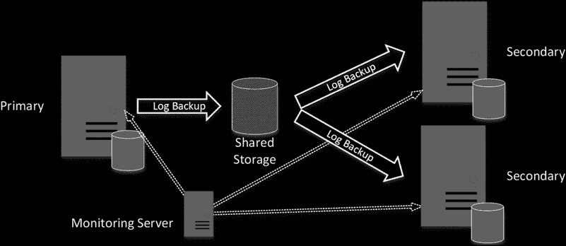
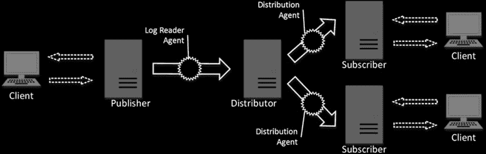
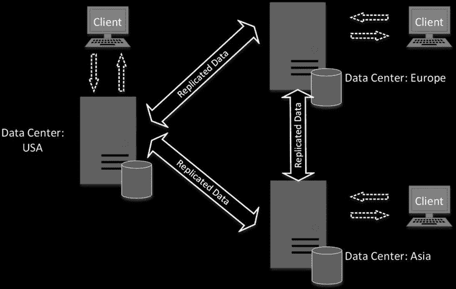

# 第 32 章 ■ 高可用性技术

## ■ **注意**
您可以阅读有关客户端连接到 AlwaysOn 可用性组的文档，网址为 [`technet.microsoft.com/en-us/library/hh510184.aspx`](http://technet.microsoft.com/en-us/library/hh510184.aspx)。

这种行为有助于减少主服务器的负载，尽管您需要小心并始终监视重做队列的大小。辅助副本上的 REDO 进程很可能落后，从而向客户端提供非最新且与主节点数据库不同的数据。同样重要的是要记住，在此类条件下，故障转移过程可能需要很长时间。即使使用同步提交不会有任何数据丢失，但在崩溃恢复过程完成之前，数据库将不可用。



对于可读辅助副本，您还应小心处理 SQL Server Agent 作业。作业能够访问可读辅助副本上的数据库并从那里读取数据。这可能导致同一作业在多个节点上运行的情况，即使您希望它们只在主节点上运行。

作为解决方案，在 SQL Server 2014 及更高版本中，您可以使用`sys.fn_hadr_is_primary_replica`函数，该函数为您提供副本的状态。在 SQL Server 2012 中，您可以检查可用性组中某个数据库的`sys.dm_hadr_availability_replica_states`视图的`Role_Desc`列，以检查和验证节点是否为主副本。您可以在每个作业中使用它，或者，创建另一个每分钟运行一次的作业，并根据节点的状态启用或禁用作业。

您可以将运行在 Microsoft Azure 云中虚拟机内的 SQL Server 实例作为可用性组的成员。这可以帮助您为高可用性解决方案添加另一个地理冗余节点。但是，您需要小心处理这种方法，并确保基于云的 SQL Server 实例能够处理负载。

互联网连接是另一个需要考虑的因素。它应具有足够的带宽来传输日志记录，并且足够稳定，以便大部分时间保持 Microsoft Azure 节点在线和连接。请记住，当连接中断时，事务日志不会被截断，并且有些记录尚未传输到辅助节点。

AlwaysOn 可用性组为数据库镜像提供了一个很好的替代方案。不幸的是，此功能在 SQL Server 2012-2014 的标准版中不受支持。

## ■ **注意**
您可以阅读有关 AlwaysOn 可用性组的文档，网址为 [`technet.microsoft.com/en-us/library/hh510230.aspx`](http://technet.microsoft.com/en-us/library/hh510230.aspx)。

#### 日志传送

*日志传送*允许您在一个或多个辅助服务器上维护数据库的副本。简而言之，日志传送是一个非常简单的过程。您根据某种计划执行日志备份，将这些备份文件复制到共享位置，然后在一个或多个辅助服务器上还原它们。可选地，您可以有一台单独的服务器来监视日志传送过程，保留有关备份和还原操作的信息，并在需要关注时发送警报。

**图 32-8.** 日志传送

日志传送不能防止数据丢失。日志备份是按计划执行的，如果主服务器上的事务日志损坏，您将丢失自上次日志备份以来的所有更改。

日志传送通常与其他高可用性技术一起使用。一种常见的场景是将其与故障转移集群实例结合使用，将日志传送到远程异地位置的辅助服务器。这以较低的实现成本为系统中的数据层提供了地理冗余。


**第 32 章 高可用性技术**

日志传送在你故意不希望备用服务器上拥有最新数据的情况下也很有用。这可以帮助你从主服务器上的意外删除操作中恢复数据。

日志传送不提供自动故障转移支持。手动故障转移包含几个步骤。
```
首先，你需要将用户与数据库断开连接，并且可能需要将数据库切换到 `RESTRICTED_USER` 或 `SINGLE_USER` 模式，以避免在故障转移过程中发生客户端连接。
接下来，你需要备份主服务器上剩余的日志部分。如果你预计稍后要故障恢复回主服务器，在备份时使用 `NORECOVERY` 选项可能是有益的。
最后，你应该在备用服务器上应用所有剩余的日志备份，并恢复数据库以使其上线。显然，你还应将连接字符串更改为指向新的服务器。
```

备用服务器将数据库保持在 `RESTORING` 状态，阻止客户端访问它。你可以通过使用 `STANDBY` 选项来解决此问题，该选项为你提供对数据库的只读访问权限。但是，在日志备份被还原所需的时间内，客户端将失去连接。你还应考虑 `SQL Server` 许可模式，该模式要求你在服务器用于支持高可用性以外的任何用途时购买另一个许可证。

你应该设计日志传送策略和备份计划，以避免当日志备份通过网络传输且还原速度慢于生成速度时出现积压。

确保你用于备份存储的共享位置有足够的空间来容纳你的备份文件。如果你的 `SQL Server` 版本和版本支持备份压缩，并且你有足够的 `CPU` 资源来处理压缩开销，那么使用备份压缩可以减少存储大小和传输时间，并提高备份和还原过程的性能。

日志传送可能是设置和维护最简单的解决方案。同样常见的是，人们会看到类似日志传送的自定义实现，允许你实现额外的业务需求并解决原生 `SQL Server` 日志传送的限制。然而，你应该牢记可能的数据丢失，并考虑如果这种数据丢失是不可接受的或者需要自动故障转移，则将其与其他技术结合使用。

### 注意
你可以在 [`technet.microsoft.com/en-us/library/ms187103.aspx`](http://technet.microsoft.com/en-us/library/ms187103.aspx) 阅读有关日志传送的更多信息。

#### 复制

与本章已经讨论过的其他技术相比，复制远不止是一种高可用性解决方案。复制的主要目标是在多个数据库之间复制和拷贝数据。尽管它可以用作高可用性技术，但这几乎不是其主要目的。

复制在出版物的范围内工作，出版物是数据库对象的集合。如果你只想保护数据库中数据的子集（例如，几个关键表），复制是一个不错的选择。复制与其他高可用性技术之间的另一个关键区别是，复制允许你实现一种可以在多个地方修改数据的解决方案。这可能需要实现复杂的冲突检测机制，并且在某些情况下可能对性能产生负面影响，尽管在某些场景下这是值得付出的小代价。



`SQL Server` 中有三种主要的复制类型，如下所示：

快照复制根据某个计划生成和分发数据的快照。这可能有用的一种情况是一组表基于计划进行更新，也许每周一次。你可以考虑使用


快照复制用于在这些表更新后分发数据。

另一个例子涉及一个具有高度易变数据的小表。在这种情况下，当你不需要在辅助服务器上拥有数据的最新副本时，与其他复制类型相比，快照复制的开销要小得多。

`合并复制`允许你在多个服务器之间复制和合并更改，例如在那些服务器彼此不经常连接的场景中。一个可能的例子是一家拥有中央服务器和分支办公室独立服务器的公司。数据可以在每个分支办公室更新，并使用合并复制在服务器之间合并/分发。不幸的是，合并复制需要更改数据库模式并使用触发器，这可能会引入性能问题。

`事务复制`允许你在不同服务器之间以相对较低的延迟（通常在几秒钟内）复制更改。默认情况下，称为`订阅者`的辅助服务器是只读的，尽管你可以选择在那里更新数据。事务复制的一种特殊类型，称为`点对点复制`，可在 SQL Server 的企业版中使用，它允许你构建一个解决方案，其中包含托管在不同服务器上的多个可更新数据库，并在它们之间复制数据。

事务复制是最适合作为可更新数据的高可用性技术的复制类型。`图 32-9` 说明了事务复制中使用的组件。

称为`发布者`的主服务器由一个称为`日志读取器代理`的特殊作业访问，该作业不断扫描配置为复制的数据库的事务日志，并收集代表出版物中更改的日志记录。这些日志记录被转换为逻辑操作（`INSERT`、`UPDATE`、`DELETE`），并存储在另一个`分发数据库`中，该数据库通常位于运行`日志读取器代理`作业的另一个称为`分发者`的服务器上。最后，分发者要么将这些更改推送给订阅者，要么根据复制配置，订阅者从分发者那里拉取它们。

`图 32-9. 使用推送订阅的事务复制`



