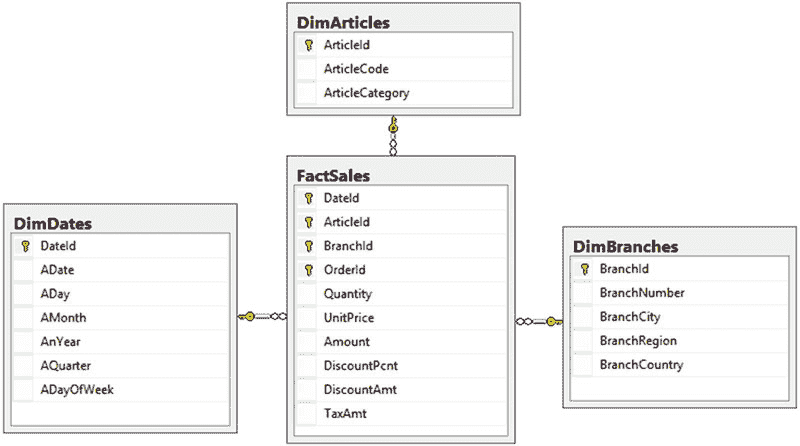
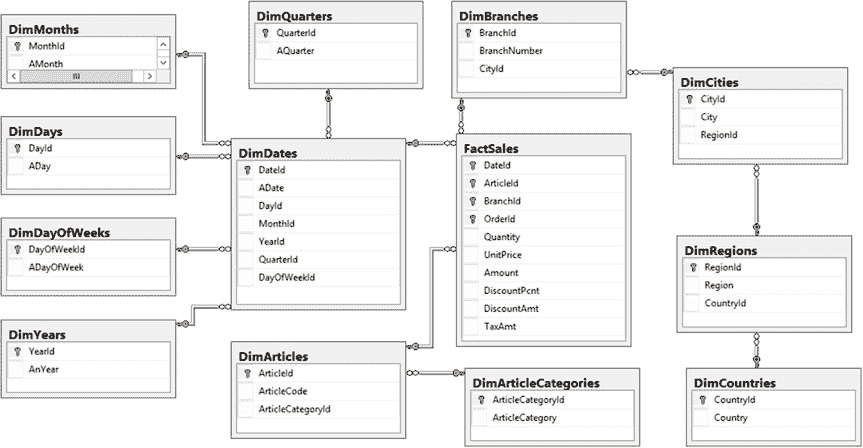
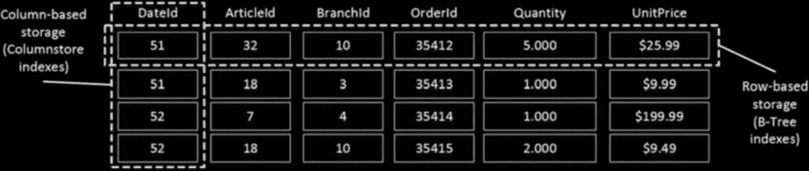
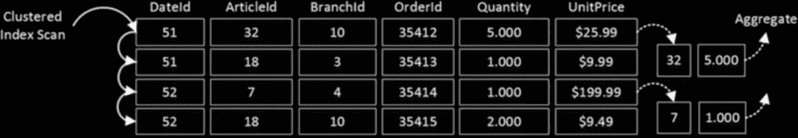

# 第七部分

## 列存储索引

### 第 33 章

#### 基于列的存储与批处理模式执行

`列存储索引`是 SQL Server 2012 引入的企业版功能。它们是名为 `x Velocity`（曾用名 `VertiPaq`）的新技术家族的一部分，该技术旨在优化扫描和聚合大量数据的分析查询的性能。

列存储索引采用一种不同的数据存储格式，按列而非按行存储压缩数据。这种存储格式有利于数据仓库、报表和分析环境中的查询处理，因为尽管这些查询通常读取非常大量的行，但它们只涉及表中的部分列。

数据仓库系统的设计和实现是一个非常复杂的过程，本书不作详细讨论。不过，本章将参考此类系统中常见的数据库设计模式。此外，本章将概述列存储索引及其存储格式，讨论批处理模式执行，并简要介绍几条可提升数据仓库解决方案性能的建议。

#### 数据仓库系统概览

数据仓库系统提供用于分析、报告和决策支持的数据。与旨在支持运营活动、在短事务中处理简单查询的 OLTP（在线事务处理）系统不同，数据仓库系统处理的是通常执行聚合操作并处理大量数据的复杂查询。

例如，考虑一家向客户销售商品的公司。其 `销售点 (POS)` 系统的一个典型 OLTP 查询语义可能是：*提供此特定客户本月下达的订单列表*。而数据仓库系统中的一个典型查询则可能是：*按商品类别和客户地区分组，提供截至今日的年度销售总额*。

数据仓库系统与 OLTP 系统还有其他区别。OLTP 系统中的数据通常是易变的。此类系统同时服务大量请求，并且其面向客户的查询通常关联有性能 SLA（服务等级协议）。相比之下，数据仓库系统中的数据相对静态，通常按固定计划（例如在夜间或周末）进行更新。这些系统通常服务于少量客户，主要是业务分析师、经理和高管，他们由于需要处理大量数据，可以接受较长的查询执行时间。

© Dmitri Korotkevitch 2016

D. Korotkevitch, *Pro SQL Server Internals*, DOI 10.1007/978-1-4842-1964-5_33

第 33 章 ■ 基于列的存储与批处理模式执行

具体而言，简短的 OLTP 查询的响应时间通常需要在毫秒级。然而，对于复杂的数据仓库查询，数秒甚至数分钟的响应时间通常是可接受的。

大多数公司从设计或购买一个支持业务运营活动的 OLTP 系统开始。报告和分析最初基于 OLTP 数据完成；然而，随着业务增长，这种方法变得越来越有问题。OLTP 系统中的数据库模式很少适合报告目的。报告活动会增加服务器负载，并降低系统性能和客户体验。

数据分区有助于解决其中一些问题；然而，这种方法能实现的效果是有限的。在某些时候，将运营数据与分析数据分离就成为


这是唯一能够同时保证两种解决方案的可接受性能以及满足可用性 `SLA` 的选项。在许多情况下，这导致了 `OLTP` 和数据仓库数据库之间的物理数据分离。

重要的是要记住，数据仓库工作负载通常处理大量数据，这会给 I/O 子系统增加沉重负载，并可能冲刷服务器上的缓冲池内容。通常最好将 `OLTP` 和大型数据仓库数据库放置在不同的服务器上，除非你的缓冲池有足够的内存来缓存两个系统的数据。

## `操作型分析`

同样无法避免提及另一类任务，称为 `操作型分析`，近年来已变得非常流行。以 `销售点` 系统为例，你希望监控最新的销售情况，并根据商品的受欢迎程度动态调整其售价。这需要你对近期的 `OLTP` 数据运行分析查询。

`SQL Server 2016` 通过在同一张表上混合使用列存储索引和行存储索引，帮助你在这种场景下提升性能。`OLTP` 查询使用常规的 `B-Tree` 索引，而操作型分析查询则利用 `列存储` 索引。我们将在下一章讨论这种方法，本章将重点放在经典的数据仓库实现上。

`OLTP` 系统通常是数据仓库的数据源。来自 `OLTP` 系统的数据通过 `ETL`（`提取转换和加载`）过程被转换并加载到数据仓库中。这种转换是关键；也就是说，`OLTP` 和数据仓库系统中的数据库模式并不匹配，也不应该匹配。

一个典型的数据仓库数据库由几个维度表和一个或几个事实表组成。`事实表` 存储业务的事实或度量值，而 `维度表` 存储事实的属性或特性。在我们的 `销售点` 系统中，与销售相关的信息成为事实，而商品列表、客户和分支机构则成为模型中的维度。

大型事实表可以存储数百万甚至数十亿行数据，并占用 TB 级的磁盘空间。而维度表则要小得多。

典型的数据仓库数据库设计遵循 `星型` 或 `雪花型` 模式。星型模式由一个事实表和单层维度表组成。而雪花型模式则进一步对维度表进行了规范化。

图 33-1 展示了一个星型模式的示例。





### 第 33 章 ■ 列式存储与批处理模式执行

**图 33-1.** 星型模式

图 33-2 展示了同一数据模型的雪花型模式示例。

**图 33-2.** 雪花型模式

### 第 33 章 ■ 列式存储与批处理模式执行

数据仓库系统中的典型查询是从一个事实表中选择数据，并将其与一个或多个维度表连接。`SQL Server` 能够检测 `星型` 和 `雪花型` 数据库模式，并使用一些优化技术来尝试减少需要扫描的行数和查询所需的 I/O 量。它会将谓词下推到执行计划树中的最低级运算符，试图尽早计算它们，以减少需要选择的行数。其他优化包括维度表的交叉连接以及使用 `位图` 过滤器进行预过滤的哈希连接。

**注意** 在事实表和维度表之间定义外键约束有助于 `SQL Server` 更可靠地检测 `星型` 和 `雪花型` 模式。如果创建阶段验证约束的开销无法接受，你可以考虑使用 `WITH NOCHECK` 选项创建外键约束。

然而，即使采用了所有优化技术，大型数据仓库中的查询性能也并非总是足够。即使在当今的硬件上，扫描 GB 或 TB 级的数据也非常耗时。部分


#### 列存储索引与批处理模式执行概述

问题在于 SQL Server 中查询处理的性质；也就是说，操作符逐行请求和处理数据，这在处理大量数据时并不总是高效的。

其中一些问题可以通过列存储索引和批处理模式执行来解决，我将在接下来的内容中介绍。

如前所述，典型的数据仓库查询会连接事实表和维度表，并在仅访问事实表列的子集的情况下执行一些计算和聚合。清单 33-1 展示了一个在遵循星型模式设计的数据库中的查询示例，如图 33-1 所示。

***清单 33-1.*** 数据仓库环境中的典型查询
```sql
select a.ArticleCode, sum(s.Quantity) as [Units Sold]
from dbo.FactSales s join dbo.DimArticles a on
s.ArticleId = a.ArticleId
join dbo.DimDates d on
s.DateId = d.DateId
where d.AnYear = 2016
group by a.ArticleCode
```

如你所见，这个查询需要从事实表中扫描大量数据；然而，它只使用了三个表列。使用常规的基于行的执行模式，SQL Server 会逐行访问数据，将整行加载到内存中，而不管该行中有多少列是实际需要的。

你可以通过实现页面压缩来减少表的存储大小，从而减少 I/O 操作次数。但是，页面压缩的作用范围仅限于单个页面。每个页面会维护一个独立的压缩字典副本，用于该页面上的所有行。维护字典并以列为单位压缩大批量的行将显著提升压缩效果。

最后，还有另一个不那么明显的问题。尽管访问内存中数据的速度比访问磁盘数据快几个数量级，但与 CPU 缓存访问时间相比，它仍然很慢。在行模式执行下，SQL Server 会不断地用从主内存复制的新行数据重新加载 CPU 缓存数据。这种开销在 OLTP 工作负载和简单查询中通常不是问题；然而，在处理数百万甚至数十亿行的数据仓库查询中，它会变得非常明显。





