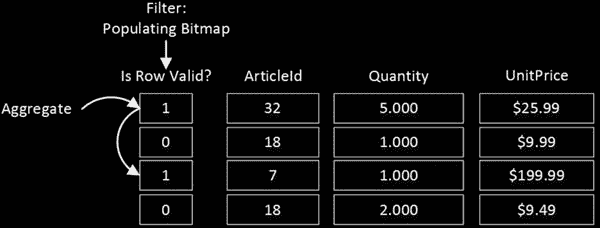
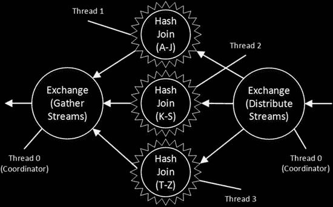
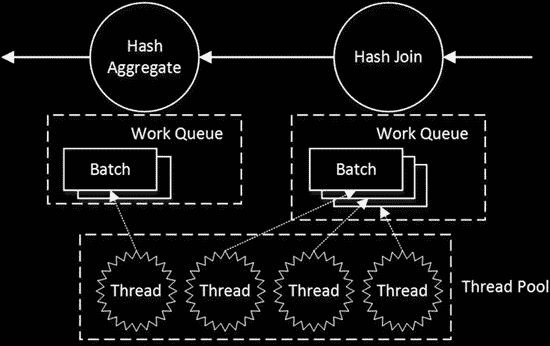

# 第 33 章 ■ 基于列的存储与批处理模式执行

## SQL 查询示例

```sql
select ArticleId, sum(Quantity)
from dbo.FactSales
where UnitPrice >= 10.00
group by ArticleId
```

## 行模式执行

在常规的行模式执行中，`SQL Server` 会扫描聚集索引并在每一行上应用筛选器。对于满足 `UnitPrice >= 10.00` 的行，它会将一个包含两列（`ArticleId` 和 `Quantity`）的行传递给 `聚合` 算子。图 33-4 展示了此过程。

***图 33-4.** 行模式执行*





## 批处理模式执行

或者，在批处理模式执行中，`筛选` 算子会设置一个内部位图来指示行的有效性。后续的 `聚合` 算子将处理同一批行，忽略无效的行。不涉及数据复制。图 33-5 展示了这种方法。同样值得注意的是，只有 `ArticleId`、`Quantity` 和 `UnitPrice` 列会被加载到批处理中。

***图 33-5.** 批处理模式执行*

■ **注意** 在实际系统中，`SQL Server` 可以将用于判断 `UnitPrice >= 10` 的谓词下推到 `列存储索引扫描` 算子，从而防止不必要的行被加载到批处理中。然而，在我们的示例中，让我们假设情况并非如此。

## 并行性比较

`SQL Server` 在行模式和批处理模式执行中处理并行性的方式非常不同。如您所知，在行模式执行中，`交换` 算子使用可用的分布算法之一将行分发到不同的并行线程之间。然而，分发行之后，在遇到另一个用于收集或重新分区数据的 `交换` 算子之前，该行永远不会从一个线程迁移到另一个线程。

图 33-6 通过展示一个使用 `Range` 重分布方法将数据分发到三个执行 `哈希联接` 的并行线程的 `交换` 算子来说明这一点。联接键值的第一个字母将控制行被分发到哪个线程以及在何处处理。

***图 33-6.** 行模式执行中的并行性*



`SQL Server` 在批处理模式执行中采用了不同的方法。在该模式下，每个算子都有一个工作项（批处理）队列要处理。来自共享池的工作线程从队列中选取项目进行处理，并从一个算子迁移到另一个算子。图 33-7 说明了这种方法。

***图 33-7.** 批处理模式执行中的并行性*

在行模式执行中，增加并行查询响应时间的常见问题之一是数据分布不均匀。`交换` 算子等待所有并行线程完成；因此，执行时间取决于最慢的线程。当数据分布不均匀时，一些线程比其他线程有更多的工作要做。批处理模式执行消除了此类问题。每个线程从共享队列中拾取工作项，直到队列为空。

## 列存储索引与批处理模式执行实战

让我们看几个与列存储索引行为和性能相关的例子。清单 33-3 为图 33-1 所示的数据库架构创建了一组表，并用测试数据填充它。作为最后一步，它在事实表上创建了一个非聚集列存储索引。根据您计算机的性能，这可能需要几分钟才能完成。

同样值得注意的是，非聚集列存储索引在 `SQL Server 2012/2014` 和 `2016` 中的实现和行为不同。这些索引在 `SQL Server 2012/2014` 中使表变为只读，而在 `SQL Server 2016` 中则不是这种情况。我们将在下一章详细讨论它们的内部实现。

***清单 33-3.** 测试数据库创建*

```sql
create table dbo.DimBranches
(
    BranchId int not null primary key,
    BranchNumber nvarchar(32) not null,
    BranchCity nvarchar(32) not null,
    BranchRegion nvarchar(32) not null,
    BranchCountry nvarchar(32) not null
);
```


