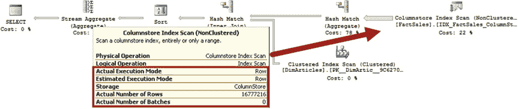
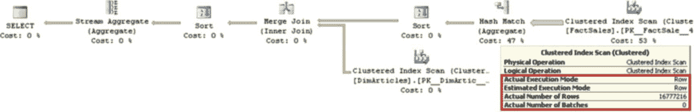
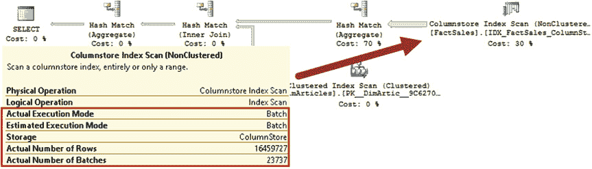
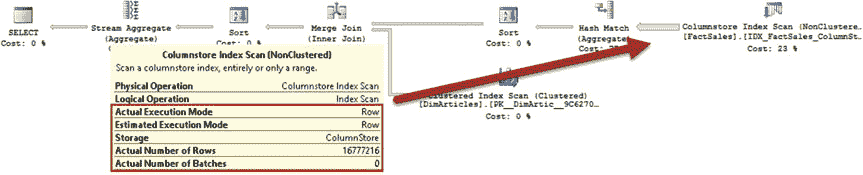
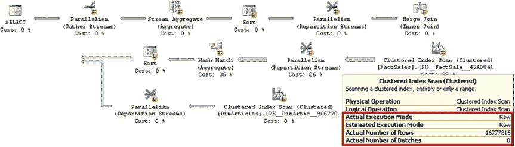
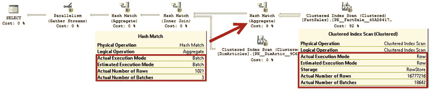

# 第 33 章 ■ 基于列的存储与批处理模式执行

创建 `dbo.DimArticles` 表：

```sql
create table dbo.DimArticles
(
    ArticleId int not null primary key,
    ArticleCode nvarchar(32) not null,
    ArticleCategory nvarchar(32) not null
);
```

创建 `dbo.DimDates` 表：

```sql
create table dbo.DimDates
(
    DateId int not null primary key,
    ADate date not null,
    ADay tinyint not null,
    AMonth tinyint not null,
    AnYear smallint not null,
    AQuarter tinyint not null,
    ADayOfWeek tinyint not null
);
```

创建 `dbo.FactSales` 表：

```sql
create table dbo.FactSales
(
    DateId int not null
        foreign key references dbo.DimDates(DateId),
    ArticleId int not null
        foreign key references dbo.DimArticles(ArticleId),
    BranchId int not null
        foreign key references dbo.DimBranches(BranchId),
    OrderId int not null,
    Quantity decimal(9,3) not null,
    UnitPrice money not null,
    Amount money not null,
    DiscountPcnt decimal (6,3) not null,
    DiscountAmt money not null,
    TaxAmt money not null,
    constraint PK_FactSales primary key (DateId, ArticleId, BranchId, OrderId)
)
with (data_compression = page);
```

插入日期维度数据：

```sql
;with N1(C) as (select 0 union all select 0) -- 2 rows
,N2(C) as (select 0 from N1 as T1 cross join N1 as T2) -- 4 rows
,N3(C) as (select 0 from N2 as T1 cross join N2 as T2) -- 16 rows
,N4(C) as (select 0 from N3 as T1 cross join N3 as T2) -- 256 rows
,N5(C) as (select 0 from N2 as T1 cross join N4 as T2) -- 1,024 rows
,IDs(ID) as (select row_number() over (order by (select null)) from N5)
,Dates(DateId, ADate)
as
(
    select ID, dateadd(day,ID,'2014-12-31')
    from IDs
    where ID <= 727
)
insert into dbo.DimDates(DateId, ADate, ADay, AMonth, AnYear, AQuarter, ADayOfWeek)
select DateID, ADate, Day(ADate), Month(ADate), Year(ADate), datepart(qq,ADate),
datepart(dw,ADate)
from Dates;
```

插入分支维度数据：

```sql
;with N1(C) as (select 0 union all select 0) -- 2 rows
,N2(C) as (select 0 from N1 as T1 cross join N1 as T2) -- 4 rows
,N3(C) as (select 0 from N2 as T1 cross join N2 as T2) -- 16 rows
,IDs(ID) as (select row_number() over (order by (select null)) from N3)
insert into dbo.DimBranches(BranchId, BranchNumber, BranchCity, BranchRegion, BranchCountry)
select ID, convert(nvarchar(32),ID), 'City', 'Region', 'Country' from IDs where ID <= 13;
```

插入文章维度数据：

```sql
;with N1(C) as (select 0 union all select 0) -- 2 rows
,N2(C) as (select 0 from N1 as T1 cross join N1 as T2) -- 4 rows
,N3(C) as (select 0 from N2 as T1 cross join N2 as T2) -- 16 rows
,N4(C) as (select 0 from N3 as T1 cross join N3 as T2) -- 256 rows
,N5(C) as (select 0 from N4 as T1 cross join N2 as T2) -- 1,024 rows
,IDs(ID) as (select row_number() over (order by (select null)) from N5)
insert into dbo.DimArticles(ArticleId, ArticleCode, ArticleCategory)
select ID, convert(nvarchar(32),ID), 'Category ' + convert(nvarchar(32),ID % 51)
from IDs
where ID <= 1021;
```

插入销售事实数据：

```sql
;with N1(C) as (select 0 union all select 0) -- 2 rows
,N2(C) as (select 0 from N1 as T1 cross join N1 as T2) -- 4 rows
,N3(C) as (select 0 from N2 as T1 cross join N2 as T2) -- 16 rows
,N4(C) as (select 0 from N3 as T1 cross join N3 as T2) -- 256 rows
,N5(C) as (select 0 from N4 as T1 cross join N4 as T2) -- 65,536 rows
,N6(C) as (select 0 from N5 as T1 cross join N4 as T2) -- 16,777,216 rows
,IDs(ID) as (select row_number() over (order by (select null)) from N6)
insert into dbo.FactSales(DateId, ArticleId, BranchId, OrderId, Quantity, UnitPrice, Amount
,DiscountPcnt, DiscountAmt, TaxAmt)
select ID % 727 + 1, ID % 1021 + 1, ID % 13 + 1, ID, ID % 51 + 1, ID % 25 + 0.99
,(ID % 51 + 1) * (ID % 25 + 0.99), 0, 0, (ID % 25 + 0.99) * (ID % 10) * 0.01
from IDs;
```

创建列存储索引：

```sql
create nonclustered columnstore index IDX_FactSales_ColumnStore
on dbo.FactSales(DateId, ArticleId, BranchId, Quantity, UnitPrice, Amount);
```

接下来，我们将运行几个测试，从事实表中选择数据，并使用不同的索引和不同的并行度将其与一个维度表连接，这将产生串行和并行的执行计划。我在分配有 8 GB 内存的 4-vCPU 虚拟机上运行 SQL Server 2012、2014 和 2016 中的查询。


第一个查询，如清单 33-4 所示，使用串行执行计划和行模式执行执行了一次*聚集索引扫描*。

***清单 33-4.*** 测试查询：使用 `MAXDOP=1` 的聚集索引扫描

```sql
select a.ArticleCode, sum(s.Amount) as [TotalAmount]
from dbo.FactSales s with (index = 1) join dbo.DimArticles a on
s.ArticleId = a.ArticleId
group by a.ArticleCode
option (maxdop 1)
```

所有版本的 SQL Server 都生成了相同的执行计划，如图 33-8 所示。





## 第 33 章 ■ 基于列的存储与批处理模式执行

***图 33-8.*** 使用聚集索引扫描和 `MAXDOP=1` 的执行计划

表 33-1 显示了在我的环境中查询的执行统计信息。

***表 33-1.*** 执行统计信息：聚集索引扫描和 `MAXDOP=1`

**逻辑读取** | **CPU 时间 (毫秒)** | **耗时 (毫秒)**
--- | --- | ---
SQL Server 2012 | 46,254 | 4,594 | 4,660
SQL Server 2014 | 46,245 | 4,564 | 4,656
SQL Server 2016 | 46,781 | 4,484 | 4,608

在下一步中，让我们移除索引提示，并允许 SQL Server 选择用于访问数据的列存储索引，仍然使用串行执行计划。查询如清单 33-5 所示。

***清单 33-5.*** 测试查询：使用 `MAXDOP=1` 的列存储索引扫描

```sql
select a.ArticleCode, sum(s.Amount) as [TotalAmount]
from dbo.FactSales s join dbo.DimArticles a on
s.ArticleId = a.ArticleId
group by a.ArticleCode
option (maxdop 1)
```

SQL Server 2012 和 2014 生成了相同的执行计划，如图 33-9 所示。该计划通过行模式执行利用了列存储索引扫描。

***图 33-9.*** 使用列存储索引扫描和 `MAXDOP=1` 的执行计划 (SQL Server 2012 和 2014)

SQL Server 2016 的增强功能之一是，当数据库兼容级别设置为 `130` 时，能够在串行计划中使用批处理模式执行。在此模式下，SQL Server 生成如图 33-10 所示的执行计划。该计划在批处理模式下利用了列存储索引扫描。





## 第 33 章 ■ 基于列的存储与批处理模式执行

***图 33-10.*** 在兼容级别为 `130` 的 SQL Server 2016 中，使用列存储索引扫描和 `MAXDOP=1` 的执行计划

当数据库兼容级别小于 `130` 时，SQL Server 生成如图 33-11 所示的计划。该计划使用行模式执行，与 SQL Server 2012 和 2014 相比效率较低。计划中的差异源于 SQL Server 2016 中非聚集列存储索引的不同（可更新）性质。

***图 33-11.*** 在兼容级别小于 `130` 的 SQL Server 2016 中，使用列存储索引扫描和 `MAXDOP=1` 的执行计划

值得注意的是，在串行计划中使用批处理模式执行的能力取决于数据库兼容级别，而不是基数估计模型。只要数据库兼容级别设置为 `130`，即使在数据库范围配置中启用了传统基数估计器，SQL Server 2016 也能使用它。

表 33-2 显示了查询的执行统计信息。在 SQL Server 2012 和 2014 中，即使使用行模式执行，列存储索引扫描也使读取次数减少了四倍以上，并且使查询完成速度几乎比聚集索引扫描快两倍。在 SQL Server 2016 中，使用批处理模式执行的查询快了一个数量级。

***表 33-2.*** 执行统计信息：列存储索引扫描和 `MAXDOP=1`

**逻辑读取** | **CPU 时间 (毫秒)** | **耗时 (毫秒)**
--- | --- | ---
SQL Server 2012 | 10,030 | 2,703 | 2,746
SQL Server 2014 | 12,522 | 2,563 | 2,604
SQL Server 2016 | 29,914 | 6,985 | 7,023
兼容级别 < 130 | SQL Server 2016 | 29,914
兼容级别 = 130 |





## 第 33 章 ■ 基于列的存储与批处理模式执行


