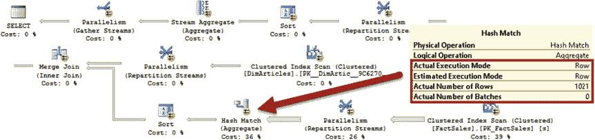
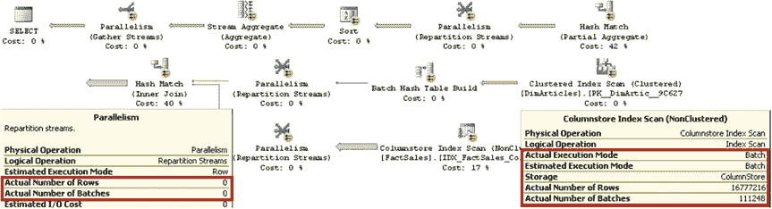
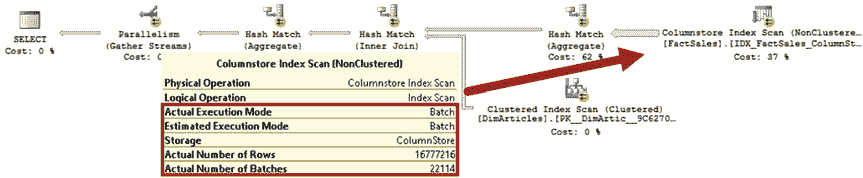

# 第三十三章：列式存储与批处理模式执行

遗憾的是，在 SQL Server 2016 中使用行模式执行时情况并非如此，其执行计划的效率低于聚集索引扫描。如果您升级到 SQL Server 2016 并决定将数据库兼容级别保持在 130 以下，请确保针对带有列存储索引表的查询能够利用并行处理。

在下一组测试中，我们将移除 `MAXDOP` 提示，允许 SQL Server 为查询生成并行执行计划。第一步，我们将使用**代码清单 33-6** 中所示的代码强制执行聚集索引扫描来运行查询。

## 代码清单 33-6：测试查询：带并行执行计划的聚集索引扫描

```sql
select a.ArticleCode, sum(s.Amount) as [TotalAmount]
from dbo.FactSales s with (index = 1) join dbo.DimArticles a on
s.ArticleId = a.ArticleId
group by a.ArticleCode
```

**图 33-12** 展示了该查询在 SQL Server 2012 中运行的执行计划。尽管 SQL Server 生成了并行执行计划，但它对所有运算符都使用了行模式执行。

## 图 33-12：SQL Server 2012 中带聚集索引扫描的执行计划

如果您在 SQL Server 2014 或兼容级别低于 130 的 SQL Server 2016 中运行相同的查询，您会看到不同的结果，如**图 33-13** 所示。SQL Server 在聚集索引扫描期间仍使用行模式执行；但是，`哈希连接`和`哈希聚合`运算符采用了批处理模式执行。值得重申的是，在 SQL Server 2012 和 2014 中，批处理模式执行仅在并行执行计划中生效。

## 图 33-13：SQL Server 2014 以及兼容级别低于 130 的 SQL Server 2016 中带聚集索引扫描的执行计划



不幸的是，在 SQL Server 2016 中，通过索引提示在那些带有列存储索引的表上强制使用非列存储索引，会阻止在兼容级别为 130 的数据库中进行批处理模式执行。这种行为为用户在运营分析场景中提供了对执行和资源消耗的更精细控制；然而，在我们的示例中，它导致了一个效率较低的执行计划，如**图 33-14** 所示。

## 图 33-14：兼容级别为 130 的 SQL Server 2016 中带聚集索引扫描的执行计划

**表 33-3** 显示了查询的执行统计信息。

## 表 33-3：执行统计信息：聚集索引扫描与并行执行计划

| | 逻辑读取次数 | CPU 时间（毫秒） | 已用时间（毫秒） |
| :--- | :--- | :--- | :--- |
| SQL Server 2012 | 46,907 | 5,531 | 1,825 |
| SQL Server 2014 | 47,147 | 4,704 | 1,716 |
| SQL Server 2016 兼容级别 < 130 | 47,623 | 4,657 | 1,673 |
| SQL Server 2016 兼容级别 = 130 | 47,435 | 5,656 | 1,819 |

最后，让我们移除索引提示，允许 SQL Server 使用列存储索引和并行执行计划。该查询如**代码清单 33-7** 所示。

## 代码清单 33-7：测试查询：带并行执行计划的列存储索引扫描

```sql
select a.ArticleCode, sum(s.Amount) as [TotalAmount]
from dbo.FactSales s join dbo.DimArticles a on
s.ArticleId = a.ArticleId
group by a.ArticleCode
```

**图 33-15** 展示了该查询在 SQL Server 2012 中的执行计划。如您所见，它利用了批处理模式执行。值得注意的是，执行计划中的`交换/并行`（`重新分区流`）运算符并不在不同线程之间移动数据，您可以通过分析运算符的`实际行数`属性来确认这一点。SQL Server 2012 将它们保留在计划中，是为了支持哈希表溢出到 `tempdb` 的情况，这将迫使 SQL Server 切换到行模式执行。





