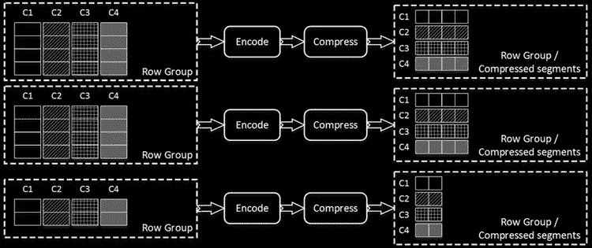
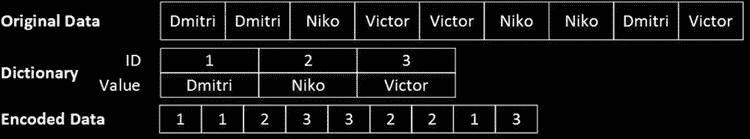
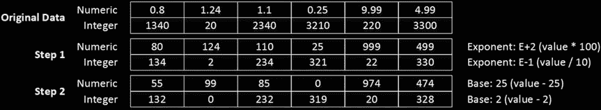
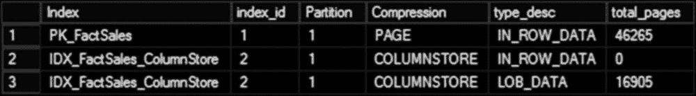

# 列存储索引的创建与编码

## 索引创建过程

`columnstore indexes` 使用并行执行计划。每个线程将处理自己的数据子集，创建独立的 `row groups`。此外，对于分区表，每个表分区都有自己的一组 `row groups`。

构建完 `row groups` 后，SQL Server 会按 `row group` 合并所有列数据，并对这些组进行编码和压缩。如果有利于实现更好的压缩率，可以重新排列 `row group` 内的行。

`row group` 内的列数据称为一个 `segment`。当需要访问列存储数据时，SQL Server 会将整个 `segment` 加载到内存中。SQL Server 还会保留有关每个 `segment` 中存储数据的元数据信息（例如最小值和最大值），并可以跳过不包含所需数据的 `segment`。

图 33-17 展示了索引创建过程。它显示了一个包含四列和三个 `row groups` 的列存储索引。其中两个 `row groups` 被完全填充，最后一个部分填充。

**图 33-17.** 构建列存储索引

## 编码过程

在编码过程中，SQL Server 使用两种编码算法之一，将所有数据中的值替换为 64 位整数。

第一种算法称为 `dictionary encoding`，它将数据中的不同值存储在一个称为 `dictionary` 的独立结构中。`dictionary` 中的每个值都有一个唯一的 `ID`。SQL Server 用 `dictionary` 中的 `ID` 替换数据中的实际值。

SQL Server 创建一个 `global dictionary`，该字典在属于同一索引分区的所有 `segments` 之间共享。此外，SQL Server 可以使用未出现在 `global dictionary` 中的值为单个 `segments` 创建 `local dictionaries`。

图 33-18 展示了 `dictionary encoding`。为简单起见，它既没有显示多个 `row groups`，也没有显示 `local dictionaries`，以便聚焦于算法的主要思想。

**图 33-18.** 字典编码

第二种编码类型称为 `value-based encoding`，主要用于重复值不足的数值和整数数据类型。在这种情况下，`dictionary encoding` 效率低下。

`value-based encoding` 的目的是将整数和数值转换为更小范围的 64 位整数。此过程包括以下两个步骤。

### 第一步：数值转换

第一步，使用允许此转换的最小正指数将数值数据类型转换为整数。这个指数称为 `magnitude`。例如，对于一组值如 0.8、1.24 和 1.1，最小指数是 2，代表乘数 100。应用此指数后，值将分别转换为 80、124 和 110。此过程的目标是将所有数值转换为整数。

或者，对于整数数据类型，SQL Server 选择可以应用于所有值而不损失精度的最小负指数。例如，对于值 1340、20 和 2340，该指数是 -1，代表除数 10。此操作后，值将转换为 134、2 和 234。此类操作的目标是减小存储在 `segment` 中的最小值和最大值之间的区间。

### 第二步：减去基值

在第二步中，SQL Server 选择 `base value`（即 `segment` 中的最小值），并从所有其他值中减去它。这使得 `segment` 中的最小值变为 0。

图 33-19 展示了 `value-based encoding` 的过程。

**图 33-19.** 值编码

## 数据压缩与存储

编码后，SQL Server 会压缩数据并将其作为 `LOB` 分配单元存储。我们在第 1 章“数据存储内部”中讨论过此类数据的存储方式。

