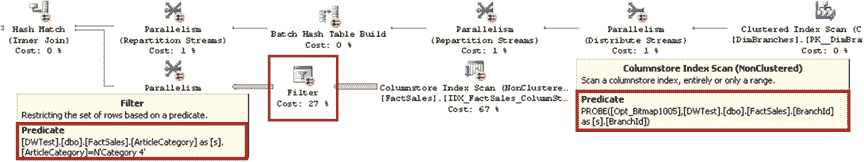
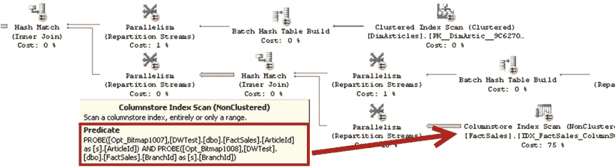
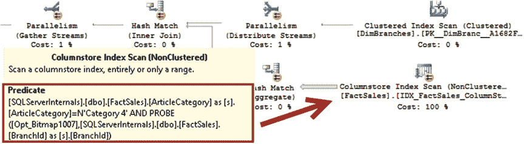

# 列存储索引的设计注意事项与最佳实践


设计高效数据仓库解决方案这一主题非常广泛，无法在本书中完全涵盖。然而，完全回避这样的讨论同样不可行。

## 减小数据行大小

无论使用何种索引技术，数据仓库系统中的大多数 I/O 活动都与扫描事实表数据相关。事实表的高效设计是影响数据仓库性能的关键因素之一。

减小数据行的大小总是有利的，在数据仓库的事实表场景中则更为关键。通过使数据行更小，我们可以减少表在磁盘上的占用空间以及扫描时的 I/O 操作次数。此外，这还能减少数据的内存占用，并因更好地利用内部 CPU 缓存而提高批处理模式执行的效率。

正如你所记得的，减少数据大小的关键因素之一是为值使用正确的数据类型。你可以将布尔值存储在 `int` 数据类型中，或者当值需要精确到分钟时使用 `datetime`，这些都是不良设计的例子。请始终使用能够存储列值并能为数据提供所需精度的最小数据类型。

## 尽可能多地向 SQL Server 提供信息

知识就是力量。`SQL Server` 对数据了解得越多，生成高效执行计划的机会就越大。

不幸的是，列的可空性是最明显但经常被忽视的因素之一。在适当的情况下将列定义为 `NOT NULL` 有助于 `查询优化器`，并且在某些情况下可以减少数据所需的存储空间。它还允许 `SQL Server` 在列存储索引和批处理模式执行期间避免不必要的编码。

以一个 `bigint` 列为例。当该列定义为 `NOT NULL` 时，该值可以放入单个 CPU 寄存器中，因此可以更快地执行对该值的操作。相反，可为 null 的 `bigint` 列需要额外的第 65 位来指示 `NULL` 值。在这种情况下，`SQL Server` 通过使用特殊标记将一些行值（通常是最高或最低的值）存储在主内存中来避免跨寄存器数据存储，以在驻留在 CPU 缓存中的数据中指示这一点。正如你可能猜到的，这种方法在执行期间会增加额外的负载。作为一般规则，在数据仓库环境中最好避免可为空的列。当约束或唯一索引引入的开销可以接受时，使用 `CHECK` 约束以及 `UNIQUE` 约束或索引也是有益的。

## 维护统计信息

创建和维护统计信息是适用于任何 `SQL Server` 系统的良好实践。如你所知，最新的统计信息有助于 `查询优化器` 生成更高效的执行计划。

`列存储索引` 在统计信息方面的行为与 `B-树索引` 不同。`SQL Server` 在创建列存储索引时会创建一个统计信息对象；然而，此后既不会填充也不会更新它。`SQL Server` 在决定是否需要使用列存储索引时，依赖于段信息、`B-树索引`（如果可用）和列级统计信息。

在参与列存储索引并在查询谓词和联接键中使用的列上，创建缺失的列级统计信息是有益的。

请记得在将新数据加载到数据仓库后更新统计信息，保持其最新状态。在非常大的表上，统计信息很少会自动更新。

## 避免在事实表中使用字符串列

通常，应尽量减少在事实表中使用字符串列。字符串数据占用更多空间，并且 `SQL Server` 在批处理模式执行期间处理此类数据时会执行额外的编码。此外，在字符串列上带有谓词的查询可能生成效率较低的执行计划，这些计划也需要


SQL Server 2012 和 2014 相比非字符串列，会分配**显著更大的内存授权**。SQL Server 2012 和 2014 不会将字符串谓词向下推送到执行计划中的最低层运算符。

让我们看一个这种行为的例子。清单 33-13 中的代码向 `dbo.FactSales` 表添加了一个 `ArticleCategory` 列，并使用来自 `dbo.DimArticles` 表的值填充它。作为最后一步，该代码重新创建了列存储索引，并在其中添加了一个新列。显然，你不应该以这种方式设计数据库模式，因为你不想在事实表中保留冗余属性。

***清单 33-13.*** 事实表中的字符串列：表架构变更

```sql
drop index IDX_FactSales_ColumnStore on dbo.FactSales;

alter table dbo.FactSales add ArticleCategory nvarchar(32) not null default '';

go

update t
set t.ArticleCategory = a.ArticleCategory
from dbo.FactSales t join dbo.DimArticles a on
t.ArticleId = a.ArticleId;

create nonclustered columnstore index IDX_FactSales_ColumnStore
on dbo.FactSales(DateId, ArticleId, BranchId, Quantity, UnitPrice, Amount, ArticleCategory);
```

接下来，让我们运行两个类似的查询，用于计算特定分支机构和文章类别的销售总额。查询如清单 33-14 所示。第一个查询使用 `dbo.DimArticle` 维度表进行类别过滤，而第二个查询使用事实表中的一个属性。

***清单 33-14.*** 事实表中的字符串列：测试查询

```sql
select sum(s.Amount) as [Sales]
from dbo.FactSales s join dbo.DimBranches b on
s.BranchId = b.BranchId
join dbo.DimArticles a on
s.ArticleId = a.ArticleId
where
b.BranchNumber = N'3' and
a.ArticleCategory = N'Category 4';

select sum(s.Amount) as [Sales]
from dbo.FactSales s join dbo.DimBranches b on
s.BranchId = b.BranchId
where
b.BranchNumber = N'3' and
s.ArticleCategory = N'Category 4';
```





第一个查询在 SQL Server 2012 中执行的部分执行计划如图 33-23 所示。如你所见，SQL Server 将对 `BranchId` 和 `ArticleId` 列的谓词都向下推送到列存储索引扫描运算符，在执行的非常早期阶段就过滤掉了不必要的行。SQL Server 2014 和 2016 会生成略有不同的计划；但是，它们会使用相同的方法，在列存储索引扫描期间计算谓词。

***图 33-23.** 使用维度表过滤文章类别的查询的执行计划*

表 33-7 显示了在我的环境中这些查询的执行时间。如你所见，SQL Server 2014 和 2016 比 SQL Server 2012 稍快；然而，所有版本的 SQL Server 都运行得高效。

***表 33-7.** 第一个查询的执行时间*

| 版本 | CPU 时间 (ms) | 已用时间 (ms) |
| :--- | :--- | :--- |
| SQL Server 2012 | | |
| SQL Server 2014 | | |
| SQL Server 2016 | | |

对于第二个查询，无论是 SQL Server 2012 还是 2014，都没有将 `ArticleCategory` 列上的字符串谓词向下推送到列存储索引扫描运算符。这两个版本的 SQL Server 都在之后使用了一个额外的筛选运算符。这引入了在索引扫描期间加载不必要行的开销。你可以在图 33-24 中看到第二个查询的部分执行计划。

***图 33-24.** 使用事实表中的字符串属性过滤文章类别的查询的执行计划（SQL Server 2016 之前）*

SQL Server 2016 生成了一个不同的执行计划，它将字符串谓词向下推送到列存储索引扫描运算符，如图 33-25 所示。



***图 33-25.** 使用事实表中的字符串属性过滤文章类别的查询的执行计划（SQL Server 2016）*


