# 第 34 章 ■ 列存储索引

#### 列存储索引类型

如前一章所述，SQL Server 支持几种不同类型的列存储索引。不幸的是，术语很快变得令人困惑且因版本而异。例如，SQL Server 2012/2014 和 SQL Server 2016 中的*非聚集列存储索引*，简而言之，是非常不同的对象；然而，在文档中它们却被称为同一个东西。

**表 34-1** 显示了不同版本的 SQL Server 支持的列存储索引类型。

**表 34-1.** SQL Server 中可用的列存储索引类型
| | **SQL Server 2012** | **SQL Server 2014** | **SQL Server 2016** |
| :--- | :--- | :--- | :--- |
| 堆/B-Tree 聚集索引上的只读非聚集列存储索引<br>（它们使表变为只读） | ✓ | ✓ | ✓ |
| 堆/B-Tree 聚集索引上的可更新非聚集列存储索引 | | ✓ | ✓ |
| 作为表上唯一索引的聚集列存储索引 | | ✓ | ✓ |
| 带有非聚集 B-Tree 索引的聚集列存储索引 | | | ✓ |
| 内存优化表上的聚集列存储索引<br>（将在第 35 章介绍） | | | ✓ |

> **注意** 你可以在 [`msdn.microsoft.com/en-us/library/dn934994.aspx`](https://msdn.microsoft.com/en-us/library/dn934994.aspx) 阅读更多关于不同 SQL Server 版本支持的列存储索引功能。

无论类型如何，列存储索引都有一些共同的限制。它们不能超过 1,024 列，也不能包含稀疏列。你不能将它们定义为 `UNIQUE`，也不能在使用 `FILESTREAM` 或复制的表上使用它们，也不能在索引视图上创建它们。

此外，不支持以下数据类型：`binary`、`varbinary`、`(n)text`、`image`、`(n)varchar(max)`、`timestamp`、`CLR`、`sql_variant` 和 `xml`。另外，SQL Server 2012 不支持以下数据类型：`uniqueidentifier`、精度大于 18 位的 `decimal` 和 `numeric`，或精度大于 2 位的 `datetimeoffset`。

让我们深入了解一下不同类型的列存储索引。

### 只读非聚集列存储索引（SQL Server 2012–2014）

只读非聚集列存储索引在 SQL Server 2012 中引入，并且是该版本唯一支持的列存储索引类型。在本节中，我将它们称为*非聚集列存储索引*（NCCI）；然而，我想重申，它们的实现和行为与 SQL Server 2016 中的非聚集列存储索引不同。

一个非聚集列存储索引最多可以包含 1,024 个非稀疏列。由于索引的性质，列的指定顺序无关紧要；也就是说，数据是按每列存储的。

与 B-Tree 非聚集索引类似，非聚集列存储索引包含一个*行 ID*，它要么是聚集索引键值，要么是堆表中行的物理位置。这种行为允许 SQL Server 使用*列存储索引扫描*操作，然后执行*键查找*。值得再次强调的是，列存储索引不支持查找操作，因为正如你在前一章看到的，这些索引中的数据未排序。

**清单 34-1** 展示了一个查询示例，该查询使用列存储索引扫描和键查找运算符，使用了前一章定义的 `dbo.FactSales` 表。

**清单 34-1.** 触发键查找操作的查询

```sql
select OrderId, Amount, TaxAmt
from dbo.FactSales
where ArticleId = 10
```

**图 34-1** 显示了此查询的执行计划。你可以看到 `OrderId` 列被包含在列存储索引扫描的输出列表中。该列并未在列存储索引中显式定义；但是，它是表中聚集索引键的一部分。

**图 34-1.** 此查询的执行计划

创建列存储索引是一个非常消耗内存的操作。当你在 SQL Server 2012 中创建列存储索引时，它会请求一个内存授予，其大小可以用以下公式粗略估计：

`内存授予请求（MB）= (4.2 * 索引中的列数 + 68) * （并行度） + （索引中的文本列数 * 34）`

例如，上一章清单 33-3 中创建的列存储索引在我的环境中请求了 394 MB 的内存授予，这与公式计算的 `(4.2 * 7 (6 个索引列 + OrderId) + 68) * 4 = 390 MB` 相当接近。内存授予的大小不取决于表的大小。正如你稍后将看到的，SQL Server 以大约每批一百万行的批次处理数据。

在内存不足的情况下，索引创建过程会失败。除了向服务器添加更多内存外，还有两种方法可以解决此问题。第一种是使用 `MAXDOP` 指令降低并行度。


`MAXDOP` 索引选项。虽然此选项降低了查询的内存需求，但索引创建时间会随着 DOP 的降低而成比例增加。

第二个选项是更改 `Resource Governor` 中工作负荷组的 `REQUEST_MAX_MEMORY_GRANT_PERCENT` 属性。默认情况下，查询内存授予的大小限制为可用工作区内存的 25%，你可以在执行 `CREATE INDEX` 语句期间增加此限制。

`SQL Server 2014` 中改进了索引创建算法。与 `SQL Server 2012` 使用匹配服务器或索引 DOP 选项的并行度不同，`SQL Server 2014` 会根据可用内存自动调整 DOP。这种行为降低了索引创建过程因内存不足而失败的可能性。

`非聚集列存储索引`最大的限制在于，带有此类索引的表会变为只读。在索引创建后，你无法更改表中的数据。然而，在数据通常静态且按计划更新的数据仓库环境中，此限制并不那么关键。不幸的是，这一限制阻碍了 `非聚集列存储索引` 在 `SQL Server 2012` 和 `SQL Server 2014` 的运营分析场景中使用。

带有`列存储索引`的表支持`分区切换`，这是将数据导入表中的一个绝佳选项。你可以创建一个`暂存表`，将其用作数据导入的目标，在导入完成后为其添加`列存储索引`，然后作为操作的最后一步，将`暂存表`切换为主只读表中的新分区。清单 34-2 展示了此操作的一个示例。

清单 34-2. 使用暂存表和分区切换将数据导入带有非聚集列存储索引的表

```sql
create partition function pfFacts(int) as range left for values (1,2,3,4,5);

create partition scheme psFacts as partition pfFacts all to ([FG2016]);

go

create table dbo.FactTable
(
    DateId int not null,
    ArticleId int not null,
    OrderId int not null,
    Quantity decimal(9,3) not null,
    UnitPrice money not null,
    Amount money not null,
    constraint PK_FactTable
        primary key clustered(DateId, ArticleId, OrderId)
        on psFacts(DateId)
);

CHAPTER 34 ■ COLUMNSTORE INDEXES

;with N1(C) as (select 0 union all select 0) -- 2 rows
,N2(C) as (select 0 from N1 as T1 cross join N1 as T2) -- 4 rows
,N3(C) as (select 0 from N2 as T1 cross join N2 as T2) -- 16 rows
,N4(C) as (select 0 from N3 as T1 cross join N3 as T2) -- 256 rows
,N5(C) as (select 0 from N4 as T1 cross join N2 as T2) -- 1,024 rows
,IDs(ID) as (select ROW_NUMBER() over (order by (select NULL)) from N5)

insert into dbo.FactTable(DateId, ArticleId, OrderId, Quantity, UnitPrice, Amount)
select ID % 4 + 1, ID % 100, ID, ID % 10 + 1, ID % 15 + 1 , ID % 25 + 1
from IDs;

create nonclustered columnstore index IDX_FactTable_Columnstore
on dbo.FactTable(DateId, ArticleId, OrderId, Quantity, UnitPrice, Amount)
on psFacts(DateId);

create table dbo.StagingTable
(
    DateId int not null,
    ArticleId int not null,
    OrderId int not null,
    Quantity decimal(9,3) not null,
    UnitPrice money not null,
    Amount money not null,
    constraint PK_StagingTable
        primary key
        clustered
        (DateId, ArticleId, OrderId)
        on [FG2016],
    constraint CHK_StagingTable check(DateId = 5)
);

/*** Step 1: Importing data into a staging table ***/

;with N1(C) as (select 0 union all select 0) -- 2 rows
,N2(C) as (select 0 from N1 as T1 cross join N1 as T2) -- 4 rows
,N3(C) as (select 0 from N2 as T1 cross join N2 as T2) -- 16 rows
,N4(C) as (select 0 from N3 as T1 cross join N3 as T2) -- 256 rows
,N5(C) as (select 0 from N4 as T1 cross join N2 as T2) -- 1,024 rows
,IDs(ID) as (select ROW_NUMBER() over (order by (select null)) from N5)

insert into dbo.StagingTable(DateId, ArticleId, OrderId, Quantity, UnitPrice, Amount)
select 5, ID % 100, ID, ID % 10 + 1, ID % 15 + 1 , ID % 25 + 1
from IDs;

/*** Step 2: Creating nonclustered columstore index ***/


# 第 34 章 ■ 列存储索引

```sql
create nonclustered columnstore index IDX_StagingTable_Columnstore
on dbo.StagingTable(DateId, ArticleId, OrderId, Quantity, UnitPrice, Amount)
on [FG2016];
```

/*** 步骤 3：将暂存表切换为主表的新分区 ***/

```sql
alter table dbo.StagingTable switch to dbo.FactTable partition 5;
```

■ **提示** 你可以使用结合了可更新表和带有列存储索引的只读表的分区视图。然而，在 SQL Server 2012 中使用 `UNION ALL` 子句会禁用批处理模式执行。

#### 聚集列存储索引 (SQL Server 2014–2016)

SQL Server 2012 中非聚集列存储索引的只读性质严重影响了该技术的采用。尽管数据分区和分区切换可以帮助规避此限制，但它们需要复杂且往往笨重的实现。

从 SQL Server 2014 开始，你可以使用 `聚集列存储索引`（CCI）以基于列的存储方式存储数据。在 SQL Server 2014 中，CCI 是表中数据的单一实例，带有聚集列存储索引的表不能定义任何其他索引——既不能有 B-Tree 索引，也不能有非聚集列存储索引。然而，在 SQL Server 2016 中，你可以在带有聚集列存储索引的表上定义非聚集 B-Tree 索引。最后，SQL Server 2014 和 2016 都不允许在表上定义触发器。

在 SQL Server 2014 中，除了本章开头列出的限制外，聚集列存储索引还有其他一些限制。表不能引用其他表，也不能被外键约束引用。你无法在 AlwaysOn 可用性组中的可读辅助副本上查询带有聚集列存储索引的表。

SQL Server 2016 移除了这些限制；然而，支持唯一性、引用完整性和主键约束将需要创建非聚集 B-Tree 索引。

仍然有一些功能不适用于聚集列存储索引。例如，复制、更改跟踪和变更数据捕获即使在 SQL Server 2016 中也不受支持。

你可以使用 `CREATE CLUSTERED COLUMNSTORE INDEX` 命令创建聚集列存储索引。你不需要在语句中指定任何列——索引将包含所有表列。正如我们在本章开头讨论的，这对列数据类型增加了进一步的限制。

## 内部结构

聚集列存储索引使用与非聚集列存储索引相同的存储格式，将列存储数据存储在行组中。然而，它们有两个额外的元素来支持数据修改。第一个是 `删除位图`，它指示表中哪些行已被删除。第二个结构是 `增量存储`，它包含新插入的行。增量存储和删除位图都使用 B-Tree 格式存储数据。此外，SQL Server 2016 使用其他几种结构来支持非聚集 B-Tree 索引。我们稍后将讨论这些。

■ **注意** SQL Server 对 `删除位图` 和 `增量存储` 的使用对用户是透明的，这使得相关术语令人困惑。在文档和技术文章中，你经常会看到 `增量存储` 被引用为另一个行组。此外，`删除位图` 通常被认为是 `增量存储` 和/或行组的一部分。为避免混淆，我将在本章中使用以下术语。术语 `行组` 指代以基于列的存储格式存储的数据。我将根据需要明确引用 `增量存储` 和 `删除位图` 为两组独立的内部对象。

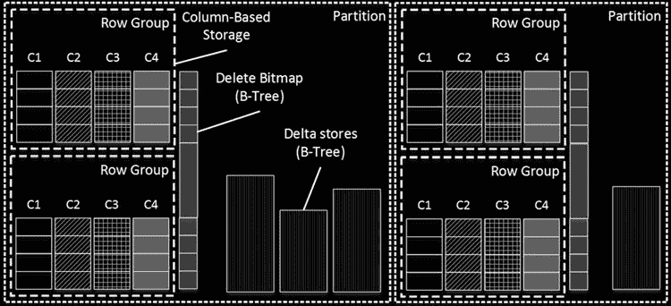

图 34-2 说明了一个具有两个分区的表中聚集列存储索引的结构。每个分区可以有一个 `删除位图` 和多个 `增量存储`。这种结构使得每个分区


# 第 34 章 ■ 列存储索引

自包含且独立于其他分区，这允许您在定义了聚集列存储索引的表上执行分区切换。

**图 34-2.** 聚集列存储索引结构

值得注意的是，删除位图和增量存储是 `按需` 创建的。例如，除非行组中的某些行被删除，否则不会创建删除位图。

每次删除存储在行组中（而非增量存储中）的一行时，SQL Server 都会将有关已删除行的信息添加到删除位图中。原始行本身不发生任何变化，它仍然存储在行组中。然而，SQL Server 在查询执行期间会检查删除位图，并将已删除的行排除在处理之外。

如前所述，当您向列存储索引插入数据时，数据会进入一个使用 B 树格式的增量存储。更新存储在行组中的行并不会改变行数据。这样的更新会触发该行的删除操作（实际上是插入到删除位图中），并将该行的一个新版本插入到增量存储中。但是，对增量存储中行的任何数据修改，其执行方式与常规 B 树索引中的操作相同——即通过更新和删除那里的实际行来完成。您将在本章后面看到这样一个示例。

每个增量存储可以处于 `打开` 或 `关闭` 状态。打开的增量存储接受新行，并允许对数据进行修改和删除。当增量存储达到 1,048,576 行（这是行组可存储的最大行数）时，SQL Server 会将其关闭。另一个名为 `元组移动器` 的 SQL Server 进程每五分钟运行一次，并将关闭的增量存储转换为以基于列的存储格式存储数据的行组。

或者，您可以使用 `ALTER INDEX REORGANIZE` 命令重组索引，以强制将关闭的增量存储转换为行组。虽然这两种方法都实现了将关闭的增量存储转换为行组的相同目标，但它们的实现略有不同。元组移动器是一个在后台运行的单线程进程，能节省系统资源。而索引重组则使用多线程并行运行。这种方法可以显著减少转换时间，但代价是额外的 CPU 负载和内存使用。

**注意** 您可以使用跟踪标志 `T634` 禁用后台的元组移动器进程。

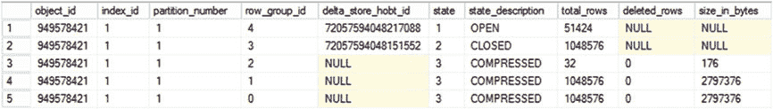

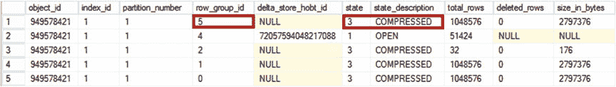

无论是元组移动器还是索引重组，都不会阻止其他会话向表中插入新数据。新数据将被插入到不同的、打开的增量存储中。但是，在操作期间，删除和数据修改操作将被阻塞。在某些情况下，您可以考虑手动强制执行索引重组，以减少执行时间，从而减少锁定时间。

您可以使用 `sys.column_store_row_groups` 视图检查行组和增量存储的状态。图 34-3 展示了该视图的输出，它返回所有列存储索引对象的综合信息。状态为 `OPEN` 或 `CLOSED` 的行对应于增量存储。状态为 `COMPRESSED` 的行对应于以基于列的存储格式存储数据的行组。最后，`deleted_rows` 列提供了存储在删除位图中的已删除行的统计信息。

**图 34-3.** sys.column_store_row_groups 视图输出

如图 35-2 所示，视图输出中的第二行显示了一个尚未被元组移动器进程处理的关闭的增量存储。在元组移动器进程按计划在下一次运行时将关闭的增量存储转换为行组后，情况将发生变化。图 34-4 显示了 SQL Server 2014 中此操作发生后视图的输出。如您所见，转换后的行组的 `row_group_id` 发生了变化。元组移动器创建了一个新的行组，之后便丢弃了关闭的增量存储。值得注意的是


# 第 34 章 ■ 列存储索引

值得注意的是，在 SQL Server 2016 中，旧的行组将以`TOMBSTONE`状态保留在输出中，直到它被释放。

图 34-4. 元组迁移器进程执行后的`Sys.column_store_row_groups`视图输出

## 数据加载

有两种不同类型的数据加载操作可以将数据插入列存储索引。第一种是*批量插入*，它被`BULK INSERT`操作符、`bcp`工具以及其他利用批量插入 API 的应用程序使用。第二种类型称为*流式插入*，指的是不使用批量插入 API 的常规`INSERT`操作。

批量插入操作会在 API 调用中提供批次的行数。如果该大小超过`102,400`行的阈值，SQL Server 会将数据插入到新创建的行组中。根据批次的大小，可能会创建一个或多个行组，而有些行可能会被存储在增量存储中。

表 34-2 展示了不同批次的数据如何在行组和增量存储之间进行分布。

表 34-2. 批量插入期间的批次大小与数据分布

| 批量大小 | 添加到行组的行数（基于列的存储） | 添加到增量存储的行数（基于行的存储） |
| :--- | :--- | :--- |
| 99,000 | | 99,000 |
| 150,000 | | 150,000 |
| 1,048,577 | 1,048,576 | 1 |
| 2,100,000 | 1,048,576; 1,048,576 | 2,848 |
| 2,250,000 | 1,048,576; 1,048,576; 152,848 | |

SQL Server 以段为单位将列存储数据加载到内存中。请记住，段代表一个行组中单列的数据。与加载和处理大量部分填充的段相比，加载和处理数量较少、完全填充的段效率更高。过多的部分填充行组会对 SQL Server 性能产生负面影响。本章稍后将提供一个这样的例子。

如果你向具有聚集列存储索引的表批量加载数据，通过选择能被`1,048,576`行整除的批次大小，可以达到最佳效果。这将确保每个批次产生一个或几个完全填充的行组，减少表中的行组总数，并提高查询性能。然而，不要超过这个数字，因为单个批次将无法容纳在一个行组内。

对于非批量操作，批量大小就不那么重要了。流式插入会直接进入增量存储。在某些情况下，当插入批次的大小接近或超过`1,048,576`行时，SQL Server 仍然可以动态创建行组，其方式类似于批量插入。但是，你不应该依赖这种行为。

## 增量存储与删除位图

让我们分析一下增量存储和删除位图的结构，并查看其行的格式。第一步，我们创建一个表，向其中填充数据，并为其定义一个聚集列存储索引。最后，我们将通过`sys.column_store_segments`和`sys.column_store_row_groups`视图查看段和行组。

代码清单 34-3 展示了完成这些工作的代码。在索引创建阶段，我使用了`MAXDOP=1`选项，以最小化索引中部分填充行组的数量。

代码清单 34-3. 增量存储与删除位图：测试表创建

```sql
create table dbo.CCI
(
    Col1 int not null,
    Col2 varchar(4000) not null,
);

;with N1(C) as (select 0 union all select 0) -- 2 rows
,N2(C) as (select 0 from N1 as T1 cross join N1 as T2) -- 4 rows
,N3(C) as (select 0 from N2 as T1 cross join N2 as T2) -- 16 rows
,N4(C) as (select 0 from N3 as T1 cross join N3 as T2) -- 256 rows
,N5(C) as (select 0 from N4 as T1 cross join N4 as T2) -- 65,536 rows
,N6(C) as -- 1,048,592 rows
(
    select 0 from N5 as T1 cross join N3 as T2
    union all
    select 0 from N3
)
,IDs(ID) as (select row_number() over (order by (select null)) from N6)
insert into dbo.CCI(Col1,Col2)
    select ID, 'aaa' from IDs;

create clustered columnstore index IDX_CS_CLUST on dbo.CCI
    with (maxdop=1);

select g.state_description, g.row_group_id, s.column_id
```


# Delta Store 与 Delete Bitmap 分析

`,s.row_count, s.min_data_id, s.max_data_id, g.deleted_rows` from `sys.column_store_segments` s join `sys.partitions` p on s.`partition_id` = p.`partition_id` join `sys.column_store_row_groups` g on p.`object_id` = g.`object_id` and s.`segment_id` = g.`row_group_id` where p.`object_id` = `object_id`(N'dbo.CCI') order by g.`row_group_id`, s.`column_id`;

**图 34-5.** 增量存储与删除位图：`sys.column_store_segments` 和 `sys.column_store_row_groups` 输出

**图 34-5** 展示了来自 `sys.column_store_segments` 和 `sys.column_store_row_groups` 视图的输出。该列存储索引包含两个行组，并且没有增量存储或删除位图。

您可以从满足 `column_id=1` 的行所在的两个行组中，在 `min_data_id` 和 `max_data_id` 列中看到存储的 `Col1` 值。

**代码清单 34-4.** 增量存储与删除位图：数据修改

```sql
insert into dbo.CCI(Col1,Col2)
values (2000000,replicate('c',4000)), (2000001, replicate('d',4000));

delete from dbo.CCI
where Col1 in
( 100 -- 行组 0
,16150 -- 行组 1
,2000000 -- 新插入的行（增量存储）
);

update dbo.CCI
set Col2 = replicate('z',4000)
where Col1 = 2000001; -- 新插入的行（增量存储）
```

现在，是时候查找增量存储和删除位图所使用的数据页了。我们将使用未公开的 `sys.dm_db_database_page_allocations` 数据管理函数，如 **代码清单 34-5** 所示。此函数返回有关对象页分配的信息。

**代码清单 34-5.** 增量存储与删除位图：分析页分配

```sql
select object_id, index_id, partition_id, allocation_unit_type_desc as [Type]
,is_allocated,is_iam_page,page_type,page_type_desc
,allocated_page_file_id as [FileId]
,allocated_page_page_id as [PageId]
from sys.dm_db_database_page_allocations(db_id(),object_id('dbo.CCI'),null,null,'DETAILED')
```

您可以在 **图 34-6** 中看到此查询的输出。如您所知，SQL Server 将列存储段存储在 `LOB_DATA` 分配单元中。增量存储和删除位图则使用 `IN_ROW_DATA` 分配。

**图 34-6.** 增量存储与删除位图：分配单元

让我们使用 `DBCC PAGE` 命令查看数据页，代码如 **代码清单 34-6** 所示。显然，数据库、文件和页 ID 在您的环境中会有所不同。

**代码清单 34-6.** 增量存储与删除位图：分析页面数据

```sql
dbcc traceon(3604); -- 将输出重定向到控制台

dbcc page -- 分析页面内容
( 9 -- 数据库 ID
,1 -- 文件 ID
,306 -- 页 ID
,3 -- 输出样式
)
```

**图 34-7** 显示了作为增量存储页的数据页的部分内容。如您所见，SQL Server 以常规行存储格式存储数据。除了两个表列之外，还有一个内部列 `CSILOCATOR`。`CSILOCATOR` 被用作增量存储中行的内部唯一标识符。

**图 34-7.** 增量存储与删除位图：增量存储数据页

最后，值得注意的是，我们在创建聚集列存储索引之后插入又删除的 `Col1=2000000` 行，不存在于增量存储中。SQL Server 在 B-Tree 增量存储中删除（和更新）行的方式与常规 B-Tree 表相同。

您可以使用相同的方法来检查删除位图数据页的内容。在我的例子中，页 ID 是 308。

**图 34-8** 显示了 `DBCC PAGE` 命令的部分输出。如您所见，删除位图包含两个唯一标识一行的列。第一列是 *行组 ID*，第二列是行在段中的偏移量。不要因为列名与表列名匹配而感到困惑。`DBCC PAGE` 使用表元数据来准备输出。

**图 34-8.** 增量存储与删除位图：删除位图页

值得注意的是，在 SQL Server 2014 中，增量存储是页面压缩的。正如我们在 **第 4 章** 中已经讨论过的，压缩会增加行大小，并且在某些极端情况下，会禁止创建具有大量列的列存储索引。为了解决这个问题，SQL Server 2016 中移除了增量存储的页面压缩。

另一方面，删除位图在 SQL Server 2014 和 2016 中都使用页面压缩。

# 列存储索引维护

可更新的列存储索引需要维护，这与常规 B-Tree 索引类似，尽管进行维护的原因不同。列存储索引不会变得碎片化；但是，它们可能会受到大量部分填充的行组的影响。另一个问题是查询执行期间扫描增量存储和删除位图的开销。

让我们运行几个测试，并详细查看涉及的问题。

## 过多的部分填充行组

对于此测试，我创建了两个表，其结构类似于我们在上一章测试归档压缩时在 **代码清单 33-9** 中定义的表。我使用 `bcp` 实用程序批量插入了近 6200 万行，分别使用 1,000,000 行批次和 102,500 行批次。

**图 34-9** 展示了导入后两个表中的行组情况。

**图 34-9.** 批量导入后的行组

在测试期间，我运行了 **代码清单 33-10** 中的查询。该查询要求 SQL Server 通过扫描所有行组和列段，对来自表的 20 列执行 `MAX()` 聚合。

**表 34-3** 说明了针对两个表的查询的执行时间和 I/O 操作次数。

如您所见，针对具有部分填充行组的表的查询执行时间要长得多。

**表 34-3.** 完全填充与部分填充行组表的执行统计信息

| 指标 | 完全填充的行组 | 部分填充的行组 |
| :--- | :--- | :--- |
| **SQL Server 2014** | | |
| 已用时间 / CPU 时间 | 1,735 ms / 6,202 ms | 2,450 ms / 7,418 ms |
| 逻辑读取 | 177,812 | 192,533 |
| **SQL Server 2016** | | |
| 已用时间 / CPU 时间 | 1,405 ms / 5,500 ms | 1,603 ms / 6,162 ms |
| 逻辑读取 | 118,197 | 192,533 |

值得注意的是，批量插入的性能也受到较小批次大小的影响。在 1,000,000 行批次的情况下，我的系统能够以每秒约 143,750 行的速度插入，而在 102,500 行批次的情况下为每秒 129,830 行。

以较小的批次加载数据会将新数据放入增量存储，随后产生完全填充的行组。但是，插入性能会受到严重影响。例如，当我以 99,999 行批次插入数据时，我的系统只能以每秒 55,500 行的速度插入。

## 大型增量存储

对于下一步，让我们看看大型增量存储如何影响查询性能。SQL Server 需要在查询执行期间扫描这些增量存储。

对于此测试，我将 1,000,000 行以较小的批次插入到上一个测试中第一个表（行组已完全填充的表）的增量存储中。之后，我重建了列存储索引，比较了重建索引前后测试查询的执行时间。


# 第 34 章 ■ 列存储索引

索引重建过程将所有数据从增量存储区移动到了行组中。您可以在图 34-10 中查看索引重建之前（左侧）和之后（右侧）的行组及增量存储区状态。

**图 34-10.** 插入 1,000,000 行后的行组和增量存储区

表 34-4 展示了测试查询在两种场景下的执行时间，并显示了在查询执行期间扫描大型增量存储区所带来的额外开销。值得注意的是，这个开销在`SQL Server 2016`中更大，因为其增量存储区未使用页面压缩，需要更多的 I/O 操作来扫描。

**表 34-4.** 执行时间与增量存储区大小

| | **空的增量存储区** | **增量存储区中有 1,000,000 行** |
| :--- | :--- | :--- |
| | **(耗时/CPU 时间)** | **(耗时/CPU 时间)** |
| `SQL Server 2014` | 1,767 ms / 6,235 ms | 2,557 ms / 8,781 ms |
| `SQL Server 2016` | 1,507 ms / 5,723 ms | 2,916 ms / 8,512 ms |

## 大型删除位图

最后，让我们看看删除位图如何影响查询性能。为此测试，我从一个表中删除了将近 30,000,000 行数据。

您可以在图 34-11 中看到行组的信息。

**图 34-11.** 删除 30,000,000 行后的行组

测试查询需要验证在查询执行期间行没有被删除。与之前的测试类似，这增加了相当大的开销。表 34-5 显示了测试查询的执行时间，并将其与数据删除前的查询执行时间进行了比较。

**表 34-5.** 执行时间与删除位图

| | **空的删除位图** | **包含大量行的删除位图** |
| :--- | :--- | :--- |
| | **(耗时/CPU 时间)** | **(耗时/CPU 时间)** |
| `SQL Server 2014` | 1,767 ms / 6,235 ms | 3,995 ms / 11,421 ms |
| `SQL Server 2016` | 1,507 ms / 5,723 ms | 3,049 ms / 10,611 ms |

## 索引维护选项

您可以通过重建列存储索引来解决所有这些性能问题，可以使用`ALTER INDEX REBUILD`命令触发重建。索引重建会强制`SQL Server`从索引中物理删除已删除的行，并合并增量存储区和行组的数据。所有列段都会被重新创建，行组将被完全填充。

与创建索引类似，索引重建过程非常**资源密集型**。此外，与常规索引重建过程一样，它会对表持有架构修改（`Sch-M`）锁，从而阻止其他会话访问该表。遗憾的是，列存储索引重建是一项**离线**操作，因此您不能对其使用`ONLINE=ON`子句。

与 B-Tree 索引类似，您可以通过利用`表/索引分区`来减轻索引重建的开销。您可以基于分区重建索引，并且只对具有易变数据的分区进行重建。在大多数数据仓库解决方案中，旧的事实表数据相对静态，ETL 过程通常只加载新数据。在此场景中，按日期分区可以将修改范围限定在一个或极少数的分区内。这可以显著帮助您降低索引重建的开销。

正如我们之前讨论的，列存储索引支持在线索引重新组织过程，您可以使用`ALTER INDEX REORGANIZE`命令触发它。这里的`索引重新组织`一词有点模糊；您可以将其视作按需运行的元组移动器进程。在`SQL Server 2014`中，默认情况下，索引重新组织执行的唯一操作是将数据从已关闭的增量存储区压缩并移动到行组中。删除位图和开放的增量存储区保持不变。

在`SQL Server 2016`中，索引重新组织还会执行额外的碎片整理，如下所示：

-   它会从逻辑上删除了 10%或更多行的行组中移除已删除的行。
-   它会合并已关闭的行组，保持总行数小于或等于 1,024,576。

这两个过程可以一起执行。例如，如果您有两个行组，其中一个有


# 第 34 章 ■ 列存储索引

总计 500,000 行（包含 100,000 条已删除行）和另一个行组总计 750,000 行（包含 250,000 条已删除行），碎片整理过程会将它们合并到另一个行组中，总计 900,000 行，并物理移除所有已删除行。

你可以使用 `ALTER INDEX REORGANIZE WITH (COMPRESS_ALL_ROW_GROUPS = ON)` 语句来关闭并压缩所有打开的行组。在此操作期间，SQL Server 不会合并行组。

与单线程的元组移动器进程不同，`ALTER INDEX REORGANIZE` 操作在运行时会使用所有可用的系统资源。这可以显著加快执行过程，并缩短其他会话无法修改或删除表中数据的时间。再次值得注意的是，在此期间插入进程不会被阻塞。

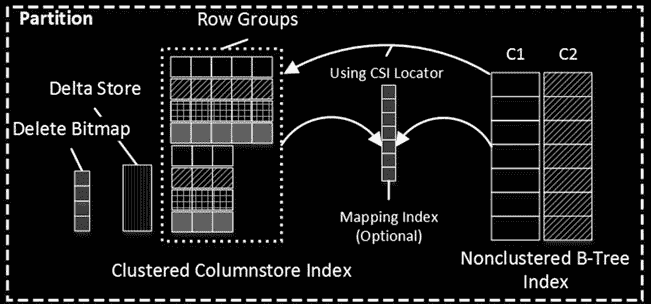

列存储索引的维护策略应取决于数据的易变性和系统中实施的 ETL 流程。当表中有大量已删除行和/或大量部分填充的行组时，你应该重建索引。

在 ETL 流程完成后，对于那些在打开的增量存储中仍保留大量行的分区进行重建也是有益的，特别是当 ETL 流程未使用批量插入 API 时。

## 非聚集 B 树索引 (SQL Server 2016)

正如我已经提到的，在 SQL Server 2014 中，聚集列存储索引是表中数据的唯一副本。你无法在那里创建任何其他列存储或 B 树索引。此限制在 SQL Server 2016 中已被移除，该版本允许你在具有聚集列存储索引的表上定义非聚集 B 树索引。

简而言之，非聚集 B 树索引允许你优化针对这些表的 OLTP 查询。考虑一种情况：你将一个系统中所有的*当前*和*历史*数据存储在一起，该系统处理针对当前热点数据的 OLTP 活动以及针对历史数据的分析/报告活动。在此模式中，常见的实现之一是使用分区视图，这些视图将历史数据存储在具有基于列存储的表中。

然而，仍然存在需要对历史数据运行 OLTP 查询的情况。例如，在销售点系统中，客户可能希望查找旧的订单记录。非聚集 B 树索引可以帮助你优化这些查询，避免扫描列存储索引。

非聚集 B 树索引还允许你在具有聚集列存储索引的表上定义并强制实施主键和唯一约束。它们还允许此类表被外键约束引用或引用外键约束。所有这些都有助于提高数据仓库系统中的数据质量。

当具有聚集列存储索引的表被分区时（通常如此），SQL Server 也会对非聚集 B 树索引进行分区，使其与列存储索引对齐。除非你在索引键中包含分区列，否则这可能会阻止你定义索引的唯一性。

图 34-12 展示了已创建非聚集 B 树索引的聚集列存储索引的分区。非聚集 B 树索引使用列存储索引定位器作为 `row-id`，该定位器引用聚集列存储索引中的行。

*图 34-12. 具有聚集列存储和非聚集 B 树索引的表的分区*

在某些情况下，列存储索引中的行可能会被移动到不同的位置；例如，当增量存储被压缩或行组被合并时。当这种情况发生时，SQL Server 不会更新非聚集索引中的 `row-id`，而是使用另一个称为 `映射索引` 的内部组件，该组件包含有关旧行和新行位置的信息。

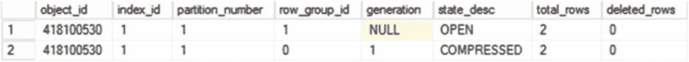

# 第 34 章 ■ 列存储索引

让我们来看下面的例子。清单 34-7 展示了创建一个具有聚集列存储索引和非聚集 B 树索引的表，并向其中填充一些数据的代码。

***清单 34-7.*** 使用非聚集 B 树索引的查询

```
create table dbo.CCIWithNI
(
Col1 int not null,
Col2 int not null,
Col3 int not null
);

insert into dbo.CCIWithNI(Col1, Col2, Col3)
values(1,1,1), (2,2,2);

create clustered columnstore index CCI_CCIWithNI on dbo.CCIWithNI;

insert into dbo.CCIWithNI(Col1, Col2, Col3)
values(100,100,100),(200,200,200);

create nonclustered index IDX_CCIWithNI_Col3 on dbo.CCIWithNI(Col3);
```

在这个阶段，列存储索引将包含一个压缩的行组和一个打开的增量存储区。你可以使用 SQL Server 2016 的新数据管理视图 `sys.dm_db_column_store_row_group_physical_stats` 来检查它，该视图提供了列存储索引中行组的信息。

清单 34-8 展示了使用此视图的查询。图 34-13 展示了该查询的输出。

***清单 34-8.*** 分析索引中的行组

```
select object_id, index_id, partition_number, row_group_id, generation, state_desc
, total_rows, deleted_rows
from sys.dm_db_column_store_row_group_physical_stats
where object_id = object_id(N'dbo.CCIWithNI');
```

***图 34-13.*** 列存储索引行组

另一个新的 SQL Server 2016 视图——`sys.internal_partitions`——提供了关于内部列存储索引对象的信息。你可以在清单 34-9 中看到使用此视图的查询。

***清单 34-9.*** 列存储索引内部对象

```
select ip.object_id, ip.index_id, ip.partition_id, ip.row_group_id, ip.internal_object_type
, ip.internal_object_type_desc, ip.rows, ip.data_compression_desc, ip.hobt_id
from sys.internal_partitions ip
where ip.object_id = object_id(N'dbo.CCIWithNI');
```

图 34-14 展示了此查询的输出。如你所见，在此阶段，聚集列存储索引具有增量存储区和删除位图，但没有映射索引。

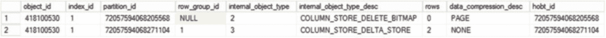
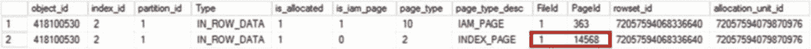
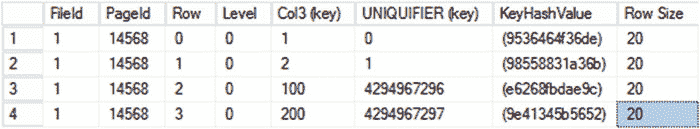

第 34 章 ■ 列存储索引

***图 34-14.*** 列存储索引内部对象

让我们来看看非聚集 B 树索引的内部结构。清单 34-10 显示了一个返回索引页面分配信息的查询。它使用非聚集索引 ID（2）作为调用的参数。图 34-15 显示了该查询的输出。

***清单 34-10.*** 获取页面分配信息

```
select object_id, index_id, partition_id, allocation_unit_type_desc as [Type], is_allocated
, is_iam_page, page_type, page_type_desc, allocated_page_file_id as [FileId]
, allocated_page_page_id as [PageId], rowset_id, allocation_unit_id
from sys.dm_db_database_page_allocations(db_id(), object_id('dbo.CCIWithNI'), 2, null, 'DETAILED')
where is_allocated = 1;
```

***图 34-15.*** 非聚集索引页面分配

现在，当我们知道了索引的文件和页面 ID 后，就可以使用 `DBCC PAGE` 命令对其进行检查，如清单 34-11 所示。显然，在你的环境中运行前面的查询时，你会得到不同的值。

***清单 34-11.*** 分析索引页面

```
dbcc traceon(3604); -- 将输出重定向到控制台
dbcc page -- 分析页面内容
( 10 -- 数据库 Id
, 1 -- FileId
, 14568 -- PageId
, 3 -- 输出样式
);
```

图 34-16 展示了来自索引页的数据。`DBCC PAGE` 错误地假设第二列索引列是唯一标识符。实际上，此列被称为列存储索引的 `original locator`，它是一个八字节的值，高四位字节是 `row_group_id`，低四位字节是行组内的偏移量。例如，十进制值 4,294,967,297 的十六进制格式为 `0x0000 0001 0000 0001`，对应于 `row_group_id=1` 和 offset=1。

# 第 34 章 ■ 列存储索引

***图 34-16.** 非聚集索引页*

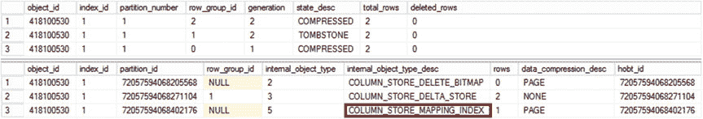

让我们运行 `ALTER INDEX REORGANIZE` 语句，关闭并压缩增量存储，如清单 34-12. 所示。

***清单 34-12.*** 重组索引
```sql
alter index CCI_CCIWithNI on dbo.CCIWithNI reorganize
with (compress_all_row_groups = on);
```

如果你再次查看列存储索引的行组和内部对象，使用清单 34-9 和 34-10 的代码，你会看到如图 34-17. 所示的输出。如你所见，增量存储现在已被压缩到新的行组中（旧行组处于 `TOMBSTONE` 状态，最终将被释放）。此外，SQL Server 创建了一个映射索引来指示来自旧增量存储的行已被移动。

***图 34-17.** ALTER INDEX REORGANIZE 后的行组和内部对象*

值得一提的是，如果你再次查看非聚集索引页，行的行 ID 将不会改变。SQL Server 将使用映射索引来定位行的新位置。

在内部，映射索引可以跟踪单个行的移动以及多行移动和行组 ID 的变化。如你所见，在我们的例子中，映射索引中只有一行，即使旧的增量存储有两行。

当列存储索引中的一行被移动时，SQL Server 会在列存储索引中的一个内部可空列中跟踪该行的 `original locator`。当你向表添加第一个非聚集 B-Tree 索引时，会创建此列。此 `original locator` 值唯一地标识非聚集 B-Tree 索引中的对应行，并在例如从表中删除行时使用。`original locator` 值在行被移动之前不会填充。

■ **注意** 如果你检查增量存储数据页的内容或使用 `sys.column_store_segments` 视图查看列存储索引段信息，你可以看到 `original locator` 列。该列的 `column_id` 为 `65,535`。

查询优化器可以对执行点查找或小范围扫描的 OLTP 查询使用非聚集 B-Tree 索引。在非聚集索引不覆盖查询的情况下，SQL Server 将从聚集列存储索引获取数据。此操作在执行计划中显示为 `key lookup`，尽管它与在聚集 B-Tree 索引上执行的 `key lookup` 不同。

清单 34-13 展示了一个可以从我们之前定义的 `IDX_CCIWithNI_Col3` 索引中受益的查询。图 34-18 展示了此查询的执行计划，假设你向表中填充了足够多的数据，使得 `nonclustered index seek` 比列存储索引扫描更高效。或者，你可以使用 `WITH (INDEX=IDX_CCIWithNI_Col3)` 提示强制使用此执行计划。

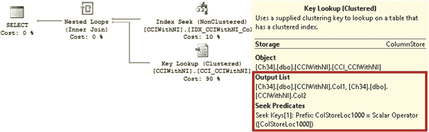

***清单 34-13.*** 使用非聚集 B-Tree 索引的查询
```sql
select Col1, Col2, Col3
from dbo.CCIWithNI
where Col3 = 42
```

***图 34-18.** 带有非聚集 B-Tree 索引查找的执行计划*

非聚集 B-Tree 索引需要以与 B-Tree 表上的索引相同的方式进行维护。值得注意的一点是，重建聚集列存储索引会重新排列行组中的行，改变它们的位置。作为此操作的一部分，SQL Server 将重建非聚集 B-Tree 索引并删除映射索引。

#### 可更新的非聚集列存储索引 (SQL Server 2016)

SQL Server 2016 支持在 B-Tree 表上的可更新非聚集列存储索引。当您需要针对具有繁重 OLTP 工作负载的表运行报告/分析查询时，这些索引在运营分析场景中可能是有益的。您可以将需要显示带有最新信息的运营仪表板的系统视为一个例子。

尽管名称如此，SQL Server 2016 中的非聚集列存储索引与那些


在 SQL Server 2012/2014 的实现中。与聚集列存储索引类似，它们使用增量存储和删除位图来支持数据修改。然而，它们的增量存储不受 1,048,576 行的限制，当你在元组移动器执行之间插入大量行时，最多可以增长到约 3350 万行 (2²⁵)。

还有另一种称为 `delete buffer` 的结构，用作有关已删除行信息的临时存储。它减少了 `delete bitmap` 管理会为 OLTP 事务引入的开销。

在内部，`delete buffer` 被实现为一个 B-Tree 索引，其结构模拟了表的行 ID，该 ID 要么是聚集索引键，要么是堆表中行的位置。这种方法使 SQL Server 能够避免在 `DELETE` 和 `UPDATE` 操作期间查找列存储索引行定位器（该操作在 `delete bitmap` 中使用）。

元组移动器进程在 `ALTER INDEX REORGANIZE` 命令期间，或当 `delete buffer` 中的行数超过 1,048,576 时，根据 `delete buffer` 中的数据更新 `delete bitmap`。在任何给定时间点，`delete buffer` 和 `delete bitmap` 的并集代表了索引中所有已删除的行。

图 34-19 展示了带有非聚集列存储索引的 B-Tree 表分区的所有组件。

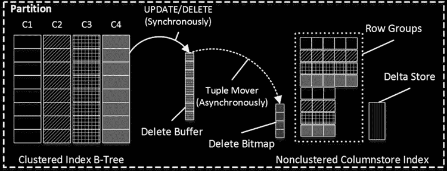

**图 34-19.** 带有非聚集列存储索引的表分区

代码清单 34-14 展示了创建具有 B-Tree 聚集索引的表并向其中插入三行的代码。作为下一步，该代码创建了一个非聚集列存储索引，并从表中删除了一行。最后，该代码检查了列存储索引中行组和内部分区的状态。

**代码清单 34-14.** 非聚集列存储索引：表创建

```sql
create table dbo.CIWithNCI
(
    Col1 int not null,
    Col2 int not null,
    Col3 int not null,
    constraint PK_CIWithNCI
        primary key clustered(Col1, Col2)
);

insert into dbo.CIWithNCI(Col1, Col2, Col3)
    values(1,10,100), (2, 20, 200), (3, 30, 300);

create nonclustered columnstore index NCI_CIWithNCI
    on dbo.CIWithNCI(Col2, Col3);

delete from dbo.CIWithNCI where Col1 = 3;

select object_id, index_id, partition_number, row_group_id
    ,generation, state_desc, total_rows, deleted_rows
from sys.dm_db_column_store_row_group_physical_stats
where object_id = object_id(N'dbo.CIWithNCI');

select ip.object_id, ip.index_id, ip.partition_id, ip.row_group_id, ip.internal_object_type
    ,ip.internal_object_type_desc, ip.rows, ip.data_compression_desc, ip.hobt_id
from sys.internal_partitions ip
where ip.object_id = object_id(N'dbo.CIWithNCI');
```

图 34-20 展示了两个 `SELECT` 语句的输出结果。如你所见，`delete buffer` 中有一行已删除的数据；然而，`delete bitmap` 是空的。同样值得注意的是，SQL Server 会预分配额外的 `delete buffer`，以减少在元组移动器执行期间切换缓冲区的开销。

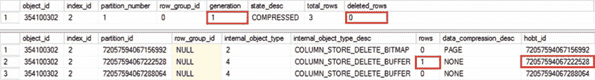
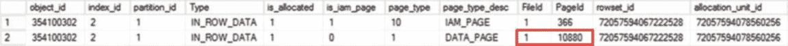

**图 34-20.** 行组状态和内部分区

让我们来检查 `delete buffer` 的结构。第一步，我们需要使用 `sys.dm_db_database_page_allocations` 函数来定位属于它的数据页。我们可以使用 `delete buffer` 的 `hobt_id` 来过滤输出，如代码清单 34-15 所示。显然，当你运行此示例时，你会有一个不同的 `hobt_id`。

**代码清单 34-15.** 非聚集列存储索引：获取 delete buffer 的 page_id

```sql
select object_id, index_id, partition_id, allocation_unit_type_desc as [Type], is_allocated
    ,is_iam_page, page_type, page_type_desc, allocated_page_file_id as [FileId]
    ,allocated_page_page_id as [PageId], rowset_id, allocation_unit_id
from sys.dm_db_database_page_allocations(db_id(),object_id('dbo.CIWithNCI'),null,null
    ,'DETAILED')
where is_allocated = 1 and rowset_id in (72057594067222528)
```


图 34-21 展示了此查询的输出结果。

### 图 34-21. 删除缓冲区页面分配

现在我们知道了文件和页面 ID，让我们使用 `DBCC PAGE` 命令来查看删除缓冲区的内部结构，如清单 34-16 所示。

### 清单 34-16. 非聚集列存储索引：分析删除缓冲区数据页

```
dbcc traceon(3604); -- 将输出重定向到控制台

dbcc page -- 分析页面内容
( 10 -- 数据库 ID
,1 -- 文件 ID
,10880 -- 页面 ID
,3 -- 输出样式
)
```

图 34-22 显示了包含行数据的部分输出。如您所见，它包含三列。

请忽略列名—— `DBCC PAGE` 是从表元数据中获取它们的，这不适用于删除缓冲区结构。

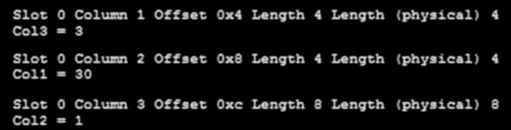

## 第 34 章 ■ 列存储索引

### 图 34-22. 删除缓冲区数据页

最左侧的前两列与聚集索引的结构相匹配。最后一列表示该行被删除时的列存储索引代数值。这有助于 SQL Server 隔离被删除行可能所属的行组。

与任何其他索引一样，非聚集列存储索引在数据修改时会引入开销。`INSERT` 操作要求 SQL Server 将行插入到增量存储区中。`DELETE` 操作会填充删除缓冲区。最后，`UPDATE` 操作会同时执行这两个动作。

在某些情况下，您可以通过在索引上定义筛选器来减少开销。筛选条件的要求与常规的 B-Tree 筛选索引相同，并支持简单的比较逻辑。

可以定义基于静态条件的筛选器；例如，`OrderStatus='COMPLETED'`。但是，不能使用函数调用和非确定性表达式，例如 `OrderDate < DATEADD(HOUR,-24,GETUTCDATE())`。

另一个有用的选项是 `COMPRESSION_DELAY`，它允许您指定一个时间间隔（以分钟为单位），表示行组在被压缩之前应保持在 `CLOSED` 状态的时间长度。考虑一个处理高插入速率并在之后更新数据时执行某些处理的系统。将 `COMPRESSION_DELAY` 设置为超过典型处理时间的值，将排除旧的（已删除的）行版本参与压缩，从而提高列存储索引的性能。

#### 元数据

除了我们已经在前一章讨论过的 `sys.column_store_segments` 和 `sys.column_store_dictionaries` 视图之外，SQL Server 2014 和 2016 还提供了几个目录和数据管理视图。让我们详细看看它们。

#### sys.column_store_row_groups (SQL Server 2014–2016)

`sys.column_store_row_groups` 视图返回有关列存储索引中行组的信息。在本章中，您已经多次看到该视图的实际应用。

输出中的列表示以下内容：

- `object_id` 和 `index_id` 提供有关行组所属对象和索引的信息。
- `partition_number` 是表中分区的编号。
- `row_group_id` 是分区内行组的 ID。
- `delta_store_hobt_id` 是打开的增量存储区的 `hobt_id`。
- `state` 和 `state_description` 显示行组的状态。
- `total_rows` 和 `deleted_rows` 显示行组中总行数和已删除行数。
- `size_in_bytes` 表示行组在磁盘上的大小。

您应该监控行组中的总行数和已删除行数，并在需要时重建或重组索引。您应该记得，较小的行组和行组中大量的已删除行会对查询性能产生负面影响。

#### sys.dm_db_column_store_row_group_physical_stats (SQL Server 2016)

`sys.dm_db_column_store_row_group_physical_stats` 视图也返回有关列存储索引中行组的信息。输出中的某些列与 `sys.column_store_row_groups` 视图相匹配。


# 第 34 章 ■ 列存储索引

## sys.internal_partitions (SQL Server 2016)

`sys.internal_partitions` 视图提供有关内部列存储对象的信息，例如删除位图、删除缓冲区、增量存储和映射索引。我们在本章中已使用此视图。

输出中的列代表以下内容：

`object_id`、`index_id`、`partition_id` 和 `partition_number` 提供有关内部列存储对象的对象、索引和分区的信息。

`internal_object_type` 和 `internal_object_type_desc` 显示内部对象的类型。

`row_group_id` 指示增量存储的行组。对于所有其他按分区存在的对象类型，此列为 NULL。

`rows` 提供对象中的行数。

`data_compression` 和 `data_compression_desc` 提供有关内部对象数据压缩的信息。

此视图对于列存储索引的低级别监控非常有用。例如，映射索引或删除缓冲区中存在大量行可能表明重建索引会带来好处。值得注意的是，重建索引时会重新创建所有内部对象。

## sys.dm_db_column_store_row_group_operational_stats (SQL Server 2016)

`sys.dm_db_column_store_row_group_operational_stats` 视图为你提供关于列存储索引使用情况的低级别统计信息，并按行组返回信息。输出包括以下列：

`object_id`、`index_id`、`partition_number` 和 `row_group_id` 指示输出中的行组。

`scan_count` 和 `delete_buffer_scan_count` 指示自上次 SQL Server 重启以来，行组和删除缓冲区被扫描的次数。

`index_scan_count` 显示分区被扫描的次数。输出中同一分区的所有行组的此值相同。

`rowgroup_lock_count`、`rowgroup_lock_wait_count` 和 `rowgroup_lock_wait_in_ms` 提供自上次 SQL Server 重启以来的累积锁定相关统计信息。

#### 设计考虑

在列存储索引和 B 树索引之间做选择取决于几个因素。然而，最重要的因素是系统中的工作负载类型。这些索引针对不同的用例，各有其优缺点。

列存储索引在需要扫描表中大量数据的数据仓库工作负载中表现出色。然而，对于需要通过点查找或小范围扫描操作来选择一行或少数几行的情况，它们并不适合。索引扫描是列存储索引支持的唯一访问方法，即使你的查询只需要从表中选择一行，SQL Server 也会扫描所有数据。可以通过分区和段消除来减少要扫描的数据量。但无论哪种情况，扫描的效率都远低于使用 B 树索引的查找操作。

大多数大型数据仓库系统都将受益于列存储索引，尽管其实现需要一些工作才能充分发挥其优势。你通常需要更改一个视图；然而，有几列额外的列在分析和故障排除时可能很有用。

输出中的列代表以下内容：

`object_id`、`index_id`、`partition_number`、`row_group_id`、`delta_store_hobt_id`、`has_vertipaq_optimization` 和 `creation_time` 提供有关行组以及打开的增量存储的 `hobt_id` 的信息。

`state` 和 `state_description` 显示行组的状态。

`total_rows`、`deleted_rows` 和 `size_in_bytes` 提供有关行数和行组大小的信息。

`transition_to_compressed_state` 提供行组被压缩的原因。

`trim_reason` 指示行组少于 1,048,576 行的原因。

`generation` 显示创建行组的序列号。

你可以使用 `transition_to_compressed_state` 和 `trim_reason` 列来对系统中列存储索引具有大量部分填充行组的情况进行故障排除。


# 第 34 章 ■ 列存储索引

数据库架构需要适配星型或雪花型模式，并/或对事实表进行规范化处理并从中移除字符串属性。在`SQL Server 2012`的情况下，你需要修改 ETL 流程以应对非聚集列存储索引的只读限制，并且通常需要重构查询以利用批处理模式执行。

聚集列存储索引简化了转换过程。你可以继续使用现有的 ETL 流程，并将数据直接插入事实表。然而，这种方法存在一个隐藏的风险。尽管聚集列存储索引是完全可更新的，但它们是为大型批量加载操作优化的。正如你所见，过度的数据修改和大量部分填充的行组可能并将会对查询性能产生负面影响。最终，你应该要么微调 ETL 流程，要么频繁重建索引以避免此类性能开销。在某些情况下，特别是对于频繁修改或删除的数据，无论 ETL 流程质量如何，你都需要定期重建索引。

在这种情况下，表分区成为*必备*要素。它允许你在分区范围内执行索引维护，这可以显著降低此类操作的开销。它还允许你通过在对存储旧数据的分区实施归档压缩来节省存储空间并降低解决方案成本。

在 OLTP 环境中使用列存储索引的问题比看起来更复杂。尽管带有聚集列存储索引的表是可更新的，但它们并不适合活跃且易变的 OLTP 数据。不幸的是，在开发初期，性能问题很容易被忽视；毕竟，在数据量较小时，任何解决方案的表现都*足够好*。然而，随着数据量的增加，性能问题变得明显，并迫使系统进行重构。

尽管如此，在 OLTP 环境中，列存储索引仍有一些合理的用途。几乎所有 OLTP 系统都为客户提供一些报告和分析功能。混合工作负载可以通过可更新的非聚集列存储索引轻松支持；然而，此选项仅在`SQL Server 2016`中有效。

在`SQL Server 2012/2014`中，你可以考虑在存储旧的静态历史数据的表上使用列存储索引，同时对易变的运营数据使用常规的 B-Tree 表。你可以使用分区视图组合所有表中的数据，从而对客户端应用程序隐藏数据布局。然而，这将需要一个复杂而周密的设计过程、对系统工作负载的深入了解以及大量的实施精力。

在某些情况下，特别是如果数据是静态且只读的，在`SQL Server 2012/2014`中，非聚集列存储索引可能是比聚集列存储索引更好的选择。尽管它们需要额外的存储空间来存储数据的 B-Tree 表示，但你可以受益于常规 B-Tree 索引来支持某些用例和 OLTP 查询。显然，在`SQL Server 2016`中，你可以在此场景中为具有聚集列存储索引的表创建非聚集 B-Tree 索引。

最后，值得记住的是，列存储索引是仅限于企业版的功能。此外，它们不像数据压缩和表分区那样是一个*透明*的功能，可以在必要时相对容易地从数据库中移除。列存储索引的实现会导致特定的数据库架构和代码模式，这些模式在 B-Tree 索引的情况下效率可能较低。想想事实表的过度规范化、ETL 流程的更改以及批处理模式执行的查询重构，这些都是这些模式的例子。

列存储索引在 Microsoft Azure 中也可用；但是，你需要使用 SQL 数据库的高级层才能利用它们。

#### 总结


# 第八部分
## 内存 OLTP 引擎

内存 OLTP 是一个复杂而引人入胜的主题，本身足以单独成书。遗憾的是，本书无法涵盖该技术的所有方面。

接下来的三章将为你概述内存 OLTP 并解释其内部工作原理。然而，这些章节不会揭示一些低层实现细节，也不会讨论内存 OLTP 解决方案的部署与管理。

Apress 已出版我的 `Expert SQL Server In-Memory OLTP` 一书，该书详细阐述了

## 第 34 章 ■ 列存储索引

尽管 `SQL Server` 仅支持两种类型的列存储索引——`聚集`和`非聚集`——但它们在不同版本的 `SQL Server` 中的工作和行为方式差异很大。

在 `SQL Server 2012` 和 `2014` 中，`非聚集列存储索引`本质上是只读的。除了分区切换外，一旦创建了 `非聚集列存储索引`，就无法更新表中的数据。这是 `SQL Server 2012` 中唯一支持的列存储索引类型。

`SQL Server 2014` 中引入的 `聚集列存储索引` 解决了 `SQL Server 2012/2014` 中 `非聚集列存储索引` 的主要限制，即阻止对表中数据进行任何修改。`聚集列存储索引` 是可更新的，并且在 `SQL Server 2014` 中，它们是表中存储数据的唯一实例。无法在定义了 `聚集列存储索引` 的表上创建其他索引。

`SQL Server 2016` 允许你在具有 `聚集列存储索引` 的表上创建 `非聚集 B-Tree 索引`。此外，它还允许你在 `B-Tree 表` 中创建可更新的 `非聚集列存储索引`。

`聚集`和`非聚集列存储索引` 对于基于列的数据共享相同的存储格式。两种内部对象支持可更新列存储索引中的数据修改。一个删除位图指示哪些行已被删除。一个增量存储存储新行。增量存储和删除位图都使用 `B-Tree` 格式来存储数据。

存储在基于列的行组中的行的更新是通过删除旧行（即插入到删除位图中）并将新版本的行插入到增量存储中来实现的。对增量存储中数据的删除或修改，会在增量存储 `B-Tree` 中删除或更新行。

增量存储最多可存储 `1,048,576` 行。虽然在 `SQL Server 2016` 中，如果密集插入发生在元组移动器执行之间，`非聚集`列存储索引的增量存储可能会超过此大小。达到此限制后，增量存储将被关闭，并由一个名为元组移动器的后台进程转换为基于列存储格式的行组。或者，你可以使用 `ALTER INDEX REORGANIZE` 命令强制进行此转换。

增量存储和/或删除位图中的大量数据会对查询性能产生负面影响。你应该监控它们的大小，并重建索引来解决性能问题。你应该对表进行分区，以最小化索引维护开销。

批量插入操作，如果其批次大小超过 `102,400` 行，将创建新的压缩行组并将数据插入其中。大量部分填充的行组是另一个对查询性能产生负面影响的因素。你应该以大小能被 `1,048,576` 行整除的批次导入数据，以避免这种情况。或者，你可以在 ETL 操作完成后重建索引。

列存储索引不支持除索引扫描之外的任何访问方法。它们针对数据仓库工作负载，在 OLTP 环境中使用时应格外小心。在 `SQL Server 2012` 和 `2014` 中，你可以在包含历史数据的表中使用它们，将活动的 OLTP 数据存储在 `B-Tree 表` 中，并使用分区视图组合所有数据。在 `SQL Server 2016` 中，当你需要支持操作型分析或混合工作负载的系统时，可以在同一个表上混合使用 `B-Tree` 和列存储索引。


# 第 35 章

## 内存 OLTP 内部原理

`Hekaton` 是 SQL Server 2014 中引入的内存 OLTP 引擎的代号。它是 `企业版` 功能，且仅在 SQL Server 的 `64 位` 版本中可用。`Hekaton` 在希腊语中意为"一百"，这也是该项目的目标性能提升指标。尽管这一目标尚未完全达成，但在使用内存 OLTP 时，系统吞吐量提升 `10 至 40 倍` 的情况并不少见。

本章将讨论内存 OLTP 的内部架构，并阐述内存 OLTP 如何在内存中存储和处理数据，以及如何将数据持久化到磁盘上。

## 为何需要内存 OLTP？

追溯到 SQL Server 及其他主流数据库最初设计之时，硬件非常昂贵。服务器通常只配备一个或极少数几个 CPU，以及少量安装内存。数据库服务器必须处理驻留在磁盘上的数据，并根据需要将其加载到内存中。

随着时间的推移，情况发生了翻天覆地的变化。在过去的 30 年里，内存价格每五年就下降十倍。硬件变得越来越经济实惠。如今，完全可以用不到 50,000 美元的价格购买一台配备 32 个核心和 1 TB RAM 的服务器。虽然数据库变得更大也是事实，但通常 *活跃的* 操作数据有可能装入内存。

显然，将数据缓存在缓冲池中是有益的。这减轻了 I/O 子系统的负载，并提升了系统性能。然而，当系统在高并发负载下工作时，这通常是不够的。SQL Server 管理和保护内存中的页面结构，这引入了巨大的开销且扩展性不佳。即使使用行级锁，多个会话也无法同时修改同一数据页上的数据，必须相互等待。

也许最后一句话需要澄清一下。显然，多个会话可以修改同一数据页上的数据行，同时对不同的行持有独占锁。然而，它们无法同时更新页面上行内的数据，因为这可能损坏页面结构。正如你已经知道的，SQL Server 通过使用闩锁保护页面来解决这个问题。它们通过对访问进行序列化来保护内部 SQL Server 数据结构；在任何给定的时间点，只有一个线程可以更新内存中数据页上的数据。

最终，这限制了当前数据库系统架构所能实现的改进。虽然你可以通过增加更多 CPU 和每个 CPU 更多的逻辑核心来扩展硬件，但这种序列化会迅速成为提升系统可扩展性的瓶颈和制约因素。同样，你无法通过提高 CPU 时钟速度来提升性能，因为硅芯片会融化。因此，提升数据库系统性能的唯一可行途径是减少执行一个操作所需的 CPU 指令数量。

不幸的是，仅靠代码优化是不够的。考虑一种情况，你需要更新表中的一行。即使你知道聚集键值，该操作也需要遍历聚集索引树，在数据页和行上获取闩锁和锁。在某些情况下，它还需要更新非聚集索引，并在那里获取闩锁和锁。所有这些都会生成日志记录，并要求将这些日志记录以及脏数据页写入磁盘。

© 德米特里·科罗特克维奇 2016

D. 科罗特克维奇，*SQL Server 内部原理专业指南*，DOI 10.1007/978-1-4842-1964-5_35

所有这些操作都可能导致执行十万甚至数百万条 CPU 指令。代码优化可以在一定程度上帮助减少这个数字；然而，不可能将其减少


在不改变系统架构以及系统存储和处理数据的方式的情况下，性能得到**显著提升**。

所有这些趋势和架构限制，使得`Microsoft`团队得出结论：真正的内存中解决方案应基于不同于经典`SQL Server 数据库引擎`的设计原则和架构来构建。内存中 OLTP 引擎基于以下三个设计目标：

### `为内存优化数据存储。`
`In-Memory OLTP`中的数据不存储在磁盘数据页上，加载到内存时也不模仿磁盘存储结构。这使得可以消除复杂的缓冲池结构及其管理代码。此外，索引不会持久化到磁盘，它们在启动时当内存驻留表的数据加载到内存时重新创建。

### `消除锁存器和锁。`
所有`In-Memory OLTP`内部数据结构都是无锁存器和无锁的。`In-Memory OLTP`使用一种新的多版本并发控制（`MVCC`）来提供事务一致性。从用户角度看，其行为类似于常规的`SNAPSHOT`事务隔离级别；然而，它在底层不使用锁定。这种模式允许多个会话在不相互锁定和阻塞的情况下处理相同的数据，并提高了系统的可扩展性，从而能够充分利用现代多 CPU/多核硬件。

### `使用原生编译。`
`T-SQL`是一种解释型语言，以`CPU`开销为代价提供了极大的灵活性。即使是一个简单的语句也需要数十万条`CPU`指令来执行。`In-Memory OLTP`引擎通过将行访问逻辑和存储过程编译为原生机器代码来解决这一问题。

还值得一提的是，`In-Memory OLTP`设计主要面向`OLTP`工作负载。众所周知，为特定任务和工作负载设计的专用解决方案通常在目标领域优于通用系统。`In-Memory OLTP`也是如此。它在大规模且非常繁忙的`OLTP`系统（支持数百甚至数千并发用户）中表现出色。同时，对于数据仓库工作负载，`In-Memory OLTP`不一定是最好的选择，其他`SQL Server`组件可能表现更佳。然而，`SQL Server 2016`允许您在内存中数据上创建列存储索引，这对于混合工作负载的系统会有所帮助。

`In-Memory OLTP`引擎完全集成到`SQL Server`引擎中，这是`Microsoft`实现与其他内存中数据库解决方案的关键区别。您无需进行复杂的系统重构，无需将数据拆分到内存中数据库服务器和常规数据库服务器之间，也无需将所有数据从数据库移动到内存中。您可以按表分离内存中数据和磁盘数据，这使您能够将活动的操作数据移动到内存中，同时将其他表和历史数据保留在磁盘上。在某些情况下，这种转换甚至可以对客户端应用程序透明地完成。

`SQL Server 2014`中首次发布的`In-Memory OLTP`存在大量限制，仅支持`SQL Server`数据类型和功能的子集。它通常要求您进行复杂的代码和模式重构才能利用该技术。幸运的是，`SQL Server 2016`消除了许多这些限制，我们将在本书中讨论这一点。

## 内存中 OLTP 引擎架构与数据结构

`In-Memory OLTP`完全集成到`SQL Server`中，其他`SQL Server`功能和客户端应用程序可以透明地访问它。然而，在内部，它的工作和行为与存储引擎非常不同。

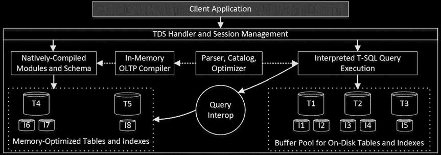

在我们讨论`In-Memory OLTP`内部原理之前，定义术语很重要。我将使用以下术语和定义：

- *内存优化表* 指使用由`In-Memory OLTP`采用的新型数据结构的表。


磁盘表是指使用 8 KB 数据页存储在数据库数据文件中的常规 SQL Server 表。本书先前讨论的所有表都是磁盘表。

互操作是指从解释型 T-SQL 代码中引用内存优化表的能力。

原生编译模块是指编译成机器代码的存储过程、触发器和标量用户定义函数。这些模块将在[第 37 章](http://dx.doi.org/10.1007/9781-4842-1964-5_37)中介绍。

图 35-1 展示了 SQL Server 引擎的架构，包括内存 OLTP 部分。如你所见，内存优化表不与磁盘表共享内存。但是，你可以通过互操作引擎从 T-SQL 和客户端应用程序访问这两种类型的表。而原生编译模块只能与内存优化表一起工作，无法访问磁盘表数据。

**图 35-1.** SQL Server 引擎架构

内存 OLTP 将数据存储在独立的基于 `FILESTREAM` 的文件组中。SQL Server 2014 的内存 OLTP 实现依赖 `FILESTREAM` 进行所有文件管理。在 SQL Server 2016 中，`FILESTREAM` 文件组仅用作容器，所有文件管理和垃圾回收都由内存 OLTP 引擎完成。这使得文件管理更加高效，并允许 SQL Server 在你为数据库启用透明数据加密 (`TDE`) 时对内存数据进行加密。

**注意** 你可以在 [`technet.microsoft.com/en-us/library/gg471497.aspx`](http://technet.microsoft.com/en-us/library/gg471497.aspx) 阅读更多关于 `FILESTREAM` 的内容。

你可以通过使用 `CONTAINS MEMORY_OPTIMIZED_DATA` 关键字来指定包含内存优化表数据的文件组，如代码清单 35-1 所示。运行脚本后，数据库使用的所有内存 OLTP 文件将位于 `S:\HKData\Hekaton_InMemory` 文件夹中。

第 35 章 ■ 内存 OLTP 内部机制

**代码清单 35-1.** 创建带有内存 OLTP 文件组的数据库

```sql
create database [HekatonDB] on
primary
( name = N'HekatonDB', filename = N'M:\HekatonDB.mdf'),
filegroup [OnDiskData]
( name = N'Hekaton_OnDisk', filename = N'M:\Hekaton_OnDisk.ndf'),
filegroup [InMemoryData] contains memory_optimized_data
( name = N'Hekaton_InMemory', filename = N'S:\HKData\Hekaton_InMemory')
log on
( name = N'HekatonDB_log', filename = N'L:\HekatonDB_log.ldf')
```

还值得一提的是，一旦创建了内存 OLTP 文件组，你就无法将其从数据库中删除。即使你已从数据库中移除了所有内存 OLTP 对象，这也可能阻碍你在低于企业版的 SQL Server 版本上还原该数据库。

## 内存优化表

尽管内存优化表的创建与磁盘表非常相似，并且可以使用常规的 `CREATE TABLE` 语句完成，但 SQL Server 处理内存优化表的方式却大不相同。每次创建内存优化表时，SQL Server 都会生成并编译一个负责操作表行数据的 DLL。内存 OLTP 引擎是通用的，它不直接访问或修改行数据。相反，它调用 DLL 方法。

如你所料，这种方法限制了表的可更改性。更改表将需要 SQL Server 重新创建 DLL 并更改数据行格式。这在 SQL Server 2014 中不支持，内存优化表的架构是静态的，创建后无法以任何方式更改。索引也是如此。SQL Server 要求你在 `CREATE TABLE` 语句中内联定义索引。表创建后，你无法添加或删除索引，也无法更改索引的定义。

SQL Server 2016 允许你更改表架构和索引。然而，这会创建一个新表。


# 第 35 章 ■ 内存中 OLTP 内部机制

内存中对象，从旧表复制数据。这是离线操作，可能非常耗时且消耗资源，并且需要有足够的内存来容纳数据的多个副本。

**提示** 你可以将多个 `ADD` 或 `DROP` 操作组合到单个 `ALTER` 语句中，以减少表重建的次数。

内存优化表上的索引不会持久化到磁盘。`SQL Server` 在启动数据库并将内存优化数据加载到内存中时重新创建它们。与磁盘表一样，内存优化表中不必要的索引会减慢数据修改速度并消耗系统额外的内存。

每个内存优化表都有一个 `DURABILITY` 选项。默认的 `SCHEMA_AND_DATA` 选项表示表中的数据是完全持久的，为了恢复目的会持久保存到磁盘。对此类表的操作会记录在事务日志中，这使得 `SQL Server` 能够支持数据库事务一致性，并在 `SQL Server` 崩溃或意外关闭时重新创建数据。

`SCHEMA_ONLY` 是另一个选项，表示内存优化表中的数据不是持久的，在 `SQL Server` 重启或崩溃时会丢失。针对非持久内存优化表的操作不会记录在事务日志中。非持久表速度极快，可以在你需要存储临时数据的场景中使用，类似于在 `tempdb` 中使用临时表的情况。与临时表相反，`SQL Server` 会持久化非持久内存优化表的架构，你不需要在 `SQL Server` 重启时重新创建它们。

内存优化表最多支持八个索引。持久性内存优化表应定义唯一的主键约束。非持久内存优化表不需要主键约束；但是，它们仍应至少有一个索引来链接行。

在 `SQL Server 2014` 中，索引不能包含可为空的列，也不能定义为 `UNIQUE`（主键约束除外）。此外，除非文本列具有 `BIN2` 排序规则，否则无法为其创建索引。你应该记住，这些排序规则区分大小写和重音，这可能会带来一些副作用，特别是在你迁移到内存中 OLTP，将磁盘表转换为内存优化表时。

其他 `SQL Server 2014` 限制包括不支持外键、检查约束、唯一约束和 DML 触发器。所有这些限制在 `SQL Server 2016` 中都已移除。

`SQL Server 2014` 和 `2016` 都不支持 `SEED` 和 `INCREMENT` 不是 `(1,1)` 的 `IDENTITY` 列。

清单 35-2 展示了创建内存优化表的代码。你可以通过指定 `CREATE TABLE` 语句的 `MEMORY_OPTIMIZED=ON` 选项将表定义为内存优化表。暂时忽略索引属性；我们将在本章后面讨论它们。正如我已经提到的，在 `SQL Server 2016` 中，你不需要将 `varchar` 列存储为 `BIN2` 排序规则。

***清单 35-2.*** 创建内存优化表

```sql
create table dbo.Customers
(
    CustomerID int not null
        constraint PK_Customers
        primary key nonclustered hash with (bucket_count = 131072),
    Name varchar(128) collate Latin1_General_100_BIN2 not null,
    City varchar(64) collate Latin1_General_100_BIN2 not null,
    SSN char(9) not null,
    DateOfBirth date not null,
    index IDX_Customers_City nonclustered hash(City)
        with (bucket_count = 16384),
    index IDX_Customers_Name nonclustered(Name)
)
with (memory_optimized = on, durability = schema_and_data)
```

## 高可用性技术支持

内存优化表在 `AlwaysOn 故障转移群集` 和 `可用性组` 中得到完全支持，也支持日志传送。然而，在故障转移群集的情况下，如果发生故障转移，持久性内存优化表的数据必须加载到内存中，这可能会增加故障转移时间。

在 `AlwaysOn 可用性组` 的情况下，只有持久性内存优化表会被复制到辅助节点。如果需要，你可以在可读辅助节点上访问和查询这些表。另一方面，来自非持久内存优化表的数据不会被复制，并且在故障转移时会丢失。

`SQL Server 2016` 支持内存优化表的快照复制和事务复制。在 `SQL Server 2014` 中，你可以在包含内存优化表的数据库上设置事务复制；但是，这些表不能用作发布中的项目。

数据库镜像会话不支持内存中 OLTP。不过，这似乎不是一个很大的限制。内存中 OLTP 是一项企业版功能，它允许你使用 `AlwaysOn 可用性组` 来替代数据库镜像。

## 数据行结构

内存优化表中的数据和索引格式与磁盘表不同。存储针对使用内存指针的字节可寻址内存进行了优化，而不是针对使用文件内偏移量的块可寻址磁盘数据。除了我们稍后将讨论的非聚集（范围）索引外，内存中的对象不使用内存中的数据页。数据行有指向下一行的行链指针。

行内数据大小的最大限制 8,060 字节仍然适用。此外，在 `SQL Server 2014` 中，内存优化表不支持行外存储，这限制了可以在表中使用的数据类型；在 `SQL Server 2014` 中仅支持以下数据类型：

- `bit`
- 整数类型：`tinyint`、`smallint`、`int`、`bigint`
- 浮点类型：`float`、`real`、`numeric` 和 `decimal`
- 货币类型：`money` 和 `smallmoney`
- 日期/时间类型：`smalldatetime`、`datetime`、`datetime2`、`date` 和 `time`
- `uniqueidentifiers`
- 非 LOB 字符串类型：`(n)char(N)`、`(n)varchar(N)` 和 `sysname`
- 非 LOB 二进制类型：`binary(N)` 和 `varbinary(N)`

如前所述，在 `SQL Server 2014` 中，你不能使用在磁盘表中可能使用 LOB 存储的数据类型，例如 `(n)varchar(max)`、`varbinary(max)`、`xml`、`clr`、`(n)text` 和 `image`。此外，`SQL Server 2014` 中没有行溢出存储的概念，因此整行（包括可变长度数据）必须适合 8,060 字节。不可能创建行可能超过该大小的内存优化表；例如，包含两个 `varchar(5000)` 列的行。

`SQL Server 2016` 支持行外存储，并允许数据行超过 8,060 字节。现在支持 `(n)varchar(max)` 和 `varbinary(max)` 数据类型。仍然不支持 `xml`、`clr`、`(n)text` 和 `image` 数据类型；然而，在某些情况下，你可以将它们存储为 `varbinary(max)`。

与磁盘表相反，决定哪些列需要存储在行外是在表创建阶段做出的。无论行大小如何，行溢出列和 LOB 列的数据总是存储在行外。`(max)` 列总是存储在 LOB 存储中。如果表架构允许行大小超过 8,060 字节，最大的可变长度 `(N)` 列会被推送到行溢出存储。在这两种情况下，主行内结构都使用一个八字节的标识符来引用它们。我们将在本章后面更详细地讨论行外存储。

图 35-2 说明了内存优化表中数据行的结构。如你所见，它由两部分组成：*行头* 和 *有效负载*。

***图 35-2.** 内存优化表中数据行的结构*

`SQL Server` 实例维护 *全局事务时间戳* 值，该值在事务预提交验证时自动递增（更多内容见下一章），并且它是唯一的


# 第 35 章 ■ 内存 OLTP 内部机制

## 行结构

每一行都以一个行头开始，该行头包含每个已提交事务的信息。行头中的前两个八字节元素 `BeginTs` 和 `EndTs` 定义了数据行的生命周期。`BeginTs` 存储插入该行的事务的全局事务时间戳，而 `EndTs` 存储删除该行的事务的时间戳。一个称为 `Infinity` 的特殊值被用作未被删除行的 `EndTs`。

此外，`BeginTs` 和 `EndTs` 控制事务对行的可见性。只有当事务的逻辑开始时间（事务开始时的全局事务时间戳值）介于行的 `BeginTs` 和 `EndTs` 时间戳之间时，事务才能看到该行。

事务中的每个语句都有一个唯一的四字节 `StmtId` 值。行头中的第三个元素是插入该行的语句的 `StmtId`。它用作一种 `Halloween protection` 技术，类似于磁盘表中的 `table spools`，它允许该语句跳过它自己插入的行。你可以将 `INSERT INTO T SELECT FROM T` 语句视为这种情况的经典示例，正如我们在第 25 章中讨论的那样。

与磁盘表不同（其非聚集索引是独立的数据结构），内存优化表中的所有索引都引用实际的数据行。在表上定义的每个新索引都会添加一个指向数据行的指针。例如，如果一个表定义了两个索引，则该表中的每个数据行都将有两个八字节指针，这些指针引用索引行链中的下一个数据行。简而言之，这使得内存优化表中的每个索引都是**覆盖索引**；也就是说，当 SQL Server 通过索引定位一行时，它会找到实际的数据行，而不是单独的索引行结构。

头中的下一个元素是两字节的 `IdxLinkCount`，它表示有多少个索引（指针）引用该行。SQL Server 使用它来检测可以被垃圾回收进程释放的行。我们将在本章后面讨论垃圾回收。

八字节索引指针数组是行头的最后一个元素。正如你可以猜到的，每个内存优化表应该至少有一个索引将数据行链接在一起。最多，你可以在每个内存优化表上定义八个索引，包括主键。

实际的行数据存储在行的有效载荷部分。如前所述，有效载荷格式可能因表模式而异。SQL Server 通过一个在表创建时生成并编译的动态链接库来操作有效载荷。

## 内存 OLTP 的关键原则

内存 OLTP 的一个关键原则是有效载荷数据从不更新。当需要更新表行时，内存 OLTP 将原始行的 `EndTs` 属性设置为该事务的全局事务时间戳，并插入具有新的 `BeginTs` 和 `EndTs` 值为 `Infinity` 的数据行的新版本。我们将在下一章更深入地了解这是如何工作的。

## 哈希索引

`Hash indexes` 是内存 OLTP 支持的两种索引类型之一。它们由一个哈希桶数组组成，每个桶包含一个指向数据行的指针。SQL Server 对索引键列应用哈希函数，函数的结果决定了行属于哪个桶。所有具有相同哈希值并属于同一桶的行通过数据行中的索引指针链链接在一起。

图 35-3 展示了一个在 `Name` 和 `City` 列上定义了两个哈希索引的内存优化表示例。实线箭头代表 `Name` 列索引中的指针。虚线箭头代表 `City` 列索引中的指针。为简单起见，我们假设哈希函数根据字符串的第一个字母生成哈希值。

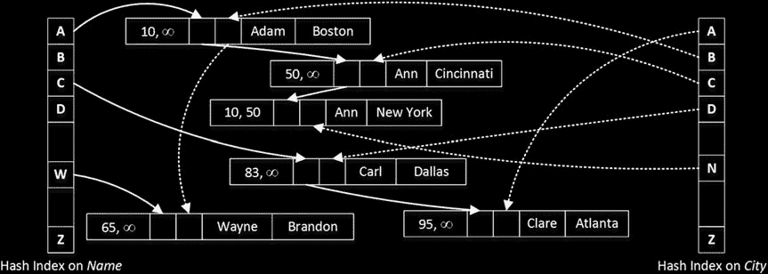

*图 35-3. 哈希索引*

让我们假设你需要运行一个查询，该查询在事务中选择所有 `Name='Ann'` 的行...


# 第 35 章 ■ 内存 OLTP 内部结构

## 查询执行过程

查询开始时全局事务时间戳为 65。SQL Server 为`Ann`计算哈希值，其值为`'A'`，并在哈希索引中找到对应的桶（如图 35-3 左侧所示）。

它跟随该桶的指针，该指针引用了一行`Name='Adam'`。此行的`BeginTs`为 10，`EndTs`为无穷大；因此，它对事务可见。但是，`Name`值与谓词不匹配，因此该行被忽略。

在下一步中，SQL Server 跟随`Adam`索引指针数组中的指针，该指针引用了第一行`Ann`。此行的`BeginTs`为 50，`EndTs`为无穷大；因此，它对事务可见并需要被选中。

作为最后一步，SQL Server 跟随索引中的下一个指针。尽管最后一行也有`Name='Ann'`，但它的`EndTs`为 50，对事务不可见。

显然，扫描索引链的查询性能很大程度上取决于链中的行数。需要处理的行数越多，查询就越慢。

## 影响索引链大小的因素

在哈希索引中，有两个因素会影响索引链的大小。第一个因素是索引选择性。重复的键值会生成相同的哈希并属于同一个索引链。因此，选择性低的索引效率较低。

另一个因素是索引中的哈希桶数量，这应在索引创建阶段指定。在理想情况下，数组中的桶数量应与索引中唯一键值的数量相匹配，并且每个唯一键值都有自己对应的桶。然而，SQL Server 中的哈希函数并不能保证这一点。**最佳实践是将桶的数量定义为大约是索引基数的 1.5 到 2 倍，即索引中唯一键值的数量。**

> **注意** 在内部，SQL Server 会将为索引指定的桶数向上舍入到下一个 2 的幂。例如，定义为`BUCKET_COUNT=100000`的哈希索引在哈希数组中将有 131,072 个桶。

## 桶数量设置建议

在确定哈希索引的最佳桶数时，您应该分析数据，并将对未来系统增长的预测纳入分析。低估和高估都是不好的。低估会增加索引链的大小，而高估会浪费系统内存。但是，从大局来看，高估桶数比低估要好。

## 版本差异与监控

不幸的是，在表创建后无法更改桶数。在 **SQL Server 2014** 中，更改桶数的唯一方法是删除并重新创建表。**SQL Server 2016** 允许您通过`ALTER TABLE`操作重建索引来更改桶数，这会在后台重建表。

您可以使用`sys.dm_db_xtp_hash_index_stats`数据管理视图来监控与哈希索引相关的统计信息。该视图提供有关桶总数、空桶数量以及平均和最大行链长度的信息。您可以在[`msdn.microsoft.com/en-us/library/dn296679.aspx`](http://msdn.microsoft.com/en-us/library/dn296679.aspx)阅读更多关于该视图的信息。

## SARG 性规则

哈希索引的 SARG 性规则与为磁盘表定义的索引不同。它们仅在**点查询（相等）搜索**和**相等连接**时才有效，这允许 SQL Server 计算相应的哈希值并在哈希数组中找到一个桶。

对于复合哈希索引，SQL Server 会为所有键列组合值计算哈希值。对键列子集计算的哈希值将是不同的，因此，要使查询有用，它应对索引中的所有键列具有相等谓词。


# 第 35 章 ■ 内存 OLTP 内部机制

这种行为不同于磁盘上表的索引。考虑这样一种情况：你想要在（`LastName`， `FirstName`）列上定义一个索引。对于磁盘上的表，无论查询的 `WHERE` 子句中是否指定了 `FirstName` 列上的谓词，该索引都可以用于 ``查找（seek）`` 操作。而对于内存优化表上的复合哈希索引，查询必须同时在 `LastName` 和 `FirstName` 上具有相等谓词，才能计算出哈希值，从而在数组中选择正确的哈希桶。

让我们来看一下示例，创建带有（`LastName`， `FirstName`）列上复合索引的磁盘上表和内存优化表，并用清单 35-3 中所示的相同数据进行填充。和之前一样，我在代码中使用二进制排序规则，以使其兼容 SQL Server 2014 和 2016。

### 清单 35-3. 复合哈希索引：测试表创建

```sql
create table dbo.CustomersOnDisk
(
CustomerId int not null identity(1,1),
FirstName varchar(64) collate Latin1_General_100_BIN2 not null,
LastName varchar(64) collate Latin1_General_100_BIN2 not null,
Placeholder char(100) null,
constraint PK_CustomersOnDisk primary key clustered(CustomerId)
);

create nonclustered index IDX_CustomersOnDisk_LastName_FirstName
on dbo.CustomersOnDisk(LastName, FirstName);

create table dbo.CustomersMemoryOptimized
(
CustomerId int not null identity(1,1)
constraint PK_CustomersMemoryOptimized
primary key nonclustered hash with (bucket_count = 4096),
FirstName varchar(64) collate Latin1_General_100_BIN2 not null,
LastName varchar(64) collate Latin1_General_100_BIN2 not null,
Placeholder char(100) null,
index IDX_CustomersMemoryOptimized_LastName_FirstName
nonclustered hash(LastName, FirstName) with (bucket_count = 1024),
)
with (memory_optimized = on, durability = schema_only);
go
```

-- 插入所有姓氏和名字交叉连接的数据 50 次
-- 使用 Management Studio 中的 GO 50 命令
```sql
;with FirstNames(FirstName)
as
(
select Names.Name
from ( values('Andrew'),('Andy'),('Anton'),('Ashley'),('Boris'), ('Brian'),('Cristopher')
,('Cathy')
,('Daniel'),('Donny'),('Edward'),('Eddy'),('Emy'),('Frank'),('George'),('Harry')
,('Henry'),('Ida')
,('John'),('Jimmy'),('Jenny'),('Jack'),('Kathy'),('Kim'),('Larry'),('Mary'),('Max')
,('Nancy')
,('Olivia'),('Olga'),('Peter'),('Patrick'),('Robert'),('Ron'),('Steve'),('Shawn')
,('Tom'),('Timothy')
,('Uri'),('Vincent') ) Names(Name)
)
,LastNames(LastName)
as
(
select Names.
Name
from ( values('Smith'),('Johnson'),('Williams'),('Jones'),('Brown'), ('Davis'),('Miller')
,('Wilson')
,('Moore'),('Taylor'),('Anderson'),('Jackson'),('White'),('Harris') ) Names(Name)
)
insert into dbo.CustomersOnDisk(LastName, FirstName)
select LastName, FirstName from FirstNames cross join LastNames
go 50

insert into dbo.CustomersMemoryOptimized(LastName, FirstName)
select LastName, FirstName from dbo.CustomersOnDisk;
```

对于第一个测试，让我们对两个表运行 `SELECT` 语句，在查询中同时将 `LastName` 和 `FirstName` 指定为谓词，如清单 35-4 所示。

### 清单 35-4. 复合哈希索引：使用两个索引列作为谓词选择数据

```sql
select CustomerId, FirstName, LastName
from dbo.CustomersOnDisk
where FirstName = 'Brian' and LastName = 'White';

select CustomerId, FirstName, LastName
from dbo.CustomersMemoryOptimized
where FirstName = 'Brian' and LastName = 'White';
```

如图 35-4 所示，SQL Server 在这两种情况下都能使用 ``索引查找（index seek）`` 操作。

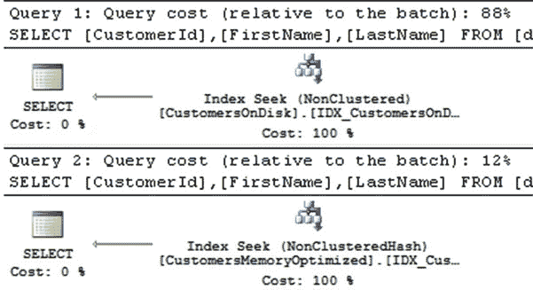

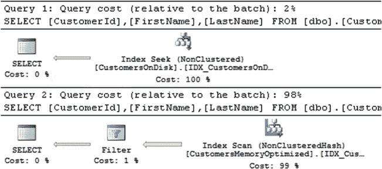

### 图 35-4. 复合哈希索引：查询使用两个索引列作为谓词时的执行计划

在下一步中，让我们检查一下如果从查询中移除按 `FirstName` 的筛选会发生什么。代码如清单 35-5 所示。


# 第 35 章 ■ 内存 OLTP 内部原理

## 复合哈希索引示例

***代码清单 35-5.*** 复合哈希索引：仅使用最左侧索引列选择数据

```sql
select CustomerId, FirstName, LastName
from dbo.CustomersOnDisk
where LastName = 'White';

select CustomerId, FirstName, LastName
from dbo.CustomersMemoryOptimized
where LastName = 'White';
```

对于磁盘上的索引，SQL Server 仍然能够利用索引查找操作。但对于在内存优化表上定义的复合哈希索引，情况则不同。你可以在图 35-5 中看到这些查询在 SQL Server 2014 中的执行计划。SQL Server 2016 会为第二个查询生成略有不同的计划，以不同方式扫描 `dbo.CustomersMemoryOptimized` 表。我们将在本章后面讨论这一点。

***图 35-5.** 复合哈希索引：查询仅使用最左侧索引列时的执行计划*

*(SQL Server 2014)*

## 非聚集（范围）索引

*非聚集索引* 是内存 OLTP 支持的另一种索引类型。与优化用于点查找搜索的哈希索引相反，非聚集索引有助于你基于一系列值来搜索数据。它们的结构类似于磁盘上表中的常规 B-Tree 索引，并且不需要像使用哈希索引那样猜测和预定义桶的数量。

### 术语问题

非聚集索引在 SQL Server 2014 CTP 2 中引入，该版本的文档和白皮书广泛使用了术语 *范围索引*。然而，在 SQL Server 2014 的正式发布版中，微软更改了术语，并开始使用 *非聚集索引* 来代替。

这个术语可能会令人困惑，因为哈希索引也不是聚集的。实际上，聚集索引的概念不能应用于内存 OLTP。数据行在内存中既不按任何特定顺序存储，也不在数据页上分组存放。

还值得一提的是，内存 OLTP 索引的最小 `index_id` 值为 2，这对应于磁盘上表的非聚集索引。

非聚集索引使用一种名为 *Bw-Tree* 的无锁无闩锁的 B-Tree 变体，该变体由微软研究院于 2011 年设计。与 B-Tree 类似，Bw-Tree 中的索引页包含一组有序的索引键值。然而，Bw-Tree 页面没有固定大小，并且在构建后不可更改。不过，页面的最大尺寸仍然是 8KB。

非聚集索引叶级的行包含指向具有相同索引键值的实际行链的指针。这与哈希索引的工作方式类似，其中多个行和/或行的版本被链接在一起。表中的每个索引（无论是哈希还是非聚集）都会在行中添加一个指向索引指针数组的指针。

非聚集索引中的根级和中间级被称为 *内部页*。与 B-Tree 索引类似，内部页指向索引中的下一级别。但是，内部页不是指向实际的数据页，而是使用 *逻辑页 ID*（`PID`），这是一个单独的、类似数组的结构（称为 *映射表*）中的位置（偏移量）。映射表中的每个元素又包含一个指向实际索引页的指针。

如前所述，非聚集索引中的页面一旦构建就不可更改。当需要更新页面时，SQL Server 会构建该页面的新版本，并替换映射表中的页面指针，从而避免更改引用旧（过时）页面的内部页。我们很快将详细讨论这个过程。

图 35-4 展示了一个非聚集索引和映射表的示例。内部页的每个索引行存储了下一级别页面上的 *最高* 键值以及 `PID`。这与 B-Tree 索引不同，在 B-Tree 索引中，中间级和根级的索引行存储的是下一级别页面的 *最低* 键值。


# 第 35 章 ■ 内存中 OLTP 内部机制

## 非聚集索引结构
*图 35-6. 非聚集索引*

一个关键区别在于，Bw-Tree 中的页面并未链接成双向链表。每一层上的每个页面只知道同一层级下一个页面的 PID，而不知道上一个页面的 PID。尽管在图 35-6 中它看起来像一个指针（箭头），但该链接是通过映射表完成的，类似于指向下一层页面的链接。

即便 Bw-Tree 看起来与 B-Tree 非常相似，但存在一个概念上的区别：磁盘上的 B-Tree 索引的叶子级别由索引中每个数据行的独立索引行组成。如果多个数据行具有相同的索引键值，则每个行都会存储一个单独的索引行。

相反，内存中的非聚集索引只为具有相同键值的所有数据行组成的行链存储一个索引行（指针）。每个键值在索引中只存储一个索引行（指针）。你可以在图 35-6 中看到这一点，其中索引的叶子级别对于键值 *Ann* 和 *Nancy* 只有单行，即使行链包含了每个值的多个数据行。

每当 SQL Server 需要更改叶子级别的索引页面时，它会创建一个或两个代表更改的 *delta* 记录。INSERT 和 DELETE 操作生成单个插入或删除 delta 记录，而 UPDATE 操作则生成两个 delta 记录，分别用于删除旧值和插入新值。Delta 记录创建了一个内存指针链，最后一个指针指向实际的索引页面。SQL Server 还会用链中第一个 delta 记录的地址替换映射表中的一个指针。

## Delta 记录示例
*图 35-7. Delta 记录与非聚集索引叶子页*

图 35-7 展示了一个叶子级别页面和 delta 记录的示例，假设按顺序发生了以下操作：R1 索引行被更新，R2 行被删除，R3 行被插入。

## 使用 InterlockedCompareExchange 进行并发控制
SQL Server 使用 `InterlockedCompareExchange` 机制来保证多个会话无法更新相同的指针链，从而避免相互覆盖更改，导致丢失对彼此对象的引用。`InterlockedCompareExchange` 函数更改指针的值，同时检查现有（*更新前*）值是否与作为另一个参数提供的预期（*旧*）值匹配。只有当检查成功时，指针值才会被更新。所有这些操作都作为单个 CPU 指令完成。

*图 35-8. 数据修改与并发：步骤 1*

让我们看一个例子，假设我们有两个会话，想要同时为同一个索引页面插入新的 delta 记录。如图 35-8 所示，第一步，会话创建 delta 记录，并根据映射表中的地址将其指针设置为指向一个页面。

*图 35-9. 数据修改与并发：步骤 2 和 3*

在下一步，两个会话都调用 `InterlockedCompareExchange` 函数，试图通过将引用从页面更改为新创建的 delta 记录来更新映射表。`InterlockedCompareExchange` 对映射表元素的更新进行序列化，并仅在其当前更新前值与作为参数提供的旧指针（页面的地址）匹配时才更改它。第一个 `InterlockedCompareExchange` 调用会成功。然而，第二个调用会失败，因为映射表元素将引用来自另一个会话的 delta 记录，而不是原始页面。图 35-9 说明了这种情况。

此时，第二个会话需要重复该动作。它将从映射表中读取会话 1 的 delta 页面地址，并将自己的 delta 页面重新指向这个 delta 页面。最终，它


# 第 35 章 ■ 内存 OLTP 内部原理

在调用期间，将再次调用 `InterlockedCompareExchange`，并使用会话 1 增量页的地址作为 `旧指针` 值。 图 35-10 说明了这一点。

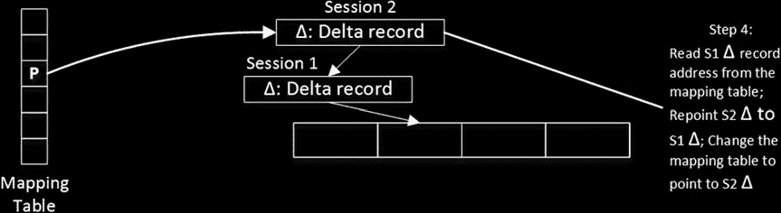

**图 35-10.** 数据修改与并发：最后步骤

如您所见，除了在 `InterlockedCompareExchange` 调用期间有极短的串行化过程外，在修改过程中数据没有锁定或闩锁。

■ **注意** 在需要保留指针链的情况下，SQL Server 使用相同的 `InterlockedCompareExchange` 方法；例如，在更新期间创建行的另一个版本时。

非聚集索引的内部页和叶页由两个区域组成：头部和数据。头部区域包括有关页面的信息，如下所示：

`PID`：在映射表中的位置（偏移量）
`页面类型`：页面的类型，如叶页、内部页、增量页或特殊页
`右页 PID`：映射表中下一页的位置（偏移量）
`高度`：从当前页面到索引叶级别的级数
存储在页面上的 `键值（索引行）数量`。
`增量记录统计`：包括增量记录的数量和增量键值使用的空间。
页面上的 `键最大值`。

页面的数据区域根据索引键的数据类型包含两个或三个数组。数组如下：

`值`：一个八字节指针数组。索引中的内部页存储下一级页面的 `PID`。叶级页面存储指向具有相应键值的行链中第一行的指针。值得注意的是，尽管 `PID` 需要四个字节来存储一个值，但 SQL Server 使用八字节元素来保持内部页和叶页之间相同的页面结构。
`键`：存储在页面上的键值数组
`偏移量`：键数组中各个键值起始位置的两字节偏移量数组。仅当键具有可变长度数据时才存储偏移量。

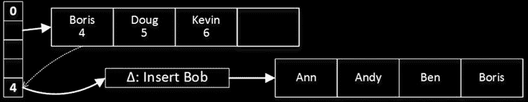

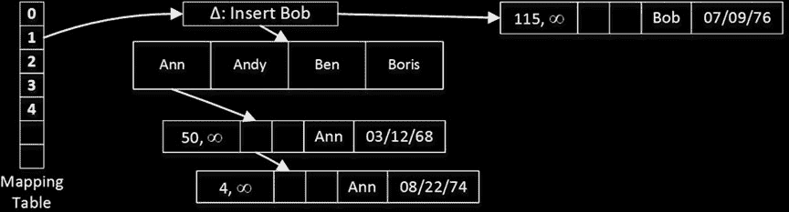

简而言之，增量记录就是单记录索引数据页。增量数据页的结构类似于内部页和叶页的结构。然而，增量数据页不存储值和键的数组，而是存储操作码（`INSERT` 或 `DELETE`）、单个键值、指向数据行的指针，以及指向叶级索引页或链中下一个增量记录的另一个指针。

图 35-11 显示了一个带有已插入增量记录的叶级索引页示例。

**图 35-11.** 带有已插入增量记录的叶级索引页

在访问索引页时，SQL Server 需要遍历并分析所有增量记录。正如您所猜到的，长的增量记录链会影响性能。在这种情况下，SQL Server 会合并增量记录并重建索引页，创建一个新的页面。新创建的页面将具有相同的 `PID`，并替换旧页面，旧页面将被标记为待垃圾回收。页面的替换是通过更改映射表中的指针来完成的。SQL Server 不需要更改内部页，因为它们使用映射表来引用叶级页面。

当为已在链中有 16 个增量记录的页面创建新的增量记录时，重建过程被触发。触发重建的增量记录所描述的操作将被纳入新创建的页面中。

除了增量记录合并外，还有两个其他进程可以创建新的或删除现有的索引页。第一个过程是 `页面拆分`，当一个页面没有足够的可用空间来容纳新的数据行时发生。让我们更详细地看看这种情况。

图 35-12 显示了一个非聚集索引的内部页和叶页。假设其中一个会话想要插入一个键值为 `Bob` 的行。

**图 35-12.** 页面拆分：初始状态

创建增量记录时，SQL Server 调整索引页上的增量记录统计信息，并检测到一旦增量记录被合并，页面上将没有空间容纳新的索引值。这会触发页面拆分过程，该过程分两个原子步骤完成。

第一步，SQL Server 创建两个新的叶级页面，并将旧页面的值拆分到它们之间。之后，它将映射表重新指向第一个新创建的页面，并将旧页面和增量记录标记为待垃圾回收。

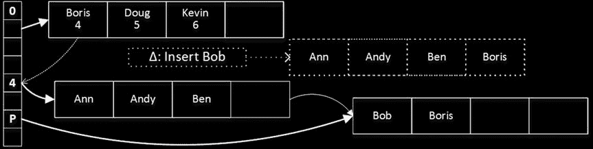

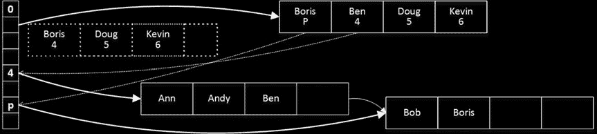

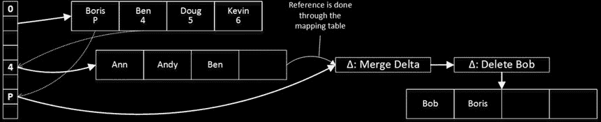

图 35-13 说明了此状态。此时，内部页没有对第二个新创建的叶级页面的引用。然而，第一个叶级页面维护了页面之间的链接（通过映射表），并且 SQL Server 能够在需要时访问和扫描第二个页面。

**图 35-13.** 页面拆分：第一步

在第二步中，SQL Server 创建另一个内部页，其键值代表新的叶级页面的布局。创建新页面后，SQL Server 切换映射表中的指针，并将旧的内部页标记为待垃圾回收。图 35-14 说明了此操作。

**图 35-14.** 页面拆分：第二步

另一个过程是 `页面合并`，当删除操作使索引页的大小小于最大页面大小（目前是 8 KB）的 10%时，或者当索引页仅包含一行时发生。

假设我们有一个如 图 35-14 所示的页面布局，并且我们想要删除索引键值 `Bob`，这意味着所有名为 `Bob` 的数据行都已被删除。在我们的例子中，这留下了一个仅包含值 `Boris` 的索引页，从而触发页面合并。

第一步，SQL Server 为 `Bob` 创建一个删除增量记录和另一种称为 `合并增量` 的特殊增量记录。图 35-15 说明了第一步之后的布局。

**图 35-15.** 页面合并：第一步

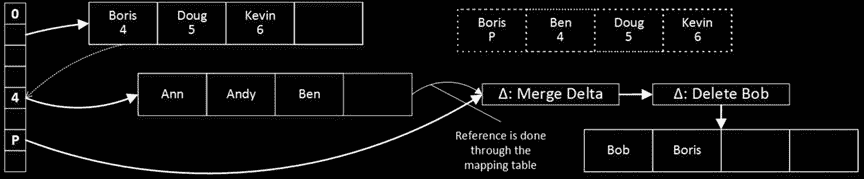

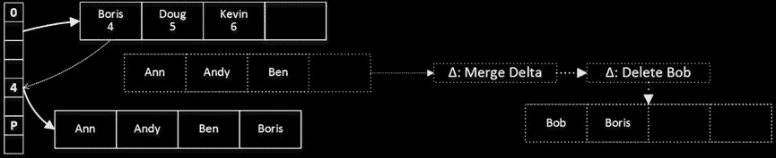

在页面合并的第二步中，SQL Server 创建一个新的内部页，该页不引用即将与之合并的页面。之后，SQL Server 切换映射表以指向新创建的内部页，并将旧页面标记为待垃圾回收。图 35-16 说明了此操作。

**图 35-16.** 页面合并：第二步

最后，SQL Server 构建一个新的叶级页面，将 `Boris` 值复制到那里。创建新页面后，它会更新映射表，并将旧页面和增量记录标记为待垃圾回收。图 35-17 显示了页面合并完成后最终的数据布局。

**图 35-17.** 页面合并：第三（最终）步

非聚集索引的索引注意事项与磁盘上非聚集索引类似。然而，您应该记住，`SQL Server 2014` 中的内存 OLTP 要求索引使用二进制排序，这种排序区分大小写和重音。

最后，`sys.dm_db_xtp_index_stats` 视图返回为内存优化表定义的索引的统计信息。内存优化表上的索引在 SQL Server 将数据加载到内存中时会重新创建；因此，统计信息是从那时开始收集和保存的。部分输出列如下：

`scans_started` 显示扫描索引中行链的次数。由于索引的性质，每个操作，如 `SELECT`、`INSERT`


UPDATE 和 DELETE 操作要求 SQL Server 扫描行链并递增此列。

`rows_returned` 表示返回给客户端的累计行数。
`rows_touched` 表示在索引中访问的累计行数。
`rows_expired` 显示检测到的陈旧行数量。我们将在“垃圾回收”章节更详细地讨论此问题。
`rows_expired_removed` 返回已从索引行链中解除链接的陈旧行数量。我们同样会在“垃圾回收”章节对此进行更详细的讨论。

# 第三十五章 ■ 内存中 OLTP 内部机制

您可以在 [`msdn.microsoft.com/en-us/library/dn133081.aspx`](http://msdn.microsoft.com/en-us/library/dn133081.aspx) 阅读更多关于 `sys.dm_db_xtp_index_stats` 视图的信息。

## 哈希索引与非聚集索引

如您所知，哈希索引仅对点查搜索以及查询在索引所有列上使用等式谓词的等式连接有用。另一方面，非聚集索引的适用范围要广泛得多，这通常使得选择变得显而易见。当您的查询受益于点查之外的场景时，您应该使用非聚集索引。

在点查的情况下，情况就不那么明显了。使用哈希索引，SQL Server 可以通过调用哈希函数并计算哈希值，在一步内定位到哈希桶，这是数据行链的入口点。而使用非聚集索引，SQL Server 必须遍历 Bw-Tree 来找到叶页，步骤数取决于索引的高度和其中增量记录的数量。

尽管非聚集索引需要更多步骤来找到数据行链的入口点，但与哈希索引相比，其行链可能更小。非聚集索引中的行链是基于唯一的索引键值构建的。在哈希索引中，行链基于非唯一的哈希键构建，并且可能由于哈希冲突而更大，尤其是在 `bucket_count` 不足的情况下。

在桶数量充足的情况下，哈希索引的性能优于非聚集索引。然而，桶数量不足和行链过长会显著降低其性能，使其效率低于非聚集索引。归根结底，这完全取决于正确的 `bucket_count` 估算。不幸的是，数据的易变性使得这项任务变得复杂，并要求您将未来的数据增长纳入分析。

在某些情况下，当数据相对静态时，您可以创建哈希索引，并高估其中的桶数量。考虑目录实体；例如，Customers 表及其 CustomerId 和 Phone 列。在这些列上创建哈希索引将提高点查搜索和连接的性能。尽管客户群会随着时间增长，但这种增长通常不会过度，预留一百万个空桶可能在很长一段时间内都是足够的。每个索引大约会使用 8 MB 内存，这在大多数情况下应该是可以接受的。

另一方面，为 Orders 表中的 OrderId 列选择哈希索引则更加危险。负载增长和数据保留规则的变化可能使原始的 `bucket_count` 变得不足。如果您计划监控系统并能承受重建索引期间的停机时间，这仍然是可以接受的；然而，在这种情况下，非聚集索引可能是更安全的选择。

总而言之，对于点查和等式连接用例，仅当您能正确估算桶数量并将未来数据增长纳入分析时，才创建哈希索引。您还应该监控它们，并且当 `bucket_count` 变得不足时，能够承受重建索引所涉及的停机时间。否则，请使用非聚集索引，它们是更安全的选择，并且不依赖于桶数量。

## 内存优化表上的统计信息


# 第 35 章 内存中 OLTP 内部机制

内存中 OLTP 的统计信息更新行为在 SQL Server 2014 和 2016 中非常不同。在这两个版本中，SQL Server 都会在内存优化表上创建索引级和列级统计信息；然而，在 SQL Server 2014 中，它不会自动更新这些统计信息。这种行为导致了一个非常有趣的情况：索引随内存优化表一起创建，因此统计信息是在表为空时创建的，并且之后永远不会自动更新。

在设计使用 SQL Server 2014 的系统的统计信息维护策略时，您需要牢记这一行为。您应该在 SQL Server 或数据库重启、数据加载到表中后更新统计信息。此外，如果内存优化表中的数据是易变的（通常情况确实如此），您应该手动定期更新统计信息。

您可以使用 `UPDATE STATISTICS` 命令来更新单个统计信息。或者，您可以使用 `sp_updatestats` 存储过程来更新数据库中的所有统计信息。`sp_updatestats` 存储过程总是会更新内存优化表上的所有统计信息，这与它在磁盘表上的工作方式不同——在磁盘表上，该存储过程会跳过不需要更新的统计信息。

另一方面，SQL Server 2016 在兼容级别设置为 130 的数据库中支持自动统计信息更新。其工作方式本质上与磁盘表相同，只有一个例外。对于磁盘表，SQL Server 在列级别维护统计信息修改计数器，如果统计信息列未被更新，则不会将数据修改计入统计信息更新阈值。而在内存优化表中，统计信息修改计数器是在行级别维护的。

**重要提示** 在从 SQL Server 2014 升级到 SQL Server 2016 后，您应该手动更新一次统计信息以启用自动统计信息更新。

## 内存使用者与行外存储

内存中 OLTP 数据库对象从称为 `varheap` 的独立内存堆中分配内存。`varheap` 是响应并跟踪来自各种数据库对象的内存分配请求的数据结构，并且可以在需要时增长和缩小大小。所有消耗内存的数据库对象都称为 `memory consumers`。

按每个 `varheap` 分隔 `memory consumers` 允许您按对象跟踪内存使用情况。它还有助于 SQL Server 优化一些内部操作。例如，当您删除或修改表时，它允许垃圾回收过程快速释放内存。此外，SQL Server 2016 可以通过遍历表 `varheap` 中已分配的内存来执行表扫描。此操作比遍历索引行链更快，并且在查询互操作模式下运行时还支持并行执行计划。

值得再次强调的是，`varheap` 扫描是唯一可能导致并行执行计划的操作。它只在查询互操作模式下发生，并且需要 SQL Server 2016。SQL Server 在本机编译的代码中不支持并行计划。

例如，如果您在 SQL Server 2016 中运行清单 35-5 中的第二个查询，您将得到如图 35-18 所示的执行计划。如您所见，SQL Server 使用了 `table scan` 运算符，而不是在 SQL Server 2014 中使用的索引扫描。

***图 35-18.** 复合哈希索引：查询仅使用最左侧索引列的执行计划（SQL Server 2016）*

您可以使用 `sys.dm_db_xtp_memory_consumers` 视图获取有关数据库级别 `memory consumers` 的详细信息。`memory_consumer_type` 列指示 `memory consumer` 的类型，可以具有以下三个可能值之一：

• `VARHEAP` (2) 表示用于存储数据行、非聚集索引页和其他对象的数据库堆。


# 第三十五章 ■ 内存中 OLTP 内部机制

## 内存使用者类型
*   `HASH (3)` 表示哈希索引中哈希表所使用的内存。
*   `PGPOOL (4)` 显示运行时操作所使用的数据库页面池。

## 分析内存使用者

让我们创建一个包含一个哈希索引和一个非聚集索引的表，并查看其内存使用者，如清单 35-6 所示。

### 清单 35-6. 分析内存使用者
```sql
create table dbo.MemoryConsumers
(
    ID int not null
        constraint PK_MemoryConsumers
        primary key nonclustered hash with (bucket_count=1024),
    Name varchar(256) not null,
    index IDX_Name nonclustered(Name)
)
with (memory_optimized=on, durability=schema_only);

select
    i.name as [Index], i.index_id, a.xtp_object_id, a.type_desc, a.minor_id
    ,c.memory_consumer_id, c.memory_consumer_type_desc as [mc type]
    ,c.memory_consumer_desc as [description], c.allocation_count as [allocs]
    ,c.allocated_bytes, c.used_bytes
from
    sys.dm_db_xtp_memory_consumers c join
    sys.memory_optimized_tables_internal_attributes a on
        a.object_id = c.object_id and a.xtp_object_id = c.xtp_object_id
    left outer join sys.indexes i on
        c.object_id = i.object_id and
        c.index_id = i.index_id and
        a.minor_id = 0
where
    c.object_id = object_id('dbo.MemoryConsumers');
```

### 图 35-19. 内存使用者信息
图 35-19 显示了此查询的输出。`xtp_object_id` 列代表内存中 OLTP 的内部 `object_id`，它与 SQL Server 的 `object_id` 不同。

如图 35-19 所示，该表有三个内存使用者。`range index heap` 存储非聚集索引的内部节点和叶节点页。`hash index heap` 存储哈希索引的哈希表。最后，`table heap` 存储实际的表行。图 35-20 说明了这一点。

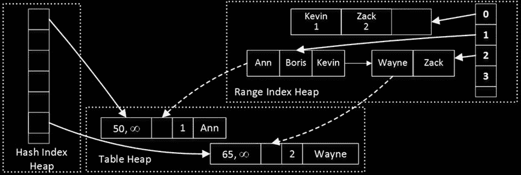

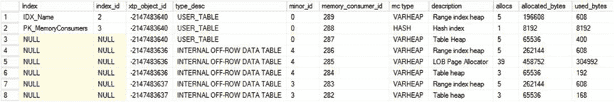

### 图 35-20. 表内存使用者

## 修改表

让我们修改表并添加行溢出存储列，如清单 35-7 所示。显然，此代码需要 SQL Server 2016 才能运行。

### 清单 35-7. 修改表
```sql
alter table dbo.MemoryConsumers add
    RowOverflowCol varchar(8000),
    LOBCol varchar(max);
```

现在，如果你使用清单 35-6 中的查询获取内存使用者列表，你将看到如图 35-21 所示的输出。值得注意的是，`USER_TABLE` 的 `xtp_object_id` 列已经改变，因为 `ALTER TABLE` 操作在内部重建了该表。

### 图 35-21. 修改表后的内存使用者
如你所见，两个行溢出列都引入了它们自己的 `range index heap` 和 `table heap` 内存使用者。此外，LOB 列增加了 `LOB page allocator` 内存使用者（稍后会详细介绍）。`minor_id` 列指示内存使用者所属的表的 `column_id`。

## 行溢出存储如何工作
正如你从输出中猜测的那样，SQL Server 2016 将行溢出列和 LOB 列存储在单独的内部表中。这些表由一个作为非聚集索引实现的八字节人工主键和行溢出列值组成。主行通过那个人工键引用行溢出列，该键在主行创建时生成。值得重申的是，此引用是通过人工值而非内存指针完成的。

这种方法允许内存中 OLTP 通过为行溢出列使用不同的生命周期来将它们与主行解耦。例如，如果你更新主行数据而不触及行溢出列，SQL Server 将不会为行溢出行生成新版本。反之，当仅修改行溢出数据时，主行保持不变。

## LOB 数据存储
内存中 OLTP 将 LOB 数据存储在由 `LOB page allocator` 内存使用者提供的内存中。此使用者不受 8,060 字节行分配的限制，可以分配大量内存来存储数据。LOB 列的 `table heap` 中的行包含指向行数据的指针，这些数据存储在...


## LOB 页面分配器

让我们使用假设的全局事务时间戳值运行几条 DML 语句，如清单 35-8 所示。

***清单 35-8.*** 修改表中的数据

```
-- Global Transaction Timestamp: 100
insert into dbo.MemoryConsumers(ID, Name, RowOverflowCol, LobCol)
values
(1,'Ann','A1',replicate(convert(varchar(max),'1'),100000)),
(2,'Bob','B1',replicate(convert(varchar(max),'2'),100000));

-- Global Transaction Timestamp: 110
update dbo.MemoryConsumers set RowOverflowCol = 'B2' where ID = 2;

-- Global Transaction Timestamp: 120
update dbo.MemoryConsumers set Name= 'Greg' where ID = 2;

-- Global Transaction Timestamp: 130
update dbo.MemoryConsumers set LobCol = replicate(convert(varchar(max),'3'),100000)
where ID = 1;

-- Global Transaction Timestamp: 140
delete from dbo.MemoryConsumers where ID = 1;
```

图 35-22 说明了数据状态以及行之间的链接。为简洁起见，它省略了主表中的哈希表和非聚集索引结构，以及用于溢出列的非聚集索引的内部页。

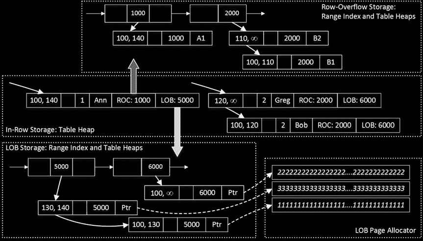

*第 35 章 ■ 内存 OLTP 内部机制*

**图 35-22.** 行内和行外存储

行内和行外数据的解耦减少了在数据修改期间创建额外行版本的开销。但是，这会在插入和删除数据时增加额外的开销。SQL Server 在插入阶段需要创建多个行对象，并在删除期间更新多行的 `EndTs`。它还需要为行外列维护非聚集 Bw-Tree 索引。

**此外，表中定义的索引并不覆盖选择行外数据的查询。** SQL Server 需要遍历行外列上的非聚集索引来获取其值。从概念上看，这与磁盘表中的 `键查找` 操作非常相似，但方向相反——从主数据行到非聚集索引。尽管与磁盘表相比开销显著降低，但这仍然是您希望避免的开销。

除非有正当理由使用此类列，否则应避免使用行外存储。如果只是*以防万一*地将文本列定义为 `(n)varchar(max)`，而实际上并不在那里存储大量数据，这显然不是一个好主意。别忘了，内存 OLTP 会根据表定义而非数据大小来使用行外存储。在我们的例子中，尽管我们只使用了两个字符值，`RowOverflowCol` 数据仍存储在行外。

## 列存储索引 (SQL Server 2016)

内存 OLTP 是一种专门针对 OLTP 工作负载的解决方案。该技术可以显著提升处理易变数据并并行处理大量小型事务的 OLTP 系统的性能。在数据仓库和报表场景中，查询扫描和处理大量静态数据时，它不一定表现良好。

不幸的是，如今 OLTP 和数据仓库工作负载之间的界限非常模糊。几乎每个 OLTP 系统都有一些报表和分析负载，切换到内存 OLTP 可能会影响此类查询的性能。可以通过对数据进行分区来解决其中一些挑战，将热数据保存在内存优化表中，将冷数据保存在磁盘上的 B-Tree 或列存储索引中。但是，这种方法对于扫描和聚合热数据的操作分析效果不佳。

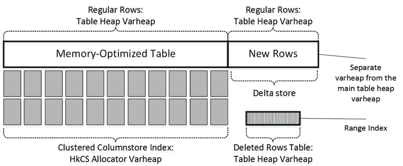

*第 35 章 ■ 内存 OLTP 内部机制*

在 **SQL Server 2016** 中，您可以通过在内存优化表上创建聚集列存储索引来解决此问题。这些索引是可更新的，其结构类似于使用压缩段合并到行组中的磁盘聚集列存储索引。不过，不要被列存储索引被定义为 *聚集* 所混淆。与磁盘表相反，聚集列存储索引


## 使用列存储索引的内存优化表

在内存优化表上，列存储索引是独立的数据结构，保存着数据的副本。在此上下文中，`clustered` 表示这些索引包含了表的所有列。

具有聚集列存储索引的内存优化表有一个隐藏列——`columnstore RID`——它在列存储索引中用作行定位器。内存 OLTP 在删除位图中将此列用作行定位器，删除位图作为内部表实现，并带有一个非聚集范围索引。与磁盘列存储索引一样，它由行组 ID 和行在行组内的位置组成。值得注意的是，内存 OLTP 中的删除位图被称为 `deleted rows table`。

内存优化列存储索引没有专用的增量存储。内存优化表中最新的行就 `成为` 增量存储，如图 35-23 所示。

**图 35-33.** 内存优化表上的聚集列存储索引

当你创建聚集列存储索引时，内存 OLTP 会为增量存储中的行使用另一个内存消耗者。来自 `INSERT` 或 `UPDATE` 操作的所有新版本行都从此 `varheap` 分配。有一个后台进程大约每两分钟唤醒一次，估算增量存储中的行数。如果估算值超过一百万行，该进程会通过压缩和编码增量存储中的行来创建一个新的行组，然后将它们移动到主表的 `varheap`。同样值得注意的是，内存优化表上的列存储索引不支持 `COLUMNSTORE_ARCHIVE` 压缩。

## 压缩延迟选项

你可以通过使用 `COMPRESSION_DELAY` 索引选项来延迟压缩。当系统在插入后不久执行某些会修改或删除行的后处理时，此选项可能是有益的。在这种情况下，已删除的行版本将不会包含在列存储索引中。

让我们看一个例子，并创建一个带有聚集列存储索引的表，如代码清单 35-9 所示。该索引有 `COMPRESSION_DELAY=60` 选项，该选项将新行的压缩延迟一个小时。

**代码清单 35-9.** 创建带有聚集列存储索引的表

```sql
create table dbo.OrdersCCI
(
    OrderId int not null
        constraint PK_OrdersCCI
        primary key nonclustered,
    OrderDate datetime2(0) not null,
    OrderNum varchar(32) not null,
    Amount money not null,
    index CCI_OrdersCCI clustered columnstore with (compression_delay=60)
)
with (memory_optimized=on, durability=schema_and_data);
```

## 分析内存消耗者和行组

图 35-24 显示了我在其中插入一些数据后的表内存消耗者。你可以使用代码清单 35-6 中的查询来获取内存消耗者信息。

**图 35-24.** 聚集列存储索引和内存消耗者

`HKCS_COMPRESSED` 消耗者存储压缩的行组。除此之外，你还可以看到主键范围索引堆和另外两个表堆消耗者——`memory_consumer_id=74` 的那个用于增量存储，`memory_consumer_id=75` 的那个用于表数据。`DELETED_ROWS_TABLE` 负责存储删除位图。其他内存消耗者由内部列存储对象使用。

你可以使用 `sys.dm_db_column_store_row_group_physical_stats` 视图分析行组的状态，如代码清单 35-10 所示。

**代码清单 35-10.** 获取行组状态

```sql
select row_group_id, state_desc, total_rows, deleted_rows, trim_reason_desc, created_time
from sys.dm_db_column_store_row_group_physical_stats
where object_id = object_id('dbo.OrdersCCI')
order by row_group_id
```

图 35-25 显示了该查询的部分输出。`trim_reason_desc` 列指示行组少于 1,048,576 行的原因。`SPILLOVER` 值表示该行组包含...


所有完整行组创建后剩余的行。`STATS_MISMATCH` 的值表明对增量存储区中行数的估计不正确。

***图 35-25.** 行组状态*

# 第 35 章 ■ 内存中 OLTP 内部机制

你还应监控 `deleted_rows` 值，它表示有多少行存储在删除位图中。如果此处数值很大，考虑增加 `COMPRESSION_DELAY`。值得一提的是，当行组中超过 90% 的行被删除后，SQL Server 会丢弃该行组，并将未删除的行移回增量存储区 `varheap`。

在内存中 OLTP 中使用列存储索引存在一些限制。最重要的有以下几点：

-   如果表使用行外存储，则无法创建列存储索引，因此行大小不能超过 8,060 字节。
-   带有列存储索引的内存优化表无法被修改。你应先删除索引，修改表，然后再重新创建索引。
-   内存优化表上的列存储索引无法被重建或重新组织。
-   不支持存档压缩。

显然，系统应有足够内存来容纳列存储索引。然而，这些索引经过了高度压缩，可能只占用非压缩行所用内存的一小部分。

最后，重要的是要注意 SQL Server 只能在查询互操作模式下利用列存储索引。从本机编译的代码中永远不会使用这些索引。

## 垃圾回收

内存中 OLTP 是一个行版本控制系统。数据修改生成行的新版本，而不是更新行数据。每行都有两个时间戳（`BeginTs` 和 `EndTs`）来指示行的生存期：行何时创建以及何时被删除。事务只能看到在其开始时有效的行版本。实际上，这意味着事务的 `逻辑开始时间`（事务开始时的 `全局事务时间戳` 值）位于该行的 `BeginTs` 和 `EndTs` 时间戳之间。

在某些时刻，当某行的 `EndTs` 时间戳早于系统中 `最老的活动事务` 的逻辑开始时间时，该行就变得陈旧。陈旧的行对系统中的活动事务不可见，最终需要被释放以回收系统内存并加速索引链导航。这个过程称为 `垃圾回收`。

SQL Server 有一个专门执行 `垃圾回收` 的系统线程；然而，大部分工作是由用户会话线程完成的。当用户线程扫描索引中的行链并检测到一个陈旧的行时，该线程会从链中将其解链，并递减行头中的引用计数器（`IdxLinkCount`）。如前所述，此计数器指示该行所在的链数。只有在该行从所有链中移除后，才能被释放。

然而，用户线程不会立即释放陈旧行。当事务完成时，线程将有关此事务的信息放入 `垃圾回收器` 使用的队列中。每个事务都保留有关其创建或删除的行的信息，这些信息对 `垃圾回收器` 线程可用。

`垃圾回收器` 线程（称为 `空闲工作线程`）会定期遍历该队列，分析陈旧行，并构建 `工作项`，这些工作项是需要释放的行的集合。这些 `工作项` 被插入到按逻辑 CPU 划分的其他队列中。用户线程（有时是 `空闲工作线程`）会选取 `工作项` 并释放行，在此过程中回收系统内存。

在 SQL Server 2016 中使用行外存储时，`垃圾回收` 过程将包含行外数据的内部表视为单独的表。它会分别处理并释放这些表中的行，与主表分开进行。

第 35 章 ■ 内存中 OLTP 内部机制


# 第 35 章 ■ 内存中 OLTP 内部机制

你可以使用 `sys.dm_xtp_gc_stats` 视图来监控有关垃圾回收过程的统计信息。

此视图返回关于过期行、垃圾回收扫描统计信息以及一些其他指标的各种信息。你可以在以下网址阅读关于此视图的更多信息：[`msdn.microsoft.com/en-us/library/dn268336.aspx`](https://msdn.microsoft.com/en-us/library/dn268336.aspx)。

`sys.dm_xtp_gc_queue_stats` 视图提供了有关垃圾回收工作项队列的信息，包括有多少工作项已入队和出列、队列中还剩多少项以及一些其他属性。关于此视图的更多信息可在以下网址获取：[`msdn.microsoft.com/en-us/library/dn268336.aspx`](https://msdn.microsoft.com/en-us/library/dn268336.aspx)。

■ **注意** 你可以在我的 *《SQL Server 内存中 OLTP 专业指南》* 一书中详细了解垃圾回收过程。

#### 数据持久性与恢复

持久性内存优化表的数据与磁盘表的数据是分开存储的。SQL Server 使用一种基于 `FILESTREAM` 技术的流机制来存储 `内存中 OLTP` 数据，该机制针对顺序 I/O 操作进行了优化。实际上，`内存中 OLTP` 根本不使用随机 I/O 操作；也就是说，所有 `内存中 OLTP` 的 I/O 操作都是顺序的。

SQL Server 2014 的 `内存中 OLTP` 实现依赖于 `FILESTREAM` 进行所有文件管理。而在 SQL Server 2016 中，`FILESTREAM` 文件组仅用作容器，所有文件管理和垃圾回收均由 `内存中 OLTP` 引擎完成。

`内存中 OLTP` 将数据存储在多个文件对中：`数据文件` 和 `增量文件`，它们通常被称为 `检查点文件`。每对数据文件和增量文件覆盖一个 `全局事务时间戳` 值范围的操作，并记录那些 BeginTs 在此范围内的行上的操作。每次插入一行时，它都会被保存到数据文件中。每次删除一行时，有关被删除行的信息会被保存到增量文件中。一次更新会产生两个操作——插入和删除——并将此信息保存到两个文件中。

## 磁盘表与内存优化表：不同的存储概念

磁盘表和内存优化数据的存储方式在概念上存在差异。磁盘表存储行的单一、最新版本。对数据行的多次更新会多次更改同一个行对象。删除行会将其从数据库中移除。最后，当需要时，总是可以在数据文件中定位到某个数据行。

另一方面，内存优化文件存储行的多个版本。对数据行的多次更新会生成多个行对象，每个对象都有不同的生命周期。无法预测数据行存储在文件中的哪个位置，也没有这样做的用例。`数据文件` 和 `增量文件` 的目的是提供数据持久性。

SQL Server 2016 使用了另一种称为 `大型数据文件` 的 `检查点文件`。这些文件与 `数据文件` 非常相似，用于存储 `LOB` 列数据和压缩的 `列存储行组`。而 `溢出行` 的数据则存储在常规的 `数据文件` 中。

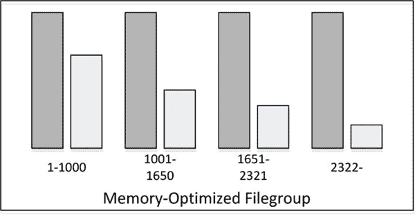

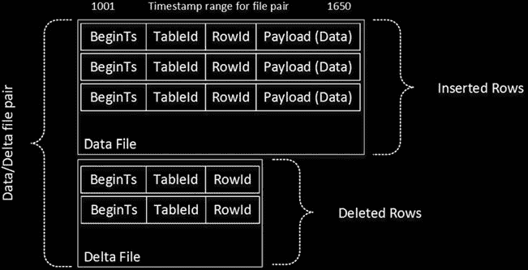

图 35-26 提供了存储在 `数据文件` 和 `增量文件` 中的信息的高级概览。简而言之，`大型数据文件` 具有相同的格式，但有效负载大小可能大得多。它们也使用 `增量文件` 来指示已被删除的行版本。

***图 35-26.** `检查点文件` 中的数据*

图 35-27 展示了一个包含四对 `数据文件` 和 `增量文件` 的数据库示例。实心填充的垂直矩形代表 `数据文件`。带点状填充的矩形代表 `增量文件`。


## 图 35-27. 包含多个数据和增量文件的数据库

使用单独的增量文件来记录删除操作，使得 SQL Server 在行被删除的情况下，能够避免对数据和大容量数据文件进行修改以及随机 I/O 操作。所有数据、大容量数据和增量文件都是仅追加的。此外，当文件关闭后，它们会变成只读的。数据文件的大小取决于服务器上安装的内存量和逻辑核心数。还值得注意的是，即使当您在数据库中创建的第一个内存优化表是非持久化的，SQL Server 在您创建该表时也会预分配检查点文件。

当 SQL Server 需要将内存中 OLTP 数据加载到内存时——例如在重启之后——它仅加载未被删除的行版本，并使用增量文件作为过滤器。它会检查来自数据文件的行是否未被删除且未在增量文件中被引用。根据此检查的结果，行要么被加载到内存中，要么被丢弃。

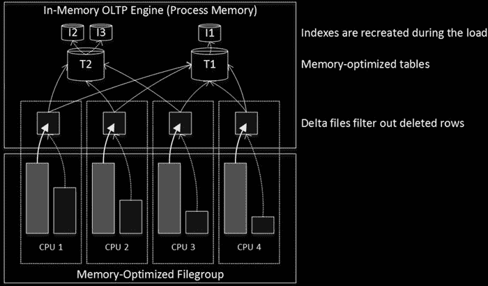

# 第 35 章 ■ 内存中 OLTP 内部机制

数据加载过程具有高度的可扩展性。SQL Server 为每个逻辑 CPU 创建一个线程，每个线程处理一个单独的数据文件和增量文件对。在大量情况下，I/O 子系统的性能成为数据加载性能的限制因素。请记住，在启动后或还原后，数据库变得可用之前，内存中 OLTP 数据需要被加载到内存中。

图 35-28 展示了数据加载过程。

## 图 35-28. 将数据加载到内存

■ `重要提示` 将内存中 OLTP 文件组放置在为顺序访问优化的快速磁盘阵列中。此外，您可以通过将容器放置在具有不同 I/O 路径的不同磁盘驱动器中，在内存中 OLTP 文件组中创建多个容器，以并行化并加速数据加载。

具有大量已删除行（因此增量文件很大）的情况会增加不必要的存储开销并减慢数据加载过程。SQL Server 通过一个称为 `合并` 的过程来处理这种情况。一个后台任务会定期分析相邻的活动检查点文件对是否可以合并，使得合并后的数据文件中的活动、未删除行能够容纳到一个新的数据文件中。

在图 35-27 所示的示例中，第一个数据文件覆盖时间戳范围 1-1000，包含约 40% 的活动行。第二个数据文件覆盖时间戳范围 1001-1650，包含约 50% 的活动行。这些文件可以合并在一起，覆盖时间戳 1-1650。图 35-29 展示了合并后的数据文件和增量文件。

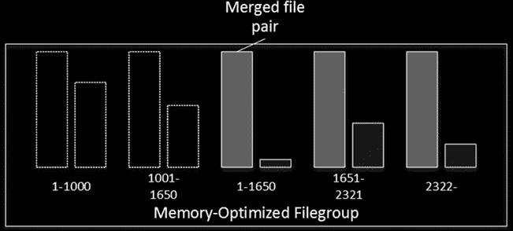

# 第 35 章 ■ 内存中 OLTP 内部机制

## 图 35-29. 合并过程

SQL Server 使用类似的合并过程来组合相邻的大容量数据文件。您应该记得，LOB（大型对象）数据行与主行是分离的，并且有自己的生命周期。因此，大容量数据文件需要与数据文件分开合并。

合并过程完成后，垃圾回收最终会移除旧的数据文件和增量文件并回收磁盘空间。然而，这并不会立即发生。SQL Server 需要确保在灾难恢复时不再需要原始文件。

内存中 OLTP 的 `CHECKPOINT`（检查点）与存储引擎的 `CHECKPOINT` 是分离的过程，它有自己的截断 LSN（日志序列号），这可能阻止事务日志被截断。除了手动 `CHECKPOINT` 操作（该操作也会关闭所有活动数据文件）外，它还可以在以下条件下触发：

自上次检查点以来事务日志的增长在 SQL Server 2014 中超过 512 MB，或在 SQL Server 2016 中超过 1.5 GB。值得一提的是，这些阈值不区分磁盘表和内存优化表的日志生成。

上一次自动或手动 `CHECKPOINT` 发生在六小时前。


一次检查点（`CHECKPOINT`）操作会持久化当前的`全局事务时间戳`值以及所有活动检查点文件的信息。SQL Server 2014 和 2016 在跟踪检查点文件的方式上略有不同。SQL Server 2014 主要依赖于事务日志，而 SQL Server 2016 则创建了另一种称为`根文件`的检查点文件。

内存 OLTP 的检查点过程是持续进行的。该过程不断分析由内存 OLTP 生成的事务日志记录，并在检查点之间填充数据文件、大容量数据文件和增量文件。这有助于避免内存 OLTP 相关检查点带来的 I/O 活动突发。

在 SQL Server 2014 中，检查点过程是单线程的。在 SQL Server 2016 中，该操作是多线程的。多个检查点线程正在以大约 1 MB 的段为单位扫描事务日志，并并行填充检查点文件。

最后，内存 OLTP 与数据库备份和恢复功能集成。它支持分段恢复。但是，内存 OLTP 文件组应与主（`PRIMARY`）文件组一起备份和恢复。在大多数情况下，这不是问题，因为在分段恢复期间，为了使系统能够正常运行，内存 OLTP 通常包含需要联机的系统关键数据。但是，你应该分析此要求如何影响你的备份和灾难恢复策略。

## 第 35 章 ■ 内存 OLTP 内部机制

> **注意**
> 关于数据持久性、检查点过程和检查点文件对生命周期的更多内容，你可以阅读我的书 `《SQL Server 内存 OLTP 技术精要》`。

### SQL Server 2016 功能支持

内存 OLTP 与 SQL Server 2016 的许多功能完全集成。

正如我们在第 29 章中已经讨论过的，查询存储（Query Store）无需任何额外的配置更改即可自动收集内存 OLTP 对象的查询、计划和优化统计信息。

但是，默认情况下不收集运行时统计信息，你需要使用 `sys.sp_xtp_control_query_exec_stats` 存储过程显式启用它。

请记住，收集运行时统计信息会增加开销，可能会降低内存 OLTP 工作负载的性能。同样重要的是要记住，SQL Server 不会持久化内存 OLTP 运行时统计信息收集设置，在 SQL Server 重启后它将被禁用。

你可以将系统版本化临时表与内存优化表一起使用，通过磁盘上的`历史`表来存储旧行版本。当你在内存优化表中启用系统版本控制时，SQL Server 会创建一个内存优化暂存表，并在 `UPDATE` 和 `DELETE` 操作期间同步填充它。暂存表中的数据由一个称为`数据刷新任务`的后台进程异步移动到磁盘上的历史表中。该任务每分钟唤醒一次，工作负载较轻；在工作负载繁重时，它可以调整计划，每 5 秒运行一次。

默认情况下，`数据刷新任务`在暂存表大小达到当前内存优化表大小的 8% 时移动数据。你也可以通过调用 `sys.sp_xtp_flush_temporal_history` 存储过程手动强制移动数据。

内存优化表可以配置为行级安全性。配置过程与磁盘表基本相同；但是，任何用作安全谓词的内联表值函数都必须是原生编译的。我们将在第 37 章讨论原生编译。

最后，微软 Azure 中的 SQL 数据库高级层支持内存 OLTP。所有内存 OLTP 功能都将有效，但需考虑各层所提供的内存量限制。但是，对于 SQL 数据库中的非持久化表，你需要谨慎。Azure 中的临时数据库故障转移将清除这些表中的数据。

#### 内存使用注意事项


显然，内存中 OLTP 会使用服务器内存。当无法再分配内存时，便无法进行更多的数据修改。此外，如果在数据库启动时，SQL Server 没有为内存中 OLTP 数据分配足够的内存，该数据库将无法上线。在需要将包含内存中 OLTP 数据的数据库备份恢复到内存较少的另一台服务器上时，或者在高可用性解决方案中，辅助节点的性能不如主节点时，请务必牢记这一点。

内存中 OLTP 的内存使用情况会影响其他 SQL Server 组件的性能。例如，SQL Server 用于缓冲池的可用内存会减少，这会因涉及更多的物理 I/O 而导致针对磁盘表的查询性能下降。内存中 OLTP 最多可以消耗 SQL Server 内存的 80%。但是，您可以通过在资源调控器资源池中限制内存使用，并使用 `sys.sp_xtp_bind_db_resource_pool` 存储过程将数据库绑定到该池来降低此百分比。

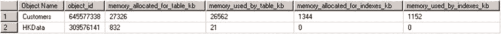

# 第 35 章 ■ 内存中 OLTP 内部机制

**注意** 您可以在 [`msdn.microsoft.com/en-us/library/dn465873.aspx`](https://msdn.microsoft.com/en-us/library/dn465873.aspx) 阅读更多关于将数据库绑定到资源池的信息。

在内存使用过度的情况下，您应分析内存中 OLTP 中哪些对象消耗的内存最多。您可以使用 `sys.dm_db_xtp_table_memory_stats` 视图来检测这些表。代码清单 35-11 展示了一个按表分析内存使用情况的查询。图 35-30 展示了该查询的输出。

### 代码清单 35-11. 检测内存优化表的内存使用情况

```
select object_name(object_id) as [Object Name], *
from sys.dm_db_xtp_table_memory_stats
```

### 图 35-30. 内存使用情况信息

**注意** SQL Server Management Studio 包含一个“按内存优化对象统计的内存使用情况”标准报表，可提供类似信息。

在检测到消耗内存的表之后，您应分析它们为何使用内存，并查看表中的数据和内存消耗者。在表存储了大量数据的情况下，您可以考虑通过将部分数据移动到磁盘表来进行数据分区。

**提示** 从长远来看，为服务器增加更多内存可能是最简单、最经济的选择。通常，升级硬件比花费数百小时重新设计和重构代码与数据库架构更容易且成本更低。

估算内存优化表所需的内存并非一项简单的任务。您需要估算几个不同组件的内存需求：

*行数据大小* 包含一个 24 字节的头、一个索引指针数组（每个索引 8 字节）以及有效负载（实际行数据）的大小。例如，如果您的表有 1,000,000 行和三个索引，并且每行平均约为 200 字节，那么存储行数据将需要 `(24 + 3 * 8 + 200) * 1,000,000 = ~236.5 MB` 的内存（此数字未包含任何行版本控制开销）。不要忘记，每个溢出列会额外增加 54+ 字节来存储溢出行头和行标识符。

*哈希索引* 每个存储桶使用 8 字节。如果一个表定义了两个哈希索引，每个索引有 1,500,000 个存储桶，SQL Server 将创建具有 2,097,152 个存储桶的索引（将索引属性中指定的存储桶数向上舍入到下一个 2 的幂）。这两个索引将使用 `2,097,152 * 2 * 8 = 32 MB` 内存。

*非聚集索引* 的内存使用量基于唯一索引键的数量和索引键大小。如果一个表有一个范围索引，包含 250,000 个唯一键值，并且每个键值平均使用 30 字节，那么它将使用 `(30 + 8(指针)) * 250,000 = ~9 MB` 内存。您可以忽略页头和


根据您的估算，非叶页可以忽略不计，因为它们的尺寸与叶级行大小相比微不足道。

`行版本控制`的内存估算取决于最长事务的持续时间和每秒数据修改（插入和更新）的平均次数。例如，如果系统中的某些进程进行十秒的事务，并且系统平均每秒处理 1，000 次数据修改，您可以估算：10 * 1，000 * 248（行大小）= 约 2.4 MB 的内存用于行版本控制存储。

显然，这些数字勾勒出了最低所需的内存量，并未包括列存储索引使用的内存。您还应考虑未来的增长和工作负载的变化，并预留一些额外的内存以确保安全。

要精确估算内存 OLTP 数据所需的磁盘存储空间几乎是不可能的。这取决于工作负载、数据变更速率以及`检查点`和合并过程的频率。作为一般规则，您应该在磁盘上预留至少比内存中数据行所用空间多出两到三倍的空间。请记住，索引不占用任何磁盘空间，它们在数据加载到内存时重新创建。

## 摘要

海豚计划作为 SQL Server 2014 的一部分发布，是新型无闩锁、无锁的内存 OLTP 引擎，为 OLTP 工作负载提供了卓越的吞吐量。它与 SQL Server 完全集成，允许您将关键数据库表的子集存储在内存中，同时将其他表保留在磁盘上。您可以通过 T-SQL 查询互操作引擎或通过本机编译的存储过程访问内存数据，这将在章节 A 中讨论。

SQL Server 2014 中首次发布的内存 OLTP 引擎存在许多限制。仅举几例，内存优化表仅支持 SQL Server 数据类型的子集，行不能超过 8，060 字节，并且不支持行外存储。索引文本列应具有 BIN2 排序规则。这些限制中的绝大多数已在 SQL Server 2016 中移除。

SQL Server 2016 支持行溢出和 LOB 列，将它们存储在单独的内部表中。哪些列将存储在行外取决于表架构而非数据大小。这些列会引入性能和存储开销，除非绝对必要，否则应避免使用。

内存 OLTP 引擎支持两种类型的索引。哈希索引适用于相等搜索。非聚集（范围）索引类似于常规的 B 树索引。一个表最多可以有八个索引，包括唯一主键。除了 SQL Server 2016 中支持的列存储索引外，内存 OLTP 不会在磁盘上持久化索引；它们在数据加载到内存时重新创建。

SQL Server 使用一组检查点文件来提供数据持久性。数据文件包含行的插入版本。增量文件包含有关已删除行的信息。每对文件覆盖特定的时间范围，并使用流式只追加机制来维护文件。随着已删除行百分比的增长，SQL Server 会合并覆盖相邻时间范围的文件。SQL Server 2016 还使用大型数据文件来存储 LOB 数据和列存储索引。

# 第 35 章 ■ 内存 OLTP 内部原理

内存优化表可以是持久的，也可以是非持久的。来自持久化表的数据修改会记录在事务日志中并保存在检查点文件中。这些数据包含在数据库备份中，并在 AlwaysOn 可用性组中与辅助节点同步。来自非持久表的数据既不保存在检查点文件中，数据修改也不会记录在事务日志中。

您应监控内存优化表的内存使用情况。如果 SQL Server 无法分配内存，内存 OLTP 引擎中的事务将会失败。如果服务器没有足够的内存来加载内存优化数据，SQL Server 和数据库都将无法启动。

# 第 36 章 事务处理


# In-Memory OLTP

本章讨论 In-Memory OLTP 中的事务处理。它阐述了该技术支持的事务隔离级别，讨论了 In-Memory OLTP 事务的生命周期，并解释了 In-Memory OLTP 如何处理数据库系统中遇到的并发现象。最后，本章概述了 In-Memory OLTP 中的事务日志记录。

#### 事务隔离级别与数据一致性

In-Memory OLTP 实现的并发模型相当复杂。在深入探讨其内部实现之前，回顾一下不同事务隔离级别提供的数据一致性级别是有益的。我们在本书的第三部分详细讨论过这一点。然而，在我们开始研究 In-Memory OLTP 的实现细节之前，让我们先回顾几个要点。

任何事务隔离级别都会解决写/写冲突。多个事务不能同时更新同一行。可能有不同的结果，在某些情况下，SQL Server 使用阻塞来防止事务访问未提交的更改，直到进行这些更改的事务被提交。在其他情况下，SQL Server 由于更新冲突而回滚其中一个事务。In-Memory OLTP 使用后一种方法来解决写/写冲突并中止事务。我们稍后将详细讨论这种情况，所以现在让我们专注于读数据一致性。

在多用户环境中，可能存在三个主要的数据不一致问题，如下所示：

**脏读**：一个事务从其他未提交的事务中读取未提交的（脏）数据。

**不可重复读**：在同一事务内后续尝试读取相同数据返回不同的结果。当受影响的事务进行读取之间，其他事务修改甚至删除了数据时，就会出现这种数据不一致问题。

**幻读**：当同一事务内的后续读取返回新行（该事务之前未读取过的行）时，就会发生这种现象。当另一个事务在受影响的事务进行读取之间插入了新数据时，就会发生这种情况。

表 36-1 显示了不同事务隔离级别可能出现的数据不一致问题。

© Dmitri Korotkevitch 2016

D. Korotkevitch, *Pro SQL Server Internals*, DOI 10.1007/978-1-4842-1964-5_36

第三十六章 ■ IN-MEMORY OLTP 中的事务处理

**表 36-1. 事务隔离级别和数据不一致问题**

| 隔离级别 | 脏读 | 不可重复读 | 幻读 |
| :--- | :--- | :--- | :--- |
| READ UNCOMMITTED | 是 | 是 | 是 |
| READ COMMITTED | 否 | 是 | 是 |
| REPEATABLE READ | 否 | 否 | 是 |
| SERIALIZABLE | 否 | 否 | 否 |
| SNAPSHOT | 否 | 否 | 否 |

除了 `SNAPSHOT` 隔离级别外，SQL Server 在处理磁盘表时使用锁来解决数据不一致问题。它阻塞会话读取或修改数据以防止数据不一致。这种行为也意味着，在发生写/写冲突时，最后的修改获胜。例如，当两个事务试图修改同一行时，SQL Server 会阻塞其中一个事务，直到另一个事务提交，从而允许被阻塞的事务之后修改数据。不会引发错误或异常；但是，第一个事务的更改将丢失。

`SNAPSHOT` 隔离级别使用行版本控制模型，其中其他事务所做的所有数据修改对该事务都是不可见的。虽然它在磁盘表与内存优化表中的实现方式不同，但其逻辑行为是相同的。在该模型中，中止和回滚事务可以解决写/写冲突。

## SERIALIZABLE 与 SNAPSHOT 隔离级别

虽然 `SERIALIZABLE` 和 `SNAPSHOT` 隔离级别提供了相同级别的数据不一致问题防护，但它们的行为有细微差别。一个 `SNAPSHOT` 隔离级别事务...


# 第三十六章 ■ 内存 OLTP 中的事务处理

## 内存 OLTP 中的事务隔离级别

在 `SNAPSHOT` 隔离级别下，事务看到的数据是其开始时的数据版本。而在 `SERIALIZABLE` 隔离级别下，事务看到的数据是其首次访问该数据时的状态。

考虑一个场景：一个会话在事务执行过程中从一张表读取数据。如果另一个会话在该事务启动之后、数据被读取之前修改了该表中的数据，那么在 `SERIALIZABLE` 隔离级别下的事务会看到这些更改，而 `SNAPSHOT` 事务则不会。

内存 OLTP 支持三种事务隔离级别：`SNAPSHOT`、`REPEATABLE READ` 和 `SERIALIZABLE`。然而，与磁盘表相比，内存 OLTP 在强制执行数据一致性规则时采用了一种完全不同的方法。它不是通过阻塞其他会话或被其他会话阻塞，而是在事务提交 (`COMMIT`) 时验证数据一致性；如果违反了规则，则会抛出异常并回滚事务。

*   在 `SNAPSHOT` 隔离级别下，其他会话所做的任何更改对该事务都是不可见的。`SNAPSHOT` 事务始终使用事务启动时的数据快照进行工作。在提交时进行的唯一验证是检查主键违规，这被称为 *快照验证*。

*   在 `REPEATABLE READ` 隔离级别下，内存 OLTP 会验证该事务读取的行是否未被其他事务修改或删除。如果发生这种情况，`REPEATABLE READ` 事务将无法提交。此操作被称为 *可重复读验证*。

*   在 `SERIALIZABLE` 隔离级别下，SQL Server 会执行可重复读验证，并检查是否存在由其他会话插入的幻影行 (`phantom rows`)。此过程被称为 *可序列化验证*。

让我们看几个示例来演示这种行为。第一步，如 清单 36-1 所示，我们创建一个内存优化表并插入几行数据。

### 清单 36-1. 数据一致性与事务隔离级别：表创建

```sql
create table dbo.HKData
(
    ID int not null
        constraint PK_HKData
        primary key nonclustered hash with (bucket_count=64),
    Col int not null
)
with (memory_optimized=on, durability=schema_only);

insert into dbo.HKData(ID, Col) values(1,1),(2,2),(3,3),(4,4),(5,5);
```

表 36-2 展示了在 `REPEATABLE READ` 事务隔离级别下并发是如何工作的。需要注意的是，SQL Server 在第一次数据访问时启动事务，而不是在执行 `BEGIN TRAN` 语句时启动。因此，会话 1 的事务在第一个 `SELECT` 操作执行时开始。

### 表 36-2. REPEATABLE READ 事务隔离级别下的并发

| **会话 1** | **会话 2** | **结果** |
| :--- | :--- | :--- |
| begin tran<br>select ID, Col<br>from dbo.HKData<br>with (repeatableread) | update dbo.HKData<br>set Col = -2<br>where ID = 2 | select ID, Col<br>返回旧行版本 (Col = 2)<br>from dbo.HKData<br>with (repeatableread)<br>commit |
| | | 消息 41305，级别 16，状态 0，第 0 行<br>当前事务未能提交，<br>原因是可重复读验证失败。 |
| begin tran<br>select ID, Col<br>from dbo.HKData<br>with (repeatableread) | | *(续)* |

### 表 36-2. （续）

| **会话 1** | **会话 2** | **结果** |
| :--- | :--- | :--- |
| | insert into dbo.HKData<br>values(10,10) | select ID, Col<br>不返回新行 (10,10)<br>from dbo.HKData<br>with (repeatableread)<br>commit |
| | | 成功 |

如你所见，对于内存优化表，其他会话能够修改活跃的 `REPEATABLE READ` 事务已读取的数据。这导致在 `COMMIT` 时，由于可重复读验证失败而中止事务。这与磁盘表的行为完全不同，在磁盘表上，其他会话会被阻塞，直到 `REPEATABLE READ` 事务成功提交之前都无法修改数据。


# 第 36 章 ■ 内存 OLTP 中的事务处理

## 可序列化事务隔离级别中的并发性

同样值得注意的是，对于内存优化表，`REPEATABLE READ`（可重复读）隔离级别可以保护你免受*幻读*现象的影响，而磁盘表则并非如此。

接下来，让我们在`SERIALIZABLE`（可序列化）隔离级别中重复这些测试。你可以在表 36-3 中看到代码和执行结果。

**表 36-3.** 可序列化事务隔离级别中的并发性

| **会话 1** | **会话 2** | **结果** |
| :--- | :--- | :--- |
| `begin tran` | | |
| `select ID, Col` | | |
| `from dbo.HKData` | | |
| `with (serializable)` | | |
| `update dbo.HKData` | | |
| `set Col = -2` | | |
| `where ID = 2` | | |
| `select ID, Col` | | 返回旧行版本 (`Col = 2`) |
| `from dbo.HKData` | | |
| `with (serializable)` | | |
| `commit` | | `Msg 41305, Level 16, State 0, Line 0`<br>`The current transaction failed to commit due`<br>`to a repeatable read validation failure.` |
| | `begin tran` | |
| | `select ID, Col` | |
| | `from dbo.HKData` | |
| | `with (serializable)` | |
| | `insert into dbo.HKData` | |
| | `values(10,10)` | |
| | `select ID, Col` | 不返回新行 (`10,10`) |
| | `from dbo.HKData` | |
| | `with (serializable)` | |
| | `commit` | `Msg 41325, Level 16, State 0, Line 0`<br>`The current transaction failed to commit due`<br>`to a serializable validation failure.` |

如你所见，`SERIALIZABLE`隔离级别会在另一个会话插入新行并违反了可序列化验证时，阻止当前会话提交事务。与`REPEATABLE READ`隔离级别类似，这种行为不同于磁盘表，在磁盘表中，`SERIALIZABLE`事务会成功阻塞其他会话直到其完成。

## 快照事务隔离级别中的并发性

最后，让我们在`SNAPSHOT`（快照）隔离级别中重复测试。代码和结果如表 36-4 所示。

**表 36-4.** 快照事务隔离级别中的并发性

| **会话 1** | **会话 2** | **结果** |
| :--- | :--- | :--- |
| `begin tran` | | |
| `select ID, Col` | | |
| `from dbo.HKData` | | |
| `with (snapshot)` | | |
| `update dbo.HKData` | | |
| `set Col = -2` | | |
| `where ID = 2` | | |
| `select ID, Col` | | 返回旧行版本 (`Col = 2`) |
| `from dbo.HKData` | | |
| `with (snapshot)` | | |
| `commit` | | `成功` |
| | `begin tran` | |
| | `select ID, Col` | |
| | `from dbo.HKData` | |
| | `with (snapshot)` | |
| | `insert into dbo.HKData` | |
| | `values(10,10)` | |
| | `select ID, Col` | 不返回新行 (`10,10`) |
| | `from dbo.HKData` | |
| | `with (snapshot)` | |
| | `commit` | `成功` |

`SNAPSHOT`隔离级别的行为与其在磁盘表中的行为相似，并且可以防止不可重复读和幻读现象。正如你所猜测的，它不需要在提交阶段执行可重复读和可序列化验证，从而降低了 SQL Server 的负载。然而，仍然存在快照验证，它用于检查主键冲突，并且在任何事务隔离级别下都会执行。

## 主键冲突

表 36-5 展示了导致主键冲突条件的代码。与磁盘表不同，异常是在提交阶段而非第二次`INSERT`操作时抛出的。

**表 36-5.** 主键冲突

| **会话 1** | **会话 2** | **结果** |
| :--- | :--- | :--- |
| `begin tran` | | |
| `insert into dbo.HKData` | | |
| `with (snapshot)` | | |
| `(ID, Col)` | | |
| `values(100,100)` | | |
| | `begin tran` | |
| | `insert into dbo.HKData` | |
| | `with (snapshot)` | |
| | `(ID, Col)` | |
| | `values(100,100)` | |
| `commit` | | 第一个会话成功提交 |
| | `commit` | `Msg 41325, Level 16, State 1, Line 0`<br>`The current transaction failed to commit`<br>`due to a serializable validation failure.` |

值得一提的是，尽管 SQL Server 验证的是不同的规则，但错误号和消息与可序列化验证失败时相同。

## 内存 OLTP 中的写/写冲突

在内存 OLTP 中，无论事务隔离级别如何，写/写冲突的工作方式都相同。SQL Server 不允许一个事务修改已被其他未提交事务修改的行。表 36-6 说明了这种行为。它使用了`SNAPSHOT`隔离级别；然而，即使使用不同的隔离级别，行为也不会改变。

**表 36-6.** 内存 OLTP 中的写/写冲突

| **会话 1** | **会话 2** | **结果** |
| :--- | :--- | :--- |
| `begin tran` | | |
| `select ID, Col` | | |
| `from dbo.HKData` | | |
| `with (snapshot)` | | |
| | `begin tran` | |
| | `update dbo.HKData` | |
| | `with (snapshot)` | |


# 第 36 章 ■ 内存 OLTP 中的事务处理

## 会话 1

```sql
begin tran
select ID, Col
from dbo.HKData
with (snapshot)
```

## 会话 2

```sql
begin tran
update dbo.HKData
with (snapshot)
set Col = -3
where ID = 2

update dbo.HKData
with (snapshot)
set Col = -2
where ID = 2

commit
```

## 结果

```
Msg 41302, Level 16, State 110, Line 1
当前事务尝试更新一条记录，但该记录自本事务开始以来已被更新。事务已中止。

Msg 3998, Level 16, State 1, Line 1
在批处理结束时检测到无法提交的事务。事务已回滚。

该语句已终止。

（ *续*）

会话 2 事务成功提交
```

#### 跨容器事务

从解释型 T-SQL 访问内存优化表是通过查询互操作引擎完成的，这会导致*跨容器事务*。你可以为磁盘表和内存优化表使用不同的事务隔离级别，但并非所有组合都受支持。表 36-7 展示了跨容器事务中可能的事务隔离级别组合。

**表 36-7. 跨容器事务的隔离级别**

| 磁盘表的隔离级别 | 内存优化表的隔离级别 |
| :--- | :--- |
| `READ UNCOMMITTED`、`READ COMMITTED`、`SNAPSHOT`、`REPEATABLE READ`、`SERIALIZABLE` | `READ COMMITTED SNAPSHOT` |
| `REPEATABLE READ`、`SERIALIZABLE` | 仅 `SNAPSHOT` |
| `SNAPSHOT` | 不支持 |

正如你已知的，`REPEATABLE READ` 和 `SERIALIZABLE` 隔离级别的内部实现在磁盘表和内存优化表上差异很大。磁盘表的数据一致性规则依赖于锁，而内存 OLTP 使用的是提交前验证。这导致在跨容器事务中出现一种情况：当磁盘表需要 `REPEATABLE READ` 或 `SERIALIZABLE` 隔离级别时，SQL Server 仅支持内存优化表使用 `SNAPSHOT` 隔离级别。

此外，当磁盘表需要 `SNAPSHOT` 隔离级别时，SQL Server 不允许访问内存优化表。简而言之，跨容器事务由两个内部事务组成：一个用于磁盘表，另一个用于内存优化表。无法在完全相同的时间启动这两个事务并保证事务开始时数据的状态。

作为一般准则，建议在常规工作负载的跨容器事务中使用 `READ COMMITTED` / `SNAPSHOT` 组合。这种组合提供了最小的阻塞和最低的提交前开销，在大量用例中都应是可接受的。在避免不可重复读和幻读现象非常重要的数据迁移期间，其他组合则更为合适。

你可能已经注意到，当你访问内存优化表时，SQL Server 要求你通过表提示指定事务隔离级别。这不适用于在显式启动（使用 `BEGIN TRAN`）的事务之外执行的单个语句。这些语句称为*自动提交事务*，每个语句都在一个单独的事务中执行，该事务在语句执行期间处于活动状态。清单 36-2 展示了包含三个语句的代码。每个语句将在它们各自的自动提交事务中运行。

**清单 36-2. 自动提交事务**

```sql
delete from dbo.HKData;
insert into dbo.HKData(ID, Col) values(1,1),(2,2),(3,3),(4,4),(5,5);
select ID, Col from dbo.HKData;
```

对于在自动提交事务中运行的语句，不需要隔离级别提示。当省略提示时，语句在 `SNAPSHOT` 隔离级别下运行。

SQL Server 允许你在从自动提交事务访问内存优化表时保留 `NOLOCK` 提示，但该提示会被忽略。然而，`READUNCOMMITTED` 提示不被支持并会引发错误。

有一个有用的数据库选项 `MEMORY_OPTIMIZED_ELEVATE_TO_SNAPSHOT`，它默认是禁用的。启用此选项后，SQL Server 允许你在非自动提交事务中省略隔离级别提示。如果在启用 `MEMORY_OPTIMIZED_ELEVATE_TO_SNAPSHOT` 选项时未指定隔离级别提示，SQL Server 将像处理自动提交事务一样使用 `SNAPSHOT` 隔离级别。当你将现有系统迁移到内存 OLTP 并且有访问已成为内存优化表的 T-SQL 代码时，请考虑启用此选项。

#### 事务生命周期

虽然我已经讨论过内存 OLTP 用于管理数据访问和并发模型的一些关键元素，但让我们在这里回顾一下。

- *全局事务时间戳* 是一个自动递增的值，用于唯一标识系统中的每个事务。SQL Server 在事务提交阶段递增并获取此值。
- 每一行都有 `BeginTs` 和 `EndTs` 时间戳，它们对应于创建或删除该行版本的事务的*全局事务时间戳*。

当一个新事务启动时，内存 OLTP 会生成一个唯一标识该事务的 `TransactionId` 值。此外，内存 OLTP 为该事务分配*逻辑开始时间*，该时间代表事务启动时的*全局事务时间戳*值。这决定了哪些版本的行对该事务可见。为了使行可见，逻辑开始时间应介于 `BeginTs` 和 `EndTs` 之间。

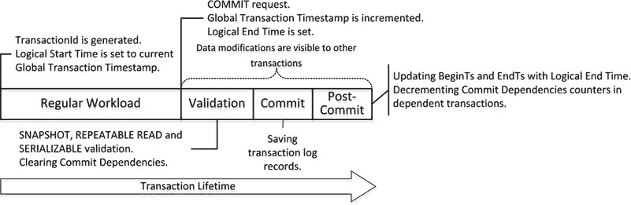

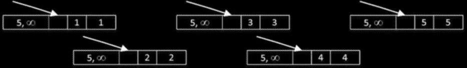

当事务发出 `COMMIT` 语句时，内存 OLTP 递增*全局事务时间戳*值并将其分配给该事务的*逻辑结束时间*。在事务提交后，逻辑结束时间将成为由该事务插入的行的 `BeginTs`，以及由该事务删除的行的 `EndTs`。图 36-1 展示了一个与内存优化表一起工作的事务的生命周期。

**图 36-1. 事务生命周期**

当一个事务处于活动状态并且需要删除一行时，它会用 `TransactionId` 值更新 `EndTs` 时间戳。`INSERT` 操作创建一个新行，其 `BeginTs` 为 `TransactionId`，`EndTs` 为 `Infinity`。最后，`UPDATE` 操作在内部由删除和插入操作组成。同样值得注意的是，在数据修改期间，如果事务正在修改的行存在任何未提交的版本，事务会引发错误。这可以防止多个会话修改相同数据时发生写/写冲突。

当另一个事务（称其为 `Tx1`）遇到 `BeginTs` 或 `EndTs` 时间戳中带有 `TransactionId` 的未提交行时（`TransactionId` 有一个标志指示此条件），它会检查具有该 `TransactionId` 的事务的状态。如果该事务正在提交并且逻辑结束时间已设置，那么这些未提交的行可能对 `Tx1` 事务变得可见，这导致了一种称为*提交依赖项*的情况。`Tx1` 不会被阻塞；然而，在它所依赖的原始事务自行提交之前，它既不会向客户端返回数据也不会提交。我稍后会详细讨论提交依赖项。


让我们详细查看事务的生命周期。图 36-2 展示了我们在清单 36-1 中创建并填充`dbo.HKData`表后的数据行，假设这些行是由`全局事务时间戳`为 5 的事务创建的。（为简化起见，哈希索引结构已省略。）

## 图 36-2. 插入操作后`dbo.HKData`表中的数据

假设有一个事务，它在`全局事务时间戳`值为 9 时启动，生成的`TransactionId`为-8。（我在图中使用负值作为`TransactionId`来说明两种时间戳类型的区别。）

假设该事务执行了清单 36-3 所示的操作。显式事务已经启动，因此清单中未包含`BEGIN TRAN`语句。所有三条语句都在单个活动事务的上下文中执行。

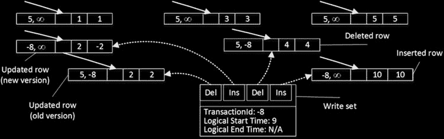


## 第 36 章 ■ 内存 OLTP 中的事务处理

### 清单 36-3. 数据修改操作

```
insert into dbo.HKData with (snapshot) (ID, Col) values(10,10);
update dbo.HKData with (snapshot) set Col = -2 where ID = 2;
delete from dbo.HKData with (snapshot) where ID = 4;
```

图 36-3 展示了数据修改后的状态。一条`INSERT`语句创建了一个新行，一条`DELETE`语句更新了`ID=4`行的`EndTs`值，一条`UPDATE`语句更改了`ID=2`行的`EndTs`值并创建了具有相同 ID 的行的新版本。

## 图 36-3. 修改操作后`dbo.HKData`表中的数据

需要注意的是，事务会维护一个`写入集`，即指向事务插入和删除的行的指针，该集合用于生成事务日志记录。

除了写入集之外，在`可重复读`和`可序列化`隔离级别下，事务还会维护一个`读取集`，其中包含事务读取过的行，并将其用于可重复读验证。最后，在`可序列化`隔离级别下，事务会维护一个`扫描集`，其中包含有关事务中查询所使用的谓词的信息。扫描集用于可序列化验证。

当发出`COMMIT`请求时，事务开始验证阶段。首先，它会自动递增当前的`全局事务时间戳`值，该值成为事务的逻辑结束时间。图 36-4 说明了此状态，假设新的`全局事务时间戳`值为 11。请注意，此时行中的`BeginTs`和`EndTs`时间戳仍然包含`TransactionId`。

## 图 36-4. 验证阶段开始

此时，被事务修改的行对系统中的其他事务变为可见，即使该事务尚未提交，这可能导致提交依赖关系。我们稍后会讨论这些依赖关系。

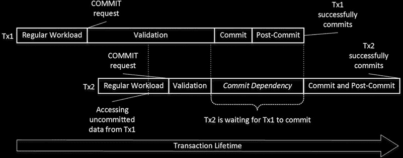

## 第 36 章 ■ 内存 OLTP 中的事务处理

接下来，事务开始验证阶段。SQL Server 根据事务的隔离级别执行多项验证，如表 36-8 所示。

## 表 36-8. 在不同事务隔离级别下执行的验证

```
**快照验证** | **可重复读验证** | **可序列化验证**
--- | --- | ---
检查主键违规 | 检查不可重复读 | 检查幻读
SNAPSHOT | YES | NO | NO
REPEATABLE READ | YES | YES | NO
SERIALIZABLE | YES | YES | YES
```

### ■ **重要提示**

可重复读和可序列化验证会给系统带来额外开销。除非有合理的数据一致性用例，否则不要使用`REPEATABLE READ`和`SERIALIZABLE`隔离级别。

在完成所需规则的验证后，事务将等待提交依赖项被清除。


和它所依赖的待提交事务。如果这些事务因任何原因（例如，违反验证规则）而提交失败，那么依赖它的事务也会被回滚，并生成错误 41301。

## 图 36-5. 提交依赖：成功提交

图 36-5 展示了一个提交依赖的场景。事务 `Tx2` 可以在 `Tx1` 的验证和提交阶段访问 `Tx1` 的未提交行，因此 `Tx2` 对 `Tx1` 存在提交依赖。在 `Tx2` 的验证阶段完成后，`Tx2` 必须等待 `Tx1` 提交并清除提交依赖，才能进入提交阶段。

如果 `Tx1` 因可序列化验证违规等原因而提交失败，`Tx2` 将被回滚并报错 41301，如图 36-6 所示。

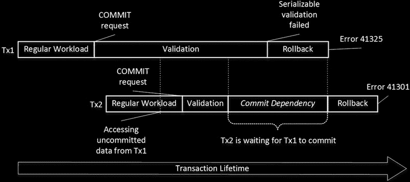

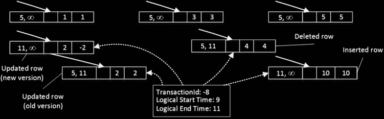

## 图 36-6. 提交依赖：验证错误

从技术上讲，提交依赖是内存 OLTP 中一种阻塞情况。然而，事务的验证和提交阶段相对较短，这种阻塞不应过度。

SQL Server 允许单个事务上最多有八个提交依赖。当达到此限制时，其他试图建立依赖的事务将因错误 41839 而失败。

> **注意：** 您可以使用扩展事件 `dependency_acquiredtx_event` 和 `waiting_for_dependenciestx_event` 来跟踪提交依赖。

当所有提交依赖都被清除后，事务将进入提交阶段，生成一个或多个日志记录，并将其保存到事务日志中，之后进入提交后阶段。在提交后状态下，事务会用逻辑结束时间值替换 `BeginTs` 和 `EndTs` 时间戳，并递减相关事务中的提交依赖计数器。图 36-7 展示了事务的最终状态。

## 图 36-7. 已完成的事务

## 引用完整性实施 (SQL Server 2016)

在纯快照隔离级别下无法实施引用完整性，因为事务之间是完全隔离的。考虑这样一种情况：一个事务删除了某一行，而该行被另一个在原始事务之后启动的事务中插入的新行所引用。内存 OLTP 通过为受引用完整性验证影响的表和查询在快照隔离级别下维护读取和/或扫描集来解决这个问题。

与 `REPEATABLE READ` 和 `SERIALIZABLE` 事务不同，这些集仅针对受影响的表进行维护，而不是整个事务。它们将包括在引用完整性检查期间读取的所有行以及应用的所有谓词。

当引用表在外键列上没有索引时，这种行为可能会导致问题。与磁盘表类似，当您在被引用（主）表中删除一行时，SQL Server 将不得不扫描整个引用（明细）表。除了性能影响外，该事务还将维护读取集，该集合包含其在扫描期间读取的所有行，无论这些行是否引用了已删除的行。如果有任何其他事务更新或删除了读取集中的任何行，原始事务将因违反可重复读取规则而失败。

让我们看一个示例，并使用清单 36-4 中的代码创建两个表。

### 清单 36-4. 引用完整性验证：表创建

```sql
create table dbo.Branches
(
    BranchId int not null
        constraint PK_Branches
        primary key nonclustered hash with (bucket_count = 4)
)
with (memory_optimized = on, durability = schema_only);

create table dbo.Transactions
(
    TransactionId int not null
        constraint PK_Transactions
        primary key nonclustered hash with (bucket_count = 4),
    BranchId int not null
```


# 第 36 章：内存 OLTP 中的事务处理

constraint FK_Transactions_Branches foreign key references `dbo.Branches(BranchId)`, `Amount` money not null )

with (`memory_optimized` = on, `durability` = `schema_only`);

`insert into dbo.Branches(BranchId) values(1),(10);`

`insert into dbo.Transactions(TransactionId,BranchId,Amount) values(1,1,1),(2,1,20);`

`dbo.Transactions` 表有一个外键约束引用了 `dbo.Branches` 表。然而，没有任何行引用 `BranchId` = 10 的那一行。接下来，让我们运行清单 36-5 中所示的代码，删除此行并使事务保持活动状态。

**清单 36-5。** 引用完整性验证：第一个会话代码

```
begin tran
delete from dbo.Branches with (snapshot) where BranchId = 10;
```

该 DELETE 语句会验证外键约束并成功完成。然而，`dbo.Transactions` 表在 `BranchId` 列上没有索引，因此验证将需要扫描整个表，如图 36-8 所示。

**图 36-8。** 引用完整性验证：DELETE 语句的执行计划

此时，`dbo.Transactions` 表中的所有行都将包含在事务读取集中。如果另一个会话使用清单 36-6 所示的代码更新了读取集中的一行，它将会成功，而第一个会话将因 `违反可重复读取规则` 错误而提交失败。

**清单 36-6。** 引用完整性验证：第二个会话代码

```
update dbo.Transactions with (snapshot)
set Amount = 30
where TransactionId = 2;
```

与磁盘表类似，您应该始终在引用表的外键列上创建索引，以避免此问题。

#### 事务日志记录

如前一章所述，内存 OLTP 中的事务日志记录比存储引擎更高效。两个引擎共享相同的事务日志并执行`预写日志记录`（WAL）；然而，日志记录的格式和算法却大不相同。

对于磁盘表，SQL Server 按索引逐个生成事务日志记录。例如，当您向具有聚集索引和非聚集索引的表中插入单行时，它会分别在每个单独的索引中记录 INSERT 操作。此外，它还会记录内部操作，例如区和页的分配、页拆分以及其他一些操作。

所有日志记录都保存在事务日志中，并在创建时几乎同步地硬化到磁盘。正如您已经知道的，每个数据库都会在日志缓冲区中缓存事务日志记录；但是，此缓存非常小，并且在 `COMMIT` 和 `CHECKPOINT` 操作期间会被刷新到磁盘。最后，SQL Server 必须在日志记录中包含行的*更新前*（撤消）和*更新后*（重做）版本。检查点过程是异步的，不检查修改页的事务的状态。检查点完全有可能保存来自未提交事务的脏数据页，此时就需要日志记录的撤消部分来回滚更改。

内存 OLTP 中的事务日志记录解决了这些低效问题。第一个主要区别是，内存 OLTP 在事务 `COMMIT` 时生成并保存日志记录，而不是在每次数据行修改时。因此，回滚的事务不会产生任何日志活动。

日志记录的格式也不同，并且高效得多。日志记录不包含任何撤消信息。来自未提交事务的脏数据永远不会出现在磁盘上，因此内存 OLTP 日志数据无需支持崩溃恢复的撤消阶段，也无需记录未提交的更改。

内存 OLTP 基于事务的写入集生成日志记录。所有数据修改


# 第 36 章 ■ 内存 OLTP 中的事务处理

## 日志行为概述

根据写入集和插入行的大小，多个操作会被合并到一个或极少数的日志记录中。此外，对非持久性内存优化表的数据修改完全不会被记录。

让我们来研究这种行为，并运行清单 36-7 中显示的代码。它启动一个事务并向内存优化表插入 500 行。然后，它使用未公开的`sys.fn_dblog`系统函数检查事务日志的内容。

### 清单 36-7. 内存 OLTP 中的事务日志记录：内存优化表日志记录

```sql
create table dbo.HKData
(
ID int not null,
Col int not null,
constraint PK_HKData
primary key nonclustered hash(ID) with (bucket_count=1024),
)
with (memory_optimized=on, durability=schema_and_data);

declare
@I int = 1
begin tran
while @I <= 500
begin
insert into dbo.HKData with (snapshot) (ID, Col) values(@I, @I);
set @I += 1;
end
commit;

select * from sys.fn_dblog(null, null) order by [Current LSN];
```

## 磁盘表对比

图 36-9 展示了事务日志的内容。你可以看到该内存 OLTP 事务的单一事务记录。

**图 36-9.** 内存 OLTP 事务后的事务日志内容

让我们用一个结构类似的磁盘表重复这个测试。清单 36-8 展示了创建表并填充数据的代码。

### 清单 36-8. 内存 OLTP 中的事务日志记录：磁盘表日志记录

```sql
create table dbo.DiskData
(
ID int not null,
Col int not null,
constraint PK_DiskData primary key nonclustered(ID)
);

declare
@I int = 1
begin tran
while @I <= 500
begin
insert into dbo.DiskData(ID, Col) values(@I, @I);
set @I += 1;
end
commit;
```

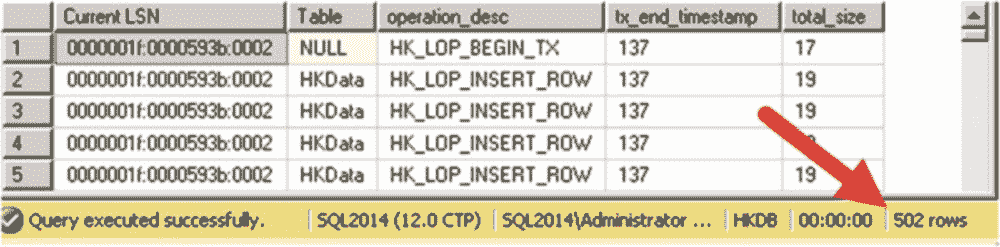

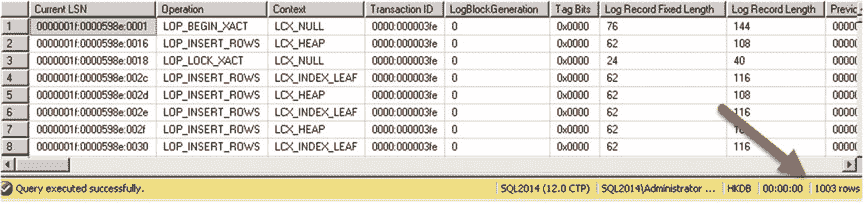

如图 36-10 所示，同一个事务生成了超过 1000 条日志记录。

**图 36-10.** 磁盘表修改后的事务日志内容

## 分析内存 OLTP 日志记录

你可以使用另一个未公开的函数`sys.fn_dblog_xtp`来检查内存 OLTP 日志记录的逻辑内容。清单 36-9 展示了使用该函数的代码，图 36-11 展示了该代码的输出。你应该使用清单 36-7 输出中`LSN_HK`日志记录的 LSN 作为该函数的参数。

### 清单 36-9. 分析内存 OLTP 日志记录

```sql
select [Current LSN], object_name(table_id) as [Table]
,operation_desc, tx_end_timestamp, total_size
from sys.fn_dblog_xtp
(
'0x0000001f:0000593b:0002'
,'0x0000001f:0000593b:0002'
)
```

**图 36-11.** 内存 OLTP 事务日志记录详细信息

## 非持久性表

最后，值得再次指出，对非持久性表（`DURABILITY=SCHEMA_ONLY`）进行的任何数据修改都不会记录在事务日志中，其数据也不会持久化到磁盘。这使得这些表非常适合用作 ETL 过程中的临时暂存表。显然，你应该记住非持久性表中的数据在服务器崩溃或故障转移后无法保留；你应该在 ETL 代码中处理这些情况。

#### 总结

内存 OLTP 支持三种事务隔离级别：`SNAPSHOT`（快照）、`REPEATABLE READ`（可重复读）和`SERIALIZABLE`（可序列化）。与通过获取和持有锁来处理不可重复读和幻读的磁盘表不同，内存 OLTP 在事务提交阶段验证数据一致性规则。如果违反规则，将引发异常并且回滚事务。

可重复读和可序列化验证会增加事务处理的开销。建议在常规工作负载期间使用`SNAPSHOT`隔离级别，除非需要`REPEATABLE READ`或`SERIALIZABLE`的数据一致性。

SQL Server 2016 执行可重复读和可序列化验证以强制系统中的引用完整性。务必在引用表的外键列上创建索引以提高性能。


# 第 37 章 内存 OLTP 可编程性

本章重点介绍 SQL Server 中内存 OLTP 引擎的可编程性方面。它描述了原生编译的过程，并概述了在内存 OLTP 中支持的原生编译模块和 T-SQL 功能。最后，讨论了与设计新系统以及将现有系统迁移到内存 OLTP 架构相关的几个问题。

## 原生编译

如您所知，可以通过常规 T-SQL 代码使用查询互操作引擎访问内存优化表。这种方法非常灵活。只要在支持的功能集内工作，数据的位置就是透明的。代码不需要知道，也不需要关心它是在处理磁盘表还是内存优化表。

不幸的是，这种灵活性是有代价的。T-SQL 是一种解释型且 CPU 密集型的语言。即使是一个简单的 T-SQL 语句也需要成千上万，有时甚至是数百万条 CPU 指令来执行。尽管内存中的数据位置极大地加快了数据访问速度，并消除了闩锁和锁定争用，但 T-SQL 解释和执行的开销限制了内存 OLTP 可实现的性能提升水平。

> **注意** 在 SQL Server 2016 中，原生编译在操作分析场景中没有帮助。列存储索引只能在查询互操作模式下使用。

实际上，当通过互操作引擎访问内存优化数据时，可以看到系统吞吐量提高 2 到 4 倍。为了进一步提高性能，内存 OLTP 利用了原生编译。作为第一步，它将任何行数据操作和访问逻辑转换为 C 代码，然后编译成 DLL 并加载到 SQL Server 进程内存中。这些 DLL（每个表一个）由原生 CPU 指令组成，它们的执行无需任何进一步的 T-SQL 语句代码解释开销。

© Dmitri Korotkevitch 2016

D. Korotkevitch, *Pro SQL Server Internals*, DOI 10.1007/978-1-4842-1964-5_37

# 第 37 章 ■ 内存 OLTP 可编程性

考虑一个简单的情况，您需要从数据行中读取一个定长列的值。对于磁盘表，SQL Server 从系统目录中获取列的起始偏移量和长度，并执行必要的操作将字节序列转换为所需的数据类型。而对于内存优化表，DLL 已经知道列的偏移量和数据类型是什么。SQL Server 可以使用正确数据类型的指针，直接从行中预定义的偏移量读取数据。

您可以在磁盘和内存优化表的跨容器事务中使用不同的事务隔离级别；但是，并非所有组合都受支持。推荐的做法是为磁盘表使用`READ COMMITTED`隔离级别，为内存优化表使用`SNAPSHOT`隔离级别。

当您在自动提交（单语句）事务中通过互操作引擎访问内存优化表时，SQL Server 不要求您指定事务隔离级别。SQL Server 会自动将此类事务提升到`SNAPSHOT`隔离级别。但是，当事务通过`BEGIN TRAN`语句显式启动时，您应该指定一个隔离级别提示。您可以通过启用`MEMORY_OPTIMIZED_ELEVATE_TO_SNAPSHOT`数据库选项来避免这种情况。当您将现有系统移植到使用内存 OLTP 时，此选项非常有用。

内存 OLTP 中的事务日志记录比磁盘表更高效。事务在提交时基于事务写入集进行日志记录。日志记录紧凑，并包含有关多个行相关操作的信息。

内存 OLTP 不会记录在非持久内存优化表中所做的任何数据修改。这使得它们成为 ETL 过程中暂存表的绝佳选择。

> 当通过互操作引擎访问内存优化数据时，实际上可以看到系统吞吐量提高 2 到 4 倍。为了进一步提高性能，内存 OLTP 利用了原生编译。作为第一步，它将任何行数据操作和访问逻辑转换为 C 代码，这些代码被编译成 DLL 并加载到 SQL Server 进程内存中。这些 DLL（每个表一个）由原生 CPU 指令组成，它们的执行无需任何进一步的 T-SQL 语句代码解释开销。


任何进一步的开销。正如您能猜到的，这种方法显著减少了操作所需的 CPU 指令数量。

另一方面，这种方法带来了一些限制。在`DLL`生成后，您无法更改行的格式。已编译的代码对更改一无所知。这个问题比看起来更复杂，简单地重新编译`DLL`并不能解决它。

考虑一种情况，您需要向表中添加另一个可为空的列。对于磁盘表来说，这是一个元数据级别的操作，不会更改现有表行中的数据。`T-SQL`能够在运行时通过分析各种数据行属性来检测列数据是否存在。

对于内存优化表和本地编译代码，情况要复杂得多。生成知晓新数据列的新版本`DLL`很容易；然而，这还不够。`DLL`需要处理不同版本的行以及根据列数据是否存在而定的不同数据格式。虽然这在技术上是可行的，但它给`DLL`增加了额外的逻辑，导致额外的处理指令，从而减慢了数据访问速度。此外，支持多种数据格式的逻辑将永久保留在代码中，每次表更改都会进一步降低性能。

解决此问题的唯一方法是将所有现有数据行转换为新格式，重建表。这正是`SQL Server 2016`中表更改操作所执行的。在`SQL Server 2014`中，不支持此操作，因此您需要通过创建另一个表并将数据复制到其中来手动实现。请记住，您不能重命名内存优化表，您需要么更改引用新表名的代码，要么在过程中通过将数据暂存在暂存表中来重建原始表。您也可以使用同义词通过旧名称引用新表。

为了进一步减少`T-SQL`解释的开销，`内存 OLTP 引擎`允许您对存储过程进行本地编译，在`SQL Server 2016`中，还支持对`DML`触发器和标量表值函数进行本地编译。这些模块的编译方式与表相关的`DLL`相同，并且也会加载到`SQL Server`进程内存中。我们将在本章后面更详细地讨论本地编译的存储过程和其他模块。

本地编译同时利用了`SQL Server`和`内存 OLTP`引擎。作为第一步，`SQL Server`解析`T-SQL`代码并使用`查询优化器`生成执行计划。在此阶段结束时，`SQL Server`生成一个称为`MAT（混合抽象树）`的结构，它表示元数据、命令式逻辑、表达式和查询计划。

作为下一步，`内存 OLTP`将`MAT`转换为另一个称为`PIT（纯命令式树）`的结构，该结构用于生成源代码，该源代码被编译并链接到`DLL`中。

图 37-1 说明了`SQL Server`中的本地编译过程。

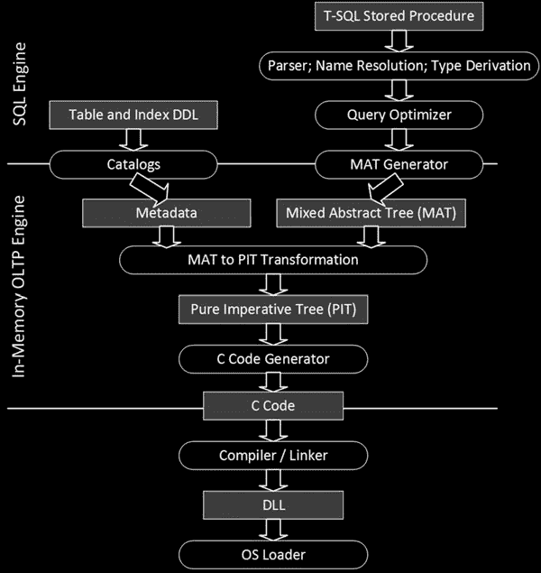

**第 37 章 ■ 内存 OLTP 可编程性**

**图 37-1.** `SQL Server`中的本地编译

为本地编译生成的代码使用纯`C`语言，非常高效。然而，它非常难以阅读。例如，每个方法都实现为一个单一函数，该函数不调用其他函数，而是使用`GOTO`作为控制流语句在其代码中内联实现。您应该记住，其意图从来不是生成人类可读的代码。它仅用作本地编译的源代码。

二进制`DLL`文件不会持久化在数据库备份中。`SQL Server`在数据库启动时重新创建表相关的`DLL`，在首次调用时重新创建存储过程相关的`DLL`。这种方法解决了黑客用恶意副本替换`DLL`的安全风险。

`SQL Server`将二进制`DLL`文件和所有其他与本地编译相关的文件放在


# 第 37 章：内存 OLTP 可编程性

SQL Server 的主数据目录通过创建另一级子文件夹，按数据库对文件进行分组。图 37-2 显示了一个包含多个内存 OLTP 对象的数据库文件夹（ID=9）的内容。

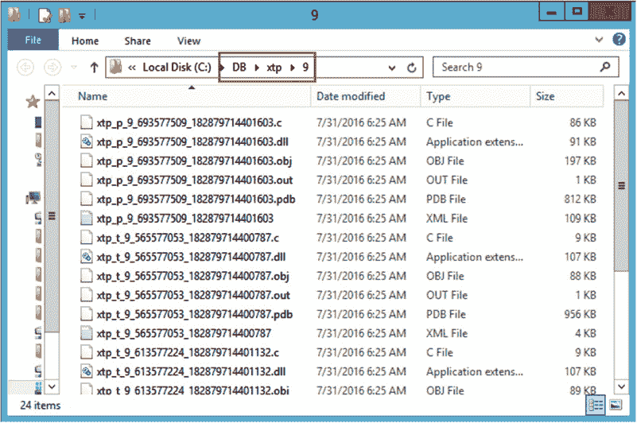

**图 37-2：** 包含本机编译对象的文件夹

所有文件名均以 `xtp_` 前缀开头，后跟 `p`（存储过程、标量函数或触发器）或 `t`（表）字符，用于指示对象类型。名称的最后两部分包含该对象的数据库 ID 和对象 ID。

文件扩展名决定了文件的类型，例如：

-   `*.mat.xml` 文件存储 MAT 结构的 XML 表示。
-   `*.c` 文件是由 C 代码生成器生成的源文件。
-   `*.obj` 文件是由 C 编译器生成的目标文件。
-   `*.pub` 文件是由 C 编译器生成的符号文件。
-   `*.out` 文件是来自 C 编译器的日志文件。
-   `*.dll` 文件是由 C 链接器生成的、本机编译的 DLL。这些文件被加载到 SQL Server 内存中，并由内存 OLTP 引擎使用。

代码清单 37-1 展示了如何获取已加载到 SQL Server 内存中的本机编译对象列表。它还返回了数据库中的表和存储过程列表，以展示 DLL 文件名与对象 ID 之间的关联。

**代码清单 37-1：** 获取已加载到 SQL Server 内存中的本机编译对象列表

```sql
select
    s.name + '.' + o.name as [Object Name], o.object_id
from
    ( select schema_id, name, object_id
      from sys.tables
      where is_memory_optimized = 1
      union all
      select schema_id, name, object_id
      from sys.procedures
    ) o join sys.schemas s on
        o.schema_id = s.schema_id;

select base_address, language, description, name
from sys.dm_os_loaded_modules
where description = 'XTP Native DLL';
```

图 37-3 展示了上述代码的输出结果。

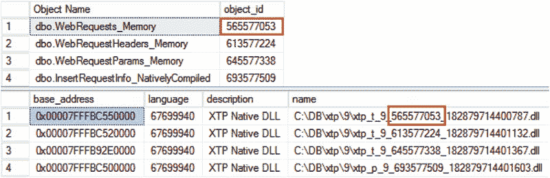

**图 37-3：** 已加载到 SQL Server 内存中的本机编译对象

**SQL Server 2016** 允许你 `ALTER`（修改）本机编译模块。这是一个联机操作；在编译期间，SQL Server 会使用模块的旧版本，并在编译完成后用新的 DLL 替换它。SQL Server 2014 不支持修改操作，你唯一的选择是删除并重新创建存储过程。

#### 本机编译模块

本机编译存储过程是被编译为本机代码的存储过程。它们效率极高，与通过查询互操作组件访问内存优化表的解释型 T-SQL 语句相比，能带来显著的性能提升。此外，SQL Server 2016 还允许你本机编译触发器和标量用户定义函数。

> **注意：** 在本章中，我将常规的解释型（非本机编译）模块称为 `T-SQL` 模块。

本机编译模块只能访问内存优化表。而且，与查询互操作引擎相比，它们支持的 T-SQL 特性子集更小。在讨论 SQL Server 何时编译以及如何优化本机编译模块之后，我们将更详细地讨论这些限制。

## 本机编译模块的优化

解释型 T-SQL 存储过程和其他模块在首次执行时编译。此外，在它们被驱逐出计划缓存后，以及在其他一些情况下（如统计信息过时、数据库架构更改或代码中显式请求重编译），它们可能会被重新编译。

这种行为与本机编译模块不同，后者在创建时即被编译。除了 SQL Server 或数据库重启的情况外，它们永远不会被重新编译。在这些情况下，重编译发生在首次调用时。


SQL Server 在编译时不进行参数嗅探，而是针对 **UNKNOWN** 值来优化语句。它在优化时使用内存优化表的统计信息，这些统计信息可能已过时，也可能没有，尤其是在 SQL Server 2014 中，统计信息不会自动更新。

幸运的是，对于原生编译模块，基数估计错误对性能的影响较小。与磁盘表相反（在磁盘表中，由于大量的 `key` 或 `RID lookup` 操作，此类错误可能导致效率极低的计划），内存优化表中的所有索引都引用相同的数据行，简而言之，它们都是行内列的覆盖索引。此外，错误不会影响连接策略的选择——在 SQL Server 2014 和 2016 的原生编译模块中，唯一支持的物理连接类型是 `nested loop`。

然而，编译时过时的统计信息仍可能导致效率低下的计划。一个这样的例子是在索引列上带有多个谓词的查询。SQL Server 需要知道索引的选择性才能选择最高效的索引。

如果表中的数据发生了显著变化，最好重新编译原生编译模块。在 `SQL Server 2016` 中，你可以通过调用 `sp_recompile` 系统存储过程来实现。不幸的是，这在 `SQL Server 2014` 中不受支持，因此你必须通过以下一系列操作来重新创建原生编译存储过程：

1.  更新统计信息以反映表中的当前数据分布。
2.  脚本化分配给原生编译存储过程的权限。
3.  删除并重新创建过程。这些操作将强制重新编译。
4.  为过程分配所需的权限。

最后，值得提及的是，原生编译模块的存在通常需要你调整系统中的部署过程。常见的做法是在部署开始时创建所有数据库架构对象，包括表和存储过程。虽然部署时间对于 T-SQL 模块无关紧要，但这种策略会在数据库表为空时编译原生编译模块。你应该在表中填充了数据并更新了统计信息之后，重新编译（或重新创建）原生编译模块。

## 创建原生编译存储过程

原生编译存储过程和其他模块以原子块的形式执行，这是一种 `全有或全无` 的方法。模块中的所有语句要么全部成功，要么全部失败。

当在活动事务上下文之外调用原生编译存储过程时，它会启动一个新事务，并在执行结束时提交或回滚该事务。

在过程于活动事务上下文中被调用的情况下，SQL Server 会在过程执行开始时创建一个保存点。如果过程中出现错误，SQL Server 会将事务回滚到创建的保存点。根据错误的严重程度和类型，事务要么能够继续并提交，要么变为可疑状态并无法提交。原生编译 DML 触发器也是如此，它们总是在活动事务的上下文中执行。

## 第 37 章 ■ 内存 OLTP 可编程性

让我们看一个例子，创建一个内存优化表和一个原生编译存储过程，如代码清单 37-2 所示。请不要关注存储过程主体中不熟悉的结构。我会稍后解释它们。

***代码清单 37-2.*** 原子块和事务：对象创建

```sql
create table dbo.MOData
(
    ID int not null
        primary key nonclustered hash with (bucket_count=16),
    Value int null
)
with (memory_optimized=on, durability=schema_only);

insert into dbo.MOData(ID, Value) values(1,1), (2,2)
go

create proc dbo.AtomicBlockDemo
(
    @ID1 int not null
    ,@Value1 bigint not null
    ,@ID2 int
    ,@Value2 bigint
)
with
    native_compilation
    , schemabinding, execute as owner
as
begin atomic
with (transaction isolation level = snapshot, language=N'us_english')
```


# 第 37 章 ■ 内存中 OLTP 可编程性

```sql
update dbo.MOData set Value = @Value1 where ID = @ID1;

if @ID2 is not null

update dbo.MOData set Value = @Value2 where ID = @ID2;

end;
```

此时，`dbo.MOData` 表中有两行数据，值分别为 (1,1) 和 (2,2)。现在，我们启动事务并调用存储过程两次，如清单 37-3 所示。

### 清单 37-3. 原子块与事务：调用存储过程

```sql
begin tran

exec dbo.AtomicBlockDemo 1, -1, 2, -2;

exec dbo.AtomicBlockDemo 1, 0, 2, 999999999999999;
```

存储过程的第一次调用成功，而第二次调用触发了一个算术溢出错误，如下所示：

```
Msg 8115, Level 16, State 0, Procedure AtomicBlockDemo, Line 49
Arithmetic overflow error converting bigint to data type int.
```

你可以使用以下 SELECT 语句检查事务是否仍处于活动状态并且可提交：
```sql
SELECT @@TRANCOUNT AS [@@TRANCOUNT], XACT_STATE() AS [XACT_STATE()];
```
它将返回以下结果：

```
@@TRANCOUNT XACT_STATE()
----------- ------------
1           1
```

如果你提交事务并检查表的内容，你会发现数据反映了第一次存储过程调用所做的更改。即使第二次调用中的第一条 UPDATE 语句成功了，SQL Server 也回滚了它，因为本地编译的存储过程是作为原子块执行的。你可以在下面的表中看到数据。

```
ID Value
----------- -----------
1 -1
2 -2
```

作为第二个例子，我们来触发一个严重错误，这将导致事务被判定为不可提交。一种情况是写/写冲突。你可以在两个不同的会话中执行清单 37-4 中的代码来触发它。

### 清单 37-4. 原子块与事务：写/写冲突

```sql
begin tran

exec dbo.AtomicBlockDemo 1, 0, null, null;
```

当你在第二个会话中运行代码时，会触发以下异常：

```
Msg 41302, Level 16, State 110, Procedure AtomicBlockDemo, Line 13
The current transaction attempted to update a record that has been updated since this
transaction started. The transaction was aborted.
Msg 3998, Level 16, State 1, Line 1
Uncommittable transaction is detected at the end of the batch. The transaction is rolled
back.
```

如果你在第二个会话中检查 `@@TRANCOUNT`，你会发现 SQL Server 已经终止了该事务，如下所示。

```
@@TRANCOUNT
-----------
0
```

如你所见，当原子块在活动事务的上下文中执行时，原子块中的严重错误会回滚整个事务，而非关键错误则会将事务回滚到与块开始相对应的保存点。

你应该通过在模块的顶层使用 `BEGIN ATOMIC..END` 来指定本地编译的模块是一个原子块。它有两项必需和三项可选设置，如下所示：

- `TRANSACTION ISOLATION LEVEL` 是必需的设置，用于控制原子块中的事务隔离级别。你可以使用 `SNAPSHOT`、`REPEATABLEREAD` 或 `SERIALIZABLE` 隔离级别。
- `LANGUAGE` 设置是必需的。它决定了块中的日期/时间格式和系统消息的语言。
- `DATEFORMAT` 是可选的，它允许你覆盖与语言关联的默认日期格式。
- `DATEFIRST` 是可选的，它覆盖与语言关联的默认值。
- `DELAYED_DURABILITY` 是可选的，它指定了由原子块启动的事务的持久性选项。

同样值得注意的是，解释型 T-SQL 模块中不支持原子块。

所有本地编译的对象都是架构绑定的，它们要求你指定 `SCHEMABINDING` 选项。最后，在 `SQL Server 2014` 中，本地编译的存储过程不支持 `EXECUTE AS CALLER` 执行上下文，要求你在定义中指定 `EXECUTE AS OWNER`、`EXECUTE AS USER` 或 `EXECUTE AS SELF` 上下文。此限制在 `SQL Server 2016` 中被移除，执行上下文变为可选。


■ **注意** 你可以在 http://technet.microsoft.com/en-us/library/ms188354.aspx 阅读关于执行上下文的内容。

正如你在清单 37-2 中已经看到的，你可以使用 `NOT NULL` 结构在模块定义中指定所需的参数。如果在调用时未提供参数值，SQL Server 会引发错误。

最后，建议在调用原生编译的存储过程时避免类型转换，并且不要使用命名参数。使用 `exec Proc value [..,value]` 调用格式比 `exec Proc @Param=value [..,@Param=value]` 更高效。

■ **注意** 你可以使用 `hekaton_slow_parameter_parsing` 扩展事件来检测低效的参数化。

## 原生编译的触发器和用户定义函数 (SQL Server 2016)

SQL Server 2016 允许你在内存优化表上创建原生编译的标量用户定义函数和 DML 触发器。与原生编译的存储过程一样，这些模块无法访问磁盘上的对象。

清单 37-5 展示了创建这两种对象的代码。

***清单 37-5.*** 原生编译的触发器和用户定义函数

```sql
create trigger NativelyCompiledTrigger on dbo.MemoryOptimizedTable
with native_compilation, schemabinding
after insert
as
begin atomic with
(
    transaction isolation level = snapshot, language = N'English'
)
    if @@rowcount = 0
        return;
    /* Trigger Body */
end
go

create function dbo.NativelyCompiledScalarFunction(@Param1 int not null)
returns int
with native_compilation, schemabinding
as
begin atomic with
(
    transaction isolation level = snapshot, language = N'us_english'
)
    declare
        @Result int = 0
    /* Function Body */
    return @Result;
end
```

与 T-SQL 触发器和标量用户定义函数一样，你应该考虑这些模块带来的开销。让我们运行几个测试，比较解释型 T-SQL 和原生编译标量函数的性能。清单 37-6 创建了两个非常简单的函数，它们只运行一个空的 `WHILE` 循环，没有任何数据访问。

***清单 37-6.*** 原生编译与解释型函数：函数的创建

```sql
create function dbo.ScalarInterpret(@LoopCnt int)
returns int
as
begin
    declare
        @I int = 0
    while @I < @LoopCnt
        select @I += 1;
    return @I;
end
go

create function dbo.ScalarNativelyCompiled(@LoopCnt int)
returns int
with native_compilation, schemabinding
as
begin atomic with (transaction isolation level = snapshot, language = N'us_english')
    declare
        @I int = 0
    while @I < @LoopCnt
        select @I += 1;
    return @I;
end
```

作为下一步，让我们调用这些函数，在它们内部运行一个 1,000,000 次执行的循环，如清单 37-7 所示。

***清单 37-7.*** 原生编译与解释型函数：在函数内运行循环

```sql
select dbo.ScalarInterpret(1000000);
select dbo.ScalarNativelyCompiled(1000000);
```

表 37-1 说明了我在我的环境中的执行时间。如你所见，原生编译函数比其解释型 T-SQL 对应项快了几个数量级。

***表 37-1.** 函数运行 1,000,000 次执行循环时的执行时间*

| 解释型 T-SQL 函数 | 原生编译函数 |
| :--- | :--- |
| 454 ms | 5 ms |

让我们运行另一个测试，在循环中调用函数，如清单 37-8 所示。函数内部不执行 `WHILE` 循环，而是被调用 1,000,000 次。表 37-2 显示了我在我的环境中的执行时间。

***清单 37-8.*** 原生编译与解释型函数：多次调用

```sql
declare
    @Dummy int
    ,@I int = 0

while @I < 1000000
begin
    select @Dummy = dbo.ScalarInterpret(0);
    select @I += 1;
end;

set @I = 0;
while @I < 1000000
begin
    select @Dummy = dbo.ScalarNativelyCompiled(0);
```


# 第 37 章 ■ 内存中 OLTP 可编程性

```sql
select @I += 1;
end;
```

**表 37-2.** 1,000,000 次函数调用的执行时间

| 解释型 T-SQL 函数 | 原生编译函数 |
| :--- | :--- |
| 12,344 毫秒 | 11,392 毫秒 |

尽管原生编译函数比解释型 T-SQL 函数快得多，但两者的执行开销非常相似。即使在原生编译的情况下，你也应该避免在代码中使用标量用户定义函数。

**SQL Server 2016** 还允许你将内联表值函数标记为原生编译。然而，它们的行为与其他模块不同。当你将这些函数标记为原生编译时，`SQL Server` 只是验证它们使用了原生编译所支持的语言构造。这些函数并未被实际编译，而是嵌入到引用它们的其他原生编译模块中。

当你通过查询互操作从 `T-SQL` 调用原生编译内联表值函数时，`SQL Server` 将它们视为常规的 `T-SQL` 内联表值函数，将其语句嵌入到引用的查询中。

代码清单 37-9 展示了一个原生编译内联表值函数。

**代码清单 37-9.** 原生编译内联表值函数

```sql
create function dbo.NativeCompiledInlineTVF(@Param datetime)
returns table
with native_compilation, schemabinding
as
return
(
    select count(*) as Result
    from dbo.MemoryOptimizedTable
    where DateCol >= @Param
)
```

## 支持的 T-SQL 特性

原生编译模块仅支持有限的 `T-SQL` 构造。在 `SQL Server 2014` 中，限制列表很长。幸运的是，`SQL Server 2016` 解除了其中许多限制。

让我们看看不同领域支持的功能。

### 控制流

支持以下控制流选项：

- `IF` 和 `WHILE`
- 使用 `SELECT` 和 `SET` 运算符为变量赋值。
- `RETURN`
- `TRY / CATCH / THROW`（不支持 `RAISERROR`）。为了获得更好的性能，建议为整个存储过程使用一个 `TRY / CATCH` 块。
- 只要变量在 `DECLARE` 语句中带有初始值，就可以将其声明为 `NOT NULL`。
- `SQL Server 2016` 支持嵌套的原生编译模块执行。例如，原生编译存储过程可以调用另一个原生编译过程或函数。

#### 运算符

支持以下运算符：

- 比较运算符，如 `=`、`<`、`<=`、`>`、`>=` 和 `<>`。
- 一元和二元运算符，如 `+`、`-`、`*`、`/` 和 `%`。`+` 运算符支持数字和字符串。
- 位运算符，如 `&`、`|`、`~` 和 `^`。
- 逻辑运算符，如 `AND`、`OR` 和 `NOT`。然而，在 `SQL Server 2014` 中，查询的 `WHERE` 和 `HAVING` 子句中不支持 `OR` 和 `NOT` 运算符。
- `SQL Server 2016` 支持 `IN`、`BETWEEN` 和 `EXISTS` 运算符。

#### 内置函数

支持以下内置函数：

- 数学函数：`SQL Server 2016` 支持所有数学函数。在 `SQL Server 2014` 中，支持以下函数：`ACOS`、`ASIN`、`ATAN`、`ATN2`、`COS`、`COT`、`DEGREES`、`EXP`、`LOG`、`LOG10`、`PI`、`POWER`、`RAND`、`SIN`、`SQRT`、`SQUARE` 和 `TAN`
- 日期/时间函数：`CURRENT_TIMESTAMP`、`DATEADD`、`DATEDIFF`、`DATEFROMPARTS`、`DATEPART`、`DATETIME2FROMPARTS`、`DATETIMEFROMPARTS`、`DAY`、`EOMONTH`、`GETDATE`、`GETUTCDATE`、`MONTH`、`SMALLDATETIMEFROMPARTS`、`SYSDATETIME`、`SYSUTCDATETIME` 和 `YEAR`
- 字符串函数：`LEN`、`LTRIM`、`RTRIM` 和 `SUBSTRING`
- 错误函数：`ERROR_LINE`、`ERROR_MESSAGE`、`ERROR_NUMBER`、`ERROR_PROCEDURE`、`ERROR_SEVERITY` 和 `ERROR_STATE`
- `NEWID` 和 `NEWSEQUENTIALID`
- `CAST` 和 `CONVERT`。但是，无法在非 Unicode 字符串和 Unicode 字符串之间进行转换。
- `ISNULL`
- `SCOPE_IDENTITY`
- 你可以在原生编译存储过程中使用 `@@ROWCOUNT`；但是，其值在过程开始和结束时都会被重置为 `0`。
- `SQL Server 2016` 支持 `@@SPID` 函数。


# 第 37 章 ■ 内存 OLTP 可编程性

## 查询支持范围

支持以下查询类型：

`SELECT`、`INSERT`、`UPDATE` 和 `DELETE`。`SQL Server 2016` 支持 `SELECT DISTINCT` 运算符，并允许在 `INSERT`、`UPDATE` 和 `DELETE` 运算符中使用 `OUTPUT` 子句。

`SQL Server 2016` 支持 `UNION` 和 `UNION ALL` 运算符。

`CROSS JOIN` 和 `INNER JOIN` 是 `SQL Server 2014` 中唯一支持的连接类型。`SQL Server 2016` 还支持 `LEFT OUTER JOIN` 和 `RIGHT OUTER JOIN`。连接只能与 `SELECT` 运算符一起使用。

只要使用了支持的运算符，`SELECT` 列表以及 `WHERE` 和 `HAVING` 子句中的表达式均受支持。

`SQL Server 2016` 支持在 `FROM` 和 `WHERE` 子句中使用子查询，以及在 `SELECT` 子句中使用标量子查询。

`IS NULL` 和 `IS NOT NULL`。

支持 `GROUP BY`，但按字符串或二进制数据分组除外。

支持 `TOP` 和 `ORDER BY`。但是，不能在 `TOP` 子句中与 `WITH TIES` 和 `PERCENT` 一起使用。此外，当使用 `TOP <constant>` 时，`TOP` 运算符限制为 8,192 行，或者在连接的情况下限制为更少的行。你可以通过使用 `TOP <variable>` 方法来解决后一个限制，但这在性能方面效率较低。

`SQL Server 2016` 中的本地编译仍然有一些限制和不受支持的 T-SQL 构造。例如，你可以想到不支持的 `CASE` 和 `MERGE` 语句。

## 执行统计信息

默认情况下，`SQL Server` 不会为本地编译的存储过程收集执行统计信息，因为这会带来性能影响。你可以使用 `exec sys.sp_xtp_control_proc_exec_stats 1` 命令在过程级别启用此类收集。此外，你还可以使用 `exec sys.sp_xtp_control_query_exec_stats 1` 命令在语句级别启用收集。`SQL Server` 不会持久化这些设置，每次重启 `SQL Server` 后，你都需要重新启用统计信息收集。

■ **注意** 除非你正在进行性能故障排除，否则不要收集执行统计信息。

正如你所猜测的，收集执行统计信息会给系统带来开销。除非你在进行故障排除，否则不要启用它，并且确保在故障排除完成后立即禁用它。

清单 37-10 展示了使用 `sys.dm_exec_procedure_stats` 视图返回存储过程执行统计信息的代码。

***清单 37-10.*** 分析存储过程执行统计信息

```sql
select top 50
object_name(object_id) as [Proc Name]
,execution_count as [Exec Cnt]
,total_worker_time as [Total CPU]
,convert(int,total_worker_time / 1000 / execution_count) as [Avg CPU]
,total_elapsed_time as [Total Elps]
,convert(int,total_elapsed_time / 1000 / execution_count) as [Avg Elps]
,cached_time as [Cached]
,last_execution_time as [Last Exec Time]
,sql_handle
,plan_handle
,total_logical_reads as [Reads]
,total_logical_writes as [Writes]
from sys.dm_exec_procedure_stats
order by [Avg CPU] desc
```

图 37-4 展示了清单 37-10 中代码的输出结果。如你所见，`sql_handle` 和 `plan_handle` 列均未填充。本地编译存储过程的执行计划嵌入在代码中，不会缓存在计划缓存中，也不提供与 I/O 相关的统计信息。本地编译存储过程仅与内存优化表配合使用，因此不涉及 I/O。

***图 37-4.*** `sys.dm_exec_procedure_stats` *视图中的数据*

清单 37-11 展示了使用 `sys.dm_exec_query_stats` 视图获取单个语句执行统计信息的代码。

`SQL Server 2016` 支持以下安全函数：`IS_MEMBER`、`IS_ROLEMEMBER`、`IS_SRVROLEMEMBER`、`ORIGINAL_LOGIN`、`SESSION_USER`、`CURRENT_USER`、`SUSER_ID`、`SUSER_SID`、`SUSER_SNAME`、`SYSTEM_USER`、`SUSER_NAME`、`USER`、`USER_ID`、`USER_NAME` 和 `CONTEXT_INFO`。


# 第 37 章 ■ 内存 OLTP 的可编程性

***代码清单 37-11.*** 分析存储过程语句执行统计信息

```sql
select top 50
substring(qt.text, (qs.statement_start_offset/2)+1,
(( case qs.statement_end_offset
when -1 then datalength(qt.text)
else qs.statement_end_offset
end - qs.statement_start_offset)/2)+1) as [SQL]
,qs.execution_count as [Exec Cnt]
,qs.total_worker_time as [Total CPU]
,convert(int,qs.total_worker_time / 1000 / qs.execution_count) as [Avg CPU]
,total_elapsed_time as [Total Elps]
,convert(int,qs.total_elapsed_time / 1000 / qs.execution_count) as [Avg Elps]
,qs.creation_time as [Cached]
,last_execution_time as [Last Exec Time]
,qs.plan_handle
,qs.total_logical_reads as [Reads]
,qs.total_logical_writes as [Writes]
from
sys.dm_exec_query_stats qs
cross apply sys.dm_exec_sql_text(qs.sql_handle) qt
where
qs.plan_generation_num is null
order by
[Avg CPU] desc
```

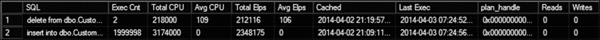

图 37-5 说明了代码清单 37-11 的输出。与存储过程执行统计信息类似，不可能获取这些语句的执行计划。但是，你可以分析单个语句消耗的 CPU 时间以及它们的执行频率。

***图 37-5.** 来自 `sys.dm_exec_query_stats` 视图的数据*

## 解释型 T-SQL 与内存优化表

查询互操作（Query Interop）组件为解释型 T-SQL 代码提供了透明的内存优化表访问。在解释模式下，SQL Server 处理内存优化表的方式与处理磁盘表非常相似。它会优化查询并缓存执行计划，而不考虑表的位置。查询执行期间使用相同的操作符集。从高层来看，当调用操作符的 `GetRow()` 方法时，它会根据底层表类型被路由到存储引擎或内存 OLTP 引擎。

大多数 T-SQL 功能在解释模式下都受支持。在 SQL Server 的任何版本中，仍然有少数例外情况不受支持：

- `TRUNCATE TABLE`
- 以内存优化表为目标的 `MERGE` 操作符
- 来自 `CLR` 代码的上下文连接
- 在索引视图中引用内存优化表。你可以在分区视图中引用内存优化表，以合并来自内存优化表和磁盘表的数据。
- `DYNAMIC` 和 `KEYSET` 游标，它们会自动降级为 `STATIC`
- 跨数据库查询和事务
- 链接服务器

如你所见，限制列表相当短。然而，查询互操作访问的灵活性是有代价的。原生编译模块通常比其解释型 T-SQL 对应物高效数倍。在某些情况下——例如，内存优化表与磁盘表之间的连接——查询互操作是唯一的选择；然而，在可能的情况下，通常更推荐使用原生编译模块。

#### 内存优化表类型与变量

SQL Server 允许你创建内存优化表类型。这些类型的表变量称为*内存优化表变量*。与常规的基于磁盘的表变量不同，内存优化表变量仅存在于内存中，不使用 `tempdb`。

内存优化表变量提供了出色的性能。它们可以作为基于磁盘的表变量的替代品，并在某些情况下替代临时表。显然，它们具有与内存优化表相同的功能限制集。

与基于磁盘的表类型相反，你可以在内存优化表类型上定义索引。相同的统计信息相关限制仍然适用。然而，正如我们之前讨论过的，由于内存优化表上索引的性质，基数估计错误产生的负面影响比磁盘表要小得多。

SQL Server 不支持内联声明内存优化表变量。例如，

# 第 37 章 ■ 内存 OLTP 可编程性

`代码清单 37-12 中展示的代码 n 将无法编译并会引发错误`。此限制背后的原因是，SQL Server 为每个内存优化表类型编译一个 DLL，而这在内联声明的情况下无法工作。

## ***代码清单 37-12.*** （非功能性）内存优化表变量的内联声明

```sql
declare
@IDList table
(
ID int not null
primary key nonclustered hash with (bucket_count=1024)
)
with (memory_optimized=on)
```

```
Msg 319, Level 15, State 1, Line 91
Incorrect syntax near the keyword 'with'. If this statement is a common table expression,
an xmlnamespaces clause, or a change tracking context clause, the previous statement must
be terminated with a semicolon.
```

您应该改为定义并使用一个内存优化表类型，如代码清单 37-13 所示。

## ***代码清单 37-13.*** 创建内存优化表类型和表变量

```sql
create type dbo.mtvIDList as table
(
ID int not null
primary key nonclustered hash with (bucket_count=1024)
)
with (memory_optimized=on)
go

declare
@IDList dbo.mtvIDList
```

使用内存优化表变量和表值参数作为 `tempdb` 临时对象的替代品，可以提升系统性能并降低 `tempdb` 的负载。它只需要很少的代码更改。例如，您可以通过将表类型标记为内存优化，从基于磁盘的实现切换到内存优化的 `TVP`。这对其他代码是完全透明的。

您可能还记得，在[第 13 章我们测试了几种](http://dx.doi.org/10.1007/978-1-4842-1964-5_13)将一批行导入数据库的方法。基于磁盘的表值参数在性能上超越了所有其他方法，包括 `SqlBulkCopy` 类。通过将表类型定义更改为内存优化，与基于磁盘的实现相比，我能够再将导入时间减少 40%。

您可以使用内存优化表变量来模拟逐行处理（使用游标），而本机编译存储过程不支持游标。代码清单 37-14 展示了一个使用内存优化表变量模拟静态游标的例子。显然，如果可能的话，最好避免使用游标并采用基于集合的逻辑。

## ***代码清单 37-14.*** 使用内存优化表变量模拟游标

```sql
create type dbo.MODataStage as table
(
ID int not null
primary key nonclustered hash with (bucket_count=1024),
Value int null
)
with (memory_optimized=on)
go

create proc dbo.CursorDemo
with native_compilation, schemabinding, execute as owner
as
begin atomic
with (transaction isolation level = snapshot, language=N'us_english')

declare
@tblCursor dbo.MODataStage
,@ID int = -1
,@Value int
,@RC int = 1

/* 在临时表中暂存数据以模拟静态游标 */
insert into @tblCursor(ID, Value)
select ID, Value from dbo.MOData;

while @RC = 1
begin
    select top 1 @ID = ID, @Value = Value
    from @tblCursor
    where ID > @ID
    order by ID;

    select @RC = @@rowcount

    if @RC = 1
    begin
        /* 行处理 */
        update dbo.MOData set Value = Value * 2 where ID = @ID
    end
end
end
```

# 内存 OLTP：实现注意事项

与任何新技术一样，采用内存 OLTP 是有成本的。您需要购买和/或升级到 SQL Server 2014 或 2016，花费时间学习该技术，并且如果是在更新现有系统，还需要重构代码并测试更改。进行成本/效益分析，确定内存 OLTP 能否提供足够的好处以抵消其成本，这一点很重要。

内存 OLTP 并非一个神奇的解决方案，不能简单地通过切换开关并将数据移入内存来帮助您提升服务器性能。它旨在解决一组特定的问题，例如非常活跃的 OLTP 系统上的闩锁和锁争用。对于并发活动少、数据量大且需要复杂聚合的数据仓库系统，它的益处较小。


虽然在某些情况下，通过将数据移入内存仍有可能实现性能提升，但通常通过实施磁盘列存储索引、索引视图、数据压缩以及其他数据库架构更改，可以获得更好的效果。

## 内存 OLTP 与数据仓库

这一点在支持内存优化表上列存储索引的 **SQL Server 2016** 中依然成立。此类索引针对混合工作负载的系统设计，有助于提升与 OLTP 工作负载并行运行的报表和分析查询的性能。您不应将内存 OLTP 列存储索引视为内存中的数据仓库解决方案。

还值得记住的是，大多数性能提升是通过使用原生编译模块实现的，但由于它们支持的 T-SQL 功能集有限，在数据仓库工作负载中很少能使用这些模块。此外，**SQL Server 2016** 不会从原生编译代码中使用列存储索引。

## SQL Server 2014 的迁移考量

另一个重要因素是，您计划在开发新系统还是迁移现有系统时使用内存 OLTP，这也很大程度上取决于所使用的 **SQL Server** 版本。您需要在现有系统中进行更改以应对技术限制。在 `SQL Server 2014` 中，限制清单很长，包括不支持触发器、外键约束、检查约束和唯一约束、计算列以及相当多的其他限制。

我想讨论几个在 `SQL Server 2014` 中可能大幅增加迁移成本的较不明显的事项。

### 8,060 字节行大小限制

第一个是内存优化表中最大 8,060 字节行大小的限制，且不支持任何行外数据存储。当现有的活动 OLTP 表使用 LOB 数据类型（如 `(n)varchar(max)` 或 `xml`）时，此限制可能导致大量的工作。虽然可以通过限制字符串大小、将 `xml` 存储为文本或二进制格式、或将大对象存储在单独表中来更改数据类型，但此类更改复杂、耗时，且需要仔细规划。别忘了，`SQL Server 2014` 中的内存 OLTP 不允许您在行大小可能超过 8,060 字节时创建表。例如，您无法创建包含三个 `varchar(3000)` 列的表。

### 索引与排序规则要求

内存优化表的索引是另一个重要因素。`SQL Server 2014` 要求索引的文本列使用二进制排序规则。这是系统行为中的一个重大变更，通常需要在代码中进行非平凡的更改以及某种数据转换。

考虑这样一种情况：应用程序在 `Name` 列上执行搜索，该列使用不区分大小写的排序规则。在表变为内存优化后，为了能够利用非聚集索引，您将需要将所有值转换为大写或小写。这将改变系统中的用户体验。

同样值得注意的是，对数据使用二进制排序规则将导致 T-SQL 代码的更改。您将需要为存储过程和其他 T-SQL 例程中的变量指定排序规则，除非您将数据库排序规则更改为二进制排序规则。但是，如果数据库和服务器排序规则不匹配，您将需要在 `tempdb` 中创建的临时表中为列指定排序规则。

### Bw-Tree 索引行为

您还应该记住，非聚集 Bw-Tree 索引的行为与磁盘表上的 B-Tree 索引不同。非聚集 Bw-Tree 索引是作为单链表实现的，如果需要按索引键的相反排序顺序访问数据，它们可能帮助不大。更糟糕的是，与磁盘表的扫描相比，对大型内存优化表的 `索引` 或 `表扫描` 可能效率较低，尤其是当数据驻留在缓冲池中时。所有这些通常要求您在将表从磁盘移入内存时，无论是哪个版本的 **SQL Server**，都需要重新评估您的索引策略。


# 第 37 章：内存 OLTP 可编程性

**SQL Server 2016** 解决了在 SQL Server 2014 中存在的许多技术限制。然而，与磁盘表相比，它仍然存在一些限制。最明显的是缺少对 xml 和 clr 数据类型、计算列的支持，以及不同的溢出行存储行为。**升级到 SQL Server 2016 可能是解决 SQL Server 2014 中技术限制的最简单、成本最低的方法。**

还有许多其他因素需要考虑。但关键点在于，在开始迁移到内存 OLTP 之前，您应该进行彻底的分析。这样的迁移可能会带来非常显著的成本影响，除非它对系统有益，否则不应进行。

SQL Server Management Studio 提供了一套工具，可以帮助您分析内存 OLTP 是否会提升应用程序的性能，并识别从转换中受益最大的对象。虽然这些工具在初步分析阶段很有用，但您不应该仅仅基于工具的输出做决定。请综合考虑我们在本章中已经讨论过的所有其他因素和注意事项。

> **注意**：您可以在 [`msdn.microsoft.com/en-us/library/dn205133.aspx`](http://msdn.microsoft.com/en-us/library/dn205133.aspx) 阅读有关 `In-Memory OLTP ARM tool` 的信息。

另一方面，全新的开发则是另一回事。您可以在设计新系统和数据库架构时，将内存 OLTP 的限制考虑在内。在设计阶段调整一些功能需求也是可能的。例如，从一开始就以区分大小写的方式存储数据，要比在系统部署到生产环境后更改现有系统的行为容易得多（如果您使用的是 SQL Server 2014）。

然而，您应该记住，内存 OLTP 是一个企业版功能，它需要配备大内存的强大硬件。由于其许可成本，这是一个昂贵的功能。此外，它无法做到"一劳永逸"。数据库专业人员应在部署后积极参与系统的监控和调优。他们需要监控系统内存使用情况、分析数据，并在需要更改桶计数时重建哈希索引、更新统计信息、重新部署 `原生编译` 模块以及执行其他任务。

所有这些都使得内存 OLTP 对于开发需要部署到大量客户的产品的独立软件供应商来说是一个糟糕的选择。此外，由于开发和支持成本的增加，同时支持带和不带内存 OLTP 的两个系统版本是不切实际的。

最后，如果您使用的是 SQL Server 的企业版或 Microsoft Azure 中的高级层 SQL 数据库，即使您认为内存 OLTP 迁移对贵公司的需求来说不具备成本效益，您仍然可以从一些内存 OLTP 功能中受益。您可以使用内存优化表变量和/或非持久化内存优化表作为暂存区，并替代磁盘临时表。这将提高需要存储数据临时副本的计算和 ETL 流程的性能。

另一种可能性是使用内存优化表作为 ASP.Net 应用程序的会话状态存储和/或作为客户端应用程序的分布式缓存，从而避免购买昂贵的第三方解决方案。在此场景中，您可以使用持久化或非持久化表。持久化表将提供透明故障转移功能，而非持久化表则具有极快的性能。显然，如果您使用的是 SQL Server 2014，您应该记住 8,060 字节的最大行大小限制，并在代码中处理它。

> **注意**：《`Expert SQL Server In-Memory OLTP`》一书涵盖了许多与部署相关的其他问题。


# 第 37 章 ■ 内存中 OLTP 的可编程性

## 摘要

SQL Server 使用原生编译来最小化解释型 T-SQL 语言的处理开销。

它为每个内存优化对象生成独立的 DLL，并将其加载到进程内存中。

SQL Server 2014 支持常规 T-SQL 存储过程的本地编译。SQL Server 2016 还支持 DML 触发器和标量用户定义函数的原生编译。它在创建时，或者在服务器或数据库重启的情况下，在首次调用时将其编译为 DLL。

SQL Server 优化原生编译的模块，并将执行计划嵌入代码中。该计划 CHAPTER 37 ■ 内存中 OLTP 的可编程性 永不改变，除非在 SQL Server 或数据库重启后重新编译该模块。如果在编译后数据分布发生显著变化，在 SQL Server 2014 中应删除并重新创建该模块，或在 SQL Server 2016 中使用 `sp_recompile` 存储过程重新编译它。

虽然原生编译的模块速度极快，但它们支持有限的 T-SQL 语言功能。你可以通过使用解释型 T-SQL 代码来规避此类限制，该代码通过 SQL Server 的查询互操作组件访问内存优化表。在此模式下，几乎所有 T-SQL 语言功能都受支持。

内存优化表类型和内存优化表变量是表类型和表变量的内存中类似物。它们仅存在于内存中，并且不使用 tempdb。你可以使用内存优化表变量作为数据的暂存区，并向 T-SQL 例程传递一批行。内存优化表类型允许你创建类似于内存优化表的索引。

内存中 OLTP 是一项企业版功能，需要在部署后阶段对系统进行监控和调优。这使得内存中 OLTP 对于需要部署到多个客户的系统开发的独立软件供应商来说，是一个糟糕的选择。

现有系统的迁移可能是一个非常耗时且昂贵的过程，需要你处理内存优化表与磁盘表以及索引在行为上的各种限制和差异。你应该执行成本效益分析，确保迁移带来的收益超过其实施成本。

## 索引

„

### A

`ALTER TABLE SET (REMOTE_DATA_ ARCHIVE)` 命令 , 120

`ACCESS_METHODS_DATASET_PARENT` 锁存类型 , 573

`ALTER TABLE SET (SYSTEM_VERSIONING)` 命令 , 113

`ACCESS_METHODS_HOBT_COUNT` 锁存类型 , 573

`Always Encrypted` , 132

`ACCESS_METHODS_HOBT_VIRTUAL_ROOT` 锁存类型 , 573

`AlwaysOn 可用性组` , 641, 721

`ACCESS_METHODS_SCAN_KEY_GENERATOR` 锁存类型 , 573

`AlwaysOn 故障转移群集` , 637

`ACCESS_METHODS_SCAN_RANGE_GENERATOR` 锁存类型 , 573

`AlwaysOn_Health 扩展事件会话` , 540

`ACID 事务特性` , 382

`崩溃恢复的分析阶段` , 603

`扩展事件中的操作` , 519, 525

`页面压缩中的锚点值` , 102

`活动节点` , 638

`任意大小内存分配器` , 576

`ACTIVE_TRANSACTION log_reuse_wait_desc 值` , 611

`.Net 中的应用程序域` , 293

`即席查询` , 503

`应用程序锁` , 443

`层次结构中的邻接列表` , 328

`程序集 (.Net)` , 293

`AFTER 触发器` , 195

`ASYNC_IO_COMPLETION 等待类型` , 558

`对齐索引` , 341

`asynchronous_bucketizer 扩展事件目标` , 528, 536

`分配映射页` , 19, 274, 290

`异步提交` , 642

`磁盘上的分配单元` , 546

`asynchronous_file_target 扩展事件目标` , 528, 533

`分配单元` , 20, 338

`原子块` , 776

`ALTER DATABASE SET ALLOW_SNAPSHOT_ISOLATION 命令` , 435

`原子性事务特性` , 382

`ALTER DATABASE SET PARTNER TIMEOUT 命令` , 645

`节点原子化 (XQUERY)` , 252

`自动关闭数据库选项` , 548

`自动提交的事务` , 760

`自动创建统计信息数据库选项` , 62

`AUTOGROW_ALL_FILES 文件组选项` , 5


## **B**

`Close()` 执行计划运算符的方法 , 469

层次结构中的闭包表 , 329

备份链 , 616

CLR 集成 , 293

`BACKUPIO` 等待类型 , 558

聚集列存储索引 , 691, 740

`BACKUP` 运算符 , 616

聚集索引设计注意事项 , 155

备份到 Microsoft Azure , 632

聚集索引 , 36

备份到 Microsoft Windows Azure 工具 , 632

代码重用 , 227

备份到 URL , 632

基于列的存储 , 663, 673

基于值的编码中的基值

列加密密钥 (`CEK`) , 133

在基于列的存储中 , 675

列加密设置连接

基本 AlwaysOn 可用性组 , 646

字符串属性 , 133, 134

批处理模式执行 , 663

列级统计信息 , 58, 681

BCM 页 , 21, 616

列主密钥 (`CMK`) , 133

`BEGIN ATOMIC..END` 语句 , 779

列偏移数组 , 10

`BeginTs` 时间戳 , 723, 743, 760

`COLUMN_SET` 列 , 108

阻塞进程报告 , 400, 567

`COLUMNSTORE_ARCHIVE`

阻塞进程阈值

压缩选项 , 675, 741

配置选项 , 400

`COLUMNSTORE` 压缩选项 , 676

阻塞运算符 , 470

行级安全策略中的 `BLOCK` 谓词 , 127

列存储索引 , 663

空间数据的边界框方法 , 324

列存储索引维护 , 698

绑定查询树 , 463

列存储索引类型 , 687

B-树 , 36, 789

`COLUMNS_UPDATE()` 函数 , 207

`BUCKET_COUNT` 哈希索引属性 , 724, 735

提交依赖关系 , 761

批量更改映射页 , 21, 616

公共表表达式 (`CTE`) , 237

插入带有列存储索引的表时的批量插入 , 693

补偿日志记录 , 602, 622

已编译计划 , 491

BULKLOGGED 数据库

已编译计划存根 , 504

恢复模型 , 608

复合索引 , 45, 725

复合索引 , 45

Bw-树 , 728, 789

`COMPRESS()` 函数 , 241

## **C**

`COMPRESSION` 备份选项 , 617

`COMPRESSION_DELAY`

列存储索引选项 , 709, 741

`CACHESTORE_OBJCP` 缓存存储 , 511, 577

压缩信息 (CI) 记录 , 103

`CACHESTORE_PHDR` 缓存存储 , 511, 577

事务一致性特征 , 382

计划缓存中的缓存存储 , 511

`CONTAINS MEMORY_OPTIMIZED_DATA`

文件组选项 , 719

`CACHESTORE_SQLCP` 缓存存储 , 511, 577

`CONTEXT_INFO()` 函数 , 209

计算列 , 93

`COPY_ONLY` 备份选项 , 618

基数估计

基于成本的优化阶段 , 466

模型 , 55, 69, 166, 233, 273, 277

优化期间的成本模型假设 , 467

`CardinalityEstimatorModelVersion`
执行计划属性 , 70

CD 行格式 , 98

`Cost Threshold for Parallelism` 配置

`CHECK` 约束 , 188, 344, 366

设置 , 592, 563

视图中的 `CHECK OPTION` , 224

包含索引 , 81

检查点文件 , 744

崩溃恢复过程 , 603, 638, 643

`CHECKPOINT` 过程 , 22, 599, 603, 607, 747

`CREATE STATISTICS` 命令 , 62

`CHECKSUM` 备份选项 , 617

`CHECKSUM()` 函数 , 164

内存 OLTP 中的跨容器事务 , 759

CI 记录 , 103

`CROSS JOIN` 运算符 , 474

资源调控器中的分类器函数 , 550

`CXMEMTHREAD` 等待类型 , 565

时间表中的当前表 , 112

`CXPACKET` 等待类型 , 558, 562

### AUTOGROW_SINGLE_FILE 文件组选项 , 5

### `ALTER DATABASE SET QUERY_STORE`

### 自动页面修复 , 644

### 命令 , 582

### 自动参数化 , 125, 505

### `ALTER DATABASE SET QUERY_STORE`

### 自动收缩数据库选项 , 8, 548

### CLEAR 命令 , 595

### 自动异步更新统计信息

### `ALTER DATABASE SET READ_COMMITTED_`

### 数据库选项 , 69

### SNAPSHOT 命令 , 434

### 自动更新统计信息数据库选项 , 62

### `ALTER INDEX REBUILD` , 146

### `sys.dm_db_index_physical_stats` 中的 `avg_fragmentation_in_percent` , 143, 146

### `ALTER INDEX REORGANIZE` , 146

### `sys.dm_db_index_physical_stats` 中的 `avg_page_space_used_in_percent` , 143

### `ALTER TABLE REBUILD` 语句 , 28, 36

### `AVG_RANGE_ROWS` 在统计直方图中 , 57

### `ALTER TABLE SET (LOCK_ESCALATION)`

### 命令 , 423

© Dmitri Korotkevitch 2016

D. Korotkevitch, *Pro SQL Server Internals*, DOI 10.1007/978-1-4842-1964-5

## **D**

### 确定性加密 , 134

### 页压缩中的字典压缩 , 102

### CLR 中的 `DataAccessKind` 属性 , 301


## 索引

## D
`Dictionary encoding` 在基于列的存储中，674

`Database compatibility level`，62, 79, 241, 668

`Dictionary` 在基于列的存储中，674

`Database consolidation`，548

`Differential change map pages`，21, 615

`Database` 未配置为 `DIFFERENTIAL database backup`，617

`database mirroring error`，645

`Dimension tables`，660

`Database mirroring`，641, 721

`Dirty reads` 数据不一致问题，392, 753

`Database recovery models`，607

`DISTINCT_EQ_ROWS` 在统计直方图中，56

`Data compression`，97

`Distribution database` 在复制中，650

`Data file`，3

`Distributor` 在复制中，650

`Data files` 在 In-Memory OLTP 中，744

`DML triggers`，195

`Data flush task`，748

`DONE` 工作线程状态，552

`Data page`，8

`Duplicated reads` 数据不一致问题，392

`Data row`，8

`Durability option` 在内存优化表中，720

`Data row` 在内存优化表中，722

`Durability` 事务特性，382

`Data warehouse` 概述，659

`Dynamic Data Masking`，136

`Data warehouse` 工作负载，167, 660

`DBCC CHECKDB` 命令，617

`DBCC FREEPROCCACHE` 命令，495

`DBCC FREESYSTEMCACHE('TokenAndPermUserStore')` 命令，577

`DBCC IND` 命令，11

`DBCC LOGINFO` 命令，607

`DBCC MEMORYSTATUS` 命令，577

`DBCC PAGE` 命令，11

`DBCC SHOW_STATISTICS` 命令，56

`DBCC SHRINKFILE` 命令，153, 362

`DBCC SQLPERF('sys.dm_os_latch_stats', CLEAR)` 命令，571

`DBCC SQLPERF('sys.dm_os_wait_stats', CLEAR)` 命令，553

`DBCC UPDATEUSAGE` 命令，68

`DCM pages`，21, 615

`DDL triggers`，204

`Deadlock`，407

`Deadlock graph`，416, 567

`Deadlock Monitor task`，408

`DECOMPRESS()` 函数，241

`Dedicated admin connection (DAC)`，245, 552, 568, 578

`Delayed durability`，604, 779

`Delete bitmap` 在列存储索引中，691, 741

`Delete bitmap` 结构，694

`Delete buffer` 在列存储索引中，706

`Deleted rows table` 在列存储索引中，741

`deleted` 虚拟表，197

`Delta files` 在 In-Memory OLTP 中，744

`Delta record`，729

`Delta store` 在列存储索引中，691

`Delta store` 结构，694

`Density vector`，56

`Designing a backup strategy`，622

`Designing a high availability strategy`，651

`Detecting suboptimal queries`，174

## E
`EndTs` 时间戳，723, 743, 760

`EQ_ROWS` 在统计直方图中，56

`Error 1204`，429

`Error 1205`，421

`Error 3960`，438

`Error 41301`，763

`Error 41839`，764

`Error 9002`，610

`-E` 启动参数，290

`Estimated execution plan`，473

`Estimated number of rows` 在执行计划中，58

`etw_classic_sync_target` 扩展事件目标，528

`event_counter` 扩展事件目标，528, 535

`EVENTDATA()` 函数，205, 207

`event_file` 扩展事件目标，528, 533

`EVENT_RETENTION_MODE` 扩展事件会话配置设置，529

`Event sessions` 在扩展事件中，519

`Events` 在扩展事件中，521

`Eviction policy algorithm`，512

`Exchange operator`，483

`Exclusive (X) lock`，383

`Execution model (SQL Server)`，551

`Execution plan`，463, 472

`EXECUTE WITH RECOMPILE` 子句，496

`EXISTS()` 方法 (XQUERY)，254

`EXPAND VIEWS` 查询提示，487

`Exponential backoff algorithm`，78

`Extended Events`，519

`Extended Events session`，530

`Extents`，19

`EXTERNAL_ACCESS CLR assemblies`，294

`External index fragmentation`，143

`Extract Transform and Load (ETL)` 流程，660

## F
`Hash join operator`，475

`Hash join` 查询提示，487

`Facts tables`，660

`Hash warning`，471, 530

`Failover cluster`，637, 721

`Failover Partner` 连接字符串属性，645

`Failover process`，637

`Fast database recovery`，604

`FAST N` 查询提示，488

`FGCB_ADD_REMOVE` 锁存类型，573

`Filegroups`，3

`File Snapshot Backup`，633

`FILLFACTOR` 索引选项，145, 543

`Filtered indexes`，87, 109, 502, 506, 709

`Filtered statistics`，90

`Filter function` 用于 Stretch Database，118, 120

`Header byte`，98

`Heap tables`，31

`Hekaton`，717

`HierarchyID` 数据类型，295, 328

`High availability database mirroring mode`，644

`High availability technologies`，637

`High performance database mirroring mode`，642

`High protection database mirroring mode`，644

`Histogram` 在统计信息中，56, 336, 340

`Histogram` 扩展事件目标，528, 536

`History table` 在时态表中，112, 748

`HKCS_COMPRESSED` 分配器 varheap，742


FILTER `predicate` in row-level security policy , 127
行级安全策略中的 FILTER `predicate`，127

Hot spots during inserts , 160, 571
插入操作期间的热点，160, 571

Fixed-length data types , 9
固定长度数据类型，9

`fn_dump_dblog` system function , 621
`fn_dump_dblog` 系统函数，621

`fn_hadr_is_primary_replica` system function , 648
`fn_hadr_is_primary_replica` 系统函数，648

I

`fn_trace_gettable` system function , 620
`fn_trace_gettable` 系统函数，620

IAM chain , 20
IAM 链，20

Forced parameterization , 506
强制参数化，506

IAM pages , 20, 33, 274
IAM 页，20, 33, 274

Forced plan in Query Store , 584
查询存储中的强制计划，584

IAM scan , 33, 40
IAM 扫描，33, 40

`FORCE ORDER` query hint , 487
`FORCE ORDER` 查询提示，487

Identity , 160
标识，160

`FORCESCAN` table hint , 487
`FORCESCAN` 表提示，487

Idle worker thread , 743
空闲工作线程，743

`FORCESEEK` table hint , 487
`FORCESEEK` 表提示，487

IdxLinkCount element in memory-optimized table row , 723, 743
内存优化表行中的 IdxLinkCount 元素，723, 743

Foreign key constraints , 184, 662, 721
外键约束，184, 662, 721

`FORMAT` backup option , 617
`FORMAT` 备份选项，617

Included columns in the indexes , 81
索引中的包含列，81

`FOR SYSTEM_TIME` clause of the SELECT , 114
SELECT 的 `FOR SYSTEM_TIME` 子句，114

Incremental statistics , 340
增量统计信息，340

Forwarded row , 33
转发行，33

Index allocation map pages , 20, 33, 274
索引分配映射页，20, 33, 274

Forwarding pointer , 33
转发指针，33

Index consolidation , 172
索引合并，172

`fragment_count` in `sys.dm_db_index_physical_stats` , 143
`sys.dm_db_index_physical_stats` 中的 `fragment_count`，143

Indexed views , 219
索引视图，219

Indexes on calculated columns , 96
计算列上的索引，96

FULL database backup , 609, 617
完整数据库备份，609, 617

Index intersection , 165
索引交叉，165

FULL database recovery model , 608
完整数据库恢复模式，608

Index fragmentation , 143, 363, 434
索引碎片，143, 363, 434

Index rebuild , 146, 454
索引重建，146, 454

G

Index reorganize , 146
索引重新组织，146

Index seek , 41
索引查找，41

Garbage collection in In-Memory OLTP , 743
内存 OLTP 中的垃圾回收，743

Index table hint , 485
索引表提示，485

Geography data type , 295, 319
地理空间数据类型，295, 319

Index usage statistics , 169
索引使用情况统计，169

Geometry data type , 295, 319
几何数据类型，295, 319

Infinity Global Transaction Timestamp value , 723
无穷大全局事务时间戳值，723

`GetRow()` method of the execution plan operator , 469, 786
执行计划运算符的 `GetRow()` 方法，469, 786

`INIT` backup option , 617
`INIT` 备份选项，617

Inline table-valued functions , 235, 782
内联表值函数，235, 782

Ghost cleanup task , 23
幽灵清理任务，23

In-row allocation units , 20, 338
行内分配单元，20, 338

Global allocation map (GAM) pages , 19, 274
全局分配映射页，19, 274

`Inserted` virtual table , 197
`Inserted` 虚拟表，197

Global temporary tables , 270
全局临时表，270

Instant File Initialization , 6, 549
即时文件初始化，6, 549

Global transaction timestamp , 723, 743, 760
全局事务时间戳，723, 743, 760

Instead of triggers , 195, 224, 348
INSTEAD OF 触发器，195, 224, 348

Intent (I*) lock , 383
意向锁，383

H

`InterlockedCompareExchange` functions , 729
`InterlockedCompareExchange` 函数，729

Intermediate level of the index , 37, 728
索引的中间级别，37, 728

Halloween protection , 480, 723
万圣节保护，480, 723

Internal index fragmentation , 143
内部索引碎片，143

Hash aggregate , 478
哈希聚合，478

Internal index pages , 728
内部索引页，728

`HASHBYTE()` function , 148
`HASHBYTE()` 函数，148

`IO_COMPLETION` wait type , 558
`IO_COMPLETION` 等待类型，558

Hash collision , 471
哈希冲突，471

I/O stalls , 558
I/O 停滞，558

Hash indexes , 723, 735
哈希索引，723, 735

`IsDeterministic` attribute in CLR , 301
CLR 中的 `IsDeterministic` 属性，301

Hash index heap , 737
哈希索引堆，737

`ISJSON()` function , 264
`ISJSON()` 函数，264

INDEX

Isolation transaction characteristic , 382
事务隔离特性，382

`IsPrecise` attribute in CLR , 301
CLR 中的 `IsPrecise` 属性，301

Logical end time for In-Memory OLTP transaction , 761
内存 OLTP 事务的逻辑结束时间，761

Iterators in the execution plan , 468
执行计划中的迭代器，468

Logical start time for In-Memory OLTP transaction , 723, 760
内存 OLTP 事务的逻辑开始时间，723, 760

J

`LOG_MANAGER` latch type , 573
`LOG_MANAGER` 锁存器类型，573

Logon triggers , 206
登录触发器，206

Join elimination process , 216
连接消除过程，216

Log Reader Agent job , 650
日志读取器代理作业，650

JSON , 262
JSON，262

Log sequence number (LSN) , 599, 621
日志序列号，599, 621

`JSON_MODIFY()` function , 264
`JSON_MODIFY()` 函数，264

Log shipping , 648, 721
日志传送，648, 721

`JSON_QUERY()` function , 264
`JSON_QUERY()` 函数，264

Log writer process , 601
日志写入器进程，601

`JSON_VALUE()` function , 264
`JSON_VALUE()` 函数，264

Long Data Region , 98
长数据区域，98

Loop join operator , 474, 776
循环连接运算符，474, 776

K

Loop join query hint , 487
循环连接查询提示，487

Low-priority locks , 454
低优先级锁，454

`KEEPFIXED PLAN` query hint , 492
`KEEPFIXED PLAN` 查询提示，492

`KEEP PLAN` query hint , 270, 492
`KEEP PLAN` 查询提示，270, 492

M

Key lookup deadlock , 410
键查找死锁，410

Key lookup operation , 49, 81
键查找操作，49, 81

Magnitude in value-based encoding in column-based storage , 674
基于列的存储中基于值编码的量级，674

L

Managed backup , 633
托管备份，633

Mapping index in columnstore indexes , 702
列存储索引中的映射索引，702

Latches , 570
锁存器，570

Mapping table in range indexes , 728
范围索引中的映射表，728

`LATCH` wait type , 571
`LATCH` 等待类型，571

Maps in Extended Events , 526
扩展事件中的映射，526

Lazy commit , 604
延迟提交，604

Masking function in dynamic data masking , 136
动态数据屏蔽中的屏蔽函数，136

Lazy writer process , 23, 505
延迟写入器进程，23, 505

Materialized path in hierarchies , 330
层次结构中的物化路径，330

`LCK_M_*` wait types , 567
`LCK_M_*` 等待类型，567

Materialized views , 219
物化视图，219

Leaf level of the index , 36, 728
索引的叶级别，36, 728

`MaxByteSize` attribute in CLR , 308
CLR 中的 `MaxByteSize` 属性，308

`LEGACY_CARDINALITY_ESTIMATION` database scoped configuration , 70
`LEGACY_CARDINALITY_ESTIMATION` 数据库范围配置，70

`MAXDOP` configuration setting , 563
`MAXDOP` 配置设置，563

`MAX_GRANT_PERCENT` query hint , 471, 565
`MAX_GRANT_PERCENT` 查询提示，471, 565

Listener in AlwaysOn Availability Groups , 646
AlwaysOn 可用性组中的侦听器，646

Maximum server memory configuration option , 575, 641
最大服务器内存配置选项，575, 641

LOB allocation units , 20, 338, 353, 675
大对象分配单元，20, 338, 353, 675

LOB data pages , 16
大对象数据页，16

LOB page allocator , 738
大对象页分配器，738

LOB storage in In-Memory OLTP , 722
内存 OLTP 中的大对象存储，722

Local temporary tables , 269
局部临时表，269

Lock compatibility , 387
锁兼容性，387

Lock escalation , 423
锁升级，423

`Lock Pages in Memory` permission , 547, 575
`Lock Pages in Memory` 权限，547, 575

`Max worker thread` configuration option , 552
`Max worker thread` 配置选项，552

Memory allocator , 576
内存分配器，576

`MEMORYCLERCK_SQLBUFFERPOOL` memory clerk , 577
`MEMORYCLERCK_SQLBUFFERPOOL` 内存 clerks，577

Memory clerks , 576
内存 clerks，576

`MEMORYCLERK_SQLQERESERVATIONS` memory clerk , 563, 577
`MEMORYCLERK_SQLQERESERVATIONS` 内存 clerk，563, 577

# 内存与存储

*   内存配置，575
*   内存中 OLTP 中的内存使用者，736
*   内存授权，65、470、550、564、682、689
*   内存节点，576
*   `MEMORY_OPTIMIZED_ELEVATE_TO_SNAPSHOT` 数据库选项，760
*   `CREATE TABLE` 语句中的 `MEMORY_OPTIMIZED = ON` 选项，721
*   内存优化表，638、720
*   内存优化表类型，786
*   内存优化表值参数，787
*   内存优化表变量，786
*   内存压力，505
*   合并增量，733
*   检查点文件合并，746
*   混合区，19
*   `MIXED_PAGE_ALLOCATION` 数据库选项，20
*   多页内存分配器，576

# 锁定与阻塞

*   锁分区，452
*   锁类型
    *   排他锁 (`X`)，383
    *   意向锁 (`I*`)，383
    *   范围锁，390
    *   架构修改锁 (`Sch-M`)，146、192、348、447
    *   架构稳定性锁 (`Sch-S`)，447
    *   共享锁 (`S`)，386
    *   更新锁 (`U`)，384
*   `LOG_BACKUP` 的 `log_reuse_wait_desc` 值，611
*   日志块，599
*   日志缓冲区，599、766
*   `LOGBUFFER` 等待类型，558、604
*   `NESTING_TRANSACTION_FULL` 锁存类型，573
*   `PAGEIOLATCH` 等待类型，558、571
*   `PAGELATCH` 等待类型，558、571
*   不可重复读数据不一致问题，392、753

# 查询处理与优化

*   逻辑查询树，463
*   合并联接运算符，474
*   合并联接查询提示，487
*   旋转木马扫描，40
*   `MIN_GRANT_PERCENT` 查询提示，471
*   嵌套循环联接，474、776
*   新基数估算器，70、92、233
*   非阻塞运算符，470
*   `NOEXPAND` 表提示，223、487
*   `NOLOCK` 表提示，391、760
*   `NO_PERFORMANCE_SPOOL` 查询提示，481
*   执行计划中的运算符，468
*   执行计划运算符的 `Open()` 方法，469
*   对 UNKNOWN 值的优化，776
*   `OPTIMIZE FOR` 查询提示，497
*   `OPTIMIZE FOR UNKNOWN` 查询提示，498
*   有序索引扫描，38
*   总体资源消耗查询存储报告，589
*   并行度，39、96、481、562、664
*   并行度运算符，483
*   参数化，125
*   参数化强制查询提示，506
*   参数嗅探，493、581、776
*   `PARAMETER_SNIFFING` 数据库作用域配置，499
*   查询优化期间的解析，463

# 索引与索引编制

*   `INDEX` ，[页码缺失]
*   `NO_PERFORMANCE_SPOOL` 查询提示，481
*   `NONCLUSTERED` 索引设计注意事项，165
*   `NONCLUSTERED` 索引，46
*   内存优化表中的 `NONCLUSTERED` 索引，728、735
*   聚集列存储索引表上的 `NONCLUSTERED` B-Tree 索引，702
*   `NONCLUSTERED` 列存储索引（只读），688
*   `NONCLUSTERED` 列存储索引（可更新），706
*   `PAD_INDEX` 索引选项，145
*   页可用空间 (PFS) 页，20、31
*   页合并，733
*   页拆分，142、732
*   `PAGE` 压缩，97、102、112、336、676
*   `Page verify` 数据库选项，549

# 函数与运算符

*   `MODIFY()` 方法 (XQUERY)，260
*   `NEWID()` 函数，148、161
*   `NEWSEQUENTIALID()` 函数，163
*   `NODES()` 方法 (XQUERY)，257
*   `OBJECTPROPERTY()` 函数，219
*   `$PARTITION` 函数，373

# 表与视图结构

*   分区表，338
*   分区视图，224、342
*   分区函数，338
*   分区方案，338
*   分区切换，340、689
*   磁盘子系统中的分区对齐，546

# SQL Server 功能与选项

*   原生编译，771
*   原生编译内联表值函数，235、782
*   原生编译模块，775
*   原生编译标量用户定义函数，779
*   原生编译存储过程，776
*   原生编译触发器，779
*   `OPENJSON`，265、285
*   `OPENXML`，260
*   运营分析，660、689、706、740、771
*   `OPTIMIZE FOR ad-hoc workloads` 配置设置，504、549、565
*   乐观事务隔离级别，153、433
*   `对象计划指南`，507
*   `OBJECTSTORE_LOCK_MANAGER` 内存 clerk，577
*   `所有权链`，295、502
*   扩展事件中的 `包`，520
*   `pair_matching` 扩展事件目标，528、538
*   `参数化视图`，235
*   `部分数据库可用性`，626
*   `部分数据库备份`，336、630
*   `部分数据库还原选项`，629
*   `数据库镜像` 镜像服务器，641
*   `多实例故障转移群集`，639
*   群集中的 `节点`，637
*   数据库还原的 `MOVE` 选项，618
*   数据库还原的 `NORECOVERY` 选项，618
*   `混合 OLTP 和数据仓库工作负载`，167
*   `OLTP 工作负载`，167
*   `多语句用户定义函数`，229
*   `相互执行概念`，443
*   `命名管道协议`，551
*   层次结构中的 `嵌套集`，330
*   `嵌套触发器`，208
*   `空位图`，10
*   `LOG 数据库备份`，608、617
*   `最小日志记录操作`，609
*   `LOG_BACKUP` 的 `log_reuse_wait_desc` 值，611
*   `合并复制`，650


## 索引

PARTNER TIMEOUT 数据库选项，645

被动节点，638
计划重用计算，567
PATH 次要 XML 索引，250
查询存储中的计划存储，583
内存中 OLTP 行中的有效载荷，722
时间点恢复，619
对等复制，651
点查找，42， 135， 725
挂起的工作线程状态，552
行级安全中的策略函数，126

## 性能计数器：

扩展事件中的谓词，523
批处理请求/秒 性能计数器，567
抢占式调度，294
缓冲区缓存命中率 性能计数器，560
页面压缩中的前缀压缩，102
检查点页/秒 性能计数器，560
全表扫描/秒 性能计数器，560
惰性写入器/秒 性能计数器，560
可用内存（MB） 性能计数器，575
挂起的内存授予 性能计数器，564
页面预期寿命 性能计数器，560
页面读取/秒 性能计数器，560
页面写入/秒 性能计数器，560
物理磁盘 性能对象，560
处理器队列长度 性能计数器，567
% 处理器时间 性能计数器，567
范围扫描/秒 性能计数器，560
SQL 编译/秒 性能计数器，567
SQL 重编译/秒 性能计数器，567
SQL Server:访问方法 性能对象，560
SQL Server:可用性副本 性能对象，643
SQL Server:缓冲区管理器 性能对象，560
SQL Server:数据库镜像 性能对象，643
SQL Server:数据库副本 性能对象，643
SQL Server:内存管理器 性能对象，563, 575
SQL Server:查询存储 性能对象，596
目标服务器内存 (KB) 性能计数器，575
服务器总内存 (KB) 性能计数器，575
事务/秒 性能计数器，560

## Q

查询执行，468
内存中 OLTP 中的查询互操作，719, 736, 743, 771, 786
查询生命周期，463
`QUERY()` 方法 (XQUERY)，257
查询优化，463
查询存储，404, 581, 748
数据库镜像中的仲裁，644

## R

随机加密，134
统计信息直方图中的 RANGE_HI_KEY，56
统计信息直方图中的 RANGE_HI_ROWS，56
内存优化表中的范围索引，728, 735
范围索引可变堆，737
RANGE LEFT 分区函数参数，339, 356
范围锁，390
RANGE RIGHT 分区函数参数，339, 356
范围扫描，42
预读技术，142
`READ COMMITTED SNAPSHOT` 事务隔离级别 (`RCSI`)，434
`READCOMMITTED` 表提示，391, 438
`READ COMMITTED` 事务隔离级别，389
只读文件组，630
`READPAST` 表提示，392, 446
`READ UNCOMMITTED` 事务隔离级别，388, 435
`READ_WRITE_FILEGROUPS` 备份选项，630
恢复数据库还原选项，618
恢复点目标 (`RPO`)，622, 652
恢复时间目标 (`RTO`)，622, 626, 652
递归触发器，209
崩溃恢复的重做阶段，603
辅助节点上的重做队列，643
重做线程，367, 643
冗余索引，172
引用完整性，184, 765
性能退化的查询存储报表，587
`REMOTE_DATA_ARCHIVE_OVERRIDE` 表提示，125
`REPEATABLEREAD` 表提示，391
`REPEATABLE READ` 事务隔离级别，389, 754
可重复读验证，755, 763, 765
`SELECT *`，17， 87， 108

执行卷维护任务权限，6
时态表中的时段列，112
.NET 程序集的权限集，294
持久化计算列，93
幻读数据不一致问题，392, 753
分段还原，336， 626， 747
计划缓存与计划缓存，88， 491
计划指南，506
数据库镜像中的主体服务器，641
主键约束，181， 721
AlwaysOn 可用性组中的主节点，641
主 XML 索引，244
属性次要 XML 索引，250
比例填充算法，5
协议层，551
复制中的发布者，650

`SCHEMA_AND_DATA` 持久性选项，720
`SCHEMABINDING` 选项，127， 219， 235， 779
架构修改 (`Sch-M`) 锁，146， 192， 348， 447
`SCHEMA_ONLY` 持久性选项，720
架构稳定性 (`Sch-S`) 锁，447
AlwaysOn 可用性组中的辅助节点，641
次要 XML 索引，244
行级安全中的安全策略，126
基于列存储中的段，673


## 索引

## R

- **复制**：649
- **资源调控器**：550, 563, 689
    - `资源调控器中的工作负载组设置`
    - `资源调控器中的资源池`：550
- **资源信号量**：564
    - `RESOURCE_SEMAPHORE 等待类型`：564, 567
- **RESTORE 数据库**：618
    - `RESTORE DATABASE WITH RECOVERY 命令`：619
    - `从 URL 还原`：632
    - `STANDBY 数据库还原选项`：621
    - `STOPAT 数据库还原选项`：619
    - `STOPATMARK 数据库还原选项`：619
    - `STOPBEFOREMARK 数据库还原选项`：619
- **RID 查找操作**：49
- **ring_buffer 扩展事件目标**：528, 532
- **索引根级别**：37, 81, 728
- **基于行的执行模型**：468
- **基于行的存储**：663
- **内存中 OLTP 中的行链**：722
- **行压缩**：97, 98
- **@@ROWCOUNT**：199
- **基于列存储中的行组**：673, 691
- **内存中 OLTP 中的行头**：722
- **非聚集索引中的行 ID**：47
- **行级锁定**：382
- **行级安全性**：126, 748
- **行模式执行**：663
- **行溢出分配单元**：20, 338
- **行溢出数据页**：14
- **内存中 OLTP 中的行溢出存储**：722
- **可运行任务队列**：553
- **可运行工作线程状态**：553
- **正在运行的工作线程状态**：552
- **查询存储中的运行时统计信息存储**：583

## S

### S - Sa

- **SAFE CLR 程序集**：294
- **SA_MANAGE_VOLUME_NAME 权限**：6
- **哈希索引的 SARGability 规则**：725
- **SARGable 谓词**：42, 85, 172, 231
- **标量用户定义函数**：229, 779
- **内存中 OLTP 事务中的扫描集**：762
- **调度器（SQLOS）**：552

### Sc - Sh

- **SELECT FOR JSON**：263
- **SELECT FOR XML**：261
- **半结构化数据（XML 和 JSON）**：241
- **序列对象**：160
- **SERIALIZABLE 表提示**：391
- **SERIALIZABLE 事务隔离级别**：390, 436, 549, 754
- **可序列化验证**：755, 763
- **服务级别协议 (SLA)**：337, 622, 652
- **session_context() 函数**：130, 209
- **SET CONTEXT_INFO 语句**：209
- **SET DEADLOCK_PRIORITY 语句**：408
- **SET TRANSACTION ISOLATION LEVEL 语句**：391
- **延伸数据库的浅备份**：119
- **共享全局分配映射 (SGAM) 页**：19, 274
- **共享内存协议**：551
- **共享 (S) 锁**：386
- **Shell 查询**：505
- **短路谓词评估**：525
- **短数据区域**：98
- **对 .Net 程序集签名**：297

### Si - So

- **简单数据库恢复模式**：607
- **简单参数化**：506
- **单页内存分配器**：576
- **单例查找**：42
- **跳过行的数据不一致问题**：393
- **滑动窗口场景**：367
- **槽位数组**：9
- **快照复制**：650, 721
- **快照表提示**：435
- **快照事务隔离级别**：435, 754
- **快照验证**：754, 763
- **雪花数据库模式**：660
- **排序警告**：471, 530
- **SOS_SCHEDULER_YIELD 等待类型**：563, 566

### Sp - Sy

- **稀疏列**：106, 243
- **稀疏向量**：106
- **空间数据类型**：319
- **空间索引 - T6533**：319
- **自旋锁**：573
- **自旋循环工作线程状态**：553
- **脑裂情况**：645
- **Spool 运算符**：479
- **SQL:COLUMN() 函数 (XQUERY)**：254
- **Microsoft Azure 中的 SQL 数据库**：118
- **SQL 计划指南**：507
- **SQL Server 故障转移群集**：637, 721
- **SQL Server 操作系统 (SQLOS)**：552
- **SQL 跟踪**：519
- **SQL:VARIABLE() 函数 (XQUERY)**：254
- **星型数据库模式**：660
- **启动存储过程**：288
- **统计信息**：55, 270, 277, 681, 735
- **STATISTICS_NORECOMPUTE 索引选项**：62
- **统计信息重新编译阈值**：62, 89, 270
- **统计信息更新阈值**：62, 89, 270, 736
- **状态位 A**：10
- **状态位 B**：10
- **统计信息对象中的步骤**：56
- **内存优化表行中的 StmtId 元素**：723
- **流聚合**：477

## 系统动态管理对象

- **sys.dm_db_database_page_allocations 数据管理函数**：696
- **sys.dm_db_index_operational_stats 数据管理函数**：104, 169
- **sys.dm_db_index_physical_stats 数据管理函数**：143
- **sys.dm_db_index_usage_stats 数据管理视图**：169
- **sys.dm_db_missing_indexes 数据管理视图**：177
- **sys.dm_db_stats_properties 数据管理视图**：68
- **sys.dm_db_xtp_hash_index_stats 数据管理视图**：725
- **sys.dm_db_xtp_index_stats 视图数据管理视图**：734
- **sys.dm_db_xtp_memory_consumers 数据管理视图**：736
- **sys.dm_db_xtp_table_memory_stats 数据管理视图**：749
- **sys.dm_exec_cached_plans 数据管理视图**：513, 564
- **sys.dm_exec_connections 数据管理视图**：568


## 索引

## 系统管理视图与函数

### sys.dm_exec_ 系列

- `sys.dm_exec_function_stats` 数据
- `sys.dm_exec_input_buffer` 数据
- `sys.dm_exec_plan_attributes`
    - 数据管理函数，513
- `sys.dm_exec_procedure_stats` 数据
    - 与 AlwaysOn 可用性组，642
    - 管理视图，176, 515, 562, 784
- `sys.dm_exec_query_memory_grants` 数据
    - 管理函数，564
- `sys.dm_exec_query_optimizer_info`
    - 与 AlwaysOn 可用性组，642
    - 数据管理视图，467
- `sys.dm_exec_query_plan` 数据管理函数，514, 564
- `sys.dm_exec_query_resource_semaphores` 数据管理函数，564
- `sys.dm_exec_query_stats` 数据管理视图，175, 294, 403, 515, 540, 560, 788
- `sys.dm_exec_request` 视图，210, 294, 396, 514, 556, 568
- `sys.dm_exec_sessions` 数据管理视图，210, 400, 568
- `sys.dm_exec_session_wait_stats` 数据管理视图，556
- `sys.dm_exec_sql_text` 数据管理函数，404, 418, 556
- `sys.dm_exec_text_query_plan` 数据管理函数，514
- `sys.dm_exec_trigger_stats` 数据管理视图，176, 515

### sys.dm_db_ 系列

- `sys.dm_db_column_store_row_group_operational_stats` 数据管理视图，711
- `sys.dm_db_column_store_row_group_physical_stats` 数据管理视图，703, 710, 742

### sys.dm_hadr_ 系列

- `sys.dm_hadr_availability_replica_states` 数据管理视图，648

### sys.dm_io_ 系列

- `sys.dm_io_virtual_file_stats` 数据管理函数，558, 604

### sys.dm_os_ 系列

- `sys.dm_os_latch_stats` 数据管理视图，571
- `sys.dm_os_memory_counters` 数据管理视图，511
- `sys.dm_os_memory_cache_hash_tables` 数据管理视图，511
- `sys.dm_os_memory_clerks` 数据管理视图，576
- `sys.dm_os_memory_*` 数据管理视图，294
- `sys.dm_os_memory_nodes` 数据管理视图，576, 577
- `sys.dm_os_performance_counters` 数据管理视图，579
- `sys.dm_os_process_memory` 数据管理视图，575
- `sys.dm_os_schedulers` 数据管理视图，556
- `sys.dm_os_spinlock_stats` 数据管理视图，573
- `sys.dm_os_tasks` 数据管理视图，556
- `sys.dm_os_threads` 数据管理视图，556
- `sys.dm_os_waiting_tasks` 数据管理视图，396, 556, 568
- `sys.dm_os_wait_stats` 数据管理视图，511, 566

### sys.dm_tran_ 系列

- `sys.dm_tran_database_transactions` 数据管理视图，611
- `sys.dm_tran_locks` 数据管理视图，383, 396, 445, 454, 567
- `sys.dm_tran_session_transactions` 数据

## 目录视图

- `sys.check_constraints` 目录视图，192
- `sys.column_store_dictionaries` 目录视图，679
- `sys.column_store_row_groups` 目录视图，693, 709
- `sys.column_store_segments` 目录视图，677, 705
- `sys.database_files` 目录视图，627
- `sys.database_query_store_options` 视图，583, 595
- `sys.databases` 目录视图，610, 654
- `sys.dm_clr_tasks` 数据管理视图，294
- `sys.partition_range_values` 视图，374
- `sys.processes` 视图，210
- `sys.query_context_settings` 视图，585
- `sys.query_store_plan` 视图，585
- `sys.query_store_query_text` 视图，585
- `sys.query_store_query` 视图，585
- `sys.query_store_runtime_stats_interval` 视图，585
- `sys.query_store_runtime_stats` 视图，585
- `sys.server_triggers` 目录视图，206

## 系统存储过程

- `sys.sp_autostats` 系统存储过程，62
- `sys.sp_control_plan_guide` 存储过程，506
- `sys.sp_create_plan_guide` 存储过程，506
- `sys.sp_delete_backup_file_snapshot` 存储过程，635
- `sys.sp_delete_backup` 存储过程，635
- `sys.sp_describe_parameter_encryption` 存储过程，133
- `sys.sp_estimate_data_compression_savings` 存储过程，106
- `sys.sp_flush_log` 存储过程，604
- `sys.sp_getapplock` 存储过程，443
- `sys.sp_get_query_template` 存储过程，508
- `sys.sp_query_store_flush_db` 存储过程，583
- `sys.sp_query_store_force_plan` 存储过程，588
- `sys.sp_query_store_remove_plan` 存储过程，595
- `sys.sp_query_store_remove_query` 存储过程，595
- `sys.sp_query_store_unforce_plan` 存储过程，588

## 其他概念与主题

- 子闩锁，570
- 超级闩锁，570
- 数据库镜像中的 SUSPENDED 节点状态
- 挂起的任务队列，553
- SUSPENDED 工作线程状态，553
- 数据库镜像中的 SYNCHRONIZING 节点状态
- 延伸数据库，118
- 条带化备份，628
- 管理视图，562
- 管理函数，556
- 复制中的订阅者，650
- `synchronous_bucketizer` 扩展事件目标，528, 536
- 同步提交，642
- `synchronous_event_counter` 扩展事件目标，528, 535


## 索引

## T

`事务日志增长` , 610

`事务日志记录` , 104, 599

`表更改` , 25

`事务日志截断` , 606, 642

`表堆` , 737

`事务` , 279, 382

`表假脱机运算符` , 479

`向具有列存储索引的表进行涓流插入` , 693

`表变量` , 276, 786

`触发器` , 153, 779

`表值参数` , 281, 787

`平凡执行计划` , 465

`表格数据流 (TDS) 协议` , 551

`排查阻塞情况` , 395

`尾日志备份` , 616, 624

`可信约束` , 192, 217

`扩展事件中的目标` , 520, 527

`TRUSTWORTHY 数据库属性` , 299

`telemetry_xevents 扩展事件会话` , 540

`元组移动器进程` , 692

`tempdb 数据库` , 269, 287

`类型化 XML` , 244

`tempdb 事务日志记录` , 610

`扩展事件中的类型` , 526

`tempdb 性能` , 289, 434

`tempdb 溢出` , 65, 290, 470

`模板计划指南` , 507

## U

`时态表` , 11, 748

`统一区` , 19

`临时对象缓存` , 274

`UNIQUE 约束` , 183

`临时表` , 269

`唯一标识符` , 160

`text() 函数 (XQUERY)` , 251

`唯一化器` , 155

`Text In Row 表选项` , 16

`UNSAFE CLR 程序集` , 294

`THREADPOOL 等待类型` , 567

`非类型化 XML` , 243

`分层存储` , 352

`UPDATE() 函数` , 207

`资源消耗最多的查询存储报表` , 588

`UPDATE STATISTICS 命令` , 68, 736

`SQL 跟踪中的跟踪消费者` , 519

`撤销文件` , 622

`SQL 跟踪中的跟踪控制器` , 519

`崩溃恢复的撤销阶段` , 603

`TRACE_CONTROLLER 锁存类型` , 573

`UNMASK 权限` , 136

`跟踪标志`:
-   `T634` , 692
-   `T1117` , 6, 291, 550
-   `T1118` , 20, 290, 549
-   `T1211` , 430
-   `T1222` , 416
-   `T1224` , 430
-   `T1229` , 453
-   `T2312` , 70
-   `T2371` , 63, 549
-   `T3226` , 549, 618
-   `T3604` , 446
-   `T4199` , 79, 549
-   `T6533` , 319
-   `T6534` , 319
-   `T8048` , 565
-   `T8649` , 96
-   `T8675` , 446
-   `T9481` , 70

`可更新视图` , 224

`更新 (U) 锁` , 384

`UPDLOCK 表提示` , 391, 446

`使用 AWE 内存设置` , 547

`USE PLAN 查询提示` , 509, 584

`用户定义的 CLR 类型` , 312

`用户定义函数 (UDF)` , 93, 191, 300, 480, 562, 779

`用户定义的表类型` , 281, 786

`用户定义的 T-SQL 类型` , 311

`USERSTORE_TOKENPERM 内存 clerk` , 577

## V

`基于列的存储中的基于值的编码` , 674

`VALUE() 方法 (XQUERY)` , 251

`VALUE 次要 XML 索引` , 250

`可变长度堆` , 736

`可变长度数据类型` , 9

`指向版本存储的版本控制标签指针` , 10, 201

`版本存储清理任务` , 436, 441

`tempdb 中的版本存储` , 104, 152, 201, 433, 440

`VertiPaq 技术` , 659

`视图` , 213

`虚拟日志文件 (VLF)` , 550, 605

## W

`工作区内存` , 563

`预写日志记录` , 599, 766

`等待统计信息分析` , 556

`WRITELOG 等待类型` , 558, 604

`等待类型` , 553

`内存中 OLTP 事务中的写入集` , 762

`Windows Server 故障转移群集 (WSFC) 群集` , 637

`内存中 OLTP 中的写入/写入冲突` , 758

`Windows 系统中心` , 642

`Windows 系统资源管理器 (WSRM)` , 642

`WITH CHECK/WITH NOCHECK 约束选项` , 192

`WITH FILE 数据库还原选项` , 618

`数据库镜像中的见证服务器` , 644

`SQLOS 中的工作线程` , 552

`工作线程` , 552

`工作线程饿死` , 567

`资源调控器中的工作负荷组` , 550

## X, Y, Z

`XLOCK 表提示` , 391

`XML 数据类型` , 243

`XML 索引` , 244

`XML 架构` , 243

`XPATH` , 251

`XQUERY` , 250

`xVelocity 技术` , 659

---

**额外整理的术语条目**（原文中分散出现的部分）
`sys.sp_rda_reauthorize_db 存储过程` , 119
`sys.sp_rda_set_rpo_duration 存储过程` , 118
`sys.dm_xe_map_values 数据管理视图` , 526
`sys.sp_recompile 存储过程` , 776
`sys.dm_xe_object_columns 数据管理视图` , 521
`sys.sp_releaseapplock 存储过程` , 443
`sys.sp_set_session_context 存储过程` , 211
`sys.dm_xe_objects 数据管理视图` , 521
`sys.sp_settriggerorder 存储过程` , 209
`sys.dm_xe_packages 数据管理视图` , 520
`sys.sp_updatestats 系统存储过程` , 68, 644, 736
`sys.dm_xe_sessions 数据管理视图` , 532
`sys.dm_xe_sessions_object_columns 数据管理视图` , 532
`sys.sp_xml:preparedocument 存储过程` , 260
`sys.sp_xml:removedocument 存储过程` , 260
`sys.dm_xe_targets 数据管理视图` , 532
`sys.sp_xtp_bind_db_resource_pool 存储过程` , 748
`sys.dm_xtp_gc_queue_stats 数据管理视图` , 744
`sys.sp_xtp_control_proc_exec_stats 存储过程` , 784
`sys.dm_xtp_gc_stats 数据管理视图` , 744
`sys.sp_xtp_control_query_exec_stats 存储过程` , 586, 748, 784
`sys.fn_dblog 函数` , 767
`sys.sp_xtp_flush_temporal_history 存储过程` , 748
`sys.fn_dblog_xtp 函数` , 768
`sys.fn_validate_plan_guide 函数` , 510
`sys.fn_xe_file_target_read_file 表值函数` , 533
`sys.stats 目录视图` , 60
`sys.foreign_keys 目录视图` , 187
`系统默认跟踪` , 620
`sys.foreign_key_columns 目录视图` , 187
`system_health 扩展事件会话` , 416, 539
`sys.indexes 目录视图` , 183, 184
`系统版本控制时态表` , 11, 748
`sys.internal_partitions 视图` , 703, 710
`sys.internal_tables 视图` , 244
`sys.triggers 目录视图` , 206
`事务复制` , 650, 721
`内存中 OLTP 中的 TransactionId` , 760
`事务隔离级别` , 382, 383
`内存中 OLTP 中的事务生命周期` , 760
`事务日志` , 1, 599, 766


## 内容概览
## 目录
## 关于作者
## 关于技术审校
## 致谢
## 前言

## 第一部分：表与索引

### 第 1 章：数据存储内部机制
#### 数据库文件与文件组
#### 数据页与数据行
#### 大对象存储
##### 行溢出存储
##### LOB 存储
##### `SELECT *` 与 I/O
#### 区与分配映射页
#### 数据修改
#### 关于数据行大小的深入探讨
#### 表更改
#### 小结

### 第 2 章：表与索引：内部结构与访问方法
#### 堆表
#### 聚集索引
#### 复合索引
#### 非聚集索引
#### 小结

### 第 3 章：统计信息
#### SQL Server 统计信息简介
#### 列级统计信息
#### 统计信息与执行计划
#### 统计信息与查询内存授予
#### 统计信息维护
#### 新基数估算器（SQL Server 2014–2016）
##### 比较基数估算器：统计信息最新
##### 比较基数估算器：统计信息过期
##### 比较基数估算器：键值持续增长的索引
##### 比较基数估算器：联接
##### 比较基数估算器：多谓词
##### 模型选择
#### 查询优化程序修补程序与跟踪标志 T4199
#### 小结

### 第 4 章：特殊索引与存储功能
#### 包含列的索引
#### 筛选索引
#### 筛选统计信息
#### 计算列
#### 数据压缩
##### 行压缩
##### 页压缩
##### 性能考量
#### 稀疏列
#### 小结

### 第 5 章：SQL Server 2016 新功能
#### 时态表
#### 伸缩数据库
##### 配置伸缩数据库
##### 查询伸缩数据库
##### 伸缩数据库定价
#### 行级安全性
##### 性能影响
##### 阻止修改
#### 永远加密
##### 永远加密概述
##### 可编程性
##### 安全考量与密钥管理
#### 动态数据屏蔽
##### 性能与安全考量
#### 组合安全功能
#### 小结

### 第 6 章：索引碎片
#### 碎片类型
#### `FILLFACTOR` 与 `PAD_INDEX`
#### 索引维护
#### 设计索引维护策略
#### 增加碎片的模式
#### 小结

### 第 7 章：索引设计与调优
#### 聚集索引设计考量
##### 标识符、序列与唯一标识符
#### 非聚集索引设计考量
#### 优化与调优索引
##### 检测未使用和低效的索引
##### 索引合并
##### 检测次优查询
#### 小结

## 第二部分：其他重要事项

### 第 8 章：约束
#### 主键约束
#### 唯一约束
#### 外键约束
#### CHECK 约束
#### 总结
#### 小结

### 第 9 章：触发器
#### DML 触发器
#### DDL 触发器
#### 登录触发器
#### `UPDATE()` 和 `COLUMNS_UPDATED()` 函数
#### 嵌套与递归触发器
#### 首发与最后触发器
#### `CONTEXT_INFO` 和 `SESSION_CONTEXT`
#### 小结

### 第 10 章：视图
#### 视图
#### 索引视图（物化视图）
##### 分区视图
#### 可更新视图
#### 小结

### 第 11 章：用户定义函数
#### 关于代码复用的深入探讨
#### 多语句函数
#### 内联表值函数
#### 小结

### 第 12 章：XML 与 JSON
#### 使用 XML 还是 JSON？这是个问题！
#### XML 数据类型
##### 处理 XML 数据
###### `value()` 方法
###### `exists()` 方法
###### `query()` 方法
###### `nodes()` 方法
###### `modify()` 方法


#### OPENXML
#### SELECT FOR XML
## 处理 JSON 数据（SQL Server 2016）
#### SELECT FOR JSON
#### 内置函数
#### OPENJSON
#### 总结
# 第 13 章：临时对象与 TempDB
#### 临时表
#### 表变量
## 用户定义表类型与表值参数
## TempDB 中的常规表
## 优化 TempDB 性能
#### 总结
# 第 14 章：CLR
## CLR 集成概述
#### 安全注意事项
#### 性能注意事项
#### 总结
# 第 15 章：CLR 类型
## 用户定义的 CLR 类型
#### 空间数据类型
#### HierarchyId
#### 总结
# 第 16 章：数据分区
## 分区数据的原因
#### 何时分区？
#### 数据分区技术
##### 分区表
##### 分区视图
### 分区表与分区视图的比较
### 同时使用分区表和分区视图
#### 分层存储
### 在文件组之间移动非分区表
### 在文件组之间移动分区
### 在磁盘阵列之间移动数据文件
### 分层存储实践
### 分层存储与高可用性技术
#### 实现滑动窗口场景和数据清除
#### 潜在问题
#### 总结
## 第三部分：锁、阻塞与并发
# 第 17 章：锁类型与事务隔离级别
## 事务与 ACID
#### 主要锁类型
### 排他（`X`）锁
### 意向（`I*`）锁
### 更新（`U`）锁
### 共享（`S`）锁
#### 锁的兼容性、行为与生命周期
#### 事务隔离级别与数据一致性
#### 总结
# 第 18 章：排除阻塞问题
## 通用故障排除方法
## 实时排除阻塞问题
#### 收集阻塞信息以供进一步分析
#### 总结
# 第 19 章：死锁
#### 经典死锁
## 由非优化查询引起的死锁
## 键查找死锁
## 由同一行多次更新引起的死锁
## 死锁故障排除
## 降低死锁发生的可能性
#### 总结
# 第 20 章：锁升级
#### 锁升级概述
#### 锁升级故障排除
#### 总结
# 第 21 章：乐观隔离级别
#### 行版本控制概述
#### 乐观事务隔离级别
### `READ COMMITTED SNAPSHOT` 隔离级别
### `SNAPSHOT` 隔离级别
#### 版本存储行为
#### 总结
# 第 22 章：应用程序锁
#### 应用程序锁概述
## 应用程序锁使用
#### 总结
# 第 23 章：架构锁
#### 架构修改锁
#### 多会话与锁兼容性
#### 锁分区
#### 低优先级锁
#### 总结
# 第 24 章：设计事务策略
## 考虑因素与代码模式
#### 选择事务隔离级别
#### 总结
## 第四部分：查询生命周期
# 第 25 章：查询优化与执行
#### 查询生命周期
## 查询优化
#### 查询执行
#### 运算符
### 连接
#### 嵌套循环连接
#### 合并连接
#### 哈希连接
#### 连接类型比较
### 聚合
#### 流聚合
#### 哈希聚合
#### 聚合比较
### Spools
### 并行度
#### 查询与表提示
### `INDEX` 表提示
### `FORCEORDER` 提示
### `LOOP`、`MERGE` 和 `HASH JOIN` 提示
### `FORCESEEK`/`FORCESCAN` 提示
### `NOEXPAND`/`EXPAND VIEWS` 提示
### `FAST N` 提示
#### 总结
# 第 26 章：计划缓存
#### 计划缓存概述
#### 参数嗅探
#### 计划重用
#### 即席查询的计划缓存
#### 自动参数化


## 第五部分：实用故障排除

## 第 27 章：扩展事件

#### 扩展事件概述

#### 扩展事件对象

#### 包

#### 事件

#### 谓词

#### 操作

#### 类型与映射

#### 目标

#### 创建事件会话

#### 处理事件数据

#### 处理 `ring_buffer` 目标

#### 处理 `event_file` 和 `asynchronous_file_target` 目标

#### 处理 `event_counter` 和 `synchronous_event_counter` 目标

#### 处理 `histogram`、`synchronous_bucketizer` 和 `asynchronous_bucketizer` 目标

#### 处理 `pair_matching` 目标

### `System_health` 和 `AlwaysOn_Health` 会话

#### 使用扩展事件

#### 检测高开销查询

#### 监控页拆分事件

### Azure SQL 数据库中的扩展事件

### 小结

## 第 28 章：系统故障排除

### 审视全局

#### 硬件与网络

#### 操作系统配置

#### SQL Server 配置

#### 数据库选项

#### 资源调控器概述

### SQL Server 执行模型

### 等待统计分析与故障排除

#### I/O 子系统与未优化的查询

#### 并行度

#### 内存相关的等待类型

#### 高 CPU 负载

#### 锁与阻塞

#### 工作线程饥饿

#### `ASYNC_NETWORK_IO` 等待

#### 锁存器与自旋锁

#### 内存管理与配置

#### 内存配置

#### 内存分配

### 服务器无响应时的应对措施

### 基线的使用

### 小结

## 第 29 章：查询存储

#### 为何使用查询存储？

#### 查询存储配置

#### 查询存储内部原理

#### 使用场景

#### 在 `SSMS` 中使用查询存储

#### 从 `T-SQL` 使用查询存储

#### 管理与监控查询存储

### 小结

# 第六部分：事务日志深入解析

## 第 30 章：事务日志内部原理

#### 数据修改、日志记录与恢复

### 延迟持久性

#### 虚拟日志文件

#### 数据库恢复模式

### `TempDB` 日志记录

#### 事务日志过度增长

#### 事务日志管理

### 小结

## 第 31 章：备份与还原

#### 数据库备份类型

### 备份数据库

### 还原数据库

#### 还原到时间点

#### 使用 `STANDBY` 还原

#### 设计备份策略

### 部分数据库可用性与分段还原

### 部分数据库备份

### Microsoft Azure 集成

#### 备份到 Microsoft Azure

#### 托管备份到 Microsoft Azure

#### Azure 中数据库文件的文件快照备份

### 小结

## 第 32 章：高可用性技术

### SQL Server 故障转移群集

### 数据库镜像与 AlwaysOn 可用性组

#### 技术概述

#### 数据库镜像：自动故障转移与客户端连接

#### AlwaysOn 可用性组

#### 日志传送

#### 复制

#### 设计高可用性策略

### 小结

## 第七部分：列存储索引

## 第 33 章：基于列的存储与批处理模式执行

#### 数据仓库系统概述

#### 列存储索引与批处理模式执行概述

#### 基于列的存储与批处理模式执行

#### 实战中的列存储索引与批处理模式执行

#### 基于列的存储

#### 存储格式

#### 压缩与存储大小

#### 元数据

##### `sys.column_store_segments`

##### `sys.column_store_dictionaries`

### 列存储索引的设计考量与最佳实践

#### 减小数据行大小

#### 尽可能向 SQL Server 提供更多信息

#### 维护统计信息

#### 避免在事实表中使用字符串列

### 小结


# 第 34 章：列存储索引

#### 列存储索引类型

#### 只读非聚集列存储索引 (SQL Server 2012–2014)

#### 聚集列存储索引 (SQL Server 2014–2016)

### 内部结构

### 数据加载

### Delta 存储区和删除位图

### 列存储索引维护

#### 部分填充的行组数量过多

#### 大型 Delta 存储区

#### 大型删除位图

#### 索引维护选项

### 非聚集 B-Tree 索引 (SQL Server 2016)

#### 可更新的非聚集列存储索引 (SQL Server 2016)

#### 元数据

### `sys.column_store_row_groups` (SQL Server 2014–2016)

#### `sys.dm_db_column_store_row_group_physical_stats` (SQL Server 2016)

#### `sys.internal_partitions` (SQL Server 2016)

#### `sys.dm_db_column_store_row_group_operational_stats` (SQL Server 2016)

## 设计注意事项

## 小结

# 第八部分：内存中 OLTP 引擎

## 第 35 章：内存中 OLTP 内部原理

### 为什么使用内存中 OLTP？

### 内存中 OLTP 引擎架构与数据结构

#### 内存优化表

#### 高可用性技术支持

#### 数据行结构

#### 哈希索引

#### 非聚集（范围）索引

#### 哈希索引与非聚集索引的比较

#### 内存优化表上的统计信息

#### 内存使用者与行外存储

#### 列存储索引 (SQL Server 2016)

#### 垃圾回收

#### 数据持久性与恢复

### SQL Server 2016 功能支持

#### 内存使用注意事项

### 小结

## 第 36 章：内存中 OLTP 的事务处理

#### 事务隔离级别与数据一致性

### 内存中 OLTP 中的事务隔离级别

#### 跨容器事务

#### 事务生命周期

#### 引用完整性强制实施 (SQL Server 2016)

#### 事务日志记录

### 小结

## 第 37 章：内存中 OLTP 可编程性

#### 本机编译

#### 本机编译模块

#### 本机编译模块的优化

#### 创建本机编译存储过程

#### 本机编译触发器和用户定义函数 (SQL Server 2016)

##### 支持的 T-SQL 功能

###### 控制流

#### 运算符

#### 内置函数

###### 查询表面区域

#### 执行统计信息

### 解释型 T-SQL 与内存优化表

### 内存优化表类型和变量

### 内存中 OLTP：实现注意事项

### 小结

## 索引
