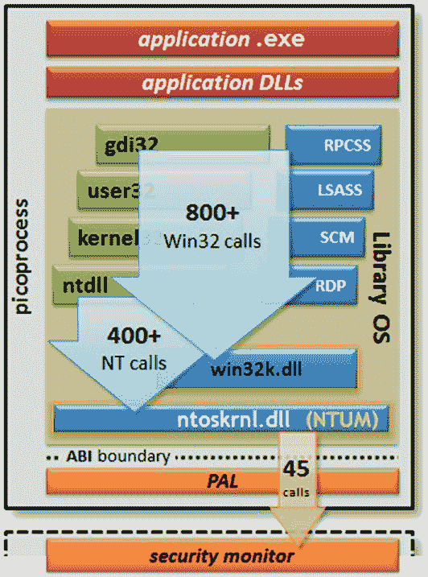

# 第 1 章 为什么要在 Linux 上运行 SQL Server？

## Drawbridge 微进程

在图 1-1 中，`picoprocess` 代表一个二进制文件，它将应用程序和库操作系统组件合并到一个进程中。这种方法的美妙之处在于，应用程序及其 DLL 保持不变。无需重新编译或修改。

让 Slava 和团队能够实现这一概念并将其应用到像 Linux 这样的另一个操作系统上的神奇之处在于一个应用二进制接口 (ABI)。许多 Windows API（在此图中由 Win32 和 NT 调用表示）由进程中的库 OS 实现，而大约有 45 个通过 `PAL` 公开，并映射到 ABI，最终映射到基础操作系统。

## Drawbridge 的影响

当时，Slava 正在微软内部一个名为 `Midori` 的项目工作，那是另一个操作系统项目，他看到了 Drawbridge 团队的工作。他能够在短时间内，利用 Drawbridge 团队的工作成果，让一个 Windows 应用程序在 `Midori` 上运行。因此，当 Slava 被要求回到 SQL Server 工程团队，并参与一个让 SQL Server 在 Linux 上运行的项目时，他从 Drawbridge 获得的经验带来了巨大的好处。

## 移植的困境

如果你思考一下 Slava 和团队将 SQL Server 引入 Linux 的选择，最合乎逻辑的是将 SQL Server 代码库移植到 Linux 上以原生方式编译和运行。但正如他所说，整个 SQL Server 代码库由数百万行代码组成。虽然采取转换和编译 SQL Server 以在 Linux 上运行的路径可能是“最纯粹”的方法，但沿着这条路走，我们不可能在 2017 年的目标时间内推向市场。事实上，早在 2014 年底，我们的一位首席工程师 `Peter Byrne` 就评估过这条路径，并得出结论：“仅将 SQL NT 引擎代码库移植和产品化到 Linux 上，就需要一个庞大的开发/测试/PM 团队进行多年的工作。” 因此，Drawbridge 的概念似乎是一个值得强烈考虑的想法。

## SQLOS、SQLPAL 与 Helsinki

Slava 是构建 SQL Server 一个名为 `SQLOS`（有些人称之为 `SOS`）的组件的团队成员之一，该组件作为 SQL Server 2005 的一部分发布。其概念是尽可能将 SQL Server 核心引擎与底层操作系统抽象化，以处理 I/O、内存和线程等请求。在 SQL Server 2005 中，引擎的大部分被改为使用 `SQLOS` API 服务（通过 `sqldk.dll`）。`SQLOS` 还为 `NUMA`、资源治理、资源监控和类似操作系统内核的调度系统等提供了内置支持。团队采取这种方法是因为 Windows 操作系统并未为数据库引擎等服务完全优化。我记得多年前问过 Slava，为什么他觉得有必要构建 `SQLOS`。他说：“这里的关键观察是，DBMS 和 OS 调度器必须合作。因此，操作系统必须内置对 DBMS 的支持，或者 DBMS 必须有一个特殊的调度层。”

当你阅读 `SQLOS` 的描述及其将 SQL 引擎开发者与底层操作系统 API 抽象化的能力时，你可能会想，为什么不直接拿 `SQLOS` 来修改并重新编译那段代码以使用 Linux 内核 API 呢？这种方法存在几个问题：

*   并非所有 SQL 引擎都使用 `SQLOS` 来调用 Windows API。例如，引擎直接调用 `WriteFileGather()` 来将数据页刷新到磁盘。这方面的证据以 SQL Server 等待类型的形式存在。SQL Server 中大约有 88 个 `PREEMPTIVE_OS*` 等待类型，这显示了多少组件不使用 `SQLOS` 来调用 Windows API。
*   我们仍然需要用 Linux 编译器重新编译所有 SQL 代码。这将要求我们维护两个代码库。
*   还有其他可以在引擎内部或外部运行但不使用 `SQLOS` 的组件：例如，我们在引擎中支持 XML 的组件以及像 SQL Server Agent 这样的服务。

