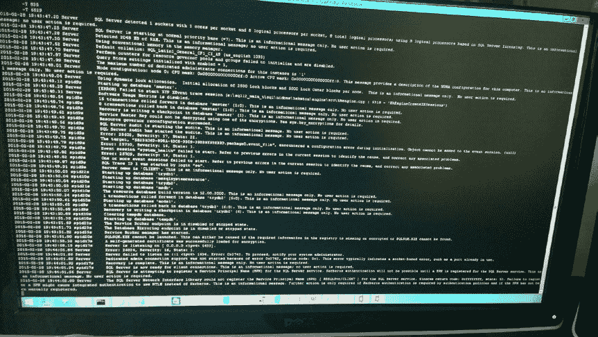

# 为什么 SQL Server 要运行在 Linux 上？

当我审视这个版本的目标时，我清楚地意识到可以总结为：

*我们希望能够在 Linux 上，无需修改应用程序，快速、可靠地运行大部分为 Windows 构建的可执行代码。*

拥有 `SQLOS` 仍然是一个巨大的优势。它为我们可以在此基础上构建的抽象层提供了基础。当 Slava 和团队试图确定一个设计方案时，他们发现 Drawbridge 团队已经为其项目构建了一个可以在 Linux 上工作的原型。现在，所有碎片都已就位。采用 Drawbridge 原型的工作成果，进行必要的修改使其产品化，并将其与 `SQLOS` 的工作和概念结合起来。由此诞生的就是 `SQLPAL`。

**注意**：我这样说起来似乎很简单，但这确实是我微软职业生涯中见过的最惊人、最具创新性的软件项目之一。

正如 Slava 所述，在确定这个设计后的一个月内，他们就拥有了一个简单可运行的版本，让 SQL Server 在 Linux 上启动并运行查询。

Slava 很有远见地拍下了那次首次启动的照片，如图 1-2 所示。



**图 1-2.** SQL Server 在 Slava Oks 的电脑上首次在 Linux 上启动

不久之后，他、Tobias Ternstrom 和团队的其他成员就有了针对 Linux 上 SQL Server 的项目计划和名称。他们称之为 *赫尔辛基计划*（以 Linux 创始人 Linus Torvalds 的出生地命名，他也在那里设计并提出了最初的 Linux 项目）。有了架构方向，该项目现在全面启动，朝着在 2017 年交付 Linux 版 SQL Server 的目标迈进。

##### Linux 上的 SQL Server 架构

当团队快速推进，对原始 Drawbridge 项目进行所有必要的修改，并构建所有用于部署、配置和工具的组件时，业界和 SQL Server 社区中的许多人都很好奇我们是如何构建这个的。虽然已经公开演示了 Linux 版 SQL Server 的轻松部署和基本查询功能，但没人知道幕后架构、`SQLPAL` 或将 Drawbridge 作为概念的使用情况。

团队在 2016 年底决定公开该架构。成果是项目的一位开发负责人 Scott Konersmann 撰写了一篇出色的博客，你可以在[这里](https://cloudblogs.microsoft.com/sqlserver/2016/12/16/sql-server-on-linux-how-introduction/)阅读。在他的博客中，Scott 概述了 Drawbridge 的历史、该项目的主要目标，以及仅仅使用 Drawbridge 项目所提供内容的挑战。项目成功的关键是 `SQLPAL`，他总结了他们将要构建的内容：

```
作为调查的结果，我们决定采用混合策略。我们将合并 SOS 和来自 Drawbridge 的 Library OS 来创建 SQL PAL（SQL 平台抽象层）。对于 SQL Server 不需要的 Library OS 领域，我们将移除它们。为了合并这些架构，需要在栈的所有层进行更改。

新架构由一组不经过任何 Win32 或 NT 系统调用的 SOS 直接 API 组成。对于没有 SOS 直接 API 的代码，它们将通过托管的 Windows API（如 MSXML）或 NTUM（NT 用户模式 API——这是 1500 多个 Win32 和 NT 系统调用）进行。所有子系统，如存储、网络或资源管理，都将基于 SOS，并在 SOS 直接和 NTUM API 之间共享。
```

总结来说，最终的设计和方法是将我们现有的 `SQLOS` 代码与 Drawbridge 的 Library OS 合并，以创建最终的 `SQLPAL` 概念。

Scott 使用图 1-3 中的图表来展示与 `SQLPAL`、`SQLOS`、`Library OS` 以及称为 `Host Extension` 的组件的交互。


