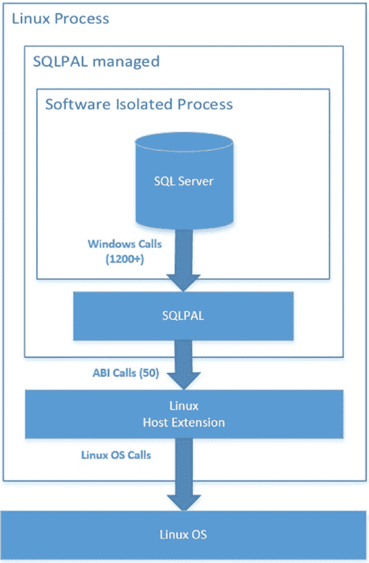
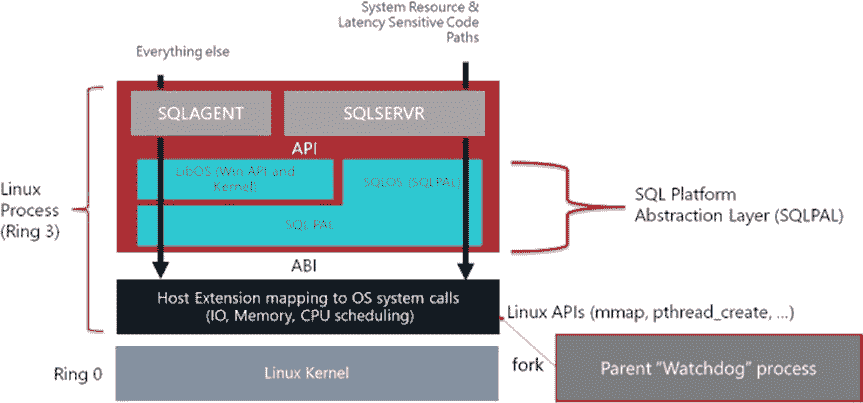

# 为何选择在 Linux 上运行 SQL Server？

***图 1-3.** Scott Konersmann 的 Linux 上 SQL Server 架构示意图*

我是一个非常视觉化的人，所以当我自己开始学习这个架构时，我决定将这个视图修改得更像图 1-4 中的示意图。（注：我是基于赫尔辛基团队构建的更详细架构图进行修改的。）

***图 1-4.** Linux 上的 SQL Server 架构*

在我开始描述架构之前，请允许我再提供一个重要的说明。这是截至 SQL Server 2017 正式发布时的架构。与任何内部机制和架构一样，我们保留更改和优化它的权利。我们的目标是让用户无需担心这些内部实现，但理解它很有趣，并且能增强我们产品在 Linux 上取得成功的可信度。

我必须告诉您，前面的示意图和我的描述，其实并未能完全展现团队所构建的惊人技术。仅仅深入探讨这个架构，可能就需要一整本书的篇幅。我预见到未来我们会不断演进这个架构，对其进行精简和改进，因此即使将整整一章的篇幅聚焦于此也不太现实。而且我们的目标是，Linux 上 SQL Server 的使用者本就不该关心这些细节。但因为有太多人对我们如何在 Linux 上构建 SQL Server 感到好奇，我认为我至少应该用一章中的一个章节来探讨这个主题。

让我们分解每个组件，以及它们如何相互作用以构成这个架构。请注意在这个示意图中，就像在 Drawbridge 中一样，*一个单一的 Linux 进程* 包含了应用程序（`SQLSERVR.EXE`）、库操作系统（LibOS）和平台抽象层（PAL）（在我们的案例中，我们称之为 `SQLPAL`）。这个进程在 Linux 上的名称是 `sqlservr`。在灰色框中，`SQLSERVR` 代表与 Windows 上相同的二进制文件 `SQLSERVR.EXE` 及其组件 DLL，包括 `sqlmin.dll`、`sqllang.dll` 等。浅蓝色框中的 LibOS 是支持 Windows API 的 DLL 和 Windows 服务。这包括诸如 `kernel32.dll`、`advapi32.dll` 等 DLL，以及诸如 `RPCSS.EXE` 等服务。

浅蓝色框中的 `SQLPAL` 包含两个组件：

- *SQLOS*：以 Windows 上 `SQLDK.DLL` 的形式提供。
- *SQLPAL.DLL*：这是关键组件，它将实现 LibOS 所需的任何 Windows 功能，或者将需要 Linux 内核服务的调用重定向到一个称为 *宿主扩展* 的组件。一个在 `SQLPAL` 中实现的 Windows 功能示例是 Windows 注册表调用。一个需要 Linux 内核的例子是内存分配。

**注意** 未来版本的 `SQLPAL` 可能会完全包含 `SQLOS` 功能，因此我们可以进一步精简这些代码领域。例如，`SQLPAL.DLL` 将封装目前存在于 `SQLDK.DLL` 中的所有功能。

黑色框中的 *宿主扩展* 是一组为 Linux 原生编译的代码，它理解所有必要的 Linux API 调用，用于处理内存（`mmap`）、线程（`pthread`）和 I/O（`aio`）等事物。

连接这两个世界的桥梁是应用程序二进制接口（ABI）。这意味着 `SQLPAL.DLL` 不能像在 Windows 上为任何 API 编码那样，直接调用宿主扩展的代码来处理内存、线程、I/O 和其他服务。这是因为 Windows 和 Linux 在调用代码中的函数时有不同的机制（这被称为*调用约定*）。由于 `SQLPAL.DLL` 是为 Windows 编译的，而宿主扩展代码是为 Linux 编译的，它们必须通过一种允许 `SQLPAL` 将其调用约定转换为 Linux 约定的机制来*对话*。这是通过一系列巧妙的汇编指令完成的，这也是它被称为应用程序二进制接口的原因。它非常轻量级，进行这种转换不需要任何显著的开销。

如果你曾经研究过 Windows 或 Linux 等操作系统上的程序执行，你会了解程序在这些系统上的*二进制格式*的概念。

