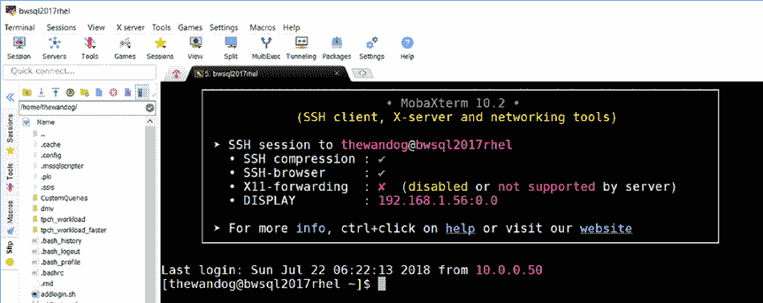
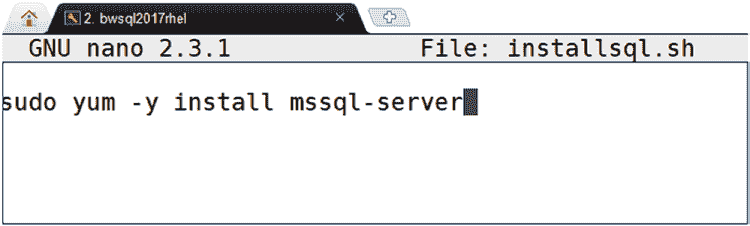
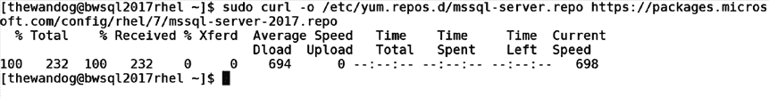

# 第 2 章

## 安装与配置

从一开始，我们的团队就希望确保 SQL Server 在 Linux 上的安装体验能很好地契合 Linux 用户已经非常成熟的方法、实践和生态系统。此外，我们不仅仅是声称 SQL Server 在任何 Linux 发行版上都受支持（市面上有数百种），而是希望确保我们在流行的发行版上提供一个经过充分测试的高质量版本，并为我们的客户提供卓越的支持体验。

我们将安装体验设计得快速而轻量。您可能会对本章中专门讨论此主题的篇幅之多感到惊讶。这是因为安装产品是您遇到的第一个体验，并且可以奠定您对产品看法的基调。如果您只是想直接上手，看看在 Linux 上安装 SQL Server 有多么容易，请直接跳转到“直接安装！”部分。

我希望本章涵盖安装体验的所有方面，这样您就可以了解预期结果，理解其背后的工作原理，并为您提供所有安装和更新的选项。

本章还将讨论安装要求、如何验证安装是否成功、无人值守安装、离线安装、安装其他软件包、在 Azure 环境中安装、安装问题排查、探索已安装内容以及配置相关主题。所有这些都基于我个人安装该产品的经验，以及与客户、我们的支持和工程团队的交流，他们的目标是使安装和配置体验简单而完整。

#### 安装准备

如果您希望获得像 SQL Server 这样复杂的产品在企业级应用中的卓越体验，仔细的准备是关键的成功标准。在本节中，我将讨论我们官方支持的 Linux 发行版、为确保流畅且最优的 SQL Server 体验所需的系统要求，以及一些

© Bob Ward 2018


B. Ward,  *Linux 上的 SQL 宝典*, `doi.org/10.1007/978-1-4842-4128-8_2`

### 第 2 章：安装与配置

本章将就如何在目标 SQL Server 环境选型过程中，测试其各项功能提供建议。本章最后一部分仅面向 Linux 新手，因此如果您是 Linux 高手，可以选择跳过。我认为，对于从 Windows 过渡而来的用户，借鉴我在重新适应 Linux 导航过程中所积累的一些技巧，会很有帮助。

##### Linux 发行版

Linux 上的 SQL Server 2017 官方支持以下 Linux 发行版（这些是最低版本要求）：

*   红帽企业 Linux (RHEL) 7.3 和 7.4
*   SUSE Linux 企业服务器 (SLES) v12SP2
*   Ubuntu 16.04 LTS

为便于后续理解，尽管 RHEL 和 SLES 在功能上各有差异，但它们都被视为 `RPM-based` 发行版，而 Ubuntu 是 `Debian-based` 发行版（我在查看各种 Linux 发行版及其历史时，发现这个资源非常有价值：[`en.wikipedia.org/wiki/Linux_distribution`](https://en.wikipedia.org/wiki/Linux_distribution)）。这种区分之所以重要，主要是因为它影响了我们为每个发行版使用的软件包格式。

我们始终致力于了解应支持这些发行版的哪些新版本，因此请将此页面加入书签，以获取 Linux 上 SQL Server 的“最新消息”：[`docs.microsoft.com/sql/linux/sql-server-linux-setup`](https://docs.microsoft.com/sql/linux/sql-server-linux-setup)。

您对这些发行版的选择可能基于个人偏好或贵公司的标准。需要说明的是，我们已在其他 Linux 发行版（如 CentOS 或 ORACLE 企业 Linux (OEL)）上进行了基础测试，SQL Server 可以在这些系统上运行。但是，除了本节列出的发行版外，我们目前尚未准备好正式声明支持在其他 Linux 发行版上运行 SQL Server。

**注意：** 我们完全支持在 Docker 容器上运行 SQL Server，我将在第 11 章全面介绍该主题。

为保持一致性，本书中的所有演示和示例都将使用红帽企业 Linux。SQL Server 在这三种发行版上运行都非常出色，并且整合了各自熟悉的体验。我们的文档中有清晰的示例，说明如何在 RHEL、SLES 和 Ubuntu 上安装 SQL Server。

### 安装建议

我建议在安装 SQL Server 前，查阅您所用 Linux 发行版的文档和安装指南，以确保获得最佳体验。例如，由于 SQL Server 可能是 I/O 密集型应用，您可能需要查阅 Linux 指南来了解如何为性能和持久性配置磁盘。话虽如此，我将在第 6 章与您一起回顾微软的指导，介绍如何根据我们在微软的经验配置 Linux 和 SQL Server，以实现最大性能，包括 SQL Server 和 Linux 内核的调优建议。

关于如何安装和与 Linux 交互以使用 SQL Server，我有几点个人技巧：

*   我从不安装图形界面。Ubuntu 桌面用户可能更喜欢图形界面的 Shell，而 SQL Server 开发者版在该环境下运行良好。我发现自己总是使用命令行的 `bash` Shell，或者在连接到 Linux 服务器或虚拟机的 Windows 笔记本电脑上运行图形界面程序。
*   如果我非常注重性能，我会始终为数据库和事务日志文件单独挂载一个驱动器。为简化操作，我通常将 `/var/opt` 挂载到这个单独的驱动器上，并直接将其用作默认数据库目录（您会发现可以更改此设置）。对于严肃的生产场景，您可能会将 SQL Server 数据库和日志文件分布在不同的驱动器上，甚至跨驱动器创建多个 SQL Server 文件。关于如何配置 Linux 以


## 第二章：安装与配置

### 准备数据磁盘并连接至服务器

开始之前，请确保您已添加一个单独的磁盘（例如添加到您的虚拟机中），具体操作可参考 Azure 文档。请阅读“准备数据磁盘”章节，链接为：[`docs.microsoft.com/azure/virtual-machines/linux/tutorial-manage-disks`](https://docs.microsoft.com/azure/virtual-machines/linux/tutorial-manage-disks)。

如果您计划从一台非原生运行 Linux 的笔记本电脑连接到 Linux 服务器或虚拟机，建议您准备一个可靠的安全外壳（`ssh`）程序。对于 MacOS 用户，系统内置了命令行 `ssh` 客户端，但您也可以安装其他工具。对于 Windows 10 用户，您可以安装 Linux 子系统，该系统自带 `ssh` 命令行界面。更多信息请参阅：[`docs.microsoft.com/windows/wsl/install-win10`](https://docs.microsoft.com/windows/wsl/install-win10)。对我而言（我将在本书中使用它进行演示），我使用的是名为 `MobaXterm` 的程序，您可以从 [`mobaxterm.mobatek.net/`](https://mobaxterm.mobatek.net/) 下载。



图 2-1 展示了一个连接到 Linux 服务器的 `MobaXterm` `ssh` 会话示例。

**图 2-1. 连接到 Linux 服务器的 MobaXterm ssh 会话**

##### 系统要求

SQL Server 可在多种不同类型的计算机系统和虚拟机配置上运行。其核心最低要求如下：

-   2GB 内存（从 SQL Server 2017 累积更新 2 开始，最低要求已降至 2GB）。
-   6GB 可用磁盘空间。
-   2GHz 的处理器速度。
-   处理器类型为 `x64` 兼容。
-   两个物理处理器核心。

尽管以上是最低要求，但 SQL Server 可扩展至当前可用的最大型系统。SQL Server 能利用 Linux 上的最大可用内存。目前，理论极限为 64TB，但实际测试极限约为 12TB。SQL Server 在 Linux 上支持的核心数量没有限制，最大数据库大小高达 524 PB（拍字节）。

SQL Server 支持 Linux 上流行的原生文件系统 `XFS` 和 `EXT4`。默认文件系统类型因发行版而异。对于 RHEL 7.3 和 7.4，默认是 `XFS`；而对于 Ubuntu 和 SLES，默认是 `EXT4`。在我们微软的测试中，我们未发现两种文件系统类型之间存在显著的性能差异。然而，与 `EXT4` 相比，`XFS` 在卷大小、最大文件大小和文件数量方面提供了更大的容量。在我所有关于 RHEL 的工作中，我只使用默认的 `XFS`。我们在 Ubuntu 和 SLES 上的测试表明，`EXT4` 在这些发行版上表现最佳（但 `XFS` 也完全支持）。还有一种名为 `BTRFS` 的新文件系统类型，目前不支持用于 SQL Server。您还应了解，流行的远程存储系统网络文件系统（`NFS`）在满足一些限制条件的情况下是支持的，这些限制记录在我们的系统要求页面中：[`docs.microsoft.com/sql/linux/sql-server-linux-setup#system`](https://docs.microsoft.com/sql/linux/sql-server-linux-setup#system)。

> **提示：** 为了获得 SQL Server 的最佳性能，您可能需要为计算机调整某些 `BIOS` 设置。有关为 Linux 系统调整 `BIOS` 设置的更多详细信息，请参见第 6 章。

### SQL Server 测试资源

在您计划安装并探索 SQL Server 功能时，以下资源可能会对您有所帮助。

#### WideWorldImporters 示例数据库

在 SQL Server 2016 中，我们创建了一个名为 `WideWorldImporters` 的新示例数据库，以及一系列脚本和演示。我将在本书中一直使用此示例（以及配套的 `WideWorldImportersDW` 数据库）。您可以通过此文档入口访问此数据库的备份及所有示例。


### 第 2 章：安装与配置

## 将 HammerDB 应用于 SQL Server

如果你希望测试 SQL Server 在 Linux 上处理 OLTP 或数据仓库工作负载的能力，可以考虑使用流行的开源工具 HammerDB。你可以从 `http://www.hammerdb.com` 下载该工具。HammerDB 支持运行 TPC 基准测试的衍生版本：TPC-C（OLTP）和 TPC-H（数据仓库）。请注意，HammerDB 需要图形用户界面（GUI），但也提供了一些自动化功能。其基本界面如图 2-2 所示。

图 2-2：HammerDB 2.23 界面

## Linux 使用技巧

如果你是 Windows 用户，甚至是 PowerShell 的熟练使用者，在使用 Linux Shell 和系统时可能还需要一些指导。本节包含了一些我在 Linux 上安装、演示和展示 SQL Server 过程中学到的命令、脚本和导航技巧。

###### 常用命令

以下是我日常在 bash shell 中最常使用的命令列表：

- `ls` 和 `ll`：列出目录中的文件。`ls`有各种选项可用于列出文件。我喜欢用`ll`，因为它能提供目录或文件的详细信息，包括大小、权限和日期/时间。

- `grep`：从输入流、单个文件或一组文件中搜索给定的文本字符串。

- `man`：是“手册页”的缩写。用它可以查找任何命令的语法和详细信息。例如，运行 `man sqlservr` 可以查看 SQL Server 的简短描述，包括支持的环境变量列表、文件安装位置以及指向互联网上完整文档的链接。

- `chmod`：更改文件或目录的属性，如读/写/执行权限。例如，当你创建一个要在 shell 中作为脚本执行的文件时，你必须更改其模式以允许执行，如下所示：`chmod u+x myscript.sh`

- `chown`：更改文件或目录所属的组和/或用户。我使用这个命令来更改我正在还原的 SQL Server 备份文件的所有权，将其改为 `mssql` 组和 `mssql` 用户，以便 SQL Server 可以读取该文件：`chown mssql:mssql mybackup.bak`

- `pwd`：代表“打印工作目录”，用于查看当前工作目录。

- `ps`：代表“进程状态”，是获取 Linux 服务器上正在运行的进程列表及其详细信息的简单方法。

- `systemctl`：此命令用于报告和控制 Linux 上一个称为“服务”的 systemd 单元的运行状态。正如你将在本书中看到的，SQL Server 的服务名为 `mssql-server`。以下是使用此命令配合 `mssql-server` 服务的参考（现在不必担心 `sudo`，我将在下一节解释）：
    - 显示 SQL Server 是否正在运行：
        ```
        sudo systemctl status mssql-server
        ```
    - 停止 SQL Server（SQL Server 会执行正常关闭）。如果 SQL Server 已经停止，则不执行任何操作。
        ```
        sudo systemctl stop mssql-server
        ```
    - 启动 SQL Server。如果 SQL Server 已启动，则不执行任何操作。
        ```
        sudo systemctl start mssql-server
        ```
    - 重启 SQL Server。如果 SQL Server 正在运行，此命令会将其关闭然后重新启动。如果 SQL Server 已停止，此命令将启动它。
        ```
        sudo systemctl restart mssql-server
        ```


### 第 2 章：安装与配置

**提示**：`systemctl` 会向服务控制提交一个“作业”。只有 `status` 选项会显示信息。当你尝试启动、停止或重启服务时，使用 `status` 选项来查看结果。

`scp`：代表安全文件复制（secure file copy），可用于将文件从一个 Linux 服务器复制到另一个。

**提示**：有一个非常棒的免费工具叫做 `winscp`，我经常用它从 Windows 复制文件到 Linux。Windows 的 `ssh` 程序 MobaXterm 也包含一些基本的拖放复制功能。

`df`：显示挂载在驱动器上的文件夹的磁盘空间使用情况。使用 `-h` 选项可以以易读的格式显示哪些目录挂载在特定磁盘及其大小。我发现这对于查看 `/var/opt/mssql` 目录有多少空间用于默认数据库很有帮助。

`du`：代表磁盘使用情况（disk usage）。一个非常方便的命令，用于显示按目录划分的磁盘空间使用情况。

`tree`：你必须安装一个软件包才能使用此命令（`yum install tree`）。它以层级结构显示一个目录及其所有文件和子目录。

在本书后面的章节中，我将讨论我用于监控性能和系统信息的各种 Linux 命令。

### sudo

当你安装 Linux 时，通常需要提供一个用于与 Shell 进行常规交互的登录名和密码，以及 root 用户的密码。出于安全原因，最好不要以 root 用户（通常称为超级用户）身份直接登录并运行。因此，有一种方法可以在以另一个用户身份登录时，以 root（或另一个用户）的上下文执行命令。

这种方法由一个名为 `sudo` 的命令实现（这代表“substitute user do”，但过去被称为“superuser do”，因为在旧版本中它只用于超级用户命令）。

例如，你的默认账户将没有权限访问 SQL Server 的安装目录，因此你需要运行此命令来列出其中一个目录：

```
sudo ls /var/opt/mssql
```

**注意**：注意这里的目录导航符号 `/` 与 Windows 约定的 `\` 不同。

通常，在 `ssh` 会话中，当你第一次使用 `sudo` 时，系统会提示你输入密码。默认情况下，该认证会缓存一段时间（五分钟，你可以配置此值）。这意味着，实际上，一旦你输入密码，在接下来的五分钟内，所有其他 `sudo` 执行都不需要再次输入密码。

与所有 Linux 命令一样，`sudo` 有大量的选项。你可能觉得有用的两个选项是 `-i` 和 `-u`。`-i` 允许你更改 Shell 会话的上下文，以超级用户身份运行所有后续命令。例如，当你运行 `sudo -i` 时，系统会提示你输入密码，然后你的 Shell 提示符会改变，表明你现在正在以 root 身份运行：

```
[root@bwsql2017rhel ~]#
```

`-u` 选项允许你以 root 之外的另一个用户的身份上下文运行命令。

## 查看和编辑文件与脚本

对于许多用户来说，任何操作系统中的常见任务都是查看和编辑文件以及构建脚本。在以下示例中，只有当文件需要超级用户权限时才需要 `sudo` 命令。

查看任何文本文件最常用的命令是 `cat` 命令。因此，命令 `sudo cat /var/opt/mssql/log/errorlog` 会输出 SQL Server ERRORLOG 的文本内容（我将在本章后面解释此文件的重要性）。

`more` 命令可用于分页查看任何文件。

```
sudo more /var/opt/mssql/log/errorlog
```

**提示**：这个命令“更有”内涵。当文件通过 `more` 显示时，按下 `h` 键可以获取选项列表，其中包括搜索功能。

我最喜欢的命令之一是 `tail` 命令，用于查看文件的末尾部分。这对于查看像 SQL Server ERRORLOG 这类文件中的最新条目非常方便：

```
sudo tail /var/opt/mssql/log/errorlog
```



如果你有一个文件会频繁追加内容，你可以使用 `tail` 来“监控”文件的新条目，就像这样：

```
sudo tail -f /var/opt/mssql/log/errorlog
```


编辑文件也是另一项常见任务，包括编写 shell 脚本。我记得早年使用 UNIX 时著名的 `vi` 编辑器。我的一位朋友曾建议我学习 vi，因为它默认安装在全世界每一台 UNIX 系统上。至今它仍然可供你使用。但现在我更喜欢流行的 `nano` 编辑器（正如 Robert Dorr 所建议的）。`nano` 可能没有安装在你的 Linux 服务器上，因此在 RHEL 上，我使用以下命令安装它：

```
sudo yum install nano
```

`nano` 是一个全屏编辑器，甚至支持剪切/复制/粘贴。图 2-3 是一个使用 `nano` 创建用于安装 SQL Server 的 shell 脚本的示例屏幕。

*图 2-3. 在 Linux 上的 `nano` 编辑体验*

请记住，当你创建一个 shell 脚本时，你必须将其“模式”更改为可执行才能运行它：

```
chmod u+x installsql.sh
```

###### 系统日志记录

本章后续部分，我将讨论一个名为 ERRORLOG 的日志文件，SQL Server 使用它来提供有关启动、错误、警告和其他执行详情的重要信息。你可能还需要查看 Linux 内核或其他程序的日志。在较旧的基于 RPM 的发行版和当前的 Debian 系统中，一个常见的文件是 `/var/log/syslog`。在像 RHEL 这样的当前基于 RPM 的系统版本中，有一个非常棒的程序可以查看大多数系统日志，称为 `journalctl`。并且 SQL Server 会将其 ERRORLOG 中的信息写入同一个日志记录设施。

默认情况下，`journalctl` 只会保留自你的 Linux 服务器上次启动以来的消息（这是可配置的，以使日志在多次启动间保持持久化），而默认执行 `journalctl` 会显示自启动以来所有已记录的、从最旧开始的消息：

```
journalctl
```

以下是 Linux 上 `journalctl` 的一些典型输出：

```
-- 日志始于 Sat 2018-02-17 09:29:49 CST，止于 Tue 2018-02-20 06:43:04 CST。 --
2 月 17 09:29:49 bwsql2017rhel system-journal[106]: Runtime journal is using 8.0M (max allowed 390.2M, trying to leave 545.4M f
2 月 17 09:29:49 bwsql2017rhel kernel: Initializing cgroup subsys cpuset
2 月 17 09:29:49 bwsql2017rhel kernel: Initializing cgroup subsys cpu
...
```

**提示**：`journalctl` 中显示的 Linux 版本是 Linux 内核发布的版本。要找出你的发行版发布和版本号的具体详细信息，请使用此命令：

```
cat /etc/os-release
```

默认情况下，`journalctl` 会分页显示输出，但你可以使用一个选项来控制这一点。要查看所有 SQL Server 条目，你可以使用如下命令：

```
journalctl | grep sqlservr
```

这仅向你显示 `sqlservr` 的日志输出，但你可能希望看到与其他内核消息交织的输出。在这种情况下，只需运行 `journalctl` 转储整个日志，因为每个条目都标有时间戳。

## 只管安装它吧！

至此，本章中你已经了解了 SQL Server 的系统要求，探索了一些测试 Linux 环境和 SQL Server 的基础知识，并且如果你是 Linux 新手，还获得了一些关于如何操作操作系统和 shell 的技巧。或者你可能只是跳到这里，想立即开始安装 SQL Server。在本节中，我将引导你完成安装过程，并为你提供一些幕后信息。

## 60 秒内部署完成

在我展示在 RHEL 上安装的步骤之前，这里快速提供了在 Ubuntu（使用 `apt-get`）和 SLES（使用 `zypper`）上安装的指引。这些步骤非常相似但略有不同，以适应这些发行版上的包管理器。

*Ubuntu*：[`docs.microsoft.com/sql/linux/quickstart-install-connect-ubuntu`](https://docs.microsoft.com/sql/linux/quickstart-install-connect-ubuntu)

*SLES*：[`docs.microsoft.com/sql/linux/quickstart-install-connect-suse`](https://docs.microsoft.com/sql/linux/quickstart-install-connect-suse)


## 在 RHEL 上的安装只需三个简单步骤

请注意，这些步骤要求您的 Linux 服务器具有互联网连接。本章后面将讨论如何进行离线安装。

1.  下载一个名为仓库（repo）配置文件的文本文件到已知目录。
    ```
    sudo curl -o /etc/yum.repos.d/mssql-server.repo https://packages.microsoft.com/config/rhel/7/mssql-server-2017.repo
    ```

2.  运行安装命令。
    ```
    sudo yum install -y mssql-server
    ```
    > **提示：** 此步骤安装基于累积更新（Cumulative updates，简称 CUs）概念的最新 SQL Server 2017 更新。本章后面将讨论如何应用特定版本。建议使用最新更新，因为我们持续改进 SQL Server on Linux，包括修复和次要增强。还建议在 Linux 上安装 SQL Server 后，每月保持更新，因为这是典型的更新频率。

3.  运行 bash shell 脚本以 `完成` SQL Server 的安装（回答几个提示）：
    ```
    sudo /opt/mssql/bin/mssql-conf setup
    ```

### 第 2 章：安装与配置

就是这样。如果您有良好的互联网连接，这些步骤大约可以在 60 秒内完成。我已经多次看到并做到了这一点。

此时，如果您像我一样，只想快速推进——构建数据库、应用程序和查询。我理解这一点，事实上，我们在 Linux 上构建 SQL Server 就是为了让您能够这样做。但本书旨在全面涵盖该主题，因此本章的其余部分提供了关于完整安装体验的详细信息。如果您计划开始使用 SQL Server，我建议您停下来浏览以下资源，以避免使用产品时遇到任何问题：

[`docs.microsoft.com/sql/linux/sql-server-linux-release-notes`](https://docs.microsoft.com/sql/linux/sql-server-linux-release-notes) 和 [`docs.microsoft.com/sql/linux/sql-server-linux-faq`](https://docs.microsoft.com/sql/linux/sql-server-linux-faq)。

如果您对每个步骤背后的更多细节感兴趣，请继续阅读。否则，请转到本章的下一节。

##### 下载仓库配置文件

您只需在 Linux 服务器上下载一次仓库配置文件（除非您想更改要使用的仓库），即使您决定安装和卸载多次。
```
sudo curl -o /etc/yum.repos.d/mssql-server.repo https://packages.microsoft.com/config/rhel/7/mssql-server-2017.repo
```

`curl`，也称为 cURL（代表 Client URL Request Library），是一个使用 URL 语法获取或发送文件的命令。默认写入标准输出（stdout），因此 `-o` 参数后跟一个文件名。在本例中，SQL Server 遵循 `yum` 仓库约定，将文件放在 `/etc/yum/repos.d` 目录中。

仓库文件是一个简单的文本文件，如下所示（基于我们 packages.microsoft.com 服务器上的 `mssql-server-2017.repo`）：
```
[packages-microsoft-com-mssql-server-2017]
name=packages-microsoft-com-mssql-server-2017
baseurl=https://packages.microsoft.com/rhel/7/mssql-server-2017/
enabled=1
gpgcheck=1
gpgkey=https://packages.microsoft.com/keys/microsoft.asc
```



### 第 2 章：安装与配置

`mssql-server-2017.repo` 是 SQL Server 2017 CU 仓库的配置文件。您可能想使用不同的仓库（例如用于预览构建或通用分发版 [GDR] 的仓库）。有关更多详情，请参阅本章中名为“安装其他版本”的部分。此仓库文件将控制包管理器用于下载和安装更新包的内容。

其概念是从应用程序供应商提供的位置下载仓库文件，这样当您运行安装时，`yum` 包管理器将使用该文件的内容来安装包（以及密钥）。因此，这个 URL（[`packages.microsoft.com/rhel/7/mssql-server-2017/`](https://packages.microsoft.com/rhel/7/mssql-server-2017/)）


