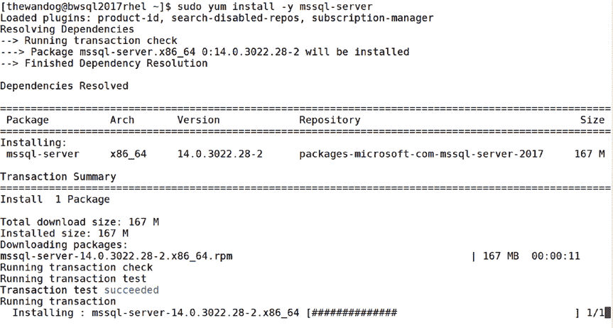
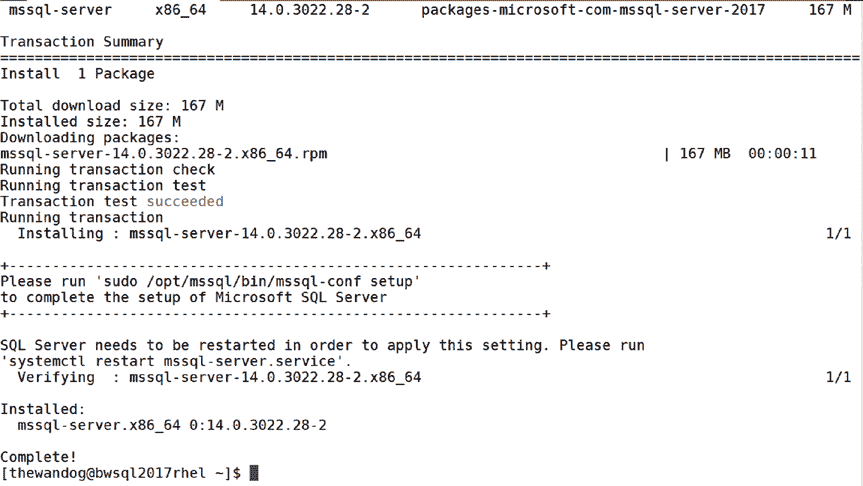
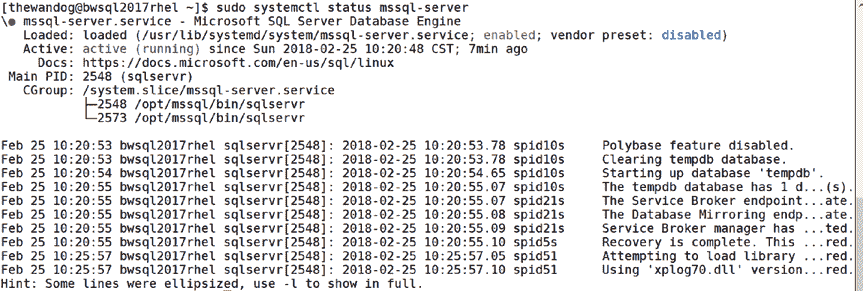
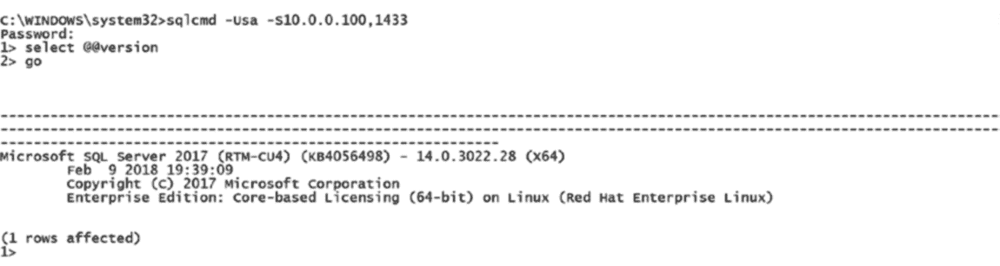

# 第二章 安装与配置

[microsoft.com/rhel/7/mssql-server-2017/](https://packages.microsoft.com/rhel/7/mssql-server-2017/) 是适用于 RHEL 的 SQL Server RPM 软件包的实际位置。以下是一个在我的系统上执行 `curl` 命令的示例：

```
[thewandog@bwsql2017rhel ~]$ sudo curl – o /etc/yum.repos.d/mssql-server.repo https://packages.microsoft.com/config/rhel/7/mssql-server-2017.repo
```

然后，图 2-4 显示了输出的样子。

**图 2-4. 下载 RHEL 的仓库配置文件的输出示例**

##### 安装 SQL Server 引擎

既然仓库文件已复制，是时候在基于 RHEL 的 Linux 上执行 SQL Server 的安装了。

```
sudo yum install -y mssql-server
```

重新回到 Linux，有一件事让我很享受，那就是了解操作系统各个部分是如何进入发行版的历史。`yum` 代表（YellowDog Updater Modifier）。它的起源可以追溯到一个名为 Yellow Dog Linux 的免费发行版，并且是 RHEL、Fedora 和 CentOS 的主要基于 RPM 的包管理器。



SQL Server RPM 软件包的安装过程会执行以下操作：

1.  下载二进制 RPM 软件包文件。
2.  创建一个名为 `mssql` 的 Linux 用户和组（这将是分配给 SQL Server 非二进制文件的非交互式登录用户和组）。您无法更改此设置。
3.  提取 SQL Server 二进制文件和安装文件（我们将在本章后面的章节中探讨所有这些文件）。
4.  将 SQL Server 注册为一个名为 `mssql-server` 的 systemd 服务。

示例语法中用于 `yum` 的 `-y` 参数代表“assume yes”（假设为是），这意味着您自动要求 `yum` 对任何提示都回答“是”。对于我们的安装，唯一的提示是是否要继续下载。

图 2-5 是在 RHEL 上使用 `yum` 时，SQL Server 安装过程进行中的截图。

**图 2-5. RHEL 上正在进行的 SQL Server 的 `yum install` 过程**



图 2-6 是成功安装后样子的示例。

**图 2-6. RHEL 上已完成的 SQL Server `yum install`**

##### 完成 SQL Server 的设置

如果您仔细查看此截图，安装程序提供了如何完成 SQL Server 设置的说明：

**请运行 `sudo /opt/mssql/bin/mssql-conf setup` 以完成 Microsoft SQL Server 的设置。**

因此，要运行的命令是：

```
sudo /opt/mssql/bin/mssql-conf setup
```

这一步是必要的，以便我们可以从下载的安装文件中提取出系统数据库，并运行 `sqlservr` 来执行一些安装后的步骤。`mssql-conf` 是一个作为安装一部分复制的 bash shell 脚本，它执行其他支持的 python 脚本来执行各种配置任务。此脚本接受多个选项，其中一个称为 `setup`。您只会在安装 SQL Server 后使用此选项一次，但 `mssql-conf` 支持其他选项，我们将在本章后面介绍。

`mssql-conf` 的 `setup` 选项执行以下操作：

1.  提示您选择 SQL Server 的版本。
2.  要求您接受最终用户许可协议 (EULA)。您可以从 `/usr/share/doc/mssql-server` 阅读该协议。
3.  提示输入名为 `sa` 的 SQL Server 系统管理员账户的密码。

**提示**：SQL Server 账户 `sa` 是默认的系统管理员账户。在本书后面的章节中，我将讨论如何向 SQL Server 添加其他登录账户。记住 `sa` 账户的密码非常重要。`mssql-conf` 确实提供了一个重置 `sa` 密码的选项。另请注意，`sa` 密码必须是“复杂”密码（Linux 上 SQL Server 的所有登录密码都必须如此）。要求是：至少八个字符长并且包含


### 第 2 章：安装与配置

字符集来自以下四个集合中的三个：`大写字母`、`小写字母`、`数字`和`符号`。

`Evaluation`、`Developer`和`Express`是 SQL Server 的免费版本。如果你选择`Web`、`Standard`、`Enterprise`或`Enterprise Core`，这些是付费许可证，但如果你已通过与 Microsoft 的合同拥有付费许可证，请选择这些选项。你将无需输入产品密钥。如果你是单独购买的许可证，请选择选项 8 并输入你的产品密钥。

以下是响应安装版本选择并接受许可协议的示例：

```
[thewandog@bwsql2017rhel ~]$ sudo /opt/mssql/bin/mssql-conf setup
Choose an edition of SQL Server:
1) Evaluation (free, no production use rights, 180-day limit)
2) Developer (free, no production use rights)
3) Express (free)
4) Web (PAID)
5) Standard (PAID)
6) Enterprise (PAID)
7) Enterprise Core (PAID)
8)  I bought a license through a retail sales channel and have a product key to enter.
Details about editions can be found at https://go.microsoft.com/fwlink/$LinkId=852748&clcid=0x409
Use of PAID editions of this software requires separate licensing through a Microsoft Volume Licensing program.
By choosing a PAID edition, you are verifying that you have the appropriate number of licenses in place to install and run this software
Enter your edition(1-8): 2
The license terms for this product can be found in /usr/share/doc/mssql-server or downloaded from: http://go.microsoft.com/fwlink/?LinkId=855862&clcid=0x409
The privacy statement can be viewed at: https://go.microsoft.com/fwlink/?LinkId=853010&clcid=0x409
Do you accept the license terms [Yes/No]: Yes
Enter the SQL Server system administrator password:
Confirm the SQL Server system administrator password:
Configuring SQL Server
Setup has completed successfully. SQL Server is now starting.
[thewandog&bwsql2017rhel ~]$
```

此外，使用`setup`选项运行`mssql-conf`会将`/var/opt/mssql`目录（及其子目录）的所有者更改为用户`mssql`和组`mssql`。这是此目录的默认位置和所有者，在 Linux 上的 SQL Server 2017 中，你无法更改此设置。

在“无人参与安装”部分，我将向你展示如何使用环境变量自动化这些步骤，以避免需要手动提供用户输入。

#### 完整的安装体验

我告诉过你 SQL Server 的安装很简单。本节涵盖与安装相关的主题，我相信你会发现这些主题对于提供完整的安装体验很有用。学习如何安装其他版本的 SQL Server、验证你的安装、执行无人参与和离线安装、在云端安装以及学习故障排除技巧。

##### 安装其他版本

SQL Server 2017 有两个主要的安装源仓库：

- `mssql-server-2017`：基于 SQL Server 2017 的累积更新（CU）的最新发布版本。选择此项以使用 SQL Server 2017 的最新更新。本章前面以及我们在官方 Microsoft 文档中的教程中展示的步骤都使用此仓库。
- `mssql-server-2017-gdr`：SQL Server 2017 的常规分发版本（GDR）。如果你只想要 SQL Server 2017 的安全性和关键更新，请选择此项。在 SQL Server 某个主要版本的生命周期内，此仓库的更新通常非常少。

未来版本的 SQL Server 可能会有不同的仓库名称。

**注意**，还有一个名为`mssql-server`的预览版仓库。如果你曾使用过此仓库，请务必在安装 SQL Server 之前移除 SQL Server 并切换到已发布的仓库之一。

通常每月，Microsoft 会发布一个名为累积更新（`CU`）的 SQL Server 2017 更新。这是产品的修复和增强功能的集合，它们从`CU1`开始连续编号。顾名思义，每个`CU`都包含前一个构建的更改。请参阅我们的发布说明以获取更多信息...

以下是翻译后的中文内容：


这些构建版本的完整列表请参阅：[`docs.microsoft.com/sql/linux/sql-server-linux-release-notes`](https://docs.microsoft.com/sql/linux/sql-server-linux-release-notes)

## 第 2 章 安装与配置

每当需要解决安全问题或关键故障时，Microsoft 会发布 GDR 构建版本。这样，如果你想运行基于发布到制造（RTM）构建版本并包含安全更新/关键修复的 SQL Server，你可以选择 GDR 仓库来获取最新构建版本。

**注意** 在 SQL Server 2017 之前，Microsoft 会发布 GDR、CU 和 Service Pack 版本。从 SQL Server 2017 开始，Microsoft 将不再发布 Service Pack 版本。

本节前面复制仓库文件的说明使用的是 CU 仓库。一旦你复制了仓库文件，以后使用包管理器进行的任何安装或更新命令都将使用该仓库。如果你想更改使用的仓库，必须先删除之前的仓库文件，然后复制新的仓库文件。

例如，如果你之前使用了 `mssql-server-2017.repo` 文件，并希望从 GDR 仓库卸载并重新安装，你需要：

1.  像这样删除之前的仓库文件

    ```
    sudo rm /etc/yum.repos.d/mssql-server.repo
    ```

2.  卸载 SQL Server

3.  像这样复制新的仓库文件（假设是 RHEL 系统，但如何为 Ubuntu 和 SLES 执行此操作请参阅我们的安装文档）

    ```
    sudo curl -o /etc/yum.repos.d/mssql-server.repo https://packages.microsoft.com/config/rhel/7/mssql-server-2017-gdr.repo
    ```

4.  安装 SQL Server

此外，默认情况下，安装和更新将使用这些仓库中的最新构建版本。要安装特定的包版本，你可以对该版本的包进行离线安装，或者使用以下 `yum` 语法：

```
sudo yum install -y mssql-server:<package version>
```

要查找 SQL Server 的所有包版本，请在 `bash` shell 中运行以下命令：

```
sudo yum list mssql-server --showduplicates
```



## 第 2 章 安装与配置

至少，我建议你使用 GDR 仓库中的最新构建版本来获取任何安全和关键更新。大多数客户使用 CU 仓库，并且没有遇到任何重大问题。

Microsoft 发布说明页面列出了每次更新，包括指向 Microsoft 支持文章的参考，其中描述了每次更新中的变更内容。你可以在 [`docs.microsoft.com/sql/linux/sql-server-linux-release-notes`](https://docs.microsoft.com/sql/linux/sql-server-linux-release-notes) 阅读更多信息。

##### 验证安装

完成 SQL Server 安装后，我建议执行一些基本的验证步骤，以及其他一些操作，以确保安装后的体验更加顺畅。此外，你在此过程中还会了解到一些关于 SQL Server 的知识。我强烈建议你至少完成基本建议步骤，以避免日后出现问题。

### 检查 mssql-server 服务是否正在运行

随时运行以下命令检查 `mssql-server` 服务状态：

```
sudo systemctl status mssql-server
```

如果 SQL Server 正在运行，此命令的输出应类似于图 2-7。

**图 2-7. 正在运行的 mssql-server 服务**


## 第 2 章 安装与配置

如果你查看此输出，会看到一个主 PID（代表进程 ID），下面列出了两个进程 ID。

回想一下，在第 1 章中，我提到当 SQL Server 启动时，存在一个父级“看门狗”进程。在你从 `systemctl` 看到的输出中，顶部进程 2548 是“看门狗”进程，第二个进程 2573 是实际运行所有 SQL Server 引擎代码的 `SQLSERVR` 进程。在 Linux 上，你总是会看到两个 `SQLSERVR` 进程，因此像这样的命令

```
ps axjf | grep sqlservr
```

产生的输出类似于图 2-8。

**图 2-8. 查找 sqlservr 的进程**


## 第二章：安装与配置

由于我使用了 `grep`，输出结果未显示列名。第二列是进程 PID，第一列是父进程 PID。因此，进程 `2548` 是“父级”看守进程 `SQLSERVR`，而 `2573` 是其“子级”进程，但也是“主” `SQLSERVR` 进程。

如果 SQL Server 运行不正常或安装过程中出现故障，请参阅本章的“安装故障排除”部分。我见过最常见的错误是跳过了使用 `setup` 选项运行 `mssql-conf` 脚本的步骤。

###### 本地连接并运行查询

按照以下说明，在 Linux 服务器上使用基本的命令行工具 `sqlcmd`，以证明您可以连接并运行查询。`sqlcmd` 是一个允许您对任何已安装的 SQL Server 执行 T-SQL 命令的工具。

1.  安装适用于 RHEL 的工具包和 ODBC。
    **注意**，有关在所有发行版上安装命令行工具的完整说明，请[访问 https://docs.microsoft.com/sql/](https://docs.microsoft.com/sql/linux/sql-server-linux-setup-tools)。

    ```
    sudo curl -o /etc/yum.repos.d/msprod.repo https://packages.microsoft.com/config/rhel/7/prod.repo
    ```

    输出结果与下载 `mssql-server` 的仓库文件非常相似。

    ```
    sudo yum install -y mssql-tools unixODBC-devel
    ```

    需要安装两个软件包：(1) 命令行工具和 (2) Linux ODBC 包（Linux 上的 `sqlcmd` 使用 ODBC）。这正是 `yum` 大显身手的地方，因为它会自动检测到对 `msodbcsql` 包的依赖关系。例如：

    ```
    Loaded plugins: product-id, search-disabled-repos, subscription-manager
    Resolving Dependencies
    --> Running transaction check
    ---> Package mssql-tools.x86_64 0:14.0.6.0.1 will be installed
    -->  Processing Dependency: msodbcsql < 13.2.0.0 for package: mssql-tools-14.0.6.0-1.x86_64
    -->  Processing Dependency: msodbcsql >= 13.1.0.0 for package: mssql-tools-14.0.6.0.1-x86_64
    ---> Package unixODBC-devel.x86_64 0:2.3.1-11.el7 will be installed
    --> Running transaction check
    ---> Package msodbcsql.x86_64 0:13.1.9.2-1 will be installed
    --> Finished Dependency Resolution
    ```

    系统会提示您填写 EULA 许可协议，安装过程应该非常迅速。

2.  将工具路径添加到您的 `PATH` 环境变量中，以便于执行。
    `PATH` 定义了搜索程序的目录，因此您无需明确指定程序的路径或从其安装目录运行它。以下命令将为命令行工具更新 `PATH`，并将其写入文件，这些文件将为任何未来的登录会话指定 `PATH`。

    ```
    echo 'export PATH="$PATH:/opt/mssql-tools/bin"' >> ~/.bash_profile
    echo 'export PATH="$PATH:/opt/mssql-tools/bin"' >> ~/.bashrc
    source ~/.bashrc
    ```

3.  使用 `sqlcmd` 连接并运行查询。

    ```
    sqlcmd -Usa
    ```

    系统将提示您输入在安装过程中指定的 `sa` 密码。如果连接成功，您将看到一个如下所示的 `sqlcmd` 提示符：

    ```
    [thewandog@bwsql2017rhel ~]$ sqlcmd -Usa
    Password:
    1>
    ```

    如果 SQL Server 未运行，并且您尝试使用 `sqlcmd` 连接，则会收到类似以下的错误：

    ```
    Sqlcmd: Error: Microsoft ODBC Driver 17 for SQL Server : Login timeout expired.
    Sqlcmd: Error: Microsoft ODBC Driver 17 for SQL Server : TCP Provider: Error code 0x2749.
    Sqlcmd: Error: Microsoft ODBC Driver 17 for SQL Server : A network-related or instance-specific error has occurred while establishing a connection to SQL Server. Server is not found or not accessible. Check if instance name is correct and if SQL Server is configured to allow remote connections. For more information see SQL Server Books Online..
    ```

我曾遇到客户犯的一个错误是，在执行 `yum install` 后忘记运行带 `setup` 选项的 `mssql-conf` 命令。图 2-14 中的错误就是您在此场景下会看到的相同错误。

既然您已成功连接，请运行以下两个“完整性检查”查询：


### 第 2 章：安装与配置

## 执行查询

执行以下命令来检查 SQL Server 版本：
```sql
1> select @@version
2> go
```

结果将取决于你安装的 SQL Server 版本以及使用的 Linux 发行版。以下是 SQL Server 2017 累积更新 7 在 RHEL 7.5 上的结果示例：
```
Microsoft SQL Server 2017 (RTM-CU7) (KB4229789) - 14.0.3026.27 (X64)
May 10 2018 12:38:11
Copyright (C) 2017 Microsoft Corporation
Enterprise Edition: Core-based Licensing (64-bit) on Linux (Red Hat Enterprise Linux)
(1 rows affected)
```

现在运行此查询以列出 SQL Server 上安装的数据库：
```sql
1> select name, state_desc from sys.databases
2> go
```

你的结果应类似如下：
```
name        state_desc
----------- --------------------------------------------------------
Master      ONLINE
Tempdb      ONLINE
Model       ONLINE
Msdb        ONLINE
```

输入`"exit"`退出`sqlcmd`。

###### 远程连接

最后一个基础检查是远程连接到本地 Linux 服务器之外的 SQL Server。这涉及以下步骤：

1.  为 SQL Server 开放防火墙。
    SQL Server 默认监听 TCP 端口 1433，来自其他客户端的网络流量很可能无法访问该端口。因此，在 Linux 服务器的防火墙上运行以下命令开放此端口。以下命令在 RHEL 服务器上开放防火墙。
    ```bash
    sudo firewall-cmd --zone=public --add-port=1433/tcp --permanent
    sudo firewall-cmd –-reload
    ```

2.  连接到 SQL Server。
    你可以使用任何允许连接到 SQL Server 的有效工具。你可以从[`docs.microsoft.com/sql/tools/overview-sql-tools`](https://docs.microsoft.com/sql/tools/overview-sql-tools)获取完整工具列表。图 2-9 展示了使用 Windows 版的`sqlcmd`通过 IP 地址成功连接到 Linux 上的 SQL Server。注意语法包含了端口 1433，因为直接使用了 IP 地址。
    ```
    sqlcmd –Usa -S10.0.0.0,1433
    ```
    

**图 2-9.  到 Linux 上 SQL Server 的远程连接**

## 更多验证 SQL Server 功能的方法

我推荐你完成另外三项测试，以确保获得最佳的 SQL Server 体验：

*   重启 SQL Server 服务。
    使用`systemctl`命令重启 SQL Server 服务。
    ```bash
    sudo systemctl restart mssql-server
    ```
    此命令执行完成后不会提供任何信息，即使成功也是如此。我建议你在此重启后，按照本节前面的基础验证步骤进行检查。

*   重启 Linux 服务器。
    我推荐的另一项验证步骤是重启你的 Linux 服务器，并执行我在前一节概述的基础验证步骤。这可以确保所有文件系统都已正确挂载，并且 SQL Server 可以在 Linux 服务器启动时成功启动。我遇到过这样的例子：客户添加了一个磁盘并在该磁盘上挂载了`/var/opt`文件系统，但没有在`/etc/fstab`文件中添加条目。重启后，文件系统未被挂载，因此 SQL Server 未能启动。

*   还原数据库。
    我推荐你测试的另一项能力是还原数据库并进行查询。正如我在本章前面提到的，Microsoft 提供了一个用于测试还原的示例数据库，名为`WideWorldImporters`。

要完成还原，请遵循以下步骤：

1.  下载`WideWorldImporters`示例备份文件。
    你可以从[`docs.microsoft.com/sql/sample/world-wide-importers/wide-world-importers-documentation`](https://docs.microsoft.com/sql/sample/world-wide-importers/wide-world-importers-documentation)下载示例数据库。如果你的 Linux 服务器连接到互联网，可以直接下载到服务器上，使用 bash shell 中的以下命令：
    ```bash
    wget https://github.com/Microsoft/sql-server-samples/releases/download/
    ```


