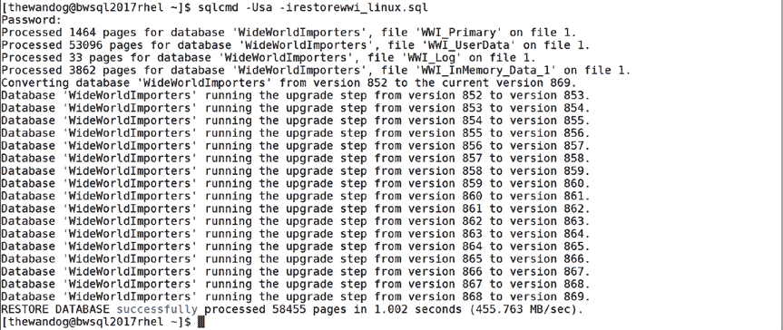
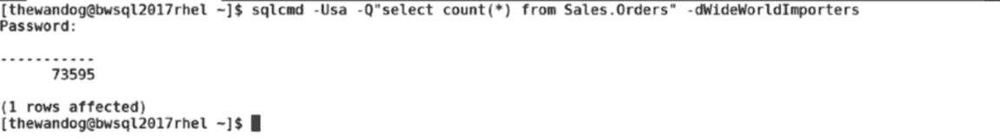
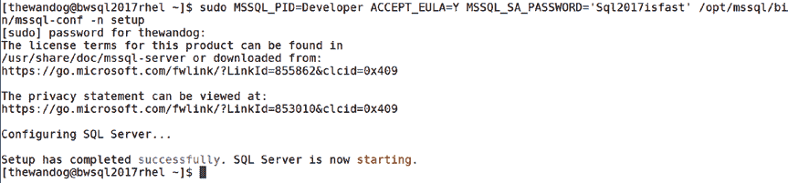

# WideWorldImporters 数据库恢复与安装配置指南

## 文件准备与恢复

`wide-world-importers-v1.0/WideWorldImporters-Full.bak`

2. 如果您没有直接将此文件下载到 Linux 服务器，请使用 `scp` 等程序或 ssh 客户端（如 MobaXterm）的内置功能（提供“拖放”功能）将文件复制到您的 Linux 服务器。然后，您需要将文件复制到 `/var/opt/mssql` 目录，并将所有权更改为 `mssql`，以便 SQL Server 可以访问备份文件。

```
chown mssql:mssql WideWorldImporters-Full.bak
```

3. 通过使用 `sqlcmd` 执行此查询来恢复数据库。我建议您创建一个名为 `restorewwi_linux.sql` 的文件，并将这些 T-SQL 命令放入文件中：

```
restore database WideWorldImporters from disk = '/var/opt/mssql/WideWorldImporters-Full.bak' with
move 'WWI_Primary' to '/var/opt/mssql/data/WideWorldImporters.mdf',
move 'WWI_UserData' to '/var/opt/mssql/data/WideWorldImporters_UserData.ndf',
move 'WWI_Log' to '/var/opt/mssql/data/WideWorldImporters.ldf',
move 'WWI_InMemory_Data_1' to '/var/opt/mssql/data/WideWorldImporters_InMemory_Data_1'
go
```

现在使用 `sqlcmd` 执行 SQL 脚本（关于如何使用 `sqlcmd` 运行脚本的提示）：

```
sqlcmd -Usa -irestorewwi_linux.sql
```





## 安装与配置

由于 WideWorldImporters 备份是使用 SQL Server 2016 创建的，您的输出将如图 2-10 所示。恢复过程会自动将数据库升级到 2017 版本。

**图 2-10. WideWorldImporters 示例备份的恢复结果**

现在使用 `sqlcmd` 连接并直接对数据库运行查询（注意使用 `-Q` 选项从命令行运行查询）：

```
sqlcmd -Usa -Q"select count(*) from Sales.Orders" -dWideWorldImporters
```

图 2-11 显示了恢复后 WideWorldImporters 示例数据库中 `Orders` 表的预期行数结果。

**图 2-11. 获取 WideWorldImporters 中 Orders 表的行数**

现在您已经了解了安装 SQL Server 和验证安装的技术，接下来的章节将介绍其他安装主题。

##### 静默安装

所有软件包管理器（例如 `yum`，`apt-get`，`zypper`）都提供 `-y` 选项，允许基本安装在没有任何用户交互的情况下完成。我前面描述的用于完成安装的 `mssql-conf setup` 选项也提供了一种无需用户交互的方法。

如果您像下面这样执行 `mssql-conf`：

```
sudo /opt/mssql/bin/mssql-conf setup -n
```

`mssql-conf` 脚本将依赖表 2-1 中的环境变量自动响应 SQL Server 版本、接受 EULA 协议和 `sa` 密码。

**表 2-1. 安装环境变量**

| 环境变量 | 描述 | 可能的值 |
| :--- | :--- | :--- |
| `MSSQL_PID` | 设置 SQL Server 评估版或产品密钥 | `Developer`，`Express`，`Web`，`Standard`，`Enterprise`，`<product key>`（如果指定产品密钥，其形式必须为 `#####-#####-#####-#####-#####`，其中‘#’是数字或字母） |
| `ACCEPT_EULA` | 接受 EULA 协议 | `Y` |
| `MSSQL_SA_PASSWORD` | `sa` 密码（用单引号括起来） | 要求至少 8 个字符长，并且包含以下四组字符中的三组：大写字母、小写字母、数字和符号。 |

实际上，您可以在 `mssql-conf setup` 期间使用其他环境变量指定更多选项，如文档 [`docs.microsoft.com/sql/linux/sql-server-linux-configure-environment-variables`](https://docs.microsoft.com/sql/linux/sql-server-linux-configure-environment-variables) 所述。例如，您可以设置 SQL Server 将监听的 TCP 端口（而非 1433）。



**注意** 您也可以在首次启动容器时使用环境变量来配置 Docker 容器中的 SQL Server。有关更多详细信息，请参见第 11 章。


