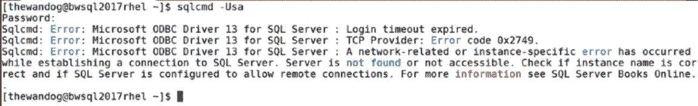
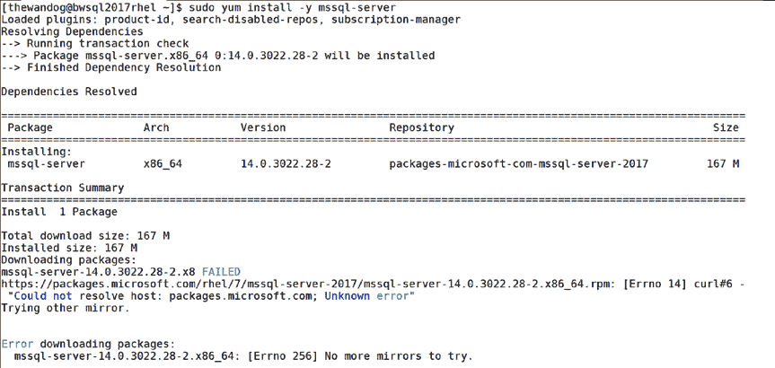
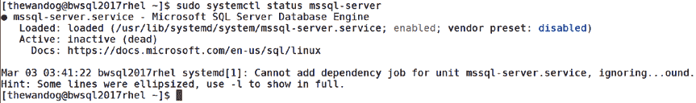

# 第 2 章 安装与配置

您可以从 Shell 设置这些环境变量，也可以像下面这样，在一个 `mssql-conf` 执行命令中包含所有变量：

```
sudo MSSQL_PID=Developer ACCEPT_EULA=Y MSSQL_SA_PASSWORD='<YourStrong!Passw0rd>' /opt/mssql/bin/mssql-conf -n setup
```

图 2-12 展示了 `mssql-conf` 无人值守执行后的输出。

*图 2-12. 使用 `mssql-conf` 进行无人值守设置*

您可以将其他设置任务配置为完整脚本的一部分，该脚本用于安装 SQL Server、安装命令行工具、其他软件包，执行其他配置任务，以及为远程连接打开防火墙。有关一个更健壮的无人值守脚本示例，请参阅 RHEL 的示例：[`docs.microsoft.com/sql/linux/sample-unattended-install-redhat`](https://docs.microsoft.com/sql/linux/sample-unattended-install-redhat)。

我们 Microsoft 的客户咨询团队还创建了一个 GitHub 仓库，基于他们的客户经验展示了一个可能的完整无人值守安装过程，您可以在以下地址找到：[`github.com/denzilrieiro/sqlunattended`](https://github.com/denzilrieiro/sqlunattended)。（感谢 Microsoft 的 Denzil Ribero 创建了这套出色的脚本）。

##### 离线安装

在某些情况下，您的 Linux 服务器可能未连接或经常断开与互联网的连接。因此，您需要一个流程，以便在 Linux 服务器离线时也能安装 `mssql-server` 软件包。

**提示：** 如果您正在演示 SQL Server 的安装体验，我强烈建议您将软件包下载到 Linux 服务器作为备份，以防遇到互联网连接不佳的情况。

各种软件包管理系统都支持这种技术，前提是您能够以可复制到 Linux 服务器的方式下载相应的软件包。

我们 `mssql-server` 的软件包可以在我们的发布说明文档页面找到：[`docs.microsoft.com/sql/linux/sql-server-linux-release-notes`](https://docs.microsoft.com/sql/linux/sql-server-linux-release-notes)。

从所需版本下载软件包，将其复制到 Linux 服务器的主目录中，然后使用您的软件包管理器程序并指定支持本地安装的选项。对于 RHEL，命令如下所示：

```
sudo yum localinstall mssql-server_versionnumber.x86_64.rpm
```

这种方法唯一的问题是，软件包管理器会查找要安装的依赖软件包，但如果未连接到互联网，它就无法下载它们。

对于 RHEL 和 SLES（基于 RPM 的系统），另一种方法是使用 `rpm` 命令，如下所示：

```
rpm -ivh mssql-server_versionnumber.x86_64.rpm
```

此命令不会查找依赖软件包，也不会尝试连接到互联网。如果因依赖软件包不可用而出现错误，您可以使用以下命令查找这些依赖项：

```
rpm -qpR mssql-server_versionnumber.x86_64.rpm
```

**提示：** `rpm` 包包含所有用于检测依赖关系的元数据，因此您不需要连接到互联网来运行此命令。此命令也只需要您具有读取 `.rpm` 文件的权限。

然后，您可以定位依赖软件包，下载、复制并在本地安装它们，以满足 `mssql-server` 软件包的需求。

完成本地安装后，您需要像在线安装一样执行 `sudo /opt/mssql/bin/mssql-conf setup`。

##### 安装其他软件包

我们能够保持 `mssql-server` 安装轻量快速的方法之一，是将其他功能分离到单独的软件包中。因此，表 2-2 中的软件包可以在安装 `mssql-server` 之后安装，以便使用其他功能。

*表 2-2. 可选软件包*

| 包 | 描述 | 备注 |
|---------|-------------|----------|
| `mssql-tools` | 命令行工具，例如 |  |


### 第 2 章：安装与配置

我建议您在任何 SQL Server Linux 安装上安装以下组件，以在 Linux 服务器上提供基本的查询和数据加载功能：
`sqlcmd` 和 `bcp`。

## `mssql-server-fts`
全文搜索功能。
仅当您希望使用 SQL Server 全文搜索功能时才安装此组件。本书不会涵盖全文搜索内容。更多信息，请参阅 Microsoft 文档：[`docs.microsoft.com/sql/relational-databases/search/full-text-search`](https://docs.microsoft.com/sql/relational-databases/search/full-text-search)。

## `mssql-server-is`
集成服务（也称为 SSIS）。
这是一个独立的 Linux 进程，用于 ETL 操作。为更复杂的数据提取和加载功能安装此组件。本书将在第 5 章介绍 SSIS 功能的基础知识。

## `mssql-server-ha`
SQL Server 资源代理。
要使用 Pacemaker 实现高可用性功能，必须安装此组件。

**注意：** 在 SQL Server 2017 CU4 之前，SQL Server 代理是一个名为 `mssql-server-agent` 的独立软件包。我们决定从 SQL Server 2017 CU4 开始，SQL Server 代理将随 `mssql-server` 软件包一起安装，并通过 `mssql-conf` 启用。更多信息，请参阅：[`docs.microsoft.com/sql/linux/sql-server-linux-setup-sql-agent`](https://docs.microsoft.com/sql/linux/sql-server-linux-setup-sql-agent)。我们将在第 9 章介绍使用 SQL Server 代理的基础知识。

如果您需要离线安装上述软件包（`mssql-tools` 除外），发布说明包含了它们的位置：[`docs.microsoft.com/sql/linux/sql-server-linux-release-notes`](https://docs.microsoft.com/sql/linux/sql-server-linux-release-notes)。

离线安装的 `mssql-tools` 软件包可在此处找到：[`docs.microsoft.com/sql/linux/sql-server-linux-setup-tools#offline-installation`](https://docs.microsoft.com/sql/linux/sql-server-linux-setup-tools#offline-installation)。

##### 在 Azure 中安装
Azure 虚拟机是一个云基础设施即服务（IaaS）平台，用于托管虚拟机以运行各种类型的应用程序和工作负载。SQL Server 在此环境中得到了很好的支持，并且是一个非常流行的工作负载。

**注意：** SQL Server on Linux 可以在其他环境中运行，例如 VMWare、VirtualBox 和其他云提供商。更多信息，请参阅此文档页面：[`docs.microsoft.com/sql/linux/quickstart-install-connect-clouds`](https://docs.microsoft.com/sql/linux/quickstart-install-connect-clouds)。

在 Azure 虚拟机中安装 SQL Server on Linux 有两个基本选择：
- 从 Azure 市场选择您喜欢的 Linux 发行版（RHEL、SLES 或 Ubuntu）。然后按照我在本章中提供的说明进行 SQL Server 的安装。
- 从 Azure 市场选择一个预配置的 SQL Server on Linux 选项。作为虚拟机配置过程的一部分，SQL Server 将自动安装和配置。

**注意：** 当您使用预配置的 SQL Server Linux 虚拟机时，首次连接到 Linux 虚拟机后，必须完成安装步骤：使用 `sudo /opt/mssql/bin/mssql-conf set-sa-password` 来设置 `sa` 密码。

您还可以通过两种方法在 Azure 虚拟机中配置这些选项之一：
- 通过用户界面使用 Azure 门户（`http://portal.azure.com`）。


### 第 2 章：安装与配置

使用命令行工具 `Azure CLI` 来创建虚拟机。

详细信息请访问 [`https://docs.microsoft.com/cli/azure/vm?view=azure-cli-latest`](https://docs.microsoft.com/cli/azure/vm?view=azure-cli-latest)。

无论您选择何种方法在 `Azure` 虚拟机中的 `Linux` 系统上安装 `SQL Server`，在设置连接和通过 `ssh` 提供访问权限方面都有一些独特之处。有关使用 `Azure` 门户完成此操作的演练，请参阅此文档：[`https://docs.microsoft.com/azure/virtual-machines/linux/sql/provision-sql-server-linux-virtual-machine`](https://docs.microsoft.com/azure/virtual-machines/linux/sql/provision-sql-server-linux-virtual-machine)。

要获得 `Azure` 虚拟机上 `SQL Server` 的最佳性能，请查阅我们的最佳实践指南：[`https://docs.microsoft.com/azure/virtual-machines/windows/sql/virtual-machines-windows-sql-performance`](https://docs.microsoft.com/azure/virtual-machines/windows/sql/virtual-machines-windows-sql-performance)。其中部分建议针对 `Windows`，但许多也适用于 `Linux` 上的 `SQL Server`。

此外，我们才华横溢的文档负责人 Jason Roth 撰写了这份关于在 `Azure` 虚拟机的 `Linux` 上运行 `SQL Server` 的出色常见问题解答：[`https://docs.microsoft.com/azure/virtual-machines/linux/sql/sql-server-linux-faq`](https://docs.microsoft.com/azure/virtual-machines/linux/sql/sql-server-linux-faq)。请仔细阅读，其中讨论了许可和一些限制。

`Azure` 虚拟机为容量（包括 `CPU`、内存和存储）提供了许多不同的规格和选项。虚拟机规格是您在 `Azure` 中创建虚拟机时需要做出的选择。有关当前可用规格的完整列表，请参阅此文档：[`https://docs.microsoft.com/azure/virtual-machines/linux/sizes`](https://docs.microsoft.com/azure/virtual-machines/linux/sizes)。

使用 `Azure` 虚拟机的益处之一是灵活的订阅模式和“按需付费”模式。有关 `Linux Azure` 虚拟机的定价选项，请参阅此文档：[`https://azure.microsoft.com/pricing/details/virtual-machines/linux`](https://azure.microsoft.com/pricing/details/virtual-machines/linux)。

## 安全注意事项

[`https://docs.microsoft.com/azure/virtual-machines/windows/sql/virtual-machines-windows-sql-security`](https://docs.microsoft.com/azure/virtual-machines/windows/sql/virtual-machines-windows-sql-security)。

## 迁移

[`https://docs.microsoft.com/azure/virtual-machines/windows/sql/virtual-machines-windows-migrate-sql`](https://docs.microsoft.com/azure/virtual-machines/windows/sql/virtual-machines-windows-migrate-sql)。

## 高可用性与灾难恢复

[`https://docs.microsoft.com/azure/virtual-machines/windows/sql/virtual-machines-windows-sql-high-availability-dr`](https://docs.microsoft.com/azure/virtual-machines/windows/sql/virtual-machines-windows-sql-high-availability-dr)。


##### 安装故障排除

为了完成本节内容，我咨询了微软技术支持部门的专家 Pradeep M.M.，了解他所见到的最常见的安装失败问题以及如何解决。我发现了一些有趣的情况。事实证明，由于我们使安装变得轻量级并内置到原生的 Linux 发行版包管理系统中，到目前为止，微软看到客户尝试在 Linux 上安装 SQL Server 时遇到的问题非常少。

话虽如此，以下是几种可能的场景以及您可以如何处理。

## 网络连接不良或无连接

我在使用标准安装技术在 Linux 上安装 SQL Server 时，亲身经历过网络连接不良或无连接的问题，该技术需要互联网连接来下载软件包。

图 2-13 展示了一个在 Linux 服务器没有互联网连接时，尝试在 RHEL 上安装 SQL Server 失败的例子。





*图 2-13. 由于无网络连接导致的 SQL Server 安装失败*

即使您的 Linux 服务器有连接，也可能出现类似问题，但如果连接质量太差导致无法持续下载软件包，也会发生这种情况。

## 未使用 mssql-conf 完成安装

这可能是技术支持部门遇到的最常见问题，我自己在与一些客户交流时也遇到过。我们可能让通过包管理器安装的过程看起来太简单了；以至于许多人没有看到他们必须运行 `mssql-conf` 来完成安装的提示信息。

如果您使用像 `yum` 这样的包管理器来安装 `mssql-server`，但没有使用以下命令完成安装：

```
sudo /opt/mssql/bin/mssql-conf setup
```

然后尝试使用像 `sqlcmd` 这样的工具连接到 SQL Server，您将收到如图 2-14 所示的失败信息。

*图 2-14. 由于 SQL Server 安装未完成导致的连接失败*




诊断此问题的线索之一可以通过以下命令查看 `mssql-server` 服务的状态：

```
sudo systemctl status mssql-server
```

图 2-15 显示该服务已启用但未运行。

*图 2-15. 完成 mssql-conf 设置之前的 mssql-service*

## yum 锁

您可能看到的另一个问题也可能发生在其他包管理器上。基本上，当我们看到尝试同时进行多次 `mssql-server` 安装时，就会发生安装失败。我们称之为“yum 锁”问题。图 2-16 显示了发生这种情况时您将看到的示例。

*图 2-16. 当另一个安装正在进行时，SQL Server 安装失败*

###### 更改 SQL Server 目录的权限或所有权

`/opt/mssql` 和 `/var/opt/mssql` 的 SQL Server 目录具有特定的权限和所有权分配。请勿更改这些设置，否则您可能会在安装、启动 SQL Server、使用产品或正确创建数据库时遇到问题。

## 调试安装

各种包管理系统都有日志文件和方法，可以提供更多关于安装过程的详细信息。

在 RHEL 上，以下命令可以提供有关安装历史的更多信息：

```
sudo yum history list
sudo yum history info
```

`yum` 包管理器还提供了选项来转储安装过程的更多详细信息。以下是一个示例命令，用于转储 `mssql-server` 安装的详细信息。这些选项提供的部分详细信息可能足以让您调试安装问题。

```
sudo yum install mssql-server --errorlevel 10 --debuglevel 10 --rpmverbosity debug --verbose
```


