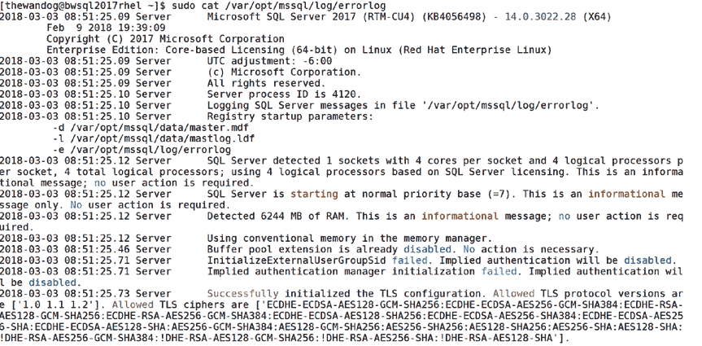
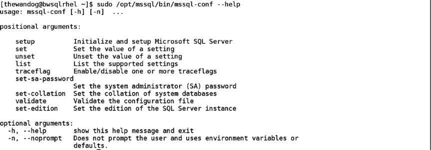

# 第 2 章 安装与配置

#### 探索 Linux 上的 SQL Server

在开发应用程序、使用和管理 SQL Server 的过程中，我认为了解所有组件的安装位置和内容会非常有帮助。此外，SQL Server 在 LOG 目录中提供了多个可用于故障排除和监控的文件，因此我将更详细地介绍该目录及其包含的内容。

##### 已安装内容

根据 Linux 应用程序的常规准则，SQL Server 将其二进制文件安装在 `/opt` 目录中，而其“应用程序”文件（包括数据库文件）则安装在 `/var/opt` 目录中。在 SQL Server 2017 中，您无法更改这些目录的位置（但可以更改数据库、“日志”文件和备份的默认位置）。

### /opt/mssql

`bin` 目录包含主要的 `sqlservr` 二进制文件、`mssql-conf` bash 脚本以及一系列用于支持转储文件诊断的 shell 脚本。

`lib` 目录包含以下类型的文件：

*   `lib*.so` 文件，这些是 `sqlservr` 使用的共享库
*   一个名为 `mssql-conf` 的目录，其中包含被主 `mssql-conf` bash shell 脚本调用的 python 脚本
*   一系列扩展名为 `.sfp` 的文件。这些文件是 Linux 上 SQL Server 架构魔力的一部分。它们采用二进制格式，包含由 SQLPAL 加载以运行 `SQLSERVR.EXE`、各种 DLL、`libOS` 和其他二进制文件的二进制文件。sfp 文件还包含系统数据库，例如 `master`、`model` 和 `msdb`。我们将在第 3 章讨论系统数据库。

### /var/opt/mssql

默认情况下，此目录应包含以下文件和目录：

*   `data` 目录包含系统数据库文件、用户数据库文件和事务日志文件（除非您在创建数据库时指定了目录，或者使用 `mssql-conf` 更改了默认目录）。
*   `log` 目录包含“日志文件”，其中包括 `ERRORLOG` 文件和其他用于诊断或故障排除目的的文件。
*   `mssql.conf` 文件是一个文本文件，用于存储使用 `mssql-conf` 脚本时的最新选项。`mssql-conf` 脚本将选项写入此文件。当 SQL Server 启动时，它会读取此文件以更改配置选项，这就是为什么通常必须重启 SQL Server 才能使通过 `mssql-conf` 所做的更改生效的原因。

##### 其他文件

SQL Server 安装的其他文件包括：

*   我们的最终用户许可协议文件（所有语言版本）存储在 `/usr/share/doc/mssql-server` 中。
*   `sqlservr` 和 `mssql-conf` 的帮助手册页存储在 `/usr/share/man/man1` 目录中。



##### 使用日志文件

安装完成后，LOG 目录（默认为 `/var/opt/mssql/log`）中将立即包含以下类型的文件：

*   `errorlog*`：这是一个自 SQL Server 成为产品以来就一直存在的文本文件。它被称为“错误日志”文件，但已扩展到不仅仅包含错误。当 SQL Server 启动时，有关 SQL Server 配置和启动进度的丰富信息会存储在此文件中。此后，该文件主要包含错误和警告，但也可能包含其他类型的重要信息。当您遇到 SQL Server 问题时，这是需要收集和分析的基本文件之一。默认情况下，当 SQL Server 启动时，它会将先前的 ERRORLOG 文件复制为 `ERRORLOG.<n>`，并创建一个名为 `ERRORLOG` 的新文件。SQL Server 在轮换之前会保留六个先前的 ERRORLOG 版本。我将在本书中不时讨论 `ERRORLOG` 文件，但首先让您了解这是 SQL Server 的一个关键文件至关重要。图 2-17 显示了 SQL ERRORLOG 文件的典型开头部分。

**图 2-17. SQL Server 错误日志文件**

*   `log*.trc`：SQL Server 跟踪是一个传统的跟踪系统，默认情况下


系统会收集一个跟踪文件，其中包含某些事件，例如对象创建或删除的时间。我不建议您依赖这些文件，因为此功能可能在未来版本的 SQL Server 中被完全移除。事实上，许多用户会关闭生成这些文件的功能。您可以在 [`docs.microsoft.com/sql/database-engine/configure-windows/default-trace-enabled-server-configuration-option`](https://docs.microsoft.com/sql/database-engine/configure-windows/default-trace-enabled-server-configuration-option) 阅读更多相关信息。

-   `system_health*.xel`：这些文件称为系统运行状况事件会话文件，包含有关 SQL Server 运行状况的重要信息。可以将其视为 SQL Server 状态的"黑匣子记录器"。这些文件由一个称为**扩展事件**的功能生成，这将在第 5 章中更详细地讨论。您可以在 [`docs.microsoft.com/sql/relational-databases/extended-events/use-the-system-health-session`](https://docs.microsoft.com/sql/relational-databases/extended-events/use-the-system-health-session) 阅读更多关于系统运行状况事件会话的信息。

#### 安装后配置

安装 SQL Server 后，对于 SQL Server 实例有几种配置选择。其中许多选择与优化并提供最佳数据库性能有关。我将在第 6 章更详细地介绍这些主题。在该章中您还会看到，一些配置选择是在数据库甚至查询级别进行的。本部分旨在让您熟悉影响整个 SQL Server 实例（跨所有数据库）的配置选项和方法。其中一些方法需要外部工具，而另一些则通过 `T-SQL` 语言内置于 SQL Server 引擎中。如果您是为生产环境的企业级工作负载安装 SQL Server，那么请审阅第 6 章，以了解我们关于最大化性能的建议。

## 使用 mssql-conf

对于 Windows 用户，SQL Server 提供了一个称为 SQL Server 配置管理器的图形化应用程序。其目的是提供一种方法来做出那些无法通过 `T-SQL` 语言实现或通过其实现没有意义的配置选择。



第 2 章 安装与配置

对于 Linux 上的 SQL Server，我们通过 `mssql-conf` bash shell 脚本提供了相当的功能。您已经看到使用此脚本来完成安装过程。该脚本支持其他选项，用于在初始安装后配置 SQL Server。如果您查看 `mssql-conf` 的帮助信息，可以看到它支持的所有配置选择参数。

```
sudo /opt/mssql/bin/mssql-conf --help
```

图 2-18 显示了这些选项。

图 2-18：mssql-conf 选项

用于进行配置更改的主要参数是 `set`、`unset` 和 `traceflag`。

`set`：允许您设置配置设置的值。可以通过使用 `list` 参数找到可能的设置及其值列表，或在我们的文档中查找 [`docs.microsoft.com/sql/linux/sql-server-linux-configure-mssql-conf`](https://docs.microsoft.com/sql/linux/sql-server-linux-configure-mssql-conf)。


