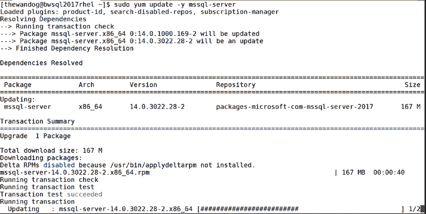
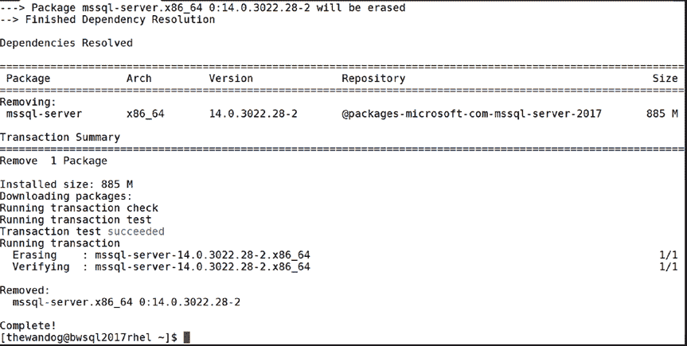
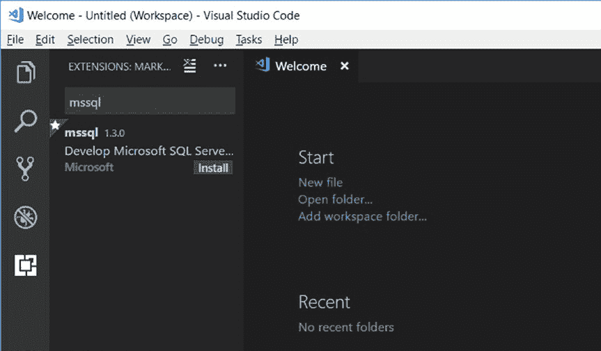

# 第 2 章 安装与配置

###### Windows Server 故障转移群集

Windows 上的 SQL Server 依赖 Windows Server 故障转移群集 (`WSFC`) 来实现 Always On 故障转移群集实例和 Always On 可用性组，以提供高可用性。

`WSFC` 自然不存在于 Linux 上，因此 SQL Server 使用其他软件，`Pacemaker`，来协同工作以提供高可用性方案。我将在第 8 章中进一步讨论这一点。如果你希望立即了解其工作原理的细节，请从此文档页面开始： [`docs.microsoft.com/sql/linux/sql-server-linux-shared-disk-cluster-concepts`](https://docs.microsoft.com/sql/linux/sql-server-linux-shared-disk-cluster-concepts)

[`docs.microsoft.com/sql/linux/sql-server-linux-shared-disk-cluster-concepts.`](https://docs.microsoft.com/sql/linux/sql-server-linux-shared-disk-cluster-concepts)

#### 更新与卸载

Linux 上的 SQL Server 提供了简单的方法来更新到后续版本的 SQL Server，这些更新基于 `CUs` 或新的 `GDR` 版本。此外，也存在一种简单的方法来卸载和移除 SQL Server。

##### 更新 SQL Server

基于本章前面描述的为 SQL Server 配置的软件仓库，使用你发行版中包管理器的内置更新功能，即可拉取该仓库中的最新版本并将其应用到 SQL Server 二进制文件。所有数据库文件不受影响。

如果你运行以下命令：

```
sudo yum update mssql-server
```



将根据你配置的软件仓库下载并安装最新的更新构建。如果你已经安装了最新的更新，你将收到一条消息：“没有标记为更新的软件包。”

我建议你保持与 `CU` 仓库中 Microsoft 构建版本的同步。这些更新的频率通常为每月一次（尽管随着主要版本的发布，更新频率会降低）。Microsoft 正在通过 `CU` 中的修复和更新持续改进 Linux 上的 SQL Server。

让我们看几个关于如何使用更新以及你可以预期什么行为的场景。

如果你在产品发布时安装了 SQL Server 2017 的原始 `GA` 版本，然后在 SQL Server 2017 `CU4` 可用时使用了更新过程，图 2-19 显示了你可以预期的结果。

**图 2-19. 更新 SQL Server**

更新完成后，系统将提示你使用以下命令重启 SQL Server 以完成更新：

```
sudo systemctl restart mssql-server
```

如果你想将 SQL Server 更新到特定版本怎么办？虽然 Microsoft 建议你应用最新的更新，但如果该版本晚于你当前运行的版本，则可以更新到特定版本。此技术也是你进行离线更新的一种方法，因为使用包管理器更新选项将需要互联网连接。

所以，如果你正在运行 SQL Server 2017 `GA` 版本，并且希望在 `CU4` 是最新更新时更新到 SQL Server 2017 `CU3`，你将遵循此过程：

- 下载 SQL Server 2017 `CU3` 软件包（有关软件包的位置，请参阅此文档页面：[`docs.microsoft.com/sql/linux/sql-server-linux-release-notes`](https://docs.microsoft.com/sql/linux/sql-server-linux-release-notes)

[`docs.microsoft.com/sql/linux/sql-server-linux-release-notes.`](https://docs.microsoft.com/sql/linux/sql-server-linux-release-notes)

- 将此软件包复制到你的 Linux 服务器。

- 使用离线安装方法安装 SQL Server 2017 `CU3` 软件包。

你不能使用此方法将 SQL Server 更新到比你当前运行的版本更低的版本。请参阅下一节了解如何更新到更低版本的 SQL Server。

### 回滚到先前的更新

虽然我们相信使用 SQL Server 的最新更新不会遇到问题，


可能会遇到需要回滚到 SQL Server 先前某个更新版本的情况。回滚到先前更新的过程如下：

1.  在 SQL Server on Linux 发行说明页面 [`docs.microsoft.com/sql/linux/sql-server-linux-release-notes`](https://docs.microsoft.com/sql/linux/sql-server-linux-release-notes) 中找到你要回滚到的版本的软件包。
2.  将该软件包复制到你的 Linux 服务器。
3.  使用以下命令进行回滚：

   ```
   sudo yum downgrade mssql-server-<version_number>.x86_64
   ```

此降级命令流程的问题在于，它需要互联网连接，因为它会下载你指定的软件包。



### 第 2 章：安装与配置

因此，如果你需要离线回滚到先前的版本，你需要：

-   使用类似 `sudo yum remove` 的命令卸载当前版本（不要删除 `/var/opt/mssql` 目录以保留所有数据库）。
-   复制你要安装的版本的软件包。
-   对该新软件包执行离线安装。

### 卸载 SQL Server

虽然我们绝不希望你感到需要卸载 SQL Server，但在进行大量演示、执行特殊测试或需要离线回滚到先前版本时，你很可能会发现自己需要移除 SQL Server。

在 RHEL 上移除 SQL Server 的基本语法是：

```
sudo yum remove -y mssql-server
```

图 2-20 展示了卸载 SQL Server 时的预期行为。

图 2-20. 移除 SQL Server

此时你有两个选择：

1.  你可以通过删除 `/var/opt/mssql` 目录来完全移除 SQL Server，这将删除所有系统数据库以及存储在该目录中的任何用户数据库。运行以下命令来执行此操作：

   ```
   sudo rm -rf /var/opt/mssql
   ```

2.  保留 `/var/opt/mssql` 目录完整。任何未来的安装将仅安装 SQL Server 二进制文件，无需运行 `mssql-conf`，并且会保留所有系统数据库完好无损。

第二个选项在你因某些意外问题而需要干净地重新安装 SQL Server 二进制文件但同时保留所有数据时可能很有用。

#### 小结

至此，你应该已经安装好了 SQL Server，了解了在哪里可以找到所有已安装的文件，理解了配置 SQL Server 的方法和选项，并且知道了如何将 SQL Server 更新到最新版本。

让我们开始构建一个使用 Linux 上 SQL Server 的数据库和应用程序吧！

### 第 3 章：构建数据库与 T-SQL 基础

既然你已经安装了 SQL Server，接下来在 Linux 上 SQL Server 之旅的步骤就是创建一个数据库。然后你需要创建表、插入一些数据，并学习 T-SQL 语言的基础知识。尽管本章涵盖了基本的 T-SQL 功能，但我是从开发者的角度来编写的。对于那些精通 SQL Server 和 T-SQL 的专家来说，本章可能像是一次复习。但对于 SQL Server 的新手来说，本章至关重要，这样你可以为 T-SQL 语言和 SQL Server 基本功能的知识打下基础。

为了在本章中演示 SQL Server 功能，我选择了 Visual Studio Code 作为执行查询的开发工具。掌握了这些知识后，你将能够进入下一章构建应用程序，并学习更高级的 T-SQL 功能以及 SQL Server 2017 的新特性。

本章的 T-SQL 示例可以在随书提供的示例脚本中找到，旨在当你跟随本章内容时按顺序运行。我将在下一章使用本章提供的示例脚本向你展示如何构建应用程序并学习更高级的 T-SQL 语言功能。

### 设置你的环境

在第 2 章，我向你介绍了创建的 WideWorldImporters 示例数据库


第 3 章 构建数据库与 T-SQL 基础

微软提供了该示例数据库以帮助你探索 SQL Server 的功能。该数据库以可还原的备份形式提供（我在第 2 章中曾以此作为帮助验证 SQL Server 安装的方法）。它也可作为项目提供，因此你可以执行所有命令从头开始构建数据库。你可以在[`docs.microsoft.com/sql/sample/world-wide-importers/wide-world-importers-documentation`](https://docs.microsoft.com/sql/sample/world-wide-importers/wide-world-importers-documentation)找到该示例数据库的文档。该示例数据库的源代码可在以下 GitHub 仓库中找到：[`github.com/Microsoft/sql-server-samples/tree/master/samples/databases/wide-world-importers`](https://github.com/Microsoft/sql-server-samples/tree/master/samples/databases/wide-world-importers)。

© Bob Ward 2018
B. Ward, *Pro SQL Server on Linux*, `doi.org/10.1007/978-1-4842-4128-8_3`

在接下来的两章中，我将不使用备份还原，而是使用 WideWorldImporters 数据库和对象的一个子集来从头创建数据库和表。我已经提供了使用此 WideWorldImporters 数据库子集所需的所有示例脚本。以此示例为基础，我可以向你展示 T-SQL 语言的基础知识，并在本书后面部分扩展你对其他 SQL Server 功能和 T-SQL 语言的理解。

对于本章的所有示例，我选择使用 Visual Studio Code 开发工具，因为它可在 Windows、macOS 和 Linux 上运行。准备本章的第一步是从[`code.visualstudio.com`](https://code.visualstudio.com)安装 Visual Studio Code。本章的示例将使用 Windows 版本的 Visual Studio Code。然而，由于 Visual Studio Code 也可在 macOS 和 Linux 上运行，所有示例都将在你偏好的开发平台上运行。

在 Windows 上安装 Visual Studio Code 后，我安装了 Visual Studio Code 的`mssql`扩展。此扩展提供了丰富的功能，可在 Visual Studio Code 中开发和执行 T-SQL 脚本时提供帮助。

**提示** 在完成本章后，按照[`docs.microsoft.com/sql/linux/sql-server-linux-develop-use-vscode`](https://docs.microsoft.com/sql/linux/sql-server-linux-develop-use-vscode)的文档学习使用 Visual Studio Code 的 mssql 扩展教程可能会对你有所帮助。

图 3-1 展示了在 Visual Studio Code 中搜索 mssql 扩展以进行安装。注意左侧栏中高亮显示的图标（从上往下数第五个图标），该图标用于查找和安装扩展。



`图 3-1. 在 Visual Studio Code 中安装 mssql 扩展`

首次安装 Visual Studio Code 时，你可以选择打开一个包含你已创建脚本的现有文件夹。因此，请在你的机器上创建一个新文件夹。在我的 Windows 笔记本电脑上，我将其命名为`c:\wwi`。然后将第 3 章的所有示例脚本复制到此文件夹中。现在在 Visual Studio Code 中，点击“打开文件夹”。如果你一直在使用 Visual Studio Code，可能已经有一个工作区或其他打开的文件夹。你可以将这个新创建的本地文件夹打开到你的工作区中，或者直接使用文件菜单打开该文件夹，以替换资源管理器区域中可能已打开的现有文件夹。你现在应该准备好创建数据库、创建表并测试一些基础的 T-SQL 查询了。


#### 创建数据库

SQL Server 可以在单个 SQL Server 安装（称为一个`实例`）中托管多个数据库。Windows 上的 SQL Server 允许每台计算机运行多个实例。对于 Linux 上的 SQL Server，单个 Linux 服务器只允许一个实例（如果你想在 Linux 上安装多个 SQL Server 实例，需要使用 Docker 容器。这将在第 11 章讨论）。

## 第三章：构建数据库与 T-SQL 基础

在本章中，我将只创建一个数据库，但随着本书的深入，可能会创建更多数据库以展示其他功能。你可以选择将所有数据库保留在同一个 Linux SQL Server 实例上，或者将它们放在不同的实例上。

##### 系统数据库

在向你展示如何创建数据库之前，我认为让你了解随 SQL Server 安装附带的`系统数据库`的详细信息很重要。以下列表展示了一个全新安装后开箱即用的数据库：

- `master`：顾名思义，这个系统数据库是所有数据库的“根”，必须存在 SQL Server 才能启动。Master 包含适用于所有数据库的、跨 SQL Server 实例的各类数据。存储在`master`中的最重要数据集之一是关于该实例创建的所有其他数据库的信息，包括其他系统数据库和你创建的用户数据库。

任何时候，要查看 SQL Server 实例上所有数据库的列表，请运行此 T-SQL 查询。你可以在示例脚本`databases.sql`中找到此查询：

```sql
SELECT * FROM sys.databases
GO
```

**注意**：这里的 `GO` 关键字不是 T-SQL 语句。它是一个被工具识别的特殊关键字，用于分隔`批处理`。批处理是从客户端一起发送到服务器的一系列 T-SQL 语句，但服务器会逐个执行每个语句。许多用户在一个批处理中只执行一条 T-SQL 语句。

你可以从任何数据库上下文运行此语句，因为它使用了 `sys` 架构和一个名为 `databases` 的视图。随着你学习接下来的两章，我会解释数据库上下文、架构和视图。关于系统提供的视图（也称为目录视图）和表，我将在第 5 章中详细讨论。

- `model`：`model` 系统数据库是一个`模板`。当创建用户数据库时，`model` 数据库的内容被用来构建新的用户数据库。在许多情况下，用户让此数据库保持为空（如安装时那样），这样你的新用户数据库就只包含系统表和对象。一个例子是，如果你希望在任何新创建的用户数据库中建立一套标准的用户对象；你可以将它们放入 `model` 数据库中。

- `tempdb`：这个系统数据库是 SQL Server 实例所有用户的`共享`数据库。它是共享的，因为无论使用什么数据库上下文，使用特殊语法创建的临时对象都存储在这里。此外，根据查询执行的各种条件，其他内部对象也会被放置在 `tempdb` 中。在下一章中，我将讨论创建临时对象（并会提及可能出现在 `tempdb` 数据库中的内部对象类型）。此外，`tempdb` 数据库的主题将在后面的章节中讨论，因为它可能是影响性能和管理 SQL Server 实例的一个重要因素。理论上，你可以在这个系统数据库中创建用户对象，但不推荐这样做。这是因为 `tempdb` 在每次 SQL Server 启动时都会被重新创建（使用 `model` 数据库作为模板）。

- `msdb`：这个系统数据库由 SQL Server Agent 用于计划警报和作业，也由其他功能（如 SQL Server Management Studio、Service Broker 和 Database Mail）使用。可以将其视为 SQL Server 功能使用的应用程序数据库。我不建议你在此系统数据库中放入任何用户表。


### 第 3 章：构建数据库与 T-SQL 基础

**资源数据库**：这并非数据库的实际名称，但它被称为 `Resource` 数据库。这是一个 `隐藏` 的系统数据库，且为只读。SQL Server 将系统对象（非数据）存储在此数据库中，例如系统存储过程、视图等。当你查询 `sys.databases` 时，SQL Server 会理解如何从 `Resource` 数据库获取 `sys` 架构的数据库视图定义。


有关系统数据库的更详细介绍，请查阅我们的文档：[`docs.microsoft.com/sql/relational-databases/databases/system-databases`](https://docs.microsoft.com/sql/relational-databases/databases/system-databases)。

## 创建登录名与用户

SQL Server 提供了 `sa` 登录名作为拥有完全控制权的“root”账户。就像 Linux 中的 root 账户一样，通常不建议在所有与 SQL Server 的交互中都使用 `sa` 登录名。

因此，我将创建一个名为 `sqllinux` 的新登录名，并在本章剩余部分使用它来创建数据库及所有对象。但我必须先以 `sa` 登录名连接到 SQL Server，才能创建 `sqllinux` 登录名。要在 Visual Studio Code 中完成此操作，我需要为 `sa` 登录名创建一个 `连接配置文件`。

如果我按下 F1 键（或在 Visual Studio Code 菜单中选择 View/Command Palette），我会看到 mssql 扩展提供的各种任务选项。如果我选择名为 `MS SQL: Connect` 的选项，系统会提示我添加一个连接配置文件。在我的场景中，我选择了我的 Linux 上的 SQL Server 名称（也可以是 `<IP 地址>,1433`），使用系统管理员登录名 `sa`，输入了 `sa` 的密码，但将数据库名称留空，这样当我连接时，会进入 `master` 数据库的上下文。

我保存了配置文件的名称，以便下次重复使用。如果你按照这些步骤操作，Visual Studio Code 也会连接到指定的 SQL Server。你可以在工具的右下角看到连接信息。图 3-2 展示了我的 SQL Server 上的示例。`MSSQL` 表示编辑器处于 `MSSQL` 模式，这意味着编辑器将协助我完成各种 T-SQL 命令和任务。

**图 3-2.** 处于 MSSQL 模式并已连接到 Linux 上的 SQL Server 的 Visual Studio Code 编辑器

使用 `sa` 登录名，通过示例脚本 `createlogin.sql` 中的以下 T-SQL 语句来创建一个登录名。我还将 `sqllinux` 登录名添加到了 `dbcreator` 角色中，以便该登录名拥有创建数据库的权限。请随意将密码更改为你的选择。

**提示**：与其他 SQL Server 工具不同，Visual Studio Code 要求你创建一个文件来运行 T-SQL 语句。

```sql
USE master
GO
IF EXISTS (select * from sys.server_principals where name = 'sqllinux')
    DROP LOGIN [sqllinux]
GO
CREATE LOGIN [sqllinux] WITH PASSWORD=N'Sql2017isfast', DEFAULT_DATABASE=[master]
GO
EXEC sys.sp_addsrvrolemember 'sqllinux', 'dbcreator'
GO
```

当我使用 `sqllinux` 登录名创建数据库时，它将自动映射为该数据库中一个称为 `dbo`（数据库所有者）的用户。

要执行本章剩余的示例，我需要在 Visual Studio Code 中使用刚刚创建的 `sqllinux` 登录名创建一个新的连接配置文件。现在，当我执行任何示例脚本时，我都使用 `sqllinux` 登录名的连接配置文件。

**提示**：我应该在此停下来，给你一个关于连接到你的 Linux 上的 SQL Server 的提示。我的 Linux 上的 SQL Server 运行在 `rhel` 虚拟机中，该虚拟机位于我使用 Windows 10 的 `hyper-V` 的笔记本电脑上。使用 `hyper-V`，我配置了一个内部网络适配器，以便在 `rhel` 中为该适配器绑定一个静态 `ip` 地址。然后在 Windows 10 上，我编辑了 `/windows/system32/drivers/etc/hosts` 文件，输入了静态 `ip` 地址和名称 `bwsql2017rhel`。现在，在 `VM` 之外...


