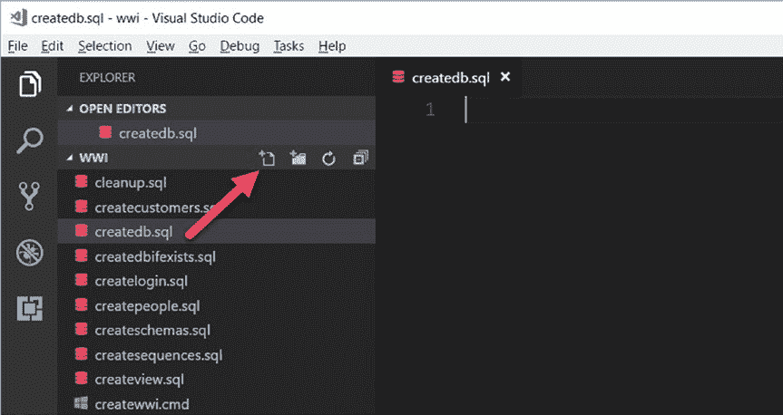
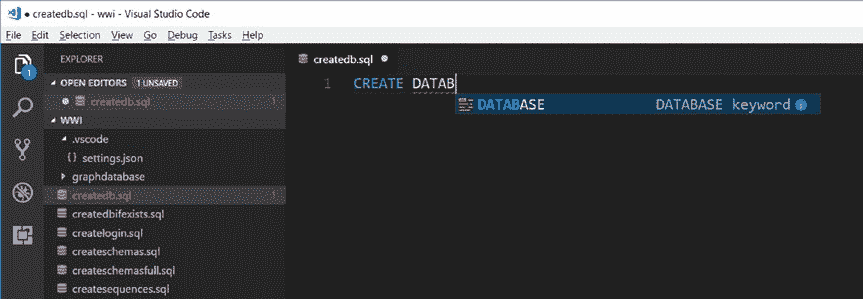

# 第三章 构建数据库与 T-SQL 基础

##### 创建用户数据库

创建自己的数据库可以像运行示例脚本 `ilovethedallascowboys.sql` 中的 T-SQL 语句一样简单：

```sql
USE master
GO
CREATE DATABASE ilovethedallascowboys
GO
```

（是的，我是一个超级体育迷，而且来自德克萨斯州的达拉斯/沃斯堡地区，所以我是一个达拉斯牛仔队的忠实粉丝。希望其他 NFL 球迷们会继续阅读本书的剩余部分<g>）。

`CREATE DATABASE` 的 T-SQL 语法参考有非常多的选项，足以让人眼花缭乱。创建数据库时最重要的选择是文件位置、文件数量和大小。

正如我在前一节所述，`model` 数据库是一个模板，因此当你运行不带任何选项的 `CREATE DATABASE` 时，SQL Server 将使用 `model` 的定义和大小来创建数据库。此规则的唯一例外是数据库和事务日志文件的默认位置，正如我在第二章讨论的，可以通过 `mssql-conf` 脚本设置。对于 Linux 上的 SQL Server，这些文件的默认位置将存储在 `/var/opt/mssql/data` 目录中。

如果你想更改数据库的定义，SQL Server 还提供了一个 `ALTER DATABASE` T-SQL 命令（这通常在创建数据库后用于设置各种*数据库选项*，本书的其他部分将会用到）。

让我们看看如何使用 Visual Studio Code 中的 `mssql` 扩展为 WideWorldImporters 示例创建数据库。你可能已经在之前的章节中恢复了 WideWorldImporters 完整备份。如果已经这样做过，请使用 `sa` 登录名执行 `cleanup.sql` 示例脚本。

**注意：** 第五章涵盖了 SQL Server 的工具，其中包括创建数据库和管理 SQL Server 的其他选项。我在本章中使用 Visual Studio Code 是为了向作为开发者的你展示如何使用此工具来创建数据库、对象和查询，并最终在下一章创建一个应用。



我可以直接点击高亮的图标来创建一个新文件，并将其命名为 `createdb.sql`。图 3-3 显示了我为 `createdb.sql` 打开的编辑器，现在准备使用 `mssql` 扩展连接到 Linux 上的 SQL Server。（示例文件中不包含 `createdb.sql`，因为你将需要自己输入这些语句）。

***图 3-3.** 在 Visual Studio code 中使用 mssql 扩展创建新的 T-SQL 脚本*

现在，我可以将 Visual Studio Code 工具用作 T-SQL 编辑器来针对 SQL Server 执行语句。在下一章，当我创建应用时，我将把编辑器切换到不同的语言。

由于我在 Visual Studio Code 中使用了 `mssql` 扩展，我获得了一项名为 Intellisense（智能感知）的功能。Visual Studio Code 中的编辑器将帮助我指导 T-SQL 语句和对象的语法。图 3-4 显示了智能感知帮助完成 `CREATE DATABASE` 语法的示例。



***图 3-4.** mssql 扩展的智能感知功能*

在编辑器中输入以下 T-SQL 语句完成操作：

```sql
CREATE DATABASE [WideWorldImporters]
GO
```

**注意：** 在此 T-SQL 语句中，`WideWorldImporters` 被称为一个*标识符*。标识符是名称，而非 T-SQL 语句。T-SQL 允许常规标识符和分隔标识符。在标识符周围加上 `[]` 被称为分隔标识符。你会发现关于使用常规标识符还是分隔标识符存在许多不同的观点。

在我的笔记本电脑上，我可以使用 `bwsql2017rhel` 作为服务器名称，而无需输入 IP 地址和端口 1433 来连接到我 Linux 上的 SQL Server。你可能正在使用 DNS 或其他方法将逻辑名称暴露给你的 Linux 服务器。这种技术允许我在笔记本电脑上连接到我的 Linux 服务器，无论我的 Wi-Fi 或以太网适配器的状态如何。


