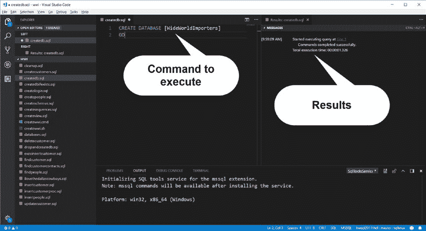

# 第三章 构建数据库与 T-SQL 基础

在 SQL Server 社区中，分隔标识符被广泛使用。许多使用 WideWorldImporters 示例数据库的示例都采用了分隔标识符，因此我将在我的示例脚本中使用它们。

要执行此 T-SQL 批处理，我可以按 F1 并选择 `MS SQL: Execute Query` 来使用 mssql 扩展，或使用快捷键 `<Ctrl>+<Shift>+E`。除非另有说明，在执行本章的示例脚本时，请务必选择 sqllinux 的连接配置文件。

当我执行任何查询时，Visual Studio Code 会在编辑器中打开另一个垂直窗格来显示结果。如果发生任何错误，它们也会在此窗格中显示。消息 "**Commands completed successfully**" 表示数据库已成功创建。

图 3-5 展示了创建数据库后的示例。



`图 3-5. 使用 Visual Studio Code 成功创建数据库的结果`

创建此数据库的一个更好方法是使用一组 T-SQL 语句，如下所示（取自示例脚本 `createdbifexists.sql`）：

```
USE master
GO
IF NOT EXISTS (
    SELECT name
    FROM sys.databases
    WHERE name = N'WideWorldImporters'
)
CREATE DATABASE [WideWorldImporters]
GO
```

`提示` T-SQL 语言的保留字没有必须使用大写的要求。然而，这样做是良好实践，因为它允许你和其他脚本阅读者快速识别哪些是 T-SQL 关键字，哪些是标识符。

此批处理仅在数据库尚不存在时才创建它，从而避免了如果数据库已存在时会发生的错误。

另请注意，在前面的代码中，有另一个包含 `USE master` 语句的批处理。我之前提到了数据库上下文的概念，即你当前正在针对哪个数据库运行 T-SQL 语句。`USE` T-SQL 关键字是切换数据库上下文的一种方法。当你创建一个 SQL Server 登录名时，可以为该登录名定义默认的数据库上下文，然后使用 `USE` 关键字切换到另一个上下文（前提是该登录名在该数据库中具有权限）。在此示例中，切换到 master 上下文实际上并非必需，但在创建或删除数据库时处于 master 上下文中是良好实践。

如果你计划“重新开始”，创建数据库的另一个选项是先删除数据库然后重新创建它。执行以下 T-SQL 语句（参见示例脚本 `dropandcreatedb.sql`）：

```
DROP DATABASE IF EXISTS [WideWorldImporters]
GO
CREATE DATABASE [WideWorldImporters]
GO
```

在 Linux 上的 SQL Server 中创建数据库时，你会得到什么？如前所述，SQL Server 使用 model 数据库作为模板来创建任何新数据库。由于未指定任何选项、文件位置或大小，上述命令将在 Linux 上的 SQL Server 中创建 WideWorldImporters 数据库，包含位于 `/var/opt/mssql/data` 目录中的两个文件，每个文件大小为 8MB：

`WideWorldImporters.mdf`：这是数据库文件。常见的惯例（尽管不是必需的）是将主数据库文件的文件扩展名命名为 `.mdf`。此文件包含用于存储数据库元数据的所有系统表。该文件是 8KB 页面的集合，将用于存储关于系统表的数据、用户表和索引的数据页面，以及一系列供 SQL Server 内部用于跟踪文件和分配元数据的页面。你将在本书后面的章节中了解如何为数据库创建多个数据库文件。

`WideWorldImporters_log.ldf`：这称为事务日志文件（通常使用 `.ldf` 文件扩展名）。事务日志用于记录对用户和系统数据的更改。在其他数据库系统中，这被称为 `journal`（日志）。事务日志存储在一系列日志块中，用于确保数据库的一致性和恢复。


> **提示** Linux 的文件名区分大小写。如果你没有明确指定文件名，`SQL Server` 会严格按照你指定的大小写来创建文件名。在 Linux 系统中，浏览和查找这些文件名时，大小写是敏感的。

你还会喜欢 `SQL Server` 数据库的另一个特点是它们是**包含的**和**可移植的**。你能够备份一个数据库，并将其恢复到另一个相同或更高主版本的 `SQL Server` 实例上。而且，你可以在 Linux 和 Windows 计算机之间进行这种操作，因为 `SQL Server` 在这两个平台上的核心数据库引擎是相同的。关于移动数据库的更多方面，我将在第 9 章中介绍。

如果你想首先花时间了解创建数据库时的所有选项，请参阅 `CREATE DATABASE` 命令的 `T-SQL` 参考文档：
[`docs.microsoft.com/sql/t-sql/statements/create-database-sql-server-transact-sql`](https://docs.microsoft.com/sql/t-sql/statements/create-database-sql-server-transact-sql)。

你可以从这个文档页面阅读关于 `ALTER DATABASE` 命令的更多详细信息，以及如何更改数据库选项或元数据：
[`docs.microsoft.com/sql/t-sql/statements/alter-database-transact-sql`](https://docs.microsoft.com/sql/t-sql/statements/alter-database-transact-sql)。

#### 创建表

创建一个数据库提供了容纳你数据的“外壳”。在这个外壳内部，有表来存储用户数据，以及索引来帮助加速数据访问或强制执行完整性检查。表和索引都需要以“页”为单位在数据库中存储，每页大小为 8KB。这些 8KB 的页由行和用于物理描述这些行的内部结构组成（每页还有一个页头）。

## 第三章 构建数据库与 T-SQL 基础

表中页内行的逻辑格式是由表的定义（包括列和数据类型）决定的。这也被称为表的 *schema*（架构）。这个术语可能会有些令人困惑，因为在 `SQL Server` 中还有一种叫做 schema 的对象。Schema 对象是一个命名空间，用于在数据库中唯一地定义一个对象集合，这些对象可以是表以及其他对象，如索引和存储过程。Schema 提供了一种便捷的方法来解耦对象所有权，允许在 schema 上设置权限，该权限适用于 schema 中的所有对象。

多年来，在 `SQL Server` 中创建表的选项已经发展得非常丰富。在本章中，我将从简单开始。我将在本章中使用 `WideWorldImporters` 数据库示例中的两个表。我将向你展示如何创建 schemas（架构）、称为“序列”的对象，以及包含称为“约束”对象的表。在本章后面，我将展示如何创建其他对象，如存储过程和视图。然后在下一章，我将利用这些示例定义，向你展示如何使用更高级的 `T-SQL` 功能。

## 创建 Schemas（架构）

在 `WideWorldImporters` 数据库中，有多个 schema，每个 schema 中又有多个表。可以用作展示 `SQL Server` 基本功能的两个表是 `[Application].[People]` 表和 `[Sales].[Customers]` 表。`Application` schema 用于存储*参考*数据。这种数据通常很少修改，但会被其他更频繁修改的表引用。这符合规范化表设计的原则。在这个例子中，`People` 表用于存储关于人员的信息，而其他表会以多种方式引用这些人员。`Customers` 表的列中包含有关 `WideWorldImporters` 公司客户的信息，它属于 `Sales` schema。

此外，在下一节中，我将向你展示如何构建一个称为“序列”的对象，因此我也将为这些对象创建一个 schema。


