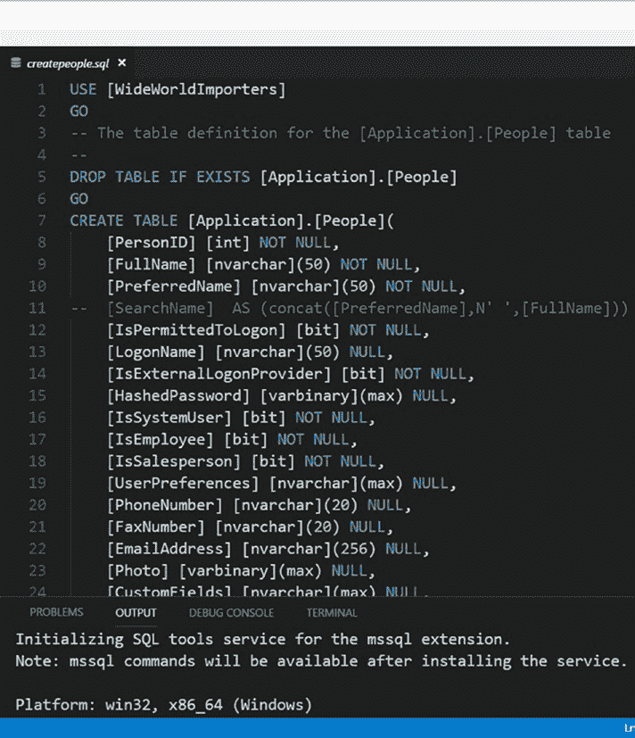

# 第三章：构建数据库与 T-SQL 基础

```sql
-- 为 People 表中引用主键的列添加外键
ALTER TABLE [Application].[People] WITH CHECK ADD CONSTRAINT [FK_Application_People_Application_People] FOREIGN KEY([LastEditedBy])
REFERENCES [Application].[People] ([PersonID])
```

```sql
GO
```

```sql
-- PersonID 的默认值是一个 SEQUENCE 值
ALTER TABLE [Application].[People] ADD CONSTRAINT [DF_Application_People_PersonID] DEFAULT (NEXT VALUE FOR [Sequences].[PersonID]) FOR [PersonID]
```

```sql
GO
```

我知道这些内容有点多，所以我们来拆解一下。看看第一个列定义，了解如何解读每个列定义。

`[PersonID] [int] NOT NULL`

`PersonID` 是列名，后面跟着数据类型（整数），然后是列的可空性（决定该列是接受 NULL 值还是必须提供明确值）。其余列遵循相同的模式，只是使用了其他数据类型和 NULL 指定。

有关 `CREATE TABLE` T-SQL 命令的完整参考（请注意：选项非常多，这会是一篇很长的阅读），请参阅文档：[`docs.microsoft.com/sql/t-sql/statements/create-table-transact-sql`](https://docs.microsoft.com/sql/t-sql/statements/create-table-transact-sql)。其中一些数据类型很有趣，包括 `bit`、`nvarchar` 和 `varbinary (max)` 列定义。要完整了解 SQL Server 数据类型，请参阅我们的文档：[`docs.microsoft.com/sql/t-sql/data-types/data-types-transact-sql`](https://docs.microsoft.com/sql/t-sql/data-types/data-types-transact-sql)。

有四个列定义看起来不太简单，前面带有 `--` 字符。这些字符用于任何 T-SQL 代码中的注释（你也可以使用 `/* <T-SQL 代码> */`）。我在这里添加注释是因为在下一章中，我将取消这些列定义的注释，向你展示其他特性和功能。

像 Visual Studio Code 中的 mssql 扩展（或其他将在第五章讨论的工具）的一大特性是使用颜色编码来区分关键字、标识符和注释。图 3-6 展示了在 Visual Studio Code 中使用 mssql 扩展创建 People 表的 T-SQL 命令示例。



**图 3-6.** Visual Studio Code 中使用 mssql 扩展的 T-SQL 语法颜色编码

这个表定义的另一个方面是一个称为 *约束* 的概念。SQL Server 提供了在定义（或修改）表时，通过约束来声明各种 *完整性* 检查的功能。

对于 People 表，我可以添加一个主键来强制特定列（或列组合）的每一行具有唯一值。主键约束通过索引实现，默认情况下是 `聚集索引`。聚集索引的实现方式是，将表数据的页面存储在索引的基层，并按聚集索引中的列进行排序。在此示例中，每行必须包含唯一的 `PersonID` 值。我们将使用之前创建的序列对象来确保每个 `PersonID` 值都是唯一的。

在此示例中，约束定义中 `[PersonID]` 列旁边的 `ASC` 关键字表示聚集索引将按 `PersonID` 值的升序键顺序排序。

还有另一种方法可以在表定义的同时定义主键。对于上面的示例，你可以将 `PersonID` 列声明为：

```sql
[PersonID] [int] NOT NULL PRIMARY KEY CLUSTERED
```

另一种约束类型是 *外键约束*，用于确保表之间或同一表内列之间的关系满足引用完整性。在前面的示例中，`LastEditedBy` 列是另一行的 `PersonID` 值。


