# 第三章：构建数据库与 T-SQL 基础

在表中，为确保 `LastEditedBy` 列中的任何数据都是有效的 `PersonID`，您可以在表创建后通过修改表来声明外键约束（也可以在创建表时完成）。请查看表定义语句集中的以下语句。（不要执行此操作。我在此展示，以便您能看到约束的详细信息。）

```sql
ALTER TABLE [Application].[People] WITH CHECK ADD CONSTRAINT [FK_Application_People_Application_People] FOREIGN KEY([LastEditedBy])
REFERENCES [Application].[People] ([PersonID])
```

解析这条语句，该约束确保 `LastEditedBy` 列中的值始终引用 `People` 表中 `PersonID` 列的行。开头的 `WITH CHECK` 选项使语句能够针对该约束验证表中所有现有数据。

另一种约束类型可以是列的*默认值*，用于在插入新行未指定值时使用。默认值可以是任何声明的值，这样当您插入一行时，如果没有指定值，就会使用默认值。请记住，`PersonID` 是主键列，这意味着每个值必须是唯一的。`PersonID` 的目的是作为一个没有逻辑含义的键值，用于引用代表一个人的每一行。`PersonID` 将成为在 `People` 表中物理标识每个人的方式，而无需使用列的组合（如 `FullName`+...）。

现在，我可以使用上一节创建的序列对象来创建一个约束，该约束将为插入到 `People` 表中的每一行的 `PersonID` 列递增到下一个 `SEQUENCE` 值。使用 `DEFAULT` 关键字允许我将行插入到 `People` 表中，每个新的 `PersonID` 将默认由序列对象填充。上一脚本中用于为默认值创建约束的 `ALTER TABLE` 语句如下所示：

```sql
ALTER TABLE [Application].[People] ADD CONSTRAINT [DF_Application_People_PersonID]  DEFAULT (NEXT VALUE FOR [Sequences].[PersonID]) FOR [PersonID]
```

`NEXT VALUE FOR` 关键字是标准的 T-SQL 语法，表示任何新行的 `PersonID` 列的默认值将使用序列对象的下一个值（例如，1,2,3...）。

以下是来自 Sales 架构的 `Customers` 表的定义。执行这组 T-SQL 语句或使用示例脚本 `createcustomers.sql`：

```sql
USE [WideWorldImporters]
GO

-- [Sales].[Customer] 表的表定义
--
DROP TABLE IF EXISTS [Sales].[Customers]
GO

CREATE TABLE [Sales].Customers NOT NULL,
    [BillToCustomerID] [int] NOT NULL,
    [CustomerCategoryID] [int] NOT NULL,
    [BuyingGroupID] [int] NULL,
    [PrimaryContactPersonID] [int] NOT NULL,
    [AlternateContactPersonID] [int] NULL,
    [DeliveryMethodID] [int] NOT NULL,
    [DeliveryCityID] [int] NOT NULL,
    [PostalCityID] [int] NOT NULL,
    [CreditLimit] decimal NULL,
    [AccountOpenedDate] [date] NOT NULL,
    [StandardDiscountPercentage] decimal NOT NULL,
    [IsStatementSent] [bit] NOT NULL,
    [IsOnCreditHold] [bit] NOT NULL,
    [PaymentDays] [int] NOT NULL,
    [PhoneNumber] nvarchar NOT NULL,
    [FaxNumber] nvarchar NOT NULL,
    [DeliveryRun] nvarchar NULL,
    [RunPosition] nvarchar NULL,
    [WebsiteURL] nvarchar NOT NULL,
    [DeliveryAddressLine1] nvarchar NOT NULL,
    [DeliveryAddressLine2] nvarchar NULL,
    [DeliveryPostalCode] nvarchar NOT NULL,
    [DeliveryLocation] [geography] NULL,
    [PostalAddressLine1] nvarchar NOT NULL,
    [PostalAddressLine2] nvarchar NULL,
    [PostalPostalCode] nvarchar NOT NULL,
    [LastEditedBy] [int] NOT NULL,
--    [ValidFrom] datetime2 GENERATED ALWAYS AS ROW START NOT NULL,
--    [ValidTo] datetime2 GENERATED ALWAYS AS ROW END NOT NULL
    CONSTRAINT [PK_Sales_Customers] PRIMARY KEY CLUSTERED
    (
        [CustomerID] ASC
    ),
    CONSTRAINT [UQ_Sales_Customers_CustomerName] UNIQUE NONCLUSTERED
    (


第 3 章：构建数据库与 T-SQL 基础

## 外键约束

```sql
ALTER TABLE [Sales].[Customers] WITH CHECK ADD CONSTRAINT [FK_Sales_Customers_AlternateContactPersonID_Application_People] FOREIGN KEY([AlternateContactPersonID])
REFERENCES [Application].[People] ([PersonID])
GO

ALTER TABLE [Sales].[Customers] WITH CHECK ADD CONSTRAINT [FK_Sales_Customers_Application_People] FOREIGN KEY([LastEditedBy])
REFERENCES [Application].[People] ([PersonID])
GO

ALTER TABLE [Sales].[Customers] WITH CHECK ADD CONSTRAINT [FK_Sales_Customers_BillToCustomerID_Sales_Customers] FOREIGN KEY([BillToCustomerID])
REFERENCES [Sales].[Customers] ([CustomerID])
GO

ALTER TABLE [Sales].[Customers] WITH CHECK ADD CONSTRAINT [FK_Sales_Customers_PrimaryContactPersonID_Application_People] FOREIGN KEY([PrimaryContactPersonID])
REFERENCES [Application].[People] ([PersonID])
GO
```

## 默认值约束

```sql
ALTER TABLE [Sales].[Customers] ADD CONSTRAINT [DF_Sales_Customers_CustomerID] DEFAULT (NEXT VALUE FOR [Sequences].[CustomerID]) FOR [CustomerID]
GO
```

这类似于 `People` 表，我对某些列添加了注释，将在下一章中取消注释并进行展示。

对于 `Customer` 表，需要添加类似的约束，但存在一些差异：

*   我为 `[CustomerName]` 列添加了一个 `UNIQUE` 约束，以确保每个客户名称是唯一的。但我仍会使用与 `SEQUENCE` 关联的 `CustomerID` 列作为 `PRIMARY KEY`。

    **注意** 索引是为主键和唯一约束创建的。索引有助于维护约束定义，同时根据加载到这些表中的数据量，还可以帮助提升查找值的性能。关于使用索引提升性能的内容，我将在第 6 章详细介绍。

*   有多个 `FOREIGN KEY` 约束引用了 `[Application].[People].[PersonID]` 列。

    **注意** 在完整的 `WideWorldImporters` 示例中，`Customers` 表具有对数据库中其他表的外键引用，但在本章中我省略了这些引用，以保持此示例的完整性和简洁性。

## 创建完整数据库

让我们回顾一下在该数据库中创建架构、序列对象、表和约束的整个序列。

通常，当我构建一个包含对象的完整数据库定义时，我会创建一个脚本来驱动所有 T-SQL 脚本的执行。我提供了两个示例脚本，你可以使用它们一次性创建所有内容：

*   `createwwi.sh` 适用于 macOS 和 Linux 用户
*   `createwwi.cmd` 适用于 Windows 用户。

这些脚本假设你已经安装了 `sqlcmd` 工具，`sqlcmd` 在你的系统路径中，并且需要两个命令行参数：服务器名称和 sa 密码。`sqllogin` 在 `createlogin.sql` 脚本中使用和创建。该登录名的密码在那个 T-SQL 脚本中，因此如果你修改了我提供的密码，你也需要修改 shell 或 cmd 脚本。如果你在 Linux 上执行 `createwwi.sh` 脚本，别忘了先执行 `chmod u+x createwwi.sh` 以使其可执行。

**注意** 这些脚本假设 `sqlcmd` 在系统路径中。对于 Windows，安装后它通常应该已经在路径中。对于 Linux，如果你尚未添加，请确保使用以下 bash shell 命令将其添加到你的路径中：

```bash
echo 'export PATH="$PATH:/opt/mssql-tools/bin"' >> ~/.bash_profile
echo 'export PATH="$PATH:/opt/mssql-tools/bin"' >> ~/.bashrc
source ~/.bashrc
```

在 Windows 的 Powershell 命令提示符下，在我的环境中执行 `createwwi.cmd` 的样子如下：

```powershell
.\createwwi bwsql2017rhel Sql2017isfast
```

在我的 Linux shell 中，以下是在我的 Linux 服务器上运行 `createwwi.sh` 的执行示例：

```bash
./createwwi.sh localhost Sql2017isfast
```

这些 shell 和命令脚本执行以下 T-SQL 脚本来创建登录名、数据库以及数据库中的对象：


# 第三章 构建数据库与 T-SQL 基础

## 1. **cleanup.sql**：我添加了这个脚本，以便您可以反复运行这些脚本。
`cleanup.sql` 用于删除之前所有执行中创建的数据库。尽管在第 3 步中会删除 `WideWorldImporters` 数据库，但如果您已经在 `sqllinux` 登录名的上下文中创建了它，那么在不先删除数据库的情况下，您将无法再次删除和重新创建该登录名。

## 2. **createlogin.sql**：创建 `sqllinux` 登录名（需以 `sa` 登录名连接执行）。

## 3. **dropandcreatedb.sql**：创建数据库。
当上下文切换到 `WideWorldImporters` 时，这将使 `sqllinux` 登录名成为 `WideWorldImporters` 数据库中的 `dbo`（数据库所有者）用户。

## 4. **createschemas.sql**：为数据库中的所有对象创建架构。

## 5. **createsequences.sql**：为两个表使用的序列对象。

## 6. **createpeople.sql**：创建带约束的 `People` 表。

## 7. **createcustomers.sql**：创建带约束的 `Customers` 表。

现在，一切已准备就绪，您可以测试一些 T-SQL 查询来插入数据、查询数据、更新和删除行了。

## 构建与运行查询

我建议通过一个独立的工具来创建和测试您希望在应用程序中使用的 T-SQL 查询，这样可以确保没有语法错误并能按预期运行。在应用程序外部调试 T-SQL 命令要比将其交织在代码中容易得多。因此，在本章的这一部分，我将展示如何使用基本的 T-SQL 语句来插入、更新、删除和查看数据。本节的示例语句和脚本假设您已经运行了前面所有用于创建数据库和对象的脚本。与本章中创建数据库和对象的脚本一样，我也是使用 `sqllinux` 登录名执行了以下所有的 T-SQL 语句和脚本。

##### 插入与读取数据

出于本章的目的，我将讨论单行数据的简单插入。您有多种选项可以*批量*插入数据，我将在本书的其他章节中讨论这些方法。

用于插入数据的基本 T-SQL 语句是 `INSERT`。当您向包含外键的表中插入数据时，需要首先向基表中插入行。这意味着您应该首先在 `People` 表中插入任何需要在 `Customers` 表中作为外键使用的行。

在 `Customers` 表中，这些列被引用回 `People` 表：

- `AlternateContactPersonID`
- `LastEditedBy`
- `PrimaryContactPersonID`

当您为一个客户插入单行数据时，需要为这些列提供 `PersonID` 值。它们可能是同一个“人”，但更有可能是至少两到三个不同的人。如果您还记得，`People` 表中有一个 `LastEditedBy` 列，它引用了该表中的另一行。因此，我的策略是在 `People` 表中创建三行：一行作为两个表中任何行的“编辑者”，另外两行作为客户的主联系人和备用联系人 ID。

执行以下 T-SQL 语句或使用示例脚本 `insertpeople.sql` 来在 `People` 表中插入所有三行：

```sql
USE [WideWorldImporters]
GO
INSERT INTO [Application].[People]
([PersonID], [FullName], [PreferredName], [IsPermittedToLogon],
[LogonName], [IsExternalLogonProvider], [IsSystemUser],
[IsEmployee], [IsSalesPerson], [LastEditedBy])
VALUES (0, 'Robert Dorr', 'TheKraken', 1, 'rdorr', 0, 1, 1, 0, 0)
GO
INSERT INTO [Application].[People]
([FullName], [PreferredName], [IsPermittedToLogon],
[LogonName], [IsExternalLogonProvider], [IsSystemUser],
[IsEmployee], [IsSalesPerson], [LastEditedBy])
VALUES ('Slava Oks', 'thegodfather', 1, 'slavao', 0, 1, 1, 0, 0)
GO
INSERT INTO [Application].[People]
([FullName], [PreferredName], [IsPermittedToLogon],
[LogonName], [IsExternalLogonProvider], [IsSystemUser],
[IsEmployee], [IsSalesPerson], [LastEditedBy])
VALUES ('Tobias Ternstrom', 'theswede', 1, 'tobiast', 0, 1, 1, 0, 0)
GO
```


### 第 3 章：构建数据库与 T-SQL 基础

如果查看我使用的 INSERT 语法，会发现我列出了具体的列名，并且没有为许多定义为允许 NULL 值的列（即可选列）提供值。

要插入单个客户，我必须知道该客户的主要和备选联系人的`PersonID`值是什么。你可以通过使用 T-SQL `SELECT`语句从`People`表中读取行来实现这一点，如脚本`findpeople.sql`所示：

```sql
USE [WideWorldImporters]
GO
SELECT [PersonID], [FullName] FROM [Application].[People]
GO
```

Visual Studio 右侧的结果窗格将显示以下结果：

| PersonID | FullName       |
|----------|----------------|
| 0        | Robert Dorr    |
| 1        | Slava Oks      |
| 2        | Tobias Ternstrom |

Slava Oks 将作为主要客户联系人，Tobias Ternstrom 作为备选客户联系人，而 Robert Dorr（又名“TheKraken”）将继续担任我的“编辑”。

现在我有了插入新客户的基础。因为列`[BillToCustomerID]`引用了一个有效的`[CustomerID]`，所以我使用一种称为变量的功能来获取一个`SEQUENCE`值，然后将其用于这两个列。执行以下 T-SQL 语句或使用示例脚本`insertcustomer.sql`：

```sql
USE [WideWorldImporters]
GO
DECLARE @CustomerID INT
SET @CustomerID = NEXT VALUE for [Sequences].[CustomerID]
INSERT INTO [Sales].[Customers]
([CustomerID], [CustomerName], [BillToCustomerID], [CustomerCategoryID],
[PrimaryContactPersonID],
[AlternateContactPersonID], [DeliveryMethodID], [DeliveryCityID],
[PostalCityID],
[AccountOpenedDate], [StandardDiscountPercentage], [IsStatementSent],
[IsOnCreditHold],
[PaymentDays], [PhoneNumber], [FaxNumber], [WebsiteURL],
[DeliveryAddressLine1],
[DeliveryPostalCode], [PostalAddressLine1], [PostalPostalCode],
[LastEditedBy])
VALUES (@CustomerID, 'WeLoveSQLOnLinux', @CustomerID, 1, 1, 2, 1, 1, 1,
getdate(), 0.10, 0, 0, 30,
'817-111-1111', '817-222-2222', 'www.welovesqlonlinux.com', 'Texas',
'76182', 'Texas', '76182', 0)
GO
```

注意，对于`[AccountOpenedDate]`列，我使用了`getdate()`来提供 datetime 值（`getdate()`根据安装 SQL Server 的计算机提供本地日期时间）。这是一个可以与 T-SQL 查询一起使用的内置函数示例。有关 SQL Server 函数的更多信息，请参阅我们的文档：[`docs.microsoft.com/sql/t-sql/functions/functions`](https://docs.microsoft.com/sql/t-sql/functions/functions)。

现在我可以从`Customer`表读取并与`People`表联接，以获取客户的名称及其主要联系人姓名，T-SQL 语句如示例脚本`findcustomer.sql`所示：

```sql
USE [WideWorldImporters]
GO
SELECT c.[CustomerName], c.[WebsiteURL], p.[FullName] AS PrimaryContact
FROM [Sales].[Customers] AS c
JOIN [Application].[People] AS p
ON p.[PersonID] = c.[PrimaryContactPersonID]
GO
```

此查询的结果如下行所示：

| CustomerName      | WebsiteURL          | PrimaryContact |
|-------------------|---------------------|----------------|
| WeLoveSQLOnt...   | www.welovesql...    | Slava Oks      |

##### 更新与删除数据

既然你已经学习了如何从这些表中插入和检索行的示例，那么任何使用 SQL Server 的应用程序的另外两个关键操作就是更新和删除行的能力。执行这些操作的语法非常简单。

假设你想更新“WeLoveSQLOnLinux”公司，因为他们搬迁了网站，所以要更改他们的网站。执行以下 T-SQL 语句或使用示例脚本`updatecustomer.sql`：

```sql
USE [WideWorldImporters]
GO
UPDATE [Sales].[Customers]
SET WebsiteURL = 'www.sqlonlinux.com'
WHERE CustomerName = 'WeLoveSQLOnLinux'
GO
```

你可能还想删除一个客户行，像这样使用来自示例脚本`deletecustomer.sql`的 T-SQL 查询：

```sql
USE [WideWorldImporters]
GO
BEGIN TRANSACTION
DELETE FROM [Sales].[Customers]
WHERE CustomerName = 'WeLoveSQLOnLinux'
```


## 回滚事务

```sql
ROLLBACK TRANSACTION
GO
```

我额外为你设置了一个难点。请注意 T-SQL 命令 `BEGIN TRANSACTION` 和 `ROLLBACK TRANSACTION`。实际上，我之前展示的所有 T-SQL 命令都有一个隐式的事务提交。而使用 `BEGIN TRANSACTION` 语法则允许我显式地决定提交或回滚（撤销）我的 T-SQL 命令。在此例中，`DELETE` 语句被执行，但随后的 `ROLLBACK TRANSACTION` 撤销了该更改。

关于 SQL Server 事务的详细讨论，请参阅我们的文档页面：`https://docs.microsoft.com/sql/t-sql/language-elements/transactions-transact-sql`。

## 构建视图和存储过程

SQL Server 具有内置功能，可用于创建其他类型的对象，以帮助提供抽象化并封装查询逻辑。其中一种对象称为 `view`（视图），这是许多数据库系统中的常见功能。视图允许你基于来自一个或多个表的 T-SQL `SELECT` 语句来创建对象。

例如，我可以基于之前展示的 `Customer` 表和 `People` 表之间的连接，通过以下 T-SQL 语句创建一个视图，如示例脚本 `createview.sql` 所示：

```sql
USE [WideWorldImporters]
GO
DROP VIEW IF EXISTS [Sales].[CustomerContacts]
GO
CREATE VIEW [Sales].[CustomerContacts]
AS
SELECT c.[CustomerName], c.[WebsiteURL], p.[FullName] AS PrimaryContact
FROM [Sales].[Customers] AS c
JOIN [Application].[People] AS p
ON p.[PersonID] = c.[PrimaryContactPersonID]
GO
```

现在，我可以针对视图中的所有列执行一条 T-SQL 语句，如示例脚本 `findcustomercontacts.sql` 所示：

```sql
USE [WideWorldImporters]
GO
SELECT * FROM [Sales].[CustomerContacts]
GO
```

我得到了与执行连接相同的结果，但我已将“查找客户联系人”的逻辑从用户或应用程序中抽象出来。当你希望向用户隐藏 `base`（基表）的某些列，并只允许他们访问特定列时，视图是非常常见的解决方案。

SQL Server 中另一种非常常见的对象是 `stored procedure`（存储过程）。在 SQL Server 中使用存储过程通常被称为 `server-side programming`（服务器端编程）。存储过程可以包含多个 T-SQL 语句（这些语句通常可能又长又复杂）。这免除了应用程序需要在其代码中包含所有 T-SQL 语句的麻烦。存储过程还减少了来自客户端应用程序的网络流量，并且在内存中被高效缓存。

我可以采用插入客户行的 `INSERT` 语句，并构建一个存储过程，如下列 T-SQL 语句所示，如示例脚本 `insertcustomerproc.sql` 所示：

```sql
USE [WideWorldImporters]
GO
DROP PROCEDURE IF EXISTS [Sales].[InsertCustomer]
GO
CREATE PROCEDURE [Sales].[InsertCustomer]
@PrimaryContactID INT, @AlternateContactID INT
AS
-- 查找已知的 PersonID = 0 的普通编辑者
DECLARE @EditedBy INT
SELECT @EditedBy = PersonID FROM [Application].[People]
WHERE PersonID = 0
-- 插入到 Customers 表
-- 主联系人和备用联系人作为参数传入
DECLARE @CustomerID INT
SET @CustomerID = NEXT VALUE for [Sequences].[CustomerID]
INSERT INTO [Sales].[Customers]
([CustomerID], [CustomerName], [BillToCustomerID], [CustomerCategoryID],
[PrimaryContactPersonID],
[AlternateContactPersonID], [DeliveryMethodID], [DeliveryCityID],
[PostalCityID],
[AccountOpenedDate], [StandardDiscountPercentage], [IsStatementSent],
[IsOnCreditHold],
[PaymentDays], [PhoneNumber], [FaxNumber], [WebsiteURL],
[DeliveryAddressLine1],
[DeliveryPostalCode], [PostalAddressLine1], [PostalPostalCode],
[LastEditedBy])
VALUES (@CustomerID, 'WeAllLoveSQLOnLinux', @CustomerID, 1, @PrimaryContactID,
@AlternateContactID, 1, 1, 1, getdate(), 0.10, 0, 0, 30,
'817-111-1111', '817-222-2222', 'www.welovesqlonlinux.com', 'Texas', '76182',
'Texas', '76182', @EditedBy)
GO
```


此过程内置了查找 `LastEditedBy` 列的逻辑，并接收两个参数作为主要联系人和备用联系人。

要执行此过程，您需要运行一条 T-SQL 语句，例如示例脚本 `execinsertcustomer.sql` 中所示：

```sql
USE [WideWorldImporters]
GO
EXEC [Sales].[InsertCustomer] 1, 2
GO
```

要了解更多关于存储过程的强大功能，请参阅我们的文档：[`docs.microsoft.com/sql/t-sql/statements/create-procedure-transact-sql`](https://docs.microsoft.com/sql/t-sql/statements/create-procedure-transact-sql)。

### 第 3 章：构建数据库与 T-SQL 基础

#### 小结

在本章中，我介绍了创建数据库以及数据库中对象的基础知识。我使用了流行的开源、跨平台工具 Visual Studio Code 来展示所有示例，通过 `mssql` 扩展来演示 T-SQL 的基础。

有了这些知识作为基础，我将在下一章中，继续使用同一个 `WideWorldImporters` 数据库示例，向您展示如何构建一个应用程序、学习更高级的 T-SQL 概念，并探索 SQL Server 2017 on Linux 带来的新特性。

### 第 4 章：构建应用程序与高级 T-SQL

既然您已经学习了如何创建数据库、表以及执行基本的 T-SQL 查询，是时候编写一些代码并构建一个连接到 SQL Server on Linux 的应用程序了。和第 3 章一样，我将使用 Visual Studio Code 作为开发环境来构建一个 node.js 应用程序。

该 node.js 应用程序使用的 T-SQL 查询基于我在第 3 章向您展示的知识。因此，在本章的第二部分，我将向您展示更高级的 T-SQL 功能，以及在 SQL Server 2016 和 2017 中发布的新特性。

我在撰写本章时参考了三种资源，相信您也会觉得它们很有用：

- [`aka.ms/sqldev`](http://aka.ms/sqldev)：关于如何在多种平台上、使用几乎任何语言为 SQL Server 构建应用程序的资源与教程。
- [`code.visualstudio.com/docs/nodejs/nodejs-tutorial`](https://code.visualstudio.com/docs/nodejs/nodejs-tutorial)：关于如何使用 Visual Studio Code 构建 node.js 应用程序的教程。
- [`docs.microsoft.com/sql/linux/sql-server-linux-develop-use-vscode`](https://docs.microsoft.com/sql/linux/sql-server-linux-develop-use-vscode)：关于如何为 Visual Studio Code 使用 `mssql` 扩展的教程。

© Bob Ward 2018

B. Ward, *《Linux 上的 SQL Server 专业指南》*, `doi.org/10.1007/978-1-4842-4128-8_4`

### 设置您的环境

在第 3 章中，我描述了如何使用 Visual Studio Code 和 `mssql` 扩展来设置运行 T-SQL 查询的环境。如果您跳过第 3 章直接来到本章，您将需要执行以下步骤来安装和配置本章示例所需的内容：

- 从 [`code.visualstudio.com/`](https://code.visualstudio.com/) 安装 Visual Studio Code。
- 按照 [`docs.microsoft.com/sql/linux/sql-server-linux-develop-use-vscode?view=sql-server-linux-2017#install-the-mssql-extension`](https://docs.microsoft.com/sql/linux/sql-server-linux-develop-use-vscode?view=sql-server-linux-2017#install-the-mssql-extension) 的说明，为 Visual Studio Code 安装 `mssql` 扩展。
- 如果您尚未安装 SQL 命令行实用工具。


### 第 4 章：构建应用程序与高级 T-SQL

### 设置与前置条件

包含`sqlcmd`，请从[www.microsoft.com/download/details.aspx?id=53591](http://www.microsoft.com/download/details.aspx?id=53591)下载 Windows 版本，或从[`docs.microsoft.com/en-us/sql/linux/sql-server-linux-setup-tools`](https://docs.microsoft.com/en-us/sql/linux/sql-server-linux-setup-tools)下载 Linux/macOS 版本。请确保`sqlcmd`已添加到系统路径中，以便运行示例脚本。

*   将第 3 章和第 4 章的示例脚本和代码复制到将在 Visual Studio Code 中打开的本地目录。我在 Windows 上的本地目录名为`c:\wwi`。如果您仍保留着第 3 章的运行环境，只需将所有第 4 章代码和脚本复制到`c:\wwi`或您创建的任何文件夹中。
*   为`sqllinux`用户设置连接配置文件。关于如何操作，请参阅第 3 章中“创建登录名和用户”一节。
*   本章中的所有代码和 T-SQL 脚本旨在按顺序运行。为从干净状态开始，请运行第 3 章提供的`createwwi.sh`（macOS 或 Linux）或`createwwi.cmd`（Windows）脚本。这些脚本使用`sqlcmd`，并接受两个参数：服务器和 sa 密码。

### 填充数据库

执行第 3 章中的 T-SQL 脚本`insertpeople.sql`和`insertcustomer.sql`，以填充`People`和`Customers`表。同时，执行 T-SQL 脚本`insertcustomerproc.sql`以创建存储过程，该存储过程将在本章后面的 node.js 示例中使用。

### 开发环境

本章示例将使用 Windows 版本的 Visual Studio Code，用于 SQL Server T-SQL 命令以及 Windows 版本的 node.js。但是，由于 Visual Studio Code 和 node.js 均支持 MacOS 和 Linux，因此所有示例都可在您偏好的开发平台上运行。

因为我正在构建一个 node.js 应用程序，所以另一项任务是安装必要的组件，以便在我的 Windows 笔记本电脑上运行 node.js。我使用了从[`nodejs.org/en/download`](https://nodejs.org/en/download)找到的 Windows 安装包（安装时使用了所有默认选项）。

## 为 SQL Server 构建和运行数据应用程序

多年前，为 SQL Server 构建的应用程序仅使用 Visual Basic、C 或 C++编写，通过支持 ODBC 或 OLE-DB 等编程接口的驱动程序进行连接。几年前，微软有意识地努力扩展编程接口，以支持更广泛的语言、接口和平台。

如今，几乎可以用您能想到的任何语言编写程序来访问 SQL Server。无论您想用 Java、C#、PHP 还是 Python 开发程序，SQL Server 都提供您所需的支持。由于有了[`aka.ms/sqldev`](http://aka.ms/sqldev)这个便捷的网站，我不再尝试记住所有支持的编程语言。

图 4-1 展示了[`aka.ms/sqldev`](http://aka.ms/sqldev)网站提供的选项。

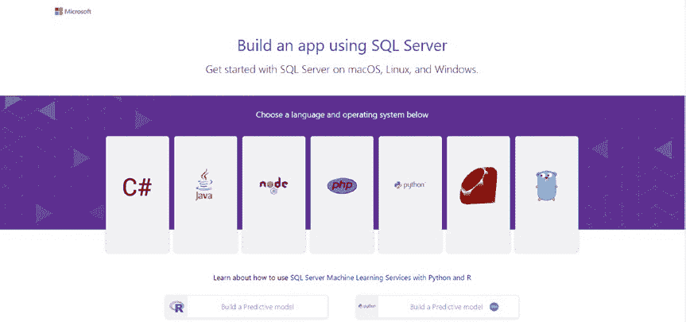

*图 4-1. SQL Server 编程语言选项*

作为对这些编程语言支持的一部分，SQL Server 还支持多种对象关系映射（ORM）框架，包括 Entity Framework、Hibernate ORM、Sequelize ORM 和 Django。有关驱动程序和 ORM 框架支持的完整列表，请参阅我们的文档：[`docs.microsoft.com/sql/connect/sql-connection-libraries`](https://docs.microsoft.com/sql/connect/sql-connection-libraries)。

## 在 SQL Server 中使用 node.js


在构建应用程序，尤其是在 Linux 上，较为流行的编程语言之一是基于 Javascript 的 node.js。Node.js 支持通过一个名为 `Tedious` 的组件（Microsoft 是 Tedious 的主要贡献者。你可以在 `https://github.com/tediousjs/tedious` 找到其开源代码，这是用于 SQL Server 的 node.js 驱动程序）连接到任何 SQL Server，使用的是表格数据流协议，即 SQL Server 的“数据”语言。TDS 协议受 SQL Server 和 Azure SQL Server Database 支持。整个协议是开放的，并发布在 `https://msdn.microsoft.com/library/dd304523.aspx`。

Node.js 支持程序在 Windows、Linux 和 MacOS 上运行。你可以在 `https://nodejs.org` 下载你选择的 node.js 平台。

## 第 4 章   构建应用程序和高级 T-SQL

我将展示一个使用 node.js 的示例应用程序（这是一个简单的示例，将输出显示到控制台。它不会显示网页），该示例基于 Microsoft 在 `http://www.microsoft.com/sql-server/developer-get-started/node/windows` 提供的示例。

根据我们文档 `http://www.microsoft.com/sql-server/developer-get-started/node/windows/step/2.html` 中的说明，我运行了这些程序来安装 Tedious 驱动程序并准备我的环境，以便将 node.js 与 SQL Server 一起使用（你可以在 Visual Studio Code 的集成终端中执行这些命令），命令是在我将要保存程序的文件夹中执行的：

```
npm init -y
npm install tedious
npm install async
```

关于使用 Tedious 驱动程序为 node.js 与 SQL Server 编写程序的文档参考集，请参阅 API 文档 `http://tediousjs.github.io/tedious/index.html`。另一组示例可以在 `https://github.com/tediousjs/tedious/tree/master/examples` 找到。

### 使用 node.js 连接到 SQL Server

使用 node.js 连接到 SQL Server 依赖于 Tedious 驱动程序的 `Connection` 对象。在 `http://tediousjs.github.io/tedious/api-connection.html` 获取该对象的完整详细信息。以下是我构建的代码，用于连接到 Linux 上的 SQL Server，使用 WideWorldImporters 作为默认数据库，并使用我在本章前面创建的 sqllinux 登录名。使用 Visual Studio Code 编辑器，你可以打开示例文件 `customerappconnect.js` 查看此代码。使用此文件扩展名会使编辑器切换为识别 JavaScript 代码：

```
var Connection = require('tedious').Connection;
var Request = require('tedious').Request;
var TYPES = require('tedious').TYPES;
// 创建到数据库的连接
var config = {
    userName: 'sqllinux',
    password: 'Sql2017isfast',
    server: 'bwsql2017rhel',
    options: {
        database: 'WideWorldImporters'
    }
}
console.log("正在连接到 SQL Server");
var connection = new Connection(config);
// 尝试连接到 Linux 上的 SQL Server
connection.on('connect', function(err) {
    if (err) {
        console.log(err);
    } else {
        console.log('已成功连接到 SQL Server');
        connection.close();
    }
});
```

我可以在集成终端中运行此代码（你可以使用 Visual Studio Code 的视图菜单打开集成终端），命令是：`node .\customerappconnect.js`


# 第 4 章 构建应用程序与高级 T-SQL

## 插入和读取数据

既然你已经学会了使用 node.js 连接到 SQL Server，现在让我们加入代码，向`[Application].[People]`表插入一行（一个不同于第 3 章示例中使用的新行），以及另一段代码来从 Customer 表获取联系人信息。

在 node.js 中使用 Tedious 执行查询需要`Request`对象。你可以在 [`tediousjs.github.io/tedious/api-request.html`](http://tediousjs.github.io/tedious/api-request.html) 找到`Request`对象的完整详细信息。

这是一段很长的代码，所以我将在代码片段末尾解释一些细节。这组 node.js 代码可以在示例文件`customerappinssel.js`中找到，如下所示：

```javascript
var Connection = require('tedious').Connection;
var Request = require('tedious').Request;
var TYPES = require('tedious').TYPES;
var async = require('async');

// 创建到数据库的连接
var config = {
    userName: 'sqllinux',
    password: 'Sql2017isfast',
    server: 'bwsql2017rhel',
    options: {
        database: 'WideWorldImporters'
    }
}

console.log("正在连接到 SQL Server");
var connection = new Connection(config);

function Start(callback) {
    console.log('开始...');
    callback(null, 'Travis Wright', 'radtravis', 'twright');
}

function Insert(FullName, PreferredName, Logon, callback) {
    console.log("正在将 '" + FullName + "' 插入表...");
    request = new Request(
        `INSERT INTO [Application].[People] ([FullName], [PreferredName],
        [IsPermittedToLogon], [LogonName], [IsExternalLogonProvider],
        [IsSystemUser], [IsEmployee], [IsSalesPerson], [LastEditedBy]) VALUES
        (@FullName, @PreferredName, 1, @Logon, 0, 1, 1, 0, 0);`,
        function(err, rowCount, rows) {
            if (err) {
                console.log(err);
                callback(err);
            } else {
                console.log(rowCount + ' 行已插入');
                callback(null);
            }
        });

    request.addParameter('FullName', TYPES.NVarChar, FullName);
    request.addParameter('PreferredName', TYPES.NVarChar, PreferredName);
    request.addParameter('Logon', TYPES.NVarChar, Logon);

    // 执行 SQL 语句
    connection.execSql(request);
}

function Read(callback) {
    console.log('正在读取客户联系人...');

    // 从表中读取所有行
    request = new Request(
        `SELECT c.[CustomerName], c.[WebsiteURL], p.[FullName] AS PrimaryContact
         FROM [Sales].[Customers] AS c JOIN [Application].[People] AS p ON
         p.[PersonID] = c.[PrimaryContactPersonID];`,
        function(err, rowCount, rows) {
            if (err) {
                console.log(err);
                callback(err);
            } else {
                console.log(rowCount + ' 行已返回');
                callback(null);
            }
        });

    // 打印读取的行
    var result = "";
    request.on('row', function(columns) {
        columns.forEach(function(column) {
            if (column.value === null) {
                console.log('NULL');
            } else {
                result += column.value + " ";
            }
        });
        console.log(result);
        result = "";
    });

    // 执行 SQL 语句
    connection.execSql(request);
}

function Complete(err, result) {
    if (err) {
        console.log(err);
    } else {
        console.log("完成！");
        connection.close();
    }
}

// 尝试连接到 Linux 上的 SQL Server
connection.on('connect', function(err) {
    if (err) {
        console.log(err);
        process.exit(1);
    } else {
        console.log('成功连接到 SQL Server');
        // 串行执行数组中的所有函数
    }
});
```

图 4-2 显示了在 Visual Studio 中的整体情况。

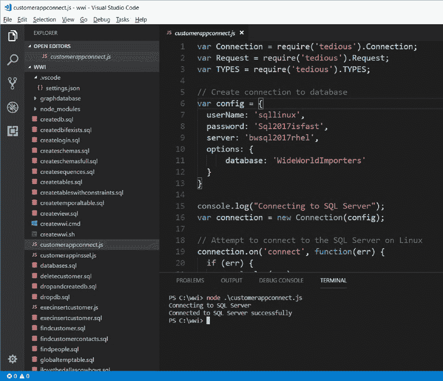

**图 4-2.** 在 Visual Studio Code 中使用 node.js 程序连接到 Linux 上的 SQL Server

运行代码的结果显示在图 4-2 的底部窗格中，内容如下：

```
PS C:\wwi> node .\customerappconnect.js
正在连接到 SQL Server
成功连接到 SQL Server
```

在未来的示例中，我通常只会以文本形式显示结果，而不会同时显示 Visual Studio 截图。


```javascript
async.waterfall([

    Start,

    Insert,

    Read

], Complete)

}
```

});

如果你不熟悉 Node.js，可能较难理解这段代码的执行流程。关键的代码段在连接到 `async` 对象的逻辑之后，用于“触发”其余函数：

```javascript
async.waterfall([

    Start,

    Insert,

    Read

], Complete)
```

这段代码按顺序执行每个函数，从 `Start` 函数开始，允许每个函数将信息传递给下一个函数。`Complete` 函数是在其他函数执行完毕后（或发生错误时）运行的主函数。

`INSERT` 语句的语法也很独特，你可以指定从程序绑定到 T-SQL 语句中的变量：

```sql
'INSERT INTO [Application].[People] ([FullName], [PreferredName],
[IsPermittedToLogon], [LogonName], [IsExternalLogonProvider],
[IsSystemUser], [IsEmployee], [IsSalesPerson], [LastEditedBy]) VALUES
(@FullName, @PreferredName, 1, @Logon, 0, 1, 1, 0, 0);'
```

函数 `Insert` 的参数被用作上述 `INSERT` 语句中的绑定变量 `@FullName`、`@PreferredName` 和 `@Logon`，并使用以下语句定义：

```javascript
request.addParameter('FullName', TYPES.NVarChar, FullName);
request.addParameter('PreferredName', TYPES.NVarChar, PreferredName);
request.addParameter('Logon', TYPES.NVarChar, Logon);
```

以下是代码中执行 T-SQL 批处理的技术：

```javascript
connection.execSql(request);
```

而以下代码允许你遍历 T-SQL `SELECT` 语句返回的结果集中每一行的每一列，并绑定到变量，或者在本例中将结果输出到控制台：

```javascript
// 打印读取的行
var result = "";
request.on('row', function(columns) {
    columns.forEach(function(column) {
        if (column.value === null) {
            console.log('NULL');
        } else {
            result += column.value + " ";
        }
    });
    console.log(result);
    result = "";
});
```

你还可以在 `Connection` 对象中看到，在成功执行这些函数后，到 SQL Server 的连接会被关闭：

```javascript
function Complete(err, result) {
    if (err) {
        console.log(err);
    } else {
        console.log("完成！");
        connection.close();
    }
}
```

我是通过命令提示符这样执行这段代码的：

```
node .\customerappinssel.js
```

结果如下：

```
PS C:\wwi> node .\customerappinssel.js
正在连接到 SQL Server
已成功连接到 SQL Server
开始...
正在将 'Travis Wright' 插入表中...
已插入 1 行
正在读取客户联系人...
WeLoveSQLOnLinux www.welovesqlonlinux.com Slava Oks
返回了 1 行
完成！
```

在 Node.js 中执行 `UPDATE` 和 `DELETE` 命令的操作与执行 `INSERT` 非常相似。你可以在我们的文档中查看这些示例：[www.microsoft.com/sql-server/developer-get-started/node/windows/step/2.html](http://www.microsoft.com/sql-server/developer-get-started/node/windows/step/2.html)。

**执行存储过程**

你可以通过设置一个带有完整 T-SQL `“EXEC <过程名>”` 语法的请求，使用相同的 `execSql()` 方法来执行存储过程。但是，更高效的调用存储过程的方式是通过 TDS 协议定义的远程过程调用 (RPC) 方法。Tedious 驱动程序通过一个名为 `callProcedure()` 的方法支持这种方式。

使用上一章中的示例 T-SQL 存储过程 `InsertCustomer`（请记住，在本章开头我指示你执行了 `insertcustomerproc.sql` 脚本），以下是将此过程作为 RPC 执行的 Node.js 代码。你可以在示例文件 `execinsertcustomer.js` 中找到此代码，其内容如下：

```javascript
var Connection = require('tedious').Connection;
var Request = require('tedious').Request;
var TYPES = require('tedious').TYPES;

// 创建到数据库的连接
var config = {
    userName: 'sqllinux',
    password: 'Sql2017isfast',
    server: 'bwsql2017rhel',
    options: {
        database: 'WideWorldImporters'
    }
};
```


# 第四章 构建应用程序与高级 T-SQL

```
console.log("Connecting to SQL Server");

var connection = new Connection(config);

connection.on('connect', function(err) {

// If no error, then good to proceed.

console.log("Connected to SQL Server Successfully");

InsertCustomer();

});

function InsertCustomer() {

request = new Request("[Sales].[InsertCustomer]", function(err) {

if (err) {

console.log(err);}

else

console.log('Inserted new Customer');

}

);

request.addParameter('PrimaryContactID', TYPES.Int, 1);

request.addParameter('AlternateContactID', TYPES.Int, 1);

request.on('requestCompleted', ()=>{connection.close();});

connection.callProcedure(request);

}
```

要运行此代码，我执行了这条命令：
`node .\execinsertcustomer.js`

在 VS Code 的集成终端或你的命令行 shell 中，结果应如下所示：
```
PS C:\wwi> node .\execinsertcustomer.js
Connecting to SQL Server
Connected to SQL Server Successfully
Inserted new Customer
```

关闭连接的方法使用了 Node.js 应用程序常见的事件编程模型。这行代码会在请求完成时（即查询完成时）关闭连接。
```
request.on('requestCompleted', ()=>{connection.close();});
```

##### 增强你的应用程序

我只介绍了一些使用 Node.js 和 Tedious 连接 SQL Server 并运行查询（包括存储过程）的基本方法。当你构建一个生产级应用程序时，你可能需要增强它，以利用 Node.js 的其他方法。

以下是我的一些建议供你考虑：

*   一种处理频繁打开和关闭连接的更高效方法是称为*连接池*的概念。连接池在 SQL Server 应用程序中非常常见，Tedious 通过另一个对象支持此功能：[tediousjs/tedious-connection-pool](https://github.com/tediousjs/tedious-connection-pool)。
*   你可能希望控制登录和/或查询的超时时间（等待登录或查询的时间长度）。`Connection` 对象在配置中提供了选项来控制这些超时。两者的默认值都是 15 秒。你可能还希望有能力手动取消已提交给 SQL Server 的查询，`Connection` 对象通过 `connection.cancel()` 支持这一点。
*   还有其他许多与 `Connection` 对象相关的选项你可能想使用，例如加密、IP 地址和端口号、可用性组的读取意图（我将在第 8 章稍后讨论）等等。它们都在 [`tediousjs.github.io/tedious/api-connection.html#function_newConnection`](http://tediousjs.github.io/tedious/api-connection.html#function_newConnection) 的 `Connection` 对象文档中有详细说明。
*   你的应用程序应准备好根据查询和/或存储过程的执行来处理某些事件。请参阅处理 `Request` 对象的 `doneProc` 和 `doneInProc` 事件的文档：[`tediousjs.github.io/tedious/api-request.html`](http://tediousjs.github.io/tedious/api-request.html)。
*   此外，SQL Server 可能为任何查询执行返回错误信息和提示信息。请务必使用 `Connection` 对象的 `infoMessage` 和 `errorMessage` 事件来处理它们。详情请参见 `Connection` 对象文档：[`tediousjs.github.io/tedious/api-connection.html`](http://tediousjs.github.io/tedious/api-connection.html)。
*   虽然你可以在应用程序的批处理中使用 T-SQL `BEGIN TRANSACTION` 命令，但 Tedious 驱动也提供了用于事务的接口。请参阅相关文档了解更多信息。


详情请参考 [`tediousjs.github.io/tedious/api-connection.`](http://tediousjs.github.io/tedious/api-connection.html#function_beginTransaction)

[html#function_beginTransaction.](http://tediousjs.github.io/tedious/api-connection.html#function_beginTransaction)

# 深入探索 T-SQL

在上一章和那个 Node.js 应用程序中，我向你展示了如何在 Linux 上的 SQL Server 中执行用于创建数据库、表、键、约束以及执行 CRUD（创建、读取、更新、删除）操作的基本查询。

> **注意：** 如果你到此为止还没听腻我的唠叨，那么需要强调的是，整套 T-SQL 示例和脚本可以无需修改地在 Windows 和 Linux 上的 SQL Server 中运行，因为核心的 SQL Server 引擎在两种平台上是相同的。

我在构思本书时就决定，它不能成为 SQL Server 和 T-SQL 的完整指南。仅这一项就可能需要好几本书（而且市面上确实有好几本）。相反，我希望为 SQL Server 的新用户提供足够的信息，让他们能在 Linux 上快速启动并运行，构建一些能力，并了解还有哪些其他选项可以进一步深入。

在本节中，我想简要谈谈 T-SQL 语言和核心数据库引擎中的其他特性，这些可以增强你的应用程序以及使用 SQL Server 的体验。

##### 创建和使用临时对象

可能会遇到这样的情况：你想为每个用户创建一个唯一的临时数据空间，而不将数据存储在你的数据库中，也不必设计一个需要跟踪每个用户数据的方案。

# 第四章   构建应用程序与高级 T-SQL

SQL Server 通过一个称为 *临时表* 的概念（也通过 *表变量*）提供了这种能力。所有临时对象都存储在一个名为 `tempdb` 的特殊系统数据库中。这里的关键词是“临时”。`tempdb` 在每次 SQL Server 启动时都会重建。因此，尽管你可以将用户表存储在这个数据库中，但我不推荐这样做。

###### 临时表与表变量

临时表和表变量具有作用域这一独特属性。当你创建这些对象时，它们会在存储过程完成或用户登录会话断开时自动销毁。

示例是向你展示如何操作的最佳方式。让我们以本章前面创建的 `InsertCustomers` 存储过程为例，向你展示临时表和表变量的用法。假设你想引入数据集来计算新客户的 `StandardDiscountPercentage` 或 `PaymentDays` 列。根据数据的不同，有几种方法可以做到这一点。你可以从存在这些值的源表中查询数据，并将其插入到临时表中。然后在存储过程中使用该临时表来填充这些值。

下面是一个可能的示例。这里假设有一个名为 `CustomerRates` 的源表，它有 `StandardDiscountPercentage`、`PaymentDays` 和 `CustomerRegion` 列。另外，有一个区域参数传入该过程，以查找新客户的正确数据。你可以在示例脚本 **`insertcustomerproctemptable.sql`** 中找到示例 T-SQL 语句：

```sql
USE [WideWorldImporters]
GO

DROP TABLE IF EXISTS CustomerRates
GO

CREATE TABLE CustomerRates
(CustomerRegion NVARCHAR(30),
 StandardDiscountPercentage decimal,
 PaymentDays INT
)

INSERT INTO CustomerRates VALUES ('Texas', 10.0, 30)
GO

DROP PROCEDURE IF EXISTS [Sales].[InsertCustomer]
GO

CREATE PROCEDURE [Sales].[InsertCustomer]
    @PrimaryContactID INT, @AlternateContactID INT, @CustomerRegion NVARCHAR(30)
AS
-- 声明局部变量
--
DECLARE @StandardDiscountPercentage DECIMAL(18,3)
DECLARE @PaymentDays INT

-- 查找已知的 PersonID = 0 的正常编辑者
--
DECLARE @EditedBy INT
SELECT @EditedBy = PersonID FROM [Application].[People]
WHERE PersonID = 0

-- 创建一个临时表来存储客户付款信息的结果
--
CREATE TABLE #CustomerPayment
(StandardDiscountPercentage DECIMAL NOT NULL,
```


### 第 4 章：构建应用程序与高级 T-SQL

## 使用临时表

```sql
PaymentDays INT NOT NULL
)

INSERT INTO #CustomerPayment SELECT StandardDiscountPercentage, PaymentDays
FROM CustomerRates
WHERE CustomerRegion = @CustomerRegion

SELECT @StandardDiscountPercentage = StandardDiscountPercentage,
@PaymentDays = PaymentDays FROM #CustomerPayment

-- INSERT into Customers
-- Primary and Alternate Contacts are passed in as parameters
DECLARE @CustomerID INT
SET @CustomerID = NEXT VALUE for [Sequences].[CustomerID]

INSERT INTO [Sales].[Customers]
([CustomerID], [CustomerName], [BillToCustomerID], [CustomerCategoryID],
[PrimaryContactPersonID],
[AlternateContactPersonID], [DeliveryMethodID], [DeliveryCityID],
[PostalCityID],
[AccountOpenedDate], [StandardDiscountPercentage], [IsStatementSent],
[IsOnCreditHold],
[PaymentDays], [PhoneNumber], [FaxNumber], [WebsiteURL],
[DeliveryAddressLine1],
[DeliveryPostalCode], [PostalAddressLine1], [PostalPostalCode],
[LastEditedBy])
VALUES (@CustomerID, 'WeLoveSQLOnLinuxToo', @CustomerID, 1,
@PrimaryContactID, @AlternateContactID, 1, 1, 1, getdate(),
@StandardDiscountPercentage, 0, 0, @PaymentDays,
'817-111-1111', '817-222-2222', 'www.welovesqlonlinux.com', 'Texas',
'76182', 'Texas', '76182', @EditedBy)
GO
```

我创建了这个存储过程来插入一个新客户，因此这个示例即使执行本章前面示例中的脚本也能正常工作。

我现在可以使用以下 T-SQL 语句执行此过程，这些语句也包含在示例脚本 `execinsertcustomertemp.sql` 中：

```sql
USE [WideWorldImporters]
GO
EXEC [Sales].InsertCustomer 1, 2, 'Texas'
GO
```

可能有更高效的方法来演示此示例的业务逻辑，但这是向您展示如何创建和使用临时表的一种便捷方式。在此示例中，当过程完成时，临时表 `#CustomerPayment` 会被销毁。

**注意：** 出于性能优化考虑，SQL Server 默认使用一种称为临时表缓存的技术，但有一些限制。请参阅关于此主题的这篇精彩博客文章：[`sqlperformance.com/2017/05/sql-performance/sql-server-temporary-object-caching`](https://sqlperformance.com/2017/05/sql-performance/sql-server-temporary-object-caching)。

请注意前面示例中使用了 `INSERT..SELECT` 语法在单条语句中插入多行。另一种填充临时表（也可用于用户表）的方法是 `SELECT..INTO` 语法。在该示例中，您本可以改用以下语法。`SELECT..INTO` 将根据源表的列定义创建目标表，因此无需使用 `CREATE TABLE`。

```sql
SELECT StandardDiscountPercentage, PaymentDays INTO #CustomerRates
FROM CustomerRates
WHERE CustomerRegion = @CustomerRegion
```

对于同一个示例，您也可以使用表变量。包含表变量的存储过程片段如下所示：

```sql
DECLARE @CustomerRates table(
StandardDiscountPercentage [DECIMAL] (18,3) NOT NULL,
PaymentDays INT NOT NULL
);

INSERT INTO @CustomerRates SELECT StandardDiscountPercentage, PaymentDays
FROM CustomerRates
WHERE CustomerRegion = @CustomerRegion
```

表变量和临时表各有其优缺点。您必须使用表变量来启用一项称为 *表值参数* 的功能。一般来说，表变量在处理小型数据集时表现良好，但在处理较大型数据集时，您应该使用临时表。

请记住，对于您试图在存储过程或批处理中构建的逻辑，您甚至可能根本不需要临时表。许多用户并发使用临时对象会涉及性能考量，我将在第 6 章中进一步讨论这一点。

###### 其他临时对象

SQL Server 提供了创建*临时存储过程*的功能，这些过程...


# 第四章   构建应用程序与高级 T-SQL

## tempdb 的内部使用

其作用域和生命周期仅限于一个 SQL Server 会话期间。创建语法与存储过程相同，但有一个不同点：过程名前需使用 `#` 符号，如下面的 T-SQL 示例所示（我在示例脚本 `tempproc.sql` 中提供了此代码）：

```sql
CREATE PROCEDURE #tempproc
AS
SELECT @@VERSION
GO
```

执行该过程就像执行任何存储过程一样，只需使用 `#tempproc` 名称。与临时表类似，多个用户可以同时创建同名的临时存储过程，因为每个用户都会根据自己的会话拥有该过程的一个私有版本。与临时表一样，临时存储过程的定义也保存在 `tempdb` 数据库中。使用临时存储过程有一些原因，例如在将其存储到用户数据库之前测试一个新过程，或在长 T-SQL 脚本中用于执行某项任务。

另一种类型的临时对象是全局临时表或存储过程。全局临时表的定义语法与临时表相同，只是名称前多了一个 `#` 字符，如下例所示：

```sql
CREATE TABLE ##globaltemp
(col1 INT, col2 INT)
GO
```

因为是全局的，所以同一时间只能存在一个给定名称的全局临时表，其作用域跨越所有活动用户会话。全局临时表存储在 `tempdb` 中，但当所有引用过该全局临时表的用户断开连接后，它会自动被销毁。

也可以创建全局临时存储过程。它们在作用域、可见性和生命周期方面具有与全局临时表相同的特性。

当我讲授关于 `tempdb` 的主题时，我常称它为 SQL Server 的“垃圾场”。我知道这个词有负面含义，但这就是 SQL Server 使用 `tempdb` 的现实情况。我在本节到目前为止介绍的是 `tempdb` 中的*用户对象*。换句话说，用户决定创建多少对象以及它们消耗多少空间。

SQL Server 还有其他功能，需要将数据页存储在 `tempdb` 中，超出正常的用户表范围。这些功能包括用于版本控制的存储、哈希和排序操作溢出时的临时存储，以及工作表。你通常无需担心这些，因为它们是在 SQL Server 引擎内部实现的。但现实情况是，它们可能会影响你的应用程序，尤其是在正确设置 `tempdb` 大小时（或者更重要的是，影响查询的性能）。

SQL Server 提供了通过动态管理视图（DMV）在文件、会话甚至任务（查询）级别检查 `tempdb` 用户空间和内部空间使用情况的机制，这将在第 5 章中讨论。如果你想深入研究 `tempdb` 这个主题，可以在 YouTube 上收听几年前我在一次大型 SQL Server 用户大会上所做的深入讲解，网址是 `https://youtu.be/SvseGMobe2w`。

##### 触发器

触发器是一种特殊类型的存储过程，当数据库服务器中发生事件时会自动执行。DML 触发器在用户尝试通过数据操作语言（DML）事件（如 `INSERT`、`UPDATE` 或 `DELETE` 语句）修改数据时执行。

许多年前，在 SQL Server 支持声明性外键约束之前，触发器是强制引用完整性的推荐方法。你可以考虑在以下情况使用触发器：当表中的数据被修改时，你希望执行某种类型的操作，但你可能无法完全控制其他可能修改该表的查询。你可能构建了存储过程来封装对表的所有 CRUD 操作，但如果你想确保其他未使用你过程的用户也能执行某些操作，触发器可能是一个很好的解决方案。

还有其他类型的触发器。你可以在我们的


# 第四章 构建应用程序与高级 T-SQL

##### 分析查询

我之前提供的 `SELECT` 语句示例非常简单，包括连接表以及使用 `WHERE` 子句来过滤结果。

在许多分析类型的工作负载中，需要对结果进行聚合或排序。与其他流行的数据库引擎一样，SQL Server 提供了 T-SQL 语法，用于通过 `GROUP BY` 对行进行分组，并使用 `ORDER BY` 确保结果按特定顺序排列。

SQL Server 还提供了丰富的函数来执行聚合操作，包括聚合函数（例如 `SUM`）和分析函数。你可以在 [`docs.microsoft.com/sql/t-sql/functions/aggregate-functions-transact-sql`](https://docs.microsoft.com/sql/t-sql/functions/aggregate-functions-transact-sql) 和 [`docs.microsoft.com/sql/t-sql/functions/analytic-functions-transact-sql`](https://docs.microsoft.com/sql/t-sql/functions/analytic-functions-transact-sql) 阅读更多关于这些函数的信息。

通过使用一个称为 *窗口函数* 的概念，你可以实现更高级的功能，并在复杂的聚合查询上获得出色的性能。请查看 [`docs.microsoft.com/sql/t-sql/queries/select-over-clause-transact-sql`](https://docs.microsoft.com/sql/t-sql/queries/select-over-clause-transact-sql) 的文档和示例。

我将在第六章描述列存储索引等功能时，向你展示一些分析查询的示例。

##### 复杂数据类型

在前一章展示的示例表中，我只使用了一些最常见的数据类型，包括整数、字符、`bit` 和 `datetime` 值。以下是我们参考用的 `People` 表定义，供你阅读本节和本章其余部分时参考（此定义仅供参考，并非用于执行）。如果你运行过示例脚本，`People` 表应该已存在于你的数据库中：

```sql
CREATE TABLE [Application].People NOT NULL,
    [PreferredName] nvarchar NOT NULL,
    --      [SearchName]  AS (concat([PreferredName],N' ',[FullName]))
        PERSISTED NOT NULL,
    [IsPermittedToLogon] [bit] NOT NULL,
    [LogonName] nvarchar NULL,
    [IsExternalLogonProvider] [bit] NOT NULL,
    [HashedPassword] varbinary NULL,
    [IsSystemUser] [bit] NOT NULL,
    [IsEmployee] [bit] NOT NULL,
    [IsSalesperson] [bit] NOT NULL,
    [UserPreferences] nvarchar NULL,
    [PhoneNumber] nvarchar NULL,
    [FaxNumber] nvarchar NULL,
    [EmailAddress] nvarchar NULL,
    [Photo] varbinary NULL,
    [CustomFields] nvarchar NULL,
    --      [OtherLanguages]  AS (json_query([CustomFields],
    --          N'$.OtherLanguages')),
    [LastEditedBy] [int] NOT NULL,
    --      [ValidFrom] datetime2 GENERATED ALWAYS AS ROW START NOT NULL,
    --      [ValidTo] datetime2 GENERATED ALWAYS AS ROW END NOT NULL
    CONSTRAINT [PK_Application_People] PRIMARY KEY CLUSTERED
    (
        [PersonID] ASC
    )
)
```

除了这些，SQL Server 还提供了丰富的数据类型，包括 `numeric`、`bigint`、`unicode`、`money`、`binary`、`special`、`variant`、`XML` 和 `table`（这是一种特殊类型，可与表值参数一起使用。有关更多信息，请参阅我们文档中的 [`docs.microsoft.com/sql/relational-databases/tables/use-table-valued-parameters-database-engine`](https://docs.microsoft.com/sql/relational-databases/tables/use-table-valued-parameters-database-engine)）。


### 第 4 章：构建应用程序与高级 T-SQL

## 二进制数据类型

本章的表示例中展示了一个关于二进制数据类型的特殊语法：

```sql
[Photo] varbinary NULL,
```

请注意 `varbinary` 数据类型后的 `(max)` 语法，在通常显示长度的位置上，这里使用了它。SQL Server 中一行（或一列）的正常最大大小是 8000 字节，但存在一种机制可以存储大于此值的数据（最大值实际上是 `2³¹-1` 字节）。这被称为 `TEXT/IMAGE` 数据，其存储机制与常规行不同（使用与行存储页面分离的一组数据库页面）。这些类型的旧式数据类型名称是 `text`、`image` 和 `ntext`。但你应该对 `varchar`、`nvarchar` 和 `varbinary` 使用现代语法的 `(max)` 规范。

## 计算列

在第 3 章的**创建表**一节中，我对示例表中的一些列定义进行了注释，其中之一就是这个列：

```sql
[SearchName]  AS (concat([PreferredName],N' ',[FullName])) PERSISTED NOT NULL,
```

这是一个*计算列*的例子。计算列是一个基于表中其他列的表达式，可以通过列名后的 `AS` 语法识别。通常，计算列会在你用 `SELECT` 语句查询该列时进行计算。但如果你使用 `PERSISTED` 关键字，SQL Server 会在插入或更新行时，从引用的列计算并存储该表达式的结果。计算列在某种程度上是一种*服务器端编程*的形式，因为你是基于存储在表中的其他数据来创建数据。计算列使得以声明方式提供此类编程变得更加容易，而无需编写单独的存储过程或触发器代码。

##### 字符串函数

应用程序开发人员经常需要对字符数据执行字符串操作。SQL Server 提供了一套丰富的 T-SQL 函数来查找和操作字符串数据，这对于增强存储过程代码非常有用。在 `People` 表的计算列示例中使用的 `CONCAT` 操作就是一个 T-SQL 字符串函数的例子。其他函数还包括拆分 (`STRING_SPLIT`)、聚合 (`STRING_AGG`)、查找子字符串 (`SUBSTRING`)、格式化 (`FORMAT`) 以及修剪 (`LTRIM` 和 `RTRIM`)。

##### 其他 T-SQL 命令

多年来，T-SQL 语言已变得非常强大，具备了超越标准 CRUD 操作的丰富能力。虽然我将在下一节回顾一些令人兴奋的近期新特性，但我鼓励你探索完整的 T-SQL 参考文档。作为一名开发人员，可能还有其他命令或特性，将对你构建丰富的数据驱动应用程序的旅程有所帮助。完整参考，请参阅我们的文档：[`docs.microsoft.com/sql/t-sql/language-reference`](https://docs.microsoft.com/sql/t-sql/language-reference)。

## 探索 SQL Server 的新能力

多年来，SQL Server 已成为行业中占主导地位的关系数据库引擎，而如今在微软，我们视 SQL Server 为一个*现代数据平台*。这是因为我们已经将其能力扩展到了典型关系数据库引擎的标准功能之外。

在本章的最后一节，我将向你展示在 SQL Server 2016 和 2017 版本中引入产品的一些新特性。

##### JSON

在 SQL Server 2008 中，我们引入了一个新的 `XML` 数据类型，用于将原生 XML 数据存储到表列中，并提供了操作非结构化或半结构化数据的运算符。

在 SQL Server 2016 中，我们认识到 JSON 作为一种文本格式在 Web 应用程序和 NoSQL 数据库系统中的广泛流行。

SQL Server 2016 和 2017 并没有创建像 `XML` 那样的单独类型，而是提供了 T-SQL 语言命令来操作存储在字符型 SQL Server 列中的 JSON 格式数据。

例如，看一下 `People` 表以及我注释掉的一个列。


# SQL Server JSON 支持与临时表

SQL Server 对 JSON 的支持包括一个 **JSON_QUERY**() T-SQL 函数，用于从 JSON 字符串中提取对象或数组。在此示例中，对象是从 `CustomFields` 列（定义为 `nvarchar(max)`，但数据格式为 JSON）中提取的 `OtherLanguages`。

```
AS (json_query([CustomFields],N'$.OtherLanguages'))
```

SQL Server 对 JSON 的支持还包括 **OPENJSON**() T-SQL 函数，用于将 JSON 格式的数据转换为行和列。此外，我们还为 T-SQL `SELECT` 语句提供了一个名为 **FOR JSON** 的新扩展，它将获取标准的行列数据集，并以 JSON 格式返回结果。其他 JSON T-SQL 函数在我们的文档中有描述：[`docs.microsoft.com/sql/t-sql/functions/json-functions-transact-sql`](https://docs.microsoft.com/sql/t-sql/functions/json-functions-transact-sql)。

有关 SQL Server 处理 JSON 数据的所有功能的完整列表，请参阅我们的文档：[`docs.microsoft.com/sql/relational-databases/json/`](https://docs.microsoft.com/sql/relational-databases/json/)。

## 临时表

对于某些开发人员和数据专业人员来说，一个常见的场景是在表中存储行变更的 *版本* 历史记录（这是触发器的另一种可能用途）。从 SQL Server 2016 开始，引入了一项名为 *临时表* 的新功能来解决在表中存储变更历史的问题，并提供了内置的、易于使用的方法来检索过去某个时间点的行版本。

**第 4 章 构建应用程序与高级 T-SQL**

查看此功能实际应用的一个方法是通过示例。还记得我在 `People` 和 `Customer` 表中注释掉的这两列吗？

```
[ValidFrom] datetime2 GENERATED ALWAYS AS ROW START NOT NULL,
[ValidTo] datetime2 GENERATED ALWAYS AS ROW END NOT NULL
```

当你结合这些列的定义并向表定义添加其他语法时，你就定义了一个临时表。我将创建一个新的 `People` 表定义来展示此功能，以免破坏之前章节示例中现有的表定义。

以下是包含完整临时语法的新 `People` 表定义，包括对应的表（称为 *历史* 表）。你可以在示例脚本 **`createtemporaltable.sql`** 中找到这些 T-SQL 命令：

```sql
USE [WideWorldImporters]
GO

-- 如果已经创建了表，我们需要先关闭系统版本控制
--
IF EXISTS (SELECT * FROM sys.objects where name = 'NewPeople')
ALTER TABLE [Application].[NewPeople] SET (SYSTEM_VERSIONING = OFF)
GO

-- 如果存在则删除归档表
--
DROP TABLE IF EXISTS [Application].[NewPeople_Archive]
GO
DROP TABLE IF EXISTS [Application].[NewPeople]
GO

CREATE TABLE [Application].NewPeople NOT NULL,
    [PreferredName] nvarchar NOT NULL,
    [SearchName]  AS (concat([PreferredName],N' ',[FullName])) PERSISTED NOT NULL,
    [IsPermittedToLogon] [bit] NOT NULL,
    [LogonName] nvarchar NULL,
    [IsExternalLogonProvider] [bit] NOT NULL,
    [HashedPassword] varbinary NULL,
    [IsSystemUser] [bit] NOT NULL,
    [IsEmployee] [bit] NOT NULL,
    [IsSalesperson] [bit] NOT NULL,
    [UserPreferences] nvarchar NULL,
    [PhoneNumber] nvarchar NULL,
    [FaxNumber] nvarchar NULL,
    [EmailAddress] nvarchar NULL,
    [Photo] varbinary NULL,
    [CustomFields] nvarchar NULL,
    [OtherLanguages]  AS (json_query([CustomFields],N'$.OtherLanguages')),
    [LastEditedBy] [int] NOT NULL,
    [ValidFrom] datetime2 GENERATED ALWAYS AS ROW START NOT NULL,
    [ValidTo] datetime2 GENERATED ALWAYS AS ROW END NOT NULL,
    PERIOD FOR SYSTEM_TIME ([ValidFrom], [ValidTo])
)
```


# 第四章 构建应用程序与高级 T-SQL

```sql
WITH (SYSTEM_VERSIONING = ON ( HISTORY_TABLE = [Application].[NewPeople_Archive]))
GO
```

完成上述定义后，数据库中将存在两张表：`[Application].[NewPeople]` 表和 `[Application].[NewPeople_Archive]` 表。

当向 `[Application].[NewPeople]` 表插入新行时，`ValidFrom` 列将被赋值为插入该行的事务的当前日期时间，而 `ValidTo` 列将被赋值为 `datetime2` 类型的最大值，即 `9999-12-31`（格式为 `YYYY-MM-DD`）。

当此行被更新时，更新前行的数值将被插入到 `[Application].[NewPeople_Archive]` 表中，但现在 `ValidTo` 会被设置为更新操作的事务时间。`[Application].[NewPeople]` 表中被更新行的 `ValidFrom` 列将被赋值为更新操作的事务时间，`ValidTo` 则被设置为 `9999-12-31`。

现在，这便基于 `datetime2` 列代表了该行更改的历史记录。

T-SQL 的 `SELECT` 语句已扩展包含一个新的 `FOR SYSTEM_TIME` 子句，允许您根据各种选项来搜索行的各个版本。

SQL Server 将根据查询自动从历史表或当前表中检索行。您无需知道数据实际存储在哪里。只需查询 `NewPeople` 表并使用 `FOR SYSTEM_TIME` 语法即可查找给定时间段内的行。SQL Server 会自动从 `NewPeople` 或 `NewPeople_Archive` 表中检索正确的行。

对表中行的任何 `DELETE` 操作都会导致该行被插入历史表，且 `ValidTo` 设置为删除操作的事务时间。当前表中的行将被删除，但使用 `FOR SYSTEM_TIME` 进行的搜索仍能找到历史行。

关于此功能的完整文档集可在此处找到：[`docs.microsoft.com/sql/relational-databases/tables/temporal-tables#why-temporal`](https://docs.microsoft.com/sql/relational-databases/tables/temporal-tables#why-temporal)。在此处也有一些非常实用的使用场景和示例：[`docs.microsoft.com/sql/relational-databases/tables/temporal-table-usage-scenarios`](https://docs.microsoft.com/sql/relational-databases/tables/temporal-table-usage-scenarios)。

##### 图数据库

有些数据模型并不适合传统的关联关系，正如我在本章中给出的示例所示。这些场景包括层次数据、复杂的多对多关系或复杂互连的数据与关系。

在 SQL Server 中存储和查询此类场景的数据始终是可行的，但 SQL Server 2017 引入了一项新功能，使得导航这类数据关系变得容易得多，该功能称为 `图数据库`。

再举一个例子可能有助于更容易理解此功能。请看图 4-3 中的示意图。

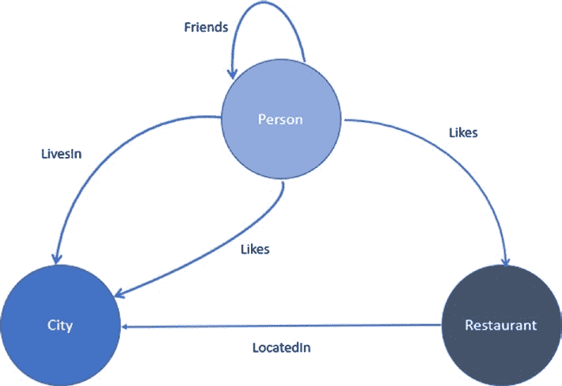

***图 4-3.  **一个图数据模型*

设计出 SQL Server 表结构以便在此模型上插入数据和进行查询是可行的，但对于 T-SQL 语言来说并不自然。

SQL Server 现在为 T-SQL 语言提供了扩展，使得将模型映射到表并自然地从数据中找到信息的 `匹配项` 成为可能。

基于这个模型，我可以构建定义 `节点` 和 `边` 的新表。在上图中，圆圈代表节点，它们之间的关系就是边。

以下是示例 T-SQL 语法，用于创建这些表（参见示例脚本 `graphtables.sql`）：

```sql
-- 创建一个图演示数据库
DROP DATABASE IF EXISTS graphdemo
GO
```


# 第四章 构建应用程序与高级 T-SQL

##### 原生评分

执行以下 T-SQL 语句来创建并使用数据库：

```sql
CREATE DATABASE graphdemo;
GO

USE graphdemo;
GO
```

### 创建节点和边表

-- 创建节点（NODE）表

```sql
CREATE TABLE Person (
    ID INTEGER PRIMARY KEY,
    name VARCHAR(100)
) AS NODE;

CREATE TABLE Restaurant (
    ID INTEGER NOT NULL,
    name VARCHAR(100),
    city VARCHAR(100)
) AS NODE;

CREATE TABLE City (
    ID INTEGER PRIMARY KEY,
    name VARCHAR(100),
    stateName VARCHAR(100)
) AS NODE;
```

-- 创建边（EDGE）表。

```sql
CREATE TABLE likes (rating INTEGER) AS EDGE;
CREATE TABLE friendOf AS EDGE;
CREATE TABLE livesIn AS EDGE;
CREATE TABLE locatedIn AS EDGE;
GO
```

现在，我可以使用特殊的 T-SQL 语法在向边表插入数据时引用节点。请参阅示例脚本`graphinsert.sql`以了解如何使用此语法：

```sql
USE graphdemo
GO

INSERT INTO Person VALUES (1,'John');
GO

INSERT INTO Restaurant VALUES (1, 'WeServeBigSteaks', 'Fort Worth')
GO

INSERT INTO likes VALUES (
    (SELECT $node_id FROM Person WHERE id = 1),
    (SELECT $node_id FROM Restaurant WHERE id = 1),
    9
);
GO
```

一旦我插入了所有数据，我就可以使用如下 T-SQL 查询语法来找出 John 喜欢的餐馆或他的朋友喜欢的餐馆。我已将这些语句放在示例脚本`graphquery.sql`中：

```sql
USE graphdemo
GO

-- 查找 John 喜欢的餐馆
SELECT Restaurant.name
FROM Person, likes, Restaurant
WHERE MATCH (Person-(likes)->Restaurant)
AND Person.name = 'John';
GO

-- 查找 John 的朋友喜欢的餐馆
SELECT Restaurant.name
FROM Person person1, Person person2, likes, friendOf, Restaurant
WHERE MATCH(person1-(friendOf)->person2-(likes)->Restaurant)
AND person1.name='John';
GO
```

第二个查询在您完成完整的示例演示之前不会找到数据，该演示可以在 [`docs.microsoft.com/sql/relational-databases/graphs/sql-graph-sample`](https://docs.microsoft.com/sql/relational-databases/graphs/sql-graph-sample) 找到。

在 SQL Server 2016 中，微软在数据库社区和行业中做了一件不可思议的事情。我们不仅创建了将数据科学和机器学习与 SQL Server 集成的策略，还将机器学习引入到了 SQL Server 内部。

在 SQL Server 2016 中，我们构建了一个架构，允许 R 脚本在与数据相同的 SQL Server 上共同定位运行，但该脚本与 SQL Server 进程是隔离的。此外，R 脚本是通过一个名为`sp_execute_external_script`的 T-SQL 存储过程执行的。数据科学家不再需要将大量数据拉取到可能已过时或不安全的工作站上。数据科学模型就存在于 SQL Server 内部。在生产环境中的性能提升是惊人的。一个展示其可能性的好例子是微软实现每秒 100 万次预测的工作：[`blogs.technet.microsoft.com/dataplatforminsider/2016/10/11/1000000-predictions-per-second`](https://blogs.technet.microsoft.com/dataplatforminsider/2016/10/11/1000000-predictions-per-second)。

在 SQL Server 2017 中，我们通过支持 Python 引入了同类型的机器学习支持。

问题是，截至 CU4 版本，Linux 上的 SQL Server 2017 不支持此模型。幸运的是，SQL Server 2017 中发布了另一个相关功能，该功能在 Windows 和 Linux 版本上均适用，因为它内置于核心数据库引擎中（请记住，核心数据库引擎在 Windows 和 Linux 上是相同的）。此功能称为原生评分（Native Scoring）。原生评分通过另一个名为`PREDICT`的 T-SQL 函数公开。

以下是`PREDICT`语法的示例（如果不遵循以下示例教程，此代码将无法执行）：

```sql
DECLARE @model VARBINARY(MAX) = (SELECT TOP(1) native_model FROM dbo.
```


# 第四章 构建应用程序与高级 T-SQL

#### 本章小结

在本章中，你学习了如何构建一个示例 node.js 应用程序来访问数据库。此外，你还学习了其他 T-SQL 功能，以增强你的数据库或应用程序。最后，你了解了 SQL Server 2016 和 2017 中引入的新功能，这些功能可以进一步增强你的数据库和应用程序。在下一章中，我将向你展示一个完整的工具列表，让你能够进一步探索 SQL Server 的功能，并管理你的 SQL Server 数据库和安装。掌握这些工具知识非常重要，因为本书的剩余章节将全程使用这些工具。

# 第五章 SQL Server 工具

SQL Server 拥有为数据专业人员提供所需工具的悠久传统。工具赋予任何人使用 SQL Server 开发、交互、优化、管理和排除应用程序及查询故障的能力。SQL Server 的工具涵盖范围远不止于程序或实用程序。SQL Server 内置了一套丰富的功能，我将在本章中作为工具主题的一部分进行讨论。

所有 SQL Server 工具都有一个共同点。它们使用或通过 T-SQL 语言提供接口。作为独立程序的工具都知道如何通过使用 TDS 协议的驱动程序或提供程序来连接并执行 T-SQL 查询。在第 2、3 和 4 章中，我向你介绍了两种与 SQL Server 交互的工具：`sqlcmd` 和 Visual Studio Code 的 mssql 扩展。

在本章中，我将向你展示用于连接、运行查询和管理 SQL Server 各个方面的图形化和命令行工具。我还将向你介绍 SQL Server 引擎的内置功能，这些功能提供了对元数据、执行、性能、资源和跟踪的洞察。我还会展示其他功能，允许你更改 SQL Server、数据库和查询的配置，以影响行为或提供更多洞察。

在本章探索过程中，一个关键点是，现有在 Windows 计算机上运行的工具几乎无需改动即可连接并与 Linux 上的 SQL Server 交互。如果你是 Windows 用户，可以继续使用像 SQL Server Management Studio (`SSMS`) 这样的工具。但如果你是 macOS 或 Linux 用户，你会喜欢我们提供跨平台、开源工具的新策略。我将在本章中涵盖所有这些内容。本章最后，我将讨论使用 `SSIS` 开发、构建和执行 ETL 包的工具。

SQL Server 提供了其他特定于安全或高可用性等功能的工具，例如...

```sql
rental_models WHERE model_name = 'linear_model' AND lang = 'Python');

SELECT d.*, p.* FROM PREDICT(MODEL = @model, DATA = dbo.rental_data AS d)

WITH(RentalCount_Pred float) AS p;

GO
```

为了完全理解此语法，你需要完整了解 Windows 上 SQL Server 的 Python 预测模型教程，网址为 https://microsoft.github.io/sql-ml-tutorials/python/rentalprediction，或者查看我们文档中使用名为 `iris` 的已知数据集的示例，网址为 https://docs.microsoft.com/sql/advanced-analytics/r/how-to-do-realtime-scoring。

其概念是，许多数据科学家在其工作站上使用测试数据执行一个称为构建 `trained model`（训练模型）的过程。T-SQL 的 `PREDICT` 函数可以将训练模型作为输入，并执行构建在数据库引擎内部的机器学习代码来 `run`（运行）该训练模型。与使用 R 或 Python 通过 `sp_execute_external_script` 运行模型相比，原生评分在性能上具有巨大的提升优势。


# 第 5 章 SQL Server 工具

本章旨在通过一些示例向你介绍这些工具的功能。现在向你展示这些工具，将为你阅读本书后续章节时，使用它们探索其他特性和功能做好准备。我将在本章中重点标出我提供的示例脚本文件名称，这些文件是本书的配套资源。

© Bob Ward 2018

B. Ward, *Pro SQL Server on Linux*, `doi.org/10.1007/978-1-4842-4128-8_5`

可用性，我将在第 7 章和第 8 章中更详细地讨论这些内容。

#### 命令行工具

从命令行运行的工具简单但至关重要。我建议你了解`SQL Server`附带的命令行工具，因为它们提供了与`SQL Server`交互的最简单、最轻量级的方法。

**提示** 具有图形用户界面的工具，如`SSMS`，提供了强大的功能。但`SSMS`比`sqlcmd`这样的工具具有更多的活动部件。如果有人说他们在`Windows`计算机上使用`SSMS`连接到`Linux`上的`SQL Server`时遇到问题，我会问他们是否可以在`Linux`服务器本地使用`sqlcmd`进行连接。这有助于缩小图形工具本身的问题与网络问题之间的范围。

Microsoft 对命令行工具的策略是确保它们在常见的客户端平台（包括`Windows`、`Linux`和`macOS`）上可用，并且在某些情况下将其作为 GitHub 上的开源项目。

在本节中，我将讨论以下工具：

- `sqlcmd`（我在第 2 章展示了如何安装和使用此工具的一些基础知识。）
- `bcp`
- `mssql-cli`
- `mssql-scripter`
- `sqlservr` 命令行选项

本节未列出的一个工具叫做`DBFS`，将在后面关于引擎内置工具的章节中介绍。`SQL Server Linux`专家 Anthony Nocentino 撰写的一篇关于`DBFS`的精彩博客文章可以在[www.centinosystems.com/blog/sql/dbfs-command-line-access-to-sql-server-dmvs](http://www.centinosystems.com/blog/sql/dbfs-command-line-access-to-sql-server-dmvs)找到。要跟踪命令行工具的所有未来进展，请参考我们的文档：[`docs.microsoft.com/en-us/sql/tools/overview-sql-tools`](https://docs.microsoft.com/en-us/sql/tools/overview-sql-tools)。

## sqlcmd

`SQL Server`一直提供一个简单的命令行工具，用于向数据库引擎提交`T-SQL`查询。这些工具的演变始于`Windows`平台上的`isql.exe`和`osql.exe`，但近年来我们发布了一个名为`sqlcmd.exe`的工具。该工具针对`Windows`、`Linux`和`macOS`进行原生编译，可用作连接到任何`Windows`或`Linux`上的`SQL Server`的客户端（例如，你可以使用`Linux`客户端上的`sqlcmd`连接到`Windows`上的`SQL Server`）。在所有平台上，`sqlcmd`都使用该操作系统原生的`Microsoft ODBC driver for SQL Server`。

在`Windows`上安装`SQL Server`时，默认会安装`sqlcmd`。对于`Linux`上的`SQL Server`，你必须安装一个单独的名为`mssql-tools`的包（依赖于`ODBC for Linux`），具体文档见[`docs.microsoft.com/sql/linux/sql-server-linux-setup-tools`](https://docs.microsoft.com/sql/linux/sql-server-linux-setup-tools)。对于`macOS`，我们使用[Homebrew](https://brew.sh)来安装工具和`ODBC`驱动程序，具体文档见[`docs.microsoft.com/sql/linux/sql-server-linux-setup-tools#macos`](https://docs.microsoft.com/sql/linux/sql-server-linux-setup-tools#macos)。

`sqlcmd`提供两种执行模式：*交互式*或*脚本执行*。任一模式


# SQL Server 工具：sqlcmd

## sqlcmd 基本介绍

`sqlcmd` 允许您连接到任何 SQL Server（包括 Linux 上的 SQL Server）并运行 T-SQL 查询批处理。

像任何优秀的命令行工具一样，它有许多命令行*开关*或选项。

如果在 `sqlcmd` 中执行 T-SQL `SELECT` 语句，结果可以显示在控制台（`stdout`）中，也可以重定向到文件（使用命令行选项或重定向 `stdout` 的结果）。

## sqlcmd 编辑器与基本执行

以下是在本地 Linux 服务器上执行基本 `sqlcmd` 的示例（因此我不必使用 `-S` 参数指定 `ServerName`）：

```
sqlcmd -Usqllinux
```

图 5-1 显示了结果。请注意 `sqlcmd` 工具内提供的提示符。这被称为 *sqlcmd 编辑器*。

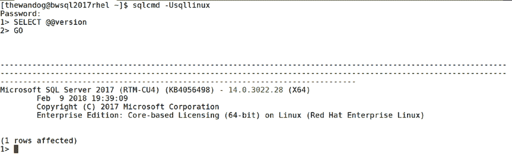

**图 5-1. 在 Linux 上使用 sqlcmd 编辑器执行查询**

> **注意** 我在第 3 章提到过，`Go` 命令不是 T-SQL 命令。相反，它是像 `sqlcmd` 这样的工具识别的特殊命令，用于执行之前在编辑器中输入的 SQL 命令批处理。文本 `Go` 不会发送到 SQL Server。

在任何 `sqlcmd` 行编辑器提示符下，您可以输入任何有效的 T-SQL 批处理或编辑器识别的命令（例如 `GO`）。`sqlcmd` 编辑器命令的完整列表在我们的文档中列出：[`docs.microsoft.com/sql/tools/sqlcmd-utility#sqlcmd-commands`](https://docs.microsoft.com/sql/tools/sqlcmd-utility#sqlcmd-commands)，或者在 `sqlcmd` 编辑器提示符下输入 `:HELP`。

例如，输入 `EXIT` 或 `QUIT` 以离开编辑器。`EXIT` 有一个方便的用途，您可以传递一个查询给 `EXIT(<query>)`，查询的结果将返回给客户端，这通常是操作系统 shell 的一个脚本。

`GO` 命令有一个可选参数 `GO (<n>)`，表示将 T-SQL 批处理运行 `<n>` 次，一次接一次。

## 使用脚本执行

在上一章中，我创建了几个扩展名为 `.sql` 的脚本（不要求使用任何文件扩展名，但当您使用 `.sql` 时，几乎所有人都明白其含义），并在 Visual Studio Code 编辑器中执行了它们。我本可以使用 `sqlcmd` 的 `-i` 命令行选项来执行这些脚本中的任何一个。任何有效的 T-SQL 或 `sqlcmd` 编辑器命令都可以放入脚本中。

我在示例脚本 `getsqlversion.sql` 中提供了以下 T-SQL 命令及语句：

```
SELECT @@version
GO
```

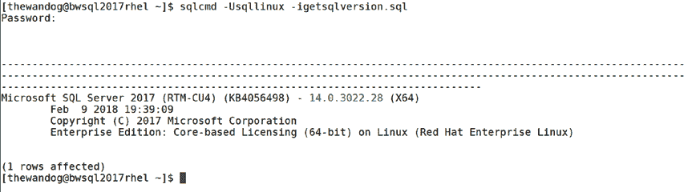

> **提示** `@@version` 是一个系统提供的变量，用于打印 SQL Server 的版本、版本和操作系统详细信息。我认为这是针对 SQL Server 运行的最基本查询，以确保您可以连接并运行查询。您可以在我们的文档中找到由 SQL Server 引擎支持的完整系统变量列表：[`docs.microsoft.com/en-us/sql/integration-services/system-variables`](https://docs.microsoft.com/en-us/sql/integration-services/system-variables)。

您可以使用以下命令从 bash shell 执行此脚本：

```
sqlcmd -Usqllinux -igetsqlversion.sql
```

图 5-2 显示了在 Linux 上使用 `sqlcmd` 执行此脚本的结果。

**图 5-2. 使用脚本与 sqlcmd**

## 使用 -Q 选项执行

执行批处理的另一个选项是使用 `-Q` 命令行选项，在命令行中直接执行您指定的批处理，而不是在文件中。这是我创建在示例 shell 脚本 `sqlcmdquery.sh` 中的一个示例（注意：在 Linux shell 中执行此操作之前，请确保运行 `chmod u+x sqlcmdquery.sh`）：

```
sqlcmd -Usa -Q"SELECT @@version"
```

> **注意** `-q` 选项与 `-Q` 执行相同的操作，但不会退出 `sqlcmd`。

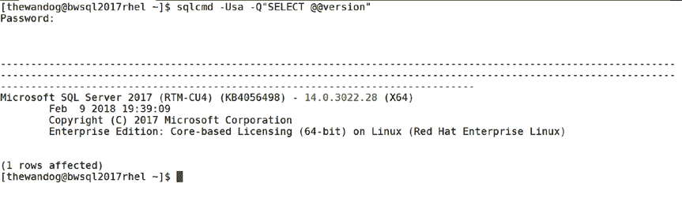

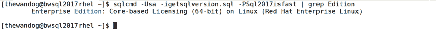

图 5-3 展示了使用 `-Q` 与 `sqlcmd` 的示例。

**图 5-3. 使用 -Q 选项执行查询**


与使用 `-i` 的脚本类似，任何有效的 T-SQL 批处理和 `sqlcmd` 编辑器命令都可以与 `-Q` 或 `-q` 一起使用。

如果您使用 `-i` 运行带有脚本的 `sqlcmd`，则所有命令的结果都会定向到 `stdout`。这允许您运行 `sqlcmd` 脚本并将结果通过管道传输到其他程序（如 `grep`）。以下是一个使用 `sqlcmd` 和 `grep` 查找 SQL Server 版本的示例（您可以使用示例脚本 `getsqledition.sh` 来执行此操作，或根据需要修改它）：

```
sqlcmd -Usa -igetsqlversion.sql -PSql2017isfast | grep Edition
```

图 5-4 展示了使用 `sqlcmd` 和 `grep` 执行脚本来查找 SQL Server 版本的结果。

**图 5-4. 结合使用 `sqlcmd` 与 `grep`**

`sqlcmd` 还提供了一个 `-o` 命令行选项，用于将所有结果和错误写入特定文件。

## 第 5 章 SQL Server 工具

**提示**：一个不错的选项（感谢 Rathijit Sen 提供的此提示）是 `-p` 选项，它会打印出使用 `sqlcmd` 执行的查询的性能统计信息。这包括 SQL Server 执行查询的总时间以及客户端处理它们的时间。结合本章稍后将讨论的 `SET STATISTICS TIME`，这可以成为一个很好的选项，用于确定 SQL Server 执行查询的速度以及客户端通过网络处理结果的速度。

`sqlcmd` 的完整文档（包括所有命令行选项）可在 [`docs.microsoft.com/sql/tools/sqlcmd-utility`](https://docs.microsoft.com/sql/tools/sqlcmd-utility) 找到。

## bcp

我在本书第 3 章演示了如何使用 T-SQL `INSERT` 语句将数据插入 SQL Server。我展示了如何插入一行，或使用 `INSERT..SELECT` 或 `SELECT..INTO` 插入多行。

您可能需要基于存储在 SQL Server 外部的文件中的数据，插入或*导入*大量行。或者您可能希望将数据从 SQL Server *导出*到文件中。大容量复制程序 (`bcp`) 就是为这类任务设计的。与 `sqlcmd` 类似，`bcp` 已构建为可在 Windows、Linux 和 macOS 上原生运行，并在使用 `mssql-tools` 软件包安装包含 `sqlcmd` 的工具时一并安装。

`bcp` 依赖于 SQL Server ODBC 驱动程序扩展来将数据大容量复制进、出 SQL Server（请参阅我们的文档：[`docs.microsoft.com/sql/relational-databases/native-client-odbc-extensions-bulk-copy-functions/sql-server-driver-extensions-bulk-copy-functions`](https://docs.microsoft.com/sql/relational-databases/native-client-odbc-extensions-bulk-copy-functions/sql-server-driver-extensions-bulk-copy-functions)）。因此，您也可以编写一个提供自己大容量复制功能的应用程序。

对于导入，`bcp` 工具将读取您指定的文件并将数据流传送到 SQL Server，以应用到目标表。对于导出，`bcp` 将从表中复制出数据流并将数据写入文件。

使用 `bcp` 的基本方法是从能连接到 SQL Server 的计算机（无论是远程计算机还是服务器本身）运行此命令。您指定如何连接到 SQL Server、要导入到或从中导出的数据库和表，以及用于导入或导出的输入或输出文件的命令行选项。输入和输出文件可以是所有类型的格式，包括能够对文件内的数据类型进行规定。

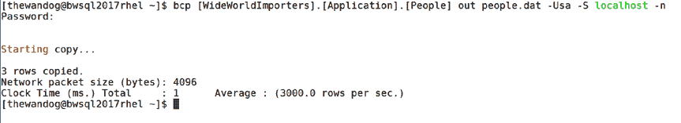

## 第 5 章 SQL Server 工具

让我们使用一个简单的例子，针对文件中格式化的文本数据，使用第 3 章中的 `[Application].[People]` 表作为示例。这些示例假设您已经使用第 3 章的脚本创建了 `WideWorldImporters` 数据库和 `People` 表。


# 第 5 章 SQL Server 工具

使用来自第 3 章的 **insertpeople.sql** 脚本中的命令插入数据后，由于`People`表中已有数据，让我们使用`bcp`以*本机*格式将数据导出到文件。（本机格式将根据表中的数据类型以二进制形式写出数据。还有命令行选项可以将数据写入文本格式）。以下是在示例脚本 **bcpout.sh** 中看到的导出表的基本语法（别忘了运行`chmod u+x bcpout.sh`来执行脚本）：

```
bcp [WideWorldImporters].[Application].[People] out people.dat -Usa -S localhost -n
```

图 5-5 展示了在 Linux 服务器上运行此`bcp`命令的结果。

***图 5-5. 在 Linux 服务器上使用 bcp 导出数据***

你可以从`People`表中删除数据，然后将本机格式化的文件导入到 SQL Server 中。但在执行`DELETE`语句之前，你需要先禁用这些表上的所有约束。以下是我从名为 **deletepeoplebeforeimport.sql** 的示例脚本中执行的一组 T-SQL 命令示例。此脚本适用于第 3 章中的 WideWorldImporters 示例脚本。你不能将其用于完整的 WideWorldImporters 示例备份。

**注意**：我禁用了包括来自`Customers`表的外键约束。如果此表中存在数据，则不建议禁用外键约束，因为在插入新数据时可能违反逻辑引用完整性。此外，除非使用了特定的命令行选项，否则`bcp`程序本身会忽略约束。我在此示例中禁用了约束，以便可以删除现有行。

```
USE [WideWorldImporters]
GO
ALTER TABLE [Sales].[Customers] NOCHECK CONSTRAINT ALL
GO
ALTER TABLE [Application].[People] NOCHECK CONSTRAINT ALL
GO
DELETE FROM [Application].[People]
GO
```

现在你可以使用`bcp`从前面导出示例创建的`people.dat`文件导入数据（我提供了一个名为 **bcpin.sh** 的示例 bash shell 脚本）：

```
bcp [WideWorldImporters].[Application].[People] in people.dat -Usa -S localhost -n
```

`bcp`具有丰富的命令行选项，适用于导入和导出场景。这些选项包括但不限于格式文件、导入/导出到文本文件、列和行分隔符，以及用于提示和行批大小的性能选项。有关完整的命令行选项和示例列表，请参阅文档：[`docs.microsoft.com/sql/tools/bcp-utility`](https://docs.microsoft.com/sql/tools/bcp-utility)

如果你有存储空间并且愿意将导入文件复制到与 SQL Server 相同的计算机上（或网络上 SQL Server 可访问的文件共享），则可以使用 T-SQL 的`BULK INSERT`来执行高速导入。此命令可以显著提高导入性能，因为 SQL Server 引擎将直接读取文件并将数据导入到目标表中。有关`BULK INSERT`的更多信息，请参阅文档：[`docs.microsoft.com/sql/t-sql/statements/bulk-insert-transact-sql`](https://docs.microsoft.com/sql/t-sql/statements/bulk-insert-transact-sql)

**注意**：在本书撰写时，SQL Server on Linux 上的`BULK INSERT`命令需要`sysadmin`权限。

## mssql-cli

随着 SQL Server on Linux 的发布，微软为用于 SQL Server 的工具推出了一项新的跨平台（操作系统）策略，这些工具通过一个开源项目制作。其中一个工具的例子就是**mssql-cli**。`mssql-cli`是一个命令行工具，类似于`sqlcmd`，用于针对 SQL Server 执行查询。`mssql-cli`使用 Python 构建，可在运行 Windows、Linux（包括许多发行版）和 macOS 操作系统的计算机上使用。


要安装 `mssql-cli`，请参阅安装指南 [`github.com/dbcli/mssql-cli/blob/master/README.rst#get-mssql-cli`](https://github.com/dbcli/mssql-cli/blob/master/README.rst#get-mssql-cli)。

我们在构建 `mssql-cli` 时，创建了一个 GitHub 项目以接受开源贡献（[`github.com/dbcli/mssql-cli/`](https://github.com/dbcli/mssql-cli/)），并将其注册为 `dbcli` 倡议的一部分。`dbcli` 是一个致力于为数据库打造更好命令行工具的开源项目社区。

虽然 `sqlcmd` 是一个出色的、简单的 SQL Server 命令行工具，但 `mssql-cli` 相较于 `sqlcmd` 提供了一些优势，包括：

*   T-SQL 智能感知
*   语法高亮
*   查询结果的垂直格式
*   多行编辑器
*   用于自定义 `mssql-cli` 的配置文件
*   环境变量支持

`mssql-cli` 与其他 SQL Server 工具的一个区别在于，它不使用 `GO` 关键字来分隔 T-SQL 批处理。默认情况下，`mssql-cli` 编辑器允许你一次执行一条 T-SQL 命令。但是，你可以使用多行编辑器来创建多语句 T-SQL 批处理，然后使用 `";"` 字符来结束该批处理。

你可以使用以下命令启动 `mssql-cli`：

```
mssql-cli -Usqllinux
```

图 5-6 展示了在 Linux 上使用 `mssql-cli` 针对我第 3 章创建的 `WideWorldImporters` 示例表运行多语句 T-SQL 批处理的示例。（注意：此查询的结果假设你已经根据前面章节的内容向这些表中填充了数据。）

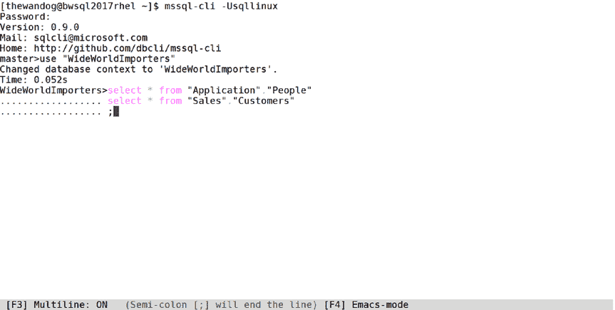

## 第 5 章 SQL Server 工具

**图 5-6.** 在 Linux 上使用 `mssql-cli`

在本书撰写时，配置文件的选项尚未完全记录在案，但你可以查看默认配置文件（名为 `config`），其中包含注释。默认配置文件在 Linux 和 macOS 上安装在 `~/.config/mssqlcli` 目录中（`~` 表示登录用户的主目录），在 Windows 上安装在 `c:\users\<username>\AppData\Local\dbcli\mssqlcli` 目录中。

新工具的设计策略之一是提供功能、外观和体验的一致性。因此，`mssql-cli`、`mssql` Visual Studio Code 扩展和 SQL Operations Studio 都使用一个名为 SQL Tools Service 的公共组件来进行连接管理、语言支持、查询执行和结果集处理。SQL Tools Service 是一个开源项目。你可以在 [`github.com/Microsoft/sqltoolsservice`](https://github.com/Microsoft/sqltoolsservice) 找到关于 SQL Tools Service 的更多信息。

`mssql-cli` 于 2017 年 12 月发布预览版。与 `sqlcmd` 相比，填补功能差距以及进行其他改进还有一些工作要做。例如，目前没有办法传入输入文件或查询以进行脚本编写，或者将结果通过管道传输到 `stdout` 或文件。要查看 `mssql-cli` 的路线图，请参阅此文档：[`github.com/dbcli/mssql-cli/blob/master/doc/roadmap.md`](https://github.com/dbcli/mssql-cli/blob/master/doc/roadmap.md)。

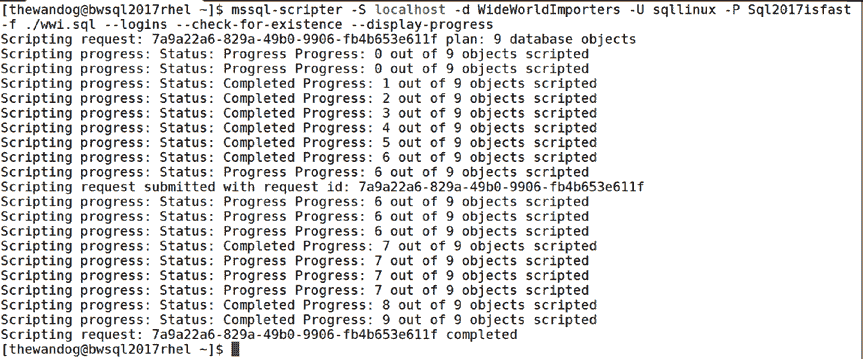

## 第 5 章 SQL Server 工具

### mssql-scripter

开始使用数据库后，你可能想要做的一个常见任务是*脚本化*一个数据库。我所说的这个术语的意思是，你可能希望获取一个现有数据库，并输出用于创建该数据库以及其中所有对象的 T-SQL 命令，而无需执行备份和还原。通常，此输出会写入一个文件，该文件现在是一个 T-SQL 脚本，可用于创建数据库及所有对象。非常流行的工具 SSMS 有一个选项，可以从现有数据库创建对象的脚本。

由于 SSMS 仅在 Windows 上运行，我们构建了一个用于脚本编写的跨平台开源工具，名为 `mssql-scripter`。与 `mssql-cli` 一样，`mssql-scripter` 是用 Python 构建的。


在以下网址查找适用于您的操作系统（Windows、Linux 或 macOS）的安装指南：

[`github.com/Microsoft/mssql-scripter/blob/dev/doc/installation_guide.md`](https://github.com/Microsoft/mssql-scripter/blob/dev/doc/installation_guide.md)。

`mssql-scripter` 提供了丰富的命令行选项，可以以多种方式创建脚本。

以下是一个针对第 3 章中的 WideWorldImporters 数据库执行 `mssql-scripter` 的示例：

```
mssql-scripter -S localhost -d WideWorldImporters -U sqllinux -P Sql2017isfast -f ./wwi.sql –-logins –-check-for-existence –-display-progress
```

图 5-7 展示了 `mssql-scripter` 的一个输出示例，该输出用于创建我在第 3 章中创建的 WideWorldImporters 数据库及其所有对象的 T-SQL 脚本。

请注意我所使用的一些选项：用于创建登录名、仅在对象不存在时创建对象，以及在执行期间显示进度。

***图 5-7. 使用 mssql-scripter 为 WideWorldImporters 数据库中的所有对象创建 T-SQL 脚本***

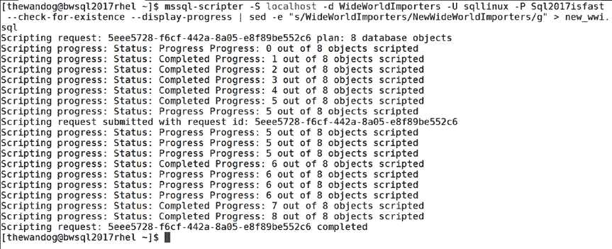

**注意** 使用此方法将不允许您先创建一个名为 `sqllinux` 的登录名，然后再使用 `sqllinux` 登录名来创建数据库和对象。您需要创建两个不同的脚本：(1) 一个用于以 `sa` 身份执行来创建 `sqllinux` 登录名的脚本，以及 (2) 一个用于以 `sqllinux` 帐户登录来创建数据库和对象的脚本。

现在您可以获取 `wwi.sql` 文件，并使用像 `sqlcmd` 这样的工具（通过 `-i` 选项）将其作为脚本执行。

默认情况下，`mssql-scripter` 将其输出写入标准输出。因此，您可以将 `mssql-scripter` 的结果通过管道传输到其他工具。Linux 上的 `sed` 程序提供了“搜索和替换”的功能。图 5-8 展示了一个使用 `mssql-scripter` 和 `sed` 来创建 WideWorldImporters 数据库脚本，但将数据库名称更改为 NewWideWorldImporters 的示例。

执行此命令以查看结果：

```
mssql-scripter -S localhost -d WideWorldImporters -U sqllinux -P Sql2017isfast --check-for-existence --display-progress | sed -e "s/WideWorldImporters/NewWideWorldImporters/g" > new_wwi.sql
```

***图 5-8. 将 sed 与 mssql-scripter 结合使用以创建具有新数据库名称的脚本***

要获取 `mssql-scripter` 命令行选项的完整列表，请使用 `--help` 选项或查阅文档（其中也包含一些显著的示例）：[`github.com/Microsoft/mssql-scripter/tree/dev/doc`](https://github.com/Microsoft/mssql-scripter/tree/dev/doc)。

## sqlservr 命令行选项

在第 2 章中，我向您展示了如何在 Linux 上使用 `systemctl` 程序启动和停止 SQL Server。也可以通过执行 `sqlservr` 程序直接从命令行启动 SQL Server。在正常情况下，您不应直接从命令行运行 `sqlservr`，但以下是一些可能的原因：

- SQL Server 无法通过 `systemctl` 启动（注意：如果 SQL Server 无法通过 `systemctl` 启动，那么从命令行启动也很可能无法工作，但在某些情况下这可能有所帮助）。
- 您需要使用一项功能来启动 SQL Server，而该功能无法通过 `mssql-conf` 脚本进行配置。我将在第 9 章向您展示其中一些选项。

要从命令行启动 SQL Server，您需要使用 `sudo` 命令在 `mssql` Linux 帐户的上下文中运行 `sqlservr`（您必须首先停止 SQL Server 才能运行此命令）：

```
sudo -u mssql /opt/mssql/bin/sqlservr
```

SQL Server 将启动，并将 ERRORLOG 的输出转储到标准输出，默认情况下会写入控制台。此时，如果您需要关闭 SQL Server，您


无法使用`systemctl`程序（`systemctl stop mssql-server`执行完成且无报错）。

您需要使用以下两种方法之一来关闭 SQL Server：

1.  连接到 SQL Server 并执行 T-SQL `SHUTDOWN` 命令。
2.  在执行`sqlservr`的控制台中，键入`<ctrl>+<c>`。

图 5-9 展示了使用`<ctrl>+<c>`关闭 SQL Server 后的控制台示例。

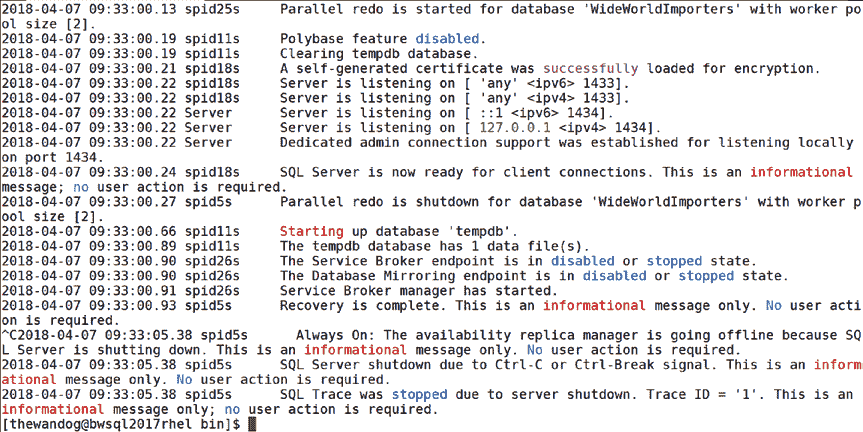

## 第 5 章 SQL Server 工具

### 图 5-9. 从控制台关闭 sqlservr

#### SQL Operations Studio

虽然 SSMS 是一款极其流行的工具，但它仅适用于 Windows，因此 Linux 和 macOS 用户需要通过虚拟化程序来安装它。正如本章前面在描述`mssql-cli`时提到的，我们尽可能构建能在多个操作系统上运行的新工具，并使其成为开源项目的一部分。

对于需要图形界面的工具，Visual Studio Code 项目提供了一个很好的平台来构建跨平台系统。结合我们为`SQL Tools Service`所做的工作，一个名为`SQL Operations Studio`的新工具应运而生，它 fork 自 Visual Studio Code 开源项目。

`SQL Operations Studio` 于 2017 年 11 月作为预览版工具发布，现在继续通过 GitHub 仓库 [`github.com/Microsoft/sqlopsstudio`](https://github.com/Microsoft/sqlopsstudio) 接收来自 Microsoft 和社区的月度更新。秉承 GitHub 的风格，私人构建版本会更频繁地提供，整个源代码可供任何人查看或 fork，所有问题都通过 GitHub [`github.com/Microsoft/sqlopsstudio/issues`](https://github.com/Microsoft/sqlopsstudio/issues) 提交。

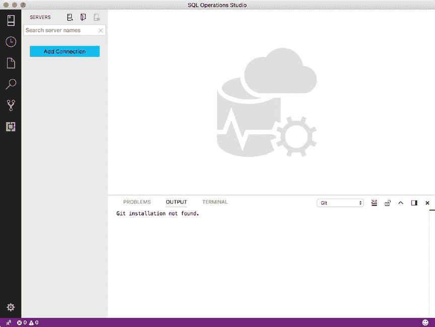

## 第 5 章 SQL Server 工具

##### 安装

我们遵循了每种操作系统原生的安装体验。Windows 提供了`.zip`文件或完整的 Windows 安装程序体验。macOS 用户获得一个 zip 文件，它适用于 macOS 的“下载”体验。Linux 用户可以下载 Debian 或 RPM 包，或者一个`tar.gz`文件。

图 5-10 展示了在 macOS 上安装后的`SQL Operations Studio`。

### 图 5-10. macOS 上的 SQL Operations Studio

`SQL Operations Studio` 提供以下独特功能：

-   一个内置智能感知（Intellisense）的 T-SQL 代码编辑器，用于执行查询。
-   智能 T-SQL 代码“片段”。
-   通过小部件可自定义的仪表板。
-   用于扩展内置基础功能的扩展。
-   集成终端（无需离开工具即可运行 shell 命令）。

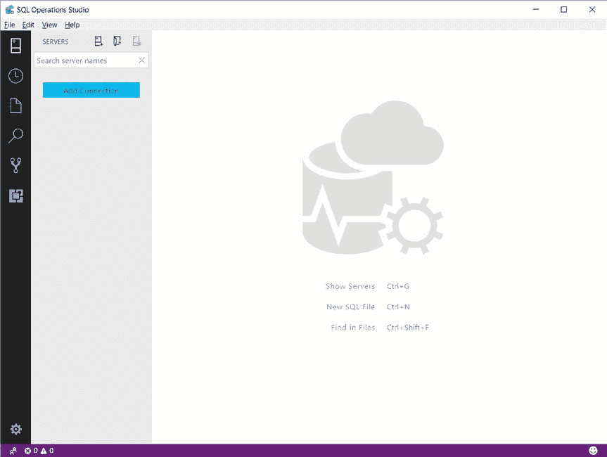

## 第 5 章 SQL Server 工具

在我的 Windows 笔记本电脑上，我已经安装了`SQL Operations Studio`。为了开始使用这个工具，我想做两件事：(1) 添加一个到 Linux 上 SQL Server 的连接，以及 (2) 更改编辑器的背景颜色和默认字体设置。

图 5-11 显示了在我添加到 SQL Server 的连接之前，Windows 上的`SQL Ops Studio`。

### 图 5-11. Windows 上的 SQL Operations Studio

现在，我将选择标有`Add Connection`的蓝色按钮。弹出一个新窗口，要求输入服务器名称、登录名和密码。图 5-12 显示了`Connection profile`窗口。

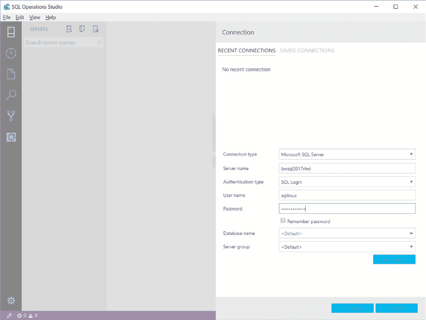

## 第 5 章 SQL Server 工具

### 图 5-12. 使用 SQL Operations Studio 添加连接

我使用了第 3 章示例中创建的 SQL Server Linux 服务器名称 `bwsql2017rhel` 和登录名 `sqllinux`。这个窗口上有一些选项我在本例中不会用到，但您可能会觉得有用：

-   您可以指定要连接到的默认数据库（例如，我可以输入`WideWorldImporters`）。
-   您可以创建`Server Group`的概念，从而将多个 SQL Server 管理并组织为一个单元。
-   可以使用`Remember password`选项，这样您就不必每次连接时都指定密码。
-   `Advanced`按钮提供了额外的选项，包括登录


超时（默认为 15 秒）、可用性组中读取副本的应用程序意向以及加密设置。

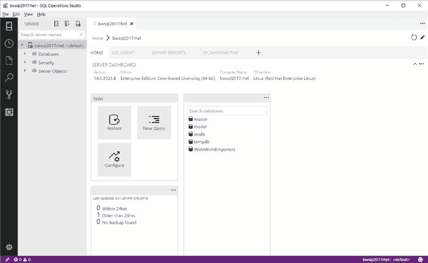

# 第 5 章 SQL Server 工具

连接到 Linux 服务器上的 SQL Server 后，左侧会显示一个用于浏览的窗格，主窗口中则是一个带有扩展的服务器仪表板。图 5-13 展示了连接到我的 Linux SQL Server 后的默认视图。

*图 5-13. 连接到 Linux 上的 SQL Server 后，SQL Operations Studio 中的默认视图*

##### 配置

接下来我要做的是设置一些偏好来自定义工具。我通过选择`File/Preferences/Settings`菜单选项来完成。偏好设置通过一个名为`settings.json`的文件进行自定义。图 5-14 展示了在 SQL Operations Studio 中配置我的偏好的界面。

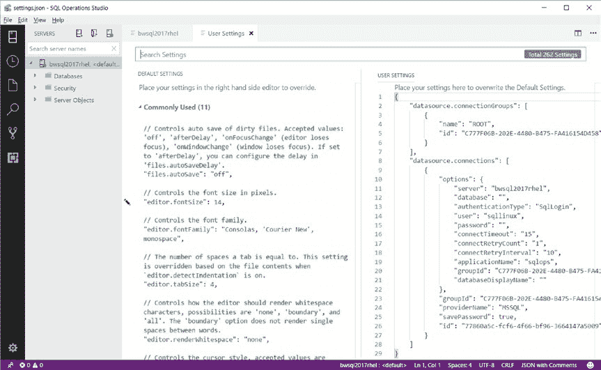

*图 5-14. SQL Operations Studio 用户设置*

左侧窗格显示了所有默认设置。右侧窗格将显示我将包含的、用于覆盖默认值的设置。我想更改的两个设置是将默认背景颜色改为黑色，并将 T-SQL 代码编辑器的默认显示字体改为更大的尺寸。你可以直接编辑用户设置，但 SQL Operations Studio 包含一个可视化的图标，帮助你将默认设置复制到用户设置中并进行更改。图 5-15 在左侧窗格中显示了我如何点击铅笔图标并选择`Edit`来复制编辑器字体大小的设置，以便进行更改。

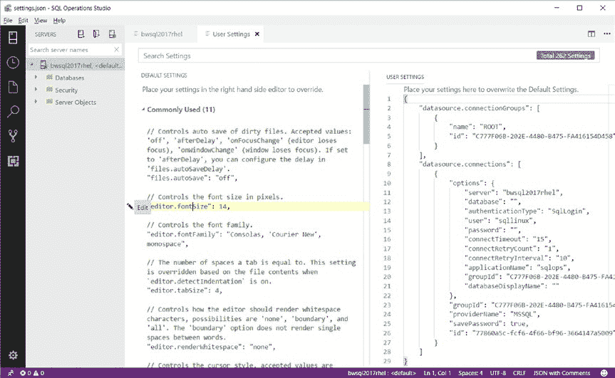

*图 5-15. 在 SQL Operations Studio 中复制默认设置以进行更改*

当我点击`Edit`和`Copy Settings`时，设置将出现在右侧窗格中，我可以更改字体大小的值。然后我将通过从`File`菜单中选择`Save`来保存这些设置。当我保存字体大小时，它会在当前窗口中自动更改（因为字体大小适用于 SQL Operations Studio 中的任何编辑操作）。

编辑器字体大小在默认的左侧窗格中很容易找到，但背景颜色呢？在设置窗口顶部有一个搜索编辑框。我在搜索编辑框中输入了单词`Color`，它向我展示了更改工作台`colorTheme`的选项。图 5-16 展示了这个例子。

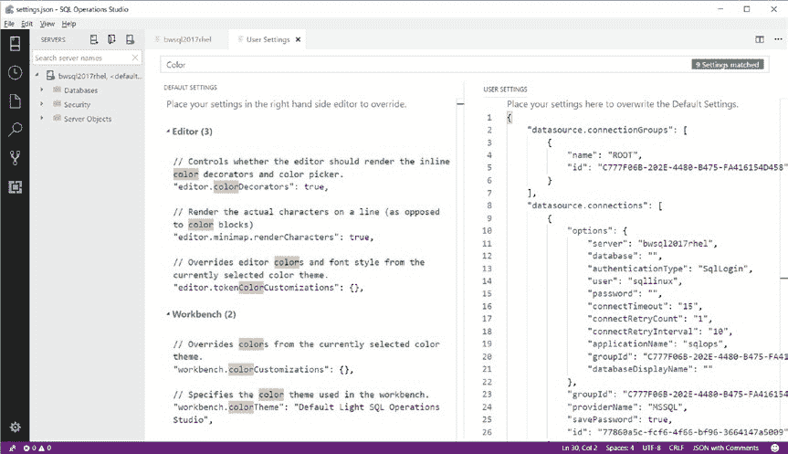

*图 5-16. 在 SQL Operations Studio 中搜索设置*

现在我可以点击`workbench.colorTheme`字段附近的铅笔图标，然后会出现更改主题的选项。我选择了`Default Dark SQL Operations Studio`。颜色立即改变了。图 5-17 显示了我所做的更改出现在用户设置的右侧窗格中。

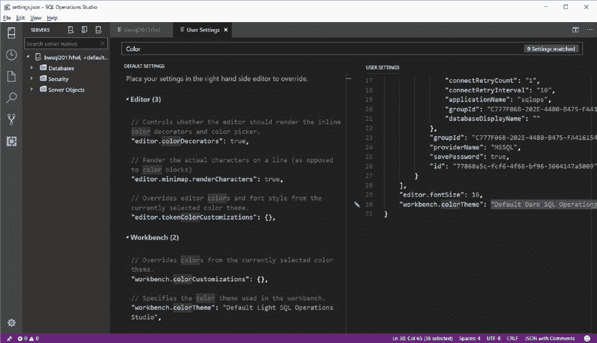

*图 5-17. 应用了新 colorTheme 的 SQL Operations Studio*

我通过`File`菜单中的`Save`选项保存了设置，并关闭了用户设置窗口。

现在我的设置已经按偏好保存好了，让我向你展示 SQL Operations Studio 的一些基本功能。关于该工具的完整演练，我强烈推荐这篇优秀的社区博客文章：[`www.mssqltips.com/sqlservertip/5339/new-sql-operations-studio-installation-and-overview`](https://www.mssqltips.com/sqlservertip/5339/new-sql-operations-studio-installation-and-overview)

##### 对象资源管理器

SSMS 用户熟悉一个称为`Object Explorer`的概念。`Object Explorer`是与 SQL Server 关联的对象的可视化文件夹视图。你可以像浏览典型文件夹一样遍历此视图，通过展开或折叠包含数据库在内的对象的树状视图。图 5-18 显示了我安装环境中的一个例子，其中我展开了资源管理器树中的各种对象。

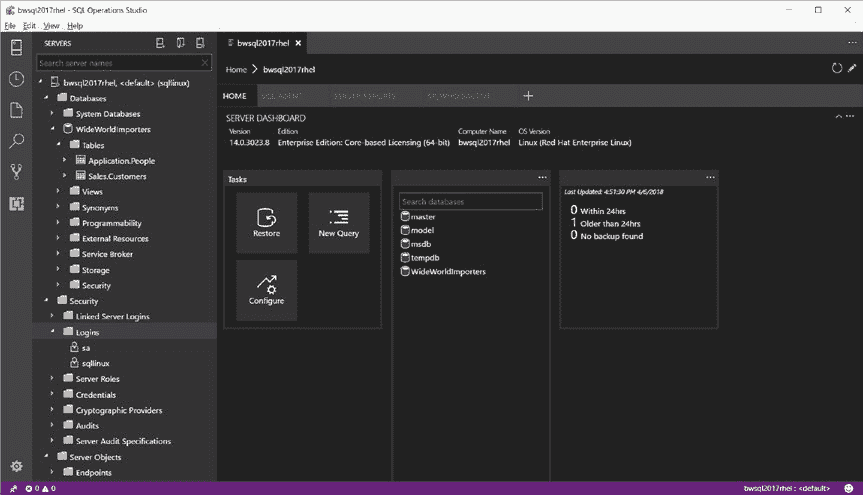


## 第五章 SQL Server 工具

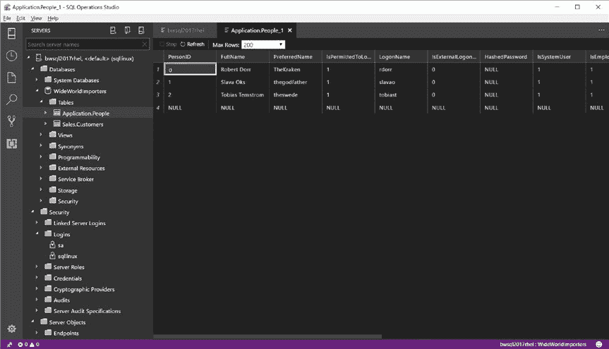

SQL Operations Studio 默认不具备 Windows 用户在 SSMS 中所见的完整 `Object Explorer`（对象资源管理器）功能，但我预计该功能会随着时间推移而不断增强。

除了能够浏览在 SQL Server 实例或数据库中创建的对象外，您还可以右键单击某些对象以使用附加功能。例如，您可以右键单击一个 `Server`（服务器）或 `Database`（数据库）来编写新的 `T-SQL` 查询，或选择 `Manage`（管理）来查看仪表板。您可以右键单击一个 `Table`（表），在网格视图中查看或编辑数据。图 5-19 显示了一个网格，您可以在其中直接编辑示例中第 3 章创建的 `Application.[People]` 表的数据。


### 仪表板、见解与扩展

默认情况下，SQL Operations Studio 有两个仪表板：`Server`（服务器）和 `Database`（数据库）。这些仪表板由名为 `widgets`（部件）的对象填充。当您连接到 SQL Server 时，默认会显示 `Server` 仪表板，其中包含 SQL Server 的信息、常用任务的部件、查找数据库的部件以及关于数据库备份的部件。在图 5-20 中，您可以看到我的 SQL Server 运行在 Red Hat Enterprise Linux 上的 SQL Server 企业版（基于核心许可）。图 5-20 中显示的部件用于任务、数据库列表和数据库备份信息。

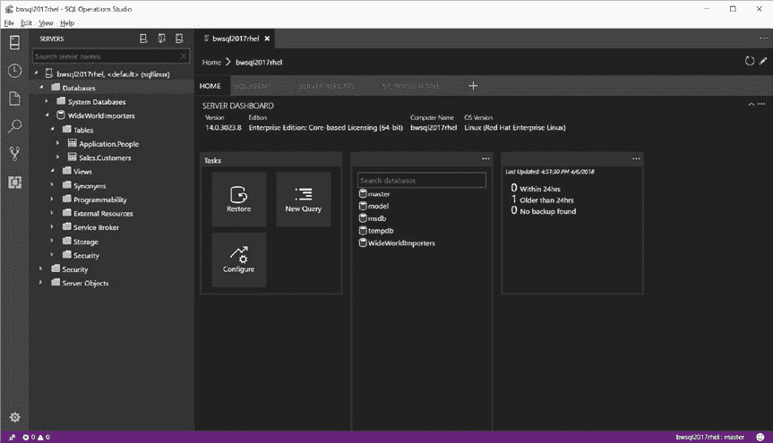

您可以随时通过右键单击服务器名称并选择 `Manage`（管理）来查看 `Server` 仪表板。

您可以通过在 `Object Explorer`（对象资源管理器）树中右键单击某个数据库，或在 `Server` 仪表板的数据库列表上右键单击，然后选择 `Manage`（管理），来查看关于该数据库的类似仪表板。

图 5-21 显示了我在第 3 章创建的示例数据库 `WideWorldImporters` 的仪表板。

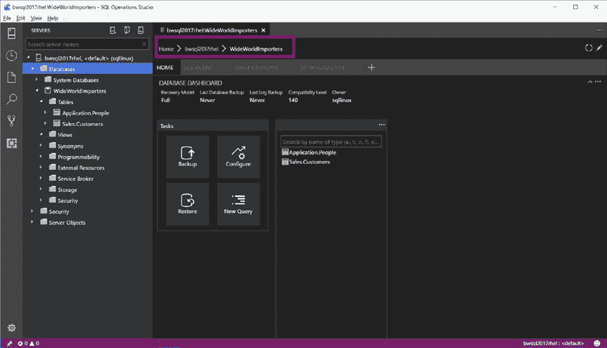

我在图中用红色标出了仪表板的上下文。当您选择一个数据库仪表板时，它是堆叠式的，因此您可以选择服务器名称并返回到 `Server` 仪表板。数据库仪表板显示有关数据库的基本信息，并显示一个任务和表列表部件。我将在本书后面的章节中更详细地描述如何使用 SQL Operations Studio 来备份和还原数据库。

SQL Operations Studio 的一个强大之处在于能够自定义其功能。您可以创建其他部件以显示在服务器或数据库仪表板上。您可以在我们的文档中了解更多关于如何自定义新部件的信息：`https://docs.microsoft.com/sql/sql-operations-studio/tutorial-build-custom-insight-sql-server`。我们提供了两个内置部件，您可以将它们添加到数据库仪表板中，以获取性能和表使用情况信息。

图 5-22 显示了启用这些部件后，`WideWorldImporters` 示例数据库的数据库仪表板。

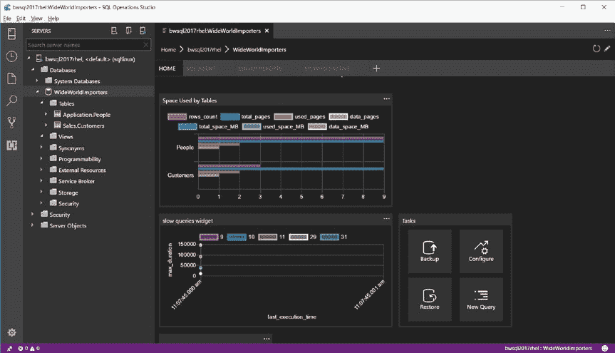

您可以在我们的文档中学习如何启用这些内置部件：`https://docs.microsoft.com/sql/sql-operations-studio/insight-widgets`。

自定义 SQL Operations Studio 的另一种方式是通过……


## 扩展

可以将扩展视为在定制服务器和数据库仪表板之外添加您自己仪表板的方法。扩展是类似于 `Visual Studio Code` 中扩展概念的**附加组件**。

扩展由社区或微软构建，可以通过在 `SQL Operations Studio` 最左侧窗格中选择 `Extensions` 图标来安装（或查看已安装的内容）。随着时间的推移，我预计扩展列表会变得像 `Visual Studio Code` 中的市场一样丰富。

根据您使用的 `SQL Operations Studio` 版本，您可能已经随工具安装了一些扩展。在我的安装中，我有用于 `SQL Agent`、`Server Reports` 和 `sp_whoisactive`（`SQL Server` 社区中极其流行的 `T-SQL` 存储过程）的扩展。您可以在用于显示 `Server` 仪表板的 `Home` 选项旁边找到这些扩展。您可以在我们的文档中找到关于扩展以及如何创建您自己的扩展的更多信息：[`docs.microsoft.com/sql/sql-operations-studio/extensions`](https://docs.microsoft.com/sql/sql-operations-studio/extensions)。

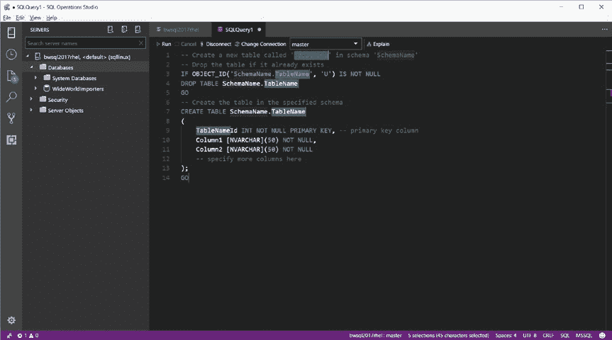

## 第 5 章   SQL Server 工具

##### T-SQL 查询编辑器

您使用 `SQL Operations Studio` 最常见的任务可能就是执行 `T-SQL` 查询。`SQL Operations Studio` 提供了一个功能丰富的 `T-SQL` 查询编辑器，其功能类似于 `Visual Studio Code` 的 `mssql` 扩展。而创建和执行查询最快捷的方法是右键单击服务器或数据库名称，然后选择 `New Query` 选项。

由于 `SQL Operations Studio` 与 `Visual Studio Code` 的 `mssql` 扩展一样，使用了 `SQL Tools Service`，因此它提供了智能感知和辅助执行 `T-SQL` 查询的功能。我在第 3 章关于 `Visual Studio code` 中未谈到的一个功能是称为 `T-SQL` 代码片段的概念。`T-SQL` 代码片段为使用 `T-SQL` 执行常见任务提供了模板，以帮助完成 `T-SQL` 语法。

要使用 `T-SQL` 代码片段，请使用 `New Query` 选项或键盘快捷键 `Ctrl+N` 调出 `Query Editor`。然后输入单词 `sql`，您将看到一个常见 `T-SQL` 任务（如创建表）的列表。图 5-23 显示了选择 `sqlCreateTable` 后用于创建新表的 `T-SQL` 代码片段。

**图 5-23.** 在 `SQL Operations Studio` 中使用 `T-SQL` 代码片段

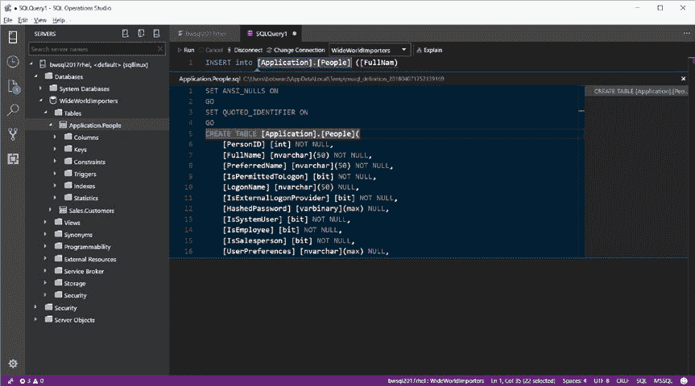

## 第 5 章   SQL Server 工具

`T-SQL` 编辑器中另一个优秀的功能是称为 *速查定义* 的概念。

考虑一下这个场景。您正在使用 `T-SQL` 编辑器执行一个 `INSERT` 语句，将一行数据插入到 `WideWorldImporters` 数据库的 `[Application].[People]` 表中。问题是您不记得所有的列名，因此不确定该列出哪些列名或需要多少个值。*速查定义* 允许您在完成 `INSERT` 语句的同时查看表定义。

要使用 *速查定义*，请在 `T-SQL 查询编辑器` 中高亮显示表名，右键单击并选择 *速查定义*。图 5-24 显示了使用 *速查定义* 来完成 `INSERT` 语句的界面。

**图 5-24.** 在 `SQL Operations Studio` 的 `T-SQL` 编辑器中使用 *速查定义*

##### 其他功能

`SQL Operations Studio` 为数据专业人员提供了其他功能。这包括类似于 `Visual Studio Code` 的 `集成终端`、`源代码控制` 功能，以及用于记录 `备份` 和 `还原` 等操作历史的 `任务历史`。

像任何有用的工具一样，`SQL Operations Studio` 几乎为每次交互都提供了键盘快捷键，并允许您自定义键盘快捷键。要了解有关 `SQL Operations Studio` 键盘快捷键的更多信息，请参阅文档：[`docs.microsoft.com/sql/sql-operations-studio/keyboard-shortcuts`](https://docs.microsoft.com/sql/sql-operations-studio/keyboard-shortcuts)。


# 第五章 SQL Server 工具

在我撰写本书此章节时，SQL Operations Studio 仍处于预览阶段。考虑到该工具的可扩展性以及社区为其贡献的开放源码能力，我预计随着每月新的主要版本发布，它将在功能和性能上持续快速成长。

#### SQL Server Management Studio

自 2005 年以来，世界上最流行的与 SQL Server 交互的工具是 SQL Server Management Studio (SSMS)。在 2005 年之前，SQL Server 提供了一个名为 SQL Enterprise Manager 的图形界面工具。SSMS 是一个令人兴奋的新工具，它基于 Visual Studio 的外壳，拥有丰富的能力。自 2005 年起，随着 SQL Server 的每次发布，SSMS 都得到了增强，包含了广泛的功能和特性。

从历史上看，SSMS 的问题之一是它总是与 SQL Server 主要版本的安装和发布捆绑在一起。这种方法阻碍了我们频繁对工具进行重大增强的能力。从 SQL Server 2016 开始，我们决定将 SSMS 与 SQL Server 解耦。我们也特意努力清理了积压的错误、问题和建议。我们于 2016 年 6 月通过单独的 SSMS 下载开始了这一旅程，如今 SSMS 17 每月都会进行更新和增强。您始终可以在 [`docs.microsoft.com/sql/ssms/download-sql-server-management-studio-ssms`](https://docs.microsoft.com/sql/ssms/download-sql-server-management-studio-ssms) 找到最新版本的 SSMS 进行下载。

对于在 Linux 上使用 SQL Server 的用户来说，SSMS 作为工具的最大缺点是它只能安装在运行 Windows 操作系统的计算机上。但对于 Windows 用户而言，它是一个功能强大的工具，具备丰富的能力。SSMS 最大的优势在于，连接到 Linux 上的 SQL Server 时，所使用的提供程序和库与 Windows 上使用的相同，因此连接到 Linux 上的 SQL Server 与在 Windows 上连接感觉一样。这是一个很棒的兼容性案例。

SSMS 包含对象资源管理器、丰富的 T-SQL 编辑器、T-SQL 调试器、用于完成特定任务的向导，以及针对各种 SQL Server 和数据库功能的报告。多年来，关于 SSMS 的文档、培训和信息已经非常多。本章中的一个章节永远无法全面介绍。我将介绍一些您可以用来通过 SSMS 与 Linux 上的 SQL Server 交互的主要功能，然后提供更详细涵盖该主题的其他资源。

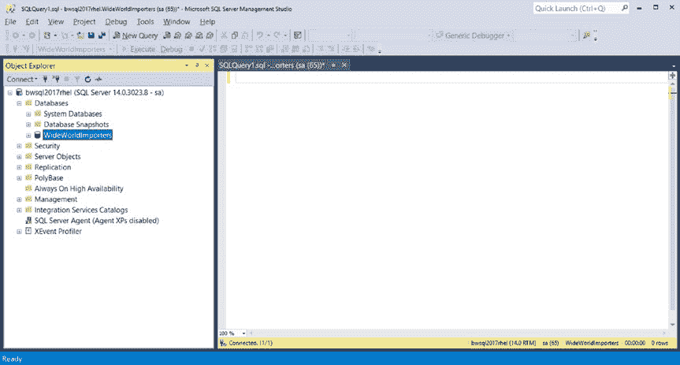

图 5-25 展示了 SSMS 的默认界面，其中包含对象资源管理器和一个新建查询编辑器窗口。

*图 5-25. SSMS 的默认界面*

##### 对象资源管理器

与 SQL Operations Studio 类似，SSMS 提供了一个可视化界面来导航 SQL Server 的对象。SSMS 在对象资源管理器中提供了比 SQL Operations Studio 更多的选项，不仅包括对象，还包括 SQL Server 的功能，例如 Always On 可用性组和管理功能。此外，在对象资源管理器中右键单击对象和功能时，可用的选项也比在 SQL Operations Studio 中更多。

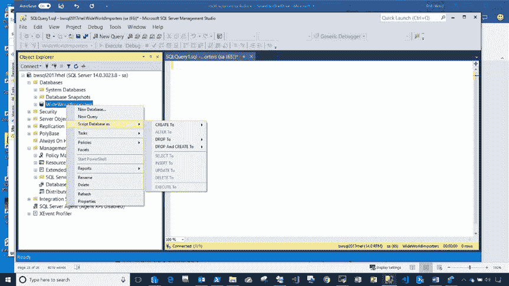

例如，图 5-26 展示了创建 T-SQL 脚本以删除和创建 WideWorldImporters 示例数据库的选项。

*图 5-26. 使用 SSMS 创建脚本以删除并重新创建现有数据库*

SSMS 通过对象资源管理器提供的另一个功能是能够创建新对象，如数据库、表、索引和其他对象。如果右键单击对象资源管理器中的“数据库”文件夹，您将有选项可以创建或还原新数据库。图 5-27 显示了当您右键单击“数据库”文件夹并选择“新建数据库”时将出现的新窗口。

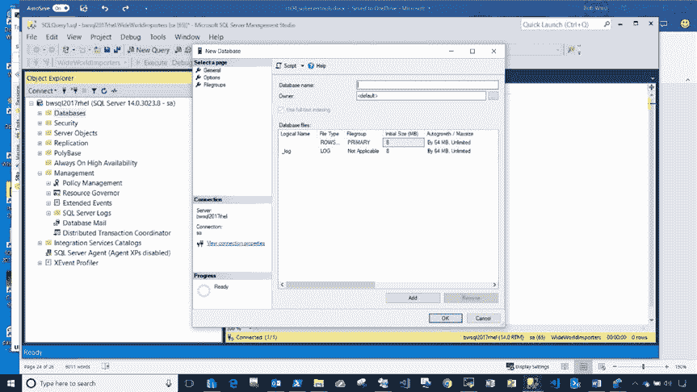


***图 5-27.** 在 SSMS 中创建新数据库*

通过右键单击 SSMS 中的其他文件夹、对象或功能，可以访问其他功能。

使用右键菜单时，最强大的选项之一是数据库的“任务”。图 5-28 展示了你可以使用 SSMS 对数据库执行的所有任务类型。选择其中任何一个选项都会打开一个新窗口或*向导*，引导你完成其中一项任务。在第九章中，我将结合使用 SSMS 或一组 T-SQL 命令来执行等效功能，描述其中一些任务。

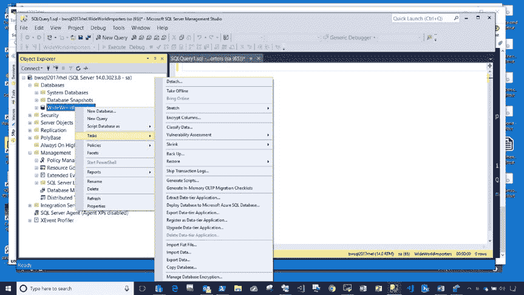

## ***图 5-28.** SSMS 中数据库可用的任务*

### **T-SQL 查询编辑器**

与 SQL Operations Studio 类似，SSMS 提供了一个丰富的编辑器来创建和设计 T-SQL 查询。其功能包括标识符颜色编码、智能感知以及用于辅助常见 T-SQL 任务的 T-SQL 代码片段。SSMS 还允许你打开脚本文件来执行 T-SQL 批处理，并将结果保存到网格视图、文本格式或文件中。你还可以将 T-SQL `SELECT` 语句的结果保存到文本文件或 CSV（逗号分隔）文件中。

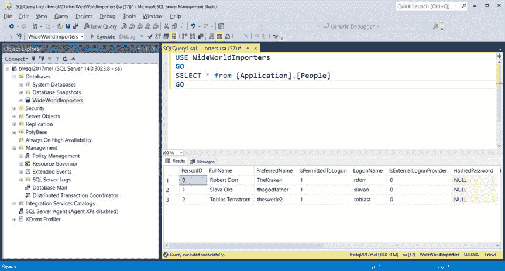

图 5-29 展示了针对默认网格视图结果中 `[Application].[People]` 表执行 `SELECT` 语句的默认结果。

***图 5-29.** 在 SSMS 的 T-SQL 编辑器中以网格视图显示的查询结果*

请注意，SSMS 屏幕底部的黄色状态栏会显示上下文信息，例如服务器名称、连接的用户登录名、数据库上下文、上次执行查询的总持续时间和总行数。

### **报表**

SSMS 安装时附带了一系列报表，用于查看 SQL Server 实例的性能、磁盘使用情况、活动和配置。此外，还提供了数据库的报表，可以查看按对象、索引的统计信息和空间使用情况，以及特定于数据库的各种统计信息和性能。

要执行报表，请右键单击服务器或数据库，然后选择 `报表/标准报表` 选项。

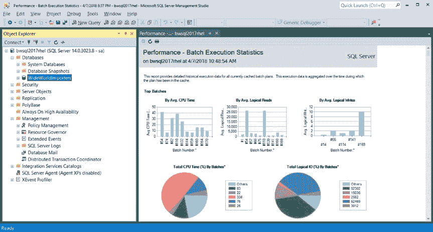

图 5-30 显示了自 Linux 上的 SQL Server 实例启动以来，所有在服务器上运行的批处理的内置性能报表。

***图 5-30.** SSMS 中的标准性能批处理报表*

报表可以是深入了解 SQL Server 和数据库的极其强大的功能。虽然 SSMS 提供了内置报表，但你也可以创建自己的自定义报表并将其集成到 SSMS 中。你可以在我们的文档 `https://docs.microsoft.com/sql/ssms/object/custom-reports-in-management-studio` 中阅读有关如何构建自定义报表的更多信息。

### **引擎内置工具**

SQL Server 的一个惊人之处在于核心数据库引擎中内置了许多*工具*。我称这些为“工具”，因为它们是通用功能，对于管理、监控和排查 SQL Server 各种场景的诸多方面都很有帮助。并且，由于 Linux 上的 SQL Server 与 Windows 上的核心数据库引擎相同，这些丰富的功能大多在 Linux 上也可用。

遵循一致性主题，我将在本节介绍的大多数工具都可以通过 T-SQL 语言使用。T-SQL 的开放性提供了一种自然的方式来暴露 SQL Server 引擎的丰富工具功能。

#### **系统表和目录视图**

在每个数据库内部，有一系列系统表，用于存储关于数据库以及其他对象（如表、列、索引和用户等）的元数据。从 SQL Server 2005 开始，我们决定改变用户（即使是系统管理员）直接访问系统表的方式，以避免用户修改


# SQL Server 中的系统对象与工具

## 系统表与目录视图

这些表的结构和设计可能在任何版本中发生变更。

由于每个用户数据库都基于模型数据库，因此每个用户数据库都具有相同的系统表集合。`master` 数据库则拥有额外的系统表，用于存储关于 SQL Server 实例的信息。

由于用户仍然需要访问系统表中包含的元数据，我们构建了一系列称为 **目录视图** 的视图，这些视图将用户与系统表的具体细节抽象开来。目录视图可以从任何数据库上下文中使用 `sys` 架构进行访问。目录视图的定义存储在隐藏的 “Resource” 数据库中。

> **注意**：在第 9 章中，我将提供一些关于访问系统表的高级技巧，但在正常情况下应该不需要用到。

SQL Server 的许多功能需要将元数据存储在系统表中。截至 SQL Server 2017，大约有 300 个目录视图，跨越 30 多个类别。您可以在我们的文档中按类别查看完整的目录视图列表：[`docs.microsoft.com/sql/relational-databases/system-catalog-views/catalog-views-transact-sql`](https://docs.microsoft.com/sql/relational-databases/system-catalog-views/catalog-views-transact-sql)。我们的文档还包含一个关于常见目录视图场景的详细 FAQ：[`docs.microsoft.com/sql/relational-databases/system-catalog-views/querying-the-sql-server-system-catalog-faq`](https://docs.microsoft.com/sql/relational-databases/system-catalog-views/querying-the-sql-server-system-catalog-faq)。

我认为您最可能想要深入了解的常见类别包括：

- **对象目录视图**：关于表、列、索引以及数据库中存储的其他对象的视图。
- **数据库和文件目录视图**：关于数据库和文件的视图（我已在几个示例中使用了 `sys.databases` 目录视图）。
- **安全目录视图**：关于登录、角色和用户的视图。

## SQL Server 工具

甚至有一个目录视图可以查找所有目录视图的列表！从任何您喜欢的工具，在任意数据库上下文中执行以下 T-SQL 命令以获取所有系统对象的列表：

```sql
SELECT name, type_desc FROM sys.system_objects
ORDER BY name
GO
```

> **提示**：避免构建依赖于从目录视图中 `SELECT *`（所有列）的生产应用程序或脚本，因为我们可能会在未来的 SQL Server 版本中向目录视图定义中添加列。

此查询结果中，`type_desc = 'VIEW'` 的大多数都是目录视图。我稍后将讨论另一种称为 **动态管理视图** 的特殊视图。

尽管目录视图存储在隐藏的 Resource 数据库中，但您可以使用目录视图 `sys.system_sql_modules` 查看这些视图的 T-SQL 代码。以下 T-SQL 命令可用于查找目录视图 `sys.databases` 的 T-SQL 视图定义：

```sql
SELECT * FROM sys.system_sql_modules
WHERE object_id = object_id('sys.databases')
GO
```

为了符合 ISO 标准，SQL Server 还提供了一系列称为 **系统信息模式视图** 的目录视图。这些视图很容易识别，因为它们属于一个名为 `INFORMATION_SCHEMA` 的特殊架构。您可以在我们的文档中获取这些视图的完整列表：[`docs.microsoft.com/sql/relational-databases/system-information-schema-views/system-information-schema-views-transact-sql`](https://docs.microsoft.com/sql/relational-databases/system-information-schema-views/system-information-schema-views-transact-sql)。

并非所有用户都能看到系统目录视图中的所有内容。目录视图的权限策略有些复杂。您可以在我们的文档中阅读更多关于这些权限的信息：[`docs.microsoft.com/sql/relational-databases/security/metadata-visibility-configuration`](https://docs.microsoft.com/sql/relational-databases/security/metadata-visibility-configuration)。

##### 系统存储过程

SQL Server 安装时附带了一系列称为系统存储过程的存储过程。与目录视图类似，这些过程的定义和文本也存储在隐藏的 Resource 数据库中。

许多系统存储过程用于管理和配置 SQL Server 的特性和方面。我在第 2 章向您介绍了其中一个名为 `sp_configure` 的系统过程，用于配置 SQL Server 实例设置。

虽然大多数系统存储过程会进行更改，但有一系列通用的系统存储过程提供信息（在某些情况下使用目录视图）。这些过程有一个已知的名称格式，以单词 `sp_help` 开头。例如，此 T-SQL 命令返回类似于目录视图 `sys.objects` 的信息：

```sql
EXEC sp_help
GO
```

按类别组织的系统存储过程完整列表可以在我们的文档中找到：[`docs.microsoft.com/sql/relational-databases/system-stored-procedures/system-stored-procedures-transact-sql`](https://docs.microsoft.com/sql/relational-databases/system-stored-procedures/system-stored-procedures-transact-sql)。

系统存储过程的权限因过程而异。请查阅每个过程的文档以了解所需的权限。

##### 动态管理视图

从我 1993 年开始使用 SQL Server 起，就有两个 **虚拟表** 提供有关 SQL Server 内部执行的信息，这些信息基于引擎中的内部数据结构：`sysprocesses` 和 `syslocks`（以及引用它们的存储过程 `sp_who` 和 `sp_lock`）。这些视图将连接、查询和锁的内部数据结构以行和列的形式呈现出来。

多年来，这是唯一能够基于内存结构提供 SQL Server 引擎执行洞察的视图。由于我在技术支持领域工作的这些年，如果我想了解引擎内其他内存结构的情况，我必须捕获 `SQLSERVR.EXE` 进程的用户转储文件，并使用 Windows 调试器手动检查结构列表。虽然这迫使我深入了解 SQL Server 引擎，但这并非解决问题的有效方式。

后来，SQL Server 团队来了一位名叫 Slava Oks 的人（你能看出这里有个趋势吗）。Slava 与一组工程师合作构建了 SQLOS 平台，这仍然是核心引擎架构的一部分。Slava 是调试专家，但他有一个目标：看看在不使用调试器的情况下，他能用 SQLOS 解决多少问题。根据 Slava 的想法，如果您能连接到 SQL Server，您就可以使用 T-SQL 来“实时调试” SQL Server 引擎的细节。

###### 视图

Slava 和他的团队采纳了虚拟表的概念，并将其扩展为一系列视图，这些视图暴露了来自 SQLOS 结构的信息，例如任务、线程、工作线程和内存。这项工作促使引擎团队内的其他小组开始暴露关于其他结构的信息。

在 SQL Server 2005 中，我们将所有这些视图收集到一个称为动态管理视图的新特性中。


# 第 5 章 SQL Server 工具

## 管理视图（DMV）与动态管理函数（DMF）

您可以像查询任何用户视图或目录视图一样查询 DMV，也可以像使用任何 T-SQL 函数一样使用 DMF。（注：DMF 与函数一样，需要参数）

**提示**：当涉及 DMV 和 DMF 时，智能感知是您的好帮手。输入`sys.dm_`会列出 SQL Server 支持的所有 DMV 和 DMF 的完整列表。

这些自 SQL Server 2005 起就存在的视图，仍然提供着 DMV 的核心功能，例如`sys.dm_exec_requests`、`sys.dm_os_tasks`和`sys.dm_wait_stats`。在 Linux 和 Windows 上的 SQL Server 2017 中，目前大约有 240 个 DMV 和 DMF，涵盖了 SQL Server 引擎的各个方面。

DMV 和 DMF 证明了 T-SQL 的开放特性，以及将数据作为表公开以深入了解任何数据这一概念的强大——无论是来自用户表、系统表的数据，还是支持数据库引擎的结构列表。

DMV 和 DMF 的完整列表可按类别在我们的文档中找到：[`docs.microsoft.com/sql/relational-databases/system-dynamic-management-views/system-dynamic-management-views`](https://docs.microsoft.com/sql/relational-databases/system-dynamic-management-views/system-dynamic-management-views)。DMV 和 DMF 需要`VIEW SERVER STATE`权限，该权限可由`sysadmin`登录账户授予。

这些 DMV 和 DMF 中有许多是相互关联的，可以连接在一起使用。多年来，SQL Server 社区已在各种博客和培训中发布了针对不同场景的示例。DMV 最流行的用途之一来自社区开发的存储过程`sp_whoisactive`，由 SQL 社区领袖 Adam Machanic 编写（现已扩展到 SQL Operations Studio 中）。您可以从[`whoisactive.com`](http://whoisactive.com)获取`sp_whoisactive`的详细信息和下载链接。

以下是我个人认为最重要的十个 DMV 和 DMF，以及每个 DMV/DMF 的示例查询：

### dm_exec_requests

活动查询和后台请求的列表。这可能是当今 SQL Server 用户最常用的 DMV。

以下查询（见示例文件`dm_exec_requests.sql`）显示了活动的用户查询列表及查询详情，包括`session_id`（唯一标识与 SQL Server 的连接）、`status`（正在运行还是等待）、`command`（正在运行什么查询）、`wait_type`（如果查询在等待，等待的是什么类型的资源）和`wait_time`（已等待了多长时间）。您还会注意到我将此 DMV 与`sys.dm_exec_sessions`连接，因此只显示活动的“用户”请求。

```sql
-- 获取活动用户请求的 session_id、状态（RUNNING 或 SUSPENDED）、命令（什么查询）、
-- 等待类型（如果等待，是什么资源？）以及等待时间（等待了多久）
--
SELECT er.[session_id], er.[status], er.[command], er.[wait_type],
       er.[wait_time]
FROM sys.dm_exec_requests er
INNER JOIN sys.dm_exec_sessions es
    ON es.[session_id] = er.[session_id]
    AND es.[is_user_process] = 1
GO
```

此 DMV 包含更多列。请在我们的文档中查看完整选项：[`docs.microsoft.com/sql/relational-databases/system-dynamic-management-views/sys-dm-exec-requests-transact-sql`](https://docs.microsoft.com/sql/relational-databases/system-dynamic-management-views/sys-dm-exec-requests-transact-sql)。您可以在以下链接找到`sys.dm_exec_sessions`的完整选项列表：[`docs.microsoft.com/sql/relational-databases/system-dynamic-management-views/sys-dm-exec-sessions-transact-sql`](https://docs.microsoft.com/sql/relational-databases/system-dynamic-management-views/sys-dm-exec-sessions-transact-sql)。


### 第 5 章：SQL Server 工具

[transact-sql](https://docs.microsoft.com/sql/relational-databases/system-dynamic-management-views/sys-dm-exec-sessions-transact-sql) 等待类型描述了 SQL Server 请求可能在资源（如锁、I/O、latch 等）上等待的不同场景。关于等待类型及其对应用程序意义的最全面描述，可以在我的朋友兼 SQL Server 社区领袖 Paul Randal 运行的这篇社区博客中找到：[`www.sqlskills.com/help/waits/`](https://www.sqlskills.com/help/waits/)。

## `dm_exec_query_stats`

一个基于当前缓存查询的性能统计列表。这是用于查询性能分析的极其受欢迎的 DMV。我喜欢我们文档中的示例，我已在示例脚本 `dm_exec_query_stats.sql` 中提供了它。此查询旨在显示占用最多 CPU 资源的 Top <N> 个查询：

```sql
-- 按 CPU 使用率获取前 5 个查询。显示 query_hash、平均 CPU 时间和 T-SQL 文本
-- query_hash 是一种唯一标识查询的方式，该查询可能以多种方式执行但具有相似的“模式”
SELECT TOP 5
    query_stats.query_hash AS "Query Hash",
    SUM(query_stats.total_worker_time) / SUM(query_stats.execution_count) AS "Avg CPU Time",
    MIN(query_stats.statement_text) AS "Statement Text"
FROM
    (SELECT QS.*,
        SUBSTRING(ST.text,
            (QS.statement_start_offset/2) + 1,
            ((CASE statement_end_offset
                WHEN -1 THEN DATALENGTH(ST.text)
                ELSE QS.statement_end_offset END
                - QS.statement_start_offset)/2) + 1) AS statement_text
    FROM sys.dm_exec_query_stats AS QS
        CROSS APPLY sys.dm_exec_sql_text(QS.sql_handle) as ST) as query_stats
GROUP BY query_stats.query_hash
ORDER BY "Avg CPU Time" DESC
GO
```

此 DMV 以哈希值（唯一标识具有相同“模式”的查询）和句柄的形式存储查询信息。请注意这里使用了 DMF `dm_exec_sql_text` 来获取 SQL 查询的文本。

您可以在 [`docs.microsoft.com/sql/relational-databases/system-dynamic-management-views/sys-dm-exec-query-stats-transact-sql`](https://docs.microsoft.com/sql/relational-databases/system-dynamic-management-views/sys-dm-exec-query-stats-transact-sql) 找到 `dm_exec_query_stats` 的完整文档。`dm_exec_sql_text` 的文档可以在 [`docs.microsoft.com/sql/relational-databases/system-dynamic-management-views/sys-dm-exec-sql-text-transact-sql`](https://docs.microsoft.com/sql/relational-databases/system-dynamic-management-views/sys-dm-exec-sql-text-transact-sql) 找到。

## `dm_os_waiting_tasks`

一个等待资源的任务（查询和后台任务）列表。此 DMV 仅显示正在等待资源的请求。以下来自示例脚本 `dm_os_waiting_tasks.sql` 的示例显示了所有等待资源的用户请求（注意：如果没有用户任务在等待资源，此查询将返回 0 行）：

```sql
-- 显示所有正在等待资源的用户请求
--
SELECT wt.session_id, wt.wait_type, wt.wait_duration_ms
FROM sys.dm_os_waiting_tasks wt
INNER JOIN sys.dm_exec_sessions es
    ON es.session_id = wt.session_id
    AND es.is_user_process = 1
GO
```

您可以在 [`docs.microsoft.com/sql/relational-databases/system-dynamic-management-views/sys-dm-os-waiting-tasks-transact-sql`](https://docs.microsoft.com/sql/relational-databases/system-dynamic-management-views/sys-dm-os-waiting-tasks-transact-sql) 找到此 DMV 的文档。


[tasks-transact-sql.](https://docs.microsoft.com/sql/relational-databases/system-dynamic-management-views/sys-dm-os-waiting-tasks-transact-sql)

## dm_os_wait_stats

这是最常用的动态管理视图之一。此视图记录了自 SQL Server 启动以来（或自上次清除该视图统计信息以来），按类型划分的资源等待统计信息。以下示例取自示例脚本 `dm_os_wait_stats.sql`，用于显示每个 `wait_type` 的平均等待时长，且仅显示存在等待事件的等待类型。

```sql
-- 按类型显示等待次数及该类型的平均等待时间，按平均等待时间从高到低排序
-- 注意，某些等待是“正常的”，因为它们是后台任务的一部分，在执行过程中自然会产生等待
SELECT wait_type, waiting_tasks_count, (wait_time_ms/waiting_tasks_count) as avg_wait_time_ms
FROM sys.dm_os_wait_stats
WHERE waiting_tasks_count > 0
ORDER BY avg_wait_time_ms DESC
GO
```

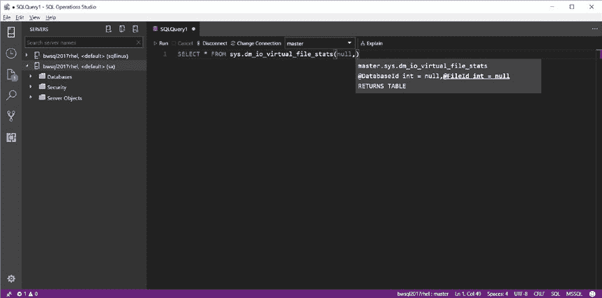

## 第 5 章 SQL Server 工具

你可以在以下网址找到 `sys.dm_os_wait_stats` 的文档：[`docs.microsoft.com/sql/relational-databases/system-dynamic-management-views/sys-dm-os-wait-stats-transact-sql`](https://docs.microsoft.com/sql/relational-databases/system-dynamic-management-views/sys-dm-os-wait-stats-transact-sql)。

## dm_io_virtual_file_stats

此动态管理函数对于深入了解哪些数据库和文件经历了最多的 I/O，以及数据库及其关联文件的平均磁盘延迟类型非常有帮助。在 SQL Operations Studio 中使用动态管理函数可以展示 T-SQL 智能感知功能的强大之处，它能帮助你为函数提供正确的参数。图 5-31 展示了为此动态管理函数填写参数的示例。

**图 5-31.** SQL Operations Studio 中用于执行动态管理函数的 T-SQL 智能感知功能

以下是示例查询（取自示例脚本 `dm_io_virtual_file_stats.sql`），用于查看按读取操作平均磁盘延迟从高到低排序的数据库文件：

```sql
-- 查找读取操作平均磁盘延迟最高的文件及其关联的数据库
-- 使用 DB_NAME() 系统函数从动态管理函数中的 id 获取数据库名称
-- 与 sys.master_files 目录视图联接，根据动态管理函数中的 file_id 获取物理文件名
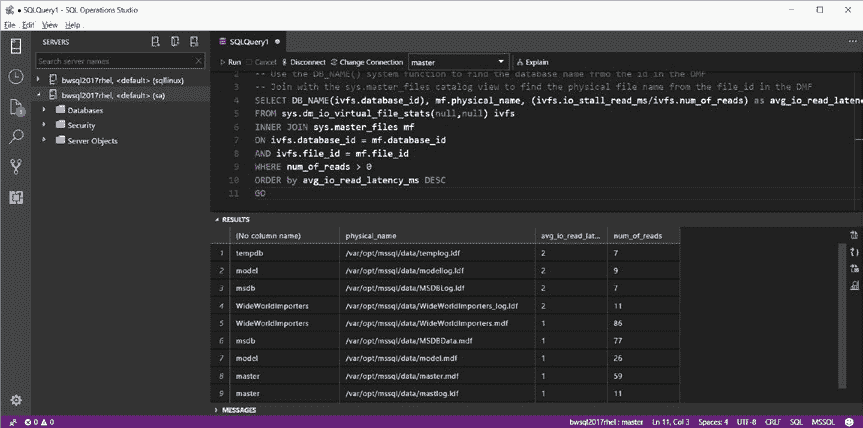

## 第 5 章 SQL Server 工具

SELECT DB_NAME(ivfs.database_id), mf.physical_name, (ivfs.io_stall_read_ms/ivfs.num_of_reads) as avg_io_read_latency_ms, ivfs.num_of_reads
FROM sys.dm_io_virtual_file_stats(null,null) ivfs
INNER JOIN sys.master_files mf
ON ivfs.database_id = mf.database_id
AND ivfs.file_id = mf.file_id
WHERE num_of_reads > 0
ORDER by avg_io_read_latency_ms DESC
GO
```

此动态管理函数仅提供 `database_id` 和 `file_id` 而非名称。我使用 `DB_NAME()` 系统函数来获取数据库名称，并与目录视图 `sys.master_files` 联接以获取物理文件名。

图 5-32 显示了在我的运行于 Linux 服务器上的 SQL Server 中，执行上述查询后的结果。

**图 5-32.** SQL Server on Linux 上具有最高平均磁盘读取延迟的数据库文件

你可以在以下网址找到此动态管理函数的文档：[`docs.microsoft.com/sql/relational-databases/system-dynamic-management-views/sys-dm-io-virtual-file-stats-transact-sql`](https://docs.microsoft.com/sql/relational-databases/system-dynamic-management-views/sys-dm-io-virtual-file-stats-transact-sql)。

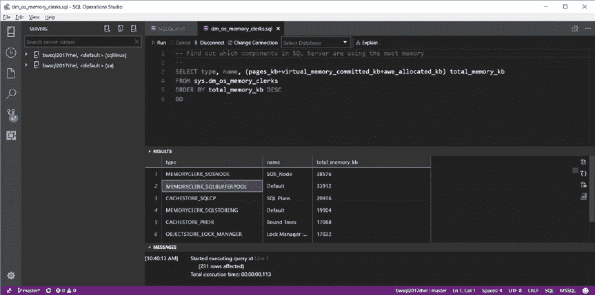

## 第 5 章 SQL Server 工具

**dm_os_memory_clerks**：内存是...


SQL Server。SQL Server 引擎内建了一套复杂而强大的内存管理系统。其内部的各个组件通过`memory clerk`（内存 clerks）这一概念来消耗内存并记录使用情况。此`DMV`（动态管理视图）将展示整个 SQL Server 引擎中按 clerk 划分的内存使用情况。以下示例基于脚本`dm_os_memory_clerks.sql`，展示了在任何时间点，哪些内存 clerks 消耗了最多的内存：

```sql
-- 找出 SQL Server 中哪些组件正在使用最多内存
--
SELECT type, name, (pages_kb+virtual_memory_committed_kb+awe_allocated_kb) total_memory_kb
FROM sys.dm_os_memory_clerks
ORDER BY total_memory_kb DESC
GO
```

图 5-33 展示了在我的 Linux 上的 SQL Server 中，此查询在启动后立即执行的结果。

**图 5-33. 启动后立即查看的 SQL Server 内存 clerks**

## 第 5 章 SQL Server 工具

目前没有详细的文档将不同的内存 clerk 类型映射到它们所属的 SQL Server 引擎组件。以下是我认为在典型 SQL Server 上你会看到消耗内存最多的几种常见 clerk：

`MEMORYCLERK_SQLBUFFERPOOL`：缓冲池数据库页。这通常是最大的内存消耗者。

`CACHESTORE_SQLCP`：用于即席（ad-hoc）SQL Server 查询的计划缓存。

`CACHESTORE_OBJCP`：用于 SQL Server 对象（如存储过程）的计划缓存。

`CACHESTORE_COLUMNSTOREOBJECTPOOL`：由列存储索引消耗的内存。

`MEMORYCLERK_XTP`：用于内存优化表（In-Memory OLTP）的内存。

你可以在[sys-dm-os-memory-clerks-transact-sql](https://docs.microsoft.com/sql/relational-databases/system-dynamic-management-views/sys-dm-os-memory-clerks-transact-sql)找到此`DMV`的完整文档。

`dm_tran_locks`：由活动请求持有的当前锁的列表。当你在 SQL Server 中遇到阻塞问题时，此`DMV`可能很有帮助，可用于发现特定会话、请求和查询持有哪些锁。以下是示例脚本`dm_tran_locks.sql`中的一个查询示例：

```sql
-- 显示活动会话和查询请求或已授予的锁
--
SELECT resource_type, request_mode, request_request_id, resource_database_id, resource_associated_entity_id, resource_type, resource_description
FROM sys.dm_tran_locks
GO
```

有关此`DMV`的文档，包括一个关于如何将其用于阻塞场景的很好示例，请参阅[sys-dm-tran-locks-transact-sql](https://docs.microsoft.com/sql/relational-databases/system-dynamic-management-views/sys-dm-tran-locks-transact-sql)。

`dm_db_missing_index_details`：我在第 3 章向你展示了如何为构建键创建约束，这些约束是通过索引实现的。索引也可以帮助提升查询性能。在运行 SQL Server 查询时，引擎可以识别到某些场景下缺少可用的索引，而该索引可能有助于提升性能。这些建议可通过此`DMV`获取。我将在第 6 章介绍此`DMV`及其他性能工具的用法。以下是示例脚本`dm_db_missing_index_details.sql`中的一个查询示例，用于查找 SQL Server 中所有推荐的缺失索引。

```sql
-- 查找所有数据库和对象当前推荐的缺失索引
--
SELECT index_handle, database_id, object_id, equality_columns, statement
FROM sys.dm_db_missing_index_details
GO
```

此`DMV`在 SQL Server 重启后会被清除。完整文档...


## SQL Server 工具

关于此动态管理视图（DMV）的详细信息，请参阅微软官方文档：[`docs.microsoft.com/sql/relational-databases/system-dynamic-management-views/sys-dm-db-missing-index-details-transact-sql`](https://docs.microsoft.com/sql/relational-databases/system-dynamic-management-views/sys-dm-db-missing-index-details-transact-sql)。

### dm_os_sys_info

`sys.dm_os_sys_info` 是一个著名的 DMV 示例，它使用 T-SQL 接口以表格形式公开关于*系统*（即操作系统、计算机或 SQL Server 本身）的信息。此 DMV 始终只返回一行数据。

这个 DMV 中包含了大量有用的信息。我提供了一个示例查询，列出其中几个列，并包含一个计算 SQL Server 已运行时间的计算。你可以在示例脚本 `dm_os_sys_info.sql` 中找到这个查询。

```sql
-- Retrieve information about the computer, the OS, and SQL Server
--
SELECT cpu_count, hyperthread_ratio, physical_memory_kb, committed_kb,
    committed_target_kb, max_workers_count, datediff(hour, sqlserver_start_time, getdate()) as sql_up_time_hours, affinity_type_desc,
    virtual_machine_type_desc, softnuma_configuration_desc, socket_count, cores_per_socket,
    numa_node_count, container_type_desc
FROM sys.dm_os_sys_info
GO
```

此 DMV 中的某些值将是本书后续讨论的主题。关于此示例查询中所有列以及该 DMV 中所有列的完整描述，请参阅我们的官方文档：[`docs.microsoft.com/sql/relational-databases/system-dynamic-management-views/sys-dm-os-sys-info-transact-sql`](https://docs.microsoft.com/sql/relational-databases/system-dynamic-management-views/sys-dm-os-sys-info-transact-sql)。

### dm_os_ring_buffers

有少数几个 DMV 未被官方文档记载，因为它们通常不用于 SQL Server 的常规管理和监控。但其中一个未被记载且在某些高级场景中非常有用的 DMV 是 `sys.dm_os_ring_buffers`。此 DMV 存储了 SQL Server 引擎某些内部组件的详细信息，这些信息以内存中的*列表*（“环形”表示列表满时会回绕到开头）形式存储。构建此 DMV 所公开列表的每个组件（环形缓冲区类型）都有其自己的环形缓冲区。

以下示例查询（见于示例脚本 `ring_buffer_types.sql`）展示了可能的环形缓冲区类型（具体类型可能随 SQL Server 版本变化）：

```sql
-- Find the distinct ring buffer types
--
SELECT DISTINCT(ring_buffer_type)
FROM sys.dm_os_ring_buffers
GO
```

其中一个有趣的环形缓冲区类型是 `RING_BUFFER_EXCEPTION`。每种类型的环形缓冲区以一系列行的形式存储，其中包含一个 `record` 字段。`record` 字段是 XML 类型。以下示例查询（见于同一脚本 `dm_os_ring_buffers_exception.sql`）相当复杂。请参考 T-SQL 脚本中的注释，了解每个字段是如何从 XML 记录中提取或通过与其他系统数据连接而获取的：

```sql
-- Find all current error messages recorded by SQL Server in the ring buffer
-- [record_timestamp] is calculated by taking the current timestamp in the record (which is in clock ticks by milliseconds)
-- and subtracting this from ms_ticks in sys.dm_os_sys_info which is the number of clock ticks in ms when SQL Server was started
-- and then adding this to the current datetime. This gives you the actual datetime of the record
-- errorno, severity, and state are "shredded" from the XML record
-- errorno from the XML record is joined with sys.sysmessages to get the error message string
```


-- 并非所有错误消息都是“错误”。严重性低于 16 的消息属于“信息性”消息。

```sql
DECLARE @current_ms_ticks INT

SELECT @current_ms_ticks=ms_ticks FROM sys.dm_os_sys_info

SELECT DATEADD(ms, (orb.timestamp-@current_ms_ticks), GETDATE()) as
[record_timestamp],
CAST(orb.record AS XML).value('(//Exception//Error)[1]', 'varchar(10)') as
[errorno],
CAST(orb.record AS XML).value('(//Exception/Severity)[1]', 'varchar(10)')
as [severity],
CAST(orb.record AS XML).value('(//Exception/State)[1]', 'varchar(10)') as
[state],
msg.description
FROM sys.dm_os_ring_buffers orb
INNER JOIN sys.sysmessages msg
ON msg.error = cast(record as xml).value('(//Exception//Error)[1]',
'varchar(255)')
AND msg.msglangid = 1033 -- 此为美式英语。请根据需要更改为你的语言
WHERE orb.ring_buffer_type = 'RING_BUFFER_EXCEPTION'
ORDER BY record_timestamp
GO
```

###### DBFS 工具

许多 Linux 用户更习惯使用 Shell 而非图形界面，并且也熟悉浏览 proc 目录（虚拟）文件系统（你可以在[`en.wikipedia.org/wiki/Procfs`](https://en.wikipedia.org/wiki/Procfs)阅读更多关于`procfs`的信息）。作为 Helsinki 项目的一部分，我们构建了一个开源工具，其功能类似于针对 SQL Server 目录视图和 DMV 数据的`procfs`，称为`dbfs`。

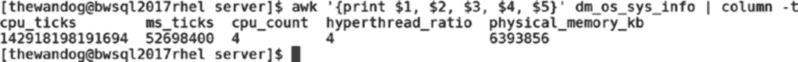

### 第五章 SQL Server 工具

`DBFS`将查询 Linux 上的 SQL Server 以获取 DMV 数据，并将信息输出到带有文件的目录结构中。每个文件将代表特定目录视图或 DMV 的一个快照。该工具会为每个目录视图和 DMV 生成文本和 JSON 文件。默认情况下，`dbfs`在后台运行，监控对由目录视图和 DMV 表示的文件的访问。当用户尝试访问文件内容时，`dbfs`会查询 SQL Server 以获取数据来填充文件。此技术类似于`procfs`在 Linux 操作系统中的工作原理。

要安装`dbfs`，请阅读 GitHub 项目站点[`github.com/Microsoft/dbfs`](https://github.com/Microsoft/dbfs)上的说明。我在我的 RHEL 虚拟机上安装了它，然后遵循 GitHub 站点上的快速入门说明来创建目录和配置文件。

文本文件的格式设计使得可以轻松地使用`awk`、`grep`和`join`等 Linux 工具来查询目录视图和 DMV 数据。以下是一个使用`awk`的示例命令：

```bash
awk '{print $1, $2, $3, $4, $5}' dm_os_sys_info | column -t
```

图 5-34 展示了一个使用`awk`从`dm_os_sys_info`的`dbfs`文件中提取列的示例。

**图 5-34** 将 `awk` 与 `DBFS` 结合使用

##### 扩展事件

在 SQL Server 2008 之前，用于跟踪事件和 SQL Server 引擎代码执行的主要工具是 SQL Server Trace 以及相应的工具 SQL Profiler。虽然 SQL Server Trace 和 SQL Server Profiler 至今仍然存在，但此功能和技术工具已被标记为**已弃用**（这意味着它们可能在未来的任何新版本中被移除）。这也意味着我们不再对此功能和工具进行任何增强。

**注意：** 跨版本弃用功能是我们对于不计划增强的功能所采取的措施。在最近的版本中，即使我们将功能标记为已弃用，我们也极少移除它们。请在[`docs.microsoft.com/sql/database-engine/deprecated-database-engine-features-in-sql-server-2017`](https://docs.microsoft.com/sql/database-engine/deprecated-database-engine-features-in-sql-server-2017)阅读更多关于此主题的内容。

### 第五章 SQL Server 工具

在 SQL Server 2008 中，我们启动了一个名为`XEvent`的项目。在 SQL Server 2005 发布后，我发现自己再次与 Slava Oks 进行了一场关于可支持性和诊断的对话。尽管 SQL Server Trace 和 Profiler 很受欢迎，但他知道“服务器端跟踪”的架构存在局限性，尤其是在可扩展性方面。


# SQL Server 扩展事件 (Extended Events)

Slava 及构建 SQLOS 的团队从头开始设计了 XEvent，并在 SQL Server 2008 中将此功能命名为 **Extended Events**。Extended Events 既是 SQL Server 引擎开发人员使用的跟踪库，也是供用户使用的跟踪功能。SQL Server 引擎的开发人员可以使用 XEvent 库在他们的代码中定义检测点，即 *events*。SQL Server 的用户随后可以定义启用这些事件并消费其相关信息的方法。

SQL Server 2008 发布时包含了一组基础事件，但并非 SQL Server 跟踪的所有检测点都已可用。在 SQL Server 2012 中，我们努力确保扩展事件包含了来自 SQL Server 跟踪的所有事件以及更多内容。截至 SQL Server 2017，已有超过 1500 个事件可供用户使用，以深入了解查询执行、连接、各种功能或 SQL Server 引擎内部运作。

虽然动态管理视图 (DMVs) 提供了关于 SQL Server 引擎许多方面的洞察，但大多数 DMVs 提供的是您查询时数据的 *快照*。扩展事件允许您跟踪细节（包括在 DMVs 中找不到的信息）并随时间收集事件数据。

您可以在以下位置找到关于扩展事件的所有文档：[`docs.microsoft.com/sql/relational-databases/extended-events/extended-events`](https://docs.microsoft.com/sql/relational-databases/extended-events/extended-events)。

## 扩展事件对象 (Extended Event Objects)

扩展事件的基本对象是 **events**（事件）、**targets**（目标）和 **actions**（操作）。让我更详细地描述每一个：

**Event（事件）**：事件是 SQL Server 引擎中的检测点，由 Microsoft 开发人员定义。可以将事件视为代码中跟踪执行的重要位置。事件及其描述的文档可以通过查询名为 `sys.dm_xe_objects`（对象类型 = 'event'）的 DMV 找到。

事件具有属性或列。这些可以通过查询 `sys.dm_xe_object_columns` 找到。以下示例查询（见于示例脚本 `xe_events.sql`）显示了所有事件及其列，按事件名称排序：

```sql
-- 列出 XEvent 事件、描述以及每个事件及其描述的列
--
SELECT xeo.name, xeo.description, xeoc.name, xeoc.description
FROM sys.dm_xe_objects xeo
INNER JOIN sys.dm_xe_object_columns xeoc
ON xeo.name = xeoc.object_name
WHERE xeo.object_type = 'event'
AND (xeo.capabilities IS NULL OR xeo.capabilities & 1 = 0) -- 筛选出公共事件
ORDER BY xeo.name, xeoc.name
GO
```

注意在上面的查询中，我使用了 DMV 中一个名为 `capabilities` 的列。某些 XEvent 事件、操作和目标被认为是 *private*（私有的）。私有的 XEvent 对象不能在用户会话中使用，因为它们支持 SQL Server 的某个功能，例如 SQL Server 审核。

**Target（目标）**：目标是一个可以发布和存储事件以供消费的去处。两种基本的目标类型是 `event_file`（将事件保存到文件）和 `ring_buffer`（将事件保存到服务器重启后不会持久的内存缓冲区）。还有其他目标具有内置的“智能”，例如直方图目标。完整的目标列表可以在我们的文档中找到：[`docs.microsoft.com/sql/relational-databases/extended-events/targets-for-extended-events-in-sql-server`](https://docs.microsoft.com/sql/relational-databases/extended-events/targets-for-extended-events-in-sql-server)。

**Action（操作）**：当一个事件被触发并发布到目标时，该事件中的所有列都是可用的（有些列需要设置才能发布其数据，因为收集该列可能会消耗额外资源）。操作是...


数据与可作为事件会话一部分捕获的事件的列正交。操作的一个例子是 `sql_text`，即 T-SQL 查询的文本。`sql_text` 并非每个事件都有对应的列，这意味着在许多情况下，您可以捕获与事件关联的 T-SQL 查询，而如果没有此操作，则无法做到这一点。

# 第 5 章 SQL Server 工具

关于事件、目标和操作如何协同工作的序列的出色描述，可以在我们的文档中找到：[`docs.microsoft.com/sql/relational-databases/extended-events/sql-server-extended-events-engine`](https://docs.microsoft.com/sql/relational-databases/extended-events/sql-server-extended-events-engine)。

## `用法和场景`

要使用扩展事件，必须创建一个 `session`。会话持久化在存储在 master 数据库中并通过目录视图公开的系统表中。创建会话后，必须启动会话，以便为事件定义的检测点被 *触发* 并发布到定义的目标。在任何时候，您都可以停止会话，所有事件将不再触发，但事件定义仍持久保存在 master 数据库中。您可以在目录视图 `sys.server_event_sessions` 中找到所有扩展事件定义。您可以从 `sys.dm_xe_sessions` DMV 找到所有已启动的扩展事件会话的列表。

以下示例查询（来自示例脚本 `quicksessionstandard.sql`）展示了如何创建一个扩展事件会话来收集有关 SQL Server 连接和查询的基本信息（此事件定义基于 SSMS 中的 XEProfiler 功能）：

```sql
-- Create a XEvent session based on the XEProfiler feature in SSMS to collect connections and queries
--
CREATE EVENT SESSION [QuickSessionStandardToFile] ON SERVER
ADD EVENT sqlserver.attention(
    ACTION(package0.event_sequence,sqlserver.client_app_name,sqlserver.client_pid,sqlserver.database_id,sqlserver.database_name,sqlserver.nt_username,sqlserver.query_hash,sqlserver.server_principal_name,sqlserver.session_id)
    WHERE ([package0].equal_boolean))),
ADD EVENT sqlserver.existing_connection(SET collect_options_text=(1)
    ACTION(package0.event_sequence,sqlserver.client_app_name,sqlserver.client_hostname,sqlserver.client_pid,sqlserver.nt_username,sqlserver.server_principal_name,sqlserver.session_id)),
ADD EVENT sqlserver.login(SET collect_options_text=(1)
    ACTION(package0.event_sequence,sqlserver.client_app_name,sqlserver.client_hostname,sqlserver.client_pid,sqlserver.nt_username,sqlserver.server_principal_name,sqlserver.session_id)),
ADD EVENT sqlserver.logout(
    ACTION(package0.event_sequence,sqlserver.client_app_name,sqlserver.client_pid,sqlserver.nt_username,sqlserver.server_principal_name,sqlserver.session_id)),
ADD EVENT sqlserver.rpc_completed(
    ACTION(package0.event_sequence,sqlserver.client_app_name,sqlserver.client_pid,sqlserver.database_id,sqlserver.database_name,sqlserver.nt_username,sqlserver.query_hash,sqlserver.server_principal_name,sqlserver.session_id)
    WHERE ([package0].equal_boolean))),
ADD EVENT sqlserver.sql_batch_completed(
    ACTION(package0.event_sequence,sqlserver.client_app_name,sqlserver.client_pid,sqlserver.database_id,sqlserver.database_name,sqlserver.nt_username,sqlserver.query_hash,sqlserver.server_principal_name,sqlserver.session_id)
    WHERE ([package0].equal_boolean))),
ADD EVENT sqlserver.sql_batch_starting(
    ACTION(package0.event_sequence,sqlserver.client_app_name,sqlserver.client_pid,sqlserver.database_id,sqlserver.database_name,sqlserver.nt_username,sqlserver.query_hash,sqlserver.server_principal_name,sqlserver.session_id)
    WHERE ([package0].equal_boolean)))
ADD TARGET package0.event_file(SET filename=N'QuickSessionStandard


