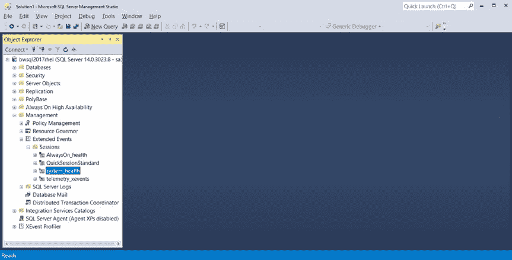
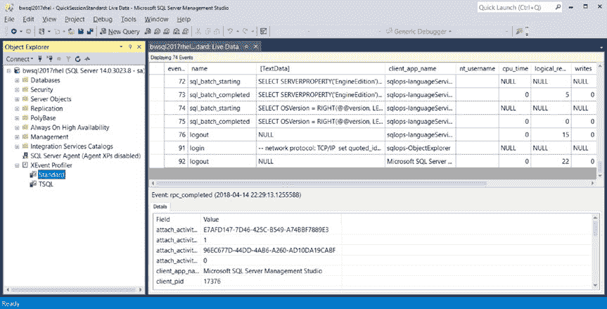
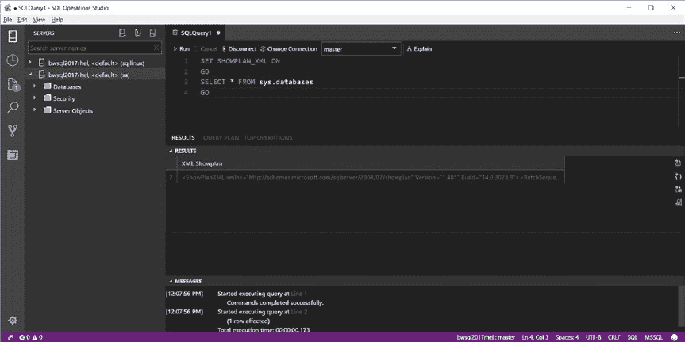
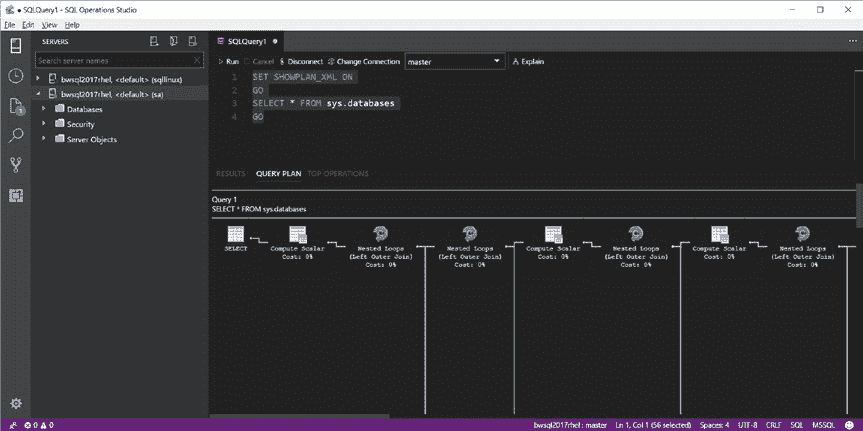
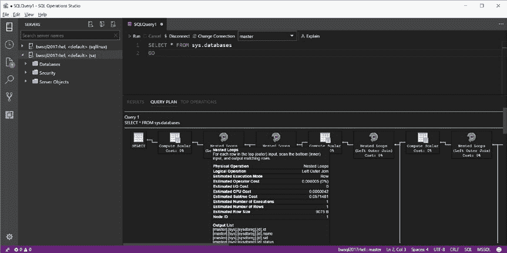
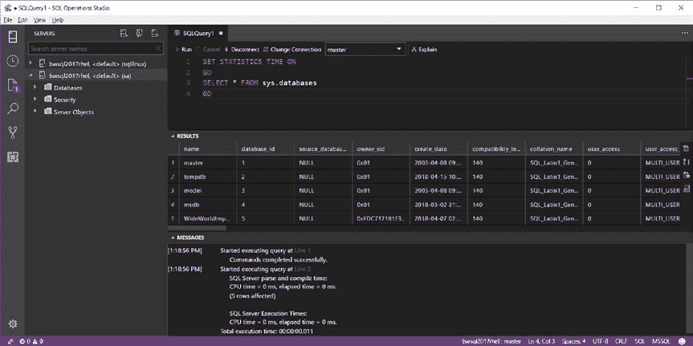
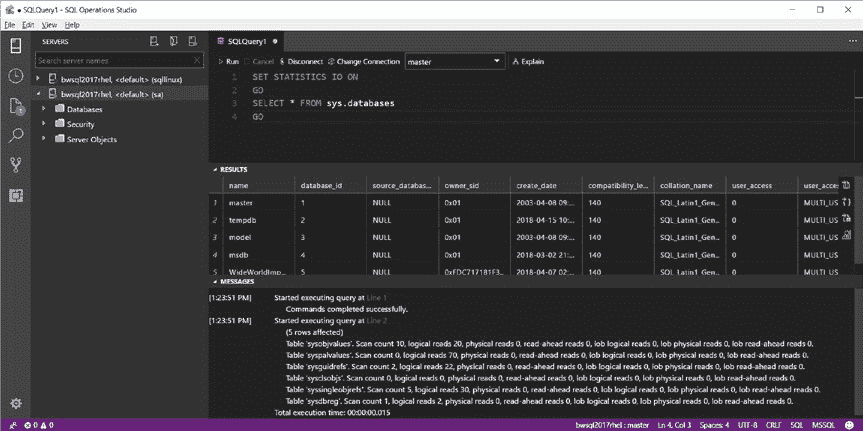

# 第 5 章 SQL Server 工具

## 创建和管理扩展事件会汉

示例查询`start_xevent_session.sql`展示了如何启动已创建的会话：

```sql
-- Start the XEvent session
ALTER EVENT SESSION [QuickSessionStandardToFile] ON SERVER STATE = start
GO
```

默认情况下，扩展事件会话的文件目标存储在`/var/opt/mssql/log`目录中。

创建扩展事件会话时有多种选项可选，例如控制内存和可扩展性。您可以在我们的文档中找到完整的选项列表：[`docs.microsoft.com/sql/t-sql/statements/create-event-session-transact-sql`](https://docs.microsoft.com/sql/t-sql/statements/create-event-session-transact-sql)。SQL Server 还提供了在首次启动 SQL Server 时启动您创建的会话的功能，这需要在创建事件定义时使用`STARTUP_STATE`选项（例如，可以用于跟踪启动时的数据库恢复过程）。

创建扩展事件会话后，您可以添加事件或修改定义。如何操作可以在我们的文档中找到：[`docs.microsoft.com/sql/relational-databases/extended-events/alter-an-extended-events-session`](https://docs.microsoft.com/sql/relational-databases/extended-events/alter-an-extended-events-session)。

一个极好的内置扩展事件会话是`system_health`会话。我将在第 9 章讨论如何使用此会话。

###### 工具

扩展事件可以通过 T-SQL 语言进行控制和使用。要查看基于内存的扩展事件目标的数据，您可以查询`dm_xe_session_targets` DMV。如何查看`ring_buffer`目标中 XML 数据的示例可以在我们的文档中找到：[`docs.microsoft.com/sql/relational-databases/extended-events/targets-for-extended-events-in-sql-server#h2_target_ring_buffer`](https://docs.microsoft.com/sql/relational-databases/extended-events/targets-for-extended-events-in-sql-server#h2_target_ring_buffer)。

文件目标可以使用 T-SQL 读取，通过系统函数`sys.fn_xe_file_target_read_file`实现，该函数的文档位于：[`docs.microsoft.com/sql/relational-databases/system-functions/sys-fn-xe-file-target-read-file-transact-sql`](https://docs.microsoft.com/sql/relational-databases/system-functions/sys-fn-xe-file-target-read-file-transact-sql)。

应用程序开发人员能够读取 XEvent 目标，包括通过以下对象模型实现“实时”事件流目标：[`msdn.microsoft.com/library/microsoft.sqlserver.management.xevent.aspx`](https://msdn.microsoft.com/library/microsoft.sqlserver.management.xevent.aspx) 和 [`msdn.microsoft.com/library/microsoft.sqlserver.xevent.linq.aspx`](https://msdn.microsoft.com/library/microsoft.sqlserver.xevent.linq.aspx)。


## 第 5 章 SQL Server 工具



`SSMS` 拥有用户界面功能，可通过 `Object Explorer` 创建和管理 `Extended Events`。图 5-35 展示了 `SSMS` 中 `Extended Events` 的 `Object Explorer` 树。

**图 5-35.** `SSMS` 中的 `Extended Events` `Object Explorer` 树视图

`SSMS` 允许您通过网格视图创建扩展事件、启动事件会话、修改事件会话以及查看扩展事件会话目标数据。

近期版本的 `SSMS` 包含了以类似于 `SQL Server Profiler` 的方式实时查看 `Extended Events` 数据的功能。此功能称为 `XEProfiler`。

要使用 `XEProfiler`，请从 `SSMS` 的 `Object Explorer` 树中展开图标，右键单击例如 `Standard` 这两个选项之一，然后选择 `Launch Session`。图 5-36 显示了使用此功能查看针对 `Linux` 上 `SQL Server` 的连接和查询的结果。



**图 5-36.** 在 `SSMS` 中使用 `XEProfiler`

无论您是构建自己的 `T-SQL` 事件还是使用 `XEProfiler`，您都会发现跟踪 `SQL Server` 查询对于调试应用程序和工具的工作方式极其有用。例如，我曾使用 `XEProfiler` 来调试 `DBFS` 如何查询 `SQL Server`，而无需查看项目源代码。

我们的文档中提供了关于如何结合使用 `SSMS` 和 `Extended Events` 的出色演示和教程，网址为 [`docs.microsoft.com/sql/relational-databases/extended-events/quick-start-extended-events-in-sql-server`](https://docs.microsoft.com/sql/relational-databases/extended-events/quick-start-extended-events-in-sql-server)。

我们的文档中提供了几个使用 `Extended Events` 的示例场景，包括：

*   *持有锁的查询*：[`docs.microsoft.com/sql/relational-databases/extended-events/determine-which-queries-are-holding-locks`](https://docs.microsoft.com/sql/relational-databases/extended-events/determine-which-queries-are-holding-locks)
*   *对象及其持有的锁*：[`docs.microsoft.com/sql/relational-databases/extended-events/find-the-objects-that-have-the-most-locks-taken-on-them`](https://docs.microsoft.com/sql/relational-databases/extended-events/find-the-objects-that-have-the-most-locks-taken-on-them)
*   *监视系统活动*：[`docs.microsoft.com/sql/relational-databases/extended-events/monitor-system-activity-using-extended-events`](https://docs.microsoft.com/sql/relational-databases/extended-events/monitor-system-activity-using-extended-events)

##### T-SQL 性能特性

`SQL Server` 通过 `T-SQL` 语言内置了性能统计功能。这包括查看查询的估算和实际执行计划、通过作为执行查询一部分返回的消息获取计时和 `I/O` 统计信息，以及针对单个查询运算符的实时查询统计信息和轻量级查询分析。

###### SHOWPLAN

每个 `T-SQL` 命令都由 `SQL Server` 的查询处理器编译，然后才能执行。当查询被编译时，`SQL Server` 会构建一个估算的查询计划。估算的查询计划会为存储在计划缓存中的查询保存。


查询计划包含了用于执行查询的查询运算符的所有详细信息。

你可以通过首先执行以下 T-SQL 命令来查看任何查询的估计查询计划：

`SET SHOWPLAN_ALL ON`：以表格结果集的形式返回估计查询计划中的所有运算符，但不执行查询。

`SET SHOWPLAN_TEXT ON`：以文本结果的形式返回估计查询计划中的所有运算符，但不执行查询。

`SET SHOWPLAN_XML ON`：以 XML 文档的形式返回估计查询计划中的所有运算符。SHOWPLAN 的 XML 模式格式记录在 [`schemas.microsoft.com/sqlserver/2004/07/showplan/`](http://schemas.microsoft.com/sqlserver/2004/07/showplan/)。

**注意** T-SQL `SET` 命令用于开启和关闭*设置*。如果你使用 `SET` 开启一个设置，该设置将在会话的整个生命周期内保持启用，直到你执行相同的 `SET` 命令将其关闭。单个 SQL Server 会话可以启用多个设置。有关所有 T-SQL `SET` 命令的完整列表，请参阅我们的文档：[`docs.microsoft.com/sql/t-sql/statements/set-statements-transact-sql`](https://docs.microsoft.com/sql/t-sql/statements/set-statements-transact-sql)。



第 5 章   SQL Server 工具

图 5-37 展示了当我在查询 `SELECT * FROM sys.databases` 上使用 `SET SHOWPLAN_XML ON` 时的示例输出：

```
SET SHOWPLAN_XML ON
GO
SELECT * FROM sys.databases
GO
```

**图 5-37.  SQL Operations Studio 中的 `SET SHOWPLAN_XML`**

如果你点击 XML 结果，SQL Operations Studio 将打开该 XML 文档。当你运行 `SET SHOWPLAN_XML` 时，SQL Operations Studio 会自动识别，并在 `RESULTS` 旁边的 `QUERY PLAN` 选项卡中生成估计计划的图形化版本。图 5-38 显示了 `SELECT * FROM sys.databases` 的图形化查询计划。



第 5 章   SQL Server 工具

**图 5-38.  SQL Operations Studio 中的图形化查询计划**

当你使用 `SET SHOWPLAN*` 命令时，它会一直对该会话生效，直到你使用 `SET SHOWPLAN* OFF` 将其关闭。SQL Operations Studio 有另一种无需使用 `SET` 命令即可显示估计查询计划的方法，称为 *Explain*。如果我先执行 `SET SHOWPLAN_XML OFF`，然后在查询编辑器中输入 `SELECT * FROM sys.databases`，我可以点击查询编辑器顶部的 `Explain` 来获取 `SHOWPLAN_XML` 的详细信息。

此外，如果我将光标悬停在任何运算符上，我可以获得更详细的查询运算符信息。图 5-39 显示了前一个示例中某个查询计划运算符的详细信息。



第 5 章   SQL Server 工具

**图 5-39.  SQL Operations Studio 中的查询计划运算符详细信息**

在 SQL Operations Studio 的 `QUERY PLAN` 选项卡旁边是另一个选项 `TOP OPERATORS`。`TOP OPERATORS` 显示一个查询计划运算符和统计信息的表格，每个运算符按其估计开销排序。

虽然使用 `SET SHOWPLAN*` T-SQL 语句可以显示估计的查询计划，但你可以在执行查询时使用 T-SQL 来显示实际的执行计划。实际执行计划是在查询执行*之后*生成的，包含关于查询执行以及每个查询计划运算符的重要性能统计信息。你可以通过首先在查询前执行 T-SQL 命令 `SET STATISTICS XML` 来查看查询的*实际*执行计划。生成的 XML 文档的模式也可在 [`schemas.microsoft.com/sqlserver/2004/07/showplan`](http://schemas.microsoft.com/sqlserver/2004/07/showplan) 获取。在 SQL Operations Studio 中使用此 T-SQL 命令可提供与估计计划类似的功能，包括计划的图形化视图和顶级运算符统计信息。


### 第 5 章：SQL Server 工具

例如，估计执行计划会显示每个查询运算符的统计信息（如估计行数），而实际执行计划则会显示每个查询运算符的估计行数和实际行数（估计值是编译计划时根据可用统计信息生成的）。这些统计信息可能缺失或过时，这可能导致实际值与估计值不同的情况。这是在调试查询计划时常见的性能问题。

**提示：** 如果查询计划信息是通过 `SET` 语句生成的，它将以消息的形式返回给应用程序。执行 `SET` 语句以生成查询计划详细信息的应用程序开发人员必须准备好处理和解析这些消息。

SSMS 通过用户界面中称为 **显示估计执行计划** 和 **包括实际执行计划** 的按钮，提供了与 SQL Operations Studio 类似的功能。

###### SET STATISTICS

您还可以使用 T-SQL 来深入了解批处理中每个语句的性能统计信息，包括 CPU、持续时间和 I/O 性能。这些 T-SQL 命令是：

`SET STATISTICS TIME`：执行此命令后，SQL Server 将为批处理中的每个语句生成 CPU 和解析/编译与执行所用的时间统计信息。信息以消息形式生成。

图 5-40 显示了来自示例查询（位于样本 `setstatstime.sql` 中）在 SQL Operations Studio 中的消息输出（注意：在运行以下命令前，请确保先运行 `SET SHOWPLAN_XML OFF`）：

```sql
SET STATISTICS TIME ON
GO
SELECT * FROM sys.databases
GO
```



*图 5-40. SQL Operations Studio 中的 `SET STATISTICS TIME` 输出*

`SET STATISTICS IO`：执行此命令后，SQL Server 将为批处理中每个语句引用的对象生成有关逻辑读取（从缓存中读取的数据库页数）和物理读取（从磁盘读取的数据库页数）的信息。信息以消息形式生成。

图 5-41 显示了来自示例查询（位于样本 `setstatsio.sql` 中）在 SQL Operations Studio 中的消息输出（注意：对于以下输出，我首先运行了 `SET STATISTICS TIME OFF` 以清除该设置）：

```sql
SET STATISTICS IO ON
GO
SELECT * FROM sys.databases
GO
```



*图 5-41. SQL Operations Studio 中的 `SET STATISTICS IO` 输出*

**注意：** 预读也是从磁盘进行的数据库页物理读取。

###### 轻量级查询分析

可以通过扩展事件跟踪每个查询的显示计划信息。事件 `query_post_compilation_showplan`（估计）和 `query_post_execution_showplan`（实际）可用于跟踪 SQL Server 中的查询计划。这些事件提供了多个列作为计划的属性，包括查询计划的 XML 文档表示。

虽然在调查查询性能问题时这些信息可能很有用，但在生产 SQL Server 上使用这些事件可能会产生显著的开销。

幸运的是，微软有一个名为 Tiger 团队的团队（请通过 [`twitter.com/mssqltiger`](https://twitter.com/mssqltiger) 关注他们的工作）。他们构建了一个名为轻量级查询分析的新基础结构和功能，通过全局跟踪标志 7412 启用（请记住，对于 Linux 上的 SQL Server，您可以使用 `mssql-conf` 脚本来启用跟踪标志）。

在 Linux 上设置此跟踪标志的示例命令如下：

```bash
sudo /opt/mssql/bin/mssql-conf traceflag 7412 on
```

有关如何设置跟踪标志的文档，请参阅 [`docs.microsoft.com/sql/linux/sql-server-linux-configure-mssql-conf#traceflags`](https://docs.microsoft.com/sql/linux/sql-server-linux-configure-mssql-conf#traceflags)。


###### 轻量级查询分析

启用此跟踪标志后，您现在可以通过 `sys.dm_exec_query_profiles` DMV（以表格形式查看操作符和统计信息）和 `sys.dm_exec_query_statistics_xml` DMF（以 XML 文档形式查看计划）查看任何活动查询的实际执行计划信息。我们已进行测试，表明轻量级查询分析对整体查询性能影响极小，因此可以在生产环境中使用。如果您想使用带有轻量级分析的扩展事件来跟踪查询计划信息，可以启用 `query_thread_profile` 事件，这也会为所有会话启用轻量级查询分析。`query_thread_profile` 事件包含有关操作符（节点）的列，但不包含 XML 文档形式的计划。

轻量级分析还有另一个吸引人的特点：DMV 和 DMF 可用于当前正在执行的查询（实时查询分析），因此您不必等待查询完成。

> **注意** 当启用 `query_post_execution_showplan` 事件时，`dm_exec_query_profiles`、`dm_exec_query_statistics_xml` 和 `query_thread_profile` 也可用于已完成的查询。但是，使用 `query_post_execution_showplan` 会覆盖跟踪标志 7412，并且不会使用轻量级查询分析。

SSMS 允许您通过称为“活动监视器”的功能查看轻量级查询分析的信息。

> **注意** SSMS 还包含一个按钮，用于查看“实时查询”的查询计划统计信息，称为“包含实时统计信息”。此功能不使用轻量级查询分析。

##### 查询存储

在 SQL Server 2008（代号 Katmai）发布之后，我们 SQL Server 的首席架构师之一 Conor Cunningham 找到了我，讨论我们在技术支持中用于性能故障排除的技术以及如何改进它们。

到 SQL Server 2008 时，DMV 已变得极为流行，我们根据客户反馈和添加到 SQL Server 的功能继续添加了更多 DMV。DMV 最大的缺点是，要捕获更改历史记录，您必须通过查询 DMV 来*轮询* DMV 数据，并以频繁的基准保存结果（您通常还会在每次查询 DMV 时添加时间戳以记录随时间变化的行历史记录）。例如，要捕获有关缓存中查询的性能信息，您可以查询 `sys.dm_exec_query_stats` 并每 <n> 秒或分钟保存一次数据。这种技术有效但不够优雅。我们在技术支持中使用了这种技术，并配合 SQLTrace 和 Extended Events 等工具与客户一起进行性能故障排除。

Conor 提出了一个名为*查询磁盘存储*的新想法。他的想法是在 SQL Server 引擎中内置将查询的性能信息（包括随时间的变化）直接存储到数据库中的能力。这个想法催生了 SQL Server 2016 中的一个新功能，称为**查询存储**。

查询存储是一个数据库选项，启用后，它会打开 SQL Server 引擎中的代码，以在每次编译新查询时存储信息，包括估计的查询计划。此外，当查询执行时，会为查询累积聚合性能信息。所有这些数据都存储在启用查询存储的数据库中的一系列表中。您可以通过查询构建在内存或系统表中存储的任何数据之上的一系列目录视图来查看查询存储数据。

由于性能数据存储在用户数据库中，因此在备份和还原数据库后，这些数据仍然可用。

> **提示** 使用 T-SQL 命令 `DBCC CLONEDATABASE` 来创建不含用户数据的数据库架构副本。此命令捕获所有系统表数据，因此包含查询存储。这允许您在无需备份整个用户数据库的情况下离线评估查询存储数据。有关 `DBCC CLONEDATABASE` 的更多详细信息，请参阅 [`support.microsoft.com/help/3177838/how-to-use-dbcc-clonedatabase-to-generate-a-schema-and-statistics-only`](https://support.microsoft.com/help/3177838/how-to-use-dbcc-clonedatabase-to-generate-a-schema-and-statistics-only)。

为数据库启用查询存储就像运行如下 T-SQL 语句一样简单：
```sql
ALTER DATABASE WideWorldImporters SET QUERY_STORE = ON
GO
```
一旦启用查询存储，SQL Server 引擎将开始在内存和系统表中收集数据。默认情况下，数据保留 30 天，最大大小为 100MB。这两者以及其他选项都是可配置的。您可以在我们的文档中找到查询存储的可用配置选项：[`docs.microsoft.com/sql/relational-databases/performance/monitoring-performance-by-using-the-query-store#Options`](https://docs.microsoft.com/sql/relational-databases/performance/monitoring-performance-by-using-the-query-store#Options)。

您可以在我们的文档中找到查询存储目录视图的列表：[`docs.microsoft.com/sql/relational-databases/system-catalog-views/query-store-catalog-views-transact-sql`](https://docs.microsoft.com/sql/relational-databases/system-catalog-views/query-store-catalog-views-transact-sql)。这些视图是高度规范化的，因此我建议您查看不同的查询存储关键使用场景，以了解如何在我们的文档中连接这些查询存储目录视图：[`docs.microsoft.com/sql/relational-databases/performance/monitoring-performance-by-using-the-query-store#Scenarios`](https://docs.microsoft.com/sql/relational-databases/performance/monitoring-performance-by-using-the-query-store#Scenarios)。

您可以在 SQL Operations Studio 中启用一个小组件来查看查询存储数据，如我们的文档中所述：[`docs.microsoft.com/sql/sql-operations-studio/tutorial-qds-sql-server?view=ssdt-18vs2017`](https://docs.microsoft.com/sql/sql-operations-studio/tutorial-qds-sql-server?view=ssdt-18vs2017)。

SSMS 内置了报告来查看查询存储数据。图 5-42 显示了使用查询存储报告来查找消耗顶级资源的查询。
*图 5-42 在 SSMS 中使用查询存储报告*

查询存储是一套丰富的性能遥测数据，在许多情况下不会对生产服务器产生显著的性能影响。查询存储开辟了一系列可能的性能调整和调查场景，而这些场景在以前如果没有大量的额外工作和代码是不可能实现的。我们的文档包括对查询存储使用场景（如性能回归和 A/B 测试）的讨论：[`docs.microsoft.com/sql/relational-databases/performance/query-store-usage-scenarios`](https://docs.microsoft.com/sql/relational-databases/performance/query-store-usage-scenarios)。


[performance/query-store-usage-scenarios.](https://docs.microsoft.com/sql/relational-databases/performance/query-store-usage-scenarios)

我将在第 6 章讨论查询存储的另一项独特价值，我们在该章中新增了一项功能，可利用查询存储中的遥测数据来提供智能化的性能诊断与自动化。

##### DBCC 命令

当我于 1993 年加入微软时，我已经基于`ANSI SQL 标准`很好地掌握了 SQL 语言。我很快了解到，`T-SQL`虽以`ANSI`标准为基础，但如同其他数据库引擎一样，也为各种目的扩展了命令集。我最早学会的独特`T-SQL`命令之一便是`DBCC`（数据库控制台命令）。

`DBCC`的基本语法是：
```
DBCC <command>(command parameters)
```
你可以在我们的文档中找到有完整记录的`DBCC`命令列表（仍有许多未记录的命令，但你不应依赖其行为或存在）：[`docs.microsoft.com/sql/t-sql/database-console-commands/dbcc-transact-sql`](https://docs.microsoft.com/sql/t-sql/database-console-commands/dbcc-transact-sql)。

到我参与`SQL Server 7.0`开发时，`DBCC`的命令集已经急剧膨胀。自那时起，我们一直有意识地努力减少除`CHECKDB`之外对`DBCC`命令的需求。但仍有大量命令保留至今。以下是我经常使用的五大`DBCC`命令：

## DBCC CHECKDB
此命令用于检查数据库的逻辑和物理一致性。它是最常用的`DBCC`命令。我们的文档涵盖了语法、选项、最佳实践以及`CHECKDB`的工作原理细节：[`docs.microsoft.com/sql/t-sql/database-console-commands/dbcc-checkdb-transact-sql`](https://docs.microsoft.com/sql/t-sql/database-console-commands/dbcc-checkdb-transact-sql)。你还可以从 SQL Server 社区中找到许多关于`CHECKDB`的信息以及关于其运行频率的观点。

ChapTer 5   SQL Server TooLS

## DBCC DROPCLEANBUFFERS
此命令对于测试`SQL Server`的磁盘`I/O`极其有用。这个`DBCC`命令将释放内存中的所有数据库页，从而任何未来的`SELECT`语句都必须从磁盘读取页面。我在演示和测试中一直使用此命令，以查看我能以多快的速度从磁盘将表或一组对象的数据库页读入。

## DBCC SHRINKDATABASE
假设你创建了一个`100GB`的数据库，但文件中只使用了`50GB`的空间。现在你希望将磁盘上的数据库文件大小缩减至`60GB`，而不必创建新数据库并复制数据。`DBCC SHRINKDATABASE`可以提供此功能。你可以在我们的文档中找到此命令的语法和选项：[`docs.microsoft.com/sql/t-sql/database-console-commands/dbcc-shrinkdatabase-transact-sql`](https://docs.microsoft.com/sql/t-sql/database-console-commands/dbcc-shrinkdatabase-transact-sql)。

## DBCC TRACEON
本章下一节将讨论跟踪标志，尽管我在本书中已经多次提到跟踪标志。我将在下一节详细讨论如何使用此`DBCC`命令来开启和关闭跟踪标志。`DBCC TRACEON`的文档位于：[`docs.microsoft.com/sql/t-sql/database-console-commands/dbcc-traceon-transact-sql`](https://docs.microsoft.com/sql/t-sql/database-console-commands/dbcc-traceon-transact-sql)。

## DBCC HELP
虽然你可以查阅`DBCC`


