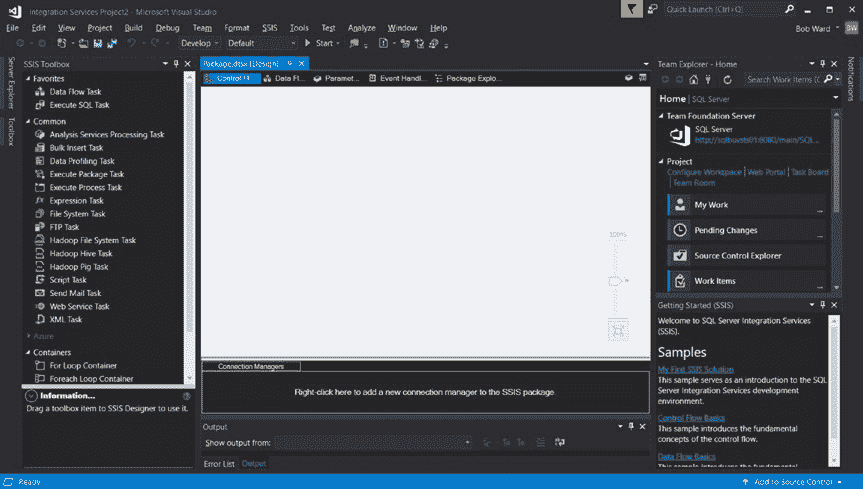
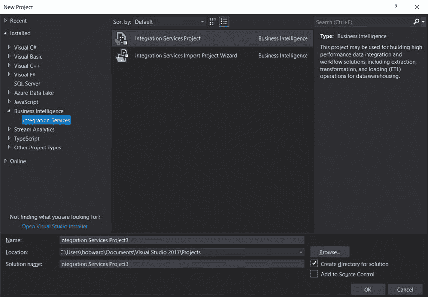
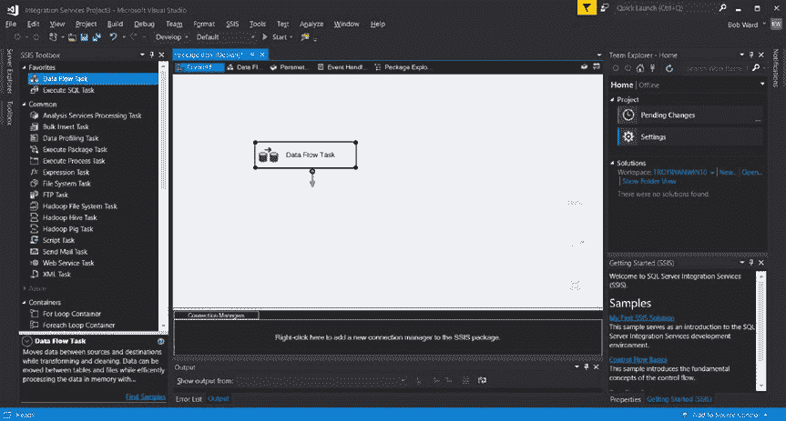
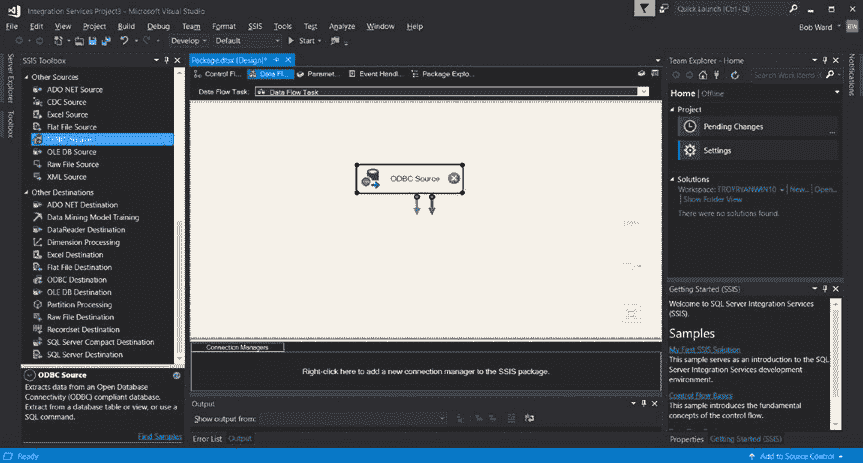
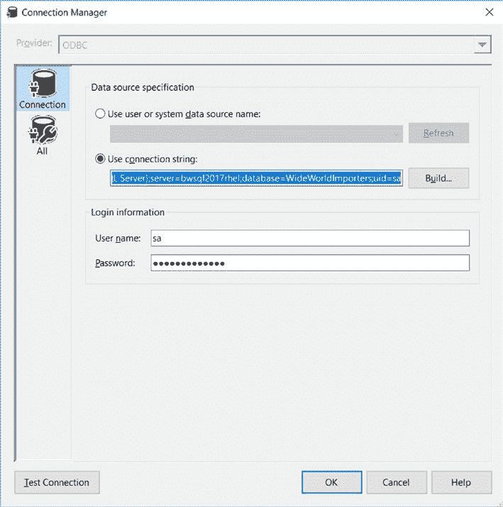
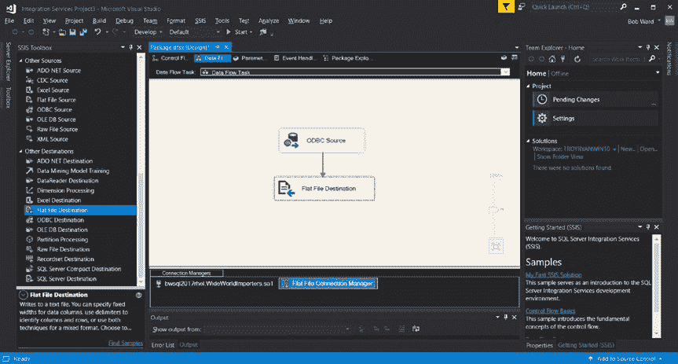

# 第 5 章 SQL Server 工具

## 3226

默认情况下，SQL Server 会将每次成功的备份操作记录到 `ERRORLOG`。对某些客户而言，这会在 `ERRORLOG` 中产生过多噪音。此跟踪标志将禁用将成功的备份信息写入 `ERRORLOG`。

## 3608

此跟踪标志只能在启动时使用。如果启用了此跟踪标志，SQL Server 将仅恢复 `master` 数据库。除非您尝试访问需要 `tempdb` 的功能（例如创建临时表），否则不会创建 `tempdb`。此命令对于高级恢复场景和 SQL Server 启动故障排除可能很有用。

## 4199

此跟踪标志用于启用累积更新中的查询优化器修复。您可以在此 Microsoft 知识库文章中阅读有关如何使用此跟踪标志的更多信息：[`support.microsoft.com/help/974006/sql-server-query-optimizer-hotfix-trace-flag-4199-servicing-model`](https://support.microsoft.com/help/974006/sql-server-query-optimizer-hotfix-trace-flag-4199-servicing-model)。

## 7752

启用查询存储的异步加载。我建议您在生产环境中使用查询存储时开启此标志，以避免在数据库启动时将查询存储数据加载到内存期间阻塞用户导致的问题。

## 3604

此标志未记录在案。它使得一些 `DBCC` 命令的输出可以作为消息显示回客户端应用程序。对于已记录的 `DBCC` 命令，您不需要这个标志，但某些未记录的命令需要它才能工作（主要示例是 `DBCC PAGE`）。

**注意**：在查询级别还存在一个名为 `QUERYTRACEON` 的跟踪标志功能。此选项仅适用于特定的跟踪标志列表。您可以在此处阅读有关此跟踪标志选项的更多信息：[`support.microsoft.com/help/2801413/enable-plan-affecting-sql-server-query-optimizer-behavior-that-can-be`](https://support.microsoft.com/help/2801413/enable-plan-affecting-sql-server-query-optimizer-behavior-that-can-be)。

## SSIS 用于 ETL

虽然 `bcp` 提供了基本的导入/导出功能，但在某些场景下，您可能需要更复杂的功能来提取、转换和加载（ETL）数据。SQL Server 提供了一个以 SQL Server Integration Services (SSIS) 形式提供丰富 ETL 功能的特性。

使用 SSIS 的第一步是在 RHEL 或 Ubuntu 上安装适用于 Linux 的 SSIS 包（截至本书撰写时，SQL Server 2017 不提供 SUSE 的 SSIS 包）。安装过程类似于 SQL Server，并与 RHEL (`yum`) 和 Ubuntu (`apt-get`) 的软件包管理器集成。SSIS 安装过程还需要一个名为 `ssis-conf` 的脚本来完成设置过程。

您可以按照我们的文档了解安装过程以及部署的其他方面，例如更新和无人参与安装：[`docs.microsoft.com/sql/linux/sql-server-linux-setup-ssis`](https://docs.microsoft.com/sql/linux/sql-server-linux-setup-ssis)。


在 Linux 上安装 SSIS 时，我们不会创建 systemd 服务。取而代之的是，一个名为 `dtexec` 的 Linux 程序会被安装到 `/opt/ssis` 目录中。`dtexec` 是在 Linux 服务器上执行 SSIS 包所使用的程序。与 SQL Server 类似，`dtexec` 使用 SQLPAL 架构，使得在 Windows 上运行 SSIS 的相同代码也能在 Linux 上运行。

##### 创建包

Linux 上的 SSIS 需要一个包来执行 ETL 场景。包被创建并保存为一种基于 XML 的文件格式，称为数据转换服务包（`DTSX`）文件格式。完整格式的文档位于 [`msdn.microsoft.com/library/gg587140.aspx`](https://msdn.microsoft.com/library/gg587140.aspx)。

通过直接编辑 `DTSX` 格式文件来创建包是复杂的。因此，可以使用 Windows 上的 SQL Server Data Tools（`SSDT`）工具或使用 .Net 包 `Microsoft.SqlServer.Dts.Runtime` 开发程序来创建 SSIS 包。有关构建程序以创建和运行包的更多信息，请参阅我们的文档：[`docs.microsoft.com/sql/integration-services/integration-services-programming-overview`](https://docs.microsoft.com/sql/integration-services/integration-services-programming-overview)。

###### SQL Server Data Tools

`SSDT` 在 Visual Studio IDE 开发环境中工作。`SSDT` 安装在现有的 Visual Studio 安装中。如果您没有 Visual Studio，安装 `SSDT` 时会安装一个最小化的 Visual Studio 环境。因此，`SSDT` 是完全免费的，可用于在 Windows 计算机上创建 SSIS 包。您可以在我们的文档中找到下载和安装 `SSDT` 的完整说明：[`docs.microsoft.com/sql/ssdt/download-sql-server-data-tools-ssdt`](https://docs.microsoft.com/sql/ssdt/download-sql-server-data-tools-ssdt)。



###### 构建包

`SSDT` 附带一种称为“Integration Services 项目”的项目类型。当您创建一个新的 Integration Services 项目时，会呈现一个可视化设计器来构建包。图 5-43 展示了一个新的 Integration Services 项目中的包设计器示例。

***图 5-43.** `SSDT` 中带有 Integration Services 项目的包设计器*

SSIS 包具有许多选项和功能，可连接到数据源以提取和加载数据。此外，包可以包含各种各样的数据流任务，以实现丰富的转换。

我将创建一个简单的示例，展示如何构建一个包并使用 `dtexec` 在 Linux 服务器上执行它。在此示例中，我将构建一个包，该包将从我在第 3 章向您展示的 `WideWorldImporters` 示例中提取 `People` 表的所有数据，并将数据写入 Linux 服务器上的一个文本文件。



使用 `SSDT`，我创建了一个名为 Integration Services 项目的新项目（我从工具的“新建”菜单中选择了“项目”，并在“已安装”/“商业智能”下找到了这个项目类型）。图 5-44 显示了启动新 Integration Services 项目的界面。

***图 5-44.** `SSDT` 中的一个新的 Integration Services 项目*

选择此项目类型后，我看到了如图 5-43 所示的包设计器屏幕。为了执行提取数据并将其写入文件的简单示例，主包设计器屏幕上的第一步是创建一个新的数据流任务。我可以通过在设计器左侧的 SSIS 工具栏中选择“数据流任务”，然后将其图标拖放到主设计器中来完成此操作。


## SQL Server 工具

窗口，默认称为控制流设计器。



图 5-45 展示了我为此数据包向控制流添加一个数据流任务后的屏幕。

***图 5-45.** 一个已添加到 SSIS 包控制流中的数据流任务*

在控制流设计器旁边的选项卡是数据流设计器。通过双击名为“数据流任务”的矩形形状，我可以查看此数据流任务的设计。

对于数据流任务，我需要添加一个数据源（这将是我运行在 Linux 上的 SQL Server）和一个目标（这将是一个平面文件）。对于数据源，我将需要一个 `ODBC` 源，因为我将在 Linux 服务器上运行此数据包。首先，我从 SSIS 工具栏的“其他源”类别中找到了 `ODBC 源`，并将其拖放到我的设计器窗口中。图 5-46 显示了我向数据流任务添加一个 `ODBC 源`后的屏幕。



***图 5-46.** 向数据流任务添加 `ODBC 源`*

现在我需要配置 `ODBC` 源，使其指向我运行在 Linux 服务器上的 SQL Server 及其示例 `WideWorldImporters` 数据库。我将通过右键单击 `ODBC 源` 并选择 `编辑` 来完成此操作。在下一个 `ODBC 连接管理器`窗口中，我选择了 `新建`。这将打开另一个窗口，我将在其中再次单击 `新建` 按钮来建立新连接。

在此屏幕上，我将使用一个 `ODBC` *连接字符串*。连接字符串是提供连接到运行在 Linux 上的 SQL Server（或任何其他基于 `ODBC` 的数据源）所需全部信息的一种方法。对于本示例，我的连接字符串如下所示：

```
Driver={ODBC Driver 17 for SQL Server};server=bwsql2017rhel;database=WideWorldImporters;uid=sa
```

连接字符串是程序员为 SQL Server 提供连接信息的常用方式。您可以在我们的文档中了解更多关于 `ODBC` 所有连接字符串选项的信息：[`docs.microsoft.com/sql/connect/odbc/dsn-connection-string-attribute`](https://docs.microsoft.com/sql/connect/odbc/dsn-connection-string-attribute)。



在此屏幕上，我还将提供 `sa` 的登录名和 `sa` 密码。图 5-47 显示了我单击 `确定` 创建此新连接之前的屏幕。

***图 5-47.** 为 SSIS 包使用连接字符串创建新连接*

**注意** 要在您的 Windows 计算机上的数据包中使用此连接字符串，您必须在 Windows 计算机上安装 `ODBC Driver 17 for SQL Server`。您可以从以下网址下载此包：[`docs.microsoft.com/sql/connect/odbc/download-odbc-driver-for-sql-server`](https://docs.microsoft.com/sql/connect/odbc/download-odbc-driver-for-sql-server)。



一旦您单击 `确定`，就可以在 `ODBC 源`屏幕上的 `表或视图的名称`字段中选择 `表名`。对于本示例，我选择了 `"Application"."People"` 表。为了简化此示例，我需要从此表中排除那些是 `varbinary(max)` 或 `varchar(max)` 的列，即 `HashedPassword`、`UserPreferences`、`Photo` 和 `CustomFields` 列。存在一些方法可以通过数据转换任务将这些列包含在提取到文件中。要排除这些列，我需要选择 `ODBC 源窗口`左侧的 `列`选项，并取消选中这些列名，然后单击 `确定`按钮。

现在我准备设置 `平面文件目标`。从 SSIS 工具栏中，将 `平面文件目标`图标拖放到存在 `ODBC 源`的画布上。

现在，您可以将 `ODBC 源`形状的蓝色箭头连接到 `平面文件目标`。右键单击并选择 `编辑`以提供文件信息。


