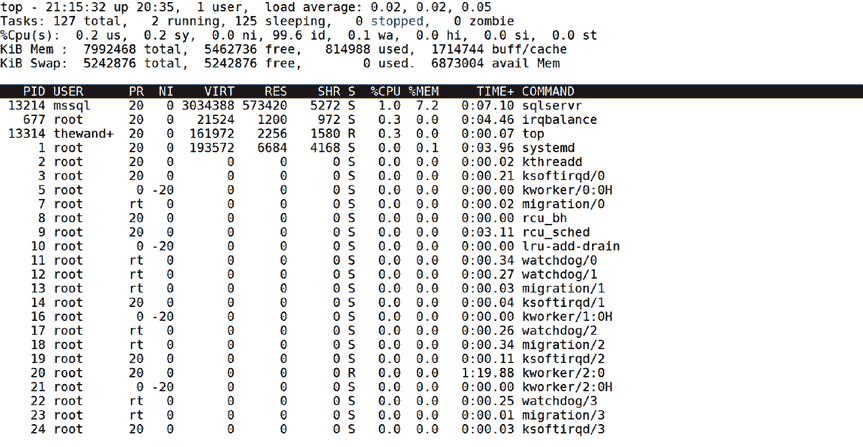

# 性能能力

## SQL Server 内存消耗概述

在一个新的数据库上，该引擎在 Linux 上将消耗大约 600MB 的内存。

然后，当你创建数据库、加载数据并执行查询时，SQL Server 会增加其内存消耗，直到达到设计的限制。许多年前，当我在 Windows 上为 SQL Server 提供技术支持时，我经常听到我的 Windows 同事抱怨 SQL Server 在“泄漏”内存。他们观察到的其实是 SQL Server 内存消耗的自然动态增长。SQL Server 不会无限增长其内存消耗，从而避免在 Linux 上造成可能的内存问题。SQL Server 受两个可配置的内存限制所约束。我将在本章后面的章节中讨论这些设置。

## 内存收缩机制

SQL Server 可以缩减其内存占用的方法之一是，其引擎内部最大的内存消耗者是缓存。这些缓存消费者是 `缓冲池` 和 `计划缓存`。

`缓冲池` 是一个数据库页面的缓存，包括数据、索引和系统页面。由于所有数据库页面都由数据库文件支持，因此在任何时候都可以释放一个干净的（未修改的）数据库页面，或者将一个脏的数据库页面写入磁盘，以便为另一个页面腾出空间。

`计划缓存` 是用于查询（包括其查询计划）的一组独立的内存缓存。SQL Server 将缓存即席查询和存储过程等对象的查询计划，这样就不必为每次执行都进行编译。并非所有查询执行计划都会被缓存。有关此主题的更多详细信息，请阅读我们的文档：[`docs.microsoft.com/sql/relational-databases/query-processing-architecture-guide#execution-plan-caching-and-reuse`](https://docs.microsoft.com/sql/relational-databases/query-processing-architecture-guide#execution-plan-caching-and-reuse)。

## 观察动态内存增长

这里有一个简单的测试，可以观察 SQL Server 将如何通过缓冲池动态增长其内存使用量。注意：如果你已经还原了 `WideWorldImporters` 备份或从前面的章节创建了它，以下步骤将删除该数据库并还原完整的示例备份。

1.  如果你尚未执行此操作，请使用以下 T-SQL 命令从任何 SQL 工具删除 `WideWorldImporters` 示例：

    ```
    USE [master]
    GO
    DROP DATABASE IF EXISTS [WideWorldImporters]
    GO
    ```

    

2.  从 Linux shell 使用以下命令重新启动 Linux 上的 SQL Server：

    ```
    sudo systemctl restart mssql-server
    ```

3.  让我们观察 `sqlservr` 进程消耗的内存量以及 SQL Server 引擎内部使用的内存。从 Linux shell 运行 `top` 命令。

    ```
    top
    ```

    在 `RES` 列下查找 `sqlservr` 进程消耗的内存。图 6-4 显示，在我的 Linux 虚拟机上，`sqlservr` 进程消耗了大约 570MB。

    **图 6-4.** 初始启动后 `sqlservr` 消耗的内存

4.  现在运行以下 T-SQL 命令，查看 SQL Server 引擎在其自身内存管理中消耗的总内存量。此 T-SQL 批处理在示例脚本 `sqlmem.sql` 中提供：

    ```
    -- 查找 SQL Server 引擎内部使用的总内存、缓冲池使用的总量
    -- 以及 SQL Server 认为自己可以增长到的目标值
    --
    SELECT counter_name, cntr_value FROM sys.dm_os_performance_counters
    WHERE object_name = 'SQLServer:Memory Manager'
    AND counter_name IN ('Database Cache Memory (KB)', 'Total Server Memory (KB)', 'Target Server Memory (KB)')
    GO
    ```

`sys.dm_os_performance_counters` 是一个动态管理视图 (DMV)，用于查询跨 SQL Server 引擎的某些性能统计信息。在 Windows 上，这些值也通过一个名为“性能监视器”的工具公开。对于 Linux，我可以直接用 T-SQL 查询这些数据。

**提示：** 要查找 SQL Server 性能计数器对象和...


