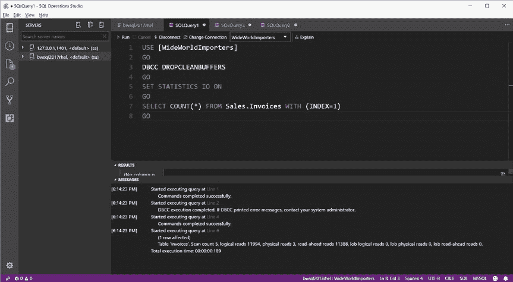
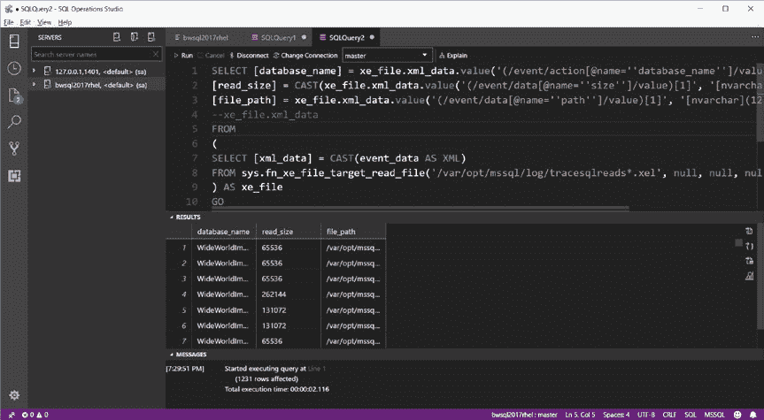

# 第六章：性能能力

## 数据库内存统计信息

关于其描述，您可以参考我们文档中的此部分：[`docs.microsoft.com/sql/relational-databases/performance-monitor/use-sql-server-objects`](https://docs.microsoft.com/sql/relational-databases/performance-monitor/use-sql-server-objects)。

让我在我的 Linux 服务器上展示结果，这样您可以在自己的系统上进行观察。图 6-5 显示了运行此 T-SQL 批处理的结果。

*图 6-5. 检查 SQL Server 内存统计信息*

**数据库缓存内存（KB）** 是缓冲池使用的内存量。在此服务器启动时，它仅约为 18MB。

**目标服务器内存（KB）** 是 SQL Server 可以增长到的潜在内存量。可以将其视为 SQL Server 引擎内使用内存的上限。在此示例中，它约为 6.2GB。

**总服务器内存（KB）** 是 SQL Server 引擎内使用的内存量，约为 174MB。

那么，为什么`top`命令显示`sqlservr`进程占用了 500 多 MB 呢？这是因为总服务器内存（KB）与`top`显示的值之间的差异，是`sqlservr`进程在 Linux 上分配的一个相当固定量的内存，与 SQL Server 引擎的内存消费者（如缓冲池，包括 SQLPAL）无关。随着 SQL Server 分配内存量的增长，这个差异应保持相当恒定。

现在，我们继续展示一个 SQL Server 如何通过缓冲池动态增长其内存使用的快速示例：
*   使用示例脚本 `restorewwi.sh` 还原完整的 WideWorldImporters 示例数据库。
*   运行以下 T-SQL 命令，这将强制 SQL Server 将 WideWorldImporters 数据库中的所有数据库页面读入缓冲池：
```
USE master
GO
DBCC CHECKDB(WideWorldImporters) WITH TABLOCK
GO
```
*   运行与之前相同的 `top` 命令和前面的 T-SQL 查询，以查看 `dm_os_performance_counters`。

在我的 Linux 服务器上，`top` 命令显示 SQL Server 的内存增加到约 1.3GB（查看 RES 列）。数据库缓存内存（KB）增加到约 430MB，总服务器内存（KB）增加到约 720MB，目标服务器内存（KB）略有增加。这些增长与 WideWorldImporters 数据库大约拥有 400MB 数据库页面的事实相符。

##### 高效的 I/O 处理

SQL Server 使用高效的方法读写数据库页面和事务日志记录，以最大化性能并确保持久性和一致性。这包括预读、预写日志记录、检查点处理和数据压缩。

此外，由于 SQL Server 有自己的缓存机制，引擎在 Linux 上打开数据库和事务日志文件时，通过启用 `O_DIRECT` 标志来使用直接 I/O，以绕过文件系统缓存。您可以在 [`man7.org/linux/man-pages/man2/open.2.html`](http://man7.org/linux/man-pages/man2/open.2.html) 阅读更多关于 `O_DIRECT` 的信息。

###### 预读

每个数据库页面大小为 8KB。如果 SQL Server 每次需要从磁盘读取数据时都尝试只读取单个数据库页面，效率会很低。相反，SQL Server 使用一种称为预读的机制将数据库页面拉入缓冲池。其思路是当前执行的查询很可能需要这些页面，因此将它们拉入缓存会更高效，因为较大的读取大小比较大量的较小读取更高效。SQL Server 中使用预读的场景是从表或索引中扫描跨越多个页面的若干行时。如何判断 SQL Server 是否正在使用预读来读取数据库页面？有几种方法：


- 在执行页面读取查询的会话中使用 `SET STATISTICS IO` T-SQL 语句。
- 使用扩展事件来跟踪 `file_read_completed` 事件。

你还可以使用 DMV `dm_os_performance_counters` 查看 SQL Server 中预读的整体使用情况，使用 object_name = `'SQLServer:Buffer Manager'` 和 counter_name = `'Readahead pages/sec'`。

SQL Server 只能从数据库文件中读取连续的多个页面，因此预读的大小可能因表或索引中的页面组织方式而异。因此，如果表或聚集索引存在碎片，导致许多包含数据的页面在数据库文件中不连续，预读的效果就会降低。我将在第 9. T 章讨论索引碎片及其管理方法。预读操作存在一些限制。SQL Server 2017 企业版中预读的最大大小为 1MB。在 SQL Server 的其他版本中，此数值会更低。

## 第 6 章 性能功能

SQL Server 在为缓冲池中尚未存在的页面执行预读时，会尝试异步读取的页面数量也有限制。此最大值在企业版 (5,000) 中比其他版本 (128) 更大。

以下是一个示例，展示 SQL Server 如何对典型的表数据扫描使用预读。此示例假定你已还原完整的 WideWorldImporters 数据库：

1.  使用以下 T-SQL 语句集创建并启动一个扩展事件会话。这些语句可在示例脚本 `tracesqlreads.sql` 中找到：

```
CREATE EVENT SESSION [tracesqlreads] ON SERVER
ADD EVENT sqlserver.file_read_completed(SET collect_path=(1)
ACTION(sqlserver.database_name,sqlserver.sql_text)
WHERE ([sqlserver].[database_name]=N'WideWorldImporters'))
ADD TARGET package0.event_file(SET filename=N'tracesqlreads')
WITH (MAX_MEMORY=4096 KB,EVENT_RETENTION_MODE=ALLOW_SINGLE_EVENT_LOSS,MAX_DISPATCH_LATENCY=30 SECONDS,MAX_EVENT_SIZE=0 KB,MEMORY_PARTITION_MODE=NONE,TRACK_CAUSALITY=OFF,STARTUP_STATE=OFF)
GO

ALTER EVENT SESSION [tracesqlreads] ON SERVER STATE=START
GO
```

对于此扩展事件会话，我使用文件目标将扩展事件数据写出。

2.  从你常用的 SQL Server 工具执行以下 T-SQL 批处理。我将使用 SQL Operations Studio。这些语句可在示例脚本 `sqlreadahead.sql` 中找到：

```
USE [WideWorldImporters]
GO

DBCC DROPCLEANBUFFERS
GO

SET STATISTICS IO ON
GO

SELECT COUNT(*) FROM Sales.Invoices WITH (INDEX=1)
GO
```



## 第 6 章 性能功能

在此示例中，我使用 `DBCC DROPCLEANBUFFERS` 语句强制 SQL Server 从磁盘读取查询所需的所有页面。然后我使用 `SET STATISTICS IO`，以便 SQL Server 返回包含 SELECT 语句 I/O 统计信息的消息。

对于 T-SQL SELECT 语句读取数据，我使用了一个 `查询提示` 来强制 SQL Server 扫描 `Sales.Invoices` 表聚集索引的所有页面。你可以在我们的文档 [`docs.microsoft.com/sql/t-sql/queries/hints-transact-sql-query`](https://docs.microsoft.com/sql/t-sql/queries/hints-transact-sql-query) 中阅读有关查询提示的更多信息。图 6-6 显示了在我的 Linux 服务器上执行 SELECT 语句的 I/O 统计信息。

**图 6-6. SQL Server 预读的 I/O 统计信息**

物理读取是单页读取。预读次数是指 SQL Server 在从数据库文件读取时尝试读取多个页面的次数。

## 第 6 章 性能功能

3.  现在，我可以使用扩展事件会话的结果来查看预读所使用的大小。首先，我需要使用以下 T-SQL 语句停止扩展事件会话：

```
ALTER EVENT SESSION [tracesqlreads] ON SERVER STATE=STOP
GO
```

4.  现在我使用以下 T-SQL 语句从


## 第 6 章 性能特性

使用 `fn_xe_file_target_read_file` 系统存储过程的扩展事件会话。你可以在示例脚本 `readxefile.sql` 中找到此 T-SQL 批处理：

```sql
SELECT [database_name] = xe_file.xml_data.value('(/event/action[@
name="database_name"]/value)[1]','nvarchar'),
[read_size] = CAST(xe_file.xml_data.value('(/event/data[@
name="size"]/value)[1]', 'nvarchar') AS INT),
[file_path] = xe_file.xml_data.value('(/event/data[@name="path"]/
value)[1]', 'nvarchar')
--xe_file.xml_data
FROM
(
SELECT [xml_data] = CAST(event_data AS XML)
FROM sys.fn_xe_file_target_read_file('/var/opt/mssql/log/
tracesqlreads*.xel', null, null, null)
) AS xe_file
GO
```

此系统过程以 XML 形式返回扩展事件数据。前面的查询展示了如何将 XML 数据 `分解` 到列和行的示例。

在我的 Linux 服务器上，此会话的部分结果可见于图 6-7。



*图 6-7. SQL Server 预读读取的读取大小扩展事件*

`read_size` 列以字节为单位测量。你可以看到几次读取是 64KB，而有些更大，包括 246KB 和 128KB。

### 预写式日志

当 SQL Server 需要修改缓冲池中数据页上的数据时，如果 SQL Server 必须等待每个数据库页的所有更改都写入磁盘（对于需要更改的 T-SQL 语句，例如 `INSERT` 语句），性能将不是最优的。

由于每个数据库都包含一个事务日志，如果 SQL Server 确保所有更改都写入事务日志文件，它就不必立即写入数据库页。此概念称为预写式日志（此概念也称为 WAL 协议）。只要 SQL Server 确保已提交事务的所有修改都写入磁盘上的事务日志，即使 SQL Server 或 Linux 服务器意外终止，对数据库页的更改未写入磁盘，所有事务也将保持 `一致性`。

此架构允许修改数据的 T-SQL 语句以更改能被 `固化` 到事务日志的速度运行。这意味着对于依赖数据库修改性能的应用程序（例如 OLTP 密集型应用程序），将事务日志文件放置在极快的存储系统上非常重要。

SQL Server 确实提供了一个名为 `延迟持久性` 的功能，它允许事务在完成时无需等待事务日志更改写入磁盘。然而，性能的代价是可能的数据丢失。你可以在我们的文档中阅读更多关于 SQL Server 事务持久性选项的信息：[`docs.microsoft.com/sql/relational-databases/logs/control-transaction-durability`](https://docs.microsoft.com/sql/relational-databases/logs/control-transaction-durability)。

事务日志写入由名为 `LOG WRITER` 的后台任务执行（你可以通过查找 `dm_exec_requests` 中 `command = LOG WRITER` 的行来查看此后台任务）。出于可扩展性目的，我们在 SQL Server 2016 中进行了增强，使每个 NUMA 节点使用多个 `LOG WRITER` 任务。你可以在此博文中阅读更多关于此概念的信息：[`blogs.msdn.microsoft.com/bobsql/2016/06/03/sql-2016-it-just-runs-faster-multiple-log-writer-workers/`](https://blogs.msdn.microsoft.com/bobsql/2016/06/03/sql-2016-it-just-runs-faster-multiple-log-writer-workers/)。

###### 检查点、延迟写入和急切写入

如果 SQL Server 从不将修改过的数据库页（也称为 `脏页`）写入磁盘上的数据库数据文件，事务日志将无限增长并需要大量磁盘空间。此外，如果 SQL Server 数据库需要恢复，情况会...


重启过程可能耗时极长，因为所有更改都必须从事务日志中重放。

SQL Server 采用多种技术将数据库页面写入磁盘。所有这些技术都基于与预读类似的原理，即将连续的数据库页面一起写入，从而实现高效的大规模写入。

默认情况下，SQL Server 2017 使用一种名为 `间接检查点` 的数据库页面写入方法。间接检查点使用 `目标恢复时间` 来决定何时收集脏页并将其写入相应的数据库数据文件。这一概念旨在可靠地确保：如果数据库必须重启，它可以在一个已知的时间间隔内完成恢复（事务前滚和回滚）。

目标恢复时间可通过 `ALTER DATABASE` T-SQL 语句中的 `TARGET_RECOVERY_TIME` 选项进行配置。默认值为一分钟。SQL Server 还提供了一个 `自动检查点` 选项，这是 SQL Server 2016 之前版本的默认行为。自动检查点使用 `sp_configure` 选项 `recovery interval`，可能导致 I/O 写入行为不平滑，可能出现峰值。

间接检查点旨在产生更平滑的 I/O 写入模式，但可能对繁重的 OLTP 类型应用程序产生影响。间接检查点由名为 `RECOVERY WRITER` 的后台任务执行（您可以通过在 `dm_exec_requests` 中查找 command = `RECOVERY WRITER` 的行来查看此后台任务）。

## 第六章 性能能力

自动检查点由名为 `CHECKPOINT` 的后台任务执行（您可以通过在 `dm_exec_requests` 中查找 command = `CHECKPOINT` 的行来查看此后台任务）。

SQL Server 也可能为其他类型的内部操作和事件生成检查点。有关数据库检查点的完整说明，请参阅我们的文档：`https://docs.microsoft.com/sql/relational-databases/logs/database-checkpoints-sql-server`。

您可以通过在 `dm_os_performance_counters` 中查找 object_name = `SQLServer:Buffer Manager` 且 counter_name = `Background writer pages/sec` 的值来跟踪间接检查点。您可以通过在 `dm_os_performance_counters` 中查找 object_name = `SQLServer:Buffer Manager` 且 counter_name = `Checkpoint pages/sec` 的值来跟踪自动检查点。

当 SQL Server 需要为要读入缓冲池的新数据库页面释放内存（因为所有现有内存都已被使用）时，一些需要被释放的数据库页面可能是脏页。所有需要释放的脏页都必须写入磁盘。SQL Server 对这些写入使用 `WAL 协议` 以确保数据库一致性。

其中一些脏页可能属于未提交的事务，因此必须先写入事务日志记录，以便在恢复过程中必要时可以正确回滚这些未提交的事务。在缓冲池管理操作期间写出脏页的任何活动都称为 `延迟写入`。延迟写入将由名为 `LAZY WRITER` 的后台任务（您可以通过在 `dm_exec_requests` 中查找 command = `LAZY WRITER` 的行来查看此后台任务）或 `与` 试图分配内存的 SQL Server 工作线程 `同步` 执行。您可以通过在 `dm_os_performance_counters` 中查找 object_name = `SQLServer:Buffer Manager` 且 counter_name = `Lazy writes/sec` 的值来跟踪延迟写入活动。

SQL Server 的某些场景涉及大量数据库页面修改，例如 `批量插入`、`SELECT..INTO` 或 `INSERT..SELECT`。与其让检查点进程过载，SQL Server 会使用一种称为 `急切写入` 的技术来触发脏页写入，而不是等待检查点。没有特殊的后台


