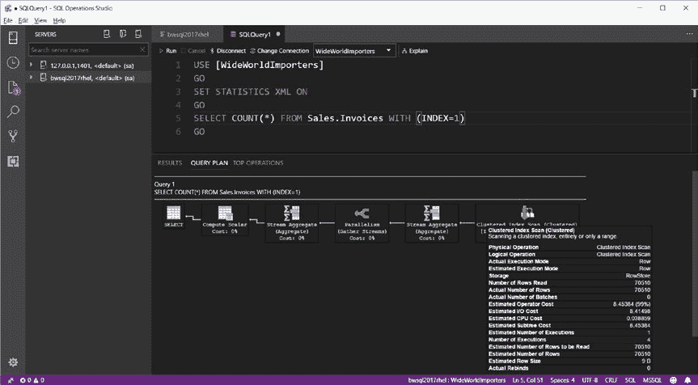

# 第 6 章 性能能力

###### 数据压缩

为了支持最大化内存占用，SQL Server 支持对数据库页和行进行数据压缩。压缩本质上允许你将数据库页中的更多数据装入缓冲池缓存，代价是在需要读取数据时进行解压缩操作。另一种更有趣的压缩形式在创建列存储索引时使用，我将在本章后面讨论。有关数据和行压缩的更多信息，请参阅我们的文档：[数据和行压缩](https://docs.microsoft.com/sql/relational-databases/data-compression/data-compression)。

##### 并行处理

为什么要使用一个线程，而两个线程能更快完成？这就是 SQL Server 中并行处理的理念。SQL Server 在整个引擎中具有并行处理能力，适用于许多不同的目的和场景。

最常见的场景是 *并行查询处理*。在编译查询以构建查询计划时，SQL Server 可以决定某种特定类型的操作（例如，索引扫描）如果由多个任务（工作线程）运行可能会更快。并行查询处理传统上在 SQL Server 社区中饱受诟病，因为使用并行处理的查询会消耗更多的 CPU 资源。虽然确实任何 SQL Server 选择使用并行查询处理操作符时，通常都存在调优的机会，但在某些情况下使用并行查询是更优的选择。这些场景大多与数据仓库应用程序相关。

我将在本章后面讨论用于控制并行查询处理和其他并行操作所涉及任务数量的配置选项。

让我们看一个如何观察并行查询处理的例子，使用一个 T-SQL `SELECT` 语句，该语句需要扫描一个聚集索引来检索单大量行。此示例假设你已如本章开头所述还原了完整的 `WideWorldImporters` 示例数据库。

使用 SQL Operations Studio 执行以下 T-SQL 批处理，该批处理可在示例脚本 `sqlqpparallel.sql` 中找到：

```sql
USE [WideWorldImporters]
GO
SET STATISTICS XML ON
GO
SELECT COUNT(*) FROM Sales.Invoices WITH (INDEX=1)
GO
```



图 6-8 显示了结果，包括查询计划的可视化表示。

**图 6-8.** 在 Linux 上的 SQL Server 中的并行查询计划

在此图中，注意并行查询计划的两个指标：

- `Parallelism` 操作符
- 聚集索引扫描的执行次数为 4。由于聚集索引扫描是查询中的第一个操作，执行次数 = 4 表示使用了 4 个工作线程来扫描聚集索引。

并行执行也用于 SQL Server 的其他领域，包括但不限于：

- **创建数据库**：SQL Server 将为每个唯一的磁盘卷创建一个工作线程来创建数据库和事务日志文件。
- **备份/还原**：SQL Server 将创建多个工作线程来读写数据库文件，并创建多个工作线程来读写数据库备份。
- **DBCC CHECKDB**：默认情况下，`DBCC CHECKDB` 将使用多个工作线程来检查数据库的一致性。跟踪标志 2528 可用于禁用并行工作线程执行 `CHECKDB`。
- **创建索引**：创建或重建索引使用多个工作线程。
- **SELECT..INTO/INSERT..SELECT**：这些“批量” T-SQL 语句可以使用多个工作线程来读取源表并填充目标表。
- **恢复**：SQL Server 可以使用多个工作线程来前滚...


### 第 6 章：性能能力

## 作为数据库恢复一部分的事务

##### 统计信息

现在可以并行更新统计信息。更多详情请参见以下博客文章：[`blogs.msdn.microsoft.com/sql_server_team/boosting-update-statistics-performance-with-sql-2014-sp1cu6/`](https://blogs.msdn.microsoft.com/sql_server_team/boosting-update-statistics-performance-with-sql-2014-sp1cu6/)。

#### 最大性能配置

尽管 SQL Server “开箱即用”就能满足许多应用程序的性能需求，但针对 SQL Server 实例、数据库以及 Linux 内核的配置选项可以帮助你最大化性能。

这些选项包括通过 `mssql-conf` 配置 SQL Server 实例、使用 T-SQL 系统存储过程 `sp_configure`，以及 T-SQL 的 `ALTER SERVER CONFIGURATION` 语句。

**注意**：与任何配置更改一样，我强烈建议你在对本节讨论的配置选项进行任何更改之前，先测试你的应用程序和工作负载。

##### SQL Server 实例配置

SQL Server 的某些配置设置会影响应用程序的最大性能。这些设置包括内存、并行执行、处理器关联性、跟踪、线程、计划缓存和 `tempdb` 文件。

**注意**：使用 `sp_configure` 和 `ALTER SERVER CONFIGURATION` 进行的配置设置更改可能需要重启 SQL Server 才能生效。更多详情请查阅 SQL Server 关于 `sp_configure` 的文档：[`docs.microsoft.com/sql/database-engine/configure-windows/server-configuration-options-sql-server`](https://docs.microsoft.com/sql/database-engine/configure-windows/server-configuration-options-sql-server)，或关于 `ALTER SERVER CONFIGURATION` 的文档：[`docs.microsoft.com/sql/t-sql/statements/alter-server-configuration-transact-sql`](https://docs.microsoft.com/sql/t-sql/statements/alter-server-configuration-transact-sql)。

### 内存

Linux 上的 SQL Server 默认只分配其所安装 Linux 服务器上物理内存的 80%，以帮助避免 `sqlservr` 进程发生交换。在 RAM 较大的系统上，预留 20% 的内存可能被视为一种浪费。因此，可以使用 `mssql-conf` 脚本通过 `memorylimitmb` 选项来更改此设置。将此值设置得过高时需谨慎，否则可能会在 Linux 上遇到 `oom killer` 的问题。你可以在以下链接阅读更多关于 Linux 上 `oom killer` 工作原理的信息：[`unix.stackexchange.com/questions/153585/how-does-the-oom-killer-decide-which-process-to-kill-first`](https://unix.stackexchange.com/questions/153585/how-does-the-oom-killer-decide-which-process-to-kill-first)。

SQL Server 引擎也有自己的内存限制配置设置，可通过 `sp_configure` 系统存储过程使用。SQL Server 引擎的上限由 `max server memory` 设定。默认值为 0，这等效于 80% 的 `memorylimitmb` 数值。如本章前面所述，SQL Server 会将其内存使用量增长到此上限。虽然在 Windows 上的 SQL Server 中将 `max server memory` 设置为非零值很常见，但由于 `memorylimitmb`...


在 Linux 上的配置中，很可能将 `max server memory` 设置为 0。SQL Server 也有一个下限，低于该值 SQL Server 将不会缩小其内存占用。

您可以使用 `sp_configure` 配置 `min server memory` 设置。我通常只在运行着其他程序的服务器上使用 `min server memory` 设置，这样可以“锁定” SQL Server，防止其将内存缩减得过低。

## 第 6 章 性能能力

### 注意

`memorylimitmb` 值不包括 SQL Server 引擎外部组件所需的内存，例如 `SQL Server agent`、`SQLpaL` 和 `host extension`。`SQL paL` 和 `host extension` 不应需要 SQL Server 引擎外部的太多内存。对于 `SQL Server agent`，您应执行测试以查看代理作业需要多少内存。

有关这些服务器内存配置选项的完整详细信息，请参阅我们的文档：[`docs.microsoft.com/sql/database-engine/configure-windows/server-memory-server-configuration-options`](https://docs.microsoft.com/sql/database-engine/configure-windows/server-memory-server-configuration-options)。

### 并行执行

我在本章前一节讨论了 SQL Server 将在哪些场景中并行执行任务。可通过 `sp_configure` 系统过程使用的两个实例配置设置是：`max degree of parallelism` 和 `cost threshold for parallelism`。

`max degree of parallelism` 用于控制查询计划中的操作符、索引构建操作、`DBCC CHECKDB`、并行插入、`联机列修改` 和 `统计信息更新` 所使用的最大并行任务数。默认值为 0，这意味着 SQL Server 会根据可用 CPU 为特定操作确定最佳的并行任务并发数。

关于此配置值的理想设置，SQL Server 社区已经争论了很长时间。寻找理想值的一个问题是，不同的工作负载在使用较高的 `max degree of parallelism` 值时可能效果更好。例如，使用 `列存储索引` 的数据仓库工作负载可能会在更多并行任务下达到最大性能。对于具有高并发用户数的 SQL Server 应用程序，尤其是包含 `OLTP 工作负载` 的应用程序，可能需要更改 `max degree of parallelism` 的默认值。我的经验和测试表明，仅当 SQL Server 配置在超过八个 CPU 的服务器上运行时才有必要这样做。当我在微软技术支持部门工作时，我们创建了以下知识库文章，为设置 `max degree of parallelism` 提供更多指导：[`support.microsoft.com/help/2806535/recommendations-and-guidelines-for-the-max-degree-of-parallelism-confi`](https://support.microsoft.com/help/2806535/recommendations-and-guidelines-for-the-max-degree-of-parallelism-confi)。如果您在设置此值时遇到困难，请放心，有数据库选项和查询级提示可用于覆盖此 SQL Server 实例设置。有关 `max degree of parallelism` 选项的更多详细信息，请参阅我们的文档：[`docs.microsoft.com/sql/database-engine/configure-windows/configure-the-max-degree-of-parallelism-server-configuration-option`](https://docs.microsoft.com/sql/database-engine/configure-windows/configure-the-max-degree-of-parallelism-server-configuration-option)。

## 第 6 章 性能能力


## 第 6 章 性能特性

“并行度的成本阈值”设置用于控制 SQL Server 查询优化器何时根据成本选择在查询计划中使用并行任务。默认值 5 适用于许多工作负载。然而，这个默认值是 SQL Server 工程团队在 SQL Server 7.0 时代基于测试设定的。因此，几乎所有 SQL Server 专家都认为这个默认值应该高得多。

事实上，SQL Server 文档在 [`docs.microsoft.com/sql/database-engine/configure-windows/configure-the-cost-threshold-for-parallelism-server-configuration-option`](https://docs.microsoft.com/sql/database-engine/configure-windows/configure-the-cost-threshold-for-parallelism-server-configuration-option) 中指出：“虽然为了向后兼容保留了默认值 5，但对于当前系统，更高的值可能更合适。许多 SQL Server 专业人士建议以 25 或 30 作为起始点，并使用更高和更低的值进行应用程序测试，以优化应用程序性能。”

### 进程亲和性

如本章前面所述，SQL Server 会自动利用多核和 NUMA 架构。在某些场景下，你可能只想允许 SQL Server 核心引擎及其工作线程在特定的 NUMA 节点和/或 CPU 上运行。你可以通过使用 `ALTER SERVER CONFIGURATION` T-SQL 命令来实现这一点。一种场景可能是，Linux 服务器上运行着其他进程，你希望确保它们获得足够的 CPU 资源，因此会将 SQL Server 限制为仅使用某些 NUMA 节点和/或 CPU。

例如，假设你有一台具有八个 CPU 的 Linux 服务器。以下 T-SQL 命令将只允许 SQL Server 在 CPU 4-7（CPU 从 0 开始计数）上调度工作线程：

```
ALTER SERVER CONFIGURATION SET PROCESS AFFINITY CPU = 4 TO 7
GO
```

此命令的效果是动态且立即生效的，无需重新启动 SQL Server。此时，若要切换回允许 SQL Server 在所有可用 CPU 上运行，请执行以下 T-SQL 语句：

```
ALTER SERVER CONFIGURATION SET PROCESS AFFINITY CPU = AUTO
GO
```

为了获得最佳性能，我们在测试中发现，*如果你计划允许 SQL Server 在所有可用 CPU 上运行*，你应该将亲和性设置为系统上的所有节点或 CPU。例如，如果你有一个 4 个 NUMA 节点的系统，那么你将亲和性设置为所有节点，如下列 T-SQL 语句所示：

```
ALTER SERVER CONFIGURATION SET PROCESS AFFINITY NUMANODE = 0 TO 3
GO
```

**注意** 有些线程在 `SQLpal` 或 `host` 扩展的上下文中执行，它们不是已调度的工作线程。它们不会遵守使用 `ALTER SERVER CONFIGURATION` 的设置，但它们的执行消耗的 CPU 应该不会像 SQL Server 工作线程那么多。

有关设置进程亲和性的更多示例，请参阅我们的文档：[`docs.microsoft.com/sql/t-sql/statements/alter-server-configuration-transact-sql`](https://docs.microsoft.com/sql/t-sql/statements/alter-server-configuration-transact-sql)。

### 跟踪

我在本书前面提到过遗留的跟踪功能 SQL Server Trace。在之前的几个版本中，我们加入了一个 *默认跟踪*，当 SQL Server 中的配置选项被更改以及对象修改被跟踪时，它会捕获一些基本信息。

虽然这些信息中的一些可能对你有用，但我建议你通过 `sp_configure` 关闭这个名为 `default trace enabled` 的配置选项。每一个微小的...

