# 第六章 性能能力

###### 使用多个数据库文件和文件组

对于单个数据库，我已经描述了多个并发任务写入数据库的进程和场景，例如检查点、延迟写入和急切写入。然而，更常见的是看到针对数据库页的多个并发读取器。这些读取场景可能是多个用户执行需要从磁盘读取数据库页的查询，或者是执行带有并行运算符的单个查询。

如果你将数据库文件存储在经过条带化且为并发 I/O 优化的存储系统上，你可能只需使用一个数据库文件。然而，许多 SQL Server 的生产数据库使用多个数据库文件和一个称为 `文件组` 的概念。

文件组是数据库文件的逻辑分组。在你创建一个包含多个数据库文件的文件组的数据库后，SQL Server 将使用 `轮询、按比例填充` 算法在这些文件中分配页。轮询意味着 SQL Server 将分配


### 第 6 章：性能能力

从数据库文件组中分配页面组，然后再分配到文件组中的其他文件。按比例填充意味着 SQL Server 会尝试执行这些分配，使得使用的空间在数据库文件之间分布得相当均匀。

一旦创建了文件组，你就可以将一个或多个表或索引指定到该命名文件组。默认情况下，每个数据库都有一个名为 `PRIMARY` 的内置文件组。所有系统表都存储在与 `PRIMARY` 文件组关联的文件中。

生产数据库最常见的配置是为 `PRIMARY` 文件组创建一个较小的数据库文件，并为一组表和/或索引创建一个或多个命名文件组。从管理角度来看，文件组还提供了其他优势。你可以将文件组作为一个单位进行备份、还原、运行一致性检查和管理。

让我们看一个示例，了解如何创建一个数据库，该数据库使用一个独立的文件组将数据分布在多个磁盘的多个文件上，同时将事务日志放在另一个独立的磁盘上。

首先，我需要为我的 Linux 服务器添加磁盘。之前提到过，我使用的是一个运行在 Windows Hyper-V 上的 Linux 虚拟机。对于 Windows 上的 Hyper-V，你可以按照我们文档中关于如何向虚拟机添加控制器、磁盘等硬件的说明进行操作：[`docs.microsoft.com/azure/virtual-machines/linux/attach-disk-portal`](https://docs.microsoft.com/azure/virtual-machines/linux/attach-disk-portal)。

添加硬件后，我需要在 Linux 操作系统中配置新磁盘，并将目录挂载到这些磁盘上。我的虚拟机已经有两块磁盘：一块用于 Linux 的标准文件，另一块专门挂载到 `/var/opt` 目录，标准 SQL Server 数据库文件就存放在那里。对于本示例：

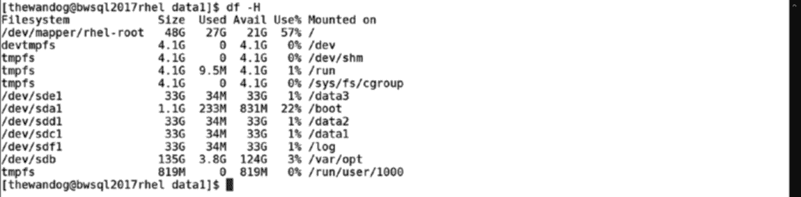

我添加了四块新磁盘：一块用于存放三个新的数据库文件（它们将组成自己的文件组），另一块用于事务日志。如果你之前没有在 Linux 中配置过磁盘，我发现这份关于如何在 Azure 虚拟机中操作的文档非常有用：[`docs.microsoft.com/azure/virtual-machines/linux/add-disk`](https://docs.microsoft.com/azure/virtual-machines/linux/add-disk)。

对于我的虚拟机，当我完成磁盘配置并将目录挂载到它们之后，最终的配置如图 6-9 所示。

*图 6-9. 在 Linux 中为 SQL Server 使用多块磁盘*

在我的示例中，`/dev/sdb` 磁盘是我为虚拟机创建的第二块磁盘，我将 `/var/opt` 目录挂载到了上面。安装 SQL Server 时，系统数据库被复制到了 `/var/opt/mssql/data`。这里也将是我存放 `PRIMARY` 文件组数据库文件的地方。

表 6-1 列出了其他磁盘及其挂载目录。出于本示例的目的，我将每个虚拟磁盘的大小都设置为 30GB。

*表 6-1. 磁盘及其挂载目录*

| **磁盘** | **挂载目录** | **用途** |
| :--- | :--- | :--- |
| `/dev/sdc1` | `/data1` | 数据库文件 |
| `/dev/sdd1` | `/data2` | 数据库文件 |
| `/dev/sde1` | `/data3` | 数据库文件 |
| `/dev/sdf1` | `/log` | 事务日志 |

**提示：** 如前面关于向 Linux 添加磁盘的文档所述，务必在 `/etc/fstab` 文件中更新这些磁盘的信息，以便在任何重启后它们都能被自动挂载。此外，务必通过执行 `sudo chown mssql:mssql <directory>` 命令将这些目录的权限更改为 `mssql` 组和用户。

创建好这些磁盘并挂载目录后，我现在可以像示例 `bigdb.sql` 中的以下 T-SQL 语句那样创建我的数据库了：

```sql
USE [master]
GO
CREATE DATABASE [big dB]
ON  PRIMARY
( NAME = N'bigdb_Primary', FILENAME = N'/var/opt/mssql/data/bigdb.mdf' ,
SIZE = 5GB , MAXSIZE = 100GB, FILEGROWTH = 65536KB ),
FILEGROUP [USERDATA]  DEFAULT
```


```
( NAME = N'bigdb_UserData_1', FILENAME = N'/data1/bigdb_UserData_1.ndf' ,
SIZE = 10GB , MAXSIZE = 30GB, FILEGROWTH = 65536KB ),
( NAME = N'bigdb_UserData_2', FILENAME = N'/data2/bigdb_UserData_2.ndf' ,
SIZE = 10GB , MAXSIZE = 30GB, FILEGROWTH = 65536KB ),
( NAME = N'bigdb_UserData_3', FILENAME = N'/data3/bigdb_UserData_3.ndf' ,
SIZE = 10GB , MAXSIZE = 30GB, FILEGROWTH = 65536KB )
LOG ON
( NAME = N'big_Log', FILENAME = N'/log/bigdb_log.ldf' , SIZE = 10GB ,
MAXSIZE = 30GB , FILEGROWTH = 65536KB )
GO
```

查看此 `CREATE DATABASE` 语句，您可以看到我将 `PRIMARY` 文件组放在了默认位置 `/var/opt/mssql/data`；将三个数据库文件放在了 `USERDATA` 文件组中，位于 `/data1`、`/data2` 和 `/data3` 目录；并将事务日志文件放在了 `/log` 目录。我为这些文件选择了任意大小，但当您为生产环境创建数据库时，您需要花时间仔细确定这些文件的初始最佳大小。我将在下一节讨论 `MAXSIZE` 和 `FILEGROWTH` 参数，但为文件的初始大小做规划对于整体性能至关重要。请参阅我们文档中的指南 [`docs.microsoft.com/sql/relational-databases/databases/estimate-the-size-of-a-database`](https://docs.microsoft.com/sql/relational-databases/databases/estimate-the-size-of-a-database)，了解估算数据、数据库以及事务日志文件大小的最佳实践。

## 第 6 章 性能特性

另请注意 `USERDATA` 文件组的语法 `FILEGROUP [USERDATA] DEFAULT`。关键字 `DEFAULT` 意味着此文件组是数据库中创建的所有用户对象的默认位置（系统对象必须放在 `PRIMARY` 文件组中）。

`注意` 如果您不将用户 `fILeGroUp` 指定为 `DefaULT`，则所有表和索引默认将放置在 `prImarY fILeGroUp` 中。但是，T-SQL 提供了使用 `on` 关键字显式将表和索引放置在特定用户 `fILeGroUp` 上的语法。请参阅我们文档中关于文件组的此部分以获取示例和更多信息：[`docs.microsoft.com/sql/relational-databases/databases/database-files-and-filegroups#filegroups`](https://docs.microsoft.com/sql/relational-databases/databases/database-files-and-filegroups#filegroups)。

让我们添加一个表并填充数据，以查看 SQL Server 如何将数据库页分布在 `USERDATA` 文件组中的文件上。从示例 `bigtab.sql` 执行以下 T-SQL 批处理：

```
USE [bigdb]
GO
DROP TABLE IF EXISTS [bigtab]
GO
CREATE TABLE [bigtab] (col1 INT, col2 CHAR (7000) NOT NULL)
GO
SET NOCOUNT ON
GO
DECLARE @x INT
SET @x = 0
WHILE (@x < 100000)
BEGIN
INSERT INTO [bigtab] VALUES (@x , 'x')
SET @x = @x + 1
END
```

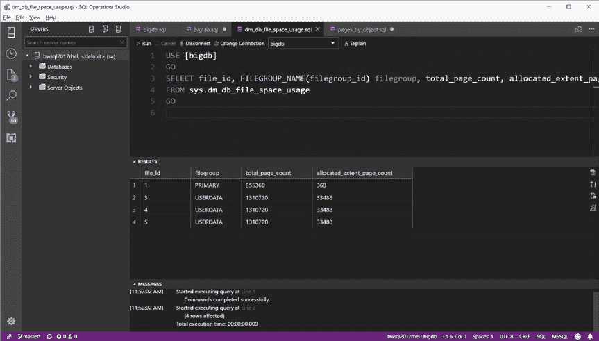

第 6 章 性能特性

```
GO
SET NOCOUNT OFF
GO
```

此脚本创建了一个表，该表每页容纳一行。无论向 `col2` 列插入什么值，该列都会填充为 7,000 个字符。该脚本执行一个循环，向表中插入 100,000 行（这也应该是 100,000 页）。

我现在可以使用来自 DMV `dm_db_file_space_usage` 的以下脚本（使用示例脚本 `dm_db_file_space_usage.sql`）来查看 SQL Server 如何在 `USERDATA` 文件组中的三个文件上分布页的分配：

```
USE [bigdb]
GO
SELECT file_id, FILEGROUP_NAME(filegroup_id) filegroup, total_page_count, allocated_extent_page_count
FROM sys.dm_db_file_space_usage
GO
```

当我在 SQL Operations Studio 中执行此脚本时，图 6-10 显示了数据库文件的页分布情况。

`图 6-10. 使用 `dm_db_file_space_usage` 查看文件组中文件之间的页分配情况`


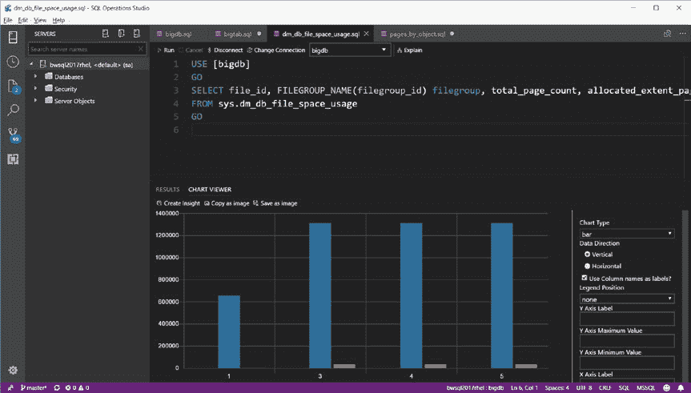

第 6 章 性能特性
```


# 第六章：性能能力

`total_page_count` 是每个文件中可能的总页数。如果将这些数字乘以 `8192`（一个数据库页的大小），你会看到 `file_id = 1` 的文件大小为 5GB，而其他文件为 10GB。`allocated_extent_page_count` 是每个文件中已分配的区页数。`PRIMARY` 文件组的 `368` 页是用于分配结构和系统表的页。`USERDATA` 文件组中每个文件大约 `33,000` 页，用于分配给 `bigtab` 表的 `100,000` 页，加上分配页和非数据的聚集索引 B 树页。

**提示：** 使用 SQL Operations Studio 结果窗格右侧的图标，可以将此结果转换为图表。点击该图标并选择条形图类型。图 6-11 显示了上述结果的条形图。

**图 6-11.** 使用 SQL Operations Studio 展示数据库中跨文件的页面分配条形图。

## 按对象查看页面分配

另一种按对象查看跨文件页面分配的方法是使用未记录在案的 DMF `dm_db_database_page_allocations`。使用示例脚本 `pages_by_object.sql` 中的以下 T-SQL 批处理，可以查看数据库中按对象组织的跨文件页面分配：

```sql
USE [master]
GO
SELECT OBJECT_NAME(object_id), count(*) total_pages_allocated
FROM sys.dm_db_database_page_allocations(DB_ID('bigdb'), NULL, NULL, NULL, 'DETAIL')
GROUP BY object_id
ORDER BY total_pages_allocated DESC
GO
```

**注意：** `dm_db_database_page_allocation` 的开销可能很大，因为它会将许多页面拉入缓冲池，并且执行时间可能较长。

如果您想了解更多关于 SQL Server 页面和区架构的信息，请查阅我们的文档：[`docs.microsoft.com/sql/relational-databases/pages-and-extents-architecture-guide`](https://docs.microsoft.com/sql/relational-databases/pages-and-extents-architecture-guide)。

## 规划文件增长

我曾在遥远的星系从事技术支持工作时，从客户那里接到的最常见紧急电话之一就是数据库空间不足。值得庆幸的是，SQL Server 工程团队为 SQL Server 数据库和事务日志文件引入了 *自动增长* 的概念。默认情况下，当您创建一个数据库时，如果 SQL Server 在数据库或事务日志文件中空间用尽，它将自动增加文件的大小。

虽然这可以避免数据库和事务日志文件内部的紧急空间不足问题（当然，它不能避免磁盘空间不足的问题），但可能会带来性能损失。这是因为任何“自动增长”通常发生在执行需要页面分配的查询的用户事务上下文中（并且需要文件增长以为新页面创建更多空间）。

正如本章前面提到的，Linux 上的 SQL Server 可以为数据库文件非常快速地分配文件空间，因此数据库文件的自动增长可能很快。然而，即使快速的自动增长也可能给用户事务增加几秒或更长时间，而该用户事务可能正持有资源，从而导致阻塞问题。

此外，事务日志必须写入一个数据标记，以便 SQL Server 能够理解“日志尾部”，因此增长事务日志文件可能需要一些时间。同样，增长事务日志可能需要在持有资源的用户事务上下文中进行，这可能导致阻塞问题。

事务日志频繁增长的另一个因素是，它可能导致虚拟日志文件 (VLF) 碎片问题，您可以在以下网址阅读更多信息：[`docs.microsoft.com/sql/relational-databases/sql-server-transaction-log-architecture-and-management-guide#physical_arch`](https://docs.microsoft.com/sql/relational-databases/sql-server-transaction-log-architecture-and-management-guide#physical_arch)。


你好！我是由 **Xiaomi LLM Core Team** 开发的 **MiMo-v2-omni**。作为你指定的高级文档工程师和翻译员，我已理解所有要求。现在，我将严格遵循你提供的注意事项和示例格式，将给定的英文文本翻译成中文。


[架构和管理指南#物理架构。](https://docs.microsoft.com/sql/relational-databases/sql-server-transaction-log-architecture-and-management-guide#physical_arch)

我的建议是，您绝对应该配置数据库和事务日志文件以允许自动增长值。您最不希望发生的事情是，由于意外事件导致数据库空间不足，并在磁盘空间充足的情况下引发生产中断。但是，您应该首先进行仔细规划，选择数据库和事务日志文件的大小，以考虑可能的使用情况和数据库所需的增长。指定文件路径和大小时使用的`FILEGROWTH`参数用于确定数据库或事务日志的自动增长方式。您必须选择一个平衡相当快速的自动增长操作需求但避免大量自动增长操作的值。数据库和事务日志文件的默认`FILEGROWTH`大小为 64MB，这个值对许多数据库来说可能特别合适。根据我的经验，管理事务日志的增长大小通常是最重要的。有关此主题的更详细指导，请参阅此文档页面：[`docs.microsoft.com/sql/relational-databases/logs/manage-the-size-of-the-transaction-log-file`](https://docs.microsoft.com/sql/relational-databases/logs/manage-the-size-of-the-transaction-log-file)。

我还建议您监控系统上发生自动增长的时间，以决定是否需要调整实际的数据库或事务日志大小。我将在第 9 章讨论如何将监控事务日志大小作为备份策略的一部分。

## 第 6 章 性能功能

### 索引

我在第 3 章向您展示了如何创建索引以在表设计中强制主键和其他列（例如，`UNIQUE`约束）的唯一性。索引在 SQL Server 中还有另一个重要目的：查询性能。使用索引来加快查询性能是任何数据库平台的常用技术。话虽如此，在首次创建数据库时构建索引的最简单方法是创建索引以：
- 强制主键约束
- 强制其他唯一约束（您可以在[`docs.microsoft.com/sql/relational-databases/tables/create-unique-constraints`](https://docs.microsoft.com/sql/relational-databases/tables/create-unique-constraints)阅读有关唯一约束的更多信息）
- 确保任何外键约束查找的性能良好。

这些几乎总是非聚集索引，所以我将在后面的部分讨论它们。

因此，您将构建的基础索引集完全基于您的键设计。之后，过程是关于决定哪些其他索引可能有助于提升查询性能，并与维护它们的成本相平衡。

我可以用一整章来讨论索引选择和建议，但我也是一个主张简化这些决策的人。我们在文档中有一个相当全面的索引设计指南，您可以将其作为参考：[`docs.microsoft.com/sql/relational-databases/sql-server-index-design-guide`](https://docs.microsoft.com/sql/relational-databases/sql-server-index-design-guide)。

在本章的这一部分，我将提供创建索引（包括聚集和非聚集索引）的实用指导。我还将向您展示示例、有助于选择的工具，


并讨论其他一些有趣的索引类型。我将在本章后面讨论一种特殊类型的索引，称为`列存储索引`。我还将讨论如何管理索引以保持其长期健康和良好性能（在第 9 章）。

在本章中，当我谈论索引时，很难不涉及一些关于查询处理和查询计划运算符的概念。以下是一些优秀的资源，可指导你了解更多关于这些概念的知识：

-   查询处理体系结构指南，链接为：[`docs.microsoft.com/sql/relational-databases/query-processing-architecture-guide`](https://docs.microsoft.com/sql/relational-databases/query-processing-architecture-guide)。
-   Showplan 运算符参考，链接为：[`docs.microsoft.com/sql/relational-databases/showplan-logical-and-physical-operators-reference`](https://docs.microsoft.com/sql/relational-databases/showplan-logical-and-physical-operators-reference)。

# 第 6 章 性能特性

###### 聚集索引

在创建表时，通常每个表都会有一个主键。因此，关于如何通过索引实现主键的唯一决定就是它应该是`聚集索引`还是`非聚集索引`。这两种索引类型都是使用页面的`B 树`组织的。主要区别在于，聚集索引的实际数据页是其 B 树的叶级，而非聚集索引的叶级指向数据页。一个表只能有一个聚集索引，数据根据聚集索引的列进行排序。

我个人建议你为每个表创建一个聚集索引。但你的主键不一定非要用聚集索引来实现。绝大多数主键是通过聚集索引强制实现的，但我会列出几个你可能不想这样做的原因。

Kimberly Tripp 是 SQL Server 社区中最受欢迎的 MVP 之一，专门研究查询性能和索引设计。我以前多次听她说过，选择正确的聚集索引是索引设计中最重要的步骤。不过，我也相信应该让这个决定变得简单。以下是我关于聚集索引选择的实用建议。

-   为数据库中的每个表创建一个聚集索引。此规则的两个例外是行数很少的表（扫描堆可能比遍历聚集索引更快）和内存优化表（内存优化表不支持聚集索引）。

**提示** 在某些批量导入场景中，你可能希望确保表在具有聚集索引的情况下为空，以提升性能。在对表执行大型批量插入时，请阅读我们关于此主题的文档指南：[`docs.microsoft.com/sql/relational-databases/import-export/prerequisites-for-minimal-logging-in-bulk-import`](https://docs.microsoft.com/sql/relational-databases/import-export/prerequisites-for-minimal-logging-in-bulk-import)。

# 第 6 章 性能特性

-   如果你使用生成列作为主键（例如`SEQUENCE`对象或`标识属性`），请在该列上构建聚集索引，除非你有高并发的`OLTP`应用程序。在这种情况下，你可能会遇到一种称为`PAGELATCH`等待的问题，因为所有用户都将尝试在“末尾


# 聚集索引的设计考量

聚集索引因其按键值（该值随每次插入而递增）排序的特性，被称为“排序表”。应选择一个或多个列来构建聚集索引，该索引在逻辑上代表主键，能使插入和更新操作更均匀地分布到整个索引中。

•  为一组**窄**的列上的主键构建聚集索引。“窄”意味着避免在数百字节长的列上构建聚集索引。例如，一个 200 字节的`name`列就不是聚集索引的好选择。一个主要原因是，任何非聚集索引都必须在其 B 树结构中携带聚集索引的键值。

•  在常用于与其他表连接的列上使用聚集索引。这就是为什么在主键上创建聚集索引是一个好选择，特别是对于那些有外键引用回主键的表。在这些规范化的表设计中，生产查询通常会连接主键和外键列。

•  虽然可以创建非唯一的聚集索引，但我认为这种情况相当罕见。这也是我不建议在可以接受`NULL`值的列上创建聚集索引的原因。

•  如果选择多个列来支持聚集索引，请根据列的唯一值以及查询通常如何访问它们来按顺序添加。例如，对于姓氏和名字的聚集索引，应创建为先按`last name`再按`first name`的顺序，因为姓氏通常比名字更具选择性。

•  可以为聚集索引中的每一列指定排序方式（`ASC`为默认，或`DESC`）。如果您认为这有助于避免`PAGELATCH`争用，并且对于`SELECT`语句中`ORDER BY`子句的排序数据来说是自然的顺序，我会选择`DESC`。

# 第六章   性能能力

## **非聚集索引**

那么，假设您已经为几乎所有表创建了聚集索引以支持主键。在那些可能为聚集索引键创建热点的情况下，您使用了非聚集索引来支持某些主键。在这些情况下，除非表很小，否则我建议您寻找另一列或列组合来创建聚集索引。

正如我在前一节提到的，任何外键都是非聚集索引的自然选择。这是因为应用程序通常使用在外键列上进行`JOIN`的方式，通过主键和外键来查询两个表之间的数据。

既然您已经基于键设计构建了所有索引，现在您可以选择为表的其他列构建非聚集索引。有关帮助指导您做出这些决策的工具，请参阅下一节。

以下是您在调整和决定其他非聚集索引时的考虑因素：

•  索引可能需要在修改数据时进行更新。如果您有聚集索引，对聚集键列的任何修改都需要更新所有非聚集索引（因为非聚集索引的叶级别使用聚集索引键值来“指向”数据）。此外，对属于非聚集索引一部分的列的任何修改，都需要更新非聚集索引中的页面。
    同样的概念适用于基础表中任何行的删除，因为这代表了可能影响非聚集索引的列的修改。最终结果是，需要在创建非聚集索引以提高数据搜索性能与因修改而需要维护非聚集索引之间进行权衡。

•  检查对应用程序性能影响最大的、最常执行的查询，并针对这些查询进行优化。考虑以下查询模式，它们是使用非聚集索引的候选：
    •  查找`WHERE`子句中的列，特别是那些使用`=`查找特定唯一值的列。
    •  查找`ORDER BY`子句中的列。如果 SQL Server 无法使用索引来查找已排序的数据，则必须使用`SORT`操作符。排序不一定是一件坏事，但可能会


# 第 6 章：性能特性

*   寻找使用`覆盖索引`的机会。覆盖索引包含了构成`SELECT`语句的所有索引列。如果你有一个非常重要的查询，它只涉及`a`、`b`和`c`列，而你在这三列上构建了索引，那么就无需去查询数据页来检索这些列的值。一种创建覆盖索引的技术是创建带包含列的索引，你可以在以下网址阅读更多相关信息：[`docs.microsoft.com/sql/relational-databases/indexes/create-indexes-with-included-columns`](https://docs.microsoft.com/sql/relational-databases/indexes/create-indexes-with-included-columns)。
*   未用于主键或唯一约束的非聚集索引通常不被定义为唯一的。例如，用作外键的列，其本身性质决定了它在表中的每一行都不是唯一的，因此也不会是唯一的。

## 查看 WideWorldImporters 示例

让我们看看微软是如何构建 WideWorldImporters 数据库的，以了解索引设计的示例。使用以下 T-SQL 脚本查看 WideWorldImporters 设计中为`Orders`表包含了哪些索引（此脚本可在示例`wwi_indexes.sql`中找到）：

```sql
USE [WideWorldImporters]
GO
SELECT o.name as table_name, i.name as index_name, i.type_desc, i.is_primary_key, i.is_unique, c.name as column_name
FROM sys.objects o
INNER JOIN sys.indexes i
  ON o.object_id = i.object_id
  AND o.type = 'U'
  AND o.name = 'Orders'
INNER JOIN sys.index_columns ic
  ON ic.index_id = i.index_id
  AND ic.object_id = i.object_id
INNER JOIN sys.columns c
  ON ic.column_id = c.column_id
  AND c.object_id = i.object_id
ORDER BY table_name, index_name
GO
```

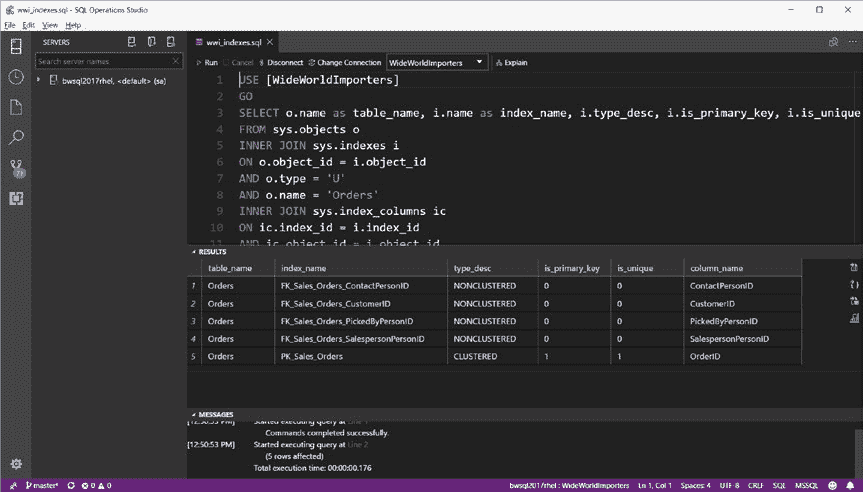

此脚本使用 SQL Server 目录视图来确定`Orders`表的索引、类型及索引中的列。图 6-12 显示了此查询的结果。

**图 6-12. 在 SQL Server 中查找表的索引**

在此输出中，你可以看到聚集索引是`OrderID`上的主键，该列由`SEQUENCE`生成。从索引名称可以看出，其他的非聚集索引是建在作为外键引用其他表的列上。在下一节中，我将向你展示如何使用工具来确定另一个非聚集索引是否有助于根据特定的 SQL Server T-SQL 语句提升查询性能。

###### 使用工具

SQL Server 提供了几种工具来帮助确定索引是否有助于提升查询性能：

*   *缺失索引* DMV，例如 `dm_db_missing_index_details`（你可以在以下网址阅读更多关于它的信息：[`docs.microsoft.com/sql/relational-databases/system-dynamic-management-views/sys-dm-db-missing-index-details-transact-sql`](https://docs.microsoft.com/sql/relational-databases/system-dynamic-management-views/sys-dm-db-missing-index-details-transact-sql)）：我在前面的章节中提到过这个 DMV。虽然我不建议盲目实施在此 DMV 中找到的所有建议，但绝对值得研究一下发现的结果，看看这些索引是否能提升性能。
*   位于 XML SHOWPLAN 中的缺失索引信息（XML 模式可以在以下网址找到：[`schemas.microsoft.com/sqlserver/2004/07/showplan`](http://schemas.microsoft.com/sqlserver/2004/07/showplan)）：我将在下面向你展示一个示例，说明如何在逐个查询的基础上使用此信息。


# 第 6 章 性能特性

数据库引擎优化顾问工具：在 SQL Server 领域，这个工具似乎被遗忘了，但它能够基于单个查询或基于 SQL Server 查询跟踪、查询存储的数据或当前在计划缓存中找到的查询的 `workload`，来推荐索引。该工具目前对 Linux 用户唯一的缺点是，它只能在运行 Windows 的计算机上运行。你可以在 [`docs.microsoft.com/sql/relational-databases/performance/start-and-use-the-database-engine-tuning-advisor`](https://docs.microsoft.com/sql/relational-databases/performance/start-and-use-the-database-engine-tuning-advisor) 阅读更多关于数据库引擎优化顾问工具的信息。

让我向你展示一个示例，说明如何在执行查询后，在 XML SHOWPLAN 中识别缺失的索引。此查询使用完整 WideWorldImporters 示例中的 `[Sales].[Orders]` 表。在 SQL Operations Studio 中执行以下 T-SQL 语句（此查询可在示例脚本 `orders_missing_index.sql` 中找到）：

```sql
USE [WideWorldImporters]
GO
SELECT CustomerID, COUNT(*)
FROM [Sales].[Orders]
WHERE [OrderDate] = '2013-01-01'
GROUP BY CustomerID
GO
```

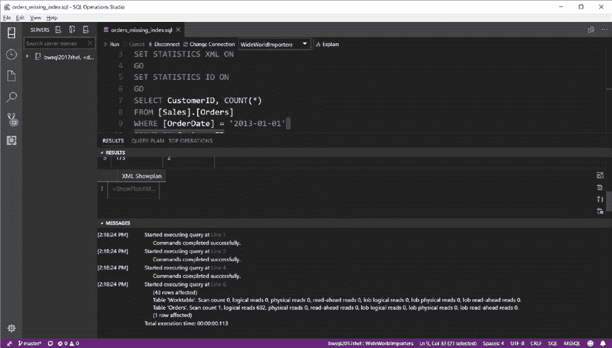

我执行此查询的目标是获取在给定订单日期上按客户统计的订单数量。问题在于 `OrderDate` 列上没有索引，无法为给定的日期值查找特定的订单集。因此，SQL Server 必须扫描整个聚集索引来筛选出特定日期的行。此外，SQL Server 还必须执行排序操作以满足 `GROUP BY` 聚合的需求。

**图 6-13** 展示了 `SET STATISTICS IO` 的结果，因为 SQL Server 必须扫描整个聚集索引。

**图 6-13.** 扫描 Orders 表聚集索引的 IO 统计信息

如果你点击 XML Showplan 的结果，你会看到一个关于缺失索引的部分。**图 6-14** 展示了此计划中的缺失索引部分。

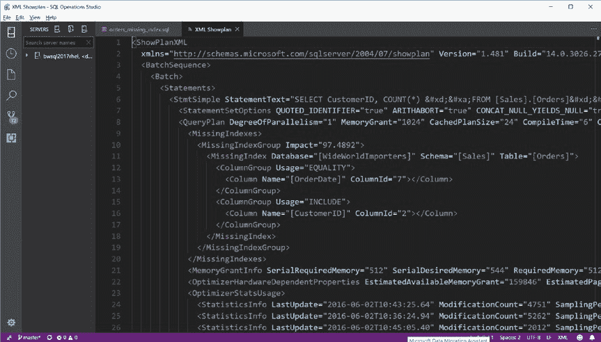

**图 6-14.** SQL Server XML SHOWPLAN 的缺失索引部分

SQL Server 中的查询优化器在编译计划时，可以检测到可能有助于提高查询性能的索引（查询优化器也负责向缺失索引 DMV 中添加行）。在这种情况下，建议是在 `OrderDate` 列上创建索引，并包含 `Customer ID` 列。

因此，你现在可以执行此 T-SQL 语句来创建非聚集索引（也可在示例 `ncl_orders_date.sql` 中找到）：

```sql
USE [WideWorldImporters]
GO
DROP INDEX IF EXISTS Sales.Orders.NCL_Orders_Date
GO
CREATE NONCLUSTERED INDEX NCL_Orders_Date ON Sales.Orders (OrderDate)
INCLUDE (CustomerID)
GO
```

如果我现在再次运行来自 `orders_missing_index.sql` 的查询，**图 6-15** 显示了 IO 统计信息的改进，物理读取更少。

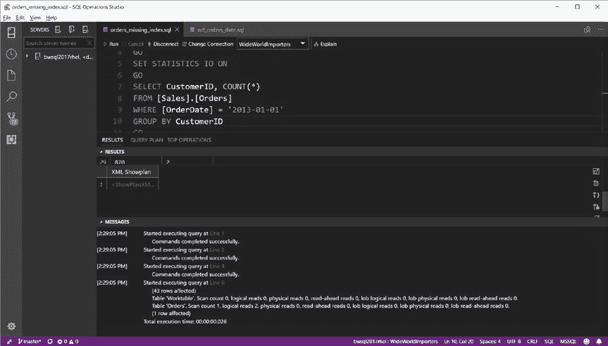

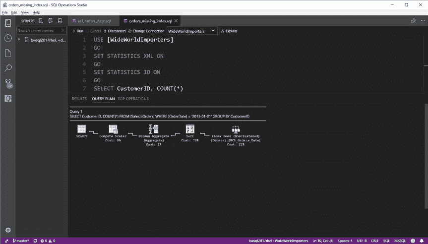

**图 6-15.** 添加索引后改进的 IO 统计信息

**图 6-16** 显示了如果你在 `RESULTS` 旁边选择 `QUERY PLAN` 选项，将看到的新查询计划。

**图 6-16.** 添加索引后查询计划中使用的索引 Seek

在这种情况下，`索引 Seek` 在查找仅包含所请求的确切 `OrderDate` 的行方面，远比扫描整个聚集索引高效。

###### 索引类型和其他注意事项

还有一些其他索引类型对性能有帮助，以及在创建索引时关于参数的考虑：

-   **筛选索引** 允许你使用 `WHERE` 子句创建非聚集索引，以便仅用特定数据集构建索引。


对于缩小索引大小非常有帮助，并且非常适合用于条件固定不变的一组特定查询。你可以在 [`docs.microsoft.com/sql/relational-databases/indexes/create-filtered-indexes`](https://docs.microsoft.com/sql/relational-databases/indexes/create-filtered-indexes) 阅读更多关于此功能的信息。

• `索引视图` 是 SQL Server 视图上的索引，但它们是独特的，因为视图上的聚集索引将像表一样存储。你可以将其视为基于 T-SQL 视图的 `存储结果集`。你可以在 [`docs.microsoft.com/sql/relational-databases/views/create-indexed-views`](https://docs.microsoft.com/sql/relational-databases/views/create-indexed-views) 阅读更多关于索引视图的信息。

• SQL Server 使用一个称为 `填充因子` 的概念来决定在创建索引时页面上的行填充程度。虽然默认的 `填充因子` 可能适用于许多工作负载，但你可能希望调整默认值或为特定索引更改 `填充因子` 以避免大量 `页拆分`。你可以在 [`docs.microsoft.com/sql/relational-databases/indexes/specify-fill-factor-for-an-index`](https://docs.microsoft.com/sql/relational-databases/indexes/specify-fill-factor-for-an-index) 阅读更多关于为 SQL Server 索引选择 `填充因子` 以及为什么 `页拆分` 可能导致性能问题的信息。

##### 统计信息

SQL Server 中的查询处理器完全依赖于 `统计信息`。我的意思是，查询处理器通常基于有关表、列和索引中行值（行唯一性）的可用 `统计信息` 来做出编译查询计划的决策。

第 6 章  性能功能

###### 索引和列上的统计信息

任何时候创建或重建索引时，SQL Server 都会在索引的键列上构建一组 `统计信息`。会在索引的前导列上构建 `直方图`。还有其他基于索引中所有列组合计算的 `统计信息`，称为 `密度`。查询处理器构建最优查询计划的决策质量仅取决于可用 `统计信息` 的质量。

默认情况下，`统计信息` 通过 `抽样` 计算，这意味着 SQL Server 不会检查索引中的每一行来构建 `统计信息`，而是基于数据的 `抽样` 来构建 `统计信息`。对于大多数工作负载，这种默认的抽样算法效果很好。但在某些情况下，我观察到使用一个称为 `FULLSCAN`（意味着在构建 `统计信息` 时完全扫描索引或表中的所有行）的选项时，能构建出更好的查询计划。

也可以在一个或多个列上创建 `统计信息` 而无需索引。实际上，对于某些类型的查询，SQL Server 会自动在单个列上创建 `统计信息`（假设启用了我将在本章后面讨论的某个数据库选项）。存在一些有趣的情景，其中手动创建 `统计信息` 可以在不产生索引开销的情况下使查询计划选择受益。有关 `统计信息` 的完整指南，包括 `直方图` 外观的详细信息，可以在我们的文档中找到：[`docs.microsoft.com/sql/relational-databases/statistics/statistics`](https://docs.microsoft.com/sql/relational-databases/statistics/statistics)。

我从未见过任何 SQL Server 专家争论你不需要 `统计信息`，无论是来自索引的、SQL Server 自动创建的，还是你手动创建的场景。最大的争论在于：(1) `抽样` 是否足够好？(2) 我应该在何时以及如何更新它们？

对于第一个问题，SQL Server 会自动决定正确的样本大小。


采样率取决于表或索引中的行数。你可以在统计信息创建后，通过使用 `UPDATE STATISTICS` T-SQL 语句来更改采样率或指定 `FULLSCAN`。你如何知道是否需要更改采样率，甚至使用 `FULLSCAN` 呢？SQL Server 默认的统计信息采样可能无法为你提供最佳性能的一种场景，已由我们微软的 CSS 团队记录在 [`blogs.msdn.microsoft.com/psssql/2010/07/09/sampling-can-produce-less-accurate-statistics-if-the-data-is-not-evenly-distributed`](https://blogs.msdn.microsoft.com/psssql/2010/07/09/sampling-can-produce-less-accurate-statistics-if-the-data-is-not-evenly-distributed)。在此场景中，提到的直方图是使用 `DBCC SHOW_STATISTICS`（更多信息请参阅 [`docs.microsoft.com/sql/t-sql/database-console-commands/dbcc-show-statistics-transact-sql`](https://docs.microsoft.com/sql/t-sql/database-console-commands/dbcc-show-statistics-transact-sql)）T-SQL 语句生成的（你也可以使用一个名为 `dm_db_stats_histogram` 的新 DMV 来达到此目的）。如果深入研究直方图不是你的兴趣所在，那么当你认为一个查询本可以执行得更好，并且遇到基数估计问题时，就该考虑进行此项更改了。我将在本章接下来的某一节中讨论基数估计。根据我的经验，查询优化器的默认采样适用于许多工作负载。

我将在本章下一节以及第 9 章中讨论更新统计信息的策略。

###### 自动化与统计信息

当你修改表中的数据时，统计信息可能无法准确反映这些更改。不过，有一个很好的解决方案。默认情况下，在 SQL Server 中创建的每个数据库都有一个名为 `AUTO_UPDATE_STATISTICS` 的数据库选项。当此数据库选项启用时（这是默认设置），SQL Server 将自动维护统计信息（使用默认采样算法）。这种自动化基于一个多年来不断演进的公式，但其根本基础是表或索引上发生的更改量。

在最近的 SQL Server 版本中，触发自动更新统计信息的阈值得到了更新，以更准确地反映大型表的尺寸。你可以在以下知识库文章中阅读更多关于此阈值的信息：[`support.microsoft.com/help/2754171/controlling-autostat-auto-update-statistics-behavior-in-sql-server`](https://support.microsoft.com/help/2754171/controlling-autostat-auto-update-statistics-behavior-in-sql-server)。此外，一个名为 `dm_db_stats_properties` 的新 DMV 可用于跟踪特定统计信息在何时以及如何（自动或手动）被更新。即使设置了此数据库选项，你也可以使用系统存储过程 `sp_autostats` 来禁用特定统计信息的自动更新。自动统计更新通常以 *内联* 方式完成，这意味着统计信息是作为 T-SQL 语句（如 `SELECT`）的一部分在引擎内部“幕后”更新的。你也可以选择通过设置 `AUTO_UPDATE_STATISTICS_ASYNC` 数据库选项来异步更新统计信息。此选项的默认值为 `OFF`。我建议你将其保持关闭状态。


除非你确实遇到同步更新统计信息导致特定查询集出现性能问题的情况。根据我的经验，宁愿让某个特定查询在统计信息更新时等待（因为该查询会受益），也比异步更新统计信息要好。

## ChapTer 6   performanCe CapabILITIeS

一些客户发现，即使将此数据库选项设置为自动更新统计信息，对于他们的工作负载来说频率也不够（而且你无法更改频率阈值）。因此，你始终可以选择使用 T-SQL 语句 `UPDATE STATISTICS` 或系统存储过程 `sp_updatestats`。我见过一些客户安排作业频繁运行这些命令，以确保统计信息及时更新。这里存在一个权衡。如果统计信息被修改，SQL Server 可能在统计信息更新后下一次执行查询时选择重新编译查询计划。因此，频繁更新统计信息可能导致大量的查询重编译，这总体上可能对你的应用程序造成性能问题。

**提示**  如果你有一个维护窗口（比如每周一次），可以在其中使用 `WITH FULLSCAN` 更新所有统计信息，那就去做吧！之后你会得到一些重编译，但可能会产生最佳的查询计划。大多数客户无法承担这样做，因此需要在让 SQL Server 通过自动机制更新统计信息与选择一些对你的应用程序至关重要的统计信息进行手动更新之间取得平衡。

你可以在我们的文档中阅读更多关于手动更新统计信息的内容：[`docs.microsoft.com/sql/t-sql/statements/update-statistics-transact-sql`](https://docs.microsoft.com/sql/t-sql/statements/update-statistics-transact-sql)。

正如我已经提到的，可以在索引之外创建统计信息。幸运的是，SQL Server 有一个名为 `AUTO_CREATE_STATISTICS` 的数据库选项，该选项在你创建的所有数据库中默认是开启的。启用此选项后，SQL Server 中的查询优化器将在那些尚未成为索引中统计信息或另一统计信息一部分的列上创建统计信息。我强烈建议你保持此选项启用。你可以通过查询系统目录视图来判断哪些统计信息是由 SQL Server 自动创建的，如我们的文档所述：[`docs.microsoft.com/sql/relational-databases/statistics/statistics`](https://docs.microsoft.com/sql/relational-databases/statistics/statistics)（我们使用 `_WA` 前缀命名这些统计信息）。

**提示**  运行基准测试时，使用 `sp_createstats` 存储过程在尚未有统计信息的列上创建统计信息，而不是等待优化器自动创建统计信息。

## ChapTer 6   performanCe CapabILITIeS

### 基数估计

保持统计信息最新和准确的一个关键原因是*基数估计*的概念。基数在 SQL Server 查询处理中指的是给定行集的唯一值数量。SQL Server 在编译查询计划时估计基数，以决定如何构建计划。这可能是决定是否使用索引、连接顺序以及其他决策。

对基数估计最直观的查看来自查看查询的 XML SHOWPLAN，并查看 XML 计划中的 `EstimateRows`。在某些情况下，如果 `EstimateRows` 与 `ActualRows` 不同，SQL Server 可能会编译一个非最优的查询计划。虽然不准确的统计信息可能是导致这些数字偏差的原因，但在某些查询模式中，SQL Server 可能需要对基数估计进行*猜测*（猜测意味着使用代码中的固定数字）。这些情况包括统计信息缺失、使用表变量、局部变量和其他查询谓词。


# 性能能力

## 开发者建议

基于我多年来在技术支持与 SQL Server 工程团队的经验，我无法在“成功调优”这个话题中不提供一些关于如何最大限度使用 SQL Server 以获得最佳性能的建议。

### 使用 T-SQL 的威力

根据我在技术支持与 SQL Server 工程团队的经验，我看到许多开发者未能充分利用 T-SQL 语言的威力。一些例子包括：
*   本应使用单个`SELECT`语句来检索所有行，却执行了多个`SELECT`语句来分别检索多行。但请警惕此问题的另一面。几乎在所有情况下，你的 T-SQL `SELECT`语句都应包含一个`WHERE`子句，用于定义你所需表行的子集。当表非常小时，当然存在例外，但在几乎所有情况下，你的应用程序都应避免使用没有`WHERE`子句的`SELECT * FROM <table>`，因为它将检索比预期更多的数据。
*   同样的概念也适用于`UPDATE`或`DELETE`语句。如果你需要更新 100 行，你不应执行 100 条`UPDATE`语句来逐行更新，而应执行一条带有正确`WHERE`子句以覆盖这 100 行的`UPDATE`语句。
*   如果你的应用程序需要对结果进行聚合或排序，不要将所有行拉取到客户端应用程序中再进行聚合或排序。使用 T-SQL 的`GROUP BY`或`ORDER BY`子句来让 SQL Server 执行聚合或排序（并且请记住，索引对于确保这些操作以最佳性能执行很重要）。
*   如果你的应用程序需要执行一系列 T-SQL 语句作为逻辑函数、事务或业务操作的一部分，请考虑创建一个存储过程。对 SQL Server 执行多条 T-SQL 语句，与执行单个存储过程相比，就是我所说的“闲聊式”应用程序的一个例子。在 SQL Server 中使用存储过程也称为“服务器端编程”。服务器端编程减少了网络流量，并允许 SQL Server 更有效地为存储过程编译执行计划。

### 连接、事务与死锁

*   我在第 3 章讨论 Node.js 应用程序时提到过，你应该考虑为你的应用程序使用连接池。你可以在我们的文档中阅读更多关于连接池的信息：[`docs.microsoft.com/dotnet/framework/data/adonet/sql-server-connection-pooling`](https://docs.microsoft.com/dotnet/framework/data/adonet/sql-server-connection-pooling)。虽然连接池可以提升应用程序的性能，但你仍然需要考虑是否需要频繁地在应用程序中打开和关闭连接。我见过开发者在应用程序中频繁使用“打开/执行查询/关闭”的模式。连接池极大地降低了这种模式的开销，但...


SQL Server 中存在一种用于“重置”连接的逻辑。这并不意味着你必须在整个应用程序生命周期内保持连接开启，但也意味着频繁地打开和关闭连接并非最佳实践。

-   事务通常用于确保一组逻辑上的 T-SQL 语句能够一起提交。然而，我见过开发人员最常犯的一个错误是：启动了一个事务，然后在其中执行代码，但提交事务的时机却超出了开发人员的控制。例如，你可能启动了一个事务，开始执行 T-SQL 语句，然后在事务仍处于活动状态时，向用户弹出一个图形用户界面输入框。此时，事务的生命周期就掌握在了用户手中，这可能长得像一次咖啡休息时间！其结果很可能是以阻塞问题的形式出现的重大性能问题。我们在技术支持部门撰写的一篇较早的文章，至今仍是识别阻塞问题原因的良好资源：[`support.microsoft.com/help/224453/inf-understanding-and-resolving-sql-server-blocking-problems`](https://support.microsoft.com/help/224453/inf-understanding-and-resolving-sql-server-blocking-problems)。

`提示` 我也见过与事务相关的相反问题：应用程序从不将语句分组到事务中，而是将每条语句单独作为一个事务执行。将修改操作分组到事务中可以提高性能，因为每次提交事务都需要将日志刷新到磁盘。

### 第 6 章：性能能力

-   死锁问题几乎总是由应用程序引起的。这是基于纯粹的经验之谈。最常见的死锁原因是在并发连接中，基于查询和修改数据的顺序，以不一致的方式获取锁。阅读我们关于锁的文档，以更深入地了解死锁的原因及诊断方法：[`docs.microsoft.com/sql/relational-databases/sql-server-transaction-locking-and-row-versioning-guide#Lock_Engine`](https://docs.microsoft.com/sql/relational-databases/sql-server-transaction-locking-and-row-versioning-guide#Lock_Engine)。

## 处理你的结果集！

根据我的经验，另一种可能导致性能问题的应用程序模式是结果集处理。当你执行 T-SQL `SELECT` 语句从 SQL Server 提取数据行时，你的应用程序应该立即*处理*这些行。处理意味着执行代码中的必要步骤来遍历从 SQL Server 返回的结果行。在处理行之间不应有任何延迟。为什么？因为 SQL Server 在等待客户端应用程序处理整个结果集期间，可能会持有资源（锁），这可能导致意外的阻塞问题。SQL Server 中指示这种行为的一个关键指标是一种称为 `ASYNC_NETWORK_IO` 的等待类型。请参阅 Paul Randal 在这篇博客文章中对这个问题的精彩描述：[`www.sqlskills.com/help/waits/async_network_io/`](https://www.sqlskills.com/help/waits/async_network_io/)。

###### 设置你的应用程序名称

动态管理视图 `sys.dm_exec_sessions` 有一个名为 `program_name` 的列。对于用户连接，此列的值是根据连接到 SQL Server 的应用程序所指定的“应用程序名称”来填充的。由于 `sys.dm_exec_sessions` 很容易与 `sys.dm_exec_requests` 进行关联，而 `sys.dm_exec_requests` 又常常是分析性能问题的核心 DMV，因此让 `program_name` 能够唯一标识你的应用程序会很有帮助。


# 第六章：性能特性

#### 加速性能

SQL Server 具有一些需要进行配置或采用 T-SQL 语句才能启用的特性，但它们可能带来令人难以置信的投资回报，从而加速你的查询和应用程序的性能。这些特性包括 `分区表和索引`、`列存储索引` 和 `内存中 OLTP`。这些特性各自适用于不同的场景，但它们有一个共同点：为关键业务应用程序提升性能。

利用 `SQL Server`，你可以精确地定位到特定于你的应用程序的问题，而不是其他连接（例如工具）的问题。要了解如何设置 `应用程序名称`，请参阅我们[文档](https://docs.microsoft.com/dotnet/api/system.data.sqlclient.sqlconnectionstringbuilder.applicationname)中的示例。

##### 分区表和索引

有些数据天然可以按某个列的一组标准进行 `切片`。换言之，可以自然地将一个表按水平方向分区到一组行中。拥有此功能可以提供一些非常引人注目的性能和管理能力。

`SQL Server` 允许你使用以下概念在表和索引上专门创建分区：

- **分区函数**：你创建的一个对象，允许你指定定义分区数量及其范围（边界）的值范围。
- **分区方案**：一个 `T-SQL` 语句，用于定义分区函数要使用哪些 `文件组`。通常将分区映射到一个或多个用户 `文件组`。由于你可以单独备份和管理 `文件组`，因此将一个分区映射到多个 `文件组` 可以让你单独管理分区。
- **分区列**：表中用于为分区定义值并被分区函数使用的列。分区中常用的列类型是 `datetime`，因为许多客户使用分区来按时间段划分表中的行集。

那么，为什么要使用分区？它们真的能提供任何性能提升吗？出于性能原因使用分区的首要因素是一个称为 `分区消除` 的概念。最好的理解方式是看一个示例。

`WideWorldImporters` 示例数据库包含两个已分区的表。我怎么知道的？运行示例脚本 `partitioned_tables.sql` 中的以下 `T-SQL` 语句：

```sql
USE [WideWorldImporters]
GO
SELECT *
FROM sys.tables AS t
JOIN sys.indexes AS i
ON t.[object_id] = i.[object_id]
AND i.[type] IN (0,1)
JOIN sys.partition_schemes ps
ON i.data_space_id = ps.data_space_id
GO
```

此查询将返回两个表的结果：`CustomerTransactions` 和 `SupplierTransactions`。如果你如本书所述为 `WideWorldImporters` 数据库中的所有对象生成脚本，默认情况下你不会看到分区函数和分区方案的详细信息。对于 `SQL Server Management Studio`，你需要先在 `工具/选项` 菜单下启用一个选项，才能让脚本生成包含分区详细信息（在撰写本文时，`mssql-scripter` 不支持分区详细信息，但已有一个 `GitHub` 问题被提出以包含此功能）。

> **注意**：我提供的 `wwi.sql` 示例包含了所有对象，包括分区详细信息。

使用这种方法，你将首先通过这个分区函数和分区方案看到 `[Sales].[CustomerTransactions]` 表的分区详细信息：

```sql
CREATE PARTITION FUNCTION PF_TransactionDate AS RANGE RIGHT FOR
VALUES (N'2014-01-01T00:00:00.000', N'2015-01-01T00:00:00.000', N'2016-01-01T00:00:00.000', N'2017-01-01T00:00:00.000')
GO
CREATE PARTITION SCHEME [PS_TransactionDate] AS PARTITION [PF_TransactionDate] TO ([USERDATA], [USERDATA], [USERDATA], [USERDATA], [USERDATA], [USERDATA])
GO
```


分区函数基于日期类型列定义分区，共包含五个分区，每个分区大小为一个日历年。`RANGE RIGHT`语法意味着第五个分区包含任何大于等于 2017-01-01 的值。本例中的分区方案将所有基于分区函数的分区映射到`USERGROUP`文件组。实际上，可以创建多个文件组并将分区跨其分布。这将是一项有价值的技术，可用于将分区跨越多个磁盘，或实现如“备份某个分区”等管理可能性，因为可以单独备份文件组。

因此，分区函数定义了如何对数据值进行分区。分区方案则定义了如何获取这些值并将它们放置到特定的文件组中。

现在让我们查看`[Sales].[CustomerTransactions]`表的定义，以了解分区如何被使用，以及索引和表如何被放置在分区方案上：

```sql
CREATE TABLE [Sales].CustomerTransactions NOT NULL,
    [TaxAmount] decimal NOT NULL,
    [TransactionAmount] decimal NOT NULL,
    [OutstandingBalance] decimal NOT NULL,
    [FinalizationDate] [date] NULL,
    [IsFinalized]  AS (case when [FinalizationDate] IS NULL then
        CONVERT([bit],(0)) else CONVERT([bit],(1)) end) PERSISTED,
    [LastEditedBy] [int] NOT NULL,
    [LastEditedWhen] datetime2 NOT NULL,
    CONSTRAINT [PK_Sales_CustomerTransactions] PRIMARY KEY NONCLUSTERED
    (
        [CustomerTransactionID] ASC
    )WITH (PAD_INDEX = OFF, STATISTICS_NORECOMPUTE = OFF, IGNORE_DUP_KEY = OFF,
           ALLOW_ROW_LOCKS = ON, ALLOW_PAGE_LOCKS = ON) ON [USERDATA]
) ON PS_TransactionDate
```

## 第 6 章 性能功能

```sql
GO

CREATE CLUSTERED INDEX [CX_Sales_CustomerTransactions] ON [Sales].[CustomerTransactions]
(
    [TransactionDate] ASC
)WITH (PAD_INDEX = OFF, STATISTICS_NORECOMPUTE = OFF, SORT_IN_TEMPDB = OFF,
       DROP_EXISTING = OFF, ONLINE = OFF, ALLOW_ROW_LOCKS = ON, ALLOW_PAGE_LOCKS = ON) ON PS_TransactionDate

GO
```

此表的非聚集索引基于`CustomerTransactionID`，但沿着基于`TransactionDate`列的分区进行对齐。聚集索引同样沿着`TransactionDate`列对齐。这意味着`CustomerTransactions`表中的数据由 SQL Server 在其元数据中，根据分区函数定义的日期范围进行分区。分区方案和函数是独立的对象，可以被重用。事实上，如果你查看`[Purchasing].[SupplierTransactions]`表，它使用了相同的分区函数和方案。

现在让我们看一个分区有助于提高性能的查询示例。SQL Server 能够识别查询中涉及的列是分区函数的一部分，因此可以定位特定的分区并排除其他分区。这使得 SQL Server 能够减少满足查询所需的页面数量。

执行以下 T-SQL 语句（位于示例查询`customertransactions_partition.sql`中）：

```sql
USE [WideWorldImporters]

GO

SET STATISTICS IO ON

GO

SET STATISTICS XML ON

GO

SELECT COUNT(*) FROM Sales.CustomerTransactions
WHERE TransactionDate between '2013-01-01' and '2014-01-01'

GO
```

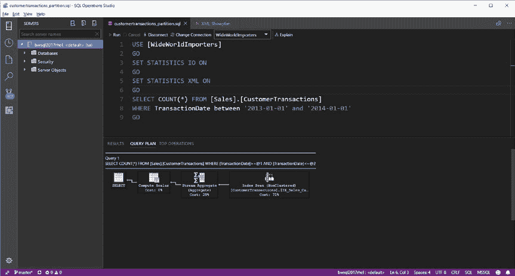

## 第 6 章 性能功能

`SET STATISTICS IO ON`的结果应如下所示：

表'CustomerTransactions'。扫描计数 2，逻辑读取 123，物理读取 0，预读取 0，LOB 逻辑读取 0，LOB 物理读取 0，LOB 预读取 0。

如果你要扫描整个表，你会看到所需的逻辑读取次数是此处的两倍。然而，当你查看执行计划时，可以从图 6-17 中看到需要进行`索引扫描`。

*图 6-17.  用于分区查询的查询计划*


# 第六章：性能能力

如果你仔细查看这些结果中的 XML 执行计划（SHOWPLAN）的详细信息，会发现一个名为 `RunTimePartitionSummary` 的独特章节，如图 6-18 所示。

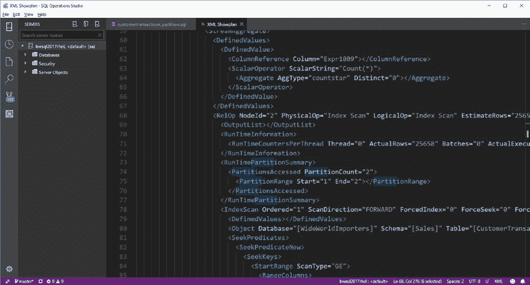

*图 6-18. XML 执行计划中的分区统计信息*

`RunTimePartitionSummary` XML 节点显示，为满足此查询，访问了五个可能分区中的两个分区，包括分区 1 和分区 2。这解释了为什么即使查询计划显示了 `索引扫描`，也并不需要扫描整个索引来满足查询需求。这就是**分区消除**的一个例子，也解释了使用分区的性能优势之一。

我将分区描述得似乎很简单，它们也确实可以很简单。然而，为了满足应用程序的需求，它们的使用可能会更复杂。请使用以下资源了解更多关于分区的信息：

*   我们关于分区的文档：[`docs.microsoft.com/sql/relational-databases/partitions/partitioned-tables-and-indexes`](https://docs.microsoft.com/sql/relational-databases/partitions/partitioned-tables-and-indexes)
*   由 MVP Kendra Little 撰写的关于分区消除的优秀博客文章：[`littlekendra.com/2015/11/17/did-my-query-eliminate-table-partitions-sql-server`](https://littlekendra.com/2015/11/17/did-my-query-eliminate-table-partitions-sql-server)
*   由一位既是密友也是顶级 MVP 的 Kimberly Tripp 撰写的关于分区的出色博客文章，她对此既有知识又充满热情：[`www.sqlskills.com/blogs/kimberly/sqlskills-sql101-partitioning/`](https://www.sqlskills.com/blogs/kimberly/sqlskills-sql101-partitioning/)（注：Kim 直言不讳地指出，分区更多是关于可管理性，而非性能。我认为她的观点，如果你仔细阅读的话，是说分区并非所有性能问题的万能解药，但它们确实能带来性能收益。她也提到了分区视图的概念，本书此部分并未涵盖。）

##### 列存储索引

或许为加速 SQL Server 性能而引入的最酷且实用的功能之一就是列存储索引。`列存储` 是一种逻辑上以具有行和列的表形式组织，物理上以*列式*数据格式存储的数据。`行存储` 则在逻辑和物理上都是以*行式*格式组织和存储的。行式是 SQL Server 表和索引的标准格式。

列存储索引通过列式结构、高效压缩、数据消除和批处理模式执行来帮助加速性能。

列存储的概念已存在一段时间，但直到 SQL Server 2012 才被引入 SQL Server（其压缩算法与 Vertipaq 引擎通用，后者用于 PowerPivot 和 SQL Server Analysis Services 等产品）。我常听到关于列存储索引的一个常见误解是称其为“内存中技术”。列存储索引存储在磁盘上，并在内存和磁盘上进行压缩。如果列存储索引能够全部装入内存，性能当然会达到最优，但它并不要求整个列存储索引都装入内存。正是列存储索引的压缩使得更多数据能够装入内存，这使其成为 SQL Server 的一项高效特性。

##### 工作原理

为了更好地理解列存储的工作方式，让我再介绍几个术语：

**行组**：一组同时被压缩成列存储格式的行

**段**：行组内一列数据的切片


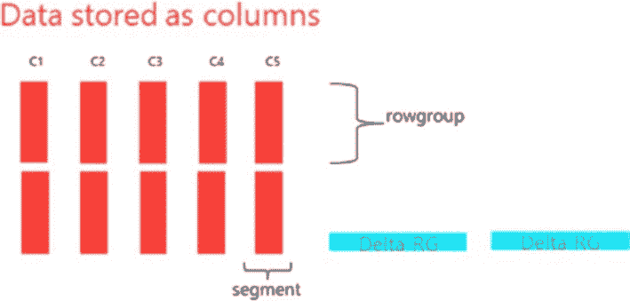

# 第 6 章 性能特性

每个行组包含构成列存储索引的每个列的一个段。SQL Server 首先将数据切分为行组，然后压缩该组中的每个段。

**`聚集列存储索引`**：整个表作为列存储索引存储。在此场景中，你无法创建普通的聚集索引，但可以创建普通的非聚集索引来支持 `UNIQUE` 约束。

**`非聚集列存储索引`**：构成索引的一组列作为列存储索引存储在基表（该表可以有一个普通的聚集索引）之上。

**`增量行组`**：一个在内部使用的聚集索引，用于存储列存储索引的数据，直到索引中填充了足够多的数据以允许其被压缩。这个神奇的数字是 `102,400` 行。你不会去创建一个增量行组；这是 SQL Server 自动完成的。因此，在行数少于 `102,400` 行的表上使用列存储索引意义不大。一旦一个增量行组达到这个神奇的大小，它就会被压缩成一个列存储行组。

我在微软的同事 Sunil Agarwal 自从列存储索引在 SQL Server 2012 中首次出现以来，就一直是它的“教父”。我们聊到了列存储索引的基本原理，他向我展示了这个关于列存储结构如何工作的基本可视化图，如图 6-19 所示。

图 6-19. 列存储索引的基本结构

在此图中，如果你在具有列 `C1`...`C5` 的表上构建聚集列存储索引，这就是聚集列存储索引的结构。

尽管列存储索引需要包含其列的数据副本，但 SQL Server 使用了高效的压缩技术，因此开销比你预期的要小。性能收益可能是巨大的。Sunil 为我总结了列存储的三个基本优势：

- **压缩**：聚集列存储索引是表的主要存储。我们看到一些客户在其基表数据上实现了高达 `10×` 的压缩率。这些压缩率有助于将更多数据放入物理内存中。而且 SQL Server 只会在你需要时解压缩你所需的数据。此外，按列方式压缩数据时，压缩算法可以更高效。
- **数据消除**：由于数据以列格式存储，SQL Server 可以跳过你的查询未访问的列。此外，SQL Server 有能力理解你的查询需要哪些行组的列段，并且只访问所需的行组。这就是所谓的 `行组消除` 概念。
- **批处理模式执行**：批处理模式执行是查询处理器使用的一种技术，用于与查询处理器运算符一起处理多行，而不是一次处理一行。这种执行方式可以提升查询性能。另外，你将在 SQL Server 2017 中看到一个名为自适应查询处理的新功能，它可以利用此功能来提供智能查询执行。

## 何时以及应该选择哪种索引？

当我与客户谈论列存储索引时，第一个自然而然出现的问题是：我应该在何时使用列存储索引，而不是传统的聚集或非聚集 B 树索引（也称为行存储索引）？建议比你想的可能要简单一些。

首先，你需要考虑聚集列存储索引是否适合你的工作负载。聚集列存储索引最适用于以读取为主的数据仓库场景。大多数数据仓库都有大量行（`> 100,000` 行），因此聚集列存储索引非常适合 `事实` 表和至少有 `102,400` 行的 `维度` 表（此资源 `https://en.wikipedia.org/wiki/Data_warehouse` 对事实表和维度表有很好的描述）。

想要一些聚集列存储索引性能的证明吗？微软制作的所有 `TPC-H` 基准测试都使用了它们。你也可以观看这个演示，我在其中使用流行的 `PowerBi` 工具展示了使用聚集列存储索引的性能差异：`https://youtu.be/Y270nS42yL8?list=PL-_k_UrAvrYvJh21uc8xebV18YW8sfpHE`。你可以使用我从 GitHub (`https://github.com/Microsoft/bobsql/tree/master/demos/rhelsummit2018/columnstore`) 下载的脚本来亲自尝试此演示。

假设你没有数据仓库，因此不会使用聚集列存储索引。那么非聚集列存储索引呢？非聚集列存储索引非常适合涉及操作型或 OLTP 工作负载的场景，但某些列可能涉及 `范围查询`。范围查询通常是指你知道会涉及查找相当多行（通常是 `100` 行或更多）的查询，而 `寻道查询` 通常针对一行或几行。如果你知道在操作型工作负载中存在需要为特定列请求大量行的查询，请考虑创建非聚集列存储索引。在这种场景下使用非聚集列存储索引通常被称为 `混合事务分析处理` (`HTAP`)。我也见过它被称为实时操作分析。

文档中有一个出色的表格，总结了如何根据工作负载选择列存储索引以及哪种索引类型最适合你的工作负载，地址在 `https://docs.microsoft.com/sql/relational-databases/indexes/columnstore-indexes-design-guidance#choose-the-best-columnstore-index-for-your-needs`。没有什么比实验和测试更有效，我总是建议你对列存储索引进行这样的操作。

## 列存储索引实战

为了查看聚集列存储索引的实际应用，让我们看一下 `WideWorldImportersDW` 示例数据库。

**注意**：此演示需要 `WideWorldImportersDW` 示例数据库，可从 `https://github.com/Microsoft/sql-server-samples/releases/download/wide-world-importers-v1.0/WideWorldImportersDW-Full.bak` 获取。因此，你可以从另一台机器复制备份文件，或者运行以下命令直接在你的 Linux 服务器上下载备份文件：`wget https://github.com/Microsoft/sql-server-samples/releases/download/wide-world-importers-v1.0/WideWorldImportersDW-Full.bak`。


### 第 6 章：性能能力

## WideWorldImportersDW 中的聚集列存储索引

您可以下载 [WideWorldImportersDW-Full.bak](https://github.com/Microsoft/sql-server-samples/releases/download/wide-world-importers-v1.0/WideWorldImportersDW-Full.bak) 文件。我还提供了 `cpwwidw.sh`、`restore_wwidw_linux.sql` 和 `restorewwidw.sh` 脚本，以帮助您复制和还原此示例。

使用示例脚本 `wwidw_cci.sql` 中的以下 T-SQL 语句，找出 WideWorldImportersDW 数据库中哪些表具有聚集列存储索引：

```sql
USE [wideworldimportersdw]
GO
SELECT OBJECT_NAME(object_id) as table_name, name, type_desc
FROM sys.indexes
-- type = 5 means clustered columnstore index
WHERE type = 5
GO
```

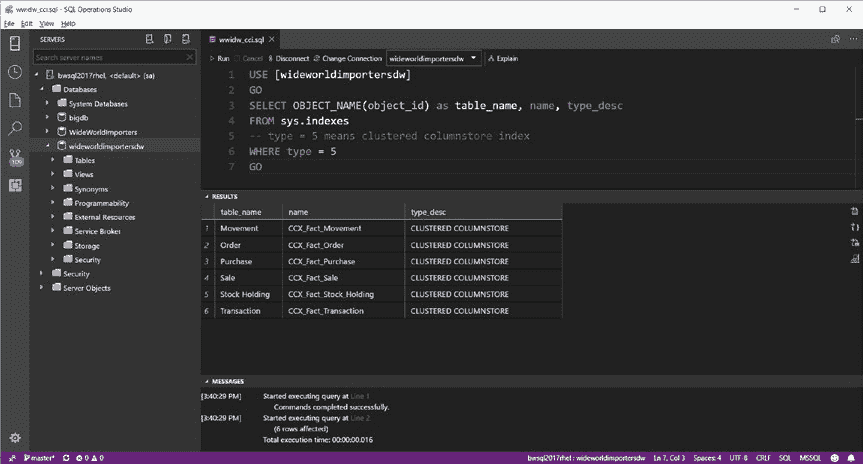

**图 6-20. WideWorldImportersDW 数据库中的聚集列存储索引**

## 行组消除与查询性能

现在，让我们对 `Sales` 表（属于 `Fact` 架构）运行一些查询，以了解列消除和行组消除的工作原理。首先，使用以下 T-SQL 语句（位于示例脚本 `fact_sales_count.sql` 中）找出整个 `Fact.Sales` 表中的行数：

```sql
USE [wideworldimportersdw]
GO
SELECT COUNT(*) FROM Fact.Sale
GO
```

您应该会得到 228,265 行的结果。数据仓库数据库中的许多事实表使用 `datetime` 列，因为按时间存储仓库数据很常见。对于 `Fact.Sales` 表，有两个 `datetime` 列，但数据是按 `[Delivery Date Key]` 列排序的。这正是聚集列存储索引的行组消除的神奇之处。SQL Server 为行组中每个段的值范围存储了元数据。如果数据按特定列排序，SQL Server 就可以根据查询条件跳过某些行组。

尝试运行示例脚本 `fact_sales_all.sql` 中的以下 T-SQL 语句：

```sql
USE [wideworldimportersdw]
GO
SET STATISTICS IO ON
GO
SET STATISTICS XML ON
GO
SELECT * FROM Fact.Sale
WHERE [Delivery Date Key] >= '2016-01-01'
GO
```

如果您查看 `SET STATISTICS IO` 的结果，应该会看到类似这样的内容：

```
Table 'Sale'. Scan count 1, logical reads 0, physical reads 0, read-ahead reads 0, lob logical reads 240, lob physical reads 0, lob read-ahead reads 0.
Table 'Sale'. Segment reads 2, segment skipped 5.
```

`lob logical reads` 的值是 SQL Server 为满足此查询需要从聚集列存储索引的缓存中读取的数据量（注意：如果未指定 `WHERE` 子句，在此情况下 `lob logical reads` 大约为 805）。SQL Server 将列存储索引存储为 LOB 数据，这就是使用此计数器来衡量读取量的原因。显示段读取和跳过段的第二组输出具有误导性。这实际上应读取为“读取的行组”和“跳过的行组”。这意味着此聚集列存储索引总共有七个行组，但由于行组消除，SQL Server 能够跳过其中五个。

现在执行示例脚本 `fact_sales_query.sql` 中的此 T-SQL 语句：

```sql
USE [wideworldimportersdw]
GO
SET STATISTICS IO ON
GO
SET STATISTICS XML ON
GO
SELECT [Customer Key], Quantity
FROM Fact.Sale
WHERE [Delivery Date Key] >= '2016-01-01'
GO
```

在此示例中，我只请求两个列（或段）并使用相同的 `WHERE` 子句。`SET STATISTICS IO` 结果现在如下所示：

```
Table 'Sale'. Scan count 1, logical reads 0, physical reads 0, read-ahead reads 0, lob logical reads 36, lob physical reads 0, lob read-ahead reads 0.
Table 'Sale'. Segment reads 2, segment skipped 5.
```

跳过了相同数量的行组，但由于我只使用了两列，需要的段更少，因此所需的读取量显著降低。这就是列存储的威力。在数据仓库场景中，由于列消除和行组消除，SQL Server 可以极大地加速对大数据扫描的查询。


Sunil 有一篇出色的博客文章，描述了行组消除以及如何解读`SET STATISTICS IO`的输出，请访问`https://blogs.msdn.microsoft.com/sql_server_team/columnstore-index-performance-rowgroup-elimination`。

### 提示

要有效使用列存储索引，有几个主题你需要回顾、理解并实施。

- **数据加载**：通过阅读我们文档的这一部分来正确回顾和规划数据加载：`https://docs.microsoft.com/sql/relational-databases/indexes/columnstore-indexes-data-loading-guidance`。

- **碎片整理**：遵循我们文档中关于碎片整理的指南：`https://docs.microsoft.com/sql/relational-databases/indexes/columnstore-indexes-defragmentation`。

- **分区**：你可以特别地将分区与列存储索引结合使用，以提高可管理性。请参阅我们文档的指南：`https://docs.microsoft.com/sql/relational-databases/indexes/columnstore-indexes-design-guidance#use-table-partitions-for-data-management-and-query-performance`。

## 第六章 性能能力

- **提升性能**：为确保获得最佳性能，请通读我们文档中的这些建议：`https://docs.microsoft.com/en-us/sql/relational-databases/indexes/columnstore-indexes-design-guidance#use-table-partitions-for-data-management-and-query-performance` 和 `https://docs.microsoft.com/en-us/sql/relational-databases/indexes/columnstore-indexes-query-performance#columnstore-performance-explained`。

### 客户案例与资源

列存储索引确实能带来显著改变。请查看这些客户案例研究和其他资源：


• Sunil Agarwal 的客户故事演讲：[`channel9.msdn.com/Events/Ignite/2016/BRK2083`](https://channel9.msdn.com/Events/Ignite/2016/BRK2083)，[`channel9.msdn.com/Events/Ignite/Australia-2017/DA343`](https://channel9.msdn.com/Events/Ignite/Australia-2017/DA343)，以及 [`groupby.org/conference-session-abstracts/successful-production-deployments-with-columnstore-index-in-sql-server-2016/`](https://groupby.org/conference-session-abstracts/successful-production-deployments-with-columnstore-index-in-sql-server-2016/)

• Niko Neugebauer 在其博客上关于列存储索引的全面研究系列文章：[`www.nikoport.com/columnstore/`](http://www.nikoport.com/columnstore/)

• （主要由 Sunil 撰写的）关于列存储索引的 SQL Server 引擎博客文章：[`blogs.msdn.microsoft.com/sqlserverstorageengine/tag/columnstore-index`](https://blogs.msdn.microsoft.com/sqlserverstorageengine/tag/columnstore-index)

列存储索引是加速 SQL Server 性能的强大功能。令人惊叹的是，它**不需要任何应用程序更改**。

列存储索引并非适用于所有工作负载，但它可能适合您。我总是建议客户研究一下列存储索引如何能够帮助提升 SQL Server 查询性能。

## 内存中 OLTP

早在 2007 年，SQL Server 工程团队就开始致力于将高速、低延迟的在线事务处理（OLTP）功能构建到 SQL Server 中。大约在 2010 年，一个名为 **Hekaton** 的项目全面启动。Hekaton 在希腊语中意为 100，其初始目标是在 OLTP 事务中实现相比传统 SQL Server 技术 100 倍的性能提升。截至 SQL Server 2017，现实情况是，我们已经看到了该功能带来的惊人性能，最高可达传统 OLTP 应用程序的约 30 倍。但我们确实见证了一些成功案例，包括一位客户为其高度可扩展的 OLTP 应用程序实现了每秒 120 万批处理请求。您可以在[此处](https://blogs.msdn.microsoft.com/sqlcat/2016/10/26/how-bwin-is-using-sql-server-2016-in-memory-oltp-to-achieve-unprecedented-performance-and-scale/)查看他们的故事以及可能实现的性能。

##### 基础知识

首先，请阅读文档中的[此页面](https://docs.microsoft.com/sql/relational-databases/in-memory-oltp/requirements-for-using-memory-optimized-tables)，了解使用内存中 OLTP 功能的基本要求。

内存中 OLTP 是 SQL Server 的一项功能，在标准版和企业版中均可用（标准版有一些限制）。自首次引入以来，内存中 OLTP 在功能和限制方面都取得了重大进步。


作为 SQL Server 2014 中的一项功能。此功能由以下组件构成：

• Hekaton 引擎
• 内存优化文件组
• 内存优化表
• 内存优化表的索引——哈希或非聚集索引
• 本机编译存储过程

###### Hekaton 引擎

在 SQL Server 数据库引擎内部构建了一个用于内存 OLTP 的“引擎中的引擎”。它由一系列实现内存 OLTP 事务逻辑的动态链接库组成。其中包括一个编译组件、一个运行时组件和一个引擎。这些组件与 SQL Server 引擎的其他部分（如查询处理和事务日志记录）协同工作。然而，也存在一些独立于 SQL Server 引擎的组件，用于处理检查点和垃圾回收等功能。所有 Hekaton 组件仍然依赖 SQLOS 子系统，并在 Linux 环境下通过主机扩展来调用任何原生的 Linux 内核服务（例如，I/O）。

### 第 6 章 性能特性

通常，您看不到 Hekaton 引擎的这些组件，因为其设计理念是完全内置的。但是，当您开始检查 DMV（如 `dm_exec_requests`）的一些细节时，如果您使用 T-SQL 创建内存优化文件组和内存优化表，就会开始看到新的任务。

例如，`WideWorldImporters` 数据库包含一个内存优化文件组和内存优化表。因此，当您还原该示例数据库时，您会在 `sys.dm_exec_requests` 中看到一些任务，其 `command` 列的值为 `XTP_CKPT_AGENT` 或 `XTP_THREAD_POOL` 等。

> **注意** `XTP` 代表 eXtreme Transaction Processing（极限事务处理），是内存 OLTP 的另一个内部名称。您可能会看到几个以 `hK`（hekaton）或 `XTP` 开头的诊断对象和消息。这些都与内存 OLTP 组件相关。

内存 OLTP 的两个关键设计原则是：

• 所有数据都存储在内存中（但通过事务日志和检查点文件提供了持久化选项），并且**必须能完全装入内存**。
• 使用一套“无锁无闩锁”的算法和行版本控制来优化数据访问。内存 OLTP 采用乐观并发方法来避免锁问题，并在内部使用技术来避免内部线程并发问题。对内存优化表的修改使用行版本控制方案，以避免额外的事务冲突（此行版本控制方案与 SQL Server 快照隔离不同，并且不使用 `tempdb`）。

我在本章前面的章节中简要提到了锁，因为这是确保 SQL Server 应用程序事务一致性的主要机制。我还没有提到 `latches`（闩锁）的概念，它是 SQL Server 的一种内部机制，用于在多个线程之间保护数据库页面的物理完整性，也用于引擎中的其他线程并发保护方案。内存 OLTP 为实现低延迟和高速度的一个关键设计原则，就是在“Hekaton 引擎”中避免使用任何锁或闩锁。（`Hekaton` 在其代码中也避免了使用 `spinlocks`，这是另一种内部线程并发机制）。

### 第 6 章 性能特性

内存 OLTP 并非通过一个特定选项来启用的功能。使用此功能的方法是：

1. 创建一个内存优化文件组
2. 在数据库中创建并使用一个或多个内存优化表（包括索引的选择）
3. （可选）创建一个或多个本机编译存储过程

让我们更详细地看看每一项。

###### 内存优化文件组

在数据库中使用内存 OLTP 的第一步是为内存优化表创建一个特殊的文件组。让我们以 `WideWorldImporters` 示例为例来说明。如果您需要根据备份/还原来生成创建数据库的脚本（有关如何执行此操作，请参阅以下文档：`https://docs.microsoft.com/sql/ssms/tutorials/scripting-ssms#script-databases`）。


[microsoft.com/sql/ssms/tutorials/scripting-ssms#script-databases](https://docs.microsoft.com/sql/ssms/tutorials/scripting-ssms#script-databases) 你将会看到这条 T-SQL 语句：

**注意** 如果你没有 SQL Server Management Studio，请记住 `mssql-scripter` 工具（你可以在 [`github.com/Microsoft/mssql-scripter`](https://github.com/Microsoft/mssql-scripter) 获取此工具）。

在 Linux 上，`mssql-scripter` 可用于为 SQL Server 生成脚本。我还在示例脚本 `wwi.sql` 中提供了 `WideWorldImporters` 数据库的完整脚本。

```sql
CREATE DATABASE [WideWorldImporters]
CONTAINMENT = NONE
ON  PRIMARY
( NAME = N'WWI_Primary', FILENAME = N'/var/opt/mssql/data/WideWorldImporters.mdf' , SIZE = 1048576KB , MAXSIZE = UNLIMITED, FILEGROWTH = 65536KB ),
FILEGROUP [USERDATA]  DEFAULT
( NAME = N'WWI_UserData', FILENAME = N'/var/opt/mssql/data/WideWorldImporters_UserData.ndf' , SIZE = 2097152KB , MAXSIZE = UNLIMITED, FILEGROWTH = 65536KB ),
FILEGROUP [WWI_InMemory_Data] CONTAINS MEMORY_OPTIMIZED_DATA  DEFAULT
( NAME = N'WWI_InMemory_Data_1', FILENAME = N'/var/opt/mssql/data/WideWorldImporters_InMemory_Data_1' , MAXSIZE = UNLIMITED)
LOG ON
( NAME = N'WWI_Log', FILENAME = N'/var/opt/mssql/data/WideWorldImporters.ldf' , SIZE = 102400KB , MAXSIZE = 2048GB , FILEGROWTH = 65536KB )
GO
```

注意 `CREATE DATABASE` 语句的这一部分：

```sql
FILEGROUP [WWI_InMemory_Data] CONTAINS MEMORY_OPTIMIZED_DATA  DEFAULT
( NAME = N'WWI_InMemory_Data_1', FILENAME = N'/var/opt/mssql/data/WideWorldImporters_InMemory_Data_1' , MAXSIZE = UNLIMITED)
```

这里特殊的语法是 `CONTAINS MEMORY_OPTIMIZED_DATA`。注意 `FILENAME` 不是文件的名称，而是目录的路径。此语法告知 SQL Server，该数据库将能够存储内存优化表。SQL Server 使用此特殊 `FILEGROUP` 的路径来创建目录以存储检查点文件。检查点文件是存储未在事务日志中处于活动状态的、持久的内存优化表数据的文件。实际上，内存优化表的持久性是由存储在检查点文件中的内容以及自上次数据库检查点以来的那部分事务日志共同构成的。

你可以在我们的文档中阅读更多关于内存优化 `FILEGROUP` 的信息：[`docs.microsoft.com/sql/relational-databases/in-memory-oltp/the-memory-optimized-filegroup`](https://docs.microsoft.com/sql/relational-databases/in-memory-oltp/the-memory-optimized-filegroup)，以及关于内存优化表的检查点文件：[`docs.microsoft.com/sql/relational-databases/in-memory-oltp/durability-for-memory-optimized-tables`](https://docs.microsoft.com/sql/relational-databases/in-memory-oltp/durability-for-memory-optimized-tables)。

## 第六章 性能特性

###### 内存优化表

一旦你为数据库创建了内存优化的 `FILEGROUP`，你就可以在该数据库中创建内存优化表。内存优化表的外观和感觉与数据库中的*常规*（通常称为基于磁盘的）表类似，只是你在使用 `CREATE TABLE` 语句时需要使用 T-SQL 语法的一个扩展。

让我们再次使用 `WideWorldImporters` 示例数据库来看一个例子。使用 SQL Server Management Studio 中为表生成脚本的功能（参见文档 [`docs.microsoft.com/sql/ssms/tutorials/scripting-ssms#script-tables`](https://docs.microsoft.com/sql/ssms/tutorials/scripting-ssms#script-tables)），为 `[Warehouse].[VehicleTemperatures]` 表生成脚本：

```sql
CREATE TABLE [Warehouse].[VehicleTemperatures]
(
    [VehicleTemperatureID] [bigint] IDENTITY(1,1) NOT NULL,
    [VehicleRegistration] nvarchar COLLATE Latin1_General_CI_AS NOT NULL,
    [ChillerSensorNumber] [int] NOT NULL,
```


###### 内存优化表

```sql
[RecordedWhen] datetime2 NOT NULL,

[Temperature] decimal NOT NULL,

[FullSensorData] nvarchar COLLATE Latin1_General_CI_AS NULL,

[IsCompressed] [bit] NOT NULL,

[CompressedSensorData] varbinary NULL,

CONSTRAINT [PK_Warehouse_VehicleTemperatures]  PRIMARY KEY NONCLUSTERED

(

[VehicleTemperatureID] ASC

)

)WITH ( MEMORY_OPTIMIZED = ON , DURABILITY = SCHEMA_AND_DATA )

GO
```

注意 `WITH` 选项的扩展语法。`MEMORY_OPTIMIZED = ON` 告诉 SQL Server 这将是一个内存优化表。

内存优化表有两种类型，你使用 `DURABILITY` 选项来指定具体类型：

`SCHEMA_AND_DATA`：此选项通过检查点文件和事务日志确保架构（表定义）和数据的持久性。

`SCHEMA_ONLY`：此选项仅确保架构的持久性，而不持久化用户数据。这意味着，如果在插入数据后 SQL Server 因任何原因关闭，所有数据都将丢失。这听起来可能非常糟糕，但在某些场景下，你可能需要`cache`数据，并且不在意这些数据是否被持久化。这种类型的内存优化表提供了最快可能的性能，因为更改不会被记录到事务日志中。

## 性能特性

内存优化表有一个特别重要的特性。这类表中的所有数据都必须能放入内存中。SQL Server 会在常规缓冲池之外使用内存资源来存储内存优化数据。这意味着，如果你在 SQL Server 中使用内存优化表，使用缓冲池的基于磁盘的表和内存优化表之间将存在对内存资源的竞争。SQL Server 对内存优化表允许使用的内存量有限制，但也可以通过资源调控器来限制内存使用。更多详情请参阅我们的文档：`https://docs.microsoft.com/sql/relational-databases/in-memory-oltp/bind-a-database-with-memory-optimized-tables-to-a-resource-pool`。

重要的是要知道，内存优化表可以与数据库中的基于磁盘的表共存。基于磁盘的表将使用标准的 SQL Server 缓冲池和数据库文件进行存储。内存优化表则存储在内存中一个由 SQL Server 管理的独立内存区域中，并通过检查点文件和事务日志实现持久化（注意：数据库中所有基于磁盘的表和内存优化表的事务都存储在同一个事务日志中）。

内存优化表必须放入内存这一事实本身并非真正的性能优势。即使是基于磁盘的表，也会从磁盘加载到缓冲池中。关键的性能优势在于对内存中数据的`optimized`访问，因此得名。这种优化优势真正体现在并发访问内存优化表时。我不建议你用单用户的例子来衡量内存优化表的真正好处。它的核心在于并发的、优化的数据访问。

### 索引

内存优化表的内部结构与基于磁盘的表不同。它们不使用相同的 8KB 数据库页面和行结构概念。这些内部细节不是你在使用此功能时应该关心的，但了解它们对于理解索引特别有用。

内存优化表没有聚集索引。相反，索引仅用于访问数据。内存优化表有两种索引类型可用：

## 哈希索引

哈希索引是对键列的哈希值建立的索引。


###### 非聚集索引

哈希索引在您几乎总是执行单行查找查询时可能非常高效。哈希索引可以很高效，但也可能难以决定如何配置和维护。

一种类似于基于磁盘表的非聚集索引的 B 树结构。我建议您将非聚集索引作为默认索引类型，然后进行调优，以查看哈希索引是否更适合您的工作负载。

您可以在内存优化表的多个列上使用许多索引，但必须始终有一个定义为主键的索引（哈希或非聚集）。

当您探索内存优化表的工作原理时，我认为以下两个资源可能很有价值：

- 由 Kalen Delaney 撰写的关于 In-Memory OLTP 内部原理的白皮书：[In-Memory OLTP 内部原理](https://docs.microsoft.com/sql/relational-databases/in-memory-oltp/sql-server-in-memory-oltp-internals-for-sql-server-2016)
- 我做过的一次关于 In-Memory OLTP 内部原理的演示，可在 YouTube 上找到：[In-Memory OLTP 内部原理解析](https://www.youtube.com/watch?v=P9DnjQqE0Gc)

### 原生编译存储过程

内存优化表允许使用标准的 T-SQL 语句，但有一些限制（有关限制，请参阅此文档：[In-Memory OLTP 不支持的 Transact-SQL 构造](https://docs.microsoft.com/sql/relational-databases/in-memory-oltp/transact-sql-constructs-not-supported-by-in-memory-oltp)）。这个概念被称为 `interpreted` T-SQL。

为了进一步提升性能，我们创建了一个称为 `natively compiled` 存储过程的概念。其理念是，您可以使用特殊的 T-SQL 语法创建存储过程，这样 SQL Server 就会编译并构建一个动态链接库 (DLL) 来表示存储过程中的所有 T-SQL 查询。

所有通常编译成查询计划来执行查询的代码都被内置到 DLL 中。这使得执行原生编译存储过程时速度极快。

## 第 6 章 性能能力

如果您使用本章前面描述的技术来生成对象的脚本，您可以从这个存储过程 `Website.RecordColdRoomTemperatures` 的片段中看到原生编译存储过程的语法：

```sql
CREATE PROCEDURE [Website].[RecordColdRoomTemperatures]
@SensorReadings Website.SensorDataList READONLY
WITH NATIVE_COMPILATION, SCHEMABINDING, EXECUTE AS OWNER
AS
BEGIN ATOMIC WITH
(
TRANSACTION ISOLATION LEVEL = SNAPSHOT,
LANGUAGE = N'English'
)
BEGIN TRY
.
.
.
```

`WITH NATIVE_COMPILATION` 扩展是创建原生编译存储过程的关键。

内存优化表与原生编译存储过程的结合，提供了 In-Memory OLTP 最大的可能性能能力。原生编译过程并非适用于所有场景，并且对 T-SQL 语句有一些限制。有关在使用原生编译过程时使用 T-SQL 某些方面的任何限制，请参阅此文档：[In-Memory OLTP 不支持的 Transact-SQL 构造](https://docs.microsoft.com/sql/relational-databases/in-memory-oltp/transact-sql-constructs-not-supported-by-in-memory-oltp)


# 第 6 章：性能特性

[by-in-memory-oltp](https://docs.microsoft.com/sql/relational-databases/in-memory-oltp/transact-sql-constructs-not-supported-by-in-memory-oltp).

###### 使用场景

如果您有足够的内存来容纳数据，并且需要一个高速、可扩展的 OLTP 解决方案，那么内存优化表可能很适合您。您可以使用我们文档中的这个位置来估算内存优化表的内存需求：[`docs.microsoft.com/sql/relational-databases/in-memory-oltp/estimate-memory-requirements-for-memory-optimized-tables`](https://docs.microsoft.com/sql/relational-databases/in-memory-oltp/estimate-memory-requirements-for-memory-optimized-tables).

内存 OLTP 的用途比传统的`INSERT`、`UPDATE`、`DELETE`类型 SQL 应用更广泛。请考虑以下其他示例：
*   数据摄取应用程序，特别是物联网（`IoT`）场景
*   缓存和会话状态数据
*   替代`tempdb`的使用
*   提取转换加载（`ETL`）场景

请查阅我们的文档，获取有关这些场景的更多指导以及一些客户案例研究示例：[`docs.microsoft.com/sql/relational-databases/in-memory-oltp/overview-and-usage-scenarios`](https://docs.microsoft.com/sql/relational-databases/in-memory-oltp/overview-and-usage-scenarios).

## 智能的 SQL Server 引擎

我在本章中介绍了 SQL Server 引擎内置或通过配置设置、以及像`列存储`索引这样的附加功能提供的所有出色性能特性。在 SQL Server 2017 中，我们决定开始投资于那些能为 SQL Server 引擎提供更多`智能`的功能，以帮助提升应用程序性能并减少解决性能问题的时间。其中一个功能内置于查询处理引擎中，另一个则在启用`查询存储`功能时内置在引擎中。

##### 自适应查询处理

虽然 SQL Server 中的查询处理器是引擎的一个惊人组件，旨在构建最佳查询计划并同时保持较快的编译时间，但在某些情况下，查询处理器的决策能力会受到限制。而许多这些场景都涉及到基于基数估计的限制。

因此，在 SQL Server 2017 中，我们没有总是“徒劳无功”地试图修复这些基数问题，而是构建了使查询处理器能够`适应`查询执行问题并“即时”纠正它们的功能。

这一系列功能被称为`自适应查询处理`（这实际上是 SQL Server 计划中更广泛的功能集`智能查询处理`的一部分）。

在 SQL Server 2017 中，我们启用了三种不同的自适应查询处理场景：
*   批处理模式内存授予反馈
*   批处理模式自适应连接
*   交错执行

如果您还记得前面关于`列存储`索引的部分，我曾提到过`批处理模式`处理这个主题。这意味着，对于前两个场景，自适应查询处理仅在查询处理器使用批处理模式时才有效。在 SQL Server 2017 中，这仅适用于`列存储`索引的场景。

第一个场景，即批处理模式内存授予反馈，其概念是：如果 SQL Server 检测到某个查询已执行并使用了错误的内存授予，它将调整该查询的内存分配。该查询的后续执行将适应新的授予，从而避免性能问题。此检测内置于查询处理器中，不需要重新编译查询。

第二个场景是 SQL Server 通过创建新查询计划进行适应的一个例子。


##### 自适应查询处理

一个具备`智能`适配能力的运算符。这种新型运算符被称为`自适应联接`运算符。

其核心理念是，SQL Server 可以将特定联接方法的选择推迟到读取数据之后再决定，从而选择最优的联接方式。

第三种场景涉及 SQL Server 查询优化器在编译多语句表值函数的查询计划时进行自我调整，这类函数在基数估计方面存在挑战。优化器会暂停优化过程，收集更精确的基数信息，然后恢复优化以适配更优的查询计划。

要查看自适应查询处理的实际运行情况，请从 `` `aqp` `` 目录下载本章的示例文件，并按照 `` `readme.md` `` 文件中的说明进行操作。

**注意** 此演示需要使用 WideWorldImportersDW 示例数据库，可从以下网址获取：[`github.com/Microsoft/sql-server-samples/releases/download/wide-world-importers-v1.0/WideWorldImportersDW-Full.bak`](https://github.com/Microsoft/sql-server-samples/releases/download/wide-world-importers-v1.0/WideWorldImportersDW-Full.bak)。因此，您可以从另一台计算机复制备份文件，或者运行以下命令直接在您的 Linux 服务器上下载备份文件：

```bash
wget https://github.com/Microsoft/sql-server-samples/releases/download/wide-world-importers-v1.0/WideWorldImportersDW-Full.bak
```

我还提供了 `` `cpwwidw.sh` ``、`` `restore_wwidw_linux.sql` `` 和 `` `restorewwidw.sh` `` 脚本，以帮助您复制和还原此示例。

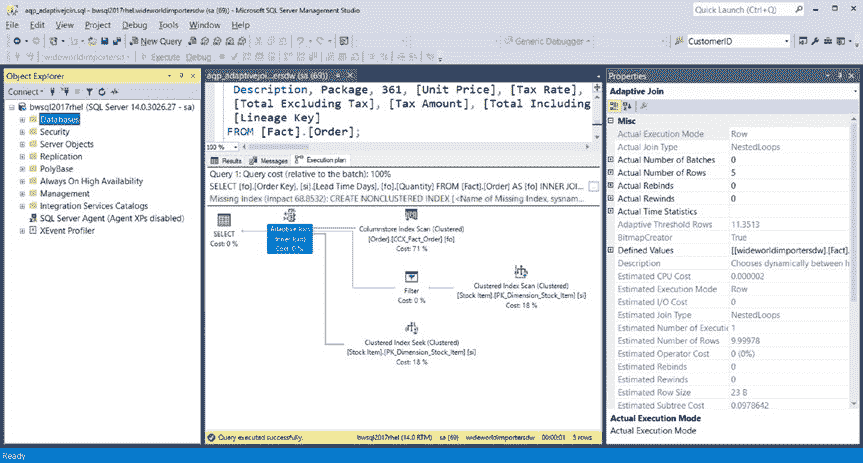

## 第 6 章 性能能力

当您运行自适应联接演示（可在 `` `aqp_adaptivejoin.sql` `` 示例脚本中找到）时，请显示演示中最终查询的实际执行计划。您的查询计划应与图 6-21 类似。

***图 6-21.** 作为自适应查询处理一部分的自适应联接*

请注意，`Adaptive Join` 运算符具有一个 `实际联接类型`，在本例中，根据查询执行时的数据值，该类型为 `嵌套循环`。在演示脚本中，前一个查询的联接类型是 `哈希联接`。

如果您使用的数据库兼容性级别为 `140`，则 SQL Server 查询处理器中会启用自适应查询处理。如果您使用 SQL Server 2017 创建新数据库，此为默认兼容性级别。我将在本书后面关于迁移的章节中讨论用于升级和迁移场景的数据库兼容性。

负责此产品领域的首席项目经理 Joe Sack 在 YouTube 上发布了一个非常棒的视频，您可以观看完整的演示，并听取他对该功能各方面的讲解：[`www.youtube.com/watch?v=szTmo6rTUjM`](https://www.youtube.com/watch?v=szTmo6rTUjM)。

##### 自动调优

当我第一次看到 SQL Server 2017 的早期版本时，立即吸引我眼球的功能之一就是 `自动调优`，其中包含一个名为 `自动计划修正` 的选项。

SQL Server 2017 于 2017 年 10 月发布，紧随我最喜欢的版本之一 SQL Server 2016 之后。在 SQL Server 2016 中，我们为产品引入了一项名为 `` `查询存储` `` 的新功能。当通过 `ALTER DATABASE` 为数据库启用 `查询存储` 后，SQL Server 引擎将开始在内存中收集查询性能遥测数据，


数据库中的系统表。您不再需要去`轮询`动态管理视图并将其存储到您自己的表中。这项性能遥测数据会在查询被编译和执行时，由 SQL Server 引擎自身收集。

与我们构建到 SQL Server 中的许多功能一样，您可以通过一系列目录视图（可在`https://docs.microsoft.com/sql/relational-databases/system-catalog-views/query-store-catalog-views-transact-sql`找到）使用 T-SQL 查询来查找性能数据的详细信息。查询存储提供了各种酷炫的性能洞见，我们已经在`https://docs.microsoft.com/sql/relational-databases/performance/monitoring-performance-by-using-the-query-store#Scenarios`文档中记录了一些关键使用场景。其中一个场景称为`查询计划回归`（也称为`计划选择回归`，您可以在`https://docs.microsoft.com/sql/relational-databases/performance/query-store-usage-scenarios#pinpoint-and-fix-queries-with-plan-choice-regressions`中了解更多）。

想象一下这个场景。您有一个存储过程，它接受一个整型参数。这个整型参数用在该存储过程中一条 SELECT 语句的 WHERE 子句中。当该存储过程第一次被编译时，基于过程首次执行时的参数值，此过程的计划被插入缓存。这个计划对大多数用户来说可能是个好计划。现在，由于某些意外原因，比如内存压力，该计划被从缓存中清除。假设一个用户随后通过应用程序执行该过程，但这次使用了不同的整型参数值。这可能导致产生一个不同的查询计划，从而引发性能问题（例如，新计划可能涉及索引扫描，而这并非对所有执行都是最优的）。根据参数值为存储过程编译计划被称为`参数嗅探`。这个概念在我们文档的`查询处理体系结构指南`中有讨论（该指南本身也值得一读：`https://docs.microsoft.com/sql/relational-databases/query-processing-architecture-guide`）。参数嗅探的设计初衷是好的，但在某些情况下，如果与参数关联的表中的数据分布不均，就可能出现性能问题。

因此，在 SQL Server 2016 中，您可以使用 SQL Server Management Studio 中的报告，或者查询查询存储目录视图，来查看是否是查询计划回归导致了性能问题。现在，SQL Server 2017 带来了一些

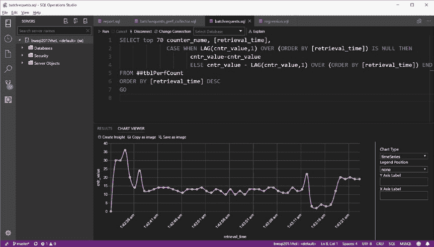

## 第 6 章 性能特性


## 第 6 章

自动化。为何不在引擎中内置一些自动化功能，利用查询存储丰富的遥测数据呢？原来我们工程团队中负责查询存储功能的同事们，已经为 Azure SQL Database 在云端开发这类功能了。采用我们云端优先的工程开发模式，我们开始在 Azure 上开发这些功能，测试并验证其有效性，然后将其引入 SQL Server 2017。

我有一个你可以自己尝试的演示（惊喜！它使用了`WideWorldImporters`数据库），演示的是在 Linux 上运行 SQL Server 并使用 SQL Operations Studio。我建议你完成整个示例，你可以在本章示例的`autotune`目录中找到它，或者访问我的 GitHub 站点：[`github.com/Microsoft/bobsql/tree/master/demos/sqlserver/sqllinux/autotune`](https://github.com/Microsoft/bobsql/tree/master/demos/sqlserver/sqllinux/autotune)。只需按照`readme.md`文件中的说明操作即可。运行此演示时，你会注意到我以一种新的方式使用了本章前面展示的 SQL Operations Studio 的图表功能。图 6-22 展示了自动调优解决演示中查询计划回归问题后，来自 SQL Operations Studio 的图表示例。

**图 6-22. 使用 SQL Operations Studio 演示自动调优功能**

图 6-22 所示的图表测量的是`batch requests/sec`（每秒批处理请求数），这是衡量 SQL Server 查询吞吐量的标准方法。请注意图表右侧性能如何下降，但又自动迅速恢复到预期水平。

我向几乎所有人展示过这个演示，他们都感到惊讶。我推荐使用此功能的建议如下：

-   启用查询存储并根据你的需求进行配置。请参阅我们在最佳实践方面的文档：[`docs.microsoft.com/sql/relational-databases/performance/best-practice-with-the-query-store`](https://docs.microsoft.com/sql/relational-databases/performance/best-practice-with-the-query-store)。
-   通过检查动态管理视图`dm_db_tuning_recommendations`来监控我们为你提供的任何建议。
-   如果你认可我们的建议，可以尝试使用以下 T-SQL 语法开启自动计划修正：
```
ALTER DATABASE current
SET AUTOMATIC_TUNING ( FORCE_LAST_GOOD_PLAN = ON );
```
-   无论你只是查看建议还是使用自动化功能，我始终建议你找出查询计划回归问题的原因，并采取更长期的纠正措施。

如果你想跟随并观看我在 Linux 上使用 SQL Server 演示自动调优，请观看我在 SQL Server YouTube 频道上发布的演示视频：[`youtu.be/Sh8W7IFX390`](https://youtu.be/Sh8W7IFX390)。

#### 本章小结

本章中，我的目的是确保你了解 SQL Server 在 Linux 上性能的潜力。我介绍了你可以信赖的 SQL Server 内置性能能力，从笔记本电脑的可扩展性到业内最大的企业级服务器。我向你展示了针对 SQL Server 和 Linux 的重要配置选择。并且我讨论了如何通过正确平衡索引、维护统计信息以及在你的应用程序中合理使用 T-SQL 来实现性能调优。你还看到了如何利用新技术来加速性能，从列存储索引到诸如自动调优之类的智能性能功能。掌握了这些知识，现在是时候确保你了解如何保护你的 SQL Server，并学习在 Linux 上运行时重要的安全功能和选项了。

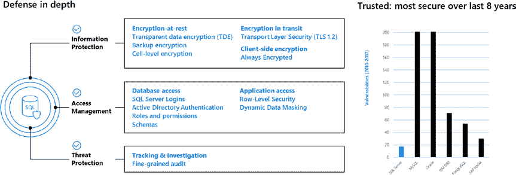

## 第 7 章

# `SQL Server 中的安全性`

SQL Server 数据平台和引擎的第二大支柱是安全性。SQL Server 2017 不仅提供了一套丰富的功能来满足您的安全需求，而且在过去近十年中，一直被公认为漏洞最少的数据库平台。图 7-1 是我用来展示 SQL 安全性功能套件概览（业内许多人称之为*纵深防御*）的标准图表之一，其中还包含了一张对比 SQL Server 与竞争对手在漏洞方面评级的图表。

***图 7-1.** `SQL Server 纵深防御`*

右侧的柱状图并非微软杜撰。它来自美国国家标准与技术研究院综合漏洞数据库 (`https://www.nist.gov/programs-projects/national-vulnerability-database-nvd`)，这也解释了我们对安全性的重视程度。

在本章中，我将向您展示构成纵深防御故事的各种安全功能。安全性不仅仅是一个软件功能，因此我还建议您阅读我们文档中关于如何保护 SQL Server（包括物理安全）的这一部分：`https://docs.microsoft.com/sql/relational-databases/security/securing-sql-server`。

© Bob Ward 2018
B. Ward, `Pro SQL Server on Linux`, `https://doi.org/10.1007/978-1-4842-4128-8_7`

## 第 7 章：SQL Server 中的安全性

#### 登录名和用户

到目前为止，在本书中我已经向您展示了两个 SQL Server 登录名（`sa` 和一个我创建的名为 `sqllinux` 的登录名）的示例，这些是用于连接到 SQL Server 并执行查询的身份标识。这两个登录名都是使用 `SQL Server 身份验证`连接到 SQL Server 的例子。SQL Server 身份验证需要一个名称和密码。应用程序使用该名称和密码连接到 SQL Server。这是连接到 SQL Server 最简单且兼容性最好的方法，无论是在 Windows、Linux 还是 Azure 上。最大的缺点是，您必须维护一组独立于其他身份验证目的（如 Active Directory）的身份验证对象。我将在本章下一节向您展示如何在 Linux 上设置和使用 `Active Directory 身份验证`。

虽然*登录名*是 SQL Server 实例级别的对象，但数据库也有*用户*。登录名和数据库中的用户之间存在关联。每个使用 SQL Server 创建的登录名都至少映射到 `master` 数据库中的一个用户。`sa` 登录名映射到一个名为 `dbo`（数据库所有者）的用户。所有其他创建的登录名都映射到 `guest` 用户。所有数据库在创建时，基于 `model` 数据库的定义，都具有 `dbo` 和 `guest` 用户。除了 `sa` 登录名外，大多数登录名将通过将该登录名映射到您在数据库中创建的用户来获得访问用户数据库的权限。如果您希望某个登录名拥有数据库所有者的权限，您会将该用户映射到 `dbo` 用户。否则，您会在数据库中创建一个新用户并将登录名映射到该用户。登录名可以映射到同一 SQL Server 实例上不同数据库中的不同用户。

在本书前面的示例中，我向您展示了如何创建一个名为 `sqllinux` 的新用户。我没有将 `sqllinux` 映射到特定用户，而是使用此登录名创建了一个名为 `WideWorldImporters` 的数据库。使用登录名（如果将该登录名放入 `dbcreator` 角色中）创建数据库会自动将该登录名映射到所创建数据库的 `dbo` 用户。默认情况下，作为一项安全最佳实践，`guest` 用户的连接访问权限对于用户数据库是被撤销的（对于系统数据库则必须启用）。


# 第 7 章 SQL Server 中的安全性

## **重要安全说明**

数据库 `msdb`)。这意味着，如果您创建一个新的登录名并尝试访问某个数据库，但该登录名尚未映射到该数据库的用户，则访问将失败，并显示类似以下的错误：

```
Msg 916, Level 14, State 1, Line 1
The server principal "sqllinux" is not able to access the database "WideWorldImporters" under the current security context.
```

## **提示**

对于任何生产系统，您都应考虑密码过期和复杂性要求。请参阅我们的文档以获取相关指导：[`docs.microsoft.com/sql/relational-databases/security/password-policy`](https://docs.microsoft.com/sql/relational-databases/security/password-policy)。

## **步骤 1：创建新登录名**

那么，让我们按照为任何新建数据库创建登录名和用户的步骤进行操作：

• 首先，我强烈建议您不要使用 `sa` 登录名为生产环境创建新数据库。如果您只是在开发或试验 SQL Server，那么使用 `sa` 是可以的。

• 因此，要创建您的第一个数据库，请使用 T-SQL `CREATE LOGIN` 语句创建一个新的登录名。在本书第 3 章中，我向您展示了如何执行此操作并为该登录名授予创建数据库的适当权限，如下所示（此脚本位于第 3 章的示例文件 `createlogin.sql` 中）。请以 `sa` 登录名连接并执行此脚本。

```sql
USE master
GO
IF EXISTS (select * from sys.server_principals where name = 'sqllinux')
DROP LOGIN [sqllinux]
GO
CREATE LOGIN [sqllinux] WITH PASSWORD=N'Sql2017isfast', DEFAULT_DATABASE=[master]
GO
ALTER SERVER ROLE dbcreator ADD MEMBER sqllinux
GO
```

在此示例中，我将此登录名添加到了一个服务器角色，以允许其创建数据库。我将在本章后面更详细地讨论角色。此登录名现在将映射到用户 `dbo`，并拥有该数据库中授予 `dbo` 用户的所有权限。

## **注意**

在第 3 章中，我使用了旧的系统存储过程 `sp_addsrvrolemember`。使用它完全没有问题，但从技术上讲它已弃用。这里我使用了新的 `ALTER SERVER ROLE` 语法。

## **步骤 2：创建新数据库**

• 使用以下 T-SQL 语句，以 `sqllinux` 登录名连接并创建新数据库（该语句位于示例文件 `createdb.sql` 中）：

```sql
USE [master]
GO
DROP DATABASE IF EXISTS [SecureMyDatabase]
GO
CREATE DATABASE [SecureMyDatabase]
GO
```

## **步骤 3：验证用户映射**

• 作为示例文件 `whichuserami.sql` 中的脚本，运行此 T-SQL 语句，以找出 `sqllinux` 登录名映射到的数据库用户：

```sql
USE [SecureMyDatabase]
GO
SELECT SUSER_NAME() as current_login, USER_NAME() as current_database_user
GO
```

图 7-2 显示了使用 SQL Operations Studio 的结果。

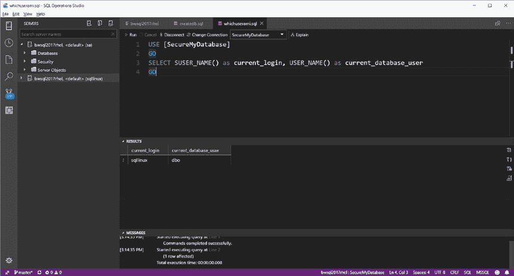

**图 7-2.** 创建数据库后，`sqllinux` 的登录名和用户

在此示例中，我使用了两个内置的 SQL Server 函数来查找当前连接的登录名和数据库用户。由于数据库是由 `sqllinux` 登录名创建的，因此它会自动映射到 `dbo` 用户。

## **步骤 4：创建另一个用户**

• 现在，让我们在数据库中创建一个不是数据库所有者的用户。第一步是创建一个新的登录名，其默认数据库设为 `SecureMyDatabase`。以 `sa` 登录名连接，使用以下 T-SQL 批处理（位于示例脚本 `createnewuserlogin.sql` 中）（注意：可以向 `sqllinux` 登录名授予创建新登录名的权限）：

```sql
USE [MASTER]
GO
USE master
GO
IF EXISTS (select * from sys.server_principals where name = 'newuser')
DROP LOGIN [newuser]
GO
CREATE LOGIN [newuser] WITH PASSWORD=N'Sql2017isfast', DEFAULT_DATABASE=[SecureMyDatabase]
GO
```

此时，如果您尝试以 `newuser` 登录名登录，将收到类似以下的错误：

```
Cannot open user default database. Login failed. Login failed for user 'newuser'.
```


这是因为 `newuser` 登录名并未映射到 `[SecureMyDatabase]` 数据库中的任何用户。

因此，下一步是以 `dbo` 用户（即 `sqllinux` 登录名）连接到数据库，并在其中创建一个用户。以 `sqllinux` 身份连接后，执行以下 T-SQL 批处理（可在示例脚本 `createuser.sql` 中找到）：

```sql
USE [SecureMyDatabase]
GO
CREATE USER newuser FOR LOGIN newuser
GO
```

**注意** 你不必将用户映射到与登录名相同的名称，但这确实能使管理和理解更加容易。

现在，让我们以 `newuser` 登录名连接，并使用 SQL Operations Studio 再次运行 `whichuserami.sql` 脚本。图 7-3 展示了结果应有的样子。

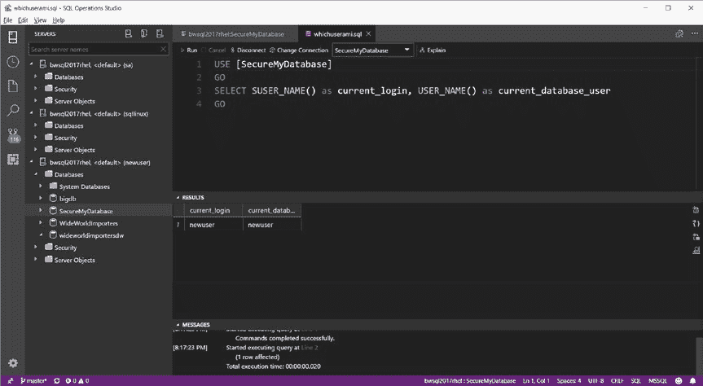

***图 7-3.** `newuser` 登录名与用户*

如果名为 `newuser` 的用户不是数据库所有者，那么该用户能做什么？此登录名和用户现在拥有什么权限和访问权限？我将在后面的章节中介绍这一点。首先，我想向你展示一种不同的登录身份验证方法，称为 Active Directory 身份验证。

#### Active Directory 身份验证

SQL Server 身份验证简单易用。然而，任何规模的组织中的大多数用户，其登录账户都属于公司基础设施的一部分，例如 Active Directory 域。使用单点登录不仅高效，而且更安全，因为你不必管理不同的账户来使用公司资源和 SQL Server。Windows 上的 SQL Server 多年来一直提供这种方法，称为 Windows 身份验证。

Active Directory 是一种非常流行的基于身份的管理系统，即使对于使用 Linux 服务器的组织也是如此。Linux 提供了加入 Active Directory 域所需的软件包和软件。SQL Server 可以利用此功能，使用 Kerberos 对 Active Directory 用户进行身份验证，这与 Windows 身份验证非常相似。用户现在可以登录到 Linux 服务器或任何可以加入域的计算机，并登录到 SQL Server，而无需使用单独的 SQL 登录名。

##### 工作原理

Active Directory 身份验证涉及以下命令和对象：

- **`realm`**：Linux 上的一个命令，允许你将 Linux 服务器加入 Active Directory 域。`realm` 要求你安装 `realmd` 软件包。术语 *realm* 源于 Kerberos 概念，即 Kerberos realm。
- 票据授权票据 (`TGT`)：一个加密文件，是一个 *票据*，发送给票据授权服务器 (`TGS`) 以请求访问域中的服务（如 SQL Server）。`TGS` 功能由 Windows 域控制器实现。
- **`kinit`**：一个 Linux 命令，用于获取并缓存域用户的 `TGT`。
- 服务主体名称 (`SPN`)：Active Directory 中服务（如 SQL Server）的唯一标识符。
- **`keytab`**：Linux 上的一个文件，用于存储用于验证传入 Kerberos 身份验证请求的加密密钥。
- 域控制器：为 Active Directory 域提供 Active Directory 域服务的 Windows 服务器。

我的同事 Vin Yu，他是 Linux 和容器上 SQL Server 的关键产品经理之一，提供了一个出色的图表，如图 7-4 所示，该图展示了 Kerberos 如何工作以支持 SQL Server 的 Active Directory 身份验证流程。

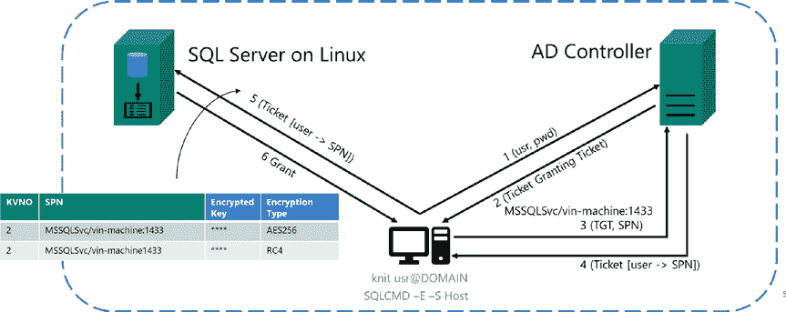

***图 7-4.** Linux 上的 SQL Server Active Directory 身份验证流程*

让我解释一下这个流程，以了解 Kerberos 身份验证如何在 Linux 上的 SQL Server 中工作：

1.  用户在 Linux 客户端上登录域，使用域用户账户和密码执行 `kinit`。`kinit` 会将用户名和密码发送给域控制器 (`DC`)。
2.  `DC` 在验证这是一个具有正确密码的有效域用户后，会颁发一个 `TGT`。如果你使用域账户登录 Windows 计算机，也会发生同样的过程。
3.  现在，你需要使用像 `sqlcmd` 这样的工具连接到 SQL Server。


`-E` 参数指定了使用 Windows 身份验证。当使用像 `sqlcmd.exe` 这样的工具通过 AD 身份验证尝试连接到 Linux 上的 SQL Server 时，客户端将使用 TGT 以及 SQL Server 服务的 SPN 发送给 DC。

4.  然后 DC 会发回一张票证，客户端现在可以使用该票证进行到 SQL Server 的身份验证。

5.  `sqlcmd` 程序现在可以使用 DC 提供的票证尝试对到 SQL Server 的连接进行身份验证。SQL Server 将使用（表中列出的）密钥来验证该票证对于连接到 SQL Server 是否有效，并确保该域账户在 SQL Server 中已创建登录名。

6.  SQL Server 将授予连接到 SQL Server 的请求。

## **第 7 章 SQL Server 中的安全性**

### **配置**

我事先向您坦白，在 Linux 上为 SQL Server 配置 Active Directory 身份验证并不简单。这并非难在技术难度。问题在于涉及多个步骤，您只需仔细遵循它们以避免问题。

在 Linux 上为 SQL Server 配置 Active Directory 身份验证的完整指南可在我们文档的教程中找到：[`docs.microsoft.com/sql/linux/sql-server-linux-active-directory-authentication`](https://docs.microsoft.com/sql/linux/sql-server-linux-active-directory-authentication)。

在本书中我不会逐步讲解整个教程步骤。相反，我会为您提供一些关于我在文档中可能不明显的遇到问题的提示。

在文档的“先决条件”部分，它说“在您的网络上设置一个 AD 域控制器（Windows）”。您所在的组织可能已经有一个 Active Directory 系统。如果是这样，您需要将文档的这一部分展示给您的网络管理员，以为 SQL Server Active Directory 身份验证配置 Active Directory：[`docs.microsoft.com/sql/linux/sql-server-linux-active-directory-authentication?#createuser`](https://docs.microsoft.com/sql/linux/sql-server-linux-active-directory-authentication?#createuser)。

您可能和我一样，希望演示此功能；我在虚拟机中设置了自己的 Windows Server 作为带有自己 Active Directory 的域控制器。设置我自己的 AD 和域控制器比我想象的要简单，但我得到了帮助。这篇博客文章非常出色，可以指导您完成：[`blogs.technet.microsoft.com/canitpro/2017/02/22/step-by-step-setting-up-active-directory-in-windows-server-2016/`](https://blogs.technet.microsoft.com/canitpro/2017/02/22/step-by-step-setting-up-active-directory-in-windows-server-2016/)。

以下是我遇到的一些其他问题，可能对您在配置 Linux 上的 SQL Server 的 AD 身份验证时有所帮助。

当我尝试使用文档中的这个命令将 SQL Server 加入域时：

```
sudo realm join contoso.com -U 'user@CONTOSO.COM' -v
```

我遇到了三个问题：

1.  我必须使用类似这样的命令更改我的 Linux 服务器的主机名（从其默认值）：

    ```
    hostnamectl set-hostname bobsqllinux
    ```

    我本应在 VM 上安装 RHEL 时就完成此操作（实际上 Azure 会自动执行）。结果发现，当我安装 RHEL 时，输入一个非默认的主机名是可选的。

    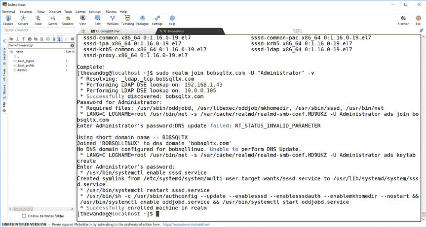

2.  我必须安装缺少的软件包（文档说您可能需要这样做），如下所示：

    ```
    sudo yum -y install oddjob oddjob-mkhomedir sssd samba-common-tools
    ```

3.  当加入域的命令生效时，我收到了一些


# 第 7 章：SQL Server 中的安全性

## 使用 AD 认证

我发现一些错误信息可以忽略。成功加入域后的状态如图 7-5 所示。

**图 7-5.** Linux 服务器成功加入域

此外，虽然我可以按照文档描述在 Linux 服务器上使用 `kinit` 来“登录到域”，但我还想使用我的 AD 域账户通过 `ssh` 登录到我的 Linux 服务器。在运行这个命令之前，我遇到了一个 `Access Denied` 错误：

`realm permit -all`

**注意：** 你可以使用 `realm permit` 仅允许特定的 AD 用户登录，而不是所有用户。

## 权限与访问

我已经向你们展示了如何使用 SQL Server 身份验证和 Active Directory 身份验证来创建登录名和用户，以访问 SQL Server 实例和数据库。这代表了登录 SQL Server 和连接到数据库的基本功能。但是，对于数据库内部的所有内容（比如表）的访问呢？对于运行适用于 SQL Server、数据库和对象（称为 *安全对象*）的各种 T-SQL 命令的访问呢？SQL Server 提供了一个系统，可以直接向登录名、用户以及称为角色的概念授予和撤销对安全对象的访问权限。

与许多系统一样，SQL Server 有一个从 `sa` 账户开始的权限层次结构（还记得你在安装时指定了 `sa` 账户）。`sa` 账户（就像 Linux 中的 `root`）在权限方面是 *至高无上的*。在安装 SQL Server 后，我将讨论一种技术，通过禁用 `sa` 账户来使你的 SQL Server 更加安全（参见“角色和权限”部分）。

如果你想深入了解 SQL Server 的所有安全对象选项，请查看这个 PDF 海报：[`aka.ms/sql-permissions-poster`](https://aka.ms/sql-permissions-poster)。

##### 授予和撤销访问权限

T-SQL 提供了两个语句来授予和撤销对安全对象的访问权限：分别是 `GRANT` 和 `REVOKE`。所有可能的安全对象的完整列表可以在 T-SQL `GRANT` 语句的文档中找到：[`docs.microsoft.com/sql/t-sql/statements/grant-transact-sql`](https://docs.microsoft.com/sql/t-sql/statements/grant-transact-sql)。

默认情况下，登录名和用户会对某些安全对象拥有某种形式的基本访问权限。保护 SQL Server 及其所有安全对象的过程将是：

• 确定特定的登录名和/或用户需要哪些安全对象和访问权限，并使用 `GRANT` 命令授予这些登录名和用户访问权限。

• 确定你是否想要撤销某些登录名和/或用户对某些安全对象的访问权限。

虽然你可以使用 `GRANT` 命令向特定的登录名和/或用户授予对安全对象的访问权限，但更有效的方式可能是先向一个称为 *角色* 的概念授予访问权限，然后根据你的安全需求，再向特定的登录名和/或用户撤销访问权限。

此外，将对象分组到架构中并向架构授予访问权限，而不是向特定对象授予访问权限，可能会更高效。在前面的章节中，我在描述创建表和视图等对象的基础知识时，已经讨论过架构的概念。

##### 角色和权限

角色提供了一种便捷的方法来向一组登录名或用户授予（或撤销）访问权限。例如，你可以创建一个角色，然后将登录名或用户添加到该角色中。接着，你可以向该角色授予权限，角色的所有成员都会继承这些权限。

如果你想使用像 `SQL Server Management Studio` 这样的工具，你需要以你的 AD 域用户身份登录，并使用 Windows 身份验证连接到你的 Linux 服务器。`SQL Operations Studio` 支持相同类型的身份验证（更多细节请阅读：[`docs.microsoft.com/sql/sql-operations-studio/enable-kerberos`](https://docs.microsoft.com/sql/sql-operations-studio/enable-kerberos)）。

一旦我完成了文档中的步骤并绕过了前面提到的问题，我就能够成功使用类似这样的命令：

```bash
sqlcmd -E
```

并且能够以 AD 用户身份成功登录到 SQL Server 开始执行查询。


# SQL Server 安全：权限与角色

## 权限概述

权限定义了在 SQL Server 实例级别或数据库级别，针对给定登录名、用户或角色允许执行哪些操作。完整的权限列表可以在我们的文档中找到：`https://docs.microsoft.com/en-us/sql/relational-databases/security/permissions-database-engine`。

我将展示默认为内置角色定义的权限示例，然后讨论如何根据您的安全需求更改权限。权限也按层次结构组织。我们的文档提供了一个很好的可视化图表来查看此层次结构：`https://docs.microsoft.com/sql/relational-databases/security/permissions-hierarchy-database-engine`。

###### 服务器角色

SQL Server 提供了一组角色，这些角色拥有适用于 SQL Server 实例中登录名的操作权限。您可以在我们的文档中看到这些角色的列表：`https://docs.microsoft.com/sql/relational-databases/security/authentication-access/server-level-roles`。

以下是几个值得注意的服务器角色：

### `sysadmin`
该角色的成员登录名可以对 SQL Server 执行任何操作。因此，尽量减少属于此角色的登录名至关重要。默认情况下，`sa` 登录名是此角色的成员。但是，作为 `sa` 登录名，您可以创建一个新的登录名，将其添加到 `sysadmin` 角色，然后禁用 `sa` 登录名。这可以提供额外的安全层，防止不怀好意的用户尝试猜测 `sa` 密码。您可以使用 `ALTER SERVER ROLE` T-SQL 命令（文档见：`https://docs.microsoft.com/sql/t-sql/statements/alter-server-role-transact-sql`）将登录名添加到服务器角色。

### `dbcreator`
该角色的成员拥有创建、更改和删除数据库的权限。虽然可以分配登录名权限以创建自己的数据库（他们现在会自动成为该数据库的所有者），但此角色的问题在于成员拥有更改或删除任何数据库的权限，而不仅限于他们拥有的数据库。另一种允许登录名拥有自己数据库的技术是：以 `sysadmin` 角色成员的身份创建数据库，然后将新登录名分配为数据库所有者。我将在下一节“数据库角色”中演示如何操作。

`sysadmin` 和 `dbcreator` 是 *固定* 服务器角色的例子。这意味着这些角色的权限无法更改。文档 `https://docs.microsoft.com/sql/relational-databases/security/authentication-access/server-level-roles#permissions-of-fixed-server-roles` 中的图表展示了固定服务器角色的权限。

### `public`
这是为 SQL Server 创建的任何新登录名的默认角色。


# 第 7 章 SQL Server 中的安全机制

服务器。公共服务器角色不是固定的，因此该角色的权限可以更改。默认情况下，public 角色拥有`CONNECT`权限，这意味着任何登录名都有权连接到 SQL Server；以及`VIEW ANY DATABASE`权限，这意味着任何登录名都有权查看 SQL Server 实例上存在哪些数据库。你可以使用 T-SQL 命令`GRANT`为公共服务器角色添加新权限，或使用`REVOKE`撤销任何默认权限。

你的策略可以有所不同，但从服务器角度来看，创建登录名和用户的过程可以如下所示：

1.  使用`CREATE LOGIN`为你的 SQL Server 创建必要的登录名。
2.  根据你决定它们应能执行的服务器访问类型和操作，将特定登录名分配给服务器角色。我建议将其中一个登录名添加到`sysadmin`角色中，这样你就不会依赖`sa`登录名来执行所有`sysadmin`选项。
3.  将所有其他用户保留为公共服务器角色的默认权限。
4.  从`sysadmin`角色成员创建你的数据库。

**注意** 我的示例展示了使用`sqllinux`登录名作为`dbcreator`角色的一部分，因为创建数据库的登录名默认成为数据库所有者。然而，正如我指出的，任何拥有`dbcreator`角色的人都有权影响其他数据库。如果你希望一个登录名创建并拥有所有数据库，那么使用此技术是可以的。如果你有单独的数据库所有者，则不希望使用此技术。

5.  使用`ALTER AUTHORIZATION` T-SQL 命令使你指定的登录名成为数据库所有者。我将在下一节“数据库角色”中进一步讨论这一点。

`ALTER AUTHORIZATION`是更改 SQL Server 中安全对象所有者的一种方法。你可以在[`docs.microsoft.com/sql/t-sql/statements/alter-authorization-transact-sql`](https://docs.microsoft.com/sql/t-sql/statements/alter-authorization-transact-sql)阅读有关如何使用此语句的更多信息。

6.  数据库所有者现在有权将其他登录名添加到数据库，将他们分配到特定角色，并根据他们的需要授予特定权限。

也可以创建你自己的服务器角色并向其分配成员和权限。你可以使用 T-SQL `CREATE SERVER ROLE`命令来创建你自己的服务器角色。

###### 数据库角色

就像服务器角色一样，每个数据库都有内置角色，这些角色定义了在数据库中执行必要操作的某些权限。

正如我在上一节提到的，每个数据库中最重要的角色之一是`db_owner`，用户`dbo`被分配为该角色的成员。固定数据库角色及其权限的列表列在我们的文档中：[`docs.microsoft.com/sql/relational-databases/security/authentication-access/database-level-roles`](https://docs.microsoft.com/sql/relational-databases/security/authentication-access/database-level-roles)。这些角色的存在是为了方便你管理数据库。例如，数据库角色`db_datareader`赋予任何成员读取数据库中所有用户表数据的权限。许多客户会选择将特定架构的特定权限授予特定用户。

另一种方法是为特定的安全需求创建你自己的数据库角色，将用户分配给那个新的数据库角色，然后将特定架构的特定权限分配给该数据库角色。在下一节中你会看到，创建你自己的数据库角色的另一个优势是可以将它们应用于行级安全性和动态数据掩码。

与服务器角色 public 类似，每个数据库也有一个 public 角色。在数据库中创建的每个用户自动成为 public 数据库角色的成员。并且默认情况下，


# 第 7 章 SQL Server 中的安全性

默认用户的权限是查看数据库中大多数系统目录视图，但这基本上就是全部了。

让我们通过一个使用 `WideWorldImporters` 数据库的例子来操作（我建议你先按照我在前面章节提供的说明，从头开始还原 `WideWorldImporters` 完整数据库）。

## 1. 将登录名 `sqllinux` 添加为数据库所有者

让我们添加登录名 `sqllinux`，并使用 `ALTER AUTHORIZATION` T-SQL 命令使其成为该数据库的所有者。

以 `sa` 身份连接，使用示例脚本 `createdbownerlogin.sql`，如下所示 T-SQL 语句：

```sql
USE master
GO
IF EXISTS (select * from sys.server_principals where name = 'sqllinux')
DROP LOGIN [sqllinux]
GO
CREATE LOGIN [sqllinux] WITH PASSWORD=N'Sql2017isfast', DEFAULT_DATABASE=[master]
GO
ALTER AUTHORIZATION ON DATABASE::WideWorldImporters to sqllinux
GO
```

## 2. 创建 `appuser` 服务器登录名

以 `sa` 身份连接，使用 `createappuserlogin.sql` 为 `appuser` 登录名创建另一个服务器登录名，如下所示 T-SQL 语句：

```sql
USE [MASTER]
GO
USE master
GO
IF EXISTS (select * from sys.server_principals where name = 'appuser')
DROP LOGIN [appuser]
GO
CREATE LOGIN [appuser] WITH PASSWORD=N'Sql2017isfast', DEFAULT_DATABASE=[WideWorldImporters]
GO
```

## 3. 创建 `appuser` 数据库用户

以 `sqllinux` 登录名身份连接，使用 `createappuser.sql` 创建将绑定到 `appuser` 服务器登录名的 `appuser` 用户，如下所示 T-SQL 语句：

```sql
USE [WideWorldImporters]
GO
DROP USER IF EXISTS appuser
GO
CREATE USER appuser FOR LOGIN appuser
GO
```

## 4. 创建数据库角色并分配权限

以 `sqllinux` 登录名身份连接，使用 `createdbrole.sql` 创建数据库角色，将 `appuser` 数据库用户添加到其中，并为其分配对 Application 架构的 `CONTROL` 权限，如下所示 T-SQL 语句：

```sql
USE [WideWorldImporters]
GO
IF (SELECT IS_ROLEMEMBER('Application_Users', 'appuser')) IS NOT NULL
ALTER ROLE Application_Users DROP MEMBER appuser
GO
DROP ROLE IF EXISTS Application_Users
GO
CREATE ROLE Application_Users
GO
ALTER ROLE Application_Users ADD MEMBER appuser
GO
GRANT CONTROL ON SCHEMA::Application TO Application_Users
GO
```

请注意我在这里使用了带有 `CONTROL` 选项的 `GRANT` T-SQL 语句。`GRANT` 允许你向包括架构在内的对象授予权限。在此情况下，`GRANT CONTROL` 将 `WideWorldImporters` 数据库中 `Application` 架构的所有权授予了 `Application_Users` 角色的任何成员。你可以在文档中阅读更多关于 `GRANT CONTROL` 的信息：[`docs.microsoft.com/sql/t-sql/statements/grant-database-principal-permissions-transact-sql`](https://docs.microsoft.com/sql/t-sql/statements/grant-database-principal-permissions-transact-sql)。

## 5. 测试权限

要查看这些权限如何工作，以 `appuser` 登录名身份连接，执行 `appuserquery.sql` 中的查询，如下所示 T-SQL 语句：

```sql
use [WideWorldImporters]
go
SELECT * from [Application].People
GO
SELECT * from [Sales].[Customers]
GO
```

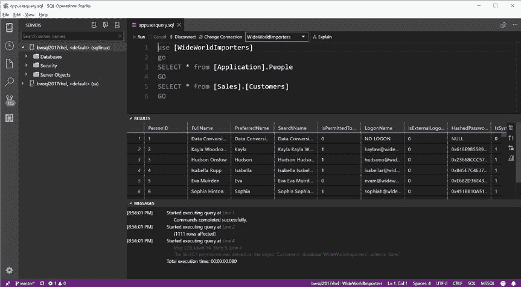

**图 7-6. `appuser` 登录名有权访问的架构和对象**

你可以看到 `appuser` 有权访问 `Application` 架构中的一个表，但当尝试访问其未被授予权限的架构中的表时，则会出错。

除了针对表等对象的架构和/或用户的基本权限外，你还可以为表和/或视图中的特定列集分配有关权限。有关 `GRANT` T-SQL 语句语法的更多信息，请参阅文档：[`docs.microsoft.com/sql/t-sql/statements/grant-transact-sql`](https://docs.microsoft.com/sql/t-sql/statements/grant-transact-sql)。

###### 应用程序角色

一个可能对开发人员有吸引力的有趣安全功能是应用程序角色。应用程序角色允许应用程序使用仅应用程序知道的密码，并设置特定于应用程序的权限，这些权限独立于从应用程序连接时使用的登录名。


# 第 7 章 SQL Server 中的安全性

你可以在[`docs.microsoft.com/sql/relational-databases/security/authentication-access/application-roles`](https://docs.microsoft.com/sql/relational-databases/security/authentication-access/application-roles)阅读更多关于应用程序角色的信息。

###### 其他权限

我只向你展示了在表上授予和撤销权限的基础操作。SQL Server 允许你对广泛的对象和特定的 T-SQL 语句分配权限。在某些情况下，这些权限仅在使用 SQL Server 的特定功能时才适用。例如，只有启用了可用性组功能，你才能为可用性组的各个方面分配权限。有关可能的权限示例完整列表，请参阅我们的文档：[`docs.microsoft.com/sql/t-sql/statements/grant-transact-sql#examples`](https://docs.microsoft.com/sql/t-sql/statements/grant-transact-sql#examples)。

**提示** 想在不以用户身份实际登录的情况下，测试已创建用户的权限？请查阅我们文档中的 `execute as` T-SQL 语句：[`docs.microsoft.com/sql/t-sql/statements/execute-as-clause-transact-sql`](https://docs.microsoft.com/sql/t-sql/statements/execute-as-clause-transact-sql)。

##### 行级安全

SQL Server 2016 引入了一个备受期待的功能：行级安全（RLS）。你不再局限于只能对跨表所有行的对象或语句分配权限，现在你可以为特定的数据行分配权限。实际上，之前你可以通过视图来实现这一点，但现在你可以直接将权限分配给表中的一组行。此外，RLS 提供了额外的功能，可以在操作执行前或执行后进行阻止。

理解 RLS 的最佳方式是看到它的实际应用。我在 GitHub 上找到了一个来自我们团队关于 RLS 的优秀示例，使用了 `WideWorldImporters` 数据库，位于：[`github.com/Microsoft/sql-server-samples/tree/master/samples/databases/wide-world-importers/sample-scripts/row-level-security`](https://github.com/Microsoft/sql-server-samples/tree/master/samples/databases/wide-world-importers/sample-scripts/row-level-security)。我做了一些修改，你可以在 `rls.sql` 文件中找到。这个示例将基于客户的销售区域数据为用户设置行级安全。其概念是，只有属于特定销售区域的应用程序用户才能看到其区域的销售数据，而不能看到其他区域的销售数据。数据库所有者应能看到所有数据。

让我逐步讲解此脚本中的 T-SQL 语句并解释其工作原理（为简便起见，运行此脚本时请以 `sa` 身份连接）：

1.  为此 RLS 示例创建登录名：

```sql
USE master
GO
IF NOT EXISTS (SELECT 1 FROM sys.server_principals WHERE name = N'GreatLakesUser')
BEGIN
    CREATE LOGIN GreatLakesUser
    WITH PASSWORD = N'SQLRocks!00',
    CHECK_POLICY = OFF,
    CHECK_EXPIRATION = OFF,
    DEFAULT_DATABASE = WideWorldImporters;
END
GO
```

2.  创建映射到你刚创建的登录名的用户，并将此用户添加到 `WideWorldImporters` 中已定义的某个角色：

```sql
USE WideWorldImporters;
GO
DROP USER IF EXISTS GreatLakesUser
GO
CREATE USER GreatLakesUser FOR LOGIN GreatLakesUser
GO
ALTER ROLE [Great Lakes Sales] ADD MEMBER GreatLakesUser
GO
```

`WideWorldImporters` 内置了将映射到销售区域的数据库角色。


# 第 7 章 SQL Server 中的安全

## 3. 实现行级安全

要应用行级安全，你需要创建一个 SQL Server `函数`，该函数将用于应用到任何查询中，以确定用户可以访问哪些行。然后，你需要创建一个安全策略，映射到你已创建的函数。

```sql
-- 如果存在则删除安全策略和函数
DROP SECURITY POLICY IF EXISTS [Application].FilterCustomersBySalesTerritoryRole
GO
DROP FUNCTION IF EXISTS [Application].DetermineCustomerAccess
GO

-- 创建用于行级安全的函数
CREATE FUNCTION [Application].DetermineCustomerAccess(@CityID int)
RETURNS TABLE
WITH SCHEMABINDING
AS
RETURN (SELECT 1 AS AccessResult
    WHERE IS_ROLEMEMBER(N'db_owner') <> 0
    OR IS_ROLEMEMBER((SELECT sp.SalesTerritory
                      FROM [Application].Cities AS c
                      INNER JOIN [Application].StateProvinces AS sp
                      ON c.StateProvinceID = sp.StateProvinceID
                      WHERE c.CityID = @CityID) + N' Sales') <> 0
)
GO

-- 已应用的安全策略如下：
CREATE SECURITY POLICY [Application].FilterCustomersBySalesTerritoryRole
ADD FILTER PREDICATE [Application].DetermineCustomerAccess(DeliveryCityID)
ON Sales.Customers
GO
```

让我解释一下这个函数是如何工作的。该函数接收一个 `CityID` 值，并从 `Cities` 和 `StateProvinces` 表中查找该城市所属的 `SalesTerritory` 名称。函数将字符串 ‘Sales’ 连接到该名称的末尾。因此，任何位于 GreatLakes 地区的 `CityID` 都将返回 GreatLakesSales。当用户尝试查询 `[Sales].[Customers]` 表时，安全策略会从 `[Sales].[Customers]` 表中获取 `DeliveryCityID` 值。这意味着，如果我以 `GreatLakesUser` 的身份登录（该用户是 `GreatLakesSales` 角色的成员），则只有 `Customers` 表中 `DeliveryCityID` 映射到 GreatLakes 地区的行才会返回给该用户。

## 4. 验证行级安全效果

仍然以 `sa`（数据库所有者）身份连接，查看 `[Sales].[Customers]` 表中有多少行并记录该数量：

```sql
SELECT COUNT(*) FROM Sales.Customers; -- 并记录数量
GO
```

当我运行此查询时，我得到了 663 行。

## 5. 测试用户权限

现在向 `GreatLakesSales` 角色授予查询 `[Sales].[Customers]` 表的权限，然后`模拟`用户 `GreatLakesUser`，并查看表中有多少行：

```sql
GRANT SELECT, UPDATE ON Sales.Customers TO [Great Lakes Sales];
GO

-- 模拟用户 GreatLakesUser
EXECUTE AS USER = 'GreatLakesUser'
GO

-- 现在记录数量以及返回了哪些行
-- 即使我们没有更改命令
SELECT COUNT(*) FROM Sales.Customers;
GO
```

当我这次运行查询时，我只看到 77 行。其他行属于其他销售区域，这就是为什么 `GreatLakesSales` 角色成员甚至看不到它们存在的原因。

## 6. 撤销模拟

要撤销模拟，请在 `rls.sql` 脚本中使用以下 T-SQL 语句：

```sql
-- 切换回登录用户
REVERT
GO
```

行级安全是 SQL Server 安全功能套件中的一项重要特性，完全由独立于应用程序的 T-SQL 语句管理。请在我们的文档 `https://docs.microsoft.com/sql/relational-databases/security/row-level-security` 中了解更多关于行级安全及其工作原理的详细信息。

##### 动态数据屏蔽

动态数据屏蔽是另一项出色的安全特性，从 SQL Server 2016 开始引入，在 Windows 和 Linux 上的 SQL Server 中工作方式相同。这是另一项不需要任何应用程序更改或逻辑的伟大安全特性。

动态数据屏蔽背后的概念是提供 T-SQL 命令，允许你为敏感数据提供屏蔽规则，并控制特定用户查看未屏蔽敏感数据的能力。该特性之所以是 `动态` 的，是因为你可以通过


## 第 7 章 SQL Server 中的安全

T-SQL 和应用查询将看到不同的结果，无需任何更改。

另一个例子是了解其工作原理的好方法。同样，我可以借用并修改 Microsoft WideWorldImporters 示例脚本中的示例，该脚本位于 [`github.com/Microsoft/sql-server-samples/tree/master/samples/databases/wide-world-importers/sample-scripts/dynamic-data-masking`](https://github.com/Microsoft/sql-server-samples/tree/master/samples/databases/wide-world-importers/sample-scripts/dynamic-data-masking)。

**注意**：如果你已运行前面的行级安全示例，或者你没有做那些示例，这个示例都能正常工作。它确实假设你已经按照我在本书其他示例中展示的那样，恢复了 `WideWorldImporters` 完整示例数据库。

我已获取上面的 GitHub 示例，对其进行了修改，并将其放入示例脚本 `ddm.sql` 中。其概念是，*特权*用户（如 `dbo`）可以查看 `[Purchasing].[Suppliers]` 中的敏感数据，如银行账户信息，但非特权用户将无法看到这些敏感数据。特权用户通常拥有访问数据库（或服务器）中几乎所有内容的权限，而非特权用户通常只有其工作或任务所需的特定权限。

使用我在示例中提供的已生成脚本 `wwi.sql`，你可以看到 `[Purchasing].[Suppliers]` 的定义以及屏蔽是如何定义的：

```sql
CREATE TABLE [Purchasing].Suppliers NOT NULL,
    [SupplierCategoryID] [int] NOT NULL,
    [PrimaryContactPersonID] [int] NOT NULL,
    [AlternateContactPersonID] [int] NOT NULL,
    [DeliveryMethodID] [int] NULL,
    [DeliveryCityID] [int] NOT NULL,
    [PostalCityID] [int] NOT NULL,
    [SupplierReference] nvarchar NULL,
    [BankAccountName] nvarchar MASKED WITH (FUNCTION = 'default()') NULL,
    [BankAccountBranch] nvarchar MASKED WITH (FUNCTION = 'default()') NULL,
    [BankAccountCode] nvarchar MASKED WITH (FUNCTION = 'default()') NULL,
    [BankAccountNumber] nvarchar MASKED WITH (FUNCTION = 'default()') NULL,
    [BankInternationalCode] nvarchar MASKED WITH (FUNCTION = 'default()') NULL,
    [PaymentDays] [int] NOT NULL,
    [InternalComments] nvarchar NULL,
    [PhoneNumber] nvarchar NOT NULL,
    [FaxNumber] nvarchar NOT NULL,
    [WebsiteURL] nvarchar NOT NULL,
    [DeliveryAddressLine1] nvarchar NOT NULL,
    [DeliveryAddressLine2] nvarchar NULL,
    [DeliveryPostalCode] nvarchar NOT NULL,
    [DeliveryLocation] [geography] NULL,
    [PostalAddressLine1] nvarchar NOT NULL,
    [PostalAddressLine2] nvarchar NULL,
    [PostalPostalCode] nvarchar NOT NULL,
    [LastEditedBy] [int] NOT NULL,
    [ValidFrom] datetime2 GENERATED ALWAYS AS ROW START NOT NULL,
    [ValidTo] datetime2 GENERATED ALWAYS AS ROW END NOT NULL,
    CONSTRAINT [PK_Purchasing_Suppliers] PRIMARY KEY CLUSTERED
    (
        [SupplierID] ASC
    )WITH (PAD_INDEX = OFF, STATISTICS_NORECOMPUTE = OFF, IGNORE_DUP_KEY = OFF,
    ALLOW_ROW_LOCKS = ON, ALLOW_PAGE_LOCKS = ON) ON [USERDATA],
    CONSTRAINT [UQ_Purchasing_Suppliers_SupplierName] UNIQUE NONCLUSTERED
    (
        [SupplierName] ASC
    )WITH (PAD_INDEX = OFF, STATISTICS_NORECOMPUTE = OFF, IGNORE_DUP_KEY = OFF,
    ALLOW_ROW_LOCKS = ON, ALLOW_PAGE_LOCKS = ON) ON [USERDATA],
    PERIOD FOR SYSTEM_TIME ([ValidFrom], [ValidTo])
) ON [USERDATA] TEXTIMAGE_ON [USERDATA]
WITH
(
    SYSTEM_VERSIONING = ON ( HISTORY_TABLE = [Purchasing].[Suppliers_Archive] )
)
GO
```

注意在涉及银行数据的一些列上使用的这种语法：

```sql
[BankAccountName] nvarchar MASKED WITH (FUNCTION = 'default()') NULL,
```

`MASKED WITH` 语法是用于定义数据屏蔽的 T-SQL 扩展。在 `WITH` 子句后的 `(FUNCTION = )` 中可以定义的屏蔽包括


# 第 7 章：SQL Server 中的安全

##### 动态数据屏蔽

屏蔽的 `type`。`FUNCTION` 之后的语法定义了屏蔽的类型。默认屏蔽规则根据列的类型来屏蔽特定字符。例如，字符列用字符 `'X'` 屏蔽，整数则用 `0` 屏蔽。

您可以在我们的文档中查看屏蔽类型的列表：[`docs.microsoft.com/sql/relational-databases/security/dynamic-data-masking#defining-a-dynamic-data-mask`](https://docs.microsoft.com/sql/relational-databases/security/dynamic-data-masking#defining-a-dynamic-data-mask)（其中包含了定义您自己的自定义屏蔽的能力）。

让我们通过一个示例来实际操作一下，使用 `ddm.sql` 脚本中的一些语句（以下所有步骤请以 `sa` 身份连接）：

1.  以 `sa` 身份连接并创建一个新的登录名。

```sql
-- 演示动态数据屏蔽
--
--  确保使用特权用户（如数据库所有者或系统管理员）连接
IF NOT EXISTS (SELECT 1 FROM sys.server_principals WHERE name
    = N'GreatLakesUser')
BEGIN
    CREATE LOGIN GreatLakesUser
        WITH PASSWORD = N'SQLRocks!00',
        CHECK_POLICY = OFF,
        CHECK_EXPIRATION = OFF,
        DEFAULT_DATABASE = WideWorldImporters;
END
GO
```

2.  创建一个用户映射到该登录名，将其添加到数据库中已定义的一个角色，并授予该角色读取权限。

```sql
USE WideWorldImporters
GO

DROP USER IF EXISTS GreatLakesUser
GO

CREATE USER GreatLakesUser FOR LOGIN GreatLakesUser
GO

ALTER ROLE [Great Lakes Sales] ADD MEMBER GreatLakesUser
GO

-- 授予角色 SELECT 权限
GRANT SELECT ON Purchasing.Suppliers TO [Great Lakes Sales];
GO
```

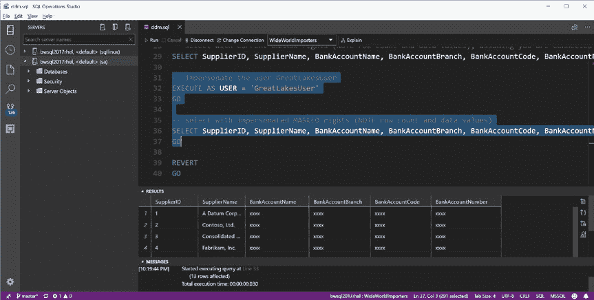

3.  尝试从 `[Purchasing].[Suppliers]` 表中读取数据。

```sql
-- 使用当前 UNMASK 权限进行选择（注意行数和数据值），假设您以特权用户身份连接
SELECT SupplierID, SupplierName, BankAccountName,
    BankAccountBranch, BankAccountCode, BankAccountNumber FROM
    Purchasing.Suppliers
```

您将看到所有列的全部数据。

4.  模拟 `GreatLakesUser` 用户并再次运行查询。

```sql
-- 模拟用户 GreatLakesUser
EXECUTE AS USER = 'GreatLakesUser'
GO

-- 使用模拟的 MASKED 权限进行选择（注意行数和数据值）
SELECT SupplierID, SupplierName, BankAccountName,
    BankAccountBranch, BankAccountCode, BankAccountNumber FROM
    Purchasing.Suppliers
GO
```

现在的结果中，某些列的数据已被屏蔽，尽管您仍然可以看到所有行。图 7-7 显示了 SQL Operations Studio 中的结果。

**图 7-7.** Linux 上 SQL Server 的动态数据屏蔽

在我们的文档中了解更多关于动态数据屏蔽的信息：[`docs.microsoft.com/sql/relational-databases/security/dynamic-data-masking`](https://docs.microsoft.com/sql/relational-databases/security/dynamic-data-masking)。

#### SQL Server 与加密

数据加密对于任何安全方案都可能很重要。然而，并非所有使用 SQL Server 的应用程序都需要使用加密。使用 SQL Server 的任何加密功能都会产生一些开销（例如额外的 CPU 使用率），因此必须在您的整体安全计划中加以考虑。

SQL Server 支持多项功能，使客户能够保护*静态数据*、*传输中的数据*和*连接*的安全。静态数据是指存储在文件和备份中的 SQL Server 数据。您希望确保数据被加密，以便攻击者无法在 SQL Server 进程之外读取数据（例如，如果有人偷走了装有 SQL Server 数据库文件的硬盘）。此外，一些应用程序希望能够确保从 SQL Server 客户端应用程序到 SQL Server 再返回的所有数据都是端到端加密的。


# 第 7 章 SQL Server 的安全性

## 实现加密的架构

Windows 上的 SQL Server 依赖 Crypto API，通过诸如 `BCryptEncrypt` 之类的例程（更多信息请参见 [`docs.microsoft.com/windows/desktop/api/bcrypt/nf-bcrypt-bcryptencrypt`](https://docs.microsoft.com/windows/desktop/api/bcrypt/nf-bcrypt-bcryptencrypt)）来加密和解密数据。如果你还记得第 1 章中关于 SQLPAL 架构的细节，需要 Linux 内核支持的 API 调用将会经过 Host Extension。我与 SQL Server on Linux 的安全工程负责人 Mitchell Sternke 进行了交流，以了解我们是如何在 Linux 上支持加密的。为了支持加密 API，我们在 Linux 上使用 OpenSSL 库集（更多信息请参见 [`www.openssl.org`](https://www.openssl.org)）。正如 Mitchell 所描述的，该架构的一个小变化是，我们为 Windows 上的 SQL Server 2017 部署了一个特殊的 DLL（名为 `secforwarder.dll`），它在 Windows 上运行时会直接调用 Windows Crypto API 支持。但在运行于 Linux 的 SQLPAL 上，Crypto API 调用会被转发到 Host Extension，由其调用任何必要的 OpenSSL 例程。我们使用 OpenSSL 来满足所有类型的安全需求，包括支持 TLS（甚至支持 Kerberos）。

## SQL Server 密钥与证书

当使用 SQL Server 技术在 SQL Server 上加密数据时，你需要熟悉以下对象，它们都是使用 `T-SQL` 创建的：

### 服务主密钥

`SQL 加密`具有一个层级结构，一切都始于 `服务主密钥`。`服务主密钥`由 `SQL Server` 在安装时自动生成。所有其他密钥和数据的加密都将依赖于该密钥的存在。因此，如果你打算使用 `SQL Server 加密`，你绝对需要做的第一件事就是将此密钥备份到一个安全的位置。为什么？因为这是加密层级结构的顶端；如果此密钥丢失（例如，安装 `SQL Server` 的硬盘损坏），你将无法解密任何已加密的数据。哎呀！此外，备份时你会使用一个密码。你需要保护好这个密码，因为你将需要它来恢复密钥备份。你可以在 [`docs.microsoft.com/sql/relational-databases/security/encryption/service-master-key`](https://docs.microsoft.com/sql/relational-databases/security/encryption/service-master-key) 阅读更多关于如何操作以及 `服务主密钥` 的信息。`服务主密钥`将用于加密其他密钥，例如 `数据库主密钥`和链接服务器密码。

**请注意**，加密连接和一项称为 `Always Encrypted` 的功能不依赖于此层级结构。

### 数据库主密钥

这是一个受 `服务主密钥` 保护的密钥，用于保护数据库中的证书和其他对象。要使用如 `透明数据加密` 和 `加密备份` 等功能，你需要在 `master 数据库` 中创建一个 `数据库主密钥`。要加密列数据（非 `Always Encrypted` 列），你将在 `用户数据库` 中创建一个 `数据库主密钥`。你可以在 [`docs.microsoft.com/sql/t-sql/statements/create-master-key-transact-sql`](https://docs.microsoft.com/sql/t-sql/statements/create-master-key-transact-sql) 阅读更多关于 `数据库主密钥` 的信息。就像 `服务器主密钥` 一样，一旦创建了 `数据库主密钥`，你应该立即备份它。请参阅我们的文档了解如何操作：[`docs.microsoft.com/sql/relational-databases/security/encryption/back-up-a-database-master-key`](https://docs.microsoft.com/sql/relational-databases/security/encryption/back-up-a-database-master-key)。


[security/encryption/back-up-a-database-master-key](https://docs.microsoft.com/sql/relational-databases/security/encryption/back-up-a-database-master-key)

## SQL Server 证书

加密层次结构的第三层是证书。证书将由数据库主密钥保护，并用于加密其他对象，如数据库加密密钥（用于 TDE）、备份以及其他用于加密列的密钥。您可以使用 SQL Server 创建自签名证书，或从受信任的机构加载证书。与我讨论过的其他对象一样，您应该备份所有创建的证书，因为您可能需要执行诸如还原加密备份之类的操作。您可以在 [CREATE CERTIFICATE (Transact-SQL)](https://docs.microsoft.com/sql/t-sql/statements/create-certificate-transact-sql) 阅读更多关于 SQL Server 证书的信息。

> **注意**
> SQL Server on Linux 目前不支持可扩展密钥管理 (eKM)。请务必关注 [SQL Server on Linux release notes - Unsupported features](https://docs.microsoft.com/sql/linux/sql-server-linux-release-notes#Unsupported) 的发布说明，以获取有关不支持功能的任何更新。

掌握了这些基础知识后，让我们来看看 SQL Server on Linux 可用的一些加密功能。

##### 透明数据加密

`TDE` 是 SQL Server 的一项功能，数据和事务日志文件在写入磁盘时会被加密。用于加密和解密这些文件的加密密钥（一个 `数据库加密密钥`）保存在 master 数据库中。这使得数据库引擎能够完全访问磁盘上的加密数据，但引擎之外的任何程序或用户都将无法访问未加密的数据。

### 第 7 章 SQL Server 中的安全性

这个功能真正出色的地方在于，所有关于证书和加密的功能都内置于 SQL Server 中。以下是使用 `TDE` 的基本步骤：

1.  使用 `T-SQL` 在 master 数据库中创建一个数据库主密钥。
2.  使用 `T-SQL` 创建一个受数据库主密钥保护的证书。
3.  使用 `T-SQL` 为您要使用 `TDE` 的数据库创建一个受该证书保护的 `数据库加密密钥`。`数据库加密密钥` 是一种仅用于 `TDE` 的特殊密钥。您可以在 [CREATE DATABASE ENCRYPTION KEY (Transact-SQL)](https://docs.microsoft.com/sql/t-sql/statements/create-database-encryption-key-transact-sql) 阅读更多关于数据库加密密钥使用的信息。
4.  使用 `ALTER DATABASE` 为数据库启用 `TDE`。

然后，SQL Server 将在后台开始加密数据并写入磁盘。后续对磁盘的新写入在写入时即被加密。使用此功能的一个关键点是，您应该备份证书和密钥。如果您需要在另一台服务器上附加此数据库或还原备份，将需要这些内容。对于启用了 `TDE` 的数据库，其任何备份也都是加密的。

您可以在 [Enable Transparent Data Encryption](https://docs.microsoft.com/sql/linux/sql-server-linux-security-get-started#enable-transparent-data-encryption) 阅读更多关于在 SQL Server on Linux 上设置 `TDE` 的信息。您也可以在 [Transparent Data Encryption (TDE)](https://docs.microsoft.com/sql/relational-databases/security/encryption/transparent-data-encryption) 了解更多关于 `TDE` 的通用信息。


[`docs.microsoft.com/sql/relational-databases/security/encryption/`](https://docs.microsoft.com/sql/relational-databases/security/encryption/transparent-data-encryption)

[透明数据加密。](https://docs.microsoft.com/sql/relational-databases/security/encryption/transparent-data-encryption)

# 第 7 章  SQL Server 中的安全性

##### 加密数据库备份

如果你没有对数据库使用 `TDE`，你仍然可以加密你的数据库备份。这个过程与 `TDE` 大体相同。你需要创建一个数据库主密钥（或使用一个你已创建的），创建一个证书，然后使用 T-SQL 的 `BACKUP` 命令并指定你创建的证书。与 `TDE` 类似，我们建议你备份数据库主密钥和证书，因为你将需要它们来还原备份。

在 Linux 上为 SQL Server 加密数据库备份的示例和步骤可以在以下网址找到：[`docs.microsoft.com/sql/linux/sql-server-linux-security-get-started#configure-backup-encryption`](https://docs.microsoft.com/sql/linux/sql-server-linux-security-get-started#configure-backup-encryption)。你可以在以下网址找到关于备份加密的完整文档：[`docs.microsoft.com/sql/relational-databases/backup-restore/backup-encryption`](https://docs.microsoft.com/sql/relational-databases/backup-restore/backup-encryption)。

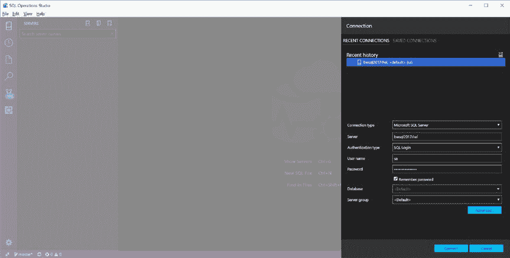

##### 加密连接

SQL Server 还支持加密通过网络连接在客户端和 SQL Server 引擎之间传输的数据。Linux 上的 SQL Server 使用传输层安全性（TLS）来加密从 SQL Server 客户端应用程序或从服务器传输的任何数据。Linux 上的 SQL Server 目前支持 TLS 1.2。你可以选择强制所有连接由 SQL Server 加密（*服务器发起*）或让特定客户端从其应用程序请求加密（*客户端发起*）。

用于加密连接的证书和对象与在 SQL Server 内部用于加密数据的密钥和服务主密钥（…）是独立的。与我到目前为止描述的其他加密和证书功能一样，SQL Server 使用的加密和证书服务由 Linux 操作系统提供。

为了配置 SQL Server 以支持加密连接，你将结合使用 `openssl` 程序（应已安装在你的 Linux 服务器上）和安装 SQL Server 时附带的 `mssql-conf` 配置脚本。

如果你选择客户端发起的加密连接，微软提供的每个工具都有一个选项来选择加密连接。此外，应用程序可以在其连接字符串中添加 `Encrypt=True`。

有时，在我们的工具中选择加密连接的选项可能有点隐蔽。图 7-8 显示了 SQL Operations Studio 的连接选项。

*图 7-8. SQL Operations Studio 的连接选项*

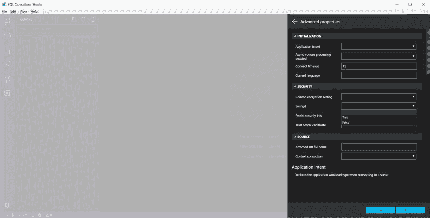

如果你点击“高级”按钮，将会看到一个新界面，你可以在其中选择加密连接的选项，如图 7-9 所示。

*图 7-9. 选择加密 SQL Server 连接的选项*

SQL Server 在文档中提供了使用 `openssl` 和 `mssql-conf` 配置 SQL Server 的步骤，以及如何配置需要加密的客户端机器的说明。你可以在以下网址进一步阅读如何设置客户端发起或服务器发起的加密：[`docs.microsoft.com/sql/linux/sql-server-linux-encrypted-connections`](https://docs.microsoft.com/sql/linux/sql-server-linux-encrypted-connections)。


# 第 7 章：SQL Server 中的安全性

## 证书要求

此外，此功能所使用的证书还有一些特定要求。有关证书要求，请参阅我们的文档：[`docs.microsoft.com/sql/linux/sql-server-linux-encrypted-connections#requirements-for-certificates`](https://docs.microsoft.com/sql/linux/sql-server-linux-encrypted-connections#requirements-for-certificates)。

请仔细阅读有关服务器发起加密（强制所有连接）的说明：[`docs.microsoft.com/sql/linux/sql-server-linux-encrypted-connections#server-initiated-encryption`](https://docs.microsoft.com/sql/linux/sql-server-linux-encrypted-connections#server-initiated-encryption)，以及客户端发起加密的说明：[`docs.microsoft.com/sql/linux/sql-server-linux-encrypted-connections#client-initiated-encryption`](https://docs.microsoft.com/sql/linux/sql-server-linux-encrypted-connections#client-initiated-encryption)。

如果您阅读这些说明，会发现步骤完全相同，只有这一步不同：

```
sudo /opt/mssql/bin/mssql-conf set network.forceencryption 1
```

值为 1 用于强制所有连接都加密，而值为 0 则用于客户端发起加密的场景。

我们的文档包含了一些您在使用加密连接时可能遇到的错误说明：[`docs.microsoft.com/sql/linux/sql-server-linux-encrypted-connections#common-connection-errors`](https://docs.microsoft.com/sql/linux/sql-server-linux-encrypted-connections#common-connection-errors)。图 7-10 显示了当您尝试使用加密连接但尚未在 SQL Server 上设置加密时会遇到的错误示例。

### 图 7-10. 未配置加密时连接到 SQL Server 出现的错误

我们文档中的一项指导说明是，您的客户端机器必须支持 TLS 1.2。老实说，我以前从未关心过我的客户端计算机是否支持 TLS 1.2，所以我做了一些研究，找到了这个非常方便的网站来测试我的 TLS 版本：[`www.ssllabs.com/ssltest/viewMyClient.html`](https://www.ssllabs.com/ssltest/viewMyClient.html)。图 7-11 显示了我在 Windows 笔记本电脑上的测试结果。

### 图 7-11. 使用 ssllabs.com 网站检查客户端上的 TLS 支持

## Always Encrypted（始终加密）

如果您将 SQL Server 连接加密与 TDE（透明数据加密）结合使用，您的数据从客户端到服务器都是加密的，并且存储在磁盘上的数据也是加密的。然而，仅靠这些解决方案存在两个问题：

*   数据在数据库页面的内存中未被加密。
*   对加密密钥的控制权没有分离，因为 SQL Server 管理员控制着加密密钥和证书。

SQL Server 提供了一项功能来填补这些空白并提供端到端加密解决方案，称为 **Always Encrypted**。描述 Always Encrypted 的最好方式是通过图示。图 7-12 展示了 Always Encrypted 的整体架构。

### 图 7-12. Linux 上 SQL Server 中的 Always Encrypted

在此图的服务器端是您的数据库，其中包含您认为有必要加密的表中的列。

设置 Always Encrypted 的过程是：首先创建一个 `列主密钥`，您需要从密钥存储提供程序提供该密钥的位置（从而实现密钥管理的分离）。然后为您想要加密的列创建 `列加密密钥`，并指定列主密钥。虽然 SQL Server 管理员将创建列加密密钥，但列主密钥是由管理独立于 SQL Server 的 `密钥存储` 的其他人提供的。因此，使用此方法读取加密数据的唯一方式是使用支持 Always Encrypted 且知道列主密钥位置的、包含 SQL Server 库的应用程序。这意味着即使是 SQL Server 管理员也无法解密您选择的列。SQL Server 管理员需要设置数据库来加密某些列，但他们没有完全的控制权来解密数据。

应用程序和列主密钥的所有者拥有解密的完全控制权。此外，被加密的列中的数据，在应用程序中、通过连接传输到 SQL Server 的过程中、以及在数据列中（无论是在内存中还是写入磁盘时）都是加密的。SQL Server 将存储元数据，例如加密的列加密密钥以及列主密钥的密钥存储位置。

支持 Always Encrypted 的 SQL Server 库示例包括：[`docs.microsoft.com/sql/connect/odbc/using-always-encrypted-with-the-odbc-driver`](https://docs.microsoft.com/sql/connect/odbc/using-always-encrypted-with-the-odbc-driver) 和 [`docs.microsoft.com/sql/connect/php/using-always-encrypted-php-drivers`](https://docs.microsoft.com/sql/connect/php/using-always-encrypted-php-drivers)。

要完成配置 Always Encrypted 的过程，请按照 SQL Server Management Studio 向导中的文档步骤操作：[`docs.microsoft.com/en-us/azure/sql-database/sql-database-always-encrypted`](https://docs.microsoft.com/en-us/azure/sql-database/sql-database-always-encrypted)。

尽管这是提供透明、端到端加密列数据解决方案的非常优雅的方式，但对于在 Linux 上使用 SQL Server 此功能，还需要考虑一些因素：

*   目前创建列加密密钥和指定列主密钥的唯一方法是使用在 Windows 上运行的工具，包括 SQL Server Management Studio 和 Powershell（注意：Powershell 现在已支持 Linux，但目前没有其他原生支持 Linux 的方法）。SSMS 附带一个很棒的向导来引导您完成此过程：[`docs.microsoft.com/sql/relational-databases/security/encryption/configure-always-encrypted-using-sql-server-management-studio`](https://docs.microsoft.com/sql/relational-databases/security/encryption/configure-always-encrypted-using-sql-server-management-studio)。
*   根据您配置 Always Encrypted 的方式，您在执行针对已加密列的查询时（特别是当您搜索某个值或值范围时）可能会受到一些限制。有关此类限制的详细信息，请参阅我们的文档：[`docs.microsoft.com/sql/relational-databases/security/encryption/always-encrypted-database-engine#feature-details`](https://docs.microsoft.com/sql/relational-databases/security/encryption/always-encrypted-database-engine#feature-details)。


# 第七章：SQL Server 中的安全性

## 加密功能摘要

[engine#feature-details](https://docs.microsoft.com/sql/relational-databases/security/encryption/always-encrypted-database-engine#feature-details)

-   有些功能与 `始终加密` 不兼容，例如 `时态表` 和 `内存中 OLTP`。
-   对于加密的列，可能存在性能损耗以及需要额外的存储空间。

即使存在这些限制和潜在的性能影响，您数据库中的某些数据（如社会安全号码、信用卡数据等）可能过于敏感，以至于承担不起泄露的风险，甚至不能冒险让拥有 SQL Server 管理员权限的用户访问这些数据。在这些情况下，`始终加密` 提供了一个完整的端到端解决方案，并在加密和解密数据方面明确了角色分离。

弄清楚如何在 SQL Server 中使用加密可能有点让人不知所措。让我总结一下关于如何了解我们的加密功能的建议：

-   无论您决定选择哪种类型的加密功能，务必备份 `服务主密钥` 以及与加密相关的所有密钥。
-   您必须决定您的应用程序是否真正需要加密。我交谈过的许多客户决定不使用加密连接或 `始终加密`，但几乎总是会加密他们的备份。
-   如果您使用 SQL Server 创建任何密钥或证书，请备份所有这些密钥和证书，并将其存储在与数据备份分开的位置。请将任何密钥或证书视为与您的数据同等重要。
-   `透明数据加密` 对 I/O 操作有一定的性能开销。但是，如果您担心任何人在 SQL Server 之外访问您的数据文件，则应强烈考虑使用它。笔记本电脑上的 SQL Server 数据库可能是一个很好的例子（可以作为 `Windows BitLocker` 的第二道防线）。
-   `始终加密` 是一个很棒的功能，但它并不适用于所有的应用程序和数据库。如果您需要一个完整的端到端加密方案，并希望将密钥的管理与数据库分离，那么 `始终加密` 可能非常适合您。利用云，使用 `Azure Key Vault` 作为您的密钥存储提供程序。请查看如何执行此操作：[`docs.microsoft.com/azure/sql-database/sql-database-always-encrypted-azure-key-vault`](https://docs.microsoft.com/azure/sql-database/sql-database-always-encrypted-azure-key-vault)。

## 数据分类与审核

欧盟于 2018 年 5 月推出了新的《通用数据保护条例》（GDPR）规则（参见官方网站：[`ec.europa.eu/commission/priorities/justice-and-fundamental-rights/data-protection/2018-reform-eu-data-protection-rules_en`](https://ec.europa.eu/commission/priorities/justice-and-fundamental-rights/data-protection/2018-reform-eu-data-protection-rules_en)），这使得数据分类、漏洞和数据审核等主题受到了新的关注。

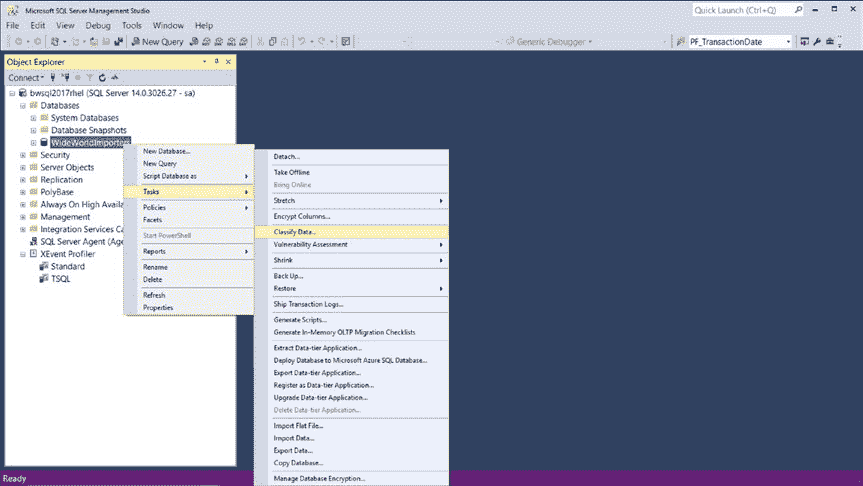

Microsoft SQL Server 工程团队认识到这些需求，并通过以下文档为组织提供了一般性指导，以准备和应对 GDPR 法规：[`aka.ms/gdprsqlwhitepaper`](http://aka.ms/gdprsqlwhitepaper)。

除了指导之外，SQL Server 还提供了工具和功能来协助这些领域的工作，包括 SQL Server Management Studio 和 T-SQL 命令，以帮助进行标记和审核。

##### 数据分类

理解 SQL Server 中存储了哪些数据的一个重要方面是能够


# 第 7 章 SQL Server 中的安全性

根据*信息类型*和*敏感级别*对数据进行分类。信息类型的示例包括银行、凭据、健康和社会安全号码。敏感级别的示例有公开、机密和 GDPR 机密。这些类型和敏感级别在 SQL Server Management Studio 工具中使用`分类数据`功能进行固定设置。这也被称为`SQL 数据发现和分类`功能，其文档位于 [`docs.microsoft.com/sql/relational-databases/security/sql-data-discovery-and-classification`](https://docs.microsoft.com/sql/relational-databases/security/sql-data-discovery-and-classification)。

您可以在 SSMS 中通过右键单击对象资源管理器中的数据库，选择“任务”选项来访问此功能。图 7-13 显示了此功能的示例。

## 图 7-13. Linux 上 SQL Server 的 SQL 数据字典和分类

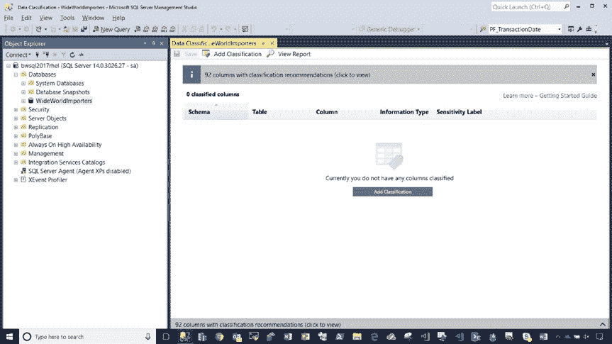

此功能具有一组固定的 T-SQL 语句，用于实现可能匹配信息类型和敏感级别的列名字典。然后，该字典会与当前数据库进行匹配。图 7-14 显示了在 WideWorldImporters 示例数据库上 SSMS 中的结果。

## 图 7-14. WideWorldImporters 数据库的分类结果

在报告的右上角，显示找到了 92 列匹配字典中可能的分类。让我们深入查看结果，了解原因。如果您点击顶部的灰色栏查看建议，您的结果应如图 7-15 所示。

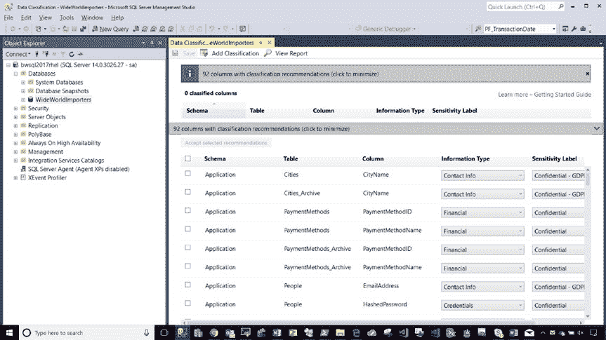

## 图 7-15. WideWorldImporters 数据库的数据分类建议结果

信息类型和敏感度标签的下拉选项是字典的一部分。您现在可以选择左侧的任何复选框，然后单击`接受所选建议`。单击保存图标后，工具将保存您的更改。现在，您可以选择此屏幕顶部的“查看报告”选项，以查看您的分类选择和敏感度标签的报告。

图 7-16 显示了我对 WideWorldImporters 数据库中所有列进行勾选并接受默认建议后的报告。

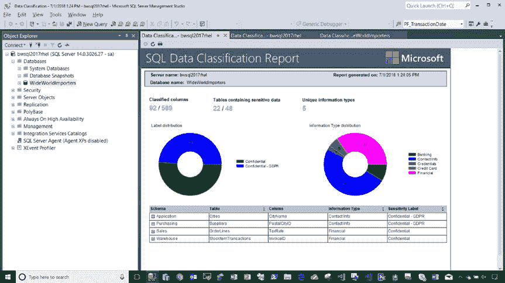

## 图 7-16. WideWorldImporters 的默认分类报告

目前，此工具仅在 SQL Server Management Studio 中有效。并且类型、标签和规则是固定的。但是，此工具背后的所有逻辑都使用了 SQL Server 的功能，其文档位于 [`docs.microsoft.com/sql/relational-databases/security/sql-data-discovery-and-classification`](https://docs.microsoft.com/sql/relational-databases/security/sql-data-discovery-and-classification)。

字典规则是一系列 T-SQL 语句，您可以使用 XEProfiler 捕获（如我在第 5 章所述）。分类类型和标签使用名为`sp_addextendedproperty`的系统存储过程保存（更多信息请访问 [`docs.microsoft.com/sql/relational-databases/system-stored-procedures/sp-addextendedproperty-transact-sql`](https://docs.microsoft.com/sql/relational-databases/system-stored-procedures/sp-addextendedproperty-transact-sql)）。使用此过程会将数据保存在系统表中，以便您以后可以检索它们。关键是，您可以使用此系统存储过程和扩展属性创建自己的分类方案。


# 第 7 章 SQL Server 安全

##### 漏洞评估

本章介绍了关于安全的诸多不同概念。你需要在满足应用需求的前提下，确保将 SQL Server 及其数据库配置得尽可能安全。因此，确保尽可能减少所有可能的攻击面并遵循最佳实践至关重要。但什么是最佳实践呢？我在本章开头为你指向了一个参考文档：[`docs.microsoft.com/sql/relational-databases/security/securing-sql-server`](https://docs.microsoft.com/sql/relational-databases/security/securing-sql-server)。

不过，如果能运行一个工具来检查你的系统是否符合这些最佳实践，岂不更好？SQL Server Management Studio 中内置了这样一个功能，名为 `SQL 漏洞评估`。你可以在以下位置找到相关文档：[`docs.microsoft.com/sql/relational-databases/security/sql-vulnerability-assessment`](https://docs.microsoft.com/sql/relational-databases/security/sql-vulnerability-assessment)。

我在 SQL Server on Linux 上针对 WideWorldImporters 示例数据库运行了此工具。图 7-17 展示了在 SQL Server Management Studio 中得到的结果。

**图 7-17.** 在 `WideWorldImporters` 数据库上运行的 `SQL Server 漏洞评估`

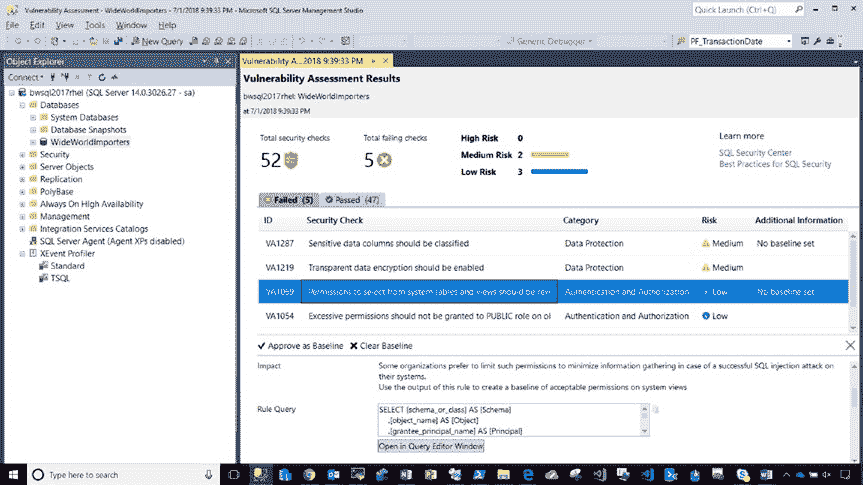

从评估工具中未通过的规则可以看出，该工具内置了审查数据库元数据的功能，涉及诸如列分类、启用 `TDE`（透明数据加密）、确保对象授权及遵循最佳实践使用角色等领域。

尽管此工具目前仅在 SQL Server Management Studio 中可用，但它会为每条规则（无论是通过还是未通过的规则）显示用于检查该安全实践的 `T-SQL` 语句。

图 7-18 展示了一个示例，说明如何查看为 `WideWorldImporters` 数据库标记为低风险的其中一条规则背后的 `T-SQL` 查询。

**图 7-18.** 漏洞评估 `T-SQL` 查询详情

由于漏洞评估工具使用了一系列 `T-SQL` 查询，我使用了 SQL Server Management Studio 中的 `XEProfiler`，并将所有查询保存到了 `vulnassess.csv` 示例文件中，供你查阅并在自己的系统中使用。

为了查看适用于 SQL Server 实例的评估，请针对系统数据库（如 `master`）运行此工具。

## SQL Server 审计

保护 SQL Server 安全的最后一块拼图，是对 SQL Server 及其数据访问进行审计的能力。SQL Server 提供了内置功能，可以审计对服务器实例及数据库访问的各个方面。SQL Server 审计功能使用第 5 章介绍过的 `扩展事件` 实现。SQL Server 审计由以下组件构成：

**审计**：对服务器或数据库级别审计操作的受监控结果。每个 SQL Server 实例可以有多个审计。

**服务器审计规范**：为指定的审计定义要监控的服务器级别审计操作。每个审计可以有一个服务器级别规范。服务器级别规范包含要监控的服务器级别审计操作组列表。

**数据库审计规范**：为指定的审计定义要监控的数据库级别审计操作。每个审计可以包含一个数据库级别规范。数据库审计规范包含要监控的数据库级别审计操作组或特定的审计操作。

**审计操作组**：一个服务器或数据库级别的操作组


# 第 7 章：SQL Server 中的安全

## 审计动作与目标

审计将特定类型的事件分组到一个类别中进行监控。此外，还有一组专门用于审计监控的动作。

**审计动作 (Audit action)**：需要审计的具体操作，例如在表上执行`SELECT`语句。

**目标 (Target)**：审计结果保存的位置。对于 Linux 上的 SQL Server，唯一支持的目标是文件。

## 使用 SQL Server 审计的流程

使用 SQL Server 审计的过程如下：

1.  创建审计并定义目标，使用如下 T-SQL 语句（该语句见于示例脚本`createsqlaudit.sql`，需以`sa`身份连接执行）：
    ```sql
    USE MASTER
    GO
    IF EXISTS (SELECT * FROM sys.server_audits WHERE name = 'AuditSQLServer')
    BEGIN
        ALTER SERVER AUDIT AuditSQLServer WITH (STATE = OFF)
        DROP SERVER AUDIT AuditSQLServer
    END
    GO
    CREATE SERVER AUDIT AuditSQLServer
    TO FILE (FILEPATH ='/var/opt/mssql')
    GO
    ```
    > **提示 (Tip)** 删除审计时，之前的目标文件不会被自动删除。如果您计划多次运行这些演示，应手动删除目标路径中的旧审计文件。

2.  使用如下 T-SQL 语句添加一个针对成功登录的服务器审计规范（该语句见于示例脚本`addserveraudit.sql`，运行时需以`sa`身份连接）：
    ```sql
    USE MASTER
    GO
    IF EXISTS (SELECT * FROM sys.server_audit_specifications WHERE name = 'AuditSQLServerSpec')
    BEGIN
        ALTER SERVER AUDIT SPECIFICATION AuditSQLServerSpec WITH (STATE = OFF)
        DROP SERVER AUDIT SPECIFICATION AuditSQLServerSpec
    END
    GO
    CREATE SERVER AUDIT SPECIFICATION AuditSQLServerSpec
    FOR SERVER AUDIT AuditSQLServer
    ADD (SUCCESSFUL_LOGIN_GROUP)
    WITH (STATE = ON)
    GO
    ```
    `SUCCESSFUL_LOGIN_GROUP`是一个服务器级审计动作组的示例。您可以在我们的文档中找到更多示例：`https://docs.microsoft.com/sql/relational-databases/security/auditing/sql-server-audit-action-groups-and-actions`。

3.  现在，添加一个数据库审计规范来跟踪谁试图读取`WideWorldImporters`数据库中`Sales`架构下的任何表。使用如下 T-SQL 语句（该语句见于示例脚本`adddbaudit.sql`，运行时需以`sa`身份连接）：
    ```sql
    USE [WideWorldImporters]
    GO
    IF EXISTS (SELECT * FROM sys.database_audit_specifications WHERE name = 'AuditWWISpec')
    BEGIN
        ALTER DATABASE AUDIT SPECIFICATION AuditWWISpec WITH (STATE = OFF)
        DROP DATABASE AUDIT SPECIFICATION AuditWWISpec
    END
    GO
    CREATE DATABASE AUDIT SPECIFICATION AuditWWISpec
    FOR SERVER AUDIT AuditSQLServer
    ADD (SELECT ON SCHEMA::[Sales] BY public)
    WITH (STATE = ON)
    GO
    ```
    您可以在我们的文档中阅读关于其他数据库审计动作的介绍：`https://docs.microsoft.com/en-us/sql/relational-databases/security/auditing/sql-server-audit-action-groups-and-actions#database-level-audit-actions`。

4.  现在使用以下 T-SQL 语句开启审计（该语句见于示例脚本`startsqlaudit.sql`，需以`sa`身份连接）：
    ```sql
    USE MASTER
    GO
    ALTER SERVER AUDIT AuditSQLServer WITH (STATE = ON)
    GO
    ```

5.  测试审计。以`sa`身份连接到您的 Linux 服务器，并运行以下 T-SQL 语句（该语句见于示例脚本`readsalescustomers.sql`）：
    ```sql
    USE [WideWorldImporters]
    GO
    SELECT * FROM [Sales].[Customers]
    GO
    ```

# 7 SQL Server 中的安全性

现在，我们可以通过执行以下 T-SQL 语句（该语句可在脚本 `readauditlogs.sql` 中找到）来使用系统存储过程 `sys.fn_get_audit_file` 读取审计跟踪（以 sa 身份连接）：

```sql
USE [WideWorldImporters]
GO
SELECT event_time, action_id, session_id, object_name, server_principal_name, database_principal_name, statement, client_ip, application_name
FROM sys.fn_get_audit_file ('/var/opt/mssql/auditsqlserver*.*', default, default)
GO
```

结果应与图 7-19 类似。

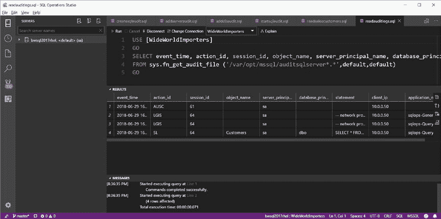

**图 7-19. SQL Server 审计示例**

`action_id` 列中的值来自 DMV `sys.dm_audit_actions`。在这个例子中，`AUSC` = `AUDIT SESSION CHANGED`，表示启动审计跟踪的审计事件。`LGIS` = `LOGIN SUCCEEDED`，表示 sa 为针对 WideWorldImporters 运行查询而建立的新连接（由于 SQL Operation Studio 的连接方式，可能还有另一个登录记录。你可以从 `application_name` 中看到这一点。这也是为你的应用程序设置应用程序名称的另一个好理由！）。`action_id` `SL` = `SELECT`，这显示了 dbo 运行 SELECT 语句访问 Customers 表的跟踪记录。请注意，审计还包含客户端 IP 地址等数据。`sys.fn_get_audit_file` 的完整列集记录在 [`docs.microsoft.com/sql/relational-databases/system-functions/sys-fn-get-audit-file-transact-sql`](https://docs.microsoft.com/sql/relational-databases/system-functions/sys-fn-get-audit-file-transact-sql)。

> **注意**：SQL Server Management Studio 提供了用户界面选项来创建和管理审计以及查看审计日志。在以下资源中阅读更多内容：
> - [创建服务器审计和服务器审计规范](https://docs.microsoft.com/sql/relational-databases/security/auditing/create-a-server-audit-and-server-audit-specification#SSMSProcedure)
> - [查看 SQL Server 审计日志](https://docs.microsoft.com/sql/relational-databases/security/auditing/view-a-sql-server-audit-log#SSMSProcedure)

与审计相关的完整 T-SQL 语句、DMV 和目录视图列表可在我们的文档中找到：[`docs.microsoft.com/sql/relational-databases/security/auditing/sql-server-audit-database-engine#creating-and-managing-audits-with-transact-sql`](https://docs.microsoft.com/sql/relational-databases/security/auditing/sql-server-audit-database-engine#creating-and-managing-audits-with-transact-sql)。

鉴于审计的重要性，SQL Server Audit 提供了相关选项，以确保在审计因任何原因失败时，SQL Server 将关闭或无法启动。有关此功能以及 SQL Server Audit 的其他注意事项的更多信息，请阅读：[`docs.microsoft.com/sql/relational-databases/security/auditing/sql-server-audit-database-engine#creating-and-managing-audits-with-transact-sql`](https://docs.microsoft.com/sql/relational-databases/security/auditing/sql-server-audit-database-engine#creating-and-managing-audits-with-transact-sql)。

#### 总结

现在你已经完成了对 SQL Server 在 Linux 上的性能和安全性的广泛研究。在本章中，我介绍了登录和用户的基础知识，讨论了使用 Active Directory 身份验证，向你展示了如何设置权限和访问控制，描述了数据和网络连接加密的不同选项，并通过向你展示数据分类和审计功能结束了本章。构建生产就绪 SQL Server 的下一个重要主题是高可用性和灾难恢复（HADR）。

# 8 SQL Server 的高可用性和灾难恢复

虽然性能和安全性是任何世界级数据库引擎和平台必须提供的关键特性，但生产工作负载和数据库需要高可用性以及支持健壮灾难恢复计划的功能。SQL Server 是一个数据库平台，为高可用性和灾难恢复需求提供了丰富的特性和选项。

在本章中，我将介绍 SQL Server on Linux 中包含的高可用性和灾难恢复的三个最重要的功能领域：
- 备份和还原
- 故障转移群集实例 (Always On Failover Cluster Instance)
- 可用性组 (Always On Availability Groups)

我不会在本书中涵盖的另一个解决方案称为 *日志传送 (Log Shipping)*，你可以在 [`docs.microsoft.com/sql/linux/sql-server-linux-use-log-shipping`](https://docs.microsoft.com/sql/linux/sql-server-linux-use-log-shipping) 阅读更多内容。与此主题相关的另一个重要资源是 *业务连续性 (Business Continuity)*，你可以在 [`docs.microsoft.com/sql/linux/sql-server-linux-business-continuity-dr`](https://docs.microsoft.com/sql/linux/sql-server-linux-business-continuity-dr) 阅读。

© Bob Ward 2018
B. Ward, *Pro SQL Server on Linux*, `doi.org/10.1007/978-1-4842-4128-8_8`

#### 备份和还原

我很喜欢我们文档中的这句话：“SQL Server 的高可用性功能并不能取代拥有一个健壮、经过充分测试的备份和还原策略的要求，这是任何高可用性解决方案最基本的构建块”（你可以在 [`docs.microsoft.com/sql/linux/sql-server-linux-business-continuity-dr#sql-server-2017-scenarios-using-the-availability-features`](https://docs.microsoft.com/sql/linux/sql-server-linux-business-continuity-dr#sql-server-2017-scenarios-using-the-availability-features) 阅读）。

这很好地总结了备份的重要性。我经常引用的一句话是：“你的数据质量取决于你的备份质量”。在我与 SQL Server 打交道的 25 年经验中，我从未见过比制定可靠的备份策略更被想当然的事情。我曾与一些客户合作过，他们使用 SQL Server 运行整个生产业务长达 *数月* 而没有良好的备份。当然，第一次遇到需要备份的故障时，你才会真正意识到它的重要性。

那么，让我们来探讨一下在 SQL Server on Linux 中备份和还原数据库的基础知识和细节，包括一个重要的相关主题：数据库恢复。

##### 数据库备份


# 高可用性和灾难恢复

我还没有向你展示过备份的示例，但我们已经使用了 T-SQL `RESTORE` 语句来恢复 `WideWorldImporters` 数据库备份（在本书的这个阶段，你可能已经对此感到厌倦了）。此外，我确实在第[7]章中讨论了加密备份。备份数据库的基础知识相当简单。更复杂的是制定一个好的备份策略来满足我们的应用程序和业务需求。

###### 完整数据库备份

让我们从讨论备份开始，使用 `WideWorldImporters` 数据库的一个简单示例。假设你只想备份数据库的当前状态。你可以使用以下 T-SQL 语句来实现，以 `sa`（或数据库所有者或 `db_backupoperator` 角色的成员）身份连接，使用你最喜欢的 SQL Server 工具（或本书示例中你可能使用的任何数据库所有者）。

此语句可以在示例 **`backupwwi.sql`** 中找到：

```
BACKUP DATABASE WideWorldImporters
TO DISK = '/var/opt/mssql/data/wwi.bak'
WITH INIT, STATS=5, CHECKSUM
GO
```

在 SQL Operations Studio 中运行此语句的结果如图[8-1]所示。

**图 8-1.** `WideWorldImporters` 数据库的完整数据库备份

此语句的结果是 `WideWorldImporters` 数据库的一个*完整数据库备份*，写入一个名为 `/var/opt/mssql/data/wwi.bak` 的文件（文件扩展名没有要求，我使用 `.bak` 作为一种帮助我识别文件类型的方法）。默认情况下，SQL Server 会将备份文件写入 `/var/opt/mssql/data` 目录，但你可以使用 `mssql-conf` 更改此目录（请参阅我们的文档：`https://docs.microsoft.com/sql/linux/sql-server-linux-configure-mssql-conf#backupdir`）。一个完整数据库备份包含数据库文件中所有已分配的页面、活动的事务日志以及有关备份的元数据。SQL Server 备份的内部格式由 Microsoft Tape Format (MTF) 协议定义。这不是一个开源协议，你真的不需要知道备份格式的内部结构（但如果你真的、真的感兴趣，这个网站记录了原始协议：`http://laytongraphics.com/mtf/MTF_100a.PDF`）。

> **提示：** 想查看 MTF 的一些细节吗？启用跟踪标志 3216 和 3605，你可以在 `errorlog` 文件中看到这些细节。跟踪标志 3216 未被记录或支持，因此我不建议在生产环境中使用。请记住，`mssql-conf` 可用于设置跟踪标志，如我们的文档所述：`https://docs.microsoft.com/sql/linux/sql-server-linux-configure-mssql-conf#traceflags`。

我在这个 `BACKUP DATABASE` 命令中使用了几个相当常见的选项：

**`TO DISK`**：`DISK` 是一种备份设备类型，也是最常用的。我们技术上支持 `TAPE`（不幸的是，我职业生涯的很大一部分时间都在处理客户的 SQL Server 磁带备份问题。我知道，这暴露了我的年龄）和一种称为 `URL` 的类型。`URL` 是一个很好的功能，允许你将数据库直接备份到 Azure Blob Storage。有关更多信息，请参阅我们的文档：`https://docs.microsoft.com/sql/relational-databases/tutorial-sql-server-backup-and-restore-to-azure-blob-storage-service?view=sql-server-2017`。磁盘备份的路径可以是任何有效的 Linux 路径，包括来自网络或本地磁盘的挂载点。唯一的要求是 `mssql` 用户必须具有对目标目录的写入权限。

**`WITH INIT`**：默认情况下，SQL Server 允许你将多个备份保存到单个文件中。使用 `INIT` 基本上会覆盖当前文件中已有的任何内容（如果文件已存在）。如果你没有指定 `INIT`，默认行为是将当前备份附加到文件的末尾。

> **提示：** 你可能还想考虑同时使用 `FORMAT` 和 `INIT` 来完全启动一个新的格式化备份文件。我遇到过一些情况，我想覆盖磁盘上现有的文件，但该备份文件已损坏。我需要使用 `FORMAT` 和 `INIT` 来完全启动一个新文件（或者先删除磁盘上的现有文件）。

**`STATS=5`**：`STATS` 是一个按完成百分比显示的“进度指示器”选项。我包含它是为了演示备份是由并行工作线程执行的。在接下来讨论结果时，我会详细解释我的意思。如果你有一个需要按需运行的、异常长的备份，`STATS` 也可以很方便地查看其进度。

**`CHECKSUM`**：默认情况下，SQL Server 使用校验和算法来确保数据库页面在写入磁盘后物理上是一致的。我将在本书后面详细讨论这一点。基于相同的概念，备份文件也可以有一个校验和。

使用此选项会做两件事：

1.  如果数据库启用了 `PAGE_VERIFY` 选项的校验和，备份操作将在读取每个页面时验证数据库页面校验和。如果校验和失败，备份将失败（除非使用了 `CONTINUE_AFTER_ERROR` 选项）。
2.  为整个备份文件计算一个校验和，并与备份 MTF 格式化文件一起存储。我将在本章后面讨论如何使用 `RESTORE` 有效地利用这一点来验证备份文件。

你可以通过使用服务器配置选项 `backup checksum default` 为所有备份默认启用校验和，如文档所述：`https://docs.microsoft.com/sql/database-engine/configure-windows/backup-checksum-default`。

除了 `BACKUP` 命令结果中的“stats”消息外，其他消息指示了为数据库的每个文件组和事务日志备份了多少数据库页面。这可以让你了解备份的大小。请记住，只有已分配的页面才会被备份，因此备份通常不比数据库文件本身大。此外，最后一条消息指示了数据库中备份的总页面数、备份执行的总时长以及备份速度。

其他有关备份的元数据和信息记录在 `ERRORLOG` 中，包含如下消息：

```
Database backed up. Database: WideWorldImporters, creation date(time):
2018/06/29(01:36:22), pages dumped: 60981, first LSN: 626:25064:2, last
LSN: 627:18664:1, number of dump devices: 1, device information: (FILE=1,
TYPE=DISK: {'/var/opt/mssql/data/wwi.bak'}). This is an informational
message only. No user action is required.
```

> **提示：** 一些用户发现每个备份命令都带有这些消息会使 `errorlog` 变得嘈杂。因此，你可以使用跟踪标志 3226 来抑制备份消息。


# 第 8 章 SQL Server 的高可用性与灾难恢复

（以及恢复）信息记录在错误日志中。

除了 ERRORLOG，备份信息也会记录在 `msdb` 数据库的表中，例如 `backupfile`、`backupfilegroup` 和 `backupmediaset` 等。

我曾说过备份是使用并行工作线程完成的，图 8-1 的结果也证明了这一点。我这样说是因为显示统计信息的是主备份工作线程，而其他工作线程则负责从数据库文件读取并写入目标设备。这种交错的结果展示了该行为。通常，SQL Server 会为数据库所有文件涉及的每个唯一磁盘创建一个用于读取的工作线程，并为数据库备份目标文件的每个唯一磁盘创建一个用于写入的工作线程（你可以通过指定多个文件，甚至跨多个磁盘来对备份进行分区）。

`BACKUP DATABASE` 命令有几个可选参数。你可以在我们的文档中查看所有参数：[`docs.microsoft.com/sql/t-sql/statements/backup-transact-sql`](https://docs.microsoft.com/sql/t-sql/statements/backup-transact-sql)。其中有一个可能很有用的选项是 `COMPRESSION`。SQL Server 会压缩备份文件以帮助减少空间需求。在使用 `COMPRESSION` 和 TDE 时有一些注意事项，前面的文档参考资料中有详细说明。

数据库备份是完全在线进行的，这意味着在备份期间你可以正常使用数据库。

### 注意
从技术上讲，有些操作可能会阻塞备份，反之亦然。这些操作包括 `alter database` 以及其他需要独占数据库锁的操作。

`BACKUP DATABASE` T-SQL 语句还允许你仅备份特定的文件或文件组。对于大型数据库，可能会有这样的场景：创建完整的数据库备份耗时过长，无法满足你的业务需求。因此，如果你有多个文件或使用了辅助文件组，你可以分阶段创建备份。前面提到的 `BACKUP DATABASE` 命令的文档参考资料描述了如何备份文件或文件组。在将此作为备份策略之前，请仔细阅读备份特定文件或文件组的流程。

###### 恢复模型
我在本书中已经描述过，事务日志是数据库更改的记录（很像日志）。在描述备份事务日志的概念之前，我应该先介绍一个称为 *恢复模型* 的概念。恢复模型决定了事务日志空间的管理方式以及可以进行何种 *介质恢复*。介质恢复确定了当数据库和/或事务日志文件损坏或不可用时，从备份介质恢复数据库的可用选项。这转化为你愿意接受何种程度的数据丢失风险。SQL Server 支持以下恢复模型：

-   **简单**：事务日志中的空间会在一段时间后，基于已完成的事务自动回收（也称为 *日志截断*）。使用此模型无法备份事务日志。你的数据丢失风险在于，可能会丢失自上次数据库备份以来所做的更改，因为并非事务日志中的所有事务都会被保存。当然，这只会发生在数据库和事务日志文件损坏或不可用的情况下（例如，存放这些文件的磁盘损坏）。此恢复模型适用于你只计划备份完整数据库的场景，通常用于较小的数据库，且备份间隔内的数据丢失是可以接受的。

-   **完整**：这是默认的恢复模型。使用此模型，所有介质恢复选项都是可行的，因为事务日志空间从不自动回收。所有事务都保存在


# SQL Server 恢复模型与事务日志备份

## 完整恢复模型
事务日志会不断增长，直到进行事务日志备份为止。实际上，我遇到的最常见问题之一就是，客户抱怨他们的事务日志文件意外增长，原因往往是他们使用了完整恢复模型却从未备份过事务日志。使用完整恢复模型，您可以根据数据库和事务日志备份的序列，恢复到任意时间点。

完整恢复模型还允许您使用诸如 Always On 可用性组之类的功能，而使用简单恢复模型的数据库则不允许使用这些功能。对于希望将数据丢失风险降至最低的生产数据库，建议使用此模型。

## 大容量日志恢复模型
此恢复模型非常适合经常需要批量插入操作的数据库。它的工作方式与完整恢复模型类似，但允许批量复制操作进行最小日志记录，从而减少事务日志占用的空间。最小日志记录操作可以实现快速高效的批量操作。您可以在以下链接中阅读更多关于最小日志记录操作的信息：`https://docs.microsoft.com/sql/relational-databases/import-export/prerequisites-for-minimal-logging-in-bulk-import`。

不过，此恢复模型对于批量操作确实存在数据丢失风险，风险范围是从上一个事务日志备份之后开始。此模型也不支持时间点恢复等选项，也不能用于 Always On 可用性组。

关于 SQL Server 恢复模型的完整说明，请参阅我们的官方文档：`https://docs.microsoft.com/sql/relational-databases/backup-restore/recovery-models-sql-server`。

#### 事务日志备份
如果您计划使用完整恢复模型，那么您肯定不希望总是必须备份整个数据库，以此作为从磁盘故障等情况中恢复的唯一方式。此外，正如我前面所述，您不希望事务日志文件一直增长直到磁盘空间耗尽。因此，SQL Server 提供了 `BACKUP LOG` T-SQL 语句选项来备份事务日志。要备份事务日志，首先必须至少执行过一次 `BACKUP DATABASE` 语句。

`BACKUP LOG` 与 `BACKUP DATABASE` 的大多数选项类似。您可以选择不使用 `WITH INIT` 选项，以便将所有日志备份保存在一个文件中；或者使用 `WITH INIT` 选项，将它们保存在单独的文件中。

完整的数据库备份包含所有当前已分配的页面和当前活动的事务日志，而事务日志备份则包含自*上一次事务日志备份*（如果是第一次日志备份，则是自上次数据库备份）以来事务日志中的所有更改。因此，事务日志备份通常按照*日志链*的顺序收集。请参考图 8-2 中的日志链示例。

**图 8-2. 日志链示例**

星期一中午 12:00 的事务日志备份包含了自早上 8:00 数据库备份以来事务日志中的所有更改。星期一晚上 8:00 的事务日志备份包含了自中午 12:00 日志备份以来的所有更改。星期二中午 12:00 的事务日志备份则包含了自星期一晚上 8:00 事务日志备份以来的所有更改。

我将在下一节关于还原的内容中，进一步讲解如何应用日志链备份序列。使用事务日志备份时，您的数据丢失风险在于两次日志备份之间发生的更改。因此，您必须确保在两次备份之间……


一项基于您的数据丢失暴露需求，关于事务日志备份频率的商业决策（注意：本章后面我们将讨论如何使用其他技术，如 Always On 可用性组，来进一步最小化这种暴露）。

# 第 8 章 SQL Server 的高可用性与灾难恢复

业界中与这些决策相关的常用术语是`恢复时间目标`（`RTO`）和`恢复点目标`（`RPO`）。`RTO`是指在发生中断事件后恢复应用程序的目标时长。`RPO`是指应用程序可接受的、在中断事件后丢失的最大时间段内的数据变化量。因此，例如，如果您的`RTO`是四小时，`RPO`是 15 分钟，您就需要确保每 15 分钟创建一次日志备份，并设计一个能在 4 小时内还原数据库备份和一系列日志备份的方案。

在下一节关于还原的讨论中，我将探讨一个有趣的场景：尾日志备份。您可以在我们的文档中阅读更多关于事务日志备份的信息：[`docs.microsoft.com/sql/relational-databases/backup-restore/transaction-log-backups-sql-server`](https://docs.microsoft.com/sql/relational-databases/backup-restore/transaction-log-backups-sql-server)。

## 差异备份与仅复制备份

为了帮助减少完整数据库或事务日志备份的数量，SQL Server 支持`差异备份`。`差异备份`类似于数据库备份，因为它包含数据库页面，但它仅包含自上次完整数据库备份以来发生更改的页面。这可以极大地加快还原过程，因为您可以还原一个完整备份、最后一个`差异备份`，然后应用任何事务日志备份来完全还原数据库。`差异备份`基于最近的完整备份，该备份被称为`差异备份`的`基准`。

所有恢复模式都支持`差异备份`。我将在本章的下一个主要部分中更详细地讨论如何还原`差异备份`。您可以在我们的文档中阅读更多关于`差异备份`的信息：[`docs.microsoft.com/sql/relational-databases/backup-restore/transaction-log-backups-sql-server`](https://docs.microsoft.com/sql/relational-databases/backup-restore/transaction-log-backups-sql-server)。

`仅复制备份`是一种不影响备份序列、日志链或`差异基准`的数据库或日志备份。在某些情况下，您可能希望创建一个独立于已实施备份策略的数据库或日志备份。使用 T-SQL `BACKUP`语句的`WITH COPY_ONLY`选项来创建`仅复制备份`。在我们的文档中阅读更多关于`仅复制备份`的信息：[`docs.microsoft.com/sql/relational-databases/backup-restore/copy-only-backups-sql-server`](https://docs.microsoft.com/sql/relational-databases/backup-restore/copy-only-backups-sql-server)。

## 数据库快照

我原本没有在本书中专门介绍数据库快照概念的地方，但将其与备份放在这里似乎合乎逻辑，因为它可以是高可用性解决方案的一部分。`数据库快照`也可以在`还原`操作中使用，因此我将首先在这里介绍这个主题。`数据库快照`是某个时间点数据库的只读静态视图。它们提供了一种很好的方法来查看您的数据或从错误中恢复。


### 第 8 章：SQL Server 的高可用性与灾难恢复

## 数据库快照

特定时间点的快照，而无需使用时间点恢复功能来还原一系列备份序列。

数据库快照以一种称为 `稀疏文件` 的概念存储为磁盘上的文件。这意味着在首次创建快照时，其体积很小。当你对数据库进行更改时，数据库页面的原始版本会被复制到快照中。这意味着随着时间的推移，发生的更改越多，快照文件就越大。你可以像使用数据库一样使用数据库快照。SQL Server 会首先尝试从快照中获取数据库页面。如果快照中不存在这些页面，则意味着这些页面自原始数据库以来未被更改，此时页面将从数据库本身中检索。

快照不能替代你的备份策略，但在某些有趣的情况下非常方便。例如，如果你要为某个项目对数据库进行重大更改，可以先创建一个数据库快照。如果你犯了重大错误，可以使用该快照快速回滚数据库。如果不再需要该快照，你可以轻松地将其删除。

写入快照文件的页面会给 SQL Server 数据库操作带来额外的 I/O 性能开销，因此我建议你将快照文件与 SQL Server 数据库文件和事务日志文件存放在不同的磁盘上。

你可以在我们的文档中阅读有关创建快照、快照的更多好处和限制的详细信息：[`docs.microsoft.com/sql/relational-databases/databases/database-snapshots-sql-server`](https://docs.microsoft.com/sql/relational-databases/databases/database-snapshots-sql-server)。

## VDI 和快照备份

SQL Server 支持一种标准文档中未列出的特殊设备，称为 `虚拟设备`。`VDI` 是一个规范，供开发者构建能够以数据流形式从 SQL Server 接收备份数据的应用程序。该程序随后可以以多种方式处理此数据流。

你可以在 [`github.com/Microsoft/sql-server-samples/tree/master/samples/features/sqlvdi-linux`](https://github.com/Microsoft/sql-server-samples/tree/master/samples/features/sqlvdi-linux) 找到如何构建 VDI 应用程序的示例。

`BACKUP` T-SQL 语句使用 `TO VIRTUAL_DEVICE` 选项来支持 VDI 备份。此外，VDI 备份支持一种称为 `快照备份` 的概念。快照备份允许 VDI 程序直接将 SQL Server 数据库和日志文件复制到另一个存储设备，而不是依赖于从 SQL Server 获取备份数据流。SQL Server 能识别 `BACKUP` 命令中的 `WITH SNAPSHOT` 选项，并将冻结所有文件上的 I/O 操作，直到 VDI 应用程序确认快照（类似文件复制）完成。

有一篇较早但很好的博文解释了 VDI 的工作原理：[`blogs.msdn.microsoft.com/sqlserverfaq/2009/04/28/informational-shedding-light-on-vss-vdi-backups-in-sql-server/`](https://blogs.msdn.microsoft.com/sqlserverfaq/2009/04/28/informational-shedding-light-on-vss-vdi-backups-in-sql-server/)。

在 Linux 上的 SQL Server 中使用 VDI 备份有一些具体注意事项。请在我们的文档中阅读有关这些细节的说明：[`docs.microsoft.com/sql/linux/sql-server-linux-backup-vdi-specification`](https://docs.microsoft.com/sql/linux/sql-server-linux-backup-vdi-specification)。

面向开发者的完整 VDI 规范可以在此处找到：[`www.microsoft.com/download/details.aspx?id=17282`](https://www.microsoft.com/download/details.aspx?id=17282)。


[microsoft.com/download/details.aspx?id=17282](https://www.microsoft.com/download/details.aspx?id=17282)。（当你解压后打开这个文件时，请不要惊讶。它名为 `vbackup.chm`，是一种旧版的 Microsoft 帮助格式，文件内容标注为 SQL Server 2005 规范。但它对 SQL Server 2017 仍然有效！）

## 系统数据库备份

除 `tempdb` 外的系统数据库，可以像任何其他用户数据库一样进行备份。问题是，你应该备份系统数据库吗？答案是肯定的，但我建议你实际上只需要对系统数据库进行完整备份，而且可能不需要经常执行。例如，除非你更改了 `model` 数据库，否则只需在安装后备份一次，之后可能就再也不需要备份它了。

我将在下一节讨论一种在安装后重建系统数据库的方法，但恢复系统数据库备份要简单得多，并且它提供了一种恢复其中所做任何更改的方法。你可以在我们的文档中阅读更多关于系统数据库备份和恢复的信息：[`docs.microsoft.com/sql/relational-databases/backup-restore/back-up-and-restore-of-system-databases-sql-server`](https://docs.microsoft.com/sql/relational-databases/backup-restore/back-up-and-restore-of-system-databases-sql-server)。


### 第 8 章：SQL Server 的高可用性与灾难恢复

### 数据库还原与恢复

SQL Server 提供了多个选项来还原数据库备份、数据库差异备份序列和日志备份，以及还原部分数据库的其他方法，例如分段还原和页面还原。在本节中，我将回顾所有这些选项，以及有关系统数据库还原和恢复的信息。还原的一部分是运行数据库恢复，由于我在书中尚未讨论该主题，现在正是回顾数据库恢复如何工作以及它如何影响还原和数据库启动的好时机。作为参考，我们的文档中对所有恢复选项进行了很好的概述：[`docs.microsoft.com/sql/relational-databases/backup-restore/restore-and-recovery-overview-sql-server`](https://docs.microsoft.com/sql/relational-databases/backup-restore/restore-and-recovery-overview-sql-server)。

### 数据库恢复

为了确保记录在事务日志中的事务与磁盘上的数据库页面保持一致，SQL Server 会在某些情况下对数据库运行恢复。我在书中之前讨论过预写日志 (`WAL`) 的概念。由于这种持久化方法，在任何时间点，都可能存在已记录在事务日志中但尚未反映在磁盘数据库页面上的事务。此外，也可能存在尚未提交但已反映在磁盘数据库页面上的事务（例如，由于 `Lazy Write`）。

当 SQL Server 必须还原备份或使数据库联机时，它将检查事务日志，以确定是否需要协调日志与数据库页面之间这些可能的不一致。在这个过程中，事务日志是事实的来源。恢复过程按以下阶段完成，如图 8-3 所述。

**图 8-3. 数据库恢复阶段**

#### 分析

SQL Server 将查找自上次检查点以来可能已变脏的页面以及未提交事务的状态。SQL Server 使用此分析来正确执行恢复的其他阶段：重做和撤销。

# 第 8 章 SQL Server 的高可用性与灾难恢复

`重做（Redo）`：从事务日志中最旧的活动事务开始，重做所有已提交但尚未反映在事务所列数据库页上的事务（这也称为前滚事务）。SQL Server 可以使用多个工作线程并行执行此操作，这是我们在 SQL Server 2016 中为加速恢复性能而进行的一项优化。

`撤销（Undo）`：从事务日志中最旧的活动事务开始，确保所有未提交的事务不会反映在事务所列的数据库页上（这也称为回滚）。

SQL Server 通过查看所谓的 `日志序列号`（`LSN`）来理解如何比较事务日志中的事务以及它是否已反映在数据库页上。每个事务都标记有一个 `LSN`，任何被修改的数据库页都具有修改它的事务的 `LSN`。`LSN` 值按顺序递增。因此，很容易比较日志中的 `LSN` 和数据库页上的 `LSN`，并了解该更改是否已应用。

在某些情况下，对于企业版，SQL Server 可以使用 `快速恢复`，在重做阶段之后，在获取撤销操作锁的同时允许数据库变为联机状态。这种情况不适用于还原，而是适用于数据库被联机的情况，例如 SQL Server 的崩溃恢复（在意外关闭之后）。

理解恢复的概念对于还原序列很重要，要知道恢复何时应用于包含在数据库或日志备份中的事务。

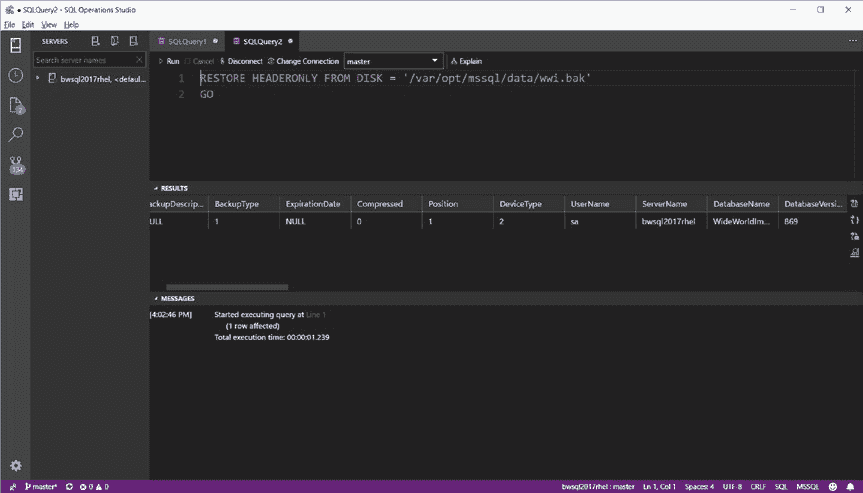

## 还原数据库

让我们从还原完整数据库备份的一些基础知识开始来看还原操作。使用本章前面创建的备份（`wwi.bak`），执行以下 T-SQL 语句，如示例脚本 `restorewwiheaderonly.sql` 中所示：

```
RESTORE HEADERONLY FROM DISAL = '/var/opt/mssql/data/wwi.bak'
GO
```

此还原选项将检查备份文件（MTF 格式），并返回备份文件元数据头中包含的信息。这对于了解备份中包含的信息很有帮助（尤其是当您不确定备份中有什么时）。

图 8-4 显示了此命令的结果。

**图 8-4. SQL Server 中的 `RESTORE HEADERONLY`**

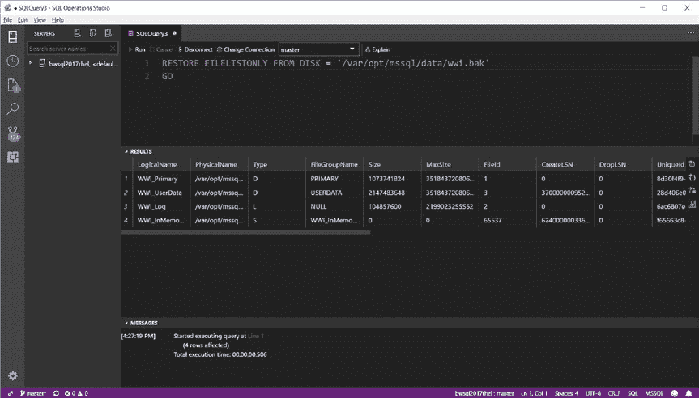

数据库备份中的元数据之一是所有数据库文件和日志文件的原始文件路径。当您还原备份时，SQL Server 将尝试在数据库备份时的确切文件路径位置创建这些文件以构建数据库。如果您尝试还原的备份其原始文件路径不存在（并且您无法创建它们），这可能会给您带来问题。因此，您将必须使用 `RESTORE` T-SQL 语句支持的语法来移动数据库和/或日志文件。但是，您如何知道要移动的文件及其原始路径呢？这就是 `RESTORE` 的一个非常方便的选项 `FILELISTONLY` 存在的原因。执行以下 T-SQL 语句，如示例 `restorewwifilelistonly.sql` 中所示：

```
RESTORE FILELISTONLY FROM DISK = '/var/opt/mssql/data/wwi.bak'
GO
```

您的结果应该类似于图 8-5。

**图 8-5. SQL Server 中的 `RESTORE FILELISTONLY`**

从结果中，您可以看到文件的逻辑名称和物理文件路径。所以，假设您想要还原此备份，但不是将数据库放在其原始文件路径中，而是需要在不同目录中创建它们。

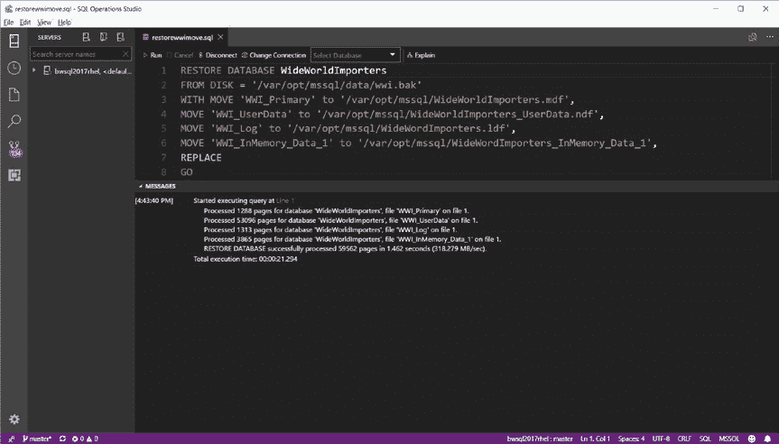


# 第 8 章 SQL Server 的高可用性与灾难恢复

以下是一个使用如下 T-SQL 语句进行操作的示例，该语句可在示例`restorewwimove.sql`中找到：

```sql
RESTORE DATABASE WideWorldImporters
FROM DISK = '/var/opt/mssql/data/wwi.bak'
WITH MOVE 'WWI_Primary' to '/var/opt/mssql/WideWorldImporters.mdf',
MOVE 'WWI_UserData' to '/var/opt/mssql/WideWorldImporters_UserData.ndf',
MOVE 'WWI_Log' to '/var/opt/mssql/WideWordImporters.ldf',
MOVE 'WWI_InMemory_Data_1' to '/var/opt/mssql/WideWordImporters_InMemory_Data_1',
REPLACE
GO
```

此 T-SQL 语句的执行结果应如图 8-6 所示。

图 8-6. 还原数据库时移动文件

在此示例中，我已还原数据库，因此文件被创建在`/var/opt/mssql`目录下，而非`/var/opt/mssql/data`。另请注意`REPLACE`关键字的使用，因为数据库已存在。使用此关键字将导致 SQL Server 删除现有数据库及文件，并还原新的数据库。

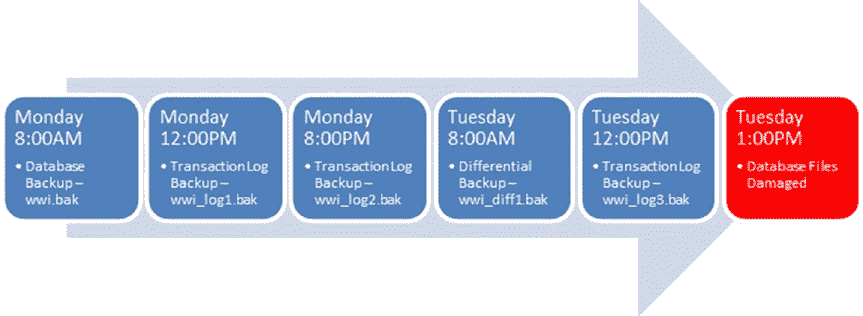

**提示：** 如果您是出于灾难恢复目的而还原数据库，我不建议使用`REPLACE`。相反，应将数据库备份还原到一个新名称，同时保留原始数据库。这是我个人的建议，因为我曾遇到过客户情况：原始数据库存在某些损坏，但备份无效。使用`REPLACE`会使 SQL Server 在还原备份前先删除原始数据库。如果备份还原失败，您将无法尝试恢复原始数据库中的内容。

本章前文提到了在备份时使用`CHECKSUM`选项。使用此功能的一个显著优势是，您无需使用`RESTORE VERIFYONLY`选项还原整个数据库，即可验证备份介质的校验和。如果`RESTORE VERIFYONLY`执行后没有报错，这并不能保证包括恢复在内的整个还原过程会成功（确认备份能否还原的唯一方法就是执行还原操作，即使是在另一台服务器上），但它确实能保证备份介质在创建后未被损坏。

## 完整数据库还原

让我们通过一个示例，基于本章讨论过的备份选项，来考察一个可能的完整还原序列。考虑图 8-7 中的事件序列。

图 8-7. 崩溃前的数据库备份序列

周二下午 1:00，发生了数据库文件损坏的事件，但在此示例中，当前的事务日志文件是完好的。如何从该事件中恢复？是否会丢失数据？如果事务日志确实有效，您可能实现零数据丢失。原因和方法如下。

因为我们有数据库备份和一系列日志备份，所以可以执行以下操作：

1.  备份当前的“日志尾部”。您可以使用带有`NO_RECOVERY`选项的`BACKUP` T-SQL 语句来完成此操作。
2.  从备份文件`wwi.bak`还原完整数据库备份。此处与我之前展示的`RESTORE`示例的不同之处在于，您将使用`WITH NO_RECOVERY`。SQL Server 实际上会在还原备份后应用重做逻辑，但不执行撤销。还原完成后，数据库尚不可用。
3.  从备份文件`wwi_diff1.bak`还原差异备份。与步骤#2 一样，您需要`WITH NO_RECOVERY`选项。数据库仍不可用。
4.  从备份文件`wwi_log3.bak`还原事务日志备份。这次使用`RESTORE LOG`语句，并使用`WITH NO_RECOVERY`。数据库仍不可用。
5.  还原您在步骤#1 创建的日志尾部备份。同样，使用`RESTORE LOG WITH NO_RECOVERY`。数据库仍不可用。
6.  执行`RESTORE DATABASE`命令，但仅使用`WITH RECOVERY`选项，以完全恢复数据库并使其


### 第 8 章：SQL Server 的高可用性与灾难恢复

将其恢复至一致状态。此时数据库应已可用，且无数据丢失。

并且由于我创建了事务日志备份，即使差异备份无效，我仍可以按顺序还原所有日志备份。

让我们通过模拟 `WideWorldImporters` 数据库中的一系列更改（使用日志和差异备份）来实际查看此过程。对于这些示例，请使用 `sa` 或您创建的其他 `sysadmin` 登录名连接。为确保这些命令正确运行，请使用像 `sqlcmd` 这样的工具一次运行所有命令，或在 SQL Operation Studio 等工具中使用同一连接。

1.  首先，按照前面章节所述，将 `WideWorldImporters` 完整示例数据库还原到其原始状态。我已包含前面章节中使用的 `restorewwi.sh` 和 `restorewwi_linux.sql` 脚本。

2.  事实证明 `WideWorldImporters` 数据库被设置为 `SIMPLE` 恢复模型，但我们的示例希望使用 `FULL` 恢复模型。执行以下 T-SQL 语句，将 `WideWorldImporters` 的恢复模型更改为 `FULL`，该语句可在示例脚本 `wwisetfull.sql` 中找到：

    ```
    USE master
    GO
    ALTER DATABASE WideWorldImporters SET RECOVERY FULL
    GO
    ```

    注意：使用简单恢复模型的数据库具有除使用事务日志备份之外的所有类型的恢复选项，因为您无法使用简单恢复模型创建事务日志备份。有关简单恢复模型数据库的完整数据库还原的更多信息，请参阅我们的文档：[`docs.microsoft.com/sql/relational-databases/backup-restore/complete-database-restores-simple-recovery-model`](https://docs.microsoft.com/sql/relational-databases/backup-restore/complete-database-restores-simple-recovery-model)。

3.  通过执行本章前面找到的 `backupwwi.sql` 脚本，为 `WideWorldImporters` 创建完整数据库备份：

    ```
    USE master
    GO
    BACKUP DATABASE WideWorldImporters
    TO DISK = '/var/opt/mssql/data/wwi.bak'
    WITH INIT, STATS=5, CHECKSUM
    GO
    ```

4.  执行以下 T-SQL 语句，在 `WideWorldImporters` 数据库中创建一个新表，该语句可在示例脚本 `letsgomavs.sql` 中找到：

    ```
    USE WideWorldImporters
    GO
    DROP TABLE IF EXISTS letsgomavs
    GO
    CREATE TABLE letsgomavs (player char(50), number int)
    GO
    ```

5.  现在备份事务日志以模拟周一中午 12:00 的备份，执行以下 T-SQL 语句，该语句可在示例脚本 `backupwwilog1.sql` 中找到：

    ```
    USE master
    GO
    BACKUP LOG WideWorldImporters TO DISK = '/var/opt/mssql/data/wwi_log1.bak'
    WITH INIT, CHECKSUM
    GO
    ```

6.  现在使用以下 T-SQL 语句向我创建的表中插入一行，该语句可在示例脚本 `insertdirk.sql` 中找到：

    ```
    USE WideWorldImporters
    GO
    INSERT INTO letsgomavs VALUES ('Dirk Nowitski', 41)
    GO
    ```

7.  现在进行另一次备份，模拟周一晚上 8:00 的日志备份，执行以下 T-SQL 语句，该语句可在示例脚本 `backupwwilog2.sql` 中找到：

    ```
    USE master
    GO
    BACKUP LOG WideWorldImporters TO DISK = '/var/opt/mssql/data/wwi_log2.bak'
    WITH INIT, CHECKSUM
    GO
    ```

8.  再向表中插入一行，使用以下 T-SQL 语句，该语句可在示例脚本 `insertdennis.sql` 中找到：

    ```
    USE WideWorldImporters
    GO
    INSERT INTO letsgomavs VALUES ('Dennis Smith Jr.', 1)
    GO
    ```

9.  现在使用以下 T-SQL 语句创建差异数据库备份，该语句可在示例脚本 `backupwwidiff.sql` 中找到：

    ```
    USE master
    GO
    BACKUP DATABASE WideWorldImporters
    TO DISK = '/var/opt/mssql/data/wwi_diff1.bak'
    WITH INIT, DIFFERENTIAL, CHECKSUM
    GO
    ```

10. 再向 `letsgomavs` 表中插入一行（我正在积累我的


# 第 8 章 SQL Server 的高可用性与灾难恢复

## 11. 进行最后一次日志备份

模拟在星期二中午 12:00 进行备份，使用示例脚本 `backupwwilog3.sql` 中的以下 T-SQL 语句：

```
USE WideWorldImporters
GO
BACKUP LOG WideWorldImporters TO DISK = '/var/opt/mssql/data/wwi_log3.bak'
WITH INIT, CHECKSUM
GO
```

## 12. 进行最后一次插入操作

现在让我们进行最后一次插入操作，根据我们的时间线，这发生在星期二下午 1:00 之前，使用示例脚本 `insertluka.sql` 中的以下 T-SQL 语句：

```
USE WideWorldImporters
GO
INSERT INTO letsgomavs VALUES ('Luka Doncic', 77)
GO
```

## 13. 数据库不可用与日志尾备份

现在假设在模拟的星期二下午 1:00，数据库变得不可用，但你认为保存事务日志的磁盘是完好的。我们绝对需要这些事务来确保达拉斯小牛队（NBA 球队）的阵容信息是正确的（尤其是我们的首轮选秀卢卡）。第一步是使用以下 T-SQL 语句备份当前的日志尾部，该语句可在示例脚本 `backupwwitailoflog.sql` 中找到：

```
USE master
GO
BACKUP LOG WideWorldImporters TO DISK = '/var/opt/mssql/data/wwi_tailoflog.bak'
WITH INIT, NO_TRUNCATE, CHECKSUM
GO
```

## 14. 恢复路径

此时你有几种恢复路径。我们可以从初始备份恢复数据到备份和事务序列中的任何时间点。我不希望有任何数据丢失，并且希望尽快恢复运行。执行示例脚本 `restorewwiall.sql` 中的以下 T-SQL 语句：

```
USE master
GO
RESTORE DATABASE WideWorldImporters FROM DISK = '/var/opt/mssql/data/wwi.bak'
WITH REPLACE, NORECOVERY
GO
RESTORE DATABASE WideWorldImporters FROM DISK = '/var/opt/mssql/data/wwi_diff1.bak'
WITH NORECOVERY
GO
RESTORE LOG WideWorldImporters FROM DISK = '/var/opt/mssql/data/wwi_log3.bak'
WITH NORECOVERY
GO
RESTORE LOG WideWorldImporters FROM DISK = '/var/opt/mssql/data/wwi_tailoflog.bak'
WITH NORECOVERY
GO
RESTORE DATABASE WideWorldImporters WITH RECOVERY
GO
```

## 15. 验证

如果一切成功，我期望我的四名球员仍然在我的数据库中。通过执行以下 T-SQL 语句 `mavstothenbafinals.sql` 来验证：

```
USE WideWorldImporters
GO
SELECT * FROM letsgomavs
GO
```

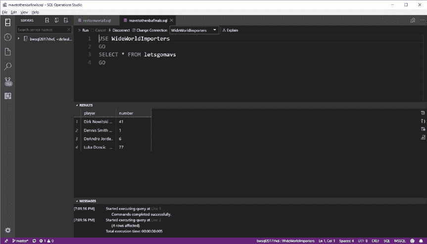

结果应如图 8-8 所示。

**图 8-8.** 在 SQL Server 中使用一系列备份恢复数据

这是一个漫长的序列，但它演示了如何使用一系列备份来满足你的恢复时间目标和恢复点目标。我向你展示的方案有一个问题是，在整个 `RESTORE` 序列期间，直到最后一步之前，数据库都处于离线状态（快速恢复不适用于还原）。还有其他方法可以让你以更联机的方式进行恢复，如下一节所述。

恢复序列的另一个选项是*时间点*恢复。时间点恢复在使用 `RESTORE LOG` T-SQL 语法时可用。当你使用时间点恢复时，可以使用 `WITH STOPAT=<time>` 和 `RECOVERY`（因为你将使用此语句恢复数据库）选项来指定。你可以恢复整个数据库和日志备份序列，然后使用时间点恢复作为最后一条 `RESTORE LOG` 语句。请查看我们关于时间点恢复的文档和示例：[`docs.microsoft.com/sql/relational-databases/backup-restore/restore-a-sql-server-database-to-a-point-in-time-full-recovery-model`](https://docs.microsoft.com/sql/relational-databases/backup-restore/restore-a-sql-server-database-to-a-point-in-time-full-recovery-model)。


# 文件、部分与页面恢复

对于拥有多个文件或文件组的数据库，可能会遇到只需恢复特定文件或文件组，而无需恢复整个数据库的场景——前提是你已创建了文件或文件组的备份。你可以离线或在线恢复文件或文件组（在线恢复仅适用于企业版）。要查看恢复文件或文件组的示例和场景，请参阅文档：https://docs.microsoft.com/sql/relational-databases/backup-restore/file-restores-full-recovery-model。

如果你拥有如前一节所示的完整数据库备份序列，则可以分阶段还原数据库，称为*部分还原*。部分还原允许你按阶段将文件组联机，而不是整个数据库同时联机。这可能是你恢复时间目标策略中一个有趣的部分，因为你现在可以将 RTO 定义在文件组级别。

例如，对于前一节恢复 WideWorldImporters 数据库的序列，我们可以将其更改为不同的恢复顺序。我们可以先恢复主文件组，稍后再恢复辅助文件组 `WWI_UserData`。

**注意**：内存优化数据文件组必须与主文件组一起备份和恢复。因此，你需要创建一个包含主文件组和内存优化数据文件组的数据库备份，以及另一个包含辅助文件组的备份。

使用此技术允许用户更快地访问存储在主文件组中的数据，而 `WWI_UserData` 文件组可以在稍后时间联机。在线部分还原仅在企业版上受支持。你可以在我们的文档中了解更多关于完整恢复模型数据库的部分还原信息：https://docs.microsoft.com/sql/relational-databases/backup-restore/example-piecemeal-restore-of-database-full-recovery-model。

更精细恢复选项的最后一个示例是*页面级恢复*。如果数据库中的特定页面损坏，此选项允许你还原这些页面。而此功能最大的优点在于它可以在线完成（仅限企业版）。设想这样一种情况：某个特定页面或一组页面被报告损坏（可能是通过 `msg 824` 错误——我将在第 9 章详细解释，或者来自 `DBCC CHECKDB` 的检查结果）。

### 第 8 章：SQL Server 的高可用性与灾难恢复

你可以使用本章到目前为止描述的方法，从数据库、差异、文件、文件组和/或日志备份中进行恢复。或者，你也可以使用这些备份仅还原所需的页面。在从数据库备份还原页面后，你仍然需要一个有效的日志备份序列来应用这些页面之后发生的所有变更。如果你能将问题定位到仅一组数据库页面，那么这是一个加速恢复时间目标极具吸引力的功能。

事实证明，SQL Server 提供了一些工具来帮助指导你。首先，在 `msdb` 数据库中存在一个名为 `suspect_pages` 的表，其中仅包含 SQL Server 发现已损坏的页面。其次，SQL Server Management Studio 中有一个名为“数据库恢复顾问”的工具，它基于在 `msdb` 中找到的备份历史提供恢复建议，以指导你完成时间点恢复和数据库页面恢复。


# 系统数据库恢复

在本章的备份部分中，我提到你可以像用户数据库一样备份 `master`、`model` 和 `msdb`。现在，让我们逐个讨论恢复这些系统数据库备份的过程。

## msdb

这是三个数据库中最容易恢复的，因为即使此数据库不可访问或已损坏，SQL Server 仍然可以启动。因此，在 SQL Server 运行时恢复 `msdb` 的过程与任何用户数据库完全相同。

**提示** 我怎么知道这点？这很容易测试。首先，关闭 SQL Server。然后简单地重命名 `msdbdata.mdf` 文件并重新启动 SQL Server。你可以使用此方法来测试任何系统数据库不可用时 SQL Server 的行为。

## model

如果 `model` 数据库存在问题但仍可访问，那么你应该能够在 SQL Server 在线时恢复该数据库。但是，如果 `model` 数据库无法启动，SQL Server 将尝试启动但会立即关闭。幸运的是，这里有一个很好的技巧来恢复 `msdb`。使用 `mssql-conf` 启用跟踪标志 `3608`（它表示不要打开除 `master` 之外的任何数据库），然后启动 SQL Server。你应该能够进入并恢复 `msdb` 备份。完成此操作后，关闭 SQL Server，禁用跟踪标志，然后重新启动服务。

## master

与 `model` 类似，如果 `master` 数据库可用，你可以恢复 `master` 的备份，但必须在以“单用户模式”启动 SQL Server 之后（我们的文档在 [`docs.microsoft.com/sql/linux/sql-server-linux-troubleshooting-guide#start-sql-server-in-minimal-configuration-or-in-single-user-mode`](https://docs.microsoft.com/sql/linux/sql-server-linux-troubleshooting-guide#start-sql-server-in-minimal-configuration-or-in-single-user-mode) 告诉了你如何操作）。恢复 `master` 后，SQL Server 默认会关闭。如果 `master` 数据库不可用，SQL Server 将立即无法启动。在某些情况下，如果你以“单用户模式”启动 SQL Server 并启用跟踪标志 `3607`（此跟踪标志告诉 SQL Server 不要恢复 `master`），你仍然可以恢复 `master` 的备份。

如果这些数据库的任何备份都不可用，而你需要它们正常运行怎么办？有一个选项可以从安装时的原始状态重建系统数据库。系统数据库存储在第 2 章提到的某个 `.sfp` 文件中。重建这些数据库的方法记录在 [`docs.microsoft.com/sql/linux/sql-server-linux-troubleshooting-guide#rebuild-system-databases`](https://docs.microsoft.com/sql/linux/sql-server-linux-troubleshooting-guide#rebuild-system-databases)。

你可以在我们的文档中阅读有关此工具的更多信息：[`docs.microsoft.com/sql/relational-databases/backup-restore/restore-and-recovery-overview-sql-server#DRA`](https://docs.microsoft.com/sql/relational-databases/backup-restore/restore-and-recovery-overview-sql-server#DRA)。

你可以在我们的文档中阅读有关恢复页面的完整指南：[`docs.microsoft.com/sql/relational-databases/backup-restore/restore-pages-sql-server`](https://docs.microsoft.com/sql/relational-databases/backup-restore/restore-pages-sql-server)。


[数据库](https://docs.microsoft.com/sql/linux/sql-server-linux-troubleshooting-guide#rebuild-system-databases)。此过程实际上使用了`sqlservr`的一个名为`--force setup`的命令行选项。重建系统数据库的问题在于，所有系统数据库会被一起重建。如果你有部分系统数据库的备份，你完全可以先重建系统数据库，然后再恢复已有的备份。人们很容易忘记，像`msdb`这样的系统数据库确实保存着重要信息，例如备份历史记录和 SQL Server 代理作业定义。

### 第 8 章：SQL Server 的高可用性与灾难恢复

`model`数据库通常不是问题，除非你对其进行了更改（这提醒我们应当备份任何用于修改`model`的`T-SQL`脚本），但`master`数据库则是个问题。丢失`master`数据库意味着丢失了登录名、链接服务器以及数据库信息。但同样，任何你创建的对象（如登录名）都应该保存在`T-SQL`脚本中并单独备份。并且，所有用户数据库都可以通过附加操作重新识别。你可以在我们的文档中阅读如何附加数据库：[`docs.microsoft.com/sql/relational-databases/databases/attach-a-database`](https://docs.microsoft.com/sql/relational-databases/databases/attach-a-database)。

## Always On 故障转移集群实例

拥有可恢复的备份对于任何高可用性和灾难恢复策略都至关重要。此外，还有一些选项可以作为备份的补充，并提供更好的高可用性。SQL Server 在一套名为`Always On`的功能中提供了这些特性（我将在本章中努力使用正确的术语。著名的 MVP 和 HADR 专家 Allan Hirt 总是让我在这些术语上保持诚实）。其中一种解决方案通过使用共享存储来为 SQL Server 实例故障提供跨集群的高可用性。数据的保护必须通过非 Microsoft 的硬件解决方案来实现共享存储和 SQL Server 备份。使用此解决方案的高可用性被称为`Always On 故障转移集群实例`。`Always On 故障转移集群实例`与`Always On 可用性组`（将在下一节描述）有一个共同的主题。这些功能在 Linux 上的功能与在 Windows 上的 SQL Server 基本相同，但`配置有所不同`。这是由于在 Linux 和 Windows 上使这些技术工作所需的软件组件存在差异。话虽如此，`Always On 故障转移集群`和`Always On 可用性组`在 Linux 底层的工作方式，可能是我接触 SQL Server on Linux 以来遇到的差异较大的领域之一。SQL Server 引擎功能完全相同，但 Linux 处理故障转移等概念的方式在某些情况下与 Windows 大不相同。

非常感谢本章及下一节内容来自微软专攻 HADR 的同事们，包括 Sourabh Agarwal, Mihaela Blendea, Pradeep M, Brooks Remy 和 Arnav Singh。没有他们，我无法梳理清楚 SQL Server on Linux 上`Always On`的复杂性和功能。

##### 工作原理

多年来，SQL Server 一直与 Windows Server 故障转移集群（WSFC）协作提供故障转移集群解决方案。SQL Server on Linux 的`Always On 故障转移集群实例`（在本章剩余部分我将简称为`FCI`或`SQL FCI`）依赖于一个类似的开源解决方案，名为`Pacemaker`（你可以在[`clusterlabs.org/pacemaker/doc`](http://clusterlabs.org/pacemaker/doc)阅读更多关于`Pacemaker`起源和细节的信息）。`Pacemaker`及其组件（如`Corosync`）由各种 Linux 发行版通过不同的附加组件来实现。例如，RHEL 支持一个名为`HA Add-On`的组件（`HA Add-On`的详细信息可以在[`access.redhat.com/documentation/en-us/red_hat_enterprise_linux/7/pdf/high_availability_add-on_overview/Red_Hat_Enterprise_Linux-7-High_Availability_Add-On_Overview-en-US.pdf`](https://access.redhat.com/documentation/en-us/red_hat_enterprise_linux/7/pdf/high_availability_add-on_overview/Red_Hat_Enterprise_Linux-7-High_Availability_Add-On_Overview-en-US.pdf)找到）。

### 注意

我在与客户合作中得到的一个经验是，`RHEL HA Add-On`可能需要与标准的`RHEL`许可证分开购买。`SLES`对其`HA`扩展有相同的概念。你可以在[`www.suse.com/products/highavailability`](https://www.suse.com/products/highavailability)阅读更多关于`SLES`的信息。

一个`SQL FCI`是一组分布在多台计算机（节点）上的 SQL Server 实例，它们可以参与一个称为集群的故障转移高可用性解决方案。然而，在`FCI`中，只有一个 SQL Server 实例在节点之间主动使用共享存储上的数据库。

这张来自文档[`docs.microsoft.com/sql/linux/sql-server-linux-shared-disk-cluster-concepts#the-clustering-layer`](https://docs.microsoft.com/sql/linux/sql-server-linux-shared-disk-cluster-concepts#the-clustering-layer)的示意图，如图 8-9 所示，描述了与硬件交互以支持 SQL Server on Linux 上`FCI`的软件层次。

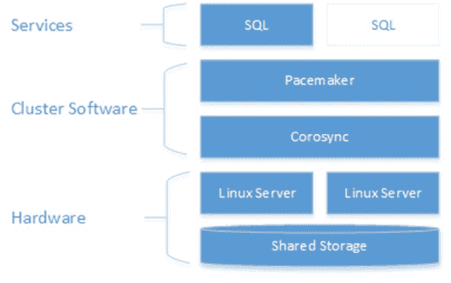

图 8-9. SQL Server on Linux 的`FCI`软件与硬件组件

进一步观察图 8-9，`Corosync`是 Linux 服务器或`节点`之间通信的框架，`Pacemaker`会使用它。为了让`Pacemaker`组件能够根据故障转移条件做出在节点间故障转移资源的决策，需要一个`资源代理`。资源代理类似于 WSFC 中使用的资源 DLL，用于执行故障转移的健康检查，以协调 Windows 上的 SQL Server `FCI`。Linux 的 SQL Server 资源代理随`mssql-server-ha`软件包一起安装。

### 注意

`SQL Server`资源代理现在已在 GitHub 上作为开源项目提供：[`github.com/Microsoft/mssql-server-ha`](https://github.com/Microsoft/mssql-server-ha)。由于我们的资源代理是开源的，其他供应商可以构建与`Linux`上的`SQL Server`协同工作的`HADR`解决方案，以提供高可用性功能，作为`Pacemaker`的替代方案。其中一个例子是`HPE Serviceguard`。你可以在[`www.hpe.com/us/en/product-catalog/detail/pip.hpe-serviceguard-for-linux.376220.html`](https://www.hpe.com/us/en/product-catalog/detail/pip.hpe-serviceguard-for-linux.376220.html)阅读更多关于`HPE Serviceguard`的信息。

关于`Always On FCI`的详细文档参考可以在这里找到：[`docs.microsoft.com/sql/linux/sql-server-linux-ha-basics#pacemaker-for-always-on-availability-groups-and-failover-cluster-instances-on-linux`](https://docs.microsoft.com/sql/linux/sql-server-linux-ha-basics#pacemaker-for-always-on-availability-groups-and-failover-cluster-instances-on-linux)。


### 第 8 章：SQL Server 的高可用性与灾难恢复

[`docs.microsoft.com/sql/linux/sql-server-linux-ha-basics#pacemaker-for-always-on-availability-groups-and-failover-cluster-instances-on-linux`](https://docs.microsoft.com/sql/linux/sql-server-linux-ha-basics#pacemaker-for-always-on-availability-groups-and-failover-cluster-instances-on-linux)

SQL Server 在 Linux 上的故障转移群集实例（FCI）与 Windows 上的版本有一些你需要了解的差异：

*   由于 Windows 上的 SQL Server 支持在同一服务器（节点）上运行多个实例，客户的一个常见配置是在集群中跨一系列节点（通常超过两个节点）部署多个 SQL FCI。Linux 上的 SQL Server 仅支持在单个服务器上运行一个实例。并且 Pacemaker 仅支持在一个集群中使用 16 个节点。因此，你最多只能在跨节点的 FCI 中部署 16 个 SQL Server 实例。
*   虚拟 IP 地址的工作方式略有不同，并且像 `dm_os_cluster_nodes` 和 `dm_os_cluster_properties` 这样的动态管理视图（DMV）在 Linux 上的 SQL Server 中不起作用。你会为 FCI 分配一个 IP 地址和名称，但其工作方式与 Windows 上略有不同，如我之前引用的文档所述，其中描述了如何进行设置。
*   你需要手动将服务主加密密钥从主节点复制到所有节点，因为 SQL Server 在每个节点上以名为 `mssql` 的本地用户身份运行。
*   Windows 上的 SQL Server FCI 支持将 `tempdb` 数据库存放在本地磁盘（例如快速的 SSD 磁盘）上。这在 Linux 上的 SQL Server 中不被支持。所有系统数据库必须位于 `/var/opt/mssql/data` 目录中，该目录将位于 FCI 的共享存储上。
*   Pacemaker 集群有一个称为 `fencing` 或 STONITH（“Shoot the Other Node in the Head”）的概念。你不得不佩服 Linux！这个概念对于生产环境中的 Pacemaker 集群是必需的，它是集群管理行为异常的节点、防止影响整个集群的方式（因此称为 fencing，意为隔离节点）。Windows 故障转移群集没有这个概念。我将在关于 Always On 可用性组的部分再次提到 STONITH。

> **注意：** 在撰写本书时，`stonith` 在 Hyper-V 或 Azure 虚拟机上不受支持。你可以禁用它，但没有它，Pacemaker 就不会得到官方支持。Microsoft 预计将来会解决此问题，因此请持续关注文档更新。

## 设置与配置

虽然在 Linux 上设置 SQL Server 的体验确实胜过 Windows，但坦率地说，在 Linux 上为 SQL Server 设置 FCI 颇具挑战性。Windows 故障转移群集提供了图形化向导、验证工具和流程。Linux 上的体验完全由命令行驱动，涉及多个不同的步骤，并且容易出错。

在 Linux 上设置 SQL Server FCI 的整体流程概述如下：

*   至少在两台服务器（节点）上设置和配置你的 Linux 服务器。指定哪些节点将成为 `主节点` 和 `辅助节点`。
*   在每个节点上安装 Linux 版 SQL Server，并根据 Linux 发行版安装特定的高可用性“附加组件”。
*   在主节点上创建你的用户数据库。
*   在每个节点上准备 SQL Server：
    *   在辅助节点上停止并禁用 SQL Server（`systemctl` 有 `disable` 选项）。
    *   在主节点上创建一个新的 SQL Server 登录名，并通过将此登录名置于 `sysadmin` 角色中来授予其执行系统存储过程 `sp_server_diagnostics` 的权限。
    *   在主节点上停止并禁用 SQL Server。
*   确保每个节点具有唯一的计算机名，并将所有节点及其 IP 地址和名称添加到所有节点的 `/etc/hosts` 文件中。
*   配置供所有节点使用的共享存储，然后将数据库（包括系统数据库）从主节点移动到共享存储。生产场景中的共享存储通常是……


## 第 8 章 SQL Server 的高可用性与灾难恢复

SQL Server 支持以下共享存储协议：

*   iSCSI: `https://docs.microsoft.com/sql/linux/sql-server-linux-shared-disk-cluster-configure-iscsi`
*   NFS: `https://docs.microsoft.com/sql/linux/sql-server-linux-shared-disk-cluster-configure-nfs`
*   SMB: `https://docs.microsoft.com/sql/linux/sql-server-linux-shared-disk-cluster-configure-smb`

*   在所有节点上安装并配置 Pacemaker。这包括向 Pacemaker 提供有关你先前创建的 SQL Server 登录名的信息。
*   在所有节点上安装 SQL Server 资源代理。SQL Server 资源代理利用系统存储过程 `sp_server_diagnostics` 来做出故障转移决策。我将在下一节讨论 `sp_server_diagnostics`。
*   为存储（你的共享存储）和网络在资源组中创建 FCI 资源。在此过程中，你将创建一个 FCI IP 地址，该地址可作为 FCI 的一部分用于连接到 SQL Server，而不是使用节点 IP 地址。
*   使用该资源组创建 FCI 资源。
*   使 FCI 联机。
*   现在，你应该能够通过 FCI IP 地址连接到 SQL Server。你可以手动故障转移 SQL Server 以确保连接正常工作。Pacemaker 提供了手动故障转移的功能，如我们的文档 `https://docs.microsoft.com/sql/linux/sql-server-linux-shared-disk-cluster-operate` 中所示。

这不太像提纲；更像是一本书，对吧？每个步骤都在 `https://docs.microsoft.com/sql/linux/sql-server-linux-shared-disk-cluster-configure` 中有详细记录。Windows 上的 SQL Server 故障转移群集步骤几乎同样多，但有工具可以加速此过程并帮助验证细节。

归根结底，还是要回到本节开头提到的主题。Linux 上的 SQL Server FCI 非常稳健，就像在 Windows 上一样，为 Linux 提供了一个出色的实例级高可用性解决方案。只是需要更仔细的准备和更多的时间来进行设置和配置。

**注意** 在安装和配置之后，可以向 `SQL Server FCI` 添加或从中移除节点。有关 RHEL 的步骤，请参阅我们的文档 `https://docs.microsoft.com/sql/linux/sql-server-linux-shared-disk-cluster-red-hat-7-operate#add-a-node-to-a-cluster`。

### sp_server_diagnostics 与故障转移

SQL FCI 的主要目的之一是在 SQL Server 实例或承载该实例的节点出现问题时，尽可能保持 SQL Server 实例的高可用性。那么，Pacemaker（或就此而言 WSFC）如何理解何时应该发生针对 SQL Server 的故障转移呢？我在本章前面描述的资源代理概念定义了该协议。


而 SQL Server 资源代理（很像 Windows 中的资源 DLL）通过使用系统存储过程 `sp_server_diagnostics` 来实现这一点。这个系统过程是另一个 `特殊` 系统存储过程的例子，因为其源代码并非 T-SQL，而是内置于引擎中的 C++ 代码。使用此系统存储过程的妙处在于，SQL Server 引擎可以包含关于引擎自身的健康检查（而不仅仅是实例是否在运行），以帮助为故障转移做出决策。`sp_server_diagnostics` 是我们为引擎开发的最酷的功能之一。例如，即使未使用 Always On 技术，`sp_server_diagnostics` 也能生成可供用户使用的运行状况状态信息。我将在第 9 章讨论如何实现这一点。

## 灵活的故障转移策略

`sp_server_diagnostics` 与故障转移协同工作的架构被称为 `灵活故障转移策略`。其概念是存在从最高级别（级别 1 = SQL Server “已关闭”）到最低级别（级别 5 = “查询处理”不健康但 SQL 可能仍在运行）的故障转移决策层级。完整的故障转移策略列表及其配置方法可在 [`docs.microsoft.com/sql/sql-server/failover-clusters/windows/failover-policy-for-failover-cluster-instances`](https://docs.microsoft.com/sql/sql-server/failover-clusters/windows/failover-policy-for-failover-cluster-instances) 找到。`sp_server_diagnostics` 生成的关于 SQL Server 运行状况的信息与这些策略相符。`sp_server_diagnostics` 提供的运行状况信息的详细记录在 [`docs.microsoft.com/sql/relational-databases/system-stored-procedures/sp-server-diagnostics-transact-sql`](https://docs.microsoft.com/sql/relational-databases/system-stored-procedures/sp-server-diagnostics-transact-sql)。

由于 Linux 上的 SQL Server 与 Pacemaker 的耦合度不如 Windows 上与 WSFC 的耦合度那么紧密；因此并非所有策略都适用，并且配置它们的方法也有所不同。

让我解释一下每种策略（这些策略也适用于 Always On 可用性组）。策略 `编号` 越低，做出集群故障转移决定所需检查的粒度就越粗。随着编号增加，每项策略都包含其之前的所有策略。

**1** – `SERVER_UNRESPONSIVE_OR_DOWN`：如果 SQL Server 实例无响应（无法建立连接）或已关闭（进程未运行），则触发故障转移。

**3** – 策略 1 + `SERVER_CRITICAL_ERROR`：如果 `sp_server_diagnostics` 检测到 `关键系统` 错误，则触发故障转移。**这是默认策略。** 关键系统错误包括诸如长时间运行的自旋锁争用问题和无法调度的调度器问题等情况。

**4** – 策略 1, 3 + `SERVER_MODERATE_ERROR`：如果 `sp_server_diagnostics` 检测到 `资源` 错误，则触发故障转移。资源错误是指诸如 SQL Server 可用内存极低（由引擎管理的内存）等情况。

**5** – 策略 1, 3, 4 + `SERVER_ANY_QUALIFIED_ERROR`：如果 `sp_server_diagnostics` 检测到 `query_processing` 错误，则触发故障转移。`query_processing` 错误是指妨碍基本查询处理的情况，例如工作线程耗尽。

再次说明，每种策略都建立在之前策略的基础之上，因此策略 5 包含了所有 `sp_server_diagnostics` 错误。注意，这里没有列出策略 2。策略 2 仅存在于 Windows 架构中，因为它与资源 DLL 的工作方式有关。对于许多用户来说，默认的 `policy=3` 就足够了。我认为除某些特定场景外，没有太多理由使用策略 1，除非……


策略 3 会导致不期望的故障转移发生。值得研究使用策略 4 或 5，因为存在 SQL Server 正在运行但使用默认策略不会发生故障转移的情况，但运行应用程序时存在相当严重的问题（例如工作线程耗尽），因此会出现 SQL Server “宕机”的表象。在这些情况下，故障转移可能会释放问题并使 SQL Server 具有更高的可用性。

`提示` `sp_server_diagnostics` 维护一个健康信息的日志（扩展事件文件），这对于调查故障转移（或未发生故障转移）的原因非常有用。该文件与错误日志文件保存在同一个 “log” 目录中（默认为 `/var/opt/mssql/log`）。

Pacemaker 的灵活故障转移策略称为 `monitoring policies`（监控策略），并通过一个名为 `pcs` 的程序进行配置（`pcs` 在我概述的设置和配置 SQL FCI 的步骤中使用）。如前所述，默认策略是 3。以下是一个将策略配置为 1 的示例命令：

```
pcs resource update <fci_resource_name> meta monitor_policy=1
```

当 Pacemaker 决定进行故障转移时，它使用一个称为 `quorum`（仲裁）的概念来判断集群是否健康以及应故障转移到哪个节点（除非你手动将其故障转移到特定节点）。其核心思想是超过一半的节点必须保持健康才能维持集群的存活（尽管存在一种方法可以让仅两个节点的集群保持存活）。你可以在 [`access.redhat.com/documentation/en-us/red_hat_enterprise_linux/7/html/high_availability_add-on_overview/ch-operation-haao`](https://access.redhat.com/documentation/en-us/red_hat_enterprise_linux/7/html/high_availability_add-on_overview/ch-operation-haao) 阅读更多关于 Pacemaker 和仲裁的信息。（阅读此文档可能需要 Red Hat 订阅）。

## 第 8 章   SQL Server 的高可用性与灾难恢复

作为仲裁概念的一部分，Pacemaker（使用 Corosync）有一种方法来确保节点不会访问相同的共享资源，以避免数据损坏（尽管对于 SQL Server 数据库和日志文件来说，这永远不会成为问题，因为 SQL Server 在主机扩展中使用建议性锁定，因此两个 SQL Server 进程无法同时打开相同的数据库和/或日志文件。你可以在 [`www.quora.com/Linux-What-is-the-difference-between-advisory-lock-and-mandatory-lock`](https://www.quora.com/Linux-What-is-the-difference-between-advisory-lock-and-mandatory-lock) 阅读更多关于建议性锁定的信息）。正如本章前面提到的，保持集群健康的方法称为隔离（fencing）。而实现隔离的组件称为 STONITH。STONITH 可以将节点从集群中移除，以确保两个节点不会访问相同的共享资源，或者如果无法保证这一点，则可以停止整个集群。可以配置 STONITH 通过电源控制来实际关闭计算机。如果你熟悉 WSFC，你应该研读一下 Linux 上 Pacemaker 的仲裁和隔离是如何工作的。

以下是我发现的其他有助于进一步理解 Pacemaker 和 Corosync 的优质资源：

-   [`www.juliosblog.com/pacemaker-101-2/`](http://www.juliosblog.com/pacemaker-101-2/)
-   [`access.redhat.com/documentation/en-us/red_hat_enterprise_linux/7/html/high_availability_add-on_overview/s1-pacemakeroverview-haao`](https://access.redhat.com/documentation/en-us/red_hat_enterprise_linux/7/html/high_availability_add-on_overview/s1-pacemakeroverview-haao)


[s1-pacemakeroverview-haao](https://access.redhat.com/documentation/en-us/red_hat_enterprise_linux/7/html/high_availability_add-on_overview/s1-pacemakeroverview-haao)

#### Always On 可用性组

虽然 `Always On FCI` 是保护 SQL Server 实例高可用性的一项出色技术，但这种方法有两个缺点：

*   存储成为故障转移的中心点，因此您需要另一个解决方案（可能是硬件）来防止数据存储中断。
*   集群中的其他 SQL Server 实例不能被主动使用，因为一次只有一个 SQL Server 可以访问共享存储上的数据库。

### 第 8 章 SQL Server 的高可用性与灾难恢复

SQL Server 提供了另一项功能作为替代方案，称为 **Always On 可用性组**。在本章的剩余部分，我将经常使用 **AG(s)** 这个术语来指代 Always On 可用性组。`AG` 在数据库级别提供容错能力和高可用性，并提供对数据的更广泛访问。在本章的这一部分，我将讨论该技术的工作原理，并为您提供关于如何设置、配置和测试 `AG` 的详细演练。

我还将讨论 `AG` 的其他方面，包括数据库运行状况检测、性能注意事项、如何在其他节点上读取数据、自动修复功能以及不需要集群软件的新功能。对于那些在 Windows 上使用过 SQL Server `AG` 的用户来说，核心功能是相同的，但在 Linux 上存在一些配置、设置以及少数行为差异。在本章的剩余部分，我将尽力区分这些差异。

##### 工作原理

`AG` 的旅程始于 SQL Server 2005 中一项名为 `数据库镜像` 的功能。在 SQL Server 2012 中，我们对原始架构进行了一些相当重大的修订，并推出了 Always On 系列，包括 `FCI` 和 `可用性组`（我们之前就有 `FCI`，但没有称之为 Always On）。

与 `数据库镜像` 类似，`AG` 不需要共享存储架构，而是跟踪事务日志中的更改，并将这些更改传输到其他 SQL Server 实例。

一个 `AG` 由一个或多个数据库组成，这些数据库被复制到一个或多个 SQL Server，并且是一个故障转移单元。事务开始的原始 SQL Server 称为 **主副本**。接收更改的 SQL Server 称为 **辅助副本**。您将会看到，对于 Linux 上的 SQL Server，当 `AG` 引入集群时，需要第三种类型的副本，称为 **配置副本**。

事实证明，支持 `AG` 的所有软件组件都在 SQL Server 本身之中。为了支持 `AG` 自动故障转移的概念，需要用到集群软件。对于 Windows，该软件是 `WSFC`。对于 Linux 上的 SQL Server，类似于前一节描述的 `FCI`，使用的是 `Pacemaker` 软件栈。

我们的文档提供了一个非常好的可视化展示，向您说明 SQL Server 的各个部分如何支持 `AG` 中副本的基本原理。请参考图 8-10。

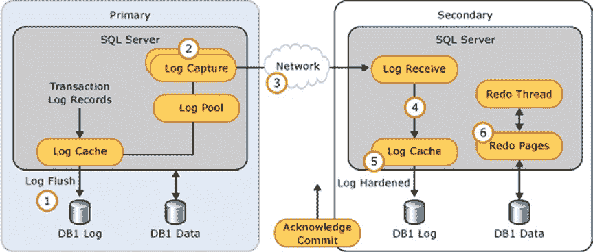

### 第 8 章 SQL Server 的高可用性与灾难恢复

**图 8-10** Always On 可用性组的架构和数据同步流程

如图所示，SQL Server 会在主副本上捕获事务日志更改，并通过一个独立的通信通道（称为 `数据库镜像端点`）将这些更改传输到辅助副本。在辅助副本上，更改首先被固化到本地事务日志，然后单独应用任何必要的重做恢复操作。`AG` 的一大优势在于，因为它不是共享存储解决方案，所以可以连接到辅助副本，并且在更改应用重做恢复后可以读取数据。您可以读取


## 同步选项

AG 为辅助副本提供了两种同步选项，也称为 *可用性模式*：

- **同步 (sync)**： (`AVAILABILITY_MODE = SYNCHRONOUS_COMMIT`) 事务在主副本上等待，直到该事务在主副本上提交，并且与该事务关联的日志记录在辅助副本上被固化。
- **异步 (async)**： (`AVAILABILITY_MODE = ASYNCHRONOUS_COMMIT`) 事务在主副本上提交时，会等待事务在主副本上提交，但不会等待事务在辅助副本上被固化。

创建 AG 时，你为特定的辅助副本选择特定的可用性模式。这意味着一个 AG 可以有多个副本以及多种副本组合，包括同步和异步。可用性模式的选择完全取决于你的 RPO 需求。使用同步副本旨在实现几乎零数据丢失，因为副本将与主副本事务日志中所做的更改保持同步。使用同步复制的代价是传输日志记录更改并在辅助副本的事务日志上固化它们所需的时间。异步副本最适用于不需要最新更改但仍希望读取接近主副本的辅助副本数据的应用程序。异步副本的另一个用途是灾难恢复场景，其中副本位于具有延迟的网络上，使其不适合作为同步副本候选。

与 AG 的可用性模式密切相关的是 *故障转移模式*。我将在本章的下一节讨论这一点。

## 集群与可用性组

AG 本身提供了使副本与主副本的更改保持同步的机制。然而，要使 AG *高度可用*，需要智能判断主副本是否不可用以切换到辅助副本。这种智能由类似 FCI 的集群软件提供。就像 FCI 一样，对于 Linux 上的 SQL Server，使用 Pacemaker 软件堆栈来提供集群故障转移功能。

创建 AG 并指定同步副本时，你还可以选择选项 `FAILOVER_MODE=AUTOMATIC`。选择此选项后，SQL Server 与 Pacemaker 可以决定故障转移到辅助副本，前提是该副本*已完全同步*主副本事务日志上当前的所有更改。在这里，“同步”意味着主副本上所有已提交的事务都已在辅助副本的事务日志上固化。然后，如果需要发生故障转移，则在辅助副本上运行恢复，以使所有事务保持一致，这样辅助副本现在就可以作为主副本服务。当集群软件与 SQL Server 资源代理决定故障转移到辅助副本时，该副本将成为新的主副本。

在 SQL Server 2017 之前，如果辅助同步副本脱机或未与主副本同步，SQL Server 会允许事务在主副本上继续，但 SQL Server 不允许发生自动故障转移，因为...


辅助副本可能未处于同步状态。动态管理视图 `sys.dm_hadr_database_replica_states` 可用于确定可用性组（AG）的当前同步状态，相关文档详见 [`docs.microsoft.com/sql/relational-databases/system-dynamic-management-views/sys-dm-hadr-database-replica-states-transact-sql`](https://docs.microsoft.com/sql/relational-databases/system-dynamic-management-views/sys-dm-hadr-database-replica-states-transact-sql)。

Linux 上的 SQL Server 与 Windows 故障转移群集的集成程度并不相同，因此确保自动故障转移的策略和逻辑可能略有差异。从 SQL Server 2017 CU1 开始，SQL Server 引入了一种名为 `配置副本` 的新副本类型，它用于在仅配置了一个主副本和一个同步辅助副本时，帮助做出决策以提供高可用性和数据保护。重要的是要知道，配置副本可以是 SQL Server Express 版本，这是 SQL Server 的一个免费许可证版本。此外，SQL Server 2017 引入了一个名为 `REQUIRED_SYNCHRONIZED_SECONDARIES_TO_COMMIT` 的新 AG 选项。对于 Linux 上的 SQL Server，此选项在您为 AG 配置 Pacemaker 群集时建立。它决定了需要多少个副本来确保正确的数据保护和高可用性。对于 Linux 上的 SQL Server，此设置在为 AG 设置群集时会自动配置，但可以使用 Pacemaker 命令覆盖。

**注意**：此选项在 Windows 上的 SQL Server 2017 的 AG 中同样存在，但默认值为 0，即我之前描述的 SQL Server 2017 之前的行为。这种行为意味着，即使配置的辅助副本不可用，主副本上的事务也会继续，但不允许自动故障转移。您可以将此值设置为 > 0，以强制主副本上的事务等待，直到一个或多个辅助副本可用且同步。

您可以在 [`docs.microsoft.com/sql/linux/sql-server-linux-availability-group-ha`](https://docs.microsoft.com/sql/linux/sql-server-linux-availability-group-ha) 阅读更多关于如何配置此选项或高可用性和数据保护所需的各种配置组合的信息。对于许多用户来说，一个非常常见的设置是：一个主副本、一个同步副本和一个配置副本（可能还有几个异步副本，它们不参与高可用性和数据保护要求的计算）。这可以提供一个良好的、具有成本效益的高可用性和数据保护选项。但是，如果辅助副本脱机，默认行为很像 SQL Server 2017 之前：主副本继续运行，但无法进行自动故障转移。如果您在此配置中将 `REQUIRED_SYNCHRONIZED_SECONDARIES_TO_COMMIT` 更改为 1，它提供了最佳的数据保护选项，但不是最大的高可用性。在此场景中，主副本上的事务将等待辅助副本同步。此外，在发生自动故障转移到辅助副本的情况下，新的主副本必须等待新的辅助副本联机并同步。一个可用性更高的数据保护方案是：一个主副本和两个同步辅助副本。

群集决策的完成方式类似于 FCI（故障转移群集实例），使用 `sp_server_diagnostics` 和我在本章前一节描述的灵活故障转移策略。我将在本章后面讨论另一个称为数据库运行状况检测的故障转移逻辑选项。

我工程团队的同事 Sourabh Agarwal 向我提供了关于 Linux 上 SQL Server AG 的一些其他提示，这些提示与 Windows 上的 SQL Server 不同：


### 第 8 章：SQL Server 的高可用性与灾难恢复

## 分布式可用性组

SQL Server 可用性组（AG）提供了一个独特的概念：分布式可用性组。分布式可用性组是一种特殊类型的可用性组，它横跨两个可用性组。请参考图 8-11，该图可在 Microsoft 文档中找到：[`docs.microsoft.com/sql/database-engine/availability-groups/windows/distributed-availability-groups#understand-distributed-availability-groups`](https://docs.microsoft.com/sql/database-engine/availability-groups/windows/distributed-availability-groups#understand-distributed-availability-groups)。

其概念是，可用性组 `AG1` 的辅助副本和可用性组 `AG2` 的主副本都从 `AG1` 的主副本接收更新。分布式可用性组为多站点远程配置（例如在远程地点设有数据中心的组织）提供了 AG 功能。有关在不同场景下使用分布式可用性组的更多信息，请查看我们的文档：[`docs.microsoft.com/sql/database-engine/availability-groups/windows/distributed-availability-groups#distributed-availability-group-usage-scenarios`](https://docs.microsoft.com/sql/database-engine/availability-groups/windows/distributed-availability-groups#distributed-availability-group-usage-scenarios)。

## 设置与配置

设置用于高可用性和数据保护的可用性组，其高层步骤如下（请参阅文档：[`docs.microsoft.com/sql/linux/sql-server-linux-availability-group-configure-ha`](https://docs.microsoft.com/sql/linux/sql-server-linux-availability-group-configure-ha)）。

*   与 Windows 上不同，您无法在安装了 FCI 的 SQL Server 实例上设置 AG。这是我们未来可能考虑支持的一个选项，但对于 SQL Server 2017 尚不支持。
*   由于 `STONITH` 和隔离机制的工作方式，您不应将异步副本包含在 `Pacemaker` 集群中。我将在本章后面部分向您展示如何将 AG 副本添加到集群中。请勿将异步副本添加到集群，因为当 `STONITH` 启用时，集群会遇到问题。这不会影响集群操作，因为您无法自动故障转移到异步副本。
*   集群的大多数操作无法通过 `T-SQL` 完成，例如手动故障转移操作。您必须使用 `Pacemaker` 命令，我将在本章后面部分向您展示如何操作。此规则的一个例外是 `强制故障转移`。对于这种情况，您将使用 `T-SQL`，这在我们的文档中有描述：[`docs.microsoft.com/sql/linux/sql-server-linux-availability-group-failover-ha`](https://docs.microsoft.com/sql/linux/sql-server-linux-availability-group-failover-ha)。

1.  在每个 `节点` 上安装 Linux 和 Linux 版 SQL Server，这些节点将...


参与 AG*副本集*（一个参与 AG 的节点）。在 Linux 上，为确保数据保护和高可用性所需的最少副本数量为三：一个主副本、一个辅助副本和一个配置副本。
1.  跨这些 SQL Server 副本创建并配置 AG。
2.  使用 Pacemaker 创建集群。
3.  将 AG 作为资源添加到集群中。

根据您环境的副本架构，有几种选择。确保高可用性所需的最少副本数量是三个，但同样，其中一个是配置副本。

让我们通过一个示例更详细地了解其工作原理和外观。我需要事先说明，完成此示例需要遵循许多步骤。

**注意** 为简化这些步骤，在本示例中请以 `sa` 或其他 `sysadmin` 登录身份连接并运行所有 `t-sql` 语句。您可以使用您喜欢的 `SQL Server` 工具来运行这些语句。我在 `linux` 服务器上使用了 `sqlcmd`。

## 安装 Linux 和 SQL Server
1.  我在 Azure 上安装了三台 RHEL 7.5 的虚拟机：`bwsqllinuxag1`、`bwsqllinuxag2`和`sqllinuxcfgag`（为了节省成本，我将这台虚拟机配置为仅两个 CPU）。我将所有这些虚拟机都放在 Azure 资源组 `bwsqllinuxags` 中，因此它们自动属于同一个虚拟网络（`vnet`）。我将称每台服务器为*节点*和*副本*。`bwsqllinuxag1` 是主副本，`bwsqllinuxag2` 是辅助副本，`sqllinuxcfgag` 是配置副本。
    *   我在所有这些服务器上打开了 22 端口，以便可以从我的笔记本电脑使用 `ssh` 客户端。
    *   运行 `sudo yum -y update` 以将所有软件包更新至最新。
    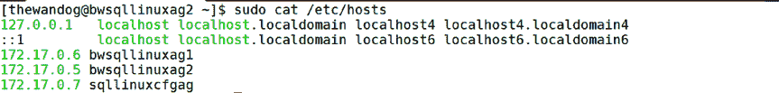
    *   在每台服务器上配置 hosts 文件（注意：确保 Linux 服务器在 `/etc/hostname` 中有一个有效的主机名，而不是 `localhost`），使其包含每台服务器的所有 IP 地址和主机名。对于我的 Azure 虚拟机，由于它们都在 Azure 的同一个虚拟网络中，因此这是每台虚拟机的私有 IP。我的 `/etc/hosts` 文件在每台服务器上如图 8-12 所示。
    ***图 8-12.** `/etc/hosts` 文件示例*
2.  安装 SQL Server。由于我的服务器使用的是 RHEL，我遵循了我在第 2 章中记录的步骤。您也可以在文档 [`docs.microsoft.com/sql/linux/quickstart-install-connect-red-hat`](https://docs.microsoft.com/sql/linux/quickstart-install-connect-red-hat) 中找到这些说明。请确保安装 SQL Server，打开防火墙端口，并安装 Linux 的命令行工具。`bwsqllinuxag1` 和 `bwsqllinuxag2` 都运行企业版，而 `sqllinuxcfgag` 使用的是 `SQL Express Edition`。

## 跨这些 SQL Servers 副本创建并配置 AG
**注意** 可以使用 `SQL Server Management Studio (ssMs)` 执行本节中的部分步骤。了解更多请访问 [`docs.microsoft.com/sql/linux/sql-server-linux-create-availability-group#create-the-availability-group`](https://docs.microsoft.com/sql/linux/sql-server-linux-create-availability-group#create-the-availability-group)。我将向您展示使用所有 bash shell 脚本和 `t-sql` 的完整步骤。
1.  在每台节点上，使用以下从 bash shell 运行的命令为 Linux 上的 SQL Server 启用 AG，如示例脚本 **enableag.sh** 所示（请记住，您必须先执行 `chmod u+x` 才能执行 `.sh` 脚本）：
    ```
    sudo /opt/mssql/bin/mssql-conf set hadr.hadrenabled 1
    sudo systemctl restart mssql-server
    ```


# SQL Server 的高可用性与灾难恢复

2. 存在一个扩展事件会话来跟踪 AG（可用性组）状态。使用以下 T-SQL 语句（可在示例脚本 `enableagxe.sql` 中找到）在每个节点上启动此会话：

```sql
ALTER EVENT SESSION AlwaysOn_health ON SERVER WITH (STARTUP_STATE=ON);
GO
```

3. 使用以下 T-SQL 语句（可在 `dbmloginuser.sql` 中找到）为数据库镜像端点**在每个副本上**创建登录名和用户：

```sql
CREATE LOGIN dbm_login WITH PASSWORD = 'Sql2017isfast'
GO

CREATE USER dbm_user FOR LOGIN dbm_login
GO
```

4. 在第[7]章中，你已经了解了 SQL Server 中的主密钥和证书，这些知识即将派上用场。正如本节开头所述，AG 通过*数据库镜像端点*进行通信。这些端点上的身份验证在 SQL Server 中使用证书来实现。因此，第一步是使用以下 T-SQL 语句（可在示例脚本 `primaryagcert.sql` 中找到）在**主副本**上（在我的场景中是 `sqllinuxag1`）创建一个证书（替换为你自己的密码）：

```sql
CREATE MASTER KEY ENCRYPTION BY PASSWORD = 'Sql2017isfast'
GO

CREATE CERTIFICATE dbm_certificate WITH SUBJECT = 'dbm'
GO

BACKUP CERTIFICATE dbm_certificate
TO FILE = '/var/opt/mssql/data/dbm_certificate.cer'
WITH PRIVATE KEY (
    FILE = '/var/opt/mssql/data/dbm_certificate.pvk',
    ENCRYPTION BY PASSWORD = 'Sql2017isfast'
)
GO
```

5. 如果成功，此命令不会返回任何结果。现在，你已在主节点副本上创建了一个证书文件 (`dbm_certificate.cer`) 和一个私钥文件 (`dbm_certificate.pvk`)。你需要将这些文件复制到所有节点上的相同位置 (`/var/opt/mssql/data`)。使用由相同密钥保护的相同证书，允许所有节点通过通信端点相互进行身份验证。首先，使用如下命令（可在示例脚本 `copycertkeys.sh` 中找到）将文件复制到为 Azure VM 创建的 Linux 用户的主目录：

```bash
sudo scp /var/opt/mssql/data/dbm_certificate.cer thewandog@bwsqllinuxag2:
sudo scp /var/opt/mssql/data/dbm_certificate.pvk thewandog@bwsqllinuxag2:
```

系统将提示你输入密码以复制这些文件。此示例将文件从主副本复制到辅助副本。**请执行相同的操作，但将目标服务器替换为配置副本所在主机的名称**。现在，这些文件应存在于其他副本节点的主目录中。

6. 现在需要将这些文件移动到每个副本节点上的 `/var/opt/mssql/data` 目录，并将权限更改为 `mssql:mssql`，如下列 shell 脚本所示（可在示例 `movecertkeys.sh` 中找到）。**此脚本应在辅助副本和配置副本节点的 bash shell 中运行**。

```bash
sudo mv dbm_certificate.cer /var/opt/mssql/data
sudo chown mssql:mssql /var/opt/mssql/data/dbm_certificate.cer
sudo mv dbm_certificate.pvk /var/opt/mssql/data
sudo chown mssql:mssql /var/opt/mssql/data/dbm_certificate.pvk
```

7. 现在，你将使用以下 T-SQL 语句（可在 `secondaryagcert.sql` 中找到）在**辅助**节点和**配置**节点上创建密钥和证书，这些语句引用了复制到每个节点的文件。请注意，对于这些语句，我是从从主副本复制过来的文件创建证书，但使用 `DECRYPTION` 关键字来解密供 SQL Server 使用的证书。

```sql
CREATE MASTER KEY ENCRYPTION BY PASSWORD = 'Sql2017isfast'
GO

CREATE CERTIFICATE dbm_certificate
AUTHORIZATION dbm_user
FROM FILE = '/var/opt/mssql/data/dbm_certificate.cer'
WITH PRIVATE KEY (
    FILE = '/var/opt/mssql/data/dbm_certificate.pvk',
    DECRYPTION BY PASSWORD = 'Sql2017isfast'
)
GO
```

8. 现在，你需要创建一个用于通信的端点。AG 用于通信的端口与用于登录和 T-SQL 查询的标准 SQL Server 端口不同。正如我在前面的步骤中所说，


此端点被称为*数据库镜像端点*。请在主副本和辅助副本上使用 `endpoint.sql` 文件中提供的以下 T-SQL 语句。由于我们在此配置副本中使用的是 SQL Server Express 版本，我们需要一个略有不同的版本，我将在下一步中展示给你。你不必须使用端口 5022，但它是数据库镜像端点常用的端口。

```sql
CREATE ENDPOINT [Hadr_endpoint]
AS TCP (LISTENER_IP = (0.0.0.0), LISTENER_PORT = 5022)
FOR DATA_MIRRORING (
    ROLE = ALL,
    AUTHENTICATION = CERTIFICATE dbm_certificate,
    ENCRYPTION = REQUIRED ALGORITHM AES
)
GO
ALTER ENDPOINT [Hadr_endpoint] STATE = STARTED
GO
GRANT CONNECT ON ENDPOINT::[Hadr_endpoint] TO [dbm_login]
GO
```

## 第 8 章 SQL Server 的高可用性与灾难恢复

### 9. 如果配置副本使用的是 SQL Server Express 版本
那么 ROLE 值只能设置为 WITNESS。请使用示例脚本 `cfgendpoint.sql` 中提供的以下 T-SQL 语句：

```sql
CREATE ENDPOINT [Hadr_endpoint]
AS TCP (LISTENER_IP = (0.0.0.0), LISTENER_PORT = 5022)
FOR DATA_MIRRORING (
    ROLE = WITNESS,
    AUTHENTICATION = CERTIFICATE dbm_certificate,
    ENCRYPTION = REQUIRED ALGORITHM AES
)
GO
ALTER ENDPOINT [Hadr_endpoint] STATE = STARTED
GO
GRANT CONNECT ON ENDPOINT::[Hadr_endpoint] TO [dbm_login]
GO
```

### 10. 我们文档中有一条微妙的注释指出，为数据库镜像连接指定的端口需要在 Linux 的防火墙中开放。
我运行了以下命令来查看我各个节点上防火墙开放了哪些端口：

```bash
sudo firewall-cmd --list-ports
```

列出的唯一端口是 1433，这是用于 SQL Server 连接和查询的主要端口。因此，我从 bash shell 中运行了示例脚本 `dbmirrorfirewall.sh` 中的以下命令（确保 shell 脚本已使用 `chmod u+x dbmirrorfirewall.sh` 标记为可执行）：

```bash
sudo firewall-cmd --zone=public --add-port=5022/tcp --permanent
sudo firewall-cmd --reload
```

### 11. 现在是时候使用示例脚本 `createag.sql` 中的以下 T-SQL 语句来创建可用性组了。
此 T-SQL 脚本应在 `主副本`（在我的示例中为 `bwsqllinuxag1`）上运行：

```sql
CREATE AVAILABILITY GROUP [footballag]
WITH (CLUSTER_TYPE = EXTERNAL)
FOR REPLICA ON
N'bwsqllinuxag1' WITH (
    ENDPOINT_URL = N'tcp://bwsqllinuxag1:5022',
    AVAILABILITY_MODE = SYNCHRONOUS_COMMIT,
    FAILOVER_MODE = EXTERNAL,
    SEEDING_MODE = AUTOMATIC,
    SECONDARY_ROLE (ALLOW_CONNECTIONS = ALL)
),
N'bwsqllinuxag2' WITH (
    ENDPOINT_URL = N'tcp://bwsqllinuxag2:5022',
    AVAILABILITY_MODE = SYNCHRONOUS_COMMIT,
    FAILOVER_MODE = EXTERNAL,
    SEEDING_MODE = AUTOMATIC,
    SECONDARY_ROLE (ALLOW_CONNECTIONS = ALL)
),
N'sqllinuxcfgag' WITH (
    ENDPOINT_URL = N'tcp://sqllinuxcfgag:5022',
    AVAILABILITY_MODE = CONFIGURATION_ONLY
)
GO
ALTER AVAILABILITY GROUP [footballag] GRANT CREATE ANY DATABASE
GO
```

一旦你运行此命令，该可用性组就应该出现在主副本上的 `sys.availability_groups` 和 `sys.availability_replicas` 目录视图中。

你可能会注意到的一个问题是，即使辅助副本尚未准备好接受连接，主副本也会立即开始尝试连接它们。因此，你可能会在主副本的 ERRORLOG 中看到类似以下的消息：

在尝试建立到 ID 为 [D36B7503-2EFB-467C-AD8A-4CE2B9E63958] 的可用性副本 'bwsqllinuxag2' 的连接时发生超时。可能存在网络或防火墙问题，或者为副本提供的端点地址不是主机服务器实例的数据库镜像端点。

在尝试建立到 ID 为 [AC5F02C0-A481-4760-BA44-BF7E9FF83F9D] 的可用性副本 'sqllinuxcfgag' 的连接时发生超时。可能存在网络或防火墙问题，或者为副本提供的端点地址不是主机服务器实例的数据库镜像端点。


# 第 8 章 SQL Server 的高可用性与灾难恢复

主机服务器实例的端点。这并不意味着 `CREATE AVAILABILITY GROUP` 操作失败。它只是意味着辅助副本尚未设置。请按照下一步操作，您将看到具体方法。

## 12. 在辅助副本和配置副本上运行以下 T-SQL 语句来设置可用性组并配置副本，这些语句可在辅助副本和配置副本的 `joinag.sql` 文件中找到：

注意：配置副本上不允许使用 grant 语句，因此仅在配置副本上运行 `alter availability group` 语句。

```
ALTER AVAILABILITY GROUP [footballag] JOIN WITH (CLUSTER_TYPE = EXTERNAL)
GO
-- 请勿在配置副本上运行此语句
ALTER AVAILABILITY GROUP [footballag] GRANT CREATE ANY DATABASE
GO
```

当这些语句执行后，主副本、辅助副本和配置副本就“连接”起来了。您将在主副本的 ERRORLOG 中看到这些语句：

```
A connection for availability group 'footballag' from availability replica 'bwsqllinuxag1' with id  [B8438077-BA82-4AD1-A5B6-6601ECA82C9E] to 'bwsqllinuxag2' with id [D36B7503-2EFB-467C-AD8A-4CE2B9E63958] has been successfully established.  This is an informational message only. No user action is required.
```

```
A connection for availability group 'footballag' from availability replica 'bwsqllinuxag1' with id  [B8438077-BA82-4AD1-A5B6-6601ECA82C9E] to 'sqllinuxcfgag' with id [AC5F02C0-A481-4760-BA44-BF7E9FF83F9D] has been successfully established.  This is an informational message only. No user action is required.
```

## 13. 即将大功告成！请记住，可用性组的定义是一个或多个数据库复制到另一个节点并作为一个故障转移单元。到目前为止，创建的只是三个知道如何相互通信的 SQL Server 实例。因此，第一步是为可用性组选择一个或多个数据库并创建完整数据库备份。连接到主副本运行以下 T-SQL 语句，这些语句可在示例 `dbag.sql` 中找到：

```
CREATE DATABASE [cowboysrule]
GO
ALTER DATABASE [cowboysrule] SET RECOVERY FULL
GO
BACKUP DATABASE [cowboysrule] TO DISISK = N'/var/opt/mssql/data/cowboysrule.bak'
GO
```

## 14. 现在，通过在主副本上运行以下 T-SQL 语句将数据库添加到可用性组，这些语句可在示例脚本 `dbjoinag.sql` 中找到：

```
ALTER AVAILABILITY GROUP [footballag] ADD DATABASE [cowboysrule]
GO
```

## 15. 因为我们在创建可用性组时使用了 `SEEDING_MODE = AUTOMATIC` 选项，SQL Server 将自动创建新数据库并将任何数据复制到辅助副本。您可以通过在辅助副本上运行以下 T-SQL 语句来查看这一点，这些语句可在示例脚本 `listdbs.sql` 中找到：

```
SELECT name FROM sys.databases
GO
```

如果一切顺利，`cowboysrule` 将出现在此列表中。并且因为我们之前在创建可用性组时使用了 `SECONDARY_ROLE` 选项，我们甚至可以在辅助副本上从 `cowboysrule` 数据库读取数据。

恭喜！您刚刚在 Linux 上的 SQL Server 创建并设置了一个 Always On 可用性组。还剩一件事要向您展示。在这种情况下，故障转移是如何工作的？如果您愿意，请继续阅读下一节，设置 Pacemaker 集群并将可用性组添加到集群中。

## 使用 Pacemaker 创建集群

注意：要继续完成此示例，您必须拥有 Red Hat 的订阅，因为高可用性附加组件是 Pacemaker 在生产环境中工作所必需的。

请按照我展示的步骤操作，为 RHEL 创建 Pacemaker 集群，相关文档位于 [`docs.microsoft.com/sql/linux/sql-server-linux-availability-group-cluster-rhel`](https://docs.microsoft.com/sql/linux/sql-server-linux-availability-group-cluster-rhel)。


# 第 8 章 SQL Server 的高可用性和灾难恢复

## 注意事项

注意：如我们的文档所述，生产环境中的 Pacemaker 集群需要 stonith，但在这些示例中我将禁用 stonith。这是因为目前 Azure 虚拟机不支持该功能（但在我撰写本章时，相关工作正在进行中！）

1.  **在每个节点上**，从 bash shell 运行以下命令，并输入您的订阅用户名和密码（对于您自己的 Linux 服务器，您可能已经完成此操作）：
    ```
    sudo subscription-manager register
    ```

2.  您的包含高可用性附加组件的订阅有一个关联的 poolid。您可以从 bash shell 使用以下命令找到该 poolid。该功能的名称是“Red Hat Enterprise Linux High Availability (for RHEL Server)”：
    ```
    sudo subscription-manager list --available
    ```

3.  使用 poolid，从 bash shell 在**每个节点上**运行以下命令以附加正确的订阅。出于隐私原因，我没有列出我的 poolid，但命令如下所示：
    ```
    sudo subscription-manager attach --pool=<pool id>
    ```

4.  现在启用仓库以便安装 Pacemaker，在所有节点上从 bash shell 运行以下命令：
    ```
    sudo subscription-manager repos --enable=rhel-ha-for-rhel-7-server-rpms
    ```

5.  Pacemaker 需要节点间通信，因此在所有节点上从 bash shell 运行以下命令以打开防火墙端口：
    ```
    sudo firewall-cmd --permanent --add-service=high-availability
    sudo firewall-cmd --reload
    ```

6.  现在使用以下命令在所有节点上安装 Pacemaker：
    ```
    sudo yum install pacemaker pcs fence-agents-all resource-agents
    ```

7.  Pacemaker 在 Linux 上安装了一个需要密码的用户。在所有节点上运行此命令以创建密码。请务必在所有节点上提供相同的密码：
    ```
    sudo passwd hacluster
    ```

8.  在所有节点上运行以下命令以启用并启动 Pacemaker 服务：
    ```
    sudo systemctl enable pcsd
    sudo systemctl start pcsd
    sudo systemctl enable pacemaker
    ```

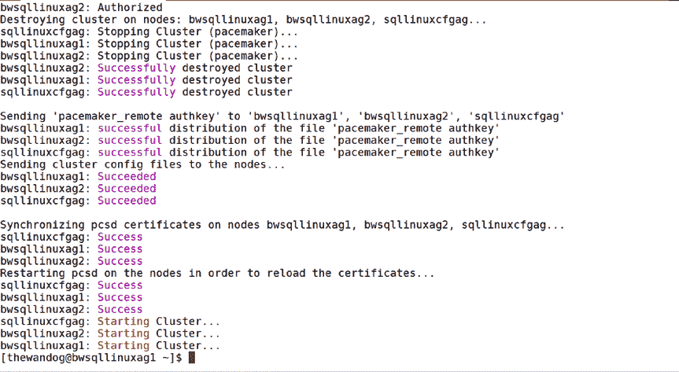

9.  现在是创建集群的时候了。运行如下所示的 bash shell 命令，但请使用您之前在示例中设置的节点以及您在第 7 步为 Pacemaker 设置的密码（您的密码位于脚本中的`-p`参数之后）。我提供了一个名为`createcluster.sh`的示例脚本，您可以将其作为模板使用。在此示例中，`footballcluster`是集群名称，但您可以输入自己的名称。您只需要在**主节点**上运行此命令：
    ```
    sudo pcs cluster auth bwsqllinuxag1 bwsqllinuxag2 sqllinuxcfgag -u hacluster -p Sql2017isfast
    sudo pcs cluster setup --name footballcluster bwsqllinuxag1 bwsqllinuxag2 sqllinuxcfgag
    sudo pcs cluster start --all
    ```

    运行此命令的输出应类似于图 8-13。

**图 8-13 在 Linux 上创建 Pacemaker 集群**

## 注意事项

注意：`pcs`（Pacemaker 配置系统）是一个用于与 Pacemaker 集群交互的命令行界面。请习惯使用它，因为它在许多场景中都很有用，并且在某些情况下会使用，就像在 Windows 上的 SQL Server 中使用 AG 的`T-SQL`一样。

10. 您可能还记得我在前面的章节中告诉过您，我们将 SQL Server 的安装过程分成了几个包。现在该安装另一个了。这个包是 SQL Server HA 资源代理，它被开发用于与 Pacemaker 交互，也是我在本章前面提到的内容。在所有节点上使用以下命令安装此代理：
    ```
    sudo yum install mssql-server-ha
    ```

11. 正如我之前提到的，目前 STONITH 在 Azure 虚拟机上不受支持，因此我将在主节点上使用以下命令将其禁用：


# 注意
`pcs`程序存在于所有集群上，但命令执行可以在节点中的任何集群上进行，因为`pcs`命令适用于整个集群。
```
sudo pcs property set stonith-enabled=false
```
# 第八章 SQL Server 的高可用性与灾难恢复
文档建议设置一些与故障转移超时和刷新检查间隔相关的 Pacemaker 属性。
我建议您遵循这些建议，从主节点上如示例脚本`clusterproperties.sh`所示，在 bash shell 中运行以下命令。这些建议及其背后的细节可以在以下网址找到：[`docs.microsoft.com/sql/linux/sql-server-linux-availability-group-cluster-rhel`](https://docs.microsoft.com/sql/linux/sql-server-linux-availability-group-cluster-rhel)。
```
sudo pcs property set cluster-recheck-interval=2min
sudo pcs property set start-failure-is-fatal=true
```
## 在集群中添加 AG 作为资源
我们已经在 SQL Server 中创建了 AG，并在所有节点上创建了 Pacemaker 集群。
为了将系统结合在一起，我们需要在集群中创建一个与 AG 关联的资源。

1.  我们需要一个用于 SQL Server 资源代理的 SQL Server 登录名。
    在**所有节点**上执行以下 T-SQL 语句，这些语句出自示例脚本`pacemakerlogin.sql`。此脚本还授予代理执行和访问适当 SQL Server 资源所需的最低权限：
    ```
    USE [master]
    GO
    CREATE LOGIN [pacemakerLogin] with PASSWORD= N'Sql2017isfast'
    GO
    GRANT ALTER, CONTROL, VIEW DEFINITION ON AVAILABILITY
    GROUP::footballag TO pacemakerLogin
    GO
    GRANT VIEW SERVER STATE TO pacemakerLogin
    GO
    ```
2.  资源代理需要知道要使用的登录名和密码。
    因此，您需要在**所有节点**上从 bash shell 执行以下命令，如示例`sqlrgagentlogin.sh`所示：
    ```
    echo 'pacemakerLogin' >> ~/pacemaker-passwd
    echo 'Sql2017isfast' >> ~/pacemaker-passwd
    sudo mv ~/pacemaker-passwd /var/opt/mssql/secrets/passwd
    sudo chown root:root /var/opt/mssql/secrets/passwd
    sudo chmod 400 /var/opt/mssql/secrets/passwd # Only readable by root
    ```
3.  在任何节点上从 bash shell 执行以下命令，使用与 SQL Server 中 AG 相同的名称在集群中创建 AG 资源：
    ```
    sudo pcs resource create ag_cluster ocf:mssql:ag ag_name=footballag meta failure-timeout=60s master notify=true
    ```
    > **注意** 在撰写本书时，文档版本使用的是`failure-timeout`为 30s，但文档前面又说要用 60s，所以我在创建资源时做了修改。
4.  Linux 上的 SQL Server 可用性组有一个称为侦听器的概念，因此您可以连接到虚拟 IP 地址，而不是每个节点的 IP 地址。这个概念与 SQL Server 和 Windows Server 故障转移集群集成。我们将在 Linux 上使用类似的概念，但虚拟 IP 是 Pacemaker 设计的一部分。因此，选择一个类似于您的 Azure VM 的 IP 地址，但不是物理 IP 地址。然后在 bash shell 中执行类似以下的命令：
    ```
    sudo pcs resource create virtualip ocf:heartbeat:IPaddr2 ip=172.17.0.100
    ```
    > **注意** SQL Server AG 支持侦听器的概念。侦听器将客户端应用程序与知晓主副本的物理名称或 IP 地址抽象开来。这非常强大，尤其是在故障转移场景中，当辅助副本成为新的主副本时。您可以在以下网址阅读有关 AG 侦听器的更多信息：[`docs.microsoft.com/sql/database-engine/availability-groups/windows/listeners-client-connectivity-application-failover#AGlisteners`](https://docs.microsoft.com/sql/database-engine/availability-groups/windows/listeners-client-connectivity-application-failover#AGlisteners)


第 8 章 SQL Server 的高可用性与灾难恢复
此外，您可以阅读更多关于 SQL Server on Linux 上 AG 监听器的内容，网址为：[`docs.microsoft.com/sql/linux/sql-server-linux-availability-group-overview#the-listener-under-linux`](https://docs.microsoft.com/sql/linux/sql-server-linux-availability-group-overview#the-listener-under-linux)。

现在，添加一个同址约束和一个排序约束，以确保主副本和虚拟 IP 在同一节点上运行。在任意节点的 bash shell 中运行以下命令：
```
sudo pcs constraint colocation add virtualip ag_cluster-master INFINITY with-rsc-role=Master
sudo pcs constraint order promote ag_cluster-master then start virtualip
```

至此，您已完成在 Linux 上的 SQL Server 中创建高可用的 Always On 可用性组的练习。不难，对吧？有没有更好的方法呢？答案是肯定的。它被称为 Ansible Playbook。这让我想起了大学四年级时，我们花了一整个学期在一门课程中为统计模拟模型构建一个 Fortran 程序。在我们提交完所有作业后，学期的最后一周，教授向我们展示了如何用一种叫做 GPSS 的语言在一天之内构建出相同的程序。我们当然都问他为什么？答案很简单。他想让我们理解创建统计模拟模型的内部原理，但也要明白要寻找更高效的方法来完成同样的任务。这是惨痛的教训。Ansible 的核心就在于此。我们提供了一个开源的 Ansible Playbook 来安装 SQL Server、Pacemaker 集群和 AG，地址为：[`github.com/Microsoft/sql-server-samples/tree/master/samples/features/high%20availability/Linux/Ansible%20Playbook`](https://github.com/Microsoft/sql-server-samples/tree/master/samples/features/high%20availability/Linux/Ansible%20Playbook)。

让我们来测试它
在本节中，我们将连接到 SQL Server，并测试我们刚刚完成的 AG 与集群的新设置。我想在这个新设置上运行两个测试：(1) 向主副本数据库添加一些数据，并观察它是否显示在辅助副本上；(2) 测试故障转移到辅助副本以及回切到主副本的过程。

测试数据复制
1.  连接到 `<虚拟 IP 地址>,1433`，运行示例 `createandinsert.sql` 中的以下 T-SQL 语句，以在主副本上创建表并插入数据：
    ```
    USE [cowboysrule]
    GO
    DROP TABLE IF EXISTS wewillwintheeast
    GO
    CREATE TABLE wewillwintheeast (col1 int)
    GO
    INSERT INTO wewillwintheeast VALUES (1)
    GO
    ```
    **注意** 与其他节点一样，您可以在 `/etc/hosts` 中添加一个条目，将字符串名称与虚拟 IP 地址关联起来，并使用该名称进行连接，而无需指定端口号。

2.  直接连接到辅助副本，运行示例脚本 `querysecondary.sql` 中的以下 T-SQL 语句，以证明您已连接到辅助服务器，并且前述更改已从主副本复制过来：
    ```
    SELECT @@SERVERNAME
    GO
    USE [cowboysrule]
    GO
    SELECT * FROM wewillwintheeast
    GO
    ```
    结果应显示您的辅助副本（我的是 `bwsqllinuxag2`）以及一行数据结果。

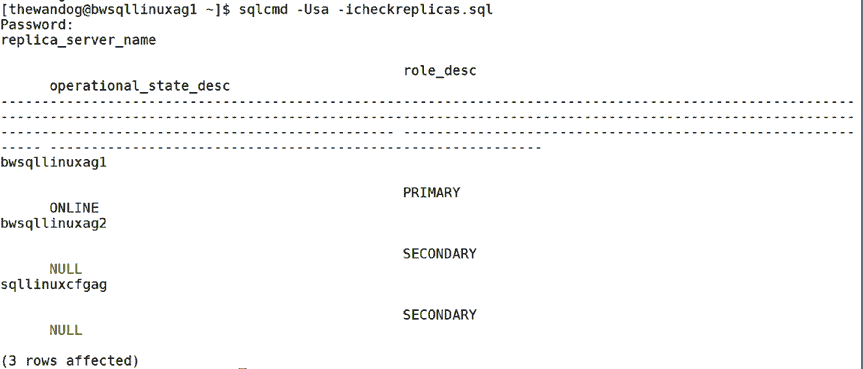

测试故障转移


# 手动故障转移与高可用性配置

确保主副本和辅助副本之间能够进行故障转移的最简单方法是执行一次 *手动故障转移*。

在 Windows 的 SQL Server 中，您可以使用 T-SQL 命令来手动故障转移带有可用性组（AG）的副本。然而，对于 Linux，您必须使用 Pacemaker 的 `pcs` 程序。您可以在我们的文档中详细了解如何在 Linux 上操作集群：[`docs.microsoft.com/sql/linux/sql-server-linux-availability-group-failover-ha`](https://docs.microsoft.com/sql/linux/sql-server-linux-availability-group-failover-ha)。让我们开始尝试吧。

1.  首先，我们需要一种从故障转移角度查看副本当前状态的方法。执行以下 T-SQL 语句（在示例脚本 `checkreplicas.sql` 中可以找到）：
    ```sql
    SELECT ar.replica_server_name, hars.role_desc,
           hars.operational_state_desc
    FROM sys.dm_hadr_availability_replica_states hars
    JOIN sys.availability_replicas ar
      ON hars.replica_id = ar.replica_id
    GO
    ```
    在我的环境中，结果如图 8-14 所示。

    **图 8-14.  SQL Server on Linux 上 AG 的副本状态**
    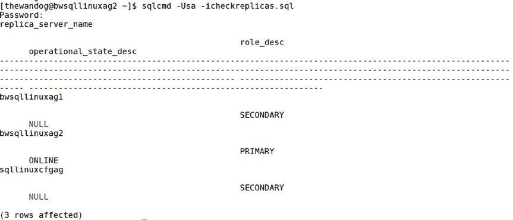

2.  现在是尝试使用 `pcs` 程序进行故障转移的时候了。在任意节点的 bash shell 中运行以下命令，并替换为您辅助节点的名称（我的是 `bwsqllinuxag2`）：
    ```bash
    sudo pcs resource move ag_cluster-master bwsqllinuxag2 --master
    ```

3.  文档中指出，Pacemaker 的特性是在执行手动故障转移后会添加一个位置约束，这可能导致问题，因此请在任意节点的 bash shell 中执行以下命令：
    ```bash
    sudo pcs constraint remove cli-prefer-ag_cluster-master
    ```

4.  为确保故障转移正常工作，请在辅助节点上执行相同的 `checkreplicas.sql` 脚本。在我的环境中，结果如图 8-15 所示。

    **图 8-15.  故障转移后的副本状态**
    

您现在可以看到，辅助副本已变为主副本，而原主副本变为了辅助副本。现在您可以重复上述步骤 2 和 3 来故障回复到主副本。使用与上面步骤 2 相同的 `pcs` 命令来移动资源，但这次填入主副本的名称（如下例所示，务必也要运行相同的命令来移除位置约束）：
```bash
sudo pcs resource move ag_cluster-master bwsqllinuxag1 --master
```

**注意**  我在自己的设置中注意到，故障回复到主副本似乎比故障转移到辅助副本花费的时间稍长，因此当您进行故障回复时，请给予更长的时间来检查状态。

恭喜！如果您已经做到这一步，那么您已经成功为 SQL Server on Linux 设置了一个高可用的 Always On 可用性组，并测试了其功能。为什么我称其为“高可用”？您将在本章末尾的一节中找到答案。让我们来看看 AG 的其他方面，以结束本章。

## 数据库运行状况检测

我在关于 FCI 的部分以及前面关于 AG 的部分中提到了如何使用 `sp_server_diagnostics` 和灵活的故障转移策略来检测故障转移的概念。您可能已经注意到，这些策略是在 SQL Server *实例* 级别设置的。在 AG 中使用实例级别逻辑的问题在于，AG 是数据库级别的故障转移。

因此，SQL Server 有一个称为 *数据库运行状况检测* 的概念。通过使用 `CREATE AVAILABILITY GROUP`（或 `ALTER`）中的一个选项 `DB_FAILOVER`，SQL Server 将监控数据库是否脱机并启动故障转移。默认值为 `OFF`，但我建议使用此选项以确保在数据库不可访问时发生故障转移。AG 中的所有数据库都作为此功能的一部分受到监控。

该功能有一些细微差别和限制，您可以在以下链接中阅读有关内容。


# Always On 可用性组的性能与使用

## 性能考量

关于在可用性组中使用同步副本，客户经常提出的一个问题是：针对主副本运行事务的应用程序性能是否会受到影响。答案是肯定的。但更重要的问题是：性能影响是否可以忽略不计，同时仍能实现高可用性的好处。对于后一个问题，答案绝对是肯定的。

**SQL Server 的高可用性与灾难恢复**

影响可用性组性能的三大主要因素是：

*   针对主副本运行的事务速率
*   事务在主副本和辅助副本的事务日志文件中被持久化的速度（磁盘 I/O 通常是最大的影响因素）
*   主副本和辅助副本之间的网络连接速度

您可以完全控制在磁盘上使用最快的硬件来处理事务日志，也可以控制副本之间网络设备的速度。

因此，最大的担忧可能来自于针对主副本的事务速率。我遇到过两种导致瓶颈的典型场景：

*   大量并发用户执行极高频率的微小单语句事务
*   大型索引的创建与重建

第一个问题可以通过将语句分组到逻辑事务中来缓解（这是一个独立于可用性组、有助于提升事务性能的良好实践）。

第二个问题更为棘手，可能需要您仔细规划索引创建和重建的时间表，使用分区以较小的块构建索引，并评估是否确实需要创建或重建索引。

请浏览我们文档的这一部分，了解监控可用性组性能以查找同步过程中可能存在的瓶颈的常见方法：[监控 Always On 可用性组的性能](https://docs.microsoft.com/sql/database-engine/availability-groups/windows/monitor-performance-for-always-on-availability-groups#BKMK_SCENARIOS)

您可以确信，微软一直在努力优化处理可用性组的代码。您可以在以下链接中阅读更多关于我们在 SQL Server 2016 中开始的性能优化工作：[SQL Server 2016 IT Just Runs Faster: Always On 可用性组性能提升](https://blogs.msdn.microsoft.com/sqlserverstorageengine/2016/09/26/sql-server-2016-it-just-runs-faster-always-on-availability-groups-turbocharged/)

## 可读副本

Always On 可用性组相对于故障转移群集实例的最大优势之一（除了不需要共享存储之外）在于，其辅助副本可以*被积极利用*。您可以从辅助副本读取数据，也可以在其上执行备份操作。


# 第 8 章 SQL Server 的高可用性与灾难恢复

辅助副本上的数据库，甚至可以执行诸如 `DBCC CHECKDB` 的完整性检查。此外，您可以配置客户端应用程序自动路由到可读的辅助副本，从而将工作负载从主副本卸载。

**注意** 可读辅助副本仅在 SQL Server 企业版中可用。标准版提供基本的可用性组，但不允许从辅助副本读取。您可以在 [`docs.microsoft.com/sql/database-engine/availability-groups/windows/basic-availability-groups-always-on-availability-groups`](https://docs.microsoft.com/sql/database-engine/availability-groups/windows/basic-availability-groups-always-on-availability-groups) 阅读更多关于基本可用性组的信息。

辅助副本上可供读取的数据仅基于已提交、已在辅助事务日志中固化并重做的事务。任何基于活动事务的数据都是不可用的。此外，如果将事务传输到辅助副本存在延迟（在异步副本中可能更常见），您尝试从辅助副本读取的数据可能会存在差异。

使用可读辅助副本时还有其他注意事项，包括统计信息的处理方式、可能的阻塞情况以及 SQL Server 上的整体资源消耗，这些都可能影响辅助副本重做性能。我建议您详细阅读 [`docs.microsoft.com/sql/database-engine/availability-groups/windows/active-secondaries-readable-secondary-replicas-always-on-availability-groups#bkmk_Performance`](https://docs.microsoft.com/sql/database-engine/availability-groups/windows/active-secondaries-readable-secondary-replicas-always-on-availability-groups#bkmk_Performance) 上的这些细节。

最后，自 SQL Server 2017 发布以来，我们已经能够确定一些有助于解决并行重做工作线程与可读辅助副本查询之间冲突的性能优化。请在 [`blogs.msdn.microsoft.com/sql_server_team/sql-server-20162017-availability-group-secondary-replica-redo-model-and-performance/`](https://blogs.msdn.microsoft.com/sql_server_team/sql-server-20162017-availability-group-secondary-replica-redo-model-and-performance/) 阅读更多相关信息，并务必关注最新的累积更新以获取更多增强功能。

## 自动页修复

可用性组（AG）的另一个巧妙功能和巨大优势在于，即使主副本上的某个页面损坏，辅助副本也可以保存有效的数据库页面。基于此，如果主副本上的某个数据库页面损坏，为什么不利用辅助副本上的完好页面呢？这正是 SQL Server 通过一个称为 **自动页修复** 的功能所提供的。

其工作原理如下。如果主副本检测到 AG 中某个数据库的数据库页面损坏（例如页面上的 `checksum` 错误），它将请求


## 自动页面修复

当与页面关联的日志记录在辅助副本上重做时，辅助副本会将有效的页面发送回主副本，主副本会将其恢复上线。此外，无需启用此功能。它与可用性组一起默认工作。好吧，你必须承认这非常酷！

如果辅助副本在重做过程中遇到损坏的页面，它可以向主副本请求该页面的有效副本。这是另一个有助于满足 SQL Server 的`RTO`和`RPO`需求的强大功能，并且它完全内置在 SQL Server 引擎中（不过，此功能仅在 SQL Server 企业版中可用）。

阅读更多关于自动页面修复的信息：[`docs.microsoft.com/sql/sql-server/failover-clusters/automatic-page-repair-availability-groups-database-mirroring`](https://docs.microsoft.com/sql/sql-server/failover-clusters/automatic-page-repair-availability-groups-database-mirroring)

## 无集群可用性组

在构建 SQL Server 2017 并为 Linux 上的 SQL Server 启用`AG`功能（使用新的`CLUSTER_TYPE=EXTERNAL`）时，我们意识到可以引入在没有集群组件的情况下使用`AG`的功能，无论是`WSFC`还是`Pacemaker`。

我们将这个新概念称为**无集群可用性组**。考虑我在本章前面介绍的架构图。所有软件组件都存在，用于将日志更改传送到副本，而无需任何集群软件。不同之处在于，没有集群软件时，`AG`不是高可用的，因为它没有自动故障转移功能。

但是，在某些场景下，您可能希望设置一个`AG`，因为您希望允许读取器工作负载（例如报告用户）访问一系列辅助副本，但您不需要`AG`是高可用的。我们在 SQL Server 2017 中将这个概念称为**读取扩展路由**。

此外，由于核心数据库引擎在`Windows`和`Linux`上是相同的代码，并且`AG`的核心软件组件就在引擎中，您可以跨`Windows`和`Linux`设置一个主副本和一组副本，从而实现跨平台的`AG`。

可以这样想。当您按照上一节中的示例设置`AG`时，一旦您创建了`AG`并加入了辅助副本，SQL Server 就准备将日志块传送到副本。如果您将`CREATE AVAILABILITY GROUP`语句更改为使用`CLUSTER_TYPE = NONE`，如下所示：

```sql
CREATE AVAILABILITY GROUP [footballag]
WITH (CLUSTER_TYPE = NONE)
FOR REPLICA ON
N'bwsqllinuxag1' WITH (
    ENDPOINT_URL = N'tcp://bwsqllinuxag1:5022',
    AVAILABILITY_MODE = SYNCHRONOUS_COMMIT,
    FAILOVER_MODE = EXTERNAL,
    SEEDING_MODE = AUTOMATIC,
    SECONDARY_ROLE (ALLOW_CONNECTIONS = ALL)
),
N'bwsqllinuxag2' WITH (
    ENDPOINT_URL = N'tcp://bwsqllinuxag2:5022',
    AVAILABILITY_MODE = SYNCHRONOUS_COMMIT,
    FAILOVER_MODE = EXTERNAL,
    SEEDING_MODE = AUTOMATIC,
    SECONDARY_ROLE (ALLOW_CONNECTIONS = ALL)
),
N'sqllinuxcfgag' WITH (
    ENDPOINT_URL = N'tcp://sqllinuxcfgag:5022',
    AVAILABILITY_MODE = CONFIGURATION_ONLY
)
GO

ALTER AVAILABILITY GROUP [footballag] GRANT CREATE ANY DATABASE
GO
```

您就是在创建一个无集群可用性组。就这么简单。

#### 总结

在本章中，我讨论了通过备份和恢复实现高可用性和恢复的基础知识，还讨论了更高级但强大的功能，以通过 Always On 故障转移群集实例和 Always On 可用性组满足您的`RTO`和`RPO`需求。高可用性的一个有趣角度是使用带有 Kubernetes 的 Docker 容器。我将在本书的最后一章讨论这一新功能。


# 第 9 章

## SQL Server 的管理与监控

接下来我们将进入下一章，讨论在 Linux 上监控和管理 SQL Server 的重要概念。

通过阅读本书的前八章，您已学习了在 Linux 上安装 SQL Server、部署数据库和应用程序所需的基础知识，并通过了解我们的工具、性能、安全性和高可用性的基本原理，为成功奠定了基础。

部署使用 SQL Server 的应用程序是一回事，但管理、维护和监控 SQL Server 的关键方面又是什么呢？这正是本章的主题。

公平地说，我在本书中已经涵盖了管理和监控的一些方面，包括关于工具、性能和高可用性的章节（当然，学习如何备份和还原数据库是管理 SQL Server 的一个关键方面）。

本章通过涵盖我之前未讨论过的主题——如何管理 SQL Server 实例、您的数据库以及数据库中的对象——来扩展这些知识。

在本章的第二部分，我将讨论监控 SQL Server，包括以下主题：

- 监控 SQL 性能
- 使用一个强大但鲜为人知的功能——系统运行状况会话——来监控 SQL Server 运行状况
- 学习一种监控事务日志备份的创新方法
- 我喜欢用于监控性能的 Linux 工具回顾
- 排查 SQL Server 问题的独特之处

© Bob Ward 2018

B. Ward, *Pro SQL Server on Linux*, `doi.org/10.1007/978-1-4842-4128-8_9`

第 9 章 SQL Server 的管理与监控

当您开始阅读有关 SQL Server 实例、数据库和对象的管理部分时，请务必记住我从 SQL Server 经验中学到的一个重要教训：*测试您的管理策略*。大多数开发人员会专注于测试应用程序，这对于成功部署至关重要，但通常我看到管理任务，比如重建索引，从未经过测试。在您最大的表上重建索引需要多长时间？除非您测试，否则不会知道。除了测试之外，对于对 SQL Server 实例配置、数据库、对象或 Linux 操作系统进行的任何更改，请务必有一个定义明确的*变更控制和审计流程*。根据我的经验，了解谁以及对生产 SQL Server 环境做了什么更改非常重要，尤其是在排查问题并试图回答不可避免的问题“发生了什么变更？”时。

我必须承认，编写本章让我感到很有趣，因为它包含了我在微软参与 SQL Server 项目的有趣历史，以及我与一些我所认识的最聪明的人进行的互动，共同构建了丰富的管理和监控 SQL Server 的功能。

#### 管理 SQL Server 实例

SQL Server 提供了丰富的功能，用于在部署后管理 SQL Server 实例，使用诸如 `mssql-conf`、T-SQL 语句 `ALTER SERVER CONFIGURATION` 以及系统存储过程 `sp_configure` 等工具。我们构建 SQL Server 的初衷是让您在安装后无需花费大量时间配置实例，但大多数生产环境都需要进行一些对其应用程序有意义的配置更改。我在本书前面的章节中已经讨论过这些功能和选项。为了完整性，我在本章此节中再次简要列出了这些功能。

此外，在本节中，我将花时间讨论本书目前尚未提及的 SQL Server 实例配置选项，包括：

- 创建 SQL Server 代理作业
- 使用资源调控器控制用户的资源使用
- 在紧急情况下使用专用管理员连接
- 在特殊场景下使用 `sqlservr` 命令行

## 更改服务器配置选项


# SQL Server 的管理与监控

## 更改 SQL Server 实例配置的方法

我在之前的章节中讨论过三种更改 SQL Server 实例默认配置的方法。我在此列出这个清单纯粹是为了复习，以确保你了解 SQL Server 实例配置有哪些选项：

### mssql-conf

`mssql-conf` 是一个 bash shell 脚本，用于配置那些无法通过 T-SQL 连接完成的选项。我在本书中已经展示过几个示例，但完整的选项列表可以在 [`docs.microsoft.com/sql/linux/sql-server-linux-configure-mssql-conf`](https://docs.microsoft.com/sql/linux/sql-server-linux-configure-mssql-conf) 找到。我建议你每次使用此功能时，都创建一个脚本并跟踪所有执行情况，以便进行变更控制。

### ALTER SERVER CONFIGURATION

`ALTER SERVER CONFIGURATION` 是一条 T-SQL 语句，用于进行实例级别的配置更改。我在过去的章节中向你展示过该语句的两个例子：`PROCESS AFFINITY` 和 `SOFTNUMA`。该语句的完整选项列表可以在 [`docs.microsoft.com/sql/t-sql/statements/alter-server-configuration-transact-sql`](https://docs.microsoft.com/sql/t-sql/statements/alter-server-configuration-transact-sql) 找到。

### sp_configure

`sp_configure` 是一个系统存储过程，用于修改各种类型的实例级别配置选项。我在之前的章节中向你展示过一些与性能、安全性和高可用性相关的更重要的选项。还有其他选项，但我认为到目前为止在书中涵盖的是最重要的。`sp_configure` 的完整选项列表可以在 [`docs.microsoft.com/sql/database-engine/configure-windows/server-configuration-options-sql-server`](https://docs.microsoft.com/sql/database-engine/configure-windows/server-configuration-options-sql-server) 找到。文档说明了某些配置选项需要重新启动 SQL Server。所有选项都需要执行 T-SQL 语句 `RECONFIGURE` 才能生效。

> **注意：** 我在之前的章节中还介绍了 `ALTER DATABASE SCOPED CONFIGURATION` T-SQL 语句，它允许你在数据库级别配置通常需要实例级别修改才能使用的选项。

## 创建 SQL Server 代理作业

SQL Server 代理是一项计划服务，在 Linux 上部署 SQL Server 时会一同安装。SQL Server 代理提供了创建*作业*的功能，然后可以使用不同的频率选项来安排作业的执行。作业通过一系列*作业步骤*执行。作业步骤定义了要在作业中执行的一组特定的 T-SQL 语句。

> **注意：** 在 SQL Server 2017 CU4 之前，SQL Server 代理需要一个单独的软件包。从 2017 CU4 开始，SQL Server 代理与 `mssql-server` 软件包捆绑在一起。此外，Linux 上的 SQL Server 仅提供包含一组 T-SQL 语句的作业步骤。Windows 上的 SQL Server 包含多个支持其他类型作业步骤的*子系统*。

能够使用 SQL Server 代理的第一步是启用此功能，方法是从 bash shell 运行以下命令，使用 `mssql-conf`：

```bash
sudo /opt/mssql/bin/mssql-conf set sqlagent.enabled true
sudo systemctl restart mssql-server
```

此时，你现在可以通过 T-SQL 系统存储过程（例如 `sp_add_job`）、使用 SQL Operations Studio 的扩展或使用 SQL Server Management Studio (SSMS) 来创建 SQL Server 代理作业。

我们的文档中有一个很好的示例，展示了如何通过 T-SQL 系统存储过程创建一个每日备份数据库的作业，网址是 [`docs.microsoft.com/sql/linux/sql-server-linux-run-sql-server-agent-job#create-a-job-with-transact-sql`](https://docs.microsoft.com/sql/linux/sql-server-linux-run-sql-server-agent-job#create-a-job-with-transact-sql)。

使用 SSMS 创建作业的示例可以在 [`docs.microsoft.com/sql/linux/sql-server-linux-run-sql-server-agent-job#create-a-job-with-ssms`](https://docs.microsoft.com/sql/linux/sql-server-linux-run-sql-server-agent-job#create-a-job-with-ssms) 看到。

图 9-1 显示了使用 SQL Operations Studio 中的 SQL 代理扩展创建新作业的示例。

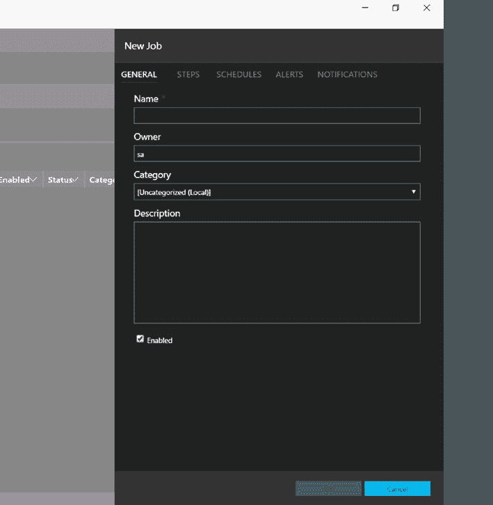

由于 SQL Server 代理支持可以执行任何 T-SQL 语句或在系列步骤中执行语句集的作业，因此你可以使用 SQL Server 代理来执行任何你想要按计划或临时运行的任务。

Linux 用户可能更喜欢使用 `cron` 系统 ([`en.wikipedia.org/wiki/Cron`](https://en.wikipedia.org/wiki/Cron)) 来安排命令，这些命令可以使用像 `sqlcmd` 这样的程序来执行 T-SQL 命令。我的建议是，如果你只需要为任何应用程序需求或任务运行 T-SQL 语句，请使用 SQL Server 代理。如果你需要将其他 Linux 命令或 shell 脚本与 T-SQL 脚本一起作为一个单元来运行，我会使用 `cron`。

## 使用资源调控器

可能存在一些场景，你希望控制与 SQL Server 相关的应用程序的用户和查询在 CPU、内存和 I/O 方面的资源。SQL Server 提供了一个名为*资源调控器*的功能来控制这些资源。资源调控器由以下对象组成：

### 资源池

资源池定义了在物理资源（如 CPU、内存和 I/O）上指定的约束。SQL Server 安装时附带两个池：
1.  `internal`，用于 SQL Server 的后台和系统任务以及工作线程。
2.  `default`，这是一个预定义的池，用于用户任务，如果未创建用户定义的池，则它是“默认”池。

你可以通过 T-SQL 创建自己的用户定义资源池。你可以在 [`docs.microsoft.com/sql/relational-databases/resource-governor/resource-governor-resource-pool`](https://docs.microsoft.com/sql/relational-databases/resource-governor/resource-governor-resource-pool) 阅读更多关于资源池的信息。

> **注意：** 你可以更改默认池的设置，但不能更改内部池的设置。

以下是你可以配置的资源池的一些属性：
- `CAP_CPU_PERCENT`：与此池关联的工作组用户（稍后描述）的 CPU 利用率将受到限制，适用于任何 SQL Server 工作线程的使用。
- `MAX_MEMORY_PERCENT`：与此池关联的工作组用户，在与查询执行相关的内存授予（哈希、排序等）方面将受到限制。此设置不影响为缓冲池或任何其他缓存分配的内存。
- `AFFINITY`：这是一个有趣的设置。使用此设置可以将 NUMA 节点和 CPU 的亲和性定向到与此池关联的任何工作组用户


# 第九章：管理与监控 SQL Server

通过此池，可以将特定应用程序限定在指定的节点或 CPU 上运行。这是一种极佳的技术，用于将特定应用程序定向到特定的 NUMA 节点或 CPU 上运行。相较于服务器配置选项，这也是一种更精细的"亲和性"设置方法（资源组亲和性在 SQL Server 实例亲和性的约束范围内运行）。

## MAX_IOPS_PER_VOLUME
此设置控制与此池关联的工作负载组用户，针对每个唯一的磁盘卷，每秒可执行的最大物理 IO 操作数。唯一的磁盘卷是指基于数据库文件的唯一物理磁盘。这个设置最大的"坑"在于，它仅适用于在`用户任务`上下文中执行的任何 I/O 操作。这意味着在后台任务（日志写入器、恢复写入器、检查点等）上下文中执行的任何 I/O 操作都不会遵守此设置（并且你无法更改它们所属的内部池设置）。

资源池也支持 CPU、内存和 I/O 的"最小值"设置。如果你开始调整最小值和最大值设置，情况可能会变得有点复杂。我们的文档提供了一个很好的表格，描述了有效的设置，以备你决定这样做。更多信息请阅读：[`docs.microsoft.com/sql/relational-databases/resource-governor/resource-governor-resource-pool`](https://docs.microsoft.com/sql/relational-databases/resource-governor/resource-governor-resource-pool)。

## 工作负载组
工作负载组是分配到资源池的用户任务的容器。工作负载组是一种将一组用户分组以限制资源使用的方法。默认安装有两个工作负载组，`internal`和`default`，它们分别映射到同名的相应资源池。你可以通过`T-SQL`创建自己的工作负载组。如果你不创建用户定义的工作负载组，所有登录都将映射到默认工作负载组（该组又映射到默认资源池）。关于工作负载组的更多信息请阅读：[`docs.microsoft.com/sql/relational-databases/resource-governor/resource-governor-workload-group`](https://docs.microsoft.com/sql/relational-databases/resource-governor/resource-governor-workload-group)。

工作负载组允许你在比其关联资源池更精细的级别上指定设置。例如，你可以配置`REQUEST_MAX_MEMORY_GRANT_PERCENT`来指定工作负载组用户的最大内存授予量。此设置在已为资源池建立的最大值范围内应用。

**注意**，我们的一位顶级开发人员 Jay Choe 对内存授予有很好的描述：[`blogs.msdn.microsoft.com/sqlqueryprocessing/2010/02/16/understanding-sql-server-memory-grant`](https://blogs.msdn.microsoft.com/sqlqueryprocessing/2010/02/16/understanding-sql-server-memory-grant)。

工作负载组的一个独特设置是`MAXDOP`。我在前面的章节中讨论过并行查询执行，以及如何通过`sp_configure`、`ALTER DATABASE`甚至查询提示来配置应用于查询计划运算符的最大工作线程数。工作负载组允许你为组中的所有用户指定一个`MAXDOP`设置。结合使用这些`MAXDOP`设置可能会让人感到困惑。以下是关于`MAXDOP`优先级应用顺序的指导原则：

```
• 作为查询提示的 MAX_DOP 会得到遵循，前提是它不超过工作负载组的 MAX_DOP。
```


**MAX_DOP** 优先级

*   `MAX_DOP` 作为查询提示，始终会覆盖 `sp_configure 'max degree of parallelism'`。
*   数据库作用域的 `MAXDOP` 会覆盖（除非设置为 0）由 `sp_configure` 在服务器级别设置的最大并行度。查询提示仍然可以覆盖数据库作用域的 `MAXDOP`，以便对需要不同设置的特定查询进行调优。所有这些设置都受为工作负载组设置的 `MAXDOP` 限制。
*   工作负载组 `MAX_DOP` 覆盖 `sp_configure 'max degree of parallelism'`。
*   如果查询在编译时被标记为串行（`MAXDOP = 1`），则无论工作负载组或 `sp_configure` 设置如何，在运行时都无法更改回并行。

工作负载组的完整设置列表请参阅文档：[`docs.microsoft.com/sql/t-sql/statements/alter-workload-group-transact-sql#arguments`](https://docs.microsoft.com/sql/t-sql/statements/alter-workload-group-transact-sql#arguments)。

**分类函数**

分类器函数是一种 T-SQL 函数，用于将登录绑定到用户定义的工作负载组。你构建一个具有已知模板的 T-SQL 函数，并将特定登录（或登录组）分配给工作负载组。这使得 SQL Server 能够知道如何将资源限制映射到特定工作负载组和资源池的登录。你可以在 [`docs.microsoft.com/sql/relational-databases/resource-governor/resource-governor-classifier-function`](https://docs.microsoft.com/sql/relational-databases/resource-governor/resource-governor-classifier-function) 阅读更多关于分类器函数的信息。

我在 GitHub 上发现了我的同事 Travis Wright 构建的这个简单但易于使用的演示：[`github.com/twright-msft/mssql-test-scripts/blob/master/Administration/resource-governor.sql`](https://github.com/twright-msft/mssql-test-scripts/blob/master/Administration/resource-governor.sql)，用于展示如何将资源调控器用于 I/O 的基础知识。

**注意**：Linux 有一个与资源调控器类似的操作系统概念，用于控制进程的资源，称为 Linux 控制组（`cgroups`）。`cgroups` 独立于 SQL Server，但由于 SQL Server 是一个 Linux 进程，当使用 `cgroups` 来控制 SQL Server 资源（如 CPU 或 I/O）时，SQL Server 应该能够运行。你可以在 [`man7.org/linux/man-pages/man7/cgroups.7.html`](http://man7.org/linux/man-pages/man7/cgroups.7.html) 阅读更多关于 `cgroups` 的信息。

技术上，默认和内部池的资源调控器是无需用户干预即可启用的。但是，如果你希望对默认池的修改生效，或者要创建自己的池和工作负载组，则必须使用以下 T-SQL 语句为这些新配置启用资源调控器：

```sql
ALTER RESOURCE GOVERNOR RECONFIGURE;
GO
```

**使用专用管理员连接**

多年前，在 SQL Server 2005 之前，我在微软技术支持部门工作时，偶尔会遇到客户遇到严重问题，其中 SQL Server 似乎已挂起（不允许任何连接或查询）。大约在这个时期，我支持部门的同事 Robert Dorr 和 Keith Elmore 总会就如何排查复杂问题提出一些令人惊叹的创新想法。事实上，我们三人一起在德克萨斯州欧文市的微软园区午餐后散步时，产生了一些最好的点子。

第 9 章 管理和监控 SQL Server


（注：我们这一传统延续了多年，从 20 世纪 90 年代中期一直保持至今。由于我们三人现在分属不同的团队，这类事情如今已很少发生了。）

其中有一天，Robert Dorr 正在和我们讨论另一起客户事件，其中 SQL Server 似乎卡住了。他说：“肯定有更好的方法来诊断这类问题。” 果然，这次讨论促成了对 ERRORLOG 中在出现此类状况时可能记录的错误的“可支持性”改进（请参阅 Robert 在 [`blogs.msdn.microsoft.com/psssql/2008/03/28/how-it-works-non-yielding-resource-monitor/`](https://blogs.msdn.microsoft.com/psssql/2008/03/28/how-it-works-non-yielding-resource-monitor/) 发布的一篇旧博文）。

在这次讨论中，我们三人一致认为，如果 SQL Server 引擎无法接受新的登录或查询，为什么我们不能有一个特殊的*专用的*连接到 SQL Server 呢？这个连接功能有限，但可用于连接到 SQL Server 以进行调查，甚至可能修复 SQL Server 挂起的问题。就这样，SQL Server 2005 中诞生了一项名为“专用管理员连接”（DAC）的功能。

# SQL Server 的管理与监控

## 专用管理员连接（DAC）

SQL Server 为 DAC 提供了一个独立的 TCP 端口（`1434`），并在一个不同的 SQLOS 调度器上运行。因此，如果 SQL Server 由于调度器或标准端口问题而无法响应新请求，或许仍可以通过 DAC 连接，至少可以运行针对动态管理视图（DMV）的查询，以便在重启 SQL Server 之前找出问题的可能原因。此外，甚至可能找到原因并解决问题，无需重启。稍后我将举一个例子。

首先，让我们看看如何连接 DAC。在 Linux 服务器的 bash shell 中使用 `sqlcmd` 运行以下命令：

```
sqlcmd -Usa -Sadmin:localhost
```

请注意，服务器名称的语法使用了 `admin:` 前缀。

**注意** Windows 上的 `sqlcmd` 支持 `-a` 选项，该选项强制使用 DAC，但这在 Linux 上不受支持。不过，你可以在任何 SQL Server 工具上使用 `admin:` 前缀，包括 `sqlcmd`、SQL Operations Studio 和 SSMS。

现在你进入了 `sqlcmd` 编辑器，但如何确定操作成功并且你已经通过 DAC 连接了呢？

运行以下 T-SQL 语句，这些语句可以在示例脚本 `amidac.sql` 中找到：

```sql
-- 我的会话 ID 是什么？
SELECT @@spid
go

-- 列出当前连接、其端点和端口
SELECT dec.session_id, e.name, dec.local_tcp_port
FROM sys.dm_exec_connections dec
JOIN sys.endpoints e
ON e.endpoint_id = dec.endpoint_id
GO
```

我从 bash shell 使用以下命令运行了此脚本：

```
sqlcmd -Usa -Sadmin:localhost -iamidac.sql
```

结果应类似于以下内容：

```
(1 rows affected)
session_id  name                              local_tcp_port
----------- -------------------------------- --------------
51          Dedicated Admin Connection        1434

(1 rows affected)
```

注意那个巧妙的服务器变量 `@@SPID`，它可用于查明你当前的会话 ID。然后你可以在连接列表中找到你的会话（在此示例中，它是唯一的连接）。我在“始终启用可用性组”一章中向你介绍了端点的概念。DAC 有自己的端点，它是自动创建的，通常托管在端口 `1434` 上。你可以看到此会话正在使用该端口。

一次只允许有一个活动的 DAC 连接（因此称为“专用”）。你也可以远程使用 DAC 连接。我个人认为，如果你觉得需要使用 DAC，应该通过 `ssh` 会话在本地使用它。我这样说是因为，如果你的 Linux 服务器存在远程连接问题，你将无法确定 SQL Server 连接问题是由于网络连接问题，还是服务器本身的问题（而且如果你无法获得 `ssh` 会话，那可能存在比 SQL Server 更大的问题）。

关于 DAC，还有另一个鲜为人知的秘密。我在前一章提到过...


# 使用 DAC 和直接访问系统表

默认情况下，虽然用户可以看到系统表列表，但无法直接读取这些表的内容。您应当使用系统目录视图。

尝试使用 DAC（专用管理员连接）和非 DAC 连接执行以下 T-SQL 语句：

```sql
USE master
GO
SELECT * FROM sys.sysschobjs
GO
```

`sys.sysschobjs` 是支持 `sys.objects` 等目录视图的系统表之一。

如果您在未使用 DAC 的情况下运行此查询，会收到以下错误：

```
Msg 208, Level 16, State 1, Server bwsql2017rhel, Line 1
Invalid object name 'sys.sysschobjs'.
```

然而，如果使用 DAC，您将能够直接读取任何系统表。这是一个巧妙的方法，但老实说，在生产环境中我不认为您有太多必要这样做。它对于学习 SQL Server 内部原理可能很有趣，但我们并未发布系统表的模式定义。

> **提示**：您可以通过 `sys.system_sql_modules` 检查系统目录视图的文本，以了解系统表的工作原理。

您不能通过 DAC 随意执行任何操作。我们设计 DAC 是为了在紧急情况下，让您能够可靠地连接到 SQL Server 并执行关键但最小的操作集。何时应该使用 DAC？我建议仅在您甚至无法通过 Linux 服务器上的本地 `sqlcmd` 连接到 SQL Server 时才使用 DAC。一旦连接成功，可以查询 DMV（动态管理视图）如 `dm_exec_requests`，以获取有关正在运行的连接和查询的基本情况。

使用 DAC 可能解决以下问题场景：

1.  工作线程数已达到最大值。
2.  所有工作线程都被一个主导阻塞进程（lead blocker）阻塞。
3.  该主导阻塞进程不释放其资源。例如，您可能有一个会话启动了事务，运行了获取锁的查询，但从未提交。所有工作线程都可能被阻塞，等待此事务和会话完成。
4.  由于所有工作线程都处于忙碌状态，SQL Server 无法处理任何新的连接或查询，因为没有可用的工作线程。
5.  然而，您可以通过 DAC 连接，并使用 T-SQL `KILL` 语句终止主导阻塞进程，从而释放所有被阻塞的工作线程。T-SQL `KILL` 语句需要比通常更高的权限，这理所当然。您可以在[此处](https://docs.microsoft.com/sql/t-sql/language-elements/kill-transact-sql)阅读更多关于 T-SQL `KILL` 语句以及何时可能适合用于您服务器的场景的信息。

您可以在[此处](https://docs.microsoft.com/sql/database-engine/configure-windows/diagnostic-connection-for-database-administrators)阅读更多关于 DAC 的信息，包括其限制以及如何远程连接。

# sqlservr 命令行选项

在第 8 章中，我简要介绍了一种使用 `sqlservr` 程序的命令行选项来重建系统数据库的技术。您通常使用 `systemctl` 启动 SQL Server，但 `sqlservr` 是一个可以直接从 shell 启动的程序。并且有一系列主要未文档化的命令行选项可以与 `sqlservr` 一起使用。您可以通过在 bash shell 中运行以下命令来查看列表（如果 SQL Server 正在运行，请务必先停止它）：

```bash
sudo -u mssql /opt/mssql/bin/sqlservr --help
```

您的结果应类似如下：

```
usage: sqlservr [OPTIONS...]

Configuration options:

-T<#>                  Enable a traceflag
-y<#>                  Enable dump when server encounters specified error
-k<#>                  Checkpoint speed (in MB/sec)

Administrative options:

--accept-eula          Accept the SQL Server EULA
```


### 第 9 章：管理与监控 SQL Server

## 命令行选项

*   `--pid <pid>` - 设置服务器产品密钥。
*   `--reset-sa-password` - 重置系统管理员密码。密码应在 `SQLSERVR_SA_PASSWORD` 环境变量中指定。
*   `-f` - 最小配置模式。
*   `-m` - 单用户管理模式。
*   `-K` - 强制重新生成服务主密钥。
*   `--setup` - 设置基本配置设置然后关机。
*   `--force-setup` - 与 `--setup` 相同，但也会重新初始化 `master` 和 `model` 数据库。

## 常规选项

*   `-v` - 显示程序版本。
*   `--help` - 显示此帮助信息。

许多选项的功能也可以通过其他已记录的方法完成。例如，用于设置跟踪标志的 `-T` 可以通过 `mssql-conf` 实现。

有两个选项值得特别指出，它们可用于故障排除和紧急情况：

## `-m`：单用户模式

使用 `-m` 选项启动 SQL Server 时，只有单个用户可以连接到 SQL Server。

`-m` 的一个常见用途是需要还原 `master` 数据库的场景。你必须先以 `-m` 模式启动 SQL Server 才能还原 `master`。一个更有趣、更高级、坦率地说也更危险的场景是修改系统表或访问 `mssqlsystemresource` 数据库。如果你以 `-m` 模式启动 SQL Server 并使用 DAC（专用管理员连接）连接到 SQL Server，你将被授予直接修改系统表的权限。在我们发布 SQL Server 2005 之前，计划是完全锁定对系统表的任何访问。作为技术支持人员，我知道总会有些场景我们需要这种能力。妥协的结果是通过 DAC 提供对系统表的读取访问，以及通过 `-m` 和 DAC 提供修改访问。事实证明，多年来确实有几次在紧急情况下我需要这个能力。

但是要小心！一旦你修改了系统表，SQL Server 会在数据库结构中标记一个比特位，因此每当你打开数据库时，`ERRORLOG` 中都会记录一条警告，说明数据库系统表已被直接修改。此时你完全处于不受支持的状态。然而，微软可能让你这样做来规避某些关键问题，并且他们可以帮助你恢复到受支持的状态。

以下是从 bash shell 以单用户模式启动 SQL Server 的命令示例：
```bash
sudo -u mssql /opt/mssql/bin/sqlservr -m
```

单用户模式的一个问题是所谓的“连接竞赛”。当你以单用户模式启动 SQL Server 时，第一个连接的系统管理员“获胜”。因此，你可以使用 `-m` 参数后的一个选项来限制谁可以通过应用程序名称连接。以下是一个示例，限制只有使用程序 `sqlcmd` 的系统管理员用户才能连接：
```bash
sudo -u mssql /opt/mssql/bin/sqlservr -m"SQLCMD"
```

请参阅我们的文档以获取有关以单用户模式启动 SQL Server 的更多信息：[`docs.microsoft.com/sql/database-engine/configure-windows/start-sql-server-in-single-user-mode`](https://docs.microsoft.com/sql/database-engine/configure-windows/start-sql-server-in-single-user-mode)。

## `-f`：最小配置模式

此选项指示 SQL Server 以最小配置模式启动。最小配置模式包括单用户模式，此外还限制其他 SQL Server 功能或以最小方法配置 SQL Server。例如，如果你进行了阻止 SQL Server 运行或启动的服务器配置更改，SQL Server 将使用默认的服务器配置信息来启动服务器。

我能想到的这个选项的最佳示例是服务器配置选项 `max server memory`。如果你将此值设置得太低，在某些情况下，SQL Server 可能没有足够的内存来允许连接或正常启动。以最小配置模式启动 SQL Server……


# 第 9 章 管理与监控 SQL Server

配置模式会将 `max server memory` 设置为其默认值，允许您连接并将其更改为正确的值。您可以在 [`docs.microsoft.com/sql/database-engine/configure-windows/start-sql-server-with-minimal-configuration`](https://docs.microsoft.com/sql/database-engine/configure-windows/start-sql-server-with-minimal-configuration) 阅读更多关于以最小配置模式启动 SQL Server 的信息。

**注意：** SQL Server 容器直接使用 `sqlservr` 程序运行 SQL Server。

#### 管理数据库

部署数据库后，在某些时候您将需要执行一些数据库管理工作，无论是数据库级别还是文件级别的更改。在本节中，我将回顾这些关键主题，包括移动数据库、管理文件、分离和附加数据库、重要的 `ALTER DATABASE` 场景，以及一个非常有趣的关于修复数据库的讨论（我想您会喜欢这个包含数据库状态和校验和内部原理的部分）。

## 移动数据库

在创建数据库并使其在生产环境中运行后，您可能需要执行的一项常见操作是将数据库和事务日志文件移动到新的目录或新的磁盘上。您可能需要移动文件的原因有多种，例如磁盘维护或磁盘升级场景。移动一个或多个文件的一种常用方法如下：

1.  通过执行以下 T-SQL 语句将数据库更改为离线状态
    ```sql
    ALTER DATABASE <dbname> SET OFFLINE
    ```
    这展示了在不关闭 SQL Server 的情况下控制数据库状态的能力。

2.  将 Linux 服务器上要移动的文件移至您指定的目标目录或磁盘。

3.  告知 SQL Server 文件的新位置。对于每个移动的文件，运行以下 T-SQL 语句：
    ```sql
    ALTER DATABASE <dbname> MODIFY FILE ( NAME = logical_name, FILENAME = 'new_path\os_file_name' )
    ```

4.  使用以下 T-SQL 语句将数据库状态更改回在线：
    ```sql
    ALTER DATABASE <dbname> SET ONLINE
    ```

SQL Server 将使数据库联机并执行恢复（正如在数据库联机时通常所做的那样）。

您也可能有移动系统数据库的需求。您可以在我们的文档 [`docs.microsoft.com/sql/relational-databases/databases/move-system-databases`](https://docs.microsoft.com/sql/relational-databases/databases/move-system-databases) 中阅读有关此过程的更多信息。对于 Linux 上的 SQL Server，此文档唯一的例外是移动 master 数据库。要在 Linux 上的 SQL Server 中移动 master 数据库，您需要使用 `mssql-conf` 脚本，如 [`docs.microsoft.com/sql/linux/sql-server-linux-configure-mssql-conf#masterdatabasedir`](https://docs.microsoft.com/sql/linux/sql-server-linux-configure-mssql-conf#masterdatabasedir) 所述。

## 管理文件

管理数据库和/或事务日志文件可能还有其他场景，包括添加新文件、删除现有文件或为现有文件增加更多空间。

在我回顾这些操作的过程之前，关于文件最基本的任务之一可能是了解文件使用的空间。要查看数据库的空间使用情况，请使用系统存储过程 `sp_spaceused`。要查看事务日志的大小以及事务日志内使用的空间，您可以使用传统方法 T-SQL 语句 `DBCC SQLPERF(LOGSPACE)`，或查询 SQL Server 2017 的新 DMV `sys.dm_db_log_stats`。

另一个选择是使用 SQL 操作中的新 SERVER REPORTS 扩展


# 管理与监控 SQL Server

## 使用 Studio 查看空间使用情况

Studio 可用于查看跨数据库的空间使用情况，按数据和事务日志使用情况拆分。

图 9-2 展示了一个示例。

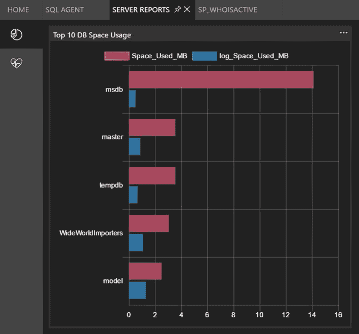

**图 9-2. SQL 操作工作室中的数据库空间使用情况**

## 添加数据库文件

通过 T-SQL `ALTER DATABASE` 语句使用 `ADD FILE` 选项，向数据库添加数据库文件非常简单。你可以在以下网址阅读更多信息：[`docs.microsoft.com/sql/relational-databases/databases/add-data-or-log-files-to-a-database`](https://docs.microsoft.com/sql/relational-databases/databases/add-data-or-log-files-to-a-database)。

尽管可以为数据库添加事务日志文件，但添加第二个事务日志文件几乎没有任何好处，因此我不推荐这样做。

**注意：** 除了 `tempdb`，你应该没有太大必要向系统数据库添加文件。当你需要为 `tempdb` 添加文件时，应确保你：
1.  添加的文件大小和自动增长选项与其他所有文件完全相同。
2.  如果尚未启用，使用 `ALTER DATABASE` 为 `tempdb` 启用 `AUTOGROW_ALL_FILES`。

## 删除数据库文件

可能会出现需要从数据库中删除文件的情况，但该文件在通过 `ALTER DATABASE` 使用 `REMOVE FILE` 选项删除之前必须为空。

你可以了解更多信息：
*   删除文件：[`docs.microsoft.com/sql/relational-databases/databases/delete-data-or-log-files-from-a-database`](https://docs.microsoft.com/sql/relational-databases/databases/delete-data-or-log-files-from-a-database)。
*   如何清空文件：[`docs.microsoft.com/sql/relational-databases/databases/shrink-a-file`](https://docs.microsoft.com/sql/relational-databases/databases/shrink-a-file)。

你还可以使用 `ALTER DATABASE` 配合 `MODIFY FILE` 选项来增加数据库文件的大小。在我们的文档中了解更多信息：[`docs.microsoft.com/sql/relational-databases/databases/increase-the-size-of-a-database`](https://docs.microsoft.com/sql/relational-databases/databases/increase-the-size-of-a-database)。

**注意：** 在执行任何影响文件的 `ALTER DATABASE` 时，你可能遇到的一个常见问题是，它会阻塞 `BACKUP` 语句，或被任何活动的 `BACKUP` 所阻塞。

## 分离与附加数据库

我之前已经讨论过如何通过移动数据库和事务日志文件来移动数据库。在前面的章节中，我也讨论了如何使用备份和还原来恢复数据库。然而，备份和还原也可用于将数据库*传输*到另一台服务器，并且是首选的传输方法。

SQL Server 还提供了另一种通过分离和附加数据库来传输数据库的方法。分离数据库将关闭该数据库，并移除 `master` 系统数据库中关于该数据库的元数据，但不会删除文件（而 `DROP DATABASE` 会删除文件）。

**注意：** 出于安全考虑，切勿附加你不信任或不知道来源的数据库。

你可以使用以下 T-SQL 语句分离数据库：

**注意：** 以下示例假设你已经按照我之前章节描述的方式，使用 `wget https://github.com/Microsoft/sql-server-samples/releases/download/wide-world-importers-v1.0/WideWorldImporters-Full.bak` 还原了完整的 `WideWorldImporters` 数据库。

```sql
EXEC sp_detach_db 'WideWorldImporters', 'true'
GO
```


此时，`WideWorldImporters` 数据库的数据库和日志文件仍保留在磁盘上的当前位置。然后，你可以将这些文件复制到另一台运行 SQL Server 的 Linux 服务器上并进行附加。运行以下 T-SQL 语句，该语句位于示例脚本 `attachwwi.sql` 中：

```sql
CREATE DATABASE WideWorldImporters
ON (FILENAME = '/var/opt/mssql/data/WideWorldImporters.mdf'),
(FILENAME = '/var/opt/mssql/data/WideWorldImporters_UserData.ndf'),
(FILENAME = '/var/opt/mssql/data/WideWorldImporters.ldf'),
(FILENAME = '/var/opt/mssql/data/WideWorldImporters_InMemory_Data_1')
FOR ATTACH
GO
```

请注意，在此示例中，我提供了 `WideWorldImporters` 数据库的所有文件以及内存优化检查点文件的文件夹。在此示例中，你可以在附加时更改数据库的名称。你也可以将文件放置在不同的路径中，然后从新路径进行附加。

`注意` SQL Server 有一个旧的系统存储过程 `sp_attach_db`，但它已被标记为弃用，因此请使用带有 `FOR ATTACH` 选项的 `CREATE DATABASE`。

虽然通常需要所有原始文件才能附加数据库，但有一些隐藏的技巧：

1.  如果数据库通过在没有活动事务存在时执行分离而干净地关闭，并且只有一个事务日志文件，那么在附加数据库时可以省略该事务日志文件，SQL Server 将自动构建一个新的日志文件。
2.  如果数据库通过在没有活动事务存在时执行分离而干净地关闭，并且有多个事务日志文件，SQL Server 提供了 `FOR ATTACH_REBUILD_LOG` 这个 `CREATE DATABASE` 选项。

第 9 章 管理和监控 SQL Server

你只应分离处于 `ONLINE`（在线）状态且健康的数据库。处于 `SUSPECT`（可疑）状态（由于某种原因恢复失败）的数据库无法被分离。但是，如果你将处于 `SUSPECT` 状态的数据库设为脱机（offline），然后删除（drop）此数据库，文件将保留。此时，如果你尝试附加此数据库，将会失败。如果你发现自己处于这种情况，可以使用我称之为 *Paul Randal 附加法* 的方法，这是以我的好朋友 Paul Randal 的名字命名的，他是数据库修复和拯救技巧方面的顶尖专家之一。你可以在 [`www.sqlskills.com/blogs/paul/creating-detaching-re-attaching-and-fixing-a-suspect-database`](https://www.sqlskills.com/blogs/paul/creating-detaching-re-attaching-and-fixing-a-suspect-database) 阅读 Paul 针对此情况的技术。

`注意` 我将补充附加选项 `ATTACH_FORCED_REBUILD_LOG` 的隐藏秘密。它是未公开文档记载且完全不受支持的，但仍然有效。在事务日志文件丢失或损坏的绝望情况下，也可以使用它来尝试附加数据库。

`ALTER DATABASE 使用场景`

至此，我在本书中已经描述了使用 `ALTER DATABASE` 的许多不同目的和场景。以下是一些你可能会觉得有用的其他 `SET` 选项：

*   `EMERGENCY`：我将在下一节关于修复数据库中讨论此选项。如果数据库无法联机，此选项会非常方便。
*   `[ READ_ONLY | READ_WRITE ]`：如果你想防止对数据库进行任何更改，可以将其设置为 `READ_ONLY`（只读）。如果你想向其他用户或开发人员提供数据库副本以便他们可以读取数据，但又希望确保他们不会进行任何更改以维护数据的一致性副本时，这可能很方便。使用 `READ_WRITE`（读写）则将数据库标记为可进行更改。
*   `PAGE_VERIFY`：在第 8 章中，我讨论了数据库校验和的概念。我将在下一节关于修复数据库中进一步讨论它。这是更改默认值的选项，默认值是 `CHECKSUM`（我建议你使用）。其他选项是 `TORN_PAGE_DETECTION`（一种页面验证形式，其可靠性不如


健壮如`CHECKSUM`）以及`NONE`（关闭所有页面验证）。

- `WITH [ROLLBACK AFTER | ROLLBACK IMMEDIATE | NO_WAIT ]`：
  某些`ALTER DATABASE`场景需要在数据库上持有排他锁。此选项称为`终止子句`。如果该排他锁被其他用户阻塞，此`SET`选项让你能选择针对那些活动用户应发生何种行为。`ROLLBACK_AFTER <time>`会在一段时间后终止并回滚任何活动事务。`ROLLBACK IMMEDIATE`会立即执行此操作。`NO_WAIT`意味着如果`ALTER DATABASE`必须等待活动用户，它将失败。关于哪些选项可使用此子句的列表，请参阅我们的文档：[`https://docs.microsoft.com/sql/t-sql/statements/alter-database-transact-sql-set-options?view=sql-server-2017&tabs=sqlserver#SettingOptions`](https://docs.microsoft.com/sql/t-sql/statements/alter-database-transact-sql-set-options?view=sql-server-2017&tabs=sqlserver#SettingOptions)。

- `[ SINGLE_USER | RESTRICTED_USER | MULTI_USER ]`：
  默认情况下，SQL Server 允许多个用户与数据库交互。但是，你可以将访问限制为仅单个用户或受限用户。在使用`SINGLE_USER`或`RESTRICTED_USER`时，通常会使用终止子句。`RESTRICTED_USER`仅允许未来由`db_owner`或`sysadmin`角色的成员访问数据库。

  所有`ALTER DATABASE SET`选项可在我们的文档中找到：[`https://docs.microsoft.com/sql/t-sql/statements/alter-database-transact-sql-set-options?view=sql-server-2017&tabs=sqlserver#arguments`](https://docs.microsoft.com/sql/t-sql/statements/alter-database-transact-sql-set-options?view=sql-server-2017&tabs=sqlserver#arguments)。

## 修复数据库

在我就职于微软期间，我曾遇到过数据库或数据库中的页面损坏或无法访问的情况。我将使数据库或其部分恢复联机并可用的技术称为`修复`数据库。正如我在第 9 章"管理和监控 SQL Server"关于附加的文档中所提到的，在修复数据库方面，可能没有人（甚至微软内部）比 Paul Randal 更了解其中的"来龙去脉"。这背后是有原因的。

大约在 SQL Server 2000 开发时期，我访问了微软园区和 SQL Server 工程团队。我因在 `DBCC CHECKDB`、数据库损坏和修复数据库方面的专业知识和技能而在工程团队中获得声誉。在这次访问中，我被介绍给一位名叫 Paul Randal 的新开发人员。这不仅开启了 Paul 和我合作开发 SQL Server 产品各种功能的旅程（其中许多功能出现在 SQL Server 2005 中），也缔结了一段伟大的友谊。Paul 成为确保 SQL Server 拥有微软支持和客户所需可支持性功能的主要倡导者。Paul 和我，以及他的妻子 Kimberly Tripp（还有他们公司 SQLskills 的许多员工）一直保持着深厚的友谊。事实上，我最喜欢的演讲 SQL Server 的活动之一叫做 SQLIntersection，每年举办两次，由 Paul 和 Kim 运营。

以下部分带有 Paul 在 SQL 工程团队工作期间留下的鲜明印记。此外，他撰写了一系列关于修复数据库和恢复数据库主题（以及其他几乎所有相关主题）的精彩博客文章。


### 第 9 章：管理与监控 SQL Server

## 数据库状态

在本书中，我多次提到数据库可以是 `OFFLINE`（离线）或 `ONLINE`（在线），甚至还存在一种称为 `SUSPECT`（可疑）的状态。

在评估数据库为何无法访问时，`SUSPECT` 状态与 `RECOVERY_PENDING`（恢复挂起）状态之间的区别至关重要。随时可以通过查询主数据库中的 `sys.databases.state_desc` 列来获取数据库的状态。所有可能状态的列表可在我们的文档中找到：[`docs.microsoft.com/sql/relational-databases/system-catalog-views/sys-databases-transact-sql`](https://docs.microsoft.com/sql/relational-databases/system-catalog-views/sys-databases-transact-sql)。

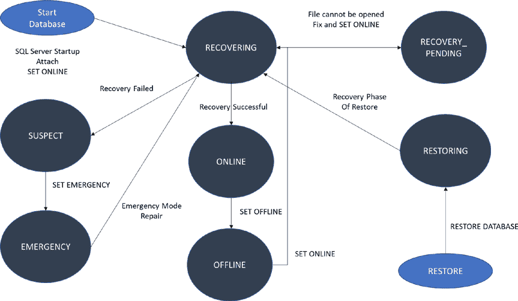

当数据库首次启动时（无论是通过 SQL Server 启动、`RESTORE`（还原）、附加，还是通过 `ALTER DATABASE` 命令使其上线），如果没有问题发生，其状态会被设置为 `ONLINE`。然而，达到 `ONLINE` 状态可能需要经过一些中间状态。此外，某些问题可能导致数据库状态走向其他方向，无法变为 `ONLINE`，并使其变得不可访问。

图 9-3 展示了这些不同状态以及可能导致状态转换的动作的状态图。

### 图 9-3. SQL Server 中数据库的状态

让我解释其中一些状态和流程，以便您更好地理解在数据库状态未变为 `ONLINE` 时应如何应对。

*   数据库启动时，总是从 `RECOVERING`（恢复中）阶段开始。
*   如果无法打开数据库文件（例如，权限问题或文件缺失），状态会变为 `RECOVERY_PENDING`。您可能通过找到正确的文件或设置正确的权限来轻松解决问题。使用 `ALTER DATABASE` 将状态设置为 `ONLINE` 会使数据库重新回到 `RECOVERING` 状态。如果恢复成功，状态将变为 `ONLINE`。请检查 `ERRORLOG` 以获取错误信息，这些信息会明确指出导致 `RECOVERY_PENDING` 状态的原因（是哪个文件以及具体的什么操作系统错误）。
*   如果恢复不成功（由于多种不同原因），数据库的状态将被设置为 `SUSPECT`。您可以使用一种称为紧急模式修复的技术来尝试修复数据库。我将在本节后面描述该技术。

**注意：** SQL Server 有一个非常实用的技术，可以在恢复过程中发现页面错误时（例如校验和失败，我将在接下来详细介绍）避免数据库进入 `SUSPECT` 状态。这被称为延迟事务，您可以通过以下链接了解更多相关信息：[`docs.microsoft.com/sql/relational-databases/backup-restore/deferred-transactions-sql-server`](https://docs.microsoft.com/sql/relational-databases/backup-restore/deferred-transactions-sql-server)。


[sql-server](https://docs.microsoft.com/sql/relational-databases/backup-restore/deferred-transactions-sql-server)

-   请注意，在执行 `RESTORE DATABASE` 操作期间，数据库的状态为 `RESTORING`，然后在数据库还原的恢复阶段，状态会转变为 `RECOVERING`。

## 关于校验和的更多信息

我在本书中多次提到了数据库校验和的概念。

校验和是 SQL Server 2005 中引入的一个重要概念，用于指示数据库页面在写入磁盘后被修改。如果 SQL Server 发现数据库页面被修改并导致校验和验证失败，则会向 `ERRORLOG` 写入以下错误：

`Msg 824`，SQL Server 检测到基于逻辑一致性的 I/O 错误：校验和不正确（预期值：0xdec71ff7；实际值：0xb0499fcf）。此错误发生在读取页面 (`<pageid>`) 时...

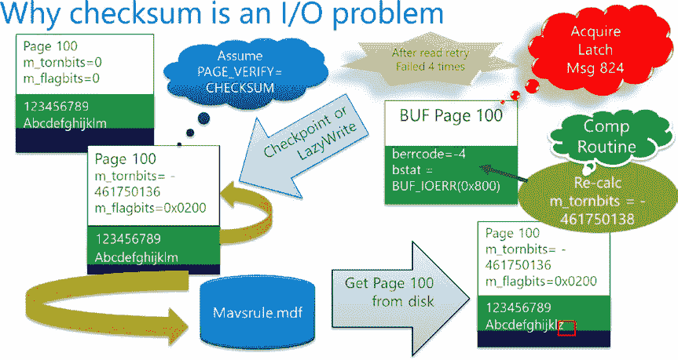

# 第 9 章 管理和监控 SQL Server

此外，还会在 `msdb` 数据库中的 `suspect_pages` 表里写入一条记录。

请记住，对于 `Always On 可用性组`，这种情况可能触发自动页面修复。多年来，我收到过关于校验和实际工作原理的问题，因此我将在这里进行描述。图 9-4 展示了我绘制的示意图，以说明校验和的基本原理。

### 图 9-4. SQL Server 中的校验和工作原理

让我解释一下这个流程。如果为数据库设置了 `PAGE_VERIFY=CHECKSUM`（这是 SQL Server 的默认设置），当一个页面被写入磁盘时，SQL Server 会计算一个校验和值（基于页面上比特位的数学计算）并将其存储在页面的头部。当 SQL Server 从磁盘读取该页面时，它会重新计算校验和。如果计算出的校验和与页面头部存储的值不匹配，就遇到了校验和失败。

不过，请注意图中写着“重试读取失败 4 次后”。这是因为如果遇到校验和失败，SQL Server 会尝试最多重试四次读取，然后才会发出真正的校验和失败信号。我们的 SQL 工程团队发现，在某些情况下会出现瞬时硬件问题，重试读取可能会成功（但 4 次通常是其总会失败的阈值）。如果重试读取成功，尝试读取该页面的查询会成功，但你会在 `ERRORLOG` 中看到 `Msg 825`。

# 第 9 章 管理和监控 SQL Server

**请注意**，`Msg 824` 是在读取或写入数据库页面时发生的*逻辑*故障。

除了校验和计算外，还有其他一些逻辑检查。例如，SQL Server 总是将页面头部的 `pageid` 值与它认为正在读取的实际页面进行比对。当 SQL Server 在读写页面时遇到物理错误，会引发 `Msg 823`。例如，如果在读取页面时发生操作系统错误，则会出现 `Msg 823`，而不是 `Msg 824`。

校验和算法有一个值得注意的缺陷。校验和是根据数据库页面*在写入时*存储的内容计算的。如果数据库页面在内存中已损坏，校验和将基于已损坏的页面计算，因此永远不会引发错误。SQL Server 确实有一个算法，由后台进程定期在校验和即使位于内存中时也进行验证。当此进程检测到内存中的页面发生校验和失败时，它会向 `ERRORLOG` 引发 `Msg 832`。你可以从这篇 Microsoft 知识库文章中阅读有关此验证及其解决方法的更多信息：[`support.microsoft.com/help/2015759/how-to-troubleshoot-msg-832-constant-page-has-changed-in-sql-server`](https://support.microsoft.com/help/2015759/how-to-troubleshoot-msg-832-constant-page-has-changed-in-sql-server)。

修复因校验和错误而失败的页面，可以通过还原备份、从备份中还原该页面，或使用 `DBCC CHECKDB` 进行修复（这将导致


# 第 9 章 SQL Server 的管理与监控

## DBCC CHECKDB 修复

我在第 8 章讨论了用于检查数据库一致性的`DBCC CHECKDB`命令。`CHECKDB`包含从磁盘读取页面的操作，因此在执行过程中会对每个页面进行校验和验证。

如果`DBCC CHECKDB`在检查数据库一致性时遇到任何故障，可以使用此 T-SQL 语句来修复数据库。使用`CHECKDB`修复数据库有两个选项：

-   **`REPAIR_REBUILD`**：如果可以通过仅重建或修复索引来修复数据库，`REPAIR_REBUILD`可以纠正执行`CHECKDB`时发现的错误。
-   **`REPAIR_ALLOW_DATA_LOSS`**：如果 SQL Server 在`CHECKDB`中检测到只能通过释放页面（可能导致数据丢失）来修复的错误，则可以使用此选项。顾名思义，使用此选项时，您需要意识到可能会丢失数据。`CHECKDB`在报告哪些页面将被释放以及释放数量方面非常详细。从良好的备份中恢复（或故障转移到有效的辅助副本）始终是最佳的恢复模式，但在某些情况下，使用`CHECKDB`修复数据库是您唯一的选择，即使可能会遇到一些数据丢失。

官方文档对其中一些场景的描述相当详尽，您可以在[`docs.microsoft.com/sql/t-sql/database-console-commands/dbcc-checkdb-transact-sql`](https://docs.microsoft.com/sql/t-sql/database-console-commands/dbcc-checkdb-transact-sql)阅读。此外，运行`CHECKDB`的输出会指明在完成`CHECKDB`时，解决所有发现错误所需的最小修复选项是什么。

根据多年的经验，我可以告诉您一些关于使用`CHECKDB`修复选项的观察：

-   存在一些无法修复的错误。
-   我很少遇到客户情况，其中`REPAIR_REBUILD`是一个有效的解决方案。如果您有数据库损坏（通常称为*corruption*。损坏的一个例子是本章前面描述的校验和失败），通常会导致一些数据丢失。并非总是如此，但通常是这样。
-   我见过一些案例，我不得不多次运行带有修复选项的`CHECKDB`迭代才能解决所有错误。
-   `CHECKDB`可以在带有修复选项的事务中运行，这样您可以先运行修复，然后在必要时回滚。
-   如果您在决定是恢复备份还是运行修复，请考虑*已知*和*未知*因素。如果您有一个有效的备份可以恢复，但会丢失一天的工作成果，这可能是一个更好、更快的解决问题的方法，因为这是已知的。尝试修复损坏的数据库并试图弄清楚丢失了哪些与已知业务价值和数据相关的页面，可能需要很长时间。我遇到过一些情况，我同时指导客户进行这两种操作：将备份恢复到另一个不同的数据库，同时尝试修复选项。

建议您查阅 Paul Randal 的博客文章标签“[CHECKDB from every angle](https://www.sqlskills.com/blogs/paul/category/checkdb-from-every-angle)”，其中包含一些关于`DBCC CHECKDB`的非常棒的信息。

**注意** 我仍然会收到来自客户和 SQL Server 用户的问题，询问微软是否拥有一些无人知晓的神奇工具集，可以让我们*修补*数据库。透明的事实是，我们曾经有过。在很久很久以前的“另一个星系”，我曾使用过一些程序，可以让我在数据库页面上“修复比特位”。这仍然非常耗时且成本高昂，而且我很少使用它。该工具已不复存在，重新创建它也没有任何益处。您可以阅读 Paul 的博客了解更多。


关于未公开的 `dBCC 命令`，它允许进行“位修复”。

但是，请不要依赖于此。我们并未真正测试这个命令（它可能导致服务器崩溃或造成无法修复的损害），它需要大量时间来使用，需要深入了解 SQL Server 的内部页面结构（这些结构我们未提供文档，且随着时间推移已经并将继续发生变化），并且我们可能随时移除它。

## 紧急模式修复

请考虑前述图示（图 9-3）中名为 SUSPECT 的数据库状态。SQL Server 已尝试运行恢复，但发生了不可恢复的故障（例如，事务日志文件损坏）。在 Paul 加入 Microsoft 之前，这是我需要帮助客户处理的最棘手的情况之一。Paul 在 SQL Server 2005 中引入了一个称为 `紧急模式修复` 的概念。这个概念是通过 `ALTER DATABASE <dbname> SET EMERGENCY` 将数据库状态更改为 EMERGENCY。

这将允许你访问数据库，然后使用 `REPAIR_ALLOW_DATA_LOSS` 选项运行 `DBCC CHECKDB`。SQL Server 会识别出事务日志不可访问，并将 `重建事务日志` 并运行恢复。Paul 在这篇博文中描述了该过程：https://www.sqlskills.com/blogs/paul/checkdb-from-every-angle-emergency-mode-repair-the-very-very-last-resort。

这听起来相当容易且简单，确实如此。但问题在于。由于事务日志必须被重建，你无从知晓日志中有哪些需要前滚或回滚的事务。因此，即使 `DBCC CHECKDB` 显示 `干净`，你的数据库也可能很容易出现逻辑不一致（例如，想象一下意外将 100 万美元贷记到一个银行账户，它可能就在那里但你不知道！）。

这就是为什么它是最后手段，并且绝对不能替代从一个良好备份进行还原。尽管有这些警告，我在 Microsoft 支持部门工作时经常发现自己使用这种技术，因为这些客户没有有效的备份可以还原。

关于使用数据库的 `EMERGENCY` 状态，我还有另一个评论。虽然你可以使用紧急模式修复选项，但我见过其他情况，将数据库状态设置为 `EMERGENCY` 允许我访问数据库并复制出（例如使用 `bcp`）关键表给业务部门。请将此记住，作为你数据库挽救工具箱中的一部分。

## 使用 CONTINUE_AFTER_ERROR 进行还原

我在第 8 章提到过，如果备份是使用 `WITH CHECKSUM` 选项创建的，并且在备份介质本身上发生了校验和错误，那么备份还原将会失败。

在那个神奇的 SQL Server 2005 可支持性发布版本中，我们为 `RESTORE` 增加了一个名为 `CONTINUE_AFTER_ERROR` 的选项。在大多数情况下，即使发生错误（如校验和错误），此选项也允许 `RESTORE` 完成。此时，数据库是否能用或可挽救完全就像“抛硬币”一样不确定。然而，有可能只有备份介质的一小部分（甚至单个位）存在问题，因此这个选项可能帮助你恢复数据库的大部分内容。

## 查找损坏原因

多年来，我在 Microsoft 支持部门处理涉及数据库损坏的客户案例时，总是（并且理所当然地）被问到“这是什么原因造成的？”。我从 25 年的经验可以告诉你，数据库损坏的首要原因是系统问题，大多数情况下来自 I/O 系统。

这里有一个有趣的技术可以帮助你证明这一点。如果你运行 `DBCC CHECKDB` 时遇到校验和错误，并且有一系列跨越问题时间段的数据库和事务日志备份，请将它们还原到不同的系统上进行分析。


# 第 9 章 SQL Server 的管理与监控

单独的服务器。如果数据库和事务日志备份有效，并且按照跨越错误的时间序列进行恢复，但恢复序列中并未显示该错误，那么问题必然出在原始数据库上，表现为损坏的页面，无论是内存中还是磁盘上。

我实际上曾在多年前遇到过一个客户按照此序列进行操作，恢复序列确实显示了相同的错误。后来发现这是 SQL Server 中的一个漏洞，我们立即找到了并修复了它。

更常见的情况是，恢复序列并未显示问题。一段时间后，客户会告诉我们，通过更新硬件的驱动程序和固件（或更换硬件组件）问题就解决了。

## 对象管理

与数据库类似，一旦创建了表、索引以及存储过程等服务器端代码，你将不可避免地需要管理这些对象。本节涵盖了一些你可能需要执行的管理任务示例，例如修改表、截断表、处理索引碎片以及修改服务器端代码。

## 表的管理

在本节中，我将讨论管理表的两个方面：通过修改列和属性来更改表；以及截断表，这可能是*清空*表的一种非常高效的方法。

### 修改表

为数据库创建表之后，可能会遇到需要修改表的定义或属性的情况。你当然可以选择复制出表的数据，删除当前表，创建新的表定义，然后再导回数据。

然而，SQL Server 提供了 `ALTER TABLE` 语句来修改表的定义或属性。修改表最常见的用途之一是更改列。使用 `ALTER TABLE`，你可以在某些限制条件下添加、删除或更改列的定义。不过，对列进行修改会有一些影响。以下是与 `ALTER TABLE` 一起使用以更改列定义的选项及其影响：

**ADD <column>:** 你可以向表中添加列，这些列将按顺序定义在表的末尾。你添加的任何列都必须允许 `NULL` 值，或者你必须在添加列时指定一个 `DEFAULT` 约束，以便为新列的每一行提供默认值。在包含大量数据行的表上添加带有默认值的列可能需要一些时间才能完成（因为这类似于对每一行执行一次 `INSERT` 操作），并会产生大量的日志记录。

**ALTER COLUMN <column>:** 你可以更改列的类型及其大小。更改类型必须遵循 SQL Server 可能的数据类型转换规则，这些规则可以在 [`docs.microsoft.com//sql/t-sql/data-types/data-type-conversion-database-engine`](https://docs.microsoft.com//sql/t-sql/data-types/data-type-conversion-database-engine) 找到。更改列的大小是可能的，前提是新的大小大于当前定义的大小（例如，你可以将 `varchar(100)` 更改为 `varchar(200)`，但不能更改为 `varchar(10)`）。

**DROP COLUMN <column>:** 你可以删除表中的列，但作为约束（如主键）一部分的列除外。你必须先删除这些约束，这也可以通过 `ALTER TABLE` 实现。请注意，删除列是完全记录日志的（类似于 `DELETE` 操作），因此在包含大量数据行的表上执行此操作可能需要一些时间，并会产生大量的日志记录。

你还可以使用 `ALTER TABLE` 调整表的其他一系列属性，例如分区、约束、锁升级和触发器。你可以在 [`docs.microsoft.com/sql/t-sql/statements/alter-table-transact-sql#arguments`](https://docs.microsoft.com/sql/t-sql/statements/alter-table-transact-sql#arguments) 查看与 `ALTER TABLE` 一起使用的完整选项列表。


# 第 9 章 SQL Server 的管理与监控

默认情况下，执行 `ALTER TABLE` 几乎会阻塞所有其他查询（或被其他查询阻塞）。这是因为 `ALTER TABLE` 默认会获取一个架构修改锁（`Sch-M`）。问题在于，即使是最简单的 `SELECT` 语句也需要一个架构稳定性锁（`Sch-S`），而此锁与 `Sch-M` 锁不兼容。幸运的是，SQL Server 允许在某些 `ALTER TABLE` 场景中避免获取 `Sch-M` 锁，并通过在 `ALTER TABLE` 语法中加入 `WITH (ONLINE=ON)` 选项来允许操作*联机*执行。关于哪些操作允许通过 `ALTER TABLE` 联机运行，您可以在 `WITH (ONLINE=ON)` 选项的官方文档中了解更多，链接如下：[`docs.microsoft.com/sql/t-sql/statements/alter-table-transact-sql#arguments`](https://docs.microsoft.com/sql/t-sql/statements/alter-table-transact-sql#arguments)。

您可以在我们的文档中阅读 `ALTER TABLE` 语句的所有详细信息：[`docs.microsoft.com/sql/t-sql/statements/alter-table-transact-sql`](https://docs.microsoft.com/sql/t-sql/statements/alter-table-transact-sql)。

## 截断表

假设您需要删除现有表中的所有行。也许您正将某个表用作提取、转换和加载（ETL）过程的一部分。此过程的一部分要求您在 SQL Server 中*清空*该表，并用新数据刷新它。您可以使用 `DELETE` 语句，但这可能代价高昂，因为 SQL Server 必须记录每一行被删除的变化。SQL Server 确实使用一个称为*幽灵记录*的过程来加速删除操作，但如果表中所有行（比如 100 万行）都需要删除，使用 `DELETE` 语句效率并不高。

因此，SQL Server 提供了 `TRUNCATE TABLE` 语句，以更高效的方式删除表中的所有行。当您执行 `TRUNCATE TABLE` 语句时，SQL Server 将解分配区（由八个连续页组成的集合），并且仅记录这些解分配操作。因此，`TRUNCATE TABLE` 语句速度非常快，并且只使用最少的日志空间（但仍可以在事务上下文中运行，因此可以回滚）。此外，对于像 `TRUNCATE TABLE` 这样的操作，页的解分配速度更快，因为 SQL Server 使用了*延迟删除*的概念。您可以从 Paul Randal 的博客文章中了解更多关于延迟删除和 `TRUNCATE TABLE` 日志记录的信息：[`www.sqlskills.com/blogs/paul/a-sql-server-dba-myth-a-day-1930-truncate-table-is-non-logged`](https://www.sqlskills.com/blogs/paul/a-sql-server-dba-myth-a-day-1930-truncate-table-is-non-logged)。

您可以在我们的文档中阅读关于 `TRUNCATE TABLE` 工作原理的更多细节，包括限制和约束：[`docs.microsoft.com/sql/t-sql/statements/truncate-table-transact-sql`](https://docs.microsoft.com/sql/t-sql/statements/truncate-table-transact-sql)。

## 管理索引

一旦为表创建了索引，您可能会决定创建其他索引，正如我在第 6 章讨论的那样。在某些情况下，您可能会发现最初选择的某个特定索引不再有意义。在这些情况下，您可以使用 `DROP INDEX` 语句来删除特定索引。请记住，我在第 6 章建议过，在大多数情况下，您会希望为表创建聚集索引，因此如果您决定删除聚集索引，您会希望用包含不同列集的新聚集索引来替换它。这篇博客文章虽然较早，但仍然非常适用，作者是


# 第 9 章 管理和监控 SQL Server

Kimberly Tripp 关于查看索引使用情况以及是否有必要保留已创建索引的见解，请参阅 [`www.sqlskills.com/blogs/kimberly/spring-cleaning-your-indexes-part-i`](https://www.sqlskills.com/blogs/kimberly/spring-cleaning-your-indexes-part-i)。

如果你只需为表创建所需索引，然后在数据库和应用程序的整个生命周期内都无需再为此担心，那将是理想的情况。对于主要是只读的数据库，这可能部分成立。然而，几乎每个应用程序都会修改数据，而在大多数情况下，索引必须随着数据一起更新和更改。`SQL Server` 会自动处理这类索引修改。但是，由于数据会随时间发生一些变化，你可能需要通过重建或重组来维护索引。在本节中，我将讨论重建和重组索引的过程，并简要介绍修改索引某些属性的功能。在任何这些情况下，`SQL Server` 都提供 `ALTER INDEX` `T-SQL` 语句来维护现有索引。不过，首先我需要更详细地讨论索引碎片的概念。

**注意**，`SQL Server` 社区最顶尖的专家之一 ola hallengren 提供了一个非常棒的解决方案，其中包含的脚本有助于自动化索引维护，请访问 [`ola.hallengren.com/sql-server-index-and-statistics-maintenance.html`](https://ola.hallengren.com/sql-server-index-and-statistics-maintenance.html)。

## 索引碎片

当你修改数据，尤其是插入和删除新行时，你所创建的索引可能会变得碎片化。我在之前关于索引性能能力的章节中简要提到了碎片的概念。碎片有两种类型：

### 逻辑或区碎片
逻辑碎片是指逻辑上链接在一起但物理顺序错乱的页面所占的百分比。例如，聚簇索引在叶级有一个代表数据的数据库页面的链接列表。理想情况下，所有这些页面都应按 pageid 在列表中排序，以便它们在数据库文件中物理有序且连续。如果你还记得第 6 章，我谈到过 `SQL Server` 只有在页面在文件中物理连续时才能一次读取多个页面。如果你运行一个需要在聚簇索引中扫描多个页面的 `SQL Server` 查询，除非页面是物理有序的，否则 `SQL Server` 高效读取多个页面的能力会受到限制。区碎片是相同的概念，只是它适用于没有聚簇索引的表（堆）以及页面在 `IAM` 页面内的排序方式。

### 页面紧凑度
页面紧凑度是我在本书中创造的一个术语，你可能不会看到这个术语作为碎片概念的一部分出现。我之所以将这部分称为碎片，是因为索引（或聚簇索引的数据）的页面中行填充得越稀疏，或者说紧凑度越低，服务一个查询需求可能需要的页面就越多。这可能导致所有查询所需的页面数量超出预期，从而占用缓冲池空间并需要更多的 `I/O`。然而，这里存在一个平衡。如果页面是 100%填满（紧凑）的，插入新行可能需要进行页面拆分，这可能导致更多的逻辑碎片。因此，理想情况下，在页面上保留一些可用空间是可取的，但不要达到大多数页面都空置的程度。当你创建、重建或重组索引时，可以使用一个名为 `fillfactor` 的选项，就如何在索引页面中保留空间做出明智的选择。我非常喜欢 Kimberly Tripp 的这篇博客文章。

### 第 9 章：管理与监控 SQL Server

要了解更多关于 `fillfactor` 的信息，请参阅 [sqlskills.com 上的这篇文章](https://www.sqlskills.com/blogs/kimberly/database-maintenance-best-practices-part-ii-setting-fillfactor)。

> **注意：** 索引中的碎片可能不会影响应用程序性能，尤其是逻辑碎片。逻辑碎片主要影响涉及页面扫描（而非 seek 到特定页面）的 T-SQL 查询。因此，检测到索引中存在碎片并不意味着你总是需要重建或重新组织索引。话虽如此，根据我的经验，几乎每个生产 SQL Server 环境都会部署一个计划来防止索引保持碎片化，以确保所有类型的 T-SQL 查询都能获得最佳性能。

SQL Server 提供了一种通过名为 `sys.dm_db_index_physical_stats` 的 DMV 来查看碎片这两个方面情况的方法。列 `avg_fragmentation_in_percent` 追踪逻辑或区碎片，而 `avg_page_space_used_in_percent` 追踪索引中页面的填充程度。

那么问题来了，如何解决与碎片相关的问题？我建议你考虑 SQL Server 提供的两个用于维护现有索引的选项：*重建索引* 或 *重新组织索引*。

## 重建索引

通过使用 `REBUILD` 选项的 `ALTER INDEX` 来重建索引，涉及删除现有索引并根据现有索引定义创建新索引，因此需要在数据库中预留额外空间来重建索引。注意：`ALTER INDEX` 和 `CREATE INDEX` 有一个名为 `SORT_IN_TEMPDB` 的选项，用于将排序结果作为索引重建的一部分存储在 `tempdb` 中，而不是用户数据库中。重建索引将按物理顺序重新排序页面以消除碎片，并根据指定的 `fillfactor` 压缩页面。此外，重建索引将为该索引创建一套全新的统计信息。

默认情况下，索引重建是一项*离线*操作，会阻塞现有查询。但是，与 `ALTER TABLE` 类似，使用 `REBUILD` 的 `ALTER INDEX` 提供了一个选项，可通过 `WITH ONLINE=ON` 选项来*在线*重建索引。这允许查询在索引重建的同时执行。

此外，SQL Server 提供了一个名为*可恢复的*在线索引重建选项，使用 `RESUMABLE=ON` 选项。使用此选项允许你暂停索引重建，并在中断处恢复。以下是一些可能对你有帮助的场景：

*   暂停一个正在消耗大量 SQL Server 资源并影响整体性能的索引重建操作。这允许你在稍后时间点恢复索引重建，而不必取消重建并重新运行整个过程。
*   分块执行索引重建。例如，你可以随时间分 25% 的增量重建索引。目录视图 `index_resumable_operations` 可用于跟踪可恢复在线索引重建的进度。你可以在 [sys.index_resumable_operations 的 Microsoft 文档](https://docs.microsoft.com/sql/relational-databases/system-catalog-views/sys-index-resumable-operations) 中阅读更多关于此目录视图的信息。

以下是一个使用完整的 WideWorldImporters 示例数据库进行可恢复在线索引重建的简单示例。执行示例 `resumablerebuild.sql` 中的以下 T-SQL 语句，以查看在线重建索引的示例：

```sql
-- （可恢复在线索引重建示例的 T-SQL 代码将放在此处）
```


### 使用可恢复选项时：

```sql
USE WideWorldImporters
GO
ALTER INDEX PK_Purchasing_PurchaseOrders
ON [Purchasing].[PurchaseOrders]
REBUILD
WITH (ONLINE = ON, RESUMABLE = ON);
GO
```

使用 `REBUILD` 的 `ALTER INDEX` 可以利用并行处理，并遵循与查询相同的规则来决定 `MAXDOP`。`ALTER INDEX` 语句提供了一个 `MAXDOP` 提示。此外，`ALTER INDEX` 还提供了一个名为 `ALL` 的选项，可在单个事务中重建指定表的所有索引。

## 重组索引

除了重建索引，另一种方法是重组索引。索引重组是一项在线操作，它使用现有的索引页来压缩页面并移动页面，使其按物理顺序排列。你可以使用带 `REORGANIZE` 选项的 `ALTER INDEX` 来重组索引。

重组索引是处理索引碎片的一个很好选择，但不会更新索引的统计信息。此外，带 `REORGANIZE` 的 `ALTER INDEX` 也提供了使用 `ALL` 来重组表的所有索引的选项，并允许你指定一个填充因子。Paul Randal 有一篇精彩的博文描述了重建和重组索引之间的区别：[`www.sqlskills.com/blogs/paul/sqlskills-sql101-rebuild-vs-reorganize`](https://www.sqlskills.com/blogs/paul/sqlskills-sql101-rebuild-vs-reorganize)。

## 自适应索引整理

你可以参考文档中的指导来决定是重建还是重组索引，详见 [`docs.microsoft.com/sql/relational-databases/indexes/reorganize-and-rebuild-indexes`](https://docs.microsoft.com/sql/relational-databases/indexes/reorganize-and-rebuild-indexes)。然而，多亏了 SQL 工程团队中被称为老虎团队的聪明人，你可以使用一个脚本来创建一个*智能的*存储过程，由它来决定是重建还是重组你的索引。这个脚本及其概念被称为自适应索引整理。你可以在以下链接阅读更多关于此脚本的功能说明，并进行下载：[`github.com/Microsoft/tigertoolbox/tree/master/AdaptiveIndexDefrag`](https://github.com/Microsoft/tigertoolbox/tree/master/AdaptiveIndexDefrag)。

## 修改索引

可以在不要求重建索引的情况下更改索引的某些属性。这包括诸如锁定行为（例如 `ALLOW_PAGE_LOCKS`）和统计信息选项（例如 `STATISTICS_NORECOMPUTE`）。`ALTER INDEX` 的大多数选项确实需要更改索引结构，正如之前在重建和重组索引的示例中所见。有关 `ALTER INDEX` 的完整选项列表，请参阅我们的文档：[`docs.microsoft.com/sql/t-sql/statements/alter-index-transact-sql#arguments`](https://docs.microsoft.com/sql/t-sql/statements/alter-index-transact-sql#arguments)。

### 维护列存储索引

我在第 6 章讨论了称为列存储索引这一出色的性能特性。尽管列存储索引的组织方式与行存储索引不同，但它们仍然可能需要维护。以下是一些在决定如何维护列存储索引时可以使用的资源：

- 查阅有关列存储索引碎片整理的文档：[`docs.microsoft.com/sql/relational-databases/indexes/columnstore-indexes-defragmentation`](https://docs.microsoft.com/sql/relational-databases/indexes/columnstore-indexes-defragmentation)。
- 这里有一篇关于如何整理列存储索引的讨论。


# 第 9 章 SQL Server 的管理与监控

## 管理服务器端代码

到目前为止，本书中展示了创建 T-SQL*服务器端代码*的示例，包括存储过程、视图、函数和触发器。一旦创建了这些对象，你可能需要修改甚至删除它们。每种对象类型都支持相应的 `ALTER` 和 `DROP` T-SQL 版本的 `CREATE` 语法。

任何时候，当你 `ALTER` 一个服务器端编程对象（如存储过程）时，该对象将在下次执行时重新编译并存储在缓存中。

SQL Server 2016 SP1 和 SQL Server 2017 引入了一个新语法，你应该考虑在创建这类对象的脚本中使用它。它被称为 `CREATE or ALTER`。使用这个新语法，你可以创建一个单一的脚本来创建或修改对象，而不必有一个脚本用于创建，另一个用于修改，或者每次想要更改时都必须先删除再创建。

例如，以下 T-SQL 语句如果名为 `howboutthemcowboys` 的存储过程不存在则创建它，如果已存在则修改它。无需使用 `DROP` 语句。你可以在示例脚本 `howboutthemcowboys.sql` 中找到此语句：

```sql
USE WideWorldImporters
GO
CREATE or ALTER PROCEDURE howboutthemcowboys
AS
BEGIN
    SELECT 'Back to the Super Bowl in 2019'
END
GO
```

你可以在我们的文档中阅读更多关于如何使用 `CREATE or ALTER` 对象的信息：[`docs.microsoft.com/sql/t-sql/statements/create-procedure-transact-sql`](https://docs.microsoft.com/sql/t-sql/statements/create-procedure-transact-sql)。

使用 `ALTER INDEX REORGANIZE` 在线整理列存储索引的碎片：[`docs.microsoft.com/sql/relational-databases/indexes/columnstore-indexes-defragmentation#use-alter-index-reorganize-to-defragment-a-columnstore-index-online`](https://docs.microsoft.com/sql/relational-databases/indexes/columnstore-indexes-defragmentation#use-alter-index-reorganize-to-defragment-a-columnstore-index-online)。

关于如何重建列存储索引的更多详细信息请见：[`docs.microsoft.com/sql/relational-databases/indexes/columnstore-indexes-defragmentation#rebuild`](https://docs.microsoft.com/sql/relational-databases/indexes/columnstore-indexes-defragmentation#rebuild)。

查看关于重建和重组列存储索引的 T-SQL 示例：[`docs.microsoft.com/sql/t-sql/statements/alter-index-transact-sql#examples-columnstore-indexes`](https://docs.microsoft.com/sql/t-sql/statements/alter-index-transact-sql#examples-columnstore-indexes)。

#### 监控 SQL Server

管理 SQL Server 实例、数据库和对象对于保持 SQL Server 健康并以峰值性能运行至关重要。但在某些情况下，你如何知道是否需要采取一些管理措施呢？你需要能够监控关键的性能信息和 SQL Server 的各个方面，以做到主动管理并做出明智的决策。

在本章的这一节中，我将讨论使用 SQL Server 功能监控 SQL Server 性能的各种方法，如何使用一个极其酷炫的功能——系统运行状况会话，如何监控事务日志备份，以及我对 Linux 的看法。


用于监控操作系统与服务器健康状况的工具。

在此我要停顿一下，做一个重要的说明，这对你来说可能显而易见，但坦率地说，却常常被许多人忽视。**为你的 SQL Server 建立一个性能基线至关重要**。你可以每天监控 SQL Server，但除非你建立并保存了工作负载的基线以便对比，否则你无法判断看到的情况是否可能是问题，尤其是在性能方面。如果你不知道良好的性能是什么样的，你又如何知道自己遇到了性能问题呢？

## 监控 SQL Server 性能

虽然 SQL Server 数据库平台内置了许多强大的功能来支持性能监控，但没有任何整体的监控解决方案能比我们专注于监控的合作伙伴提供的方案更优。你可以在 [`docs.microsoft.com/sql/sql-server/partner-monitor-sql-server`](https://docs.microsoft.com/sql/sql-server/partner-monitor-sql-server) 找到这些合作伙伴的完整列表。

这些合作伙伴使用的许多功能和能力都建立在第五章介绍的大量工具之上，包括数据库引擎的内置功能。在本节中，我将回顾其中一些工具和功能，以及使用它们监控 SQL Server 性能的基本方法。

### 运行中或等待中

我在本章前面提到了我的一位长期同事兼朋友，基思·埃尔莫尔。与罗伯特·多尔一样，我曾与基思在微软技术支持部门并肩工作多年，基思至今仍是我很好的朋友。每当涉及如何解决 SQL Server 的性能问题时，我总是会想到基思（直到今天也是如此）。

几年前，基思为技术支持部门构建了一些培训，他用于这些培训的理念简单而卓越。基思创造了一个术语，即 SQL Server 性能问题可以归类为*运行中*或*等待中*。

第 9 章 管理与监控 SQL Server

**运行中** 等同于 CPU 利用率。监控服务器上所有进程的 CPU 利用率非常重要，这有助于了解任何性能问题是否与 SQL Server 进程或其他进程有关。如果 SQL Server 的 CPU 利用率看起来过高，以至于可能影响性能，那么你需要深入调查是哪些 T-SQL 查询在执行并消耗了最多的 CPU。如果没有查询消耗大量 CPU，那么问题可能出在后台进程或自旋锁争用问题上（我在第六章讨论内存中 OLTP 时简要提到过自旋锁）。可以使用诸如 `dm_exec_query_stats` 这样的 DMV 或查询存储来追踪那些可能导致高 CPU 消耗场景的查询。

**等待中** 就 SQL Server 而言，指的是 SQL Server 用户任务可能正在等待特定的*等待类型*，即等待特定资源的情况。由于多个用户可能都在争夺相似的资源，一个等待场景可能涉及多个用户都在等待另一个正在等待资源的用户（就等待类型而言，这通常称为*阻塞链*）。我在第五章讨论 DMV `dm_exec_requests`、`dm_os_waiting_tasks` 和 `dm_os_wait_stats` 时提到过等待类型的概念。

掌握了这些知识，你不仅可以解决几乎任何 SQL Server 性能问题，还将知道如何通过监控 CPU 利用率以及跨用户和 SQL Server 实例的等待类型，来主动监控 SQL Server 性能。

### 使用 DMV 监控性能

遵循基思关注 CPU 利用率或等待场景的思路，你首先需要能够监控 Linux 服务器上所有进程（包括 `sqlservr`）的 CPU 利用率。请在本章后面的章节中查找用于监控所有进程 CPU 的 Linux 工具和包。

假设你关注的是 SQL Server 的 CPU 利用率，你可以使用 DMV `dm_exec_query_stats` 来找出基于缓存计划执行并使用了最高 CPU 利用率的查询。此外，你可以使用 DMV `dm_exec_requests` 和 `dm_os_waiting_tasks` 来找出哪些任务正在等待其他任务或特定资源。DMV `dm_os_wait_stats` 则展示了整个 SQL Server 实例中等待资源最高的情况。我在第五章提供了如何使用每个这些 DMV 的示例。另外，不要忘记使用轻量级查询分析功能监控实时查询，包括 DMV `dm_exec_query_profiles`。我在第五章提到过此功能，但这里有一个链接提醒你阅读更多关于实时监控查询的内容：[`docs.microsoft.com/sql/relational-databases/system-dynamic-management-views/sys-dm-exec-query-profiles-transact-sql`](https://docs.microsoft.com/sql/relational-databases/system-dynamic-management-views/sys-dm-exec-query-profiles-transact-sql)。

我期待着未来我们可以默认开启此功能，这样你就能一直看到实时的查询信息！

你还需要从工作负载和吞吐量的角度监控 SQL Server 的整体性能。我在前面的章节中提到过可用于此目的的 DMV `dm_os_performance_counters`。此 DMV 在 SQL Server 启动时初始化，然后在 SQL Server 引擎运行时保持更新。请记住，此 DMV 具有非常规范化的结构，其中行值描述要测量的特定计数器，而不是列名。

以下 T-SQL 语句（在示例 `dm_os_performance_counters.sql` 中）返回 SQL Server 实例在任何时间点对象名为 `SQLServer:SQL Statistics` 的所有计数器：

```
SELECT * FROM sys.dm_os_performance_counters
WHERE object_name = 'SQLServer:SQL Statistics'
ORDER BY counter_name
GO
```

我们为 SQL Server 构建了性能计数器，以与 Windows 性能计数器系统集成（更多信息见 [`docs.microsoft.com/windows/desktop/perfctrs/performance-counters-reference`](https://docs.microsoft.com/windows/desktop/perfctrs/performance-counters-reference)）。查看这些计数器的常用方法是使用 Windows 性能监视器工具（通常称为 `perfmon`）。由于 Windows 性能计数器系统在 Linux 操作系统上不起作用，因此你可以通过 `dm_os_performance_counters` DMV 查询 SQL Server 性能计数器。所有可能的 SQL Server 性能计数器的描述记录在我们的文档中：[`docs.microsoft.com/sql/relational-databases/performance-monitor/use-sql-server-objects`](https://docs.microsoft.com/sql/relational-databases/performance-monitor/use-sql-server-objects)。

当你在 Windows 上使用 `perfmon` 工具查看 SQL Server 性能计数器时，计数器的速率会自动显示。例如，计数器名称 `Batch Requests/sec` 是 SQL Server 工作负载吞吐量的速率。但该速率以累计值形式呈现。为了找出真实的速率，你必须使用 T-SQL 执行计算。请查看以下这篇优秀的博客文章，了解如何使用 DMV 中的信息来理解如何执行正确的计算：


[`blogs.msdn.microsoft.com/psssql/2013/09/23/interpreting-the-counter-values-from-sys-dm_os_performance_counters`](https://blogs.msdn.microsoft.com/psssql/2013/09/23/interpreting-the-counter-values-from-sys-dm_os_performance_counters)

## 第九章 管理与监控 SQL Server

此外，你可以参考第 6 章自动调优示例中的脚本（位于 `auto_tune` 目录），了解如何为 `Batch Requests/sec` 生成正确的比率。

SQL Server 有超过 1600 个性能计数器可供选择。表 9-1 列出了我始终推荐监控的前五大计数器区域（然后你可以根据需要添加其他计数器）。

### 表 9-1. 我推荐优先监控的五大 SQL Server 性能计数器

| object\_name | counter\_name | 描述 |
| :--- | :--- | :--- |
| `SQLServer:SQL Statistics` | `Batch requests/Sec` | SQL Server 上执行的 T-SQL 批处理速率 |
| `SQLServer:Memory Manager` | `total Server Memory (KB)` | SQL Server 引擎分配的总内存量 |
| `SQLServer:Wait Statistics` | `all counters` | 这使你能够跟踪来自 `dm_os_wait_stats` 的主要类别 |
| `SQLServer:General Statistics` | `User Connections` | 当前连接到 SQL Server 的活动用户数 |
| `SQLServer:SQL Errors` | `all counters` | 我只能选 5 个，所以为什么不监控错误总数呢。急剧增加可能表明存在严重的 SQL Server 或应用程序问题。 |

那么，你如何知道监控指标是好是坏？可能会有一些明显的迹象。例如，如果 SQL Server 持续消耗 100% 的 CPU，这通常不是好兆头，但最大化利用 CPU 资源也是一个目标。唯一能确定的方法是基于 DMV 信息建立一个基线——通过保存 DMV 收集的数据（即使在测试期间），然后监控随时间推移的任何重大变化。别忘了，当你对数据库、应用程序甚至 SQL Server 进行更新时，要保存多个基线。

## 使用查询存储监控性能

正如我在第 5 章提到的，如果你启用了 `Query Store`，那么现在编译和执行的查询的历史性能信息就会存储在你的数据库中。这将包括总执行时间、CPU 时间以及等待统计信息等。

`Query Store` 最大的好处是，你不需要*轮询* DMV 并保存其输出，因为 `Query Store` 的信息会持久化到你的数据库中（实际上默认保留 30 天的性能信息）。`Query Store` 的缺点在于信息是按数据库存储的。如果你的 SQL Server 实例上有多个数据库，你必须整合这些信息才能获得实例范围内的 SQL Server 性能视图。

正如我在第 5 章提到的，我们的文档中有一些关于如何对 `Query Store` 执行查询的优秀示例。你可以在 [`docs.microsoft.com/sql/relational-databases/performance/monitoring-performance-by-using-the-query-store#Scenarios`](https://docs.microsoft.com/sql/relational-databases/performance/monitoring-performance-by-using-the-query-store#Scenarios) 找到。这里包含了你可以根据需求编辑的查询，这些查询针对 `Query Store` 运行，用于查看基线并监控变化。

但请记住 `Query Store` 的优势：你的历史信息是内置的！假设你于 2018 年 8 月 1 日星期一开始了生产工作负载并启用了 `Query Store`。默认情况下，你现在拥有 30 天的历史信息（你可以配置历史记录...


[时间线] 在任何时间点，你都可以针对 `查询存储` 运行查询，并将其与包括你的基线日期在内的历史日期进行比较。这是因为 `查询存储` 中的所有内容都带有时间戳（请记住它是 UTC 日期时间）。

### 使用扩展事件进行性能分析

拥有 `查询存储` 来自动记录性能历史记录是你监控工具包中的一大优势。一旦你开始使用 `DMV` 或 `查询存储` 进行监控，可能会出现需要跟踪特定查询的确切执行情况以及其他信息（如查询的执行计划）的情况。请记住，`DMV` 和 `查询存储` 不会跟踪查询的实际执行计划。而且 `查询存储` 是聚合有关查询和计划的执行信息，而不是跟踪每次执行。

在这些情况下，轻量级查询分析对于获取特定正在运行查询的实际执行计划确实很有帮助。然而，在某些情况下，当你在监控 SQL Server 时，可能需要*跟踪*查询执行以及可能与性能相关的其他关键事件。这就是 `扩展事件` 作为详细跟踪的绝佳技术发挥作用的地方。我在第 5 章讨论了 `扩展事件` 的许多方面，包括如何查找所有可能要跟踪的事件的示例。

想要快速开始使用 `扩展事件` 吗？使用内置于 `SSMS` 中的 `XEProfiler`。你可以在 [`docs.microsoft.com/sql/relational-databases/extended-events/use-the-ssms-xe-profiler`](https://docs.microsoft.com/sql/relational-databases/extended-events/use-the-ssms-xe-profiler) 阅读更多关于使用 `XEProfiler` 的信息。

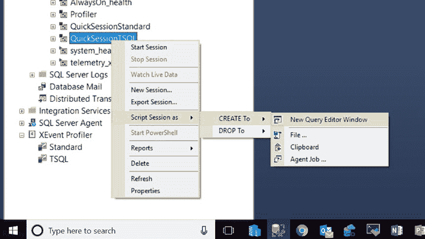

第 9 章 管理和监控 SQL Server

`XE Profiler` 会创建名为 `QuickSessionStandard` 和 `QuickSessionTSQL` 的 `扩展事件` 会话。使用这些作为基础，来创建包含你想要跟踪的其他事件的你自己的会话。你可以使用 `SSMS` 右键单击其中一个会话，并将其定义编写为脚本来创建你自己的会话。图 9-5 展示了如何执行此操作的示例。

**图 9-5. 将 `QuickSessionTSQL` `扩展事件` 会话编写为脚本**

请注意在此图中有一个名为 `Profiler` 的会话。该会话类似于 `XEProfiler` 的功能，并且来自 `SQL Operations Studio` 的一个名为 `SQL Server Profiler` 的新扩展（不要与名为 `SQL Server Profiler` 的实际工具混淆）。你可以在 [`docs.microsoft.com/sql/sql-operations-studio/sql-server-profiler-extension`](https://docs.microsoft.com/sql/sql-operations-studio/sql-server-profiler-extension) 阅读更多关于此扩展的信息。图 9-6 展示了此扩展针对 Linux 上的 SQL Server 实际运行的示例。

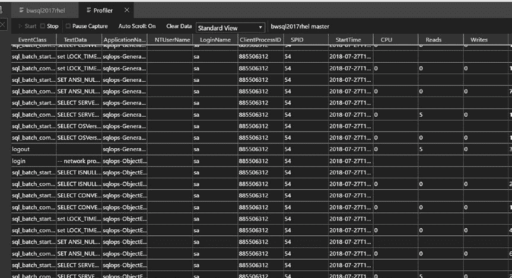

第 9 章 管理和监控 SQL Server

**图 9-6. `SQL Operations Studio` 的 `SQL Server Profiler` 扩展**

我喜欢将像 `XEProfiler` 和 `SQL Operations Studio` 的 `SQL Server Profiler` 这样的工具视为在任何时间点快速实时查看 SQL Server 的方式。这些会话开销不大，可以让你快速查看 SQL Server 的状况。例如，假设你听到使用 SQL Server 的应用程序宕机了，而所有人都将矛头指向 SQL Server。这些工具可以快速告诉你应用程序是否正在向 SQL Server 发送查询，以及它们是否在合理的时间范围内执行。如果没有查询发送到 SQL Server，那么问题可能出在网络或应用程序上。

但是 `扩展事件` 也可以用作详细的跟踪机制来补充你的监控需求，尤其是在你检测到可能的问题时。让我


# 第 9 章 管理与监控 SQL Server

这里有一个快速示例。假设你怀疑由于大量的页拆分导致了碎片化。因此，你监控动态管理视图 `dm_os_performance_counters` 中名为 `Page Splits/sec` 的计数器，并证实了你的猜测。如果能够追踪在发生页拆分时正在执行哪些查询，岂不是很好？

以下 T-SQL 语句将创建一个扩展事件会话来实现这一点（该会话定义可以在示例脚本 `tracepagesplits.sql` 中找到）。

```sql
CREATE EVENT SESSION [tracespagesplits] ON SERVER
ADD EVENT sqlserver.page_split(
ACTION (sqlserver.session_id, sqlserver.sql_text, sqlserver.client_app_name,
sqlserver.database_id))
ADD TARGET package0.event_file(SET filename=N'pagesplits.xel')
WITH (MAX_DISPATCH_LATENCY=5 SECONDS,STARTUP_STATE=OFF)
GO
```

现在，你可以查看哪些会话、查询、应用程序名称和数据库涉及到了页拆分。`page_split` 事件包含了被拆分的 `pageid`。

## 使用系统运行状况会话

扩展事件是作为 SQL Server 2008 版本的一部分发布的。那时，我在微软技术支持部门工作，认为我们可以利用扩展事件创建一个默认会话来捕获有关 SQL Server 的重要运行状况信息。于是，`system_health` 扩展事件会话诞生了。你可以在博文 [Supporting SQL Server 2008: The system_health session](https://blogs.msdn.microsoft.com/psssql/2008/07/15/supporting-sql-server-2008-the-system_health-session) 中阅读其初始版本的相关信息。这个早期版本的一个局限是，会话将数据写入 `ring_buffer` 目标，因此当 SQL Server 重新启动时，收集的信息就会丢失。

随着 SQL Server 2012 的发布，我们修改了通过 `sp_server_diagnostics` 系统过程在集群中检测故障的方法（我在第 8 章描述过）。我在支持部门的同事 Robert Dorr 在定义 `sp_server_diagnostics` 的工作方式方面贡献巨大。此外，Bob 还花时间改进了 `system_health` 会话，使其包含 `sp_server_diagnostics` 信息，并为该会话添加了文件目标。

这确实是一个重大进步，因为现在任何 SQL Server 默认都有一组扩展事件文件，其中包含了有关 SQL Server 的运行状况信息，包括但不限于：

-   `sp_server_diagnostics` 输出
-   内存诊断
-   死锁
-   非让出问题
-   闩锁等待超过 15 秒
-   某些抢先等待超过五秒
-   关键错误

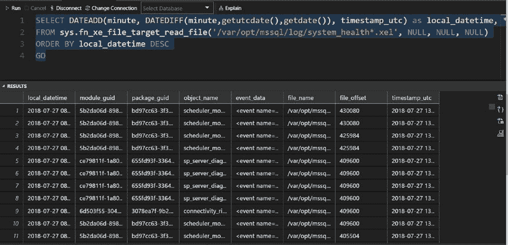

Robert Dorr 在博文 [SQL Server 2012: True black box recorder](https://blogs.msdn.microsoft.com/psssql/2012/03/08/sql-server-2012-true-black-box-recorder) 中很好地讨论了这个新的 `system_health` 会话。

这些文件默认存储在 `/var/opt/mssql/log` 目录中。查找匹配模式 `system_health*.xel` 的文件集。使用示例 `readsystemhealth.sql` 中的以下 T-SQL 语句来读取当前系统运行状况会话中的所有事件。我在查询中包含了到你本地时间的转换，但也保留了原始的 UTC 时间。

```sql
SELECT DATEADD(minute, DATEDIFF(minute,getutcdate(),getdate()), timestamp_utc)
as local_datetime, *
FROM sys.fn_xe_file_target_read_file('/var/opt/mssql/log/system_health*.xel',
NULL, NULL, NULL)
ORDER BY local_datetime DESC
GO
```

在我的 Linux 服务器上，结果如 SQL Operations Studio 中的图 9-7 所示。

**图 9-7.** 读取 `system_health` 扩展事件会话的结果


# 智能日志备份

在某些情况下，监控活动（例如备份）可能与性能相关。在第 8 章中，我讨论了如何备份事务日志。本章中讨论的示例展示了一个基于时间频率的日志备份计划。这种技术已使用多年，对许多生产工作负载有效。

这种技术的一个问题是，应用程序可能会产生意外的事务日志活动峰值，从而导致事务日志的自动增长。我在本书前面已经描述过，事务日志的自动增长可能会导致阻塞和性能问题。

幸运的是，SQL Server 有一种技术可以执行更智能的日志备份。我在 SQL Server 工程部门的一位同事（他现在仍在微软工作，但职责范围更广了一些）Parikshit Savjani 撰写了一篇优秀的博客文章，介绍如何基于 DMV `dm_db_log_stats` 执行智能日志备份。您可以在以下链接阅读详细信息：
[`blogs.msdn.microsoft.com/sql_server_team/smart-transaction-log-backup-monitoring-and-diagnostics-with-sql-server-2017`](https://blogs.msdn.microsoft.com/sql_server_team/smart-transaction-log-backup-monitoring-and-diagnostics-with-sql-server-2017)

# Linux 监控工具

虽然 SQL Server 提供了丰富的监控工具，但监控托管 SQL Server 的操作系统也很重要。如果您有使用 Linux 的经验，您可能有一套一直用来监控 Linux 的工具和程序。

以下是我从使用 Linux 的经验和 SQL Server 工程团队的同事那里发现的、认为有用的一系列工具和命令。

## top
`top` 是一个核心的 Linux 程序，用于实时显示进程以及 Linux 服务器的整体 CPU 和内存使用情况，我在前面的章节中已经使用过它。`top` 应该默认安装在几乎所有 Linux 发行版上。`top` 是交互式的，因为它会不断刷新。您必须键入 `q` 来退出程序。以下是在我的 Linux RHEL 服务器上运行 `top` 时部分输出的一瞥，如图 9-8 所示。

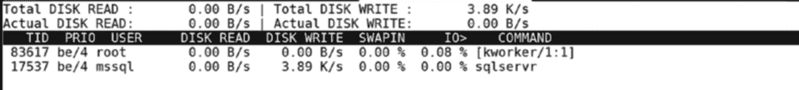
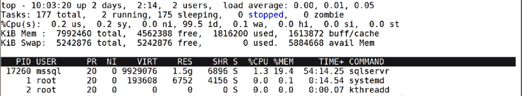

**图 9-8.** Linux 上 `top` 程序的输出

## iotop
`iotop` 是一个类似于 `top` 的程序，但只专注于 I/O。`iotop` 可能默认没有安装，因此首先从 bash shell 执行以下命令：
```
sudo yum install -y iotop
```
运行 `iotop` 需要 `sudo` 权限，我建议使用 `-o` 参数，它只显示系统中活跃的 I/O。从 bash shell 运行以下命令：
```
sudo iotop -o
```
图 9-9 显示了在我的 Linux 服务器上运行 `iotop` 的输出。

**图 9-9.** Linux 上 `iotop` 程序的输出

## htop
`htop` 是一个类似于 `top` 的程序，但更具特色。我在 Windows Server 上使用的一个程序是任务管理器。我可以快速直观地查看每个处理器的 CPU 利用率。`htop` 提供了这种外观和感觉，加上进程资源使用情况的详细信息。我发现 `htop` 在大多数 Linux 系统上默认可能没有安装。因此，要在 RHEL 上安装它，请从 bash shell 运行以下命令：
```
sudo wget dl.fedoraproject.org/pub/epel/7/x86_64/Packages/e/epel-release-7-11.noarch.rpm
sudo rpm -ihv epel-release-7-11.noarch.rpm
sudo yum install -y htop
```
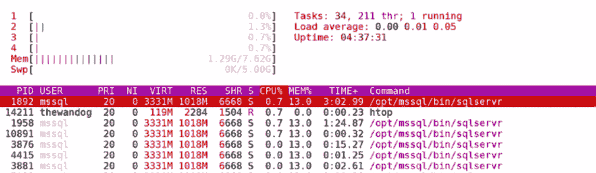
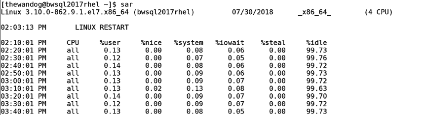

要执行 `htop`，只需运行以下命令：
```
htop
```
图 9-10 显示了在我的拥有四个 CPU 的 Linux 服务器上运行 `htop` 的部分输出。

**图 9-10.** Linux 上的 `htop`

## sar
`sar`（系统活动报告）在 UNIX 和 Linux 系统上已经存在很长时间了。它使用 `/proc` 文件系统来收集信息并生成报告。因此，`sar` 是一个查看……的好程序（原文在此处中断）


# SQL Server 的管理与监控

## 使用 `sar` 进行系统监控

**`sar`** 用于随时间推移（甚至跨服务器重启）监控操作系统资源，如 CPU、内存和 I/O。`sar` 有许多选项，执行以下命令可以查看所有选项：

```bash
man sar
```

图 9-11 显示了我 Linux 服务器上默认 `sar` 输出的一部分。

**图 9-11. Linux 上的默认 `sar` 输出**

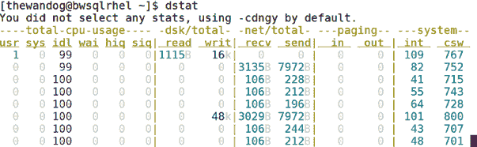

## 使用 `dstat` 进行监控

**`dstat`：** `dstat` 是一个集成了 `vmstat`、`iostat` 和 `ifstat` 等多个程序功能的工具。你的 Linux 服务器上可能未安装 `dstat`，可以通过运行以下命令安装：

```bash
sudo yum install -y dstat
```

执行 `dstat` 时，它会立即开始在你的 SSH 会话屏幕上滚动输出。图 9-12 显示了我 Linux 服务器上 `dstat` 输出的一部分。

**图 9-12. Linux 上的 `dstat` 输出**

## 使用 `LinuxKI` 进行深度分析

**`LinuxKI`：** Patrick Kilfoyle 在 Helsinki 项目期间加入了我们的 SQL 工程团队，并为我们带来了丰富的 Linux 经验。Patrick 的技能之一是 Linux 内核性能调优。我询问他用于性能调优的有趣“底层”工具，他立即向我指出了 `LinuxKI`。根据 GitHub 项目站点，`LinuxKI` 是“一个开源的高级任务关键型 Linux 性能故障排除工具”。我认为它是“底层”工具，因为它使用 Linux 内核跟踪数据来帮助深入分析复杂性能工作负载情况。Patrick 在 Microsoft 使用它来深入分析 Linux 内核级别的复杂 SQL Server 性能调优问题。你可以在 GitHub 项目站点 [`github.com/HewlettPackard/LinuxKI`](https://github.com/HewlettPackard/LinuxKI) 下载并了解更多关于 `LinuxKI` 的信息。

#### SQL Server 故障排除

到目前为止，在本书中，我已经向你介绍了可用于排除 Linux 上 SQL Server 问题的工具、技术和功能。尽管如此，本章还有一些值得涵盖的故障排除主题，我尚未在本书中讨论。这些主题包括转储文件、核心转储文件和 `PSSDiag`。我要特别感谢目前在 Microsoft 支持部门研究 Linux 上 SQL Server 的两位顶级专家，Pradeep M 和 Suresh Kandoth，他们为本节内容做出了贡献。

## 转储文件

当 SQL Server 发生某些错误条件（如访问冲突）时，数据库引擎将生成一个转储文件并在 `ERRORLOG` 中记录一条条目。该转储文件对于 Microsoft 技术支持调查问题原因非常有用。在大多数情况下，当生成转储文件时，SQL Server 已 *处理* 该错误或异常，生成了转储文件，并正确终止了工作线程（这类似于严重错误，可能导致连接终止和事务回滚）。

转储文件保存在 `ERRORLOG` 文件所在的同一目录中，默认为 `/var/opt/mssql/log`。你可以通过文件模式 `SQLDump<n>.mdmp` 来识别转储文件（通常称为小型转储文件）。这些文件的格式可由 Windows 调试器读取，因为 SQL Server 生成的任何转储文件都使用 Windows 的小型转储格式。

Microsoft 技术支持有时还会使用一种技术来手动生成转储文件，以更深入地了解 SQL Server 进程。你可以通过执行以下 T-SQL 语句自行完成：

**注意** 除非得到 Microsoft 指示，否则不要在生产服务器上运行此命令。此命令官方不受支持，仅用于高级诊断目的。

```sql
DBCC STACKDUMP
GO
```

运行此命令后，`ERRORLOG` 文件将包含一个类似于以下文本的“堆栈转储标头”：

```
spid51       Dump thread - spid = 0, EC = 0x000000067EDA1290
spid51       *
spid51       * User initiated stack dump.  This is not a server exception dump.
spid51       *
```


# 第 9 章 SQL Server 的管理与监控

## 核心转储文件

spid51 **堆栈转储正被发送到 `/var/opt/mssql/log/SQLDump0001.txt`**

```
spid51       *Stack Dump being sent to /var/opt/mssql/log/SQLDump0001.txt
spid51       * *************************************************************
*************
spid51       *
spid51       * BEGIN STACK DUMP:
spid51       *    07/30/18 22:05:25 spid 1
spid51       *
spid51       * StackDump (all)
```

在 `/var/opt/mssql/log` 目录下将有三个文件：

`SQLDump0001.txt:` 文本文件，包含有关转储原因和重要数据结构的信息。

`SQLDump0001.log:` 转储创建时间点附近的一段 ERRORLOG。

`SQLDump0001.mdmp:` SQL Server 进程的小型转储文件。请记住，此文件是在 SQL PAL 架构内运行的 SQL Server 生成的，因此它代表 SQL Server.exe Windows 进程的小型转储。

此时，您可以使用 Windows 调试器（windbg）加载 `SQLDump0001.dmp` 文件。您可以在 [Windows 调试入门](https://docs.microsoft.com/windows-hardware/drivers/debugger/getting-started-with-windows-debugging) 了解更多关于 Windows 调试器的信息。使用 Windows 调试器读取转储文件绝对需要高级技能。再次说明，这些文件是为诊断目的生成的，供 Microsoft 技术支持和 SQL Server 工程团队使用。但是，可以结合使用 Windows 调试器和 Microsoft 公共符号服务器来查看与转储原因（例如，访问冲突）相关的调用堆栈，并可能确定 Microsoft 是否已修复该问题，或者大致了解问题发生的代码位置并避免它。

在一些罕见情况下，SQL Server 无法处理异常或关键错误。在 Linux 上，当进程崩溃且无法处理异常时，通常会生成一个 **核心转储**。核心转储表示 Linux 进程整个进程内存的转储。（我一直想知道为什么它被称为核心转储，后来发现这个术语来自使用磁芯存储器的旧 UNIX 系统。）

对于 SQL Server，我们希望提供丰富的诊断信息，并控制核心转储的生成方式，以防 `sqlservr` Linux 进程遇到通常会导致 Linux 核心转储的情况。

如果您还记得，在 第 1 章 中，我谈到 SQL Server on Linux 有两个进程。其中一个进程是 **看门狗** 进程，它派生子进程，即实际的 SQL Server 数据库平台。此外，我还谈到了随 SQL Server 安装在 `/opt/mssql/bin` 目录下的一些文件。此目录包含 `sqlservr` 二进制文件，但也包含一些其他文件，包括一个名为 `handle-crash.sh` 的 shell 脚本和一个名为 `paldumper` 的程序。

SQL Server 的核心转储流程如下所示：

* **看门狗** `sqlservr` 进程监听子进程是否崩溃的信号。
* 当收到信号时，看门狗进程将调用 `handle-crash.sh` 脚本。
* `handle-crash.sh` 调用 `paldumper` 程序来生成核心转储。

除核心转储外，其他信息也会被收集并压缩到一个 `.tbz2` 文件中。

让我们通过以下示例来实际操作一下：

**注意** 请勿在生产环境中尝试此操作，因为它将意外终止 `sqlservr` 进程。

1.  确保 SQL Server 正在运行。
2.  找到子进程的进程 ID。从 bash shell 使用以下命令：
    ```
    ps -auxf | grep sqlservr
    ```
    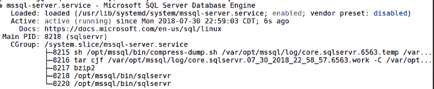
3.  列出的第二个 `sqlservr` 进程是实际的 `sqlservr` 引擎或子进程。
4.  运行以下命令来终止该进程：
    ```
    sudo kill -s SIGSEGV <pid>
    ```
    此命令向 `sqlservr` 进程发送一个它未准备处理的


## 图 9-13：Linux 上的核心转储

因此，该进程会意外终止。看门狗进程会收到信号，然后前述机制就会启动。如果你在执行 `kill` 命令后的几秒钟内运行以下命令，可以观察到核心转储的生成过程：

```bash
sudo systemctl status mssql-server
```

图 9-13 展示了在我的 Linux 服务器上的一个示例。

`图 9-13：为 Linux 上的 SQL Server 生成核心转储`

在 `/var/opt/mssql/log` 目录下会创建三个文件：

*   `core.sqlservr.<datetime>.<pid>.txt` – 包含有关崩溃原因的信息。
*   `core.sqlservr.<datetime>.<pid>.json` – `.txt` 文件的 JSON 版本。
*   `core.sqlservr.<datetime>.<pid>.tbz2` – 压缩文件，包含核心转储以及其他供微软技术支持和 SQL 工程团队使用的诊断数据。

### PSSDiag

SQL 2000 发布后不久，SQL Server 社区的支柱之一 Ken Henderson 加入了微软的技术支持团队。Ken 热爱创新，他与我支持团队的另一位超级聪明的同事 Bart Duncan 一起，构建了一个名为 `PSSDiag` 的工具，用于自动化收集 SQL Server 支持案例的诊断信息。这包括性能监视器数据、日志文件、SQL Server DMV 数据以及其他客户支持案例通常所需的文件。

**注意：** Ken 已于几年前去世，但他的影响力至今犹在。颇具讽刺意味的是，我在这本书里提到了他。事实上，我曾有幸与他合著了一本书，名为 *SQL Server 2005 Practical Troubleshooting*。当我构思这本书时，我想起了与 Ken 一起工作的经历，他撰写了许多书籍。Ken 对我开始在诸如 PASS Summit 这样的客户活动上发表演讲也产生了巨大影响。当然，我们也是朋友，因为他是一个狂热的达拉斯牛仔队球迷！Bart 目前仍在微软从事工程工作，当我们俩碰巧都访问雷德蒙德时，我偶尔会见到他。

`PSSDiag` 已成为微软技术支持用于 SQL Server 的历史上使用最广泛的工具之一。因此，在支持团队为 SQL Server on Linux 的发布做准备时，他们构建了一个可以在 Linux 上运行的 `PSSDiag` 版本。通过与 SQL 客户咨询团队合作，`PSSDiag` 被设计用于收集 Linux 操作系统信息以及 SQL Server 诊断数据。你可以通过这篇博文自行下载该工具，了解其工作原理以及它收集的详细信息：[`blogs.msdn.microsoft.com/sqlcat/2017/08/11/collecting-performance-data-with-pssdiag-for-sql-server-on-linux`](https://blogs.msdn.microsoft.com/sqlcat/2017/08/11/collecting-performance-data-with-pssdiag-for-sql-server-on-linux)。

#### 总结

本章结束了本书*核心*部分，因为它为你提供了重要信息，帮助你在构建好数据库并部署应用程序后，准备好管理和监控 SQL Server。对于那些希望将旧版本的 SQL Server 或其他数据库产品（如 ORACLE 或 PostgreSQL）迁移过来的读者，你将需要阅读第 10 章，以获得迁移的见解和指导。或者，你可以直接跳到本书的最后一章，我将描述并讨论 SQL Server 如何与 Docker 容器协同工作。

## 第 10 章：迁移至 Linux 上的 SQL Server

阅读本书的读者中，有些人正在构建新的数据库，并将使用本书前面的章节来创建新的数据库和应用程序。然而，另一些读者可能已经在 SQL Server 或其他数据库产品上拥有现成的数据库，并且正在寻求


# 第十章：迁移至 Linux 版 SQL Server

如果你正计划迁移至 Linux 版 SQL Server，那么本章就是为你准备的。然而，即使你并不打算进行迁移，我想你也会有兴趣浏览本章内容，本章分为以下几个小节：

-   **从 SQL Server 迁移**：在本节中，我将讨论从早期版本的 SQL Server 迁移至 Linux 版 SQL Server 的工具和注意事项。
-   **从 Oracle 迁移**：在本节中，我将探讨从 Linux 版 Oracle 迁移至 Linux 版 SQL Server 的机制。
-   **从 PostgreSQL 迁移**：在本节中，我将就 SQL Server 与 PostgreSQL 的功能比较给出我的看法。同时，我也会提供一些关于如何将数据库从 PostgreSQL 迁移至 Linux 版 SQL Server 的技巧和资源。
-   **迁移后注意事项**：一旦你从 SQL Server 或其他数据库产品迁移完成后，你应该考虑几个迁移后的步骤和操作，以确保在 Linux 版 SQL Server 上获得良好的使用体验。

**提示**：请关注负责 SQL Server 和 Azure 数据服务迁移策略的团队博客，以获取最新信息：[`https://blogs.msdn.microsoft.com/datamigration`](https://blogs.msdn.microsoft.com/datamigration)。

© Bob Ward 2018
B. Ward, *Pro SQL Server on Linux*, [`https://doi.org/10.1007/978-1-4842-4128-8_10`](https://doi.org/10.1007/978-1-4842-4128-8_10)

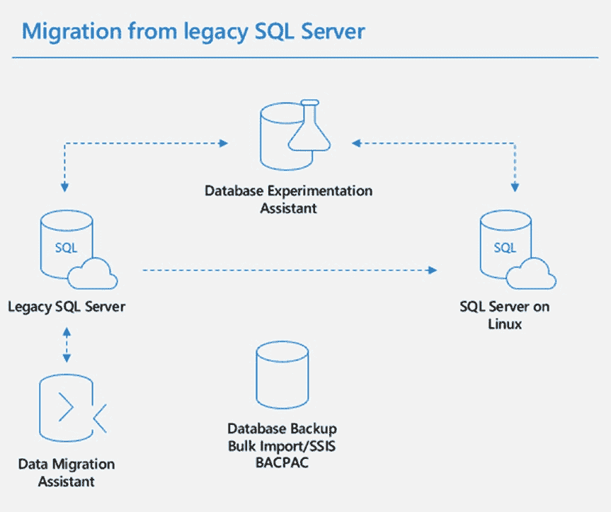

#### 从 SQL Server 迁移

自从我们推出 Linux 版 SQL Server 以来，我遇到过一些客户，他们当前在 Windows 上使用早期版本的 SQL Server，但正在考虑迁移到 Linux 版 SQL Server。本章就是为你们准备的。我将讨论迁移的整体流程、用于准备迁移的工具，以及执行迁移的工具和技术。

图 10-1 展示了从早期版本的 SQL Server 迁移至 Linux 版 SQL Server 的整体流程图示。

**图 10-1.** 从早期版本 SQL Server 迁移至 Linux 版 SQL Server 的流程

在本节中，我将介绍可以帮助你从旧版 SQL Server 迁移到 Linux 版 SQL Server 的组件。微软提供了用于准备迁移的工具，称为 `数据迁移助手` 和 `数据库实验助手`。我还将讨论如何使用数据库备份、通过批量导入或 SSIS 包导出导入数据，或使用数据层应用程序文件（称为 BACPAC 文件）来执行数据库迁移。

在你阅读完这些关于迁移准备和执行的小节后，请务必不要错过本章关于“迁移后注意事项”的部分，以了解迁移完成后需要进行的后续步骤。

### 迁移准备

根据图 10-1，准备将一个或多个数据库迁移至 Linux 版 SQL Server 的核心是使用两个工具：

-   **数据迁移助手**：`数据迁移助手`（`DMA`）工具可免费下载，可用于评估 SQL Server 实例和数据库的配置，指出迁移后可能出现的潜在问题，并提示在你开始使用 Linux 版 SQL Server 时可能有帮助的新功能。此外，该工具还会检查 SQL Server on Windows 上可能使用了哪些在 Linux 版 SQL Server 上不受支持的功能。

**注意**：`DMA` 可用于迁移你的数据，并且具备迁移到 Azure SQL 数据库和 Azure 虚拟机中 SQL Server 的功能。你可以在 [`https://docs.microsoft.com/sql/dma/dma-overview`](https://docs.microsoft.com/sql/dma/dma-overview) 阅读 `DMA` 功能和特性的完整列表（包括下载该工具的链接）。

-   **数据库实验助手**：评估静态


了解你的实例或数据库的配置详情，对于确保迁移过程更加顺畅非常有帮助。然而，大多数用户在迁移到新版 `SQL Server`（例如在 `Linux` 上运行的 `SQL Server 2017`）时，也同样关心查询性能。数据库实验助手 (`DEA`) 工具可以帮助你在两个版本的 `SQL Server` 之间追踪、执行并比较查询工作负载。

让我们来了解一下这些工具的各项功能，为将数据库迁移到 `Linux` 上的 `SQL Server` 做好准备。

## 数据库迁移助理

`DMA` 工具包含的功能可以检查你的 `SQL Server` 配置、数据库以及数据库中的 `T-SQL` 对象（例如 `stored procedures`）对于迁移目标版本 `SQL Server` 的兼容性。

**注意** 对于不兼容 `T-SQL` 的使用情况，`DMA` 只能检查数据库中的对象，如 `stored procedures`。它不会检查应用程序代码中 `T-SQL` 的兼容性。

此外，`DMA` 可以查找你的目标 `SQL Server` 版本中可能有助于改进你使用 `SQL Server` 的新功能，例如 `columnstore indexes`。

最后，如果目标 `SQL Server` 版本是 `Linux`，`DMA` 可以检查你是否使用了 `SQL Server on Linux` 不支持的功能，比如 `SQL Server Replication`。

目前，支持兼容性、新功能和功能对等性（Feature Parity）的规则并未公开记录。不过，我曾与构建 `DMA` 的团队成员 Venkata Raj Pochiraju 和 Sreraman Narasimhan 交流过，他们让我深入了解了 `DMA` 所支持的检查范围类型。

**提示** 你可以通过使用像 `xeprofiler` 这样的工具来追踪 `DMA` 所使用的查询，从而深入了解 `DMA` 如何检查兼容性、新功能和功能对等性。我经常使用 `xeprofiler` 和 `extended events` 来“调试”工具的行为。

# 第 10 章 迁移到 Linux 上的 SQL Server

### 兼容性问题

-   使用旧版 `T-SQL` 语句，如 `COMPUTE`，而不是替代功能，如 `T-SQL ROLLUP`。
-   使用较旧的 `DBCC` 命令，如 `DBCC DBREINDEX`，而不是 `ALTER INDEX`。
-   对使用旧数据类型（如 `TEXT` 或 `IMAGE`）而不是新的 `varchar(max)` 或 `varbinary(max)` 类型发出警告。

### 新功能建议

-   使用 `columnstore indexes` 来加速分析性能。
-   使用安全功能，如 `Always Encrypted`、`TDE` 和 `dynamic data masking`。

### 功能对等性规则

包括对任何使用以下功能的检查，截至本书撰写时，这些功能在 `SQL Server on Linux` 上尚不支持（参见 `https://docs.microsoft.com/sql/linux/sql-server-linux-release-notes#Unsupported`）。

向你展示此工具的示例较为困难，因为我需要向你展示如何在 `Windows` 上构建一个 `SQL Server` 实例和一个数据库，以触发其中几条规则。事实证明，为 `SQL Server 2016` 构建的 `WideWorldImporters` 数据库并没有真正遇到值得指出的问题。我甚至回过头去使用我们为 `SQL Server 2008` 发布的旧示例数据库 `AdventureWorks`，它也没有真正暴露出任何问题。

不过，我曾与一些客户交流过，他们发现该工具对于评估旧版 `SQL Server` 并指出迁移到 `Windows` 和 `Linux` 上 `SQL Server` 的可能问题非常有用。

图 10-2 展示了一个示例屏幕，这是你在新建 `Database Migration Assistant` 项目并选择 `SQL Server 2017 on Linux` 作为目标时会看到的界面。

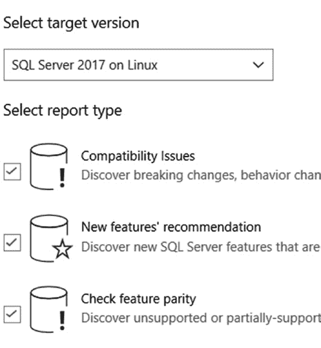

**图 10-2. 迁移到 SQL Server on Linux 的评估选项**

我强烈建议任何从旧版 `SQL Server` 迁移到 `SQL Server on Linux` 的用户，在执行迁移之前使用 `DMA` 并仔细研究其结果。


# 迁移至 Linux 上的 SQL Server

## 相关资源

请务必阅读以下与数据迁移助手相关的资源：

*   运行数据迁移助手的最佳实践：[`docs.microsoft.com/sql/dma/dma-bestpractices`](https://docs.microsoft.com/sql/dma/dma-bestpractices)
*   了解如何使用 PowerShell 分析 DMA 结果：[`docs.microsoft.com/sql/dma/dma-consolidatereports#import-assessment-results-into-a-sql-server-database`](https://docs.microsoft.com/sql/dma/dma-consolidatereports#import-assessment-results-into-a-sql-server-database)
*   使用 PowerBI 示例报告以获取对大量数据库评估的分析：[`docs.microsoft.com/sql/dma/dma-powerbiassesreport`](https://docs.microsoft.com/sql/dma/dma-powerbiassesreport)

## 提示

**提示** 使用 `dmacmd.exe` 实用工具在无人参与模式下大规模评估数据库。有关如何使用 `dmacmd.exe` 的详细信息，请参阅：[`blogs.msdn.microsoft.com/datamigration/2016/11/08/data-migration-assistant-how-to-run-from-command-line/`](https://blogs.msdn.microsoft.com/datamigration/2016/11/08/data-migration-assistant-how-to-run-from-command-line/)

## 数据库实验助手

尽可能多地测试 SQL Server 应用程序的性能是成功迁移的最关键方面之一。数据库实验助手可以成为帮助您实现该目标的强大工具。其目标是使用 DEA 告诉您应用程序中的哪些查询在目标新版本 SQL Server 上运行得更好、更差或保持不变。此外，DEA 还可以告诉您哪些查询可能会失败，例如由于兼容性问题。

所有 DEA 文档目前都位于数据迁移博客的以下文章中：[`blogs.msdn.microsoft.com/datamigration/tag/dea/`](https://blogs.msdn.microsoft.com/datamigration/tag/dea/)。

### 使用 DEA 的准备工作

要正确使用 DEA，您可能需要最多四个 SQL Server 实例：

*   捕获工作负荷的**源** SQL Server。
*   两个**目标** SQL Server，用于重放捕获的工作负荷跟踪。
*   一个用于存储**分析**和运行报告的 SQL Server（您需要一个数据库来存储结果，因此它实际上可以存在于其中一个目标 SQL Server 实例上）。

### 使用 DEA 的基本流程

1.  备份源 SQL Server 上的数据库。
2.  使用 DEA 工具**捕获**工作负荷的跟踪，该工具可以使用 SQL Server 跟踪或扩展事件。如果您在早于 SQL Server 2012 的 SQL Server 版本上捕获工作负荷，则必须使用 SQL Server 跟踪，因为扩展事件在 SQL Server 2008 中没有所需的事件。DEA 支持 SQL Server 2005 作为源 SQL Server 版本，而扩展事件在该版本中不存在，因此您必须使用 SQL Server 跟踪。

    为了充分利用 DEA 工具，您需要捕获能代表应用程序的工作负荷跟踪。DEA 工具允许捕获五分钟到最长三小时的跟踪。您可能有一个可以在其上捕获应用程序跟踪的测试服务器，或者您可能需要在生产 SQL Server 上执行此操作。

    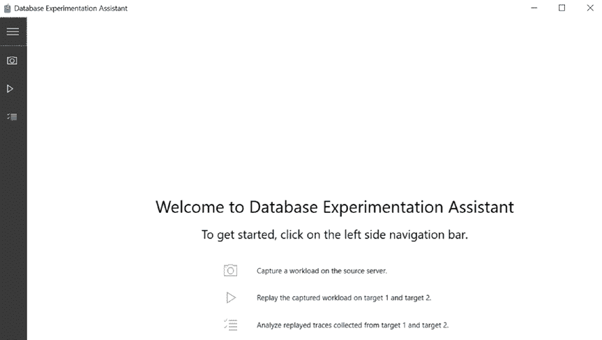

3.  通过将步骤 #1 中的备份还原到两个目标 SQL Server 实例来准备重放跟踪：
    目标服务器 #1 是与捕获步骤 #2 中跟踪的源相同的 SQL Server 版本。通常您不希望使用生产 SQL Server。


目标服务器 #2 是你要迁移到的新版 SQL Server，

它可以是 Linux 上的 SQL Server。

你应该将这些 SQL Server 实例设置为非常相似的环境，

包括 CPU、内存、磁盘速度以及 SQL Server 配置。

4. 使用 DEA 工具在**两个目标 SQL 服务器上**回放从步骤 #2 捕获的跟踪。DEA 工具会要求指定一个位置来保存回放的跟踪文件。

5. 使用 DEA 工具**分析**两个捕获的回放跟踪，以便你可以比较跟踪中查询的性能或可能出现的错误。

DEA 工具会提示你提供一个 SQL Server 数据库存储分析结果，以及步骤 #4 中回放跟踪的位置。

图 10-3 显示了用于执行所有这些步骤的 DEA 工具初始屏幕。

**图 10-3. 数据库实验助手 工具**

### 第 10 章 迁移到 Linux 上的 SQL Server

早期的 DEA 版本要求你使用 SQL Server 中一个名为分布式重放的功能。你仍然可以使用那种方法，但从 DEA 版本 2.6 开始，你可以使用 *InBuilt* 回放方法。InBuilt 回放方法内部使用一个名为 `ostress.exe` 的工具。也许你记得在上一章我提到了我在微软的一位同事 Keith Elmore？许多年前，当 Keith 刚加入微软技术支持部门时，他很快发现了使用多个并发线程执行查询或 T-SQL 脚本来对 SQL Server 进行压力测试的需求。Keith 一直是一位出色的程序员，因此他构建了一个使用 ODBC 的工具 `ostress.exe`。Keith 和 Robert Dorr 进一步合作扩展了 `ostress.exe`，使其能够回放捕获的 SQL Server 工作负载跟踪。Keith 和 Robert 将这些工具捆绑在一起，组成了一个名为 RML Utilities 的工具包。RML Utilities 可以从 [`www.microsoft.com/download/details.aspx?id=4511`](https://www.microsoft.com/download/details.aspx?id=4511) 免费下载。

不幸的是，`ostress.exe` 和 RML Utilities 不能在 Linux 上原生运行（我们有一个内部版本的 `ostress.exe` 通过 SQLPAL 运行，但目前尚未准备好发布），但如果你仍有 Windows 客户端可以连接到 Linux 上的 SQL Server，你可能会发现使用 `ostress.exe` 和 RML Utilities 是一套非常棒的工具。

在 Linux 上的 SQL Server 使用 DEA 需要一些特殊的配置。DEA 工具的开发者 Mollee Jain 给了我这些说明，是使 DEA 在 Linux 上工作所必需的（Mollee 的打算是将其写入数据迁移博客）。

你必须设置文件夹权限，以允许回放在 Linux 服务器上创建文件。用户可以通过多种方式设置此权限，但挂载共享文件夹可能是最简单的进展方式，因为它不需要重新配置防火墙。

*   要在 Linux 系统中挂载一个指定了 `uid` 和 `gid` 的共享文件夹，你可以使用如下 CIFS 命令：
    ```
    sudo mount.cifs //DEA/LinuxShare /var/opt/mssql/LinuxShare -o user=sqladmin,vers=2.0,dir_mode=0777,file_mode=0777,uid=996,gid=994
    ```
    **注意** 有几种方法可以设置你的 Linux 服务器以将文件写入你的 Windows 服务器。一种方法是使用 Samba，你可以在 [`app.pluralsight.com/library/courses/advanced-network-system-administration-lfce/table-of-contents`](https://app.pluralsight.com/library/courses/advanced-network-system-administration-lfce/table-of-contents) 了解更多相关信息。

*   在 DEA 回放步骤中，如果回放到 Linux，他们将需要提供 Linux 路径（即 `/var/opt/mssql/LinuxShare`）。

### 第 10 章 迁移到 Linux 上的 SQL Server

在捕获和回放跟踪以及使用报告进行评估时，DEA 有几个方面需要考虑。DEA 系列博客在练习使用此工具评估性能和执行方面提供了很好的示例和技巧...


关于您在 Linux 上使用 SQL Server 的工作负载和应用，我推荐以下这些具体的博客文章：

*   [使用数据库实验助手概述](https://blogs.msdn.microsoft.com/datamigration/2017/03/24/dea-2-0-how-to-use-database-experimentation-assistant/)
*   [DEA 2.6 的最新功能](https://blogs.msdn.microsoft.com/datamigration/2018/08/06/release-database-experimentation-assistant-dea-v2-6/)
*   [捕获常见问题解答](https://blogs.msdn.microsoft.com/datamigration/2017/03/24/dea-2-0-capture-trace-faq/)
*   [重放常见问题解答](https://blogs.msdn.microsoft.com/datamigration/2017/03/24/dea-2-0-replay-faq/)
*   [分析常见问题解答](https://blogs.msdn.microsoft.com/datamigration/2017/03/24/dea-2-0-analysis-faq)

## 执行迁移

既然您已经完成了迁移的准备工作，现在是时候将您的数据库迁移到`Linux 上的 SQL Server`了。您可以选择以下几种方式来执行迁移：

*   还原数据库备份。
*   使用大容量复制或`SSIS`包复制数据。
*   使用`BACPAC`导出和导入。

**注意** `SQL Server Management Studio`自带一项名为`复制数据库`的功能，该功能不支持从`Windows 上的 SQL Server`复制到`Linux 上的 SQL Server`。

让我们通过示例更详细地了解每个选项。

### 第 10 章：迁移到 Linux 上的 SQL Server

#### 还原数据库备份

从`Windows 上的 SQL Server`还原备份是`Linux 上的 SQL Server`兼容性方面的一个亮点。您允许将`SQL Server`的备份（最早可追溯到`SQL Server 2005`）还原到`Linux 上的 SQL Server 2017`。您实际上也可以附加数据库，遵循最早可追溯到`SQL Server 2005`的附加数据库流程。

**注意** 通过还原备份或附加数据库实现的“无痛”升级路径最早可追溯到`SQL Server 2008`。然而，从技术上讲，您可以还原或附加`SQL Server 2005`的备份或数据库文件，但存在一些您应考虑的限制和可能的问题。您可以在[supported-version-and-edition-upgrades-2017#SupportFor2005](https://docs.microsoft.com/sql/database-engine/install-windows/supported-version-and-edition-upgrades-2017#SupportFor2005)阅读更多相关信息。

在本书中，我已经向您展示了如何还原备份的示例，并且您已经看到这个过程非常简单。

1.  将备份文件复制到`Linux 上的 SQL Server`服务器，或放置在 Linux 服务器可以访问的已挂载目录上。
2.  确保文件的所有权具有`mssql`组和`mssql`所有者权限。


# 在 Linux 上还原 SQL Server 数据库

你可以通过任何能连接到 SQL Server on Linux 的有效工具，使用 T-SQL `RESTORE` 命令来执行此操作。

**注意**：数据库备份的元数据中存储了文件路径。因此，你必须始终使用 T-SQL `RESTORE` 语句的 `WITH MOVE` 选项，将数据库和事务日志文件移动到它们的新位置。并且，新位置必须设置为允许 Linux 上的 `mssql` 用户帐户访问。

尽管我在前面的章节中已经展示过这个例子，但让我们再次回顾一下将 `WideWorldImporters` 示例数据库还原到 SQL Server on Linux 的过程。

## 第 10 章：迁移到 SQL Server on Linux

1.  使用 bash shell 中的以下命令，在 Linux 服务器上复制 `WideWorldImporters` 示例数据库：
    ```
    wget https://github.com/Microsoft/sql-server-samples/releases/download/wide-world-importers-v1.0/WideWorldImporters-Full.bak
    ```

2.  运行以下命令，这些命令来自示例脚本 `cpwwi.sh`，用于将备份复制到 `/var/opt/mssql` 目录：
    ```
    sudo cp WideWorldImporters-Full.bak /var/opt/mssql
    sudo chown mssql:mssql /var/opt/mssql/WideWorldImporters-Full.bak
    ```

3.  从任何有效的 SQL Server 工具运行以下命令来还原数据库，该命令来自 `restorewwi_linux.sql`（注意：我提供了一个 bash shell 脚本 `restorewwi.sh` 来使用 `sqlcmd` 在 Linux 服务器上运行此 SQL 脚本）：
    ```
    restore database WideWorldImporters from disk = '/var/opt/mssql/WideWorldImporters-Full.bak' with
    move 'WWI_Primary' to '/var/opt/mssql/data/WideWorldImporters.mdf',
    move 'WWI_UserData' to '/var/opt/mssql/data/WideWorldImporters_UserData.ndf',
    move 'WWI_Log' to '/var/opt/mssql/data/WideWorldImporters.ldf',
    move 'WWI_InMemory_Data_1' to '/var/opt/mssql/data/WideWorldImporters_InMemory_Data_1'
    go
    ```

还原操作将执行并运行一系列 `upgrade steps`，通常是针对新版本 SQL Server 所需的系统表更改，以完成数据库还原，因为 `WideWorldImporters` 示例是使用 Windows 上的 SQL Server 2016 备份的。

`RESTORE` 执行的输出应类似于以下内容：

```
Processed 1464 pages for database 'WideWorldImporters', file 'WWI_Primary' on file 1.
Processed 53096 pages for database 'WideWorldImporters', file 'WWI_UserData' on file 1.
Processed 33 pages for database 'WideWorldImporters', file 'WWI_Log' on file 1.
Processed 3862 pages for database 'WideWorldImporters', file 'WWI_InMemory_Data_1' on file 1.
Converting database 'WideWorldImporters' from version 852 to the current version 869.
Database 'WideWorldImporters' running the upgrade step from version 852 to version 853.
Database 'WideWorldImporters' running the upgrade step from version 853 to version 854.
Database 'WideWorldImporters' running the upgrade step from version 854 to version 855.
Database 'WideWorldImporters' running the upgrade step from version 855 to version 856.
Database 'WideWorldImporters' running the upgrade step from version 856 to version 857.
Database 'WideWorldImporters' running the upgrade step from version 857 to version 858.
Database 'WideWorldImporters' running the upgrade step from version 858 to version 859.
Database 'WideWorldImporters' running the upgrade step from version 859 to version 860.
Database 'WideWorldImporters' running the upgrade step from version 860 to version 861.
Database 'WideWorldImporters' running the upgrade step from version 861 to version 862.
Database 'WideWorldImporters' running the upgrade step from version 862 to version 863.
Database 'WideWorldImporters' running the upgrade step from version 863 to version 864.
Database 'WideWorldImporters' running the upgrade step from version 864 to version 865.
Database 'WideWorldImporters' running the upgrade step from version 865 to version 866.
Database 'WideWorldImporters' running the upgrade step from version 866 to version 867.
Database 'WideWorldImporters' running the upgrade step from version 867 to version 868.
```


数据库 `WideWorldImporters` 正在执行从版本 868 到版本 869 的升级步骤。

RESTORE DATABASE 在 1.351 秒内成功处理了 58455 页 (338.027 MB/秒)。

任何从旧版本 SQL Server 还原的备份到新版本，都将保留旧版本的*数据库兼容性*。请参阅“迁移后注意事项”章节，了解有关数据库兼容性的讨论。

对于超大型数据库（100GB 或更大，这里我为了迁移目的定义超大型的标准），还原备份是在 Linux 上迁移到 SQL Server 的最快方法。

## 使用大容量复制或 SSIS 包复制数据

可能有一些原因导致您不想通过还原数据库备份来迁移到 SQL Server on Linux。也许在迁移过程中，您希望修改数据库中现有对象的定义。您可以在还原备份后执行此操作。或者，您可以创建一个新的数据库（可能带有新的文件定义），创建新对象，然后使用 SQL Server 工具将数据从现有 SQL Server 数据库导出，并将数据导入到新的数据库结构中。

对于 Windows 上的 SQL Server，您可以使用 `bcp` 程序导出数据，将文件复制到 Linux 服务器，然后在 Linux 上使用 `bcp` 将数据导入到您的新数据库中。我在前面关于工具的章节中介绍了 `bcp` 程序，但您也可以在 [`docs.microsoft.com/sql/linux/sql-server-linux-migrate-bcp`](https://docs.microsoft.com/sql/linux/sql-server-linux-migrate-bcp) 阅读更多关于 `bcp` 的信息。

您可能有一个更复杂的提取、转换和加载 (ETL) 过程来迁移到 Linux 上的新 SQL Server 数据库。在这种情况下，考虑创建一个 SQL Server Integration Services (SSIS) 包。虽然您必须使用 Windows 客户端上的工具来创建 SSIS 包，但 Linux 上的 SQL Server 支持在 Linux 服务器上执行 SSIS 包。您可以在 [`docs.microsoft.com/sql/linux/sql-server-linux-migrate-ssis`](https://docs.microsoft.com/sql/linux/sql-server-linux-migrate-ssis) 阅读更多关于 Linux 上 SSIS 的信息。

## 使用 BACPAC 进行导出和导入

将现有 SQL Server 数据库迁移到 Linux 上 SQL Server 的第三种选择是一个称为 *BACPAC* 文件的数据层应用程序包。BACPAC 文件具有高度的可移植性，可用于迁移到其他平台，例如 Azure。BACPAC 文件是一个包，包含数据库的定义或架构、文件以及对象（如表和索引）。此外，该包还包含从用户表中导出的数据版本。

BACPAC 文件可以通过 SQL Server Management Studio 的可视化界面向导或 `sqlpackage` 程序创建。您现在可以从 [`docs.microsoft.com/sql/tools/sqlpackage`](https://docs.microsoft.com/sql/tools/sqlpackage) 在 Windows、macOS 或 Linux 上使用 `sqlpackage`。BACPAC 文件是通过这些工具的选项来 *导出* 包而创建的。您可以在 [`docs.microsoft.com/sql/relational-databases/data-tier-applications/export-a-data-tier-application`](https://docs.microsoft.com/sql/relational-databases/data-tier-applications/export-a-data-tier-application) 阅读更多关于导出 BACPAC 文件的信息。同一套工具可用于 *导入* 包。导入包将执行该包，其中包括创建数据库、创建文件、所有对象以及导入所有数据。您可以在 [`docs.microsoft.com/sql/relational-databases/data-tier-applications/import-a-bacpac-file-to-create-a-new-user-database`](https://docs.microsoft.com/sql/relational-databases/data-tier-applications/import-a-bacpac-file-to-create-a-new-user-database) 阅读更多关于导入过程的信息。


[将 BACPAC 文件导入以创建新的用户数据库](https://docs.microsoft.com/sql/relational-databases/data-tier-applications/import-a-bacpac-file-to-create-a-new-user-database)

以下是一个在 Windows 上的 SQL Server 中从 Powershell 运行`sqlpackage`以导出数据库 BACPAC 文件的示例命令：

```
.\sqlpackage /A:Export /ssn:<sql server> /sdn:<database> /tf:c:\temp\wwi.bacpac
```

以下是在同一个 Windows 客户端上执行`sqlpackage`，将包导入到 Linux 上的目标 SQL Server 的示例：

```
.\sqlpackage /A:Import /tsn:<Linux SQL instance> /tdn:<target db name> /sf:c:\temp\wwi.bacpac /tu:sa /tp:<sa password>
```

您无需在 Linux 的 SQL Server 实例上预先创建数据库。`sqlpackage`在执行 BACPAC 文件中的所有操作时会完成此创建。

#### 从 Oracle 迁移

您阅读本书，可能正考虑从另一个数据库平台（如 Oracle）迁移到 Linux 上的 SQL Server。在本书的这一部分，我将不涉及 Oracle 与 SQL Server 之间的功能对比。在本书此前的内容中，我已尽力描述 Linux 上 SQL Server 的所有特性和功能，旨在帮助您了解并熟悉其能力，以备您考虑从 Oracle 迁移而来。

在本节中，我将假定您已做出迁移的决定，或正在测试迁移，以便评估您的应用在 Linux 上的 SQL Server 上的行为和性能。虽然有多种方法可以从 Oracle 导出数据，以便您可以在 Linux 上的 SQL Server 上创建自己的数据库并导入数据，但 SQL Server 提供了一个免费工具来协助从 Oracle 迁移。该工具称为`SQL Server 迁移助手`（`SSMA`）。

`SSMA`支持许多不同的数据平台源，包括 Oracle、DB2、MySQL 和 SAP ASE，可迁移至多个不同的 Microsoft 目标数据库平台，包括 Linux 上的 SQL Server。有关`SSMA`支持的源和目标的完整列表，请参阅我们的文档：[`docs.microsoft.com/sql/ssma/sql-server-migration-assistant#supported-sources-and-target-versions`](https://docs.microsoft.com/sql/ssma/sql-server-migration-assistant#supported-sources-and-target-versions) 和 [`docs.microsoft.com/sql/linux/sql-server-linux-migrate-ssma`](https://docs.microsoft.com/sql/linux/sql-server-linux-migrate-ssma)。在本章的剩余部分，我将使用`SSMA`来描述从 Oracle 迁移的准备和执行过程。

有关`SSMA`的完整参考，请参阅我们的文档：[`docs.microsoft.com/sql/ssma/sql-server-migration-assistant`](https://docs.microsoft.com/sql/ssma/sql-server-migration-assistant)。当您阅读完这些关于从 Oracle 迁移的准备和执行的章节后，请务必查看本章中关于“迁移后注意事项”的部分。

## 迁移准备

由于`SSMA`工具仅在 Windows 上运行，您将需要三个能够相互连接的计算环境来完成从 Oracle 到 Linux 上的 SQL Server 的迁移：

•   运行 Oracle 的 Linux 服务器

•   运行 Linux 版 SQL Server 的新 Linux 服务器

•   运行`SSMA`工具的 Windows 客户端

运行`SSMA`的 Windows 客户端必须能够通过 TCP/IP 连接到每个服务器，因此您需要确保打开所有防火墙端口以允许远程连接。使用`SSMA`时，Oracle 服务器和 SQL Server 之间不需要能够相互连接。

要使用`SSMA`准备迁移，您需要将`SSMA`工具安装在


## 第 10 章 迁移到 Linux 上的 SQL Server

你首选的 Windows 客户端。请仔细遵循我们文档中的说明，因为存在来自其他组件的依赖关系（例如 Oracle 客户端软件），需要它们才能使 SSMA 正常工作。你可以在我们的文档中阅读详细信息：[`docs.microsoft.com/sql/ssma/oracle/installing-ssma-for-oracle-client-oracletosql`](https://docs.microsoft.com/sql/ssma/oracle/installing-ssma-for-oracle-client-oracletosql)。

此外，由于你是迁移到 SQL Server，你需要提前按照我在书中概述的最佳实践和性能建议来创建数据库和文件。

最后一点重要的提示：你需要使用 Oracle 的现有工具仔细测量 Oracle 工作负载的性能并进行记录。你需要将这个性能基线与迁移后使用 SQL Server 的应用程序进行比较。

### 执行迁移

`SSMA` 工具基于一个称为“项目”的概念工作。使用项目的迁移过程如下：

1.  创建一个 `SSMA` 项目并配置设置。
2.  连接到 `Oracle` 服务器。
3.  连接到 `Linux` 上的 `SQL Server`。
4.  在 `Oracle` 和 `SQL Server` 之间映射架构（或使用默认映射）。
5.  转换 `Oracle` 架构，包括选择要转换的对象的能力。此文档对可以从 `Oracle` 转换和不能转换的内容有出色的描述：[`docs.microsoft.com/sql/ssma/oracle/converting-oracle-schemas-oracletosql`](https://docs.microsoft.com/sql/ssma/oracle/converting-oracle-schemas-oracletosql)。此时，`SSMA` 将项目信息保存为可以转换为 `T-SQL` 语句的形式，以便在 `SQL Server` 上迁移选定的 `Oracle` 架构和对象。
6.  将转换后的对象加载到 `SQL Server` 中。你可以让 `SSMA` 执行此操作，或者将信息保存到 `T-SQL` 脚本中，然后使用任何有效的 `SQL Server` 工具运行该脚本（包括根据你的需要对其进行修改）。
7.  使用 `SSMA` 将数据迁移到 `Linux` 上的 `SQL Server`。

整个过程在以下文档中有详细说明：[`docs.microsoft.com/sql/ssma/oracle/migrating-oracle-databases-to-sql-server-oracletosql`](https://docs.microsoft.com/sql/ssma/oracle/migrating-oracle-databases-to-sql-server-oracletosql)。

你会喜欢这样一个事实：拥有 `SSMA` 的我们的工程团队构建了一个分步教程，指导如何使用 `SSMA` 从 `Oracle` 迁移到 `Linux` 上的 `SQL Server`。因此，你可以设置自己的环境，并按照我们文档中的每个步骤操作：[`docs.microsoft.com/sql/ssma/oracle/sql-server-linux-convert-from-oracle`](https://docs.microsoft.com/sql/ssma/oracle/sql-server-linux-convert-from-oracle)。本教程使用 `HR` 示例架构中的对象，该架构随每个 `Oracle` 安装一同提供。

我自己在 `Azure` 中使用三台虚拟机完成了这个教程（一台用于 `Oracle`，一台用于 `Linux` 上的 `SQL Server`，一台用于运行 `SSMA` 的 `Windows` 机器）。它如宣传的那样有效，有几点需要注意：

*   教程的前提条件中没有明确指出，如果你要迁移的 `Oracle` 服务器运行在 `Linux` 上，你需要一个运行 `Windows` 的第三方计算环境来运行 `SSMA`。
*   如果 `SQL Server Agent` 没有在 `Linux` 上的 `SQL Server` 上运行，你会收到一条警告，提示服务器端迁移不可行。服务器端迁移在 `Linux` 上的 `SQL Server` 中不支持，因此可以忽略此警告。

## 10 迁移到 Linux 上的 SQL Server

本教程使用 Oracle 12c，但我使用 Oracle 11 XE（免费版本）也完成了此操作。当我使用 `SSMA` 连接到 Oracle 实例时，由于我使用的是 XE 版本，Oracle 实例的名称是 `XE`，登录名是 `SYSTEM`。

教程要求选择 `SQL Server 2017 (Linux) - Preview` 作为目标，但最新版本的 `SSMA` 仅将 `SQL Server 2017` 作为选项（对于 Linux 不再处于预览状态）。

由于以 Linux 上的 `SQL Server` 为目标的 `SSMA` 不支持服务器端迁移，因此 Oracle 服务器和 Linux 上的 `SQL Server` 不必能够相互通信。`SSMA` `Windows` 客户端会分别连接到每个服务器以传输数据。

图 10-4 显示了我使用 `SSMA` 将 `HR` 模式从 Oracle 11 XE 迁移到 Linux 上的 `SQL Server` 的最终结果。

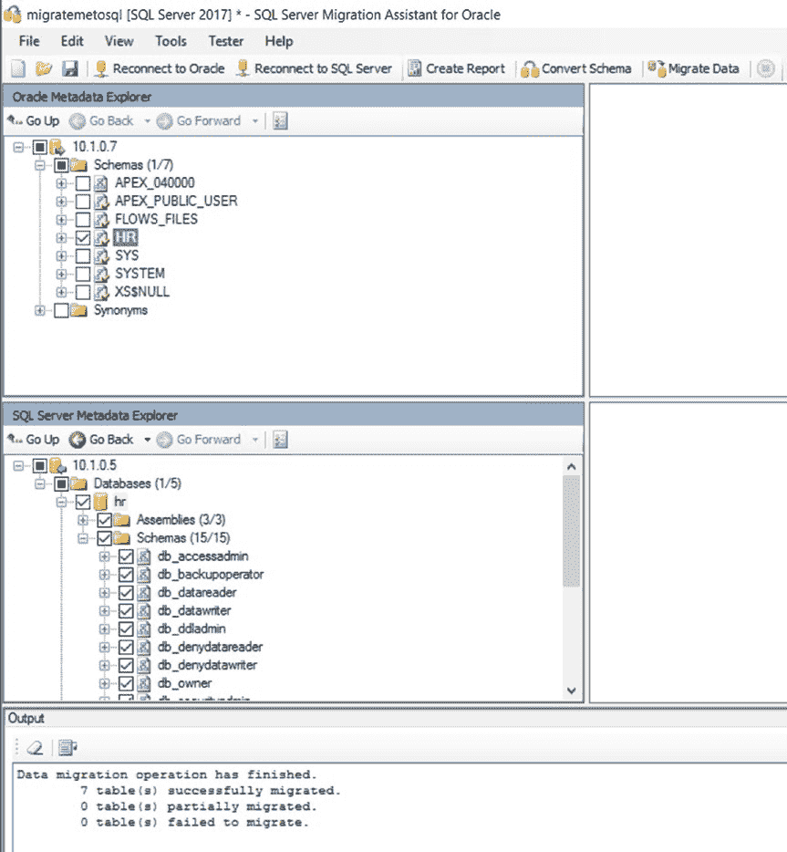

**图 10-4** 使用 `SSMA` 从 Oracle 成功迁移到 Linux 上的 SQL Server

您的迁移项目可能比 `HR` 模式从 Oracle 迁移的示例更复杂。然而，`SSMA` 在将 Oracle 对象转换为 `SQL Server` 方面相当稳健。`SSMA` 的首席程序经理 `Shamik Ghosh` 根据他的经验告诉我，`SSMA` 应该能够将 90% 以上的 Oracle 对象和数据转换到 `SQL Server`，即使是更复杂的 Oracle 模式也是如此。

`SSMA` 支持从命令行执行迁移，您可以在此处阅读有关此功能的更多信息：`https://docs.microsoft.com/sql/ssma/oracle/command-line-options-in-ssma-console-oracletosql`。命令行选项的完整语法可以在此处查看：`https://docs.microsoft.com/sql/ssma/oracle/appendix-1-oracletosql`。

对于从 Oracle 进行的完整生产迁移，我建议您通读 `SSMA` 文档的所有主要部分：`https://docs.microsoft.com/sql/ssma/oracle/sql-server-migration-assistant-for-oracle-oracletosql`。

#### 从 PostgreSQL 迁移

`PostgreSQL` 已成为用于应用程序的非常流行的开源数据库引擎。但是，一些用户发现 `PostgreSQL` 可能无法满足其应用程序的需求，原因可能是缺乏特定功能或需要高性能扩展。

在本节中，我将从功能角度为您提供 `SQL Server` 与 `PostgreSQL` 比较的看法。`SSMA` 工具目前不支持从 `PostgreSQL` 到 `SQL Server` 的迁移。我将分享关于如何将数据库架构和数据从 `PostgreSQL` 迁移到 Linux 上的 `SQL Server` 的想法。请务必阅读本章关于迁移后注意事项的部分，以完善迁移体验。

> **注意**：如果您是 `PostgreSQL` 用户并希望迁移到 Linux 上的 `SQL Server`，我希望本书能为您提供如何执行此操作并成功部署的知识。但是，如果您有一些希望保留在 `PostgreSQL` 中的数据库，我强烈建议您查看 Azure 中托管的 `PostgreSQL` 服务：`https://docs.microsoft.com/en-us/azure/postgresql/`。

### PostgreSQL 与 SQL Server 如何比较？

我将本节称为“支持 SQL Server 的理由”。我过去没有使用过 `PostgreSQL`，因此不会声称自己是使用它的专家。为了编写本章，我在 `RHEL` 上安装了 `PostgreSQL`，并对其功能进行了一些基本测试。此外，我还做了一些……

# 第 10 章：迁移至 Linux 上的 SQL Server

我在本书中讨论过的 SQL Server 各项功能和特性，也研究了 PostgreSQL 是否具备同样的能力。坦白说，我使用了以下资源进行这项研究：

*   PostgreSQL 主站点，包含概述：[`www.postgresql.org/about/`](https://www.postgresql.org/about/)
*   PostgreSQL 10 版本文档：[`www.postgresql.org/files/documentation/pdf/10/postgresql-10-A4.pdf`](https://www.postgresql.org/files/documentation/pdf/10/postgresql-10-A4.pdf) （注：我没有选择使用当时处于测试阶段的 11 版本。）
*   以下 PostgreSQL 教程：[`www.postgresqltutorial.com/`](http://www.postgresqltutorial.com/) 和 [`www.tutorialspoint.com/postgresql`](http://www.tutorialspoint.com/postgresql)
*   面向忙碌人群的 PostgreSQL 入门指南：[`zaiste.net/postgresql_primer_for_busy_people/`](https://zaiste.net/postgresql_primer_for_busy_people/)
*   PostgreSQL 维基百科页面：[`en.wikipedia.org/wiki/PostgreSQL`](https://en.wikipedia.org/wiki/PostgreSQL)
*   一个讲解 PostgreSQL 架构的优秀幻灯片：[`people.inf.elte.hu/kiss/14kor/korszeru-ea-01-postgre.pdf`](http://people.inf.elte.hu/kiss/14kor/korszeru-ea-01-postgre.pdf)

**注**：我对`PostgreSQL`的评估是基于上述资料中记录的核心开源版本。由于`PostgreSQL`是开源的，存在由其他组织修改的`PostgreSQL`发行版，例如[EnterpriseDB](https://www.enterprisedb.com/)和[Crunchy Data](https://www.crunchydata.com/)。甚至在[`wiki.postgresql.org/wiki/PostgreSQL_derived_databases`](https://wiki.postgresql.org/wiki/PostgreSQL_derived_databases)有一个庞大的`PostgreSQL`衍生发行版和分支列表。我并未使用这些资源来比较 Linux 上的 SQL Server。

除了这项研究，我还与微软的两位工程师 Michal Primke 和 Harini Gupta（他们负责我们的 Azure for `PostgreSQL`服务）一起复核了我的对比，他们同意以下比较中的所有观点。

与其尝试进行详尽的比较，我研究的是 SQL Server 拥有而`PostgreSQL`没有，或在我看来比`PostgreSQL`更优的功能和特性。在本节中，我将按以下几个领域列出此对比：核心数据库引擎、SQL 语言、工具、性能、安全性、高可用与灾难恢复（HADR）、以及管理与监控。如果你在本书中讨论的某个 SQL Server 功能未在此部分列出，那是因为`pgsql`具有同等功能，或者我找不到两者之间足够显著的差异来加以强调。我提供这些信息是为了让你了解，在 Linux 上使用 SQL Server 相比使用`PostgreSQL`能为你的应用带来的独特价值。

**注**：从本章此处开始，我将把`PostgreSQL`称为`pgsql`（如果你每次都需要输入`PostgreSQL`，你也会这么做的）。

## 核心数据库引擎

核心数据库引擎内置的几个方面与`pgsql`不同，其差异显著到值得单独列出：

*   **线程 vs. 进程**
    `pgsql`文档指出，服务器的架构基于一组进程而非线程。所有`pgsql`工作都是通过独立的进程完成的。所有的


# 第 10 章 迁移到 SQL Server on Linux

后台任务（如检查点进程）是独立的进程。每个到`pgsql`的连接都会催生一个新进程。在我对 RHEL 的测试中，每个为支持新连接而衍生的进程大约需要 5MB 内存（这意味着即使是 300 个并发空闲连接也可能需要约 1.5GB 内存）。我了解到，衍生新进程的开销并不大，并且每个连接占用 5MB 内存的代价也不算高。`sqlservr`是 SQL Server 在 Linux 上的单一进程，它使用线程来支持所有后台任务，并使用线程工作池来支持连接和查询。

我对这种衍生进程的架构感到惊讶，但后来我想起了大学毕业后的早期职业生涯中使用的`Ingres`数据库，它也采用了相同的设计。`pgsql`正是源自最初的`Ingres`数据库引擎。那么哪种架构更好呢？在 Windows 上，使用线程被证明是比使用多进程更好的方法。我个人认为，我们的 TPC 基准测试性能本身就说明了 SQL Server on Linux 相较于`pgsql`在性能和可扩展性上的优势。您可以在[`www.tpc.org/3331`](http://www.tpc.org/3331)查看 SQL Server on Linux 最新的 TPC-H #1 基准测试结果。

## CPU 和 NUMA 分配

SQL Server 提供了内置功能来控制其线程将使用哪些 CPU 和/或 NUMA 节点进行执行。此外，SQL Server 还使用名为“自动软 NUMA”的功能来提升在高密度核心插座系统上的可扩展性。`pgsql`在数据库引擎中不提供任何此类功能。

## 多文件与预写日志文件放置

`pgsql`有一个称为“表空间”的概念。它类似于 SQL Server 的文件组对象，允许您将对象放置在与默认数据库目录不同的磁盘位置。然而，您无法像在 SQL Server 中那样，为表空间指定多个文件来分散 I/O 负载。`pgsql`有其自身创建支持数据库文件的方法，但您无法控制该过程。一个特定表空间只有一个目录，因此与表空间相关的对象被限制在磁盘上的单个目录中。

此外，在`pgsql`中，无法按数据库分离事务日志（称为预写日志或 WAL）数据的存储位置。SQL Server 允许您为每个数据库精确指定事务日志的位置。`pgsql`在其最佳实践文档中建议通过移动`pg_wal`目录来更改 WAL 目录的位置，但所有数据库的 WAL 数据都会存入该目录。

## 数据库大小控制

使用`pgsql`创建的数据库没有固定大小，它可以持续增长，直到磁盘空间耗尽或触及任何 Linux 空间限制。正如您从阅读本书所了解的，SQL Server 允许您对数据库和事务日志文件的大小进行精细控制，包括初始大小、最大大小和自动增长参数。

## 校验和

`pgsql`确实支持数据库页的校验和概念。但是，您必须在首次使用`initdb`初始化`pgsql`时指定是否启用此选项。此外，[其文档](https://www.postgresql.org/docs/current/static/app-initdb.html)指出“...启用校验和可能会带来显著的性能损失”。在`pgsql`中，校验和无法按数据库进行控制。SQL Server 默认为数据库启用校验和，我们这样做是因为它不会带来显著的性能损失。此外，我们允许您随时在数据库范围内开启或关闭此功能。

## 缓冲池缓存

SQL Server 和`pgsql`都有缓冲池缓存的概念。然而，`pgsql`也不使用`O_DIRECT`选项（即直接 I/O）打开数据库文件。因此，


# 迁移到 Linux 上的 SQL Server

## 缓冲区
Linux 内核为 PostgreSQL 缓冲所有文件 I/O 到文件系统缓存中，这几乎使数据库页面所需的内存量翻倍（注意：这取决于您如何使用 `shared_buffers` 设置配置 PostgreSQL 的共享缓冲区缓存）。

## 计划缓存
SQL Server 可以缓存临时 T-SQL 语句，甚至可以自动参数化它们。
PostgreSQL 只缓存预处理语句和 PL/pgSQL 代码。

##### 时态表
时态表是 SQL Server 的内置功能。标准的 PostgreSQL 发行版不支持此功能。经过研究，我发现 PostgreSQL 可以通过 *自定义扩展* 支持时态表，该扩展位于 [`pgxn.org/dist/temporal_tables/`](https://pgxn.org/dist/temporal_tables/)。问题是，此扩展并非核心 PostgreSQL 文档 [`www.postgresql.org/docs/current/static/contrib.html`](https://www.postgresql.org/docs/current/static/contrib.html) 中记录的标准扩展之一。因此，我不确定该扩展的可靠性或支持情况。您可以在此处阅读有关 SQL Server 时态表的更多信息：[`docs.microsoft.com/sql/relational-databases/tables/temporal-tables`](https://docs.microsoft.com/sql/relational-databases/tables/temporal-tables)。

##### 图数据库
PostgreSQL 中没有与 SQL Server 图数据库功能等效的功能，后者通过 T-SQL 支持节点和边缘表类型以及新的 `MATCH` 语法。我在 PostgreSQL 中看到的大多数示例都讨论了使用递归公用表表达式 (CTE) 查询来实现此功能。然而，这正是我们构建新图数据库功能的实际原因：使使用表设计自然的图数据模型比编写复杂查询更简单。您可以在此处阅读有关 SQL Server 图数据库的更多信息：[`docs.microsoft.com/sql/relational-databases/graphs/sql-graph-overview`](https://docs.microsoft.com/sql/relational-databases/graphs/sql-graph-overview)。

# 迁移到 Linux 上的 SQL Server（续）

##### 原生评分
PostgreSQL 支持使用 Python 作为语言编写服务器端代码的功能（使用 `CREATE FUNCTION`）。正如我在书中提到的，Windows 上的 SQL Server 2017 支持内置的 R 和 Python 代码，但目前 Linux 上的 SQL Server 不支持（相信我，它即将到来！）。我在前面章节中提到的 SQL Server 引擎内置的一个不错功能称为 *原生评分*。原生评分允许您将持久化的机器学习模型作为输入，并使用新的 T-SQL `PREDICT` 语句来执行高速、可扩展的预测应用程序。PostgreSQL 不提供原生评分功能。您可以在此处阅读有关 SQL Server 原生评分的更多信息：[`docs.microsoft.com/sql/advanced-analytics/sql-native-scoring`](https://docs.microsoft.com/sql/advanced-analytics/sql-native-scoring)。

# SQL 语言

在研究了 PostgreSQL SQL 语言后，我发现它与 T-SQL 有许多相似之处（这可能使迁移到 SQL Server 的过程比我最初想象的要容易），但有一些差异值得注意：

## T-SQL 批处理
避免 *啰嗦* 应用程序的一种方法是使用 T-SQL 批处理。T-SQL 批处理允许您在一次传输中向 SQL Server 发送多个 T-SQL 语句，由数据库引擎处理每个 T-SQL 语句。PostgreSQL 不提供此概念。每个 SQL 语句都是单独发送的，即使应用程序尝试执行多个语句。在 `psql` 工具中，每个 SQL 语句必须用分号分隔。

## 存储过程
PostgreSQL 中的服务器端编程是使用一种名为 PL/pgSQL 的语言完成的，该语言使用 SQL 语句（注意：在 SQL Server 中，所有语句都称为 T-SQL，无论它们是


## 第十章：迁移至 Linux 上的 SQL Server

它们属于 ANSI SQL 或 SQL Server 特定的语句）。在`pgsql`的第 10 版中，编写服务器端程序的唯一`PL/pgSQL`方式是使用`CREATE FUNCTION`创建*函数*（这不支持事务）。透明地讲，我了解到目前处于测试阶段的`pgsql`第 11 版计划支持`CREATE PROCEDURE` `PL/pgSQL`语句。在第 10 版中，我见过几个`pgsql`函数返回`VOID`类型来模拟存储过程的例子。

### IDENTITY 列属性

`pgsql`支持`SEQUENCE`对象，就像我在本书中使用 T-SQL 展示过的那样。序列是 SQL 标准（因此这使得`SEQUENCE`对象在迁移到 SQL Server 时具有很好的可移植性）。然而，`SEQUENCE`对象是独立于列创建的，然后再绑定到一个或多个列。SQL Server 则针对同一概念提供了更简便的方法，即使用特定列的 IDENTITY 属性。

###### 工具

我想你现在还记得关于工具的那个很长的章节（第五章）。那章之所以长是有原因的。我认为 SQL Server 拥有出色的工具体系：既包括引擎内置的功能，也包括引擎外的程序。以下是与`pgsql`相比，我认为 Linux 上的 SQL Server 在工具方面表现出色的几个具体领域：

##### 动态管理视图

`DMVs`是 SQL Server 最强大的功能之一，用于获取有关 SQL Server 数据库引擎执行的实时、动态洞察。`pgsql`具有类似功能，但通过我的研究，我观察到几个对`DMVs`有利的重大差异：
*   我们的`DMVs`具有详细的内存信息。`pgsql`仅支持通过`pg_buffercache`视图查看缓冲区缓存信息。
*   与`DMV` `dm_exec_requests`功能相当的`pg_stat_statements`默认并未启用。`pgsql`的文档说启用此功能可能导致性能开销，可以跨重启保存，但不包含执行计划信息，而`dm_exec_query_stats`提供了估计的查询计划（查询存储也如此）。
*   `pg_stat_activity`等同于`DMV` `dm_exec_requests`，但它不是“实时”的，因为它是基于每个进程的信息刷新的（默认刷新率为 500ms，但可以配置）。SQL Server 的`DMVs`是“按需”的。你可以随时查询系统状态，并获得该时刻系统的实时视图。
*   `pgsql`在`pg_locks`视图中提供了有关进程和锁的阻塞信息。可以在该视图中看到等待锁的进程的`pid`。然而，此信息在`pg_stat_activity`中找不到。SQL Server 的`DMV` `dm_exec_requests`提供了阻塞信息（包括阻塞任务），并且你还可以在`DMV` `dm_tran_locks`中看到所有详细的锁。
*   SQL Server 为所有核心引擎功能以及 SQL Server 包含的几乎每一项功能提供了`DMVs`（实际上，Linux 上的 SQL Server 包含约 243 个`DVMs`）。`pgsql`主要通过统计信息收集器提供动态系统活动，并且仅覆盖核心数据库引擎。
*   SQL Server 通过`dm_db_missing_index_details`提供了一个用于推荐缺失索引的`DMV`。`pgsql`没有在数据库引擎内内置索引推荐功能。

你可以在 [`docs.microsoft.com/sql/relational-databases/system-dynamic-management-views/system-dynamic-management-views`](https://docs.microsoft.com/sql/relational-databases/system-dynamic-management-views/system-dynamic-management-views) 阅读更多关于 SQL Server `DMVs`的信息。

### ERRORLOG

`pgsql`确实有将日志记录到文件的功能，并且高度可配置。然而，默认情况下，SQL Server 的`ERRORLOG`包含丰富的信息集（尤其是在...


## 第 10 章 迁移至 Linux 上的 SQL Server

启动时）关于 SQL Server、操作系统和数据库的配置信息。在我担任技术支持期间，仅通过读取`ERRORLOG`文件，我就能告知客户关于他们系统的大量信息。而默认的`pgsql`日志只包含错误信息。

##### 查询存储

我非常欣赏`查询存储`的功能，这是 SQL Server 2016 推出时我最喜爱的功能之一。虽然`pgsql`有一个类似的功能，即通过一个名为`pg_stat_statements`的视图来查看查询性能信息，但我认为`查询存储`在以下几个方面更胜一筹。

- `查询存储`随数据库备份一同保存，因为它与数据库绑定。`pgsql`统计信息是服务器范围的，并且可以持久化，但我没有找到方法将其导出或备份以进行单独分析。
- `pg_stat_statements`包含查询执行统计信息，通过受支持的扩展提供，但需要重启服务器才能启用。而`查询存储`可以通过`ALTER DATABASE`随时按需在线启用。`查询存储`还支持更丰富的配置参数来控制查询的收集，包括`CAPTURE_MODE=AUTO`（仅存储重要的查询）和历史记录（保留数据的天数）。
- `查询存储`包含每个查询的等待统计信息，但`pgsql`的等待统计信息在`pg_stat_activity`中与整个进程绑定。
- `pg_stat_statements`可以在服务器重启后保留，但没有查询的时间戳。因此，你无法对查询进行历史分析以找出差异，并执行诸如查询计划回退分析等操作。此外，`查询存储`会为特定查询随时间推移的每个计划保存估算的计划。而`pg_stat_statements`不包含任何查询计划信息。
- `查询存储`即使在查询失败时也能捕获查询信息。`pgsql`文档中没有提及`pg_stat_statements`是否在查询失败时保存查询信息。
- `查询存储`捕获有关编译时间和执行时间的信息。`pg_stat_statements`不区分编译与执行的信息。

你可以在以下链接阅读关于 SQL Server 中`查询存储`的所有详细信息：[`docs.microsoft.com/sql/relational-databases/performance/monitoring-performance-by-using-the-query-store`](https://docs.microsoft.com/sql/relational-databases/performance/monitoring-performance-by-using-the-query-store)。

### 实时查询统计信息

在`pgsql`中，通过`pg_stat_statements`没有方法可以在查询进行中查看当前查询级别的信息。SQL Server 则提供了在查询执行过程中查看每个查询计划运算符执行统计信息的能力。你可以在以下链接阅读更多关于 SQL Server 实时查询统计信息的内容：[`docs.microsoft.com/sql/relational-databases/performance/live-query-statistics`](https://docs.microsoft.com/sql/relational-databases/performance/live-query-statistics)。

##### DBCC 命令

最独特的`DBCC`命令，且在`pgsql`中没有等效功能的，是`CHECKDB`。我在研究中读到一些讨论，认为`pgsql`不需要一致性检查器，因为从`pgsql`9.3 开始已支持页面校验和。然而，正如我在本书中所言，如果页面在内存中损坏，页面校验和将无法检测到（尽管 SQL Server 甚至对此场景有一些最低限度的检测）。请记住，`DBCC CHECKDB`是在线的，因为 SQL Server 支持数据库快照的概念。你可以在以下链接阅读更多关于 SQL Server `DBCC CHECKDB`的信息：[`docs.microsoft.com/sql/t-sql/database-console-commands/dbcc-checkdb-transact-sql`](https://docs.microsoft.com/sql/t-sql/database-console-commands/dbcc-checkdb-transact-sql)。


# 第十章：迁移至 Linux 上的 SQL Server

## 性能

本书第六章详细讨论了 SQL Server 的性能能力。我相信 SQL Server 拥有悠久且经过验证的性能记录，这既体现在客户证言上，也体现在 TPC 基准测试中。事实上，我们最早的一批 Linux 上 SQL Server 生产环境客户中，就有一份证言表明，正是 SQL Server 与 `pgsql` 相比的性能表现说服了他们进行迁移。您可以在 [`https://customers.microsoft.com/doclink/dv01`](https://customers.microsoft.com/doclink/dv01) 阅读他们的故事。在本节中，我列出了我对于 SQL Server 相较于 `pgsql` 在性能方面独特能力的看法。

### SSIS

SQL Server 在其许可证中包含了一个名为 SQL Server Integration Services (`SSIS`) 的 ETL 系统，我在书中已有概述。`pgsql` 并未附带任何像 `SSIS` 这样功能丰富的内置 ETL 系统。您可以在 [`https://docs.microsoft.com/sql/linux/sql-server-linux-migrate-ssis`](https://docs.microsoft.com/sql/linux/sql-server-linux-migrate-ssis) 阅读更多关于 Linux 上 `SSIS` 的信息。

### DBCC CLONEDATABASE

虽然 `pgsql` 提供了基于源数据库创建新数据库（即克隆）的方法，但没有一种方法可以基于源数据库创建新数据库*并包含统计信息和性能信息*。SQL Server 通过 `DBCC CLONEDATABASE` 提供了这种能力。您可以在 [`https://docs.microsoft.com/sql/t-sql/database-console-commands/dbcc-clonedatabase-transact-sql`](https://docs.microsoft.com/sql/t-sql/database-console-commands/dbcc-clonedatabase-transact-sql) 阅读更多关于 `DBCC CLONEDATABASE` 的信息。

### Intellisense 和用于查询编辑的 mssql 扩展

`pgsql` 有一个名为 `pgAdmin` 的免费 GUI 工具，用于执行管理任务和运行 SQL 查询。`SSMS`、`SQL Operations Studio` 和 `pgAdmin` 之间存在一些差异，但 `pgAdmin` 是一个相当不错的工具。一个对我而言很突出的差异是，`SSMS` 和 `SQL Operations Studio` 支持用于 `T-SQL` 查询设计的智能感知，而 `pgAdmin` 仅有自动补全功能。我认为 Microsoft 的智能感知功能在辅助 `T-SQL` 语法和对象选择方面，远比 `pgAdmin` 的自动补全功能丰富。`SQL Operations Studio` 和 `mssql-cli` 都通过 `mssql` 扩展支持智能感知功能，该扩展也随 Visual Studio Code 编辑器提供。您可以在 [`https://docs.microsoft.com/sql/relational-databases/scripting/intellisense-sql-server-management-studio`](https://docs.microsoft.com/sql/relational-databases/scripting/intellisense-sql-server-management-studio) 阅读更多关于 `SSMS` 中智能感知的信息，并在 [`https://docs.microsoft.com/sql/linux/sql-server-linux-develop-use-vscode#install-the-mssql-extension`](https://docs.microsoft.com/sql/linux/sql-server-linux-develop-use-vscode#install-the-mssql-extension) 了解 `mssql` 扩展。

### 可扩展性与 TPC 基准测试

我已在书中广泛演示并讨论了 SQL Server 性能的可扩展性。SQL Server 的性能和可扩展性最好通过 TPC 基准测试来展示。SQL Server 在 TPC 基准测试中占据主导地位。事实上，Linux 上的 SQL Server 拥有顶级的 `1TB TPC-H` 基准测试官方结果 ([`http://www.tpc.org/3331`](http://www.tpc.org/3331))。正如我在书中讨论过的，这些基准测试之所以重要，原因有二：


# 第 10 章：迁移至 Linux 上的 SQL Server

1.  基准测试衡量的是数据库处理应用程序工作负载的潜在能力。
2.  根据 TPC 理事会的规则，微软不能发布自己的基准测试结果。我们的合作伙伴，如 HPE 和联想，负责发布基准测试，以展示我们的数据库平台结合其硬件的性能能力。迄今为止，还没有硬件供应商选择为`pgsql`发布 TPC 基准测试。

###### 预读
`SQL Server` 引擎内置了许多提升查询性能的能力。我已经描述了预读如何加速查询扫描性能。`pgsql` 不支持预读功能。有一篇关于 `SQL Server` 预读的旧博客（某些细节可能有些过时，但能说明问题），地址是 [`blogs.msdn.microsoft.com/craigfr/2008/09/23/sequential-read-ahead/`](https://blogs.msdn.microsoft.com/craigfr/2008/09/23/sequential-read-ahead/)。

## 并行查询
`pgsql` 文档中有这样一段陈述：“许多查询无法从并行查询中受益，要么是由于当前实现的限制，要么是因为没有可想象出的查询计划比串行查询计划更快”（[`www.postgresql.org/docs/10/static/parallel-query.html`](https://www.postgresql.org/docs/10/static/parallel-query.html)）。请记住，这些查询是由进程运行的，因此需要进程间通信，而 `SQL Server` 则是在一个进程内通过线程共享信息。

`SQL Server` 支持并行查询，许多查询可以从此功能中受益（特别是使用聚簇列存储索引等技术的分析查询）。此外，`SQL Server` 对 `SELECT INTO` 和 `INSERT SELECT` 等操作也支持并行查询。

## 查询提示与选项
`pgsql` 不支持查询级别的提示和选项，但 `SQL Server` 拥有此功能。您可以在 [`docs.microsoft.com/sql/t-sql/queries/hints-transact-sql-query`](https://docs.microsoft.com/sql/t-sql/queries/hints-transact-sql-query) 阅读更多关于 `SQL Server` 查询提示的内容。

##### 列存储索引
我在本书中已经描述了列存储索引对于分析工作负载的惊人性能表现。`pgsql` 没有列存储索引功能。我确实在 [`pgxn.org/dist/cstore_fdw/`](https://pgxn.org/dist/cstore_fdw/) 找到了 `pgsql` 的这个自定义扩展，但我无法判断其是否被广泛使用或支持。

## 内存中 OLTP
我还描述了 `SQL Server` 中针对 OLTP 工作负载的内存优化表的性能能力。`pgsql` 不包含内存中 OLTP 功能。您可以在 [`docs.microsoft.com/sql/relational-databases/in-memory-oltp/in-memory-oltp-in-memory-optimization`](https://docs.microsoft.com/sql/relational-databases/in-memory-oltp/in-memory-oltp-in-memory-optimization) 阅读更多关于 `SQL Server` 内存中 OLTP 的内容。

## 自适应查询处理与自动调优
我描述了 `SQL Server` 称为自适应查询处理（`AQP`）和自动调优的新性能功能。根据我的研究，`pgsql` 没有这些功能。您可以在 [`docs.microsoft.com/sql/relational-databases/performance/adaptive-query-processing`](https://docs.microsoft.com/sql/relational-databases/performance/adaptive-query-processing) 阅读更多关于 `AQP` 的内容。您可以在我的一篇博客文章中阅读更多关于自动调优的内容：[`cloudblogs.microsoft.com/sqlserver/2018/06/11/sql-server-automatic-tuning-around-the-world/`](https://cloudblogs.microsoft.com/sqlserver/2018/06/11/sql-server-automatic-tuning-around-the-world/)。

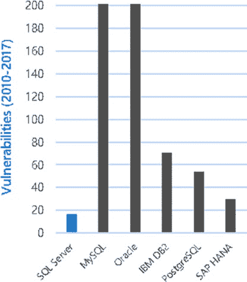

# 第 10 章：迁移至 Linux 上的 SQL Server

## 安全性
安全性对于数据平台产品至关重要，我在本书中已经为您论证了 `SQL Server` 拥有保护数据所需的所有功能。在本节中，我将指出在我认为 `SQL Server` 在安全性方面优于 `pgsql` 的独特之处。

### 安全漏洞最少的数据库产品
根据美国国家标准与技术研究院（`NIST`）的数据，`SQL Server` 在行业内安全漏洞数量最少。如图 10-5 所示，该图表展示了过去八年的趋势。

***图 10-5.** `SQL Server` 是过去八年中安全漏洞最少的数据库。*

我们并非捏造这些统计数据。您可以在 [`nvd.nist.gov/`](https://nvd.nist.gov/) 阅读更多关于此数据的信息。

### Active Directory 认证
虽然 `pgsql` 支持基于 `GSSAPI` 的认证，但其文档中并未具体提及支持 Active Directory 系统的 `GSSAPI` 认证。Active Directory 是行业内最受欢迎的身份系统之一，而 Linux 上的 `SQL Server` 支持它。您可以在 [`docs.microsoft.com/sql/linux/sql-server-linux-active-directory-authentication`](https://docs.microsoft.com/sql/linux/sql-server-linux-active-directory-authentication) 阅读更多关于 Linux 上 `SQL Server` 的 Active Directory 认证内容。

### 透明数据加密 (TDE)
`SQL Server` 使用 `TDE` 提供静态数据加密。`pgsql` 不为数据库和 `wal` 日志文件的静态存储提供任何内置加密功能。您可以在 [`docs.microsoft.com/sql/relational-databases/security/encryption/transparent-data-encryption`](https://docs.microsoft.com/sql/relational-databases/security/encryption/transparent-data-encryption) 阅读更多关于 `SQL Server` 的 `TDE` 内容。

##### 始终加密
我在第 7 章描述了名为 `Always Encrypted` 的新型端到端安全功能，它将 `SQL Server` 提供程序与数据库引擎集成，以实现端到端加密，同时将密钥的控制权交到应用程序开发人员和用户手中。`pgsql` 没有像 `Always Encrypted` 这样的内置端到端加密功能。

### 动态数据屏蔽 (DDM)
`SQL Server` 的 `DDM` 允许管理员使用 `T-SQL` 定义屏蔽规则，而不是将规则编码在应用程序中。该功能之所以称为动态，是因为在 `T-SQL` 语句应用于 `SQL Server` 后，应用程序可以获取数据的新屏蔽规则。`pgsql` 目前不支持动态数据屏蔽功能。

### 审计
`SQL Server` 提供内置的安全审计功能，利用扩展事件作为基础。`pgsql` 不提供任何内置的安全审计功能。在我的研究中，我确实在 GitHub 上找到了 `pgsql` 的这个自定义审计扩展 [`github.com/pgaudit/pgaudit`](https://github.com/pgaudit/pgaudit)，但我无法判断其使用或支持的广泛程度。

### 数据分类与漏洞评估
近期的 `GDPR` 法规使许多用户更仔细地审视其数据平台的数据分类和潜在漏洞。`SQL Server` 提供


内置的数据分类（更多信息请访问 [`docs.microsoft.com/sql/relational-databases/security/sql-data-discovery-and-classification`](https://docs.microsoft.com/sql/relational-databases/security/sql-data-discovery-and-classification)）和漏洞评估（更多信息请访问 [`docs.microsoft.com/sql/relational-databases/security/sql-vulnerability-assessment`](https://docs.microsoft.com/sql/relational-databases/security/sql-vulnerability-assessment)）功能及工具。`pgsql` 则不提供任何内置的数据分类或漏洞评估功能。

# 第 10 章 迁移至 Linux 上的 SQL Server

## HADR

我在本书中阐述了高可用与灾难恢复特性和流程对于生产数据库平台的重要性。在本节中，我将重点说明 SQL Server 与 `pgsql` 在 HADR 方面的一些独特差异。

### 备份与还原

*   SQL Server 备份支持校验和，而 `pgsql` 不支持。`SQL BACKUP WITH CHECKSUM` 会在备份过程中验证校验和。SQL Server 提供了 `RESTORE VERIFYONLY` 命令来验证校验和。
*   `pgsql` 没有备份加密选项，而 SQL Server 支持加密备份。
*   SQL Server 支持用于将备份流式传输到外部程序的虚拟设备接口（`VDI`），包括对快照备份的支持。`pgsql` 的 `pg_dump` 程序确实支持通过 Linux 的 "管道" 将输出流式传输到另一个程序，但 `VDI` 是一个完整的协议接口，允许实现丰富的第三方备份解决方案。
*   SQL Server 支持差异备份，但 `pgsql` 没有这个概念。你可以在 [`docs.microsoft.com/sql/relational-databases/backup-restore/differential-backups-sql-server`](https://docs.microsoft.com/sql/relational-databases/backup-restore/differential-backups-sql-server) 阅读更多关于 SQL Server 差异备份的信息。
*   SQL Server 支持联机进行文件组还原、部分还原和页面还原，而 `pgsql` 不支持这些操作。

### 启动与并行恢复

*   我在书中描述了 SQL Server 在启动时恢复数据库的过程，包括分析、重做和回滚阶段。SQL Server 支持快速恢复的概念，允许数据库用户在重做阶段后访问数据库，同时在回滚执行期间保持对必要资源的锁。`pgsql` 不提供此功能。
*   SQL Server 还在恢复的重做阶段使用并行工作线程，从而加快了整体恢复过程。`pgsql` 不提供数据库的并行重做恢复。

### 灾难恢复

如果你在 `pgsql` 中丢失了一个数据库表空间（例如，你将其放在了一个发生故障的独立磁盘上），整个 `pgsql` 集群可能无法启动。这根据 [`www.postgresql.org/docs/10/static/manage-ag-tablespaces.html`](https://www.postgresql.org/docs/10/static/manage-ag-tablespaces.html) 的 `pgsql` 文档所述。任何 SQL Server 用户数据库因任何原因启动失败，都不会导致实例启动失败。

### 数据库快照

`pgsql` 不提供任何类似 SQL Server 数据库快照的功能，后者是原始数据库的一个稀疏副本，并且仅随着对


# 第 10 章：迁移至 Linux 上的 SQL Server

原数据库。您可以通过以下链接了解更多关于 SQL Server 数据库快照的信息：[SQL Server 数据库快照](https://docs.microsoft.com/sql/relational-databases/databases/database-snapshots-sql-server)。

## 故障转移集群与可用性组

PostgreSQL (Pgsql) 同时提供基于共享磁盘和事务日志的高可用性与灾难恢复 (HADR) 解决方案，并能与 `Pacemaker` 等集群系统软件集成。与 `Pacemaker` 配合使用的资源代理需要从另一个位置安装：[ClusterLabs 资源代理项目中的 pgsql 心跳脚本](https://github.com/ClusterLabs/resource-agents/blob/master/heartbeat/pgsql)。所有关于如何安装资源代理并与 `Pacemaker` 集成的资源都可以在以下页面找到：[PostgreSQL 生态系统:Pacemaker](https://wiki.postgresql.org/wiki/Ecosystem:Pacemaker)。

在了解了 `pgsql` 的这些功能后，有两个差异点让我印象深刻：

1.  SQL Server 的故障转移检测粒度使用灵活故障转移策略和 `sp_server_diagnostics` 系统存储过程。此外，SQL Server 将数据库健康状况作为检测是否需要故障转移的一个组件。我没有看到 `pgsql` 提供这种内置于数据库引擎中、可触发故障转移的故障检测级别。您可以通过以下链接了解更多关于 SQL Server 灵活故障转移的信息：[可用性组的灵活自动故障转移策略](https://docs.microsoft.com/sql/database-engine/availability-groups/windows/flexible-automatic-failover-policy-availability-group)。

2.  SQL Server 通过可用性组提供了自动页面修复功能，而 `pgsql` 的流复制技术并不提供此特性。

## 管理与监控

我将 SQL Server 与 `pgsql` 进行比较的最后一个领域是各种管理与监控功能。以下是我认为 SQL Server 表现突出，并且比 `pgsql` 提供更强大功能的领域。

### SQL Server 代理

SQL Server 提供了一个内置的作业调度引擎，这对于安排数据库维护任务特别方便。`pgsql` 没有提供内置的作业调度系统。您可以通过以下链接了解更多关于如何在 Linux 上使用 `SQL Server Agent` 的信息：[在 Linux 上运行 SQL Server Agent 作业](https://docs.microsoft.com/sql/linux/sql-server-linux-run-sql-server-agent-job)。

### 资源调控器

SQL Server 提供了一个内置特性，用于控制用户和应用程序的资源，包括 CPU、I/O 和内存。此外，`Resource Governor` 允许您在应用程序级别控制 `max degree of parallelism`（最大并行度），并将应用程序关联到 CPU 或 NUMA 节点。`Pgsql` 没有与 `Resource Governor` 相媲美的内置功能。大多数 `pgsql` 的用途是使用 Linux `cgroups` 来控制 `pgsql` 集群资源，但您无法将此分配与应用程序绑定。您可以通过以下链接了解更多关于 SQL Server `Resource Governor` 的信息：[资源调控器](https://docs.microsoft.com/sql/relational-databases/resource-governor/resource-governor)。


[资源调控器/resource-governor。](https://docs.microsoft.com/sql/relational-databases/resource-governor/resource-governor)

## 专用管理员连接 (`DAC`)

正如我在书中所述，如果 `SQL Server` 因任何原因变得无法访问，但其实例仍在运行，你或许能使用 `DAC` 连接、收集诊断信息，并在某些情况下解决问题。而如果 `pgsql` 因任何原因挂起，则没有方法可以在不停止并重启 `pgsql` 的情况下访问引擎。你可以在以下链接中阅读更多关于 `SQL Server` 的 `DAC` 信息：[`docs.microsoft.com/sql/database-engine/configure-windows/diagnostic-connection-for-database-administrators`](https://docs.microsoft.com/sql/database-engine/configure-windows/diagnostic-connection-for-database-administrators)。

## 数据库的附加与分离

由于 `SQL Server` 允许你为数据库和事务日志控制并建立特定文件，因此你能够分离数据库，将文件复制或移动到另一个 `SQL Server`，然后附加这些文件以创建新数据库。`pgsql` 不提供任何类似 `SQL Server` 的分离和附加功能。

## 恢复与修复

对于页面校验和失败，`pgsql` 确实提供了通过查询或后台清理进程初始化来清理损坏页面的能力。`SQL Server` 提供了更丰富的修复功能，例如 `DBCC CHECKDB REPAIR` 和紧急模式修复以重建事务日志。此外，如果 `SQL Server` 恢复过程中遇到校验和错误，恢复将继续进行，使用延迟事务跳过损坏的页面。

## 联机维护

`SQL Server` 支持联机索引构建的概念，这样在构建（或重建）索引时用户不会被阻塞。`pgsql` 不提供此功能。此外，`SQL Server` 支持可恢复索引重建的概念，因此你可以暂停和继续大型索引重建任务。你可以在以下链接中阅读更多关于 `SQL Server` 的联机索引操作：[`docs.microsoft.com/sql/relational-databases/indexes/perform-index-operations-online`](https://docs.microsoft.com/sql/relational-databases/indexes/perform-index-operations-online)。

## 索引重组

`SQL Server` 和 `pgsql` 中的索引都可能变得碎片化。`SQL Server` 和 `pgsql` 都提供了一种通过重建索引来整理索引碎片的方法（只有 `SQL Server` 可以在线执行此操作）。然而，只有 `SQL Server` 提供了一种不同的、侵入性更小的方法，即通过重组索引来整理碎片。你可以在以下链接中阅读更多关于 `SQL Server` 的索引重组信息：[`docs.microsoft.com/sql/relational-databases/indexes/reorganize-and-rebuild-indexes`](https://docs.microsoft.com/sql/relational-databases/indexes/reorganize-and-rebuild-indexes)。

## 系统运行状况会话

虽然 `SQL Server` (`扩展事件`) 和 `pgsql` (`dtrace`) 提供了丰富的跟踪功能，但只有 `SQL Server` 会自动使用跟踪来保存有关其运行状况关键事件的信息，这称为系统运行状况会话。系统运行状况会话中包含了 `sp_server_diagnostics` 存储过程的输出，该存储过程用于为故障转移做出运行状况决策。你可以在以下链接中阅读更多关于 `SQL Server` 的系统运行状况会话信息：[`docs.microsoft.com/sql/relational-databases/extended-events/use-the-system-health-session`](https://docs.microsoft.com/sql/relational-databases/extended-events/use-the-system-health-session)。


# 第 10 章  迁移至 Linux 上的 SQL Server

## **执行迁移**

与从 Oracle 迁移类似，要从 PostgreSQL 迁移，我建议您首先执行以下步骤：

1.  评估并捕获您当前使用 PostgreSQL 的应用程序的性能基线。
2.  决定是否要在迁移过程中对表、索引或服务器端代码的定义进行任何更改。
3.  在 Linux 上安装 SQL Server。
4.  创建一个新的数据库，为数据库和事务日志设置合适的大小，以容纳 PostgreSQL 数据库的当前大小，并为向表中插入数据的事务预留空间。

从 PostgreSQL 迁移通常涉及三个领域：

*   迁移架构或所有对象的定义，例如表、索引、视图和服务器端代码
*   迁移数据
*   迁移任何维护脚本或作业

通过我的研究，我发现了一些软件供应商编写的工具，您可以购买它们来帮助您迁移架构和对象定义，但我没有找到任何可以免费下载的工具。

因此，我找到了这两个讨论从 SQL Server 迁移到 PostgreSQL 的资源。通过研究这些示例，您应该能够识别从 PostgreSQL 迁移到 SQL Server 时可能遇到的问题：

1.  `https://www.devbridge.com/articles/migrating-from-mssql-to-postgresql/` 上的这篇博文讲述了一个用户从 SQL Server 迁移到 PostgreSQL 的经验。阅读这篇文章非常有用，因为它展示了两个系统之间许多 SQL 语言的差异。您可以在迁移到 SQL Server 时利用这些知识。
2.  GitHub 项目 `https://github.com/lorint/AdventureWorks-for-Postgres` 中的 AdventureWorks 是一个极好的资源。该用户将 SQL Server 2014 的示例数据库 AdventureWorks（可在 `https://github.com/Microsoft/sql-server-samples/releases/tag/adventureworks` 找到）迁移到了 PostgreSQL。在浏览这个项目后，我有几点评论。
    *   该项目使用了以下 zip 文件 `https://github.com/Microsoft/sql-server-samples/releases/download/adventureworks/AdventureWorks-oltp-install-script.zip`，其中包含用于创建 AdventureWorks 数据库的 T-SQL 脚本以及一系列用于为 SQL Server 加载数据的 .csv 文件。
    *   将 T-SQL 脚本与 PostgreSQL GitHub 项目中的 `install.sql` 进行比较，您就能看到在创建表、索引、架构和数据类型方面的根本差异。
    *   该用户被迫为 T-SQL 存储过程创建返回 `VOID` 的函数，因为 PostgreSQL 没有存储过程的概念。您应该能够将 PostgreSQL 中返回 void 的函数提取出来，并将其更改为 SQL Server 存储过程。
    *   该项目有一个用 Ruby 编写的程序，用于将 CSV 文件转换为可以在 PostgreSQL 中加载数据的格式。虽然您可以查看此代码来反向处理由 pgdump 等程序生成的 CSV 文件，但请考虑 SSIS 支持 PostgreSQL ODBC 驱动程序。因此，您可以构建一个 SSIS 包来导出数据。

# 第 10 章  迁移至 Linux 上的 SQL Server


# 第 10 章 迁移至 Linux 上的 SQL Server

## 迁移后考虑事项

一旦你迁移到 `SQL Server`，你将需要考虑为你已迁移的 `SQL Server` 实例和数据库进行若干变更。迁移后可能有许多任务需要处理，但在本节中，我已将其缩小到我认为最重要的、可能影响你在 `Linux` 上 `SQL Server` 体验成功与否的任务。

在本节中，我将讨论性能、`HADR`、数据库兼容性和应用程序兼容性。数据库兼容性仅适用于你从早期版本的 `SQL Server` 迁移而来的情况。所有其他主题都非常适用于你从任何数据库平台迁移到 `Linux` 上的 `SQL Server`。

### 迁移后优化性能

本书包含一个关于性能的非常长的章节（第 6 章），这是有充分理由的。对于使用像 `SQL Server` 这样的数据平台的应用程序来说，性能是最关键的方面之一。因此，在你迁移到 `Linux` 上的 `SQL Server` 后，你需要确保优化性能。我在第 6 章中讨论的所有内容都适用于你在 `Linux` 上使用 `SQL Server`。在本节中，我将指出迁移后需要关注的一些具体领域。

首先，我们的文档在 [`docs.microsoft.com/sql/relational-databases/post-migration-validation-and-optimization-guide`](https://docs.microsoft.com/sql/relational-databases/post-migration-validation-and-optimization-guide) 包含一套优秀的与性能相关的迁移后主题。让我首先对这些建议做一些评论：

-   **`CE` 版本变更**：`CE` 代表基数估计，我在关于性能的第 6 章提到了这个主题。我将推迟对此主题的评论，留到本章后面关于数据库兼容性的章节。
-   **基数估计变更**：你需要处理基数估计的变更。有关具体建议，请参阅本章后面的“使用数据库兼容性”。
-   **参数嗅探**：这是我在关于性能的第 6 章讨论过的另一个主题。此指导更多是为了提高意识以及如何处理 *参数敏感计划* 的情况。如果你还记得，在第 6 章我讨论了一项名为自动调优的新功能，用于检测甚至修复在某些情况下由于参数嗅探可能发生的查询计划回退问题。
-   **缺失索引**：我在关于性能的第 6 章讨论了这个主题。务必查看推荐的缺失索引，但一定要调查每条建议，以确保它对你的数据库有意义。
-   **谓词与数据筛选**：本节讨论了各种 *查询模式*，这些模式会阻止 `SQL Server` 生成基于 *筛选器* 进行搜索的最优查询计划。筛选器只是使用 `T-SQL` 语句中 `WHERE` 子句的另一种说法。一个筛选器的例子。

从 `pgsql` 迁移到你的 `Linux` 上的 `SQL Server`。`pgsql` 支持 `ODBC` 驱动程序（参见 [`www.postgresql.org/ftp/odbc/versions/`](https://www.postgresql.org/ftp/odbc/versions/msi/)）。然后请参阅此文档了解如何将 `SSIS` 与 `ODBC` 数据源配合使用：[`docs.microsoft.com/sql/integration-services/data-flow/extract-data-by-using-the-odbc-source`](https://docs.microsoft.com/sql/integration-services/data-flow/extract-data-by-using-the-odbc-source)。


# 迁移到 Linux 上的 SQL Server 之后的性能考虑

## 影响索引查找的因素
影响 SQL Server 使用索引查找行（而非扫描整个索引或表）能力的一个因素是`WHERE`子句，它将一个列与一个变量或值进行比较，而该变量或值的数据类型不同，需要隐式数据转换。

## 表值函数
这是一个我在书中至今尚未涉及的主题。表值函数(`TVFs`)使你能够创建一个返回表类型的`T-SQL`函数。文档讨论了此概念如何作为视图的替代方案，因为`TVF`可以包含多条语句，而视图只允许一条`T-SQL`语句。使用多语句表值函数(`MSTVF`)时要小心，因为用于查询计划选择的统计信息使用的是固定值。尽管如此，我在第 6 章讨论的新`AQP`功能可以帮助为`MSTVF`估算正确的统计信息。

迁移到 Linux 上的 SQL Server 之后，还有其他一些我认为你应该记住的性能考虑事项，包括索引、基线和监控，以及使用新功能。

## 重建现有索引和建立新索引
我并非一定有证据支持这个说法，但我还是要说出来。任何时候你升级或迁移到新版本的 SQL Server，都**应该**重建所有索引。这能为索引组织和统计信息提供一个`clean slate`（干净的起点）。

迁移后，这也是一个很好的机会来研究你是否应该考虑更改当前索引、删除不需要的索引或添加新索引。请参考第 6 章中关于可能缺失索引的指导。如果你是从另一个数据库平台迁移过来的，你绝对需要为你的新表制定合适的索引策略。虽然像`SSMA`这样的工具可以将索引从`Oracle`等平台转换到 SQL Server，但你应该确保这些索引对于你的工作负载（包括聚集索引和非聚集索引）仍然是正确的。

## 建立新基线和性能监控策略
在第 6 章中，我谈到了性能基线和监控的重要性。我还在那一章讨论了在迁移前捕获先前系统上性能基线数据的重要性。像`DEA`这样的工具可以让你为 SQL Server 做到这一点，并在迁移前比较未来的性能。

迁移后是检查应用程序性能与先前基线（无论是 SQL Server 还是其他数据库平台）相比的好时机。此外，正如我在本章开头提到的，将你在 Linux 上的 SQL Server 的整体系统利用率与之前的系统进行比较。在 Linux 上的 SQL Server 上，整体系统利用率很可能不同，但你应该警惕那些截然不同的观察结果。如果你迁移到 Linux 上的 SQL Server，而你的应用程序导致 Linux 服务器`100%`的 CPU 利用率（并且`sqlservr`进程消耗了全部），你需要仔细研究你的工作负载是否有足够的 CPU，或者`T-SQL`查询是否可能没有得到最优调优。

一旦你对迁移后 SQL Server 的新性能感到满意，就是建立新基线的绝佳时机。这时，像`Query Store`这样的功能会变得极其有用，因为它能自动捕获有关查询性能的历史信息。

你还需要确保为性能监控制定了正确的策略。如果你是从 Windows 上的 SQL Server 迁移过来的，许多用于监控查询性能的优秀 SQL Server 功能依然存在，但你需要建立新的方法来观察 Linux 操作系统与 Windows 相比的性能。

如果你来自不同的数据库平台，你将需要设置系统以使用 SQL Server 的内置功能来监控查询性能，例如`DMVs`、`Extended Events`和`Query Store`。


# 第 10 章 迁移到 Linux 上的 SQL Server

## 启用新特性以提升性能

当你已经迁移到 Linux 上的 SQL Server，对其性能感到满意，并且建立了新的性能基线后，在正式“启用”生产环境之前，你可能还会考虑使用一些新的性能特性，包括但不限于：

*   列存储索引
*   内存 OLTP
*   分区（如果你是从 SQL Server 迁移过来，这不一定是个新特性，但你之前可能并未使用它。来自其他数据平台的用户则肯定需要考虑分区）。
*   自动调优

请回顾第 6 章，了解更多关于这些特性以及如何、何时最佳使用它们的细节。

## 设计你的安全与高可用性灾难恢复策略

确保迁移后性能满足要求是成功的关键。但正如我在本书其他章节所描述的，安全和高可用性灾难恢复（HADR）同样重要。回顾这些章节，了解你应该使用哪些安全特性，以及应如何设置登录名和用户。或许你可以借此机会使用 Active Directory 身份验证。

对于 HADR，拥有备份策略是根本要求。但你也可以将此次迁移作为一个机会，设置 Always On 可用性组作为新的 HADR 策略。

## 使用数据库兼容性级别

每个 SQL Server 数据库都可以在 SQL Server 的每个版本上以特定的**数据库兼容性**级别运行。当在特定版本的 SQL Server 上创建数据库时，该数据库将采用该 SQL Server 版本的默认数据库兼容性级别。我不得不承认，数据库兼容性级别的编号系统与 SQL Server 版本的名称相比，可能会有点令人困惑。例如，SQL Server 2017 的默认数据库兼容性级别是 140。使用 140 是为了匹配 SQL Server 的版本号。例如，SQL Server 2017 的版本号以 14 开头，因此兼容性级别与引擎版本**主版本号**相匹配。

> **注意** 你可以使用 T-SQL 语句`SELECT @@VERSION`或使用 T-SQL 系统函数`@@ServerpropertY`的选项之一（如`productversion`）来查找完整的引擎版本。完整的产品版本由`major.minor.build.revision`号组成。在大多数情况下，我们不使用次版本号（SQL Server 2008r2 除外）。`build`对应于 SQL Server 的主要构建发布，如 RTM、累积更新或 GDR。`revision`是内部机制，用于在接近发布 RTM、累积更新或 GDR 版本时更新构建。

默认数据库兼容性级别与 SQL Server 版本和发布版本匹配的完整表格记录在以下网址：[`docs.microsoft.com/sql/t-sql/statements/alter-database-transact-sql-compatibility-level#arguments`](https://docs.microsoft.com/sql/t-sql/statements/alter-database-transact-sql-compatibility-level#arguments)。

随着每个新的 SQL Server 主要版本发布，都会建立一个新的默认数据库兼容性级别。从之前版本恢复的任何数据库都将保留其先前版本的默认数据库兼容性级别。你可能没有意识到，但之前章节中每次恢复`WideWorldImporters`示例时，该数据库都保留了 130 的数据库兼容性级别。你可以在恢复`WideWorldImporters`后运行以下 T-SQL 语句来查看：

```sql
SELECT name, compatibility_level FROM sys.databases WHERE name = 'WideWorldImporters'
GO
```

结果应如下所示：

```text
Name                         compatibility_level
---------------------------- -------------------
WideWorldImporters           130
```

你可以使用`ALTER DATABASE` T-SQL 语句来更改兼容性级别。


# 第 10 章 迁移至 Linux 上的 SQL Server

## 通过数据库兼容性级别启用新功能

某些增强功能（通常与查询处理相关）是在使用特定的数据库兼容性级别时引入的。例如，从数据库兼容性级别 140 开始，当数据库设置为此兼容性级别时，会启用查询处理的新功能。我在第 6 章介绍过这项名为**自适应查询处理**的新功能。可以预见，微软未来将继续通过数据库兼容性级别来启用新的查询处理功能。

以下是随数据库兼容性级别引入的其他查询处理增强功能示例：

-   **基数估计**：当数据库使用兼容性级别 120 或更高版本时（于 SQL Server 2014 引入），会启用一个新的基数估计模型。我在第 6 章讨论过这个新 CE 模型的影响。本书前面也提到过，如果你使用名为 `LEGACY_CARDINALITY_ESTIMATION` 的 `ALTER DATABASE` 选项，可以将兼容性级别设为 120 或更高，以回退到旧的 CE 模型。

-   **查询处理修复程序**：数据库兼容性级别 130 包含了之前仅通过跟踪标志 `4199` 启用的查询处理修补程序。数据库兼容性级别 140 则包含了在 SQL Server 2016（兼容性级别 130）到 SQL Server 2017（兼容性级别 140）之间引入的查询处理修补程序。本书前面讨论过这个概念，但如需回顾，你可以阅读更多关于启用这些修复程序的信息：[`docs.microsoft.com/sql/t-sql/database-console-commands/dbcc-traceon-trace-flags-transact-sql#4199`](https://docs.microsoft.com/sql/t-sql/database-console-commands/dbcc-traceon-trace-flags-transact-sql#4199)。

-   **并行批量操作**：对于兼容性级别 120 或更高版本的数据库，`SELECT INTO` 查询可以并行运行。对于兼容性级别 130 或更高版本的数据库，`INSERT SELECT` 查询可以并行运行。

还有其他示例，你可以从文档的这个位置开始通读：[`docs.microsoft.com/sql/t-sql/statements/alter-database-transact-sql-compatibility-level#differences-between-compatibility-level-130-and-level-140`](https://docs.microsoft.com/sql/t-sql/statements/alter-database-transact-sql-compatibility-level#differences-between-compatibility-level-130-and-level-140)。这里开始有一系列表格，描述了不同兼容性级别之间的行为差异。

## 利用数据库兼容性级别实现向后兼容

数据库兼容性级别可用于对应用程序的查询和功能提供*某种程度*的向后兼容性保护。所有向后兼容性的差异都列在每个兼容性级别的文档中（请参见我之前提供的最后一个文档链接）。让我给你一个例子。


如果你正在使用兼容级别 110 或更低的数据库，使用称为公用表表达式（`CTE`）概念的 `T-SQL` 查询允许重复的列名。但是，从数据库兼容级别 120 开始，重复的列名将导致错误，查询会失败。

有两个领域，数据库兼容性对可能的破坏性更改没有影响：
-   已弃用的功能或特性
-   在 `SQL Server` 实例级别、数据库范围之外的更改

数据库兼容性可以提供巨大帮助的领域之一是性能。从数据库兼容级别 130 开始，任何可能导致查询计划更改的变更或特性，都应该只在新的兼容级别下发生。这为升级到 `SQL Server` 较新版本但保留先前数据库兼容级别的应用程序提供了一种更安全的方法。

我建议你通读我们所有关于使用兼容级别进行向后兼容的文档，网址为 [`docs.microsoft.com/sql/t-sql/statements/alter-database-transact-sql-compatibility-level#using-compatibility-level-for-backward-compatibility`](https://docs.microsoft.com/sql/t-sql/statements/alter-database-transact-sql-compatibility-level#using-compatibility-level-for-backward-compatibility)。

## 第 10 章   迁移至 Linux 上的 SQL Server

### 迁移 SQL Server 实例对象

如果你正在将数据库从早期版本的 `SQL Server` 迁移到 Linux 上的 `SQL Server`，你可能需要迁移数据库范围之外的 `对象`，包括：
-   `登录名`：请记住，只支持 `SQL Standard security` 和 `Active Directory` 身份验证。如果你有 `Windows` 域登录名，你需要配置 `Active Directory` 身份验证以允许它们访问 Linux 上的 `SQL Server`。
-   `SQL Server Agent 作业`：请记住，在 Linux 上的 `SQL Server` 中唯一能工作的作业类型是那些具有 `T-SQL` 作业步骤的常规作业。对于其他包含 `T-SQL` 范围之外作业步骤的作业，你将需要寻找替代解决方案。
-   `链接服务器`：只支持 `SQL Server` 到 `SQL Server` 的链接服务器，但你可以使用 `T-SQL` 系统存储过程来定义它们以添加链接服务器。你可以在文档中阅读更多相关信息：[`docs.microsoft.com/sql/relational-databases/linked-servers/linked-servers-database-engine`](https://docs.microsoft.com/sql/relational-databases/linked-servers/linked-servers-database-engine)。不幸的是，在 Linux 上的 `SQL Server 2017` 中，你不能使用链接服务器上的分布式事务，并且只支持 `SQL Standard security`。

### 使用新功能

我曾与一些从 `SQL Server` 的一个版本迁移到下一个版本的客户合作，他们这样做只是为了跟上最新的 `SQL Server` 版本，或者因为他们当前使用的版本已不再支持。在这些情况下，迁移后容易被忽视的一点是利用新功能。`SQL Server 2016` 和 `2017` 带有一些你可能容易错过的新功能，包括：
-   `列存储索引`（在 `SQL Server 2012` 中引入，但在 `SQL 2017` 中我认为此功能已达到顶峰）
-   `内存中 OLTP`（在 `SQL Server 2014` 中引入，但许多限制在 `SQL Server 2017` 中被移除）
-   `图形数据库`
-   `JSON 支持`
-   `时态表`
-   `原生评分`

我在本书前面的章节中已经介绍过这些功能，所以我鼓励你回顾一下


并审阅这些内容，看看它们在迁移后是否符合你的应用需求（或者你可能会选择将这些内容作为迁移的一部分来使用）。

## 在 Linux 上的 SQL Server 上使用现有应用

迁移对象和数据是一回事，但那些为使用 `SQL Server` 而开发的应用程序怎么办？好消息是，无论你是从 `SQL Server` 还是其他数据库平台迁移过来，我们服务器端的程序（例如存储过程）通常都是本章所描述的迁移过程的一部分。

然而，如果你的应用中嵌入了查询，例如即席查询，或者使用了诸如 `对象关系映射（ORM）` 这样的编程接口（它通常会生成查询），那么应用程序的迁移可能会更加困难。

非常棒的消息是，`SQL Server` 支持当今市场上几乎所有流行的编程语言接口，包括 `C#`、`Java`、`Node.js`、`PHP`、`Python`、`Ruby` 和 `C++`。你可以在 `https://docs.microsoft.com/sql/linux/sql-server-linux-develop-connectivity-libraries` 查看 `SQL Server` 在 `Windows`、`macOS` 和 `Linux` 上支持的编程接口的完整列表。如果你正在使用的应用程序连接的是旧版本的 `SQL Server`，那么它有很大几率只需很少的改动就能在 `Linux` 上的 `SQL Server` 中运行。

**注意**：可能影响你的 `SQL Server` 应用程序的破坏性变更类型，将更多地与数据库兼容性以及 `Linux` 上的 `SQL Server` 不支持的功能差异有关。请通过我们的发布说明 `https://docs.microsoft.com/sql/linux/sql-server-linux-release-notes` 及时了解 `Linux` 上的 `SQL Server` 的功能差异。

# 第十章 迁移到 Linux 上的 SQL Server

如果你正在迁移的应用程序连接的是 `SQL Server` 以外的数据库平台，那么挑战在于进行必要的更改以使用该平台的原生编程接口。例如，在第 4 章中，我向你展示了如何使用 `node.js` 和 `tedious` 驱动程序连接到 `SQL Server`。`tedious` 驱动程序不适用于 `Oracle`。因此，你可能有一个用 `node.js` 编写的程序，它使用了类似 `node-oracleb` 的驱动程序（有关此驱动程序的更多信息，请访问 `https://github.com/oracle/node-oracledb`）。`tedious` 和 `node-oracleb` 之间的类和方法可能相似，但很可能存在足够的差异，这将需要进行代码更改、测试和设计。别忘了检查同一编程语言中不同驱动程序在连接池、结果处理、游标等概念以及错误条件（例如，死锁在不同的数据库平台中可能处理方式不同）方面的工作方式差异。

#### 本章小结

我希望本章为你提供了正确的信息，以便你做出必要的决策，迁移到 `Linux` 上的 `SQL Server`。本书以谈论一项目前正日益流行、成为部署应用程序和数据库的热门环境的技术来收尾是恰如其分的，这项技术被称为容器。

# 第十一章 SQL Server 与容器

虚拟机的概念已经存在一段时间了，但在我任职于微软期间，直到大约 2006 至 2007 年，我才真正看到客户开始在虚拟机上使用 `SQL Server` 作为数据库平台。即使在 `Hyper-V` 和 `VMWare` 等虚拟机环境开始流行时，我仍怀疑 `SQL Server` 在客座虚拟机中能否良好运行。如今，`SQL Server` 部署在虚拟机中的数量很可能远远超过了部署在裸机计算机上的数量。


# 第 11 章 SQL Server 与容器

我将容器视为新一代的虚拟机。但容器与`SQL Server`等应用程序和数据库平台相结合所带来的兴奋感和采用率，其增长速度比我曾见过的虚拟机普及过程要快得多。

在本章中，我将首先向您介绍容器的概念，然后相当深入地讨论并举例说明如何在`SQL Server`中使用容器。最后，我将以一个有趣的示例结束本章：在`macOS`上使用`SQL Server`（`Mac`用户可能认为我在本书中忽略了他们），并讨论如何在名为`Kubernetes`的容器平台中使用`SQL Server`。我想您会喜欢本章内容。这是我在本书中最喜欢撰写的章节之一。

#### 容器简介

虚拟机最贴切的定义是`硬件虚拟化`，而容器（或容器化）则被定义为`操作系统虚拟化`。虚拟机由一个在主机（裸机硬件）上运行的完整操作系统（客户机）组成。因此，一台主机承载多个虚拟机是很常见的。每个虚拟机都可以运行不同的客户操作系统。

© Bob Ward 2018

B. Ward, *Pro SQL Server on Linux*, [`https://doi.org/10.1007/978-1-4842-4128-8_11`](https://doi.org/10.1007/978-1-4842-4128-8_11)

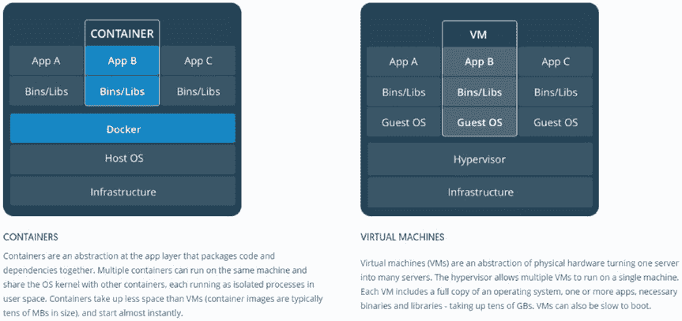

容器依赖于一个共享内核资源的单一主机操作系统（该主机操作系统本身可以是一个虚拟机）。这使得容器比虚拟机更轻量级。尽管容器共享单一的操作系统内核，但它们彼此之间是隔离的。我很喜欢下面这个直观的示意图（图 11-1），我是在 `https://i.stack.imgur.com/exIhw.png` 找到的，它展示了容器与虚拟机的区别。

### 图 11-1. 容器 vs. 虚拟机

此外，这个 `stackoverflow.com` 帖子很好地描述了虚拟机与容器之间的区别：[`https://stackoverflow.com/questions/16047306/how-is-docker-different-from-a-virtual-machine`](https://stackoverflow.com/questions/16047306/how-is-docker-different-from-a-virtual-machine)。关于这个帖子的一点说明：帖中描述了一种称为 `AuFS` 的联合文件系统 (`UnionFS`) 的使用。`UnionFS` 对于 `Docker` 容器是一个重要概念，因为它支持分层文件系统。当前版本的 `Docker` 仍然使用联合文件系统，但现在使用的是一个名为 `OverlayFS` 的系统。您可以在 [`https://docs.docker.com/storage/storagedriver/overlayfs-driver/`](https://docs.docker.com/storage/storagedriver/overlayfs-driver/) 阅读更多关于 `OverlayFS` 的信息。

`Docker` 容器是使用`镜像`创建的，镜像指定了文件系统的内容以及容器中运行的程序。容器就是一个镜像的实例。您可以基于同一个镜像运行多个容器。一个 `Dockerfile` 指定了 `Docker` 镜像的内容。`Docker` 提供了从 `Dockerfile` 规范`构建` `Docker` 镜像的功能。此外，`Docker` 还支持使用一个名为 `compose` 的工具来构建多容器应用程序的功能。在下一节中，我将以 `SQL Server` 为例，向您展示更多关于 `Docker` 镜像、文件和 `compose` 的内容。

`Docker` 容器具有以下特点：

*   **可移植性：** 您构建的任何 `Docker` 镜像都可以在任何支持 `Docker` 容器的地方运行，包括多种操作系统以及公有云和私有云。我曾在 `Windows`、`Linux`、`macOS` 和 `Azure` 上运行过 `Docker` 容器。
*   **轻量级：** 如前所述，`Docker` 容器不像虚拟机那样包含一个完整的操作系统。`Docker` 容器共享内核资源，因此比虚拟机更轻量级。


# 第 11 章 SQL Server 与容器

## 如何使用容器运行 SQL Server

**一致性：** 容器镜像允许你部署一致的应用程序或数据库系统（如 SQL Server）版本。本章稍后我将详细讨论这对 SQL Server 的好处。

**高效性：** Docker 容器提供了一种机制，可实现更快的部署、更少的停机时间以及更便捷的更新。我将在下一节解释这对 SQL Server 的益处。

Docker 使用两个主要组件来帮助你管理 Docker 容器：

*   **Docker 客户端：** 这是一个名为 `docker` 的程序，你可以配合多种选项来使用它，以构建镜像，并拉取、运行、启动、停止和管理容器。通过本章的示例，你将了解更多关于这些 Docker 概念的知识。
*   **Docker 守护进程：** Docker 客户端与守护进程程序通信，后者根据客户端的指示完成所有工作，包括构建镜像以及管理和运行容器。

Docker 容器使用一个称为*命名空间*的概念来实现容器之间的隔离（你可以在 [`docs.docker.com/engine/docker-overview/#the-underlying-technology`](https://docs.docker.com/engine/docker-overview/#the-underlying-technology) 阅读更多关于命名空间使用的信息）。尽管容器是隔离的，它们仍然可以相互通信（例如通过 TCP/IP）。请将 Docker 文档 ([`docs.docker.com`](https://docs.docker.com)) 作为你关于容器的完整参考。供你参考，我建议你阅读以下我找到的关于容器的其他优质资源：[`theearlybirdtechnology.com/2017/08/12/docker-cheatsheet/`](http://theearlybirdtechnology.com/2017/08/12/docker-cheatsheet/) 和 [`www.quora.com/What-exactly-is-a-base-image-in-Docker`](https://www.quora.com/What-exactly-is-a-base-image-in-Docker)。

让我们深入探讨如何将容器与 SQL Server 和数据库应用程序结合使用。

在本书的这一部分，我将通过实际示例向你展示我在开篇介绍的容器基础概念。我将演示如何部署一个装有 SQL Server 的简单容器，如何使用容器来展示如何在更新时最大程度减少停机时间，如何使用 `Dockerfile` 构建和部署镜像，并最终实现一个包含 SQL Server 和应用程序的多容器部署。

在阅读本节时请记住一点：`SQL Server on Linux` 不支持在同一服务器上运行多个实例（这在 Windows 上称为命名实例），因此，如果你想在同一个 Linux 服务器上运行多个 SQL Server 实例，使用容器就是方法。

在我撰写本书期间，我的同事 Vin Yu 和我在 [`github.com/Microsoft/sqllinuxlabs`](https://github.com/Microsoft/sqllinuxlabs) 为 `SQL Server on Linux` 和 Docker 容器构建了一系列免费的、自定进度的实验。Vin 构建了这些实验来探索 Docker 容器（可在 [`github.com/Microsoft/sqllinuxlabs/tree/master/containers`](https://github.com/Microsoft/sqllinuxlabs/tree/master/containers) 找到）。我将在本节中使用这个实验的部分内容，向你展示如何配合容器使用 SQL Server。

（我随书附带了一些脚本作为示例，你可以将它们与这些实验结合使用。）我可能不会严格按照 Vin 实验的顺序进行，并且我会为你将要运行以查看 SQL Server 容器实际运行的命令解释更多细节。

为了向你展示这些示例，我创建了一个运行 RHEL 7.5 的新 Azure 虚拟机。（我的虚拟机规格是 Standard D16s v3 [16 个 vCPU，64 GB 内存]，但你可以在更小规格的虚拟机上完成此操作。只需确保至少有 4 个 vCPU 和 16GB 内存即可）。然后，我从 `bash` shell 运行了以下命令来更新虚拟机并安装 `git`。

```
sudo yum update -y
sudo yum install git -y
```


# 第 11 章 SQL Server 与容器

请先更新软件包，然后克隆 Github 仓库以获取脚本和说明：

```
sudo yum -y update
sudo yum install git
git clone https://github.com/Microsoft/sqllinuxlabs.git
```

现在让我们安装 Docker 引擎，以便通过以下 bash shell 命令完成本章后续的其他示例：

```
sudo yum install -y yum-utils device-mapper-persistent-data lvm2
sudo yum-config-manager --add-repo https://download.docker.com/linux/centos/docker-ce.repo
sudo yum install http://mirror.centos.org/centos/7/extras/x86_64/Packages/pigz-2.3.3-1.el7.centos.x86_64.rpm
sudo yum install docker-ce
```

**注意**，RHEL 的标准`docker`软件包是付费的`docker`企业版（详情请访问[`docs.docker.com/install/linux/docker-ee/rhel`](https://docs.docker.com/install/linux/docker-ee/rhel)）。出于本实验及书中示例的目的，我将使用免费的`docker`社区版，它是为 CentOS 构建的，但也兼容 RHEL。你可以在[`docs.docker.com/install/`](https://docs.docker.com/install/)了解更多关于`docker`社区版的信息。

现在通过 bash shell 中的以下命令启动 Docker 引擎：

```
sudo systemctl start docker
```

你也可以使用以下命令设置 Docker 在重启时自动启动：

```
sudo systemctl enable docker
```

现在我准备向你展示如何使用容器部署 SQL Server。

##### 部署并运行 SQL Server 镜像

在本节中，我将向你展示使用容器部署 SQL Server 的基础知识，以及如何利用容器更新 SQL Server。

###### Docker 容器 SQL Server 基础

让我们首先学习部署带有 SQL Server 的容器并与之交互的基础知识。容器是某个`镜像`的实例。微软已在 Docker Hub 上发布了一系列镜像，地址为[`hub.docker.com/r/microsoft/mssql-server-linux/`](https://hub.docker.com/r/microsoft/mssql-server-linux/)。

Docker 镜像可以存储在私有`仓库`或像 Docker Hub 这样的公共域中。你甚至可以使用云服务作为私有容器注册表，例如 Azure 容器注册表，详情请访问[`azure.microsoft.com/services/container-registry`](https://azure.microsoft.com/services/container-registry)。

微软在 Docker Hub 上发布的 SQL Server 镜像包括从 RTM 版本一直到最新的 CU 和 GDR 更新的 SQL Server 2017 镜像。这些镜像基于带有 SQL Server 开发版的 Linux Ubuntu 16.04 的`基础镜像`。这并不意味着你必须仅在 Ubuntu Linux 服务器上部署这些镜像。我们基于 Ubuntu 构建的 Docker 镜像可以在 Docker 支持的任何平台上运行，因为底层的 Linux 内核在各种 Linux 发行版中是相同的。但公平地说，如果你需要依赖某个特定的 Linux 发行版功能，我们基于 Ubuntu 的镜像可能不适用。在这种情况下，你可能需要使用`Dockerfile`来构建镜像。

此外，如果你想使用带有其他版本 SQL Server 的 Docker 镜像，请查阅我们的文档[`docs.microsoft.com/sql/linux/sql-server-linux-configure-docker#production`](https://docs.microsoft.com/sql/linux/sql-server-linux-configure-docker#production)。

**注意** 你可以使用`Dockerfile`以 RHEL 为基础镜像，构建你自己的 SQL Server `docker`容器镜像。参见我们的示例[`github.com/Microsoft/mssql-docker/blob/master/linux/preview/RHEL/Dockerfile`](https://github.com/Microsoft/mssql-docker/blob/master/linux/preview/RHEL/Dockerfile)。


# 第 11 章 SQL Server 与容器

## 部署 SQL Server 容器镜像

[Dockerfile](https://github.com/Microsoft/mssql-docker/blob/master/linux/preview/RHEL/Dockerfile)。Microsoft 正在致力于发布包含 `RHEL` 等 Linux 发行版的 `docker` 镜像。

在本章中，我使用 `sudo` 以 `root` 身份运行所有 `Docker` 命令。你可以配置 `Docker`，以便以非 `root` 用户身份使用 `Docker` 命令。

有关更多信息，请参阅此文档 ([`docs.docker.com/install/linux/linux-postinstall/#manage-docker-as-a-non-root-user`](https://docs.docker.com/install/linux/linux-postinstall/#manage-docker-as-a-non-root-user))。

部署 `SQL Server Docker Hub` 容器镜像的方法有以下两种：

• 使用 `Docker` 客户端程序配合 `pull` 选项，如下方 `bash shell` 中的命令所示：
```
sudo docker pull microsoft/mssql-server-linux:2017-latest
```

• `运行` 一个 `Docker` 容器，指定其中一个 `SQL Server` 镜像。如果该镜像本地不存在，将先拉取镜像再运行容器。
```
sudo docker run -e 'ACCEPT_EULA=Y' -e 'SA_PASSWORD=YourStrong!Passw0rd' \
-p 1500:1433 --name sql1 \
-d microsoft/mssql-server-linux:2017-latest
```

如果你先拉取了镜像，那么使用第二种方法运行容器时，将运行你已下载的镜像。这两种方法都要求你的 `Linux` 服务器能够连接互联网。

**提示**：以下 [stackexchange.com](http://stackexchange.com) 帖子（[`serverfault.com/questions/701248/downloading-docker-image-for-transfer-to-non-internet-connected-machine`](https://serverfault.com/questions/701248/downloading-docker-image-for-transfer-to-non-internet-connected-machine)）详细描述了部署容器的 `离线` 体验。`docker` 提供了一种能力，可以将镜像拉取到一台联网的机器上，保存为 `tar` 文件，将该 `tar` 文件复制到你的 `Linux` 服务器，然后使用 `docker load` 将该 `tar` 文件导入为一个镜像，之后就可以用它来运行容器。

让我们使用第二种方法来运行容器，这将自动拉取带有最新 `CU` 更新的 `SQL Server` 的 `Docker` 镜像。我想设置我的 `sa` 密码，因此我在 `nano` 编辑器中修改了前面的命令，更改了我的 `sa` 密码字符串，然后将结果粘贴到 `bash shell` 中，如下方命令所示：
```
sudo docker run -e 'ACCEPT_EULA=Y' -e 'SA_PASSWORD=Sql2017isfast' \
-p 1500:1433 --name sql1 \
-d microsoft/mssql-server-linux:2017-latest
```

如果命令成功，你将看到类似以下的结果（如果这是你第一次尝试运行 `SQL Server` 容器镜像）。你可以看到 `Docker` 镜像在本地找不到，因此它将先从 `Docker Hub` 拉取，即隐式地运行了一个 `docker pull`。
```
Unable to find image 'microsoft/mssql-server-linux:2017-latest' locally
2017-latest: Pulling from microsoft/mssql-server-linux
f6fa9a861b90: Pull complete
da7318603015: Pull complete
6a8bd10c9278: Pull complete
d5a40291440f: Pull complete
bbdd8a83c0f1: Pull complete
3a52205d40a6: Pull complete
6192691706e8: Pull complete
1a658a9035fb: Pull complete
344203922c4b: Pull complete
5975df51ff07: Pull complete
Digest: sha256:97d2a9cd87ecfab641f24be254e03a45b8d551355e21516c0460da7daf8b526e
Status: Downloaded newer image for microsoft/mssql-server-linux:2017-latest
66e7e043e41683af4e1f419df41417e7fb3c19f8013b2d9d3e5c69a5d03ec3f8
```

要了解你的容器是否运行成功，最好的方法是运行以下 `bash shell` 命令：
```
sudo docker ps
```

在我的 `Linux` 服务器上，结果如下所示：
```
CONTAINER ID        IMAGE                                     COMMAND                  CREATED             STATUS              PORTS                    NAMES
```


# 第 11 章 SQL Server 与容器

创建时间                状态              端口                   名称
a01c1c991cec           microsoft/mssql-server-linux:2017-latest
"/opt/mssql/bin/sqls..."   约一分钟前  已运行约一分钟
0.0.0.0:1500->1433/tcp  sql1

让我们分解一下刚才使用的 `docker run` 命令参数。

`-e` 参数用于设置运行 SQL Server 所必需的环境变量（类似于在 Linux 上部署 SQL Server 时运行 `mssql-conf` 脚本所指定的参数），包括接受最终用户许可协议 (EULA) 和指定 `sa` 密码。（注意：这些变量会被传递给 `sqlservr` 程序。）

`-p` 参数用于端口映射。SQL Server 默认监听端口 `1433`，但将此端口直接用于容器可能会与主机 Linux 服务器上的 `1433` 端口或其他运行 SQL Server 的 Docker 容器发生冲突。因此，此参数将主机的 `1500` 端口映射到容器内的 `1433` 端口。稍后我将展示如何在连接容器内的 SQL Server 时使用这个映射端口。

`--name` 参数允许你指定一个用户友好的名称，以便使用其他 Docker 命令与该容器进行交互。

`-d` 参数指定在后台（即分离模式）运行容器，因此 `docker run` 命令会返回到 bash shell 提示符，同时在后台启动容器。

## 第 11 章 SQL Server 与容器

最后一个参数是 Docker 镜像的名称，在本例中是 `microsoft/mssql-server-linux:2017-latest`。Docker 会首先尝试在 Linux 服务器本地查找此镜像。如果不存在，它会尝试先从 Docker Hub 拉取该镜像，正如你之前在 `docker run` 命令的结果中看到的那样。

你可以从 bash shell 运行以下命令，查看 SQL Server 的 Docker 镜像是否已存储在本地：

```
sudo docker images
```

在我的 Linux 服务器上，结果如下所示：

仓库                      标签                  镜像 ID
创建时间             大小
microsoft/mssql-server-linux    2017-latest          c90c3ab55158
13 天前         1.44GB

现在 Docker 容器已经运行，你可能想要连接到 SQL Server。让我们使用以下两种方法：

1.  使用 Docker 命令与容器交互，通过以下命令运行一个 bash shell：

    ```
    sudo docker exec -it sql1 bash
    ```

    你现在应该会看到一个类似下面的 shell 提示符：

    ```
    root@66e7e043e416:/#
    ```

    在此示例中，`66e7e043e416` 是容器 ID，并在 T-SQL 语句 `@@SERVERNAME` 中作为服务器名称出现。

    这是一个 bash shell，允许你在容器内运行命令（很酷，对吧？）。运行以下命令，在容器内使用 `sqlcmd`（SQL Server 镜像包含 `sqlcmd` 工具）连接到 SQL Server（输入你的 `sa` 密码）：

    ```
    /opt/mssql-tools/bin/sqlcmd -U SA -P 'Sql2017isfast'
    ```

    **注意** 虽然直接使用 bash shell 与容器交互很有趣，但大多数情况下，你与容器的交互将使用容器*外部*的程序。除非你是在持久化卷上更改数据或文件（我将在本章后面描述），否则请谨慎在容器内部进行任何更改。任何不涉及持久化存储的容器更改，如果在移除容器后都会丢失。在接下来的示例中，我将向你展示如何在容器内部和外部运行 `sqlcmd`。但在这些示例中，我修改的是位于持久化存储卷上的 SQL Server 数据库。

    在 `sqlcmd` 中输入 `exit`，然后在 shell 中输入 `exit` 以退出此 shell。

2.  第二种方法是使用容器外部的 SQL Server 工具连接到容器内的 SQL Server。在这台 Azure 虚拟机上，我根据以下文档（https://docs.microsoft.com/sql/linux/quickstart-install-connect-red-hat#tools）安装了 SQL Server 工具。


# 第 11 章 SQL Server 与容器

## 安装与连接（以 Red Hat 为例）

请参考 [quickstart-install-connect-red-hat#tools](https://docs.microsoft.com/sql/linux/quickstart-install-connect-red-hat#tools) 以便使用 `sqlcmd` 连接到容器中的 SQL Server。由于容器映射到端口 1500，并且我是在本地的 Linux 服务器上连接，因此可以在 bash shell 中运行如下命令：

```
sqlcmd -S localhost,1500 -Usa -PSql2017isfast
```

**注意**：您可以通过使用 Linux 主机服务器的 IP 地址和端口 1500 作为 `-S` 参数，从另一台可以访问该 Linux 主机的计算机连接到容器中的 SQL Server。此端口必须在防火墙中开放。

现在，从 `sqlcmd` 提示符下，运行以下 T-SQL 语句：

```
SELECT @@version
GO
```

您的结果应如下所示，显示 SQL Server *认为* 自己运行在 Ubuntu 上，但主机实际上是 RHEL：

```
Microsoft SQL Server 2017 (RTM-CU9-GDR) (KB4293805) - 14.0.3035.2 (X64)
Jul  6 2018 18:24:36
Copyright (C) 2017 Microsoft Corporation
Developer Edition (64-bit) on Linux (Ubuntu 16.04.5 LTS)
```

输入 `exit` 可以离开 `sqlcmd`。

您可以使用以下 bash shell 命令停止容器：

```
sudo docker stop sql1
```

要查看所有容器，包括未运行的，可以使用以下 bash shell 命令：

```
sudo docker ps -a
```

您的结果应类似于以下内容：

```
CONTAINER ID        IMAGE                                     COMMAND
CREATED             STATUS                      PORTS          NAMES
66e7e043e416        microsoft/mssql-server-linux:2017-latest   "/opt/mssql/bin/sqls..."   About an hour ago   Exited (0) 2 minutes ago   sql1
```

Docker 容器包含了在运行容器时创建或修改的任何文件或数据。您可以启动和停止容器，您创建的数据将在容器的生命周期内持久保存。但是，如果移除容器，容器中的所有数据都将丢失。不过有一种方法可以持久化容器中的数据，即使容器被移除，数据也能保存。让我们看一个可能对更新 SQL Server 以最小化停机时间有用的示例。

在继续之前，请使用以下 bash shell 命令移除之前的容器和镜像：

```
sudo docker rm sql1
sudo docker rmi microsoft/mssql-server-linux:2017-latest
```

###### 使用容器更新 SQL Server

要在 RHEL 上将 SQL Server 更新到新的累积更新，通常需要运行类似 `sudo yum update mssql-server` 的命令。此命令将下载最新的累积更新，关闭 SQL Server，应用新的二进制文件，然后启动 SQL Server。如果更新顺利进行，应该不会花费太多时间，但容器提供了不同的方法。让我用一个例子向您展示如何操作。在本节中，我将使用 WideWorldImporters 示例数据库，因此在我的新 Azure VM 上，我首先从 bash shell 运行此命令来下载此示例备份：

```
wget https://github.com/Microsoft/sql-server-samples/releases/download/wide-world-importers-v1.0/WideWorldImporters-Full.bak
```

第一步是运行一个基于 SQL Server 2017 for Linux CU8 的容器（这将下载镜像），使用以下 bash shell 命令（如示例脚本 `dockerruncu8.sh` 中所示），但与上一节相比略有不同：

```
sudo docker run -e 'ACCEPT_EULA=Y' -e 'MSSQL_SA_PASSWORD=Sql2017isfast' -p 1401:1433 -v sqlvolume:/var/opt/mssql --name sql1 -d microsoft/mssql-server-linux:2017-CU8
```

我运行此 Docker 容器的方式与上一节相比有三个不同之处：

1.  我使用了 `-v` 参数将 Linux 主机上的一个卷映射到容器内的 `/var/opt/mssql` 目录。这意味着在容器内 `/var/opt/mssql` 中存储的任何数据都将在 Linux 服务器上持久保存。

**提示**：运行以下命令可以找出此数据在 Linux 主机服务器上存储的实际目录：

```
sudo docker inspect volume sqlvolume
```


# 第 11 章 SQL Server 与容器

2.  我为 SQL Server 使用了一个不同的镜像：在本例中是 SQL Server 2017 CU8（在我撰写本章节时，这`并非`SQL Server 的最新更新）。

3.  我使用端口 1401 而非 1500 来连接到这个 SQL Server。

现在，让我们在新的容器中恢复`WideWorldImporters`备份。第一步是将备份文件从 Linux 服务器主机上的主目录*复制到容器中*。我将通过`bash` shell 运行以下命令来完成此操作（该命令同样可在示例脚本`dockercopy.sh`中找到）：

```
sudo docker cp WideWorldImporters-Full.bak sql1:/var/opt/mssql
```

为了恢复数据库，我将使用`docker exec`命令在容器内执行`sqlcmd`并传入一条 T-SQL 语句。在`bash` shell 中运行以下命令（可在示例脚本`docker_restorewwi.sh`中找到）：

```
sudo docker exec -it sql1 /opt/mssql-tools/bin/sqlcmd  -S localhost -U SA -P 'Sql2017isfast' -Q 'RESTORE DATABASE WideWorldImporters FROM DISK = "/var/opt/mssql/WideWorldImporters-Full.bak" WITH MOVE "WWI_Primary" TO "/var/opt/mssql/data/WideWorldImporters.mdf", MOVE "WWI_UserData" TO "/var/opt/mssql/data/WideWorldImporters_userdata.ndf", MOVE "WWI_Log" TO "/var/opt/mssql/data/WideWorldImporters.ldf", MOVE "WWI_InMemory_Data_1" TO "/var/opt/mssql/data/WideWorldImporters_InMemory_Data_1"'
```

现在，让我们运行一个查询，以确保我们能访问该数据库中的数据。这次我将从 Linux 主机使用`sqlcmd`（我向你展示了访问容器中 SQL Server 的两种方式）。在`bash` shell 中使用以下命令（可在示例脚本`dockerquery.sh`中找到）：

```
sqlcmd -Usa -Slocalhost,1401 -Q'USE WideWorldImporters;SELECT * FROM [Application].[People];'
```

如果一切顺利，你的屏幕上应该会滚动显示来自`People`表的行。

现在，假设你想将 SQL Server 更新到最新的累积更新。对于容器而言，你不需要使用像`apt-get`这样的工具，但这没关系，因为正如本章前面所说，有更好的方法来更新 SQL Server。

让我们运行一个新的名为`sql2`的 Docker 容器，但这次使用最新的累积更新。我还希望将这个容器指向同一个`sqlvolume`，以访问所有随`sql1`容器保存的数据库。为了最大限度地减少停机时间，我将手动拉取最新的 SQL Server 镜像，而不是在使用`docker run`时自动拉取。在`bash` shell 中运行以下命令：

```
sudo docker pull microsoft/mssql-server-linux:2017-latest
```

现在，用以下命令（在`bash` shell 中）停止`sql1`容器：

```
sudo docker stop sql1
```

这将执行 SQL Server 的干净关闭。现在，让我们启动一个名为`sql2`的新容器，使用与之前完全相同的参数，包括相同的端口映射和卷名。在`bash` shell 中运行以下命令（可在示例脚本`dockerrunlatest.sh`中找到）：

```
sudo docker run -e 'ACCEPT_EULA=Y' -e 'MSSQL_SA_PASSWORD=Sql2017isfast' -p 1401:1433 -v sqlvolume:/var/opt/mssql --name sql2 -d microsoft/mssql-server-linux:2017-latest
```

由于我使用了与`sql1`容器相同的端口号，我现在可以运行与之前完全相同的命令来查询`WideWorldImporters`数据库（该命令可在`dockerquery.sh`中找到）：

```
sqlcmd -Usa -Slocalhost,1401 -Q'USE WideWorldImporters;SELECT * FROM [Application].[People];'
```

这非常酷。我成功地`切换`到了一个运行最新累积更新的容器，最大限度地减少了停机时间，而不是对现有的 SQL Server 进行打补丁。

现在，你将会真正喜欢这一点。由于我没有删除`sql1`容器，如果我遇到最新的 CU 版本与我的应用程序存在问题，我可以简单地停止`sql2`容器并启动`sql1`容器。瞬间！我就回到了之前的 CU 版本运行。

这是一个很好的场景，展示了即使容器被移除，如何对 SQL Server 进行更新以及保持数据库持久性。在下一节中，我将向你展示如何构建你的


# 第 11 章 SQL Server 与容器

## 使用 Dockerfile 构建自定义容器

到目前为止，我展示的是如何与 Docker Hub 站点上的 SQL Server 镜像的 Docker 容器进行交互并添加数据。带有 SQL Server 的 Docker 容器还能帮助你应对另一个有趣的场景。假设你有多个开发人员正在开发一个使用 SQL Server 的应用程序。你通常会设置一个开发服务器，让开发人员访问该服务器。这种配置的一个问题在于，如何为所有开发人员设置一个环境，使他们能使用一致的数据库和一致版本的 SQL Server。

容器为这一场景带来了一种新策略。你可以基于 SQL Server 镜像构建一个 Docker 镜像，并在该镜像中包含你希望所有开发人员使用的标准数据库的备份。然后，任何开发人员都可以拉取该 Docker 镜像并运行一个容器（就像拥有自己的沙盒一样）。此外，Docker 镜像的一个强大特性是可重用性。你可以通过基于其他镜像创建新镜像来*分层*构建镜像。

让我们按照[microsoft/sqllinuxlabs/tree/master/containers](https://github.com/Microsoft/sqllinuxlabs/tree/master/containers)自定进度实验中的确切步骤来演示一个例子。（我假设你已经运行了本章前面的命令来克隆实验所需的 GitHub 仓库。）

1.  在 Linux 服务器上，通过在 bash shell 中运行以下命令，切换到`mssql-custom-image-example`文件夹：
    ```
    cd sqllinuxlabs/containers/mssql-custom-image-example
    ```

2.  通过在 bash shell 中键入以下命令，创建一个包含以下内容的`Dockerfile`（我在本书的示例中提供了`Dockerfile`文件供你比较）（注意：运行`cat`命令时，你会看到一个`>`提示符，用于输入剩余内容）：
    ```
    cat <<EOF>> Dockerfile
    > FROM microsoft/mssql-server-linux:latest
    > COPY ./SampleDB.bak /var/opt/mssql/data/SampleDB.bak
    > CMD ["/opt/mssql/bin/sqlservr"]
    > EOF
    ```
    当你使用`docker build`命令构建 Docker 镜像时，Docker 默认会查找一个名为`Dockerfile`的文件。让我们解析一下文件中这些命令的含义：

    *   **`FROM microsoft/mssql-server-linux:latest`**：此命令表示拉取最新的 SQL Server Docker 镜像作为基础镜像（基于 Ubuntu 基础镜像），用于创建我们的新镜像。如果你希望所有开发人员都在已知的构建版本上测试和开发，你可以选择一个特定的累计更新包（CU），我在上一节中已经展示了如何拉取。请注意，对于 SQL Server 2017，`microsoft/mssql-server-linux:latest`和`Microsoft/mssql-server-linux:2017-latest`是相同的，但我们为每个名称生成了两个不同的镜像。

    *   **`COPY ./SampleDB.bak /var/opt/mssql/data/SampleDB.bak`**：此命令表示将当前目录中的`SampleDB.bak`文件复制到 Docker 容器镜像中。

    *   **`CMD [“/opt/mssql/bin/sqlservr”]`**：此命令表示从`/opt/mssql/bin`目录运行`sqlservr`程序。这就是 SQL Server 在容器中的运行方式。

3.  现在，在 bash shell 中运行以下命令来构建新的 Docker 镜像：
    ```
    sudo docker build . -t mssql-with-backup-example
    ```
    `.`是`docker build`命令的 PATH 参数，这里指的是当前目录中的所有文件。`-t`参数用于给新镜像*打标签*，名称为`mssql-with-backup-example`。当你从该镜像运行容器时，可以引用此标签名称。

    在我的 Linux 服务器上，结果如下所示：
    Sending build context to Docker daemon  3.263MB

为了证明我可以同时运行两个带有 SQL Server 的容器（不使用同一个卷），让我们通过以下命令停止`sql1`容器（如果你有`sql1`在运行的话），但让`sql2`容器保持运行：
```
sudo docker stop sql1
```


第 1 步/共 3 步：`FROM microsoft/mssql-server-linux:latest`

```
latest: Pulling from microsoft/mssql-server-linux
f6fa9a861b90: Already exists
da7318603015: Already exists
6a8bd10c9278: Already exists
d5a40291440f: Already exists
bbdd8a83c0f1: Already exists
3a52205d40a6: Already exists
6192691706e8: Already exists
1a658a9035fb: Already exists
344203922c4b: Already exists
5975df51ff07: Already exists
Digest: sha256:4f769a0b6603f9de2496e3ee455ce6b8b44db642714b50ed89b033e03e6e1e91
Status: Downloaded newer image for microsoft/mssql-server-linux:latest
---> 812f44c37fc8
```

第 2 步/共 3 步：`COPY ./SampleDB.bak /var/opt/mssql/data/SampleDB.bak`
`---> a85e222cc553`

第 3 步/共 3 步：`CMD ["/opt/mssql/bin/sqlservr"]`
`---> Running in 91b10bc07736`
`Removing intermediate container 91b10bc07736`
`---> 973ca0ed39a0`
`Successfully built 973ca0ed39a0`
`Successfully tagged mssql-with-backup-example:latest`

4. 让我们通过检查镜像是否已创建来验证。从 bash shell 运行以下命令：
`sudo docker images`
你的镜像应出现在结果中，如下所示：
```
REPOSITORY                      TAG               IMAGE ID       CREATED          SIZE
mssql-with-backup-example       latest            973ca0ed39a0   2 minutes ago    1.44GB
microsoft/mssql-server-linux    2017-latest       c90c3ab55158   2 weeks ago      1.44GB
microsoft/mssql-server-linux    latest            812f44c37fc8   2 weeks ago      1.44GB
microsoft/mssql-server-linux    2017-CU8          229d30f7b467   2 months ago     1.43GB
```

## 第 11 章 SQL Server 与容器

5. 现在，让我们在 bash shell 中运行以下命令，使用我们构建的新镜像来运行一个容器（你需要输入你的 sa 密码：先将其复制到编辑器中修改密码，然后再粘贴回 shell）。注意：在此示例中我使用了 `sql3`，因为我已经有一个名为 `sql2` 的容器在运行。
```
sudo docker run -e 'ACCEPT_EULA=Y' -e 'SA_PASSWORD=Sql2017isfast' \
-p 1500:1433 --name sql3 \
-d mssql-with-backup-example
```

6. 现在，在 bash shell 中执行以下命令来查看正在运行的容器：
`sudo docker ps`
你的结果应如下所示：
```
CONTAINER ID   IMAGE                             COMMAND                  CREATED         STATUS         PORTS                    NAMES
c4740bfdafa9   mssql-with-backup-example         "/opt/mssql/bin/sqls…"   3 seconds ago   Up 2 seconds   0.0.0.0:1500->1433/tcp   sql3
38850dc61aa6   microsoft/mssql-server-linux:2017-latest   "/opt/mssql/bin/sqls…"   6 hours ago     Up 6 hours     0.0.0.0:1401->1433/tcp   sql2
```
这是一个很好的例子，展示了如何使用容器在同一台 Linux 主机服务器上运行两个 SQL Server 实例（因为 Linux 版 SQL Server 不支持命名实例）。

7. 现在，让我们通过在 bash shell 中运行以下命令（输入你的 sa 密码）来还原容器镜像中的数据库。这个命令很长，所以我提供了一个名为 `dockerrunmyimage.sh` 的示例脚本。
```
sudo docker exec -it sql3 /opt/mssql-tools/bin/sqlcmd \
-S localhost -U SA -P Sql2017isfast \
-Q 'RESTORE DATABASE ProductCatalog FROM DISK = "/var/opt/mssql/data/SampleDB.bak" WITH MOVE "ProductCatalog" TO "/var/opt/mssql/data/ProductCatalog.mdf", MOVE "ProductCatalog_log" TO "/var/opt/mssql/data/ProductCatalog.ldf"'
```

8. 现在，我将使用 Linux 主机服务器上的 `sqlcmd` 连接到新容器，并对镜像中包含的数据库运行查询。从 bash shell 运行以下命令：
`sqlcmd -Slocalhost,1500 -Usa`

9. 现在从 `sqlcmd` 提示符，运行以下 T-SQL 语句：
```
SELECT COUNT(*) FROM ProductCatalog.dbo.Product
GO
```
你应该会得到一个计数结果为 14 行。

让我们通过在 bash shell 中运行以下命令来停止 `sql2` 和 `sql3` 容器（是的，你可以一次控制多个容器），并切换回你的主目录：
`sudo docker stop sql2 sql3`
`cd ~`

在下一节中，我将向你展示如何使用一个称为 `compose` 的概念来构建一个包含 SQL Server 的多容器应用程序。

### 组合多容器应用程序


# Docker Compose 概览与示例

使用 Dockerfile 构建 Docker 容器镜像是构建单一容器的好方法。然而，在很多情况下，一个应用会使用多个容器，并且它们之间存在依赖关系，例如一个 Web 应用和一个数据库。因此，Docker 提供了一种名为 `compose` 的功能，允许你构建并运行一组容器，包括对 Dockerfile 和依赖项的引用。你可以在 [`docs.docker.com/compose/overview`](https://docs.docker.com/compose/overview) 阅读关于 Docker Compose 的完整参考文档。

我们再次使用 [`github.com/Microsoft/sqllinuxlabs/tree/master/containers`](https://github.com/Microsoft/sqllinuxlabs/tree/master/containers) 实验室中的示例来向你展示（注意：此示例与你可以在 [`docs.docker.com/compose/aspnet-mssql-compose`](https://docs.docker.com/compose/aspnet-mssql-compose) 阅读的 Docker 文档中的一个示例类似）。

在这个示例中，我的应用程序需要两个容器：
*   一个包含名为 `ProductCatalog` 数据库的 SQL Server 容器。在这种情况下，我有一个希望运行的 T-SQL 脚本，用于创建数据库、登录名、用户、对象并填充数据。
*   一个包含基于 .NET Core 的 ASP.NET 应用程序的容器，该应用程序将访问 `ProductCatalog` 数据库，连接到 SQL Server 容器并运行查询。你将看到，使用 Docker 的 compose 过程将允许应用程序连接到映射到 SQL Server 容器的逻辑名称。

## 使用 Docker Compose 部署多容器应用示例

让我们浏览一下使用 Docker 组合应用程序的过程，然后我将解释一些关于这些容器如何工作的细节：

1.  首先，我们需要使用以下命令从 `bash` shell 安装 `docker-compose` 包：

    ```bash
    sudo curl -L https://github.com/docker/compose/releases/download/1.21.2/docker-compose-$(uname -s)-$(uname -m) -o /usr/local/bin/docker-compose
    sudo chmod +x /usr/local/bin/docker-compose
    sudo ln -s /usr/local/bin/docker-compose /usr/bin/docker-compose
    ```

2.  切换到所有文件所在的目录，从 `bash` shell 运行以下命令：

    ```bash
    cd sqllinuxlabs/containers/mssql-aspcore-example
    ```

3.  编辑 `docker-compose.yml` 文件，将环境变量 `SA_PASSWORD` 的值替换为你的 `sa` 密码（我使用 `nano` 编辑器）。`docker-compose.yml` 文件是一个 YAML 文件（YAML 代表 YAML Ain't Markup Language），用于定义容器镜像、服务和依赖关系。我将在下面更详细地描述这个文件是如何工作的。可以将此文件视为构建 Docker 镜像和运行容器的起点。

4.  编辑文件 `./mssql-aspcore-example-db/db-init.sh`，将 `sqlcmd` 使用的 `-P` 参数的 `sa` 密码填入。

    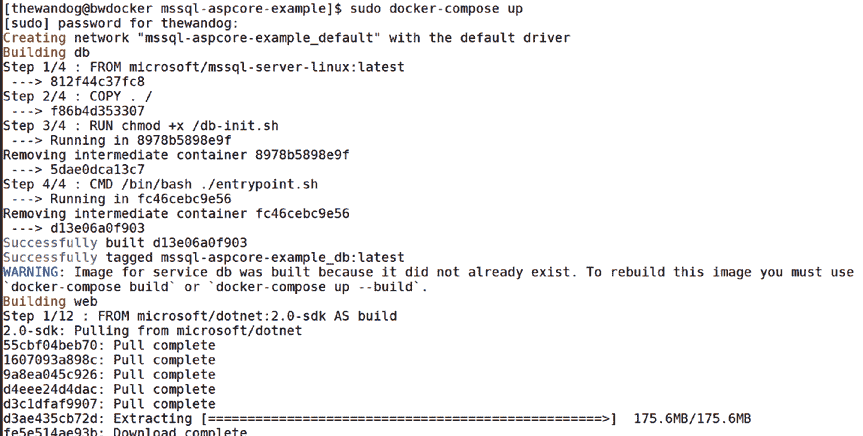

    第 11 章 SQL Server 与容器

5.  从 `bash` shell 运行以下命令来组合 Docker 应用程序，这将构建 Docker 镜像并运行容器：

    ```bash
    sudo docker-compose up
    ```

    执行时将会滚动显示大量信息。图 11-2 展示了在我的 Linux `ssh` 会话中正在进行的 `docker compose`。

    **图 11-2.** 正在进行中的 Docker compose

    容器并非在后台运行，因此当 compose 完成时，你的屏幕可能如图 11-3 所示。

    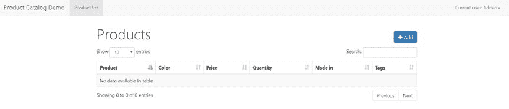

    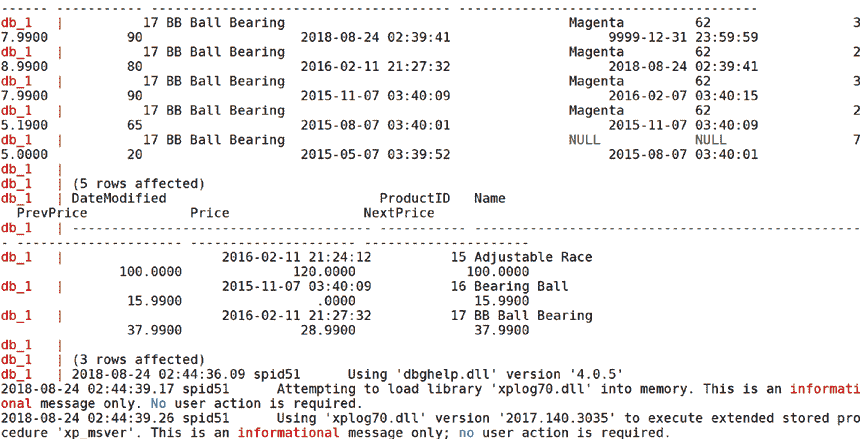

    第 11 章 SQL Server 与容器

    **图 11-3.** `docker compose` 启动容器后 `ssh` 中的状态

6.  要运行该应用程序，我需要为我的 Azure 虚拟机打开一个端口。ASP.NET 应用程序正在监听端口 `5000`。请参阅 [`github.com/Microsoft/sqllinuxlabs/tree/master/open_azure_vm_port`](https://github.com/Microsoft/sqllinuxlabs/tree/master/open_azure_vm_port) 的说明。


[GitHub 仓库链接](https://github.com/Microsoft/sqllinuxlabs/tree/master/open_azure_vm_port) `sqllinuxlabs/tree/master/open_azure_vm_port` 用于打开端口 5000。

7.  现在，从你的浏览器访问以下 URL：
    `http://<public IP address>:5000`

    当应用程序网页呈现时，你应该会看到一个类似图 11-4 的页面。

    ### 图 11-4：初始的 ASP.Net 容器应用程序屏幕

    点击页面左上角的`Product Catalog Demo`，你的屏幕现在应该看起来像图 11-5。

    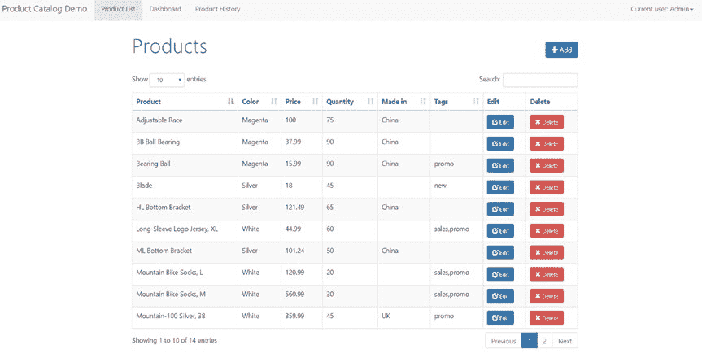

    ## 第 11 章 SQL Server 与容器

    ### 图 11-5：来自 ASP.Net Docker 容器应用程序的产品目录数据

    让我们深入了解一下`docker compose`和这些容器是如何工作的。

    从一个独立的 SSH 会话（你不能使用当前的 SSH 会话，因为这些容器没有在后台运行。如果你输入`<ctrl>+<c>`，容器将会结束），从 bash shell 运行以下命令以查看正在运行的容器。你也可以使用`<ctrl>+<z>`将容器强制转到后台：
    ```bash
    sudo docker ps --no-trunc
    ```
    你应该会看到类似下面的结果：
    ```
    CONTAINER ID IMAGE COMMAND CREATED STATUS PORTS NAMES
    22b900fd8f3ea03ca7a9d923441291a507dc4b3eb07fb3189fea6b3c8a6e0935 mssql-aspcore-example_web "dotnet belgrade-product-catalog-demo.dll" 16 minutes ago Up 16 minutes 0.0.0.0:5000->5000/tcp mssql-aspcore-example_web_1
    549d476ec793d96049a0193aeec78c6f32dc1661d79370c8855d7e50cc9797aa mssql-aspcore-example_db "/bin/sh -c '/bin/bash ./entrypoint.sh'" 16 minutes ago Up 16 minutes 0.0.0.0:1500->1433/tcp mssql-aspcore-example_db_1
    ```

    ## 第 11 章 SQL Server 与容器

    你可以看到有两个容器在运行。对于第一个容器，在容器内运行的命令使用了程序`dotnet`，它用于执行 ASP.NET 应用程序，在本例中是由`belgrade-product-catalog-demo.dll`实现的（该文件在创建 Docker 镜像时构建）。除了 SQL Server 的连接方式外，我不会过多地讲解 ASP.NET 应用程序的机制。你可以查看`Dockerfile`和目录`sqllinuxlabs/containers/mssql-aspcore-example/mssql-aspcore-example-app`中的所有源代码。

    第二个容器有以下命令：
    ```
    /bin/sh -c '/bin/bash ./entrypoint.sh'
    ```
    这是 SQL Server 镜像的容器，所以让我们探索一下`entrypoint.sh`是如何用来启动 SQL Server 的。

    1.  通过在 bash shell 中运行以下命令，切换到指定目录：
        ```bash
        cd ~/sqllinuxlabs/containers/mssql-aspcore-example/mssql-aspcore-example-db
        ```

    2.  首先，我们通过执行`cat Dockerfile`来查看名为`Dockerfile`的文件。结果应类似如下：
        ```
        FROM microsoft/mssql-server-linux:latest
        COPY . /
        RUN chmod +x /db-init.sh
        CMD /bin/bash ./entrypoint.sh
        ```
        因此我们知道，此目录中的 Docker 镜像将从最新的 SQL Server 镜像构建，当前目录中的所有文件将被复制到容器中，然后`db-init.sh`脚本将被修改以便可以执行。最后，启动容器的命令是`entrypoint.sh`脚本。

    3.  我们知道`entrypoint.sh`用于运行容器，所以让我们通过执行`cat entrypoint.sh`查看此文件。结果应类似如下（我从输出中删除了注释）：
        ```
        /db-init.sh & /opt/mssql/bin/sqlservr
        ```
        这个命令将在后台执行`db-init.sh`，然后在前台启动`sqlservr`。

    ## 第 11 章 SQL Server 与容器

    4.  现在，让我们通过执行`cat db-init.sh`来查看`db-init.sh`。你的结果应类似如下：
        ```
        #wait for the SQL Server to come up
        sleep 15s
        #run the setup script to create the DB and the schema in the DB
        /opt/mssql-tools/bin/sqlcmd -S localhost -U sa -P Sql2017isfast -d master -i db-init.sql
        ```
        这就是部分奥秘所在。这个脚本将等待 15 秒，让 SQL


# 第 11 章 SQL Server 与容器

服务器启动后，在容器内使用 `sqlcmd` 执行 `db-init.sql` 脚本。我会让你进一步查看 `db-init.sql`，但它基本上创建了 `ProductCatalog` 数据库，创建了登录名和对象，并向数据库填充了一些数据。

现在，你了解了如何启动一个 SQL Server 容器并运行 T-SQL 脚本来创建你的数据库、对象和数据的机制。

让我们看一下 `docker-compose.yml` 文件，了解 Docker Compose 如何知道如何构建每个容器。

1.  通过执行以下命令，切换到 `docker-compose.yml` 文件所在的原始目录：

    ```
    cd ~/sqllinuxlabs/containers/mssql-aspcore-example/
    ```

2.  现在，通过执行 `cat docker-compose.yml` 来输出 `docker-compose.yml` 文件的内容。你的结果应该如下所示：

    ```
    version: "3"
    services:
      web:
        build: ./mssql-aspcore-example-app
        ports:
          - "5000:5000"
        depends_on:
          - db
      db:
        build: ./mssql-aspcore-example-db
        environment:
          SA_PASSWORD: "Sql2017isfast"
          ACCEPT_EULA: "Y"
        ports:
          - "1500:1433"
    ```

`services:` 标签允许你定义将作为应用程序一部分运行的特定容器。对于每个服务，你可以定义用于构建镜像的 `Dockerfile` 的位置、运行容器时要使用的端口（包括映射的端口），以及一个服务是否依赖于另一个服务。在本例中，`web` 服务依赖于 `db` 服务。这意味着在 `web` 服务的容器启动之前，`db` 服务的容器将被创建并启动。

你还可以指定容器所需的任何环境变量，在本例中，这些变量是 SQL Server 容器的 EULA 协议和 sa 密码。并且对于 `db` 服务的容器，端口 1500 被映射到 SQL Server 的端口 1433。

因此，总结一下，当执行 `docker-compose up` 时，Docker 将使用 `docker-compose.yml` 文件，首先通过 `./mssql-aspcore-example-db` 目录中的 `Dockerfile` 构建 `db` 服务的容器。然后，它将使用指定的环境变量，基于该镜像运行一个容器，此时 SQL 服务可通过主机的端口 1500 访问。

接着，它将为 `web` 服务运行容器，该容器从 `./mssql-aspcore-example-app` 目录中的 `Dockerfile` 创建 Docker 镜像，并使用端口 5000 运行一个基于该镜像的容器。

最后一个重要的观察点：当我第一次看到这些容器时，我无法弄清楚 ASP.NET 应用程序如何知道连接到 SQL Server 容器的端口 1500。`docker-compose.yml` 文件中的服务定义是关键。名为 `db` 的服务实际上被映射到 `localhost,1500`。因此，ASP.NET 应用程序可以在连接字符串中使用 `db` 作为服务器名，来连接与 `db` 服务关联的容器中的 SQL Server。

我知道这感觉有点复杂，但这只是因为我深入探讨了幕后细节来描述组合一个多容器应用程序是如何工作的。现在，让我们来点有趣的。继续下一节，看看我如何应对 SQL Mac 挑战！

#### SQL Mac 挑战

2018 年 2 月，我在伦敦我最喜欢的活动之一 SQLBits 上做演讲。我的其中一个演讲是关于 Linux 上的 SQL Server。我当时正在用我可靠的 HP Zbook Studio 笔记本电脑运行 Windows 10 进行演讲和演示。一位观众举手说道：“鲍勃，我很高兴微软拥抱了 Linux，但我是一个 MacBook 用户。你在这些演示中使用的是 PC。但我没有看到微软对 MacBook 社区的承诺。”

尽管我之前没有研究过这个话题，但我对这个回答充满信心。“我们现在拥有的软件和工具，可以让你在你的 MacBook 上运行并与 SQL Server 交互，而无需虚拟化，也无需 Windows 工具。我相信你可以在 5 分钟内安装并运行它。”我称之为“接受 SQL Mac 挑战”。观众中的那个人说他们愿意接受这个挑战。


# 第 11 章 SQL Server 与容器

你可以在他的推文中看到这一挑战的结果：[`https://twitter.com/thofle/status/967437807697448965`](https://twitter.com/thofle/status/967437807697448965)。

其实我当时真的不确定我说的是否 100%准确（尤其是“无需虚拟化”和“五分钟”这两部分），但我之所以敢做出如此大胆的声明，是基于两点认知：(1) 我知道我们的 `docker` 容器镜像具有可移植性，并且可以轻松地在 `MacBook` 上运行，因为我知道 `Docker` 有适用于 macOS 的版本；(2) 我们的 `SQL Operations Studio` 工具是跨平台的，因此可以原生运行在 `macOS` 上。

回到德克萨斯州后，我做了一件我以为作为微软员工永远不会做的事。我问我的经理 Asad Khan，我是否可以买一台 `MacBook`。他说，鉴于我正在从事大量关于 `Linux` 和容器的工作，这完全合情合理。拿到 `MacBook` 后，我决定亲自接受这个 SQL Mac 挑战（你知道的，就是身体力行）。而我现在要说的是：我错了。我的错误在于，安装这个软件花了我四分钟，而不是五分钟。

让我带你重温一下整个过程，这样所有正在阅读本书的 `MacBook` 用户都可以自己尝试一下。

## 1. 安装 Docker for Mac
我做的第一件事是按照 [`https://store.docker.com/editions/community/docker-ce-desktop-mac`](https://store.docker.com/editions/community/docker-ce-desktop-mac) 所述，安装并下载 `Docker for Mac`（社区版）。（我使用了稳定版通道）。下载完成后的界面如图 11-6 所示。

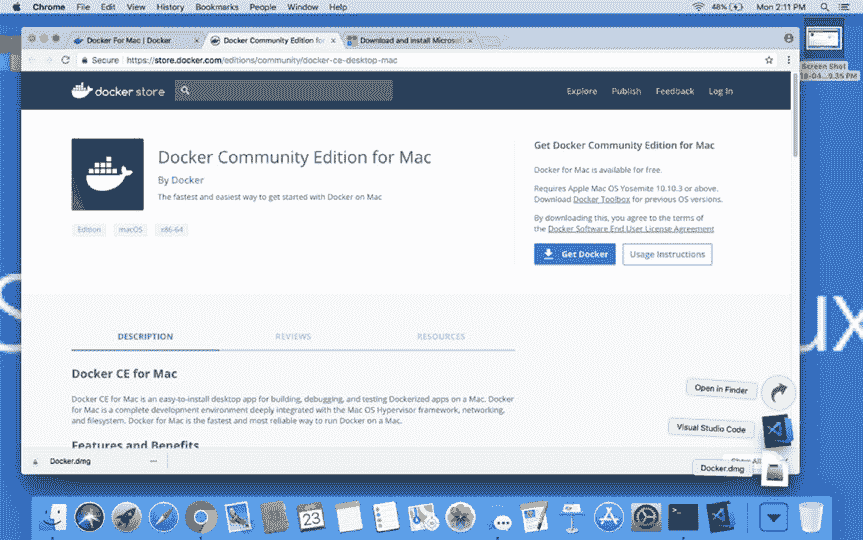

**图 11-6。** 下载 Docker for Mac

坦率地说，`docker` 在 `macOS` 上确实用到了一些虚拟化技术，但这已经比过去好多了。以前 `docker for Mac` 需要依赖 `virtualBox`，但现在 `macOS` 内置了一个轻量级的 Hypervisor 框架，因此更准确地说，`docker for Mac` 不再需要一个独立的、重量级的虚拟化环境。你可以在 [`https://docs.docker.com/docker-for-mac/docker-toolbox/#the-docker-for-mac-environment`](https://docs.docker.com/docker-for-mac/docker-toolbox/#the-docker-for-mac-environment) 阅读更多关于 `docker for Mac` 环境的信息。

## 2. 将 Docker 安装为应用程序
`Docker for Mac` 的下载文件解压后，会弹出一个新窗口，让你通过简单的拖放操作将 `Docker` 安装为 `Mac` 应用程序，如图 11-7 所示。

**图 11-7。** 安装 Docker for Mac

## 3. 启动 Docker
现在 `Docker` 已作为应用程序安装好了，我从 `MacBook` 的 Launchpad 启动了它。此时，我的屏幕顶部出现了一个 `Docker` 图标，我可以看到它正在启动，如图 11-8 所示。

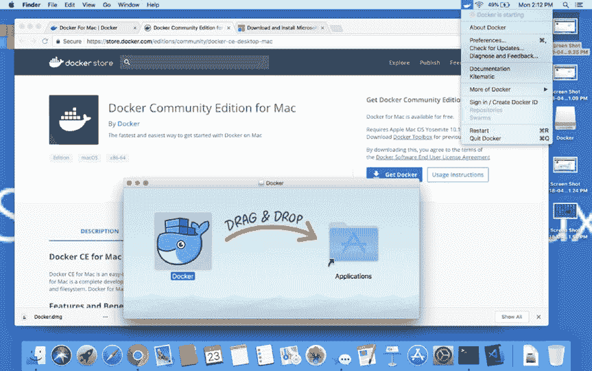

**图 11-8。** Docker for Mac 正在启动

## 4. 下载 SQL Operations Studio
现在我想多任务操作，因此在 `Docker` 启动的同时，我从 [`https://docs.microsoft.com/sql/sql-operations-studio/download`](https://docs.microsoft.com/sql/sql-operations-studio/download) 下载了适用于 `macOS` 的 `SQL Operations Studio`。

## 5. 拉取 SQL Server 镜像
在下载 `SQL Operations Studio` 的时候，`Docker` 已经启动了。于是我通过 `macOS` 的 `Terminal`（本质上是一个 `bash` shell）使用 `docker` 命令拉取了 `SQL Server` 镜像。我运行了如下命令：

```bash
docker pull microsoft/mssql-server-linux:2017-latest
```

## 6. 解压 SQL Operations Studio
在拉取镜像的同时，我解压了 `SQL Operations Studio` 的下载文件。解压过程应如图 11-9 所示。

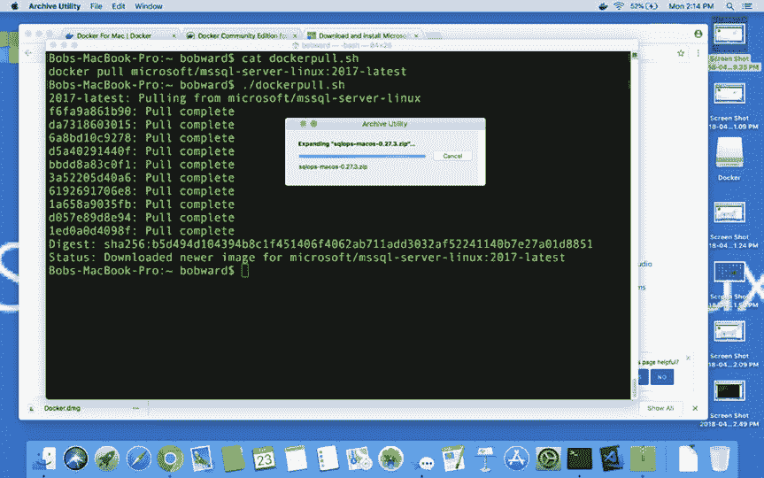

**图 11-9。** 解压 SQL Operations Studio for macOS

# 第 11 章 SQL Server 与容器

在文件解压的同时，`docker pull` 命令已经为我执行完毕，因此现在可以通过 MacOS 终端运行以下命令来启动容器：

```
docker run -e 'ACCEPT_EULA=Y' -e 'MSSQL_SA_PASSWORD=Sql2017isfast' -p 1401:1433 --name sql1 -d microsoft/mssql-server-linux:2017-latest
```

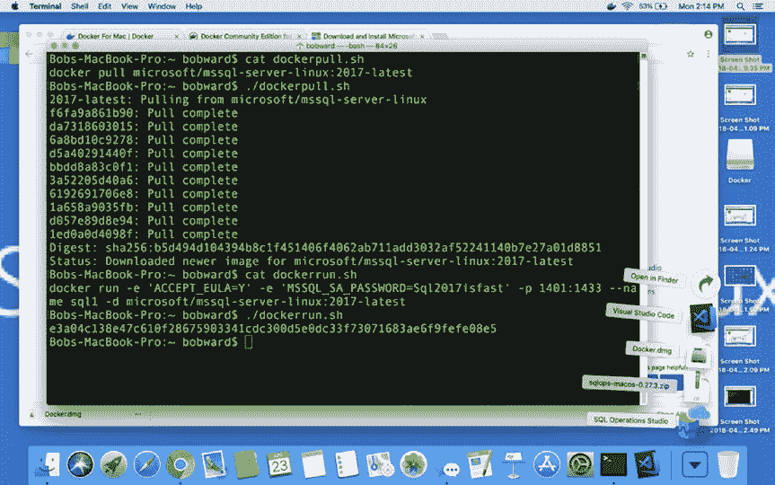

SQL Operations Studio 已经解压完成，因此可以如图 11-10 所示选择进行安装。

**图 11-10.** 为 macOS 安装 SQL Operations Studio

现在可以从 Launchpad 启动 SQL Operations Studio，连接到 `localhost` 的 `1401` 端口，并针对运行 SQL Server 的容器执行查询，如图 11-11 所示。

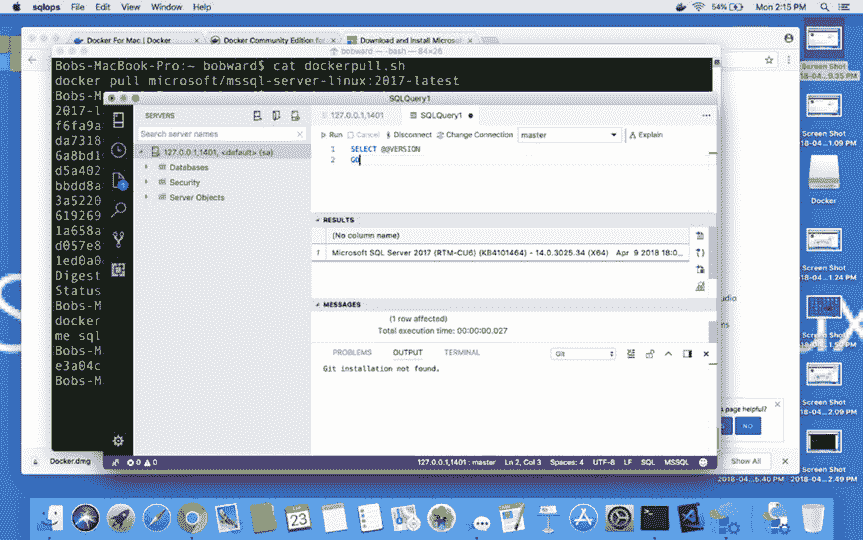

**图 11-11.** 在 macOS 中针对 SQL Server 容器运行查询

就是这样。如果忽略掉我的所有解说，只按照步骤操作，并且网络连接尚可，你可以在五分钟之内完成所有这些。至此，你已正式完成了 SQL Mac 挑战。在本章结尾，让我们探讨一种使用名为 Kubernetes 的环境在生产环境中运行 SQL Server 容器的独特方式。

#### SQL Server 与 Kubernetes

正如 Kubernetes 在其官网 `https://kubernetes.io` 所定义的，它是一个“用于自动化容器化应用的部署、扩缩和管理的开源系统”——也被称为容器编排器。简而言之，Kubernetes 是一个用于部署和管理生产环境容器集的系统。在 Linux 服务器上运行多容器应用是一回事，但如果你需要部署数百个容器呢？如何以高效的方式部署和管理这些容器？此外，如何为 SQL Server 容器建立一个 `HADR` 系统？Kubernetes 提供了所有这些功能。

根据维基百科 (`https://en.wikipedia.org/wiki/Kubernetes`)，Kubernetes 由 Google 的工程师于 2014 年创立。在希腊语中，Kubernetes 意为“舵手”或“船长”。我最初接触 Kubernetes 时，记得收到同事 Travis Wright 的邮件中使用了缩写 `k8s` 来代表 Kubernetes。于是我查阅了一下，果然 `k8s` 是一个缩写，用来替代 Kubernetes 一词中“k”和“s”之间的 8 个字母（参见 `https://kubernetes.io/docs/concepts/overview/what-is-kubernetes/#what-does-kubernetes-mean-k8s`）。因此，在本章的剩余部分，我自己也将使用 `k8s` 来指代 Kubernetes。

`k8s` 的一个美妙之处在于它现在可以在多种平台上运行：物理机、虚拟机以及云解决方案。例如，你可以在笔记本电脑上设置一个 `Minikube` (`https://kubernetes.io/docs/setup/minikube`) 来了解 `k8s` 与 Docker 容器配合使用的基本原理。或者，你可以使用云解决方案，如 RedHat 的 `Openshift` (`https://www.openshift.com`) 或 Microsoft Azure Kubernetes 服务 (`AKS`) `https://azure.microsoft.com/services/kubernetes-service/`。请浏览 `k8s` 的完整已知解决方案列表：`https://kubernetes.io/docs/setup/pick-right-solution/`。你还应该收藏 `k8s` 的主要文档页面 `https://kubernetes.io/docs/home` 以备将来参考。

##### 基础知识

关于 `k8s`，你可以学习许多方面，以便开发容器应用或操作整个 `k8s` 系统。对于 SQL Server 结合 `k8s` 的使用场景，我认为重要的是你


# 第 11 章 SQL Server 与容器

了解以下术语：

- 集群
  一个 k8s 集群是通过一组节点和 Pod 部署的容器集合，这些概念我将在下面定义。

- Pod
  k8s 中的 Pod 是一个或多个容器的组，它们可以共享存储、网络以及关于如何运行这些容器的规范。

- 节点
  我很喜欢 k8s 文档（位于 `https://kubernetes.io/docs/concepts/architecture/nodes/`）对节点的定义。"节点是 Kubernetes 中的工作机器，以前称为 minion。节点可以是虚拟机或物理机。" 实际上，可以将节点视为一个或多个 Pod 的宿主机。

- 副本集
  副本集定义了在任何时间点应运行多少个特定 Pod 的实例，并有助于定义 Pod 的高可用性。副本集对于让 Kubernetes 在 Pod 发生故障时自动启动新 Pod 非常重要。

- 部署
  部署是一种声明式方法，用于定义 Pod 和副本集。建议使用部署来定义 Pod 和副本集的配置以实现高可用性。这是我们将在本章中用来演示如何为 SQL Server 与 k8s 定义和配置 HADR 的方法。

- 持久卷声明
  K8s 支持通过 PersistentVolume 供 Pod 使用的存储概念。这种存储可以在 Pod 间共享（这非常契合 SQL Server 的共享存储 HADR 解决方案）。持久卷声明是用户对 PersistentVolume 存储的请求。

- 服务
  服务是一组可以被抽象的 Pod 的逻辑集合。其中一种服务类型是用于连接的负载均衡器。你可以为负载均衡器服务指定一个 IP 地址。每个 Pod 都有一个唯一的 IP 地址，但负载均衡器拥有一个已知的 IP 地址。可以将其视作故障转移集群实例所使用的虚拟 IP 地址概念，或可用性组的侦听器概念。即使在 k8s 执行"故障转移"时，它也能为 SQL Server 提供一个抽象的 IP 地址。

你可以在 `https://kubernetes.io/docs/concepts/` 阅读关于 k8s 组件和架构的更完整描述。了解了这些术语后，让我们通过使用 AKS 在 k8s 中部署一个 SQL Server 容器来实际看看它们的应用。

##### SQL Server HADR 与 Kubernetes

既然我已经描述了 k8s 的基础知识，或许你可以看出 k8s 为容器提供了一个支持 HADR 的平台。只要你以正确的方式构建你的部署和服务，SQL Server 就可以利用这种内置的 HADR 能力。在本节中，我将首先描述 HADR 如何与 k8s 协同工作，然后介绍一个非常棒的教程，你可以用它来逐步完成使用 k8s 部署 SQL Server 的过程。

###### HADR 如何与 k8s 协同工作

我已经描述了节点、Pod 和服务的基本术语。让我用一些可视化内容来展示 HADR 如何与 Pod、这些节点的概念以及服务协同工作。

使用 Pod 和持久卷声明配置 SQL Server 是一种共享存储 HADR 解决方案，其提供的功能类似于 Always On 故障转移集群实例。

首先，如果 k8s 检测到 Pod 出现问题或发生故障，k8s 将在该 Pod 当前运行的同一节点上自动创建一个新的 Pod，这将启动该 Pod 中的任何容器。此外，如果 Pod 使用了持久卷声明，新 Pod 中的容器将能够访问存储在该持久卷中的相同数据。另外，如果你设置了与该 Pod 关联的负载均衡器服务（该服务有一个唯一的 IP 地址），用户可以连接到负载均衡器服务（该服务有一个固定的 IP 地址），从而无需了解 Pod IP 地址的细节。图 11-12 展示了 Pod 故障的概念。

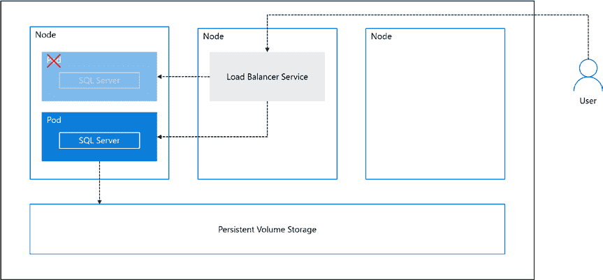

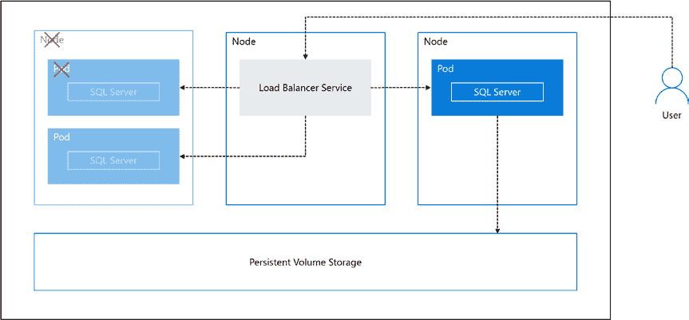

图 11-12. 针对 Pod 故障的 k8s HADR


### Kubernetes 故障转移支持

Kubernetes（k8s）同样支持在节点因任何原因发生故障时进行故障转移。一个新的 Pod 会在新节点上启动，负载均衡器服务将被重定向到新节点上的新 Pod。由于 k8s 支持节点故障，任何用于 SQL Server 的生产级 k8s 集群都应至少有三个节点以支持故障转移，这不仅是为了 SQL Server，也是为了负载均衡器服务。图 11-13 展示了此场景。

*图 11-13. 节点故障的 k8s HADR*

k8s 和故障转移的一个未在这些图中列出的有用特性是，当 SQL Server 在容器中崩溃或关闭时的情况。在这种情况下，k8s 将在同一节点上的同一 Pod 中启动一个新容器。

> **注意**：当 k8s 必须在新节点的新 Pod 中启动 SQL Server 容器时，容器启动可能需要更长时间，因为该 SQL Server 镜像可能未在该新节点上缓存，必须从 Docker Hub 拉取。一旦镜像被拉取，它将被缓存在该节点上，后续的启动应该会更快。

让我们通过查看 Microsoft 文档中支持的一个教程，来了解 k8s、SQL Server 和内置 HADR 的实际操作。

## 在 Azure Kubernetes Service 中使用 SQL Server

我的一位才华横溢的同事 Mihaela Blendea 花时间构建了一个非常棒的教程，介绍如何使用 AKS 设置带有 k8s 的 SQL Server。我将让你使用自己的 Azure 订阅来逐步完成本教程，地址为：`https://docs.microsoft.com/sql/linux/tutorial-sql-server-containers-kubernetes`。我已完成本教程，因此让我补充几点观察：

> **提示**：如果你想在不使用本地 `azure CLI` 的情况下完成本教程，请考虑通过门户使用新的 `azure CloudShell`。你会得到一个 bash shell（或 PowerShell），因此默认安装了诸如 `sqlcmd` 和 `nano` 编辑器等工具。这非常酷！你可以在 `https://azure.microsoft.com/en-us/features/cloud-shell/` 阅读更多关于 `azure CloudShell` 的信息。

- 教程中的先决条件指向此文档页面以首先创建 AKS 集群：`http://docs.microsoft.com/azure/aks/tutorial-kubernetes-deploy-cluster`。我只是使用门户创建了一个 Kubernetes 服务，并使用大部分默认设置创建了我的集群。但是，我必须首先连接到我创建的 AKS 集群，使用此文档部分中的以下步骤：`https://docs.microsoft.com/azure/aks/tutorial-kubernetes-deploy-cluster#connect-to-cluster-using-kubectl`。

我的 Kubernetes 服务（即我的 k8s 集群）在资源组 `bwk8s` 中名为 `bwsqlk8s`。因此，我从 Azure CloudShell 使用了以下命令来连接到我的 AKS 服务：
```
az aks get-credentials --resource-group bwk8s --name bwsqlk8s
```
然后，为了验证我的节点，我从 Azure Cloud Shell 运行了以下命令：
```
kubectl get nodes
```
我构建了一个三节点集群，所以我的结果看起来像：
```
NAME                       STATUS    ROLES     AGE       VERSION
aks-agentpool-38442334-0   Ready     agent     21m       v1.11.2
aks-agentpool-38442334-1   Ready     agent     21m       v1.11.2
aks-agentpool-38442334-2   Ready     agent     21m       v1.11.2
```
一旦完成，我就可以继续进行教程的下一步。

- 使用以下命令确保包含 SQL Server 容器的 Pod 正在运行：
```
kubectl get pods
```


### 第 11 章：SQL Server 与容器

我的 Pod 大约花了五分钟才显示为 `Running` 状态。你的输出应该类似于：

```text
NAME                                  READY   STATUS    RESTARTS   AGE
mssql-deployment-3813464711-h312s    1/1     Running   0          17m
```

*   `sqlcmd`（是的！）已内置在 Azure CloudShell 中，因此我能够通过负载均衡器服务的外部 IP 地址连接到我新的 SQL Server 部署。
*   如果你进行删除 Pod 的练习以查看 HADR（高可用性与灾难恢复）的工作原理，新 Pod 启动可能需要长达四分钟左右。不幸的是，这是在 k8s 中使用 SQL Server 的弱点之一。SQL Server 宕机四分钟可能是一段很长的时间。我们正在努力为 SQL Server 和 k8s 带来其他创新，以使其更快、更好。

*   使用以下 `kubectl` 命令查看你的 Pod 运行在哪个节点上：

    ```
    kubectl get pods -o wide
    ```

*   K8s 甚至支持在运行 SQL Server 的容器崩溃或 SQL Server 被关闭时重启该容器。你自己试试看。通过负载均衡器的外部 IP 地址连接到 SQL Server 容器，并执行 T-SQL `SHUTDOWN` 命令。如果你随后执行 `kubectl get pods`，你会短暂地看到 `STATUS` 显示为 `Error` 和 `CrashLoopBackOff`，但随后在同一个 Pod 内，它将恢复为 `Running`。
*   这是一个进阶测试。尝试*排空*运行 SQL Server 容器的 Pod 所在的节点。排空节点是一种模拟节点故障的方法。`kubectl get pods -o wide` 命令会显示运行中 Pod 所在节点的名称。使用该名称，执行以下命令：

    ```
    kubectl drain <节点名称> --ignore-daemonsets
    ```

    现在使用 `kubectl get pods -o wide` 查看 SQL Server 容器在一个新节点上以新的 Pod 启动。要使你排空的节点可以再次使用，请运行以下命令：

    ```
    kubectl uncordon <节点名称>
    ```

你可以看到 k8s 内置 HADR 的强大之处。不需要故障转移集群实例软件，而且坦白说，SQL Server 并不知道自己运行在这种 HADR 环境中。与任何 SQL Server 生产环境一样，务必制定可靠的备份策略。

我得承认，这是我写过的比较有趣的一章，因为我相信容器和 k8s 是令人惊叹的新技术，对于托管像 SQL Server 这样的应用和数据库系统将变得越来越流行。在本章中，我向你介绍了容器的基础知识，展示了如何部署和使用带有 SQL Server 的容器，甚至挑战了 MacBook 用户“无需 Windows”地使用 SQL Server。最后，我通过介绍一种称为 Kubernetes（k8s）的托管 SQL Server 和容器的新方式来结束本章。

#### 总结

随着本章结束，我也完成了本书的撰写。这是我在微软 25 年职业生涯中做过的最愉快也最困难的事情之一。我带你开启了一段旅程，从 SQL Server 在 Linux 上的历史背景开始，到部署过程和细节。然后，我向你展示了如何构建自己的数据库和应用程序。接着，我详细介绍了 SQL Server 为你提供的所有满足需求的惊人工具和内置功能。然后，通过了解性能、安全和 HADR 方面的能力，你能够看到 SQL Server 真正有多健壮。之后，我让你深入了解了适用于 Linux 上 SQL Server 的强大管理和监控功能。在第 10 章，我向你展示了迁移技术，包括 SQL Server 与 PostgreSQL 的比较。然后你刚刚读完了关于容器技术的章节，它为部署和运行 SQL Server 带来了一系列新场景。我希望你喜欢阅读本书，并能在未来你使用 Linux 上的 SQL Server 和容器的旅程中将其作为参考。

### 第 12 章：结语

SQL Server 工程团队以*云的速度*前进。这是我的观察。

# SQL Server 的未来：Linux、容器与新功能展望

自两年前加入团队以来，我一直见证着 SQL Server 的快速发展。我的好友兼 SQL Server 产品的架构师 Conor Cunningham 曾告诉我，如果我们想的话，微软如今每个月都能发布一个高质量的 SQL Server 版本。这与“Yukon”（SQL Server 2005）时代相去甚远，那时发布一个版本需要好几年时间。当然，新版本需要有价值和新特性才能在行业中站稳脚跟，所以每月发布一次可能并不合适。SQL Server 2017 紧随 SQL Server 2016 之后发布，其重要的一部分是将 SQL Server on Linux 推向市场。

那么 SQL Server 的下一步是什么，尤其是对于 SQL Server on Linux 和容器而言？

## SQL Server 2017 的改进亮点

在 2017 年 10 月宣布 SQL Server 2017 的同时，我们的团队已经在着手开发下一版 SQL Server，其中包括专门针对 SQL Server on Linux 和容器的改进。到本书出版时，我们很可能已经宣布了关于如何改进 SQL Server on Linux 和容器的消息。这些增强功能包括但不限于：

*   `SQL Server 复制`
*   `机器学习服务`（包括 R、Python，甚至可能还有其他语言）
*   分布式事务 (`DTC`) 支持
*   用于复制和链接服务器的 `Active Directory` 集成
*   适用于 SQL Server on Linux 的 `Polybase`

© Bob Ward 2018
B. Ward, *Pro SQL Server on Linux*, `doi.org/10.1007/978-1-4842-4128-8_12`

## 第十二章 后记

我们还想继续让容器拥有出色的体验，因此我们计划进行以下改进：

*   用于 `RHEL` 的容器镜像
*   将容器注册到 `Microsoft 容器注册表` (`MCR`；你仍然可以在 `Docker Hub` 上找到它们，但它们将链接到 `MCR`)。你可以在 [`azure.microsoft.com/blog/microsoft-syndicates-container-catalog`](https://azure.microsoft.com/blog/microsoft-syndicates-container-catalog) 阅读更多关于 `MCR` 的信息。
*   `Kubernetes` 对 `Always On 可用性组` 的支持。这一点令人兴奋，因为它为 `k8s` 上的 `SQL Server` 提供了比共享存储好得多的 `RTO` 方案。Travis Wright 已经制作了一个视频来预览这一体验：[`youtu.be/Xa1ec4z6XIk?list=PL-_k_UrAvrYsSydSyVeXIXy-vInFEruxr`](https://youtu.be/Xa1ec4z6XIk?list=PL-_k_UrAvrYsSydSyVeXIXy-vInFEruxr)。

你还会看到，微软为下一版 SQL Server（包括 Windows 和 Linux 版本）准备了其他新功能和增强功能。此外，我们正在研究与大数据系统集成的新创新，以及 `SQL Operations Studio` 的普遍可用版（如果这个工具有了新名字，我也不会感到惊讶）。

SQL Server 的未来是光明的。在 Linux 上发布 SQL Server 为微软打开了新市场、新客户和新机遇。与此同时，我们仍然坚信 SQL Server on Windows Server 是一个绝佳的组合。这一切都是关于选择与兼容性：你的选择。加倍投入容器和 `Kubernetes` 等新技术，使 SQL Server 成为面向所有开发者、应用程序以及私有和公共云环境的数据平台。我期待继续帮助微软，使 SQL Server 在未来岁月里成为首选的现代数据平台。

`索引`

`A`

intelligence, 408
Linux 与 Windows 对比, 410

`Active Directory` 身份验证, 526

`REQUIRED_SYNCHRONIZED_SECONDARIES_TO_COMMIT` 命令与对象, 409

`域` 控制器, 324

辅助副本, 408–409

`Kerberos`, 325

`sp_server_diagnostics`, 410

`keytab`, 324

同步副本, 408


### 索引

## 始终可用性组 (AGs)
### 架构与数据同步
### 流程，407
### 异步 (async)，408
### 自动页面修复，434
### 集群
### 自动故障转移，410
### 配置副本，409
### 数据保护与高可用性，409
### 灵活故障转移策略，410
## 始终可用性组 (AGs) (续)
### Corosync，405
### 灵活故障转移策略，403–404
### 监控策略，404
### Pacemaker，403–405
### 仲裁，404–405
### STONITH，405
### 系统存储过程，403
### 分布式，411
### 容错与高可用性，406
### 安装 Linux 和 SQL Server，412–413
### Pacemaker 集群 (参见 Pacemaker 集群)
### 性能，431–432
### 主副本，406
### 可读次要副本，433
### 资源，集群，425–427
## 自适应索引碎片整理，473
## 自适应联接运算符，312
## 自适应查询处理 (AQP)，296, 311–313, 525
## 始终加密，352–354, 527
## 应用程序二进制接口 (ABI)，5
## 应用程序编程接口 (API)，4
## ASYNC_NETWORK_IO 行为，287
## 审核，527
## 自动页面修复，434
## 无集群，434–435
##### 配置
### 设置，326–327
### 单点登录，323
## copycertkeys.sh，415
### 用法，328
## cowboysrule，421
## Windows 身份验证，323
## createag.sql，418
## dbag.sql，420
## dbjoinag.sql，420
## dbmirrorfirewall.sh，417
## dbmloginuser.sql，414
## enableag.sh，413
## enableagxe.sql，414
## endpoint.sql，416
## ERRORLOG，418–419
## 防火墙，417
## joinag.sql，419
## kinit，324
## listdbs.sql，420
## movecertkeys.sh，415
## primaryagcert.sql，414
## 领域，324
## secondaryagcert.sql，416
## SPN，324
## TGT，324
## sys.availability\_groups 和 sys.availability\_replicas，418
## sys.dm\_hadr\_database\_replica\_states，409
## cfgendpoint.sql，417
## 数据库运行状况检测，431
## 数据库镜像，406
### 描述，405
## WSFC，398
## Amazon 弹性容器服务 (ECS)，21
## Pacemaker 集群
### 性能，431–432
### sp\_server\_diagnostics
---
© Bob Ward 2018
B. Ward, 《Linux 上的 Pro SQL Server》，[`doi.org/10.1007/978-1-4842-4128-8`](https://doi.org/10.1007/978-1-4842-4128-8)


# B

`Always On Failover Cluster Instance (FCI)`
BACPAC 文件, 509
数据保护，397
`bcp` 工具，151–153
文档参考, 399
商业智能（`BI`），18
文档，398
功能，397
高可用性附加组件，398

# C

`callProcedure()` 方法，123
Linux 与 Windows 对比, 400
SQL Server 功能
`mssql-server-ha` 软件包，399
图数据库, 139–142
`Pacemaker`, 398
`JSON`, 136
资源代理, 399
现代数据平台, 135
安装与配置，401–402
原生评分功能, 142–143
软件与硬件
时态表, 136–139
组件，398–399
索引
基数估算，284
`mssql-scripter`，156–157
CentOS, 24
`sqlcmd`，147–150
变更控制与审计流程, 438
`sqlservr`, 158–159
频繁通信的应用程序，285
公用表表达式（`CTE`），540
`校验和`, 461–463
连接池，125
客户端 URL 请求库（`cURL`），36
连接字符串，223
无集群的可用性组, 434–435
容器编排器，577
列存储索引，474
容器
优势
持续集成/持续部署，21
批处理模式执行，296
编写多容器应用程序
压缩，296
ASP.Net 容器应用程序
数据消减，296
屏幕，566
选择, 296–297
Azure 虚拟机，566
客户案例与资源，302
`docker-compose` 软件包，
数据加载, 301
安装，564
`fact_sales_all.sql` 脚本, 300
`docker-compose.yml` 文件，564,
`fact_sales_count.sql` 脚本，299
569–570
`fact_sales_query.sql` 脚本, 300
`entrypoint.sh`，
碎片化，301
SQL Server，568–569
内存技术，294
产品目录数据, 567
`lob` 逻辑读值, 300
运行，565
分区, 301
SQL Server 镜像，568
性能, 301
数据库，20

# 其他条目

自动计划修正，313
辅助副本, 406
自动调优，313–316, 535
软件组件, 406
Azure 容器服务，21
同步（`sync`），407
Azure Kubernetes 服务（`AKS`），578,
测试
582–584
数据复制，428
故障转移，429–431
事务日志，407–408


`Rowstore`, 294

定义, 19, 545

`SET STATISTICS IO`, 301

`Docker Engine`, 20
- `结构`, 295

`Dockerfile`
- `T-SQL 语句`, 298
- `bash shell`, 560

`WideWorldImportersDW`
- `创建`, 559
- `数据库`, 298–299

`docker build 命令`, 560](#index_split_008.html#p578)
- `工作原理`
- `执行`, 562
- `聚集索引`, 295
- `Linux 主机服务器`, 563
- `增量行组`, 295
- `还原数据库`, 562
- `非聚集索引`, 295
- `运行`, 562
- `行组`, 294
- `T-SQL 语句`, 563
- `段`, 294

`HADR`, 580

`命令行工具`
- `改进`, 587–588
- `bcp`, 151–153
- `Kubernetes`, 21
- `mssql-cli`, 153–155

`macOS` (*参见* `SQL Mac 挑战`)

# `索引`

## `容器` ( *续* )
- `大日志记录`, 376
- `平台独立性、可移植性和一致性`, 20–21
- `完整`, 376
- `简单`, 375

### `SQL Server`
- `部署容器`, 549
- `事务日志`, 375
- `快照`, 379
- `系统`, 380
- `更新`, 556
- `事务日志`, 376–378
- `*对比* 虚拟机`, 546
- `T-SQL RESTORE 语句`, 370

### `持续集成与持续部署 (CI/CD)`, 21

### `仅复制备份`, 378

## `数据库控制台命令 (DBCC)`, 214–215

## `核心数据库引擎`
- `缓冲池缓存`, 518
- `校验和`, 517
- `CPU 和 NUMA 分配`, 517
- `数据库大小控制`, 517
- `图数据库`, 518
- `原生评分`, 519
- `执行计划缓存`, 518
- `表空间`, 517
- `时态表`, 518
- `线程 *对比* 进程`, 516

## `数据库实验助手 (DEA) 工具`, 497
- `博客文章`, 504
- `文档`, 501
- `防火墙重新配置`, 503
- `流`, 501–502](#index_split_007.html#p520)
- `初始屏幕`, 502
- `ostress.exe`, 503

## `数据库运行状况检测`, 431

## `数据库镜像`, 406

## `数据库恢复`
- `快速恢复`, 382
- `LSN`, 382
- `阶段`
    - `分析`, 382
    - `重做`, 382
    - `撤销`, 382
- `过程`, 381
- `WAL`, 381

## `数据应用程序`, 111
- `增强`, 125
- `执行存储过程`, 123–125
- `插入与读取`, 118–123
- `node.js`, 114–117

## `数据库还原`

# `D`

## `累积更新 (CU)`, 35, 42


# 数据库管理参考

##### 数据库备份

*   `programming interfaces`
*   `backup sequence`
*   `programming languages`
*   `CHECKSUM option`

### 文件/文件组

*   `copy-only`
*   `metadata`
*   `differential`
*   `moving files`
*   `full (see Full database backup)`
*   `MTF format`
*   `pages`
*   `piecemeal restore`

###### 恢复模型

*   `WITH ROLLBACK AFTER | ROLLBACK IMMEDIATE | NO_WAIT`
*   `point-in-time restores`
*   `RESTORE T-SQL`
*   `RESTORE VERIFYONLY`

### 脚本

*   `restorewwifilelistonly.sql`
*   `restorewwiheaderonly.sql`
*   `restorewwimove.sql`
*   `backupwwidiff.sql`
*   `backupwwilog1.sql`
*   `backupwwilog2.sql`
*   `backupwwilog3.sql`
*   `backupwwi.sql`
*   `backupwwitailoflog.sql`
*   `insertdeandre.sql`
*   `insertdennis.sql`
*   `insertdirk.sql`
*   `insertluka.sql`
*   `letsgomavs.sql`
*   `mavstothenbafinals.sql`
*   `restorewwiall.sql`
*   `restorewwi.sh and restorewwi_linux.sql`
*   `wwisetfull.sql`

## 数据库快照

*   `documentation`
*   `pages`
*   `read-only`
*   `sparse files`
*   `and VDI`
*   `RTO and RPO requirements`
*   `system`
*   `transaction log`
*   `/var/opt/mssql directory`
*   `WideWorldImporters database`

## 数据迁移助手 (DMA)

*   `tool`
*   `DBCC CHECKDB repair observations`
*   `REPAIR_ALLOW_DATA_LOSS`
*   `REPAIR_REBUILD`
*   `DBCC command`
*   `DBFS tool`
*   `DB_NAME() system function`
*   `db_owner database`
*   `Dedicated Admin Connection (DAC)`
    *   `amidac.sql`
    *   `ERRORLOG`
    *   `hung`
    *   `logins/queries`
    *   `remote connectivity issues`
    *   `scenarios`
    *   `series of backups`
    *   `sqlcmd`
    *   `sys.sysschobjs`
    *   `TCP port (1434)`
    *   `T-SQL statements`

## 数据库

### ALTER DATABASE

*   `EMERGENCY`
*   `PAGE_VERIFY`
*   `READ_ONLY | READ_WRITE`
*   `SINGLE_USER | RESTRICTED_USER`

### 其他

*   `Delayed durability`
*   `Deployment`
*   `Application Name`


### 索引

## **E**

### ABI, 5

### API, 4

### Drawbridge（吊桥）

*   `ABI`, 5
*   `API`, 4
*   库操作系统 (Library OS), 4
*   Midori, 6
*   PAL, 4
*   微进程 (Picoprocess), 4–5
*   Slava, 6
*   虚拟化 (Virtualization), 4

### 动态数据屏蔽 (DDM), 340–344, 527

### 动态管理函数 (DMF), 185

*   `database_id and file_id`, 190
*   `dm_exec_sql_text`, 187
*   `dm_io_virtual_file_stats`, 189
*   `dm_os_memory_clerks`, 191
*   内存书记类型 (Memory clerk types), 192

### 动态管理视图 (DMVs), 520–521

*   `dm_db_missing_index_details`, 193
*   `dm_exec_query_stats`, 187
*   `dm_exec_requests.sql`, 186
*   `dm_io_virtual_file_stats.sql`, 189
*   `dm_os_ring_buffers`, 194
*   `dm_os_ring_buffers_exception.sql`, 194
*   `dm_os_sys_info`, 193
*   `dm_os_waiting_tasks`, 188
*   `dm_os_wait_stats`, 188
*   `dm_tran_locks`, 192
*   `sys.dm_exec_sessions`, 186
*   `sysprocesses and syslocks`, 184
*   处理结果 (Processing results), 287

### 开发人员（续），T-SQL 智能感知，SQL 操作

*   死锁 (Deadlocks), 287
*   T-SQL 的威力 (Power of T-SQL), 284–285
*   工作室 (Studio), 189

### 差异备份, 378

### 灾难恢复, 529

### 脏页, 245

### 分布式可用性组, 411

### Docker

*   客户端 (Client), 547
*   Compose, 565
*   容器 (Containers)
    *   特性 (Characteristics), 547
    *   组件 (Components), 547
    *   镜像 (Images), 546
    *   方法（连接 SQL Server）(Methods (connect SQL server)), 553
    *   命名空间 (Namespaces), 547
    *   UnionFS, 546
*   守护进程 (Daemon), 547
*   Hub 容器镜像, 550

### 紧急模式修复, 465–466

### 急切写入 (Eager Writes), 246

### 加密

*   Always Encrypted（始终加密）, 352–354
*   连接 (Connections), 349–352
*   Crypto API, 345
*   数据库备份 (Database backups), 348
*   数据库主密钥 (Database master key), 346
*   功能 (Features), 345, 355
*   服务主密钥 (Service master key), 346
*   SQL Server 证书, 347
*   透明数据加密 (Transparent data), 347–348

### 可执行和可链接格式 (ELF), 12

##### 扩展事件

*   对象 (Objects), 197–199
*   `quicksessionstandard.sql`, 199–200
*   场景 (Scenarios), 203
*   会话创建 (Session, creation), 199
*   `start_xevent_session.sql`, 200
*   `sys.server_event_sessions`, 199
*   工具 (Tools), 201–203

### 完整数据库备份 (BACKUP DATABASE 命令)

*   `CHECKSUM`, 373
*   文件/文件组 (Files/filegroups), 375
*   `STATS=5`, 373

### USER_MULTI_USER, 458

*   连接 (Connections), 286

### VIEW SERVER STATE 权限, 185


# ETL
写入磁盘， 372
进程， 218, 508
带 INIT， 372
与 TDE 一起使用压缩， 374

## F
`ERRORLOG` ，374
`MTF protocol`， 371
文件和文件组
线程， 374
优势 ，262
`WideWorldImporters 数据库`， 370–371
增长，规划 ，268–269
`FULLSCAN 选项`， 281
托管磁盘存储系统， 260
多数据库

## G
`bigdb.sql`， 264
`bigtab.sql`， 265
`图数据库` ，139–142
`CREATE DATABASE` 语句， 264

## H
`DEFAULT 关键字`， 265
`硬件虚拟化`， 545
磁盘和挂载目录 ，263
`Hekaton`， 302–305
`dm_db_file_space_usage`
`赫尔辛基`， 3
脚本 ，266
`Drawbridge` ，4–6
文件组， 262
`Slava`， 7–8
页分配 ，268
`SQLOS`， 6–7
`pages_by_object.sql 脚本`， 268
`SQLPAL` ，7
存储系统， 262
Linux 上的 SQL Server
`total_page_count` ，267
二进制格式， 12
`USERDATA 文件组`， 267
调用约定， 12
虚拟机 ，263
组件， 13
比例填充算法， 262
`ELF` ，12
轮询算法 ，262
`宿主扩展`， 9, 12
分离的数据和事务日志文件，
`LibOS 组件` ，13
260–261
`PE 格式` ，12
单一数据库文件 ，260
单一 Linux 进程 ，11
`填充因子` ，280
`SQLOS` ，12
`筛选索引`， 280
`SQLPAL.DLL` ，12
`平面文件目标`， 225](#index_split_003.html#p246)
`sqlservr`， 11
索引
高可用性和灾难恢复
`查询计划`， 279
`(HADR)`， 367
`XML 架构` ，276
备份和还原 ，528
类型和考虑因素， 280
`数据库快照` ，529
`WideWorldImporters 数据库`，
灾难恢复， 529
274–275
故障转移群集和可用性
`间接检查点` ，245
组， 529–530
`INFORMATION_SCHEMA`， 183
启动和并行恢复 ， 528–529
基础架构即服务 (IaaS)
混合事务分析
平台， 56
处理 (HTAP)， 297
内存中 OLTP
基础知识， 303

## I
`Hekaton 引擎` ，303–305
索引， 308–309
索引
内存优化文件组，
`自适应索引碎片整理`， 473](#index_split_007.html#p493)
305–306
`ALTER INDEX`， 470
内存优化表 ，306–308


-   `聚集索引`，271–272
-   本机编译存储过程，
-   `Columnstore`, 270, 474
-   309–310
-   创建数据库, 270
-   使用场景，310–311
-   `DROP INDEX`，469

##### 安装

-   `碎片`
-   `Azure 虚拟机`, 56–58
-   逻辑/区, 470
-   60 秒内部署，35–36
-   页面紧密度，471
-   `探索`
-   `sys.dm_db_index_physical_stats`，
-   EULA 文件, 62
-   472
-   日志文件，63–64
-   主体，470
-   `/opt/mssql`，62
-   修改，474
-   `/var/opt/mssql`，62
-   `非聚集索引`, 273–274
-   `Linux 发行版`, 24–26
-   重建，472–473
-   `Linux 提示`
-   重组, 473
-   `命令`, 29, 31
-   指导资源，270
-   `sudo`，31–32
-   `工具`
-   系统日志, 33–34
-   `数据库引擎优化顾问`工具, 276
-   查看和编辑文件与
-   `dm_db_missing_index_details`，276
-   脚本, 32–33
-   `索引 seek`，280
-   离线, 53–55
-   `IO 统计信息`，277, 279
-   软件包, 55–56
-   `缺失索引`, 277–278
-   `安装后配置`
-   查询优化器，278
-   (参见 安装后配置)

### 索引

-   `自动检查点`，245
-   36–37
-   `数据压缩`, 246–247
-   `设置`, 39, 41–42
-   `脏页`，245
-   `SQL Server 引擎`，37–39
-   `急切写入`，246
-   系统要求，26–27
-   `间接检查点`，245
-   `SQL Server 测试`
-   `惰性写入`, 246
-   `HammerDB`, 28
-   `预读`
-   `WideWorldImporters 示例`，27
-   方法, 240
-   `查询提示`, 242
-   `read_size 列`，244
-   大小, 240
-   `T-SQL 语句`，243
-   `剖析 XML 数据`, 243
-   `WAL 协议`, 246
-   `WideWorldImporters 数据库`，241, 243
-   `预写式日志记录`, 244

## 故障排除

-   调试，61
-   `mssql-conf`, 59–60
-   权限和所有权，61
-   网络连接差或无连接，58–59
-   `RECOVERY WRITER`，245
-   `yum 锁定问题`, 60
-   无人参与，52–53
-   `更新和卸载`
-   之前的更新，回滚，73–74
-   移除 SQL Server，74–75
-   更新 SQL Server, 71–73
-   验证
-   连接并运行查询, 45–48
-   远程连接, 48–49

## J

-   日志，89
-   `journalctl`，33–34
-   `JSON`，136
-   运行 mssql-server 服务，


# K

## SQL Server 功能
49–51

## 版本

## Kubernetes (k8s)
21
### 累积更新 (CUs)
42

### Azure Kubernetes 服务 (AKS)
582–584

### GDR 存储库
43

##### 基础知识
578–579

### mssql-server-2017
42
### 描述
577

### mssql-server-2017-gdr
42

### 高可用性与灾难恢复 (HADR)
580–581

### Integration Services 项目
220

### Pod 故障
580, 581

### 智能查询处理
311

#### 智能 SQL Server 引擎

# L

##### 自适应查询处理
311–313

##### 自动调优
313–316

## 大型页
71

## 解释型 T-SQL
309

## 延迟写入
246

## I/O 处理

###### 轻量级查询分析
210–211

### 索引

## Linux 工具

### Midori
6

### dstat
488

### 迁移，SQL Server
DEA (参见 `Database Experimentation Assistant (DEA) tool`)

### DMA 工具
497–500
### 执行
#### BACPAC 文件
509

#### 还原，数据库备份，
505–506, 508

#### SSIS 包
508

### Oracle
#### 执行
511–514

#### 准备
510

### PostgreSQL (参见 PostgreSQL)

### 过程
496

### 缺失索引
535

### 索引 (参见索引)

### MobaXterm
25

### 服务器端代码
475

# M

## 管理
### 数据库 (参见数据库)
### 索引 (参见索引)
### 服务器端代码
475

#### 监控 SQL Server
### 性能
437, 476

### 动态管理视图 (DMVs)
##### 自动调优
479
#### 专用管理员连接 (DAC)
445–448
#### 批请求/秒
478
#### `dm_exec_query_profiles`
477
#### `dm_exec_query_stats`
477
#### `dm_exec_requests`
477
#### `dm_os_performance_counters`
478
#### `dm_os_waiting_tasks`
477
#### `dm_os_wait_stats`
477
#### `SQLServer:SQL Statistics`
478
#### 前 5 个计数器区域
479

##### 扩展事件
###### 轻量级查询分析
480
##### 查询存储
480
#### `QuickSessionTSQL`
481
#### SQL Server Profiler
481–482
#### DMV `dm_os_performance_counters`
482

### Microsoft 磁带格式 (MTF)
#### 协议
371

### 索引

### 日志序列号 (LSN)
382

### 日志传送
369

### 日志截断
375

### 日志写入器
245

## 管理
### 数据库 (参见数据库)
### 索引 (参见索引)

### 服务器端代码
475

#### 监控 SQL Server
### 性能
437, 476

##### SQL Server 实例配置
###### `ALTER SERVER CONFIGURATION`
439
#### `mssql-conf`
439
#### 资源调控器 (参见资源调控器)
###### `sp_configure`
439

### SQL Server
#### 代理作业
440–441

### sqlservr 命令行
#### 选项
449–451

###### 工具
438

### 表
#### `ALTER TABLE`
467–468
#### `TRUNCATE TABLE`
469

### 索引

### 运行命令
423


# N

`系统运行状况会话`, 483–484

`服务`, 422

`tracepagesplits.sql`, 482

`SQL Server 高可用性代理`, 424

`XEProfiler`, 480–482

`STONITH`, 424

`Linux 工具`, 485–488

`订阅`, 421

`查询存储`, 479–480

`用户名和密码`, 421

`运行中`, 476–477

`PAGELATCH`, 272

`智能日志备份`, 485

##### 并行处理

`等待中`, 477

`备份/还原`, 248

`移动数据库`, 452–453

`构建索引`, 249

`mssql-cli`, 153, 155

`误判`, 247

`mssql-scripter`, 156–157

`创建数据库`, 248

`mssql-server`, 30

`DBCC CHECKDB`, 249

`多语句表值函数 (MSTVF)`, 535

`查询计划`, 247–248

`恢复`, 249

`sqlqpparallel.sql 脚本`, 247

`统计信息`, 249

`本机评分`, 142–143

`T-SQL SELECT 语句`, 247

`参数嗅探`, 314

# O

`父级看守进程`, 13

`分区消除`, 288

`对象资源管理器`, 167–169, 176–179

`快速查看定义`, 174

`对象关系映射 (ORM)`, 114, 542

## 性能能力

### 加速

`列存储索引`, 294–302

### 联机事务处理 (OLTP), 302

`内存中 OLTP (参见 内存中 OLTP)`

`操作系统虚拟化`, 545

`ORACLE 企业级 Linux (OEL)`, 24

`分区表和索引`, 288–294

`OverlayFS`, 546

##### 配置

`处理器关联`, 252

`上限`, 250

`并行度的成本阈值`, 252

`数据库选项`, 255–257

`memorylimitmb 选项`, 250

`Linux 内核`, 258–259

`最大服务器内存`, 250

`最小服务器内存`, 250

`并行执行`, 251

`计划缓存`, 254

`统计信息`, 280–284

`tempdb 文件`, 254

`线程`, 253–254

`跟踪`, 253

# P

`Pacemaker 集群`, 15, 398

`clusterproperties.sh`, 424

`创建`, 423

`防火墙端口`, 422

`密码`, 422

`池 ID`, 422

### 索引

### 性能能力 (续)

`还原脚本`, 230

`WideWorldImporters 数据库`, 230

`性能监视器工具`, 238

## 权限与访问，安全性

`应用程序角色`, 335

`开发人员 (参见 开发人员)`

`可用性组`, 336

`数据库角色`, 332–335

`动态内存和缓存管理`


### 索引

### A
*   亲和进程: [235]
*   自动软 NUMA: [234–235]

### B
*   缓冲池: [236], [239]

### C
*   列存储索引: [525]
*   核心数据库引擎
    *   文件与文件组: [260–269]
*   DBCC CLONEDATABASE: [523]
*   DBCC 命令: [523]
*   DMV: [520–521]

### D
*   数据库与还原: [236]
*   数据库缓存
*   `dm_os_tasks`: [233]
*   `dm_os_workers`: [233]
*   动态数据屏蔽: [340–344]

### E
*   ERRORLOG: [521]
*   执行: [532–533]

### G
*   授予与撤销访问权限: [328–329]

### H
*   HADR: [528–530]

### I
*   内存 OLTP: [525]
*   索引: [270–280]
*   即时文件初始化: [70]
*   智能 SQL Server 引擎
*   I/O 处理 (参见高效 I/O 处理)

### L
*   大页面: [71]
*   实时查询统计信息: [522]
*   锁定的程序包: [70]
*   Linux
    *   mssql-conf: [64–68]
    *   Red Hat Enterprise Linux (RHEL) 7.3 与 7.4: [24]
    *   WSFC: [71]

### M
*   管理与监控: [530–531]
*   内存: [239]
*   mssql-conf: [64–68]

### P
*   并行处理
*   并行查询: [525]
*   微进程: [4]
*   部分还原: [394]
*   `pgAdmin`: [523]
*   计划缓存: [236]
*   计划选择回退: [314]
*   平台抽象层 (PAL): [4]
*   可移植执行 (PE) 格式: [12]
*   端口映射: [552]
*   PostgreSQL
*   安装后配置
    *   即时文件初始化: [70]
    *   大页面: [71]
    *   锁定的程序包: [70]
    *   `mssql-conf`: [64–68]
    *   修复数据库: [459]
    *   SQL Server 实例
    *   WSFC: [71]
*   性能能力
*   平台抽象层 (PAL): [4]
*   平台: [2–3]
*   可移植执行 (PE) 格式: [12]

### Q
*   查询哈希: [256]
*   查询计划回退: [314]
*   查询存储: [212–214, 314, 479–480, 521–522]

### R
*   实时操作分析: [297]
*   恢复点目标 (RPO): [378]
*   恢复时间目标 (RTO): [378]
*   `RECOVERY WRITER`: [245]
*   修复数据库: [459]
*   资源: [235]
*   行级安全性: [336, 338–339]

### S
*   可扩展性
*   可扩展性与 TPC 基准测试: [524]
*   调度器: [231–233]
*   安全: [526–527]
*   安全主体: [328]
*   服务器角色: [329–331]
*   `sqlmem.sql` 脚本: [237]
*   `sqlservr` 进程: [237]
*   SQL 语言: [519–520]
*   SQL Server: [514]
*   SQLOS 组件: [231]
*   SSIS: [523]

### T
*   目标缓存内存: [239]
*   服务器总内存: [239]
*   工具
    *   DBCC CLONEDATABASE: [523]
    *   DBCC 命令: [523]
    *   DMV: [520–521]
    *   ERRORLOG: [521]
    *   实时查询统计信息: [522]
    *   查询存储: [521–522]
    *   SSIS: [523]

### 其他
*   核心数据库引擎 (参见 核心数据库引擎)
*   高效 I/O 处理
*   执行: [532–533]
*   `sys.dm_os_performance_counters`: [238]

## 校验和
-   `校验和`, 461–463

## ALTER SERVER
-   `ALTER SERVER`

## 数据库状态
-   `数据库状态`, 459–461

## CONFIGURATION
-   `CONFIGURATION`, 69–70

## DBCC CHECKDB
-   `DBCC CHECKDB`, 463–464

## sp_configure
-   `sp_configure`, 69

## 紧急模式
-   `紧急模式`, 465–466

## 迁移后
### 数据库兼容性
-   `RESTORE with CONTINUE_AFTER_ERROR`, 466
-   向后兼容性, 540

## SQLIntersection
-   `SQLIntersection`, 459

## 查询处理
### SQL Server 产品
-   `SQL Server 产品`, 459
-   增强功能, 539

## 资源调控器
### 功能
-   `功能`, 541–542
-   `分类器函数`, 444](#index_split_006.html#p464)
-   `HADR 策略`, 537
-   `配置`, 445
-   `对象`, 541
-   `资源池`

## 优化性能
### AFFINITY
-   `AFFINITY`, 442
-   基线及监控, 536

### CAP_CPU_PERCENT
-   `CAP_CPU_PERCENT`, 442
-   索引, 535–536

### default
-   `default`, 442
-   新功能, 537

### internal
-   `internal`, 442
-   建议, 534–535

### MAX_IOPS_PER_VOLUME
-   `MAX_IOPS_PER_VOLUME`, 443

### PREDICATE 函数
-   `PREDICT 函数`, 143

### MAX_MEMORY_PERCENT
-   `MAX_MEMORY_PERCENT`, 442

### PRIMARY 文件组
-   `PRIMARY 文件组`, 262

### 工作负荷组
-   `工作负荷组`, 443–444

### PSSDiag
-   `PSSDiag`, 492–493

### ring_buffer_types.sql
-   `ring_buffer_types.sql`, 194

### 索引
### RML 工具
-   `RML 工具`, 503

##### 安装
-   `Docker`, 573

### 行组消除
-   `行组消除`, 296](#index_split_004.html#p317)

### 行级安全性
-   `行级安全性`, 336–340](#index_split_005.html#p357)

#### SQL Operations Studio
-   `SQL Operations Studio`, 576

### 行存储索引
-   `行存储索引`, 296

### Mac 启动
-   `Mac 启动`, 574

### 运行查询
-   `运行查询`, 577

#### SQL Operations Studio
##### 配置
-   `配置`, 163](#index_split_003.html#p184)

## 安全性
-   `安全性`, 317

### 数据库仪表板
-   `数据库仪表板`, 171–172
-   `Active Directory 身份验证,`
-   `扩展`, 172
-   323–328
-   `功能`, 174
-   `数据分类`, 356–359

##### 安装
-   `安装`, 160](#index_split_003.html#p181)

### 加密
-   *参见* 加密

##### 对象资源管理器
-   `对象资源管理器`, 167–169

#### 登录名和用户
-   `服务器仪表板`, 170
-   `身份验证`, 318

##### T-SQL 查询编辑器
-   `T-SQL 查询编辑器`, 173–174

## SQL 平台抽象层
-   `(SQLPAL), 3

## for sqllinux
-   `for sqllinux`, 321

## SQL Server Analysis Services
-   `SQL Server Analysis Services (SSAS)`, 18

## SQL Server Integration Services
### 包
-   `包`, 15, 508, 523
-   *参见* 权限和访问，安全性
-   `连接字符串`, 224
-   `数据流任务`, 222, 225
-   `dtexec`, 219, 220
-   `平面文件目标`, 225
-   `执行`, 226–227](#index_split_003.html#p247)

##### SQL Server 审核
-   `SQL Server 审核`

### 操作组
-   `操作组`, 362

### action_id 列
-   `action_id 列`, 366

### 操作目标
-   `操作目标`, 362


# T

## T-SQL
`ALTER TABLE`
- `ADD column`，467
- `ALTER COLUMN column`，468
- 命令，135
- 复杂数据类型，133–135
- 查询编辑器，179–180
- 脚本，397

## 表
- 分析型查询，132–133
- 时态表，136–139

## 尾日志备份
- 378

## 表格数据流 (TDS) 协议
- 114

## 目标
- 362

## Tedious
- 114

##### 时态表
- 136–139

## Tempdb
- 81

## 票证授予服务器 (TGS)
- 324

## 票证授予票证 (TGT)
- 324

## 工具，数据库引擎
- `DBCC`，214–215
- 扩展事件 (参见 扩展事件)
- 查询存储，212–214
- 系统存储过程，184
- 系统表和目录视图，182–183
- 跟踪标志，216–218

## 训练好的模型
- 143

#### 事务日志备份
- 376–378

## 事务日志文件
- 89

## 透明数据加密 (TDE)
- 346, 527

## 传输层安全性 (TLS)
- 15, 349

## 故障排除
- 核心转储文件，491–492
- 转储文件，489–490
- `PSSDiag`，492–493


# 数据库创建

`cleanup.sql`, 101

`DROP COLUMN` 列, 468

`CREATE CUSTOMERS.sql`, 101

`属性`, 468

`createlogin.sql`, 100–101

`Sch-M`, 468

`createpeople.sql`, 101

`Sch-S`, 468

`createschemas.sql`, 101

`TRUNCATE TABLE`, 469

`createsequences.sql`, 101

### 索引

T-SQL (*续*)

`UNIQUE 约束`, 99

`createwwi.cmd`, 100

# 临时对象

`createwwi.sh`, 100

全局临时表, 131

数据库上下文, 80–82

存储过程, 130–131

数据库所有者 (dbowner), 83

表和表变量, 127–130

`dropandcreatedb.sql`, 101

表值参数, 130

功能, 89

`tempdb`, 内部使用, 131

实例, 79

# 测试查询

`sa 密码`, 100

基本语句和脚本, 102

脚本执行, 101

功能, 106

服务器名称, 100

`createview.sql`, 106

`mssql` 扩展名, 78–79

`sqllinux` 登录名, 82–83, 100

`execinsertcustomer.sql`, 108

用户数据库 (*参见* 用户数据库)

`findcustomercontacts.sql`, 107

环境, 112–113

`GETDATE()`, 105

`insertcustomerproc.sql`, 107

`查询编辑器`, 173–174, 179–180

插入数据, 102–104

字符串函数, 135

读取数据, 105

系统数据库, 80–81

服务器端编程, 107

# 表创建

存储过程, 107–108

应用程序架构, 90

# 更新和删除数据

聚集索引, 95

105–106

颜色编码, 94–95

视图对象, 106–107

列定义, 94

触发器, 132

约束, 95

`Visual Studio Code`, 78–79

`createcustomers.sql`, 97–98

`WideWorldImporters` 数据库, 77–78

`createpeople.sql`, 92–93

##### T-SQL 性能特性

`customers` 表, 90, 97

轻量级查询分析, 210–211

默认值约束, 96

`SET STATISTICS`

外键约束, 96, 99

命令, 208

`IDENTITY` 列, 91

`SET STATISTICS IO` 输出, 210

`people` 表, 90, 94

`SET STATISTICS TIME` 输出, 209

`PersonID`, 94, 96–97

`SHOWPLAN`

主键约束, 95

命令, 204

`sales` 架构, 90

图形化查询计划, 206

架构, 90–91

查询计划操作符详情, 207

序列, 91–92

`SET SHOWPLAN_XML`, 205

Shell, 89

`SET STATISTICS XML`, 207

存储大小, 89

T-SQL 序列, 520

索引

`U`

`W`

`Ubuntu`, 24

`Windows 身份验证`, 323

# UNIX 开发

# Windows 与 Linux

项目, 1

功能和特性, 14–15

# 用户数据库

开发者, 17

`cleanup.sql`, 84

企业版, 16

`createdbifexists.sql`, 87

速成版, 17

`createdb.sql`, 85

不可用的功能, 17–18

数据库上下文, 88

标准版, 16

`dropandcreatedb.sql`, 88

使用, 18–19

执行查询, 86–87

Web 版, 17

智能感知, 85–86

###### Windows Server 故障转移群集

`mssql` 扩展名, 84

(WSFC), 71, 398

`USE` 关键字, 88

预写日志 (WAL), 244, 381

`WideWorldImporters_log.ldf`, 89

`WideWorldImporters.mdf`, 88

`X`

`XE Profiler`, 202

`V`

# 虚拟设备

# 接口 (VDI), 379–380, 528

# Y, Z

`Yellow Dog Linux`, 37

`Visual Studio Code`, 78–79

`YellowDog 更新修改器 (Yum)`, 37


## 目录

### 关于作者

# 关于技术审校

### 致谢

### 前言

### 引言

# 第 1 章：为何选择在 Linux 上运行 SQL Server？

#### 平台选择

#### 我们是如何构建的

##### Drawbridge

##### SQLOS、SQLPAL 和 Helsinki

##### Linux 上的 SQL Server 架构

#### Windows 版 SQL Server 与 Linux 版。它们是相同的吗？

##### Linux 版 SQL Server 的功能

##### 哪些特性不可用

##### 我应该使用 Windows 还是 Linux？

#### 容器是新的虚拟机

##### 数据库容器

##### 平台独立性、可移植性与一致性

##### 持续集成/持续部署

##### Kubernetes

#### 本章小结

### 第 2 章：安装与配置

#### 安装准备

##### Linux 发行版

##### 系统要求

##### SQL Server 测试

###### WideWorldImporters 示例

###### 对 SQL Server 进行压力测试

##### Linux 技巧

###### 常用命令

###### `sudo`

###### 查看和编辑文件及脚本

###### 系统日志记录

#### 开始安装！

##### 60 秒内部署

##### 下载仓库配置文件

##### 安装 SQL Server 引擎

##### 完成 SQL Server 的设置

#### 完整的安装体验

##### 安装其他版本

##### 验证安装

###### 检查 `mssql-server` 服务是否正在运行

###### 本地连接并运行查询

###### 远程连接

###### 验证 SQL Server 功能的更多方法

##### 静默安装

##### 离线安装

##### 安装其他软件包

##### 在 Azure 中安装

##### 安装故障排除

###### 网络连接差或无连接

###### 安装未通过 `mssql-conf` 完成

###### `Yum` 锁

###### 更改 SQL Server 目录的权限或所有权

###### 安装调试

#### 探索 Linux 上的 SQL Server

##### 已安装内容

###### `/opt/mssql`

###### `/var/opt/mssql`

##### 其他文件

##### 使用日志文件

#### 安装后配置

##### 使用 `mssql-conf`

##### SQL Server 实例配置

###### `sp_configure`

###### `ALTER SERVER CONFIGURATION`

##### Linux 上的 Windows 配置选项

###### 锁定内存页

###### 即时文件初始化

###### 大页面

###### Windows Server 故障转移群集

#### 更新与卸载

##### 更新 SQL Server

##### 回滚到之前的更新

##### 移除 SQL Server

#### 本章小结

### 第 3 章：构建数据库与 T-SQL 基础

#### 设置环境

#### 创建数据库

##### 系统数据库

##### 创建登录名和用户

##### 创建用户数据库

#### 创建表

##### 创建架构

##### 创建序列

##### 最终创建表

#### 创建完整的数据库

#### 构建并运行查询

##### 插入与读取数据

##### 更新与删除数据

##### 创建视图与存储过程

#### 本章小结

### 第 4 章：构建应用程序与高级 T-SQL

#### 设置环境

#### 为 SQL Server 构建并运行数据应用程序

##### 将 `node.js` 与 SQL Server 配合使用

##### 使用 `node.js` 连接到 SQL Server

##### 插入与读取数据

##### 执行存储过程

##### 增强你的应用程序

#### 深入 T-SQL

##### 创建和使用临时对象

###### 临时表与表变量

###### 其他临时对象

###### `tempdb` 的内部使用

##### 触发器

##### 分析查询

##### 复杂数据类型

##### 字符串函数

##### 其他 T-SQL 命令

#### 探索新的 SQL Server 功能

##### JSON

##### 时态表

##### 图数据库

##### 原生评分

#### 本章小结

### 第 5 章：SQL Server 工具

#### 命令行工具

##### `sqlcmd`

##### `bcp`

##### `mssql-cli`


# SQL Server 管理工具

## mssql-scripter

### sqlservr 命令行选项

#### SQL Operations Studio

##### 安装

##### 配置

##### 对象资源管理器

##### 仪表板、见解和扩展

##### T-SQL 查询编辑器

##### 其他功能

#### SQL Server Management Studio

##### 对象资源管理器

##### T-SQL 查询编辑器

##### 报告

#### 引擎内置工具

##### 系统表和目录视图

##### 系统存储过程

##### 动态管理视图

###### 视图

###### DBFS 工具

##### 扩展事件

###### 扩展事件对象

###### 用法和场景

###### 工具

##### T-SQL 性能特性

###### SHOWPLAN

###### SET STATISTICS

###### 轻量级查询分析

##### 查询存储

##### DBCC 命令

##### 跟踪标志

#### 用于 ETL 的 SSIS

##### 创建包

###### SQL Server Data Tools

###### 构建包

##### 执行包

##### 进一步使用 SSIS

#### 总结

### 第 6 章：性能能力

#### 内置性能

##### SQL Server 内置可扩展性

##### 动态内存和缓存管理

##### 高效的 I/O 处理

###### 预读

###### 预写日志

###### 检查点、延迟写入和急切写入

###### 数据压缩

##### 并行处理

#### 最大性能配置

##### SQL Server 实例配置

##### 数据库选项

##### Linux 内核配置

#### 调优以获成功

##### 文件和文件组

###### 分离数据和事务日志文件

###### 使用多个数据库文件和文件组

### 索引

###### 聚集索引

###### 非聚集索引

###### 查看 WideWorldImporters

###### 使用工具

###### 索引类型和其他注意事项

##### 统计信息

###### 索引和列上的统计信息

###### 自动化与统计信息

###### 基数估算

##### 开发者技巧

###### 利用 T-SQL 的威力

###### 连接、事务和死锁

###### 处理你的结果！

###### 设置你的应用程序名称

#### 加速性能

##### 分区表和索引

##### 列存储索引

##### 工作原理

###### 何时以及应选择哪种？

###### 实战中的列存储

###### 技巧

###### 客户故事和资源

##### 内存 OLTP

##### 基础知识

###### Hekaton 引擎

###### 内存优化文件组

###### 内存优化表

### 索引

###### 本机编译存储过程

###### 使用场景

#### 智能 SQL Server 引擎

##### 自适应查询处理

##### 自动调优

#### 总结

### 第 7 章：SQL Server 安全性

#### 登录名和用户

#### Active Directory 身份验证

##### 工作原理

##### 设置

##### 使用 AD 身份验证

#### 权限和访问

##### 授予和撤销访问权限

##### 角色和权限

###### 服务器角色

###### 数据库角色

###### 应用程序角色

###### 其他权限

##### 行级安全

##### 动态数据屏蔽

#### SQL Server 与加密

##### SQL Server 密钥和证书

##### 透明数据加密

##### 加密数据库备份

##### 加密连接

##### 始终加密

##### 加密总结

#### 数据分类和审核

##### 数据分类

##### 漏洞评估

##### SQL Server 审核

#### 总结

### 第 8 章：SQL Server 的高可用性与灾难恢复

#### 备份和还原

##### 数据库备份

###### 完整数据库备份

###### 恢复模型


#### 事务日志备份

*   事务日志备份
    *   差异备份与仅复制备份
    *   数据库快照
    *   VDI 与快照备份
    *   系统数据库备份
*   数据库还原与恢复
    *   数据库恢复
    *   还原数据库
    *   完整数据库还原
    *   文件、部分和页面还原
    *   系统数据库还原

#### Always On 故障转移群集实例

*   工作原理
*   设置与配置
*   `sp_server_diagnostics` 与故障转移

#### Always On 可用性组

*   工作原理
    *   同步选项
    *   群集与可用性组
    *   分布式可用性组
*   设置与配置
    *   安装 Linux 和 SQL Server
    *   在这些 SQL Server 副本上创建和配置 AG
    *   使用 Pacemaker 创建群集
    *   将 AG 添加为群集中的资源
*   让我们测试一下
    *   测试数据复制
    *   测试故障转移
*   数据库运行状况检测
*   性能注意事项
*   可读的辅助副本
*   自动页面修复
*   无群集的可用性组

#### 小结

### 第 9 章：管理与监控 SQL Server

#### 管理 SQL Server 实例

*   更改服务器配置选项
*   创建 SQL Server Agent 作业
*   使用资源调控器
*   使用专用管理员连接
*   `sqlservr` 命令行选项

#### 管理数据库

*   移动数据库
*   管理文件
*   分离与附加数据库
*   `ALTER DATABASE` 使用场景
*   修复数据库
    *   数据库状态
    *   更多关于校验和
    *   `DBCC CHECKDB` 修复
    *   紧急模式修复
    *   使用 `CONTINUE_AFTER_ERROR` 的 `RESTORE`
    *   查找损坏原因

#### 管理对象

*   管理表
    *   修改表
    *   截断表
*   管理索引
    *   索引碎片
    *   重建索引
    *   重组索引
    *   自适应索引碎片整理
    *   修改索引
    *   维护列存储索引
*   管理服务器端代码

#### 监控 SQL Server

*   监控 SQL Server 性能
    *   运行中或等待中
    *   使用 DMV 监控性能
    *   使用查询存储监控性能
    *   使用扩展事件进行性能分析
*   使用系统运行状况会话
*   智能日志备份
*   用于监控的 Linux 工具

#### SQL Server 故障排除

*   转储文件
*   核心转储文件
*   PSSDiag

#### 小结

### 第 10 章：迁移到 Linux 上的 SQL Server

#### 从 SQL Server 迁移

*   迁移准备
    *   数据迁移助手
    *   数据库实验助手
*   执行迁移
    *   还原数据库备份
    *   使用大容量复制或 SSIS 包复制数据
    *   使用 BACPAC 导出和导入

#### 从 Oracle 迁移

*   迁移准备
*   执行迁移

#### 从 PostgreSQL 迁移

*   PostgreSQL 与 SQL Server 比较
    *   核心数据库引擎
    *   SQL 语言
    *   工具
    *   性能
    *   安全性
    *   高可用与灾难恢复
    *   管理与监控
*   执行迁移

#### 迁移后注意事项

*   迁移后优化性能
    *   重建现有索引并创建新索引
    *   建立新的性能基线和监控策略
    *   启用新功能以提升性能
*   设计您的安全与 HADR 策略
*   使用数据库兼容性级别
    *   利用数据库兼容性启用新功能
    *   使用数据库兼容性实现向后兼容
*   迁移 SQL Server 实例对象
*   使用新功能
*   让现有应用程序在 Linux 上的 SQL Server 上运行


#### 总结

### 第 11 章：SQL Server 与容器

#### 容器简介

#### 如何在容器中使用 SQL Server

##### 部署并运行 SQL Server 镜像

###### Docker 容器 SQL Server 基础

###### 使用容器更新 SQL Server

##### 使用 Dockerfile 构建你自己的容器

##### 组合多容器应用

#### SQL Mac 挑战

#### SQL Server 与 Kubernetes

##### 基础知识

##### SQL Server HADR 与 Kubernetes

###### HADR 如何与 k8s 协同工作

###### 在 Azure Kubernetes 服务中使用 SQL Server

#### 总结

### 第 12 章：结语

### 索引
