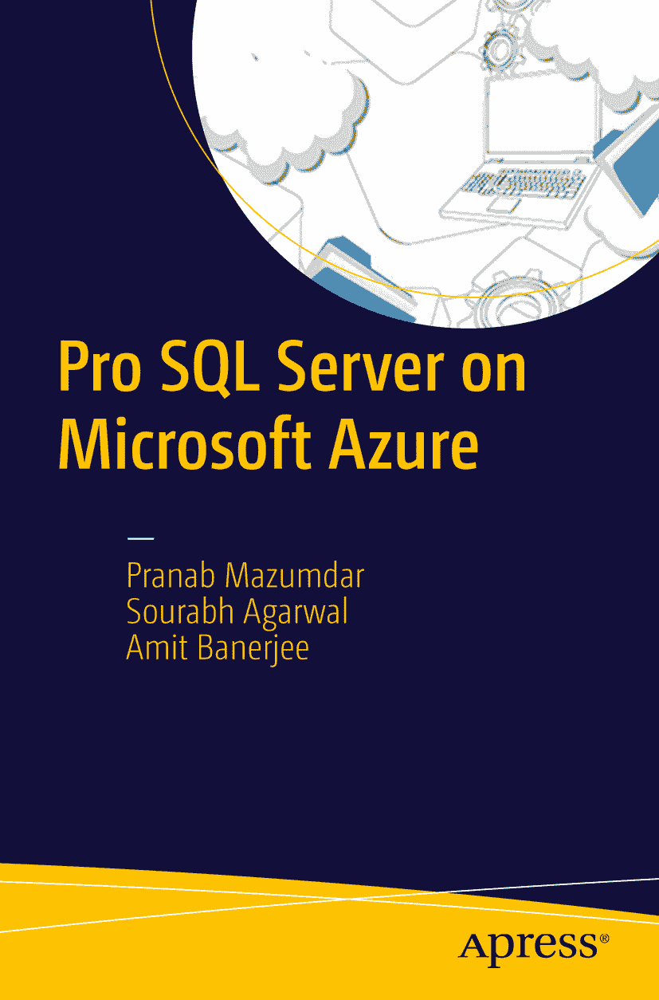

# 微软 Azure 上的 Pro SQL Server

Pranab Mazumdar, Sourabh Agarwal 和 Amit Banerjee

作者在文中引用的任何源代码或其他补充材料，读者均可访问 [`www.apress.com`](http://www.apress.com) 获取。有关如何查找本书源代码的详细信息，请访问 [`www.apress.com/source-code/`](http://www.apress.com/source-code/)。读者也可以在 SpringerLink 上每章的“补充材料”部分访问源代码。

ISBN `978-1-4842-2082-5`
e-ISBN `978-1-4842-2083-2`
DOI `10.1007/978-1-4842-2083-2`
美国国会图书馆控制号：`2016949375`

© Pranab Mazumdar, Sourabh Agarwal, Amit Banerjee 2016

微软 Azure 上的 Pro SQL Server

董事总经理：Welmoed Spahr
首席编辑：Celestin Suresh John
技术审稿人：Ravikanth Chaganti
编辑委员会：Steve Anglin, Pramila Balan, Laura Berendson, Aaron Black, Louise Corrigan, Jonathan Gennick, Robert Hutchinson, Celestin Suresh John, Nikhil Karkal, James Markham, Susan McDermott, Matthew Moodie, Natalie Pao, Gwenan Spearing
协调编辑：Prachi Mehta
文字编辑：Kezia Endsley
排版：SPi Global
索引：SPi Global
美工：SPi Global

有关翻译信息，请发送电子邮件至 `rights@apress.com`，或访问 [`www.apress.com`](http://www.apress.com)。

Apress 和 friends of ED 的书籍可批量购买用于学术、企业或促销用途。大多数图书也提供电子书版本和许可。更多信息，请参阅我们的批量销售-电子书许可网页 [`www.apress.com/bulk-sales`](http://www.apress.com/bulk-sales)。

本作品受版权保护。出版者保留所有权利，无论涉及材料的全部或部分，特别是翻译、转载、插图重用、朗诵、广播、缩微胶片或其他任何物理方式的复制，以及信息存储和检索、电子改编、计算机软件，或目前已知或今后开发的类似或不同的方法。本书中可能出现商标名称、徽标和图像。我们并非每次出现商标名称、徽标或图像时都使用商标符号，而是仅以编辑方式并为了商标所有者的利益使用这些名称、徽标和图像，无侵犯商标的意图。本书中使用的商品名称、商标、服务标志和类似术语，即使未特别标识，也不应被视为表达意见，判断它们是否受专有权利约束。虽然本书中的建议和信息在出版时被认为是真实和准确的，但作者、编辑和出版商均不对任何可能存在的错误或遗漏承担任何法律责任。出版商对本文所含材料不作任何明示或暗示的保证。

使用无酸纸印刷

由 Springer Science+Business Media New York 全球发行至图书贸易市场，地址：233 Spring Street, 6th Floor, New York, NY 10013。电话 1-800-SPRINGER，传真 (201) 348-4505，电子邮件 `orders-ny@springer-sbm.com`，或访问 `www.springeronline.com`。

Apress Media, LLC 是一家位于加利福尼亚州的有限责任公司，其唯一成员（所有者）是 Springer Science + Business Media Finance Inc (SSBM Finance Inc)。SSBM Finance Inc 是一家特拉华州的公司。

## 关于技术审稿人

Ravikanth 是戴尔公司企业解决方案集团中负责 Microsoft 和 VMware 私有及混合云解决方案的首席工程师和首席架构师。他曾多年获得 Microsoft 的 Windows PowerShell 最有价值专家 (MVP) 奖。Ravikanth 是《Windows PowerShell Desired State Configuration Revealed》(Apress) 的作者，并领导 Bangalore PowerShell 和 Bangalore IT Pro 用户组。他经常在印度及海外的本地用户组活动和会议上发表演讲，主题涵盖 PowerShell 到 Azure 服务等。

## 致谢

Pranab——有太多人的支持和鼓励，我才能完成本书的写作。首先也是最重要的，我的父母（妈妈和爸爸）。他们一直是我力量的支柱。感谢我的妻子（Meenakshi）如此支持并帮助我完成此书。在我工作繁忙的日子里，实际上是她推动我完成此事。我可爱的小女儿（Preesha），她是我的全世界；她让我在可能本该是玩耍/陪伴她的时间得以写作。还有其他许多人无条件地支持我，包括我的姐姐（Rupa Chatterjee）。感谢你们对我的信任；因为你们，我才能在 Microsoft 工作。也感谢我的姐夫（Anindya Chatterjee），在我最需要的时候激励和鼓舞我。我还要感谢我的岳父岳母，相信我能做到并支持我。我谨向我在 Microsoft 的所有导师、同事和朋友，以及所有支持这个想法的经理们表达我的感激之情。非常感谢 Apress 团队，包括鼓励我写作的 John，以及在时间安排上如此灵活的 Prachi。特别感谢所有的审稿人。

Sourabh——特别感谢我的妻子 Sharie，在我撰写本书投入漫长时光的过程中，她非常鼓励和支持我。谨以此书献给我的导师、我的老师，感谢他们无价的教诲，最后也献给出版商，感谢他们对我们要求的包容和大力支持。

Amit——特别感谢我的妻子，在我下班后投入数小时撰写此书时给予支持。没有她，这本书就不可能完成。实际上，是她推动我写这本书的。我谨将我对本书的贡献献给我的妈妈和爸爸，他们一直相信只要全心投入，没有什么是不可能的。一如既往，感谢我的导师，是他们让我能够无缝地学习这个不断演进的产品。最后但同样重要的是，感谢 Apress 在时间安排上的灵活和超级包容，这确实帮助我们完成了这本书。

## 目录

第 1 章：Microsoft Azure 简介 1

### 云计算概述 1

### 云计算的特征 2

### 服务模型 3

#### 平台即服务 4

#### 基础设施即服务 5

#### 软件即服务 5

### Microsoft Azure 6

### Azure 服务 7

### 计算服务 8

### 数据管理服务 10

### 网络 12

### 开发者服务 15

### 身份与访问 16

### 备份 17

### 总结 17

第 2 章：Azure 架构 19

### Azure 服务 20

### 计算 20

### 存储 22

### 网络 24

### 如何协同工作 27

### 更新/升级域 31

### 容错域 31

### 部署 32

#### 经典部署模型 32

#### 资源管理器部署模型 32

### 部署自动化 34

### 总结 34

第 3 章：Microsoft Azure 存储 35

### Azure 存储服务 35

### Blob 存储 36

### 表存储 37

### 队列存储 38

### 文件存储 39

### 设计决策 40

### Azure 存储架构内幕 41

### 复制引擎 42

### 存储戳章内的层级 43

### 为读取请求保持可用性/一致性 44

### 分区层的负载均衡 45

### DFS 层的负载均衡 45

### DFS 容量的负载均衡 45

### Azure 存储提供的持久性 45

### Azure 高级存储 46

### 高级存储内部机制 49

### Azure 存储最佳实践 49

### 使用 Blob 提升性能 49

### 使用表提升性能 50

### 数据查询最佳实践 52

### 总结 52

第 4 章：Microsoft Azure 网络 53

### 网络基础知识 54

### 站点到站点连接 56

### 点到站点连接 57

### ExpressRoute 57

### Azure AD Connect 59

### 流量管理器 59

### 虚拟专用网络 60

### 负载均衡器 62

### Azure DNS 62

### 总结 62

### 补充参考 62

第 5 章：在 Azure VM 上部署 SQL Server 63

### 部署独立的 SQL Server 实例 64

### 配置设置 65

### 自动化自动化 74

### 部署后工作 80

### Azure 资源管理器 82

### Azure CLI 83

### 总结 84

第 6 章：SQL 混合解决方案 85

### 混合模型概览 86

### 备份到 Azure 存储 87

### Microsoft Azure 存储中的 SQL Server 文件 90

### 智能备份 94

### Azure VM 上的 AlwaysOn 配置 97

### 总结 101

### 补充参考 101

第 7 章：关于性能的一切 103

### 理解虚拟机性能 104

#### 计算 104

#### 网络 105

#### 存储 106

#### 数据磁盘 107

#### 存储空间 111

#### Tempdb 112

#### 数据库设置 113

#### 服务账户权限 115

#### 备份 117

#### 位于 Azure Blob 上的数据文件 119

#### 监控 121

#### 操作洞察 123

### 速查表 126

### 总结 126

第 8 章：Azure SQL Database 129

### SQL Database 架构 129

#### 租户环 129

#### 控制环 131

### Azure SQL Database 服务层级 132

### 弹性数据库池 133

### 服务层级：限制与能力 134

### 管理工具 135

#### Azure 门户 135

#### SQL Server Management Studio 138

#### SQL Server 数据工具 (SSDT) 140

#### 命令行实用工具和 REST API 141

### Azure SQL Database 与 Azure VM 上的 SQL Server 对比 144

### 迁移到 Azure SQL Database 146

#### SQLPackage.exe 147

#### SQL Server Management Studio 148

#### 执行数据库迁移 151

### 总结 156

第 9 章：Azure SQL Database 的业务连续性和安全性 157

### Azure SQL Database：业务连续性与灾难恢复 158

### 本地冗余 158

### 时间点还原 161

### 异地还原 165

### 异地复制 167

### SQL Server 复制 177

### Azure SQL Database：安全与审核 178

### 防火墙管理 179

### 身份验证与授权 179

### SQL Database 审核 183

### SQL Database 威胁检测 184

### 加密 185

### 总结 188

第 10 章：Azure SQL Database：性能与监控 189

### 什么是 DTU？ 189

### 选择性能级别 189

### 更改性能级别 190

#### 使用 PowerShell 更改服务层级或性能级别 190

#### 使用 Azure 门户更改服务层级或性能级别 191

### Azure SQL 性能优化功能 192

#### 内存中优化 192

#### SQL Database 索引顾问 193

#### SQL Database 查询性能洞察 194

### 监控 SQL Database 196

#### 使用 Azure 门户 197

#### 使用 DMV 和目录视图 201

#### 使用扩展事件 203

### 总结 205

索引 207

内容概览

关于作者 xi

关于技术审阅员 xiii

致谢 xv

第 1 章：Microsoft Azure 简介 1

第 2 章：Azure 架构 19

第 3 章：Microsoft Azure 存储 35

第 4 章：Microsoft Azure 网络 53

第 5 章：在 Azure VM 上部署 SQL Server 63

第 6 章：SQL 混合解决方案 85

第 7 章：关于性能的一切 103

第 8 章：Azure SQL Database 129

第 9 章：Azure SQL Database 的业务连续性和安全性 157

第 10 章：Azure SQL Database：性能与监控 189

索引 207

关于作者

