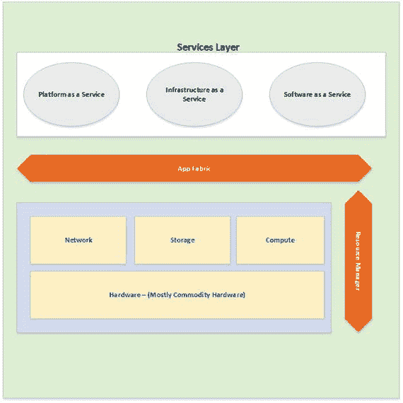
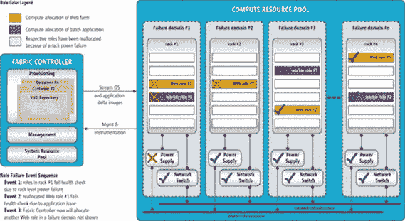
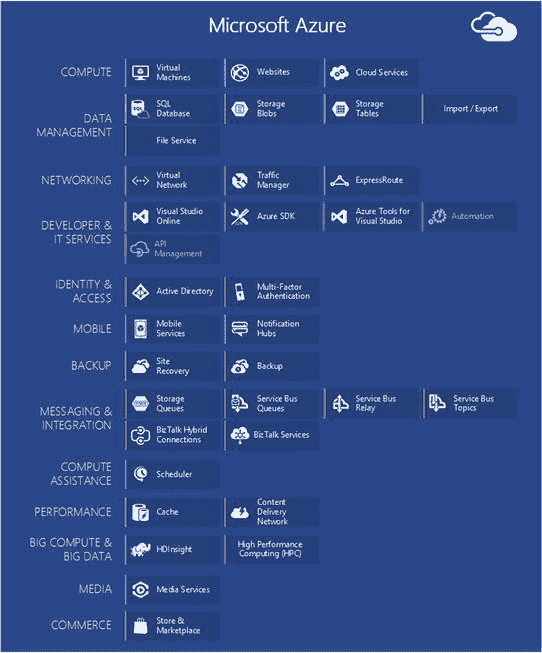
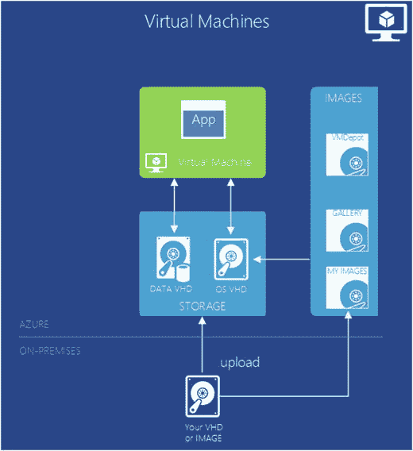
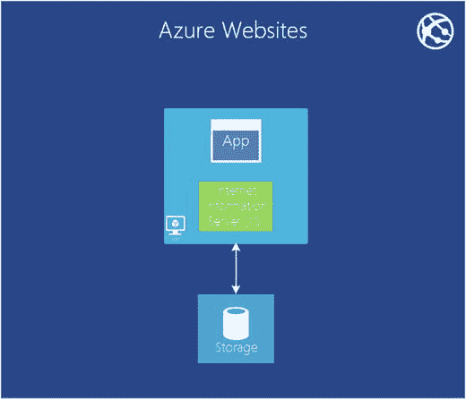

# 1. 微软 Azure 简介

电子补充材料：本章的在线版本（doi：[10.1007/978-1-4842-2083-2_1](http://dx.doi.org/10.1007/978-1-4842-2083-2_1)）包含补充材料，可供授权用户使用。

在与任何 IT 决策者的会议中，云都已成为一个重要的考量因素。基于云的系统所带来的好处，使其极具吸引力，无论是采用私有云、公有云还是混合云。然而，有趣的是，早在“云”这个词变得流行之前的几十年，如今所熟知的云就已经存在了！

即使在云计算兴起之前，微软就已经提供了大量的云服务，例如像 Hotmail 这样的电子邮件平台。它过去是，现在仍然是一个基于云的个人电子邮件服务。微软至今仍在托管的另一项服务是其 Xbox Live 游戏服务，该服务为玩家提供多人游戏选项、个人资料管理以及社交游戏体验。

在本章中，我们将讨论云计算以及这些概念如何与 Microsoft Azure 相关联。我们还将了解 Microsoft Azure 中可用的不同服务模型和产品，并讨论一些与 Azure SQL Server 部署一起使用的常见服务。

## 云计算概述

云计算是一个创新平台，正在彻底改变我们进行计算的方式。云计算基于“按使用付费”的关键原则，即您无需为计算需求投资硬件或软件，而是从供应商那里租用所需的计算能力、存储、软件和其他资源。这减少了所需的总投资。云计算帮助用户和企业获得全球性的、高可用的、基于请求的计算、存储和软件服务访问。这些基于云的资源（计算、存储或软件服务）基于资源共享的原则，以提供一致且经济高效的解决方案。

云计算严重依赖虚拟化的概念，物理计算资源可以被划分为多个独立的虚拟设备，每个设备都可用于执行某种计算任务。虚拟化有助于创建一个高度可扩展和敏捷的计算单元系统，可以按需分配和利用。虚拟化还通过更好地利用现有硬件资源，帮助降低与硬件基础设施相关的成本。

任何云计算环境最重要的设计原则之一是优化、有效或最佳地利用共享资源。由于云资源由多个用户共享，并且具有按需分配的灵活性，因此有效利用这些资源至关重要。有效利用共享资源的能力降低了运行和维护云计算环境的总体成本。

云计算提供了一种从传统的 CAPEX（资本支出）模式到 OPEX（运营支出）模式的转变。在 CAPEX 模式中，组织投资于获取随时间折旧的固定资产；而在 OPEX 模式中，组织投资于在使用依赖于共享基础设施的服务期间产生的运营费用。“迁移到云”这个短语就表明了这种从 CAPEX 模式到 OPEX 模式的转变。推动这种向云基础设施迁移的关键点是：

*   云计算帮助企业降低建立数据中心或其他所需服务器环境的初始成本，从而使他们能够将时间和精力集中在核心业务和项目上。
*   由于云计算资源或服务可以按需配置和调整，它有助于减少组织的“上市时间”并满足其业务的波动性需求。

## 云计算的特征

任何云计算环境的关键特征是：

*   敏捷性：云计算平台的特点在于其敏捷性，可以快速引入新功能和服务，以及如何能够快速创建并交付一个新的计算资源或服务。
*   成本：云计算平台使组织能够从 CAPEX 模式过渡到 OPEX 模式。这有助于降低建立计算平台或采用更新技术的初始成本。大多数提供云计算平台的供应商都提供按使用付费的模型，这意味着消费者只需为他们使用的服务付费。
*   设备和位置独立性：云计算使用户和组织能够通过互联网访问他们的资源，这意味着可以从任何地方访问资源，无论资源位于哪个数据中心。
*   维护：由于大部分维护由云计算供应商管理，消费者无需在维护上投入时间和资源。
*   资源共享：由于云计算建立在资源共享的原则上，它允许供应商：
    1.  将其基础设施集中在房地产、电力等成本较低的地理位置。
    2.  有效且高效地利用计算资源。
*   可扩展性和弹性：云计算允许动态、快速且近乎实时地配置资源和服务。这有助于用户根据其业务需求扩大或缩小使用规模。
*   可靠性：云计算平台使用多个冗余站点，包括本地（同一数据中心）和地理冗余，以提供更好的业务连续性和灾难恢复能力。

## 服务模型

如图 1-1 所示，大多数云计算提供商提供以下服务模型：平台、基础设施和软件。

图 1-1. 表示视图—服务模型

### 平台即服务

虽然 SaaS 模型可能是满足组织大部分软件需求的完美解决方案，但缺乏根据业务需求自定义和更改服务的能力使其对一些组织来说不可用。由于没有可用的自定义选项，SaaS 服务有时无法满足用户业务各个方面的需要。在这种情况下，企业必须投入时间和资源来构建软件能力以弥补这些差距。值得庆幸的是，云计算提供了平台即服务模型，它可以填补这一空白，并允许消费者创建和运行自定义应用程序。PaaS 提供具有极高可扩展性和弹性的云托管应用服务器。

在 PaaS 模型中，云供应商提供一个预先配置的、虚拟化的应用服务器环境，组织或用户可以向其中部署他们自定义的内部构建的应用程序。云供应商确保应用服务器的维护、打补丁和可用性，而组织需要管理和维护运行在应用服务器上的自定义应用程序。在部署这些应用程序期间，开发人员定义应用程序的资源需求（CPU、网络、内存等）。云计算配置引擎使用此资源需求定义（通常作为配置文件的一部分），并创建并绑定运行应用程序所需的必要基础设施。PaaS 是客户构建新应用程序的理想解决方案，因为迁移遗留应用程序可能需要大量的应用程序重新设计以符合 PaaS 模型的规则。

### 基础设施即服务

基础设施即服务（IaaS）模型提供托管的服务器环境，可用于部署和运行软件服务。IaaS 与组织的传统做法非常相似，即在本地构建物理或虚拟化服务器并在这些服务器上运行其软件。IaaS 与传统方法的不同之处在于，在 IaaS 环境中，服务器托管在供应商的数据中心，而不是企业的数据中心。这可以被理解为一种“租用服务器”模式，组织根据需要支付服务器使用费。在 IaaS 模型中，用户完全控制在这些服务器上运行的软件、灾难恢复（DR）和高可用性要求以及软件所需的定制化。根据供应商的不同，用户还可能拥有根据需求灵活扩大或缩小服务器规模的能力。此外，根据供应商和所提供的服务器类型，服务器可能包含附加软件，例如操作系统、Exchange 服务器或关系数据库管理系统（RDBMS）服务器。

鉴于其灵活性和定制所分配服务器的能力，IaaS 可用于轻松地将遗留应用程序迁移到云端，即构建一个模仿本地服务器配置的云服务器。

### 软件即服务

软件即服务（SaaS）模型帮助用户使用云计算供应商托管的软件服务。在 SaaS 模型中，云计算供应商托管软件服务或应用程序，并通过基于订阅的模式使其可供客户访问。客户按需付费使用这些服务。鉴于 SaaS 基于订阅制的使用模型，用户可以选择暂停、停止、减少或增加对服务的使用。

在 SaaS 模型中，软件服务配置和底层硬件基础设施对最终用户是不可访问的。因此，用户无法更改所提供的服务或功能。SaaS 提供了一个高度可共享的多租户环境，成千上万甚至数百万的用户可以同时操作，并且在相互隔离和高度安全的环境中运行。SaaS 还提供了一个非常敏捷的平台，可以帮助用户缩短“上市时间”，并让他们专注于核心业务项目，而无需担心管理和维护其 IT 需求环境所带来的 IT 挑战。

## Microsoft Azure

Azure 是由 Microsoft 开发的云计算平台，用于通过 Microsoft 管理或 Microsoft 合作伙伴托管的数据中心的全球网络来创建、部署和管理应用程序和服务。Azure 在所有三种服务模型中都提供基于云的服务：软件即服务（SaaS）、平台即服务（PaaS）和基础设施即服务（IaaS）。

Azure 提供云托管服务器以及其他基础设施资源，如存储、网络和用于创建、部署和运行应用程序的其他集成基础设施。Azure 在提供云计算环境时依赖于大规模的商用现成硬件群。图 1-2 展示了一个典型的 Azure 资源模型，其中应用程序服务器以及存储、网络和其他计算资源根据部署时设置的策略按需配置。Azure 结构控制器（Fabric Controller）凭借其专用的高度冗余和高可用的服务器及软件，是整个 Azure 环境背后的智能核心。

*图 1-2. 典型资源模型——Microsoft Azure*

Azure 计算资源池由一个非常庞大的商用硬件资源池组成，这些资源以高度冗余和高可用的配置进行设置。这种高可用性和冗余性由 Azure 结构控制器维护和管理。

结构控制器旨在检测任何类型的故障，并采取必要措施以减轻这些故障的风险。这些措施可能包括生成新资源或将资源迁移到不同的硬件资源池。结构控制器还负责根据用户请求扩大或缩小资源规模。

## Azure 服务

Azure 提供了大量服务，这些服务被分组到不同的类别中，如图 1-3 所示。下面将讨论一些常用或在 Azure 中进行 SQL 部署时需要的服务。

*图 1-3. Azure 服务*

## 计算产品

Microsoft Azure 提供三种重要的计算产品，可用于运行网站和应用程序。Azure 网站和 Azure 云服务使用 Azure 虚拟机来运行网站和应用程序，同时将管理创建和管理的任务抽象化，使用户无需处理。这两项服务提供 PaaS 产品，而第三个选项——Azure 虚拟机（VM）——则为用户提供了创建和管理其虚拟机的完全控制权。Azure 虚拟机提供 IaaS 产品。

#### 虚拟机

Azure 虚拟机为用户提供对虚拟机及其上运行的应用程序的创建、配置和管理的完全控制权。Azure 虚拟机允许使用上传到 Azure 的 VHD 或利用 Azure VHD 库中提供的 VHD 镜像来创建 VM，如图 1-4 所示。Azure 提供了大量针对不同版本/版本的 Windows、Linux 和其他服务器应用程序（如 SQL Server、BiTalk、Oracle 等）的 VHD。

*图 1-4. Azure 虚拟机*

Azure 虚拟机允许配置并向一个 VM 添加多个虚拟磁盘。这些磁盘可以配置在标准存储上，也可以配置在基于固态硬盘（SSD）的高级存储上。

#### Azure WebApps（前身为 Azure 网站）

Azure WebApps（前身为 Azure 网站）通过 Azure 管理门户以及 API 提供托管的 Web 环境。除了能够在云端创建新网站外，Azure WebApps 还允许将任何现有网站迁移到云端。WebApps 提供按需扩大或缩小资源规模的能力。创建一个 Azure WebApps 服务基本上就是创建一个带有 IIS 及相关存储的 VM，如图 1-5 所示。这些 VM 的创建和管理对最终用户是封装的。

*图 1-5. Azure WebApps*

Azure WebApps 提供共享租户模型（资源在多个网站之间共享）和标准模型（为网站提供专用资源）。扩大或缩小实例规模的能力仅在标准模型中可用。

#### 云服务

与 Azure 网站类似，Azure 云服务使用 VM 来执行工作负载，同时为用户提供一些对 VM 配置的控制权。例如，可以远程访问 VM，并且可以在 VM 上安装其他软件。Azure 云服务提供两种不同类型的 VM。Web 角色实例运行带有 IIS 的 Windows Server 变体，而辅助角色实例运行不带 IIS 的相同 Windows Server 变体。一个云服务应用程序依赖于这两种选项的某种组合。

## 数据管理产品

Windows Azure 提供了多种存储和管理数据的方式。这种服务多样性允许用户利用 Azure 来满足各种业务需求和解决问题。Azure 提供以下四种主要的数据管理产品。

