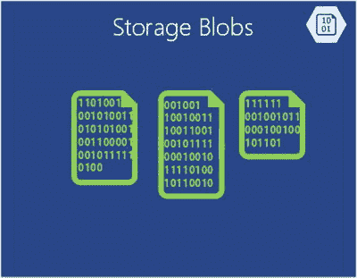

# Azure Blob 存储

Azure Blob 存储（“blob 存储”和“存储 blob”是同一回事）是一种基于云的廉价存储解决方案，用于存储非结构化二进制数据（图 1-6）。可以将 Azure Blob 存储视为二进制文件的文件存储，最大文件大小限制为 `1TB`。应用程序还可以利用 Azure 驱动器，这使得 blob 能够为挂载在 Azure 实例中的 `Windows` 文件系统提供持久存储。应用程序看到的是普通的 `Windows` 文件，但其内容实际上存储在 blob 中。

**图 1-6.** Azure 存储 Blob

`Blob 存储`被许多其他 Azure 功能（包括虚拟机）所使用，因此它当然能够处理你的工作负载。

