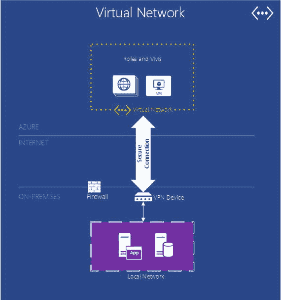
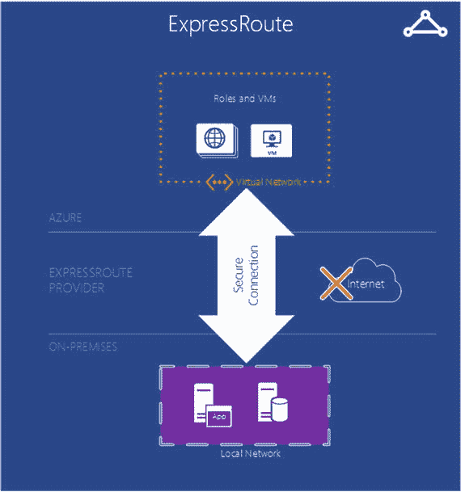

# Azure 表存储

表提供了一种 `NoSQL`/键值存储。表提供了对大量松散结构化和非结构化数据的快速、可靠且简单的访问。表提供非关系型或 `NoSQL` 存储。

## 网络

Azure 提供了多种选项来设置私有网络、虚拟专用网络和网络负载均衡。接下来描述最常用的选项。

## 虚拟网络

Azure 虚拟网络 (`VNet`) 是 Azure 云中专用于订阅的逻辑分区。管理员对网络的 `IP`、`DNS` 设置和安全策略拥有完全控制权。它可以比作一个组织在防火墙后面运行的私有网络。Azure `VNet` 允许你创建子网，这些子网可根据需要用于进一步细分网络。Azure 允许用户使用 Azure 提供的多种连接选项之一，将 `VNet` 连接到其本地网络，如图 1-7 所示。

**图 1-7.** Azure 虚拟网络

## VPN 连接选项

连接选项允许用户将其本地网络与其 Azure 网络连接起来。这些选项包括：

-   点到站点 `VPN` 连接
-   站点到站点 `VPN` 连接
-   `ExpressRoute` 连接

### 点到站点 VPN 连接

点到站点 `VPN` 允许用户从其本地网络中的一台客户端计算机创建到其 Azure 虚拟网络的安全连接。点到站点连接必须在需要连接到虚拟网络的每台客户端计算机上单独配置。点到站点连接不需要 `VPN` 设备，而是使用需要在每台客户端计算机上安装的 `VPN` 客户端。`VPN` 是通过从本地客户端计算机手动启动连接来建立的。

### 站点到站点 VPN 连接

站点到站点 `VPN` 允许用户在其本地网络与其 Azure 虚拟网络之间建立安全连接。站点到站点 `VPN` 连接需要位于本地网络上的 `VPN` 设备，并且必须配置为与 Azure `VPN` 网关建立安全连接。连接建立后，本地网络和 Azure 虚拟网络中的资源可以直接安全地通信。与点到站点 `VPN` 连接不同，站点到站点连接不需要为本地网络上访问虚拟网络中资源的每台客户端计算机建立单独的连接。

### ExpressRoute 连接

Azure `ExpressRoute` 允许用户在其本地网络与 Azure 数据中心之间建立专用连接。`ExpressRoute` 连接不通过公共互联网，而是使用专用的互联网通道，因此与通过互联网的典型连接相比，它提供了更高的可靠性、更好的安全性和更低的延迟。如图 1-8 所示，`ExpressRoute` 不使用公共互联网来连接你的本地环境与 Azure。

**图 1-8.** Azure ExpressRoute

