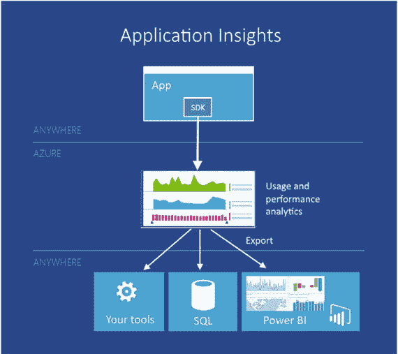

# 开发者服务

Azure 提供了多项可供开发者利用的服务，以编写优化且高性能的代码。除了提供编写代码的多项功能外，Azure 还提供了在运行应用程序时自动化测试和捕获遥测数据的方法。

## Visual Studio Team Services

`Visual Studio Team Services` 提供了一项服务，用于开发和交付应用程序、与团队共享代码、跟踪应用程序开发以及对用任何语言编写的应用程序进行负载测试。

## Application Insights

`Application Insights` 是一项可扩展的分析服务，允许用户监控其实时应用程序性能。它可以帮助检测和诊断性能问题，并为应用程序提供遥测数据。开发者可以使用该服务持续改进其应用程序代码的性能和可用性。`Application Insights` 适用于使用 `.Net`、`J2EE` 开发并托管在本地或云端的基于 Web 的和独立的应用程序，如图 1-9 所示。

**图 1-9.** Azure Application Insights

