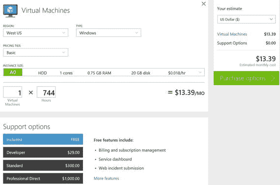
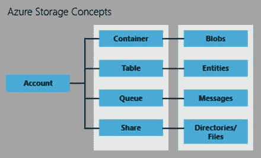
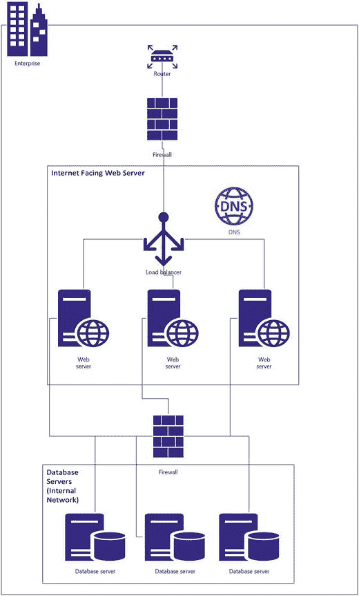
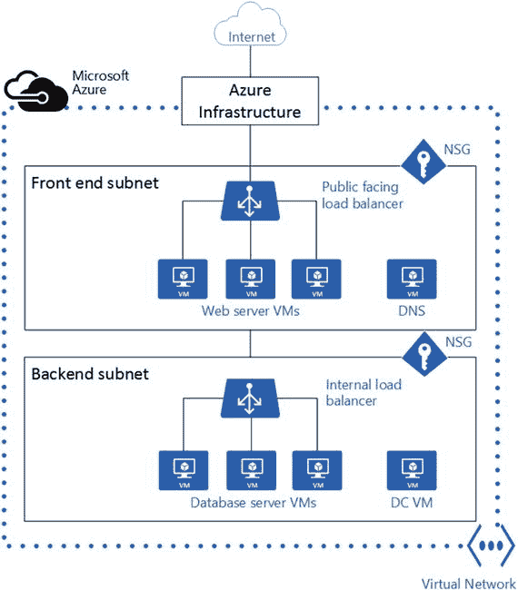
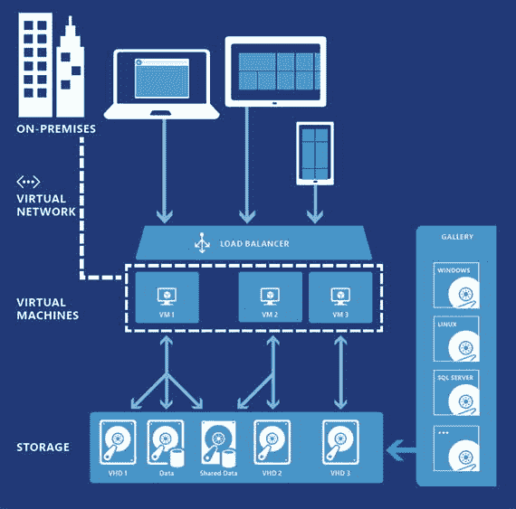
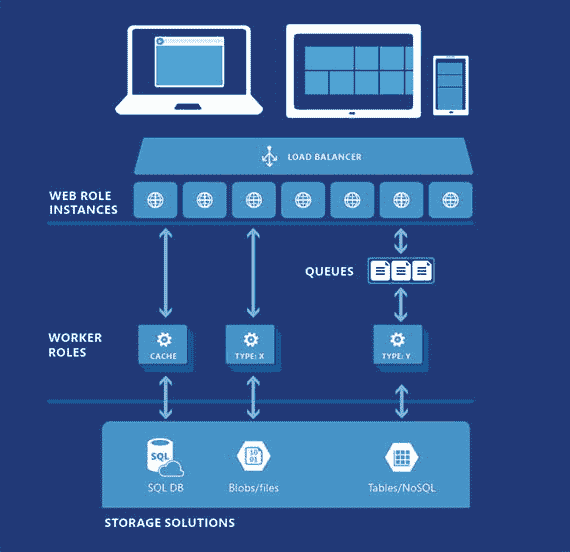
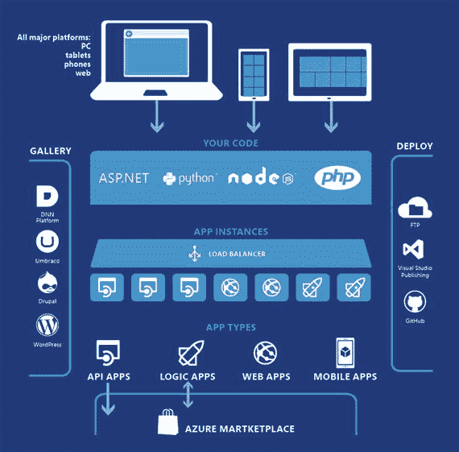
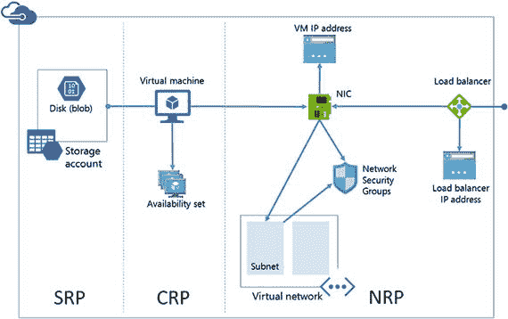

# 2. Azure 架构

如今，云计算已经成熟，不同服务类别——平台、软件和基础设施——之间有了明确的划分。微软在这三个类别中均提供服务。但在深入探讨之前，让我们首先理解云服务涉及的细微差别。在本章中，我们将了解基础设施即服务 (IaaS) 的工作原理。可以将 IaaS 想象成披萨：你钟爱的披萨供应商提供冷冻披萨，而你需要管理用于加热和上菜的器具。在 IaaS 领域，这通常意味着供应商提供所有硬件，包括计算能力、网络、存储及其关联服务。你所要做的就是利用基础设施服务的组合，这允许你在该平台上部署任何应用程序或服务。

微软的 Azure 平台不仅仅是虚拟化基础的超大规模抽象。Azure 还以数据中心的形式推动了大量的创新。让我们快速了解一下这里所述概念背后的硬件是如何布局的。微软云服务器规范实质上提供了蓝图，用于构建微软交付多样化云服务组合所使用的数据中心服务器。与传统的服务器企业设计相比，它们带来了显著的改进：服务器成本节省高达 40%，电源效率提升 15%，部署和服务时间缩短 50%。微软在全球范围内自有和租赁的数据中心上托管其云服务，这些中心横跨超过百万台服务器和上百个数据中心。

为了将 Azure 发展到今天的地位，做出了一些有趣的战略决策。其中最有趣的是成本因素。成本始终是 IT 界的一个讨论焦点，微软决定通过针对关键成本驱动因素进行资源分配来降低托管这些环境的成本。这与标准成本计算方式根本不同，后者通常将成本与使用的空间量相关联。相比之下，Azure 使用能源消耗、带宽消耗、事件响应和服务器容量等关键因素来确定成本。

2014 年，微软将开放云服务器设计贡献给了开放计算项目，使行业能够受益于该公司在为其管理的各种基于云的服务建立数据中心方面积累的经验。

在接下来的几节中，我们将学习 Azure 中计算、网络和存储是如何组织的，以及你需要了解的内部原理，以使 IaaS 产品为你所用。

## Azure 服务

如今，Azure 在 PaaS、SaaS 和 IaaS 这三个类别中提供了大量服务，并且持续增长。撰写关于 Azure 的书籍最大的挑战，不是书在你写完后是否依然与时俱进，而是你在写作过程中它是否跟得上变化。冲刺、缩短的发布周期和敏捷开发方法的世界，确保技术消费者能尽快获得技术内容。

与其列举 Azure 当前提供的各种服务，不如让你了解 Azure 可以在哪些不同领域帮助你和你的业务。近来，Azure 越来越致力于实现与你习惯的本地环境和在 Azure 中实际使用体验之间的对等。这意味着你的数据中心与 Azure 数据中心之间的界限正变得日益模糊，你的平台用户将很难分辨在 Azure 上运行的内容与在本地运行的内容有何不同（除非你在他们的应用程序上放置一个标明其托管数据中心的横幅）。

Azure 当前提供的服务包括：

*   管理与安全，如密钥保管库和操作洞察
*   开发者服务，如 Visual Studio Team Services
*   身份与访问管理，如 Azure Active Directory、多重身份验证
*   混合集成，如 BizTalk、站点恢复
*   媒体与 CDN，如媒体编码、媒体索引器
*   物联网 (IoT)，如事件中心、流分析
*   分析，如数据湖、HDInsight、机器学习、数据工厂
*   数据与存储，如 SQL 数据库、DocumentDB、SQL 数据仓库
*   Web 与移动应用，如 Web 应用、API 管理

如你所见，Azure 不仅仅是运行虚拟机的一堆硬件。所有这些解决方案都利用了 Azure 计算、存储和网络的某些部分。在接下来的几章中，我们将深入探讨 Azure 计算、存储和网络的内部原理，但在本章中，我们将理解所有这些部分是如何协同工作的。

## 计算资源

Azure 中的计算是处理能力与物理内存的结合。当你开始在 Azure 中部署计算资源时，本质上是在启动一个虚拟机。该虚拟机运行着一个操作系统，并由本地存储支持，该存储承载着操作系统文件和临时存储。不建议使用此本地存储方案来托管你的应用程序或应用程序可能需要的任何数据。在某些情况下，你可能会使用临时存储，它被称为 D 盘。相关示例将在后续章节中解释。

Azure 提供不同层级的计算，对应着不同的定价（参见图 2-1）。其定价模式类似于手机通话时长计费。你为每一分钟的使用付费。因此，只要你的虚拟机处于启动和运行状态，你就在为计算能力付费。无论你是否实际使用了计算能力，这都不重要。这再次类似于手机通话：无论你在通话中说话还是保持沉默，都会产生计费。理解托管你的应用程序或服务所需的物理内存和处理能力类型至关重要。

**图 2-1. Azure 定价计算器**

你心中接下来的问题会是：可以托管什么？嗯，它就像一个空房子！你实际上可以托管任何你想要的东西，就像在本地数据中心托管的虚拟机上一样。使用基于云的基础设施服务固有的优势在于，你只需点击一个按钮，后台就会发生一系列神奇的操作。启动虚拟机、设置操作系统以及将计算、网络和存储整合在一起，这些都由 Azure 基础设施完成。你的工作仅仅是提供输入参数！

在云中托管的另一个优势是打包的部署产品，即库镜像。你可以启动一个预配置了软件解决方案的虚拟机。Azure 虚拟机支持 SQL Server、Oracle、IBM、SAP 等更多软件。这种一键式部署的贴心之处在于，如果你选择像 SQL Server、Oracle 等基于解决方案的镜像，其许可成本可以包含在内。如果你不希望将许可成本包含在计算的每分钟成本中，那么你可以使用自己的许可证，并利用 Azure 的自动化服务来运行虚拟机部署后的步骤。

现在让我们快速了解一下 Azure 中可用的计算层级。例如，基础层级 (A0, A1, A2 … An) 包含小至 1 个核心、0.75GB RAM 并附带 20GB 本地磁盘的机器。如果你让一个具有此配置的虚拟机运行整整一个月，大约需要支付 13 美元。在另一个极端，你目前有 G 系列机器，提供 32 个虚拟 CPU 和 448GB 物理内存。

如你所见，有一个广泛的范围供你为业务选择正确的组合。

计算提供了弹性，这也是云著名的特性，它允许你根据负载需求进行横向扩展。当你部署 SQL Server 作为独立实例时，由于 SQL Server 本身不具备横向扩展能力，因此不需要横向扩展功能。SQL Server 中有一些功能可以帮助你通过复制或可用性组实现横向扩展。你可以根据需要，甚至随心所欲地扩大和缩小虚拟机实例的规模。虽然随心所欲可能不是充分的业务理由，但你绝对可以根据计算基线的趋势来扩大和缩小规模！弹性在当今的计算领域正变得无处不在，而公有云使之成为现实。零售商最常见的场景之一是应对假日季节的流量高峰。这通常导致在全年为有时持续不到一个月的高峰季过度配置硬件。云中的弹性使之成为现实！Azure 提供自动缩放功能，允许你扩展在 Web 角色、辅助角色或虚拟机上运行的工作负载。当你扩展在 Azure IaaS 上运行的应用程序时，虚拟机可以从先前创建的机器的可用性集中开启或关闭。其中一个选项是基于平均 CPU 使用率百分比来指定缩放。

在托管或本地数据中心中的一些常见难题，在 Azure 中已不再是问题。

## 存储

在上一节中，你了解了 Azure 计算如何将我们熟知的物理内存和处理能力整合为一个内聚单元。本节将解释在 Azure 中存储数据意味着什么。在 20 世纪 50 年代，第一块硬盘驱动器能存储 500 万个六位字符，而今天，这甚至不足以存储一个 4GB U 盘所容纳的数据。那时 3.75MB 的磁盘驱动器大小约相当于两个冰箱，并且包含 50 张盘片！多年来，数字数据存储领域取得了飞跃式的进步，如今你的移动设备就能存储超过 64GB 的信息。当今手机的内置存储容量，已能容纳相当于 1950 年代 17,000 台磁盘驱动器所能存储的信息量！

由于在云环境中使用标准化的商品硬件来横向扩展存储，存储成本已不再是主要障碍！在每个 IT 专业人士的职业生涯中，总会有那么一刻，为个人计算设备或所管理的服务器申请额外的存储空间，曾是一个经过深思熟虑的商业提案。如今，云服务只需点击一下按钮，就能以各种形式、不同的吞吐量和成本因素，提供海量的存储空间。

Azure 存储为所有 Azure 虚拟机提供存储基础。它涵盖了云计算的所有原则，这意味着 Azure 存储具有可扩展性、持久性和高可用性。再次强调，云的优势在于你只需为所使用和何时使用的资源付费。这就像手机的按使用付费套餐一样。

Azure 存储采用自动分区系统，可根据流量自动对数据进行负载均衡。随着应用程序存储需求的增长，Azure 存储会自动分配适当的存储资源来满足需求。

与任何 Azure 组件一样，Azure 存储可以从世界任何地方访问。Azure 存储的一个独特之处在于，任何类型的应用程序，无论是运行在云端、桌面、本地、移动设备还是平板电脑上，都能访问 Azure 存储服务。Azure 存储的高级概念和设计决策将在本书第 3 章中详细阐述。

现在，让我们简要了解一下 Microsoft Azure 平台中的存储是如何组织的。如图 2-2 所示，存储以不同的格式组织——Blob、表、队列和文件。存储以容器、表、队列和共享的形式组织。可以把它们想象成你厨房里的储物容器。你通常会使用不同属性的不同容器来存放谷物、面粉、大米等。类似地，Azure 中的存储也被划分为特定类型的容器。

图 2-2. Azure 存储概念

**Blob 存储**本质上是你放置在 Azure Blob 容器中的任何存储对象的二进制表示。每个 Blob 存储可以容纳文档、媒体文件、可执行文件，以及基本上任何你想存储在云端的对象。它们通常用于存放原始数据和媒体相关文件，如音乐、图片、视频等。

**表存储**可用于存放结构化数据集，这是一种 NoSQL 键-属性数据存储，用于快速以编程方式访问海量数据。

**队列存储**为工作流处理和云服务组件之间的通信提供可靠的消息传递。消息可以在任何应用程序端点之间流动，这些端点既可以是云端托管的应用程序，也可以是我们数据中心的应用程序。

**文件存储**提供基于 SMB 的文件共享，不同之处在于这些共享托管在云端。这些共享具有基于云的路径，任何连接到互联网的应用程序都可以访问。

由于云承载着各种类型的应用程序，每个业务的吞吐量和性能要求各不相同。Azure 存储通过标准存储和高级存储的形式来满足这些需求。

Azure 高级存储的主要设计目标是为运行 I/O 密集型工作负载的虚拟机提供高性能、低延迟的磁盘。某些 SQL Server 工作负载无疑能从为其数据磁盘使用 Azure 高级存储中受益。在本书中，你会发现多处提到 SQL Server 实例与高级存储账户如何良好协作，以满足并超越你的性能和吞吐量 SLA。

如果想从具体数字来看，每个虚拟机可访问 64TB 的存储空间，每个虚拟机可实现 80,000 IOPS 和每秒 2000MB 的磁盘吞吐量。高级存储的引入使得你能够将需要一致高性能和低 I/O 延迟的企业应用程序直接迁移上云。

## 网络

在深入了解计算层与存储层如何相互通信之前，理解 Azure 平台硬件架构中的最后一个关键部件至关重要。服务间通信与外部通信均由网络层处理。简单来说，它相当于在企业环境中部署的网络的云版本。图 2-3 展示了企业中典型的网络配置。

图 2-3. 本地环境网络配置

Azure 虚拟网络代表了 Azure 数据中心内的所有网络功能。它根据你的 Azure 订阅，对 IP 地址块、DNS 设置、安全策略和路由表进行逻辑划分。Azure 网络还允许你延伸本地网络，使你的 Azure 订阅资源成为实际物理网络的扩展部分。

如果你想进行类比，请注意图 2-4，Azure 基础设施承担了路由器的角色。它允许从你的虚拟网络访问公共互联网，而无需任何额外配置。可以将网络安全组（`NSGs`）视为应用于每个单独子网的防火墙。物理负载均衡器在 Azure 中被面向互联网的和内部的负载均衡器所取代。

图 2-4. Azure 虚拟网络图示

此时一个非常切题的问题是：为什么需要虚拟网络？原因有很多。除了为连接各种 Azure 服务和虚拟机提供连接层之外，还需要隔离功能，允许你为开发、测试和生产等不同用途创建相互独立的网络，即使它们使用相同的 `CIDR` 地址块。Azure 还为部署在你的虚拟网络（`VNet`）中的虚拟机和 `PaaS` 角色实例提供内部名称解析。你也可以部署自己的 `DNS` 服务器并配置 `VNet` 使用它们。

现代网络管理员面临的一个有趣挑战是，在不危及安全的前提下，为外部世界（即互联网）提供网络连接。Azure 网络能够在不牺牲安全性的情况下实现公共互联网连接，这主要得益于网络安全组（`NSGs`）。

让我们快速了解一下什么是网络安全组及其在 Azure 网络架构中的作用。如果需要打个比方，网络安全组（`NSG`）本质上是网络流量的看守者，它监控在你的 Azure 订阅资源与连接到这些资源的内部及外部客户端之间流动的流量。你可以创建 `NSG` 来控制进出网络组件（如网卡（`NICs`）、虚拟机和子网）的流量。你可以使用 `NSG` 根据源 `IP` 地址和端口或目标 `IP` 地址和端口来决定是允许还是拒绝网络流量。`NSG` 的行为类似于企业环境中的防火墙。

Azure 网络将在第[4]章中详细讨论。

## 协同工作原理

现在你已经了解了 Azure 中可用构建块的基础知识，重要的是理解它们如何协同工作。如果你想了解 Azure 中的一种基础设施即服务（`IaaS`）选项，图 2-5 将向你展示 Azure 中的虚拟机是如何布局的。

图 2-5. Azure 虚拟机

图 2-5 显示，Azure 网络是外部客户端与 Azure 虚拟机之间的通信网关。最值得注意的事实之一是，存储层是一个完全独立的物理实体。这与数据中心服务器的传统构建方式有着根本的不同。如果要打个比方，存储层可以被看作是存储区域网络（`SAN`）和网络附加存储（`NAS`）的结合体。磁盘阵列由存储层以可扩展和弹性的方式进行管理，存储层通过一个非常高速的网络与计算层通信。

你可以选择部署一个 Azure 库镜像（`Azure gallery image`），这是由微软和其他第三方提供的预制镜像，用于承载操作系统和你选择的预装软件。这样，你甚至不需要编写一个安装程序！

基础设施即服务（`IaaS`）只是利用计算、存储和网络的服务模型之一。在本地环境中，一种常见的部署模型是 Web 应用程序，它通常采用三层架构。第一层是客户端应用程序，通常是连接到中间层（即应用服务器）的 Web 浏览器。应用服务器连接到后端服务器，后者通常是数据存储。在 Azure 中，可以使用 Web 角色作为前端、辅助角色作为中间层、数据存储（如 SQL 服务器、Blob、NoSQL 等）作为第三层，来实现类似的架构。图 2-6 展示了托管在 Azure 上的典型三层应用程序架构。

图 2-6. 托管在 Azure 上的应用服务

在图 2-6 中，客户端通过 Azure 虚拟网络连接到一个 Web 角色实例，该实例是运行 Web 应用程序的计算资源。根据应用程序的需要，可以配置实例数量进行纵向扩展或缩减，这使得服务天然具有弹性，开发者无需做任何特定工作。存储的作用取决于应用程序是否使用 Azure 存储实体（如 Blob 或队列）来存储数据。间接使用存储的情况是，如果使用了关系型或非关系型的平台即服务（`PaaS`）产品，而这些产品内部使用了存储服务。图 2-6 显示了 Azure SQL 数据库作为一种存储选项。本书后面将对此进行详细讨论。

Azure 中的另一种部署范式是托管应用程序实例。这不仅限于 Web 应用程序，还可以用于任何类型的应用程序，如移动应用、服务、`APIs` 等。Azure 市场提供了大量由微软和第三方提供的预构建服务部署。这允许你启动一个应用程序实例，对于某些部署，它形成了软件即服务（`SaaS`）模型，对于其他部署，则形成了平台即服务（`PaaS`）模型。图 2-7 展示了应用程序部署的样子。

图 2-7. Azure 应用实例

正如前面的图示所示，Azure 抽象了部署机制，解耦了硬件，并在部署期间将各种组件绑定在一起。

## 更新/升级域

现在您已经了解了资源提供者的架构组织方式，接下来必须理解**更新域**的概念。可以将更新域视为维护计划中要打补丁的一组服务器。如果您不是业务负责人，则需要确保在更新期间，托管在正在打补丁的服务器上的应用程序几乎没有停机时间。这确实是现实世界中最困难的 IT 问题之一。

Azure 将实例均匀分布到多个**升级域**中，每个升级域作为部署的一个逻辑单元。在升级部署时，升级操作一次只针对一个升级域执行，以最小化在这些环境中运行的服务或应用程序的停机时间。升级域有助于减少升级对正在运行的服务的影响，同时保持环境最新。这最大限度地降低了因缺乏更新而导致已知问题影响生产环境的风险。

掌握这一概念非常重要，因为仅仅拥有一个更新域并不能帮助您的 SQL Server 部署。即使在故障转移集群或可用性组环境中，SQL Server 实例也只能有一个运行服务的活动节点。因此，如果运行 SQL Server 实例的服务器重启，数据库服务将会中断。对于托管在 Azure 虚拟机上的任何生产 SQL Server 环境，拥有一个可用性组部署至关重要，以防止长时间停机。

## 故障域

如前所述，仅靠升级/更新域不足以维护托管在 Azure 虚拟机上的 SQL Server 实例的正常运行时间。在 Azure 中，单点故障的范围本质上是一个**故障域**。

与本地环境最简单类比的方式是，考虑一个从计算角度防止单点故障的故障转移集群。现在扩展到 Azure 世界，连接到电源插座的单一计算源就是一个故障域。这甚至可以是数据中心中的一个机架，因为机架的电源中断将导致基础设施中的多个计算节点失效。故障域由 Azure 在部署期间确定，强烈建议将每个角色的两个或更多个实例部署在 Azure 中，以便单个故障域中的故障不会导致应用程序服务中断。对于托管在 Azure 虚拟机上的 SQL Server，从高可用性角度出发，始终建议拥有主备部署。大多数企业环境都遵循这一概念，在 Azure 中也有这样做的必要。具体的服务级别协议（SLA）详见 Azure 服务级别协议。

## 部署

使用 Azure 时最常见的任务之一是部署。直到最近，这还是一条单行道。Azure 现在有两种部署模型：经典部署模型和资源管理器部署模型。对于任何新的开发工作，尽可能使用资源管理器部署模型是最好的。所有 Azure 资源都支持一种或两种部署模型。

使用这两种部署模型处理虚拟机时，有一些重要的注意事项：

*   使用经典部署模型部署的虚拟机无法包含在使用资源管理器部署的虚拟网络中。
*   使用资源管理器部署模型部署的虚拟机必须包含在虚拟网络中。
*   使用经典部署模型部署的虚拟机不必包含在虚拟网络中。

### 经典部署模型

Azure 最初引入了一种称为**经典部署模型**的部署模型。在本节中，我们将限制在虚拟机的部署讨论。在经典方法中，部署的虚拟机只能通过云服务访问。云服务是容纳虚拟机的容器。云服务名称的格式为 `<name>.cloudapp.net`。

### 资源管理器部署模型

在**资源管理器部署模型**中，云服务不再是创建虚拟机所需的对象（见图 2-8）。Azure 资源管理器使您能够轻松利用预构建的应用程序模板或构建应用程序模板，以在 Azure 上部署和管理计算、网络和存储资源。这些模板采用日益流行的 JSON 格式，可以轻松地从现有部署中导出并应用于新部署。

图 2-8. Azure 虚拟机的 Azure 资源提供者及其关系

Azure 资源提供者支持创建功能虚拟机所需的各个资源，您可以按需配置。对于虚拟机，有三个主要的资源提供者：

*   **计算资源提供者 (CRP)**：支持虚拟机实例和可选的可用性集。
*   **存储资源提供者 (SRP)**：支持必需的存储帐户，用于存储虚拟机的 VHD，包括其操作系统和额外的数据磁盘。
*   **网络资源提供者 (NRP)**：支持必需的网卡 (NIC)、虚拟机 IP 地址以及虚拟网络中的子网，以及可选的负载均衡器、负载均衡器 IP 地址和网络安全组。

我们讨论过，这些资源提供者都不能孤立工作，因为托管一个简单的虚拟机需要资源提供者之间的资源关系。例如，虚拟机依赖于 SRP 中定义的特定存储帐户来将其磁盘存储在 Blob 存储中。虚拟机引用 NRP 中定义的特定网卡，并且还可能在 CRP 中定义了一个可用性集。网卡引用虚拟机分配的 IP 地址、虚拟机的虚拟网络子网，以及如果需要访问控制，则引用网络安全组。

资源管理器 (ARM) 使得构建、集成和协作开发复杂的应用程序变得非常简单，这些应用程序可以通过一个可共享的模板文件包含整个范围的 Azure 资源（如网站、SQL 数据库、虚拟机和虚拟网络）。这样的共享模板文件可以作为可重复部署的用途，相对轻松地搭建开发环境。

VM 扩展（自定义脚本、DSC、Chef、Puppet 等）与模板文件中的 Azure 资源管理器深度集成，这使得轻松协调虚拟机内的设置配置成为可能。ARM 还允许使用 Azure 基于角色的访问控制 (RBAC) 进行简单而精确的组织资源访问管理。

### 部署自动化

既然我们谈到了部署，一个明显的问题是是否有办法实现实际部署的自动化。Azure 提供了三种不同的方式来操作计算、存储和网络对象。第一种是 Web 用户界面，这是意料之中的，毕竟这是将图形界面变得普及的公司。第二种和第三种方法主要用于以编程方式部署可通过 Web 门户部署的任何内容。

Azure 公开了 PowerShell cmdlet 和 REST API，允许开发人员和 IT 管理员编写部署例程。这些例程自动化创建 Azure 实体并配置该实体公开的部署后配置选项。Azure 自动化服务的自动化功能与这些编程接口相结合后功能非常强大，允许设计用于部署的自定义工作流。在 GitHub 上可以找到许多此类示例。

## 摘要

在本章中，你学习了 Azure 如何定义其计算、存储和网络边界。尽管 Azure 提供了一层抽象，使你的部署和日常运维更为容易，但你可以将其与本地环境进行类比。这有助于在迁移到 Azure 时降低学习曲线。基础设施即服务在数据中心和 Azure 之间具有最高的相似性系数。当你从 IaaS 转向 PaaS 再到 SaaS 时，这种相似性会逐渐减弱。

