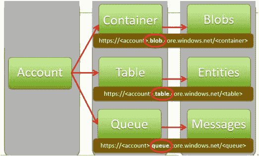
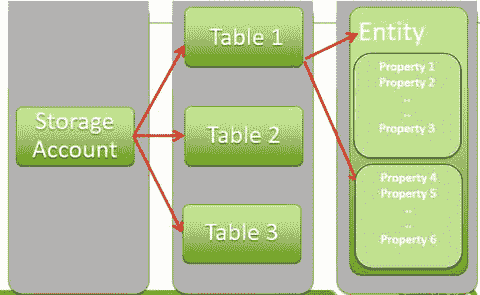
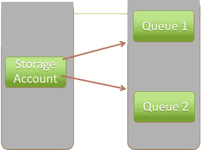
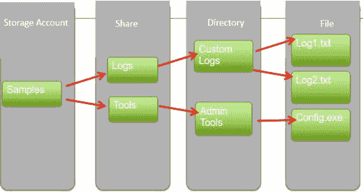
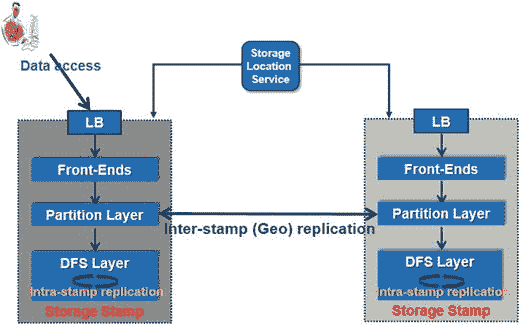
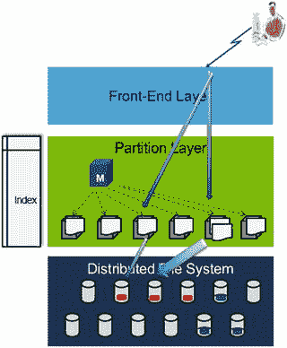

# 3. Microsoft Azure 存储

Microsoft Azure 存储是一个云存储系统，为客户提供灵活存储海量数据的能力，且数据可存储任意时长。其独特之处在于，你可以随时随地访问这些数据。它也是一种基于用量的存储系统（即，你为你所使用和所存储的内容付费）。在 Microsoft Azure 存储中，由于本地复制和地理复制的实现，数据具有持久性，从而支持灾难恢复。该存储由 Blob（用户文件）、表（结构化存储）和队列（消息传递）组成。数据具有高度持久性、可用性，并且可大规模扩展。它通过 REST API、.NET、Java、Node.js、Python、PHP、Ruby 中的客户端库进行公开。

## Azure 存储服务

Microsoft Azure 存储服务有多种类型（参见图 3-1）：



图 3-1. Microsoft Azure 数据存储概念及访问 Blob、表和队列的 REST 协议

*   `Blob 存储服务`
*   `表存储`
*   `队列存储`
*   `文件存储`

### Blob 存储

Blob 不过是云端的文件系统。它可以包含文本数据或二进制数据，例如文档、媒体文件或应用程序安装程序。简而言之，它是一个用于在云中存储和检索文件的简单接口（参见图 3-1）。以下列表提供了一些 Blob 的常见用途：

*   数据共享。客户可以共享文档、图片、视频和音乐。
*   大数据洞察。客户可以在云中存储大量原始数据，并可以使用 MapReduce 作业进行计算以获取数据洞察。
*   备份。许多客户将备份存储在云中，即将本地数据存储在云中。

`Blob 存储服务`包含以下关键概念：

*   `存储帐户`。Microsoft Azure 在全球不同位置提供存储。你需要创建一个 `存储帐户` 来访问存储服务并托管你的数据。一旦创建了 `存储帐户`，你就可以创建 `Blob` 并将其存储在 `容器` 中，也可以创建 `表` 并将 `实体` 放入这些 `表` 中。你还可以创建 `队列` 并在这些 `队列` 中存储 `消息`。
*   `容器`。一个 `容器` 提供了所有 `Blob` 的分组。一个 `存储帐户` 可以包含多个 `容器`，每个 `容器` 可以包含多个 `Blob`。
*   `Blob`。一个 `Blob` 可以包含文本数据或二进制数据，例如文档、媒体文件或应用程序安装程序。Microsoft Azure 存储提供三种类型的 `Blob`：
    *   `块 Blob`。顾名思义，一个 `块 Blob` 由多个 `块` 组成，每个 `块` 由一个 `块 ID` 标识。基本上，你通过写入一组 `块` 并通过其 `块 ID` 提交这些块来创建/修改 `块 Blob`。每个 `块` 可以有不同的大小，最大为 4MB。`块 Blob` 的最大大小为 200GB，单个 `Blob` 最多可包含 50,000 个 `块`。对于大小不超过 64MB 的 `块 Blob`，你可以通过单次写入操作上传。如果 `块` 的大小超过存储客户端中指定的大小，它将被分解为更小的块。
    *   `页 Blob`。这是一个由 512 字节 `页` 组成的集合，针对随机读写操作进行了优化。你需要初始化 `页 Blob` 并设置 `页 Blob` 将增长到的最大大小。要添加/修改 `页 Blob` 内的内容，你必须指定一个 `偏移量` 和一个与 512 字节 `页` 边界对齐的 `范围`。写入操作发生后立即发出提交。`页 Blob` 的最大大小为 1TB。
    *   `追加 Blob`。这些是专门为 `追加` 操作设计的 `块`。它们不公开 `块 ID`。当修改 `追加 Blob` 时，通过 `追加块` 操作在末尾添加 `块`。你无法更新/删除现有的 `Blob`。一个 `追加 Blob` 可以有不同的大小，最大为 4MB，并且可以包含 50,000 个 `Blob`。

### 表存储

`Azure 表存储` 包含大量结构化的非关系数据。图 3-2 显示了 `表存储` 的以下关键组件：



图 3-2. Windows 表存储组件

*   `存储帐户`。如前所述，对 Azure 存储的所有访问都通过 `存储帐户` 完成。
*   `表`。具有不同 `属性` 集的 `实体` 的集合。
*   `实体`。类似于数据库中的一行，它是一个 `属性` 集，大小可达 1MB。
*   `属性`。一个名称-值对，最多可包含约 252 个 `属性` 来存储数据。

**注意**
请参阅 `https://azure.microsoft.com/en-in/documentation/articles/storage-dotnet-how-to-use-tables/` 以了解如何使用 .NET 访问 `表存储`。

### 队列存储

`队列存储` 用于存储大量 `消息`，并可通过 `HTTP/HTTPS` 访问。它用于异步处理数据，并有助于在 Azure `Web 角色` 和 Azure `辅助角色` 之间传递 `消息`。
`队列` 为你的应用程序提供可靠的消息传递。它们可用于执行异步任务，例如，需要从 `Web 角色` 发送到 `辅助角色` 以异步处理的任务。这允许 `Web` 和 `辅助角色` 独立扩展（参见图 3-3）。



图 3-3. Windows 队列存储概念

**注意**
请参阅 `https://azure.microsoft.com/en-in/documentation/articles/storage-dotnet-how-to-use-queues/` 以了解如何使用 .NET 访问 `队列存储`。

### 文件存储

我们中的许多人仍在使用遗留应用程序，没有它们就无法工作。这些遗留应用程序过去使用 `SMB` 文件共享。借助 Microsoft Azure 的 `文件存储` 服务，你可以获得基于云的 `SMB` 文件共享，如果你决定将依赖文件共享的遗留应用程序迁移到 Azure，这会有所帮助。本地应用程序可以使用 `文件存储` REST API 访问 `文件共享` 中的数据。常见的 `文件存储` 用途包括：

*   迁移依赖于文件共享的本地应用程序。
*   存储共享的应用程序文件，如配置文件。
*   存储诊断数据，如日志。
*   存储工具和实用程序。

如果你看图 3-4，你会看到 `文件服务` 可用于存储诊断日志和应用程序配置文件。你可以根据需要创建目录并存储它们。



图 3-4. 文件存储概念

**注意**
更多信息，请参阅 `https://azure.microsoft.com/en-in/documentation/articles/storage-dotnet-how-to-use-files/`。


### 设计决策

微软 Azure 存储的设计基于一些关键的客户业务需求：

*   **强一致性**。对于企业客户而言，在将他们的关键业务应用程序迁移到云端时，一致性至关重要。执行乐观并发控制所需的条件读取、写入和删除操作对他们来说极为重要。因此，微软 Azure 存储根据 CAP 定理提供了三个属性——**强一致性**、高可用性和分区容错性。
*   **全局可扩展的命名空间存储**。借助微软 Azure 存储，您可以存储海量数据，并能从全球任何地方一致地访问它。微软 Azure 将 DNS 作为命名空间的一部分，并将命名空间分为三部分——存储账户名称、分区名称和对象名称 (`http(s)://AccountName.<Service>.core.windows.net/PartitionName/ObjectName`)。
*   **灾难恢复**。借助微软 Azure 存储，数据被存储在全球分散的多个数据中心中。这是为了确保在任何情况下都能保护客户数据，抵御地震、火灾、风暴等自然灾害。
*   **可扩展性**。数据需要具备可扩展性，应能根据峰值流量需求自动扩展并进行负载均衡。
*   **多租户**。许多客户可根据其需求，由同一个共享存储提供服务，从而降低了存储成本。

高级存储具有以下重要特性：

*   **持久性**。高级存储建立在本地冗余存储技术之上，该技术将数据副本存储在同一区域内。这是为了确认企业工作负载数据的持久性。仅当写入操作已被 LRS 系统持久化复制后，才会向应用程序确认写入成功。
*   **新的 `"DS"` 系列虚拟机**。新的 DS 系列虚拟机支持高级存储数据磁盘。您可以利用一种新的复杂缓存功能，该功能可实现读取操作的极低延迟。
*   **Linux 支持**。通过 Linux 集成服务 4.0，微软已为更多 Linux 版本提供支持。有多种发行版已经过微软 Azure 高级存储的验证，例如 Ubuntu（版本 12.04、14.04、14.10 和 15.04）、SUSE 12 等。

## Azure 存储架构内部原理

存储戳是在微软 Azure 基础结构上的一组存储节点机架集群，每个机架位于具有冗余网络和电源的独立域中（参见图 3-5）。



图 3-5.
存储戳架构

所有的读写操作都针对这些存储集群。目标是使存储戳在容量、事务和带宽方面的利用率保持在 70%左右，以便为更高的吞吐量获得更好的寻道时间。这提供了针对存储戳内机架故障的更强弹性。

位置服务管理所有存储存储戳。它执行诸如账户负载平衡和账户分配等操作，并处理这些存储戳之间的地理复制。位置服务本身也跨两个地理位置分布，以实现其自身的灾难恢复。

**注意**

有关微软 Azure 存储的更多信息，我们推荐以下网站：

[`http://sigops.org/sosp/sosp11/current/2011-Cascais/printable/11-calder.pdf`](http://sigops.org/sosp/sosp11/current/2011-Cascais/printable/11-calder.pdf)

[`https://blogs.msdn.microsoft.com/windowsazurestorage/2011/11/20/sosp-paper-windows-azure-storage-a-highly-available-cloud-storage-service-with-strong-consistency/`](https://blogs.msdn.microsoft.com/windowsazurestorage/2011/11/20/sosp-paper-windows-azure-storage-a-highly-available-cloud-storage-service-with-strong-consistency/)

### 复制引擎

存在两种复制引擎：戳内复制（流层）和戳间复制（分区层）。

戳内复制提供同步复制，并确保所有数据在存储戳内都是持久的。它在不同故障域之间保留足够不同的数据副本，以防磁盘、节点或机架故障。这由分区层完成，并且位于客户写入请求的关键路径上。仅当数据在戳内复制成功后，才会向客户端返回成功。

戳间复制通过在后台延迟复制数据来提供异步复制。这是一个对象级别的复制，要么复制整个对象，要么复制最近的更改。此复制用于在两个位置保留数据以实现灾难恢复，在存储戳之间迁移账户的数据。它通过优化使用存储戳间的网络带宽，提供针对地理灾难的地理冗余。

### 存储戳内的层次结构

存储戳内有三个层次（参见图 3-6）：



图 3-6.
分区层中的动态负载均衡

*   **流层/分布式文件系统层**。这是最底层，负责处理磁盘并将数据存储到磁盘。这意味着它将比特位存储在磁盘上，并将数据复制到许多服务器上，以保持数据在存储戳内的持久性。可以将其视为存储戳内的分布式文件系统层。数据被存储到称为“扩展区”的文件中，它们在区域内升级域和故障域之间被复制三次。这是一个仅追加的文件系统，因此数据永远不会被覆盖。数据会被追加到扩展区的末尾。
*   **分区层**。这一层有两个独特的目的。它理解数据抽象。它理解什么是 Blob、什么是表实体、什么是消息，以及如何对这些对象执行事务。因此，它确保事务排序和乐观并发控制，在流层之上存储对象数据，并缓存对象数据以减少磁盘 I/O。该层还负责对存储戳内的所有对象进行分区。该层还负责一个大规模可扩展的索引，该索引用于索引所有 Blob、表实体和队列。有一个主节点负责获取此索引，并根据索引的负载将其分解为范围分区。这些对象根据分区名称值被分解为不相交的范围，并由不同的分区服务器提供服务（即，它管理哪个分区服务器为 Blob、表和队列的哪个分区范围提供服务）。这样做是为了对访问大索引的 TPS 流量进行负载均衡。
*   **前端层**。为 Blob、表和队列提供 REST 协议。用于身份验证、授权以及日志记录和收集指标。

您可能想知道，在这种仅追加的文件系统中是如何提供结构化存储系统的？即，当文件系统是仅追加时，如何允许仅更新 Blob/表？

从高层次看，数据抽象在分区层被视为日志（流）。对数据的任何更新都会被追加到日志中，这意味着它们被追加到日志的最后一个扩展区。可以将其视为扩展区的链表链接。因此，追加操作只发生在最后一个扩展区。所有先前的扩展区都被封存，永不向其追加数据。然后数据被提交并成功返回给客户端。与此同时，所有最近的更新都存储在内存中，并在后台进行处理，因此会在关键写入路径之外懒惰地处理这些检查点。然后这些更新被合并到一棵 B+树中。因此，存在用于提交更新的日志，然后是检查点，以及用于查找您数据最新版本的树。


### 维护读取请求的可用性/一致性

由于所有按位维护的副本都是相同的，这意味着可以从任何副本进行读取。
为了读取可用性，会并行发出读取请求，取最先返回的请求，并将数据提供给客户。现在，在处理读取请求期间，如果检测到高延迟，会并行发出另一个读取请求进行处理。最先返回的请求将被发送给客户端。

### 分区层的负载均衡

通过负载均衡，尝试平衡`TPS`，即对索引进行负载均衡。在图 3-6 中，主服务器持续监控分区服务器以及每个分区的负载。如果它发现某个分区过热，这意味着该分区收到的待处理请求过多，主服务器可以迅速决定将此范围分区拆分为更小的范围分区（处理此类问题的方法之一）。
一旦分区移动到负载相对较低的不同分区服务器，它会更新分区映射。然后，前端可以将与该特定范围相关的请求转发到这个新服务器，从而最终平衡每秒事务数。需要注意的一个重要点是，在整个过程中没有数据移动（在`DFS`层）；它只是获取分区范围索引并进行更新，以便分区映射知道应将请求转发到哪个分区服务器。

### DFS 层的负载均衡

对于`DFS`层的负载均衡，监控存储节点的负载，用于确定将从哪个副本读取数据。同时，有一个进程在后台根据 95%延迟执行并行读取。
对于写入，监控节点以及正在追加数据的副本的负载。当某个节点显得过载时，它会封存该副本并开始追加到一个新的扩展区。这被放置在日志的末尾。

### DFS 容量的负载均衡

副本会被移动，以确保所有节点的磁盘都有一些可用空间。`DFS`层是一个仅追加的系统，这意味着它永远不会就地写入任何内容。重要的是要有一些总是可以追加的可用空间。这样可以避免存储节点出现热点。此外，如果有一个坏节点/磁盘或一个机架丢失，他们必须确保有一种更快的方法在所有节点/磁盘之间复制扩展区。利用可用的磁盘空间，可以快速完成此操作。

## Azure 存储提供的持久性

Azure 存储提供三种类型的持久性。
*   `LRS`（本地冗余存储）。在单个区域内的单个区域中存储数据的三个副本。所有三个副本都将位于同一区域中，从而在节点/机架/磁盘故障时提供持久性。
*   `ZRS`（区域冗余存储）。适用于块 Blob，并在多个区域中存储三个数据副本，设计上将所有三个副本保留在同一区域内，但不是强制性的，因为有时您可能将其存储在不同区域。除此之外，它提供了比`LRS`更高的持久性，因为现在数据可以抵御与区域相关的故障（例如设施在某个区域内发生火灾）。
*   `GRS`（全球冗余存储）。您存储六个副本，三个在主区域，三个在辅助区域，地理上分散。这提供了额外的持久性，以保护数据抵御重大的区域性灾难，例如风暴、龙卷风、地震或飓风。

### Azure 高级存储

`Azure 高级存储`由 Microsoft 推出。它有助于为运行 I/O 密集型工作负载的虚拟机提供高性能、低延迟的磁盘支持。它使用`SSD`（固态硬盘）来存储数据。如果您的工作负载需要高吞吐量，并且您希望利用这些磁盘的速度和性能，那么`Premium Storage`应该是您的选择。
对于需要持续高`IO`性能和低延迟的`Azure 虚拟机`工作负载，`高级存储`是合适的。为了在`SQL Server`、`MongoDB`、`Cassandra`等平台上承载`OLTP`、`大数据`和`数据仓库`等`IO`密集型工作负载，`高级存储`是一个很好的选择。
使用`高级存储`，您的应用程序可以为每个`VM`存储多达`64TB`的数据，并且可以为您提供每个`VM` `80Kbps IOPs`（每秒输入输出操作）的吞吐量和每个`VM` `2000Mbps`的磁盘吞吐量。
为了使用`高级存储`，您需要记住以下几点：
*   您需要一个`高级存储`帐户。可以使用存储`REST API`版本`2014-02-14`或更高版本（存储和服务管理）、`PowerShell 8.10`或更高版本或`Ibiza 门户`（ [`https://portal.azure.com`](https://portal.azure.com) ）创建`高级存储`帐户。当您使用`PowerShell`创建`高级存储`帐户时，需要指定`type`参数为`Premium_LRS`。例如：
    ```
    New-AzureStorageAccount -StorageAccountName "Testpremiumaccount" -Location "East US" -Type "Premium_LRS"
    ```
*   并非所有区域都支持`高级存储`。目前，美国中部、美国东部和西部、北欧和西欧、日本东部和西部、东南亚和澳大利亚东部支持它。
*   它仅支持`Azure 页 Blob`，因为它用于保存可用作`Azure 虚拟机`的永久性磁盘。
*   它是本地冗余的，并在同一区域内保留数据的三个副本。
*   为了使用`高级存储`，您需要配置`GS 系列`或`DS 系列`的`虚拟机`。
*   对于所有`高级`数据磁盘，默认的磁盘缓存策略是`只读`，而附加到`虚拟机`的`高级`操作系统磁盘设置为`读写`。
*   对于`高级存储`帐户，`IOPs`取决于磁盘的大小。目前有三种类型的高级磁盘——`P10`、`P20`和`P30`。关于`IOPs`和吞吐量规格，请参见表 3-1。

    表 3-1. 高级磁盘存储限制

    | 磁盘类型 | P10 | P20 | P30 |
    | --- | --- | --- | --- |
    | 磁盘大小 | 128GB | 512GB | 1TB |
    | IOPS（每磁盘） | 500 | 2300 | 5000 |
    | 吞吐量（每磁盘） | 100Mbps | 150Mbps | 200Mbps |

使用`PowerShell`，您可以使用`高级存储`创建`虚拟机`。可以使用以下代码片段/Cmdlet 来尝试此操作。请注意，它们只是 Cmdlet，应如此使用。您也可以参考`MSDN`链接；参见 [`https://msdn.microsoft.com/en-us/library/mt607148.aspx`](https://msdn.microsoft.com/en-us/library/mt607148.aspx) 。


## 使用高级存储和 PowerShell 创建 Azure 虚拟机

创建以下高级存储账户：

```powershell
C:\> New-AzureRmStorageAccount -ResourceGroupName "TestResourceGroup" -AccountName "TestStorageAccount" -Location "US East" -Type "Premium_LRS"
```

以下代码仅使用 ARM cmdlet；可用于创建虚拟机：

```powershell
# 为现有资源组和存储账户名称设置值
$rgName="RGServers"
$locName="East US"
$saName="Testserverssa"
# 设置现有虚拟网络和子网索引
$vnetName="XYZ"
$subnetIndex=0
$vnet=Get-AzureRmVirtualNetwork -Name $vnetName -ResourceGroupName $rgName
# 创建 NIC
$nicName="Test-NIC"
$domName="TestDom"
$pip=New-AzureRmPublicIpAddress -Name $nicName -ResourceGroupName $rgName -DomainNameLabel $domName -Location $locName -AllocationMethod Dynamic
$nic=New-AzureRmNetworkInterface -Name $nicName -ResourceGroupName $rgName -Location $locName -SubnetId $vnet.Subnets[$subnetIndex].Id -PublicIpAddressId $pip.Id
# 指定名称、大小和现有可用性集
$vmName="TestVM"
$vmSize="Standard_A3"
$avName="Test_AS"
$avSet=Get-AzureRmAvailabilitySet –Name $avName –ResourceGroupName $rgName
$vm=New-AzureRmVMConfig -VMName $vmName -VMSize $vmSize -AvailabilitySetId $avset.Id
# 添加 200GB 数据磁盘
$diskSize=200
$diskLabel="TestStorage"
$diskName="Test-DISK01"
$storageAcc=Get-AzureRmStorageAccount -ResourceGroupName $rgName -Name $saName
$vhdURI=$storageAcc.PrimaryEndpoints.Blob.ToString() + "vhds/" + $vmName + $diskName  + ".vhd"
Add-AzureRmVMDataDisk -VM $vm -Name $diskLabel -DiskSizeInGB $diskSize -VhdUri $vhdURI -CreateOption empty
# 指定映像和本地管理员帐户，然后添加 NIC
$pubName="MicrosoftWindowsServer"
$offerName="WindowsServer"
$skuName="2012-R2-Datacenter"
$cred=Get-Credential -Message "Type the name and password of the local administrator account."
$vm=Set-AzureRmVMOperatingSystem -VM $vm -Windows -ComputerName $vmName -Credential $cred -ProvisionVMAgent -EnableAutoUpdate
$vm=Set-AzureRmVMSourceImage -VM $vm -PublisherName $pubName -Offer $offerName -Skus $skuName -Version "latest"
$vm=Add-AzureRmVMNetworkInterface -VM $vm -Id $nic.Id
# 指定操作系统磁盘名称并创建虚拟机
$diskName="OSDisk"
$storageAcc=Get-AzureRmStorageAccount -ResourceGroupName $rgName -Name $saName
$osDiskUri=$storageAcc.PrimaryEndpoints.Blob.ToString() + "vhds/" + $vmName + $diskName  + ".vhd"
$vm=Set-AzureRmVMOSDisk -VM $vm -Name $diskName -VhdUri $osDiskUri -CreateOption fromImage
New-AzureRmVM -ResourceGroupName $rgName -Location $locName -VM $vm
```

参考：https://azure.microsoft.com/en-in/documentation/articles/virtual-machines-windows-create-powershell/

## 高级存储内部机制

高级存储磁盘在 Azure 存储中以页面 Blob 形式实现。每个未缓存的写入操作会复制到三个位于不同机架（故障域）的 SSD 服务器上。高级存储中的数据存储在 SSD 驱动器上，从而提供更高的吞吐量。所使用的磁盘与使用标准存储获得的磁盘不同。有一个称为 Blob 缓存的组件运行在托管这些虚拟机的服务器上，利用服务器的 RAM/SSD 来实现更高的吞吐量和低延迟。它对高级磁盘和标准磁盘都启用，并配置为只读和读写缓存。对于只读缓存，它会同步将数据写入缓存和 Azure 存储。对于启用了写入缓存的磁盘，当虚拟机请求时，它会将数据写回 Azure 存储。这通过磁盘刷新或在 I/O 上指定直写标志（强制单元访问）来完成。

虚拟机可以利用此缓存架构，提供极高的吞吐量和低延迟，从而极大地提升性能。

## Azure 存储最佳实践

所有开发者在构建应用程序时遵循最佳实践非常重要。从客户合作中获得的经验使我们在处理 Azure 存储并从中获得最大性能方面得出了一些关键经验。

### 使用 Blob 提升性能

处理任何形式的应用程序时，性能都很重要，更不用说 Blob。本节介绍了处理 Blob 时需要牢记的一些要点。当你将文件存储在 Blob 中，并对 Blob 进行读写时，有几个关键方面需要注意。

单个 Blob 的读写速度最高可达 60Mbps，单个 Blob 每秒最多支持 500 个请求。如果你有多个客户端需要读取同一个 Blob，并且可能会超过这些限制，你应该考虑使用 CDN 来分发 Blob。

尽量使读取大小与写入大小匹配，并避免从具有大块的 Blob 中读取小范围数据。以下属性用于控制读取和写入大小：`CloudBlockBlob.StreamMinimumReadSizeInBytes` 和 `StreamWriteSizeInBytes`。

你可以通过并行上传多个文件或通过并发上传来上传文件夹内容。并发上传意味着多个工作进程上传不同的 Blob。并行上传意味着多个工作进程上传同一 Blob 的不同块。

并行上传多个 Blob 比将多个 Blob 块上传到同一 Blob 执行得更快。这是因为将多个 Blob 块并行上传到单个 Blob 会影响单个分区，并受到分区性能目标的限制。并行上传多个 Blob 将在许多不同的分区上工作，并可能受到虚拟机带宽的限制。

#### 复制/移动 Blob

你可以使用存储 REST API 在存储帐户之间复制 Blob。客户端应用程序可以指示存储服务从任何其他存储帐户复制 Blob。复制可以异步进行，这减少了带宽消耗。但是，你需要小心处理异步进程，因为无法保证完成时间。更好的方法是先将 Blob 下载到虚拟机，然后再复制到目标位置。在复制过程中，你需要确保虚拟机位于同一区域。

#### AzCopy

此实用程序由存储团队发布，可用于在存储帐户之间传输 Blob。你获得的传输速率非常高，建议你将其用于批量上传、下载和其他复制场景。（有关更多信息，请参阅 [`https://azure.microsoft.com/en-us/documentation/articles/storage-use-azcopy/`](https://azure.microsoft.com/en-us/documentation/articles/storage-use-azcopy/)。）

#### 选择合适的 Blob 类型

Azure 存储支持两种类型的 Blob——页面 Blob 和块 Blob。你需要根据用例场景选择合适的 Blob 类型，因为这会在很大程度上影响性能和可扩展性。当你想上传大量数据（例如将照片或视频上传到 Blob 存储）时，块 Blob 是合适的。如果应用程序需要对数据执行随机写入，则页面 Blob 是合适的。

在使用 Microsoft Azure 存储时，请将以下 URL 用作检查清单。应用程序开发者可以遵循该文章，其中记录了重要的最佳实践，内容全面。它将有助于提升应用程序的性能。参见 [`https://azure.microsoft.com/en-us/documentation/articles/storage-performance-checklist/`](https://azure.microsoft.com/en-us/documentation/articles/storage-performance-checklist/)。


### 使用表进行性能提升

以下列表提供了一些关于使用表的技巧，正如本章所讨论的，表是另一种可在不同场景中有效使用的服务。

*   **可伸缩性**。当您的流量增加时，系统通常会执行负载均衡，但如果您的流量出现突发峰值，您可能无法立即获得该量级的吞吐量。如果您的模式存在突发峰值，您应该预期在突发期间会出现限流和/或超时，因为存储服务正在为您的表自动进行负载均衡。建议是缓慢增加流量，这样可以让系统有时间进行适当的负载均衡。
*   **JSON** (JavaScript 对象表示法)。一种流行且简洁的 `REST` 协议格式。`OData` 支持 `AtomPub` 和 `JSON`。`Atom` 的一个缺点是其冗长的特性，这在编写表服务时可能是不需要的。表服务支持使用 `JSON` 而非基于 XML 的 `AtomPub` 格式来传输表数据。这可以将有效载荷大小减少多达 75%，并能显著提升应用程序的性能。
*   **禁用 Nagle 算法**。纳格尔算法非常流行，在 `TCP/IP` 网络中广泛实施以提升网络性能。在某些高交互性系统中，这可能无法为您提供最佳性能。对于 Azure 存储，纳格尔算法对表和队列服务的请求性能有负面影响，应尽可能将其禁用。
*   **表与分区**。如何表示您的数据非常重要，因为这对表服务的性能有巨大影响。表被划分为分区。存储在一个分区中的所有实体共享相同的分区键，并在该分区内拥有一个唯一的行键来标识自身。好处是您可以在单个事务中更新实体，最多支持 100 个独立的存储操作。您还可以在单个分区内更高效地查询数据，而不是查询跨越多个分区的数据。分区支持原子批处理事务，因此对存储在单个分区内实体的访问无法进行负载均衡。因此，作为开发者，您应使用以下技术：
    *   您的客户端应用程序经常更新或查询的数据应位于同一分区中。这可能是因为您的应用程序正在聚合写入，或者您希望利用原子批处理操作。
    *   您的客户端应用程序不常在同一原子事务中更新/查询的数据应位于不同的分区中。
    *   避免出现热点分区，即那些比其他分区接收更多数据的分区。如果分区方案导致某个分区的数据使用频率远高于其他分区，那么请做好遇到限流的准备。该分区很可能会接近其可伸缩性目标。最好确保您的分区方案不会导致任何单一分区接近其可伸缩性目标。

一旦您将数据存储在 Microsoft Azure 存储服务中，理解能帮助您检索数据的最佳实践就变得非常重要。下一节将介绍这些重要实践。

## 查询数据最佳实践

一旦您将数据存储在 Microsoft Azure 存储服务中，理解能帮助您检索数据的最佳实践就变得非常重要。

作为查询数据的最佳实践，一个通用的经验法则是避免扫描。如果您必须进行扫描，应该组织数据，以便能够避免不必要的数据扫描。

*   **点查询**。尽可能多地使用此类查询，因为它们通过指定分区键和行键仅返回一个实体。
*   **分区查询**。这些查询的性能不如点查询，应谨慎使用。它们检索共享相同分区键的数据集，通常您除了指定分区键外，还会指定一个行键范围或某个实体属性的值范围。
*   **表查询**。这种查询检索一组不共享公共分区键的实体，效率低下，应尽可能避免。
*   **查询密度**。影响查询性能效率的重要因素之一是返回的实体数量与扫描的实体数量。低查询密度可能导致表服务对您的应用程序进行限流，因此应避免。以下是一些您可以避免低查询密度的方法：
    *   过滤数据，使查询仅返回您的应用程序将要使用的数据。由于网络有效载荷减少以及您的应用程序必须处理的实体减少，应用程序的性能将得到提升。
    *   使用投影来限制您的客户端应用程序需要返回的数据集的大小。
    *   删除冗余数据（反规范化）。这一直是有帮助的，因为它最小化了查询必须扫描以找到客户端所需数据的实体数量，而不是必须扫描大量实体来找到您的应用程序需要的数据。

## 总结

Microsoft Azure 存储服务提供了应用程序开发者所需的一切，以提供一个稳健、可扩展的基于云的解决方案。凭借其众多实用功能，它提供了最佳平台来托管您的应用程序并安全地存储数据。您无需考虑灾难恢复策略，因为它已全部处理妥当。现在，借助高级存储产品，吞吐量得以提升，您的应用程序性能将获得巨大增强。


