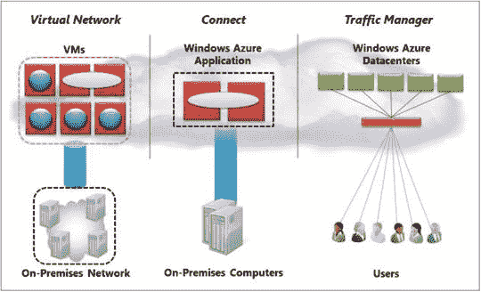
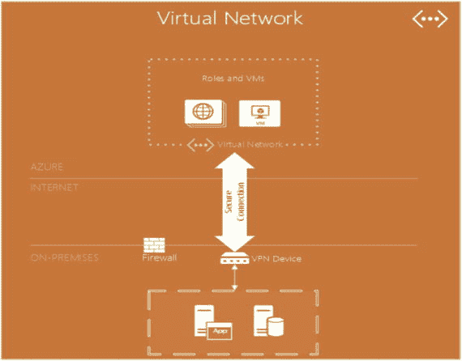
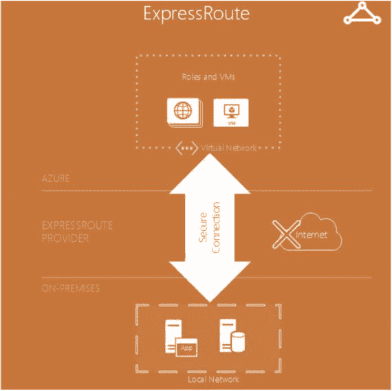
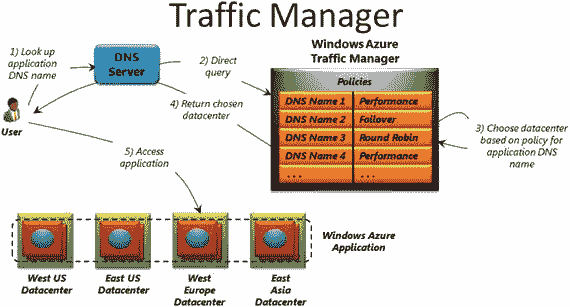
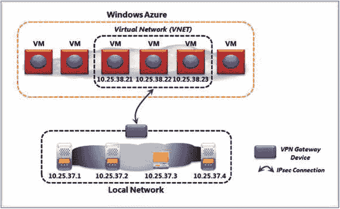

# 4. Microsoft Azure 网络

借助 Microsoft Azure，您可以在微软数据中心内创建运行的`虚拟机`。您创建的这些虚拟机最终会成为某个工作组的一部分。传统上，您可以将应用程序托管在您的虚拟机上，而数据可能驻留在`SQL Server`上，而后者可能位于另一台虚拟机上。这些机器需要相互通信，因此您不仅需要连接它们，还需要在它们之间进行通信。为了从应用程序连接，您可以使用`SQL 身份验证`或直通式 Windows 身份验证来连接到`SQL Server`，因为这些机器都位于同一个工作组中。

全球各地分布着不同的数据中心，不同的客户和企业在 Microsoft Azure 中运行。它为在云中托管您的业务并降低`总拥有成本（TCO）`提供了完美的平台。因此，为了将您的业务托管在 Microsoft Azure 中或存储数据，您可以使用这些遍布全球的数据中心之一。

如图 4-1 所示，您可以通过三种不同的方式连接到这些数据中心：

*图 4-1. 使用不同组件的典型设置*

*   将本地网络连接到包含一组虚拟机的独立网络。
*   使用`Azure AD Connect`将 Microsoft Azure 应用程序链接到本地 Windows 服务器。参见[`https://azure.microsoft.com/en-in/documentation/articles/active-directory-aadconnect/`](https://azure.microsoft.com/en-in/documentation/articles/active-directory-aadconnect/)。
*   使用`Microsoft Azure 流量管理器`将请求路由到运行 Microsoft Azure 应用程序不同实例的多个数据中心。

您也可以在云中创建`虚拟网络`。您可以在 Microsoft Azure 中创建测试环境，包含用于用户身份验证的域控制器（`DC`），并可以托管您的应用程序服务器。您的数据驻留在`SQL Server`中，该服务器配置在 Microsoft Azure 中，利用了大规模可扩展、高度安全的 Microsoft Azure 存储。您需要创建一个`虚拟网络`来配置安全的站点到站点连接以及云中受保护的私有`虚拟网络`。因此，您可以在 Microsoft Azure 内构建完整的办公网络。

在本章中，您将看到 Microsoft Azure 如何让您创建`VPN`，并允许您的本地网络连接并相互通信。您还可以将 Azure 应用程序与本地连接，并在不同数据中心之间分配负载。您还将了解一些关键的网络组件/概念，如果您有兴趣可以进一步研究。

## 网络入门

将您的本地环境安全地连接到`虚拟网络`有助于扩展您的业务，并通过利用 Microsoft Azure 服务来降低成本。至少有三种选项可以帮助您连接和扩展混合网络：`站点到站点`、`站点到站点`和`ExpressRoute`。更多细节请参见图 4-2 和表 4-1。

*表 4-1. 选择最佳连接选项*

| | `点到站点` | `站点到站点` | `ExpressRoute` |
| --- | --- | --- | --- |
| Azure 服务 | `云服务`和`虚拟机` | `云服务`和`虚拟机` | 大多数服务，请参阅附注中的链接 |
| 带宽 | 小于`100MBPS` | 小于`100MBPS` | `50MBPS-10GBPS` |
| 支持的协议 | `安全套接字隧道协议（SSTP）` | `IPSec` | 通过 VLAN、NSP 和 VPN 技术的直接连接 |
| 连接弹性 | `主动-被动` | `主动-被动` | `主动-主动` |

*图 4-2. 典型的混合设置*

在您选择其中一种选项之前，应该考虑几点，例如以下几个问题：您的应用程序需要多少吞吐量？您的应用程序是否通过公共互联网连接？您是否有可用的公共 IP？您需要`VPN 网关`吗？

更多信息可以在这里找到：

[`https://azure.microsoft.com/en-in/documentation/articles/expressroute-faqs/#supported-services`](https://azure.microsoft.com/en-in/documentation/articles/expressroute-faqs/#supported-services)

[`https://azure.microsoft.com/en-in/documentation/articles/vpn-gateway-cross-premises-options/`](https://azure.microsoft.com/en-in/documentation/articles/vpn-gateway-cross-premises-options/)

在当今业务横跨世界多个地区的时代，公有云可以巧妙地用作本地数据中心的扩展。云为您提供了灵活性，因为您可以按需创建虚拟机，如果不需要可以暂停/停止它们，并且一旦工作完成且不再需要时可以删除它们，即您只在业务需要时使用计算资源。此外，您在本地运行的现有应用程序将继续平稳运行。您可以快速创建包含`SharePoint`和`SQL Server`的`虚拟机`，并拥有一个可以与您现有本地`Active Directory`通信的`Active Directory`。

### 站点到站点连接

`站点到站点`连接可用于将分支办公室连接到总部（主办公室）。在此类连接中，主机无需安装`VPN`客户端软件。位于本地环境中的`VPN`设备被配置为与 Azure `VPN 网关`建立安全连接。它通过`VPN 网关`发送`TCP/IP`数据包，这些网关对数据包进行封装和加密，并通过`VPN`隧道发送。然后，目的地的`VPN 网关`接收数据包，解读数据包的头部和内容，然后将其发送到目标主机。

以下描述了您可能会使用`站点到站点`连接的一些场景：

*   用于创建混合解决方案。
*   业务需求是持续可靠的网络连接。
*   您不需要为将本地网络连接到`VPN`进行任何客户端配置。

设置`站点到站点`连接的要求主要是您需要一个具有面向互联网`IP 地址`的兼容`VPN`设备。此设备应与`VPN 网关`类型兼容。

### 点到站点连接

你可以使用此功能创建到你的虚拟网络的安全连接。与站点到站点连接不同，你需要在每个打算连接到虚拟网络的客户端上安装并配置 VPN 客户端。你也不需要一个具有面向互联网 IP 地址的 VPN 设备。

以下描述了你会使用点到站点连接的一些场景：

*   你有少量客户端需要连接到虚拟网络。
*   你的客户端需要远程连接。
*   已存在一个站点到站点连接，但有几个客户端必须从远程位置连接到虚拟网络。

虚拟网络为你提供了一种在 Azure 内创建私有网络的选项。利用这一点，不同的服务可以相互通信或与本地资源通信。

这个概念非常有趣且实用；然而，为了使其有益，用户应该像应用程序运行在他们自己的本地数据中心一样对待它。你的网络管理员可以在你的本地本地网络和 Microsoft Azure 之间设置 Microsoft Azure 虚拟专用网络，其中可以运行多台虚拟机。这可以在 VPN 网关设备的帮助下完成。你可以选择自己的 IPv4 地址并将其分配给在云中运行的这些虚拟机。这意味着它看起来像是你现有网络的延伸。最终用户将能够无缝地访问在这些虚拟机上运行的应用程序，就像访问本地网络上的应用程序一样。

### ExpressRoute

ExpressRoute 是一个非常简洁的概念，通过它你可以获得自己到 Azure 的私有连接。ExpressRoute 是一种绕过公共互联网、将你的本地基础结构连接到 Microsoft Azure 数据中心的连接（参见图 4-3）。这有助于 Azure 像你自己的私有云一样运作。

图 4-3. 使用 ExpressRoute 的混合设置

有两种方法可以建立到 Microsoft Azure 的私有连接。第一种是通过交易所提供商设施连接；如果你使用交易所提供商设施，你可以直接连接到 Azure。或者，你可以通过你的网络服务提供商在本地站点和 Microsoft Azure 数据中心之间建立直接连接。

Microsoft Azure 将看起来只是你广域网上的另一个站点。ExpressRoute 是无缝的，并且与各种技术配合得很好。它还提供内置冗余。Microsoft 直接与你的网络服务提供商合作。它提供更快的吞吐量，接近 10Gbps。因此，借助 ExpressRoute，你的网络基础设施非常安全，具有低延迟、高吞吐量和出色的可靠性。如果你使用 ExpressRoute 在本地和 Microsoft Azure 数据中心之间传输数据，你还可以享受成本优势。由于它快速且可靠，它可以用于数据迁移、业务连续性复制、灾难恢复和高可用性策略。

借助 ExpressRoute，你可以利用 Microsoft Azure 的计算和存储容量，并将其添加到你现有的数据中心。由于它可靠并提供高吞吐量连接，你可以构建一个从现有数据中心扩展通过 Microsoft Azure 数据中心的混合应用程序。有趣的是，你在不牺牲安全性或性能的情况下获得了所有这一切。

## Azure AD Connect

使用 `Azure AD Connect`，你可以将你的本地身份基础结构连接到托管在 Microsoft Azure 中的活动目录。它为你提供一个向导，指导你完成连接所需的先决条件和组件。使用此工具，你可以为 `Office 365`、`Azure` 和与 `Azure AD` 集成的 `SaaS` 应用程序配置用户的通用标识。安装该工具时，它会安装先决条件，如 `.NET Framework`、`Azure Active Directory`、`PowerShell` 模块以及用于登录的 `Microsoft Online Service` 助手。它会为多个活动目录林之一配置同步。它还帮助你配置密码哈希同步或与 Web 应用程序的 `Active Directory Federation`。你可以在 [`https://azure.microsoft.com/en-in/documentation/articles/active-directory-aadconnect/`](https://azure.microsoft.com/en-in/documentation/articles/active-directory-aadconnect/) 阅读更多相关信息。

## Traffic Manager

在当今用户遍布全球的世界中，挑战在于在多个数据中心运行应用程序实例。主要挑战是如何智能地将流量重定向到运行在分散数据中心的应用程序实例。目标通常是让用户访问距离他们最近的应用程序，以获得最佳响应时间和吞吐量。

`Traffic Manager` 帮助你控制流量的分布并将其路由到特定的端点，如网站、云服务等。基本上，你定义规则来决定 `Traffic Manager` 将如何路由/分发流量到数据中心。例如，通常请求可能会根据用户位置路由到最近的数据中心；然而，该数据中心的响应时间并不总是最佳的。在这种情况下，用户可以被路由到其他数据中心。这种类型的服务在现代商业中非常有用，因为你的用户遍布全球。

以下是 `Traffic Manager` 提供的主要优势：

*   它有助于提高关键任务应用程序的可用性。
*   你为高性能应用程序获得更好的响应时间。
*   你可以通过禁用端点来执行应用程序升级，并在服务完成后启用它们。
*   最后，你可以将一个端点指定给另一个 `Traffic Manager`，从而分发复杂的应用程序部署。

图 4-4 展示了规则如何使 `Traffic Manager` 能够路由全球流量。

图 4-4. Traffic Manager 工作流

## 虚拟专用网络

在当今世界，大多数组织都选择混合模式，将数据同时存储在云端和本地数据中心。例如，您可以创建一个虚拟专用网络（`VPN`），并将您的云环境链接到分支机构（参见图 4-5）。

*图 4-5. 典型的 VPN 设置*

使用 Microsoft Azure 虚拟网络，您可以通过将虚拟机分组来创建一个逻辑边界，称为虚拟网络或 `VNet`。一旦 `VNet` 建立，您就可以在本地数据中心和 `VNet` 之间建立 `IPsec` 连接。然而，对于 `ExpressRoute` 设置，则不需要此连接。您可以使用 Microsoft Azure `VMs` 或 Microsoft Azure 云服务（或两者）在虚拟网络中创建虚拟机。您可以选择 Microsoft Azure 的 `IaaS` 或 `PaaS` 服务产品来创建虚拟机或服务。创建 `IPsec` 连接时，基本上需要以下条件：

*   您需要一个虚拟专用网络（`VPN`）网关设备。
*   您需要连接到本地网络的专用硬件。
*   您需要一位网络管理员来帮助您完成设置。

一旦此网络和设置准备就绪，在 `VNet` 内运行的虚拟机将显示为您本地网络的延伸。

请注意，图 4-5 中的 IP 地址是从您的本地网络可用 IP 地址范围内分配的。在本地网络上运行的软件将能够看到这些虚拟机，就好像它们在自己的本地网络中一样。有趣的是，承载这些虚拟机的物理机器（无论位于网络的哪一侧）都可以运行任何操作系统，因为连接发生在 `IP` 层，因此是透明的。例如，运行 Linux 操作系统的 Microsoft Azure `VMs` 可以与您运行 Windows 的本地机器通信，反之亦然。您可以使用像 `SCCM` 这样的基础结构工具来管理云中的虚拟机。

拥有这样一个扩展网络的一个非常重要的方面是，您可以轻松地将现有的本地 Active Directory 域扩展到 Microsoft Azure 虚拟网络，并为用户提供单点登录，以便他们可以在任何地方运行应用程序。如果需要，您可以在 Microsoft Azure 云中创建一个域并将其连接到您现有的本地域。由于您的虚拟网络是您本地网络的延伸，反之亦然。

从技术上讲，您也可以从 Microsoft Azure 网络使用在您本地网络中运行的软件。如果您出于隐私原因希望将数据保留在本地（许多医院和医疗机构就是如此），您可以使用虚拟网络的概念来扩展您的网络，以便数据保留在您的本地网络中（本地存储），而用户仍然可以从运行在 Microsoft Azure 多个数据中心中的应用程序实例访问数据。

这为您提供了根据需要灵活访问大量资源的能力。云领域的弹性是一个很棒的概念，直接影响您的财务状况，因为它降低了总体拥有成本。您可以在需要时启动虚拟机，并在完成后直接移除/释放资源（在此上下文中是虚拟机）。您只需为使用它们的时间段付费。假设您有一个紧急请求，需要准备一台机器。使用 Microsoft Azure，您可以立即设置好虚拟机，并在几分钟内准备就绪。

### 负载均衡器

使用 Azure 负载均衡器，您可以获得高可用性并提升网络应用程序的性能。它使用第 `4` 层 `TCP/UDP` 负载均衡器来平衡和分散负载，并将其通过不同的、健康的服务进行分发。负载均衡通过端点实现，这些端点在公共 `IP` 和分配给最终将分发负载的虚拟机的本地端口之间具有一对多的关系。以下是使用负载均衡器的一些适用场景：

*   它可以对发送到虚拟机的 Internet 流量进行负载均衡。
*   它还可以对虚拟网络内虚拟机之间的传入流量进行负载均衡。它可以用于在云服务内的不同虚拟机之间分配负载。
*   它还可以将外部流量转发到特定的虚拟机。

### Azure `DNS`

任何服务或网站都会与一个 `IP` 地址关联。域名系统 (`DNS`) 有助于将 `IP` 地址转换为用户友好的服务或网站名称。

Azure `DNS` 使用 Microsoft Azure 基础结构提供名称解析。您可以将您的域名托管在 Microsoft Azure 数据中心内，同时使用您一直使用的相同凭据管理您的 `DNS` 记录。Azure `DNS` 中的 `DNS` 域托管在全局 `DNS` 网络名称服务器中。此服务为您的域提供更快的性能和高可用性。您需要从第三方注册商购买域名，然后可以将其托管在 Azure `DNS` 中以管理 `DNS` 记录。

## 总结

Microsoft Azure 允许您创建 `VPN`，并允许您的本地网络连接相互通信。您可以连接 Azure 应用程序到本地，也可以跨不同数据中心分配负载。您可以以最小的影响扩展您现有的业务并节省大量资金。请务必阅读本章末尾的参考资料，它们是丰富的 Azure 文档的一部分。

