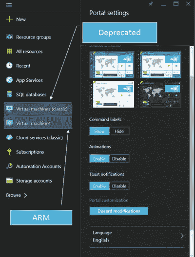
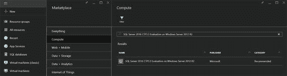
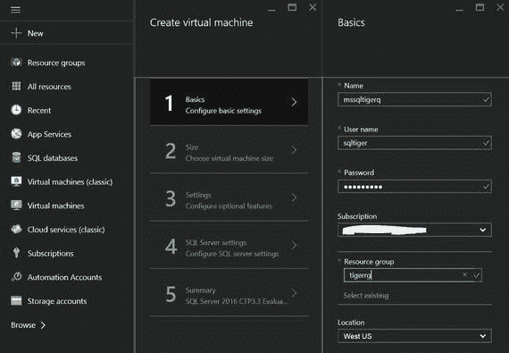
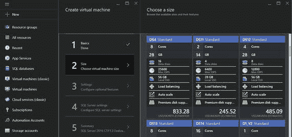
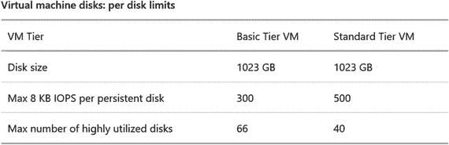
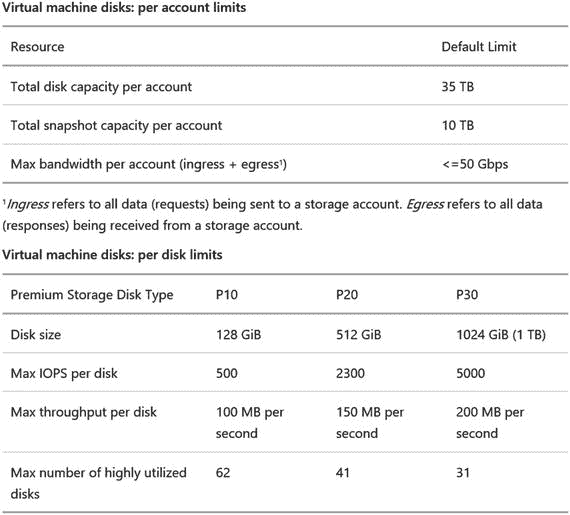
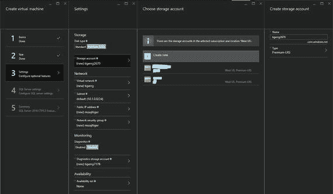
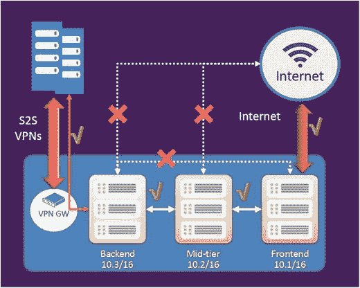
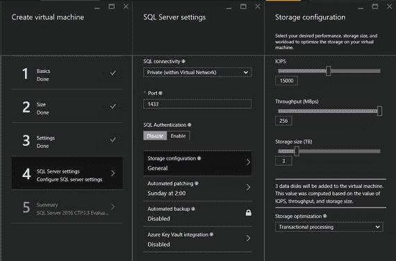

# 5. 在 Azure `VMs` 上部署 SQL Server

多年来，自动化已经从批处理文件发展到 `PowerShell`，最终发展到自动化例程。随着云的出现，“自动化”一词有了全新的含义。无论您部署在公共云还是私有云中，执行部署所需的大规模需求是任何人员配备模式都无法满足的。业界看到了对自动化重复任务、监控已部署服务以及提供与部署相关工件的见解的巨大需求。云环境中的“纵向扩展 (`scale-up`)”和“横向扩展 (`scale-out`)”无法脱离自动化而单独存在。

在 Microsoft Azure 环境中，您有可用的工作流，允许您指定输入，工作流将使用这些输入作为参数来部署具有所需设置的虚拟机。在传统的 `IT` 世界中，部署 `SQL Server` 会有先决条件，例如采购硬件、设置硬件和操作系统，然后满足 `IP` 地址、权限等先决条件。所有这些先决条件完成后，您需要获取 `SQL Server` 安装媒体，使用必要的参数运行安装，然后执行安装后配置步骤。

全球大量的 `IT` 专业人员利用各种脚本和自动化方法来加快这些部署速度。许多环境迁移到虚拟化，以加快这些环境的部署速度并缩短采购时间。如果您坚信虚拟化可以节省成本并防止资源利用不足，那么云将这一点又向前推进了一步。它真像预付费的手机服务！您只需为使用的部分付费。这种按需付费模式在企业内的许多共享服务模型中复制，以成本中心的形式进行费用回收。在本章中，我们将把 Azure 中的部署与本地世界进行类比，并解释在 Azure `VMs` 上托管的 `SQL Server` 实例存在的不同部署选项。


## 部署独立的 SQL Server 实例

在前几章中，详细介绍了 Azure 架构以及 Azure 中可用的部署模型（经典和 ARM）。由于 Azure 正在过渡到资源管理器（ARM）部署模型，本章将仅重点介绍此特定模型。当你登录 Azure 门户（`portal.azure.com`）时，左侧会呈现一个列视图，允许你查看已部署的各种资源以及可以部署的服务。

最常见的问题之一是，为什么会看到两个不同的虚拟机项目（见图 5-1）。"虚拟机"选项用于部署使用资源管理器模型的虚拟机，而"虚拟机（经典）"选项则用于部署使用经典部署模型的虚拟机。旧门户（`manage.windowsazure.com`）不显示使用资源管理器模型部署的虚拟机。


图 5-1. Azure 门户

既然你已了解导航差异，让我们将部署 SQL Server 的旅程分解为不同阶段。旅程的第一阶段是选择部署。从许可角度来看，Azure 虚拟机为 SQL Server 提供了多种部署选择。

*   从市场部署 SQL Server 映像（见图 5-2）并支付 SQL Server 的每分钟费率。  图 5-2. 显示 SQL Server 2016 3.3 映像的 Azure 市场映像
*   使用软件保障下的许可移动性权益安装或上传你自己的 SQL Server 映像
*   作为拥有服务提供商许可协议 (SPLA) 的服务提供商，你还有一个额外选项，即使用你自己的映像，并通过你的 SPLA 报告订阅者访问许可 (SAL)

### 配置设置

图 5-2 显示了当你点击主页左上角的"新建"选项时，计算资源的市场浏览选项。市场允许你部署从 SQL Server 2008 R2 到 SQL Server 2016 的各种版本。你甚至可以选择一系列版本，如企业版、标准版和 Express 版。另一个选项是选择预置的解决方案，如可用性组部署模板，它允许你在部署期间部署可用性组。

#### 虚拟机区域

对于某些计算部署选项，你可以选择部署模型（经典或 ARM）。一旦选择了要部署的映像，系统将为你提供许多选项来指定虚拟机和 SQL Server 设置（如果你使用的是 SQL Server 映像）。这段旅程是你为 Azure 部署工作流提供输入，以配置环境的各个选项。这些选项会由 Microsoft 工程团队不断审查。根据用户输入和可用的遥测数据，这些选项的增强和改进会在冲刺版本中添加。一旦你开始使用云，你就会了解到公共云就像天气一样。你知道季节，并且可以根据各种迹象大致预测天气，但你偶尔还是会感到惊喜。与天气唯一的区别是，出现在各种工作流中的增强和改进是为了让你的生活更轻松，而不是更困难。云工程团队是 Microsoft 内部最敏捷的开发组织之一。

图 5-3 所示的基本设置视图对所有 Azure 虚拟机配置向导都是通用的，它们允许你指定计算机名称、管理员用户名、密码和资源组名称（因为我们使用的是 ARM）。你还可以指定区域，即此虚拟机将部署到的数据中心，以及订阅。这些是非常重要的考虑因素，因为部署完成后无法通过门户更改它们。如果要将现有的 Azure 虚拟机移动到不同的区域或订阅，你需要编写 PowerShell 命令来完成。这不是一瞬间就能完成的事情！


图 5-3. Azure 虚拟机的基本设置配置

选择订阅是一个更容易的考虑。你会希望选择应为其资源使用计费的订阅，该订阅通常也将托管应用程序的其他部分。此决策不涉及与性能相关的考虑。然而，为虚拟机选择区域则涉及性能方面。思考区域最简单的方式就是将其视为你的数据中心。对于生产环境，你会选择位于同一数据中心内的服务器刀片和 SAN。此外，除非你有地理分散的要求，否则最好也将应用程序部署在同一个数据中心。同样的逻辑也适用于这里。你应该为计算、存储和应用程序部署选择相同的区域。这将防止跨数据中心的网络跳转，从而减少延迟并避免对性能产生负面影响。这是在使用 Azure 虚拟机的多层架构中观察到的最常见的部署错误配置之一。


#### 虚拟机硬件

下一组输入对于性能和确保应用程序遵守 SLA 同样至关重要。这涉及为你的虚拟机选择合适的计算层。图 5-4 展示了 Azure 提供的不同选项。对于关键的生产环境，建议选择提供 SSD 磁盘（高级存储）的计算层。向导会为你所选的每个层提供相关的 CPU 核心和 RAM。可以将大小设置视为选择你的硬件，而无需费心理解底层的硬件配置。你只需要知道你的应用程序数据库运行所需的“马力”（处理能力、IOPs 和物理内存）。


**图 5-4. 选择 Azure 虚拟机大小**

此配置中的一个主要陷阱是，大多数人在配置时忘记了正确估算 IOPs。如果 IO 突发超过了虚拟机或存储账户的最大公开限制，Azure 将进行限制（参见图 5-5）。这可能导致你的虚拟机性能不稳定地减慢，从而对用户体验产生负面影响。Azure 提供了监控端点，可用于确定是否超过了现有存储限制。你甚至可以设置警报，在超过阈值时得到通知。第 7 章详细介绍了在 Azure 虚拟机上运行的 SQL Server 实例的性能方面。


**图 5-5. Azure 标准存储账户限制**

一旦你选择了所需的大小，系统会提供许多旋钮，允许你配置存储账户。在撰写本文时，Azure 存储的限制是每个订阅 100 个存储账户，每个标准存储账户的限制为 500TB。页面 Blob 的最大大小为 1TB，这意味着附加到你的虚拟机的虚拟硬盘的最大大小为 1TB。根据你选择的虚拟机层，你的存储大小将受到限制。在图 5-4 中，选择 DS4 标准将限制你的存储最多为 16 个数据磁盘，这意味着存储大小限制为 16TB。此外，你需要记住，每个存储磁盘对 8KB IOPs 支持的 IOPs 有一个上限。对于标准层虚拟机，它被限制为 500。

标准存储和高级存储所需磁盘数量的计算如下所示。

```
所需磁盘数量计算：
对于标准存储 = MAX[(所需总存储 (GB) ÷ 1024), (所需总 IOPs ÷ 500)]
对于高级存储 (P30) = MAX[(所需总存储 (GB) ÷ 1024), (所需总 IOPs ÷ 5000), (所需总 IO MB/s ÷ 200)]
```

如果从实际情况来看，如果你需要 1TB 支持 2000 IOPs 的存储，你将需要四个数据磁盘，这将达到可扩展性限制。如果你使用的是 P30 高级存储，你将能够利用单个高级 IO 磁盘，并且还有一些空间来容纳额外的负载（参见图 5-6）。


**图 5-6. Azure 高级存储限制**

标准存储是你当不太关心性能时选择的经济型轿车。但你绝不会开这辆车去参加 NASCAR 拉力赛或大奖赛。如果你想在这个舞台上竞争，你的存储需求只能通过高级 IO 来满足。如果你比较图 5-5 和图 5-6，其中一个会吸引你眼球的限制是每秒 IO 的兆字节数。高级存储将此作为性能选项提供，而标准存储则限制在 IOPs 级别。作为经验法则，对于高性能 IO 需求，你应该默认选择高级存储。

高级存储为虚拟机支持高达 64TB 的存储，提供高达 80,000 IOPs 和 1600Mbps 的吞吐量，读操作延迟低于一毫秒。

从成本角度需要牢记的一个重要点是高级存储与标准存储的计费差异。对于高级存储账户，你将按磁盘的分配大小收费，但对于任何其他类型的存储账户，你将只为写入磁盘的数据所使用的存储空间计费，而不管分配的磁盘大小如何。因此，在创建高级存储磁盘时要谨慎，以防止 Azure 每月订阅成本出现意外的激增！

牢记这一经验，图 5-7 所示的存储设置是针对配置为本地冗余存储的高级存储。对于托管 SQL Server 数据文件的 Azure 磁盘，最好使用本地冗余存储。对于高可用性和灾难恢复，你可以配置可用性组。可用性组功能是 SQL Server 2012 及以上版本中提供的高可用性和灾难恢复解决方案。Azure 市场提供了用于为 SQL Server 2012 及以上版本配置可用性组的模板。图 5-7 中的示例展示了如何使用基于模板的库映像来部署完全配置的 SQL Server 实例。


**图 5-7. Azure 存储账户设置**

你可以调整的其他设置是网络设置。你可以为虚拟机配置虚拟网络，这将使用相同虚拟网络的资源进行隔离。这可用于将 SQL Server 实例和单一业务环境的应用程序资源保持在单个子网中。如果应用程序对 IP 地址有严格的依赖关系，你还可以选择公共或静态 IP 地址。

一年多前引入了一个新概念——网络安全组 (NSG)，它允许你为虚拟机创建类似 DMZ 的环境。网络管理员一旦理解了 NSG 的概念，他们会再次感到安全，如同在自己的数据中心一样。网络安全组可以应用于子网（虚拟网络内）或单个虚拟机，从而实现两层保护。NSG 内部的规则可以独立于虚拟机进行修改和更新，从而允许在虚拟机生命周期之外管理访问控制列表。

一个简单的用例是使用 NSG 来限制虚拟机的 Internet 访问，如图 5-8 所示。NSG 配置中一个很棒的易用性特性是使用虚拟网络标签来配置入站和出站规则。标签是预定义的标识符，代表一类 IP 地址。`Internet` 标签表示公共 IP 地址空间，将用于限制所需虚拟机的 Internet 访问。


**图 5-8. 网络安全组**


#### 监控与可用性集

在配置虚拟机时，您可以配置监控（参见图`5-7`）。这允许您在部署期间通过附加将托管从监控端点接收的诊断数据的存储账户，来为您的虚拟机启用监控。

另一个发挥作用的概念是可用性集，它有助于保护您的虚拟机免受计划外和计划内的维护事件影响。如果您正在部署独立的`SQL Server`实例，则不需要可用性集。建议您配置一个可用性集，以确保维护周期不会导致托管在`Azure`上的应用程序生产环境停机。可用性集感知更新/升级域和故障域（参考第`2`章），这确保在计划和计划外的维护活动中，您可用性集中的所有机器都不会离线。对于可用性组，最好将所有副本虚拟机分组在一个可用性集中。虚拟机的可用性集在创建后无法更改。

#### SQL Server 设置

如果您使用的是来自市场的`SQL Server`镜像，将会提供这组配置选项来配置`SQL Server`连接性、身份验证、修补、备份、存储需求和密钥保管库配置。

在图`5-9`中，请注意有两个连接性设置可用，即所需的连接类型和端口号。`SQL Connectivity`下拉列表中提供的三个选项是：



图 5-9.`SQL Server`特定配置设置

*   **本地（仅限虚拟机内部）** — 如果您不希望在虚拟机外部建立到`SQL Server`实例的连接，则应选择此项。
*   **专用（虚拟网络内）** — 如果您希望托管在同一虚拟网络中的应用程序和服务连接到`SQL Server`实例，则应选择此项。
*   **公共（互联网）** — 如果您想从另一个虚拟网络或从本地环境运行的`Management Studio`等应用程序连接到`SQL Server`实例，则应选择此选项。

`SQL Connectivity`设置和网络安全组的结合提供了一个强大的工具，可以锁定对您的`SQL Server`实例和虚拟机的访问。您还可以指定`SQL Server`实例将侦听的端口。作为安全最佳实践，最好将默认端口`1433`更改为不同的端口号，以消除已知的攻击向量。您也可以从同一视图启用`SQL Authentication`。

接下来我们要讨论的配置选项是存储！存储配置让连接性配置看起来像小菜一碟。通过向导，您可以指定所需的`IOPs`、吞吐量和存储大小。您还可以选择工作负载类型，包括常规、事务处理和数据仓库。一旦提供了输入，向导会执行计算以确定最佳的存储配置。没有这个向导，您将不得不手动将磁盘附加到虚拟机。如果您希望单个数据库文件具有更高的吞吐量，并且无法将数据或日志文件条带化到多个磁盘，则需要在`Windows Server`上配置存储空间以帮助提升`IO`性能。有了这个向导，在配置过程中，正确数量的磁盘就会附加到虚拟机。如果指定设置需要多于一个磁盘，配置工作流会在所有磁盘上配置存储空间（虚拟驱动器）。您的存储配置任务变得非常简单！

在我们讨论其他可用选项之前，让我们谈谈`SQL Server IaaS Agent Extension`。如果您拥有`Azure VM Guest Agent`并且正在`Windows Server 2012`或更高版本上部署`SQL Server 2012`或更高版本，则此代理可用。此扩展允许您为正在配置的虚拟机配置自动修补和备份设置。`SQL Automated Patching`允许您配置一个具有可配置持续时间的维护窗口，以便在不影响高峰业务时段用户的情况下，将更新应用到您的虚拟机。此设置的默认值为本地时间周日`2AM`，持续`60`分钟，您可以根据需要进行更改。`SQL automated backup`配置允许您，顾名思义，使用`Backup to URL`功能，将托管在`SQL Server`实例上的所有数据库自动备份到`Azure`存储账户。您还可以指定保留期以及加密选项。

`Azure Key Vault`为透明数据库加密、列级加密和备份加密等功能提供了简便的密钥管理。`Azure Key Vault`服务旨在安全且高可用的位置提高加密密钥的安全性和管理。`SQL Server Connector`使`SQL Server`能够使用来自`Azure Key Vault`的这些密钥。您现在可以在配置虚拟机的配置输入时直接配置`SQL Server`实例以使用`Azure Key Vault`。

既然您了解了所有的配置选项，不妨试用一下部署向导，在`Azure`虚拟机上启动您优化过的`SQL Server`实例。第`6`章包含有关使用本地实例部署混合部署以及配置可用性组的更多信息。


