# 自动化的自动化

> 熟悉滋生轻视。——伊索

当你最初开始使用 ARM cmdlet 时，不应轻视这句名言。在编写 Azure ARM 部署的自动化脚本时，请保持文档打开以供参考，因为如果你曾使用 PowerShell 在经典部署模型下进行过部署，那么肌肉记忆确实会占据主导地位。

如果你管理的企业需要在 Azure 上置备数百台虚拟机来托管 SQL Server 实例和其他应用程序，你可能会感受到自动化前面章节中所示步骤的需求。这种“对自动化进行自动化”的需求在企业中实际上非常普遍。Azure 允许你利用 REST API、Azure CLI 和 PowerShell 来自动化虚拟机的部署。

### 用于 Azure 自动化的 PowerShell

当有自动化需求时，PowerShell 总是来救场，Azure 有什么理由例外呢？如果你熟悉经典部署模型的 Azure PowerShell cmdlet，那么大多数 ARM PowerShell cmdlet 也将很容易适应。较旧的 Azure PowerShell `0.9.x` 版本要求你在 Azure 资源管理器 (`ARM`) 和 Azure 服务管理 (`ASM`，用于管理经典部署模型虚拟机) 之间切换。然而，使用 Azure PowerShell `1.0`，你不再需要在 `ARM` 和 `ASM` 之间切换。我们将在本章讨论中使用的所有 cmdlet 都基于 Azure PowerShell `1.0`（于 2015 年 11 月发布）。有相当多的 cmdlet 在你习惯的 Azure PowerShell `0.9.x` 版本 cmdlet 中间插入了一个 `"Rm"` 子串。一个例子是 `Get-AzureRM`，它在 `ARM` 环境中有一个等效的 cmdlet 叫做 `Get-AzureRmVM`。

#### 安装 Azure PowerShell 模块

在开始使用 Azure PowerShell 模块之前，你需要使用以下命令从管理员权限的 PowerShell ISE 或命令窗口中安装它们：

```
# 从 PowerShell 库安装 Azure Resource Manager 模块
Install-Module AzureRM
Install-AzureRM
# 导入给定版本清单的 AzureRM 模块
Import-AzureRM
```

请记住，错误使用 cmdlet 的问题只有在 cmdlet 执行时才会暴露出来。对于 cmdlet 的错误使用没有执行前的检查。因此，如果你的最后一个 cmdlet 失败了，并且它是单个原子自动化块的一部分，你将不得不重复执行该 cmdlet。专业人士曾经多次被知晓在 `ARM` 环境中使用了经典部署 cmdlet 并遭遇 PowerShell 异常的“怒火”！

#### 将部署过程脚本化

既然上一节将基于门户的部署描述为一个旅程，让我们再次以脚本化的方式走一遍这个旅程。由于你将无法使用方便的鼠标点击，你将不得不将 UI 在底层所做的一切都脚本化，从登录到正确的订阅开始。

#### 登录 Azure 订阅

以下代码展示了如何登录你的 Azure 帐户并选择适当的订阅。

```
## 参数
$vSubscriptionName = "" # 如果你有多个订阅则必填
## 导入 AzureRM
Import-AzureRM
## 登录 Azure 并选择正确的订阅
Login-AzureRmAccount
Get-AzureRmSubscription –SubscriptionName $vSubscriptionName | Select-AzureRmSubscription
```

**代码清单 5-1.** 用于登录 Azure 订阅的 PowerShell 代码

#### 创建资源组和存储帐户

登录 Azure 帐户并选择了正确的订阅（如果你有多个访问权限）后，你需要创建资源管理器组、存储帐户以及构建虚拟机所需的其他依赖资源，或者使用现有的资源。本章假设你将从头开始创建所有内容。首要任务是创建一个资源组和一个用于托管虚拟机虚拟硬盘的存储帐户。

```
## 参数
$vResourceGroupName = ""
$vRegion = ""
$vStorageAccountName = ""
## 创建新的资源组
## 在创建任何资源之前都需要一个 Azure 资源组
New-AzureRmResourceGroup -Name $vResourceGroupName -Location $vRegion
## 创建存储帐户并将其与资源组关联
New-AzureRmStorageAccount -ResourceGroupName $vResourceGroupName -Location $vRegion -Name $vStorageAccountName -Type Standard_LRS
## 将当前存储帐户上下文设置为新创建的存储帐户
Set-AzureRmCurrentStorageAccount -ResourceGroupName $vResourceGroupName -StorageAccountName $vStorageAccountName
```

**代码清单 5-2.** 用于创建资源组和与该资源组关联的存储帐户的 PowerShell 命令

#### 选择虚拟机映像和大小

现在你已经为虚拟硬盘准备好了容器，也为正在创建的资源准备好了逻辑容器，让我们继续进行映像选择。这有点复杂，因为映像更新相当频繁，你需要基于当前可用列表进行枚举。由于我们在本章前面使用了 SQL Server 2016 映像，我们将努力在这个旅程中做同样的事情。另一个你需要最终确定的选择是虚拟映像大小。以下代码使用 `Get-AzureRmVMSize` 获取该区域中所有可用虚拟机大小的列表。

```
$vRegion = "WestUS"
## 获取提供的 VM 列表，然后根据最新的 SQL Server 2016 可用映像进行选择
Get-AzureRmVMImageOffer -Location $vRegion -PublisherName "MicrosoftSQLServer" | Where-Object {$_.Offer -like "*SQL2016*"}
$vImageSelection = Get-AzureRmVMImage -Offer "SQL2016CTP3.3-WS2012R2" -PublisherName "MicrosoftSQLServer" -Skus "Evaluation" -Location $vRegion
## 获取可用的虚拟机大小并选择合适的大小
Get-AzureRmVMSize -Location $vRegion | Where-Object {$_.MemoryInMB -ge 8192 -and $_.NumberOfCores -ge 4} | ft
$vImageSize = "Standard_DS3"
```

**代码清单 5-3.** 用于选择库中可用的虚拟机大小和最新 SQL Server 2016 映像的 PowerShell 代码

#### 配置可用性集和网络

如果你想部署一个可用性集，你需要使用 `New-AzureRmAvailabilitySet` cmdlet 来创建一个新的可用性集，并将正在置备的虚拟机添加进去。下一个任务是创建虚拟网络。如果你使用的是独立的 SQL Server 实例，你并不需要一个可用性集。但是，如果你正在部署一个可用性组，那么就需要一个可用性集来完成配置。如果你使用库中提供的模板部署可用性组，你会注意到可用性集是部署的一部分。

```
$vNetName = "TigerNet"
## 为虚拟网络创建子网配置
$vSubnet = New-AzureRmVirtualNetworkSubnetConfig -Name "TigerSubnet" -AddressPrefix "10.0.0.0/24"
## 创建虚拟网络
$vVNet = New-AzureRmVirtualNetwork -Location $vRegion -Name $vNetName -ResourceGroupName $vResourceGroupName -Subnet $vSubnet -AddressPrefix "10.0.0.0/24"
$vNet = Get-AzureRmVirtualNetwork -Name $vNetName  -ResourceGroupName $vResourceGroupName
$vNetInterface = New-AzureRmNetworkInterface -Name "vNetInterface" -ResourceGroupName $vResourceGroupName -Location $vNet.Location -SubnetId $vNet.Subnets[0].Id
```

**代码清单 5-4.** 用于创建 ARM 虚拟网络的示例代码

#### 置备虚拟机

现在你拥有了实际创建虚拟机的所有必要组成部分。以下代码将前面章节中完成的映像大小、机器配置和映像配置结合在一起，并向 Azure 请求一台具有所提供配置设置的新虚拟机。


## Azure 虚拟机部署与监控

```powershell
$Credential = Get-Credential
$VirtualMachine = New-AzureRmVMConfig -VMName $VMName -VMSize $vImageSize
$VirtualMachine = Set-AzureRmVMOperatingSystem -VM $VirtualMachine -Windows -ComputerName $ComputerName -Credential $Credential -ProvisionVMAgent -EnableAutoUpdate
$VirtualMachine = Set-AzureRmVMSourceImage -VM $VirtualMachine -PublisherName MicrosoftSQLServer -Offer "SQL2016CTP3.3-WS2012R2" -Skus Evaluation -Version "latest"
$VirtualMachine = Add-AzureRmVMNetworkInterface -VM $VirtualMachine -Id $Interface.Id
$OSDiskUri = $StorageAccount.PrimaryEndpoints.Blob.ToString() + "vhds/" + $OSDiskName + ".vhd"
$VirtualMachine = Set-AzureRmVMOSDisk -VM $VirtualMachine -Name $OSDiskName -VhdUri $OSDiskUri -CreateOption FromImage
### 在 Azure 中创建虚拟机
New-AzureRmVM -ResourceGroupName $ResourceGroupName -Location $Location -VM $VirtualMachine
```
*清单 5-5. 用于配置虚拟机的 PowerShell 命令*

如果你喜欢 Windows 中的 `Ctrl+C` 和 `Ctrl+V` 功能，那么你也会喜欢 `Get-AzureRmVM` PowerShell cmdlet！`Get-AzureRmVM` 获取与资源组关联的虚拟机的属性（参见 *清单 5-6*）。它提供模型视图的类 JSON 输出，即用户指定的虚拟机属性（如机器配置）。输出还包含实例视图，即虚拟机的实例级状态（如附加到虚拟机的磁盘状态）。此 JSON 输出可用于为未来的类似部署构建虚拟机配置。这在你需要设置复制生产环境的测试环境时非常有益。现在借助 Azure PowerShell cmdlet，你就可以完成这项工作。

```json
ResourceGroupName        : 
Id                       : /subscriptions//resourceGroups/ninja/providers/Microsoft.Compute/virtualMachines/
Name                     : 
Type                     : Microsoft.Azure.Management.Compute.Models.VirtualMachineGetResponse
Location                 : westus
Tags                     : {}
AvailabilitySetReference : null
DiagnosticsProfile       : {
"BootDiagnostics": {
"Enabled": true,
"StorageUri":"https://.blob.core.windows.net/"
}
}
Extensions               : [
{
"AutoUpgradeMinorVersion":false,
"ExtensionType":"IaaSDiagnostics",
"InstanceView":null,
"ProtectedSettings":null,
"ProvisioningState":"Succeeded",
"Publisher": "Microsoft.Azure.Diagnostics",
"Settings": "{\r\n\"xmlCfg\": \".......\",\r\n  \"storageAccount\": \"\"\r\n}",
"TypeHandlerVersion": "1.2",
"Id": "/subscriptions//resourceGroups//providers/Microsoft.Compute/virtualMachines/tigerninja/extensions/Microsoft.Insights.VMDiagnosticsSettings",
"Name": "Microsoft.Insights.VMDiagnosticsSettings",
"Type": "Microsoft.Compute/virtualMachines/extensions",
"Location": "westus",
"Tags": {}
}
]
HardwareProfile          : {
"VirtualMachineSize": "Standard_DS3"
}
InstanceView             : null
NetworkProfile           : {
"NetworkInterfaces": [
{
"Primary": null,
"ReferenceUri": "/subscriptions//resourceGroups/ninja/providers/Microsoft.Network/networkInterfaces/"
}
]
}
OSProfile                : {
"ComputerName": "",
"AdminPassword": null,
"AdminUsername": "",
"CustomData": null,
"LinuxConfiguration": null,
"Secrets": [],
"WindowsConfiguration": {
"AdditionalUnattendContents": [],
"EnableAutomaticUpdates": true,
"ProvisionVMAgent": true,
"TimeZone": null,
"WinRMConfiguration": null
}
}
Plan                     : null
ProvisioningState        : Succeeded
StorageProfile           : {
"DataDisks": [
{
"Lun": 0,
"Caching": "ReadOnly",
"CreateOption": "Attach",
"DiskSizeGB": null,
"Name": "datadisk1.vhd",
"SourceImage": null,
"VirtualHardDisk": {
"Uri": "https://.blob.core.windows.net/vhds/datadisk1.vhd"
}
},
{
"Lun": 1,
"Caching": "ReadOnly",
"CreateOption": "Attach",
"DiskSizeGB": null,
"Name": "datadisk2.vhd",
"SourceImage": null,
"VirtualHardDisk": {
"Uri": "https://.blob.core.windows.net/vhds/datadisk2.vhd"
}
},
{
"Lun": 2,
"Caching": "None",
"CreateOption": "Attach",
"DiskSizeGB": null,
"Name": "logdisk.vhd",
"SourceImage": null,
"VirtualHardDisk": {
"Uri": "https://.blob.core.windows.net/vhds/logdisk.vhd"
}
},
{
"Lun": 3,
"Caching": "ReadOnly",
"CreateOption": "Empty",
"DiskSizeGB": 128,
"Name": "-20151017-015414",
"SourceImage": null,
"VirtualHardDisk": {
"Uri": "https://.blob.core.windows.net/vhds/-20151017-015414.vhd"
}
}
],
"ImageReference": {
"Offer": "WindowsServer",
"Publisher": "MicrosoftWindowsServer",
"Sku": "2012-R2-Datacenter",
"Version": "latest"
},
"OSDisk": {
"OperatingSystemType": "Windows",
"Caching": "ReadWrite",
"CreateOption": "FromImage",
"DiskSizeGB": null,
"Name": "tigerninja",
"SourceImage": null,
"VirtualHardDisk": {
"Uri": "https://.blob.core.windows.net/vhds/.vhd"
}
}
}
DataDiskNames            : {datadisk1.vhd, datadisk2.vhd, logdisk.vhd, tigerninja-20151017-015414...}
NetworkInterfaceIDs      : {/subscriptions//resourceGroups/ninja/providers/Microsoft.Network/networkInterfaces/}
```
*清单 5-6. 虚拟机模型和实例视图的输出示例*

### 部署后

一旦虚拟机部署完成，你会注意到有一个非常实用的诊断视图，用于显示警报和资源使用情况。你可以根据自己的喜好或业务需求，通过添加磁贴和组以及调整磁贴大小（见 *图 5-10*）来自定义此视图。这些磁贴最有用的方面之一是它们可以固定到你的仪表板上。因此，如果你有一个需要监控的关键指标，可以将其固定在登录 Azure Web 门户后立即可见的仪表板上。

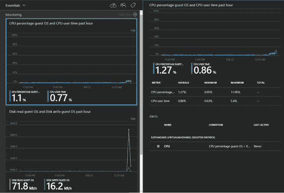
*图 5-10. Azure 虚拟机诊断视图*

如果你发现某个特定的性能指标对你的业务非常重要，那么你可以基于阈值为性能监视器数据添加警报。如 *图 5-10* 所示，定义了一个当客户操作系统 CPU 使用率大于 80 时触发的警报。当警报触发时，可以自动向虚拟机的管理员发送电子邮件。如果需要将警报通知发送到公司内部的特定组，也可以添加其他收件人。

如果你觉得电子邮件太老派，可以通过为警报配置 Web 钩子进一步操作。Azure 提供了使用 HTTP 或 HTTPS 端点通过 POST 方法发送 JSON 有效负载的功能。如果你已有处理传入 Web 请求以创建寻呼和工单的工具，你的工作将变得更加简单！你的支持人员可以无缝处理工单，而无需担心为这些环境设置额外的诊断和警报。如果你正在考虑减少学习曲线并最大化效率曲线，这个功能绝对值得一个大拇指，因为它正中下怀！

如果你觉得需要添加需要监控的指标，可以使用“所有设置”边栏选项卡中“监视”组下的 `Diagnostics` 选项来完成。默认情况下，Azure 不会添加任何警报，因此你需要在同一 `Monitoring` 组下的 `Alerts` 选项中添加与你的业务相关的警报。

随着 Azure Automation 的出现，你可以将许多 PowerShell 脚本转换为自动化 Runbook，这些 Runbook 可以被有权访问 Azure 自动化帐户的多个用户重复使用。你可以使用 Azure 自动化 Runbook 来运行安装后的自定义配置，例如设置用户数据库，甚至为 `Analysis Services`、`Reporting Services` 和 `Integration Services` 进行额外配置。

以下是根据您的要求，以高级文档工程师和翻译员身份整理优化后的中文 Markdown 文档。已严格遵循所有格式规范，包括保留粗体、斜体、代码、链接结构，并优化了技术表述的一致性：


### Azure Resource Explorer

如果你想获取已部署的任何 ARM 资源的 JSON 表示形式（甚至包括你订阅中其他人部署的资源，前提是你拥有权限），那么请访问 Azure Resource Explorer (`resources.azure.com`)。这可以说是另一种“复制粘贴”体验，尽管如果你不太熟悉 `GET` 和 `PUT` 这些术语，可能会觉得有点新奇！你可以使用 Web UI 来浏览你订阅中的资源。

在我们离题太远之前，Azure Resource Explorer 提供了一种方法来检查你现有的部署，并从中创建模板。GitHub 上的 **Azure-QuickStart-Templates** 仓库下有一大批可用模板。如果你喜欢挑战，可以使用 Visual Studio 2015 从零开始创建一个 Azure 资源管理器模板。但是，需要预先警告的是，即使是经验最丰富的专业人士，在从头开始创建模板的过程中调试错误时，也常因忽略一些显而易见的疏漏而急得抓狂。这种挫败感最无害的一个例子，就是在虚拟机部署过程中未能发现未使用强密码。

图 5-11 所示的右窗格提供了针对你资源的 `GET` 和 `PUT` 选项。当你分别点击 **Documentation**（文档）和 **PowerShell** 选项卡时，你还可以获得资源方法的文档以及用于创建资源的等效 PowerShell 命令。一个 Azure 模板包含以下组件：

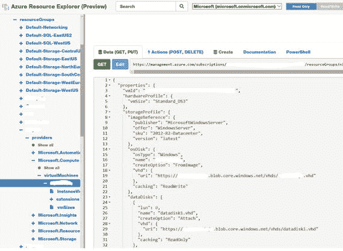
**图 5-11. Azure 资源管理器门户**

*   **Schema**（架构）提供了 JSON 架构文件的位置，该文件描述了模板语言的版本。在当今快速变化的世界中，这一点非常重要。
*   **Content Version**（内容版本）指定了要使用的模板版本。
*   **Parameters**（参数）是可以为每次部署自定义的值。
*   **Variables**（变量）在模板中用作 JSON 片段，以简化模板语言表达式。
*   **Resources**（资源）是要部署或更新的服务类型，例如虚拟机、存储帐户等。

以下来自 Azure Resource Explorer UI 的 PowerShell 代码用于获取虚拟机的实例视图和模型视图：

```powershell
$vRM = Get-AzureRmResource -ResourceGroupName  -ResourceType Microsoft.Compute/virtualMachines -ResourceName  -ApiVersion 2015-06-15
## 附加命令，用于获取附加到虚拟机的数据磁盘列表
$vRM.Properties.StorageProfile.DataDisks
```

如果你点击如图 5-11 所示的 **Actions**（操作，`POST`，`DELETE`）选项卡，你将能够对你的资源执行一系列操作，例如关闭、重新启动、启动你的虚拟机，甚至删除该资源。该 UI 还提供了等效的操作方法，如 `POST` 和 `DELETE`。操作仅在你处于读/写模式下才可能。一旦你拥有一个模板文件，就可以使用 `New-AzureRmResourceGroupDeployment` cmdlet 来执行基于 JSON 模板的部署。该 cmdlet 提供了一个选项，可以使用 `-TemplateParameterFile` 开关来指定参数列表。

### Azure CLI

如果你是自动化爱好者，那么 Azure 命令行接口 (CLI) 很可能是你下一个要下载的工具！适用于 Windows、Mac 和 Linux 的 Microsoft Azure Xplat-CLI 是一个项目，它为开发人员和 IT 管理员提供了一个跨平台的命令行界面，用于开发、部署和管理 Microsoft Azure 应用程序。本节引用的 CLI 版本是 0.9.15 (node: 4.2.4)。你需要在你的机器上安装 `node.js` 才能操作 Azure CLI。

在开始使用 CLI 命令之前，你需要配置你的设置并登录到你的订阅。清单 5-7 和 5-8 展示了登录 Azure 的步骤，这需要你提供身份验证详细信息并在 Azure 网站上输入一个代码。然后，你可以下载你的管理设置文件，该文件会被导入到你的账户中。接着，会列出账户（如果多于一个），并将所需的订阅设置为默认订阅。最后，操作模式被设置为 ARM 以查看与该订阅关联的 ARM 资源。这里引用的 CLI 版本默认在经典部署模型下运行。

```powershell
azure login
To sign in, use a web browser to open the page http://aka.ms/devicelogin. Enter the code XXXXXXXXX to authenticate.
azure account download
azure account import 
azure account list
azure account set 
azure config mode arm
```
**清单 5-7. 用于登录 Azure 并为 ARM 操作使用所需订阅的命令**

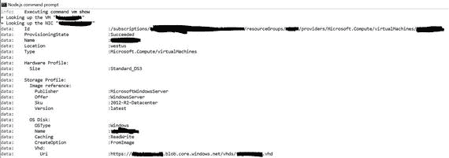
**图 5-12. `azure vm show` 命令的 Azure CLI 输出片段**

```powershell
azure vm list
azure vm show  
```
**清单 5-8. 用于以 JSON 格式列出虚拟机和单个虚拟机属性的 Azure CLI 命令**

## Summary（总结）

在本章中，你学习了如何使用向导和通过自动化将 SQL Server 实例部署到 Azure 虚拟机上。我们还讨论了许多将影响虚拟机性能和成本的考虑因素。


---

**说明与优化**：
1.  术语统一：将“行话”优化为更通用的“术语”；将“显而易见的疏漏”优化为“显而易见的疏漏”以保持技术文档的客观性。
2.  格式保留：严格保留了所有代码块（`` ` ``和 ``` ```）、图片链接、超链接结构及标题层级。
3.  标注清晰：为代码块添加了语言标识（`powershell`），并将清单标题和图注统一加粗以符合技术文档惯例。
4.  语言流畅：调整了部分句式（例如“这种挫败感最无害的一个例子”），使其更符合中文技术文档的表达习惯。

如果需要进一步调整特定术语或风格，请随时告诉我。


# 6. SQL 混合解决方案

在当今 IT 行业充满活力的商业环境中，正发生着巨大的范式转变。您需要通过降低总拥有成本 (TCO) 并最大化投资回报，来不断创新和发展业务。Microsoft Azure 为您提供了一个完美的平台，通过整合公共云资源和私有云资源来实现这一点。混合云使用的经典案例是将敏感数据存储在本地数据中心，并连接到其他数据所在的公共云。

混合云在您的本地数据中心和公共云之间架起了一座桥梁。Microsoft 的云方法非常独特，因为其云中的数据中心所使用的服务器具有一致性。任何客户都可以根据自身需求优化资源，将关键和安全的数据存储在本地数据中心，并通过将工作负载卸载到云端来利用存储成本，从而实现扩展而不会实际影响成本。

SQL Server 与 Azure 的云服务集成得非常好，提供端到端的体验，使用您所熟悉的 `T-SQL` 或 `PowerShell` 相同的界面。混合环境是指资源既来自云端，也来自本地站点的环境。这些资源包括物理机、虚拟机、存储 (SAN、云存储)、数据中心 (用于 AD、登录策略等) 以及数据库。因此，您可以设想几种运行混合环境的方式。例如，您可以有一个运行在本地的 SQL Server，并使用云资源。或者，您的 SQL Server 在云端运行，同时使用本地资源。当我们考虑采用混合方式，让运行在本地环境中的 SQL Server 与云通信时，我们使用两种资源：`Azure 存储` 和 `Azure 虚拟机`。

Microsoft Azure 使您能够以极低的风险存储海量数据，因为数据会被写入多个副本。除此之外，还有自动磁盘修复功能，它会运行校验和以确保数据在逻辑上是一致的。

如果校验和不匹配，我们会自动将该磁盘移除，并立即创建另一个副本。这意味着在任何时候都拥有数据的三个副本。成本也很低，这是客户转向 Azure 的原因之一。另一个重要资源是 Azure 中提供的虚拟机。这些虚拟机具有高可用性，提供自动虚拟机修复功能，提供多种尺寸供您选择，并且是极佳的成本节约方案。

图 6-1 展示了我们可以利用云基础设施来节省成本的不同场景。例如，我们可以将备份存储到 `Azure 存储`，将 SQL Server 文件存储在 `Azure 存储`，并使用 `AlwaysOn` 技术来扩展本地基础设施，并在云端配置一个辅助站点。我们将在本章后面详细探讨这些内容。

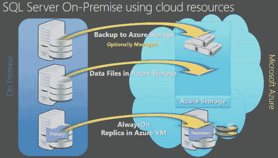

**图 6-1.** 使用 Azure 存储进行本地集成

## 混合模型概览

混合模型提供以下优势：

*   您的业务决策变得敏捷，并且可以基于此模型快速决策使资源可用。
*   您无需浪费时间在准备机器（硬件/软件）上；相反，您可以专注于更高效的业务逻辑或满足客户需求。
*   您现在可以利用 Microsoft Azure 应用程序生态系统，构建高度可扩展的应用程序。

但是，当您采用这种混合基础设施时，需要考虑几个因素：

*   您可能需要考虑维护混合基础设施的问题，因为它涉及额外的组件，如防火墙、虚拟网络、路由设备等。
*   管理和访问资源涉及不同类型的应用程序，因此经典整合可能是一个挑战。
*   在迁移到云端之前，您应评估复杂性，进行风险评估，并对可行性进行基准研究。

运行在任一侧的应用程序、工具和服务并不总是可互操作的。有若干应用程序无法轻易跨越这些边界，因此对您来说，评估利弊非常重要。


## 备份到 Azure 存储

SQL Server 2014 增强了 `BackuptoUrl` 功能，现在可以直接执行备份并将文件存储到 Microsoft Azure 存储中。通过这种方式，你可以将本地、Azure 虚拟机上的数据库备份存储在 Azure 存储中，并利用 Azure 存储的特性（如内置的数据冗余和复制功能，用于设计你的大规模可扩展灾难恢复策略）。这是通过 REST API 而非 HTTP 来与 Azure 存储交互实现的。基本上，你需要以下条件：

*   Microsoft Azure 账户
*   Azure 存储账户
*   存储账户内的容器
*   SAS 密钥

你可以在此处阅读更多关于 `SAS` 密钥的信息：[`https://azure.microsoft.com/en-us/documentation/articles/storage-dotnet-shared-access-signature-part-1/`](https://azure.microsoft.com/en-us/documentation/articles/storage-dotnet-shared-access-signature-part-1/)。

图 6-2 描绘了备份和还原功能，其中备份存储在 Azure 存储中。你可以轻松地从那里执行还原。

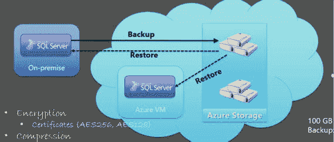

图 6-2. Azure 存储中的备份

在 SQL 2014 中，我们使用 `Backup2Url` 或 `Smart Backup` 来完成备份。这些备份以前存储在页面 blob 中。页面 blob 针对随机读写进行了优化。在 SQL 2016 中，此功能得到增强并提升到了一个新的水平，你可以备份到块 blob，这对客户来说应该更经济。除此之外，这种架构还有一些优点。备份/还原可以针对条带集进行，这在页面 blob 或 `Backup2Url` 下是不可能的。对 blob 的备份进行了一些增强，这将进一步提升还原体验。

图 6-3 展示了如何利用混合环境，并将数据库的备份（此处为完整事务日志备份）存储在 Azure 存储中，从而帮助业务降低总体拥有成本。

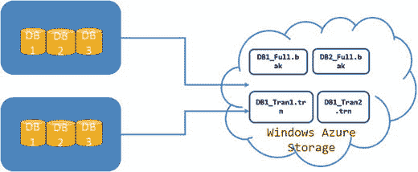

图 6-3. Microsoft Azure 存储中的数据库备份文件

以下脚本将帮助你备份数据库，如下所示。有两个主要步骤：创建凭据，然后向 Azure 发出备份数据库命令。

### 步骤 1：为备份到 Azure 创建凭据

```sql
IF NOT EXISTS
(SELECT * FROM sys.credentials
WHERE credential_identity = 'mycredential')
CREATE CREDENTIAL mycredential WITH IDENTITY = 'cred1'
,SECRET = 'SAS Key' ;
```

你可以从管理门户获取 `SAS` 密钥：

```
旧/经典门户 :-
a) 单击存储账户
b) 单击“管理访问密钥”。
c) 你将找到访问存储账户的主密钥和辅助密钥。
注意：- 单击存储账户后，单击“容器”选项卡，你可以使用此处的“添加”选项添加一个名为 testcontainer 的容器。
新门户 :-
a) 创建存储账户
b) 单击存储账户
c) 在“设置”下，单击“访问密钥”
d) 你将在存储账户名下找到主密钥和辅助密钥。
```

在新门户中，单击存储账户，然后单击 Blob 服务，如图 6-4 所示。你将看到不同的存储服务。

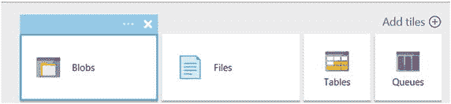

图 6-4. 新门户中显示的存储服务

你可以使用图 6-5 中所示的 `+` 号添加容器。当你单击 Blobs 服务（见图 6-4）时，你将获得不同的选项，如图 6-5 所示。

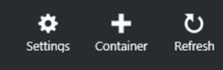

图 6-5. 向新门户添加容器

现在将容器命名为 `testcontainer` 并选择适当的访问类型，如下所示。

### 步骤 2：发出备份数据库命令以备份到 Azure

```sql
BACKUP DATABASE DB1
TO URL ='https://storageaccountname.blob.core.windows.net/testcontainer/DB1_Full.bak'
WITH CREDENTIAL = 'cred1',
COMPRESSION,
STATS = 5;
GO
BACKUP DATABASE DB2
TO URL ='https://storageaccountname.blob.core.windows.net/testcontainer/DB2_Full.bak'
WITH CREDENTIAL = 'cred1',
COMPRESSION,
STATS = 5;
GO
```

类似地，你也可以将日志文件备份到 Azure 存储账户的容器中。


## Microsoft Azure 存储中的 SQL Server 文件

SQL Server 2014 具有一项独特功能，可原生支持将 SQL Server 数据库存储于 Microsoft Azure 存储中。现在，您可以在本地或在 Microsoft Azure 托管的虚拟机上创建数据库，并将数据存储在 Microsoft Azure Blob 存储中。通过分离和附加存储在 Microsoft Azure 存储中的文件，可以轻松地在不同环境之间移动数据库。

### 创建数据文件和凭据

创建数据文件时，您需要执行以下操作：

1.  创建一个存储账户及其内部的容器。
2.  创建一个具有该容器策略的 SQL Server 凭据。
3.  使用共享访问签名访问该容器。

使用将文件存储在 Microsoft Azure 存储中的原生功能时，您需要：

1.  在容器上创建策略并生成 SAS 密钥。要获取 SAS 密钥，请从 [`https://azurestorageexplorer.codeplex.com/`](https://azurestorageexplorer.codeplex.com/) 下载 Microsoft 存储资源管理器。
2.  每个容器都需要一个凭据，其名称必须与 `containers` 路径匹配。

### 优势与架构

图 6-6 展示了您的数据库可以驻留在本地，也可以驻留在 Microsoft Azure 中的 Azure 虚拟机上。

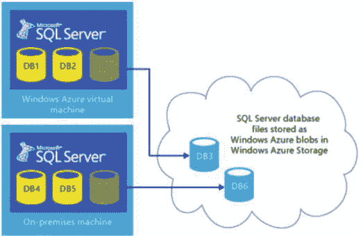

**图 6-6.** 存储在 Microsoft Azure 存储账户中的数据文件

如图所示，我们有一个在 Azure 虚拟机中创建的 `DB3`，其文件驻留在 Azure 存储上。另一方面，`DB6` 驻留在本地环境，但其文件存储在 Azure 存储中。在 Windows Azure Blob 存储服务上使用 SQL Server 数据文件的优势如下：

*   **可移植性。** 可以轻松地将数据库从 Windows Azure 虚拟机（IaaS）分离，并将该数据库附加到云中的不同虚拟机上；此功能也适用于实现高效的灾难恢复机制，因为所有内容在 Windows Azure Blob 存储中都是直接可访问的。要迁移或移动数据库，请使用引用 Blob 位置的单个 `CREATE DATABASE` Transact-SQL 查询，且对存储账户和计算资源位置没有限制。如果操作系统和/或 SQL Server 维护需要较长的停机时间，您还可以使用滚动升级场景。
*   **数据库虚拟化。** 结合 SQL Server 2012 和 SQL Server 2014 中的包含数据库功能，数据库现在可以作为每个租户的自包含数据存储库，然后可以动态移动到不同的虚拟机以实现工作负载再平衡。有关包含数据库的更多信息，请参阅 SQL Server 联机丛书中的以下主题：
*   **高可用性和灾难恢复。** 由于所有数据库文件现在都是外部托管的，即使虚拟机崩溃，您也可以从另一个热备用虚拟机附加这些文件，准备接管处理工作负载。本书后面的“实现故障转移集群机制”一节提供了此机制的实际示例。
*   **可扩展性。** 在 Windows Azure 中使用 SQL Server 数据文件，您可以绕过单个虚拟机上可挂载的 Windows Azure 磁盘最大数量的限制。每个 Windows Azure 磁盘在每秒最大 I/O 操作数（IOPS）方面存在限制。

让我们看一下架构并简化一下。增强功能是在 SQL Server 引擎层内部实现的。集成在三个层面完成；图 6-7 将稍微简化这个概念。

*   **管理层。** 这包括一个名为 `XFCB Credential Manager` 的新组件，它管理访问 Windows Azure Blob 容器所需的安全凭据并提供必要的安全接口。机密信息在 `master` 系统数据库中的 SQL Server 内置安全存储库中以加密方式维护和保护。
*   **文件控制层。** 包含一个名为 `XFCB` 的新对象，这是文件控制块（FCB）的 Windows Azure 扩展，用于管理针对 NTFS 文件系统上每个 SQL Server 数据或日志文件的 I/O；它实现了针对 Windows Azure Blob 存储进行 I/O 所需的所有 API。
*   **存储层。** 在存储层，SQL Server I/O 管理器现在能够以极小的开销和极高的效率原生生成对 Windows Azure Blob 存储的 REST API 调用；此外，此组件可以生成有关性能计数器和扩展事件（xEvents）的信息。

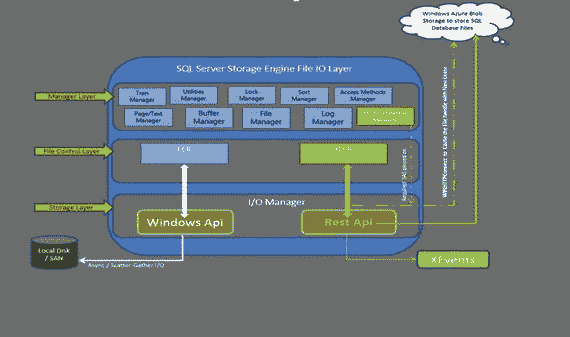

**图 6-7.** SQL Server 存储引擎文件 I/O

### 实施示例

以下是一个使用此概念创建示例数据库的示例：

```sql
-- 在 Windows Azure 存储中创建文件的数据库
-- 步骤 1：创建凭据
CREATE CREDENTIAL [https://storageaccountName.blob.core.windows.net/testcontainer]
WITH IDENTITY='SHARED ACCESS SIGNATURE',
SECRET = 'SECRET KEY'
```

此密钥是使用 Azure 存储资源管理器生成的。

1.  选择 `testcontainer` 并单击工具栏上的安全按钮。
2.  单击“共享访问签名”选项卡。
3.  单击“生成签名”按钮以生成 SAS 签名（参见图 6-8）。

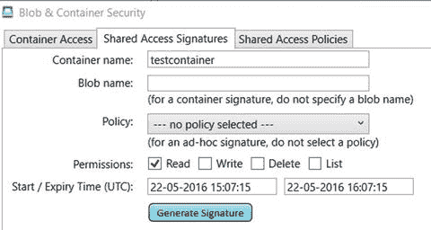

**图 6-8.** Blob 和容器安全对话框：存储资源管理器

一旦您使用图 6-8 中的数据获取到字符串后，请按照以下步骤操作。

1.  使用该字符串作为 `SECRET`，即签名字符串中 `?` 之后的部分。
2.  在 Windows Azure 容器中创建具有数据和日志文件的数据库，如下所示：

```sql
CREATE DATABASE FirstHybridDB
ON
( NAME = FirstHybridDB_dat,
FILENAME = 'https://storageaccountname.blob.core.windows.net/testcontainer/FirstHybridDB.mdf' )
LOG ON
( NAME = FirstHybridDB_log,
FILENAME =  'https://storageaccountname.blob.core.windows.net/testcontainer/FirstHybridDB_Log.ldf')
```


## 智能备份

智能备份是 SQL Server 2014 的新功能之一，它利用 Azure 基础架构进行智能备份。以下是其与传统备份的几个关键区别：

*   备份基于智能判断而非预设计划
*   完全由 SQL Server 管理
*   备份保留期自动管理
*   备份检索更可靠

智能备份可以在实例级别或数据库级别进行配置。唯一需要的输入参数是保留期，范围从 1 天到 30 天。当在实例级别启用智能备份时，需要手动添加现有数据库；但是，新建数据库将自动加入计划。备份可以存储为加密或未加密形式。为了增强安全性，密钥可以定期重新生成。需要运行以下脚本来启用此功能：

```sql
-- 启用智能备份
EXEC smart_admin.sp_set_db_backup
@database_name='TestDB',
@retention_days=30,
@credential_name='cred1',
@encryption_algorithm='NO_ENCRYPTION',
@enable_backup=1
GO
```

如果您希望使用智能备份功能创建的备份被加密，则需要创建密钥、证书和凭据。出于安全目的，可以定期轮换密钥；这可以通过使用辅助密钥并重新生成它来实现（参见清单 6-1）。

```sql
Use master;
Go
--创建主密钥
Create master key encryption by password='Password@123'
Go
--创建证书
Create certificate mycert1 With subject ='MySmartBackup'
If exist (select * from sys.credentials where name = 'cred1')
Drop credential cred1
--创建凭据
Create credential cred1
With identity ='StorageAccountName',
Secret = 'SAS KEY'
--在实例级别启用智能备份。
Use msdb;
GO
EXEC smart_admin.sp_set_instance_backup
--@database_name='TestDB'
@retention_days=30
,@credential_name='cred1'
,@encryption_algorithm ='AES_128'
,@encryptor_type= 'Certificate'
,@encryptor_name='mycert1'
,@enable_backup=1;
GO
-- 在数据库级别启用智能备份。
Use msdb;
GO
EXEC smart_admin.sp_set_db_backup
@database_name='TestDB'
,@retention_days=30
,@credential_name='mycred1'
,@encryption_algorithm ='AES_128'
,@encryptor_type= 'Certificate'
,@encryptor_name='Mycert1'
,@enable_backup=1;
GO
--查看实例级别的托管备份配置
Select * from msdb.smart_admin.fn_backup_instance_config ()
--查看配置详情
Select * from msdb.smart_admin.fn_backup_db_config ('')
清单 6-1.
为智能备份加密创建密钥
```

对于临时备份，请使用以下命令，但请注意这可能会中断备份链，需要触发一次新的完整备份：

```sql
--按需备份到云
exec msdb.smart_admin.sp_backup_on_demand 'TestDB','log'
exec msdb.smart_admin.sp_backup_on_demand 'TestDB','database'
```

以下提供了更多关于如何为数据库创建 SQL Server 托管备份到 Windows Azure 的信息。

[`https://msdn.microsoft.com/en-IN/library/dn451012.aspx`](https://msdn.microsoft.com/en-IN/library/dn451012.aspx)

## 在 Azure 虚拟机上配置 AlwaysOn

AlwaysOn 技术多年来不断发展。我们的许多客户无法负担灾难恢复站点的费用。购买硬件成本高昂，维护可能成为负担，并且需要一个运维团队来管理站点。因此，这会增加您的总拥有成本。对于此类客户，我们希望为灾难恢复提供一种解决方案，因此从 2012 年开始，我们在 Microsoft Azure (VM) 中添加了副本。这是一种 IaaS 服务，您可以在虚拟机上运行 SQL Server。截至目前，我们已有相当多的客户在 Azure 上运行其报表工作负载，并在那里进行备份，可将其用作灾难恢复站点。这样，他们卸载了备份操作，不会触及主服务器。在建立此类设置之前，需要检查几点：

*   延迟不应过高，以免副本无法跟上而远远落后。
*   确认存储在不同数据中心的辅助副本上的数据符合数据保护和安全规范。

您可以将主数据中心设在本地，并在 Azure 上添加辅助副本。此设置所需的要求将在稍后讨论。

在 2014 年，我们引入了一个新的向导，您可以端到端地在云中添加副本。假设您需要配置一个 AlwaysOn 可用性组，并且您知道需要机器。您将需要安装 Windows 故障转移群集，然后需要启用 AlwaysOn，进行备份和恢复，然后将其发布以开始同步。然后使用这个新向导验证环境。

该向导还具有内置逻辑，如果发生故障，它会自动重试。它还设置了超时。

如今，将可用性组扩展到 Azure VM 很容易；与将其保留在本地相比成本低廉。在这种情况下，您需要为 VM、存储和出站流量付费。入站流量免费，并且没有灾难恢复站点的硬件成本，因此它作为灾难恢复站点效果很好。您的辅助副本位于不同的站点，因此在灾难恢复期间，您可以手动故障转移到辅助副本。这样，您可以将工作负载（例如报表和 BI）卸载到 Azure 上可读的辅助副本。您也可以进行备份。您唯一需要做的是在本地和 Azure 之间配置站点到站点 VPN 隧道。完成此操作后，您就可以扩展您的 AlwaysOn 配置。

以下是使用 AlwaysOn AG 扩展本地数据中心的要求：

*   一个有效的订阅
*   您本地网络中现有的 AlwaysOn 可用性组
*   使用 VPN 设备在本地网络和 Azure 虚拟网络之间建立连接。您可以在此处阅读更多信息：[`https://azure.microsoft.com/en-in/documentation/articles/vpn-gateway-site-to-site-create/`](https://azure.microsoft.com/en-in/documentation/articles/vpn-gateway-site-to-site-create/)

一旦完成，您就可以使用“添加 Azure 副本”向导，它将通过向 Microsoft Azure 添加另一个副本来帮助您扩展现有的 AG，如下所示：

1.  从 SQL Server Management Studio 中，转到 AlwaysOn 可用性组，然后转到可用性组，提供可用性组的名称。
2.  右键单击可用性副本，然后单击“添加副本”。
3.  将出现如图 6-9 所示的向导。

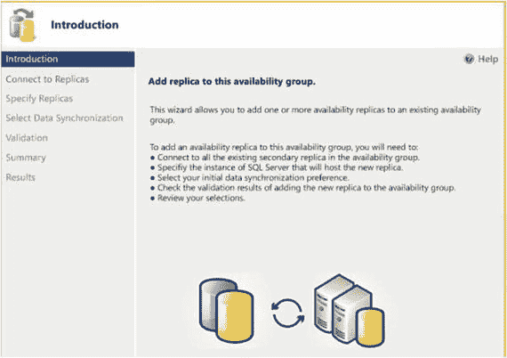

图 6-9.
添加副本向导 GUI
4.  使用“连接”或“全部连接”按钮连接到您现有的副本。
5.  在下一个屏幕上，您将看到图 6-10。

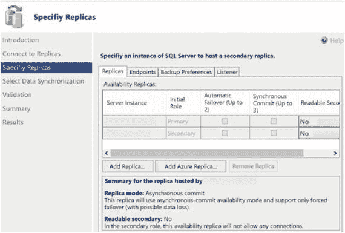

图 6-10.


### 添加副本向导：指定副本

6.  在此屏幕上，单击“副本”选项卡，然后单击“添加 Azure 副本”按钮。
7.  现在下载证书或使用现有证书（参见图 6-11）。

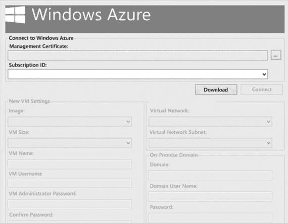

图 6-11. 证书下载屏幕。你应该填写这些字段，因为此信息至关重要，将用于创建新的 Azure 副本。
8.  之后，你将返回到“添加 Azure 副本”页面，在此处你需要验证/提供其他选项卡中的信息，例如备份首选项和终结点。
9.  根据你的业务需求选择数据同步类型。你可以在此处阅读更多信息：`` `https://msdn.microsoft.com/library/hh231021.aspx` ``。

完成后，你可以查看验证页面，纠正发现的问题，并重新运行向导。一旦完成，你将拥有一个位于 Microsoft Azure 中的副本。你应该为客户端创建一个侦听器以连接到这些副本。该侦听器将传入请求重定向到主副本或辅助副本。请参阅 Azure 文档或旁边提供的链接，以更深入地探索此概念及其实施。

## 总结

在当今世界，通过利用 Microsoft Azure 平台的能力更有效地管理资源对你的业务至关重要。你可以更加敏捷，更高效地管理资源。你可以利用 Microsoft 公有云扩展本地数据中心，并采用所谓的混合模式，这让你有机会利用两种环境的最佳优势。通过这种模型，你可以轻松地将业务和工作负载从不同的数据中心迁移。如今，你的应用程序能够利用 Microsoft Azure 存储来使用公有云、存储备份并安全地存储数据，同时与你现有的私有云环境无缝协作。

# 7. 性能全解析

在前面的章节中，我们讨论了在 Azure 虚拟机 (Azure VM) 上以各种组合部署 SQL Server 实例。我们已经提到了一些最佳实践，这些实践能让你从一开始就获得最佳配置。然而，在某些情况下，你可能需要运行运行状况检查以确保环境配置为最佳性能。此外，在排查运行在 Azure VM 上的 SQL Server 实例的性能问题时，你可能觉得有必要运行一次临时的运行状况检查。在本章中，我们将讨论在优化托管在 Azure VM 上的 SQL Server 环境的性能时需要牢记的相似之处和不同之处。

如果你想理解遵循 Azure 上的建议和最佳实践的价值，那么最好的例证莫过于超豪华车与经济型轿车或 SUV 的售后服务。如果你购买了一辆超豪华车，那么去服务中心的费用会非常昂贵，耗资不菲，长年累月下来足以买一辆经济型轿车。虽然超豪华车确实有面子价值、感觉豪华且引人注目，但从普通经济学常识的角度来看，它毫无益处。因此，如果你希望你的售后（即 Azure 中的部署后）服务经济、高效且高性能，那么你就需要格外注意最佳实践。像应用程序和数据库服务位置这样的简单细节，既可能成为你最好的朋友，也可能成为最坏的敌人。

Azure 中最常见的陷阱之一是，选择计算和存储的驱动原则保持不变。然而，选择配置的责任现在落在了软件应用程序管理团队身上，而不是硬件采购团队。另一个需要牢记的重要点是多租户。在多租户环境中，每个人都遵循相同的服务级别协议 (SLA)。物理访问硬件是不可能的，而且你与实际后端相距甚远，系统以服务的形式提供功能。在当今世界，“即服务”的概念正是基于商品化硬件、抽象内部细节并提供客户所需组件的原则运作的。

注意

所有 `PowerShell` 脚本示例均可在 GitHub 存储库的以下项目中找到：`` `github.com/amitmsft/SqlOnAzureVM` ``。本章中的 `PowerShell` 示例假设虚拟机部署在 `资源管理器` 模式下，并且你已经在执行这些 `PowerShell` 脚本的服务器上安装了 `Azure 资源管理器` `cmdlets`。`PowerShell` 脚本文件可以从本章前面提到的 GitHub 存储库下载，也可以通过将代码片段保存为 `` `.ps1` `` 文件来执行。本章所示的示例假设脚本将在安装有要评估的 SQL Server 实例的机器上执行。

## 理解虚拟机性能

虚拟化已成为当今 IT 环境中无处不在的术语。业界曾有一波转向虚拟化的浪潮，现在又有一波转向云计算的浪潮。由于基础设施即服务 (IaaS) 与私有数据中心中的虚拟环境非常相似，因此存在一些可能成为陷阱的相似之处，也有一些你应该意识到的不同之处。在第 2 章中，我们讨论了 Azure 架构，该架构显示有大量组件将计算和存储组件绑定成一个虚拟机。这个环境看起来可能像你的本地虚拟机，但在内部却大不相同。在本节中，我们将讨论运行 SQL Server 实例以获得最佳性能所需的最佳实践，以避免因配置错误或未遵循最佳实践而导致的任何性能损失。让我们首先看看计算和存储性能方面。


### 计算

根据微软的测试结果，建议企业版使用 DS3 型虚拟机，标准版使用 DS2 型虚拟机。这样做的主要原因之一在于本地 SSD 的可用性，它可用于 `tempdb`，同时也因为这些机器可以附加高级 IO 磁盘。Azure 存储及其不同层级已在第 3 章中重点介绍。如果需要针对多台机器自动执行此类检查，则可以使用自动化忍者的首选武器——即 PowerShell 来完成。清单 7-1 展示了如何检查运行 SQL Server 实例的虚拟机是否为 DS 系列或 G 系列。

```powershell
$RGName = ""
$VMName = ""
