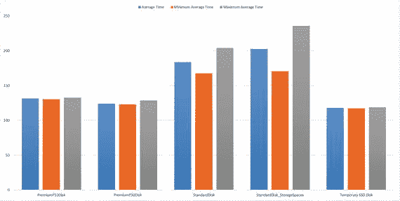

# Find out the OS Drive
$Name = Get-WmiObject -Class Win32_DiskDrive -Filter "InterfaceType = `"IDE`" and SCSITargetId = 0" | Select-Object PAth
$Dependent = Get-WmiObject -Class Win32_DiskDriveToDiskPartition | Where-Object {$_.Antecedent -contains $Name.Path} | Select-Object Dependent
$OSDrive = (Get-WmiObject -Class Win32_LogicalDiskToPartition | Where-Object {$_.Antecedent -eq $Dependent.Dependent} | Select-Object Dependent).Dependent.Split("`"")[1]
foreach ($drive in $sqlDrives)
{
if ($drive.drive -eq $OSDrive)
{
Write-Host "[ERR] Database files found on OS drive" -ForegroundColor Red
$RulePass = 0
}
}
if ($RulePass -eq 1)
{
Write-Host "[INFO] No database files found on OS drive" -ForegroundColor Green
}
```
**清单 7-3.** 用于测试是否有任何数据库文件托管在操作系统 (`C:`) 驱动器上的 PowerShell 脚本

Microsoft 团队在运行于 Azure 虚拟机上的 SQL Server 上测试了各种工作负载，关于磁盘配置的结论如下（假设你使用的是高级 IO）：

*   在托管数据文件和 `tempdb` 的数据磁盘上启用读取缓存。这允许为后续读取缓存读写操作。写入操作会直接持久化到 Azure 存储，以防止数据丢失或损坏，同时仍能启用读取缓存。对于事务性工作负载，这非常有益。
*   对于将托管事务日志文件的数据磁盘，禁用读取缓存。这将完全绕过缓存。所有磁盘传输都直接针对 Azure 存储完成。此缓存设置可防止物理主机本地磁盘成为瓶颈。这是本地磁盘的一个常见问题，当事务日志刷新量很高时，表现为 `WRITELOG` 或其他 I/O 相关等待。在事务提交导致的日志刷新率非常高的场景中，此配置设置性能极佳。
*   临时磁盘（通常是 D: 驱动器）的某些层级具有本地连接的 SSD。此类磁盘可用于托管 `tempdb` 或缓冲池扩展。缓冲池扩展是 SQL Server 2014 中添加的一项功能，它将非易失性存储作为 SQL Server 缓冲池的扩展。有关检查临时驱动器是否托管除 `tempdb` 之外的数据库文件的代码示例，请参见清单 7-5。
*   使用推荐的分配大小（64KB）格式化数据磁盘。这对于 OLTP 工作负载性能尤其有益。（参见清单 7-4。）

许多部署因性能问题向 Microsoft 提起了支持事件，这些事件被归因于未遵循这些最佳实践。

```powershell
function global:Split-Result()
{
param
(
[parameter(ValueFromPipeline=$true,
Mandatory=$true)]
[Array]$MATCHRESULT
)
process
{
$ReturnData=NEW-OBJECT PSOBJECT –property @{Title=”;Value=”}
$DATA=$Matchresult[0].tostring().split(":")
$ReturnData.Title=$Data[0].trim()
$ReturnData.Value=$Data[1].trim()
Return $ReturnData
}
}
$LogicalDisks = Get-WmiObject -Query "select * from Win32_LogicalDisk Where MediaType = 12" | Select Name, MediaType, FileSystem, Size
foreach ($disk in $LogicalDisks)
{
$Drive = $disk.Name + "\"
$RESULTS=(fsutil fsinfo ntfsinfo $Drive)
$AllocSize = $Results | Split-Result | Select-Object Title,Value | Where-Object {$_.Title -eq "Bytes Per Cluster"}
if ($AllocSize.Value -eq 65536)
{
Write-Host "Allocation size for " $Drive " = " $AllocSize.Value " bytes" -ForegroundColor Green
}
else
{
Write-Host "Allocation size for " $Drive " = " $AllocSize.Value " bytes (Recommendation is 64K)" -ForegroundColor Red
}
}
```
**清单 7-4.** 用于检查分配单元大小是否设置为 64KB 的 PowerShell 代码

如果你不使用高级 IO（标准 IO），则应在所有数据磁盘上禁用缓存。对于生产场景，建议使用高级 IO，因为它专为处理并行、高队列深度的 IO 工作负载而构建。具有高度并发和 I/O 密集型工作负载的应用程序将看到持续的高性能吞吐量。

请记住，测试效果仅与测试环境相当。在低能力硬件上进行基准测试会得到低基准值，同样，在低层级 Azure 虚拟机上进行基准测试会提供不准确的瓶颈和基准数字。Azure 的美妙之处在于，你可以在测试完成后立即关闭测试环境，这让你可以在不影响测试质量的情况下关注月度账单。同时，你可以以远低于本地部署成本的价格维护生产环境的副本。

**注意**

在临时驱动器上托管任何其他数据库文件将导致机器关闭后这些数据库文件被彻底清除。在临时驱动器上托管除 `tempdb` 之外的数据库文件是更新 DBA 简历的一种非常快速且行之有效的方法！


# 优化 Azure VM 上的 SQL Server 性能

```
$RulePass = 1
$sqlquery = "select distinct substring(physical_name,1,2) as drive,db_name(database_id) as dbname, name, physical_name from sys.master_files where substring(physical_name,2,1) = ':'"
$sqlDrives = Invoke-Sqlcmd -ServerInstance $sqlserver -Query $sqlquery
$Files = $sqlDrives | Where-Object {$_.drive -eq $TempDrive -and $_.dbname -ne "tempdb"}
foreach ($file in $Files)
{
    Write-Host "[ERR] Database file" $file.name "(physical file:" $file.physical_name ") for database" $file.dbname "is hosted on the temporary drive" -ForegroundColor Red
    $RulePass = 0
}
if ($RulePass -eq 1)
{
    Write-Host "[INFO] No files found on the temporary drive" $TempDrive -ForegroundColor Green
}
else
{
    Write-Host "[ERR] Any data stored on" $TempDrive "drive is SUBJECT TO LOSS and THERE IS NO WAY TO RECOVER IT." -ForegroundColor Red
    Write-Host "[ERR] Please do not use this disk for storing any personal or application data." -ForegroundColor Red
}
```
清单 7-5. 检查文件是否托管在临时驱动器上的 PowerShell 代码

### 存储空间

存储空间是在虚拟机预配过程中常用的配置模式。如果您的指定设置需要多个磁盘，最新的库映像模板会在所有磁盘上创建一个 Windows 存储空间（虚拟驱动器）。您可能会思考是否有必要使配置复杂化。许多本地托管的数据库具有单个数据库文件，无法轻易拆分为多个文件。这可能是由于缺乏分区数据，这可能导致单个文件成为热点。

如果您使用的是 Windows Server 2012 或更高版本，可以使用存储空间将两个或更多驱动器分组到存储池中，然后使用该池中的容量创建称为存储空间的虚拟驱动器。Windows 的此功能使您无需将数据库拆分为多个文件。但是，需要注意一些问题。

第一个需要记住的问题是正确配置存储池的列数。增加列数可以显著提高顺序工作负载的性能。随机工作负载的性能提升不那么显著，在不同列数下表现出更均匀的性能。与空间的列数直接相关的另一个因素是未完成的 IO 量或要从存储空间读取或写入的数据量。大量的列数有利于生成足够负载以饱和多个磁盘的应用程序，但会对需求较低的应用程序引入不必要的容量扩展限制。如果数据磁盘超过八个，则需要使用 PowerShell 脚本来适当调整列数，如清单 7-6 所示。

第二个需要记住的问题是弹性设置。存储空间提供三种弹性设置：简单、奇偶校验和镜像。如果您选择镜像，您的数据磁盘将对 SQL Server 实例生成的单个 IO 执行两个 IO 操作。建议使用镜像来提高弹性，但这会消耗您在 Azure 上的 IO 带宽。如果您只关心保护虚拟机免受磁盘故障的影响，这已经由 Azure 存储在后台完成（详见第 3 章），其中默认创建了承载数据文件的 blob 的冗余副本。

```
New-VirtualDisk -StoragePoolFriendlyName CompanyData -FriendlyName BusinessCritical -ResiliencySettingName simple -Size 1TB -ProvisioningType Thin -NumberOfColumns 2 -Interleave 65536
```
清单 7-6. 创建具有 2 个列数和简单弹性设置的虚拟磁盘存储池的 PowerShell 脚本示例

### Tempdb

SQL Server 的临时数据库一直是优化不佳的查询的受害者，这些查询将操作溢出到 `tempdb`。困扰 `tempdb` 的性能问题并非 Azure VM 独有的问题。如果配置不当，`tempdb` 性能是持续的头痛之源。为确保您的 `tempdb` 保持良好状态，请启用 `trace flag 1118 (-T1118)` 以防止并发线程在创建临时对象期间发生资源分配争用。

增加 `tempdb` 中的数据文件数量以最大化磁盘带宽并减少分配结构中的争用是一个好主意。一般规则是，如果逻辑处理器的数量小于或等于八，则使用与逻辑处理器相同数量的数据文件。如果逻辑处理器的数量大于八，则使用八个数据文件。如果争用持续存在，则将数据文件数量增加四的倍数（最多为逻辑处理器的数量），直到争用降至可接受的水平，或者对工作负载/代码进行更改。如果虚拟机的临时驱动器是 SSD，建议将 `tempdb` 托管在临时磁盘上以提高性能吞吐量。

图 7-1 清楚地表明，当 `tempdb` 托管在标准磁盘上时，性能不稳定，并且某些 IO 的延迟可能非常高。这将导致性能不稳定，这对于关键任务或关键业务工作负载来说是难以接受的。当将 `tempdb` 托管在 SSD 或高级 IO 磁盘上时，性能是稳定的，偏差可以忽略不计。


图 7-1. SSD、高级 IO 和标准磁盘上的 `tempdb` 性能比较

总之，如果您的应用程序需要一致的 `tempdb` 性能，选择 SSD 或高级 IO 是最佳选择。

### 数据库设置

前面的部分详细介绍了了解 IO 模式和所需 IO 带宽如何帮助您以正确的配置部署 Azure VM。这反过来又能让您获得最佳的性价比！还有一些数据库级别的设置有助于优化良好的性能吞吐量。

数据库页面压缩有助于减少 IO，这对于所有环境都是正确的，但在 Azure 中，它肯定有助于提高通信密集型系统的性能。

如果您热衷于阅读博客，您会看到多位 SQL Server 专业人士不鼓励在数据库上使用自动收缩和自动关闭；对于托管在 Azure VM 上的 SQL Server 实例中的数据库也是如此。清单 7-7 展示了如何确定任何托管在 SQL Server 实例上的数据库是否启用了 `AUTO CLOSE` 和 `AUTO SHRINK`。

```
$RulePass = 1
$sqlquery = "select name, is_auto_shrink_on, is_auto_close_on from sys.databases"
