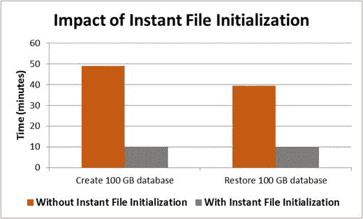

# 针对 SQL Server 实例执行查询
$lpim = Invoke-Sqlcmd -ServerInstance $sqlserver -Query $sqlquery
if ($lpim.locked_page_allocations_kb -eq "0")
{
Write-Host "[WARN] 未将 Lock Pages in Memory 安全权限授予 SQL Server 服务账户" -ForegroundColor Red
$RulePass = 0
}
if ($RulePass -eq 1)
{
Write-Host "[INFO] 已将 Lock Pages in Memory 安全权限授予 SQL Server 服务账户" -ForegroundColor Green
}
```
**清单 7-8.** 用于确定是否将内存锁定权限授予 SQL Server 服务账户的 PowerShell 脚本

另一个容易获得的性能提升是将“性能卷维护任务”安全权限授予 SQL Server 服务账户。当 SQL Server 服务账户拥有此权限时，它允许 SQL Server 执行即时文件初始化。这使得 SQL Server 能够创建数据文件而无需将页面清零。如果您没有任何安全合规性要求禁止此操作，则应考虑将此安全权限授予 SQL Server 服务账户。没有此权限，创建数据库文件所需时间可能长达 10 倍！图 7-2 说明了拥有和没有此权限时的差异。此类演示最好留给本书，不应在生产环境中进行测定。清单 7-9 展示了如何确定 SQL Server 服务账户是否拥有为数据文件执行即时文件初始化的权限。它适用于任何 SQL Server 实例。



**图 7-2.** 即时文件初始化对性能的影响

```
