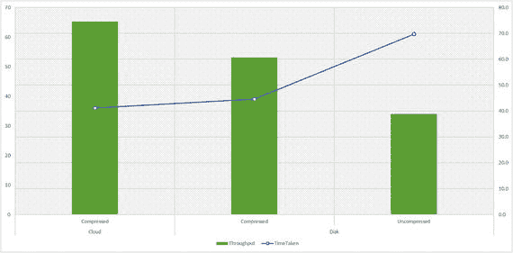

# 找出 SQL 服务账户 SID 是否存在于输出中
if ($IFI.ToString().Contains($strSID.Value))
{
Write-Host "[INFO] SQL Server 服务账户 ["$servcice.StartName"] 拥有 'Perform Volume Maintenance Task' 安全权限" -ForegroundColor Green
}
else
{
Write-Host "[ERR] SQL Server 服务账户 ["$servcice.StartName"] 未拥有 'Perform Volume Maintenance Task' 安全权限" -ForegroundColor Red
}
}
```
**清单 7-9.** 用于确定 SQL 服务账户是否具备执行即时文件初始化能力的 PowerShell 脚本

要利用即时文件初始化，您需要授予 SQL Server 服务账户 `SE_MANAGE_VOLUME_NAME` 权限，并将其添加到“执行卷维护任务”安全策略中。将 SQL Server 服务账户添加到“执行卷维护任务”安全策略后，请重新启动 SQL Server 服务。

### 备份

最常见的 DBA 任务之一是确保数据得到备份并免受任何灾难的破坏。保护数据是神圣的职责，没有 DBA 可以推脱。不过，在 Azure VM 上备份数据库的技术略有不同。

配置数据库备份时，最好使用 SQL Server 的“备份到 URL”功能（在 SQL Server 2012 Service Pack 1 累积更新 2 或更高版本、SQL Server 2014 或 SQL Server 2016 中可用），因为它可以直接备份到 Azure Blob 存储。这并非在本地数据中心通常配置的方式，但对于你的 Azure VM 来说是个简单的选择。另一个要记住的技巧是使用 SQL Server 中可用的备份压缩功能。这减少了虚拟机与 Blob 存储之间传输的网络字节数。

图 7-3 显示了压缩备份到 Blob 存储（表示为云）与未压缩备份到磁盘相比，在吞吐量和时间上存在显著差异。


图 7-3. 备份到磁盘与备份到 Blob 存储的性能比较

瞥一眼图 7-3 可能会让你疑惑：如果有专门为此创建的备份数据磁盘，为什么还需要改变备份到它的习惯？在 Azure VM 上，主要原因是备份到磁盘会消耗你的数据磁盘和存储账户的 IOPS，而这些是有阈值的。如果可以避免，你不想消耗这种宝贵的资源，尤其是在高性能环境中。如果你同时将多个数据库备份到一个数据磁盘，你可能很快就会达到磁盘吞吐量阈值。如果你使用高级 IO 磁盘进行备份，这不会是资源的最佳利用，并且从成本效益分析来看是反直觉的！清单 7-10 展示了如何确定数据库备份是否存储在 Azure 磁盘上。

```powershell
$sqlquery = "if exists (select TOP 1 physical_device_name from msdb.dbo.backupmediafamily where physical_device_name not like 'http%')
select 'Disk' as Result
else
select 'Blob' as Result"
