# 检查备份是否被压缩
if ($backups.Result -eq "Uncompressed")
{
    Write-Host "[警告] 此实例正在执行未压缩的备份" -ForegroundColor Red
    $RulePass = 0
}
if ($RulePass -eq 1)
{
    Write-Host "[信息] 所有数据库备份均使用备份压缩" -ForegroundColor Green
}
```
清单 7-10. 用于检查 SQL Server 实例是否对 Azure Blob 执行了压缩备份的 PowerShell 脚本

### Azure Blobs 上的数据文件

SQL Server 2014 及以上版本支持一个选项，可以将数据库文件直接存储在 Azure Blob 上。既然我们在上一节已经谈到了改变习惯，花点时间了解一下这个功能可能是值得的。这个功能不仅让你免于需要附加额外的数据磁盘，还允许你利用 Azure Blob 无限的存储容量。此功能适用于运行在本地环境或 Azure VM 上的 SQL Server 实例。使用 Azure Blob 上的数据文件使你免于受限于数据磁盘或一组数据磁盘的 IOPS 限制。特别是在非生产环境中，这是在不影响性能或不损害 IO 性能一致性的情况下降低成本的好方法。这避免了为你的测试环境使用高级 IO 磁盘的需要。

图 7-4 说明了在 Azure Blob 上托管数据库文件的概念。

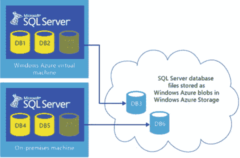
图 7-4. Azure Blob 上的 SQL Server 数据库文件

关于 SQL Server 如何在 Azure Blob 上存储这些文件的讨论超出了范围，但理解此功能的额外好处很重要。当使用 SQL Server 2016 将数据文件托管在 Azure Blob 上时，你可以选择利用 SQL Server 文件快照备份。它使用 Azure 快照为使用 Azure Blob 存储服务存储的数据库文件提供近乎即时的备份和更快的还原。文件快照备份（参见图 7-5）由包含数据库文件的 Blob 的一组 Azure 快照，加上一个指向这些文件快照的备份文件组成。想想 SAN 快照！每个文件快照都与基础 Blob 存储在同一容器中。你可以指定备份文件本身写入 URL、磁盘或磁带。但是，建议备份到 URL。有关示例，请参见清单 7-11。

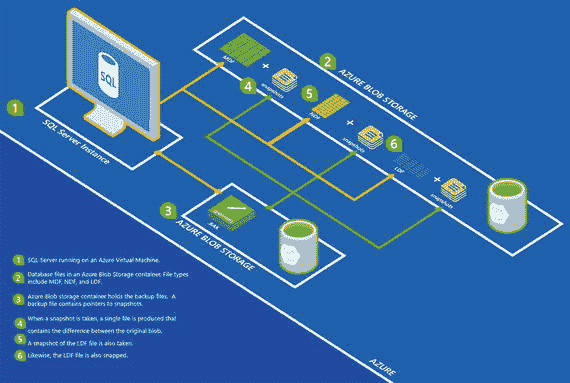
图 7-5. 使用 Azure Blob 存储数据文件的 SQL Server 数据库文件快照备份

```sql
BACKUP DATABASE AdventureWorks2016
TO URL = 'https://<account>.blob.core.windows.net/<container>/AdventureWorks2016.bak'
WITH FILE_SNAPSHOT;
```
清单 7-11. 文件快照备份的 Transact-SQL 示例

如你所见，将数据文件存储在 Azure Blob 上并使用文件快照备份极大地简化了你的存储、备份和还原方案！


### 监控

既然我们讨论到了改掉旧习惯这个话题，那么有一点很重要需要指出：您在本地或虚拟化 SQL Server 实例上习惯使用的几乎所有数据收集和分析工具，在 Azure VM 上托管的 SQL Server 实例中，其工作方式都大致相似。在接下来的几页中，您将熟悉 Azure 为运行在 Azure VM 上的 SQL Server 提供的新的监控功能。

作为 DBA，您可能面临的最常见的问题之一是如何监控运行在 Azure VM 上的 SQL Server 实例的性能。最简单的答案之一就是使用 Azure 门户。图 7-6 展示了在虚拟机登陆页面上可用的一组自定义磁贴。您可以将图 7-6 中所见视图中的组和磁贴添加进来。

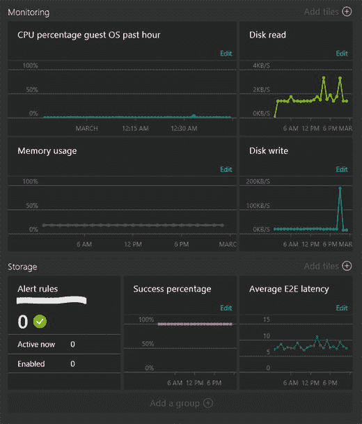

图 7-6. Azure 门户监控仪表板

门户允许您在各种可捕获的性能监视器计数器上配置警报。图 7-7 展示了为特定机器配置的警报规则，以及当警报条件满足时可执行的操作。可以为虚拟机配置大量常见的警报——例如磁盘、CPU、内存、网络以及与 SQL 性能计数器相关的阈值。要使 SQL 性能指标可用，您必须在“诊断”选项卡下启用收集 SQL 指标（参见图 7-7）。这也可以在配置过程中完成，相关说明在第 5 章中。

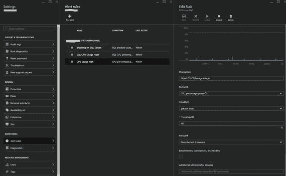

图 7-7. 为虚拟机配置基于性能的警报

如果您想采用工厂化方法为大量虚拟机设置警报，可以使用预置脚本通过`Add-AlertRule` cmdlet 来实现。对警报的响应可以是一封电子邮件，和/或将警报发布到 Web 挂钩，由后者进一步处理警报。

### 操作见解

一些最佳实践检查是任何 SQL Server 实例通用的，与其位置无关。既然我们正在讨论托管在 Azure 虚拟机上的 SQL Server 实例，这或许是一个审慎的机会来讨论`Operational Insights`，它同时适用于本地和 Azure 虚拟机。

`Operational Insights`是 Microsoft 操作管理套件的一部分，是一个为 IT 运营团队量身定制的软件即服务解决方案。这项服务利用 Azure 的强大功能，从任何数据中心或云的、几乎任何 Windows Server 和 Linux 来源收集、存储和分析日志数据，并将这些数据转化为实时的操作情报，帮助您做出更明智的决策。

图 7-8 展示了 Azure 操作见解仪表板。该服务提供了许多其他高价值的益处，例如启用变更跟踪、容量规划、恶意软件评估等，这些作为解决方案显示在“解决方案库”中。尽管详细介绍库中所有可用的解决方案超出了本章的范围，但探索库中的解决方案是值得的，即使对于 SQL Server 环境也是如此！

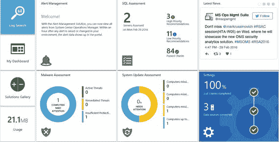

图 7-8. 显示已启用解决方案的 Azure 操作见解主页

要开始使用`Operational Insights`，您需要下载一个代理程序，该程序必须安装并使用工作区 ID 和存储密钥进行配置，代理将使用这些信息将数据上传到 Azure。配置好代理后，您的首要任务是启用 SQL 评估解决方案。这提供了大量检查项，归类在以下标题下：

*   安全与合规
*   可用性与业务连续性
*   性能与可扩展性
*   升级、迁移和部署
*   操作与监控
*   变更和配置管理

根据收集到的数据，您的 SQL Server 实例可能不会在某些类别中报告问题，而在其他类别中则可能显示较多的红色（警告）！图 7-9 展示了对不同评估领域的高低优先级建议。

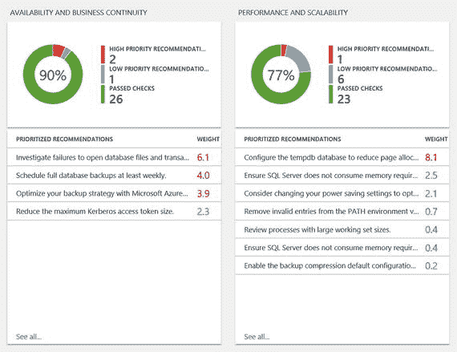

图 7-9. SQL 评估显示在不同领域识别出的问题

这些磁贴具有额外的钻取功能，允许您获取附加信息，例如报告问题的 SQL Server 实例、受影响对象的名称以及所报告问题的补充阅读材料。您甚至会获得针对所报告问题的建议纠正措施，如图 7-10 所示。

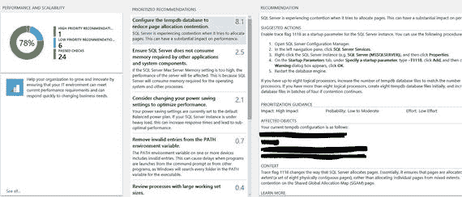

图 7-10. Azure 操作见解报告的性能问题详细信息

SQL 评估会检查本章前面讨论的许多部署后的性能注意事项，例如 tempdb 配置。此服务有一个免费层级，保留期为七天，每日限额为 500MB。如果您想处理更多数据并具有更长的保留期，特别是对于大量实例，您可能需要为`Operational Insights`使用付费层级。

### 速查表

如果您觉得这些信息在短时间内难以消化，这里有一份速查表，可以作为设置托管 SQL Server 的虚拟机的快速参考。

1.  为企业版选择至少 DS3，为标准版选择 DS2。如果您有高网络带宽需求，可能需要选择更高的虚拟机层级。
2.  对于高性能工作负载使用高级存储，并确保计算和存储位于同一区域。
3.  为存储账户禁用异地复制。
4.  如有必要，使用单独的 P30 磁盘来存放数据、日志和 tempdb 文件，分配单元大小设为 64K。不要将数据和日志文件放在同一驱动器上。在必要时创建存储池。
5.  使用高级存储时，为数据和 tempdb 数据磁盘启用读取缓存，为存放日志文件的数据磁盘不启用缓存。对于标准数据磁盘，不要启用缓存。
6.  为数据库禁用`AUTO CLOSE`和`AUTO SHRINK`，并尽可能防止自动增长。
7.  授予 SQL Server 服务账户以下安全特权：锁定内存中的页和性能卷维护任务（即时文件初始化）。
8.  执行压缩的数据库备份到 Azure Blob。

### 本章小结

本章解释了在 Azure 虚拟机上运行 SQL Server 实例时需要遵循的最佳实践和建议。我们还探讨了 Azure 门户、Azure 服务和 PowerShell 中可用的选项，用于验证运行 SQL Server 的环境是否已落实性能最佳实践和建议。标准诊断数据收集技术适用于 Azure 虚拟机，但利用混合的、支持云的新选项以及新门户提供的挂钩功能，使工作变得容易得多。

当您运行 GitHub 仓库(`SqlOnAzureVM`)中提供的最佳实践检查时，您将看到图 7-11 所示的输出。

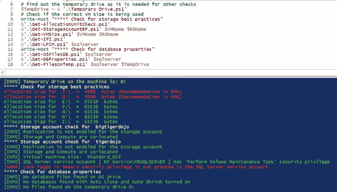

图 7-11. 在托管 SQL Server 的 Azure 虚拟机上执行最佳实践检查的结果


# 8. Azure SQL Database

Microsoft Azure SQL Database 是 Microsoft Azure 中基于 Microsoft SQL Server 引擎的关系数据库服务，具备 SQL Server 几乎所有的关键任务功能。Windows Azure SQL Database 旨在提供高可用性、可扩展的数据库即服务，并具有可预测的性能、业务连续性和数据保护能力。SQL Database 是一种平台即服务产品，它需要的管理开销极少，并且可以显著减少需要数据库后端支持的应用程序的上市时间。由于该服务基于 SQL Server 引擎，它与大多数可用的 SQL Server 工具和 API 兼容，从而简化了将现有应用程序迁移到 Azure 的过程。

在本章中，我们将了解 Azure SQL Database 的内部架构，以及 Windows Azure Fabric 如何在 Azure SQL Database 的管理和运作中扮演重要角色。我们将学习 Azure SQL Database 提供的各种服务层级和性能级别，以及可用于管理 Azure SQL 数据库的管理功能或选项。

我们还将学习可用于将本地数据库迁移到 Azure SQL 数据库的不同技术。

## SQL Database 架构

Azure SQL Database 构建于 Windows Azure 框架之上，该框架提供机器管理和分布式应用程序功能。一个 SQL Azure 集群由一个控制环和一个或多个租户环组成。在 Windows Fabric 术语中，每个环相当于一个物理 Windows Azure 集群，该集群由运行一个或多个应用程序的节点集合组成。环内的每个应用程序包含一个或多个服务。

### 租户环

Windows Fabric 中的租户环实际上就是一个物理 Windows Azure 集群，集群的每个节点都设计为运行一个应用程序。在此情况下，运行的应用程序类型为 `DBService`，它基本上是一个 `SQL Server Executable` 服务或 `Hekaton`（内存 OLTP）引擎服务。每个 `DBService` 应用程序都绑定到自己的内存、CPU 和 IO。

当客户预配 Azure SQL Database 时，他们会创建一个逻辑服务器（如果尚不存在）和一个数据库。实际上，他们是在后端创建了一个 `DBService`（或 `DBSvc`）。这个 `DBService` 应用程序运行在 Windows Azure 集群的某个节点上。`DBService` 可以使用虚拟机（或主机）上的本地存储以及远程存储来存储数据库（参见图 8-1）。

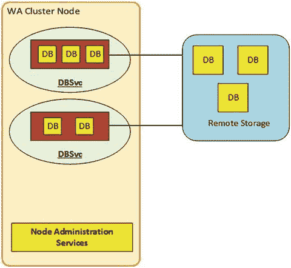

图 8-1. 在 Windows Azure 集群上运行的 `DBService`

租户环架构允许创建和运行多个 `DBService`，这些服务可属于一个或多个客户（租户）。由于每个 `DBService` 在其自身的上下文中运行，并且独立于在同一租户环节点上运行的其他 `DBService` 应用程序，因此该架构允许同一个节点/虚拟机托管多个客户数据库。

以下服务构成 `DBService` 应用程序的核心：

*   `SQL Server Executable`
*   `Watchdog.exe`

当同时需要 `Hekaton`（内存 OLTP）或全文索引时，可能会有额外的服务。此外，当 Azure SQL Database 作为 Azure SQL DW 的后端时，可能还需要其他服务。

### 控制环

控制环的功能是提供管理、预配和重定向服务（参见图 8-2）。它帮助确定数据库在租户环中的位置，并将连接路由到正确的租户数据库。控制环提供以下主要服务：控制管理节点、管理服务节点和重定向器服务节点。

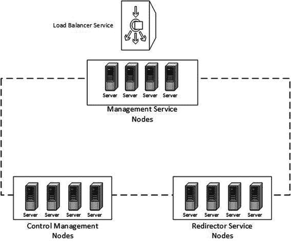

图 8-2. 控制环架构

#### 控制管理节点

控制管理节点提供内部集群管理服务，这些服务具备容量管理、租户环管理、迁移等场景所需的能力。

控制管理节点的关键组件之一是集群元数据存储，它是与 Azure SQL 集群相关的所有元数据的唯一存储点。它存储诸如集群状态、运行在集群上的资源状态以及其他确保集群以最佳状态运行的信息。

#### 管理服务节点

管理服务节点托管管理组件，这些组件为最终用户管理 Azure SQL 数据库提供 REST API。管理服务作为无状态服务运行在多个活动的管理节点上。如果一个节点发生故障，服务可以在不同的管理节点上重启，并且操作可以从托管服务的节点发生故障时的同一点恢复。传入的最终用户请求由软件负载均衡器定向到其中一个管理端点，然后重定向到一个管理节点。

#### 重定向器服务节点

此节点提供到 Azure SQL 数据库的 TDS 重定向。

该架构还使用其他服务来实现高可用性（`SQL Server 可用性组`）、负载均衡和资源治理。

## Azure SQL Database 服务层级

Azure SQL Database 目前提供三个服务层级，每个层级下有多个性能级别。例如，标准层级有四个性能级别——`S0`、`S1`、`S2` 和 `S3`。每个性能级别提供一组递增的资源（计算能力、内存和存储），以提供递增的吞吐量水平。不同的服务层级以及各层级下的各种性能级别如图 8-3 所示。鉴于 Azure 是一个不断变化的领域，部分信息未来可能会有变动。最新信息请查阅 MSDN 上的 Azure 文档。

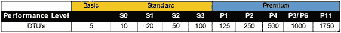

图 8-3. Azure SQL Database 的服务层级

每个性能级别可用的资源以数据库吞吐量单位（或 `DTUs`）来表示。简而言之，`DTUs` 描述了完成一个数据库事务所需的相对计算能力、内存和 IO 吞吐量。例如，标准 `S2` 性能级别提供 50 个 `DTU` 的计算能力，这相当于每秒约 50 次数据库事务。同样，`P11` 服务层级提供 1750 个 `DTU`，每秒可执行约 1750 次事务。

从本地环境迁移到 Azure SQL Database 时，您可以使用公开可用（非微软官方）的 `DTU` 吞吐量计算器来估算所需的 `DTU` 数量，进而确定适合您工作负载的服务层级。`DTU` 计算器可从 `http://dtucalculator.azurewebsites.net/` 下载。参见图 8-4。

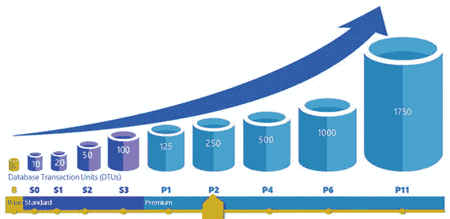

图 8-4. 各种服务层级和性能级别下的数据库吞吐量单位（`DTUs`）


### 弹性数据库池

Azure SQL 数据库还允许在弹性数据库池中创建和管理多个数据库。为了更详细地理解弹性数据库池，请考虑一个示例。

假设有一个 ISV 为多个客户提供 SaaS（软件即服务）服务。对于每个客户，该 ISV 都需要配置一个数据库作为软件服务的后端。这些客户的高峰使用时间和需求各不相同。假设客户 A 的高峰使用量在每秒 200 个连接到 1000 个连接之间变化。这种负载变化可能并不局限于一天中的特定时间。在这种情况下，配置一个单一服务层级的数据库，使其能同时保证最佳性能和成本效益变得很困难。由于用户负载可能不依赖于时间，ISV 更可能不得不配置一个满足峰值负载需求的最高服务层级的数据库。这显然不是一个经济高效的解决方案。

弹性数据库池为这类问题提供了一个解决方案。简而言之，弹性数据库池提供了一组与该池关联的共享 DTU（更精确地说是 eDTU），可供池中的数据库使用。例如，考虑一个标准的 S3 层级弹性池，它有大约 800 个 DTU。用户最多可以在此池中创建 400 个数据库，这将允许这些数据库共享和消耗 DTU 资源，而无需为池中的数据库分配特定的性能级别。这种安排允许多个具有不同工作负载的数据库最佳地使用池中可用的 DTU。图 8-5 列出了不同服务层级下弹性池的各种限制。

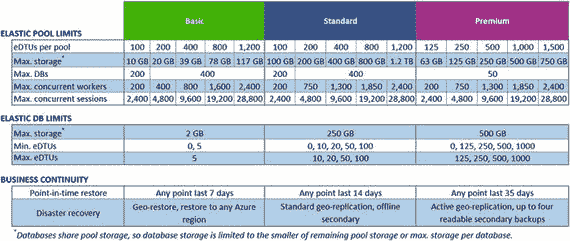

图 8-5. 不同服务层级的弹性池限制

### 服务层级：限制与功能

Azure SQL 数据库可用的每个服务层级都有特定的限制，其中一些在图 8-6 和以下列表中提及。再次如前所述，更新信息可在 MSDN 上的 Azure 文档中找到。

*   最大数据库大小。指定数据库大小限制的最大值。如表中所示，基本层级数据库的最大限制为 2GB，而高级 P11 数据库的最大限制为 1TB。
*   自动备份和时间点恢复。Azure SQL 数据库提供自动完整备份和日志备份功能。这些备份可以在服务层级规定的保留期内的任何时间点进行恢复。例如，默认情况下标准层级的数据库备份保留 14 天，因此可以恢复到过去 14 天内的任何时间点。我们将在第 9 章全面介绍高可用性、业务连续性和灾难恢复。
*   最大内存中 OLTP 存储。指定允许用于存储内存中 OLTP 对象的最大内存量。这仅适用于高级层级，因为其他层级不支持内存中 OLTP 优化。
*   最大并发请求数。可在数据库上执行的并发用户或应用程序请求的最大数量。熟悉 Microsoft SQL Server 的读者可能记得，SQL Server 提供了一个 DMV `sys.dm_exec_requests`，用于列出服务器上运行的所有活动请求。类似的 DMV 可与 WASD 一起使用，以获取数据库在任何时间点的活动请求总数。
*   最大并发登录数。这表示允许同时登录到数据库的用户或应用程序数量的限制。此限制不适用于弹性数据库池。

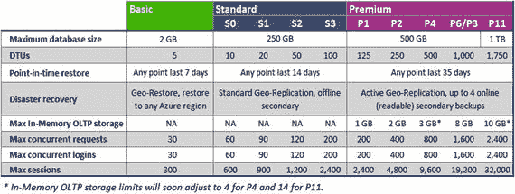

图 8-6. 服务层级的功能与限制

## 管理工具

Azure SQL 数据库的管理（创建、更新、迁移等）可以通过以下任何工具完成：

*   Azure 门户
*   SQL Server Management Studio
*   SQL Server 数据工具
*   命令行实用程序和 REST API

这些将在接下来的章节中讨论。

### Azure 门户

Azure 门户是一个基于 Web 的应用程序，提供创建、删除、恢复和管理 Azure SQL 数据库及相关逻辑服务器的功能。它还提供监控数据库性能、配置安全性和高可用性以及更改数据库服务层级的能力。

让我们看看可以使用 Azure 门户完成的一些重要任务：创建数据库和管理数据库属性。

#### 创建数据库

使用 Azure 门户创建数据库时（此示例使用新版 Azure 门户），我们可以选择使用现有服务器或创建新的逻辑服务器。如果在数据库创建过程中创建新服务器，用户可以选择服务器和数据库所在的数据中心。（参见图 8-7，该图表明新数据库将创建在东南亚数据中心的逻辑服务器 `tnkl47icl` 上。）

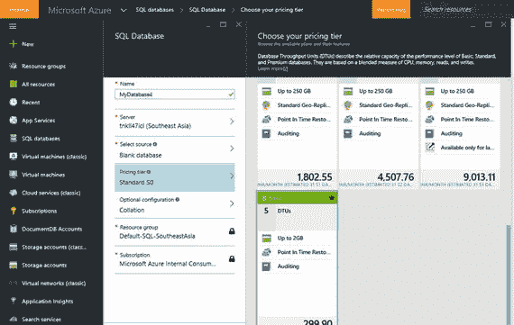

图 8-7. 创建新 SQL 数据库时选择服务层级和性能级别

用户还可以选择正在创建的数据库的服务层级和性能级别，如图 8-7 所示。数据库创建后，可以使用管理门户更改其服务层级和性能级别。

#### 管理数据库属性

Azure 门户可用于启用、禁用或更改数据库的属性。如图 8-8 所示，Azure 门户还可用于恢复、导出、更改服务层级以及启用或禁用数据库上的审核和监视。

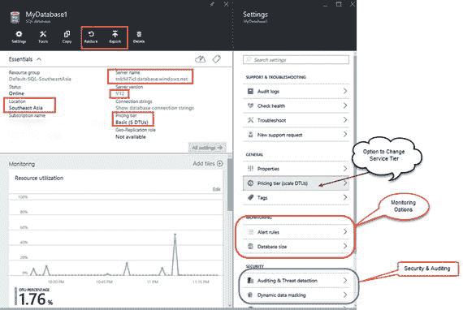

图 8-8. 通过 Azure 门户可用的数据库详细信息和管理选项

Azure 门户最重要的用途之一是配置来自客户端 IP 的连接的防火墙例外。默认情况下，Azure 会阻止所有传入 SQL 数据库的流量。在任何客户端工具（如 SQL Server Management Studio (`SSMS`) 或 SQL Server 数据工具 (`SSDT`)）访问数据库之前，必须添加例外。

此设置是在服务器级别执行的，如图 8-9 所示。

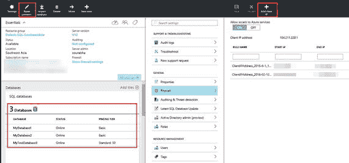

图 8-9. 为 Azure SQL 数据库服务器配置防火墙选项

注意：审核、安全性、监视、高可用性和性能故障排除将在后续章节中介绍。


### SQL Server Management Studio

SQL Server Management Studio（`SSMS`），一个自 2005 年以来随 SQL Server 提供的广为人知的管理工具，可用于管理和开发 Azure SQL 数据库。如图 8-10 所示，`SSMS`可用于连接到 Azure SQL 数据库并在数据库上执行管理或其他操作。

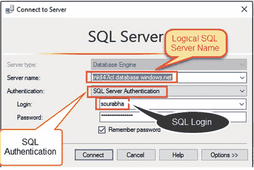

图 8-10。

使用 SQL Server Management Studio (`SSMS`)连接到 SQL 数据库。

Azure SQL 数据库支持 SQL 身份验证和 Windows 身份验证（当使用本地 AD 和 Azure AD 之间的 AD 联合时）。

连接到 Azure SQL 数据库时，需要指定作为数据库创建一部分创建的逻辑 SQL 服务器的名称。逻辑 SQL 服务器数据库的名称始终采用图 8-10 中所示的格式。

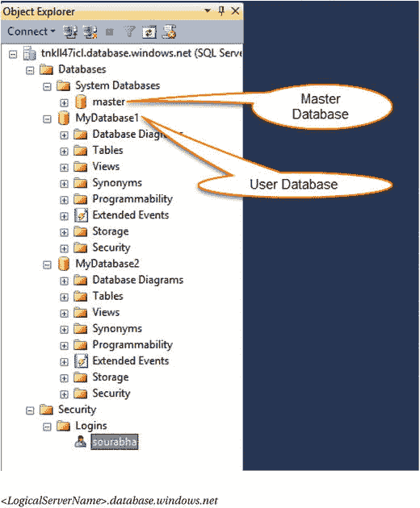

图 8-11。

使用 SQL Server Management Studio 探索 SQL 数据库。

`SSMS`可用于执行许多活动，例如：

*   使用扩展事件进行监控和管理
*   数据库创建、设计和开发
*   管理安全

以下`T-SQL`命令可用于创建一个 Azure SQL 数据库：

```
CREATE DATABASE MyTestDatabase3
(
MaxSize = 1 GB, ---> 数据库的最大大小。此值不能大于服务层所支持的大小
Edition = 'Standard', --> 数据库的服务层
Service_Objective = 'S0' --> 数据库的性能级别
)
```

在此示例中，我们正在标准服务层创建一个性能级别为`S0`（10 `DTU`）的数据库。我们还指定数据库的最大大小为 1GB。

注意

连接到 Azure SQL 数据库时，常规 SQL 数据库中可用的某些管理功能或能力将不可用。例如，无法右键单击 Azure SQL 数据库并对其进行备份。

### SQL Server Data Tools (SSDT)

`SSDT`是一个免费的可下载实用程序，可用于构建 SQL Server 关系数据库、Azure SQL 数据库、`SSIS`包、`SSAS`数据模型和`SSRS`报告。使用`SSDT`，您可以像在 Visual Studio 中开发应用程序一样，以相同的简单性设计和部署任何 SQL Server 内容类型。

`SSDT`主要是一个可用于设计 Azure SQL 数据库的开发环境。用于连接到 SQL 数据库的连接字符串与`SSMS`使用的字符串相同。图 8-12 说明了如何使用`SSDT`连接到 Azure SQL 数据库。

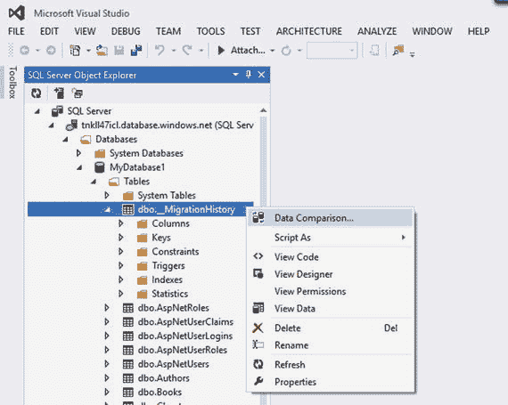

图 8-12。

使用`SSDT`连接到并设计 Azure SQL 数据库。

### 命令行实用程序和 REST API

像 PowerShell 这样的命令行实用程序可用于创建和管理 Azure SQL 数据库。同样，Azure 公开了一组`REST API`，可用于处理 Azure SQL 数据库。

PowerShell 可用于执行与 Azure SQL 数据库相关的几乎所有操作。清单 8-1 使用 Azure PowerShell cmdlets 执行以下任务：

1.  登录 Azure。
2.  选择要使用的订阅。
3.  选择现有的`ResourceGroup`或创建新的。创建新的`ResourceGroup`时，脚本允许用户选择数据中心。
4.  选择现有的逻辑服务器或创建新的。
5.  配置防火墙规则以允许从客户端计算机连接到逻辑服务器。
6.  配置 SQL 数据库。脚本在基本服务层配置一个数据库。

```
#登录到你的 Azure 订阅。
Add-AzureRmAccount
#获取与登录关联的所有订阅列表
$subscriptions = Get-AzureRmSubscription
#从上一个命令返回的列表中选择一个有效的订阅
$count = 1
Foreach ($subscription in $subscriptions)
{
Write-Host $count.ToString() " -:" $subscription.SubscriptionName
$count +=1
}
Write-Host "选择要部署数据库的订阅 -" -ForegroundColor Yellow
$SubsChoice = Read-Host
$Arrayindex = $SubsChoice-1
Select-AzureRmSubscription -SubscriptionId $subscriptions[$Arrayindex].SubscriptionId
#获取订阅中可用的 Azure ResourceGroup，或创建一个新的 ResourceGroup
$resourceGroupName = ""
$DCLocation = ""
$option = Read-Host "你想使用现有的资源组吗 (y/n) :-"
if($option -eq "y")
{
$ResGroups = Get-AzureRmResourceGroup | Where-Object{$_.ResourceGroupName -NotLike "Default*" }
#从列表中选择一个有效的订阅
$count = 1
Foreach ($ResGroup in $ResGroups)
{
Write-Host $count.ToString() " -:" $ResGroup.ResourceGroupName
$count +=1
}
Write-Host "选择要部署数据库的资源组 -" -ForegroundColor Yellow
$ResGrChoice = Read-Host
$Arrayindex = $ResGrChoice-1
$resourceGroupName = $ResGroups[$Arrayindex].ResourceGroupName
$DCLocation = $ResGroups[$Arrayindex].Location
}
Else
{
Write-Host "输入新资源组名称" -ForegroundColor Yellow
$resourceGroupName = Read-Host
$locations = Get-AzureLocation
$count=1
Foreach ($location in $locations)
{
Write-Host $count.ToString() " -:" $location.Name
$count +=1
}
Write-Host "选择一个数据中心位置 " -ForegroundColor Yellow
$LocChoice = Read-Host
$Arrayindex = $LocChoice-1
$DCLocation = $locations[$Arrayindex].Name
try
{
$resourceGroup = New-AzureRmResourceGroup -Name $resourceGroupName -Location $DCLocation
}
catch
{}
}
#为数据库选择现有的逻辑服务器或创建一个新的逻辑服务器。
$SQLDBServerName = ""
$option = Read-Host "你想使用现有的 SQL 数据库服务器吗 (y/n) :-"
if($option -eq "y")
{
$logicalServers = Get-AzureRmSqlServer -ResourceGroupName $resourceGroupName
#从列表中选择一个有效的 SQL 数据库服务器
$count = 1
Foreach ($logicalServer in $logicalServers)
{
Write-Host $count.ToString() " -:" $logicalServer.ServerName
$count +=1
}
Write-Host "选择要部署数据库的逻辑 SQL 数据库服务器 -" -ForegroundColor Yellow
$SrvChoice = Read-Host
$Arrayindex = $SrvChoice-1
$SQLDBServerName = $logicalServers[$Arrayindex].ServerName
}
Else
{
Write-host "输入 SQL 服务器名称 :-" -ForegroundColor Yellow
$SQLDBServerName = Read-Host
$SQLDBServerName = $SQLDBServerName.ToLower()
$admin = Read-Host "输入管理员账户 -:"
$password =  Read-host "输入管理员密码 -:" -assecurestring
$Pscred = New-Object System.Management.Automation.PSCredential ($admin,$password)
$DbServer = New-AzureRmSqlServer -ServerName $SQLDBServerName -SqlAdministratorCredentials $Pscred -Location $DCLocation -ResourceGroupName $resourceGroupName
}
#添加防火墙规则以允许从本地计算机连接
$FirewallRuleName = "Rule1"
$FirewallStartIP = "125.16.230.6"
$FirewallEndIp = "125.16.230.6"
$FirewallRule = New-AzureRmSqlServerFirewallRule -ResourceGroupName $resourceGroupName -ServerName $SQLDBServerName -FirewallRuleName $FirewallRuleName -StartIpAddress $FirewallStartIP -EndIpAddress $FirewallEndIp
#添加 SQL 数据库
$DatabaseName = "MyDatabase2"
$DatabaseEdition = "Basic"
$DatabasePerfomanceLevel = "Basic"
$SqlDatabase = New-AzureRmSqlDatabase -ResourceGroupName $resourceGroupName -ServerName $SQLDBServerName -DatabaseName $DatabaseName -Edition $DatabaseEdition -RequestedServiceObjectiveName $DatabasePerfomanceLevel
清单 8-1。
使用 PowerShell 创建和配置 Azure SQL 数据库。
```


## Azure SQL Database 与 Azure VM 上的 SQL Server

对于组织和 Azure 用户而言，一个关键决策点是为他们的关系数据库需求部署 **Azure SQL Database** 还是 **Azure VM 上的 SQL Server**。Azure SQL 数据库和 Azure VM 上的 SQL 针对不同的需求进行了优化。

当需要配置和管理大量数据库时，Azure SQL 数据库非常适用。由于它是一种 PaaS 产品，所有的管理和打补丁开销都由供应商负责，这有助于组织和用户专注于数据库的设计和使用。Azure SQL 数据库针对需要快速上市时间和较低成本要求的场景进行了优化。

Azure SQL 数据库不提供所有外围功能，如复制、SQL Server 代理等，因此对于严重依赖此类功能的组织来说，Azure SQL 数据库不是一个好的选择。

Azure VM 上的 SQL Server 针对希望将本地部署扩展到云端的组织进行了优化。由于在 Azure VM 上运行的 SQL Server 引擎与本地环境上运行的引擎完全相同，因此组织更容易将其 SQL 工作负载“直接迁移”到 Azure。通过在 Azure VM 上运行 SQL Server，组织的 IT 团队对虚拟机拥有完全的管理控制权。

表 8-1 总结了 Azure SQL 数据库与 Azure VM 上的 SQL Server 之间的主要区别。

### 表 8-1. Azure SQL 数据库 vs. Azure VM 上的 SQL Server

| 特性 | Azure SQL 数据库 | Azure VM 上的 SQL Server |
| --- | --- | --- |
| 数据库大小 | P11 性能级别下最大可用 1 TB。 | 数据库最大大小受 VM 大小的限制。例如，在 D14 机器上，最多可以有 32 个数据磁盘，每个磁盘最大 1 TB。因此，理论上可以有一个 32 TB 的数据库。 |
| 计算资源 | 无法直接控制计算资源。由于计算资源以 DTU 表示，组织需要对其性能需求进行性能基准测试。 | 对 SQL Server 部署的计算资源拥有完全控制权。 |
| 总拥有成本 | 完全消除了对硬件或管理环境的 IT 资源的需求。 | 消除了对硬件的需求，但组织仍然需要一个 IT 团队来管理虚拟机。 |
| 业务连续性 | 默认提供以下功能：<br>1. 内置容错和本地（同一数据中心）冗余以实现高可用性。<br>2. 自动备份（保留期取决于服务层级）。<br>3. 地理复制和时间点数据库还原等选项。 | 1. Azure 基础结构为虚拟机提供容错和高可用性。<br>2. SQL 级别的高可用性和灾难恢复选项需要由 IT 团队配置。<br>3. 实现高可用性通常需要配置新虚拟机，这会增加管理和打补丁的开销。 |
| SQL 引擎功能 | 支持传统盒装 SQL Server 几乎所有的数据库级别功能，但不支持外围功能，如 SQL Server 代理作业、复制（仅支持作为订阅者）、日志传送等。 | Azure VM 上的 SQL Server 运行与传统盒装产品相同的 SQL Server 引擎版本。 |
| 使用场景 | 1. 开发和营销有时间限制的新云设计应用程序。<br>2. 需要内置高可用性、灾难恢复和升级机制的应用程序。<br>3. 没有资源管理底层操作系统和配置设置的组织或用户。<br>4. 构建软件即服务（SaaS）应用程序。 | 1. 希望以对现有应用程序最小的更改迁移到云端的组织。<br>2. 需要访问 SQL Server 外部资源的应用程序或工作负载。<br>3. 需要对其 SQL Server 部署拥有完全管理权限的组织。<br>4. 作为本地 SQL Server 部署的灾难恢复部署。 |
| 可伸缩性 | 通过更改数据库的服务层级或性能级别可轻松扩展。这是一项在线操作，意味着在更改执行期间数据库将保持在线和可用。 | 可通过更改基础 VM 类型进行向上扩展。这是一项离线操作，并且会强制 SQL Server 停机。 |

## 迁移到 Azure SQL 数据库

无论是 Microsoft SQL Server 还是其他 RDBMS 产品（如 Oracle、DB2 等）上的现有关系数据库，都可以迁移到 Azure SQL 数据库。从 Microsoft SQL Server 2005 及更高版本迁移时，您可以使用 `SQL Server Management Studio (SSMS)` 或 `SQL Server Data Tools (SSDT)`；而从非 Microsoft RDBMS 产品迁移时，您需要使用可从 Microsoft 下载站点下载的 `SQL Server Migration Assistant (SSMA)` 实用工具。

在本章的剩余部分，我们将讨论将现有的 Microsoft SQL Server 数据库迁移到 Azure SQL 数据库。由于 Azure SQL 数据库不支持 SQL Server 的全部功能集，因此确保现有数据库不使用 Azure SQL 数据库不支持的功能至关重要。您可以使用 `SQLPackage.exe` 或 `SSMS` 来检查这一点。


### SQLPackage.exe

`SQLPackage.exe` 是 SQL Server 或 Visual Studio 安装中包含的一个命令行实用程序。该可执行文件可能位于以下文件夹中：

```
SQL 安装路径 - C:\Program Files (x86)\Microsoft SQL Server\120\ DAC\bin
Visual Studio 路径 - C:\Program Files (x86)\Microsoft Visual Studio 12.0\Common7\IDE\Extensions\Microsoft\SQLDB\DAC\120
```

具体文件夹路径可能会因服务器上安装的 SQL Server 或 Visual Studio 版本而有所不同。

`SQLPackage.exe` 支持以下操作（完整文档可在此处找到：`https://msdn.microsoft.com/library/hh550080.aspx`）：

1.  `Extract`（提取）。创建 SQL Server 或 Azure SQL 数据库的数据库快照（`*.dacpac`）。
2.  `Export`（导出）。将数据库导出到 `*.bacpac` 文件。
3.  `Import`（导入）。将 `*.bacpac` 文件导入到数据库。
4.  `Publish`（发布）。将 `.dacpac` 文件的内容发布到目标数据库。
5.  `DeployReport`（部署报告）。创建一份 XML 报告，说明发布操作将进行的更改。
6.  `DriftReport`（偏差报告）。创建一份 XML 报告，说明自数据库上次注册以来对已注册数据库进行的更改。
7.  `Script`（生成脚本）。创建一个脚本，包含所有将在目标数据库上进行的更新。

要获取可能阻碍将数据库迁移到 Azure SQL 数据库的潜在问题列表，请使用以下命令：

```
sqlpackage.exe /Action:Export /ssn:"SQLServerName" /sdn:"DatabaseName" /tf:"Target Bacpac File" > "OutputFile" 2>&1
```

其中参数 `2>&1` 表示我们要将错误和输出记录到同一个文件中。

清单 8-2 显示了执行此命令后的示例输出。

```
正在连接到服务器 'SQLServerName' 上的数据库 'SQLNexus'。
正在提取架构
正在从数据库提取架构
正在解析架构模型中的引用
正在验证架构模型
正在验证数据包的架构模型
正在验证架构
正在从数据库导出数据
正在导出数据
正在处理导出。
正在处理表 '[dbo].[tbl_PERF_STATS_SCRIPT_RUNTIMES]'。
正在处理表 '[dbo].[tblNexusInfo]'。
正在处理表 '[dbo].[tbl_BLOCKING_CHAINS]'。
正在处理表 '[dbo].[tblDiagScan]'。
..........
正在处理表 '[dbo].[tblDiagScanLookup]'。
正在处理表 '[dbo].[CounterDetails]'。
正在处理表 '[dbo].[tbl_RUNTIMES]'。
正在处理表 '[dbo].[tbl_SYSINFO]'。
正在处理表 '[dbo].[tbl_Reports]'。
已成功导出数据库并保存到文件 'C: \Target.bacpac'。
清单 8-2.
SQLPackage.exe 的输出
```

在此案例中，未检测到数据库存在任何问题。

### SQL Server Management Studio

使用 SQL Server Management Studio，用户可以为其数据库创建 bacpac 文件导出，如图 8-13 至 8-15 所示。SSMS 中的“导出数据层应用程序”选项可用于为现有的本地数据库创建 bacpac 文件，然后该文件可作为 Azure SQL 数据库导入。bacpac 文件封装了数据库的数据和架构。

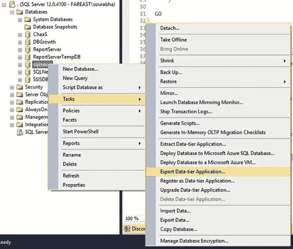
图 8-13. 在 SSMS 中启动“导出数据层应用程序”向导

SSMS 的“导出数据层应用程序”允许用户选择要包含在 bacpac 文件中的对象（表、存储过程、触发器等）。

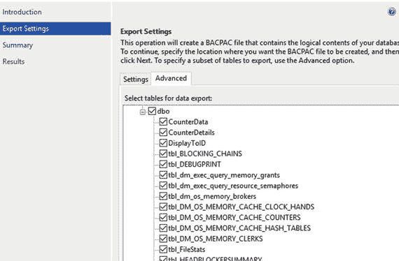
图 8-15. 选择要包含在 bacpac 文件中的对象

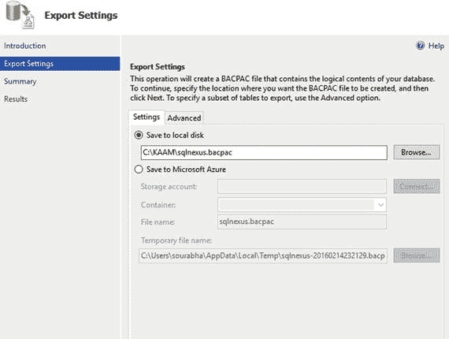
图 8-14. 为“导出数据层应用程序”向导配置导出设置

如果 SQL Server 在创建 bacpac 文件期间识别出任何迁移阻碍因素，这些阻碍因素将在“导出数据层”操作结束时记录在“导出报告”中（参见图 8-16）。

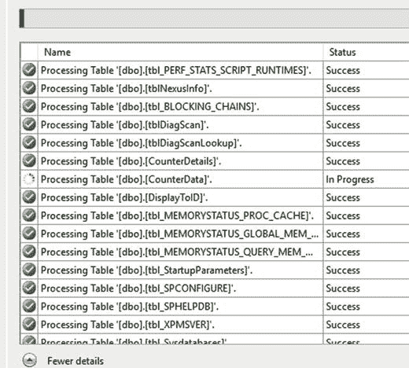
图 8-16. 导出数据层应用程序执行

如果在“导出数据层应用程序”报告中未发现错误，则可以将数据库迁移到 Azure SQL 数据库而不会出现任何问题。如果发现了错误，则需要先解决这些错误，然后才能将数据库迁移到 Azure SQL 数据库。

### 执行数据库迁移

实际的数据库迁移可以使用以下任一选项完成。

*   导出/导入 bacpac 文件。
*   使用 SSMS “部署到 Azure SQL 数据库”向导。
*   使用事务复制。

### 导出/导入 Bacpac 文件

如前所述，可以使用 SSMS 或 `SQLPackage.exe` 将现有数据库导出到 bacpac 文件。然后，该导出的文件可以使用 `SQLPackage.exe` 或 SSMS 中的“导入数据层应用程序”向导导入到 Azure SQL 数据库，如图 8-17 所示。

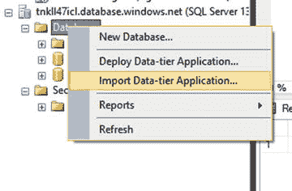
图 8-17. 使用 SSMS 导入 bacpac 文件

该向导允许用户选择一个现有的 bacpac 文件导入到 Azure SQL 数据库中，并为数据库指定新的名称、服务层级和性能级别（参见图 8-18）。

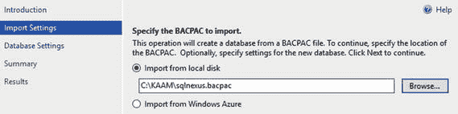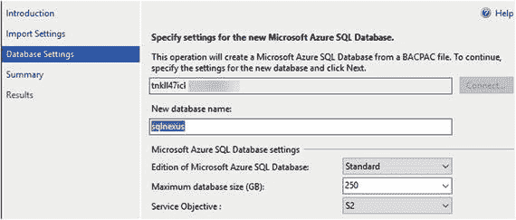
图 8-18. 在 bacpac 导入操作期间配置 Azure SQL 数据库选项

当您单击“完成”时，向导将把 bacpac 文件的内容导入到 Azure SQL 数据库中。

`SQLPackage.exe` 的 `import` 操作也可用于将 bacpac 文件导入到 Azure SQL 数据库。命令语法如下所示：

```
sqlpackage.exe /Action:Import /SourceFile: /ssn: /tdn: /tu:"AdminUserName" /tp: > "OutputFile" 2>&1
```

### SSMS “部署到 Azure SQL 数据库”向导

SSMS 的“部署到 Azure SQL 数据库”向导可用于直接将现有的 SQL Server 数据库迁移到 Azure SQL 数据库，而无需显式创建 bacpac 文件然后再导入它。尽管在后台，此向导会创建临时的 bacpac 文件，然后将其导入到 Azure SQL 数据库。与前面提到的“导入数据层”向导一样，用户可以选择数据库将创建在哪台服务器以及何种服务层级（和性能级别）。

您可以通过右键单击数据库，然后选择“任务”->“部署到 Microsoft Azure SQL 数据库”来访问此向导，如图 8-19 所示。

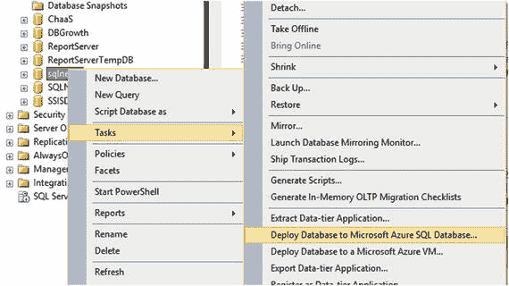
图 8-19. 启动“将数据库部署到 Microsoft Azure SQL 数据库”向导

图 8-20 说明了在部署数据库时可用的不同配置选项。该向导允许用户连接到逻辑服务器（新数据库将托管于此），并指定服务层级和性能级别。

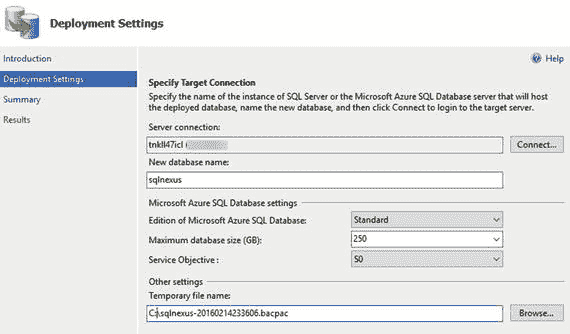
图 8-20. 在部署 Azure SQL 数据库操作期间配置数据库选项
注意：如果数据库的大小大于服务层级允许的最大大小，迁移将会失败。

一旦向导完成执行，具有指定服务层级和性能级别的新 Azure SQL 数据库就会在指定的逻辑服务器上创建（参见图 8-21）。

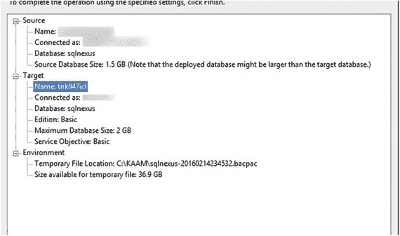
图 8-21. “将数据库部署到 Microsoft Azure SQL 数据库”向导摘要页


### 使用事务复制

事务复制是 Microsoft SQL Server 的一项数据（或架构）复制功能，它通过中间分发数据库，将源数据库（发布服务器）上的事务复制到多个目标数据库（订阅服务器）。`日志读取器代理`从发布服务器数据库读取事务日志文件，并将信息发送到分发数据库。信息到达分发数据库后，会使用`分发代理`将其发送给订阅服务器。

SQL Server 事务复制允许用户将 `Azure SQL 数据库`配置为订阅服务器。在事务复制的初始设置期间，订阅服务器数据库使用发布服务器数据库的快照进行同步。初始同步后，对主数据库（本地）所做的任何更改都会由 `logRead.exe` 捕获并存储在分发数据库中。这些更改再从分发数据库发送到 `Azure SQL 数据库`订阅服务器。此流程如图 8-22 所示。

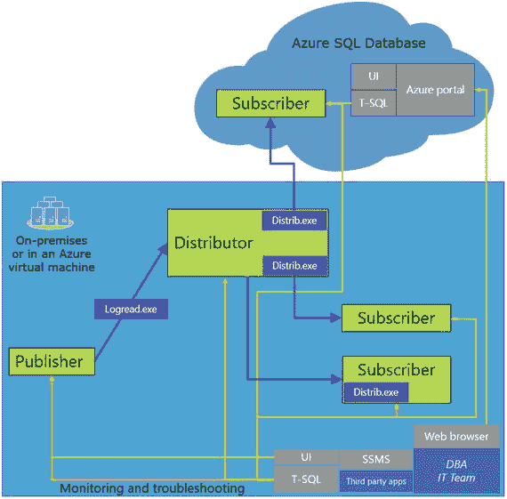

图 8-22.

事务复制到 Azure SQL 数据库的执行详情

Azure SQL 数据库无法被配置为分发服务器或发布服务器来设置事务复制。此功能可作为数据库迁移的有效选项，尤其是在需要最短停机时间或零停机时间的场景中。

## 小结

在本章中，我们了解了 `Azure SQL 数据库`的内部架构工作原理。我们还探讨了 `Azure SQL 数据库`的不同服务层级和性能级别，以及如何使用各种实用工具（如 `Azure 门户`、`SSMS`、`SSDT` 和 `PowerShell`）来创建和管理 `Azure SQL 数据库`。我们还学习了将现有 `SQL Server 数据库`迁移到 `Azure SQL 数据库`的不同方法。

# 9. Azure SQL 数据库的业务连续性与安全性

业务连续性旨在确保关键应用程序能够抵御计划内或计划外的停机事件，这些事件可能导致业务功能永久性或暂时性丧失。其目标是设计和部署关键业务，使这些停机事件对业务的影响最小化或无影响，或者在业务批准的时间范围内存在恢复的可能。在规划或设计业务连续性时，有几个关键的讨论点需要考虑。

*   `RTO`。应用程序允许的最大可能停机时间，超过此时限业务可能会遭受经济损失。应用程序的设计需要确保其在指定的 `RTO` 内恢复。
*   `RPO`。在应用程序需要完全可用之前，允许的最大数据丢失量。
*   `ERT`。数据库在收到还原或故障转移请求后完全可用的预估时长。

在设计具有业务连续性的应用程序时，架构师需要考虑可能导致应用程序失败的各种计划内或计划外停机类型。一些最常见的情景包括：

*   人为错误。从管理员或具有提升权限的用户误删或修改关键业务数据的情景中恢复。对于使用 `SQL Server` 或相关技术的人员来说，这是一个非常熟悉且常见的情景。
*   站点中断。从整个数据中心不可用的情景中恢复。例如自然灾害和导致整个数据中心不可用的电力故障。
*   维护和升级。确保在应用程序维护和升级期间的业务连续性。

在本章中，我们将讨论 `Azure SQL 数据库`提供的各种业务连续性和灾难恢复选项，以及如何利用这些功能为您的关键业务工作负载提供高可用的数据库环境。

虽然业务连续性和灾难恢复至关重要，但对于任何关键工作负载而言，另一个关键标准是确保存储在数据库中的数据的安全性和可靠性。我们应该在设计和架构阶段谨慎行事，确保最终解决方案能够抵御所有潜在的内部或外部攻击。在本章中，我们将介绍 `Azure SQL 数据库`提供的不同安全特性和选项，以确保您的数据安全。

## Azure SQL 数据库：业务连续性与灾难恢复

`Azure SQL 数据库`提供了开箱即用的高可用性和容错能力，这对确保业务连续性和灾难恢复大有裨益。此外，还有其他可配置的选项，可用于实现跨多个区域的高可用性/灾难恢复。

### 本地冗余

默认情况下，`Azure SQL 数据库`在同一数据中心提供数据库的两个辅助副本。这些辅助副本与数据库的主副本保持同步。所有读写操作都在主副本上执行。此外，写入操作会被复制到辅助副本。图 9-1 展示了这个过程。

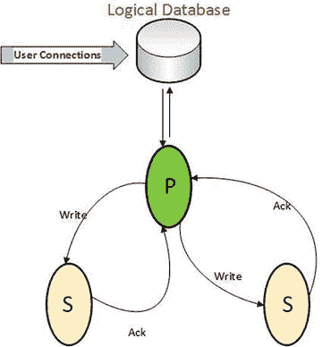

图 9-1.

Azure SQL DB 本地冗余的表示视图

`Azure` 向最终用户呈现数据库的透明逻辑副本，同时隐藏其他细节。如果其中一个副本发生故障，`Azure` 确保创建另一个数据库副本以维持三个副本。`Azure` 使用`分区管理器`和`全局分区映射`来确保在任何给定时间点都维护着三个数据库副本。

创建数据库时，`Azure` 会在不同的数据节点上创建两个辅助副本。如图 9-2 所示，如果包含数据库主副本的节点发生故障，`Azure 分区管理器`会启动故障转移算法，将其中一个辅助副本提升为主角色。一旦主数据库副本建立，就会创建另一个辅助副本并与主副本同步。

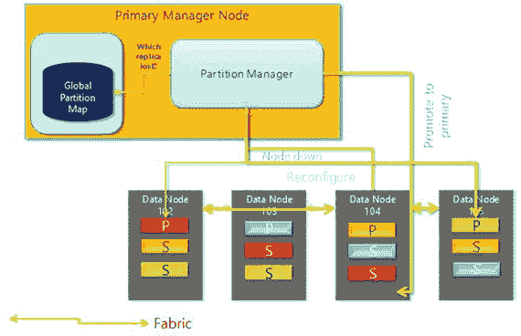

图 9-2.

本地冗余如何实现的详细表示

如果包含辅助副本的节点发生故障，`分区管理器`会在其中一个节点上创建一个新的辅助副本，以确保仍有三个副本。在以下示例中，当节点 103 发生故障时，该节点上所有的数据库副本都会迁移到其他节点。此过程如图 9-2 和图 9-3 所示。

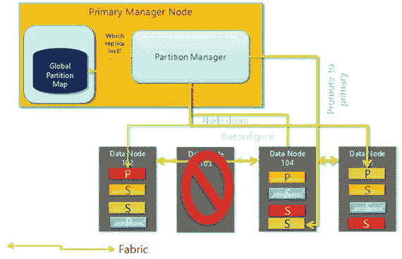

图 9-3.

在节点故障时重新配置本地冗余


### 时间点还原

Azure SQL Database 服务为所有数据库提供自动备份功能。这些备份的保留时间取决于数据库运行的服务层级。例如，对于在基本服务层级运行的数据库，备份保留七天，而对于标准和高级服务层级，保留时间分别为 14 天和 35 天。数据库可以从备份还原到保留期内的任何时间点。这些备份存储在具有地理复制功能的存储账户上，并可读取地理复制副本。

Azure SQL Database 服务每周进行一次完整备份，每天进行一次差异备份，每五分钟进行一次日志备份。第一次完整备份在数据库创建后立即进行。一旦第一次完整备份完成，其他备份将自动安排。时间点还原可以使用 `Azure Portal` 或 `PowerShell` 完成，如图 9-4 所示。

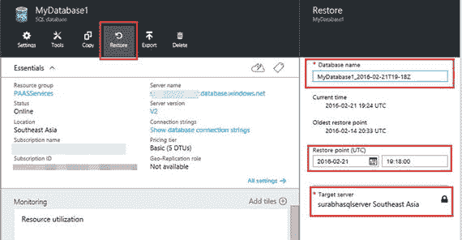
图 9-4. 启动时间点还原

关于还原操作，请注意以下几点：
*   还原会在同一逻辑 SQL 服务器上创建一个新数据库，并使用还原点时正在使用的服务层级。由于数据库位于同一逻辑服务器上，因此必须确保服务器上有足够的 `DTU` 用于新数据库。
*   还原时间取决于多种因素，如数据库大小、恢复点（时间回溯多远）、需要还原的备份数量等。
*   数据库还原后，将根据所使用的服务层级和性能级别全额计费。

如果数据库已被删除，则该数据库的最终备份将根据保留策略保留。已删除的数据库可以还原到其被删除时的时间点。已删除的数据库可以在数据库所在的逻辑服务器下的 `Azure Portal` 中查看。图 9-5 说明了如何使用 `Azure Management Portal` 还原已删除的数据库。

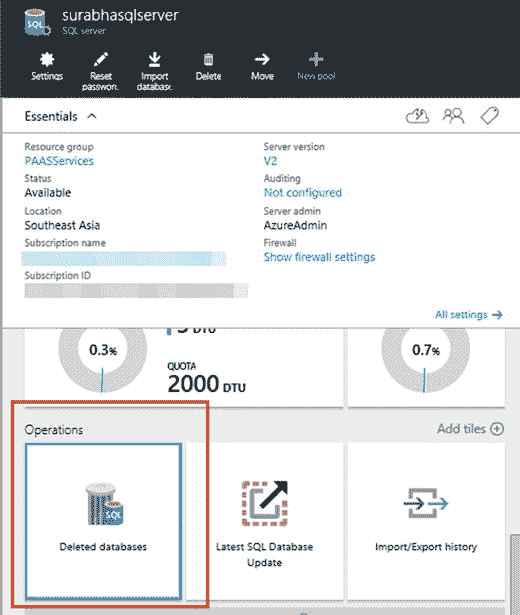
图 9-5. 还原已删除的数据库

如图 9-6 所示，删除日期和还原点相同，这意味着数据库将被还原到它被删除时的状态。

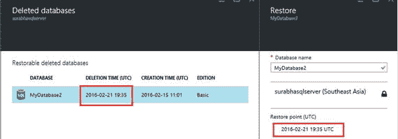
图 9-6. 启动已删除数据库的还原

可以使用 `Azure PowerShell` 在某个时间点还原数据库。清单 9-1 提供了示例代码。
```
Login-AzureRmAccount
#$resourceGroup = "ResourceGroupName"
#$DbServer = "DBServerName"
$resourceGroupName = "Default-SQL-SoutheastAsia"
