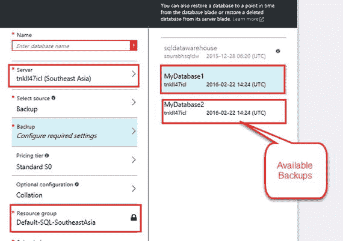
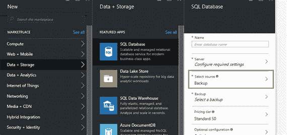

# Get the Logical Server Details
$DbServerName = (Get-AzureRmSqlServer -ResourceGroupName $resourceGroupName).ServerName
#1. Get for all the Databases on the account.
$DBName = Get-AzureRmSqlDatabase -ServerName $DbServerName -ResourceGroupName $resourceGroupName | Where-Object {$_.DatabaseName -ne "Master"}
## PointInTime Parameter takes values in GMT and not local server time.
$RestoreRequest = Restore-AzureRmSqlDatabase -FromPointInTimeBackup -PointInTime “2016-05-17 04:00:00” -ResourceId $DBName[0].ResourceId -ServerName $DbServerName -TargetDatabaseName ($DBName[0].DatabaseName+"_Restored") -ResourceGroupName $resourceGroupName
if($RestoreRequest -ne $null)
{
Write-Host "Database Restored Successfully!!"
}
## Restore a Deleted Database
## in this example we will retrieve all the deleted databases and then restore the first database in the list.
$deletedDBs =  Get-AzureRMSqlDeletedDatabaseBackup -ResourceGroupName $resourceGroupName -ServerName $DbServerName
$RestoredDB = Restore-AzureRmSqlDatabase -FromDeletedDatabaseBackup -DeletionDate $deletedDBs[0].DeletionDate -ResourceId $deletedDBs[0].ResourceId -ServerName $deletedDBs[0].ServerName -ResourceGroupName $deletedDBs[0].ResourceGroupName -ServiceObjectiveName $deletedDBs[0].ServiceLevelObjective -TargetDatabaseName $deletedDBs[0].DatabaseName
if($RestoredDB -ne $null)
{
Write-Host "Database Restored Successfully!!"
}
```
清单 9-1. 时间点还原和还原已删除的 Azure SQL 数据库

### 地理还原

`Azure SQL Database` 的地理还原功能允许从备份的地理复制副本进行数据库还原。如前所述，`Azure` 会自动在地理冗余存储上对数据库进行备份。地理还原利用这些地理复制的备份副本来进行还原。地理还原可以帮助应用程序快速从影响整个主站点的灾难中恢复。

> 注意：备份在复制到 `GRS` 时可能存在一些延迟。完全有可能在主站点宕机之前，最新的备份尚未被复制。

与时间点还原一样，地理还原可以使用 `Azure Portal`（参见图 9-7 和 9-8）或 `PowerShell`（参见清单 9-2）完成。


图 9-8. 配置地理还原选项


图 9-7. 启动地理还原

地理还原可以通过创建一个以地理冗余备份为源的新数据库来实现。

与时间点还原一样，还原数据库所需的时间取决于待还原数据库的大小以及使数据库上线所需的操作数量。
```
$GeoBackups = Get-AzureRMSqlDatabaseGeoBackup -ResourceGroupName $resourceGroupName -ServerName $DbServerName
