# Perform Geo-Restore
$Restored_Geo_DB = Restore-AzureRmSqlDatabase -FromGeoBackup -ResourceGroupName $GeoBackups[0].ResourceGroupName -ResourceId $GeoBackups[0].ResourceId -TargetDatabaseName  ($GeoBackups[0].DatabaseName + "_Geo_Restored") -ServerName $DbServerName
if($RestoredDB -ne $null)
{
Write-Host "Database Restored Successfully!!"
}
```
清单 9-2. 地理还原一个 Azure SQL 数据库

### 地理复制

`地理复制` 提供了为地理上分散的区域创建主数据库的次要副本的能力。地理复制有两种形式——标准地理复制（适用于标准和高级服务层级）和活动地理复制（仅适用于高级服务层级）。

与本地高可用性技术（如 `SQL Server AlwaysOn`）不同，地理复制本质上始终是异步的。主副本上的事务被传送到次要副本并异步应用。为了防止数据中心之间的网络问题或基于距离的延迟，主副本上的更改会被缓冲，然后再传送到次要副本。

> 注意：基本层级数据库不提供 `地理复制` 功能。


#### 标准地理复制

标准地理复制允许创建（最多一个）辅助副本（不可读）到微软指定的“DR 配对”区域（参见图 9-9）。微软指定的 DR 配对区域列表可以在以下网址找到：

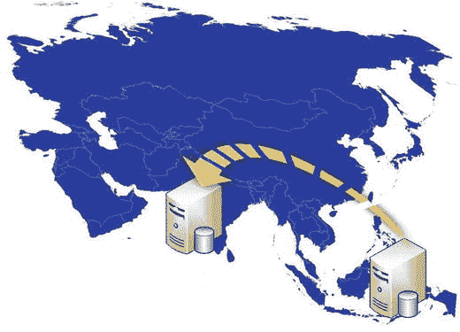
图 9-9. 标准地理复制的示意视图

```
http://blogs.msdn.com/b/windowsazurestorage/archive/2013/12/11/introducing-read-access-geo-replicated-storage-ra-grs-for-windows-azure-storage.aspx
```

当主副本处于活动运行状态时，辅助副本是不可读的。需要手动故障转移才能使数据库可供用户访问。标准地理复制提供了经典的灾难恢复场景，即如果主副本出现问题，可以立即将辅助副本联机。

标准地理复制可以通过管理门户设置，如图 9-10 至 9-12 所示，或者使用 PowerShell（参见清单 9-3）。

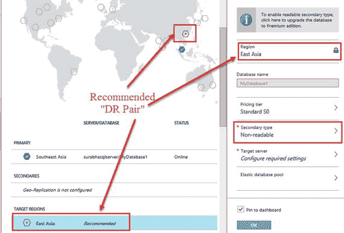
图 9-12. 配置标准地理复制选项

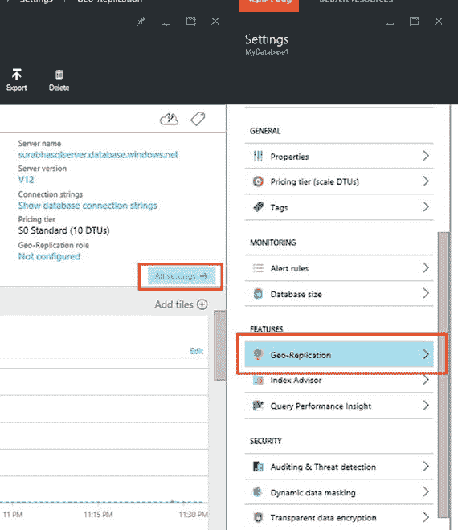
图 9-11. 配置标准地理复制选项

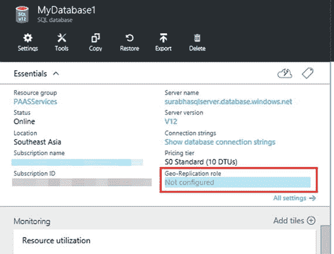
图 9-10. 配置标准地理复制

点击“地理复制角色”选项会打开设置地理复制的窗口。也可以通过点击“所有设置”然后选择“地理复制”来配置。

在地理复制设置页面上，您有一个指定辅助服务器的选项。如前所述，对于标准地理复制，只允许将“DR 配对”区域作为辅助区域。

与 Azure 门户一样，PowerShell 也可用于设置标准地理复制（参见清单 9-3）。

```
$resourceGroupName = "Default-SQL-SoutheastAsia"
$DbServerName = "primarysvr"
$SecondaryServerName = "secondsvr"
$DBName = Get-AzureRmSqlDatabase -ServerName $DbServerName -ResourceGroupName $resourceGroupName | Where-Object {($_.Edition -eq "Standard") -and ($_.DatabaseName -ne "master")}
$replicationLink = New-AzureRmSqlDatabaseSecondary -DatabaseName $DBName[0].DatabaseName -ServerName $DbServerName -ResourceGroupName $resourceGroupName -PartnerResourceGroupName $resourceGroupName -PartnerServerName $SecondaryServerName -AllowConnections No
if($replicationLink -ne $null)
{
Write-Host "Standard Geo Replication Setup successfully!!"
}
清单 9-3. 使用 PowerShell 配置标准地理复制
```

由于在此情况下数据库配置为标准层，这里唯一允许的选项是拥有一个不可读的辅助副本。此属性可以使用管理门户进行验证（参见图 9-13）。

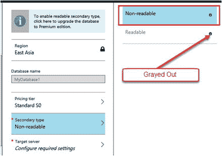
图 9-13. 在此情况下只有一个不可读的辅助副本可用

配置复制后，数据库的状态会相应更改。例如，如图 9-14 所示，主数据库会显示地理复制角色状态为“主数据库”，而辅助副本会显示为“辅助数据库”。

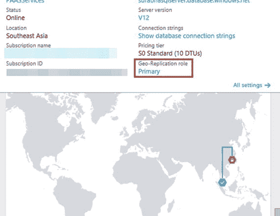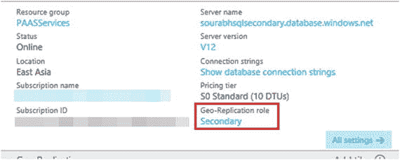
图 9-14. 数据库状态已更改

#### 执行数据库故障转移

Azure 门户提供了一个非常简便的一键式机制，可在主数据库宕机时进行故障转移（参见图 9-15）。您只需浏览到地理复制设置，然后点击辅助数据库并启动故障转移。Azure 还提供了在需要时停止复制的机制。

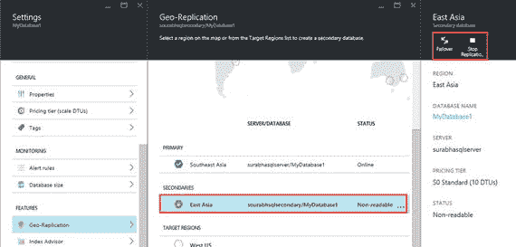
图 9-15. 执行数据库故障转移

也可以使用 PowerShell 将数据库故障转移到辅助副本。

```
Set-AzureRMSqlDatabaseSecondary -DatabaseName $DBName[0].DatabaseName -PartnerResourceGroupName $resourceGroup -ResourceGroupName $resourceGroup -ServerName $SecondaryServer –Failover -AllowDataLoss
```

#### 活动地理复制

活动地理复制使用与标准地理复制相同的技术，但有以下区别（参见图 9-16）：

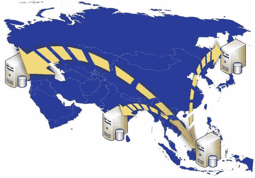
图 9-16. 活动地理复制的示意视图

*   辅助副本是可读的。
*   全球任何数据中心中最多可以有四个辅助副本。用户可以在任何数据中心创建辅助副本，不受 DR 配对区域的限制。
*   活动地理复制仅适用于高级层数据库。

与标准地理复制一样，活动地理复制可以通过 Azure 门户设置，如图 9-17 和 9-18 所示，或者使用 PowerShell，如清单 9-4 所示。

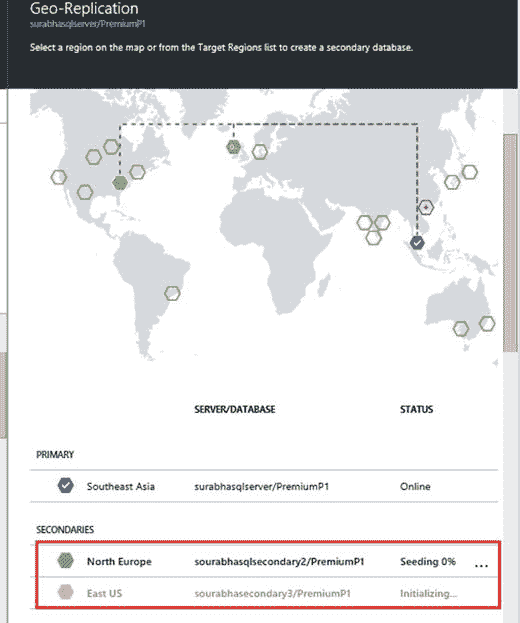
图 9-18. 活动地理复制的初始化

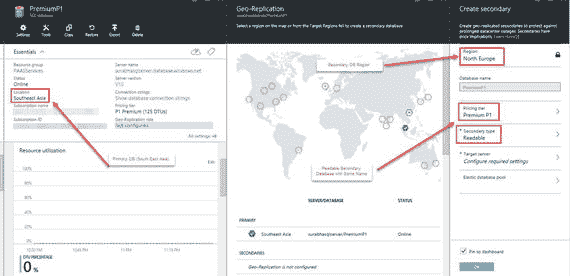
图 9-17. 配置活动地理复制

如前所述，使用活动地理复制最多可以创建四个辅助副本（每个位于不同的区域）。所有辅助副本都是可读的，可用于只读工作负载（例如运行报表）。如果主服务器出现问题，可以启动手动故障转移来恢复辅助数据库并使其可用于应用程序工作负载。图 9-18 表示一个具有两个活动地理复制辅助副本的场景。

可以使用 Azure 门户或 PowerShell 执行数据库故障转移。故障转移后，新的主数据库进入“联机”状态，而新的辅助数据库进入“可读”状态。如图 9-19 所示，美国东部数据库现在是主数据库，而东南亚数据库已成为一个可读的辅助数据库。

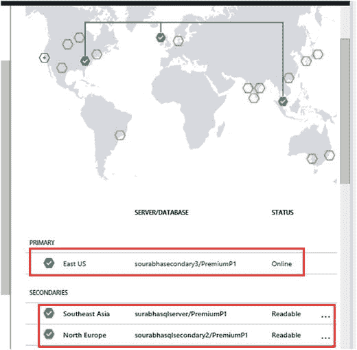
图 9-19. 活动地理复制实战

清单 9-4 显示了一个启用活动地理复制的 PowerShell 脚本示例。

```
$resourceGroupName = "Default-SQL-SoutheastAsia"
$DbServerName = "primarysvr"
$SecondaryServerName = "secondsvr"
$DBName = Get-AzureRmSqlDatabase -ServerName $DbServerName -ResourceGroupName $resourceGroupName | Where-Object {($_.Edition -eq "Premium") -and ($_.DatabaseName -ne "master")}
$replicationLink = New-AzureRmSqlDatabaseSecondary -DatabaseName $DBName[0].DatabaseName -ServerName $DbServerName -ResourceGroupName $resourceGroupName -PartnerResourceGroupName $resourceGroupName -PartnerServerName $SecondaryServerName -AllowConnections All
if($replicationLink -ne $null)
{
Write-Host "Geo Replication Setup successfully!!"
}
传递给 `New-AzureRmSqlDatabaseSecondary` cmdlet 的 “Allow Connections” 参数至关重要。如果未指定 “All” 选项，Azure 将创建一个不可读的数据库辅助副本。
清单 9-4. 启用活动地理复制
```


### SQL Server 复制

可以在本地 SQL Server 或运行于 Azure 虚拟机上的 SQL Server 与 Azure SQL 数据库之间设置 SQL Server 事务复制（及快照复制）。在设置 SQL Server 发布服务器与 Azure SQL 数据库订阅服务器之间的复制时，必须考虑以下关键事项（参见图 9-20）。

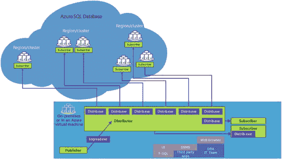

图 9-20. 复制到 Azure SQL 数据库的 SQL 复制

*   发布服务器和分发服务器可以是本地 SQL Server 实例或运行在 Azure 虚拟机上的 SQL Server。支持的最低 SQL Server 版本是 `SQL Server 2012 SP2 CU8`。
*   订阅服务器（`Azure SQL Database`）应采用推送订阅，这意味着分发代理将在分发服务器上运行。
*   所有复制监控和管理操作都必须从发布服务器执行。

复制到 `Azure SQL Database` 可以使用 `SQL Server Management Studio`（如图 9-21 所示）或 `T-SQL` 脚本来设置。当您为现有发布或新发布选择订阅时，可以指定 `Azure SQL Database` 服务器和数据库。

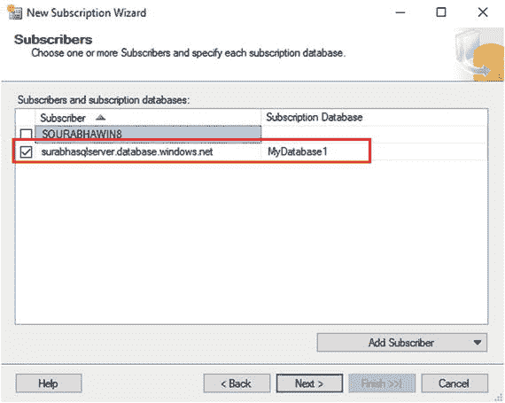

图 9-21. 配置复制到 Azure SQL 数据库

一旦复制设置完成，就可以使用 `复制监视器` 来监控和管理订阅。复制到 `Azure SQL Database` 可以作为一种有效方式，用于将现有工作负载迁移到 `Azure SQL Database`。

## Azure SQL 数据库：安全性与审核

Azure SQL 数据库提供了大量开箱即用的安全功能，以确保用户在 Azure 上的数据在任何情况下都不会受到威胁。`Azure SQL Database` 提供的多层安全功能——包括基于角色的授权（类似于 `SQL Server`）、加密静态数据和传输中数据的功能、用于限制访问的数据屏蔽以及行级安全——旨在提供全面保护，抵御任何真实或潜在的威胁。

接下来将介绍 `Azure SQL Database` 提供的一些关键安全功能。

### 防火墙管理

第一层安全由 `Azure SQL Database` 防火墙提供，它会阻止所有对 `Azure SQL Database` 的未经授权连接（参见图 9-22）。可以使用 `Azure 门户`（或 `PowerShell`）配置允许连接到 `Azure SQL 数据库`（或逻辑服务器）的 IP 地址（或地址范围）。来自任何其他 IP 的连接将被自动拒绝。

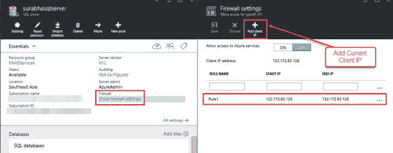

图 9-22. 为 Azure SQL 数据库配置防火墙例外

### 身份验证与授权

`Azure SQL Database` 现在同时支持 `SQL` 身份验证和 `Azure Active Directory` 身份验证（前提是已配置 `Azure AD` 以供使用）。与 `Microsoft SQL Server` 类似，`Azure SQL Database` 也使用基于角色的访问授权。`SQL Database` 提供了服务器级别角色和数据库级别角色，可以通过 `Azure 门户`、`PowerShell` 或使用 `SQL Server Management Studio`（仅限数据库角色）进行管理。服务器角色和/或数据库角色是有效的工具，可以帮助控制哪些用户可以访问哪些数据。除了提供基于角色的访问控制外，`Azure SQL Database` 还提供了一些非常酷的功能，这些功能尚未出现在标准的 `SQL Server` 中（其中一些功能计划包含在 `SQL Server 2016` 版本中）。

#### 行级安全

行级安全 (`RLS`) 提供了一种控制对表中单个行访问的方法。此访问控制是通过在数据库中创建的安全谓词（或安全函数）来实现的。由于访问控制逻辑（安全谓词）在数据库中可用，因此它提供了一种非常可靠和稳健的安全机制。此外，由于逻辑在数据库内实现，无论哪个应用程序或连接请求数据，访问都会受到控制。

清单 9-5 展示了一个实现 `RLS` 的脚本。

```sql
CREATE USER GeneralManager WITHOUT LOGIN;
CREATE USER Manager1 WITHOUT LOGIN;
CREATE USER Manager2 WITHOUT LOGIN;
CREATE TABLE EmployeePerformanceData
(
EmployeeID int,
EmployeeName varchar(200),
ManagerName sysname,
EmployeeRating int,
EmployeeIncrementPercent float
);
INSERT into EmployeePerformanceData values
(10, 'Employee10', 'Manager2', 1,10.00),
(11, 'Employee11', 'Manager2', 3, 6.53),
(12, 'Employee12', 'Manager1', 2, 8.71),
(13, 'Employee13', 'Manager2', 3, 6.25),
(14, 'Employee14', 'Manager1', 3, 5.87),
(15, 'Employee15', 'Manager2', 5, 0.00);
SELECT * FROM EmployeePerformanceData;
GRANT SELECT ON EmployeePerformanceData TO GeneralManager;
GRANT SELECT ON EmployeePerformanceData TO Manager1;
GRANT SELECT ON EmployeePerformanceData TO Manager2;
-- If any of the users select data from the table at this point, they would see all 6 records
EXECUTE AS USER = 'GeneralManager';
SELECT * FROM EmployeePerformanceData;
REVERT;
EXECUTE AS USER = 'Manager1';
SELECT * FROM EmployeePerformanceData;
REVERT;
EXECUTE AS USER = 'Manager2';
SELECT * FROM EmployeePerformanceData;
REVERT;
--- Implement RLS using Security Predicates and Filters
/*
In this case we are creating a security predicate such that the managers can only their own Employee Data and the GM can see all the employee information.
*/
CREATE SCHEMA Security;
GO
CREATE FUNCTION Security.fn_securitypredicate(@ManagerName AS sysname)
RETURNS TABLE
WITH SCHEMABINDING
AS
RETURN SELECT 1 AS fn_securitypredicate_result
WHERE @ManagerName = USER_NAME() OR USER_NAME() = 'GeneralManager';
-- Tie the Security Predicate with the User Table
CREATE SECURITY POLICY SalesFilter
ADD FILTER PREDICATE Security.fn_securitypredicate(ManagerName)
ON dbo.EmployeePerformanceData
WITH (STATE = ON);
-- Now if we execute the Queries, each manager would only see their own employee information.
EXECUTE AS USER = 'GeneralManager';
SELECT * FROM EmployeePerformanceData;
REVERT;
EXECUTE AS USER = 'Manager1';
SELECT * FROM EmployeePerformanceData;
REVERT;
EXECUTE AS USER = 'Manager2';
SELECT * FROM EmployeePerformanceData;
REVERT;
-- Disable the security Policy
ALTER SECURITY POLICY SalesFilter
WITH (STATE = OFF);
```

清单 9-5. 实现 RLS 的 T-SQL 示例脚本

#### 动态数据屏蔽

数据屏蔽通过对呈现给用户之前的数据库进行屏蔽，来防止敏感数据的暴露或未授权访问。数据屏蔽通过在表/对象定义中配置安全策略，并使用 `mask`/`unmask` 权限来控制用户查看的是屏蔽后还是未屏蔽的数据。数据库所有者和管理员始终可以看到未屏蔽的数据。

清单 9-6 包含一个用于测试数据屏蔽的示例脚本。

```sql
CREATE TABLE Employee
(
EmployeeID int IDENTITY PRIMARY KEY,
FirstName varchar(100) MASKED WITH (FUNCTION = 'partial(1,"XXXXXXX",0)') NULL,
LastName varchar(100) NOT NULL,
Phone# varchar(12) MASKED WITH (FUNCTION = 'default()') NULL,
Email varchar(100) MASKED WITH (FUNCTION = 'email()') NULL,
Salary float Masked with (Function='random(1,7)') Null
);
INSERT Employee (FirstName, LastName, Phone#, Email, Salary) VALUES
('Roberto', 'Tamburello', '555.123.4567', 'RTamburello@contoso.com',100000.00),
('Janice', 'Galvin', '555.123.4568', 'JGalvin@contoso.com.co',200000.00),
('Zheng', 'Mu', '555.123.4569', 'ZMu@contoso.net',100000.00),
('Bill', 'Anderson', '555.123.4570', 'billand@contoso.net',150000.00),
('Graham', 'Scott', '555.123.4571', 'Grahamsco@contoso.net',120000.00);
SELECT * FROM Employee;
CREATE USER AppUser WITHOUT LOGIN;
GRANT SELECT ON Employee TO AppUser;
EXECUTE AS USER = 'AppUser';
SELECT * FROM Employee;
REVERT;
```

清单 9-6. 用于实现数据屏蔽的 T-SQL 示例脚本

用户 `AppUser` 将看到以下输出（参见图 9-23），所有敏感信息均已被屏蔽。而数据库所有者（DBO）则会看到所有原始数据。

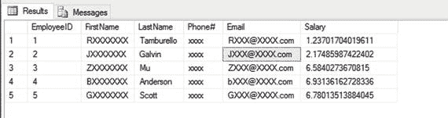
图 9-23. 数据屏蔽

### SQL 数据库审核

SQL 数据库审核提供了跟踪数据库上关键事件并将其存储在 Azure 存储上的能力。这些审核日志随后可用于满足法规遵从性要求，或为数据库上的活动提供基准（或分析）。所有服务层级都支持审核。

此外，审核可以在逻辑服务器级别（这将确保该服务器上的所有数据库都被审核）或数据库级别进行配置（参见图 9-24）。可以使用 Azure 门户或 PowerShell 配置审核。

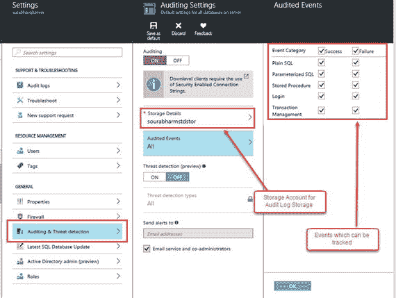
图 9-24. 为 SQL 数据库配置审核

注意：启用 SQL 数据库审核后，您可能需要更改下游客户端连接到 SQL 数据库的连接字符串，否则您的应用程序将无法连接到数据库。例如，启用审核后，复制到 SQL 数据库的操作将会失败，因为分发服务器代理将无法连接到订阅服务器。在这种情况下，请确保使用连接字符串 `<server name>.database.secure.windows.net`。

审核数据可以在 Azure 门户中以仪表板格式消费，也可以导出到 Excel 进行分析。

### SQL 数据库威胁检测

SQL 数据库威胁检测提供了一种机制，用于检测并响应 SQL 数据库的潜在威胁（异常活动）。结合使用威胁检测和审核，用户可以调查并对数据库的任何此类威胁采取必要措施。可以使用 Azure 门户轻松设置威胁检测，如图 9-25 所示。

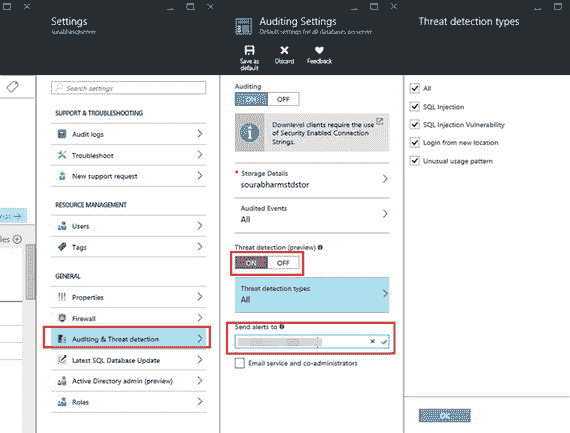
图 9-25. 配置威胁检测

### 加密

Azure SQL 数据库提供了丰富的加密功能，以确保驻留在数据库中的数据不被泄露。这些功能为静态数据和传输中的数据提供保护，接下来将进行讨论。

#### 连接加密

Azure SQL 数据库允许用户使用加密的 SSL 连接到数据库。为确保到 SQL 数据库的连接是加密的，应用程序开发人员需要使用 `"Encrypt = True"` 连接字符串参数。

#### 透明数据加密

透明数据加密（TDE）并不是一个新功能，它自 SQL Server 2008 起就已存在。它提供了一种加密静态数据的方法。Azure SQL 数据库使用相同的技术来加密所有静态数据。可以通过 Azure 门户（或 PowerShell）或以下 T-SQL 代码启用透明数据加密。

```sql
Alter Database [MyDatabase1] set Encryption On
```

PowerShell 命令 `Get-AzureRMSqlDatabaseTransparentDataEncryption` 也可用于在 SQL 数据库上设置 TDE。

#### 单元级（或列数据）加密

列数据加密不是一个新功能，熟悉 SQL Server 的用户知道这可以通过组合使用对称密钥和 SQL 提供的 `EncryptByKey`（或 `DecryptByKey`）函数来实现。关键是在数据插入或更新时使用 `EncryptByKey` 函数和密钥，而在 `SELECT` 操作时使用 `DecryptByKey` 函数。

清单 9-7 中的 T-SQL 脚本创建了一个表来存储加密数据。

```sql
IF NOT EXISTS (SELECT * FROM sys.symmetric_keys WHERE symmetric_key_id = 101)
CREATE MASTER KEY ENCRYPTION BY
PASSWORD = 'ThisisaveryveryStr0ngPAss@w0rd1'
GO
CREATE CERTIFICATE EncryptCert
WITH SUBJECT = 'Some Random Subject';
GO
CREATE SYMMETRIC KEY SymmetricKey
WITH ALGORITHM = AES_256
ENCRYPTION BY CERTIFICATE EncryptCert;
GO
-- Create a column in which to store the encrypted data.
Create table CustomerInfo
(
CustomerID int Identity Primary Key,
CustomerName varchar(200),
CustomerPhone varbinary(100),
CustomerEmail varbinary(200),
CustomerCreditCard varbinary(200)
)
-- Open the symmetric key with which to encrypt the data.
Begin Tran
OPEN SYMMETRIC KEY SymmetricKey
DECRYPTION BY CERTIFICATE EncryptCert;
insert into CustomerInfo (CustomerName,CustomerPhone,CustomerEmail,CustomerCreditCard) values
(
'Mike Anderson',
EncryptByKey(Key_GUID('SymmetricKey'),'555-123-1234'),
EncryptByKey(Key_GUID('SymmetricKey'),'mikeand@contoso.com'),
EncryptByKey(Key_GUID('SymmetricKey'),'1234567891011123')
)
Commit
-- Decrypt the Data
Begin Tran
OPEN SYMMETRIC KEY SymmetricKey
DECRYPTION BY CERTIFICATE EncryptCert;
Select CustomerId,CustomerName,
convert(varchar,DecryptbyKey(CustomerPhone)) as Phone,
convert(varchar,DecryptbyKey(CustomerEmail)) as Email,
convert(varchar,DecryptbyKey(CustomerCreditCard)) as CreditCard
From CustomerInfo
Commit
```

清单 9-7. 用于存储加密数据的示例 T-SQL 脚本

#### 始终加密

始终加密是 Azure SQL Database 和 SQL Server 2016 提供的一项新功能，它允许客户端在应用程序内管理敏感数据的加密，而无需将信息暴露给数据库层。由于加密逻辑不向数据库层暴露，数据库管理员和服务器管理员无法访问或控制实际的敏感信息。

始终加密支持两种加密方式：确定性加密和随机化加密。确定性加密对于相同的明文总会生成相同的加密输出，而随机化加密则每次都生成不同的值。确定性加密虽然在需要搜索或连接加密数据的场景中很有用，但也可能更容易受到攻击。

始终加密使用两种不同的密钥——列主密钥和列加密密钥，后者使用列主密钥进行加密。清单 9-8 展示了如何在 Azure SQL 数据库上实现始终加密。

```sql
USE [MyDatabase1]
GO
CREATE COLUMN MASTER KEY [CMKey]
WITH
(
KEY_STORE_PROVIDER_NAME = N'AZURE_KEY_VAULT',
KEY_PATH = N'https://.vault.azure.net/keys/AlwaysEncryptedkey'
)
GO
CREATE COLUMN ENCRYPTION KEY [CEKey]
WITH VALUES
(
COLUMN_MASTER_KEY = [CMKey],
ALGORITHM = 'RSA_OAEP',
ENCRYPTED_VALUE = 0x016E000001630075007200720065006E00740075007300650072002F006D0079002F0034006600330065003700660064003700360031003100330036003400340061003600310063003100330064006600390037003000620032003300620037006100320062006300660039006600380066000DEF701B5FAB3F23266DADCAAE7B448122BA75BF1841DEF7143A45C16D37AA4AC57799D50596BA92C0406CC30A3D755D6F5D260DCCA42BB9926136985A7CCF4537B85330DA7C1B12047048A51B04A352F6C3E71BEFEAE777019506D11AC71AF8A7AEC4DE7F5B98ACF6EF7D56B0706E0D521533514335E500E476C6B1777212CE043BDD09B20BB97B5C731CB4D58BF8DDA38A7DF08EECE797DCC15A9E25B064003DE869F6D87B75A3F6625A016292C3B8D8F8D3876DE62DDEE57F7BC2C901E3A2097B8E050862BEA0E33EF434D2DED6D5F2E54745D6E5C616932C5F2144B623C48B7643EDECE4CA545C31AB23DD2DFDF8067D25C05EF1786CCBC110E005D1567B53D6E34ACCC02052F6E9AE7365DE30856EF9DB5EC4315770D255FA76A9865204E8FBE5419AB5836480DE8345141073EB113E012CBF7132DCC22A3A32B6E44B961DDE2B0E7F24733062412CEF9C1A0DC96976A97D48EE5DCE4F5AE1213E680A31ADDFD9344A004ED59C6168CB7D5C8E42A22676A7D64F59A4C1687C61B5F60349699A45D11B8EE7DC8DBB61A156AE70449483D93073497B23597A5F340A98FB7BD37D9DC926360E32F927BB672F6BE1FFC5C01760827AF24B603E184479905BA5DFA9C23E523182F7C5C8ABC53E5D6E6CB3806C5707EDBB7CAC3DE50DA4A2FC38D27EE65F2638FFF37483ABC1050EEAD835919B384BB9136C0F24A6BD9489910
)
GO
CREATE TABLE dbo.EncryptedTable
(
ID INT IDENTITY(1,1) PRIMARY KEY,
LastName NVARCHAR(32) COLLATE Latin1_General_BIN2
ENCRYPTED WITH
(
ENCRYPTION_TYPE = DETERMINISTIC,
ALGORITHM = 'AEAD_AES_256_CBC_HMAC_SHA_256',
COLUMN_ENCRYPTION_KEY = [CEKey]
) NOT NULL,
Salary INT
ENCRYPTED WITH
(
ENCRYPTION_TYPE = RANDOMIZED,
ALGORITHM = 'AEAD_AES_256_CBC_HMAC_SHA_256',
COLUMN_ENCRYPTION_KEY = [CEKey]
) NOT NULL
);
GO
```

清单 9-8.
实现始终加密的 T-SQL 脚本示例

始终加密确保数据无论是在数据库存储中静态保存，还是在从客户端到数据库或从数据库到客户端的传输过程中，都永远不会以明文形式存在。

除了拥有大量功能来确保数据安全外，Azure SQL Database 还符合各种行业标准。

## 总结

在本章中，您了解了 Azure SQL Database 提供的各种业务连续性选项。异地复制及其相关的数据库故障转移功能提供了非常稳健、开箱即用的灾难恢复和高可用性选项，还可用于将部分读取工作负荷卸载到辅助数据库，以优化整体数据库性能。

您还了解了 Azure SQL Database 提供的众多安全功能，这些功能可以配置或使用，以确保您的数据永远不会泄露。借助始终加密，Azure SQL Database 确保传输中的数据永远不会泄露，而行级安全和数据屏蔽则确保用户只能看到他们被授权查看的数据。

## Azure SQL 数据库：性能与监控

Microsoft Azure SQL Database 可以配置为不同的服务层级——基本、标准和高级——每个层级又包含多个性能级别——基本、S1、S2、P1、P2 等。每个性能级别提供一组递增的资源，旨在提供越来越高的事务吞吐量。

每个服务层级和性能级别中的资源和事务处理能力以数据库吞吐量单位 (DTU) 表示。DTU 提供了一种基于 CPU、内存或 IO 速率的混合负载来描述性能级别相对事务处理能力的方法。本质上，从标准层级的 S0 性能级别迁移到 S1 性能级别（即将 DTU 从 10 增加到 20）相当于将数据库的处理能力翻倍。

在本章中，我们将解释什么是 DTU，以及为何选择正确的性能级别非常重要。我们还将介绍 Microsoft Azure SQL Database 中可用的各种性能优化和性能监控功能。

## 什么是 DTU？

DTU 是一个逻辑表示，用于在特定且定义的工作负荷与 Azure SQL DB SKU/性能级别之间建立关联。如第 8 章所述，用一个非常简化的描述来说，1 个 DTU 相当于在数据库上实现约 1 笔交易/秒所需资源的量度。以 DTU 衡量性能提供了一种保证 Azure SQL 数据库可预测性能的方法。例如，使用 P1 性能级别（125 DTU）运行的数据库将提供约 125 笔交易/秒的可预测事务吞吐量。

## 选择性能级别

在设计本地（或 Azure VM）SQL Server 部署架构时，传统上用户使用机器硬件规格来确定其数据库工作负荷可用的能力。然而，在平台即服务 (PaaS) 的环境中，这种方法行不通，因为硬件细节被抽象化了。

本地部署受到一个事实的制约，即在选择硬件规格之前需要进行大量的思考和计算，因为扩展部署可能需要新的硬件投资。

在 Azure SQL Database 环境中选择正确的性能级别，归结为理解数据库的事务吞吐量需求，然后为数据库选择合适的性能级别。如果选择的性能级别不满足要求，可以非常轻松地将数据库扩展（或缩减）到不同的性能级别，以提供更高（或更低）的吞吐量。Microsoft 已发布了不同性能级别的性能基准，其中每个性能级别的吞吐量已按每小时、每分钟和每秒的交易率进行了汇总。这些性能基准数字及其汇总数据可用于确定数据库所需的大致性能级别。

## 更改性能级别

如前所述，可以使用 Azure 门户或 PowerShell 非常轻松地更改 SQL Database 的服务层级或性能级别。当用户开始时选择了错误的服务层级或性能级别，或者因为业务预期数据库操作减少/增加而需要降低/提高性能级别时，这种更改性能级别的能力就派上了用场。

更改服务层级是一项在线操作，这意味着在更改生效期间数据库保持在线状态。

### 使用 PowerShell 更改服务层级或性能级别

PowerShell 可用于配置 SQL 数据库的服务层级或性能级别。清单 10-1 将现有数据库的服务层级更改为标准版，性能级别更改为 S0。

```
#登录到 Azure 帐户
Add-AzureRmAccount
#选择订阅
$subscriptions = Get-AzureRmSubscription
$SubscriptionId = $subscriptions[0].SubscriptionId
Select-AzureRmSubscription -SubscriptionId $SubscriptionId
#选择资源组
$ResourceGroupName = Get-AzureRmResourceGroup | Where-Object {$_.ResourceGroupName -notlike "Default*"}
$ResourceGroup= $ResourceGroupName[1].ResourceGroupName
#选择 Azure SQL 服务器和数据库名称
$ServerName = (Get-AzureRmSqlServer -ResourceGroupName $ResourceGroup)[1].ServerName
$DatabaseName = (Get-AzureRmSqlDatabase -ServerName $ServerName -ResourceGroupName $ResourceGroup | Where-Object {$_.DatabaseName -ne "Master"}).DatabaseName
#选择新的服务层级和性能级别
$NewEdition = "Standard"
$NewPerformanceLevel = "S0"
