# 更改服务层级/性能级别
$ScaleRequest = Set-AzureRmSqlDatabase -DatabaseName $DatabaseName -ServerName $ServerName -ResourceGroupName $ResourceGroup -Edition $NewEdition -RequestedServiceObjectiveName $NewPerformanceLevel
```

清单 10-1. 用于更改 Azure SQL 数据库服务层级和性能级别的 PowerShell 脚本

### 使用 Azure 门户更改服务层级或性能级别

Azure 管理门户提供一键式机制来更改数据库的服务层级或性能级别。图 10-1 和 10-2 展示了如何使用 Azure 管理门户更改 Azure SQL 数据库的服务层级和性能级别。

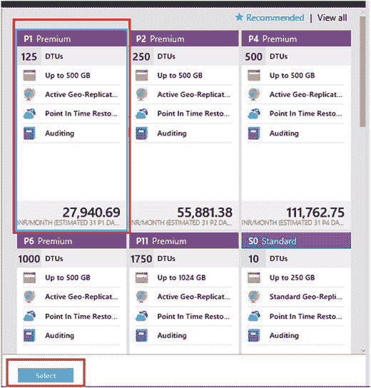

图 10-2. 选择新的性能级别

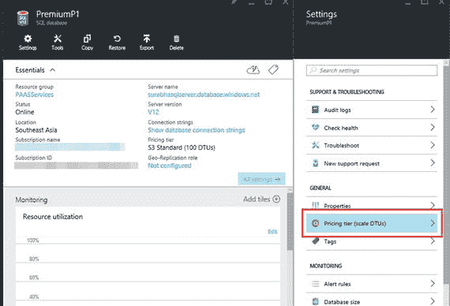

图 10-1. 使用 Azure 门户更改数据库服务层级

## Azure SQL 性能优化功能

Azure SQL 数据库提供了一些有用的功能，可用于优化 SQL 数据库的性能。其中最重要的功能包括：

*   内存中优化
*   查询性能见解
*   SQL 数据库索引顾问

### 内存中优化

Azure SQL 数据库中的内存中优化功能与 Microsoft SQL Server 2014（及即将推出的 SQL 2016）中的功能非常相似。内存中优化（内存中表和本机编译的存储过程）以及列存储索引可用于提高 OLTP 和分析工作负载的性能。此外，两者的结合可用于提供接近实时的分析。

### SQL 数据库索引顾问

Azure SQL 数据库索引顾问为 SQL 数据库提供建议，指出应创建（当前仅限非聚集索引）或删除（当前仅限重复索引）哪些索引。可以将索引顾问配置为自动将索引建议应用到数据库。如果建议无助于性能，可以轻松回滚。自动化索引建议需要在 Azure SQL 数据库上启用查询存储。

可以通过 Azure 门户访问索引建议，如图 10-3 所示。

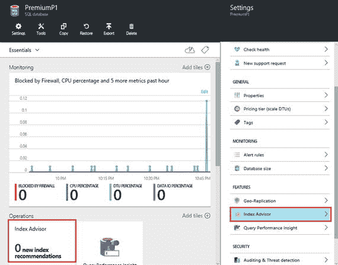

图 10-3. 在 Azure 门户上访问索引顾问

要获得索引建议，数据库需要有大量持续的使用量和活动。与不一致的一次性突发活动相比，在活动持续的情况下，索引顾问能提供更好的建议。如图 10-4 所示，可以配置顾问设置以自动创建或删除建议的索引。请注意，这将是一项在线操作，可能会影响正在数据库上运行的查询。

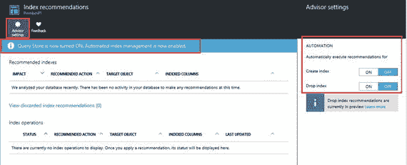

图 10-4. 配置索引顾问设置

如果有可用的索引建议，它们将显示在页面上。如果没有建议，顾问会提供原因说明。例如，在图 10-4 中，没有任何建议的原因是数据库上缺少活动。

### SQL 数据库查询性能见解

查询性能见解提供了一种非常简化的方法来监控和排查 Azure SQL 数据库的性能问题。查询性能见解需要查询存储才能运行，并可提供有关查询性能和 DTU 消耗的详细信息。

可以从 Azure SQL 数据库的“设置”页面访问查询性能见解，如图 10-5 所示。

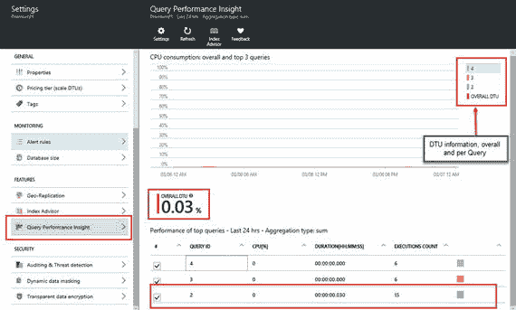

图 10-5. 查询性能见解

查询性能见解可用于确定整体 DTU 利用率以及每个查询的利用率。可以从门户访问每个查询的执行详细信息。例如，如图 10-6 所示，您可以看到查询文本以及该查询相应的 CPU 和 DTU 使用情况。可以调整查询性能见解设置，以显示不同时间段和不同数量查询的统计数据，如图 10-7 所示。

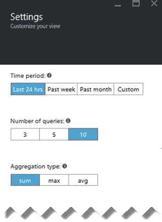

图 10-7. 查询性能见解设置

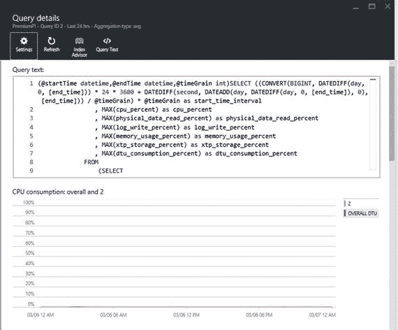

图 10-6. 详细的查询性能详情

查询性能见解基于查询存储，而查询存储有可能会耗尽存储空间。当查询存储耗尽存储空间时，它将进入只读模式，从而无法再存储任何查询性能数据。为查询存储设置正确的保留和清理策略非常重要。可以将清理设置为 `AUTO`（当达到大小限制时 SQL 将运行清理）或基于时间的保留策略。

```
ALTER DATABASE [YourDB]
SET QUERY_STORE (SIZE_BASED_CLEANUP_MODE = AUTO);
ALTER DATABASE [YourDB]
SET QUERY_STORE (CLEANUP_POLICY = (STALE_QUERY_THRESHOLD_DAYS = 30));
```

查询性能见解提供了一种很好的方法来找出有问题的查询并进行优化。例如，您可以获取消耗 CPU 最多的查询，并在它们对数据库产生重大性能影响之前对其进行调优。

## 监控 SQL 数据库

Azure 提供多种方法来监控 SQL 数据库的性能、资源利用率和安全性。这可以使用 Azure 门户，或使用数据库和逻辑服务器级别公开的 DMV（动态管理视图），或使用可在 SQL 数据库上配置的扩展事件来完成。


### 使用 Azure 门户

Azure 门户提供了一种非常便捷的方式来监控 SQL 数据库的资源利用率。诸如 `CPU` 百分比、`DTU` 百分比等计数器都可以通过 Azure 门户进行监控。这些信息可用于确保数据库处于最佳运行状况。Azure 门户中的监控选项卡（位于数据库详细信息下）可用于监控数据库的资源利用率（参见图 10-8）。此外，可以根据需要使用管理门户配置指标和时间段设置（参见图 10-9）。

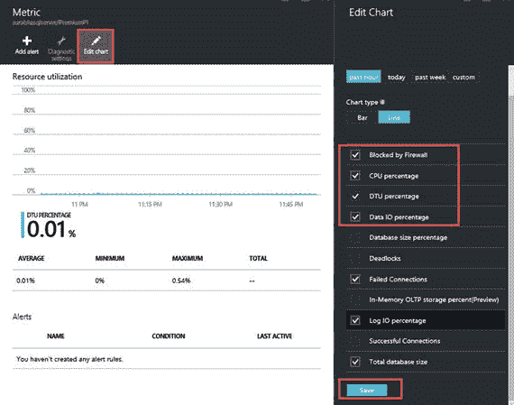
**图 10-9.** 配置监控指标

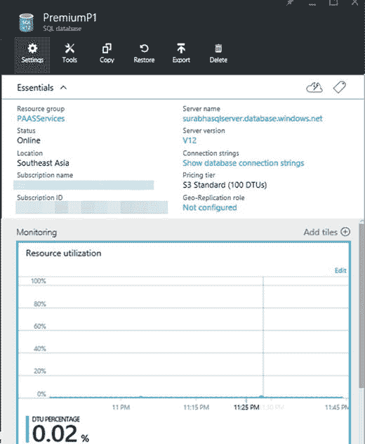
**图 10-8.** 监控 SQL 数据库资源利用率

监控图表可以进行编辑，以添加多个其他计数器，如图 10-9 所示。
配置好指标后，即可在 Azure 门户上监控资源利用率，如图 10-10 所示。

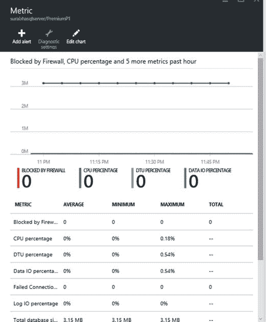
**图 10-10.** 在门户上监控指标

Azure 门户还允许用户针对任何可用指标配置警报（参见图 10-11）。例如，你可以设置一个基于电子邮件的警报，以指示数据库是否超过性能级别最大允许大小的 `80%`，或者 `DTU` 利用率百分比是否超过该服务层 `DTU` 的 `80%`。这些信息可用于判断是否需要更改数据库的性能级别。

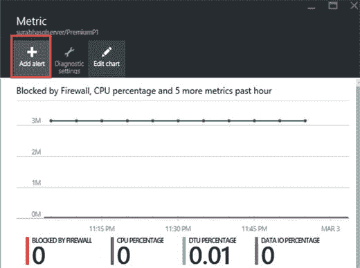
**图 10-11.** 为资源利用率指标配置警报

警报可以配置所需的阈值，并可设置为向管理员或其他用户发送电子邮件。这些设置可以通过 **添加警报规则** 页面进行更改（参见图 10-12）。

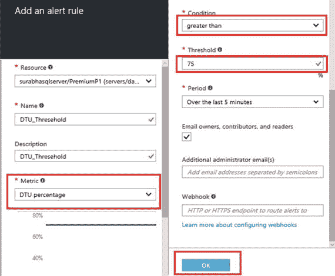
**图 10-12.** 配置警报属性

### 使用动态管理视图和目录视图

针对数据库和逻辑服务器公开的 `DMV` 和目录视图可用于报告和/或监控 SQL 数据库及逻辑服务器的性能、资源利用率、数据库对象详细信息、查询执行信息等。

对目录视图和 `DMV` 运行查询需要 `View Server State` 和 `View Database State` 权限。接下来提到的是一些最常用的 `DMV`。

#### 资源利用率

资源利用率（包括逻辑服务器级别和数据库级别）的详细信息也可以使用 Azure SQL 数据库提供的目录视图获取。

*   `sys.resource_stats`。提供逻辑服务器级别的资源利用率信息。该信息每五分钟收集一次，涵盖运行在该逻辑服务器上的所有数据库。
*   `sys.dm_db_resource_stats`。提供数据库的资源利用率信息。该信息每 `15` 秒收集一次。
*   `sys.event_log`。提供有关数据库连接、限流和死锁事件的信息。

#### 数据库相关信息

与资源相关的 `DMV` 和目录视图类似，Azure SQL 数据库也提供了许多 `DMV` 和目录视图来提供数据库相关信息，如空间使用情况、等待统计信息等。

*   `sys.dm_db_file_space_usage`。提供数据库中空间使用情况的信息。
*   `sys.dm_db_wait_stats`。提供数据库级别所有操作的等待统计信息。此 `DMV` 可用于诊断数据库性能问题和其他查询执行问题。
*   `sys.dm_database_copies`。提供有关数据库异地复制副本的信息。像 `maximum_lag` 和 `replication_state_desc` 这样的详细信息可用于确定复制的延迟和状态。

#### 执行相关信息

Microsoft SQL Server 中可用的大多数与执行相关的 `DMV` 在 Azure SQL 数据库中也可用，并可用于确定性能问题、执行相关问题等。以下是一些常用的 `DMV`：

*   `sys.dm_exec_requests`/`sys.dm_exec_sessions`/`sys.dm_exec_connections`。提供有关连接到（或正在其上执行活动请求）Azure SQL 数据库的会话的信息。
*   `sys.dm_exec_query_stats`、`sys.dm_exec_function_stats`、`sys.dm_exec_procedure_stats`、`sys.dm_exec_trigger_stats`。分别提供查询、存储过程、函数和触发器的聚合执行统计信息。这些 `DMV` 可用于确定在服务器上执行的耗时最长/CPU 消耗最高/读写最多的查询。当相应的查询或对象从缓存中移除时，这些 `DMV` 中的条目也会被移除。
*   `sys.dm_exec_query_memory_grants`。提供有关数据库上运行的每个查询的内存授予（待处理或已授予）的信息。

Azure SQL 数据库还提供了其他 `DMV` 来监控各种详细信息，如数据库索引、数据库或逻辑服务器的安全性等。所有 `DMV` 的完整列表可在 `MSDN` 上找到。


### 使用扩展事件

扩展事件（Extended Events 或 XEvents）并非新概念。自 SQL Server 2008 起，该功能就已包含在 Microsoft SQL Server 中。过去几年中，此功能已经过了大量优化和改进。通过 XEvents 可获取的信息量极其庞大，这一点可以从即将发布的 SQL Server 2016 已公开近 1,200 个事件这一事实中得到印证。

Azure SQL Database 上提供的扩展事件仅是 SQL Server 中可用功能的一个子集。这些扩展事件的作用域仅限于单个 Azure SQL 数据库，这意味着针对一个 Azure SQL 数据库运行的扩展事件无法用于监控同一逻辑服务器上另一数据库的事件。

清单 10-2 提供了一个示例脚本，可用于确定 Azure SQL Database 上扩展事件可用的事件/操作。

```sql
SELECT
o.object_type,
p.name         AS [package_name],
o.name         AS [db_object_name],
o.description  AS [db_obj_description]
FROM
sys.dm_xe_objects  AS o
INNER JOIN sys.dm_xe_packages AS p  ON p.guid = o.package_guid
WHERE
o.object_type in
(
'event','action'
)
ORDER BY
o.object_type,
p.name,
o.name;
```
**清单 10-2.** 用于确定 Azure SQL Database 可用事件或操作的 T-SQL 脚本

为 Azure SQL Database 配置扩展事件最简单的方法是使用 SQL Server Management Studio，如图 10-13 所示。在 SSMS 中，可通过展开数据库节点来访问扩展事件。

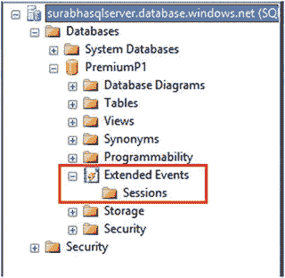
**图 10-13.** 访问扩展事件

右键单击会话节点并选择 `新建会话向导` 或 `新建会话`，即可配置新会话。这两种选项都相当易于使用。

以下是一个用于创建 XEvent 以监控阻塞和死锁的示例 T-SQL 脚本：

```sql
CREATE EVENT SESSION [Sample_XEvents] ON DATABASE
ADD EVENT sqlos.wait_info(
ACTION(sqlserver.database_name,sqlserver.session_id,sqlserver.sql_text)),
ADD EVENT sqlserver.blocked_process_report(
ACTION(sqlserver.database_name,sqlserver.session_id,sqlserver.sql_text)),
ADD EVENT sqlserver.database_xml:deadlock_report(
ACTION(sqlserver.database_name,sqlserver.session_id,sqlserver.sql_text)),
ADD EVENT sqlserver.lock_deadlock(
ACTION(sqlserver.database_name,sqlserver.session_id,sqlserver.sql_text)),
ADD EVENT sqlserver.sp_statement_completed(
ACTION(sqlserver.database_name,sqlserver.session_id,sqlserver.sql_text)),
ADD EVENT sqlserver.sql_batch_completed(
ACTION(sqlserver.database_name,sqlserver.session_id,sqlserver.sql_text))
ADD TARGET package0.event_file(
SET filename=N'https://YourStorageAccountName.blob.core.windows.net/ContainerName/OutputFile.xel'),
ADD TARGET package0.ring_buffer
WITH (STARTUP_STATE=ON)
GO
```

可以创建类似的会话来监控 SQL 数据库上的其他事件。

创建扩展事件需要 `CONTROL` 权限。此权限默认授予 `DBO` 用户。

关于当前正在运行的 XEvent 会话以及通过 XEvents 公开的事件、操作、目标等的其他信息，可以从 Azure SQL Database 公开的多个 DMV（动态管理视图）和目录视图中获取。以下是一些最常用的 DMV 和目录视图：

*   `sys.dm_xe_database_session_events`：公开有关当前活动会话已配置事件的信息。
*   `sys.dm_xe_database_sessions`：公开有关当前活动扩展事件会话的信息。
*   `sys.database_event_sessions`：公开 SQL 数据库上配置的所有 XEvents 会话的信息。
*   `sys.dm_xe_objects`：提供有关 Azure SQL Database 上 XEvents 公开的事件、操作、目标等的信息。此 DMV 与 Microsoft SQL Server 中可用的类似。

扩展事件有助于确定 Azure SQL Database 的性能问题或其他问题。但请注意，不要因捕获过多的会话或事件而使数据库过载。这样做可能导致内存过度提交，并最终引发数据库性能问题。

## 总结

本章讨论了 `数据库吞吐量单元` (`DTU`) 以及选择正确的性能级别至关重要。我们探讨了如何更改 Azure SQL 数据库的服务层级和性能级别，然后介绍了 Azure SQL 数据库和 Azure 管理门户上提供的各种性能优化和监控功能。


# 索引

## Microsoft Azure

- Microsoft Azure
  - 服务模型：`IaaS`、`PaaS`、`SaaS`
  - 关键组件和概念：
    - `Azure Active Directory (AAD)`
    - `Azure 架构`
    - `计算故障域`
    - `更新域`
    - `虚拟机`
    - `经典部署模型` vs. `资源管理器部署模型`
    - `部署自动化`
    - `RBAC`
    - `Portal`
    - 监控：`monitoring`、`metrics`、`configuration`、`监控资源利用率`、`门户指标`、`属性`、`资源利用率指标`
    - `Web 角色`
    - `Azure SQL 数据库`
    - `SQL Server 实例` (参见 `Azure Virtual Machines`)

## 计算产品

- `Compute offerings`
  - `Azure WebApps`
  - `虚拟机 (VMs)`
  - `计算资源提供程序 (CRP)`
  - `控制环功能`：`架构`、`控制管理节点`、`管理服务节点`、`服务节点重定向`

## 数据管理产品

- `数据管理产品`
  - `Azure Blob 存储`
  - `Azure SQL 数据库`
  - `Azure 虚拟机`
  - `NoSQL/键值存储`
  - `数据屏蔽`
  - `确定性加密`
  - `数据库迁移`
    - `导出/导入 bacpac 文件选项`
    - `SSMS`
    - `部署`
    - `事务复制`
  - `数据库吞吐量单位 (DTU)`：`定义`
  - `SQL 数据库`
    - `审核`
    - `索引顾问`
    - `访问索引`
    - `配置索引`
    - `建议`
    - `威胁检测`
  - `SQL 混合`
    - `Azure 存储备份到 Url`
    - `添加容器`
    - `Azure 存储`
    - `数据库备份`
    - `云基础设施`
    - `Microsoft Azure 存储账户`
    - `Blob 和容器安全对话框`
    - `Blob 存储服务创建`
    - `数据库创建`
    - `工程师`
    - `文件 IO`
    - `原生功能`
    - `密钥`
    - `智能备份`
    - `快照`
    - `虚拟机`
    - `添加 Azure 副本向导`
    - `证书下载屏幕`
    - `需求设置`
  - `SQL Server 数据工具 (SSDT)`
  - `SQL Server 实例`
    - `自动化`
    - `ARM`
    - `虚拟网络`
    - `Azure 订阅`
    - `命令`：`Get-AzureRmVMSize`、`模型和实例视图`、`New-AzureRmAvailabilitySet`
    - `资源组创建`
    - `Azure CLI`
    - `Azure 门户`
    - `Azure 资源管理器`
    - `配置账户`
    - `限制`
    - `磁盘计算`
    - `网络安全组服务器设置`
    - `大小存储限制`
    - `虚拟机区域`
    - `部署后`
  - `SQL Server Management Studio (SSMS)`
    - `bacpac 文件`
    - `配置部署`
    - `数据库选项摘要页面`
    - `向导导出`
    - `数据层应用程序`
    - `导出执行`
  - `SQL Server 事务复制`
    - `Azure SQL 数据库配置`
    - `快照复制`
  - `存储区域网络 (SAN)`
  - `存储资源提供程序 (SRP)`
  - `表存储`
  - `使用表`
  - `透明数据加密 (TDE)`

## 开发人员服务

- `开发人员服务`
  - `Application Insights`
  - `Visual Studio Team Services`

## 网络

- `网络`
  - `ExpressRoute 连接`
  - `点到站点 VPN`
  - `站点到站点 VPN`
  - `VNet`
  - `网络接口 (NICs)`
  - `网络资源提供程序 (NRP)`
  - `网络安全组 (NSG)`
  - `Microsoft Azure 网络`
    - `Azure AD Connect`
    - `组件`
    - `连接选项`
    - `数据中心`
    - `ExpressRoute 混合设置`
    - `点到站点连接`
    - `站点到站点连接`
    - `流量管理器`
    - `VPN`
  - `Azure DNS`
  - `负载均衡器设置`

## 存储

- `存储`
  - `Blob 存储`
  - `文件存储`
  - `队列存储`
  - `Microsoft Azure 存储`
    - `架构`
    - `DFS`
    - `DFS 容量`
    - `前端层`
    - `站点间复制`
    - `负载均衡，DFS 层`
    - `分区层`
    - `读取请求`
    - `存储戳记 Blob`
    - `AzCopy`
    - `块 Blob`：`复制/移动 Blob`
    - `页 Blob`
    - `GRS`、`LRS`
    - `高级存储账户创建限制`
    - `页 Blob 用途`
    - `查询数据服务`
    - `Blob 存储设计决策`
    - `文件存储特征`
    - `队列存储`
    - `ZRS`
  - `网络附加存储 (NAS)`
  - `全局冗余存储 (GRS)`
  - `本地冗余存储 (LRS)`
  - `区域冗余存储 (ZRS)`
  - `流层/分布式文件系统 (DFS)`

## 安全与审核

- `安全与审核`
  - `身份验证和授权`
  - `动态数据屏蔽`
  - `加密`
    - `列数据`
    - `连接`
    - `确定性和随机特征`
    - `TDE`
    - `T-SQL 脚本`
  - `功能`
  - `防火墙管理`
  - `行级安全性`
  - `行级安全性 (RLS)`
  - `站点恢复`

## 工具和实用程序

- `管理工具`
  - `Azure Portal`
  - `数据库创建和属性`
  - `服务层级和性能级别`
  - `SQL Server 管理工作室`
  - `命令行实用程序`
  - `REST API`
  - `SSDT 工具`
- `PowerShell 脚本`
- `T-SQL 脚本`
- `扩展事件/(XEvents)`
  - `访问数据库节点`
  - `DMV 和目录视图`
  - `T-SQL 脚本`
  - `XEvent 脚本`
- `DMV 和目录视图`
  - `数据库相关信息`
  - `执行相关信息`
  - `资源利用率`
- `查询性能洞察`
  - `详细信息页面设置查询`

## 概念和术语

- `业务连续性和安全性`
  - `Azure SQL 数据库`
  - `地理复制`
  - `地理还原`
  - `本地冗余`
  - `时间点还原`
  - `事务复制`
  - `设计应用程序`
  - `人为错误`
  - `维护和升级`
  - `规划/设计安全性`
  - `站点中断`
- `单元级/列数据加密`
- `云计算`
  - `Azure 服务`
  - `备份服务`
  - `计算产品` (参见 `Compute offerings`)
  - `数据管理产品` (参见 `Data management offerings`)
  - `开发人员服务` (参见 `Developer services`)
  - `网络` (参见 `Networking`)
  - `站点恢复`
  - `关键特征`
  - `Microsoft Azure 服务模型`：`IaaS`、`PaaS`、`SaaS`
- `估计恢复时间 (ERT)`
- `内存中优化`
- `平台即服务 (PaaS)`
- `性能级别`
  - `Azure 管理门户部署`
  - `优化功能`
  - `内存中`
  - `查询性能洞察`
  - `SQL 数据库索引顾问`
- `恢复点目标 (RPO)`
- `恢复时间目标 (RTO)`
- `基于角色的访问控制 (RBAC)`
- `服务层级` (参见 `Performance level`)
- `固态设备 (SSDs)`
- `总拥有成本 (TCO)`
- `虚拟机 (VM)`
  - `性能`
  - `备份速查表`
  - `计算`
  - `数据库页面`
  - `数据磁盘`
  - `日志文件`
  - `操作系统磁盘`
  - `PowerShell 脚本`
  - `高级 IO`
  - `源代码`
  - `标准 IO`
  - `数据文件`
  - `文件快照备份`
  - `托管数据库文件`
  - `监控配置选项`
  - `仪表板`
  - `多租户网络`
  - `运营洞察主页`
  - `性能问题`
  - `SQL 评估结果`
  - `服务账户权限`
  - `存储`
  - `存储空间`
  - `Tempdb`
- `虚拟网络 (VNet)`
- `Windows Azure 群集`
