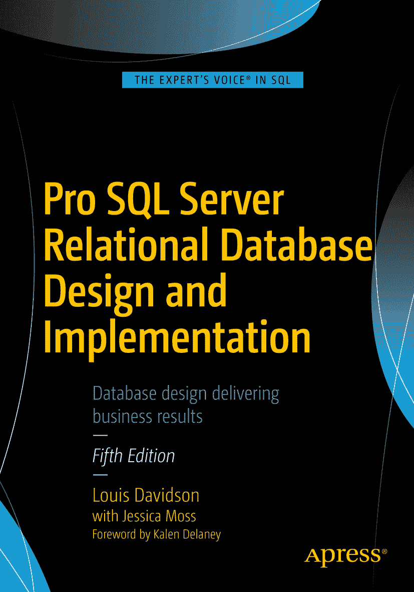

# 专业级 SQL Server 关系数据库设计与实现

## 第五版

路易斯·戴维森 与 杰西卡·莫斯  
卡伦·德尔尼 作序

ISBN 978-1-4842-1972-0  
电子书 ISBN 978-1-4842-1973-7  
DOI 10.1007/978-1-4842-1973-7  
国会图书馆控制号：2016963113  
© 路易斯·戴维森 2016

董事总经理：Welmoed Spahr  
主编：Jonathan Gennick  
开发编辑：Laura Berendson  
技术评审：Rodney Landrum, Arun Pande, Andy Yun, Alexzander Nepomnjashiy  
编辑委员会：Steve Anglin, Pramila Balan, Laura Berendson, Aaron Black, Louise Corrigan, Jonathan Gennick, Todd Green, Robert Hutchinson, Celestin Suresh John, Nikhil Karkal, James Markham, Susan McDermott, Matthew Moodie, Natalie Pao, Gwenan Spearing  
协调编辑：Jill Balzano  
文字编辑：Bill McManus  
排版：SPi Global  
索引：SPi Global  
美术设计：SPi Global

有关翻译信息，请发送电子邮件至 `rights@apress.com`，或访问 [`www.apress.com`](http://www.apress.com)。

Apress 和 friends of ED 图书可批量购买用于学术、企业或促销用途。大多数图书也提供电子书版本和许可。更多信息，请参考我们的“批量销售 - 电子书许可”专页：[`www.apress.com/bulk-sales`](http://www.apress.com/bulk-sales)。

本作品受版权保护。出版者保留所有权利，无论是材料的全部还是部分，具体包括翻译、转载、插图再利用、朗诵、广播、缩微胶片或其他任何物理方式的复制，以及信息存储与检索、电子改编、计算机软件，或任何现在已知或将来开发的类似或不同方法。书中可能出现商标名称、标识和图像。我们并非在每次出现商标名称、标识或图像时都使用商标符号，而是仅以编辑方式并出于商标所有者的利益使用这些名称、标识和图像，无侵权意图。本出版物中对商品名称、商标、服务标志及类似术语的使用，即使未特别标识，也不应被视为表达了其是否受专有权约束的意见。使用无酸纸印刷。

本书在全球图书贸易中由 Springer Science+Business Media New York 发行，地址：233 Spring Street, 6th Floor, New York, NY 10013。电话 1-800-SPRINGER，传真 (201) 348-4505，电子邮件 orders-ny@springer-sbm.com，或访问 www.springer.com。Apress Media, LLC 是加利福尼亚州的有限责任公司，其唯一成员（所有者）是 Springer Science + Business Media Finance Inc (SSBM Finance Inc)。SSBM Finance Inc 是特拉华州的一家公司。

谨以此书献给我于 2013 年感恩节后刚过世的母亲。她其实并不清楚 `SQL` 是什么，但一直给予我鼓励，并为我感到非常骄傲，正如我为她感到骄傲一样。
——路易斯

## 前言

数据库设计是一个极其重要但常被忽视的主题。由于良好的数据库设计并不依赖于特定的数据库产品，供应商通常不支持设计方面的教育。作为一名长期的认证培训师，我一直很清楚设计相关的问题未包含在标准课件中，因为它们是独立于供应商的。多年来，历经多个版本，微软曾有一门名为“实现数据库设计”的课程，人们常常简称为“数据库设计课程”，但它讲的是实现，而非设计。它关注的是设计完成后如何创建数据库。

恰当的设计不仅对数据正确性至关重要，还能帮助您有效排查问题并隔离性能瓶颈。有时，微小的设计更改就能带来巨大的性能差异，但要理解这些可能的更改是什么，您不仅需要了解一般的设计问题，还需要掌握系统实际设计的细节。当然，懂得越多越好。但要获得数据库设计的最佳性能，理想的方式是从项目一开始就着手于一个良好的设计。

既然没有数据库供应商提供关系数据库设计的培训课程，那么人们应该如何学习这个主题呢？显然，就是通过像您手中的这类书籍。路易斯·戴维森不仅向您展示如何实现数据库设计，更展示如何首先根据既定需求设计您的数据库。在最初的几章中，路易斯为您打下了坚实的关系数据库概念和数据建模基础，包括逻辑模型与物理模型的区别，以及规范化的细节。随后，在第二部分，他向您展示如何基于该设计创建一个数据库。在此过程中，他还介绍了其他几个与数据库相关的基本概念，这些概念对您的新数据库应用程序的性能（以及最终的成功）可能产生巨大影响：索引与并发性。

现代关系数据库产品的设计初衷是让您能在最短时间内创建数据库，并迅速开始加载数据和编写查询。但如果您希望这些查询在数据库增长到千兆字节甚至太字节时仍能保持良好性能，您就需要一个良好设计的坚实基础。在数据库设计上花费的时间，是对应用程序生命周期的一项巨大回报的投资。您理应有一个良好的开端，而路易斯能帮助实现这一点。

卡伦·德尔尼
[`www.SQLServerInternals.com`](http://www.sqlserverinternals.com)
华盛顿州普尔斯博 – 2016 年 11 月

## 引言

> 那是一个漆黑的暴风雨之夜…… ——史努比

这句话是许多小说的开篇，而且通常并非最可信的小说作品。虽然本书的核心显然是非虚构类作品，但我觉得有必要提醒您，本书中的几乎每一个例子都是虚构的，经过精心设计以阐述某个数据库设计原则。为什么用虚构的例子？我的好朋友杰里迈亚·佩斯卡曾完美地解释过这一点，他在推特上写道：“@peschkaj：我将在一台配置妥当、代码符合最佳实践的服务器上演示代码。然后你们所有人都会[抱怨]它耗时太长。”最严重的虚构作品将是关于需求的那一章，因为在大多数情况下，描述在哪里可以找到实际需求文档的章节，将比描述该过程并包含几个例子的那一章还要长。

所以，不要期望如果您能理解书中的所有例子，就能在一周内轻松成为专家。事实是，您在现实世界中遇到的问题将远为复杂，您需要大量练习才能把事情做得接近正确。您将从我的书中获得的是如何达成目标的思路，以及可供遵循的理想原则。如果您幸运的话，会有一两位对数据库设计略知一二的导师在您最初设计时提供协助。我知道当我刚开始时，就是从几位伟大的导师那里学习的，即使在今天，我也尽力在创建第一张表之前与他人探讨想法。（请注意，您不需要专家来帮您验证设计。一个糟糕的设计，就像变质的牛奶，闻起来很“fonky”，这比“funky”糟糕 3.53453 倍。）

然而，绝对不是虚构的，是我写作（以及重写）这本书的原因：伟大的设计仍然是必要的。程序员中有一个原则，随着 CPU 和磁盘等技术的改进，无需编写那么好的代码也能足够快地完成任务。虽然这个原则有一点道理，但想想这有多浪费。如果以糟糕的方式做某事需要 100 毫秒，而以正确的方式做只需要 30 毫秒，哪个更好？如果你只需要执行一次操作，那么两者都一样好。但我们通常不会编写只执行一次任务的软件。每次执行那个写得不好的任务，都在浪费 70 毫秒的资源来完成工作。现在想想存在多少数据库和多少代码，猜猜这对你所在的世界角落以及整个世界的影响会是什么。“多好才算足够好？”是必须问的问题，但如果你的目标是睡在人行道上，那你几乎注定不会最终拥有一栋比佛利山庄的豪宅（带游泳池和电影明星！）。

我不能向你保证会对数据库设计过程中涉及的理论进行最深入的阐述，我也不想这么做。如果你想达到更高的层次，Chris Date 的《数据库系统导论》（Addison Wesley 出版）的最新版是必读书籍，如果你在图书销售商的网站上搜索“数据库设计”，你会找到数百本其他相关书籍。问题是，其中很多书的理论性远远超过普通从业者想要（或会花时间去读）的程度，而且它们并没有真正涉及在实际数据库系统上的实际实现。其他面向实现的书籍则没有给你足够的理论，只专注于代码和调优方面，而这些是数据库已经一团糟之后才需要的东西。所以多年前，我着手写你现在手中的这本书，这是它在 Apress 旗下的第五版（早先还有一个版本由一个不具名的出版商出版）。技术已经发生了巨大变化，自 2012 年及以后的 `SQL Server` 版本极大地增加了复杂性。

本书的目标很简单，就是成为一本以技术为导向的书，从设计“为什么”要像奠基者们建议的那样开始，然后讨论“如何”利用 `SQL Server` 的特性来实现它。我将涵盖关系引擎的许多最典型特性，为你提供可用的技术。然而，我不能保证这将是你书架上关于数据库设计主题，尤其是关于 `SQL Server` 的唯一一本书。

诗人兼剧作家奥斯卡·王尔德曾说：“我还没年轻到什么都懂。”我有些懊恼地回顾过去，意识到就在我写第一本书《Professional SQL Server 2000 Database Design》（Wrox Press，2001 年）之前，我以为自己什么都懂。是无知、无拘无束、无边无际的热情给了我写第一本书的勇气。最终，我确实写了那第一版，而且它是一本相当不错的书，这很大程度上归功于我的技术编辑团队对我的锤炼。如果当初我没有那样的热情，今天我可能就不太可能在写这一版了。然而，如果你有几周时间可以浪费，回去将这本书的每一版，逐章逐节地与当前版本进行比较，你会发现材料的演进以及作者明显的成熟。

这种演进和成熟有几个原因。一个原因是我过去三个版本所拥有的编辑团队：先是 Tony Davis，现在是 Jonathan Gennick，这是第三次合作。他们对我的写作风格非常严格，并且对书的结构进行了奇迹般的改进（这就是为什么这一版没有重大的结构调整）。另一个原因仅仅是经验，因为自从我开始第一版写作以来，已经过去了 15 多年。但材料得以进步的最大原因，是它经过了检验。虽然我收到了不少好评，但我也得到了大量关于如何改进的反馈（其中一些是不太好听的意见！）。我非常认真地倾听，并从发布日期起就保留了一套笔记。我总是乐于收到任何我可以使用的反馈（特别是如果它不涉及任何关于这本书可以塞到哪里的解剖学术语）。我会继续保留我的电子邮件地址（`louis@drsql.org`），如果你想的话，也可以在我的网站上留下匿名反馈（[`www.drsql.org`](http://www.drsql.org)）。你可能还会在那里找到一份附录，涵盖了一些我在写作时没有篇幅放入，或者后来发现但希望当时就知道的材料。

## 数据库设计的目的

数据库设计的目的是什么？你到底为什么应该关心？主要原因是，一个设计得当的数据库使用起来很直接，因为一切都放在其逻辑位置上，就像一个组织良好的橱柜。当你需要辣椒粉时，去香料架上辣椒粉的位置找，比到处找直到发现它要容易得多，但许多系统就是以这种方式组织的。即使每个物品都有指定的位置，但如果太难找到，那这个物品的价值又在哪里？想象一下，如果电话簿完全没有排序。如果字典是通过把一个词放在文本中合适的位置来组织的，那会怎样？有了适当的组织，即使你不得不写一两个连接（join），要去哪里获取你需要的数据也会几乎是凭直觉的。我的意思是，这难道不有趣吗？

你也可能会惊讶地发现，数据库设计其实是一项相当直接的任务，并不像听起来那么困难。在项目开始时，正确地做这件事会比随手搭建一个数据库花费更多的前期时间，但它会在项目的整个生命周期中带来回报。当然，因为没有什么视觉上的东西能激发客户的兴趣，数据库设计是项目中最常被压缩以使进程看起来更快的阶段之一。即使是挑战性最低或最无趣的用户界面，对普通客户来说，也比最漂亮的数据模型有趣得多。编程用户界面占据了中心舞台，尽管数据通常是系统获得资助并最终创建的原因。并不是说你的同事不会注意到糟糕的数据模型与精美模型之间的区别。他们肯定会注意到，但当程序员需要编码时，决定正确存储数据的适当方法所需的时间可能会被忽视。我希望我能解决这个问题，因为光是凭这个我就能卖出一百万本书。本书将为你提供一些技巧和流程，帮助你完成数据库设计过程，其方式足够清晰，新手能懂，对最有经验的专业人士也有帮助。

这种设计和架构数据存储的过程，属于与数据库设置和管理不同的角色。例如，在数据架构师的角色中，我很少创建用户、执行备份或设置复制或集群。这些任务很少被提及，它们被认为是管理职责和 `DBA` 的角色。同时扮演开发人员和 `DBA` 的角色并不少见（事实上，在小机构工作时，你可能会发现你身兼数职，脖子都疼了），但如果你能让自己的思维与那些让你怀疑使用数据有多难、更受实现束缚的角色分离开来，你的设计通常会考虑得周全得多。在很大程度上，数据库设计看起来比实际要难。

## 本书目标读者

本书是为那些需要使用微软 SQL Server 技术家族中的任何一种来设计关系型数据库的专业程序员而编写的。无论你是初学者还是高级程序员，无论是专职的数据库程序员，还是从未使用过关系型数据库产品、想要了解关系型数据库为何如此设计，并希望获得创建数据库的实践示例和建议的程序员，都能从中获益。本书涵盖的主题从入门知识到高级技巧，旨在帮助新手成长为经验丰富的架构师，学习并发性、数据保护、性能调优、维度设计等技术。

## 本书结构

本书由以下章节组成，前五章是对设计数据库前需要了解/经历的基本主题和流程的介绍。第 6 章是一个通过脚本学习数据库如何构建的实践练习，本书的其余部分则围绕设计和实施的主题，提供指导和大量示例，帮助你开始构建数据库。

- 第 1 章: 基础知识。本章概述了开始设计一个优秀的关系型数据库所必需的基本术语和概念。
- 第 2 章: 需求导论。本章介绍了如何从客户那里收集和解读需求。即使直接与客户沟通需求不是你的工作职责，你也需要从分析师提供的文档中提取出你将要构建的数据库的某种需求。
- 第 3 章: 数据建模语言。本章作为数据架构师主要工具——模型——的导论。在本章中，我将详细介绍一种建模语言（`IDEF1X`），因为它是贯穿本书呈现数据库设计所使用的建模语言。我还会介绍几种其他常见的建模语言，以供那些因偏好或公司要求而需要使用这类模型的人参考。
- 第 4 章: 概念与逻辑数据模型制作。在创建数据模型的早期阶段，目标是讨论如何将客户的需求集转化为数据模型格式，尽可能地将表、列、关系和业务规则囊括其中。与可实施性相比，忠实地反映最终用户的意愿是更主要的目标。
- 第 5 章: 规范化。规范化的目标是以一种符合 SQL Server 引擎创建所基于的关系模型的方式来使用设计出的数据结构。为此，我们将把一组表、列、关系和业务规则进行格式化，使得每个值只存储在一个地方，并且每张表都代表一个单一的实体。规范化操作在最初几次进行时可能会让人感觉不自然，因为你不再关心如何使用数据，而必须思考数据本身，以及结构将如何影响该数据的质量。然而，一旦你掌握了规范化，不以规范化方式存储数据反而会感觉不对。
- 第 6 章: 物理模型实现案例研究。在本章中，我们将逐步完成将一个规范化模型转换为一个可工作数据库的整个过程。这是在数据库设计过程中，我们首次启动 SQL Server 并开始编写脚本来构建数据库对象。本章涵盖建表——包括为列选择数据类型——以及关系。
- 第 7 章: 利用检查约束与触发器扩展数据保护。除了数据在表和列中的排列方式外，可能还需要强制执行其他业务规则。在 SQL Server 中，`CHECK`约束和触发器构成了强制数据完整性条件的第一道防线，因为用户无法轻易地绕过它们。
- 第 8 章: 模式与反模式。除了基本的表设计技术集合外，我还使用几种技术来为未来的查询和使用便利性应用一个通用的数据/查询接口。本章将介绍几种常见的有用模式，并探讨一些某些人为简化接口实现而使用的、但可能对你的查询需求非常不利的反模式。
- 第 9 章: 数据库安全与安全模式。如今，安全性在几乎所有程序员心中都占据重要地位，或者说理应如此。本章介绍了 SQL Server 安全的基础知识，并展示了如何采用策略来在系统中实施数据安全，例如使用视图、触发器、加密，以及利用 SQL Server 工具集中的其他工具。
- 第 10 章: 索引结构与应用。在本章中，我将展示 SQL Server 中数据结构的基础知识，以及一些为获得更好性能而对数据进行索引的策略。
- 第 11 章: 并发性问题。在编写的代码中，如果适用，需要考虑资源共享的问题。本章描述了几种如何在你的数据访问和修改代码中实现并发性的策略。
- 第 12 章: 可复用的标准数据库组件。本章讨论了不同类型的可复用对象，将它们添加到你实现的许多（即使不是全部）数据库中会非常有用，可以为你的所有系统提供一个标准的问题解决接口，同时最小化数据库间的依赖。
- 第 13 章: 架构设计。本章涵盖了选择存储引擎和编写访问 SQL Server 代码时涉及的概念和考虑因素。我将介绍磁盘存储与内存存储、即席 SQL 与存储过程（包括两者的所有风险与挑战，如计划参数化、性能、工作量、可选参数、SQL 注入等），以及 T-SQL 与 CLR 对象孰优孰劣。
- 第 14 章: 报表设计。本章由杰西卡·莫斯撰写，概述了为报表需求进行设计与 OLTP/关系型设计有何不同，包括用于数据仓库设计的维度建模介绍。
- 附录 A: 标量数据类型参考。在本附录中，我列出了所有可被合理视为标量数据类型的类型，并说明了使用它们的原因、实现信息及其他细节。
- 附录 B: DML 触发器基础与模板。本书在多个示例中使用了触发器，所有这些示例都基于我在本可下载附录中提供的一套模板，包括其工作方式的示例测试，以及编写有效触发器的技巧和要点。（附录 B 可与代码一起从`www.apress.com`或我的网站下载。）

## 先决条件

本书假设读者对 SQL Server 有一定经验，特别是使用现有数据库编写查询的经验。除此之外，所涵盖的大部分概念都会进行解释，代码对于任何有使用任何语言编程经验的人来说都应该是易于理解的。

## 下载代码

代码将作为单独的文件从 Apress 下载站点提供。文件也将从我的网站 [`www.drsql.org/ProSQLServerDatabaseDesign.aspx`](http://www.drsql.org/ProSQLServerDatabaseDesign.aspx) 获取，并包含指向我可能在本书任何未来版本出版之前提供的额外材料的链接。

## 联系作者

欢迎随时通过我的网站 ([`www.drsql.org`](http://www.drsql.org)) 或我的电子邮箱 (`louis@drsql.org`) 向我提供关于本书的反馈。我将尝试在我的博客或文章中改进任何人们觉得有所欠缺的部分，并在我网站 ([`www.drsql.org/Pages/ProSQLServerDatabaseDesign.aspx`](http://www.drsql.org/Pages/ProSQLServerDatabaseDesign.aspx)) 上提供链接——不过，如果该直接链接发生变化，这本书仍将以某种方式在我的网站上占据显著位置。随着新想法、我发现的错误，或者我选择发布的额外材料变得可用，我会在那里发布更多信息，因为一旦本书不再是一堆数字比特，而成为纸上的墨迹实例，我可能就会想到这些。

本书作者引用的任何源代码或其他补充材料，读者均可从 [`www.apress.com`](http://www.apress.com) 获取。关于如何定位您书籍的源代码的详细信息，请访问 [`www.apress.com/source-code/`](http://www.apress.com/source-code/)。读者也可以在 SpringerLink 的各章节补充材料部分访问源代码。

## 致谢

> 设定另一个目标或梦想一个新的梦想，永远不会太迟。——C·S·刘易斯

我不是天才，也不是数据库设计领域的某种先驱。我只是一个在大约 15 年前向出版商提出问题的人：“你们有关于数据库设计的书吗？” 回答是：“没有，你为什么不自己写一本？” 于是我就写了，并且从那时起就没有停止过写作，现在这本书已经出到第五版了。我承认，以下“人物”在促成本书的诞生和一路演变方面提供了极大的帮助。有些人直接帮助了我，而另一些人可能甚至不知道这本书的存在。无论如何，他们都是这个过程的重要组成部分。

> ——路易斯·戴维森

*   远超其他任何人，耶稣基督，没有祂，我将没有力量完成撰写本书的任务。我知道我永远不配得到你赐予我的爱。
*   我的妻子，瓦莱丽·戴维森，感谢她再次容忍这种疯狂，同时她还在攻读教育学博士学位。
*   加里·康奈尔，感谢很久以前给我机会写我想写的那本书。
*   我现在的经理们，马克·卡彭特、安迪·柯利和基思·格里菲斯，感谢他们给我时间参加几次会议，这些会议确实帮助我创作出了一本优秀的书。还要感谢我在 CBN 的所有同事们，他们为本书和我的其他写作项目提供了许多实例。
*   PASS 会议（尤其是 SQL Saturday 活动），在过去三年里，我得以在那里打磨我的材料，遇见成千上万的人，并发现他们想知道什么。
*   杰西卡·莫斯，感谢她教会我很多关于数据仓库的知识，并花时间为本书撰写了最后一章。
*   保罗·尼尔森，感谢他挑战我进步，并更深入地思考关系模型及其优缺点。
*   MVP 计划，或许更重要的是，这些年来我接触到的 MVP 和微软人士。我在新闻组、邮件列表，特别是在 MVP 峰会上学到了很多东西，没有他们，我不可能做到现在的一半好（请查看本书第一版，那是我成为 MVP 之后情况变好的证据！）。
*   优秀的编辑团队，包括乔纳森·詹尼克和吉尔·巴尔扎诺，他们（形象地）因为我糟糕的结构、英语使用等问题“敲打”过我好几次，没有他们，我的写作有时会看起来像是出自一个不识字的黑猩猩之手。这些人大多列在版权页上，但我想特别感谢他们，还有托尼·戴维斯（他对本书的 2005 版贡献巨大），是他们让这本书变得出色，尽管我经常有啰嗦的写作风格。
*   致那些用数据库理论渗透我思维的学者们，比如 E·F·科德、克里斯·戴特、法比安·帕斯卡、乔·塞尔科，我在田纳西大学查塔努加分校的教授们，以及许多其他人。没有你们，我的知识将不及现在的一半。还要感谢戴特先生审阅了前一版的第一章；您可能为下一版的本书所做的贡献比对当前这一版还要多。
*   所有我在以前版本中感谢过的人，是你们在多年的诸多变化和教训中，帮助这本书走到了今天。我在你们过去 12 多年提供的帮助基础上不断构建。

