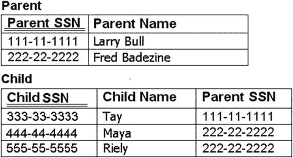
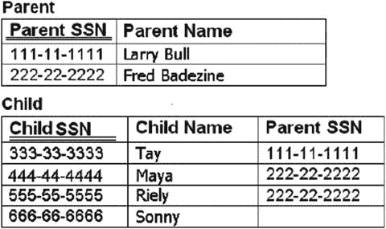
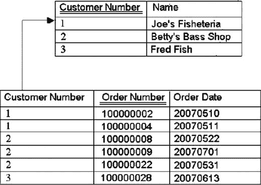
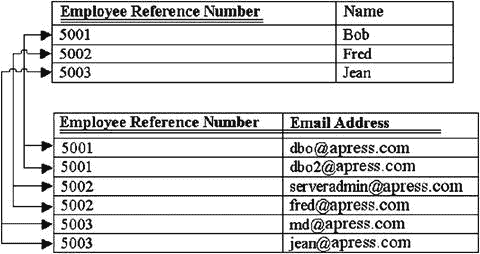

# 1. 基础知识

电子补充材料 本章的在线版本（doi:[10.​1007/​978-1-4842-1973-7_​1](http://dx.doi.org/10.1007/978-1-4842-1973-7_1)）包含补充材料，可供授权用户使用。

> 成功既不神奇，也不神秘。成功是持续应用基本基础的自然结果。——吉姆·罗恩，美国企业家和励志演说家

我对基础知识怀有一种**爱恨交织**的关系。任务看起来越简单，我似乎就越觉得它无趣——至少在我本身对这个话题有一定程度的喜爱之前是这样。在小学里，有一些有趣的课程，比如课间休息和午餐。但当书法课到来时，很少有孩子真正喜欢它，而那些喜欢的孩子大多只是迷恋铅笔芯的味道。然而，书法课是儿童教育发展的重要组成部分。没有它，你就无法在白板上书写，而没有这项技能，你真的能保住程序员的工作吗？就我个人而言，我沉醉于白板笔的味道，这或许不仅仅解释了我的职业。

就像书法是一项基本生活技能一样，数据库设计也有其自身需要掌握的一系列技能。虽然数据库设计并非一项难学的硬技能，但也绝非完全显而易见。从很多方面来看，正因为它不是硬技能，才难以精通。人们一直在设计数据库，但其中许多人对于什么才是“好”的设计理解有限。行政助理使用 `Excel` 构建数据库，孩子们在纸上列出他们电子游戏的清单，新手程序员使用各种数据库管理工具来构建数据库，几乎没有任何设计和实现是 100%错误的。问题在于，在几乎所有情况下，所产生的设计都存在根本性缺陷，导致未来的修改非常痛苦。当你读完本书时，你应该能够设计出减少许多常见根本性错误的数据库。如果说百万英里旅程始于一步，那么设计高质量数据库过程的第一步就是理解数据库为何如此设计，而这要求我们掌握基础知识。

我知道这个话题可能会让你感到无聊，但你会驾驶一座由不懂物理学的工程师设计的桥梁吗？或者你会乘坐一架由不懂飞行基本原理的人设计的飞机吗？听起来相当荒谬，对吧？那么，你会愿意将你的重要数据存储在由不懂数据库设计基础知识的人设计的数据库中吗？

本书的前五章致力于关系数据库设计的基本任务，并让你为接下来的任务做好思想准备：实现一个关系数据库。这些主题本质上不会特别困难，我将尽力把讨论保持在外行人的水平，而不会深入到让你在 `PASS` 峰会（[`www.sqlpass.org`](http://www.sqlpass.org)）上遇到我时想揍我的程度。

在本章中，我们将从一些非常有用的基本背景主题开始。

## 历史

这些关系数据库的东西从何而来？在本节中，我将介绍一些历史，主要基于 `科德` 的 `12 条规则` 来解释 `RDBMS`（`关系数据库管理系统`）的由来。

## 关系数据结构

本节将介绍一些基本的数据库对象，包括数据库本身，以及 `表`、`列` 和 `键`。这些对象你可能很熟悉，但在使用中存在一些常见的误解，这些误解可能决定一个设计是平庸还是专业、一流。

## 实体间的关系

我们将简要概述关系数据结构一节中介绍的数据结构之间可能存在的不同类型的关系。

## 依赖关系

本节将讨论值之间依赖关系的概念，以及它们如何影响本书后续的数据库设计过程。

## 关系编程

本节将涵盖使用 `C#` 或 `VB`（`Visual Basic`）的过程式编程与使用 `SQL`（`结构化查询语言`）的关系编程之间的区别。

## 数据库设计阶段

本节概述了关系数据库设计的主要阶段：概念/逻辑设计、物理设计和存储设计。出于时间和预算原因，你可能会想跳过第一个数据库设计阶段，直接进入物理实现阶段。然而，跳过任何或所有这些阶段都可能导致设计不完整或不正确，并且可能无法支持高性能查询和报告。

至少，这章关于基础知识的内容应该能让我们达到这样一个阶段：在本书中讨论和描述关系数据库时，我们拥有一套通用的术语和概念。在我多年的阅读和研究中，我注意到缺乏一致同意的术语是数据库社区中最大的问题之一。学术界有一套（好吧，可能有十套）术语，与我们这些实际编写代码的人使用的术语意思相同。有时，一个概念会用多个不同的词来表达，但最糟糕的情况是，一个词意味着多个不同的东西。从业者（像我，可能也包括你这位读者）有自己的术语，而且通常使用得非常随意。我自己在谈论数据库时也难免使用不严谨的术语，但在本书中，我尽力坚持使用一套统一的术语。有人可能会说这都是语义问题，而语义不值得争论，但老实说，它们才是唯一值得争论的东西。如果双方相互理解，那么同意各自保留意见是可以的，但生活中真正的问题往往出现在人们对一个想法完全认同，却对用来描述它的术语存在分歧的时候。


## 简要回顾历史

无论你来自哪个国家，毫无疑问，你的民族历史上都有一个起点。在美国，这个起点是《独立宣言》，随后是《美国宪法》（以及被称为《权利法案》的前十条修正案）。这些文件深深植根于每一位优秀美国公民的经历中。同样，我们也有三份被普遍认为是关系数据库起源的文献。

1979 年，当时就职于 IBM 研究实验室的**埃德加·F·科德**撰写了一篇题为“大型共享数据库的关系数据模型”的论文，该论文发表在《ACM 通讯》上（“ACM”是计算机协会 [`www.acm.org`](http://www.acm.org)）。在这篇 11 页的论文中，科德提出了一个革命性的构想，旨在突破当时所用数据库类型的物理障碍。那时，大多数数据库系统都非常面向结构，需要大量了解数据在存储中的组织方式。例如，要在数据库中使用索引，必须做出特定选择，比如只索引一个键，或者如果存在多个索引，用户需要知道索引名称才能在查询中使用它。

正如大多数程序员所知，优秀编程的基本原则之一是力求计算机子系统间的低耦合，而需要了解数据存储的内部结构显然是背道而驰的。如果你想更改或删除一个索引，使用该数据库的软件和查询也需要相应更改。科德的关系模型论文前半部分介绍了一系列构建块，这些构建块构成了我们所知的关系数据库的基础。其中包括表、列、键（主键和候选键）、索引甚至早期范式等概念。论文后半部分引入了基于集合的逻辑，包括连接操作。这篇论文几乎可以说是数据库存储独立性的宣言。

时间快进六年，在各大公司开始实施所谓的数据库关系系统之后，科德为《Computerworld》杂志撰写了一篇分为两部分的文章，分别于 1985 年 10 月 14 日和 10 月 21 日发表，题为“你的 DBMS 真的是关系型的吗？”和“你的 DBMS 是否按规则运行？”。尽管几乎无法获取这些原始文章的副本，但许多网站概述了这些规则，我也会这样做。这些规则超越了关系理论，并定义了特定的标准，如果一个关系数据库管理系统要真正被视为关系型的，就必须满足这些标准。

### 介绍科德的关系数据库管理系统规则

我认为从科德的规则开始是很有用的，因为尽管这些规则已有 30 多年的历史，但它们可能最出色地设定了衡量数据库关系化程度的标准，同时也解释了关系数据库之所以被如此实现的原因。这些规则的巧妙之处在于，它们表面上只是对数据库用户 KISS 宣言（保持简单、愚蠢，或者保持标准，两者皆可）的形式化陈述。通过为数据库供应商建立一套正式的规则和原则，用户可以访问不仅比早期数据平台更简化的数据，而且在任何声称是关系型的产品上工作方式都基本相同。当然，世界远非完美，这些也不是试图让所有人达成共识的最终原则。每个数据库供应商的关系引擎版本都不同，虽然基础原理相同，但在结构和使用方式上存在巨大差异。基础是相同的，并且在很大程度上，SQL 语言的实现非常相似（我将在下一节非常简要地讨论 SQL 标准）。这些规则对于刚开始学习设计的人来说之所以如此重要，主要是因为它们阐明了 SQL Server 和其他基于关系引擎的数据库系统的工作原理。

#### 规则 1：信息原则

> 关系数据库中的所有信息都以唯一一种方式表示——即表中的值。

虽然这条规则在对关系数据库稍有经验后可能显得显而易见，但事实并非如此。数据库系统的设计者本可以使用全局变量来保存数据或文件位置，或者设计出任何他们想要的数据结构。科德的第一条规则设定了一个目标：用户无需思考去哪里获取数据。一种数据结构——表——遵循了一种常见的行与列的数据模式，用户正是与这种模式打交道。

早期使用了许多不同的数据结构，这些结构需要大量了解数据的内部知识。回想一下你使用过的所有不同的数据结构和工具。数据可以存储在文件中、层次结构中（如文件系统），或者任何某人构想出的方法中。更糟糕的是，想想你用过的所有计算机程序；有多少遵循了足够通用的标准，使其工作方式与其他人的一样？很少，而且新的创新每天都在涌现。

虽然创新很少是坏事，但关系数据库的创新主要局限于从用户视图中封装起来的层次。20 年前有效的相同数据库代码，如今可以轻松运行，唯一的显著区别是现在运行速度快得多。我们使用的语言（SQL）有了巨大的进步，但除了少数已被弃用的古怪语法（最常见的例子是左连接用 `*=`，右连接用 `=*` [没有 `*=*` 表示全外连接]），20 年前编写的 SQL 今天仍然有效，这主要是因为数据存储的结构在用户看来与 SQL Server 1.0 时代完全相同，尽管内部机制已大不相同。

#### 规则 2：保证访问

> 每一个数据（原子值）都保证可以通过结合使用表名、主键值和列名进行逻辑访问。

这条规则是对第一条规则中关于如何访问数据的定义的扩展。虽然本章后面会更详细地定义这条规则中的所有术语，但可以说，列用于在数据行中存储单个数据点，主键是一种使用一个或多个数据列来唯一标识行的方法。这条规则定义了，至少存在一种独立于具体实现的方式来访问数据库中的数据。用户可以简单地根据已知的、能唯一标识所需数据的数据来请求数据。“原子”是一个我们将频繁使用的术语；它简单指代一个不可再分而不失去其基本价值的值。在本章后面以及第 5 章讲解范式时，我们还会多次涉及这个概念。

与第一条规则一起，规则二也建立了一种数据寻址系统。表名定位容器；主键值找到包含感兴趣单个数据项的行；而列用于寻址单个数据片段。


#### 规则 3：NULL 值的系统化处理

> 在完全关系型的 RDBMS 中支持`NULL`值（不同于空字符串或空白字符组成的字符串，也不同于零或任何其他数字），用于以系统化的方式表示缺失信息，且独立于数据类型。

`NULL`规则要求 RDBMS 为每种已实现的数据类型提供一种表示“缺失”数据的方法。这非常重要，因为它让你能够一致地指示某个列没有值，而无需借助变通技巧。例如，假设你正在列出你拥有的电脑鼠标数量，你认为自己还有一个 Arc 鼠标，但不确定。你将 Arc 鼠标列出来以表明你对这类鼠标感兴趣，然后在数量列中填入——什么？零？这是否意味着你没有？你可以输入-1，但这到底是什么意思？是你借出去了吗？你可以在列表中填写“不确定”，但如果你尝试对你拥有的鼠标数量进行程序化求和，`1 + "Not sure"`是无法计算的。

为了解决这个问题，设计了占位符`NULL`，使其能够独立于数据类型工作。例如，在字符串数据中，`NULL`与空字符串不同，并且它们总是应被视为一个未知的值。将它们想象成`UNKNOWN`通常有助于理解它们在数学和字符串操作中是如何工作的。`NULL`会在数学运算以及字符串运算中传播。

```
NULL + <anything> = NULL
```

其逻辑是，`NULL`意味着“未知”。如果你将已知的东西与未知的东西相加，你仍然不知道你得到的是什么；它仍然是未知的。在关系型数据库系统的历史中，`NULL`曾被错误实现或滥用，因此通常有一些设置允许你忽略`NULL`的属性。然而，这样做是不可取的。`NULL`值将是贯穿本书的一个主题；例如，我们在第 8 章中处理缺失数据的模式，并且在许多其他章节中，`NULL`极大地影响了数据的建模、表示、编码和实现方式。`NULL`是学术界多年来试图消除其必要性的一个概念，但尚未创造出实用的替代方案。请将其视为虽令人烦恼但通常是必要的。

#### 规则 4：基于关系模型的动态在线目录

> 数据库描述在逻辑级别上以与普通数据相同的方式表示，因此授权用户可以将相同的关联语言应用于对其的查询，就像应用于常规数据一样。

此规则要求关系型数据库必须是`自描述的`，并使用与存储用户数据相同的工具。换句话说，数据库必须包含用于编目和描述数据库自身结构的表，这使得用户能够轻松发现数据库的结构，而无需学习新的语言或访问元数据的方法。这一特性非常普遍，我们将在本书后半部分频繁使用`系统目录表`来展示我们刚刚实现的内容如何在系统中表示，以及你如何识别还创建了哪些其他类似对象。

#### 规则 5：综合性数据子语言规则

> 一个关系系统可以支持多种语言和各种终端使用模式。但是，必须至少有一种语言，其语句可以根据某种明确定义的语法表示为字符串，并且其支持以下所有功能的能力是可理解的：a. 数据定义 b. 视图定义 c. 数据操作（交互式和通过程序） d. 完整性约束 e. 授权 f. 事务边界（开始、提交和回滚）。

此规则强制要求存在一种关系数据库语言，例如`SQL`，来操作数据。该语言必须能够支持 DBMS 的所有核心功能：创建数据库、检索和输入数据、实施数据库安全性等。`SQL`并非绝对必需，其他实验性语言也一直在开发中，但`SQL`是事实上的标准关系语言，并且已使用超过 20 年。

关系语言不同于过程化（以及大多数其他类型的）语言，因为你不必指定事情如何发生，甚至不必指定在何处发生。从理想角度来说，你只需向关系引擎提出一个问题，它就会完成工作。至少，你现在应该意识到，这种封装和放弃职责的做法是关系型数据库实现的核心原则之一。保持接口简单，并将其与繁琐的数据访问现实隔离开来。这种封装使得关系语言编程非常优雅，但也常常令人沮丧。你通常受制于引擎程序员，并且无法像在`C#`中发现某个 API 运行不佳时那样实现自己的访问方法。另一方面，引擎设计师就像超级火箭科学家，通常在优化数据访问方面做得非常出色，因此最终，这样更好，而且，年轻的修行者，你越早放弃责任并学会遵循关系之道，就越好。

#### 规则 6：视图更新规则

> 所有理论上可更新的视图，系统也应能对其进行更新。

如我们之前简要定义的，表是一种具有行和列的结构，用于表示引擎存储的数据。视图是表的一种存储表示形式，其本身在技术上也是一个表；它通常被称为虚拟表。视图通常可以像常规（有时称为物化的）表一样对待，你应该能够像对表一样对视图进行创建、更新和删除数据。此规则在实践中其实很难实现，因为视图可以按用户希望的任何方式定义。

#### 规则 7：高级插入、更新和删除

> 将基本关系或派生关系作为单一操作数处理的能力不仅适用于数据的检索，也适用于数据的插入、更新和删除。

此规则可能是所有规则中对程序员来说最大的福音。如果你曾是计算机科学学生、喜欢冒险的爱好者，或者只是像`Microsoft SQL Server Storage Engine`团队成员那样的编程施虐狂，你可能曾不得不编写一些代码来从文件中存储和检索数据。你可能还记得，这非常痛苦且困难，因为你必须逐字节地操作数据，而且通常一次只为一个用户操作。现在，考虑一下成百上千个用户同时访问同一个文件，并且必须保证每个用户看到的数据都是一致的，并且能够并发修改。只有真正优秀的系统程序员才会认为这是一个有趣的挑战。

然而，作为关系引擎用户，你每天只需使用`SELECT`、`INSERT`、`UPDATE`和`DELETE`语句编写非常简单的语句就能完成这些。编写这些语句就像瓮中捉鳖——极其容易（如果你有顾虑，《流言终结者》已证实这很容易，但除非你打算晚餐吃鱼，否则不要在桶里射鱼——这不是件好事）。只需通过使用已知表及其列编写一条语句，你就可以将新数据放入一个表中，而该表可能同时有其他用户在查看、修改数据或进行任何操作。在第 11 章中，我们将介绍并发的概念，以了解这种修改语句的多任务处理是如何完成的，但即使在那里介绍的概念，也是我们这些没有麻省理工学院博士学位的普通程序员能够掌握的。


#### 规则 8：物理数据独立性

> 应用程序和终端活动在存储表示或访问方法发生任何变更时，在逻辑上保持不受影响。

应用程序必须使用相同的语法工作，即使数据库内部实现数据存储和访问方法的方式发生变化。这条规则基本上是说，数据的存储方式必须独立于其使用方式，并且数据的存储方式对用户无关紧要。这条规则将在我们的整个设计过程中发挥重要作用，因为我们将尽力忽略实现细节，而是根据用户的数据需求进行设计。这样，为 SQL Server 引擎编写代码的人员就可以为产品添加新的有趣功能，而我们即使不知道（或者至少几乎不知道）这些功能，也能使用其中的许多功能。就我们所知，虽然在任何版本的 SQL Server 中，`SELECT * FROM <tablename>` 的输出结果都是一样的，但底层代码可能大不相同（当我们看到新的内存优化特性将如何影响内部结构和查询处理时，差异将是巨大的！）。

#### 规则 9：逻辑数据独立性

> 应用程序和终端活动在基表上进行任何理论上允许不受影响的、保留信息的变更时，在逻辑上保持不受影响。

虽然规则 8 关注的是连接关系引擎与文件系统的内部数据结构，但这条规则更侧重于我们可以在 SQL 中对表定义执行的操作。假设你有一个包含两列 A 和 B 的表。用户 X 使用 A 列；用户 Y 使用 A 和 B 列。如果发现需要 C 列，那么添加 C 列不应该损害用户 X 和用户 Y 的程序。如果不再需要 B 列并因此将其删除，那么用户 Y 会受到影响是可以接受的，而只使用 A 列的用户 X 仍将不受影响。

与物理数据独立性不同，这条原则确实涉及遵循可靠的编程实践。例如，考虑被称为星号（`*`）的结构，它被用作表中所有列的通配符（如 `SELECT * FROM <tablename>`）。使用这种简写意味着，如果向表中添加了列，结果可能会以不太理想的方式发生变化。还有其他地方也可能导致问题（例如在 `INSERT` 语句中使用列列表），我们将在本书中陆续介绍。不过，总的来说，为任何你期望重用的操作明确声明所需的数据，总是一个好主意。

#### 规则 10：完整性独立性

> 特定于某个关系数据库的完整性约束必须能够在关系数据子语言中定义，并存储在目录中，而不是存储在应用程序中。

另一个真正基本的概念是数据应具有完整性；在这种情况下，数据子系统应该能够保护自己免受大多数常见数据问题的影响。声明数据必须符合特定模式的谓词应该在数据库中实现。最低限度，RDBMS 必须在内部支持定义和强制实施实体完整性（主键）和参照完整性（外键）。我们还有唯一约束来强制实施非主键的键、`NULL` 约束来声明在创建行时值是否必须已知，以及检查约束，它们就是必须满足的表或列条件。例如，假设你有一个存储员工工资的列。在存储工资的位置添加一个条件，确保值大于或等于零，这会很好，因为你可能有无薪志愿者，但我只能想到极少数工作是你需要付钱去上班的。

充分利用关系引擎的完整性约束可能具有争议性。应用程序程序员不喜欢放弃对规则管理的控制权，因为项目中通用规则的管理必须在多个地方进行（即使不考虑其他原因，为了用户友好性也应该如此）。同时，由于希望允许并发访问，许多需要使用引擎的约束在应用程序层实现是不可行的。例如，唯一性和参照完整性在客户端工具中实现起来极其困难，其原因在某些方面可能是显而易见的，但将在第 11 章中详细讨论。

关于这一特定条款的重要启示应该是：引擎提供了保护数据的工具，你应该以尽可能不干扰的方式，使用引擎来保护数据的完整性。

#### 规则 11：分布独立性

> 关系型 DBMS 的数据操作子语言必须使应用程序和终端活动在数据是物理集中还是分布的情况下，以及在任何分布的时刻，都能保持逻辑上不受影响。

这条规则在 1985 年极具前瞻性，到目前为止，除了最大的系统之外，也仅仅是在接近实现。它很大程度上是物理独立性规则的延伸，达到了一个跨越单个计算机系统容器的水平。如果数据移动到不同的服务器，关系引擎应该能够识别这一点并继续工作。自本书前一版于 2012 年出版以来，云计算得到了极大的发展，我们正越来越接近这一现实。

#### 规则 12：非篡改规则

> 如果一个关系系统拥有或支持一个低级（一次处理单条记录）语言，那么该低级语言不能被用来篡改或绕过在高级（一次处理多条记录）关系语言中表达的完整性规则或约束。

这条规则要求，访问数据的方法不能绕过关系引擎在其他规则中规定提供的任何功能，这意味着用户不应该能够以任何方式违反数据库的规则。一般来说，在撰写本文时，大多数非基于 SQL 的工具会执行诸如检查数据一致性和清理内部存储结构之类的操作。还有一行一行处理数据的操作符称为游标，它们以非常非关系型的方式处理数据，但在所有情况下，它们都没有能力绕过或规避 RDBMS 的规则。

一个常见的作弊行为是在使用批量加载技术加载大量数据时绕过规则检查。你在表上设置的所有完整性约束通常都会非常快，并且在正常操作期间只会造成可接受范围内的性能损失。但当你必须加载数百万行数据时，进行数百万次检查可能非常昂贵，因此有些工具可以跳过完整性检查。使用批量加载工具是必要的弊端，但它绝不能成为允许完整性差的数据进入系统的借口。


### 点头认可 SQL 标准

除了科德规则外，还有一个应当简要提及的主题是 SQL 标准。规则五、六、七都涉及对一种高级语言的需求，该语言能以一种为用户封装掉繁琐技术细节的方式来处理数据。为了满足这一需求，SQL 语言应运而生。SQL 语言最初被称为 `SEQUEL`（结构化英语查询语言），但因版权原因更名为 `SQL`（尽管我们今天仍经常将其读作 "sequel"）。`SQL` 起源于 20 世纪 70 年代初，由 Donald Chamberlin 和 Raymond Boyce 提出（参见 `http://en.wikipedia.org/wiki/SQL`），但通往我们现今所处位置的道路相当曲折。多个 `SQL` 版本相继出现，而使 `SQL` 成为一种通用语言的想法变得越来越不可能实现。

1986 年，美国国家标准学会（`ANSI`）制定了一个名为 `SQL-86` 的标准，用以规定 `SQL` 语言应如何发展。该标准采纳了当时主要参与者已在实现的功能，旨在使代码能在这些系统之间互操作，而引擎部分则成为系统中专门化的部分。这个早期规范限制极大，甚至不包括参照完整性约束。1989 年，`SQL-89` 规范被采纳，它包含了参照完整性，这是一个巨大的进步，也是朝着实现科德第十二条规则迈出的一步（参见 Bernus、Mertins 和 Schmidt 所著的 *Handbook on Architectures of Information Systems* [Springer 2006]）。

`SQL` 标准的更多版本相继出台，分别在 1992、1999、2003、2006 和 2008 年。在很大程度上，这些文档读起来并不轻松，对于普通的程序员/从业者来说也并非真正有太多实际意义，但它们在将各种数据库引擎的新语法和特性纳入考量方面颇具启发性。该标准还有助于理解人们谈论标准 `SQL` 时所指的内容。它也能解释数据库供应商做出的一些更有趣的选择。

这堂简短的历史课主要是为了让你开始理解为何关系型数据库在今天是这样实现的。在三篇论文中，科德在定义关系型数据库是什么以及应如何使用方面迈出了重要一步。在早期，科德的 12 条规则被用来判断数据库供应商是否可以自称为关系型数据库，并对数据库开发者提出了严峻的实现挑战。正如你将在本书结尾看到的，即使在今天，实现这些规则中最复杂的部分也正变得可行，尽管 `SQL Server`（以及其他 `RDBMS`）仍未能完全实现其目标。

显然，在 1985 年至今的这段时间里，还有更多的历史。包括科德本人在内的许多学者，已将关系型数据库的科学发展到了我们今天的水平。著名的贡献者包括 C. J. Date、Fabian Pascal（他有一个网站 `www.dbdebunk.com`）、Donald Chamberlin 和 Raymond Boyce（他参与了其中一种范式的建立，在第 6 章中介绍），以及许多其他人。他们的部分材料可能只对学术界有趣，但即使非常难以理解，它们都有实际应用价值，并且对于任何设计中等复杂度模型的人来说都非常有用。我强烈建议你在读完本书后，阅读你能找到的所有其他数据库设计资料（注意，是读完本书之后）。在本书中，我们将保持内容处于一个非常实用的水平，旨在不降低其深度的前提下，迎合普通从业者的需求，聚焦于最重要的细节，并提供常见的有用构建块，以帮助你快速开始开发优秀的数据库。

## 识别关系型数据结构

### 关系型数据结构

本节介绍以下核心关系型数据库结构和概念：

*   数据库与模式
*   表、行和列
*   缺失值（`null`）
*   唯一性约束（键）

作为本书的读者，这可能不是你第一次接触数据库，因此你无疑对其中一些概念有些熟悉。然而，你可能会发现这里至少有几个你未曾思考过的要点，它们可能有助于你理解后续我们为何要那样做——例如，一个表由唯一的行组成，或者在单行中，一个列必须仅代表一个值。这些要点区分了客户能够毫不犹豫地依赖的数据库，与一个其中数据不断受到质疑的数据库。

### 容属关系与关系模型

请注意，在本节中，我们只讨论关系模型中的项目。在 `SQL Server` 中，基于其实现方式，你有几层容属关系。例如，服务器的概念类似于一台计算机，或者可能是一台虚拟机。在一个服务器上，你可以有多个 `SQL Server` 实例，每个实例又可以有多个数据库。术语“服务器”和“实例”常被误用为同义词，这主要是由于 `SQL Server` 最初的工作方式（只允许每个服务器一个实例，而且产品名称就是 `SQL Server`，这是个很自然的问题）。在本书的大部分内容中，我们不需要考察比数据库更高的层级，这将在下一节中介绍。


## 介绍数据库与架构

数据库的核心，本质上就是一个结构化的事实或数据集合。它不必是电子形式；它可以是图书馆的卡片目录、你的支票簿、一个 SQL Server 数据库、一个 Excel 电子表格，或者甚至只是一个简单的文本文件。通常，任何数据库的目的都是为了便于快速搜索和检索数据而对数据进行排列——无论是电子还是其他形式。

数据库是最高级别的容器，你将用它来分组服务于共同目的的所有对象和代码。在一个数据库服务器实例上，你可以拥有多个数据库，但最佳实践建议根据需求尽可能少地使用。这个容器通常被认为是期望所有数据得以维护的一致性层级，但为了某些目的可以覆盖此原则（一个例子是数据库可以被部分恢复，并用于实现高可用性数据库系统的快速恢复）。数据库也是文件系统存储与逻辑实现交汇的地方。直到本书非常靠后的部分，实际上是在第 10 章，我们才会将数据库视为逻辑容器，并忽略数据如何存储的内部属性；我们将主要把存储和优化视为后关系结构实现阶段的考虑因素。

下一级的容器化是架构。你可以使用架构来对数据库中具有共同主题甚至共同所有者的对象进行分组。数据库服务器上的所有对象都可以通过知道它们所在的数据库和架构来寻址，这就给出了所谓的“四部分名称”：

```
serverName.databaseName.schemaName.objectName
```

名称中唯一始终必需的部分是 `objectName`，但正如我们稍后将看到的，通常最好始终包含架构名称。在正常使用中，包含数据库名称和服务器名称通常不被提倡。这些命名部分通常由用户所处的上下文获取，以使代码更具可移植性。三部分名称将用于访问上下文之外数据库的资源，而四部分名称则用于访问位于另一台服务器上的数据库资源。数据库开发的一个目标是尽可能将代码隔离在单个数据库中。访问不同服务器上的数据库是几乎任何从事数据库编码的人都不推崇的做法，首先是因为它可能对性能造成严重影响，其次是因为它会产生难以追踪的依赖关系。

数据库充当主要容器，用于保存、备份并在必要时恢复数据。它并不限制你只能访问该数据库内的数据；然而，将数据访问需求保持在一个数据库内通常应该是目标。

架构是你用来隔离同类对象或目的对象的一层容器化。它们不仅在逻辑组织上有价值，而且正如我们稍后将看到的，在控制数据访问和限制权限方面也很有价值。在第 9 章，我们将详细讨论在不同数据库和架构中管理数据安全的方法、价值和问题。

**注意**

“Schema”（架构）一词还有其他常见用法，你应该意识到：整个数据库结构被称为架构，用于在数据库中创建对象的`数据定义语言`（DDL）语句（如 `CREATE TABLE` 和 `CREATE INDEX`）也被称为架构。一旦我们开始讨论架构数据库对象，我们将明确划清这一界限。

## 理解表、行与列

在关系数据库中，表用于表示某个概念（通常是像人、地点、事物或想法这样的名词）以及关于该概念的信息（名称、地址、描述等）。正确定义你的表是数据库设计最重要的部分，我们将在后面更深入地讨论。

表是对概念的容器的定义。因此，例如，一个表可能代表一个人。每个人的实例，如“Fred Smith”、“Alice Smith”，都在数据的“行”中表示。所以在这个人员表中，一行将代表一个人。行进一步划分为列，列包含关于该行所表示对象的单条信息。例如，一行的名字列将包含“Fred”或“Alice”。表不应被认为具有任何顺序，也不应被认为是某种存储中的一个位置。正如本章前面“简要穿越历史之旅”一节所讨论的，关系数据库系统背后的一个主要设计理念是它应该从物理实现中封装出来。

“原子性”（或“标量”）这个术语，我之前简要提到过，描述了列中存储的数据类型。“原子”的含义与物理学中的含义基本相同。原子值将被分解，直到无法在不失去原始特性的情况下变得更小。在化学中，分子由多个原子组成——H[2]O 可以分解为两个氢原子和一个氧原子——但如果你将氧原子分成更小的部分，你将不再拥有氧（而且你的邻居也不会喜欢你家原址出现的那个巨大弹坑）。

标量值可以意味着对普通用户显而易见的单个值，比如一个单词或一个数字，也可以意味着像存储在二进制或复杂类型（例如具有经度和纬度的点）中的一整章书这样的东西。关键在于，该列代表一个单一的值，该值在你开始使用数据时，能抵抗被分解到比所需更低层级。因此，将标量值定义为两个独立的值，比如 `X` 和 `Y`，是完全可接受的，因为它们不是彼此独立的，而像 `'Cindy,Leo,John'` 这样的值很可能不是原子性的，因为该值可以被分解成三个独立的值而不会丢失任何含义。虽然你可能在想，任何值一块饼干钱的程序员都可以在需要时将这些值拆分成三个，但我们在整个数据库设计过程中的目标是提前完成这项工作，为关系引擎提供一种处理我们数据的统一方式。

在继续之前，我想花点时间讨论一下“表”、“行”和“列”这些术语存在的问题。这些术语通常被 Excel、Word 等工具用于表示显示数据的固定结构。对于“表”，Dictionary.com（ [`www.dictionary.com`](http://www.dictionary.com) ）有以下定义：

> 数据的一种有序排列，特别是数据以列和行的形式排列，基本呈矩形。

当数据以矩形形式排列时，它具有顺序和非常具体的位置。大多数人熟悉的这个“表”定义的基本示例是 Microsoft Excel 电子表格，如图 1-1 所示。


**图 1-1.** Excel 表格


在图 1-1 中，行编号为 1–4，列标为 A–E。该电子表格是一个账户表。每列代表关于账户的某项信息：社保号码、账号、账户余额，以及账户持有人的名和姓。电子表格的每一行代表一个特定的账户。按位置（例如，单元格 `A1`）或值范围（例如，`A1–A4`）访问电子表格中的数据而不引用其数据结构，这种情况并不少见。**这一点我已经提过好几次了，它违背了关系数据库的原则。**

## 表格、行和列的术语

在接下来的几个表格中（在本书的文本里——看，这个词有很多意思！），我将介绍表格、行和列的术语，并解释它们在本书中的用法。理解这些术语远比它看起来更重要，因为正确使用这些术语将为你正确使用关系型对象指明方向。让我们从以下不同视角来看这些不同的术语及其呈现方式（请注意，还有其他不少术语也表示相同的事物，但这些是我在主流讨论中最常见的）：

*   **关系理论**：这个观点相当学术化。它在术语方面往往非常严格，其名称基于关系数据库的数学起源。
*   **逻辑/概念**：这套术语用于实际实现阶段之前。基本上，它是基于 `实体-关系（ER）建模` 的概念，使用的术语比你在实际使用数据库时更通用。
*   **物理**：这套术语用于已实现的数据库。这里的“物理”一词有点误导，因为物理数据库实际上是对有形的物理架构的一种抽象。然而，这个术语多年来已经根植于数据架构师的脑海中，不太可能改变。
*   **记录管理器**：早期的数据库系统需要大量的存储知识；例如，你需要知道在文件中去哪里获取一行数据。这些系统的术语已经蔓延到关系数据库中，因为其概念非常相似。

表 1-1 展示了从各种视角赋予基本数据表示（例如，表）的所有名称。这些名称的含义略有不同，但经常被用作完全同义词。

### 表 1-1：基本数据表示术语细分

| 视角 | 名称 | 定义 |
| --- | --- | --- |
| 关系理论 | `关系` | 这个术语很少被非学术界人士使用，但有些文献专门用它来指代大多数程序员心目中的表。它是一个严格定义的结构，由元组和属性组成（稍后将详细定义，但在概念上与行和列有很多共同之处）。注意：关系数据库由此术语得名；该名称并非源于表之间可以相关（关系将在本章后面部分介绍）。 |
| 逻辑/概念 | `实体` | 实体代表你想为其存储数据的某个“事物”的容器。例如，如果你在为人力资源应用程序建模，你可能会有一个 `员工` 实体。在逻辑建模阶段，会识别出许多实体，其中一些最终会成为表，一些会根据称为规范化的过程（我们将在第 6 章详细介绍）成为多个表。同样应该清楚的是，实体不是具有实现的东西，而是一种引导我们走向实现的规范工具。 |
| 物理 | `表` | 从本质上讲，表与关系和实体非常相似，因为其目标都是表示你将为其存储数据的某个概念。关系和表之间最大的区别在于，表在技术上可能包含数据重复（尽管在我们的实现中不应该允许这样做）。如果你了解视图，你可能会好奇它们如何融入其中。视图被视为一种表，通常是“虚拟”表，因为它的结构被认为是永久性的。 |
| 记录管理器 | `文件` | 在许多非关系型数据库系统（如 Microsoft FoxPro）中，每个操作系统文件代表一个表（有时一个表实际上被称为数据库，这太容易让人混淆了）。多个文件组成一个数据库。SQL Server 也使用文件，但在引擎层面，并且可能包含一个或多个表的全部或部分内容。正如之前关于科德规则所提到的，数据的存储方式对于它的使用方式或称呼应该无关紧要。 |
| 物理 | `记录集`/`行集` | 记录集或行集是已检索出来供使用的数据，例如发送给客户端的结果。最常见的形式是表格数据流，用户界面或中间层对象可以使用。记录集与普通表有一些相似之处，但它们之间的差异也巨大。在数据库设计的上下文中，你很少会处理记录集，但一旦你开始编写 SQL 语句，你就会接触到。关系/表与记录集的一个主要区别在于，前者被认为是“集合”，没有顺序，而记录集是用于通信的物理结构。 |

### 表 1-2：列术语细分

接下来，我们看看列。表 1-2 列出了从各种视角赋予列的所有名称，其中几个我们将在设计过程的不同上下文中使用。


## 数据库术语的不同视角定义

| 视角 | 名称 | 定义 |
| --- | --- | --- |
| 逻辑/概念 | 属性 | “属性”一词在编程领域很常见。它基本上指定了关于某个对象的一些信息。在建模中，这个术语几乎可以应用于任何事物，并且它可能实际上代表其他实体。与实体一样，为了生成用于实现的适当表，规范化将改变属性的形状，直到它们成为合适的列素材。 |
| 关系理论 | 属性 | 当用于关系理论时，属性具有严格的含义，即描述关系所建模事物本质的标量值。 |
| 物理 | 列 | 列是描述一行所代表内容的单条信息。强烈建议列在表中的位置对其使用无关紧要，尽管 `SQL` 确实在目录中定义了列的从左到右顺序。所有对列的直接访问都将通过名称而非位置进行。每个列值预期是（但并非严格强制）一个原子的标量值。 |
| 记录管理器 | 字段 | “字段”一词在数据库设计上下文中有几种含义。一种含义是行和列的交叉点，就像电子表格中一样（这也可能被称为单元格）。另一种含义与早期数据库技术更相关：字段是记录中的偏移位置，正如我将在表 1-3 中定义的，它是磁盘上文件中的一个位置。没有设定要求字段只能存储标量值，仅仅要求它可以通过编程语言访问。 |

### 注意
像 `XML`、空间类型（`geography` 和 `geography`）、`hierarchyId`，甚至自定义的 `CLR` 类型这样的数据类型，确实开始使原子的、标量的、不可分解的列值的概念变得模糊。这些类型都有一些实现价值，但在你的设计中，初始目标是首先使用标量类型，而将通常被称为“超越关系”的类型作为后备方案，用于实现仅用标量过于困难的结构。此外，`SQL Server 2016` 增加了对翻译和读取 `JSON` 格式值的一些支持，尽管还没有正式的数据类型支持。

最后，表 1-3 描述了引用一行的不同方式。

### 行术语解析
| 视角 | 名称 | 定义 |
| --- | --- | --- |
| 关系理论 | 元组 | 元组（发音为“tupple”，而不是“toople”）是一个有限的无序集合，包含相关的、也是无序的名称-值对集合，如 `ColumnName: Value`。所谓“命名”，我的意思是每个值都有一个已知的名称（例如，`Name: Fred; Occupation: gravel worker`）。“元组”一词在关系数据库上下文中很少使用，除了学术圈，但你应该知道它，以防你在浏览网页寻找数据库信息时遇到它。请注意，元组在多维数据集和 `MDX` 中也用于表示几乎相同的概念，如果事情还不够令人困惑的话。关系定义的一个重要部分是，不能有两个相同的元组。这种唯一性的概念是本书中反复出现的主题，因为虽然在表的实现中唯一性不是一个严格的规则，但它是一个非常强烈期望的设计特征。 |
| 逻辑/概念 | 实例 | 基本上，在你设计时，你会考虑一个实体的一个版本会是什么样子，而这种存在通常被称为一个实例。 |
| 物理 | 行 | 一行本质上与一个元组相同，每一列代表行中的一条数据，而这一行代表了表被建模来代表的一件事物。 |
| 记录管理器 | 记录 | 记录被认为是磁盘上文件中的一个位置。每个记录由字段组成，这些字段都有物理位置。理想情况下，这个术语不应与“行”一词互换使用，因为行不是一个物理位置，而是一个使用数据访问的结构。 |

如果这是你第一次看到表 1-1 到 1-3 中列出的术语，我预计此刻你正在用头撞某种坚固的东西（并且可能希望你能用我的头代替），并试图弄清楚为什么使用如此多样的术语来表示几乎相同的东西。例如，许多激烈的争论（flame war）都是因字段和列之间的区别而爆发的。我个人每当有人在真正想表达“行”或“元组”时使用“记录”这个词，都会感到不适，但我也意识到，如果一个人理解在 `SQL` 中应该如何处理表的一切，那么误用一个术语并不是最糟糕的事情。


### 处理缺失值（NULL）

在上一节中，我们提到列用于存储单个值。但这样做的问题在于，你常常需要存储一个值，而在处理过程的某个时点，你可能并不知道这个值是什么。如前所述，科德的第三条规则定义了`NULL`值的概念，它不同于用于表示缺失信息的空字符串、空白字符字符串或零，并以一种独立于数据类型的方式系统性地存在。所有数据类型都能够表示`NULL`，因此任何列都有可能表示数据缺失。

在表示缺失值时，理解该值的含义至关重要。由于该值缺失，因此假定可能存在一个值（即使该值明确表示“无有效值”）。正因为如此，没有两个`NULL`值被视为相等，你必须将该值视为可能是任何值。这引出了`NULL`的几个有趣特性，这些特性使其使用起来颇为棘手，尽管它又经常不可或缺：

*   任何值与`NULL`连接，结果都是`NULL`。`NULL`可以表示任何有效值，因此如果一个未知值与一个已知值连接，结果仍然是一个未知值。
*   所有与`NULL`的数学运算结果都将为`NULL`，原因完全相同：任何值与未知值进行`+/-/*`等数学运算，结果都是未知值（即使是`0 * NULL`，结果也为`NULL`）。
*   当引入`NULL`时，逻辑比较会变得棘手，因为`NULL <> NULL`（其布尔表达式结果为`NULL`，而非`FALSE`，因为任何未知值都可能与另一个未知值相等，因此它们不相等这一点是未知的）。在代码中需要特别注意，某个条件是在查找`TRUE`还是非`FALSE`（即`TRUE`或`NULL`）的条件。SQL 约束尤其会查找非`FALSE`的条件来满足其谓词。

让我们稍微扩展一下关于逻辑比较的这一点，因为它对于正确使用`NULL`非常重要。当`NULL`被引入布尔表达式时，真值表变得更加复杂。在评估涉及`NULL`的条件时，结果不是简单的二元布尔值，而是有三种可能：`TRUE`、`FALSE`或`UNKNOWN`。只有当搜索条件的评估结果为`TRUE`时，行才会出现在结果中。例如，如果你的一个条件是`NULL=1`，你可能会倾向于认为答案是`FALSE`，但实际上它解析为`UNKNOWN`。

这一点之所以有趣，是因为有如下的查询：

```sql
SELECT CASE WHEN 1=NULL or NOT(1=NULL) THEN 'True' ELSE 'NotTrue' END;
```

由于这里有两个条件，且第二个条件是第一个的反面，这看起来似乎`NOT(1=NULL)`或`(1=NULL)`其中之一应该评估为`TRUE`。但事实上，`1=NULL`是`UNKNOWN`，而`NOT(UNKNOWN)`也是`UNKNOWN`。未知的反面并不像你猜测的那样是“已知”。相反，既然你不确定`UNKNOWN`代表`TRUE`还是`FALSE`，那么它的反面也可能是`TRUE`或`FALSE`。

表 1-4 展示了`NOT`运算符的真值表。

**表 1-4. NOT 真值表**

| 操作数 | NOT(操作数) |
| --- | --- |
| `TRUE` | `FALSE` |
| `UNKNOWN` | `UNKNOWN` |
| `FALSE` | `TRUE` |

表 1-5 展示了`AND`和`OR`运算符的真值表。

**表 1-5. AND 与 OR 真值表**

| 操作数 1 | 操作数 2 | 操作数 1 AND 操作数 2 | 操作数 1 OR 操作数 2 |
| --- | --- | --- | --- |
| `TRUE` | `TRUE` | `TRUE` | `TRUE` |
| `TRUE` | `FALSE` | `FALSE` | `TRUE` |
| `TRUE` | `UNKNOWN` | `UNKNOWN` | `TRUE` |
| `FALSE` | `FALSE` | `FALSE` | `FALSE` |
| `FALSE` | `UNKNOWN` | `FALSE` | `UNKNOWN` |

在这篇介绍性章节中，我的主要目标是指出`NULL`的存在，并且它是关系数据库基础的一部分（同时也让你基本理解为何它们可能带来麻烦）；我并不打算深入探讨如何针对它们进行编程。在你的设计中，目标将是尽量减少`NULL`的使用，但不幸的是，几乎不可能完全消除它们，特别是因为即使你执行外连接操作，它们也会开始出现在你的 SQL 语句中。


### 定义域

我们迄今讨论的所有概念都有一个非常重要的共同点：它们都是为了帮助我们最终获得某些存储信息的结构。我们将存储哪些信息，是我们接下来要考虑的问题，这也是我们需要将结构的域定义为允许存储的有效值集合的原因。在实体层面，您将通过对象的定义来指定实体的域。例如，如果您有一个员工表，每个实例将代表一名员工，而不是组成吊扇的部件。

对于您指定的实体的每个属性，都需要确定允许在该属性中包含什么数据。当您定义一个属性的域时，实现物理数据库的概念并非真正重要；域定义的某些部分可能最终只是作为对用户的警告。例如，考虑以下可能需要应用于您指定的属性以形成 `EmployeeDateOfBirth`（员工出生日期）列的域的类型列表：

*   该值必须是不含时间值的日历日期。
*   该值必须是早于当前日期的日期（未来的日期意味着该人尚未出生）。
*   该日期值应评估为该人至少 16 岁，因为例如，您不能合法地雇佣一名 10 岁的儿童。
*   该日期值通常应小于 70 年前，因为很少会有员工（尤其是新员工）达到那个年龄。
*   该值必须小于 130 年前，因为我们肯定不会有那么年长的新员工。任何超出这些范围的值显然都是错误的。

从 `第 6 章` 开始，我们将介绍如何实现这个域，但在设计阶段，您只需要记录它。这里最重要的是要注意，并非所有这些规则都被表达为 100%必须遵守。例如，考虑“日期值应小于 70 岁”的陈述。在您的早期设计阶段，最好定义关于您的域的所有内容（实际上是您发现的任何内容，以便它能够以某种方式实现，即使只是弹出一个消息框，对于超出正常范围的值询问用户 `拜托，真的吗？`）。

当您开始创建第一个模型时，您会发现属性之间有很多共性。当您开始构建第二个模型时，您会意识到您之前已经做过很多这样的事情。在构建了 100 个模型之后，试图决定客户表中一个人的名字应该设多长，就如同重新发明切片面包一样。为了使这个过程更容易，并在您的模型之间实现一些标准，一个很好的做法是给常见的域类型命名，以便您可以将它们与具有共同需求的属性相关联。例如，您可以将本节开头描述的类型定义为 `employeeBirthDate`（员工出生日期）域。每次需要员工出生日期时，它都会与这个命名域相关联。诚然，使用命名域并不总是可行，特别是如果您没有工具来帮助您管理它，但能够创建可重用的域类型绝对是我在数据建模工具中寻找的功能。

域不必非常具体，因为我们通常只是以相同的方式使用相同类型的值。例如，如果我们有一个小狗数量的计数，该数据可能类似于辣酱瓶数的计数。小狗和辣酱不搭（自然地，只有老狗才用辣酱），但关于“有多少”的域是非常相似的。例如，您可能有以下命名域：

*   `positiveInteger`（正整数）：整数值 1 及以上
*   `date`（日期）：任何有效的日期值（不含一天中的时间值）
*   `emailAddress`（电子邮件地址）：必须格式化为有效电子邮件地址的字符串值
*   `30CharacterString`（30 字符字符串）：长度不超过 30 个字符的字符串

请记住，如果您实际上将字符串的域定义为任何正整数，理论上最大值是无限的。当今的硬件边界允许一些相当大的最大值（例如，普通整数为 2,147,483,647；本书的技术编辑 Rodney Landrum 甚至将这个数字作为纹身，如果您好奇的话），因此定义多少算太多是有用的（你真的能拥有十亿只小狗吗？）。用户需要输入接近 20 亿的值是相当罕见的，但如果您不限制域内的数据，报告和程序将需要能够处理如此大的数据。我将在 `第 7 章` 讨论数据完整性时，以及在 `第 8 章` 讨论满足需求的实现模式时，对此进行更详细的介绍。

### 存储元数据

元数据是用于描述其他数据的数据。了解如何查找存储在系统中的数据的信息是文档化过程中一个非常重要的方面。如本章前面提到的，Codd 的第四条规则指出：“数据库描述在逻辑级别上以与普通数据相同的方式表示，因此授权用户可以对其应用与普通数据相同的关系语言进行查询。” 这意味着您应该能够使用与查询用户数据相同的语言（即 `SQL`）来查询系统元数据。

根据关系理论，一个关系由两部分组成：

*   头部：定义元组属性的属性名/数据类型名对的集合
*   主体：构成该关系的元组集合

在 `SQL Server`——以及大多数数据库中——通常将目录视为表和数据库中其他编码对象的头部信息的集体描述。`SQL Server` 通过几种方式公开头部信息：

*   通过一组称为 `information schema`（信息架构）的视图：它由一组标准视图组成，用于查看系统元数据表，应该存在于任何品牌的所有数据库服务器上。
*   通过 `SQL Server` 特定的目录（或系统）视图：这些视图提供有关您的对象的实现以及系统的许多其他属性的信息。

维护关于您数据库的自定义元数据以超越仅仅命名对象来进一步定义表或列的用途，是一个非常好的实践。这通常通过电子表格和数据建模工具完成，也可以使用 `RDBMS` 内置的自定义元数据存储（例如，`SQL Server` 中的扩展属性）。


### 定义唯一性约束（键）

在关系理论中，根据定义，一个关系不能表示重复的元组。然而，在关系数据库管理系统产品中，并没有强制要求表中不能存在重复行。不过，我和大多数数据架构师都认为，所有表都应至少定义一个唯一性标准，以满足“表中的行应可通过表中的值访问”这一要求。除非每一行都与其他所有行不同，否则将无法有效地检索单行。

为了定义唯一性标准，我们将定义键。键在一个或多个列上为实体定义唯一性，这些列的值随后将被保证与其他所有实例的值不同。一般来说，键通常被称为**候选键**，因为你可以为一个实体定义多个键，并且一个键可能在实体中扮演几种角色（主键或备用键），本节后面将对此进行更详细讨论。

考虑以下名为 `T` 的数据集，包含列 `X` 和 `Y`：

```
X     Y
---   ---
1     1
2     1
```

如果你尝试添加一个新行，其值为 `X:1, Y:1`，那么表中就会出现两行完全相同的行。如果允许这样做，会带来几个问题：

*   表中的行是无序的，如果没有键，将无法区分上表中值为 `X:1, Y:1` 的行中的哪一行是哪一行。因此，将无法区分这些行，这意味着没有逻辑方法来访问单行。使用、更改或删除单个行会很困难，除非借助 SQL 语言的技巧（例如使用 `TOP` 运算符）。
*   如果多行具有相同的值，它们描述的是同一个对象，因此如果你尝试更改其中一行，另一行也必须随之更改，这会导致混乱的局面。

如果我们在列 `X` 上定义一个键，那么之前创建新行的尝试将失败，任何其他为 `X` 列插入值 1 的操作（例如 `X:1, Y:3`）也会失败。或者，如果你使用列 `X` 和 `Y` 定义键（称为“复合”键，即包含多个列的键，而仅包含一列的键有时称为“简单”键），则 `X:1 Y:3` 的创建将被允许，但尝试插入 `X:1 Y:1` 的行仍然会被禁止。

注意

在实际意义上，没有两行可以真正相同，因为存在实现的现实因素，例如行在存储系统中的位置。然而，这种思维方式在关系数据库设计中没有立足之地，因为我们的目标是在很大程度上忽略实现的存储方面。

那么，这有什么大不了的呢？如果你有两行在 `X` 和 `Y` 上具有相同的值，又有什么关系呢？考虑一个有三列的表：

```
MascotName   MascotSchool   PersonName
----------   ------------   -----------
Smokey       UT             Bob
Smokey       UT             Fred
```

现在，你想回答“谁扮演了 UT 的吉祥物 Smokey”这个问题。假设实际上只有一个人扮演这个角色，你检索到一行。由于我们已说明表是无序的，你可能得到其中任意一行，因此是任意一个人。将候选键应用于 `MascotName` 和 `MascotSchool` 将确保，为了获取为 UT 欢呼的、名为 Smokey 的吉祥物而进行的表查询，只会获取到一个人的名字。（请注意，此示例是对整个问题的过度简化，因为可能出于各种原因希望或不希望允许多人扮演该角色。但我们正在定义一个领域，其中只应有一行满足该标准。）未能识别表的键是设计者可能犯的最大错误之一，这主要是因为在早期测试阶段，这种需求可能未被认识到，因为测试人员往往首先像优秀用户那样进行测试（通常他们是测试自己代码的程序员）。再加上测试往往是时间紧迫时首先被削减的成本这一事实，意味着重大错误可能一直存在，直到真实用户开始测试（使用）数据库。

总之，候选键（或简称为“键”）在一个列或一组列上定义了行的唯一性。在你的逻辑设计中，为每个实体设置一个唯一性标准是至关重要的，并且它可能拥有多个键来维护结果表和行中数据的唯一性，一个键可以包含定义其唯一性所需的任意数量的属性。

#### 键的类型

定义了两种类型的键：主键和备用键。（你可能也听说过“外键”这个术语，但这指的是对一个键的引用，将在本章后面的“理解关系”一节中定义。）主键用作实体的主要标识符。它用于唯一标识该实体的每个实例。如果你有多个键可以扮演此角色，则在选择了主键后，每个剩余的候选键将被称为备用键。从技术上讲，两者的实现没有区别（尽管根据定义，主键不允许可为空的列，因为这确保至少有一个已知的键值可用于从未排序的集合中获取行。根据定义，备用键允许 `NULL` 值，在大多数关系数据库管理系统中，`NULL` 被视为不同的值（这与前面给出的 `NULL` 定义一致），但在 SQL Server 中，唯一约束（和唯一索引）会将所有 `NULL` 值视为相同的值，并且只能存在一个 `NULL` 实例。在第 7 章中，我们将更详细地讨论设计期间实现几种类型唯一性条件的实现模式，并在第 8 章中再次讨论实现不同类型唯一性标准的方法。

举例来说，在美国，社会安全号码/工作签证号码/永久居民号码对所有人都是唯一的。（有些人拥有不止一个这样的号码，但不存在合法的重复。因此，除非你想把“国税局特工”从你未拜访过的人员名单中划掉，否则你不会希望有两个员工拥有相同的社会安全号码。）然而，出于安全风险考虑，社会安全号码不是一个适合共享的键，因此每个员工可能还有一个唯一的、公司提供的身份证号。其中一个可以选为主键（很可能是员工编号），另一个则为备用键。

主键的选择在很大程度上是为了方便和易于使用。我们将在本章后面讨论关系的上下文中讨论主键。重要的是要记住，当你有值在数据库中应该只存在一次时，你需要防止重复。


## 选择键

虽然键可以由任意数量的列组成，但最好尽可能限制键中的列数。例如，你可能有一个 `Book`（书籍）实体，其属性包括 `Publisher_Name`（出版商名称）、`Publisher_City`（出版商所在城市）、`ISBN_Number`（ISBN 号）、`Book_Name`（书名）和 `Edition`（版次）。从这些值中，可以定义以下三种键：

*   `Publisher_Name, Book_Name, Edition`：一个出版商可能会出版不止一本书。同时，可以合理地假设书名在所有书籍中并非唯一。然而，同一个出版商不太可能出版两本标题和版次完全相同的书（至少我们可以这样假设！）。
*   `ISBN_Number`：ISBN（国际标准书号）是书籍出版时分配给它的唯一标识号。
*   `Publisher_City, ISBN_Number`：因为 `ISBN_Number` 是唯一的，所以 `Publisher_City` 和 `ISBN_Number` 组合起来也是唯一的。

选择（`Publisher_Name, Book_Name, Edition`）作为复合候选键似乎是有效的，但（`Publisher_City, ISBN_Number`）这个键则需要更多思考。这个键的含义是，在每个城市，`ISBN_Number` 可以重复使用，这个结论显然是不合适的，因为我们已经说过它本身必须是唯一的。这是复合键常见的问题，它们往往没有得到适当的考量。在这种情况下，你可以选择 `ISBN_Number` 作为主键（PK），而（`Publisher_Name, Book_Name`）作为替代键（AK）。

注意

不应将唯一索引与唯一性键混淆。出于性能原因，在你的 SQL Server 数据库中实现 `Publisher_City, ISBN_Number` 唯一索引可能是合理的。然而，在设计过程中，这不会被识别为实体的键。在第 6 章，我们将讨论键的实现，而在第 10 章，我们将介绍为增强数据访问而实现索引的方法。

在明确了什么是键之后，我们接下来讨论两种主要的键类型：

*   自然键：组成键的值与数据库上下文之外的行数据有某种联系。
    *   智能键：一种自然键，使用代码值将多条数据打包成简短格式。
    *   代理键：通常是由数据库生成的值，与行数据没有联系，仅仅是作为自然键的替代品，用于处理复杂性或提升性能。

### 自然键

自然键通常是实体的某些真实属性，它们基于数据库外部存在的与实体的关系，在逻辑上唯一地标识实体的每个实例。根据我们之前的例子，到目前为止我们所有的候选键——员工编号、社会安全号码（SSN）、ISBN 和（`Publisher_Name, Book_Name`）复合键——都是自然键的例子。当然，像美国 SSN 这样的号码看起来可能不“自然”，因为它是由 11 位数字和破折号组成的，但它被认为是自然键，因为它起源于数据库外部。

自然键是用户可以识别的值，并且逻辑上应呈现给用户。一些常见的自然键例子有：

*   对于人员：驾照号码 + 发行州、公司标识号、客户号、员工号等。
*   对于交易凭证（如发票、账单和计算机生成的通知）：通常在创建时会被分配某种编号。
*   对于待售产品：产品编号（产品名称可能不唯一）、UPC 码。
*   对于建筑物：完整的街道地址，包括邮政编码、GPS 坐标。
*   对于邮件：收件人姓名和地址 + 寄件日期。

选择自然键时要小心。理想情况下，你应该寻找稳定、可控且肯定能够唯一标识数据库中每一行的属性。

这里有一点值得注意：在你的数据库中可能被认为是自然键的东西，在它被定义的地方通常实际上并不是自然键——例如，一个人的驾照号码。在例子中，这是每个人都有（或在纳入我们的数据库之前可能需要）的一个号码。然而，驾照号码的值可以是一系列整数。这个号码并非出生时就纹在人的脖子后面。在创建该号码的数据库中，它可能实际上更像是一个智能键，或者可能是一个代理键（我们将在后面定义）。

对于无法保证唯一性的值，无论这种情况多么不可能发生，都不应考虑作为键。鉴于三段式姓名在美国很常见，在同一家公司工作或在同一所学校就读的两个人拥有完全相同的三个名字的情况通常相对罕见。（当然，随着公司员工人数的增加，出现重复的概率会上升。）如果你包括前缀和后缀，可能性会更低，但“罕见”甚至“极其罕见”不能以一种构成合理键的方式实现。如果你恰好雇用了两个名叫 Sir Lester James Fredingston III 的人（我知道我与三位同名的人共事，其中两位是男士，因为谁不是呢，对吧？），第二位可能不会乐意为了让你的数据库系统能存储他的名字而被称为 Les（用户事实上可能就这么做）。

一个名字必须唯一的职业是演员。持有工会卡的任何两个演员不能拥有相同的名字。有些人会把像 Archibald Leach 这样的名字改成更悦耳的名字，比如 Cary Grant，但在某些情况下，当事人希望保留自己的名字，因此在演员数据库中，演员工会会给名字添加一个唯一标识符以使其唯一。唯一标识符是一个无意义的值（如序列号），它被添加到非唯一值中，以在像这样名字需要被视为唯一的情况下产生唯一性。

例如，互联网电影数据库网站（ [`www.imdb.com`](http://www.imdb.com) ）上列出了六位（比上一版多了五位，只是为了向您证明我多么勤奋地为您提供最新的信息）名叫 Gary Grant（不是 Cary，是 Gary）的人。每个人都有一个与他名字关联的不同数字，使其成为唯一的 Gary Grant。（当然，这些人中还没有一个大红大紫，但请注意——可能快发生了！）

提示

在大多数系统中，我们倾向于将名字视为一种半唯一的自然键。这对于标识单一行来说不够好，但对于人类查找值来说非常有用。电话簿就是一个很好的例子。假设你需要在电话簿中查找 Ray Janakowski。可能有不止一个叫这个名字的人，但这可能是查找一个人电话号码的足够好的方法。这种半唯一性是实体的一个非常有趣的属性，应该记录下来以备后用，但只有在极少数情况下，你才会用半唯一的值创建一个键，可能通过添加一个唯一标识符来实现。在第 8 章，我们将介绍定义和实现这种情况的过程，我称之为“可能唯一性”。可能唯一性标准基本上规定，如果你试图创建两个名字相同或极其相似的人，你应该要求验证。一旦数据被存储，查找和处理重复数据要困难得多。


### 智能键

计算机系统中常见的一类自然键是智能键。某些标识符会嵌入额外信息，通常作为构建唯一值的简便方法，以帮助人类识别现实世界的某个事物。大多数情况下，智能键可以分解为多个组成部分。然而，在某些情况下，这些数据可能并不一目了然。以以下虚构的产品序列号 `XJV102329392000123` 为例，我将其设计为可分解为以下几个部分：

*   `X`: 产品类型（LCD 电视）
*   `JV`: 产品子类型（32 英寸立式机型）
*   `1023`: 产品生产批次（批次号 1023）
*   `293`: 一年中的第几天
*   `9`: 年份的最后一位数字
*   `2`: 原始颜色
*   `000123`: 生产顺序

这种易于使用的智能键值对最终用户有重要用途；收到产品的技术人员可以解码该值，并发现事实上该产品属于一批包含有缺陷的“某部件”的批次，他需要进行更换。在逻辑设计阶段，对我们而言关键的一点是找出构成智能键的所有信息片段，因为这些值几乎肯定最终都会存储在各自的列中。

智能键作为将大量信息浓缩到一个小位置的人类可读值非常有用，但它们显然不符合我们之前设定的标量标准。当我们开始实现数据库对象时，它们也不应是这些数据片段的唯一表示形式，而应是将每个数据片段实现为包含这些值的单独列，并尽可能确定如何确保其与智能键匹配（如果不可避免的话）。

智能键有几个大问题：其组成部分的唯一值可能会用尽，或者键的某个部分（例如产品类型或子类型）可能会发生变化。如果使用智能键来表示多条信息，必须非常谨慎并提前做好充分规划。当必须更改智能键的格式时，确保智能键的不同值实际有效成为一个重大的验证问题。还需注意，颜色位置不能表示当前颜色，只能表示原始颜色。这在重新喷漆的汽车中很常见：`VIN` 号包含颜色信息，但颜色可能已经改变。

**注意**

智能键是向用户以小封装传递大量信息的有用工具。但是，需要识别、记录并以直接的方式实现构成智能键的所有信息片段。优化的 SQL 代码期望数据都存储在单独的列中，因此，至关重要的是，你永远不需要基于解码该值来做计算决策。我们将在 第 6 章 中更详细地讨论选择实现键的主题。

### 代理键

代理键（有时称为人工键）在某种程度上与自然键相反。“代理”一词意为“替代某物的东西”，在此情况下，代理键充当自然键的替代品。有时，你可能认为模型中没有足够稳定或可靠的自然键可用，或者自然键可能过于笨重而难以使用。

代理键可以为表中的每一行提供一个唯一值，但它除了代表存在性之外，对该表没有实际含义。代理键通常由系统生成，作为对 `RDBMS`、建模者或客户端应用程序的便利，或三者的组合。创建代理键值的常用方法是使用单调递增的数字、随机值，甚至使用全局唯一标识符 (`GUID`)，这是一个非常长（16 字节）的标识符，在全世界所有机器上都是唯一的。

代理键的概念可能会让纯粹主义者感到困扰，并可能引发一两次争论。由于代理键并非真正的信息，它真的能是实体的属性吗？这个问题是合理的，但代理键在实际使用中有许多优点，使实现更容易。例如，代理键一个非常好的特点是键值永远不需要改变。这一点，再加上代理键始终是单列这一事实，使得若干方面的实现远比原本可能的情况要容易得多。

通常，真正的代理键永远不会与任何用户共享。它将是在计算机系统上生成的、对用户隐藏的值，而用户只直接访问自然键的值。这种限制的最好理由可能是，一旦用户访问了某个值，该值可能就需要被修改。例如，如果你是客户 `0000013` 或客户 `00000666`，你可能会要求更改。

正如驾照号码对警察来说可能除了用于快速查阅你的记录外没有其他含义（尽管 [`www.highprogrammer.com/alan/numbers/index.html`](http://www.highprogrammer.com/alan/numbers/index.html) 上的一系列文章表明，在某些州并非如此），代理键用于使以编程方式处理数据更容易。由于代理键值的来源与用户可能关心的任何事物都没有对应关系，一旦一个值与某行关联，就没有任何理由再更改该值。这是代理键一个非常好的特点。键值不改变这一事实，再加上它始终是单列，使得若干方面的实现变得容易得多。这一点在本书后面讨论如何选择主键时会更清晰。

回想一下驾照的类比，如果驾照上只有一个值（代理键），那么 Uberter Sloudoun 警官如何确定你确实是所标识的那个人呢？他无法确定，因此还会列出其他属性，如姓名、出生日期，通常还有你的照片，照片是人类处理的一个极好的唯一键（当然，可能除了同卵双胞胎之外）。

再考虑前面由七个部分组成的产品标识符示例：

*   `X`: 产品类型（LCD 电视）
*   `JV`: 产品子类型（32 英寸立式机型）
*   `1023`: 产品生产批次（批次 1023）
*   `293`: 一年中的第几天
*   `9`: 年份的最后一位数字
*   `2`: 原始颜色
*   `000123`: 生产顺序


一个自然键几乎肯定由这七个部分组成，因为这是一个智能键（也可能是值的某个子集构成键并添加了数据，但在此示例中我们假设所有部分都是必需的）。还有一个产品序列号，它是诸如 `XJV102329392000123` 这样的值的连接，用于标识该行。假设你在表中还有一个代理键列，其值为 `10`。如果定义在行上的唯一键是代理键，那么当插入除代理键（它会自动生成值 `3384`）之外相同的数据时，可能会出现以下情况：

```
SurrogateKey   ProductSerialNumber ProductType ProductSubType Lot  Date     ColorCode  ...
-------------  ------------------- ----------- -------------- ---- -------- ---------
10             XJV102329392000123  X           JV             1023 20091020 2          ...
3384           XJV102329392000123  X           JV             1023 20091020 2          ...
```

从技术上讲，这两行并非重复，但由于代理键值没有实际意义，本质上它们是重复行——用户无法有效地区分它们。当你开始处理关系（我们将在本章后面更详细地介绍）时，这种情况会变得非常麻烦。值 `10` 和 `3384` 作为引用存储在其他表中，因此看起来像是引用了两个不同的产品，而实际上只有一个。

注意
在进行早期设计时，我倾向于为每个实体建模一个代理主键，因为在设计过程中，我可能要到很后期才会知道最终的键是什么。在不需要代理键的实现系统中，设计过程将会消除这些代理键。这种方法在本书中将变得显而易见，从第 4 章的概念模型开始。

## 理解关系

在上一节中，我们确定了什么是实体以及如何构建实体（尤其是着眼于未来将要创建的表），但实体本身可能有点单调。为了使实体更有趣，并且特别是为了实现将表塑造成所需形态的一些结构要求，你需要将它们连接起来（有时甚至将一个实体连接到自身）。如果没有关系的概念，当数据与自身相关时，通常只能将所有数据放入单个表中，这将是一个非常糟糕的主意，因为需要一遍又一遍地重复数据（在优秀的数据库设计中，重复数据组是主要的禁忌）。

我们需要建立的一个前面提到的术语是“外键”。外键用于在两个实体/表之间建立链接，它声明一个表中的一组列值必须匹配另一个表中候选键（通常是主键，但通常允许任何已声明的候选键，但有一些与 `NULL` 相关的注意事项，我们将在实现这些概念时介绍）的列值。

在定义一个实体与另一个实体的关系时，有几个因素很重要：

-   **参与性**：参与关系的实体对于关系的易用性很重要。在定义关系的现实中，相关实体的数量不一定是两个。有时，只有一个，例如一个员工实体，你需要表示一个员工为另一个员工工作；有时，它多于两个；例如，`图书批发商`、`书籍` 和 `书店` 都是常见实体，它们将以复杂的关系相互关联。
-   **所有权**：一个实体“拥有”另一个实体是很常见的。例如，一张发票将拥有发票明细行。没有发票，就没有明细行。
-   **基数**：基数表示一个实体的实例可以与另一个实体的实例相关联的数量。例如，一个人可能只允许有一个配偶（你真的想要更多吗？），但一个人可以有任意数量的孩子（不过，我觉得一个也是个好数！）。

当我们开始实现表时，会有一个限制：每个关系只能在两个表之间建立。关系的建立是通过获取主键列并将其放置在另一个表中（有时称为“迁移键”）。提供迁移键的表在关系中被称为父表，接收迁移键的表被称为子表。（请注意，关系中的两个表可能是同一个表，扮演两个角色，就像一个员工表中，关系是从管理者到被管理者，我们稍后会看到。）

作为一个包含代表性数据的两个表之间关系的示例，考虑 `Parent` 表（存储父母的社会安全号码和姓名）与 `Child` 表（为孩子做同样的事）之间的关系，如图 1-2 所示。请记住，这是一个简单的例子，没有充分考虑人名的所有复杂性。



图 1-2. 父母表和子女表示例

在 `Child` 表中，`Parent SSN` 是外键（在这些小图中用双线表示）。它在 `Child` 行中用于将孩子与父母关联起来。从这些表中，你可以看到 Tay 的父亲是 Larry Bull，而 Maya 的父母是 Fred Badezine（哦，这双关语！）。

接下来是基数问题。在定义关系时，了解多少父行可以与多少子行相关联非常重要。基于 `Parent` 实体的键已迁移到 `Child` 实体这一事实，我们有以下限制：一个父母可以有任意数量的孩子，甚至为零，这取决于该关系是否被视为可选的（我们将在本章后面讨论）。当然，如果这真的是一个父母与子女的人类关系，我们不能将父母限制为一个，因为每个人（仍然）都有两个亲生父母，而认为自己是父母的人数更是多种多样。使数据库设计工作充满挑战和趣味的是世界上所有并不总是能整齐划入规范的现实情况。

根据关系中涉及的实体数量，关系此时可分为两种基本类型：

-   **二元关系**：两个实体之间的关系
-   **非二元关系**：多于两个实体之间的关系

这两种关系类型的最大区别在于，二元关系使用外键实现起来非常直接，正如我们之前讨论的那样。当涉及两个以上实体时，我们通常会使用建模和实现方法将设计分解为一系列二元关系，而不会丢失原始关系的保真度或可读性，这是你的客户所期望的。

在进行早期设计时，你需要牢记这种区别，并学会识别每一种可能的关系。当我在第 3 章介绍数据建模时，你将学习如何在结构化表示中表示多种类型的关系。


### 处理二元关系

关系中每一侧可能参与的行数被称为关系的基数。本节将介绍不同基数的二元关系：

*   **一对多关系**：将一个实体的一个实例与另一个实体的（可能）多个实例链接起来的关系。这正是我们将在数据库表中实现的关系类型。
*   **多对多关系**：通常指一个实体中的一个实例可以链接到第二个实体的多个实例，并且第二个实体中的实例又可以与第一个实体中的多个实例相关的关系。这是现实中发生的最典型的关系类型。

虽然你在代码中实际实现的所有关系都将是一对多的，但现实世界并非如此清晰。以足球运动员与球队的关系为例。一支球队有许多球员，而一名球员可以效力于一支球队。但一名球员在其职业生涯中可以为许多球队效力。因此，球员与球队的关系也是一种多对多关系。正如我们之前讨论过的，父母与子女的关系是多对多的，因为两个亲生父母可能有多个孩子。

我们将探讨这些关系类型及其不同的子类型，它们各有特定的用途和相关的挑战。

#### 一对多关系

一对多关系是指一个实体将其主键作为外键迁移到另一个实体的关系类别。如前所述，这通常被称为父/子关系，仅涉及恰好两个实体之间的关系。一个子实例最多可以有一个父实例，但一个父实例可以有一个或多个子实例。父/子关系的通用名称是一对多关系，但在实现关系时，对基数进行更具体的说明非常常见，其中“一”这部分实际上可以表示零个或一个（但绝不能大于一个，否则将是另一种称为多对多关系的类型），而“多”可以表示零个、一个、特定数量或无限数量。

应该立即明确的是，当关系类型以“一对-”开头时，例如“一对多”，一行与若干数量的其他行相关。然而，有时一个子行可能与零个父行相关。这种情况通常被称为可选关系。如果你考虑之前的 `Parent`/`Child` 示例，如果这个关系是可选的，那么一个子实例可能没有父实例。如果父母与子女的关系是可选的，那么出现一个名为 Sonny 但没有父母（至少数据库不知道其父母）的孩子是没问题的，如图 1-3 所示。



图 1-3.

包含无父实例子实例的示例表

缺失值通常用 `NULL` 表示，因此 Sonny 那一行将存储为 (`ChildSSN:'666-66-6666', ChildName:'Sonny', ParentSSN:NULL`)。对于一般情况，我们（以及大多数人在正常对话中）为了便于讨论，会使用一对多关系的术语。然而，在更专业的术语中，零或一对-（任意）主题有几种不同的变体，这些变体在后续实现时会有不同的影响，我们将在本节中介绍：

*   一对多：这是一般情况，其中“多”的范围是零到无穷。
*   一对一至恰好 N：在这种情况下，要求一个父行与给定数量的子行相关。例如，一个孩子必须有两位亲生父母，所以它是一对恰好 2（不过关于是否必须知道双亲才能记录孩子的存在，更多的是需求主题，这将在第 2 章讨论）。常见的精确情况是一对一。
*   一对一至介于 X 和 Y 之间：通常，X 是 0，Y 是某个设定的边界以使事情更容易。例如，一个用户可能有 1 到 2 个用户名。

#### 一对多（一般情况）

一对多关系是最常见和最重要的关系类型。对于每个父行，可能存在无限数量的子行。一个一对多关系的例子可能是 `Customer` 到 `Orders`，如图 1-4 所示。



图 1-4.

一对多示例

一种特殊的一对多关系是“递归关系”。在递归关系中，父实例和子实例来自同一个实体，并且通常将该关系设置为单个实体。这种关系用于对树数据结构建模。例如，考虑经典的物料清单（BOM）例子。拿一个简单的吊扇来说。吊扇本身可以被视为制造商销售的一个部件，它的每个组件本身也是一个具有不同部件编号的部件。其中一些组件也由其他部件组成。在这个例子中，吊扇可以被认为是由其每个部件组成的，而这些部件中的每一个又由其他部件组成，依此类推。（请注意，物料清单是更大“图”结构的一个切片，用于记录库存，因为每个部件可以有多种用途，以及多个部件。这种结构类型将在第 8 章中更详细地介绍。）

下表是组成吊扇的部件的一小部分。部件 2、3 和 4 都是吊扇的部件。你有一组扇叶和一个灯具组件（还有其他东西）。部件 4，即保护灯的球罩，是灯具组件的一部分。

```
部件编号    描述                     用于部件编号
-------------  --------------------  --------------------
1              吊扇                     NULL
2              白色扇叶套件             1
3              灯具组件                 1
4              灯罩                     3
5              白色扇叶                 2
```

要读取这些数据，你会从 `部件编号 1` 开始，你可以看到哪些部件组成了它，即一个扇叶套件和一个灯具组件。现在，你有了编号为 2 和 3 的部件，你可以寻找组成它们的部件，这就得到了部件编号 4 和 5。（请注意，我们刚刚使用的算法被称为广度优先搜索，即每次遍历数据时获取一个层级上的所有项目。目前这并不是特别重要，但在第 8 章讨论设计模式时会再次提到。）


#### 一对多关系

通常，所建模的情境或业务规则会要求对子项数量设定限制。因此，与其说是一对多（其中“多”意味着无限），不如说我们只支持特定数量的关联项。一个人玩扑克时会被发五张牌。在整个游戏过程中，玩家持有零到五张牌，但绝不会超过五张。

另一个例子是，一项业务规则可能规定一个用户必须恰好有两个电子邮件地址，以便他们更有可能回复其中一封电子邮件。图 1-5 展示了这种“一对恰好二”的关系基数的示例。拥有这样的数据并不是特别常见，但你永远不知道何时需要这样的工具，直到客户带着一些古怪的需求找上门来。



图 1-5. 一对二关系示例

最典型的“一对 N”关系类型是一对一关系。这表明对于任何给定的父项，恰好存在一个子项实例。一对一关系可以是一个简单的属性关系（例如，一个房子有一个位置），或者可能是所谓的“是一种”关系。“是一种”关系表明一个实体是另一个实体的扩展。例如，假设存在一个`Person`实体和一个`Employee`实体。员工都是人（在大多数公司中），因此他们需要与人相同的属性，所以我们将使用一对一关系：员工是一种人。如果说一个员工多于一个人，或者一个人是两个员工，这将是不合逻辑的（如果不是违反劳动法的话）。这些类型的“是一种”关系通常被称为子类型关系，我们将在本书后面再次讨论。

## 多对多关系

最后一种二元关系是多对多关系。不是单个父项和一个或多个子项，而是两个实体，其中两个实体中的每个实例都可以与另一个实体中的任意数量的实例相关联。例如，继续以家庭关系为例，一个孩子总是有两个亲生父母——可能未知，但他们确实存在。这位母亲和父亲可能不止一个孩子，而且每位母亲和父亲也可以与其他关系有孩子。

多对多关系在我们的建模中所占的比例比你最初预期的要大得多。考虑一家汽车经销商。这家汽车经销商销售汽车。反过来，几乎随便挑一个车型，你会发现它由许多不同的汽车经销商销售。同样，汽车经销商销售许多不同的车型。所以，许多车型由许多汽车经销商销售，反之亦然。

另一个例子是，当你开始定义实体时，像专辑与歌曲的关系看起来似乎很简单地是一对多，然而一首歌可以出现在许多专辑中。一旦你开始将歌手、音乐家、作者等概念纳入考量，你会看到它需要很多多对多关系来充分建模这些关系（许多歌手对应一首歌，许多歌曲对应一位歌手等）。设计阶段的一个重要部分是检查关系的基数，并确保你考虑了实体在现实中以及在你的计算机系统中如何相互关联。

多对多关系无法使用简单的 SQL 关系直接实现，但通常通过引入另一个结构来实现该关系。不是将一个实体的键迁移到另一个实体，而是将关系中两个对象的键迁移到一个新实体中，该实体用于实现关系（并且可能记录关系性质的信息）。在第 3 章中，我将提供更多示例并讨论如何实现多对多关系。

### 处理非二元关系

非二元关系涉及两个以上的实体。非二元关系可能非常难以发现和正确建模，然而它们比你预期的要常见得多，例如：

> 房间在给定的时间段内用于一项活动。出版商通过书店和在线零售商销售书籍。

考虑第一个例子。我们首先为提到的每个主要概念定义实体——房间、活动和时间段：

```
Room (room_number)
Activity (activity_name)
Time_Period (time_period_name)
```

接下来，它们将通过一个实体连接起来，将它们全部关联到一个关系中：

```
Room_Activity_TimePeriod (room_number, activity_name, time_period_name)
```

我们现在有了一个实体，它看似表示了房间、活动和时间利用的关系。从那里，可能可以也可能无法进一步分解这三个实体之间的关系（通常称为三元关系，因为有三个实体），将其分解为一系列实体间的关系，从而以易于使用的方式满足需求。通常，最初复杂的三元关系实际上被发现是一系列易于处理的二元关系。这是第 5 章将要介绍的规范化过程的一部分，该过程将把我们初始的实体转变为可以在 SQL 中实现为表的形式。在设计的早期概念阶段，简单地定位不同类型关系的存在就足够了。

### 理解函数依赖

除了基本的数据库概念，我想在后续必需之前介绍几个数学概念。它们围绕着函数依赖的概念。数据库的结构基于这样的思想：给定一个值（如前面定义的键值），你可以找到相关的值。以一个现实世界的例子来说，就是一个人。如果你能识别这个人，你就可以确定关于这个人的其他信息（如头发颜色、眼睛颜色、身高或体重）。这些属性的值可能会随时间变化，但当你提问时，答案只有一个且只有一个。例如，在任何给定的瞬间，对于“这个人的眼睛颜色是什么？”这个问题，只能有一个答案。

我们将在接下来的章节中讨论与此相关的两个不同概念：函数依赖和决定因子。每个概念都基于一个值依赖于另一个值的思想。


### 函数依赖与决定因素

### 理解函数依赖

函数依赖是一个非常简单但重要的概念。它基本上意味着，如果你能根据变量 B 的值确定变量 A 的值，那么 B 就在函数上依赖于 A。例如，假设你有一个函数，并且你在一个值上执行它（我们称之为 `Value1`），而这个函数的输出总是同一个值（`Value2`）。那么 `Value2` 就在函数上依赖于 `Value1`。接着，如果你确信对于函数的每一个输入（`Value1-1`, `Value1-2`, …, `Value 1-N`），你总是会得到对应的输出（`Value2-1`, `Value2-2`, …, `Value 2-N`），那么这个将 `Value1` 转换为 `Value2` 的函数就被认为是“确定性的”。另一方面，如果函数的值每次执行都可能不同，它就是“非确定性的”。这个概念是我们如何构建数据库以满足客户需求以及关系数据库管理系统（RDBMS）引擎需求的核心。

以表格形式来看，考虑非键列对键列的函数依赖。例如，考虑下面这个键为列 `X` 的表 `T`：

```
X     Y
---   ---
1     1
2     2
3     2
```

你可以将列 `Y` 视为在函数上依赖于 `X` 中的值，或表示为 `fn(X) = Y`。显然，`Y` 对于不同的 `X` 值可能是相同的，但反过来则不然（请注意这些函数并非严格的数学函数；它可能是 `IF X = (2 or 3) THEN 2 ELSE 1` 构成了这个函数）。这是一个相当简单但需要被理解的重要概念。

```
X     Y    Z
---   ---  ---
1     1    20
2     2    4
3     2    4
```

判断什么是依赖、什么是巧合也需要小心。在这个例子中，`fn(X) = Y` 是确定无疑的（因为这是键的定义），但观察数据，在这个小子集数据中似乎还存在另一个依赖关系，`fn(Y) = Z`。假设 `fn(Y) = Z`，并且你想将第二行的 `Z` 值修改为 5：

```
X     Y    Z
---   ---  ---
1     1    20
2     2    5
3     2    4
```

现在，我们声称的依赖关系 `fn(Y) = Z` 就出了问题，因为 `fn(2) = 5 AND fn(2) = 4`。正如你将在第五章中清楚看到的那样，对函数依赖的理解不足是许多数据库问题的核心，因为任何数据库设计的首要目标之一就是，要修改一个数据片段时，你不需要在多处修改数据。这是一个相当崇高的目标，但理想情况下，只需一点规划就能实现。

### 寻找决定因素

与函数依赖相关的一个术语是“决定因素”，它可以定义为“任何在函数上决定其他属性或属性集的属性或属性集”。在我们之前的例子中，`X` 就是决定因素。这里可以想到两个例子：

*   考虑一个像 `2 * X` 这样的数学函数。对于 `X` 的每一个值，都会产生一个特定的值。对于 `2`，你会得到 `4`；对于 `4`，你会得到 `8`。任何时候你把值 `2` 放入函数，你总是会返回一个 `4`，因此对于函数 (`2 * X`)，`2` 在函数上决定了 `4`。在这种情况下，`2` 是决定因素。
*   在一个更面向数据库的例子中，考虑产品的序列号。从序列号可以推导出额外信息，例如型号以及产品的其他特定、固定的特性。在这种情况下，序列号在函数上决定了特定、固定的特性，因此序列号是决定因素。

如果这一切看起来很熟悉，那是因为任何实体的键都会在函数上决定实体的其他属性，并且每个键都将是决定因素，因为它在函数上决定了实体的属性。如果你有两个键，比如实体的主键和候选键，那么每个键都必须是另一个键的决定因素。

## 关系编程

关系理论的一个更重要的方面是，必须存在一种高级语言，通过它进行数据访问。正如本章前面所讨论的，Codd 的第五条规则指出：“……必须至少存在一种语言，其语句可以根据某种定义良好的语法表示为字符串，并且其支持以下所有功能的能力是全面的：数据定义、视图定义、数据操作（交互式和程序式）、完整性约束、授权和事务边界（开始、提交和回滚）。”

这种语言多年来已被标准化为我们所知（并且喜爱！）的 SQL。在本书中，我们将以某种方式、形式使用 SQL 的大部分功能，因为任何关于数据库设计和实现的讨论都将围绕使用 SQL 来完成第五条规则中列出的所有内容以及更多事情。

SQL 有两个特性尤其需要理解。首先，SQL 在其核心上是一种声明性语言，这基本上意味着目标是向计算机描述你希望完成的事情，然后由 SQL 来解决细节问题。¹ 所以当你发出请求“给我所有关于人的数据”时，你就是用那种句子结构化版本的 SQL 来提问，而不是描述过程中的每一个单独步骤。

其次，SQL 是一种关系语言，因为你一次在关系（或表）级别上操作一组数据，而不是一次操作一个数据片段。这是一个重要的概念。回想一下 Codd 的第七条规则：“将一个基本关系或派生关系作为单个操作数进行处理的能力不仅适用于数据的检索，也适用于数据的插入、更新和删除。”

SQL 作为一种语言非常酷的一点是，一个非常简单的声明性语句几乎总是代表着执行了成百上千行的代码。这些代码中的许多在硬件领域执行，访问磁盘驱动器上的数据，将数据移入寄存器，并在 CPU 中执行操作。

如果你已经精通像 `C#`、`FORTRAN`、`VB.NET` 等过程式编程语言，那么 SQL 在你能做的事情上限制要多得多。你有两类高级命令：

*   数据定义语言：用于设置数据存储（表和底层存储）、应用安全性等的 SQL 语句。
*   数据操作语言：用于对已放入表中的数据进行创建、检索、更新和删除的 SQL 语句。在本书中，我假设你之前使用过 SQL，因此你知道大部分操作都是由四条语句处理的：`SELECT`、`INSERT`、`UPDATE` 和 `DELETE`。

作为关系型程序员，你的工作是放弃对存储数据、查询数据、修改现有数据等所有细节的控制。系统（通常称为关系引擎）为你完成工作——嗯，很大程度上为你完成工作。更重要的是，作为关系数据设计师，你的工作是确保数据库适合 RDBMS 的需求。可以把它想象成厨房里的厨师。制作美味的食物是他们最擅长的，但如果你把他们的用具随意摆放，为你做晚餐就会花更多时间。

David DeWitt 博士（微软公司数据与存储平台部门的技术专家）在 2010 年的 PASS 主题演讲中说，让 RDBMS 优化你发送的查询并非易事；它比火箭科学还要难得多，主要是因为人们向引擎抛出糟糕的查询却期望完美的结果。可以把它想象成你汽车上的控制装置。去杂货店买牛奶，你不需要知道内燃机或电动机是如何工作的。你启动汽车，挂挡，踩下踏板，然后出发。


## 概述数据库项目的特定阶段

最后一点同样要回溯到 Codd 的规则，即第十二条规则：非破坏规则。其基本思想是，目标是使用能够同时处理多行数据的语言来完成所有工作，而低级语言不应能够绕过引擎的完整性规则或约束。换言之，将控制权交给引擎，并使用`SQL`。当然，这条规则并不妨碍其他语言的存在。第十二条规则确实规定，所有对数据进行操作的语言都必须遵循定义在数据上的规则。在某些关系型引擎中，逐行处理可能比基于集合的处理更快。然而，`SQL Server`引擎的创造者选择为基于集合的操作进行优化。这就让非关系型程序员有责任与关系引擎良好协作，让引擎承担大部分工作。

当我们经历一个项目的各个阶段时，数据库项目阶段有一些非常具体的名称，这些名称经过演变，用来描述所创建的模型。与整个项目的阶段类似，设计数据库时所经历的阶段被明确定义，旨在帮助你仅思考完成当前任务所必需的事情。

良好的设计与实践对于获得正确的最终结果至关重要。在流程早期，你的目标应仅仅是弄清楚需求所要求的基本内容。接下来，思考如何使用恰当的基础技术来实现。最后，调整实现方案，使其在现实世界中有效运行。

我在此概述的流程通过保持过程专注于正确完成任务，并使用在广大的实践程序员群体中相当通用的术语，引导我们完成数据库的创建：

*   **概念阶段**：在此阶段，目标是根据初步需求收集和客户信息勾勒出数据库的草图。我说的是“阶段”，在此阶段，你要从高层次识别用户的需求。然后，你将这些信息捕获在一个由高层实体及其关系组成的数据模型中。（“概念”一词的名称基于发现概念，而非一个概念性的设计。可以将其想象成电影的分镜头脚本。他们制作分镜头脚本是为了确保一切看起来都能协同工作，如果不能，修改只需要用橡皮擦，而不是完全重拍整部电影。）
*   **逻辑阶段**：逻辑阶段是对概念阶段工作的、与具体实现无关的细化，将概念转化为一个成熟的关系型数据库设计，这将成为实现设计的基础。在此阶段，你需要充实系统所需的模型，并捕获所有需要实现的数据业务规则。（沿用电影的类比，这是编写“最终”剧本、聘请演员等的阶段。）
*   **物理阶段**：在此阶段，你将逻辑模型调整适应于宿主`RDBMS`的实现，在我们这里就是`SQL Server`。在很大程度上，此阶段的重点是构建一个符合逻辑阶段输出设计的解决方案。然而，近年来发生了一个重大变化，这基于`SQL Server`的内部机制。我们将在物理阶段需要在几种实现模型之间做出选择。（物理数据库就像电影现在已制作完成，准备在影院上映。剧本可能会稍作改动，但总体上会非常接近。）
*   **引擎调整阶段**：在此阶段，你处理的是将实现数据结构映射到存储设备的模型。此阶段或多或少也是项目的性能调优/优化/适配阶段，因为重要的是，你的实现（在所有方面，性能除外）无论硬件/客户端软件如何，都应该以相同的方式运行。它可能运行得不是很快，但它能够运行。在此项目阶段，索引、磁盘布局会被调整，以使系统运行得更快，而不改变系统的含义。（项目的引擎调整阶段就像将电影分发给数百万人在不同的屏幕、不同大小的影院、格式等上面观看。在巨幕上和在手机屏幕上是同一部电影，并针对每种情况进行了优化以使其适用。）

你此时可能会质疑：“那测试呢？难道不应该有一个测试阶段吗？” 是的，每个阶段都包含测试。你测试概念设计以确保其符合需求。你测试逻辑设计以确保你涵盖了用户要求的每一个数据点。你通过构建代码并对其进行单元和场景测试来测试物理设计。你通过向数据库注入比生产中可能遇到的更多的数据，并判断引擎是否能够按原样处理或需要调整，来测试代码在引擎中的工作方式。对于整个应用程序，一个专门的测试阶段仍然是必要的，但每个数据库设计/实现阶段都应在流程内部进行测试（这一点同样会在本书后续覆盖整个流程时被融入书中）。

### 概念阶段

概念设计阶段本质上是一个分析和发现的过程；其目标是定义系统的组织和用户数据需求。请注意，超出数据库设计需求的整体设计图景的某些部分将是概念设计阶段（以及所有后续阶段）的一部分，但对于本书而言，设计过程的讨论方式可能会让人感觉好像数据库就是一切（作为正在阅读本章基础知识的本书读者，你可能已经有这种感觉了）。

多年来，我发现“概念模型”一词根据我采访的对象不同而有多种含义。在一些人眼中，概念模型不过是一个实体和关系的图表。其他人在描述时还包括了属性和键。

根据我发现的所有来源，定义概念建模过程的核心活动是发现并记录一组实体以及它们之间可能的关系，其目标是在高层次上捕获支持业务流程和用户需求所必需的基本概念。实体发现是这个过程的核心。实体对应于名词（人、地点和事物），这些名词对于你试图通过创建软件来改进的业务流程至关重要。

除此之外，你还要建模或记录多少内容是有很大争议的。与我共事过的人几乎总是会尽可能多地将他们在模型中发现的信息记录下来。我个人认为，将模型限制在实体和关系是一步重要的第一步，而且几乎无一例外的是，我越接近一个正确的概念模型，后续的过程就越短。


### 逻辑阶段

逻辑阶段是对概念阶段所做工作的细化。此阶段的输出将基本构成关系数据库设计的完整蓝图。请注意，在此阶段，您仍应从实体及其属性的角度思考，而非直接考虑表和列，尽管在数据库的最终状态下两者可能基本没有区别。此阶段不应考虑系统实现的具体细节。如前所述，良好的逻辑设计可以在任何`RDBMS`上构建。此阶段的核心活动包括：

*   深入剖析概念模型，识别出定义用户全部数据需求所需的完整实体集。
*   定义每个实体的属性集。例如，一个`Order`实体可能具有`Order Date`、`Order Amount`、`Customer Name`等属性。
*   识别构成候选键的属性（或属性组）。这包括主键、外键、代理键等。
*   定义关系及其关联的基数。
*   为每个属性确定合适的域（这将成为数据类型），包括值是否为必需。

概念模型旨在为相关方提供一个沟通工具，以讨论数据需求并开始洞察最终解决方案的模式，而逻辑阶段则关乎应用恰当的设计技术。逻辑建模阶段定义了数据库系统的蓝图，该蓝图可以交给对系统了解不多的人员，使用给定技术（在我们的案例中将是某个版本的微软`SQL Server`）来实现。

注意
在我们开始构建逻辑模型之前，我们需要引入一个完整的数据建模语言。在我们的案例中，我们将使用`IDEF1X`建模方法论，该方法将在`第 3 章`中描述。

### 物理阶段

在物理实现阶段，您需要将逻辑设计适配到所使用的工具（在我们的案例中是`SQL Server RDBMS`）。这涉及验证设计（使用被称为范式的规则，将在`第 5 章`中介绍），然后为列选择匹配域的数据类型，创建表，应用约束，偶尔编写触发器以实现业务规则等，从而以最高效的方式实现逻辑模型。此时，对`SQL Server`、`T-SQL`和其他技术具备相当深入的平台特定知识变得至关重要。

偶尔，此阶段可能需要对设计的对象进行一些重组，以使其更易于在`RDBMS`中实现。总的来说，我可以指出，对于大多数设计，很少有理由大幅偏离逻辑模型，尽管需要平衡用户负载、并发需求和硬件考虑，可能导致对初始设计决策进行一些更改。最终，主要目标之一是确保在概念和逻辑阶段指定的数据或已识别的完整性约束不会丢失。数据点可以（并且将会）被添加，通常是为了处理编写程序来使用数据的过程，例如记录谁创建或最后更改了某行的数据。关键在于避免影响设计的含义，或者至少不要从原始需求集中删减任何内容。

在项目的这个阶段，将应用各种结构来处理在设计概念部分识别出的业务规则。这些结构将从首选的声明性约束（如默认值和检查约束），到不那么优选但仍然有用的触发器，偶尔还有存储过程。最后，此阶段包括为我们将要存储的数据设计安全性（尽管需要明确的是，我们可能最后才设计安全性，但不应在您完成编码后才设计，以防其以某种方式影响设计）。

### 引擎调整阶段

存储布局阶段的目标是优化您的设计与关系引擎的交互方式——例如，通过在物理磁盘存储上实现有效的数据分布、明智地使用索引，或者转而使用微软在过去几年中实现的列存储或内存中结构（并且在`SQL Server 2016`中通过可用于`OLTP`表报表查询而不阻塞写入者的列存储索引、可编辑的列存储索引和其他新功能进行了显著改进）。虽然`RDBMS`的目的在很大程度上是将我们与数据检索和存储的物理方面隔离开来，但在当今时代，理解`SQL Server`如何物理实现数据存储以优化数据库访问代码仍然非常重要。

在此阶段，目标是在不改变已实现数据库的任何方面的情况下优化性能，以实现该目标。此目标体现了 Codd 的第十一条规则，即`RDBMS`应具有分布独立性。分布独立性意味着用户无需知道数据库是否是分布式的。将数据分布在不同的文件、甚至不同的服务器上可能是必要的，但只要发布的物理对象名称不变，用户仍将通过数据库中的表的行和列来访问数据。

随着越来越多的数据堆积到您的数据库中，理想情况下，您需要对数据库进行的唯一更改将是在此阶段进行（假设需求永不改变，这对大多数人来说是相当不可能的）。这项任务通常由生产环境`DBA`负责，他们负责维护数据库环境。当数据库系统由第三方构建时，例如在打包项目或由顾问构建时，情况尤其如此。

注意
我们对存储模型的讨论将相当有限。我们首先会在概念和逻辑建模中查看实体和属性。在实现建模中，我们将转换方向来处理表、行和列。记录和字段的物理建模将仅简要涉及（在`第 8 章`）。如果您想更深入地了解物理实现，请查阅 Kalen Delaney 的最新《内幕》系列（`http://sqlserverinternals.com/`）。要了解行业正快速迈向的方向，请看看`SQL Azure`的实现，在那里，实现的存储方面在很大程度上已超出您的控制和理解范围。


## 本章小结

在本章中，我提供了一个简要的历史背景，为本书后续的旅程提供上下文，同时介绍了数据库对象的基本概念和一些理论方面的内容。理解本章讨论的大部分概念至关重要，因为从现在开始，我会默认你已经理解了它们。不过说实话，所有真正深刻重要的观点似乎都会在本书中反复出现。我几乎可以保证，关于每个表都需要一个**自然键**（这显然是阅读至此你想要在最终数据库中实现的目标）的强调会足够多，以至于你可能会发现自己去佛罗里达群岛度假，却甚至没意识到原因（提示，可能是**自然键**的美妙让你着迷）。

我介绍了关系型数据结构，并定义了什么是数据库。接着，我们讨论了表、行和列。之后，我解释了**信息原理**（该原理指出数据只能通过表访问，且表没有顺序），定义了键，并介绍了 `NULL` 值和关系。我们还简要介绍了 SQL 工作原理背后的推动力。

我们探讨了**依赖**的概念，这基本上关注的是注意到某个值的存在需要另一个值的存在时的情况。这些信息将在第 5 章中再次使用，届时我们将重新组织我们的数据设计，以优化在关系引擎中的使用。

在接下来的几章中，当我们开始制定概念设计，然后是逻辑设计时，我们将主要参考实体及其属性。在我们逻辑上设计出数据应有的样子之后，我们将转向实现阶段，讨论表、行和列。术语本身并不是特别重要，在现实世界中最好不要成为术语狂热者，但在学习过程中，保持这些差异的清晰是很好的实践。真正令人兴奋的部分是当数据库建设开始，我们的数据库开始变为现实。之后，剩下的就是将我们的数据加载到一个结构良好、保护完善的关系数据库系统中，然后让用户去使用！

一切都始于这里介绍的基础知识，包括理解什么是表、什么是行（以及为什么它不同于记录）。作为最后一个不算太隐晦的潜意识提醒，表中的行没有顺序，表需要自然键。

本书的其余部分将围绕以下阶段的过程进行探讨（下一章将简要介绍在你开始概念设计需求之前的一个项目阶段）：

*   **概念设计**：识别用户期望从你即将构建的数据库系统中获得的概念。
*   **逻辑设计**：记录用户数据库中需要的一切，包括数据、谓词/规则等。
*   **物理设计**：根据使用的工具（在本书中，是 `SQL Server`）设计和实现数据库，并根据你正在使用的当前版本的 `SQL Server`/其他关系数据库管理系统的实际情况进行调整。
*   **引擎调整**：根据使用模式和 `SQL Server` 的最佳实践，在存储上设计和布局数据。调整设计，使其与引擎层（包括算法层和存储层）良好协作。所做的更改应该只影响性能，而不影响正确性。

当然，同一个人不一定执行所有这些步骤。其中一些步骤需要不同的技能，并非每个人都能无所不知——或者至少我是这么听说的。

脚注 1

关于声明式语言的一个很好的概述，请参阅 [`https://www.britannica.com/technology/declarative-language`](https://www.britannica.com/technology/declarative-language)。

