# 3. 数据建模的语言

> 我喜欢画图胜过说话。画图更快，且留给谎言的空间更少。——勒·柯布西耶，瑞士-法国建筑师、设计师、画家、城市规划师

数据模型是设计过程中最重要的工具之一，但必须正确地构建。它通常始于一幅数据需求草图，用于与客户沟通，并反复完善直至准确。然而，一个常见的误解是数据模型仅仅是数据库的图片。这有一定道理，但模型的真正内涵远不止于此。一个优秀的数据模型包含关于数据库几乎所有方面的非图形化表示，并作为数据库生命周期的主要文档。模型的各个方面对开发人员、用户和维护系统的数据库管理员（`DBAs`）都具有实用价值。

在本章中，我将介绍数据建模的基本概念，即生成一个数据库的表示，展示数据库设计中涉及的对象及其相互关系。它实际上是对外部和内部部分的描述，而图形化表示只是模型的一个方面（模型的图形部分可能是普通受众最感兴趣的部分，因为它提供了一个非常快速且易于使用的用户界面和对象及其关系的概览）。

在下一节中，我将提供一些关于数据建模的基本信息，并介绍我偏好的（并将在本书许多示例中使用的）数据建模语言：`IDEF1X`。然后，我将介绍如何使用 `IDEF1X` 方法对数据库的以下部分（在前两章中介绍过）进行建模和文档化：

*   实体/表
*   属性/列
*   关系
*   描述性信息

在创建数据库的过程中，我们将从建模实体和属性开始，这些起初定义相当松散，直到我们开始形式化表和列，正如第 1 章所讨论的，它们有非常正式的定义，我们将在第 5 章中继续完善。在本章和下一章的建模练习中，我将主要指代实体，除非我试图演示某些特定于在 `SQL Server` 中创建的内容。相同的数据建模语言将用于整个数据库建模过程，只是在本书后期描述实体或表时，术语会有所变化。

在介绍 `IDEF1X` 之后，我将简要介绍其他几种替代的建模方法学风格，包括信息工程（也称为“鸦爪”）和陈氏实体关系模型（`ERD`）方法。我还将简要提及 `SQL Server` 和 Office 提供的一些用于查看数据库模型的工具，不过一般来说，即使你只是部分地以设计数据库为生，这些工具也远远不能满足你的需求。

**注意**

本章主要涵盖建模的机制和语言。在下一章中，我们将应用这些概念来构建一个数据模型。

## 数据建模简介

数据建模是数据库设计基础的一项技能。为了开始设计数据库，能够有效地沟通设计并使其易于可视化非常有用。第 1 章中介绍的许多概念都有图形化表示，可以在很小的空间内轻松获取大量数据库结构和元数据的概览。

**注意**

模型或图表有很多类型：过程模型、数据流图、数据模型、序列图等。然而，对于我们的数据库设计目的，我将只关注数据模型。

有几种流行的建模语言可用，每种在文档化数据库设计这项工作上通常都同样出色。主要的区别在于用来传达信息的某些符号。在选择我的数据建模方法时，我寻找了一种易于阅读、能够显示和存储实施非常复杂系统所需一切的工具。我使用的建模语言是信息建模集成定义（`IDEF1X`）。（我工作超过 15 年的组织在此期间也使用它，这并无坏处。）

`IDEF1X` 基于 1993 年 9 月 21 日发布的联邦信息处理标准（`FIPS`）出版物 184。公平地说，另一个主要的主流方法学——信息工程——也不错，但我喜欢 `IDEF1X` 的工作方式，而且它是基于一个公开可用的标准。`IDEF1X` 最初由美国空军于 1985 年开发，以满足以下要求：

1.  支持数据模型的开发。
2.  成为一种既易于学习又健壮的语言。
3.  可教。
4.  经过良好测试和验证。
5.  适用于自动化。

**注意**

在撰写本文时，`IDEF1X` 的完整规范可在 [`www.idef.com/idef1x-data-modeling-method/`](http://www.idef.com/idef1x-data-modeling-method/) 获取。此规范的准确网址可能会发生变化，并且在本书前一版之后已经发生了变化。

虽然数据建模方法的选择可能是个人偏好，但工具的选择通常受到经济性、公司标准或功能的影响。`IDEF1X` 在许多流行的设计工具中都有实现，例如以下这些（这些只是声称支持 `IDEF1X` 的可用产品中的一部分，请注意此处列出的网址在撰写本文时是正确的，但未来可能会有变动）：

*   AllFusion ERwin Data Modeler: [`http://erwin.com/products/data-modeler`](http://erwin.com/products/data-modeler)
*   Toad Data Modeler: [`http://software.dell.com/products/toad-data-modeler/`](http://software.dell.com/products/toad-data-modeler/)
*   ER/Studio: [`www.embarcadero.com/products/er-studio`](http://www.embarcadero.com/products/er-studio)
*   Visible Analyst DB Engineer: [`www.visible.com/Products/Analyst/vadbengineer.htm`](http://www.visible.com/Products/Analyst/vadbengineer.htm)
*   Visio Enterprise Edition: [`www.microsoft.com/office/visio`](http://www.microsoft.com/office/visio)

接下来，让我们从实体开始，转向实践建模和文档化。

## 实体

在 IDEF1X 标准中，实体被建模为矩形框，这与大多数数据建模方法论一致。可以建模两种类型的实体：标识符独立实体和标识符依赖实体，通常分别被称为“独立”和“依赖”实体。

依赖实体与独立实体之间的区别在于实体主键的构建方式。独立实体之所以如此命名，是因为它不依赖于任何其他实体的主键；换句话说，其主键不包含来自其他实体的外键列。第 1 章介绍了“外键”一词，而 IDEF1X 规范引入了另一个术语：迁移。如果属性被迁移到非主键属性，它们就独立于任何其他实体。所有未作为来自其他实体的外键迁移的属性都是自有属性，因为它们起源于当前实体。其他方法论和工具可能使用“识别”和“非识别”来代替“自有”和“独立”。另一个常用于相同目的的术语是“强”实体（对应识别）和“弱”实体（对应非识别）。

例如，考虑一张具有一行或多行明细项的发票。发票实体的主键可能是 `invoiceNumber`。如果一张发票有两行明细项，一个合理的主键选择将是 `invoiceNumber` 和一个序列属性，例如 `lineNumber`。由于主键包含 `invoiceNumber`，它将依赖于 `invoice` 实体。如果你有一个同样与 `invoice` 关联的 `invoiceStatus` 实体，它将是独立的，因为发票的存在并不真正取决于状态的存在（即使 `invoiceStatus` 到 `invoice` 的关系值是必需的（换句话说，外键列将是 `NOT NULL`））。

独立实体使用直角方框绘制，如下所示：

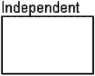

依赖实体使用圆角方框绘制，如下所示：

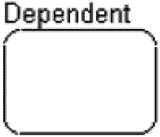

**注意**

依赖和独立实体的概念会引出一点“先有鸡还是先有蛋”的悖论（更不用说，它也是一条岔路口，即著名的“午饭前别写”原则）。依赖实体依赖于某种特定类型的关系。然而，实体创建的介绍不能等到关系确定之后，因为没有实体，关系就不可能存在。如果你是第一次接触数据模型，本章可能需要重读才能完全理解，因为独立和依赖对象的概念与关系是相互关联的。

当我们开始识别和建模实体时，需要处理命名这一主题。设计或实现任何系统的最重要方面之一就是如何为对象、变量等命名。关于名称的冗长讨论似乎总是浪费时间，但如果你曾回头处理几个月前自己写的代码，就会明白我的意思。例如，`@x` 在你第一次编写某些代码时，似乎是一个完美且易于输入的变量名，它肯定比输入 `@holdEmployeeNameForCleaningInvalidCharacters` 节省了很多击键次数，但后者在一段时间后更容易理解。

命名数据库对象没什么不同；实际上，清晰地命名数据库对象比命名其他编程对象更重要，因为你那些通常非常非技术的最终用户几乎肯定会习惯这些名称：赋予实体的名称将被用作文档，并被转换为程序员和用户都将访问的表名。概念和逻辑模型将被视为数据库中数据的主要示意图，并且应该是一个活的文档，在你更改任何已实施的结构之前应先修改它。

关于如何命名对象的讨论常常变得激烈，因为关于如何命名对象有几种不同的思想流派。一个核心问题是使用复数还是单数的实体/表名。两者都有其优点，但必须选择一种风格并遵循它。我选择遵循 IDEF1X 标准的对象命名规则，即使用单数名称。根据此标准，名称本身并不命名容器，而是指代被建模对象的一个实例。其他标准使用表的名称作为容器/行集合，从另一个合理的角度来看也有道理。名称的使用方式确实很重要。复数名称往往需要不断改为单数。假设你有一个表示甜甜圈的表。要讨论它，你需要说一些听起来很别扭的话，比如“我有一个 donuts 表。有 N 个 donuts 行。一个 donuts 行与一个或多个 donuts_eaters 行相关。”单数名称很容易附加到描述上。“我有一个 donut 表。我有 N 个 donut 行。一个 donut 行与一个或多个 donut_eater 行相关。”通过应用将名称添加到范围的模式，我们可以轻松地构建大量文档。

每种方法都有其好处和强烈的支持者，复数或单数命名可能值得与你的架构师同行进行一些长时间的讨论，但老实说，这肯定不是值得为之被烧死在火刑柱上的事情。如果你发现自己所依赖的组织使用复数名称，那并不意味着那是一个糟糕的工作场所。最重要的是保持一致性，不要让你的风格在过程中变得杂乱无章。任何命名标准都比没有标准好，所以如果你继承的数据库使用复数名称，请遵循“入乡随俗”原则，也使用复数名称，以免让其他人感到困惑。

在本书中，我将遵循以下基本的实体命名指南：

*   实体名称绝不应为复数。主要原因是名称应指代被建模对象的实例，而不是集合。
*   给出的名称应直接对应于实体建模的本质。例如，如果你正在为一个人建模，将实体命名为 `Person`。如果你正在为一辆汽车建模，就称它为 `Automobile`。命名并不总是这么直接，但保持名称简单明了是明智的。

实体名称经常需要由多个单词组成。在概念和逻辑建模阶段，当名称中需要多个单词时，包含空格、下划线和其他字符是可以接受的，但不是必需的。例如，一个存储个人地址的实体可以命名为 `Person Address`、`Person_Address`，或者使用我最近习惯且在本书中最常使用的风格：`PersonAddress`。这种类型的命名被称为帕斯卡命名法或混合命名法。（当你不将第一个单词的首字母大写，但将第二个单词的首字母大写时，这种风格被称为驼峰命名法。）就像复数/单数的争论一样，实际上没有“正确”的方式；这些只是我将遵循以保持一切统一的指南。


## 缩写的使用

无论你做出何种风格选择，在实体的逻辑命名中都应极少使用缩写，除非它是每个阅读你模型的人都知道的通用缩写。每个单词都应完整拼写出来，因为缩写会降低名称作为文档的价值，并容易引起混淆。在实现模型中，由于某些强加给你的命名标准或非常常见的行业标准术语，缩写可能是必要的。但要谨慎假设行业标准术语是普遍知晓的。

如果你决定在名称中使用任何缩写，请确保你已建立一个标准，以保证每次都使用相同的缩写。避免使用缩写的主要原因之一，就是你不必担心不同的人在不同实体上对同一个属性使用 `Description`、`Descry`、`Desc`、`Descrip` 和 `Descriptn` 等多种写法。

## 匈牙利表示法的使用

通常，数据库设计新手（尤其是那些来自解释型或过程式编程背景的人）会觉得有必要使用某种形式的匈牙利表示法，在名称中包含前缀或后缀以指示对象的类型——例如，`tblEmployee` 或 `tbl_Customer`。对于实体（和表）来说，这样的前缀通常被认为是不良实践，因为关系数据库中的名称几乎总是在显而易见的上下文中使用。在编写过程式代码（如 Visual Basic 或 C#）时，使用匈牙利表示法通常是个好主意，因为对象并非总是具有在使用时立即能看出来的非常严格的上下文含义，尤其是当你用一个接口实现多种不同类型的对象时。在 SQL Server Integration Services (SSIS) 包中，我通常会给每个操作符命名一个三或四个字母的前缀，以便在日志中识别它们。然而，对于数据库对象而言，很少会需要质疑一个名称是指列还是表。此外，如果对象类型不明显，查询系统目录来确定它也很容易。我现在不会深入讨论实现细节，但你可以使用 `sys.objects` 目录视图查看任何对象的类型。例如，以下查询将列出目录中所有不同的对象类型（你的结果可能不同；此查询是针对我们将在本书部分示例中使用的 `WideWorldImporters` 数据库执行的）：

```sql
SELECT  DISTINCT type_desc
FROM    sys.objects
ORDER   BY type_desc;
```

结果如下：

```sql
type_desc

CHECK_CONSTRAINT
DEFAULT_CONSTRAINT
FOREIGN_KEY_CONSTRAINT
INTERNAL_TABLE
PRIMARY_KEY_CONSTRAINT
SECURITY_POLICY
SEQUENCE_OBJECT
SERVICE_QUEUE
SQL_INLINE_TABLE_VALUED_FUNCTION
SQL_SCALAR_FUNCTION
SQL_STORED_PROCEDURE
SYSTEM_TABLE
TYPE_TABLE
UNIQUE_CONSTRAINT
USER_TABLE
VIEW
```

我们将在本书中贯穿使用 `sys.objects` 和其他目录视图来查看我们创建的对象的属性。

## 属性

实体中的所有属性必须在实体内有唯一命名。它们在实体矩形内由一个名称列表表示：

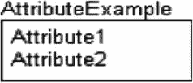

> 注意
>
> 上图显示的是一个技术上无效的实体，因为没有定义主键（这对于表和 IDEF1X 都是必需的）。我将在下一节介绍键的表示法。

此时，你只需输入从需求中发现的所有属性（下一章将演示此过程）。正如我将在第 5 章中演示的那样，在规范化过程中，属性会发生很大变化，但这个过程是迭代的，目标将是捕捉到发现的所有细节。例如，一个 `Employee` 实体的属性可能最初如下所示：

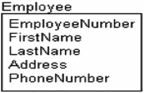

然而，在规范化过程中，像这样的表通常会被分解为许多属性（例如，`address` 可能被分解为 `number`、`street name`、`city`、`state`、`zip code` 等），并可能根据你实际系统的需求分解为不同的实体。

> 注意
>
> 属性命名是我往往会稍微偏离 IDEF1X 的地方。标准要求名称在模型内是唯一的，而不仅仅在表内唯一。这往往会导致名称中包含表名（或者更糟的是，某个表名前缀）后跟属性名，从而产生笨拙、冗长、看起来过时的名称。

与实体名称一样，无需在名称中包含匈牙利表示法前缀或后缀来让你知道这是一个列。然而，以一种非常直接的方式构建名称，让读者明白列的含义是有价值的。如果对属性有任何疑问，可以从系统目录中检索其相关实现细节。

我使用的格式大致基于 ISO 11179 中的概念，尽管关于这个标准确实没有太多值得参考的免费可用资料。总的来说，其理念是名称包含标准的部分，组合起来形成一个看起来标准的名称。我将在我的名称中使用以下部分：

*   角色名（RoleName）：可选地解释属性所扮演的具体角色。
*   属性（Attribute）：被命名属性的主要目的。可选地可以省略，表示它直接引用实体。
*   类词（Classword）：一个必需的术语，以非实现特定的术语标识列的主要用途。示例：`Name`、`Code`、`Amount`
*   标度（Scale）：可选地告知用户数据的标度是什么，如分钟、秒、美元、欧元等。

以下是一些使用部分或全部标准部分的属性名称示例：

*   `Name`：仅使用一个类词来表示命名行值的文本字符串，但它是 varchar(30) 还是 nvarchar(128) 并不重要。（没有角色名时，名称应直接应用于实体的实例。例如：`Company.Name` 是公司本身的名称。）
*   `UserName`：一个属性和一个类词，其中属性说明了 `Name` 类词的更具体用途，以指示是什么类型的名称。（示例：`Company.UserName` 将是公司使用的用户名。更多上下文将从数据库的名称和目的中获取。）
*   `AdminstratorUserName`：添加到 `UserName` 属性上的角色名，标识被命名的用户所扮演的具体角色。
*   `PledgeAmount`：这里属性 `Pledge` 与金额类（即一笔钱的数额，无论使用何种数据类型）耦合。
*   `PledgeAmountEuros`：表示对于 `PledgeAmount`，这是一笔认捐金额，但使用了在数据库上下文中不典型的标度。
*   `FirstPledgeAmountEuros`：扮演在欧元中记录的第一笔 `PledgeAmount` 的角色，与之前的可以是任何顺序的认捐不同。
*   `StockTickerCode`：将 `Code` 类词（一个短文本字符串）与属性部分 `StockTicker` 耦合。因此这是一个代表股票代码的短文本字符串。注意名称的每个部分不必是单个单词。
*   `EndDate`：`Date` 类词表明这将不包含时间部分，属性是该行的结束日期。
*   `SaveTime`：与前一个属性类似，但现在它是一个时间，将被视为一个时间点。

除非我明确尝试展示替代命名，否则本书中使用的所有名称几乎都将采用这种格式。数据库设计最重要的部分之一将是保持命名一致，以帮助用户理解你构建的内容。

接下来，我们将讨论数据模型上属性的以下方面：

*   主键
*   替代键
*   外键
*   域
*   属性命名


### 主键

如前一节所述，一个 IDEF1X 实体必须有一个主键。这对我们很方便，因为实体的定义要求每个实例必须是唯一的（参见第 1 章）。主键可以是单个属性，也可以是多个属性的组合。主键中的每个属性都必须有一个值（逻辑上，主键中不允许出现任何 `NULL` 值）。

主键通过将属性置于穿过实体矩形的水平线上方来表示，如下所示。请注意，无需额外符号来指示该值是主键。

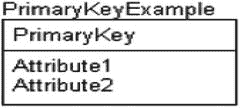

例如，考虑前一节中的 `Employee` 实体。`EmployeeNumber` 属性是唯一的，并且逻辑上每个员工都会有一个，所以这将是一个可接受的主键：

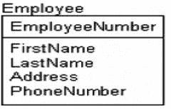

主键的选择是一个有趣的问题。在早期的逻辑建模阶段，我通常不喜欢花时间选择最终的主键属性。我倾向于创建一个简单的代理主键来迁移到其他实体，以帮助我发现何时存在任何所有权关系。在当前的例子中，`EmployeeNumber` 明显指向一个员工，但并非所有实体都会如此清晰——更不用说更高级的业务规则可能规定 `EmployeeNumber` 并不总是唯一的。（例如，公司可能在表中也有具有相同 `EmployeeNumber` 值的承包商，因此需要将 `EmployeeType` 作为键的一部分。这也许不是好的做法，但无论我在本书中如何尝试描述完美的数据库，商业世界充满了你必须纳入模型的奇怪、过时的做法。）在逻辑模型中反复回去更改用于主键的属性可能很烦人，尤其是在你有一个非常大的模型时。

同样，你很有可能拥有多个列集，它们可以唯一标识你许多实体的给定实例。例如，考虑一个对公司生产的产品进行建模的实体。公司可能通过类型、样式、尺寸和系列来识别产品：

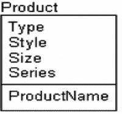

名称也可能是一个好的键，而且很可能还有一个产品代码。哪个属性是最佳的键——或者哪个甚至是真正的键——可能要到过程的后期才会变得完全明了。实现一个好的键有很多方法，最好的方法可能无法立即识别出来。

此时，我并不选择主键，而是向实体添加一个值用于标识目的，然后将所有候选键建模为备用键（我将在下一节讨论）。这样，逻辑模型清晰地显示了哪些实体在所有权角色中服务于其他实体，因为迁移的键包含了所建模实体的名称。我会这样建模这个实体：

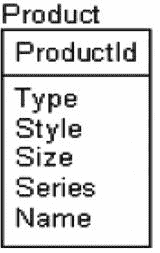

**注意**

在逻辑建模中使用代理键当然不是必须的；这是我个人偏好的一种方法，我发现它是一种有用的文档方法，可以保持模型整洁，并且与我后续的实现方法相对应。不仅在逻辑建模阶段使用自然键作为主键是合理的，而且许多架构师认为它更可取。两种方法都是完全可以接受的（而且同样可能在数据建模者的桌子上引发一场哲学辩论——你已被警告，所以请在甜点之后开始辩论）。

## 备用键

如第 1 章所定义，备用键是一个或多个属性的分组，其唯一性需要在实体的所有实例中得到保证。备用键在实体图形中没有像主键那样的特定位置，它们通常也不会为任何关系而迁移（根据 SQL 标准，你可以用基于备用键的外键来引用它，但这个特性很少使用，并且当使用时，它常常甚至会让最好的 DBA 感到困惑）。它们在模型中的标识方式非常简单：

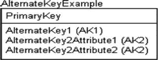

在此示例中，有两个备用键组：组 `AK1`，它有一个成员属性；组 `AK2`，它有两个属性。重叠的备用键也没有问题，可以表示为 `(AK1,AK2)`。回想一下产品示例，这两个键可以建模如下：

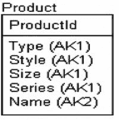

ERwin 数据建模工具在此符号基础上添加的一个扩展如下所示：

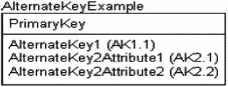

位置编号符号被附加到每个键（`AK1` 和 `AK2`）的名称上，以表示属性在键中的位置。在逻辑模型中，即使工具确实显示它们，技术上也不应考虑键中属性的顺序（唯一就是唯一，与键列的顺序无关）。哪个属性在键中排在前面真的不重要；重要的是你确保跨多个属性的值是唯一的。当键在数据库中实现时，列的顺序几乎肯定会因为性能原因而变得重要，但无论键的列顺序如何，唯一性都会得到满足。

**注意**

主键和唯一约束在 SQL Server 中是用索引实现的，但关于为性能原因使用索引的讨论留给第 10 章。在概念设计、逻辑设计阶段，请尽你所能或多或少地忽略性能调优需求。将大多数性能调优问题推迟到你编写代码并有足够数据真正看清需要哪些索引的时候。


##### 外键

外键属性，如前所述，也称为迁移属性。它们是一个实体中的主键，用作引用另一个实体中实例的依据。它们同样是关系的结果（我们将在本章后面查看它们的图形表示）。它们的标识方式与备用键非常相似，即在字母后添加“FK”：

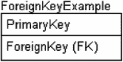

作为带有外键的表示例，考虑一个模拟音乐专辑的实体：

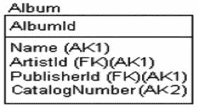

`ArtistId` 和 `PublisherId` 是从 `Artist` 和 `Publisher` 实体迁移而来的外键。我们将在本章后面的“关系”部分重新审视这个例子。

关于外键的一个棘手之处在于，图表不会显示该键是从哪个实体迁移而来的。这可能会使事情变得有点混乱，具体取决于你如何选择主键。这种关于外键迁移自哪个表的不明确性是大多数建模方法的局限性，因为显示键来源实体的名称（尽管有些工具提供此选项）会因以下几个原因造成不必要的混淆：

*   对于键从其原始拥有实体（键值最初并非迁移外键引用的实体）迁移的距离没有限制（也不应该有）。
*   同一属性可能从两个同名的独立实体迁移而来，尤其是在逻辑设计的早期阶段，这并非完全不合理。这当然不是最佳实践，但确实可能发生，并导致有趣的情况。

正如你所看到的，我将在逻辑模型中采用的主键方案的原因之一，是添加一个名为 `<entityName>Id` 的键作为实体的标识符，这样实体的名称就很容易识别，并让我们轻松知道属性的原始来源。此外，我们甚至可以在没有额外文档的情况下看到属性在实体间的迁移。例如，在 `Album` 实体的例子中，仅凭名称我们就能直觉地知道 `ArtistId` 属性是一个外键，并且很可能就是从 `Artist` 实体迁移而来的。

### 域

在第 1 章中，术语“域”指的是属性的一组有效值。在 IDEF1X 中，你可以将域形式化，并定义称为域的命名、可重用规范，例如：

*   `String`：一个字符串
*   `SocialSecurityNumber`：一个格式为 ###-##-#### 的字符值
*   `PositiveInteger`：一个隐含域为 `0` 到 `max(integer value)` 的整数值
*   `TextualFlag`：一个域为 (`'FALSE','TRUE'`) 的五字符值

规范中的域不仅允许我们定义可以存储在属性中的有效值，还提供了数据类型定义中的一种继承形式。然后可以定义域的子类，这些子类继承基础域的设置。为经常使用的任何属性构建域，以及为不常用属性构建基础模板域，是一个好的实践。例如，你可能有一个字符类型域，其中指定了基本长度，比如 60。然后，你可以指定常用域，如 name 和 description，在许多实体中使用。对于这些，你应该为值选择一个合理的长度，此外，你还可以包含一个要求，即列中的数据不能仅仅是空格字符，以防止用户有一个、两个或三个空格各自看起来像不同的值——除非在罕见的情况下这确实是需要的。

无论你是否使用自动化建模工具，都要尝试定义用于特定类型事物的通用域。例如，人的名字可能是一个域。这很酷，因为对于诸如“嗯，一个人的名字应该设多长？”或“我们的零件编号格式是什么？”之类的问题，你只需回答一次。做出决定后，你只需沿用之前的做法即可。

如果你认为可能会为了一个数据类型的长度而争论听起来不合理，那可能是因为你还没有在没有名牌的情况下工作过。程序员总是争论不休，但如果你在第一次争论后就建立了一个标准，那么你只需要进行一次争论。还要注意，几乎所有你想存储数据的东西以前都已经被处理过了，所以可以参考网上的标准文档。例如，一个可拨打电话号码列应该有多长？根据 ITU-T E.164 ([`http://searchnetworking.techtarget.com/definition/E164`](http://searchnetworking.techtarget.com/definition/E164))，答案是 15 个字符。因此，仅仅因为“以防某天它变长了 6.66 倍”就将其设为 100 个字符是愚蠢的，更不用说对数据完整性有害了。

注意：在设计期间定义通用域可以对抗另一个主要的糟糕实践，即 `string(200)` 综合症（或类似的字符串长度），即数据库中的每一列都在完全相同长度的列中存储文本数据。在早期就考虑数据的最小和最大长度，比在项目经理后来为了结果而大喊大叫、程序员们迫不及待地要使用你的数据库并开始编码时再做要容易得多。这也是产生具有数据完整性的数据库的第一步。

在建模过程的早期，你通常会想要收集一些信息，例如属性的通用类型：字符型、数值型、逻辑型，甚至是二进制数据。确定最小和最大长度可能可行也可能不可行，但能在不阻碍过程的情况下收集到的信息越多越好。另一件可以开始的好事是，记录被分类为域类型的属性的合法值。这通常使用一些伪代码或以文本方式完成，可以在你的建模工具中，甚至可以在电子表格中完成。


## 域作为实现无关的数据类型描述

保持这些域（domain）作为实现无关的数据类型描述是极其重要的。例如，你可以指定一个域为 `GloballyUniqueIdentifier`，这是一个无论在哪里生成都保证唯一的值。在 SQL Server 中，可以使用唯一标识符（GUID 值）来实现此域。在另一个数据库系统（可能由 Microsoft 以外的公司创建）中，如果没有完全相同的机制，则可能以不同的方式实现；关键在于，这个值在统计上保证每次生成都是唯一的。概念/逻辑建模阶段应该在不考虑 SQL Server 能做什么的情况下完成，即便没有其他原因，也是为了防止你在理解实际问题之前就开始对未来的解决方案强加限制。另一种域可能是一组合法值，比如如果业务用户定义了三种客户类型，你可以指定可以使用的合法字符串值。

## 物理建模与域的重用价值

当你开始物理关系结构的物理建模时，你将使用相同的域来分配实现属性。这就是使用域的真正价值。通过创建可重用的模板属性（这些属性在你开始创建列时也会用到），你将花费更少的精力和时间来构建简单的实体，这构成了你工作的很大一部分。这样做还为你提供了一种强制执行公司范围标准的方法，方法是在所有公司模型中重用相同的域（当然，这预设了你在一段时间内对数据建模过程保持严谨！）。

稍后，将选择确切的数据类型、约束等实现细节，这只是可继承的众多基本属性中的几个（如果 Microsoft 将来为某种情况添加了更合适的数据类型，你至少可以从模型的角度简单地更改所有使用该域类型的列到新类型）。由于域的数量很可能少于已实现的属性数量，因此可以实现快速且一致的模型组装的双重好处。然而，在手工构建表时应用继承机制可能不太合理或有用。即使没有工具，实现一个扁平的域结构也足够繁琐。

## 域层次结构示例

以一组字符串域为例：

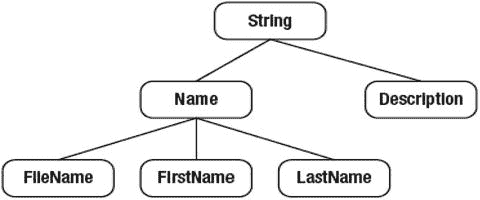

这里，`String` 是基础域，你可以从中继承出 `Name` 和 `Description`。`FileName`、`FirstName` 和 `LastName` 继承自 `Name`。在逻辑建模期间，这看起来可能是徒劳无功的，因为这些域中的大多数只共享少数基本细节，例如不允许 `NULL` 或空白数据。然而，`FileName` 可能是可选的，而 `LastName` 可能是强制的。为尽可能多的不同属性类型设置域是重要的，以防发现某些规则或数据类型适用于任何已存在的域。当需要更改所有字符串类型的数据类型时（例如，如果你最终决定从 ANSI 字符集全面更改为 UNICODE，或者决定在所有个人笔记类型的属性上实现加密，但不在姓名类属性上实现），事情就会变得顺利。

## 逻辑建模中的域展示

在逻辑建模期间，域可以选择性地显示在实体中属性名称的右侧（这也是你最终将看到 SQL Server 数据类型的地方）：

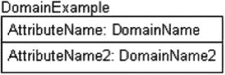

因此，如果我有一个实体用于保存描述人员类型的域值，我可能会这样建模：

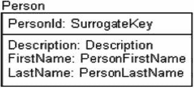

为了对此示例建模，我定义了四个域：

1.  `SurrogateKey`：代理键值。（构建域不应暗示代理键的实现，因此稍后可以用任何方式实现。）
2.  `Description`：保存“某物”的描述（最大 60 个字符）。
3.  `PersonFirstName`：一个人的名字（最大 30 个字符）。
4.  `PersonLastName`：一个人的姓氏（最大 50 个字符）。

姓名长度的选择很有趣。我在 Bing 上搜索了 “person first name varchar”，发现了许多不同的可能性：10、35、无限制、25、20 和 15——全都在搜索的第一页！正如你应该使用一致的命名标准一样，每次表示类似数据时，你也应该使用标准长度，这样到了实现阶段，存储类似数据的两个列具有不同定义的可能性就降到了最低。

## 实现阶段与域的映射

在实现阶段，所有的域都将映射到 SQL Server 中的某种数据类型形式。然而，在流程的这个节点上，未来的实现还不是重点。逻辑模型中域的重点是定义可以以通用方式应用的常见存储模式，包括所有将管辖其使用的业务规则。

如果你遵循我之前讨论的由 RoleName + Attribute + Classword + Scale 组成的命名标准，你可能会发现你的域经常与该层次结构有很多相似之处。`Name` 是一个 classword，而 `Name` 也在我们的域列表中。`FirstName` 是一个属性和 classword，最终也成了一个域。然而，域通常会包含像大小这样的东西。`Name30Characters`、`Name60Characters` 等可能不是好的 classword，但在某些情况下，如果你只想要一个 30 个字符的名称类，而不想为每个属性创建一个域，它们可以是完全可以接受的域。域是为了让你自己方便，使事情更容易，所以做更有意义的事。


### 关系

到目前为止，我们所看到的视觉结构在大多数数据建模方法论中基本相同。实体几乎总是用矩形表示，属性通常就是矩形内的文字。而**关系**则开始出现巨大分歧，因为不同的建模语言在图形化表示关系方面略有不同。为了澄清关系的概念，我需要回到“父”和“子”这两个术语。请看以下 IDEF1X 规范术语表中的定义（这些定义直接来自政府规范，清晰度惊人！）：

*   **实体，子**：在特定连接关系中的实体，其实例可以与另一个实体（父实体）的零个或一个实例相关联。
*   **实体，父**：在特定连接关系中的实体，其实例可以与另一个实体（子实体）的多个实例相关联。
*   **关系**：两个实体之间或同一实体的实例之间的关联。

在 IDEF1X 中，每条关系都用连接两个实体的线表示，线的一端有一个实心圆，指示主键属性迁移为外键的位置。在下图中，父的主键将迁移到子。

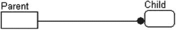

关系有几种不同的类型，指示父表与子表的关联方式。我们将在本节中看几个不同关系概念的例子：

*   **标识关系**，其中一个表的主键迁移到另一个表的主键。子将是一个依赖实体。
*   **非标识关系**，其中一个表的主键迁移到另一个表的非主键属性。只要不存在标识关系，子将是一个独立实体。
*   **可选非标识关系**，即该非标识关系不要求父值。
*   **递归关系**，即一个表与自身相关。
*   **子类型或分类关系**，这是一种一对一的关系，用于让一个实体扩展另一个。
*   **多对多关系**，其中一个实体的一个实例可以与另一个实体的多个实例相关，反之亦然。

我们还将涵盖关系的**基数**（多少个父与多少个子相关）、**角色名**（在关系中更改键的名称）和**动词短语**（关系的名称）。关系是数据库设计图中的一个关键主题，而且并非完全简单。大量信息是用几个点和线来关联的。通常，查看图形显示所表示的元数据会有所帮助，以确保其清晰（特别是如果查看的是外部建模语言时）。

> **注意**
>
> 本节讨论的所有关系（除了多对多）都属于一对多类型，这包括一对零、一对一、一对多，或者可能是一对 n。从技术上讲，更准确地说是一对（从 M 到 N），因为这能够根据具体情况非常精确（或非常宽松）地指定“多”的范围。然而，更标准的术语是“一对多”，我不会试图让一个已经令人困惑的术语变得更复杂。

### 标识关系

关系是标识性的概念用于表示容器关系，即子实例的本质（定义为用以刻画或识别某物的内在或不可或缺的属性）是由父的存在定义的。另一种理解方式是，通常标识关系中的子是父不可分割的一部分。没有父的存在，子就毫无意义。

关系绘制如下：

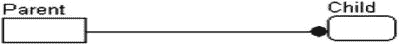

为了在模型中实现这种关系，主键属性会迁移到子的主键中。因此，需要父实例的键才能识别子实例记录，这就是使用“标识关系”名称的原因。在下面的例子中，你可以看到`ParentId`属性是`Child`实体中的一个外键，来自`Parent`实体。

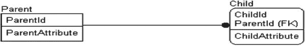

关系中的子实体被绘制成一个圆角矩形，正如本章前面提到的，这意味着它是一个依赖实体。一个常见的例子是发票和发票上向客户收取的行项目：

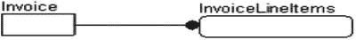

也可以说这些行项目是父的一部分，就像在一个对象中你可能有一个属性是一个数组，但由于在 SQL 中所有值都存储为标量，我们最终得到了更多的表而不是不同的数据类型。


### 非标识关系

非标识关系表明，父实体代表了子实体中更具信息性的属性。在实现非标识关系时，主键属性会迁移为子实体的非主键属性。它在实体之间以虚线表示。还要注意，代表子实体的矩形现在具有方形角，因为它是独立存在的，而不依赖于 `Parent`：

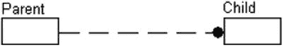

## 非标识关系中的属性迁移

现在你可以看到属性 `ParentID` 已迁移为非键属性：

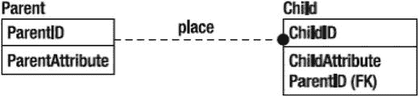

## 核心概念差异

再次以发票为例，考虑一下已售出产品的供应商，这些信息已在行项目中记录。产品供应商并不定义行项目的存在，因为无论是否指明产品的确切来源供应商，该行项目仍然有意义。

标识关系和非标识关系之间的区别有时可能很微妙，但对于理解表及其键之间的关系至关重要。如果父实体定义了子实体存在的需求（如前一节所述），那么使用标识关系。另一方面，如果该关系定义了子实体的某个属性之一，则使用非标识关系。

## 说明性示例

以下是一些例子：

*   **标识关系**：你有一个存储联系人的实体，另一个存储联系人电话号码的实体。`Contact` 实体拥有的信息定义了电话号码，如果没有该联系人，`ContactPhoneNumber` 实例就没有存在的必要。

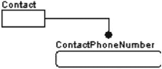

*   **非标识关系**：考虑为标识关系定义的那些实体，以及一个名为 `ContactPhoneNumberType` 的额外实体。该实体以非标识方式与 `ContactPhoneNumber` 实体相关，并定义了一组 `ContactPhoneNumber` 可能具有的电话号码类型（`Voice`、`Fax` 等）。电话号码的类型并不标识该号码；它只是对其进行分类。即使类型未知，记录电话号码本身仍然有价值，因为该号码可能仍具有信息意义。然而，如果没有联系人的存在，将联系人与电话号码关联起来的一行数据将毫无用处。

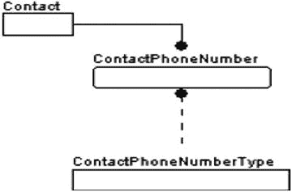

## 域实体

`ContactPhoneNumberType` 实体通常被称为**域实体**或**域表**，因为它以一种非特定的方式实现属性的域。与其为属性设置固定的域，不如设计一个允许通过编程更改域而无需重新编码约束或客户端代码的实体。作为额外的好处，你可以添加列来定义、描述和扩展域值，以实现业务规则。它还允许客户端用户以极少的编程构建供用户选择值的列表。

## 强制关系与可选关系

虽然每个非标识关系都定义了子表某个属性的域，但有时在创建行时，并不需要选择值。例如，考虑一个为社区建模房屋的数据库。每栋房屋都有颜色、样式等属性。然而，并非每栋房屋都有报警公司、抵押权人等。在这种情况下，报警公司和银行之间的关系将是**可选的**，而颜色和样式的关系可以是**强制的**。在实现的表中，区别在于子表的外键列是否允许 `NULL` 值。如果要求必须有值，则视为强制关系。如果迁移键的值可以是 `NULL`，则视为可选关系。

可选关系由一条虚线末端、与黑点相对的一端带有一个**空心菱形**来表示，如下所示：

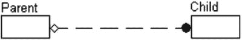

在强制关系中，关系图如前所述绘制，没有菱形。请注意，可选关系意味着关系的基数可以是零或更大，但强制关系的基数必须为一或更大（如第 1 章中所定义，基数指的是可以与另一个值相关联的值的数量，该概念也将在下一节中进一步讨论）。

**注意**

你可能想知道为什么没有可选的标识关系。这是因为在主键中不能有任何可选属性，这在关系理论和 SQL Server 中都是如此。

## 实际实现场景

对于一对多的可选关系，请考虑以下情况：

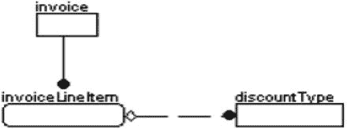

`invoiceLineItem` 实体是将项目添加到发票上以收取付款的地方。用户有时可能会对行项目应用标准折扣金额。因此，从 `invoiceLineItem` 到 `discountType` 实体的关系是可选的，因为该行项目可能没有应用任何折扣。

对于大多数此类可选关系，还有另一种可能的解决方案，可以将其建模为必需关系，并在实现时向 `discountType` 表添加一行，指示“无”或“未知”。这种强制关系的一个例子可以是电影租赁系统数据库中的流派与电影：

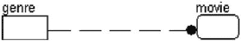

该关系是 `流派 <分类> 电影`，其中 `流派` 实体代表一对多关系中的“一”，`电影` 代表“多”。每部被租出的电影必须有一个流派，以便可以在库存中组织并放置在相应的租赁货架上。如果电影是新片，但流派尚不明确，可以使用流派对象中值为“新片”或“未知”的一行。是否使用可选关系，或者创建一个表示缺少值的行，是经常讨论的问题。通常，在非报告型数据库中，编造一个表示“没有真实关联值”的值是不被赞成的，因为它可能引起混淆。编写查询的用户如果最终看到销售给“缺失客户”的记录，可能会不确定这是一个古怪的新餐厅名称还是一个编造的行。在报告场景中，你通常只关注分组，因此问题较小，你会设计一些方法让该行排序到列表的顶部或底部。


### 角色名称

角色名称是指当某个属性被用作外键时，你可以为其指定的一个替代名称。角色名称的目的是阐明已迁移键的用途，因为要么父实体是通用的而需要一个更具体的名称，要么同一个实体与另一个实体存在多重关系。由于属性名称必须是唯一的，通常需要为子外键引用分配不同的名称。请看以下表：

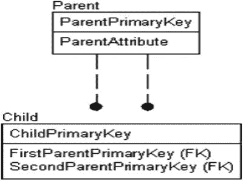

在此图中，`Parent` 和 `Child` 实体之间存在两种关系，迁移的属性已被角色命名为 `FirstParentPrimaryKey` 和 `SecondParentPrimaryKey`。在图中，你可以在角色名称后，用句点（.）分隔，标出迁移属性的原始名称，如下所示（但这通常会在模型中占用过多空间）：

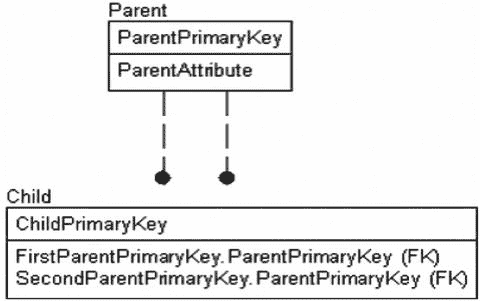

举个例子，假设你有一个 `User` 实体，并且想要存储创建 `DatabaseObject` 实体实例的用户名称或 ID，以及该 `DatabaseObject` 实例所为其创建的用户。最终结果可能如下：

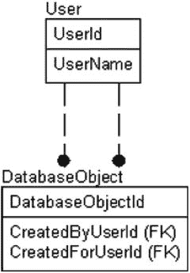

请注意，从 `User` 实体到 `DatabaseObject` 实体存在两种关系。由于图中线条的绘制方式，仅凭图示无法清楚分辨哪个外键对应哪个关系。一旦你为关系命名（使用动词短语，本章稍后将介绍），确定键的关系就会变得更容易，但通常，判断哪条线对应哪个子属性，只能靠试错。

### 关系基数

关系的基数是指对于该关系的每个父实例，可以插入多少个子实例。许多人会在需求与设计阶段忽略这个话题，因为它可能难以实现。然而，我们的初步目标是在数据模型中表达需求，而将数据约束实现的讨论留待后续（我们将在第 6 章实现第一个数据库时开始讨论实现，并在第 7 章（数据保护章）以及本书后半部分进行更多讨论）。

图 3-1 至 3-6 展示了关系可能具有的六种基数。基数指示符适用于强制性或可选性关系。

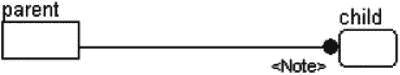
图 3-6. 描述基数的专业化注释

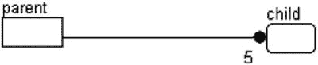
图 3-5. 一对精确 N（此例中为 5，表示每个父实例必须有五个子实例）

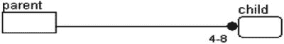
图 3-4. 一对某个固定范围（此例中，为 4 到 8 之间，包含 4 和 8）

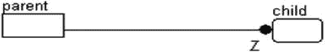
图 3-3. 一对零或一（不超过一个），由 Z 表示

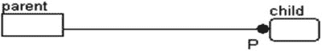
图 3-2. 一对一对或多（至少一个），由 P 表示

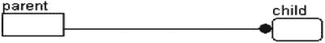
图 3-1. 一对零或多

例如，一对一对或多（见图 3-2）的一个可能用途是表示小学中监护人与学生的关系：

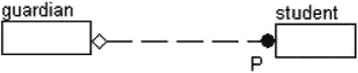

这是“零或一对一对或多”关系的一个很好的例子，而且相当有趣。它表示，为了使一个监护人实例存在，必须有一个相关联的学生存在，但一个学生不一定需要有监护人，我们仍然希望存储该学生的数据。

接下来，让我们考虑一个俱乐部的情况，该俱乐部的成员拥有某些他们应该或可以担任的职位，如图 3-7 至 3-9 所示。

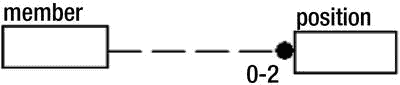
图 3-9. 一对零、一对一对或一对二关系，规定每个成员最多担任两个职位

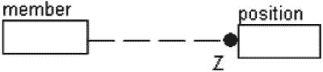
图 3-8. 一对一关系只允许每个成员担任一个职位

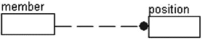
图 3-7. 一对多关系允许成员担任不限数量的职位

图 3-7 显示一个成员可以担任尽可能多的职位。图 3-8 显示一个成员可以不担任职位或只担任一个职位，但不能更多。最后，图 3-9 显示一个成员可以担任零个、一个或两个职位。它们看起来非常相似，但 Z 或 0-2 对于表示基数非常重要。

注意
我很少需要用到除基本的一对多、一对零或一关系类型以外的其他关系类型，但你的经验可能使你需要用到那些专业化的联系基数。


## 递归关系

一种更难以实现——但通常很重要——的关系类型是递归关系，也称为自连接、层次结构、自引用或自关系（我甚至听过有人称它们为鱼钩关系，但这个名字对我来说总是很傻）。它用于对某种层次结构进行建模，其中一行与唯一一个父级相关联。“递归”这个名字的由来是指遍历该结构的方法。在第 8 章中，我们将更深入地探讨层次结构，其中一些使用递归关系，一些则不使用。

递归关系是通过绘制一条非标识性关系线来建模的，这条线不是指向不同的实体，而是指向同一个实体。该关系的迁移键被赋予一个角色名。（在许多情况下，如果没有自然的命名方式，采用在属性名前添加“父级”或“引用”的命名约定是很有用的。）

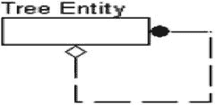

递归关系对于创建树状结构非常有用，如下面的组织结构图所示：

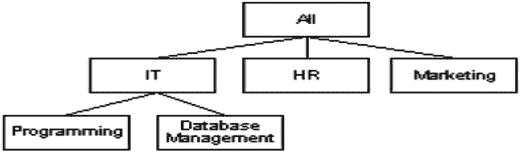

为了完整解释这个概念，我将展示为实现此层次结构而存储的数据：

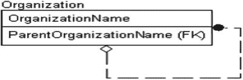

以下是此表的示例数据：

```
OrganizationName      ParentOrganizationName
--------------------  ----------------------
All
IT                    ALL
HR                    ALL
Marketing             ALL
Programming           IT
Database Management   IT
```

现在可以通过从`All`开始并获取`ALL`的子级（例如：`IT`）来遍历组织结构图。然后，你再获取这些值的子级，例如对于`IT`，其中一个值是`Programming`。

最后一个例子，考虑一个`Person`实体的情况。如果你想将一个人与另一个人关联为第一个人的当前配偶，你可能会设计如下：

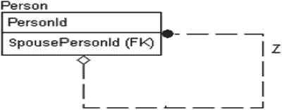

请注意，这是一个一对零或一的关系，因为（在大多数地方）一个人最多只能有一个配偶，但并非必须有配偶。如果你需要一个人作为孩子与两个父母相关联，则需要另一个表实体来将两个人联系起来。请注意，我在本节前面提到了“当前”配偶。如果你需要了解层次结构变化的历史，你将需要一些更复杂的层次结构建模版本，我们将在第 8 章讨论各种建模模式和技术时详细介绍。在本章中，重要的是你要掌握层次关系在数据模型上的表现形式。

## 子类型

子类型（也称为分类关系）是一种特殊的一对零或一关系，用于表示一个实体是某个通用实体的特定类型。它与面向对象编程中的继承概念相似（尽管使用起来要笨拙得多）。请注意，在下图中，连线两端没有黑点；具体实体被绘制为圆角，表示它们确实依赖于通用实体。

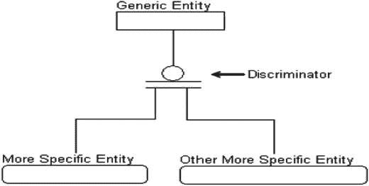

子类型关系有三个不同的部分：

*   通用实体：此实体包含所有子类型实体共有的属性。
*   判别器：此属性充当开关，用于确定存储额外、更具体信息的具体实体。
*   具体实体：这是基于判别器存储特定信息的地方。

例如，考虑你的家庭视频库的清单。如果你想存储关于你拥有的每个视频的信息，无论格式如何，你可能会构建一个如下所示的分类关系：

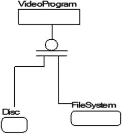

通过这种方式，你可以在`VideoProgram`实体中表示每个视频的价格、标题、演员、时长以及可能的内容描述，然后，基于格式（即判别器），你可能会在各自独立的实体中存储特定于`Disc`或`FileSystem`的信息（例如，对于基于`Disc`的视频，存储物理位置、特殊功能、格式[蓝光、DVD、数字拷贝]；对于`FileSystem`，存储目录和格式）。

有两种不同的分类类型：完整的和不完整的。完整的分类集合在判别器上用双线建模，不完整的则用单线建模（见图 3-10）。

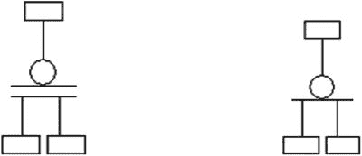

图 3-10.

完整（左）和不完整（右）的分类集合

完整分类和非完整分类之间的主要区别在于，在完整分类关系中，每个通用实例必须有一个具体实例，而在非完整情况下，这不一定成立。一个通用实体的实例只能与该簇中一个类别实体的实例相关联，并且每个类别实体的实例都与一个通用实体的实例精确关联。换句话说，不允许重叠的子实体。

例如，你可能有一个像这样的完整分类集合：

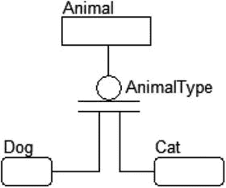

这种关系表明“一个`Animal`必须是`Dog`或`Cat`。”（当然，这显然只在适用于该公司的需求背景下成立。然而，它没有告诉我们的是，首先，我们是否必须知道动物类型？`Dog`或`Cat`表中可能根本没有行，动物类型也可能是`NULL`。

然而，如果将其建模为一个非完整的分类集合会怎样：

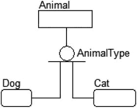

现在在我们的数据库中，我们可能有`Dog`、`Cat`、`Fish`、`Lizard`等，但我们只为`Dog`和`Cat`记录了具体信息。

此外，偶尔会提到的一个概念是子类是否是排他性的。对于动物，`Animal`显然只能是`Dog`、`Cat`等，不能两者兼是。但是考虑`Person`的常见子类：`Customer`、`Employee`和`Manager`。一个人可以是一个经理，同时也是一个员工，并且可能希望从子类结构中在同一个数据库中跟踪他们的客户关系。这就不会是一个排他性的子类型。

## 多对多关系

多对多关系也被称为非特定关系，这实际上是个更贴切的名字，但远没有那么广为人知。在数据模型中存在大量的多对多关系是很常见的，尽管在构建物理模型时它们会被建模为不同的形式。这些关系通过一条两端都有实心黑点的线来建模：

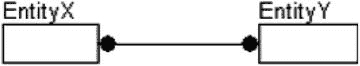

在建模多对多关系时，即使在逻辑模型中，也存在一个真正的问题：通常需要的不仅仅是简单的“多个`EntityX`实例连接到多个`EntityY`实例”这样的关系信息。因此，就像任何多对多关系最终会被实现一样，这种关系通常在被发现后不久就会被建模为如下形式：


这里，中间的`EntityX_EntityY`实体被称为关联实体（名称如桥接表、过渡表或连接表也不少见）。在早期建模中，如果还没有识别出描述关系的扩展属性，我通常会坚持使用前一种表示法；当我需要向模型添加额外信息时，则使用后一种表示法。为了阐明这个概念，让我们看下面的例子：


这里，我建立了一个关系，其中多个客户与多个产品相关。这种情况很常见，因为在大多数情况下，公司并不是为特定客户创建特定产品；相反，任何客户都可以购买公司的任何产品，或者至少是其他客户也可以订购的产品子集。在建模的这个阶段，使用多对多的表示法可能是合理的。请注意，我对客户-产品关系进行了概括。公司构建仅供一个客户购买的特定产品的情况并不少见，这会产生更有趣的建模需求。

然而，考虑`Customer`仅在某个时间段内需要与`Product`相关的情况。为了实现这一点，你可以使用以下表示法：


事实上，几乎所有的多对多关系都需要一些像这样的额外信息才能使其完整。除了简单的概念模型外，在其他任何模型中使用两端都是黑圈的多对多关系进行建模的情况并不常见，因此你需要留意建模成这样的实体，以便能够识别它们。

> **注意**
> 在 SQL 中，如果不使用一个表来解决，就无法实现多对多关系，因为无法双向迁移键。在数据库中，你必须使用关联表来实现所有的多对多关系。

### 动词短语（关系名称）

关系被赋予名称，称为动词短语，以使父实体和子实体之间的关系成为一个可读的句子，并融入实体名称和关系基数。名称通常从父到子表达，但也可以从另一个方向表达，甚至从两个方向表达。动词短语位于模型中靠近形成关系的线条的某个位置：


关系的命名应使其符合以下通用结构，以便阅读整个关系：父基数 - 父实体名称 - 关系名称 - 子基数 - 子实体名称。

例如，考虑以下关系：


它将被读作：“一个`Contact`使用零个、一个或多个`PhoneNumber`进行呼叫。”

当然，这个句子在正常的对话语言中可能合理，也可能不合理；例如，这个句子引出了一个问题：如何用零个电话号码呼叫一个联系人。如果向非技术人员展示这个短语，以下读法会更有意义：“每个联系人可以没有电话号码，或者有一个或多个电话号码”，或者“如果联系人有电话号码，那么可以用一个或多个电话号码呼叫该联系人。”你不想对所有动词短语都简单地使用“拥有”，因为动词短语的目标是捕捉数据将如何使用的本质，并提供无需编辑即可在语义上理解的文档（即使不是非常出色的文笔）。

能够阅读关系有助于你发现明显的问题。例如，考虑以下关系：


乍一看似乎没问题，但读作“一个`ContactType`分类零个或一个`Contact`”，这在逻辑上讲不通（因为`Contact`需要`ContactType`，你会需要在`ContactType`表中有相同数量或更多的行）。这应该被正确建模为如下形式：


现在读作：“一个`ContactType`分类零个或多个`Contact`。”

请注意，关系的类型，无论是识别性、非识别性、可选的还是强制的，在阅读关系时都没有区别。你也可以包含一个从子到父阅读的动词短语。对于一对多关系，这将是以下格式：“一个子实例（关系）恰好一个父实例。”

在第一个例子的情况下，你可以添加一个额外的动词短语：


从父到子的关系再次被读作：“一个`Contact`使用零个、一个或多个`PhoneNumber`进行呼叫。”

然后你可以从子到父阅读关系。请注意，当按这个方向阅读时，你是在零个或一个电话号码到一个且仅一个联系人的上下文中：“零个或一个`PhoneNumber`可用于呼叫恰好一个`Contact`。”

由于这个关系是从多到一，关系中的父被假定有一个相关的值，并且由于你是在子记录存在的上下文中阅读，你也可以假设在句子中需要考虑零个或一个子记录。

对于多对多关系，方案基本相同。由于在这种关系中两个实体都是父实体，你从左到右阅读写在连接线上方的动词短语，并从右到左阅读写在下方的动词短语。


> **注意**
> 花时间定义动词短语可能很难推销，因为它们在数据库实现中并没有被实质性地使用，而且人们常常认为做不直接产生代码的工作是浪费时间。然而，定义良好的动词短语可以成为很好的文档，让读者很好地理解关系存在的原因及其含义。我通常也使用动词短语来命名外键约束，你将在第 6 章中看到，那时我们将实际创建一个带有外键的数据库。


## 描述信息

拍摄一张美丽的山峰照片，它会激发成千上万的文字来描述树木、植物、潺潺溪流的美（我描述风景的能力是我撰写技术书籍的原因之一）。但它不会告诉你如何亲自到达那里，温度是多少，以及你应该带毛衣和手套还是游泳裤。

数据模型也是如此。到目前为止，我们只讨论了在模型的图形部分可以看到的东西。正如我在本章前面部分所讨论的，从图片开始理解数据库是一个很好的起点。我们通过为实体、属性和关系赋予好的名称来开始文档编写过程，但即使名称已经很好，仍然可能会对某个属性的具体用途以及如何使用它产生困惑。

为此，我们需要为模型中的图片添加我们自己的千言万语（或多或少）。在共享模型时，描述信息将让最终的读者——甚至是未来的你自己——知道你最初的想法。请记住，并非所有查看模型的人都具有相同的技术水平：有些人可能是非关系型程序员，或者是用户或（非技术）产品经理，他们没有建模经验。

描述信息不需要任何特殊格式。它只需要详细、最新，并能回答尽可能多的预期问题。每段描述信息都应该以易于用户快速将其与模型中使用它的部分联系起来的方式存储，最好是作为元数据存储在建模工具中，或者存储在某种未来易于维护的文档中。

你应该通过询问以下问题来开始创建这些描述性文本：

*   该对象应该表示什么？
*   该对象将如何被使用？
*   谁可能会使用该对象？
*   该对象的未来计划是什么？
*   哪些约束没有在模型中特别暗示？

描述的范围不应超出受影响的对象或实体。例如，实体描述应仅指该实体，而不应涉及任何相关的实体、关系，甚至属性，除非完全必要。属性定义应仅针对单个属性及其值的可能来源。避免使用大量示例也是一个好主意，因为它们可能会改变，而模型本身可能不需要改变。

维护良好的描述信息大致等同于在代码中放入适当的注释。由于你正在建模的最终数据库通常是任何计算机系统的核心部分，这一级别的注释比任何其他级别都更为重要。对大多数人来说，能够回顾关于每个对象以及事物为何如此实现的笔记是无价的，这对于雇佣新员工并需要让他们快速了解复杂系统的组织来说尤其如此。

例如，假设已建模了以下两个实体：


表 3-1 和 3-2 中所示的基本描述信息集可以用来描述所创建的属性。

表 3-2.
关系

| 父实体名称 | 短语 | 子实体名称 | 定义 |
| --- | --- | --- | --- |
| `ContactType` | `Classifies` | `Contact` | 联系人类型分类 |

表 3-1.
实体

| 实体 | 属性 | 描述 |
| --- | --- | --- |
| `Contact` |   | 可联系以进行业务往来的人 |
| `ContactId` | 表示`Contact`的代理键 |
| `ContactTypeId` | `ContactType`的主键引用，对联系人类型进行分类 |
| `Name` | 联系人的全名 |
| `ContactType` |   | 不同联系人类型的域 |
| `ContactTypeId` | 表示`ContactType`的代理键 |
| `Name` | 联系人类型将被唯一知晓的名称 |
| `Description` | 关于应如何使用该联系人类型的精确描述 |

## 替代建模方法

在本节中，我将简要描述一些其他建模方法，当你在网络上寻找数据库信息时使用的工具中可能会遇到这些方法。你会发现它们之间有很多相似之处——例如，大多数方法都使用矩形表示表，用线表示关系。你也会看到它们之间的一些巨大差异，例如如何指示关系的基数和方向。例如，IDEF1X 在子端使用实心圆，在另一端使用可选菱形，而一种最流行的方法在一端使用多条线，在另一端使用多个短横线来表示相同的东西。还有一些方法使用箭头从子指向父，以指示迁移键的来源（这确实会让习惯 IDEF1X 和鸦爪符号的人感到困惑）。

虽然本书中的所有示例都将使用 IDEF1X 完成，但了解其他方法在你上网搜索示例图以帮助你设计正在工作的数据库时可能会有所帮助。（架构师尤其不善于寻找现有设计，因为坦白说，解决手头的问题是工作的最佳部分之一。）

我将简要讨论以下方法：

*   信息工程（IE）：另一种主要方法，通常被称为鸦爪法
*   Chen 实体关系模型（ERD）：主要由学术界使用的方法，尽管你可以在网上遇到这些模型

注意

此列表绝非详尽无遗。例如，没有列出基于统一建模语言（UML）类建模方法的几种变体。这类图表很常见，特别是对于使用 UML 其他组件的人，但这些模型实际上没有标准。关于 UML 数据模型的进一步阅读可以在 Clare Churcher 的《Beginning Database Design》（Apress，2007）、Scott Adler 的 AgileData 网站（ [`www.agiledata.org/essays/umlDataModelingProfile.html`](http://www.agiledata.org/essays/umlDataModelingProfile.html) ）以及 IBM 的 Rational UML 文档网站（ [`www.ibm.com/software/rational`](http://www.ibm.com/software/rational) ）等许多其他地方找到。（这些 URL 容易改变的典型免责声明适用。）SQL Server Management Studio 包含一些基本的建模功能，可以显示物理数据库的模型。


### 信息工程

信息工程（IE）方法论广为人知且被广泛使用（它和 IDEF1X 哪个更常见难分伯仲）。与 IDEF1X 类似，它能以清晰、紧凑且易于理解的方式展示必要信息。最大的区别在于该方法如何表示关系基数：它使用鱼尾纹代替点和线，并用虚线代替菱形和某些字母。

在该方法中，表被表示为矩形，基本与 IDEF1X 相同。根据 IE 标准，属性不会显示在模型上，但大多数模型展示属性的方式与 IDEF1X 相同——以列表形式显示，尽管主键通常通过给属性添加下划线来标识，而不是通过在表中的位置来标识。（我也见过其他标识主键以及备用键/外键的方法，但它们通常都很清晰。）使用 IE 方法时，在处理关系方面则非常不同。

就像在 IDEF1X 中一样，IE 有一套必须理解的符号，用于指示关系中数据的基数和所有权。通过改变线条末端的基本符号，你可以得出关系的各种可能性。表 3-3 展示了可用于构建关系表示的不同符号。

表 3-3.

信息工程符号

| 符号 | 关系类型 |
| --- | --- |
|  | 零个、一个或多个 |
|  | 零个或一个 |
|  | 至少一个或多个 |
|  | 有且仅有一个 |

图 3-11 到 3-14 展示了一些 IE 关系的示例。


图 3-14.

多对多关系


图 3-13.

一对一：具体来说，表 A 中的零行或一行可以与表 B 中的零行或一行相关。表 B 中存在行并不意味着表 A 中必须存在行（键值可以是可选的）


图 3-12.

一对零、一或多：具体来说，表 A 中的一行可能与表 B 中的一行或多行相关


图 3-11.

一对至少一或多：具体来说，表 A 中的一行必须与表 B 中的一行或多行相关。表 B 中存在行意味着表 A 中必须存在相关的行

尽管如此，IE 能很好地传达信息，并且可能会出现在你作为数据架构师或开发者工作中遇到的一些文档中。IE 也并不总是被工具完全实现；然而，通常圆圈、虚线和鱼尾纹都能得到正确实现。

注意

你可以在 James Martin 的《信息工程，第 1、2 和 3 册》（Prentice Hall, 1990）一书中找到关于信息工程方法论的更多细节。

### 陈氏实体关系图

陈氏实体关系模型（ERD）方法论与 IDEF1X 非常不同，但它相当容易理解且很大程度上是自解释的。你很少会在企业中看到这种方法，因为它主要用于学术界，但由于互联网上有很多此类图表，了解该方法论的基础知识是好的。图 3-15 是一个非常简单的陈氏 ERD 图，展示了基本结构。


图 3-15.

陈氏 ERD 图表示例

每个实体仍然是一个矩形；然而，属性不显示在实体中，而是以圆形附加到实体上。主键要么不被标识，要么在某些变体中加下划线。关系由菱形表示。

关系的基数在文本中表示。在示例中，它是 `1 and Only 1 Parent rows <relationship name> 0 to Many Child rows`。包含陈氏 ERD 格式的主要目的是为了对比。其他几种建模方法论——例如，对象角色建模（ORM）和 Bachman——以这种风格实现属性，即不将属性显示在矩形内。

虽然我理解这种方法背后的逻辑（实体和属性是不同的事物），但我发现我见过的使用这种属性附加到实体上的格式的模型，即使对于相当小的图表来说，也显得过于杂乱。然而，该方法论在展示所需内容的逻辑模型方面做得很好，并且不依赖过于复杂的符号来描述关系和基数。

注意

你可以在 Peter Chen 的论文《实体关系模型——走向数据的统一视图》中找到关于陈氏 ERD 方法论的更多细节（可以通过互联网搜索论文标题找到）。

另外，请注意我并不是说不存在创建陈氏图的工具；而是我个人除了 Microsoft Visio 的一些早期版本之外，没有在主流的数据库设计工具中看到陈氏 ERD 方法论的实现。然而，你在互联网上找到的很多图表都会是这种风格，因此至少了解陈氏 ERD 方法论的基础知识是有用的。

## 最佳实践

以下是一些在进行数据建模时非常有用且值得遵循的基本最佳实践：

### 建模语言
选择一种建模语言，理解它，并正确使用它。本章对 IDEF1X 建模语言的符号体系做了基础介绍。`IDEF1X` 并非唯一的建模语言，在使用一种风格后，你很可能会形成自己的偏好而不喜欢其他风格（猜猜我最喜欢哪一种）。事实是，几乎所有的建模选项都有其价值。关键在于你理解所选语言，并能用它与用户和程序员在需要且能理解的层面上进行沟通，并在必要时解释其复杂性。

### 实体名称
实体名称有两种选择：复数或单数。我认为名称应为单数（意味着表名描述的是实体的单个实例或一行，就像面向对象（`OO`）的对象名描述的是一个对象的实例，而不是一组对象），但许多备受尊敬的数据架构师和作者认为表名指的是行的集合，应该是复数。无论你决定采用哪种方式，最重要的是保持一致。任何阅读你模型的人都不应去猜测为什么有些实体名称是复数而有些不是。

### 属性名称
虽然这是一种完全可以接受的做法，但通常没有必要在属性名称中重复实体名称，主键和一些通用术语除外。属性的名称由它在实体中的包含关系隐含。属性名称应精确地反映属性中包含的内容及其与实体的关系。与实体一样，在命名属性和列时应极其谨慎地使用缩写；每个单词都应完整拼写。如果必须使用任何缩写（例如，由于当前已有的命名标准），应建立一种方法来确保缩写使用的一致性。

### 关系
使用动词短语命名关系，这使父实体和子实体之间的关系成为一个可读的句子。该句子使用实体名称和关系基数来表达关系。关系句子是与项目团队中非技术成员（例如，客户代表）沟通关系目的的强大工具。

### 域
使用定义好的、可重用的域为您提供了一套标准模板，可在构建数据库时应用，以确保跨数据库的一致性，如果模板被广泛使用，则可确保所有数据库的一致性。在任何可能的地方实现类型继承，以利用相似的域并最大化可重用性。

## 总结

数据模型是数据库设计师的主要工具之一。它之所以是一个伟大的工具，是因为它不仅可以一次显示单个表的细节，还可以一次显示多个实体之间的关系。当然，它并不是记录数据库的唯一方式；以下每种方式都有用，但都不如功能齐全的数据模型有用：

*   通常，以数据库为核心功能的产品会包含一份列出所有表、数据类型和关系的文档。
*   每个优秀的数据库管理员（`DBA`）都会在某处保存一个用于重新创建数据库的脚本。
*   `SQL Server` 的元数据包含向数据库添加属性以描述对象的方法。

一个好的数据建模工具（通常购买成本高昂，但长期来看绝对物有所值）会为你完成所有这些事情甚至更多。我不会给你关于购买哪种工具的指导，因为这不是任何工具的广告（甚至不是为你可能已经拥有的基本 `Microsoft` 工具做广告，坦率地说，这些并不是你需要获得的最佳工具）。显然，你需要做一些研究来找到适合你的工具。

当然，设计一个数据库并不一定需要模型，我认识几位非常有才华的数据架构师，他们不使用任何类型的工具进行建模，而是坚持使用 `SQL` 脚本来创建数据库，因此使用建模工具对于创建数据库并非必需。然而，数据模型的图形化表示是一个非常有用的工具，可以快速与开发人员甚至最终用户共享数据库的结构。而这项任务的关键在于拥有通用的符号体系，以便在所有相关人员都能理解的层面上进行沟通。

在本章中，我介绍了以图形方式记录第一章介绍的对象的基本过程。我重点介绍了 `IDEF1X` 建模方法，详细查看了将在数据库设计中使用的符号体系。这里概述的基本符号集将使我们能够详细地完全建模逻辑数据库（以及随后的物理数据库）。

只需要一点训练，剩下的就很容易了。例如，看看图 `3-16` 中的模型。


图 3-16。

如果简单应用本章的解释，阅读这个基本模型一点也不困难。

客户下订单。订单有订单行项目。订单行项目用于订购产品。只需付出很少的努力，非技术用户就能理解你的数据模型，使你可以非常轻松地进行沟通，而不是使用大型电子表格作为主要的沟通方式。基数和所有权等细节可能并不完全清晰，但通常，这些技术细节不如了解哪些实体与哪些实体相关这个大局重要。

如果属性命名得当，用户就不会对大多数属性感到困惑，但如果存在困惑，你的信息电子表格应该能够澄清模型中较细微的要点。

现在我们已经考虑了建模数据库所需的符号体系，我将在本书中使用数据模型来描述第 4 章概念模型中的实体，然后，在本书其余部分介绍的实现中，使用许多其他模型作为简写，为你概述我正在设置的场景，通常还会附带脚本来演示如何在模型中创建表。

