# 4. 概念与逻辑数据模型制作

> 我现在有了新的人生哲学：只担心当天的事。——查尔斯·M·舒尔茨，以漫画《花生》而闻名的漫画家

在本章中，我们将真正进入高潮阶段，开始应用前几章所涵盖的技能，并着手创建一个数据模型。它很可能与最终实现的模型不完全相同，但这个模型的目标是作为最终实现模型的基础。就个人而言，我既喜欢又讨厌流程中的这个特定步骤，因为从这里开始事情变得复杂。所有需求和文档都需要被考虑进去。理想情况下，各领域的架构师和程序员将通力合作，以达成一个数据模型以及用户和后端体验的设计。这一步也是你最能发挥艺术性的时候，为各种数据需求寻找独特而有趣的解决方案。

理想情况下，在你开始概念数据模型之前，需求收集过程已经完成。有人已经访谈了所有相关客户（并记录了访谈），并收集了从旧系统文档到新系统草图、原型等等一切可用的产出物。在其他项目中，你可能需要为了跟上“敏捷”团队的成员而建模，而且许多过程可能是在头脑中和口头上完成的。无论哪种情况，有趣的部分现在开始了：筛选所有这些产出物和文档（有时还需要直接与人打交道），并在这片嘈杂声中发现数据库。

**注意**
实际上，探索的过程很少真正结束。要从人类身上获得完美的需求是非常困难的。本章中，为了简单起见，我将假设需求是完美的，但请预期到事情会发生变化，以满足那些从未被捕捉到的需求。

数据模型的最终目的是以非常结构化的方式记录并协助实现用户社区的数据需求。当前的目标是简单地获取需求，并提炼出在数据库中有用的部分。在本章的剩余部分，我将介绍以下过程：

*   识别实体：寻找所有需要在数据库中建模的概念。
*   识别实体间的关系：寻找高层实体之间的自然关系。实体之间的关系是实体变得有用的关键。
*   识别属性和域：寻找描述实体的单个数据点，以及如何约束它们，使其只包含真实/有用的值。
*   识别业务规则：寻找应用于系统中数据的边界，这些边界超越了单个属性的域。
*   识别基本流程：寻找客户倾向于执行的、对其业务至关重要的不同流程（代码和程序）。

上述前两个步骤的结果通常称为概念模型。概念模型描述了你将创建的数据模型的总体结构，以便你在深入之前可以有一个检查点。你将把概念模型用作沟通工具，因为它有足够的结构来向客户展示并测试你是否能满足需求，但又没有投入太多。

一旦每个人都觉得实体和关系合理，你将使用概念模型作为逻辑模型的基础，通过填充属性和键、发现业务规则，并进行结构更改，以得出客户数据需求的图景。当你完成这项任务时，你应该能强烈地感觉到用户已经获得了他们所需的东西。

然后，这个逻辑模型将通过遵循规范化的原则（这将在下一章中介绍）进行细化，以产生一个完整的模型，该模型可以最终确定为物理数据模型，并实现为一组表、列、约束、触发器以及所有那些你可能购买本书来阅读的有趣内容。

在本章中，我们将经历制作一个未经提炼的早期逻辑模型所需的步骤，使用一页的需求作为我们设计的基础，这将在第一节中展示。对于那些刚接触数据库设计的读者来说，这种按部就班地完成设计以构建模型的方法是帮助你遵循最佳流程的好方法。请注意，我说的是“刚接触数据库设计”，而不是“刚接触在`SQL Server`中创建和操作表”。虽然这两件事是相互关联的，但它们是同一过程中截然不同且不同的步骤。

有了一些经验之后，你可能永远不会花时间去制作一个像我在本章中讨论的完全一样的模型。很可能，你会在头脑中执行很多这样的步骤，并将它们与我们将在后面章节中讨论的一些细化过程结合起来。这样的方法很自然，实际上也是非常正常的事情。然而，你应该知道，完成数据库设计过程很像解决一个复杂的数学问题，因为你在解决一个大问题，展示你的工作永远不是坏事。作为一名上过很多数学课的学生，我总是惊讶于展示解题过程通常是由高级数学家比其他人做得更多。高水平的人知道把事情写下来可以避免错误，而当错误确实发生时，你可以回顾并找出原因。这并不是说你永远不想直接从需求跳到物理模型。然而，你越了解一个适当的数据库应该是什么样子，你就越有可能试图将下一个模型强行塞入某种模式，有时甚至没有先听听客户的需求。

## 示例场景

在本章的剩余部分，以下示例文档将作为我们示例的基础。在一个真实的系统中，这可能只是成百上千份文档中的一份。（虽然令人惊讶的是，从寥寥数段中就能获取如此多有用的信息，但公平地说，我确实反复撰写并修改了这个例子多次。）

> 客户管理着几家牙科诊所。一家叫做切尔西诊所，另一家叫做市中心诊所。客户需要系统来管理其病人和预约，通过电子邮件或电话提醒病人预约的时间和地点，并协助选择新的预约。客户希望能够在不维护大量文件的情况下，跟上所有病人预约的记录。牙医可能会在一周内分散时间在每家诊所工作。对于每次预约，客户需要记录当时发生的所有情况，然后向病人的保险公司开具发票（如果他或她有保险的话，否则由病人支付）。发票应在预约后一周内寄出。每个病人应能出于保险和预约的目的，与家庭中的其他病人相关联。我们需要为每个家庭（如果客户愿意，也可能为每个病人）关联一个地址、一个电话号码（家庭、手机和/或办公电话）以及一个可选的电子邮件地址。目前，客户在其计算机系统中使用一个病人编号，该编号对应于存有病人记录的特定文件夹。系统还需要跟踪和管理几位牙医以及相当多的牙科保健员，客户也需要将他们分配到每次预约中。客户还希望跟踪其耗材，例如样品牙膏、牙刷和牙线，以及牙科耗材。客户过去在耗材即将用完时跟踪方面遇到问题，并希望此系统能为两个地点处理此事。对于牙科耗材，我们需要按员工跟踪使用情况，特别是对病人记录在数据库中所做的任何更改。

在接下来的每一节中，我们的目标将是获取需要存储在新数据库系统中的所有信息片段。听起来很简单，对吧？嗯，尽管这比看起来要容易得多，但它需要时间和精力（这两样东西每个技术专业人士都很充裕，对吧？）。

本章提供的练习/过程将类似于你在真实系统设计工作中可能经历的过程，但它大大简化了。本章的重点是让你感受如何从需求中提取数据模型。本节中的需求只是实现该牙科诊所所需的完整系统所需的一小部分。在接下来的章节中，我将展示更小的例子来演示建模中独立的概念，这些例子已被精简到仅包含所需的概念。

## 构建概念模型

概念模型关乎模型的全局。正在建模的是什么？最终的数据库应该是什么样子？像数据将如何存储这样的细节现在应该搁置。我们想知道，“客户想要存储数据的概念是什么？”客户、牙医、保险单等及其关系是此过程的核心部分。客户拥有保险单，其他关系则为你提供了数据库的骨架。

如果你曾经参与过某种建筑的建造，这个过程会有很多迭代。你从勾勒出客户想要的基本结构开始，然后一遍又一遍地完善，直到你对客户的需求有了清晰的理解。你可能不知道建筑物将建在哪里，可能不知道材料是什么，当然也不知道厨房的插座会安装在何处。一切都可以更改，但通常一旦设计展示了最终建筑的概念并得到客户批准，成功的基础就已经奠定。

在数据库设计过程中，我们的目标是理解客户需要存储的数据类型，以及事物之间的相互关系。当我们完成概念模型时，我们就完成了数据库的框架，并准备好填充细节。

### 识别实体

实体通常代表人、地点、对象、想法或事物，语法上称为名词。虽然为了最终设计将每个名词归入特定的类型类别并不是关键，但这样做对于后续识别属性模式通常很有帮助。人通常有姓名、电话号码等。地点有一个标识实际位置的地址。

识别一个实体是人、地点、对象还是想法并不关键，在最终数据库中，这也不会有任何影响。然而，在本章下一个主要部分，我们将使用这些类型作为某些属性需求的线索，并让你在此过程中留意其他信息片段。因此，我尝试养成将实体分类为人、地点和对象的习惯，以便后续使用。例如，我们的牙科诊所包括以下内容：

*   人物：病人、医生、保健员
*   地点：牙科诊所、病人的家、医院
*   对象：牙科工具、给孩子的贴纸、牙膏
*   想法：文件、保险、一个组（例如应用程序的安全组）、提供的服务列表等

显然，几个类别之间存在重叠（例如，一栋建筑是“地点”还是“对象”）。如果某些对象符合我将介绍的其下方的几个子类别，请不要惊讶。让我们看看每种实体类型，并从前面提到的实体类型的文档样本中能发现哪些东西。

**提示**

实体在表中的实现方式可能与你最初的预期不同。在构建初始设计时，你希望文档最初来自用户的需求。然后，在过程的后期，你会将用户的需求融入到合适的表设计中。特别是在概念建模阶段，更改设计仍然只是点击和拖动一下的事情。

#### 人物

几乎每个数据库都需要存储关于人的信息。大多数数据库至少对用户有某种概念（通常被认为是人，但并非总是如此，所以不要想当然，最终导致你的实际用户被迫创建一个名为“Alarm”且姓为“System”的用户）。就真人而言，数据库可能需要存储许多不同类型人的信息。例如，一个学校的数据库可能有`学生`实体、`老师`实体和`管理员`实体。

在我们的例子中，通过阅读示例场景可以发现三类人物实体——患者、牙医和洁牙员：

* ……系统管理其患者……

以及

* ……管理几名牙医和相当数量的洁牙员……

患者显然是人，牙医和洁牙员也是人（是的，那个戴着口罩、拿着叉子在你牙龈里捣鼓的疯狂家伙实际上也是一个人）。这里还发现了另外一个人物类型的实体：

* ……我们需要追踪员工的使用情况……

牙医和洁牙员已经提到过。显然他们也将是员工。目前，除非你能明确辨别出一个实体与另一个实体完全相同，否则只需记录有四个实体：患者、洁牙员、牙医和员工。我们的模型如图 4-1 所示开始构建。

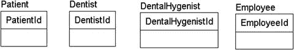

图 4-1.
构成我们初始模型的四个实体 小贴士

请注意，我一开始就为每个实体赋予了一个简单的代理键属性。在概念模型中，我们并不关心键的存在，但当我们进入关系的下一步时，代理键将在表之间迁移，以清晰地展示模型中所有权的谱系。如果你愿意，特别是如果它妨碍了沟通，可以随意省略代理键，因为非专业人士有时会对键和键结构过于纠结。

#### 地点

用户会希望存储与许多不同类型地点相关的信息。在我们的示例笔记集中，一个明显的地点实体是：

* ……管理几家牙科诊所……

从`牙科诊所`是地点这一事实出发，我们稍后可以预期，会有关于诊所的地址信息，可能还有电话号码、人员配置问题等等，这些都是用户可能有兴趣捕捉信息的。我们还从需求中了解到，这两家诊所相距不是很近，因此可能会有一些业务规则，涉及在不同诊所预约，或者防止牙医被安排在同一时间在两个诊所出诊。“预期”只是稍微有所依据的猜测，因此需要向客户验证所有预期。

我将`办公室`实体添加到模型中，如图 4-2 所示。

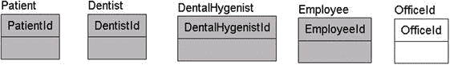

图 4-2.
添加办公室作为实体 注意

为了在模型中展示与书中叙述相关的进展，在模型中，与之前处理步骤相比未更改的项目显示为灰色，而新增内容则不加底纹。

#### 物品

物品主要指实体物品。在我们的例子中，有几种不同的物品：

* ……及其用品，例如样品牙膏、牙刷和牙线，以及牙科用品……

`用品`，例如样品牙膏、牙刷和牙线，以及牙科用品，都是客户运营业务所需的东西。显然，大多数用品都很简单，客户不需要存储大量关于它们的描述性信息。例如，针对像一管牙膏这样简单的东西，你可能想到的属性列表可以非常详尽：

1. 牙膏管尺寸：可能是长度或克数
2. 品牌：高露洁、佳洁士或其他品牌/无品牌（不应该因为没有在我的书中被提及而感到被轻视）
3. 格式：金属或塑料管、泵式等等
4. 口味：薄荷、泡泡糖（所有口味中最糟糕的）、肉桂和橙子
5. 制造商信息：批号、保质期等等

我们可以无休止地列出一管牙膏的更多属性，但用户不太可能对这些信息有业务需求，因为他们可能只有一箱从牙科公司那里收到的贿赂品（样品），然后分发给他们的患者（让他们对刚刚经历的金属与牙釉质接触的感觉好受一点）。

关于过度设计的第一个极其重要的教训就始于此。在这一点上，我们需要对过程应用选择性忽略，忽略那些没有明确业务利益的事物的不同属性。如果你认为这些信息有用，最好深入研究客户的流程以确认他们实际想要什么，但不要仅仅因为你能在数据库中设计存储某些东西，就认为这是必要的，或者客户会改变他们的流程来适应你的设计。如果你有好主意，他们可能会改变，但大多数公司都有看似疯狂的业务规则，原因对他们来说是合理的，并且可以合理地辩护。

只需要一个实体——`用品`——但要记录“给出的例子是样品项目，如牙膏或牙刷，另外还提到了牙科用品。这些用品是牙医和洁牙员用来执行工作的物品。”你写的这段文档以后会很重要，当你想知道提到的是哪种用品时。

为了跟上模型的进度，我将`用品`实体添加到模型中，如图 4-3 所示。

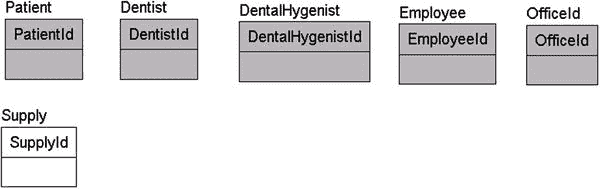

图 4-3.
添加了用品实体

#### 概念

没有任何法律或规则要求实体必须代表真实对象或甚至是物理存在的事物。在这个发现阶段，你需要考虑用户想要存储的、不符合已建立的“人物”、“地点”和“物品”类别的对象信息，这些对象可能是物理对象，也可能不是。

例如，考虑以下情况：

* ……然后向患者的**保险公司**开票，如果他或她有保险的话（否则患者**付款**）……

`保险`显然是一个重要实体，因为医疗领域围绕它运转。另一个实体名称在短语“患者付款”中看起来更像动词而不是名词。由此，我们可以推断可能存在某种形式的`付款`实体需要处理。

小贴士

并非所有实体都会带着“哟呵，我是个实体！”的闪烁标志。很多时候，你必须反复阅读已记录的内容，像猪找松露一样把它嗅出来。

模型现在如图 4-4 所示。

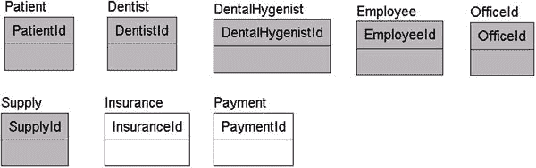

图 4-4.
添加了保险和付款实体

##### 文档

一份文档代表被捕获并以一个数据包形式传递的某些信息片段。经典的例子是一张写有需要支付账单信息的纸张。如果你拥有电脑和/或曾经使用过互联网，你可能知道“文档必须是实体纸张”的观念已经过时了，这就像为了做纸杯蛋糕带去孩子的学校而向邻居借一杯糖（来点生日芹菜吧，同学们！）一样古老。即使对于纸质文档，如果有人复印了那张纸呢？那是否意味着有两份文档，还是它们是同一份文档？通常情况并非如此，但有时人们确实需要追踪实体纸张，同样，也需要追踪文档的版本和修订。

在我们的新系统需求中，有几个需要处理的文档示例。首先，我们有：

*   ……然后向患者的保险公司开账单，如果他或她有保险的话（否则患者自付）。……

发票是在服务提供后发送给客户的纸质或电子邮件。然而，并未提及发票的交付方式。它们可以是电子邮件或邮寄——这并不明确——除非有特定的业务规则来管理交付方法或跟踪交付情况（即使如此，事物变化的速度也快于数据库的实施，所以要警惕以不可更改的方式硬编码业务规则），否则在数据库设计中强制要求采用任何一种方式都是不明智的。此时，只需识别出实体（本例中为`Invoice`）并继续推进；重申一次，通常不值得花太多时间去猜测数据将如何使用。

接下来，我们有以下内容：

*   ……预约，通过电子邮件或电话提醒患者预约的时间和地点。……

这种类型的文档几乎肯定不是通过纸张，而是通过电子邮件消息或电话交付的。电子邮件也被用作另一个实体`Alert`的一部分。提醒可以是电子邮件或电话提醒。你可能也在想：“提醒真的是需要存储的东西吗？”也许吧，也许不是，但很可能当行政助理打电话提醒患者有预约时，会记录下这次互动。这样，当患者错过预约时，他们可以说：“我们于 6 月 14 日^(日)给您打电话、发邮件和发短信，但您提供的号码没有回应！”跟踪用于提醒的地址也可能很重要，以防主要号码变更，这样你才能知道实际提醒的是哪个地址，但本章稍后会详细讨论。

注意

如果你足够敏锐，可能会想到`Appointment`、`Email`和`Phone`都是可能的实体，你是对的。在我这里的教学过程中，我一次只看一类，以阐明一个观点。在实际过程中，你会直接在线性地浏览文本寻找名词，并以一种非常固定的方式进行强化，这样本章才不会超出我整本书的页数分配。

接下来，我们将`Invoice`和`Alert`实体添加到模型中，如图 4-5 所示。

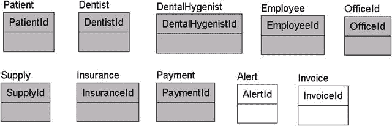

图 4-5.

添加了提醒和发票实体

##### 组

另一种概念性实体是事物组，或者更技术性地说，是实体的分组。例如，你可能有一个有成员的俱乐部，或者某些类型的产品组成了一个看起来不仅仅是简单属性的组。在我们的示例中，有这样一个实体：

*   每个患者应该能够为了保险和预约目的，与家庭中的其他患者相关联。

虽然一个人的家庭可以作为该人的一个属性，但它可能远不止于此。因此，我们添加一个`Family`实体，如图 4-6 所示。记住，任何添加到概念模型中的东西以后都可以移除。

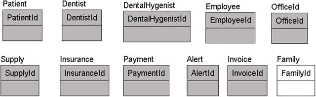

图 4-6.

添加了家庭实体

##### 其他实体

以下部分概述了一些额外的常见对象，它们可能不像已介绍的那些那么明显。它们并不总是符合简单的分类，但相当直观。

###### 审计跟踪

审计跟踪，一般来说，用于跟踪数据库的变化。你可能知道 RDBMS 使用日志来跟踪变化，但这对普通用户是不可访问的。因此，在用户需要跟踪谁做了什么的情况下，就需要建模实体来表示这些日志。它们可以类比于签到/签退表、书后面的老式借书卡，或者只是一系列按任意顺序记录发生的事情的列表。

考虑以下例子：

*   对于牙科耗材，我们需要跟踪每个员工的使用情况，特别是对患者记录在数据库中所做的任何更改。

在这种情况下，客户端显然急于了解每个员工正在使用的材料种类。也许可以猜测，用户需要记录牙科耗材何时被取用（牙科耗材与非牙科耗材之间的区别肯定需要在适当的时候讨论）。此外，目前并不需要所有的日志记录都完全在计算机上完成，甚至不需要使用计算机。

审计跟踪的第二个例子如下：

*   对于牙科耗材，我们需要跟踪每个员工的使用情况，尤其是对患者记录在数据库中所做的任何更改。

你需要定义的一个典型实体是审计跟踪或数据库活动日志，当数据敏感时，这个实体尤为重要。审计跟踪不是一种常规类型的实体，因为它不存储用户直接操作的数据，并且最终设计通常会推迟到实施设计阶段，尽管通常会有特定需求，说明需要在审计中捕获哪些类型的信息。目前主要需要关注的实体类型，通常是用户希望直接存储数据的那些实体。

###### 事件

事件实体通常代表动词或动作：

*   对于每次预约，客户端需要记录所有发生的事情。……

预约是一个事件，因为它用于记录患者何时来诊所（因为没有足够频繁地使用牙线而受折磨）。对于大多数事件，包括预约在内，拥有事件发生（或将发生）的时间表以及事件发生（或将发生）的地点很重要。同样，希望拥有记录事件发生情况的数据（做了什么、有多少人参加等）也很常见。因此，许多事件实体将与某种形式的文档实体紧密相关。在我们的示例中，预约很可能是为未来安排的，同时包含预期活动（清洁、X 光检查等）的信息；当预约发生时，会记录实际提供了哪些服务，以便牙医可以获得报酬。总的来说，任何系统中都有各种事件需要寻找，例如公用事业公司的电表读数、传感器的天气读数、设备测量、电话呼叫等等。

###### 记录与日志

此时需要审视的最后一个实体类型是活动记录或日志。请注意，我所说的“记录”是一种**非数据库的方式**。记录可以是用户先前可能在纸上记录的任何类型的活动。在我们的示例中，用户希望为每次就诊保留记录：

*   客户希望能够跟踪所有患者的预约记录，而无需维护大量文件。

将信息存储在集中式数据库中是构建数据库系统的主要优势之一：消除纸质文件，使数据更易于访问，特别是为了未来的数据挖掘。我必须告诉医生我正在服用什么药物多少次，全因为她的文件是用来掩盖其计费流程的混乱杂物，而不是一份有用的我的病史记录？如果我忘记了另一位医生开的某种药，并且它与另一种药物有强烈的相互作用怎么办？所有这些重复询问我服用什么药物的行为，对于保护医生和药房免受追责是很有用的，但通过利用连接到其他医生和药房记录的电子数据库，人们不断收集的信息变得鲜活起来，趋势可以立即显现出来，这在纸质文件上可能需要数小时才能看出。“嗯，在您的主治医生开始让您每天服用维生素 Q 之后，当清洁间隔时间比上一次多出超过 10 个月时，您就出现了蛀牙！”（或者也许更重要的是，如果有足够多的人提供足够的数据，我们最终就能很好地了解什么药物疗程能治愈疾病，而不仅仅是依赖小规模实验。请记住，您能放入数据库的数据越多，这些数据在未来某个时候用于数据挖掘的可能性就越大。）当然，将过多信息集中存放也使得安全性变得愈发重要，因此这也是一把双刃剑（我们将在第 9 章讨论安全性，但可以这么说，这不是一个微不足道的问题）。

修改后的模型如图 4-7 所示。

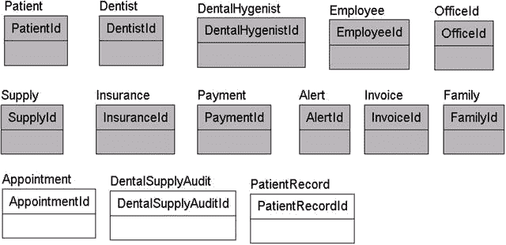

图 4-7. 添加了 `预约`、`牙科用品审计` 和 `患者记录` 实体

现在要小心了，因为你可能会很快得出结论，认为支付记录只是他们的发票、保险信息、X 光片等的简单合并。这是百分之百正确的，我现在就承认，`患者记录` 表可能是应用程序中的一个界面，相关的每一行记录都会在其中定位。在早期的概念建模阶段，通常最好就按照你发现的方式把它放在模型上，等到你觉得掌握了所有必要的信息后再进行完善。当你不是直接与用户沟通，而是基于文档工作时，这一点尤其重要——这种做法虽然越来越不普遍，但并未完全消失。

#### 实体回顾

到目前为止，我们已经发现了如表 4-1 所示的初步实体列表。这构成了一个相当薄弱的模型，但在接下来的几节中，随着我们开始添加实体间的关系和属性，这将发生变化。在继续推进之前，请停下来，按照表 4-1 所示，对实体进行定义和记录。

表 4-1. 实体列表

| 实体 | 类型 | 描述 |
| --- | --- | --- |
| `患者` | 人员 | 牙科诊所的顾客。他们接受服务，消耗耗材，并为此被收费。 |
| `家庭` | 概念 | 为方便起见而归为一组的一组患者。 |
| `牙医` | 人员 | 在牙科诊所从事最重要工作的人。有多名牙医为客户的诊所工作。 |
| `牙科保健员` | 人员 | 为牙医做常规工作的人。保健员的数量比牙医多不少。（注：与客户确认每位牙医对应的保健员数量是否有指导方针。这可能对于安排预约是必需的。） |
| `员工` | 人员 | 在牙科诊所工作的任何人。牙医和保健员显然是员工的类型。 |
| `诊所` | 地点 | 牙医开展业务的地点。他们有多个诊所需要处理和安排患者。 |
| `耗材` | 牙科用品 | 用于维持牙科诊所运营的耗材。给出的例子有样品项目，如牙膏或牙刷，另外还提到了牙科耗材，即牙医和保健员用于完成工作的耗材。 |
| `保险` | 概念 | 患者用来支付牙科服务费用的方式。 |
| `支付` | 概念 | 从保险公司或患者（或两者）收到的用于支付服务的款项。 |
| `发票` | 单据 | 发送给患者或保险公司的单据，说明需要支付多少服务费用。 |
| `提醒` | 单据 | 为告知患者即将来临的预约而发出的通知。 |
| `牙科用品审计` | 审计跟踪 | 用于跟踪牙科耗材的使用情况。 |
| `预约` | 事件 | 患者前来接受牙科治疗的活动。 |
| `患者记录` | 记录 | 关于患者的所有相关信息，非常类似于任何医生办公室里的患者病历夹。 |

实现建模注意事项：记录对敏感/重要数据的所有更改。

这些描述是基于从初步文档中推导出的事实。请注意，已指定的实体是客户文档中直接体现的。

这些是全部的实体吗？也许是，也许不是，但这是我们完成第一次设计后所发现的一组实体。在一个真实的项目中，你经常会发现新的实体，并删除一两个你原以为必要的实体。在大多数情况下，这不是一个完美的过程，因为你需要不断地了解用户的需求。

注意

概念建模阶段，你对客户业务类型的了解可能对你有帮助，也可能妨碍你。一方面，它有助于你快速理解他们的需求，但同时，它也可能导致你基于“我为另一个客户做类似事情时的做法”而草率下结论。每个客户都是独特的，有自己的做事方式。你将需要使用的最重要工具是你的眼睛和耳朵。

### 识别实体间的关系

接下来，我们将寻找实体相互关联的方式，这随后将被转化为模型上实体之间的关系。这里的想法是找出每个实体将如何协同工作以满足客户的需求。我将从一对一多（one-to-N）类型的关系开始，然后涵盖多对多（many-to-many）关系。考虑那些在你的需求中没有直接提到的基本关系也很重要。只要认识到用户知道他们希望系统是什么样的，你将重新审视他们的要求，并在之后填补空白。

#### 一对多关系

在每一种一对多关系中，处于“一”端的表被视为**父级**，处于“多”端的则是子行。尽管这种一对多关系可能是你在关系模型中将要实现的唯一类型，但你在模型中发现的许多自然关系实际上很可能是多对多关系。关键是要仔细审查你建模的所有关系的**基数**，以免因忽略过程中非常自然的事物而限制未来的设计考量。

为了让概念更具体，我们不要用“一对多”这种机械的术语来思考，而是将其分解为几种关系类型：

*   **简单关系**：一个实例与一个或多个子实例相关联。以这种方式识别关系的主要目的是在两个实体行之间建立关联。
*   **“是一种”关系**：与之前的分类不同，当我们想到“是一种”关系时，通常意味着两个相关项是同一事物，即一个表是另一个表的更通用版本。例如，经理是一名员工。在数据建模章节（第 3 章）中，我们称这种关系为**分类关系**。

我将在接下来的几个小节中介绍每种类型的示例。

##### 简单关系

在本节中，我将讨论在建模关系时可能发现的一些关联类型。简单关系的另一个常见术语是“具有”关系，之所以这样命名，是因为当你开始为关系赋予动词短语/名称时，你会发现几乎对每个关系都很容易说“具有”。实际上，建模者常犯的一个错误是最终在太多父子关系中使用“具有”作为动词短语，这降低了动词短语的价值（尽管有时它确实是最好的选择）。

在本节中，我将讨论几种你经常会遇到的示例关系类型。以下是不同类型的关系：

*   **连接关系**：两个事物之间的关联，例如一个人与他们的驾照或汽车的关系。这是所有关系中最通用的一种，通常涵盖实体之间的任何所有权或关联。
*   **事务关系**：更一般地，这可以被视为一种交互关系。例如，客户支付账单或打电话，因此账户通过交易被贷记/借记资金。
*   **多值属性**：在面向对象语言实现的对象中，属性可以是数组，但在关系数据库中，如第 1 章所讨论的，所有属性在用于关系查询时必须是原子/标量值（或至少应该是）。因此，当我们设计，比如说，一个发票实体时，我们不会将所有的行项目放在同一个表中；我们创建一个新表，通常称为`invoiceLineItem`。另一个常见的例子是存储客户的偏好。除非他们只能有一个偏好，否则需要为每个偏好创建一个新表。
*   **域关系**：在早期建模中可能发现的一种关系类型是域类型。它用于为某个属性实现域，其中超过一个单一属性似乎是有用的。本章将不演示这种关系类型，但我们将在后面的章节中研究域关系（它们最常用作实现工具）。

在接下来的几个小节中，我将使用这四种关系类型来分类和挑选出在我们的牙科诊所示例中发现的一些关系类型。

###### 连接关系

在我们的示例需求段落中，考虑以下内容：

*   ... 然后向患者的保险公司开具账单，如果他或她有保险的话...

在这种情况下，关系存在于`Patient`和`Insurance`实体之间。这是一个**可选关系**，因为它说“如果他或她有保险”。向模型中添加以下关系，如图 4-8 所示。

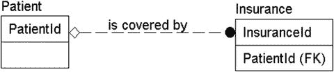
图 4-8. 添加了患者与保险公司实体之间的关系

另一个“具有”关系的例子如下：

*   每个患者应能够出于保险和预约目的与家庭中的其他患者相关联。

在这种情况下，我们识别出一个家庭拥有患者。虽然这听起来有点奇怪，但在医疗诊所的背景下完全合理。客户端希望尽可能为十口之家的每个成员维护一份单一的保险单，而不是维护十份不同的保单。因此，我们在家庭和患者之间添加了一种关系，声明一个家庭实例可以有多个患者实例。还要注意，我们将其设为可选关系，因为患者不强制要求有保险。

家庭由保险承保也是图 4-9 中的一种可能关系。已经指定了患者有保险。这并非不可能，因为即使一个人的家庭有保险，其中一名成员也可能有替代的保险计划。它也没有与我们早先关于患者拥有保险的概念相矛盾，尽管它确实为客户端提供了两种识别保险的不同途径。这不一定是个问题，但当存在两份保险单时，你可能需要实现业务规则逻辑来决定哪一份优先。同样，这是需要与客户讨论的事情，可能不是应该凭空捏造的。

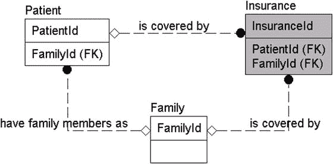
图 4-9. 在患者、保险公司和家庭实体之间添加的关系

这是另一个连接关系的例子，如图 4-10 所示：

*   ... 牙科诊所 ... 客户需要系统来管理其患者和预约...

    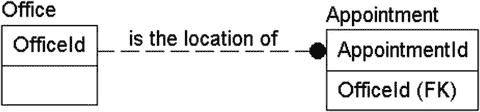
    图 4-10. 在办公室和预约实体之间添加的关系

在这种情况下，请注意每个牙科诊所都将有预约。显然，一个预约只能为一个牙科诊所服务，因此这不是多对多关系。事件类型实体的一个属性通常是位置。目前尚不清楚患者是否只去一个诊所，还是可以在不同诊所之间流动。然而，可以肯定的是，预约必须在诊所进行，因此`Office`和`Appointment`之间的关系是**必需的**。现在添加图 4-10 所示的关系。

###### 事务关系

事务可能是数据库中最常见的关系类型。几乎每个数据库都会有某种方式来记录与另一个实体实例的交互。例如，一些非常常见的事务就是客户进行购买、支付等。我无法想象一个有用的数据库只有客户和产品数据，而交易信息记录在其他地方。

在我们的数据库中，我们有一个非常明显的事务：

*   ... 如果他或她有保险（否则患者支付）。应发送账单...

我们早先识别了`Patient`和`Payment`实体，因此我们添加一个关系来表示患者进行支付。图 4-11 显示了新添加的关系。

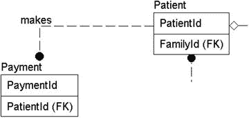
图 4-11. 在患者和预约实体之间添加的关系

## 多值属性与领域

在建模的早期阶段，相比于其他类型，自然发现多值属性和领域关系的可能性要小得多。原因是用户通常从较大的概念（如对象）进行思考。在我们的模型中，到目前为止，我们已经确定了几个可能扩展实体以涵盖数组类型的地方，这些类型可能并不严格地写在需求中，尤其是当需求是由最终用户编写时。

例如，对于多值属性：`Invoice`（发票）有发票行项目；`Appointment`（预约）有将采取的`Action`（操作）列表，例如清洁、拍 X 光片和钻孔；`Payment`（支付）可以有多个支付来源。对于领域关系，可以考虑上述大多数实体的状态值。虽然“激活”和“未激活”这样的领域可能不足以提升到需要领域表的程度，但如果我们还想将描述与此值关联（例如“激活超过 5 年的患者会获得更好的赠品”），或者可能包含当患者处于该状态时要采取的一些流程，那么拥有一个可能状态值的表就能实现这一点。在某些情况下，这些复杂的领域可能显示在概念模型上，但当设计者这样做时，通常是因为设计者使概念建模的过程过于复杂化了。

因此，我不会在示例段落中提出任何领域或多值属性关系的例子，但我们将在第 8 章中更深入地讨论这个主题，届时我将介绍用于实现的建模模式。

## Is-A 关系

Is-A 关系背后的主要思想是，关系中的子实体扩展了父实体。例如，汽车、卡车、房车等都是车辆的类型，所以汽车是一种车辆。这种关系的基数始终是一对一，因为子实体只包含更具体的信息来限定这种扩展关系。会有一些信息对于每个子实体是通用的（存储为父实体的属性），也有一些信息对于每个子实体是特定的（存储为子实体的属性）。

在我们的示例文本中，存在以下片段：

*   ... 管理几位牙医和不少牙科保健师，他们 ...

以及

*   ... 按员工跟踪使用情况，特别是 ...

从这些陈述中，您可以合理地推断出存在三个实体，并且它们之间存在关系。牙医是一名员工，牙科保健师也是。可能还有其他员工，系统需要跟踪他们的耗材使用情况，但目前没有列出。图 4-12 展示了这种关系，它使用子类型关系类型建模。请注意，这被建模为完整的子类型，意味着每个 `Employee`（员工）实例都将对应一个 `Dentist`（牙医）或 `DentalHygenist`（牙科保健师）实例。

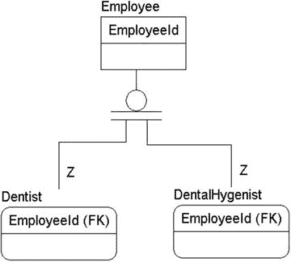
图 4-12.

在 `Employee`、`Dentist` 和 `DentalHygienist` 实体之间识别出的子类型关系

注意

因为子类型表现为一对一的标识关系（回想第 3 章，关系线上的 Z 表示一对一关系），所以不需要为 `Dentist` 和 `DentalHygienist` 实体设置单独的键。

这种键的用法在实现中可能会令人困惑，因为您可能在三个表级别的任何一个有关系，并且键的名称相同。这些问题正是为什么您需要维护一个数据模型供用户根据需要查看，以理解表之间的关系。

## 多对多关系

多对多关系比你可能认为的要普遍得多。事实上，随着您完善模型，当认识到实体之间的真实关系时，大量的关系最终可能成为多对多关系。然而，在设计过程的早期，可能只识别出一些明显的多对多关系。在我们的例子中，有一个是明显的：

*   牙医可能在一周内的各个时间在不同诊所工作。

在这种情况下，每位牙医可以在多家牙科诊所工作。一对多关系不足以满足要求；声称一位牙医可以在多家牙科诊所工作是错误的，因为这意味着每家牙科诊所只有一位牙医。相反，一家诊所可以支持多位牙医，这意味着牙医只在一家诊所工作。因此，这是一个多对多关系（见图 4-13）。

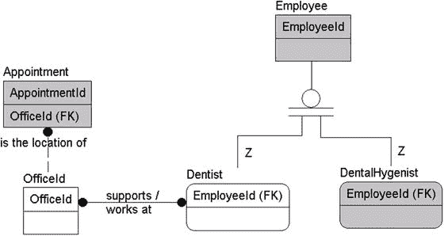
图 4-13.

在 `Dentist` 和 `Office` 之间添加了多对多关系

我知道你们大多数人在想什么，“嘿，那牙医与预约的关联，牙科保健师也一样呢？”首先，这是很好的思考。当您回到客户那里时，您可能希望与他们讨论这个问题（希望您的需求收集者会立即进行那次讨论……我的没有！）。目前，我们记录需求所要求的，然后，我们会询问分析师和客户他们是否希望跟踪这些信息。可能在这个产品迭代中，他们只想知道牙医在哪里，以便在手动安排预约时使用这些信息。重申一下，我们不是要猜心思，而是要以最好的方式满足客户的要求。

还有一个额外的多对多关系可以被识别出来：

*   ... 牙科耗材，我们需要按员工跟踪使用情况 ...

这句话表明，多个员工可以使用不同类型的耗材，并且对于每种牙科耗材，多种类型的员工都可以使用它们。但是，可能需要控制措施来管理每位员工可能使用的牙科耗材类型，特别是如果某些耗材受到某种管制（例如麻醉品）。

添加了如图 4-14 所示的关系。

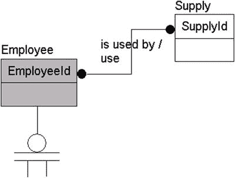
图 4-14.

在 `Supply`（耗材）和 `Employee` 实体之间添加了多对多关系

我还打算移除 `DentalSupplyAudit`（牙科耗材审计）实体，因为越来越清楚这个实体是一个报告，我们将在流程的后面解决这个需求。我们从这里知道的是员工使用耗材，我们需要捕捉到这一事实。

#### 列出关系

图 4-15 展示了当前的模型。

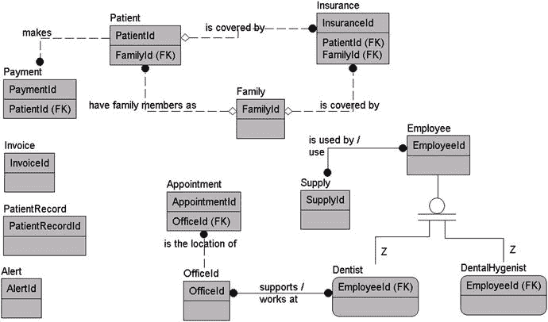

图 4-15. 当前模型

文本中还有其他关系，我不会显式涵盖，但我已在表 4-2 的描述中记录了它们。该表之后是标识了关系的模型，以及我们文档中对这些关系的定义（请注意，关系仅在父实体处记录）。

表 4-2. 初始关系文档

| 实体 | 类型 | 描述 |
| --- | --- | --- |
| `Patient` | People | 牙科诊所的客户。接受服务，使用用品，并被收取这些服务的费用。 |
| Is covered by Insurance | 识别患者何时有个人保险。 |
| Is reminded by Alerts | 向患者发送提醒，告知其预约。 |
| Is scheduled via Appointments | 预约需要有一位患者。 |
| Is billed with Invoices | 通过发票向患者收取预约费用。 |
| Makes Payment | 患者为收到的发票付款。 |
| Has activity listed in PatientRecord | 发生在医生办公室中的活动。 |
| `Family` | Idea | 为方便起见而分组的一组患者。 |
| Has family members as Patients | 一个家庭由多个患者组成。 |
| Is covered by Insurance | 识别整个家庭是否有保险覆盖。 |
| `Dentist` | People | 在牙科诊所从事技术含量最高工作的人员。多位牙医为客户的诊所工作。 |
| Works at many Offices | 牙医可以在多个诊所工作。 |
| Is an Employee | 牙医具有所有员工的一些属性。 |
| Works during Appointments | 预约可能需要一位牙医的服务。 |
| `DentalHygienist` | People | 为牙医做常规工作的人员。洁牙师比牙医多得多。（注意：与客户核对是否有每位牙医对应多少洁牙师的指导方针。可能在设置预约时需要。） |
| Is an Employee | 洁牙师具有所有员工的一些属性。 |
| Has Appointments | 所有预约都需要至少一位洁牙师。 |
| `Employee` | People | 任何在牙科诊所工作的人员。牙医和洁牙师显然是员工的类型。 |
| Use Supplies | 员工因各种原因使用用品。 |
| `Office` | Places | 牙医开展业务的地点。他们有多个诊所需要管理和安排患者。 |
| Is the location of Appointments | 预约是为单一诊所制定的。 |
| `Supply` | Objects | 用于牙科诊所运营的用品。给出的例子是样品项目，如牙膏或牙刷，还提到了牙科用品，即牙医和洁牙师用于完成工作的用品。 |
| Are used by many Employees | 员工因各种原因使用用品。 |
| `Insurance` | Idea | 患者用于支付所提供牙科服务的保险。 |
| `Payment` | Idea | 从保险公司或患者（或两者）收到的用于支付服务的款项。 |
| `Invoice` | Document | 发送给患者或保险公司的文件，解释支付服务所需金额。 |
| Has Payments | 通常付款是为了支付发票的费用（有些付款是出于其他原因）。 |
| `Alert` | Document | 发送给患者的电子邮件或电话，告知其即将来临的预约。 |
| `Appointment` | Event | 患者前来进行一些牙科治疗的事件。 |
| `PatientRecord` | Record | 关于患者的所有相关信息，非常类似于任何医生办公室的病历卡。 |

图 4-16 展示了模型的进展。

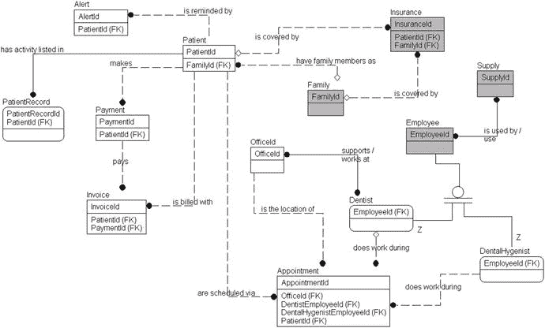

图 4-16. 最终的概念模型

你可以看到，此时概念模型已经真正成型，你可以感受到最终模型可能的样子。在下一节中，我们将开始向表中添加属性，模型将真正开始成形。它并非 100% 完成，你可能确实会发现一些你真正想要添加或更改的内容（例如，`Insurance`支付`Invoice`这个事实很突出，是一个明确的可能性）。然而，请注意，在这个设计阶段（当然在这个练习中），我们尽力避免向模型中添加价值/信息。那是过程的一部分，会在你根据客户提供的文档填补漏洞时进行。

请记住，我包含在这个模型上的唯一属性是用作展示来源的方法。我仅在最终模型中为属性使用了任何角色名称，当时我将`Employee`的两个子类型与`Appointment`实体相关联，如图 4-17 所示。

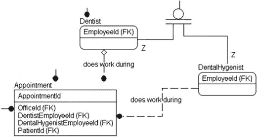

图 4-17. 具有命名为 EmployeeRelationship 角色的 Appointment 实体

我将两个子类型与`Appointment`实体相关联，以明确每个关系的作用，而不是在表中为两个关系使用通用的`EmployeeId`。再次说明，即使使用任何类型的键也不是标准的概念模型构造，但如果没有关系属性，模型会显得呆板，并且也倾向于隐藏从实体到实体的来源。

`Appointment`实体是我这个小型示例图中最好的例子，展示了模型如何显示实体的一些基本构成，因为我们现在可以看到，对于一个预约，我们需要一个诊所、一个患者、一位洁牙师，有时还需要一位牙医可用（因为该关系是可选的）。这些都没有真正定义预约，因此它仍然是一个独立的实体，但这些属性至关重要。

### 测试概念模型

在给概念模型盖上“完成”印章之前，现在是最后一次遍历需求，确保它们能被模型中的实体满足。我们不会在本文本中花太多时间解释这意味着什么，因为它基本上与你已经经历的过程相同，进行迭代，直到你找不到任何需要更改的内容。本章前面我们有一个需求：

*   ...然后，如果患者有保险，就向其保险公司开具发票...

现在我们需要确保，如果与我们创建的实体相关的某些内容发生了变化，它仍然满足需求。测试可能像下面这样的列表一样简单：

1.  创建一个`Patient`实例。
2.  创建一个相关的`Insurance`实例来代表他们的保险单。

在较高层面上看到每个需求都能被满足，将帮助你判断你的模型是否准备好满足你期望它满足的所有需求。有可能你将一个实体更改为不再满足需求的东西，但你仍处于一个很好的阶段，此时更改不需要任何编码。

## 构建逻辑模型

在本节中，随着概念模型的完成与测试，建模过程的后续步骤将变得相当容易。与概念模型侧重宏观不同，逻辑模型更注重细节。总体而言，数据建模过程中最困难的部分（掌握客户需求）已经过去。你可能会向模型中添加更多实体，但通常你识别的这些实体实际上只是为了实现一个复杂的（非标量）属性。例如，如果属性是电话号码，你可能需要一个新实体来支持多个电话号码。

延续“概念模型”一节中的房屋建造类比，当逻辑模型完成时，我们将获得建筑的详尽蓝图。我们将了解客户期望拥有的房间、窗户及其他特征。房屋建成后情况可能有所变化，同样，当我们构建数据库时，可能需要调整设计以确保其在所有需要的场景中都能正常工作。在第 6 章中，我们将创建一个数据库并开始实际测试。

在本节中，我们将继续本章主体部分开始构建的模型，添加属性、识别规则、流程等，以确保我们理解所有的数据需求。

### 识别属性与域

当我们开始创建逻辑模型的初始阶段时，目标是寻找那些标识和描述我们试图表示的实体的项目，或者——用更接近计算的术语来说——我们实体的属性。例如，如果实体是人，属性可能包括驾照号码、社会安全号码、头发颜色、眼睛颜色、体重、配偶、子女、邮寄地址和/或电子邮件地址。这些东西中的每一项都在部分程度上代表了该实体。

识别哪些属性应与某个实体关联，需要采用与识别实体本身类似的方法。你通常可以通过注意用来描述先前已发现实体的形容词来找到属性。有些属性仅仅是由于实体的类型（人、地点等）而被发现的。

属性的域信息通常与属性同时被发现，因此此时，你应该尽可能方便地识别域。以下是在识别属性及其域的过程中需要寻找的一些常见属性类型：

*   标识符：用于标识实体单个实例的任何信息。这与键有大致相似之处，尽管标识符并不总是能成为合适的键，而更多是识别用户可能搜索特定实例的方式。
*   描述性信息：用于描述实体某些方面的信息，如颜色、状态、名称、描述等。
*   定位器：标识如何定位实体所建模的对象，无论是在现实世界中物理定位（如邮寄地址），还是在技术层面上定位（如计算机屏幕上的位置）。
*   值：量化实体某些方面的内容，如金额、计数、日期等。

正如我们在实体搜索中所做的那样，这些并非寻找属性的唯一起点，但它们是一些常见的入手点。目前最重要的是，你会寻找那些能使实体建模对象更清晰的值。同时，应该指出的是，所有这些类别都具有同等的价值，且分组可能存在重叠。许多属性可能并不完全符合这些类别（即使我所有的示例属性都过于巧合地符合）。这只是一组思路，旨在你在寻找属性时提供帮助。

#### 标识符

在本节中，我们将考虑用于区分一个实例与另一个实例的元素。每个实体都需要至少一组标识属性。没有属性，在后续过程中就无法区分不同的对象。这些标识符很可能会成为实体的候选键，但并非总是如此（有时你可能无法保证唯一性，甚至无法保证每个实例都有值）。例如，以下是一些良好标识符的常见示例：

*   对于人：社会安全号码（在美国）、全名（通常不是完美的计算标识符）或其他 ID（如客户号、员工号等）。
*   对于事务性文档（发票、账单、计算机生成的通知）：这些通常会分配某种用于跟踪的编号。
*   对于书籍：ISBN 号（书名肯定不是唯一的，甚至按作者也不总是唯一）。
*   对于产品：特定制造商的产品编号（产品名称不是唯一的）、通用产品代码等。
*   对于客户打交道的公司：通常会分配一个客户/委托人编号用于跟踪，即使客户更改名称，该编号可能也不会改变。
*   对于建筑物：通常会给建筑物一个名称以便指代。
*   对于邮件：收件人的姓名和地址以及发送日期。

这绝不是一个详尽的列表，但这个代表性列表将帮助你理解标识符的含义。回想一下第 1 章中的关系模型概述——实体的每个实例必须是唯一的。在数据中识别唯一的自然键是实现设计非常重要的一步。

要真正辨别你认为唯一的事物是否真的唯一。看看人名。乍看之下，它们几乎是唯一的，在现实生活中你也会亲自将它们用作键（如果你认识两个叫 Louis Davidson 的人，那可真是天助你也，你会将名字变形为 Louis Davidson 作者，或 Louis Davidson 那个不是作者的人），但在数据库中，这样做会带来问题。例如，有成千上万，甚至可能数百万人叫`John Smith`！对于这些情况，你可能希望在文档中注明我所谓的“可能唯一性”。

在你的模型以及最终的应用程序中，你很可能希望识别那些实际上并非良好键（如名字和姓氏）但极可能唯一的数据，这样虽然你不能强制实施唯一性，但可以在输入名字和姓氏时，让用户界面使用此信息来识别可能匹配的人员，然后要求提供一个已知的信息片段，而不是期望这是一个新客户。通常，这个过程不仅包括名字，还包括地址、电话号码、电子邮件地址等，以开始提高匹配的概率。（在第 8 章，我们将讨论实现唯一性标准的不同方式；目前，重要的是思考和记录这些情况。）

在我们的示例中，第一个这样的标识符示例出现在这个短语中：

*   客户管理着几家牙科诊所。一家名为`切尔西诊所`，另一家是`市中心诊所`。

## 标识属性

几乎在任何为事物命名的场景下，一个好的属性都是标识实体的关键，在我们的例子中，`Office`实体的`Name`属性就是如此。这使其成为一个可能的键候选，因为客户不太可能有两个都称为“Downtown Office”的办公室，那样做很愚蠢并会导致混淆。因此，我在模型中的`Office`实体上添加了`Name`属性（如图 4-18 所示）。我将为这类通用名称创建一个通用域，通常我选择 60 个字符作为合理的长度。这不是验证的替代方案，因为客户可能有特定的属性长度要求，尽管大多数时候，客户在初始阶段并不会真正考虑长度问题，直到需要创建报表并显示这些值时才会关心。我使用 60 个字符，因为这远超过普通文档或表单宽度所能显示的字符数：

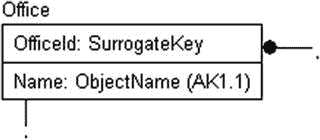
图 4-18. 在`Office`实体中添加了`Name`属性

实际的默认长度可以轻松更改。这正是使用域的意义所在。可能也很明显，`Office`名称本身就是一个独立的域。

提示

报表格式常常会改变你的模型所能处理的内容，但要小心，不要让它成为完全的指导。如果需要 200 个字符才能形成一个好名称，那就使用 200 个字符，然后创建属性来缩短报表中的名称。当进行测试时，如果 200 是最大长度，那么所有的表单、报表、查询等都应该按照这个全尺寸属性的长度进行测试，因此才希望将内容保持在合理的长度内。

当我在图 4-18 中的`Office`实体上添加`Name`属性时，我还将其设置为需要`唯一值`，因为让两个办公室拥有相同的名字会非常尴尬，除非你正在为 Moe、Larry 和 Curly 建模一个牙医/木工办公室。

另一个标识符可以在以下文本中找到：

*   目前，客户在其计算机系统中使用一个病人编号，该编号对应一个存放病人记录的特定文件夹。

因此，系统需要为`Patient`实体设置一个病人编号属性。我将为病人编号创建一个特定的域，以便在需要时进行调整。经过进一步讨论，我们了解到客户正在使用来自现有系统的八字符病人编号（参见图 4-19）。

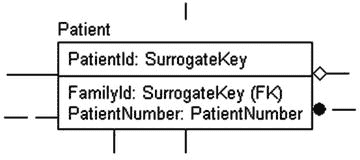
图 4-19. 在`Patient`实体中添加了`PatientNumber`属性

注意

我在这个实体中使用了名称`PatientNumber`，尽管它包含了表名作为后缀（这是我之前建议应谨慎使用的做法）。我这样做是因为它是客户常用的术语。它也赋予了`Number`所没有的清晰度。其他例子可能是像`PurchaseOrderNumber`或`DriversLicenseNumber`这样的术语，其含义对客户来说一目了然。无论你的命名标准是什么，最好确保客户常用的术语以客户通常使用的方式呈现。

在大多数情况下，发现实体的标识符通常很容易，对于你在基于用户的规范中发现的那种自然存在的实体尤其如此。几乎所有自然存在的事物都有某种区分自己的方式，尽管当你开始深入挖掘客户的实际业务实践时，区分可能会变得更难。

关于一切事物都可被标识的陈述，一个常见的反例是那些批量管理的东西。以我们的牙医诊所为例——虽然很容易区分牙膏和牙线，但你如何区分两管牙膏呢？客户真的在意吗？这大概是一个足够安全的赌注，没有人关心给小约翰尼的是哪一管牙膏，但当涉及到牙医可能使用的一些植入物时，这个知识可能很重要。需要与客户进行更多讨论，但我的观点是，区分并不总是简单的。在逻辑设计的早期阶段，目标是尽你所能。像这样的细节可能会成为实现细节。对于植入物，几乎肯定会有序列号。对于像麻醉剂这样的药品，我们可能要求为每瓶分发的药品打印带有代码的标签并进行维护。对于牙膏，你可能只有一行记录和一个估计的库存量。在前一种情况下，键可能是你生成并打印的代码；在后一种情况下，名称“toothpaste”可能就是键，而不管牙膏样本的实际品牌如何。

### 描述性信息

描述性信息指的是通常用作形容词的常见类型，用于描述先前被标识为实体的事物，并且通常会直接指向一个属性。在我们的示例中，识别了不同类型的用品，即样品和牙科用品：

*   ...他们的用品，例如样品牙膏、牙刷和牙线，以及牙科用品...

你还可以识别出属性可能的域。在这个例子中，属性是“Type Of Supply”，域似乎是“Sample”和“Dental”。因此，我创建了一个特定的特殊域：`SupplyType`（见图 4-20）。

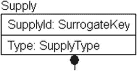
图 4-20. 在`Supply`实体中添加了`Type`属性

#### 定位器

定位器的概念与键并无二致，只不过它谈论的不是在数据库的电子边界内定位某物，而是用于查找某物的地理位置、物理位置，甚至是电子位置。

例如，以下是一些定位器的例子：

*   邮寄地址：每个地址都能将我们引向地球上的某个物理位置，例如房屋的邮箱，甚至建筑物内的邮政信箱。
*   地理参考：诸如经度、纬度，甚至是前往某地的文字路线指引。
*   电话号码：虽然不总是能通过电话号码精确定位物理位置，但可以用它来找到某人进行通话。
*   电子邮件地址：与电话号码类似，可用于定位并联系某人。
*   网站、FTP 站点或其他网络资源：你经常需要标识实体的网站，或由实体标识的资源的 URL；此类信息将被定义为属性。
*   任何类型的坐标：可能是货架上的某个位置、计算机屏幕上的像素、办公室号码等等。

在我们的例子中，最明显的位置是办公室，回到上一节使用的文本：

*   客户管理着几家牙科诊所。一家叫做切尔西诊所（`Chelsea Office`），另一家叫做市中心诊所（`Downtown Office`）。

从名称上可以合理推断，这些办公室不在一起（不像在一栋 100 层的大楼里，其中一间办公室环境更奢华之类的），所以我们应该添加的另一个标识符是建筑地址。建筑将通过其地理位置来标识，因为一个不会移动的目标总是可以通过地址或地理坐标来物理定位。图 4-21 展示了添加了`Address`属性后的`Office`实体：

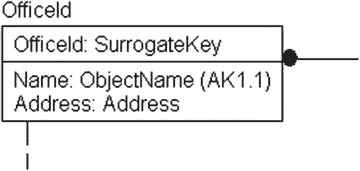

图 4-21. 向 Office 实体添加了 Address 属性

每个办公室只能有一个标识其位置的地址，因此`Address`属性最初可以直接放在`Office`实体中。同样重要的是，这个地址的域应该是物理地址，而不是邮政信箱。不要纠结于你知道地址比一个简单值更复杂……最终如何实现地址超出了当前讨论的范围。我们将在后续过程中讨论地址实现的细节，具体取决于用户将如何使用地址。

并非只有固定场所才能被定位。一个位置可以是临时位置，或者可以通过定位器进行联系，例如地址、电话号码，甚至是像 GPS 坐标这样可能变化非常快的东西（想想公司可能希望跟踪的实物资产，如出租车、工具等）。在下一个例子中，有三个典型的定位器：

*   ……为每个家庭，以及可能的话（如果客户有要求）也为每位患者关联一个地址、一个电话号码（家庭、手机和/或办公室），以及一个可选的电子邮件地址……

大多数客户，在这个例子中是牙科受害者——呃，患者——拥有电话号码、地址和/或电子邮件地址属性。牙科诊所使用这些信息来定位并与患者沟通，原因多种多样，如账单、预约和取消预约等。还要注意，家庭成员通常并不住在一起，因为上大学、离婚等原因，但你可能仍需要出于保险和账单目的将他们关联起来。基于这些因素，你得到了家庭和患者身上的这些属性集；见图 4-22。

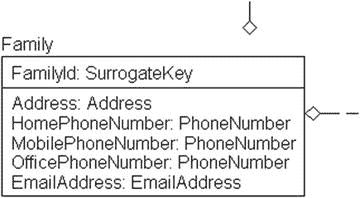

图 4-22. 向 Family 实体添加了与位置相关的属性

患者的情况也类似，如图 4-23 所示。

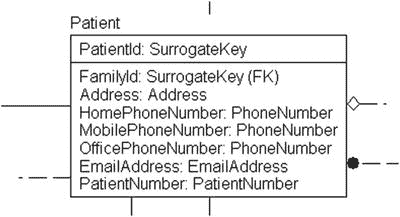

图 4-23. 向 Patient 实体添加了与位置相关的属性

这是一个重申你打算实现的列与早期建模过程中的属性之间主要区别的好地方。属性不需要遵循其形态的任何特定要求。它可能是一个标量值；可能是一个向量；甚至可能本身就是一个表。你实现的物理数据库中的列需要符合某种模式，即只能是标量或固定向量，仅此而已。规范化过程（将在第 5 章中介绍）完成了将所有属性塑造成适合在关系型数据库中实现的正确形态的过程。

#### 值

数字是最强大的属性之一，因为通常需要对它们进行数学运算，以帮助客户获得报酬，或者计算、预测收入。如果搞错了一个人的受抚养人数量，他或她的税就会一团糟。或者在表格上以绝对错误的方向写错了你妻子的体重，她可能会用某种厨具打你（这不像长发公主在《魔发奇缘》里这样做时那么有趣！）。

值通常是数字，例如以下例子：

*   金额：金融交易、发票行项目等。
*   数量：重量、售出产品数量、项目计数（例如处方瓶中的药片数量）、发票行项目上的物品数量、电话拨打次数等。
*   其他：灯泡的瓦数、电视屏幕的尺寸、硬盘的 RPM 评级、轮胎的最高速度等。

数字作为属性无处不在，并且通常相当重要（当然，这不是要贬低其他属性的价值！）。它们也是可能需要选择域以确保其值合理的候选属性。如果你正在编写一个用于捕获个人税收信息的包，你几乎肯定希望有一个域来规定受抚养人数量必须大于或等于零。你可能还想设置一个可能的最大值，比如 10。这不会是一条硬性规定，但将是一个合理性检查，因为大多数人没有 10 个受抚养人（嗯，大多数理智的人，在之前，或者肯定是在之后！）。如果法律限制了数量，你可能还会指定一个不支持的上限。域在现阶段不一定是硬性规定（只有硬性规定最终可能会成为数据库 DDL，但它们必须在某个地方实现，否则用户可以并且会随时输入他们觉得合适的内容）。建立一个合理的值是好的，这样就不会有人误将 10 打成 100 而被审计。

在我们的示例段落中，就有这样一个属性：

*   客户管理着几家牙科诊所。

这里的问题是这会是什么属性。在这种情况下，它不会是一个数值，而是一些关于牙科`Office`实体的基数信息。一旦我们更深入地研究发票和付款，模型中会有其他数字，但我特意避免包含货币值以使模型保持简单。

#### 关系属性

每一个被识别出的关系都可能隐含着支持它所需的数据片段。例如，考虑一个常见关系，如 `Customer pays Invoice`（客户支付发票）。这很简单；它暗示了 `Customer`（客户）实体和 `Invoice`（发票）实体之间的关系。但这个关系暗示了发票需要被支付；因此（如果你之前不知道发票是什么），现在可以知道发票具有某种形式的金额属性。

以我们的数据库为例，在关系 `Employees use Supplies for various reasons`（员工因各种原因使用耗材）中，“for various reasons”（因各种原因）这部分可能会引导我们想到“相关-信息”类型的属性。这告诉我们，该关系不是 `Person`（人员）和 `Supplies`（耗材）之间的一对多关系，而是它们之间的多对多关系。然而，这确实意味着稍后可能需要一个额外的实体来记录这个事实，因为识别关于该关系的更多信息是可取的。

### 提示

不必过于担心在设计过程早期可能会遗漏某些关键内容。通常，同一个实体、属性或关系会在文档的多个地方出现，而且当您与客户反复审核内容，以及运行测试直到对设计满意并超越逻辑模型开始产出物理模型时，您的客户也会识别出您遗漏的许多信息片段。

#### 实体、属性与域列表

图 4-24 展示了当前的逻辑图形模型，表 4-3 列出了实体及其描述和列域。实体的属性在“实体/属性”列中缩进显示（为清晰起见，我已移除了先前文档中找到的关系）。请注意，我将列表进一步扩展，包含了我在段落中找到的所有实体，并将在列表完成后将这些属性添加到模型中。

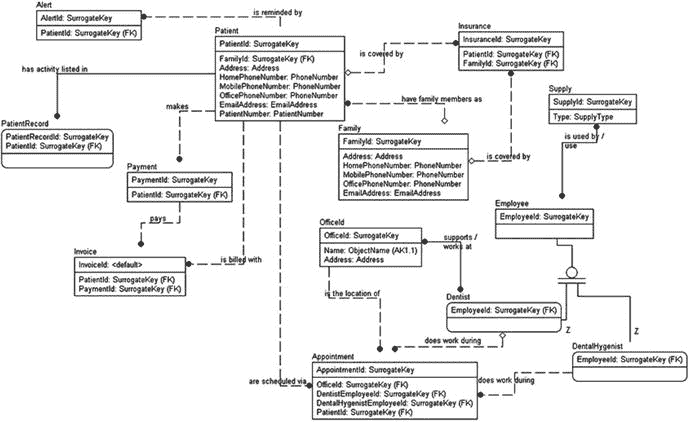

图 4-24. 至此为止的患者系统图形模型

表 4-3 列出了描述性元数据的一个子集。

表 4-3. 牙科诊所示例的最终模型

| 实体/属性 | 描述 | 列描述 | 列域 |
| --- | --- | --- | --- |
| `Patient` | 作为牙科诊所客户的人员。服务被执行，耗材被使用，并向患者收费。 |   |   |
| `PatientNumber` | 用于在计算机中识别患者记录 | 未知，由当前计算机系统生成 |
| `HomePhoneNumber` | 拨打患者家庭电话的号码 | 任何有效的电话号码 |
| `MobilePhoneNumber` | 拨打患者外出时电话的号码 | 任何有效的电话号码 |
| `OfficePhoneNumber` | 在工作时间拨打患者电话的号码（注：我们需要知道患者的工作时间吗？） | 任何有效的电话号码 |
| `Address` | 家庭邮寄地址 | 任何有效的地址 |
| `EmailAddress` | 家庭的电子邮件地址 | 任何有效的电子邮件地址 |
| `Family` | 相关联的人员团体，可能出于保险目的。 |   |   |
| `HomePhoneNumber` | 拨打患者家庭电话的号码 | 任何有效的电话号码 |
| `MobilePhoneNumber` | 拨打患者外出时电话的号码 | 任何有效的电话号码 |
| `OfficePhoneNumber` | 在工作时间拨打患者电话的号码（注：我们需要知道患者的工作时间吗？） | 任何有效的电话号码 |
| `Address` | 家庭邮寄地址 | 任何有效的地址 |
| `EmailAddress` | 家庭的电子邮件地址 | 任何有效的电子邮件地址 |
| `FamilyMembers` | 组成家庭单位的患者 | 任何患者（注：一个患者只能属于一个家庭吗？） |
| `Dentist` | 在牙科诊所从事最具技术性工作的人员。有多名牙医为客户诊所工作。 |   |   |
| `DentalHygienist` | 为牙医做常规工作的人员。卫生师的数量比牙医多很多。（注：与客户核实是否有每位牙医配备卫生师数量的指导方针。可能对安排预约有需要。） |   |   |
| `Employee` | 在牙科诊所工作的任何人。牙医和卫生师显然是员工的类型。 |   |   |
| `Office` | 牙医开展业务的地点。他们有多个办公室需要处理和安排患者预约。 |   |   |
| `Address` | 建筑物所在的物理地址 | 非邮政信箱的地址 |
| `Name` | 用于指代特定办公室的名称 | 唯一 |
| `Supply` | 用于运行牙科诊所业务的耗材。给出的例子是样品项目，如牙膏或牙刷；另外，还提到了牙科耗材，即牙医和卫生师用于完成工作的耗材。 |   |   |
| `Type` | 将耗材分类为不同类型 | 识别为“样品”或“牙科” |

实现建模说明：记录对敏感或重要数据的任何更改。员工与耗材之间的关系可能需要额外的信息来记录使用目的。

### 提示

仔细审查“任何有效”或其任何衍生短语的使用。这些陈述的范围需要缩小到一个合理的形式。换句话说，“有效”是什么意思？“有效日期”这样的短语表明必须存在可被视为无效的东西。这反过来可能意味着像“11 月 31 日”这种无效，也可能意味着在 3000 年安排预约是无效的。

请注意，我在 `Appointment`（预约）和 `Supply`（耗材）之间添加了另一个多对多关系，以记录预约期间使用耗材的情况。图 4-25 展示了我们可以从提供的简短描述中直接推断出的最终图形模型。

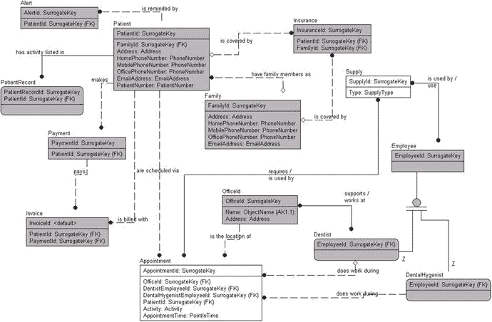

图 4-25. 包含所有直接在模型中发现的实体、属性和关系的模型

至此，实体和属性已被定义。请注意，设计中没有添加任何不能从我们开始时的单一需求文档中直接推断出来的内容。在实际环境中进行此类活动时，寻找实体、关系和属性的所有步骤可能会一次性处理，并且会更接近可能实现的内容（包括像 `Employee` 及其子类型除了代理键占位符外没有任何属性这样的漏洞）。在本章中，我故意按部就班地执行这些步骤，只是为了每次专注于一个部分，以使流程的各个部分更清晰（并且小到足以容纳在书中！）。

同样值得注意的是，文档本身有几页长——全部来自于分析三个小段落的文字。当您在实际项目中执行此操作时，生成的文档会大得多，并且在许多文档中可能会有相当多的冗余。

### 识别业务规则

业务规则可被定义为管理和塑造业务行为的陈述。根据组织的方法论，这些规则可以是项目符号列表、简单文本图或其他格式（而很多时候，它们只存储在关键员工的头脑中）。业务规则的存在并不意味着在此流程阶段有能力在数据库中实施它。目标是记下所有面向数据的规则，以备流程后期使用。这常常会引发关于为何要讨论这些事情的争论，但当你日后需要编写报告，并需要某种参考框架来判断 100,000 美元是否是病人费用的可接受值时，它就会带来回报。

在定义业务规则时，规则和属性域可能会有一些重复，但这在现阶段并非真正的问题。尽可能多地记录规则，因为遗漏业务规则比遗漏属性、关系甚至表带来的伤害更大。在实施系统时，你经常会发现新的表和属性，但遗漏的业务规则会破坏报告的数据质量，甚至可能毁掉整个设计，迫使你代价高昂地重新思考，或者采用一个考虑不周的权宜之计（kludge）来勉强纳入它们。

识别业务规则通常不是一个困难的过程，但它耗时且相当繁琐。与实体、属性和关系不同，识别所有业务规则并没有一个直接的、特定于语法的线索（当然，也没有大量组织定期遵循的线索）。

然而，当我必须寻找业务规则时，我的一般做法是逐行阅读文档，寻找包含“一旦……发生”、“……不得不……”、“……必须……”、“……将会……”等语言的句子。不幸的是，文档通常不会包含每一条业务规则，而期望你的客户能立刻从脑海中回忆起所有规则，同样是极大的愚蠢之举。你可能查看了一百或一千张发票，也看不到一例客户被贷记款项的情况，但这并不意味着此事从未发生。在许多情况下，你必须从三个地方挖掘业务规则：

*   **旧代码**：现有系统拥有完善文档是例外，而非惯例。即便是那些起初拥有出色系统文档的项目，随着时间紧迫和客户需求增长，其文档也会变得越来越糟。遇到需要分析的、写得糟糕的“意大利面条式代码”（spaghetti code）并不罕见。（如果这代码恰恰是你自己写的，情况会更糟。）
*   **客户经验**：利用人类记忆作为文档可能像询问青少年他们昨晚做了什么一样困难。忘记故事的关键点，或者干脆编造他们认为你想听的内容，这只是人性的一部分。我已经谈过从用户那里获取需求有多困难，但当涉及到规则时，这种难度至少会增加一个数量级，因为大多数人不会考虑细节，而业务规则挖掘工作很大部分正是关于细微的细节。
*   **你的经验**：或者至少是你团队中某一成员的经验。就像发票的例子，你可能会问“你们是否曾经……？”这样的问题来唤起客户的记忆。如果你闻到了腐烂奶酪的味道，那通常不是因为它本来就该是那个味儿。

如果你幸运的话，会有一位业务分析师来负责这个过程，但在很多情况下，业务分析师可能没有编程经验，无法从代码级别细节思考，也无法从代码中挖掘出微妙的业务规则，因此可能需要由程序员来处理这个任务。更不用说，除非你理解了系统，否则很难深入到细微的细节，而要做到这一点，你只能花大量时间去思考、斟酌和消化你所阅读的内容。你很少有机会能花足够的时间把工作做好。

在我们的“会议笔记片段”例子中，有几条业务规则需要记录。例如，我已经讨论了客户编号属性的必要性，但无法为该客户编号指定一个域。看下面这句话：

*   对于每次预约，客户需要记录所有发生的情况……

从中，你可以推导出这样一条业务规则：

*   每次预约，都必须在患者的图表上记录每一项操作。

请注意，这条规则引出了患者图表可能存在另一个属性——`Activity`（活动），以及该活动的另一个属性——`ActivityPrices`（活动价格）的可能性（因为大多数牙医诊所并非免费工作）。`Patient`（患者）、`PatientRecord`（患者记录）、`Activity`（活动）和`ActivityPrices`（活动价格）之间的这种关系让你感觉可能有问题。在代码中这样实现是错误的，非常错误。**规范化**（Normalization）解决了这类依赖性问题，逻辑上应该存在一个名为`activities`的实体，具有`name`（名称）和`price`（价格）属性，并关联回已经创建的`PatientRecord`实体。在结束建模过程之前，两种方式都是可以接受的，只要对文档的读者来说是合理的。我将为此需求继续添加一个带有名称和价格的`Activity`实体。

我们例子中的另一句话暗示了另一条可能的业务规则：

*   牙医可能在一周内分别在不同诊所工作。

显然，一名医生不可能同时出现在两个不同的地点。因此，我们有了以下规则：

*   不得安排医生在同一时间在两个不同地点进行预约。

另一条可能需要的规则与医生预约之间的间隔时间有关：

*   牙医在不同诊所的预约之间的时间间隔不得短于 X。

并非每一条业务规则都会在数据库中体现，即使是一些专门处理数据管理流程的规则也是如此。例如，考虑这条规则：

*   预约后应在一周内发送发票。

这很好，但如果花了一周零一天，甚至两周呢？发票还能发给患者吗？如果遇到假期或有人生病，比一周多花了几小时，是否应该在数据库代码中加入对此人的责难？不；虽然这看起来很像一条可以在数据库中实施的规则，但它不是。这条规则将交给负责系统文档和 UI 设计的人员，供他们设计系统其余部分时使用，因此它可能体现为一份报告，或 UI 中的一个警报。

某些类型规则的具体内容将在`第 6 章`和`第 7 章`中稍后处理，并且通常贯穿全书，因为我们会实施各种类型的表和完整性约束。

### 识别基本过程

一个过程是程序为处理已识别的数据而采取的一系列步骤。它可能是一个基于计算机的过程，例如“处理每日收入”，在这个过程中会创建某种报告，或者可能生成存款单发送给银行。它也可能是人工操作的过程，例如“创建新患者”，详细描述患者首次填写一套表格，然后接待员询问许多相同的问题，最后当患者进入诊室时，卫生员和牙医再次询问同样的问题。之后，在患者离开后，部分信息被录入计算机，以便牙科诊所能够发送账单。如果你熟悉 UML 图，这些过程可能会被作为一个关键术语提出来。

通过研究客户的过程，你可以了解很多信息。通常，一个你认为只需两步、十分钟就能完成的过程，可能会拖延数月之久。困难的部分在于确定原因。是出于正当的、有时是出于安全考虑的原因吗？还是漫长的过程是历史惯性的结果？每种看似奇怪的行为背后都有原因，你可能能够，也可能无法弄清楚其现状的原因并做出可能的改变。至少，这些过程将指导你确定所需的一些数据、数据何时需要，以及在组织运营中谁使用这些数据。

作为一个合理的人工过程示例，考虑获取你的第一个驾驶执照的过程（至少在田纳西州对于新驾驶员是这样；如果你来自其他州、处于特定年龄、不是公民等，则遵循其他流程）：

1.  填写学习许可证表格。
2.  获得学习许可证。
3.  练习驾驶。
4.  填写驾照申请表。
5.  通过视力检查。
6.  通过笔试。
7.  通过路考。
8.  拍照。
9.  收到驾照。
10. 上路安全驾驶。

在逻辑设计阶段，过程的每一步可能被枚举，也可能不被枚举；很多时候，许多过程是在物理数据库实现阶段才充实起来的，以便适应实现时可用的工具。我应该提到，大多数过程都关联着一定数量的**过程规则**（这些是管理该过程的业务规则，类似于管理数据值的规则）。例如，你必须完成所有这些步骤（参加考试、填写多份表格、练习驾驶等）才能获得驾照。请注意，这里也潜伏着一些业务规则，因为一个过程中的某些步骤可能以任何顺序完成。例如，你可以先参加笔试再进行视力检查，这个过程仍然可以接受，而另一些步骤则必须按顺序进行（例如，如果你没通过考试就获得了驾照，那就太愚蠢了，即使是官僚机构创造的过程也是如此）。

在驾照过程中，你不仅有一些任务必须按明确顺序执行的规则，还有其他规则，例如必须年满 15 岁才能获得学习许可证，必须年满 16 岁才能获得驾照，必须以特定分数通过考试，练习时必须有持证驾驶员陪同等等（甚至这些规则也有一些例外，比如如果是困难案例可以提前获得驾照）。如果你是帮助设计驾照项目的业务分析师，你必须在某个时候记录这个过程。

识别过程（及其管理规则）与数据建模任务相关，因为许多这些过程将需要操作数据。每个过程通常转化为一个或多个查询或存储过程，这可能需要比已指定更多的数据，特别是为了在整个过程中存储状态信息。

在我们的示例中，有几个此类过程的例子：

*   客户需要系统管理其患者和预约...

这意味着客户需要能够进行预约以及管理患者——大概包括关于患者的信息。预约是我们系统将要做的最核心的事情之一，你将需要回答以下问题：在安排时间有哪些预约可用？何时可以进行预约？

这当然是你需要回头与客户沟通并理解的一个过程：

*   ...然后向患者的保险公司开具发票，如果他或她有保险的话（否则患者自付）。

我已经讨论过发票，但开具发票的过程可能需要额外的属性来标识发票是电子发送还是打印（可能重新打印）。在帮助一个试图将纸质系统现代化的组织时，文档控制是许多过程的重要组成部分。请注意，发送发票看起来可能是一个相当无聊的事件——按一下屏幕上的按钮，纸就从打印机里出来了。这只需要从表中选择一些数据，有什么大不了的？然而，当文档被打印时，我们可能必须记录文档已被打印、谁打印的以及文档的用途。我们可能还需要表明，这些文档是在一个包括结清和汇总发票项目的流程中打印的。电子签名也可能需要注册。这里最重要的一点是，你不应该做任何重大的假设。

以下是列出的其他过程：

*   追踪和管理人员：来自句子，“系统需要追踪和管理人员，客户需要将他们分配到每次预约中。”
*   追踪用品：来自“客户过去在用品即将用完时一直有问题，希望这个系统能为两个地点处理这件事。对于牙科用品，我们需要追踪员工的使用情况，特别是对患者记录数据库所做的任何更改。”
*   提醒患者：来自“通过电子邮件或电话提醒患者其预约发生的时间和地点...”

这些过程中的每一个都标识了一个在数据库设计过程的实现阶段你必须处理的工作单元。

### 完成逻辑模型

在本节中，我将简要介绍完成建立一套可用文档任务所涉及的步骤。我们现在完全理解文档需求的可能性很小，我们也没有发现最终系统所需的所有实体、属性、关系、业务规则和过程。

另一方面，要小心，因为设计量存在一个“最佳平衡点”。过了某个点，你可能会持续设计而进展甚微——甚至没有进展。这通常被称为`分析瘫痪`。找到这个平衡点需要经验。大多数情况下，设计做得不够，通常是因为设定的截止日期没有考虑到构建计算机系统的现实情况。另一方面，如果没有强有力的管理，我发现自己很容易陷入分析瘫痪（嘿，这本书专注于设计是有原因的；对我来说，这是项目中最有趣的部分）。

这个发现阶段的最后步骤（至少是初始发现阶段，因为你将不得不偶尔回到这个过程，以填补第一次遗漏的空白）仍然存在。如果可能，在开始编写代码之前，还有几件事要做：

1.  识别明显的额外数据需求。
2.  与客户一起审查项目进展。
3.  重复这个过程，直到你满意且客户高兴并签署了所设计的内容为止。

这些步骤是任何系统设计的一部分，而不仅仅是数据驱动部分。

## 识别明显的新增数据需求

到目前为止，我一直相当谨慎地避免扩大从发现阶段收集到的信息范围。这样做的目的是为我们的文档建立一个基线，忠实于最初收集的大量文档（这些文档无论如何都会比我的需求要完整得多）。在设计的这个阶段，你需要改变方向，开始添加那些自然浮现出来以填补任何空白的属性。通常，存在一个相当庞大的明显属性集合，以及在较小程度上，一些业务规则，这些都没有被任何用户或初始分析明确指定。请确保任何假定的实体、属性、关系等等，都能清晰地区别于你从文档中获得的内容。

对于目前已识别的内容，请逐一检查并指定可能需要的附加属性。例如，以 `Patient` 实体为例，如 `表 [4-4]` 所示。

表 4-4.
完整的病人实体

| 实体 | 描述 | 域 |
| --- | --- | --- |
| `Patient` | 牙医诊所的顾客。对他们执行服务、使用耗材并据此收费。 |   |
| 属性 | | |
| `PatientNumber` | 在当前计算机系统中，用于标识病人的记录。 | 未知；由计算机生成并在图表上？ |
| `Insurance` | 标识病人的保险公司。 | 未知。（注：或许需要检查保险公司使用的通用格式？） |
| 关系 | | |
|   | 拥有提醒 | 向病人发送提醒以告知其预约。 |
|   | 拥有预约 | 预约需要对应一个病人。 |
|   | 拥有发票 | 通过发票向病人收取预约费用。 |
|   | 进行支付 | 病人支付收到的发票。 |

以下附加属性几乎肯定是需要的：

*   `Name`：病人的全名可能是所有属性中最重要的。
*   `Birth date`：如果知道个人的生日，可能会在那天发送一张卡片。出于保险目的，这可能也是必需的。

你当然可以为 `Patient` 实体添加更多属性，但这几个应该足以清晰地说明问题。根据常识为客户模型添加新内容的过程至关重要，并且最终将构成该过程的很大一部分。分析师很少能想到所有事项。和往常一样，这些新增项在实施前需要得到客户的批准。

### 测试逻辑模型

就像概念模型一样，非常有必要再次测试，确保你输出的模型仍然能够满足你所有需求中规定的要求。这一步将帮助你不错过任何细节。我们不会在这个概念上花费更多文字，因为它只是简单地重复我们为概念模型已经做过的事情，但更侧重于检查我们是否拥有支持所述需求的属性。

如果你是当今任何形式的程序员，你一定听说过 `测试驱动开发`。其理念是，越早发现缺陷，修复它们的成本就越低。在逻辑模型中解决问题比在物理模型中要容易一个数量级（或更多）。而且一旦你创建了数据库，并且有代码引用它，就别想修复某些问题了。你可能不得不围绕一些问题进行变通处理。此外，你现在用文字进行的测试也将转化为将来用代码执行的测试。

### 与客户评审

一旦你完成了这份初稿文档的整理，就该与客户会面，向他们解释你在设计中的进展，并让客户评审这份文档的每一个细节。确保客户理解你开始设计的解决方案。

遵循或设计某种形式的 `签收流程` 或文件也是值得的，在你进入下一阶段之前，由客户签署。在某些情况下，你的签收文件很可能具有法律约束力，并且如果项目后来因某种原因失败，这些文件无疑将非常重要。显然，希望这种情况不会发生，但项目失败的原因很多，其中很大一部分与项目本身无关。最好让所有人达成共识，而这正是实现这一点的地方。

### 重复此过程直到客户同意你的模型

在这个项目阶段，你不太可能把所有事情都做对，当然第一次尝试就成功的可能性更低。最重要的是尽可能多地做对，并将其呈现在客户面前以获得同意。当然，客户不太可能立即同意你所说的一切，即使你是世界上最伟大的数据架构师。同样真实的是，通常客户很清楚他们想要什么，但无法用一种能让你理解的方式表达出来。无论哪种情况，通常需要多次尝试才能使模型达到所有人达成一致的状态，而每一次迭代都应使你和客户更接近目标。

在项目的后期，会有很多时候你可能需要重新审视设计的这一部分，发现你遗漏了什么，或者客户忘记与你分享了什么。随着你经历越来越多的设计迭代，确保定期让客户签收变得越来越重要；当客户后来改变主意时，你可以指向这些文件。

如果你没有获得同意，通常是以书面形式或在公开场合（例如有足够见证人的会议），你可能会受到损害。当你没有充分处理评审和文档流程，并且没有良好的文档来支持你与客户相对立的主张时，情况尤其如此。我曾参与过一些咨询项目，项目设计得很好也达成了共识，但关于所达成共识的文档做得不太好（高层之间很多握手以“节省”成本）。随着时间的推移，在花费了数千美元之后，客户审查了协议文件，结果很明显我们几乎没有达成什么共识。不用说，整个项目的结局就像一艘 `充满氢气、涂满铝热剂的飞艇` 一样。

注

在本章中，我对客户有点苛刻，把他们描绘成 `狡诈之徒`，动不动就会欺骗你。这种情况很少见，但只需遇到一个就够了。事实是，几乎每个客户都会感谢你让他们了解情况并在合理的时间间隔获得对设计的批准，因为客户对过程的投入程度取决于他们必须投入的程度。你甚至可能是第 15 位进行这些访谈的顾问，因为前 14 位都极其失败。

## 最佳实践

以下是一些在进行概念和逻辑建模时值得遵循的最佳实践：

*   **保持耐心**：卓越的设计源于不操之过急，不抢在流程前面。我在本书中阐述流程的方式，旨在鼓励你遵循一个相对线性的过程，而不是一开始就着手设计，再为其寻找要解决的问题。
*   **保持严谨**：仔细检查所有内容，确保所述内容合理。在进入下一步之前，务必尽可能理解所有约束系统的业务规则。早期犯下的错误，可能会在后期像滚雪球一样越滚越大。
*   **记录文档**：本章的要点正是如此——记录每一个已识别的实体、属性、关系、业务规则和流程（以及你发现的其他任何信息，即使它无法整齐地归入这些类别）。文档的格式并非那么重要，重要的是信息确实存在，所有相关方都能理解，并且对后续走向实现阶段有用。
*   **保持沟通**：与客户保持持续沟通对于确保设计不偏离轨道至关重要。危险在于，如果你开始误解客户的需求，那么此后做出的每一个决定都可能是错误的。尽可能多地争取与客户面对面的时间。

### 注意

这种“与客户评审、与客户评审、与客户评审”的口诀，此时可能听起来有点老生常谈了。这可能是我最后一次提及它，但它如此重要，我希望它已深入人心。接下来的章节将开始转向产出，而不再反复思考我们是如何获取需求的。

## 总结

在本章中，我阐述了发掘最终将构成一个简单牙科诊所数据库解决方案的结构的过程。我们梳理了在信息收集阶段收集到的所有文档，并尽力在处理所有初始文档之前，不添加我们自己对解决方案的个人贡献，以免将个人想法掺入其中。这并非易事；在我们的初始示例中，我们只有三段文字可供处理，但最终从中衍生出了相当多页的文档。

重要的是要保持严谨，以确定你正在建造的是哪种类型的建筑，这样才能创建正确的地基。一旦有了坚实的地基可供构建，你所构建的数据库稳固的可能性就会提高，其余流程才有机会成功。如果地基质量低劣，那么建立其上的系统其余部分很可能也是如此。此流程的目的在于提炼出尽可能多的、关于客户希望从系统中获得什么的信息，并将其放入概念和逻辑模型中，以理解用户的需求。

贯穿所有这些文档，目标是尽可能多地发现以下内容：

*   实体和关系
*   属性和域
*   可在数据库中实施的业务规则
*   需要使用数据库的流程

由此，将产生一个逻辑数据模型，它具备实际实现的数据库将存在的大部分特征。此后剩下的工作，基本上就是将设计塑造成符合`RDBMS`需求的形式，以提供最大的易用性。在接下来的章节中，数据库设计肯定会与我们刚刚生成的模型有所不同，但它将共享大部分相同的特征，并且可能不会差异太大，以至于即使是必须批准你设计的非技术外行也能理解。

在`第 6 章`和`第 7 章`中，我们将运用本章涵盖的将需求转化为数据模型的技能，以及`第 5 章`中关于规范化的技能，来生成部分数据模型，以展示如何运用这些非常基础的技能来创建复杂、有趣的模型。

