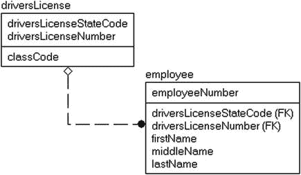
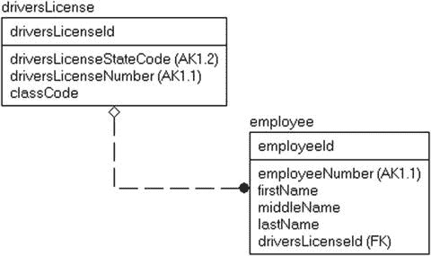
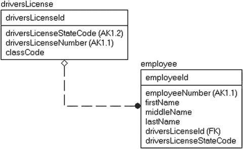
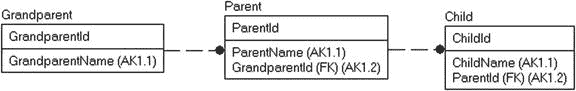
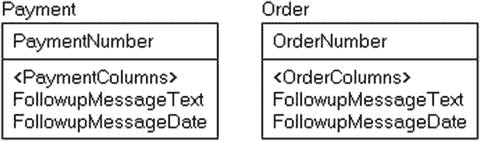
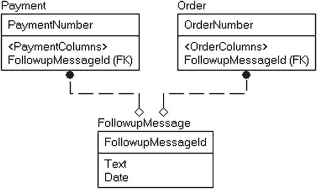
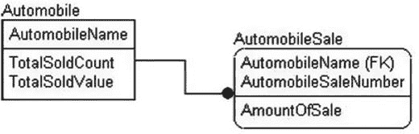
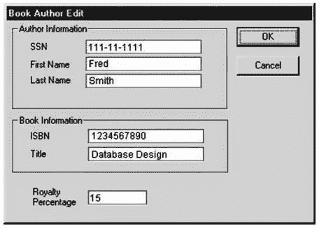

# 5. 规范化

> 我不喜欢出名。我喜欢保持平常心。 —文斯·吉尔，美国乡村歌手

至此，你应该已经构建了涵盖你数据库系统数据需求的概念模型和逻辑模型。正如我们在前四章所讨论的，我们目前的设计无需遵循任何严格的格式或方法（即使它很可能会），主要的一点是，它确实必须涵盖待建系统与数据相关的需求。

现在，我们来到了关系数据库领域中被炒作最多（有时也最被鄙视）的主题：规范化。这是理论与现实相遇的地方，我们将模型从某种松散结构转化为遵循特定模式的高度结构化的东西。最终的实现前步骤是将早期建模阶段发现的实体和属性提炼成表，以便在关系数据库系统中实现。这个过程通过消除冗余并以关系引擎设计所采用的方式来塑造数据来实现。一旦你完成了这个过程，使用 `SQL` 处理数据将变得更加自然。

`SQL` 是一种设计用于处理原子值集合的语言。用计算机科学术语来说，原子意味着一个值不能（或更合理地说，不应该）被分解为更小的部分。我们的最终目标是将实体和属性分解为原子单元；即将它们分解为最低形式，这些形式需要在 `T-SQL`（Transact `SQL`）代码中被访问。

“最低形式”这个说法对新手和经验丰富的老手来说可能都很危险，因为必须抵制走得太远的诱惑。一个类比是考虑将水分子分解为其组成部分。可以将氢和氧从水中分离出来形成它们自己的形式，我们可以安全地做到这一点（并且也能将它们重新组合），而不改变原子的性质，这对于某些应用甚至可能是可取的。但是，如果你将氢原子一分为二以得到构成它的粒子，问题就会出现，比如一个巨大的弹坑。在数据库中的表和列也存在类似的担忧。在正确的原子级别上，使用数据库将是自然的，但在错误的原子性级别（太多或太少），你会发现自己在与设计作斗争，其糟糕程度远超最初预期需要多写一点代码的情况。

有些人开玩笑说，如果大多数开发人员可以随心所欲，那么每个数据库都恰好只有一个包含两列的表。这个表将被命名为“对象”，列将是“指针”和“大对象”。但是，这种愿望被满足客户的需要所取代，客户需要搜索、报告以及其存储数据产生的一致结果，毫无疑问，在你开始意识到这有多真实之前，需要尝试好几次。

规范化的过程基于一组级别，每个级别都实现了一定程度的正确性或对特定“规则”集的遵守。这些规则在形式上被称为范式，即范式。理论上已经提出并假设了相当多的范式，但我将重点介绍四个最重要、最广为人知且最常用的范式。我将从第一范式（`1NF`）开始，它消除了数据冗余（例如一个名字存储在两个不同的地方），一直到第五范式（`5NF`），它处理三元关系的分解。（我将介绍的一个范式没有编号；它以设计它的人命名，并包含两个编号的范式。）每个规范化级别都表示对公认的数据库设计标准遵守程度的增加。随着数据规范化程度的提高，你自然会倾向于创建数量越来越多但宽度（列数）越来越小的表。

在本章中，我将介绍不同的范式，定义它们更多是基于它们旨在解决的问题，而不是它们的编号。对于每一个范式，我将包含示例，描述它们帮助你避免的编程异常，并指出你的关系数据违反特定范式的迹象。现在展示编程异常可能看起来不合时宜，因为本书的前几章专门针对编程前的设计，但规范化的目的是将我们已有的实体模型转化为可以实现为表的东西。因此，开始像程序员一样思考非常重要，这样你才能理解为什么数据处于给定的范式可以使表在 `SQL` 中更易于使用（否则，它往往看起来只是为了某些古老的做法而增加工作量）。最后，我将总结一些规范化的最佳实践。

## 规范化的过程

规范化的过程实际上相当简单：获取复杂的实体，并从中提取更简单的实体，目标是最终得到表达的概念比以前更少的实体，直到每个实体/表只表达一个且仅一个概念。这个过程一直持续到我们产生一个模型，从实际角度看，数据库中的每个表代表一件事物，每个表中的每一列描述该表所建模的事物。随着我在本章中逐步讲解不同的范式，这一点将变得更加明显。

> 注意
>
> 有一个名为“希斯定理”的定理可以用更数学术语来解释规范化的过程。你可以在 Elvis Foster 所著的《Database Systems: A Pragmatic Approach, Second Edition》（`www.apress.com/9781484211922`）中阅读相关内容，或者在 William Perrizo 教授为大学数据库设计课程发布的在线笔记中查看，网址为 `www.cs.ndsu.nodak.edu/~perrizo/classes/765/nor.html`。

我将规范化分为三个一般类别：

*   表和列的形状
*   列之间的关系
*   表中的多值依赖和连接依赖

请注意，为每个类别提到的条件都应该在你设计的每个实体中考虑，因为每个范式都是建立在较低级别范式已被遵守的前提之上的。现实情况是，很少有设计，更少有实现，能完美满足任何范式，而且仅仅因为你无法满足某个标准，并不意味着你应该抛弃更高级的标准。就像在节食期间没忍住吃了一个甜甜圈，并不意味着你应该接着吃掉整盒一样，不完美是数据库设计现实的一部分。作为一名架构师，你会努力追求完美，但这基本上是不可能实现的，如果非要找个理由，那就是用户的需求经常变化，而且没有耐心的项目经理要求在实际可行之前很久就给出表数量和完成日期。在敏捷项目中，我只是尽力满足苛刻的时间表要求，但至少，我会尝试记录并知道设计应该是什么样子，因为完美的设计以一种自然（即使有时有点繁琐）的方式匹配现实世界。设计和实现总是需要与你的时间表进行权衡，但你对什么是正确的了解得越多，就越有可能最终实现它，无论人为的进度里程碑如何。

```
[www.apress.com/9781484211922](http://www.apress.com/9781484211922)
www.cs.ndsu.nodak.edu/~perrizo/classes/765/nor.html
```


## 表与列的形状

生产规范化数据库的第一步是处理数据的“形状”。即使忽略本书其余部分，理解关系引擎期望的数据形状也至关重要。回顾第 1 章，科德规则的前两条是表定义的基础。第一条规则规定数据只能通过表中的值来表示，第二条规则保证关系数据库中的任何数据片段，只要知道其表名、主键值和列名，就能在逻辑上被访问。这套规则组合提出了以下要求：

*   所有列必须是**原子性的**；也就是说，在一个表的单行单列中，只表示一个值。
*   表中的所有行必须互不相同。

此外，为了强化这一立场，还规定了`第一范式`，要求值不应被扩展以实现数组，或者更糟的是，不应允许多值的基于位置的字段。因此，`第一范式`指出：

*   每一行应包含相同数量的值，换言之，不允许有数组、子表或重复组。

这条规则的核心在于确保所实现的表和列的形状适合操作它们的关系语言（最重要的是`SQL`）。“重复组”是一个奇怪的术语，指的是在一行中拥有多个相同类型的值，而不是将它们拆分成多行。

违反上述三个标准的情况通常会在实现的模型中表现为数据处理效率低下，通常是因为不得不解码应存储单个值却存储了多个值的地方，或者因为存在无法相互区分的重复行。在本书中，我们通常讨论的是`OLTP`解决方案，我们希望数据能在任何位置、由任何用户（通常是多个用户同时）进行修改。即使是数据仓库数据库也通常遵循`第一范式`，以使查询能更高效地与引擎协作。后续的范式不太适用于数据仓库场景，因为它们更关注数据中的冗余，这些冗余会使数据修改更加困难，而在数据仓库解决方案中，数据修改是特殊处理的。

### 所有列必须是原子性的

此要求的目标是每个列只应表示一个值，而非多个值。这意味着不应有数组、分隔列表，或任何你能想到的、由单列表示的多值列类型。例如，考虑一个像'`1, 2, 3, 6, 7`'这样的数据值。这很可能代表五个独立的值。但也可能不是，而这是否是五个不同的值将取决于客户需求的上下文（规范化最难的部分在于，你必须能够区分某物的外观与它对用户的意义）。

思考原子性的一种好方法是考虑你是否曾需要在不涉及同一列中其他部分数据的情况下，单独处理某个列的部分内容。在前面提到的列表——'`1, 2, 3, 6, 7`'——中，如果客户端始终将该列表视为单个值，并进而在`SQL`代码中也是如此，那么将其存储在单个列中可能是可以接受的。但是，如果你可能需要单独处理值`3`，那么这个值就不符合`第一范式`。同样重要的是要注意，即使目前没有计划单独使用列表元素，你也应该考虑是否仍然最好单独存储每个值，以便将来可能的使用。

原子性的一个变体适用于复杂数据类型。复杂数据类型可以包含多个值，只要：

*   值的数量始终相同。
*   这些值很少（如果有的话）被单独处理。
*   这些值构成了某个原子性的事物/属性，该属性仅作为单个值才有意义，并且无法用单个值完全表达。

例如，考虑地理位置。通常使用两个值来定位地球上的某物，即经度和纬度。大多数情况下，单独考虑其中任何一个值都具有（不完整的）意义，但结合在一起，它们就精确定位了地球上的一个具体位置。实现为复杂类型可以给我们一些实施数据保护方案的便利，并使在公式中使用这些类型更容易。

当涉及到测试原子性时，合理性的测试就留给了设计者。然而，目标是，任何你曾需要作为单个值处理的数据，都应被建模为其自身的列，因此存储在其自己的列中（例如，作为搜索参数或连接标准）。作为将原子性推向极致的一个例子，考虑一个包含十段落的文本文档。一个存储该文档的表很容易实现为需要十个不同的行（每个段落一行），但这样设计几乎没有意义，因为你不太可能在`SQL`数据库语言中将段落作为单个值来处理。当然，如果你的`SQL`经常计算文档中的段落数，那么这种方法可能正是你想要的解决方案（永远不要让不了解你需求的人评判你的数据库！）。为什么止步于段落呢？为什么不是句子、单词、字母，甚至是构成字符的比特呢？这些分解中的每一个在某些上下文中实际上都可能有意义，因此理解上下文是规范化的关键。

**注意**
虽然你可以规范化几乎任何数据结构，但还有其他技术可用于实现数据库，例如`Hadoop`、`NoSQL`、`DocumentDB`等，即使在此过程中，这些技术可能实际上对你的实现更有意义。仅仅因为你手上只有一把锤子，并不意味着每个问题都适合用钉子来解决。

举些例子，考虑一些经常发现违反此`第一范式`规则的常见位置：

1.  电子邮件地址
2.  姓名
3.  电话号码

每一项都给我们带来了一个在设计列时需要考虑的、略有不同的原子性问题。


##### 电子邮件地址

在一封电子邮件中，收件人地址通常以如下格式存储，使用编码字符以便在一个值中包含多个电子邮件地址：

```
name1@domain1.com;name2@domain2.com;name3@domain3.com
```

在搜索引擎的数据存储层中，这是最佳格式。电子邮件地址列遵循一个通用格式，允许多个值用分号分隔。然而，如果需要将数据存储在关系型数据库中，这种格式最终会成为一个问题，因为它在一个列中表示了多个电子邮件地址，导致在 Transact-SQL 中难以使用。关于这一点，从内部引擎的角度来看，在第 10 章会变得更明显，但在这里，我们将通过一个实际例子来看看在 SQL 中处理这些数据时会有多麻烦。

如果允许用户拥有多个电子邮件地址，一个电子邮件列的值可能看起来像这样：`tay@bull.com; norma@liser.com`。还要考虑到，数据库中的多个用户可能使用相同的 `tay@bull.com` 电子邮件地址（例如，如果是家庭共享的电子邮件帐户）。

> **注意**
> 在本章中，我将使用字符 `=` 来下划线标记表数据中的主键列，使用 `-` 字符来标记非主键属性，以便在无需解释的情况下使表示更易于阅读。

以下是一些未规范化数据的例子。在下面的表中，`PersonId` 是主键列，而 `FirstName` 和 `EmailAddresses` 是非主键列（当然，这不一定是正确的，正如我们稍后将讨论的，但对于本次讨论来说已经足够）：

```
PersonId       FirstName               EmailAddresses
============== ----------------------- -------------------------------------------------
0001003        Tay                     tay@bull.com;taybull@hotmail.com;tbull@gmail.com
0003020        Norma                   norma@liser.com
```

考虑其中一个地址发生变化的情况。例如，我们需要将所有出现的 `tay@bull.com` 更改为 `family@bull.com`。你可以执行如下代码来更新每个引用了 `tay@bull.com` 地址的人：

```
UPDATE Person
SET    EmailAddress = REPLACE(EmailAddresses,'tay@bull.com','family@bull.com')
WHERE  ';' + emailAddress + ';' like '%;tay@bull.com;%';
```

这段代码看起来可能没那么麻烦去编写和执行，虽然与正确的解决方案（一个每人每个电子邮件地址占一行的表）相比相当混乱，但它与在 C# 等语言中逐行编写的代码非常相似。然而，首先在处理数据格式的真正复杂性方面存在问题（例如，`"email;"@domain.com` 实际上是一个符合电子邮件标准的有效电子邮件地址！；参见 [`www.lifewire.com/elements-of-email-address-1166413`](http://www.lifewire.com/elements-of-email-address-1166413)），但最大的问题在于关系引擎如何处理数据。对整个列值（或至少包含首字符的部分值）的比较可以通过引擎使用索引进行良好优化。一个判断何为正确的有效测试是查找那些对用户毫无意义的格式化数据字符。请为使用而格式化数据，而非为存储而格式化。使用 UI 甚至 SQL 来格式化数据是容易的。

考虑其他常见操作，例如统计你有多少个不同的电子邮件地址。对于内联的多个电子邮件地址，使用 SQL 来获取此信息充其量是痛苦的。但是，如前所述，你应该正确地实现数据，使每个电子邮件地址在单独的一行中单独表示。将数据重新格式化为两个表，一个是 `Person` 表：

```
PersonId       FirstName
============== -----------------------
0001003        Tay
0003020        Norma
```

第二个表存储一个人的电子邮件地址：


#### 电子邮件地址和姓名的存储设计

在数据库设计中，如何存储电子邮件地址和姓名这类看似简单的数据，实际上需要仔细考量。

##### 电子邮件地址

```
PersonId       EmailAddress
============== =========================
0001003        tay@bull.com
0001003        taybull@hotmail.com
0001003        tbull@gmail.com
0003020        norma@liser.com
```

现在，一个简单的查询可以确定每个人的电子邮件地址数量：

```sql
SELECT PersonId, COUNT(*) AS EmailAddressCount
FROM   PersonEmailAddress
GROUP BY PersonId;
```

而我们之前写的更新语句可以简单地写成：

```sql
UPDATE PersonEmailAddress
SET    EmailAddress = 'family@bull.com'
WHERE  EmailAddress = 'tay@bull.com';
```

除了被分解为单独的行之外，电子邮件地址还可以根据其格式分解为两个或三个明显的部分。一种常见的拆分方式是将这些值分解为以下部分：

*   `AccountName`: `name1`
*   `Domain`: `domain1.com`

是否将数据存储为多个部分，通常取决于你是否打算在代码中单独访问这些部分。例如，如果你要做的只是发送电子邮件，那么单列存储（加上格式约束！）是完全可以接受的。但是，如果你需要考虑你存储了哪些域的电子邮件地址，那么情况就完全不同了。

最后，一个域名由两部分组成：`domain1`和`com`。所以你最终可能会得到这样的结构：

```
PersonId       Name         Domain           TopLevelDomain    EmailAddress (calculated)
============== ============ ================ ================= --------------------------
0001003        tay          bull             com               tay@bull.com
0001003        taybull      hotmail          com               taybull@hotmail.com
0001003        tbull        gmail            com               tbull@gmail.com
0003020        norma        liser            com               norma@liser.com
```

此时，你可能会说：“什么？谁会那样做？”首先，我希望你的用户界面不会强迫用户一次只输入地址的一个部分，因为解析成多个值是界面可以轻松完成的事情（并且至少需要做一些来验证电子邮件地址的格式）。让验证电子邮件地址的界面进行拆分是很自然的（就像拥有一个计算列来重新组合电子邮件以供正常使用一样）。

将电子邮件地址分成几个部分的目的是另一个问题。首先，你可以开始确保所有电子邮件地址至少是合法格式化的。第二个答案是，如果你必须处理诸如“我们的客户使用最多的十大电子邮件服务是什么？”这样的问题，你可以执行如下查询：

```sql
SELECT TOP 10 Domain, TopLevelDomain AS Domain, COUNT(*) AS DomainCount
FROM  PersonEmailAddress
GROUP BY Domain, TopLevelDomain
ORDER BY DomainCount;
```

这种数据理解对你的系统是必要的吗？也许是，也许不是。这个练习的重点是帮助你理解，如果你将数据分解到你将要查询的级别，生活会更轻松，SQL 会更容易编写，你的客户也会更满意。

不过，请记住，你可以将列命名为单数形式，也可以礼貌地要求用户输入正确的电子邮件地址，但如果你不保护格式，你最终很可能会让你的电子邮件地址表看起来像这样，这实际上比你开始时更糟！

```
PersonId       EmailAddress
============== =================================================
0001003        tay@bull.com
0001003        tay@bull.com;taybull@hotmail.com;tbull@gmail.com
0001003        tbull@gmail.com
0003020        norma@liser.com
```

在这个例子中，电子邮件地址值是唯一的，但显然不代表单一的电子邮件地址。数据中表示的每个用户现在都将得到关于系统中地址数量的错误信息，而 Tay 将会收到重复的电子邮件，让你的公司看起来要么很绝望，要么很愚蠢。

##### 姓名

姓名是一个相当特殊的情况，因为西方文化中的人名通常由三部分组成。在数据库中，姓名经常以多种方式使用：当我们不认识某人时，用名和姓打招呼；当我们想显得亲切时，只用名；当我们需要让孩子意识到我们是认真的时，用全名。

考虑名字 Rei Leigh Badezine。名、中间名和姓可以存储在一个列中并使用。使用字符串解析，你可以在需要时获取名和姓。假设每个名字的格式都是精确的一个名、一个中间名和一个姓，解析看起来很简单。但如果名字稍微复杂一些，解析就会变成一场噩梦。

考虑以下姓名列表：

```
PersonId    FullName
=========== ----------------------------
00202000    R. Lee Ermey
02300000    John Ratzenberger
03230021    Javier Fernandez Pena
```

这种“一个大列”的方法最初似乎节省了很多格式化工作，但它有很多缺点。这种方法的问题是，很难弄清楚名和姓是什么，因为列表中有三种不同格式的名字。我们最多只能解析出名字的首尾部分以进行合理的搜索（假设没有人只有一个名字！）。

假设你需要找到名为 John Ratzenberger 的人。这很简单：

```sql
SELECT  FullName
FROM    Person
WHERE   FullName = 'John Ratzenberger';
```

但如果你需要找到姓为 Ratzenberger 的任何人呢？这就变得更复杂了，即使代码不难写，对于最擅长处理原子值的关系引擎来说肯定更复杂：

```sql
SELECT  FullName
FROM    Person
WHERE   FullName LIKE '% Ratzenberger';
```

再考虑一下搜索中间名为 Fernandez 的人的需求。这就是事情变得真正混乱和难以正确编码的地方。所以，与其只用一个大列，不如考虑下面这种更合适的存储姓名的方法。这一次，每个姓名部分都有自己的列：

```
PersonId    FirstName   MiddleName   LastName      FullName (calculated)
=========== ----------- ------------ ------------- ---------------
00202000    R.          Lee          Ermey         R. Lee Ermey
02300000    John        NULL         Ratzenberger  John Ratzenberger
03230021    Javier      Fernandez    Pena          Javier Fernandez Pena
```

我包含了一个计算列，它像最初那样重构了名字，并在 R. Lee Ermey 的名后面包含了句点，因为它是一个缩写。像他这样的名字可能很棘手，因为你必须小心处理，这应该是“R. Lee”作为一个名，还是作为两个名字管理。我还要建议你，在创建保存姓名的界面时，几乎总是最好至少为用户提供名、中间名和姓的字段来填写。然后允许用户决定姓名的哪些部分放入哪些列。莱昂纳多·达芬奇通常被认为有两个名字，而不是三个。但 Fred Da Bomb（他也是一位艺术家，只是质量不如莱昂纳多）认为 Da 是他的中间名。

除了为姓名保留一大段文本之外，做更多事情的主要价值在于搜索性能。与其在每次使用时都进行一些古怪的解析并希望每个人都注意格式，你可以使用以下简单易懂的方法按姓名查询：

```sql
SELECT  FirstName, LastName
FROM    Person
WHERE   FirstName = 'John'    AND LastName = 'Ratzenberger';
```

## 姓名处理与存储

这段代码不仅看起来比之前的代码简单得多，而且效果也好得多。因为我们使用了整个列值，所以可以利用索引操作来简化搜索。如果数据库中只有几个 John，或者只有几个 Ratzenberger（除非这是 Ratzenberger 家族团聚的数据库，否则可能性要大得多），优化器可以确定最佳的搜索方式。

最后，以客户为导向的数据库的实际情况可能是，你需要在数据库中存储看似冗余的信息，以存储不同/可定制的姓名版本，每个版本都是手动创建的。例如，你可能会存储一个人的姓名版本，用于问候该人（`GreetingName`），或者反映该人喜欢在信函中被如何称呼（`UsedName`）：

```sql
PersonId    FirstName   MiddleName   LastName      UsedName           GreetingName
=========== ----------- ------------ ------------- ------------------ ------------------
00202000    R.          Lee          Ermey         R. Lee Ermey       R. Lee
02300000    John        NULL         Ratzenberger  John Ratzenberger  John
03230021    Javier      Fernandez    Pena          Javier Pena        Javier
```

这种方法对于规范化来说是个问题吗？完全不是。用来称呼这个人的名字可能是“Q-dog”，而 given name 是“Leonard”。数据重复只会成为无法存在例外情况时的问题。最终，判断使用方式不是我们的工作；我们的工作是为客户端的使用方式建模。问题在于，这种方法对于团队管理来说绝对是个问题。在正常情况下，如果名字更改了，used name 和 greeting name 可能也需要更改，并且肯定需要接受审查。因此，我们将需要记录自然存在的依赖关系，即使这些依赖关系并非恒定且可以被覆盖。

然而，请注意，无论你认为这个设计多么有效，如果目标是让每个人的名字都完全正确，那么它仍然存在问题。虽然在美国大多数人都有三段式名字，但这并不是这里所有人的习惯，当然也肯定不是其他民族的惯例。如果一个人有十个名字怎么办？把其中八个名字都塞进`MiddleName`列吗？如果你想让它完全正确（如果你正在做某些类型的应用程序，你可能需要这样做），你需要允许任意多个单词（注意，我们现在还能获得关于名字每一部分的某种元数据）。当然，这种解决方案非常罕见，对于几乎所有实现来说通常是不需要的，但如果你需要为一个人存储无限数量的姓名部分，这将是最好的方法：

```sql
PersonId    NamePart    Type         Sequence
=========== ----------- ------------ --------
00202000    R.          First        1
00202000    Lee         Middle       2
03230021    Javier      lastname     3
03230021    Fernandez   First        1
00202000    Ermey       lastname     2
```

> **提示**
>
> 姓名是许多客户系统中极其重要的一部分。芝加哥至少有一家酒店，我可能会因为他们在一封非常个人化的感谢邮件中对我的称呼而犹豫是否再次光顾。当我以最具男性气质的打字方式回应说他们弄错了时，他们并没有回复。

### 电话号码

美国的电话号码形式是 423-555-1212，加上一些可能的分机号。从之前的例子可以看出，电话号码值中可能包含几个列。然而，使问题复杂化的是，数据库中经常需要存储的不仅仅是美国的电话号码。如何处理这种情况的决定通常基于用户存储国际电话号码的频率，因为要构建一个或一组表来处理所有可能的电话格式将是一项艰巨的任务，当然比大多数客户愿意支付费用让你做的要困难得多。

对于北美编号计划（NANP）的电话号码（美国、加拿大和其他几个国家），你可以用三个不同的列来表示标准的电话号码，分别对应以下三个部分：AAA-EEE-NNNN（国家代码总是 1）：

*   AAA（区号）：表示位于某个区域内的呼叫区域
*   EEE（交换局号）：表示区号内的一组号码
*   NNNN（用户号码）：用于使单个电话号码唯一的号码

是否为电话号码创建三个列是一个棘手的决定。如果每个电话号码都符合这种格式，因为你只允许呼叫美国和加拿大的号码，那么用三个列来表示每个号码将是一个很好的解决方案。你可能还想包含分机信息。问题在于，只需要一个需要允许不同格式电话号码的需求，就会使这种模式失效。那该怎么办呢？使用单个列，让任何人输入他们想要的任何内容？这是常见的解决方案，但你经常会遇到用户输入任何他们想输入的东西，还有一些东西他们会发誓说他们没有输入。你应该在数据库层面约束值吗？这会让情况变得更好，但有时你会输掉这场战斗，因为违反`CHECK`约束时返回的错误信息不太好，而且那些以其他合理有效格式输入电话号码的人会感到恼火。

为什么这很重要？嗯，如果用户漏掉了一个数字，你将无法打电话给你的客户感谢他们，或者告诉他们他们的产品不能按时交付。此外，新的区号不断出现，在某些情况下，电话公司会拆分区号并将某些交换局重新分配到新的区号。更改多部分值的一部分所需的编程逻辑可能会令人困惑。以以下电话号码集为例：

```sql
PhoneNumber
==============
615-555-4534
615-434-2333
```

将现有区号更改为新区号的代码是混乱的，当然也不是性能最好的。通常，当区号拆分时，只针对某些交换局。假设电话号码维护了良好的格式`AAA-EEE-NNNN`，其中`AAA`等于区号，`EEE`等于交换局号，`NNNN`等于电话号码，代码如下所示：

```sql
UPDATE PhoneNumber
SET PhoneNumber = '423' + SUBSTRING(PhoneNumber,4,8)
WHERE SUBSTRING(PhoneNumber,1,3) = '615'
AND SUBSTRING(PhoneNumber,5,3) IN ('232','323',...,'989');--区号通常会
--针对某些交换局
--发生变化
```

这段代码要求电话号码数据格式完美才能工作，除非格式被强制要求用户遵守，否则不太可能达到完美。考虑一个轻微的变化，比如以下值中多了一个空格字符，为你的编程增添乐趣：

```sql
PhoneNumber
==============
615-555-4534
615- 434-2333
```

你将无法简单地处理这些数据，因为这两行都不会被之前的`UPDATE`语句更新。

如果所有值都存储在单一的、原子的、具有强域的容器中，如这里所示（每个容器只允许世界允许的确切字符数，在 NANP 电话号码中分别是三个、三个和四个字符），更改区号会容易得多：

## 数据库设计

现在，更新区号只需一条简单易懂的 SQL 语句，例如：

```
UPDATE PhoneNumber
SET    AreaCode = '423'
WHERE  AreaCode = '615'
AND  Exchange IN ('232','323',...,'989');
```

如何在数据库中表示电话号码是一个取决于具体需求的个案决策。使用三个独立的值在某些方面更容易，因此在几乎所有只处理这一种电话号码类型的情况下，它的性能都会更好。单一值的方法（带有强制格式）也有其优点并能工作，特别是当您需要处理多种格式时（请注意为不同的格式含义设置键值，并且要知道某些国家的某些位置数字位数是可变的）。

您甚至可以使用复合类型来实现电话号码类型。有时，我使用单个列并带有检查约束以确保所有破折号都存在，但我当然更喜欢使用多个列，除非数据不是那么重要。

处理多个国际电话号码格式会使问题大大复杂化，因为其他主要国家并不使用与美国和加拿大相同的格式。此外，他们都面临着与我们类似的电话号码问题，因为电话号码寻址的设备大规模激增。就像邮寄地址一样，您如何建模电话号码很大程度上受您将如何使用它们的影响，特别是对您的组织来说它们有多大价值。例如，呼叫中心应用程序可能需要比仅为办公室提供简单电话功能的应用程序更深入地控制号码格式。让用户自己在呼叫时修正号码，而不是担心如何以编程方式访问号码，这可能是合理的。

我使用过的一个解决方案是设置两组列，其中一列实现为计算列，使用三部分号码或替代号码。以下是一个示例：

```
AreaCode  Exchange   PhoneNumber    AlternativePhoneNumber  FullPhoneNumber (calculated)
--------- ---------- -------------- ----------------------- ------------------------
615       555        4534           NULL                    615-555-4534
615       434        2333           NULL                    615-434-2333
NULL      NULL       NULL           01100302030324          01100302030324
```

然后，有时我会编写一个检查约束，以确保数据遵循一种或另一种格式。这种方法允许界面呈现格式化的电话号码，但也提供了一个覆盖选项。事实是，无论您面临何种形态的数据关注点，您都必须根据数据的重要性以及自然分离的值是否应该在您的实际存储中实际分解来做出价值判断。您可以更深入地进行设计，为地球上所有可能的电话号码格式创建子类，但这对于大多数系统来说可能有些过度设计。只需务必考虑您进行搜索（例如按区号或部分电话号码搜索）的可能性有多大，并相应地进行设计。

### 关于第一范式

第一范式指出，表中的每一行必须具有相同数量的值。对此有两种解释：

*   表必须有固定数量的列。
*   表的设计应确保每一行都有固定数量的相关值与之关联。

第一种解释很简单，可以追溯到关系数据库的本质。您不能有一个格式可变的表，比如一行是 `{Name, Address, Haircolor}`，另一行是不同的列集合，如 `{Name, Address, PhoneNumber, EyeColor}`。这种实现方式在基于记录的实现中很常见，但在关系数据库表中并不严格可行。（请注意，在存储引擎内部，数据的存储可能看起来很像这样，因为为了更好地利用 I/O 通道和磁盘空间，几乎不浪费任何空间。SQL 的目标是使处理数据变得容易，而将困难的部分留给引擎。）

然而，第二种解释更多地是关于如何使用您创建的表。例如，如果您正在构建一个存储人名的表，并且有一个用于名字的列，那么所有行都必须只有一个名字。如果他们可能有两个，那么所有行都必须恰好有两个（不能有时一个，当然也绝不能有三个）。如果他们可能有不同数量的名字，使用 SQL 命令处理起来就不方便了，而这正是构建 RDBMS 数据库的主要原因！问题不在于值是否已知，而在于您可能知道的值的存在性。

违反此规则最明显的情况是，人们创建多个列来保存相同类型的多个值。例如，一个表有多个列，它们具有相同的基础名称，后缀（或前缀）是数字，如 `Payment1`、`Payment2`：

```
CustomerId       Name              Payment1     Payment2      Payment3
================ ----------------- ------------ ------------- --------------
0000002323       Joe’s Fish Market 100.03       23.32         120.23
0000230003       Fred’s Cat Shop   200.23       NULL          NULL
```

每一列代表一笔付款，这使得程序员制作屏幕变得容易，但考虑一下我们如何为 Fred’s Cat Shop 添加下一笔付款。我们可能会使用一些类似这样的 SQL 代码（我们可以做一些看起来更简单的操作，但在逻辑上完全相同）：

```
UPDATE Customer
SET Payment1 = CASE WHEN Payment1 IS NULL THEN 1000.00 ELSE Payment1 END,
Payment2 = CASE WHEN Payment1 IS NOT NULL AND Payment2 IS NULL
THEN 1000.00 ELSE Payment2 END,
Payment3 = CASE WHEN Payment1 IS NOT NULL
AND Payment2 IS NOT NULL
AND Payment3 IS NULL
THEN 1000.00 ELSE Paymen3 END
WHERE CustomerId = '0000230003';
```

当然，如果已经有三笔付款，您将根本不会进行任何更改，丢失您期望进行的更改，并且不会记录更新。显然，这样的设置更针对手动修改进行了优化，但我们的目标应该是消除人们执行手动任务的地方，让他们回到做他们最擅长的事情——玩纸牌接龙……呃，做实际业务。当然，即使数据库只是像一个大电子表格一样使用，前面的设计也不是很好。在极少数情况下，值的数量总是完全相同，那么从技术上讲，这并不违反表的定义或第一范式。在这种情况下，您可以声明一条业务规则，即“每个客户恰好有两笔付款”。

#### 重复组与一对多关系

在单行中允许多个相同类型的值通常不是一个好的设计决策，因为用户经常会改变主意，比如到底需要多少个什么项目。以付款为例，如果客户只支付了预期付款的一半——或者人们总是会做出任何疯狂的事情——这意味着什么？为了克服这类问题，您应该创建一个子表来保存重复付款列中的值。下面是一个示例。这里有两个表。第一个表保存客户详细信息，如姓名。第二个表保存客户的付款记录。

```
CustomerId       Name
================ -----------------
0000002323       Joe’s Fish Market
0000230003       Fred’s Cat Shop
CustomerId       Amount       Date
================ ------------ --------------
0000002323       100.03       2015-08-01
0000002323       23.32        2015-09-12
0000002323       120.23       2015-10-04
0000230003       200.23       2015-12-01
```

现在，在一张表中添加一笔付款变得很简单，只需一条语句：

```
INSERT CustomerPayment (CustomerId, Amount, Date)
VALUES ('0000230003',1000,'2016-02-15');
```

与之前的示例一样，请注意我可以相对轻松地为每笔付款添加额外的信息列——即每笔付款的日期。更糟糕的是，最初的设计可能以 `Payment1`、`Payment2` 这样的列集合开始，但最终出现如下所示的表并不罕见，其中包含关于已经重复的列的重复列组：

```
CustomerId       Payment1     Payment1Date  Payment1MadeBy Payment1ReturnedCheck Payment2...
================ ------------ ------------- -------------- --------------------- ---------
0000002323       100.03       2015-08-01    Spouse         NULL                  NULL
0000230003       200.23       2015-12-01    Self           NULL                  NULL
```

就在不久前，我实际上还不得不实现这样的设计来处理一组表示客户多个电子邮件地址的列的状态和用途，因为我接手的原始设计已经有了 `emailAddress1`、`emailAddress2` 和 `emailAddress3` 列。

在设计得当的表中，您还可以轻松地向客户付款表添加信息，以表明付款是否逾期、是否评估了额外费用、金额是否正确、本金是否已支付等等。更好的是，这种新设计还允许我们拥有几乎无限的付款基数，而之前的解决方案只能有有限数量（确切地说是三种）的可能配置。有趣的部分在于设计结构以满足足够严格以约束数据为良好值，但又足够宽松以允许用户（在合理范围内）进行敏捷创新的需求。

现在，每笔付款都有自己的行，添加一笔付款就像向 `Payment` 表中添加另一行一样简单：

```
INSERT Payment (CustomerId, Amount, Date)
VALUES ('000002324', $300.00, '2016-01-01');
```

通常，用户会想要一个数字来表示这是第一笔付款，然后是第二笔，等等。这可以是一个由客户手动填写的列，但理想情况下，您可以从先前的付款中计算付款序号，使用基于集合的 SQL 语句要容易得多。当然，付款序号可以基于随付款附带的文档，甚至基于付款时间——这确实取决于您试图实现其设计的业务的期望。

除了允许您自然地添加数据之外，按行设计而不是重复组还可以消除多个烦恼，例如与以下任务相关的烦恼：

*   **删除付款**：就像必须确定将付款放入哪个付款位置的更新操作一样，删除除最后一笔付款之外的任何内容都需要移动。例如，如果删除 `Payment1` 中的付款，那么 `Payment2` 需要移动到 `Payment1`，`Payment3` 需要移动到 `Payment2`，依此类推。
*   **更新付款**：假设 `Payment1` 等于 `10`，`Payment2` 等于 `10`。如果因为金额不正确而必须修改其中一个，您应该修改哪一个？有关系吗？有关付款时间、支票号码等的额外信息也可能澄清这一点。

如果您的要求确实只允许三笔付款，那么很容易指定然后对付款表的基数实施约束。如第 3 章关于数据建模的讨论，我们使用关系基数来控制允许的子行数。您可以使用约束或触发器（将在第 7 章中更详细地描述）来限制每个客户的付款数量，但您是否可以在数据库中实现某些内容，在某种程度上超出了当前数据库设计过程的范围。

## 注意事项

另一个常见的（有点可怕的）设计使用诸如 `UserDefined1`、`UserDefined2`、...、`UserDefinedN` 之类的列，以允许用户存储他们自己的、不属于原始设计的数据。这种做法由于多种原因而极其恶劣，其中之一与第一范式的正确应用有关。其次，使用这样的列结构直接违反了 Codd 关于基于关系模型的动态在线目录的第四条规则的本质。该规则指出，数据库描述在逻辑级别上以与普通数据相同的方式表示，以便授权用户可以对它们应用于常规数据的相同关系语言进行查询。

将数据放入数据库中或多或少无名的列中需要关于系统的额外知识，这些知识超出了系统目录中包含的内容（更不用说用户可能在不同行上将这些列用于不同原因的事实）。在第 8 章中，当我介绍存储用户指定数据（允许用户扩展您的模式而无需更改设计）时，我将讨论更合理的方法来赋予用户随意扩展模式的能力。


### 所有行必须互不相同

在构建数据库时，你必须注意的最重要的事情之一，就是确保表上有键，以便能够区分不同的行。尽管在 100%的情况下拥有一个完全有意义的键并不总是可行的，但通常情况下这是非常可能的。一个例子是无法区分物理物品本身的场景，比如玉米罐头（或者就此而言，一袋乐高积木）。你无法根据包装区分两个玉米罐头，因此你可能会分配一个作为键的一部分、本身没有意义的值，再加上能将其与其他类似物品（如大罐玉米或小罐菠菜）区分开的信息。不过，一般来说，如果你在现实世界中无法区分两个物品，就不要努力在你的数据库中让它们变得可区分。为货架上的玉米分配一个键，并注明库存罐数，将是完全可接受的。

在所有情况下，目标都是找到用户可能想要区分不同事物的最低粒度级别。例如，在零售业中，允许退货是很常见的。如果一个人想要退回一张 10 美元的 DVD，零售商会确保退回的物品就是此人购买的同一样东西。另一方面，如果此人购买了一枚 20,000 美元的钻戒，很可能就会有一个序列号来确保是同一枚戒指，而不是一枚价值更低（甚至是假的）的戒指。

通常，数据库设计师（比如我）倾向于自动为其表添加一个人工键值来区分物品，使用一个 `GUID` 或一个 `integer`，但正如在第 1 章中所讨论的，仅仅添加一个人工键可能在技术上使表符合规则的字面要求，但它肯定不符合规则的目的。目的在于，没有任何两行代表同一事物。你可能会有两行代表同一事物，因为所有有意义的值都具有相同的值，行之间唯一的区别是一个系统生成的值。正如在第 1 章中提到的，这种键的另一个术语是 `代理键`，之所以这么命名，是因为它是真实键的代理（或替身）。

另一个可能令人担忧的常见方法是使用日期和时间值来区分行。如果日期和时间值是行逻辑标识的一部分，比如日历条目或记录/日志某个事件的行，这是理想的。相反，如果时间不是所建模物品标识的一部分，仅仅为了强制唯一性而随意添加一个日期和时间值，比在行上添加一个随机数或 `GUID` 更糟糕。这是我于 2014 年 12 月 22 日下午 12:23 购买的蓝色福特 C-Max……还是 23 号下午 12:24？如果客户在不同时间注册了两次购买呢？或者你实际上购买了两辆相似的车辆呢？无论哪种方式都会令人困惑！在这种情况下，理想情况下，客户会使用车辆识别码（`VIN`）作为键，这保证是唯一的。（尽管严格来说，使用 `违反了原子性原则，因为它在这个单一值中加载了多个信息片段。所谓的智能键对人类来说很有用，但不应该是数据的唯一来源，比如根据我们已声明的规则，车辆是什么颜色。）

作为生成值如何导致混淆的例子，请考虑以下学校吉祥物表格的子集：

```
吉祥物 ID    名称
=========== ------------------
1           Smokey
112         Smokey
4567        Smokey
979796      Smokey
```

就目前所示，没有明显的线索表明这些行中的哪一个代表了真正的 Smokey，或者是否需要不止一个 Smokey，或者数据录入人员只是搞错了。可能应该包含学校名称来生成一个键，或者名称应该是唯一的，甚至这个表应该代表在某所学校扮演每个吉祥物角色的人。确保含义清晰并强制执行键以防止或至少阻止其他（可能不正确的）解释，是架构师的职责。

当然，生活的现实是，用户为了完成工作会做他们必须做的事。例如，以下表示书籍的数据表：

```
书籍 ISBN    书名            出版社名称      作者
=========== -------------  --------------  -----------
111111111   Normalization  Apress          Louis
222222222   SQL Tacklebox  Simple Talk     Rodney
```

用户继续他们的工作，根据需要输入数据。然而，当用户意识到每本书需要添加不止一位作者时，他们会自己想办法解决。用户想出的办法可能如下所示（这是一个刻意构造的例子，但我从不止一个人那里听说这在真实数据库中发生过）：

```
444444444   DMV Book       Simple Talk     Tim
444444444-1 DMV Book       Simple Talk     Louis
```

用户已经做了需要做的事来应付过去，假设 `书籍 ISBN` 的域允许多种数据格式，这种方法就可以正常工作，没有错误。然而，DMV Book 看起来像是两本同名的书。现在，你的支持程序员将不得不处理你的数据含义与他们认为的含义不符这一事实。理想情况下，此时你会意识到你需要为作者添加一个表，并且你将得到一个能给出你想要的结果的解决方案：

```
书籍 ISBN    书名            出版社名称
==========  -------------  ---------------
111111111   Normalization  Apress
222222222   SQL Tacklebox  Simple Talk
333333333   Indexing       Microsoft
444444444   DMV Book       Simple Talk

书籍 ISBN    作者
=========== =========
111111111   Louis
222222222   Rodney
333333333   Kim
444444444   Tim
444444444   Louis
```

现在，如果你需要关于作者与书籍关系的信息（撰写的章节、稿酬等），你可以在第二个表中添加列，而不会损害系统当前的使用。是的，你最终会得到更多的表，是的，你前期需要做更多的编码工作，但如果你的设计正确，它就是能正常工作。在“完成”设计之前，发现所有像这个一本书对应多位作者这样的数据案例的可能性相当低，所以不要立刻认为这是你的错。需求常常是未经深思熟虑就提出的，比如声称每本书只有一位作者。有时并不是需求本身有问题，而是需求会随着时间的推移而改变。在这个例子中，可能在初始设计阶段，当时的现实是系统只支持单一作者。不断变化的现实正是让软件设计有时成为一项令人愉快的任务的原因。

### 注意

键的选择是数据库设计中最重要的部分之一。数据重复会给任何处理它的人带来巨大而明显的问题。尤其糟糕的是，你可能直到为时已晚才意识到问题的存在。


### 判断现有设计是否符合第一范式的线索

在评估一个数据集时，你可以快速检查几个基本点，以判断数据是否符合第一范式。在本节中，我们将探讨一些识别给定数据库中的数据是否可能已经符合第一范式的方法。这些线索都不是完美的测试标准。它们只是你可以在数据结构中寻找的、需要更深入探究的线索。规范化是一套相对灵活的规则，在一定程度上基于你的数据内容和使用方式。

以下部分描述了一些表明数据不符合第一范式的数据特征：

*   包含分隔符类型字符的字符串数据
*   列名末尾带有数字
*   没有键或键定义不佳的表

当然，这并非详尽无遗的列表，但这些都是可以着手的几个起点。

#### 包含分隔符类型字符的字符串数据

分隔符类型字符包括逗号、方括号、圆括号、分号和管道符 (`|`)。这些字符是数据可能是一个多值列的警告信号。显然，在正确的列中也可能找到这些相同的字符。所以你不必过度解读。如前所述，如果你正在设计一个解决方案来容纳一段文本，并且你设计了一个单词表、一个句子表和一个段落表，那么你可能就过度规范化了。本质上，这条线索针对的是那些将结构化的、带分隔符的列表存储在单个列中，而不是拆分成多行数据的表。

#### 列名末尾带有数字

如前所述，一个明显的例子是发现包含 `Child1`、`Child2` 或类似列的表，或者我最喜欢的 `UserDefined1`、`UserDefined2` 等等。这类表通常处理起来很麻烦，应考虑为其创建一个新的关联表。它们不一定就是错的；例如，你的表可能确实总是需要恰好两个值存在。在这种情况下，拥有带数字后缀的列是完全允许的，但要小心，被认为“总是”如此的情况，实际上必须总是如此。很多时候，例外情况会导致这种解决方案失败。“一个人总是在字段 `ID1` 和 `ID2` 中记录两种身份证明，除非……” 在这种情况下，“总是”并不意味着总是。而且你可能还想记录第三种身份证明，以防提供的某一种无效……“总是”必须意味着总是。

这类列是平面文件数据库时代的常见遗留物。多表/多行数据访问成本高昂，因此开发人员将许多字段放在单个文件结构中。在关系数据库系统中这样做，是浪费关系编程语言的能力。

`Coordinate1` 和 `Coordinate2` 在总是需要两个坐标来定位二维空间中的一个点（永远不会多也永远不会少）的情况下可能是可以接受的（尽管类似 `CoordinateX` 和 `CoordinateY` 的列名可能会更好）。

#### 没有键或键定义不佳的表

正如在前几章多次提到的，键的选择非常重要。几乎每个数据库都会实现某种主键（尽管在许多情况下，即使这一点也不是必然的）。然而，键常常只是 `GUID` 或基于序列/标识符的值。

我可能看起来像是在挑顺序数字和 `GUID` 的毛病，而且有充分的理由：我确实在挑毛病。虽然我通常建议你在设计中使用代理键，但人们常常错误地使用它们，并忘记了这样的值对用户没有任何意义。因此，如果 `Customer 1` 可能和 `Customer 2` 是同一个，那就说明你做得不对。保持行值的唯一性是符合第一范式的一个重要组成部分，并且应该是你重要工作清单中的优先事项。

## 列之间的关系

下一组要讨论的范式关注的是表中属性之间的关系，最重要的是，是与该表的主键的关系。这些范式旨在最小化属性之间的函数依赖关系。正如在 `第 1 章` 中所讨论的，函数依赖意味着当对一个值（称之为 `Value1`）运行一个函数时，如果这个函数的输出总是同一个值（称之为 `Value2`），那么 `Value2` 就函数依赖于 `Value1`。

有三种范式专门关注属性之间的关系。它们是：

*   第二范式：每个列必须是描述整个主键的事实（且该表符合第一范式）。
*   第三范式：非主键列不能描述其他非主键列（且该表符合第二范式）。
*   鲍依斯-科德范式 (`BCNF`)：所有列都完全依赖于一个键。每个决定因素都是一个键（且该表符合第一范式，而非第二或第三范式，因为 `BCNF` 本身是一个更严格、涵盖了它们两者的版本）。

我将重点讨论 `BCNF`，因为它涵盖了其他范式，并且基于当今典型的数据库设计模式（特别是代理键和自然键的使用），它是最清晰、最合理的。


### BCNF（鲍依斯-科得范式）定义

`BCNF`的命名源于`SQL`的创造者之一雷·鲍依斯（Ray Boyce），以及我在第一章中介绍过的、被誉为关系数据库之父的埃德加·科得（Edgar Codd）。它是对`第二范式`和`第三范式`结构更优的替代方案，其精髓在于以更通用的方式重新阐述了`第二`和`第三范式`的内涵。`BCNF`的定义如下：

*   该表已经处于`第一范式`。
*   所有列都完全依赖于一个`键`。
*   如果表中的每个`决定因素`都是一个`键`，则该表就属于`BCNF`。

请注意，要符合`BCNF`，你无需特别关注`第二范式`或`第三范式`。`BCNF`涵盖了这两者，并且将定义从“主键”泛化为所有已定义的键。考虑到现今普遍为大多数主键使用`代理键`的惯例，`BCNF`是一个好得多的定义，它描述了设计良好的数据库应有的结构。依我之见，大多数时候当人们说“`第三范式`”时，他们实际指的是更接近`BCNF`的概念。

`BCNF`定义的一个重要部分是“每个`决定因素`都是一个`键`”。我在`第一章`介绍过`决定因素`，但作为快速回顾，请看下面的行数据表，其中`X`被定义为`键`：

```
X             Y             Z
============= ------------- ----------------
1             1             2
2             2             4
3             2             4
```

`X`是唯一的，并且给定`X`的值，你可以确定`Y`和`Z`的值。`X`是表中所有行的`决定因素`。现在，给定一个`Y`值，你无法确定`X`的值，但你似乎可以确定`Z`的值：当`Y = 1`时，`Z = 2`；当`Y = 2`时，`Z = 4`。在你急于判断并开始添加`Y`表之前，需要意识到这种确定性表象可能只是巧合。这很大程度上取决于业务需求，以帮助我们判断这种确定性是否正确。如果`Z`的值是通过`Y*2`的函数计算得出的，那么`Y`就决定了`Z`，并且`Z`实际上不需要被存储（消除那些在函数上相互依赖的、用户可编辑的列，是在`SQL`表中使用计算列的一大优势，它们正是用来管理这类关系的）。

当一个表符合`BCNF`时，对任何非键列的更新都只需要更新一个且仅有一个值。如果`Z`被定义为`Y*2`，那么更新`Y`列将同时需要更新`Z`列。如果`Y`可以作为某一行的`键`，这也是可接受的，但`Y`在表中并不是唯一的。通过发现`Y`是`Z`的`决定因素`，你就发现`YZ`应该成为它自己独立的表。因此，我们不再拥有之前那张单表，而是用两张表来表达之前的数据，从而消除了无效的函数依赖，如下所示：

```
X             Y
============= -------------
1             1
2             2
3             2

Y             Z
============= ----------------
1             2
2             4
```

下面是一个不那么抽象的例子，考虑以下表示书籍信息的数据集：

```
BookISBN    BookTitle      PublisherName   PublisherLocation
=========== -------------  --------------- -------------------
111111111   Normalization  Apress          California
222222222   SQL Tacklebox  Simple Talk     England
444444444   DMV Book       Simple Talk     England
```

`BookISBN`是定义的`键`，因此所有列都应该完全依赖于这个值。书名依赖于书籍`ISBN`，出版社也是。此表的问题在于`PublisherLocation`。一本书本身没有出版商地点，是出版商有。因此，如果你需要更换出版商，你还需要在多行中更改出版商地点。

要纠正这种情况，你需要为出版商创建一个单独的表。以下是一种可行的做法：

```
BookISBN    BookTitle      PublisherName
=========== -------------  ---------------
111111111   Normalization  Apress
222222222   SQL Tacklebox  Simple Talk
444444444   DMV Book       Simple Talk

Publisher     PublisherLocation
============= ---------------------
Apress        California
Simple Talk   London
```

现在，更改书籍的出版商只需要在`书籍`表中更改出版商值，而更改出版商地点只需要对`出版商`表进行一次更新。

当然，凡事总有例外。请看下面的数据表：

```
BookISBN    BookTitle      PublisherName   PublisherLocation
=========== -------------  --------------- -------------------
111111111   Normalization  Apress          California
222222222   SQL Tacklebox  Simple Talk     New York
444444444   DMV Book       Simple Talk     London
```

现在`Simple Talk`有两个地点。这是错误的吗？或者它代表了我们预期的不同含义？如果该列的真实含义是：`图书出版时出版商所在的地点`，那么（除了这个列名确实起得不好之外）设计并没有错。又或者`Apress`有多个办公室，而记录的正是这个信息？因此，理解正在设计的内容、正确命名列以及记录该列的目的以确保其含义不会丢失，就显得非常重要。


### 部分键依赖

在原始范式的定义中，我们通过第二范式处理部分键依赖。在 BCNF 中，当你定义了组合键（即由多于一列组成的键）时，这仍然是一个需要注意的问题。你在示例中看到的大多数部分键依赖的情况都相当牵强（我肯定不会打破这个趋势）。部分键依赖处理的是当你有一个多列键，进而表中有些列只依赖于该键的一部分的情况。

例如，考虑一个汽车租赁数据库，需要记录司机信息和该司机将驾驶的汽车类型。有人可能（当然不是你！）会创建以下内容：

```
Driver   VehicleStyle     Height  EyeColor  ExampleModel DesiredModelLevel
======== ================ ------- --------- ------------ ------------------
Louis    CUV              6'0"    Blue      Edge         Premium
Louis    Sedan            6'0"    Blue      Fusion       Standard
Ted      Coupe            5'8"    Brown     Camaro       Performance
```

`Driver` 加上 `VehicleStyle` 作为键意味着表中的所有列都应该依赖于这两个值。考虑以下列：

*   `Height`：除非这是车的高度，否则它依赖的是司机而非车型。如果它是指车的高度，那仍然是错的！
*   `EyeColor`：显然，这只依赖于司机，除非我们出租的是皮克斯的汽车模型。无论哪种情况，它都没有依赖于 `Driver` 和 `VehicleStyle` 的组合。
*   `ExampleModel`：这依赖于 `VehicleStyle`，提供一个模型作为参考，以便大致了解他们将得到什么。
*   `DesiredModelLevel`：这代表了司机想要的车辆型号级别。这是此表中唯一正确的列。

为了将最初的大表转化为合适的设计，我们需要将其拆分为三个表。第一个表定义了司机，只包含司机的物理特征：

```
Driver   Height  EyeColor
======== ------- ---------
Louis    6'0"    Blue
Ted      5'8"    Brown
```

第二个表定义了车型组合与司机期望的型号级别：

```
Driver   VehicleStyle   DesiredModelLevel
======== ============== -------------------
Louis    CUV            Premium
Louis    Sedan          Standard
Ted      Coupe          Performance
```

最后，我们需要一个表来定义可用的车型（我将添加一列以给出该车型的示例模型）：

```
VehicleStyle   ExampleModel
=============  ------------
CUV            Edge
Sedan          Fusion
Coupe          Camaro
```

请注意，由于司机在最初设计不佳的示例数据中被重复多次，我最终只得到两行司机数据，因为 `Louis` 条目的数据被重复了两次。看起来我只是把一个整体分成了三块，没有节省太多空间，最终还需要代价高昂的连接（join）来把所有数据重新组合在一起。现实情况是，在一个真实的数据库中，司机表会有非常非常多的行；司机与车型关联的表行数会相对较少，并且很“瘦”（列数很少）；而车型表的行数和列数都会非常少。避免重复这么多数据所带来的节省，将远超在合理设计的表上执行连接的开销。可以肯定的是，数据的完整性更有可能保持高水平，因为每一次更新只需要在单个地方进行。

### 完全键依赖

第三范式和 BCNF 处理所有非键列都需要依赖于整个键的情况。（第三范式专门处理主键，但 BCNF 将其扩展到所有定义的键。）当我们完成设计并且它满足 BCNF 标准时，每一个可能的键都将被设计并强制执行。

在之前的例子中，我们最终得到了一个 Driver 表。当那位开发者不再受关注时，他对表做了一些补充，以了解司机目前驾驶什么车：

```
Driver   Height  EyeColor  Vehicle Owned    VehicleDoorCount  VehicleWheelCount
======== ------- --------- ---------------- ----------------  ---------------------
Louis    6'0"    Blue      Hatchback        3                 4
Ted      5'8"    Brown     Coupe            2                 4
Rob      6'8"    NULL      Tractor trailer  2                 18
```

以我们训练有素的眼光来看，几乎立刻就能看出“车辆”相关的列不太对，但该怎么办？你可以为每辆车或每种车型创建一行，这取决于用途需要的特定程度。由于我们试图收集关于用户的统计信息，为了简单起见，我将选择按车型分类（并且因为这是通往下一部分的绝佳过渡）。现在，车型类型有了自己的表，我们从司机表中移除整个车辆信息部分，并创建一个键，该键是行中数据值的集合：

```
VehicleTypeId     VehicleType      DoorCount  WheelCount
================= ---------------- ---------- ---------------------
3DoorHatchback    Hatchback        3          4
2DoorCoupe        Coupe            2          4
TractorTrailer    Tractor trailer  2          18
```

而司机表现在使用其键来引用车型类型表：

```
Driver   VehicleTypeId    Height  EyeColor
======== ---------------- ------- ---------
Louis    3DoorHatchback   6'0"    Blue
Ted      2DoorCoupe       5'8"    Brown
Rob      TractorTrailer   6'8"    NULL
```

请注意，对于此模型中的车型类型表，为了简单起见，我选择实现一个智能代理键，因为这是人们常用的方法。编造一个简短的代码给用户一点可读性，然后额外的列用于查询，特别是当你需要按某些值进行分组或过滤时（比如你想向所有驾驶三门车的司机发送周末驾驶豪华车的邀请函！）。如果你不小心，它有与我们正在处理的范式相同的缺点（智能键中存在冗余数据），因此像这样使用智能键有点危险。但如果我们决定使用自然键呢？我们最终会得到两个看起来像这样的表：

```
Driver   Height  EyeColor  Vehicle Owned    VehicleDoorCount
======== ------- --------- ---------------- ----------------
Louis    6'0"    Blue      Hatchback        3
Ted      5'8"    Brown     Coupe            2
Rob      6'8"    NULL      Tractor trailer  2
VehicleType      DoorCount  WheelCount
================ ========== --------------
Hatchback        3          4
Coupe            2          4
Tractor trailer  2          18
```

司机表现在几乎拥有和之前一样的列（少了 `WheelCount`，例如，三门或五门掀背车的这个值没有差异），引用了现有表的列，但这是一个灵活得多的解决方案。如果你想包含关于特定车型类型的额外信息（例如拖曳能力），你可以在一个位置完成，而不是在每一行都添加，并且输入司机信息的用户只能使用由车型类型表定义的给定域中的数据。还需注意，提出的两种解决方案在语义上是等价的，但有两种不同的实现方式，这会影响实现，但不会影响实际使用中的数据含义。


### 代理键对依赖关系的影响

当你使用代理键时，它被用作现有键的替代品。延续之前关于驾驶员和车辆类型的例子，我们再创建一个额外的示例表集合，为车辆类型键使用一个无意义的代理值，已知车辆类型集合的自然键是 `VehicleType` 和 `DoorCount`：

```
Driver   VehicleTypeId    Height  EyeColor
======== ---------------- ------- ---------
Louis    1                6'0"    Blue
Ted      2                5'8"    Brown
Rob      3                6'8"    NULL
VehicleTypeId  VehicleType      DoorCount  WheelCount
============== ---------------- ---------- ---------------------
1              Hatchback        3          4
2              Coupe            2          4
3              Tractor trailer  2          18
```

我将在第 6 章讨论唯一性模式时，更详细地介绍键的选择，但可以说，出于设计和规范化的目的，使用代理键除了改变验证模型所需的工作量之外，并不会改变任何其他东西。在任何引用 `VehicleTypeId` 为 1 的地方，它在语义上等同于使用自然键 `VehicleType, DoorCount`；你必须考虑到这一点。代理键的好处更多在于编程便利性和性能，但它们并不会减轻你作为设计者为了规范化目的而扩展它们的责任。

再举一个涉及代理键的例子，考虑一个员工数据库的情况，你需要记录员工的驾驶执照。我们对表进行规范化，创建一个驾驶执照表，最终得到图 5-1 中的模型片段。现在，当你正在判断 `employee` 表是否符合正确的 BCNF 时，你会检查各个列，并看到 `driversLicenseNumber` 和 `driversLicenseStateCode`。一个员工有 `driversLicenseStateCode` 吗？不完全是，但驾驶执照有，而一个人可以拥有驾驶执照。当列是外键的一部分时，你必须将整个外键作为一个整体来考虑。那么，一个员工能拥有驾驶执照吗？当然可以。



图 5-1.
使用自然键的 driversLicense 和 employee 表

那么使用代理键呢？嗯，这种做法需要额外的谨慎。在图 5-2 中，我使用代理键为每个表重新建模了这些表。



图 5-2.
使用代理键的 driversLicense 和 employee 表

从某些方面来看，这个设计看起来更清晰，而且由于自然键的列命名得非常好，这些表之间的关系也更容易看清楚，但并不总是能像我这样清晰地命名自然键的各个部分。实际上，州代码很可能有它自己的域，并且可能被命名为 `StateCode`。主要缺点在于，它隐藏了实现细节，可能导致潜在的多表规范化问题。例如，看一下图 5-3 中展示的模型补充，这是由那些没有戴上他们品牌思考帽的设计师添加的。



图 5-3.
不规范的 driversLicense 和 employee 表

用户想要知道雇主的驾驶执照上的州代码，所以程序员直接将其添加到了 `employee` 表中，因为它在原表中不容易看到。现在，本质上，一旦我们展开 `driversLicense` 表自然键的列，`employee` 表中就有了以下内容：

* `employeeNumber`
* `firstName`
* `middleName`
* `lastName`
* `driversLicenseStateCode (driversLicense)`
* `driversLicenseNumber (driversLicense)`
* `driversLicenseStateCode`

州代码被重复，仅仅是为了避免连接到它原本自然存在的表，因此，尽管我们使用代理键来简化某些编程任务，但设计者对为何使用代理键缺乏了解（或可能不在乎），反而使情况变得复杂。

虽然 `driversLicense` 的例子是一个简单的情况，只有不读本书的人才会犯这种错误，但在一个真实的模型中，父表可能距离子表有五六个连接之远，所有表都使用单键代理键，隐藏了大量的自然关系。乍一看，这些关系似乎是简单的一对一表关系，但代理键取代了自然键，所以在像图 5-4 这样的模型中，键实际上比看起来更复杂。



图 5-4.
展示键迁移的链式表

`Grandparent` 表的完整键是显而易见的，但 `Parent` 表的键就不太明显了。当你在 `Parent` 表中看到 `GrandparentId` 的代理键时，你需要用 `Grandparent` 表的自然键替换它。所以 `Parent` 表的键是 `ParentName, GrandparentName`。对于子表也是如此，所以键变成了 `ChildName, ParentName, GrandparentName`。这是你需要将其他属性与之比较以确保正确的键。

**注意**

很多纯粹主义者非常讨厌代理键，因为它们隐藏了太多的相互依赖关系。如果你不愿意花时间去理解和记录你使用它们创建的模型，我会建议避免使用它们。作为一本数据库设计书籍的读者，除非你偶然翻到这一页是为了寻找时装模特的图片，否则我假设这对你来说不是问题。


### 行之间的依赖关系

在讨论鲍依斯-科德范式（BCNF）时，需要考虑的一个问题是数据是否依赖于不同行中的数据，甚至可能位于不同的表中。一个常见的例子是汇总数据。这在习惯于逐行思维的程序员中很普遍，他们认为计算值的成本非常高。假设你有发票和发票行项目的对象，如下表所示，第一个是发票表，第二个是发票的行项目表：

```
InvoiceNumber  InvoiceDate      InvoiceAmount
============= ---------------- --------------
000000000323   2011-12-23       100

InvoiceNumber  ItemNumber  InvoiceDate      Product   Quantity   ProductPrice  OrderItemId
============= =========== ---------------- --------- ---------- ------------- -----------
000000000323   1           2011-12-23       KL7R2     10         8.00          1232322
000000000323   2           2011-12-23       RTCL3     10         2.00          1232323
```

这种数据安排存在两个问题。

*   `InvoiceAmount` 只是 `SUM(Quantity * ProductPrice)` 的计算结果。
*   行项目中的 `InvoiceDate` 只是来自 `Invoice` 表的重复数据。

现在，你的设计变得更加脆弱了，因为如果发票日期发生变化，你将不得不更改所有的行项目。`InvoiceAmount` 值可能也是如此。但是，如果你看到类似的数据，请务必小心。你必须质疑 `InvoiceAmount` 是真正的计算值，还是一个需要进行核对平衡的值。100 这个值可能是手动设置的，作为一个检查项，以确保行项目上的任何项目都没有被更改。在决定规范化中什么是对什么是错时，以及在整个数据库/软件设计中，需求始终必须是你的指导。

数据集还有另一个可能的问题，那就是 `ProductPrice` 列。你需要考虑数据的生命周期和可修改性。在创建订单的那一刻，产品的价格被获取，并通常用作该商品的价格。当然，有时你可能会给客户折扣，或者只是为优质客户（或非常糟糕的客户！）直接更改价格，更不用说价格本身可能会变化。所以，就像本书中几乎所有内容一样，根据需求进行设计，并对所有内容进行清晰的命名和记录，这样当人们（或程序员）查看数据时，他们不会困惑于重复数据是故意的，还是你当初设计表时就一无所知。

### 数据库未达到 BCNF 的迹象

在以下章节中，我将列举一些明显的警示信号，它们可以告诉你你的设计不符合 BCNF。

*   具有相同前缀的多列
*   重复数据组
*   汇总数据

当然，这些只是表格中最显而易见的问题，但它们非常有代表性，展示了在设计不佳（由那些没读过本书的人完成的设计）中经常遇到的问题类型。

#### 具有相同前缀的多列

重复的关键列前缀情况是设计未达到 BCNF 的明显标志之一。回到我们之前的例子表：

```
BookISBN    BookTitle      PublisherName   PublisherLocation
=========== -------------  --------------- -------------------
111111111   Normalization  Apress          California
222222222   T-SQL          Apress          California
444444444   DMV Book       Simple Talk     England
```

已识别的问题在于 `PublisherLocation` 列，它在功能上依赖于 `PublisherName`。在这两个列名中像“Publisher”这样的前缀是一个相当常见的提示，尤其是在设计新系统时。当然，在列名上使用像 `Publisher%` 这样明显的前缀非常方便，但在并非为说明而虚构的真实例子中，情况并非总是如此。

有时，你发现的不是单个表的问题，而是相同类型的信息分散在数据库中，分布在多个表的多个列中。例如，考虑图 5-5 中的表。



图 5-5. 包含错误的“后续跟进”列的付款和订单表

图 5-5 中的表是一个很好的例子，说明信息没有被整合到同一个表中而造成浪费。很可能，你希望合理控制发送给客户的消息数量。发送太少，他们会忘记你；发送太多，他们会对你感到厌烦。通过将数据整合到一个表中，管理起来要容易得多。图 5-6 展示了一个更好的设计版本。



图 5-6. 添加了“后续跟进”对象的付款和订单表

图 5-6 中的这种设计允许你将一个给定的消息标记到多个付款和订单，并利用这些信息形成更多信息（例如，对于下了订单并在 N 天内收到后续消息的客户，他们购买的可能性提高了 P%...）。

#### 重复数据组

更难识别的是重复数据组，这通常是因为赋予列的名称不像你期望的那样直接。想象一下，在一个表上执行多个 `SELECT` 语句，每次（如果可能）检索所有行，并按每个重要列排序。如果存在一个功能上依赖的列，你会看到依赖列对于给定的列值 `X` 呈现出相同的值 `Y`。

看一下我们在前面章节中使用的表的一些示例条目：

```
BookISBN    BookTitle      PublisherName   PublisherLocation
=========== -------------  --------------- -------------------
111111111   Normalization  Apress          California
222222222   SQL Tacklebox  Simple Talk     London
444444444   DMV Book       Simple Talk     London
```

重复的值（`Simple Talk` 和 `London`）是可能存在异常的一个明显例子。当然，这并不能保证，因为（如前所述）它可能是订单下达时出版商的所在地。使用数据分析工具来查找这些依赖关系，将其视为百分比而非绝对值，是有益的，因为如果这个表中有百万行数据，无论操作这些数据的代码有多好，你都很可能有一些坏数据。本质上，你是在分析你的数据以识别可疑的、值得进一步关注的关联。有时，即使名称不那么明显，找到如前面例子中的数据范围也是非常有价值的。


## 汇总数据

在 BCNF 中，一个最常见但可能不那么明显的违规情况是**汇总数据**。在关系型数据库服务器的历史中，汇总数据一直是我们不得不应对的、最常被视为“必要之恶”的情况之一。有些情况下，计算得出的数据可能需要存储在表中，从而违反第三范式（3NF），但通常这种情况非常少。汇总数据不仅不功能性依赖于非键列，它依赖的列甚至可能完全来自另一个表。汇总数据应该仅用于处理极端性能调优——这通常在数据库设计过程后期才考虑——或者理想情况下，用于报表/数据仓库数据库。

以汽车经销商为例，如图 5-7 所示。经销商系统有一个表代表其销售的所有汽车类型，另有一个表记录每辆汽车的销售情况。



图 5-7. 汽车经销商子模型

汇总数据通常不应出现在您要创建的逻辑模型中，因为销售数据已存在于另一个表中。设计师没有接受“已售车辆总数及其价值”是可获取的这一事实，而是决定在父表中添加列来引用并汇总子行。只是为了不断提醒您“没有任何事是绝对 100%错误的”，如果您在`Automobile`表上包含一个`PreviouslySoldCount`（已售数量）字段，其中包含了已归档的销售记录，这便不会是一个规范化问题。与此相关的一个常见说法是“单一事实来源”。有句老话说得好：“一个人戴一块表知道时间，戴两块表反而不知道”，因为你永远无法让两块表的时间完全一致，即使在电子时代也是如此。最好尽可能计算这些值，除非数据绝对没有任何更改的可能性。

关键在于，在开始实施之前，在模型中包含汇总数据通常是不可取的，因为总计列中的数据已经存在于`Sales`表中。您实际建模的是**使用方式**，而非数据结构。我们在逻辑模型中识别的数据，应被建模为只存在于一个地方，任何可以从其他值计算出来的值都不应在模型中表示出来。这有助于将数据设计的完整性保持在最高水平。

**提示**

处理汇总数据的一种方法是使用**视图**。一个汽车视图可以汇总汽车销售数据。在某些情况下，您可以对视图创建索引，数据会自动为您维护。使用索引视图维护汇总数据更容易，尽管它可能对修改操作有负面影响，但对读取操作有正面影响。只有测试您的实际情况才能知道效果，但这已超出本书的实施部分！我将在第 10 章详细讨论索引。

### 位置含义

关于 BCNF 类型问题，我想指出的最后一点是，您必须非常小心您所规范化数据的**含义**，因为当您越来越接近“一个表只代表一种含义”的目标时，几乎每个列都只会在一个地方有意义。例如，考虑以下数据表：

```
CustomerId     Name       EmailAddress1     EmailAddress2   AllowMarketingByEmailFlag
============== ---------- --------------- --------------- --------------------------
A0000000032    Fred       fred@email.com    fred2@email.com 1
A0000000033    Sally      sally@email.com   NULL            0
```

要使此表符合`第一范式`，您应立即意识到我们需要实现一个表来保存客户的电子邮件地址。存疑的属性是`AllowMarketingByEmailFlag`，它表示我们是否希望通过电子邮件向此客户进行营销。这是关于电子邮件地址的属性？还是关于客户的属性？

在没有来自客户的额外信息的情况下，必须假定`AllowMarketingByEmailFlag`列适用于我们将如何向客户营销，因此它应保留在客户表上，如下所示：

```
CustomerId     Name       AllowMarketingByEmailFlag
============== ---------- --------------------------
A0000000032    Fred       1
A0000000033    Sally      0
CustomerId     EmailAddress     EmailAddressNumber
============== ---------------- ====================
A0000000032    fred@email.com   1
A0000000032    fred2@email.com  2
A0000000033    sally@email.com  1
```

您还会注意到，我将客户电子邮件地址表的键设为`CustomerId, EmailAddressNumber`，而不是`EmailAddress`。如果没有对系统的进一步了解，将无法知道这两列中存在重复是否可接受。这实际上归结于拥有多个`emailAddress`值的原始目的，您必须小心客户可能使用这些值做什么。在我最近参与的一个项目中，一半用户将后者用作历史电子邮件地址记录，另一半则用作联系客户的备用电子邮件。对于历史电子邮件地址值，添加开始和结束日期值以说明地址何时有效以及是否仍然有效，这当然是有意义的，特别是在客户关系管理系统中。然而，与此同时，在 OLTP 系统中仅保留当前客户信息，并将历史记录移动到归档或数据仓库数据库中，也可能是合理的。

最后，考虑以下场景。一个客户销售一种通过电子邮件交付的电子产品。有时，从下单到发货可能需要数周时间。因此，系统设计者创建了以下三表解决方案（省略了关于所订购产品的销售订单行项目信息）：

```
CustomerId     Name       AllowMarketingByEmailFlag
============== ---------- --------------------------
A0000000032    Fred       1
CustomerId     EmailAddress     EmailAddressNumber
============== ---------------- ===================
A0000000032    fred@email.com   1
A0000000032    fred2@email.com  2
SalesOrderId  OrderDate  ShipDate   CustomerId   EmailAddressNumber  ShippedToEmailAddress
============= ---------- ---------- ------------ ------------------- ----------------------
1000000242    2012-01-01 2012-01-02 A0000000032  1                   fred@email.com
```

您认为冗余的电子邮件地址信息的目的是什么？这是一个规范化问题吗？不是，因为尽管`ShippedToEmailAddress`可能与相关电子邮件地址编号的电子邮件地址表行中的地址完全相同，但如果客户更改了电子邮件地址后致电询问产品发货到了哪里怎么办？如果您只维护指向客户当前电子邮件地址的链接，您将无法知道产品发货时使用的电子邮件地址是什么。

本节的重点是，在删除看似冗余的数据之前，要深思熟虑。良好的命名规范，例如在逻辑数据库设计阶段明确拼写出`ShippedToEmailAddress`，对于确保其他开发人员/架构师了解您所创建列的意图绝对有帮助。

## 具有多重含义的表

假设你（A）在深入阅读本书之前已做过一些数据库相关工作，并且（B）并非在十万磅花岗岩下完全自学成才，那么你可能疑惑为何关于规范化的章节没有在上一节结束。你可能听说过第三范式（如果你足够专注，可能还听说过 BCNF）通常就足够了。这通常是对的，但并非因为更高的范式无用或完全深奥难懂，而是因为一旦你真正妥善处理了第一范式和 BCNF，很可能就已经做得正确了。你所有的键都已定义，所有的非键列也都正确地引用了它们。第四和第五范式现在关注的是键列之间的关系，以确保这些键确实具有单一的含义。如果你表中的所有自然组合键包含的独立键列不超过两个，并且你已经处于 BCNF，那么你就能保证同时满足第四和第五范式。

请注意，根据维基百科上关于第四范式的词条，Margaret S. Wu 在 1992 年发表的一篇论文曾声称，超过 20%的数据库存在第四范式问题。而在 1992 年，人们花费大量时间进行长达数月的设计工作，不像今天我们像进行反向内爆一样快速构建数据库。然而，我们将在本节讨论的范式在许多设计中确实非常有趣，因为它们聚焦于键列之间的关系，并且两者都由业务规则高度驱动，这意味着你必须理解自己的需求才能判断是否存在相关问题。同一个表在一种情况下可能是极其混乱的，而在另一种情况下则可能是一件艺术品。了解真相的唯一方法就是花时间审视这些关系。在接下来的两节中，我将概述第四和第五范式，以及它们对你的设计意味着什么。

### 第四范式：独立的多值依赖

第四范式处理的是多值依赖。当我们之前讨论依赖时，我们讨论的是`fn(x) = y`的情况，其中`x`和`y`都是标量值。对于多值依赖，`y`值可以是一个值的数组。因此，`fn(键) = (非键 1, 非键 2, …, 非键 N)`是一种可接受的多值依赖。一个表要满足第四范式，首先需要满足 BCNF，并且键列之间不能存在超过一个独立的多值依赖（MVD）。

例如：回想一下我们之前用于租车数据库的示例表：

```
驾驶员      车辆风格        期望车型级别
======== ================ ------------------
路易斯     CUV              高级
路易斯     轿车             标准
泰德       跑车             性能型
```

思考一下键列。`驾驶员`和`车辆风格`之间的关系代表了`驾驶员`和`车辆风格`这两个实体之间的一个多值依赖。像路易斯这样的驾驶员会驾驶 CUV 或轿车风格的车辆，并且路易斯是当前唯一配置为驾驶 CUV 风格的驾驶员（同时也是唯一配置为驾驶轿车风格的，泰德是唯一配置为驾驶跑车风格的，等等）。随着我们添加更多数据，每种车辆风格将有许多驾驶员将其选为偏好。像这样的`驾驶员车辆风格`表经常用于解析两个表之间的多对多关系，在本例中是`驾驶员`和`车辆风格`表。

当需要对三个（或更多）实体之间的关系进行建模，即建模为来自三个独立表类型的键中的三列时，就会出现建模问题。例如，考虑下面这个表示将培训师分配给某种类型的课程，而该课程被指定使用某本特定书籍的表（在这个简单例子中，将课程视为在特定时间、地点讲授特定主题的课）：

```
培训师      课程           书名
========== ============== ==========================
路易斯      规范化         数据库设计与实现
查克        规范化         数据库设计与实现
弗雷德      实现           数据库设计与实现
弗雷德      高尔夫         面向非技术人员的主题
```

要决定这个表是否可接受，我们需要查看每一列与其他各列的关系，以确定它们是如何关联的。如果任何两列之间没有直接关系，那么该表设计就会存在第四范式问题。以下是可能的组合及其关系：

*   `课程`和`培训师`是相关的，一门课程可能有多个培训师。
*   `书名`和`课程`是相关的，一本书可能用于多门课程。
*   `培训师`和`书名`没有直接关系，因为规则规定课程使用特定的书籍。

因此，我们这里真正有的是在一个表中表示了两种独立类型的信息。从示例数据中你也可以看到，`规范化`课程对应的书籍记录重复了。为了解决这个问题，你需要根据两个依赖关系共有的列来拆分这个表。现在，将这个表拆成两个表：第一个记录课程的培训师，第二个基本上代表带有`书名`属性的`课程`实体（注意现在的键是`课程`，而不是`课程`和`书名`）。这两个表等同于最初拥有以下三部分键的表：

```
课程            培训师
=============== ==============
规范化          路易斯
规范化          查克
实现            弗雷德
高尔夫          弗雷德
```

```
课程          书名
============== ----------------------------
规范化        数据库设计与实现
实现          数据库设计与实现
高尔夫        面向非技术人员的主题
```


### 第五范式

将这两个表通过 `Class` 进行连接，你会发现你得到了与之前完全相同的表，尽管情况并非总是如此。例如，如果一个 `Class` 可以对应多本 `Book`，你可能无法通过连接操作还原出原始表，因为这里的问题之一在于，由于键中存在多种含义，很可能会产生冗余数据。因此，你最终可能会得到如下数据：

```
Trainer    Class          Book
========== ============== ==========================
Louis      Normalization  DB Design & Implementation
Chuck      Normalization  AnotherBook on DB Design
Fred       Implementation DB Design & Implementation
Fred       Golf           Topics for the Non-Technical
```

由于 `Normalization` 代表一个 `Class`，我们将表分解为以下两个表（其中第二个表不再是 `Class` 实体，而是一个代表某个 `Class` 所有 `Book` 的表，其键现在位于 `Class` 和 `Book` 上）：

```
Class           Trainer
=============== ==============
Normalization   Louis
Normalization   Chuck
Implementation  Fred
Golf            Fred

Class          Book
============== ==========================
Normalization  DB Design & Implementation
Normalization  AnotherBook on DB Design
Implementation DB Design & Implementation
Golf           Topics for the Non Technical
```

考虑另一种情况，以下数据表可能是我们之前用作示例的汽车租赁系统的一部分。该表定义了驾驶员将驾驶的车辆品牌：

*   `Driver` 和 `VehicleStyle` 相关，代表驾驶员将驾驶的车型。
*   `Driver` 和 `VehicleBrand` 相关，代表驾驶员将驾驶的品牌。
*   `VehicleStyle` 和 `VehicleBrand` 相关，定义了该品牌提供的车型。

```
Driver              VehicleStyle                 VehicleBrand
=================== ============================ ================
Louis               Station Wagon                Ford
Louis               Sedan                        Hyundai
Ted                 Coupe                        Chevrolet
```

此表定义了驾驶员将驾驶的车辆类型。每一列都与其他列存在关系，因此它符合第四范式。在下一节中，我将再次使用此表来帮助识别第五范式问题。

从架构角度来看，一个相当值得关注的问题是使用代理键时这种情况如何处理。大多数情况下，设计师会注意到 `VehicleStyle` 和 `VehicleBrand` 是相关的，因此会创建如下结构：

```
VehicleStyleBrandId VehicleStyle                 VehicleBrand
=================== ============================ ================
1                   Station Wagon                Ford
2                   Sedan                        Hyundai
3                   Coupe                        Chevrolet
```

该表将与以下表相关联：

```
Driver              VehicleStyleBrandId
=================== ===================
Louis               1
Louis               2
Ted                 3
```

重要的是要理解，此表与原始表具有相同的键（`Driver`， `VehicleStyle`， `VehicleBrand`），并且无论表如何定义，都应该进行相同的检查。其次，`VehicleStyle` 和 `VehicleBrand` 是否彼此相关，取决于对业务规则的解读。你可能独立地选择匹配库存的 `Brand` 和 `Style`，即使它们在逻辑上并不匹配（例如 `Ford Motor Company, Motorcycle`）。这就是为什么这些规则非常依赖于业务规则的主要原因。用户需求中基数的细微变化，都可能使相同表的设计变得正确或错误（从而当用户期望一种解释却得到另一种解释来处理时，最终会让他们抓狂）。

### 第五范式

第五范式是一条通用规则，用于分解掉尚未被第四范式明确消除的任何数据冗余。与第四范式类似，第五范式也处理键列之间的关系。其核心思想是，如果你能将一个具有三个（或更多）依赖键的表分解为三个（或更多）独立的表，并且能通过连接它们保证还原出原始表，那么该表就不符合第五范式。

第五范式是一条深奥的规则，很少被违反，但它仍然很有趣，因为它确实有现实依据，并且是理解如何处理任意列之间列依赖关系的一个很好的练习。在上一节中，我展示了如下数据表：

```
Driver              VehicleStyle                  VehicleBrand
=================== ============================ ================
Louis               Station Wagon                 Ford
Louis               Sedan                         Hyundai
Ted                 Coupe                         Chevrolet
```

此时，第五范式建议，最好将任何现有的三元（或更高阶）关系分解为二元关系（如果可能的话）。要确定将表分解为更小的表是否是无损的（即不改变数据），你必须了解用于创建该表的需求和数据。对于 `Driver`、`VehicleStyle` 和 `VehicleBrand` 之间的关系，如果需求规定数据为：

*   Louis 愿意驾驶来自 `Ford` 或 `Hyundai` 的任何 `Station Wagon` 或 `Sedan`。
*   Ted 愿意驾驶来自 `Chevrolet` 的任何 `Coupe`。

那么，我们可以从该表的定义中推断出存在以下依赖关系：

*   `Driver` 决定 `VehicleStyle`。
*   `Driver` 决定 `VehicleBrand`。
*   `VehicleBrand` 决定 `VehicleStyle`。

这里的问题是，如果你想表达 Louis 现在愿意驾驶 `Volvo`，并且 `Volvo` 提供旅行车和轿车，你将需要至少添加两行数据：

```
Driver              VehicleStyle                  VehicleBrand
=================== ============================ ================
Louis               Station Wagon                 Ford
Louis               Sedan                         Hyundai
Louis               Station Wagon                 Volvo
Louis               Sedan                         Volvo
Ted                 Coupe                         Chevrolet
```

在这两行中，你表达了几个不同的信息片段：`Volvo` 有 `Station Wagon` 和 `Sedan`；Louis 愿意驾驶 `Volvo`（你已经重复了多次）。如果其他驾驶员也愿意驾驶 `Volvo`，你将不得不反复重复 `Volvo` 拥有旅行车和轿车这一信息。

此时，你可能已经明白，为什么像我们之前的例子那样产生带有冗余数据的表是不太可能犯的错误——并非不可能，但无论如何可能性都不大，假设在你的实施过程中有任何使用实际数据的测试。一旦用户必须查询（或者更糟，更新）一百万行数据来表达一个非常简单的事实，例如 `Volvo` 现在提供轿车，那么就会做出更改。这种情况的解决方案是将该表分解为以下三个表，每个表代表原始表中两列之间的二元关系：


```
司机              车辆样式
=================== ============================
Louis               旅行车
Louis               轿车
Ted                 双门跑车
司机              车辆品牌
=================== ================
Louis               Ford
Louis               Hyundai
Louis               Volvo
Ted                 Chevrolet
车辆样式                  车辆品牌
============================  ================
旅行车                 Ford
轿车                         Hyundai
双门跑车                 Chevrolet 旅行车                 Volvo
轿车                          Volvo
```

我添加了额外一行，说明 Louis 将驾驶 Volvo 的车辆，并且 Volvo 有旅行车和轿车样式的车辆。将这些行连接起来，就得到了我创建的表格：

```
司机               车辆样式         车辆品牌
==================== ==================== ====================
Louis                轿车                Hyundai
Louis                旅行车        Ford
Louis                轿车                Volvo
Louis                旅行车        Volvo
Ted                  双门跑车                Chevrolet
```

我之前提到过，表格的含义至关重要。对于这个表格，另一种可能的解释是：与其给用户提供一个如此弱的方式来选择他们想要的车型（也许 Volvo 拥有最好的旅行车，而 Ford 拥有最好的跑车），上面给出的表格可以被理解为：

*   Louis 愿意驾驶 Ford 的跑车、Hyundai 的轿车以及 Volvo 的旅行车和轿车。
*   Ted 愿意驾驶 Chevrolet 的双门跑车。

在这种情况下，原表格符合第五范式，因为 `车辆样式` 和 `车辆品牌` 并非松散相关，而是直接相关的，并且更应被视为一个单一值，而非两个独立的值。此时，一个依赖关系是 `司机` 依赖于 `车辆样式` 加上 `车辆品牌`。这正是我们在“第四范式”部分得出的解决方案，同时指出在大多数情况下，设计者很容易注意到 `车辆样式` 和 `车辆品牌` 几乎肯定会形成它们自己的表，并且键会被迁移到我们的表中以形成一个三部分的键，无论是使用自然键还是代理键。

作为最后一个例子，考虑下面这个包含 `书籍`、`作者` 和 `编辑` 的表格：

```
书籍                作者                    编辑
------------------- ------------------------- ----------------
Design              Louis                     Jonathan
Design              Jeff                      Leroy
Golf                Louis                     Steve
Golf                Fred                      Tony
```

有两种可能的解释（希望能在需求中明确说明并反映在表格的名称中）：

*   如果该表格表示以下情况，则它甚至不符合第四范式：
    *   书籍 `Design` 的作者是 Louis 和 Jeff，编辑是 Jonathan 和 Leroy。
    *   书籍 `Golf` 的作者是 Louis 和 Fred，编辑是 Steve 和 Tony。
*   如果该表格表示以下情况，则它符合第五范式：
    *   对于书籍 `Design`，编辑 Jonathan 编辑 Louis 的作品，编辑 Leroy 编辑 Jeff 的作品。
    *   对于书籍 `Golf`，编辑 Steve 编辑 Louis 的作品，编辑 Tony 编辑 Fred 的作品。

在第一种情况下，作者和编辑彼此独立，这意味着从技术上讲，你应该有一个表来表示 `书籍` 到 `作者` 的关系，另一个表来表示 `书籍` 到 `编辑` 的关系。在第二种情况下，作者和编辑是直接相关的。因此，所有三个值都是必需的，以表达“对于书籍 X，只有编辑 Y 编辑 Z 的作品”这一单一概念。

注意

我希望上一段的最后一句能让你清楚我一直想表达的意思，特别是“表达单一概念”。每个表都应该代表正在建模的一件单一事物。这是每种范式，尤其是 BCNF、第四范式和第五范式所追求的目标。BCNF 处理非键依赖关系以确保非键引用正确，而第四和第五范式确保键所标识的是一个单一概念。

从第四和第五范式，乃至所有范式中可以领悟到的是：当你认为可以将一个表分解成具有不同自然键的更小部分，这些部分随后具有不同的含义，而不会丢失你所追求解决方案的本质时，那么这样做可能更好。显然，如果你无法通过连接重建所需的数据，就保持原样。无论哪种情况，务必用许多不同的数据排列组合来测试你的解决方案。例如，考虑向前面的例子添加这两行：

```
车辆样式                  车辆品牌
============================  ================
旅行车                 Volvo
轿车                         Volvo
```

如果这些数据不是你预期的含义，那么它就是错误的。例如，如果添加这些行的结果是，只想要 Volvo 轿车的用户被分配到了旅行车，那么设计就是不正确的。

最后，应该重申一点：分解表应该表明新表具有不同的含义。如果你有一个包含十个非键列的表，你可以用相同的键创建十个表。如果所有十个列都与表的键直接相关，那么就没有必要进一步分解该表。


## 反规范化

反规范化是一种实践方法，指将一组已妥善规范化的表结构，有选择性地撤销在规范化过程中对最终表所做的某些更改，以提升性能。请记住，我说的是“妥善规范化”。我并不是在谈论跳过规范化步骤，而仅仅声称数据库是反规范化的。反规范化是一个要求你**必须首先实际执行规范化**，然后有选择性地挑出那些你愿意编写代码来防护的数据问题，而非依赖规范化结构本身防止数据异常的自然能力的过程。很多时候，“反规范化”一词被用作“无知，或者更糟，懒惰设计师的工作”的同义词。

在过去的好日子里，有一句俗语：“规范到它疼为止；反规范到它能用为止。”在早期，硬件能力要弱得多，一些利用关系引擎来封装掉性能问题的梦想相当难以实现。在当今的硬件和软件现实中，如果规范化是根据需求和用户需要完成的，那么进行反规范化的理由就只剩下少数几个。

反规范化应主要用作在规范化结构给查询处理器带来开销（进而影响 `SQL Server` 中的其他进程）的情况下提升性能，或者用于降低某些复杂性以使实现足够简单。当然，这会引入数据异常的风险，甚至可能使数据不太适合关系引擎。任何为处理这些异常而编写的额外代码，都必须在使用该数据库的每个应用程序中复制，从而增加了人为错误的可能性。在这种情况下需要做出的判断是：是稍微慢一些但 100%准确的应用程序更可取，还是速度更快但准确性较低的应用程序更可取。

反规范化不应被用作拐杖，以使用户界面的实现更容易。例如，假设 `图 5-8` 中的用户界面是为图书库存系统设计的。



`图 5-8`.
我们示例的一个可能的图形前端

`图 5-8` 是否代表了一个糟糕的用户界面（除了我古老的 Windows ME 风格界面方面，自然）？本身并非如此。如果设计要求输入你在图中看到的数据，并且客户端想要这种设计，那没问题。然而，这种需要在屏幕上同时看到某些数据的要求显然是一个 UI 设计问题，而不是数据库结构的问题。不要让用户界面来决定数据库结构，就如同数据库结构也不应决定 UI 一样。当用户发现期望每本书只有一位作者的问题时，你就不需要改变底层的数据库设计了。

注意

也可能 `图 5-8` 代表的是基本 UI，并且在表单上添加了一个按钮，用于在“专家”模式下实现多位作者这种多重基数的情况，因为对于你的客户来说，很大比例的书只有一位作者。

UI 设计和数据库设计是完全独立的两件事。UI 的强大之处在于专注于让前 80% 的用例变得更简单，而一些不常用到的流程可以留到以后处理，即使它们比较困难。数据库只能有一种看待问题的方式，而且它必须像最复杂的情况一样复杂，即使这种情况只发生了 0.1%。如果拥有多个作者是合法的，数据库就必须支持那种情况，而使用这些数据的查询和报表也必须支持那种情况。

我的观点是，在建模和实现过程中，我们**很少**应该从规范化结构中退回来，主动地对我们的应用程序进行性能调优——也就是说，在性能问题实际被感觉到/被发现，并且发现无法使用现有技术进行调优之前。

因为本书以 `OLTP` 数据库结构为中心，我们设计工作中最重要的部分是确保我们创建的表对于关系引擎来说是结构良好的，并且可以等同于逻辑模型中实体和属性所提出的要求。一旦你开始物理存储建模/集成过程（这应该类似于性能调优，使用索引、分区等），很可能就有有效的理由对结构进行反规范化，无论是为了提高性能还是降低实现复杂性，但这些都不涉及代表我们客户生活的世界逻辑模型。如果你在物理上实现逻辑上正确的东西，你总是会遇到更少的问题。在几乎所有情况下，我总是主张等到你找到一个令人信服的理由（例如你的系统的某个部分正在失败）再去进行反规范化，而不是提前进行。

然而，对于“不惜一切代价进行规范化”的模型，有一个主要的警告。当数据的读/写比率接近无穷大时，也就是说，当数据只写入一次但被非常、非常频繁地读取时，存储一些计算值以便于使用可能是有利的。例如，考虑以下场景：

*   特定日期的余额或库存：看看你的银行对账单。在每个银行工作日结束时，它会总结你当月的活动，并使用该值作为你银行余额的基础。银行从不回头修改历史记录，而是直接借记或贷记账户。
*   日历表、整数表或质数表：某些值根据定义是固定的。例如，拿一个包含日期的表来说。存储星期几的名称而不是每次都计算它可能是有优势的，并且给定像 2011 年 11 月 25 日这样的日期，你总能确定它是星期五。

当写入在行创建后保证为零时，反规范化可能是一个简单的选择，但你仍然必须确保数据是同步的，并且不能被弄得不同步。即使是极少量的写入也可能使你的实现变得过于复杂，因为，再次强调，你不能在构建系统的非交互部分时只为 99.9% 的情况编写代码。如果有人更新了一个值，它的副本将不得不被处理，而通常使用查询来获取答案要容易得多，而且速度也不会慢太多，这比维护大量很少使用的反规范化数据要好得多。

对于那些使用反规范化作为调优工具的人，我提出的一个建议是，始终包含用于验证数据的查询。以以下数据表为例：

```
InvoiceNumber  InvoiceDate      InvoiceAmount
============== ---------------- --------------
000000000323   2015-12-23       100
InvoiceNumber  ItemNumber  Product     Quantity   ProductPrice  OrderItemId
============== =========== ----------- ---------- ------------- -----------
000000000323   1           KL7R2       10         8.00          1232322
000000000323   2           RTCL3       10         2.00          1232323
```

如果 `InvoiceAmount`（行项目价格总和的反规范化版本）和行项目明细都保存在表中，你可以在非高峰时段定期运行如下查询，以确保没有出现问题：

```
SELECT InvoiceNumber
FROM   Invoice
GROUP  BY InvoiceNumber, InvoiceAmount
HAVING  SUM(Quantity * ProductPrice) <> InvoiceAmount
```

或者，如果数据不必定期完美维护，你可以将此类查询的输出输入到 `UPDATE` 语句的 `WHERE` 子句中，以修复数据。


## 最佳实践

以下是我进行数据库规范化时遵循的几个指导原则。如果你理解为何要规范化的基础原理，那么这五点几乎涵盖了整个过程：

*   规范化并非学术过程：它是一个编程过程。像`'a,b,c,d,e'`这样的值存储在单个列中本身并非错误。只有理解了此类值的上下文，你才能判断它需要一列还是五列，或一行还是五行来存储。分解得到的价值在于编程过程，若无价值，则不值得去做。
*   尽可能遵循规范化规则：本章的“总结”部分概括了这些规则。这些规则是为配合`SQL Server`等关系数据库管理系统而优化的。请记住，`SQL Server`现在拥有，并将持续添加一些工具，这些工具未必对规范化结构有用，因为`SQL Server`的目标是满足所有人的所有需求。规范化原理已有超过 30 年的历史，至今对于最大化利用核心关系引擎仍然有效。
*   所有列必须描述表中建模对象的本质：务必明确该表的本质或确切用途。例如，在为人员建模时，只应包含描述或标识人员的属性。任何不直接反映表所代表本质的东西，都是潜在的麻烦。
*   必须至少有一个键能唯一标识表所建模的对象：仅具备唯一性本身不足以成为表的唯一键。设置一个无意义的、仅保证唯一性的键并非错误，但它不应是唯一的键。
*   此时主键的选择未必重要：请记住，主键随时可以使用任何候选键进行更改。

## 总结

在本章中，我介绍了规范化数据库的标准，以确保其能与关系数据库管理系统正常工作。在此阶段，有必要快速总结一下我们在本章及前一章概述的主要范式的性质；参见`表 5-1`。

表 5-1. 范式回顾

| 范式 | 规则 |
| --- | --- |
| 表的定义 | 所有列必须是原子性的——每列只包含一个值。表的所有行必须包含相同数量的值。 |
| 第一范式 | 每一行应包含相同数量的值，换言之，没有数组、子表或重复组。 |
| BCNF | 所有列完全依赖于一个键；所有列必须是关于一个键的事实，且仅关于该键。如果每个决定因素都是一个键，则表处于`BCNF`。 |
| 第四范式 | 表必须处于`BCNF`。表中不能表示超过一个独立的多值依赖。 |
| 第五范式 | 实体必须处于第四范式。在分解是无损的情况下，所有关系和键都被分解为二元关系。 |

是否总是需要以线性方式逐步完成这些步骤？绝对不是，经过几次复杂设计后，你会感到相当抓狂。一旦你设计过相当多的数据库，通常就能意识到模型何时不太合适，并且你会按照对应于本章所涵盖范式的四件事的清单进行处理：

*   列：一列，一个值。
*   表/行唯一性：表具有独立的含义；行彼此互不相同。
*   列之间的正确关系：列要么是键，要么描述由键标识的行的某些属性。
*   审视依赖关系：确保三个值或表之间的关系正确。如有可能，将所有关系简化为二元关系。

我还需要在此刻插入一个事实到本书中。你还没有完成。基本上，延续前一章的类比，我们只是在优化蓝图，使其更接近于可以交给工程师去构建的东西。蓝图可以，并且几乎肯定会因为任何数量的原因而改变。你可能第一次遗漏了某些东西，或者你可能发现了一种以前不知道的建模技术（希望是通过阅读本书！）。现在是时候做一些实际工作，构建你所设计的内容了（嗯，再举一个额外的例子和一节略带本书前几章总结性质的内容之后，我们就开始行动，我保证）。

仍然不确定？考虑一下规范化带来的以下愉快副作用：

*   消除重复数据：数据库中任何出现多次的数据片段都是潜在的错误。毫无疑问，你一生中曾因此吃过一两次亏：你的姓名存储在多个地方，然后一个版本被修改而另一个没有，突然之间，你有了不止一个名字，而之前只有一个。消除重复数据的一个副作用是，磁盘或内存中存储的数据减少了，这些地方可能是最大的瓶颈。
*   避免不必要的编码：处理结构不良的数据可能需要在触发器、存储过程甚至业务逻辑层进行额外的编程，而这反过来又会显著损害性能。额外的编码也会增加引入新错误的机会，因为需要迷宫般的代码来维护冗余数据。
*   保持表“精瘦”：当我提到“精瘦”的表时，意思是表中的列数相对较少。更精瘦的表意味着在给定页面上可以容纳更多数据，因此允许数据库服务器在单次读取中检索到比原本可能更多的行。所有这些意味着，当你完成规范化时，系统中会有更多的表。
*   最大化聚集索引：聚集索引在`SQL Server`中对表进行原生排序。聚集索引是特殊的索引，其中数据的物理存储与索引数据的顺序相匹配，这允许使用该索引的查询获得更好的性能。每个表只能有一个聚集索引。聚集索引的概念与规范化相关，因为规范化后你会有更多的表。聚集索引数量的增加提高了表之间连接操作的效率可能性。


## 本书进程回顾至此

当前正处于数据库设计流程的“中间”阶段，因此我想在此回顾一下我们已覆盖的流程：

*   你已花费时间收集信息，力求详尽周全。你清楚客户需求，并且客户也知晓你已理解他们的需求（并且你已获得他们的确认，表明你确实理解了他们的需要！）。
*   接下来，你从这些信息中寻找**实体**、**属性**、**业务规则**等，并绘制图示，创建一个以图形方式概览结构的模型。（“创建模型”这个说法总让我不由得想象一场由弗兰肯斯坦化妆品赞助的选美比赛。）
*   最后，你将这些实体拆解，转化为基本的功能关系表，使得每张表只传达单一含义。基本上，一个名词对应一张表。

如果你正一口气阅读本书（我希望你不是在书店里只看不买），请注意我们即将转换方向，我不想让你的大脑“拉伤”。我们将从理论转向实践，开始实现一些设计，从简化的**需求**和**逻辑设计**入手，然后在现实中构建 `SQL Server 2016` 对象。（大多数示例无需修改即可在 `2012` 及更早版本中运行。文中在使用特定新功能时会予以注明，并在代码中添加注释，说明如何在可能的情况下使功能在 `2016` 之前的版本中运行。）这很可能正是你当初为购买本书而掏出血汗钱时所期待的内容（理想情况下，是雇主为全价版买单）。

如果你还没有 `SQL Server` 可供使用，现在是获取它的绝佳时机（理想情况是，在你能完全控制的机器上安装 `Developer` 版本）。你可以从 [`www.microsoft.com/en-us/sql-server/sql-server-editions-developers`](https://www.microsoft.com/en-us/sql-server/sql-server-editions-developers) 免费下载 `Developer` 版本，或者使用你能访问的任何 `SQL Server` 系统（除非获得许可，否则请勿在生产服务器上操作）。本书中的绝大部分操作都适用于所有版本的 `SQL Server`。如果你将 `SQL Server` 安装在运行工具集的同一台计算机上，使用默认设置安装通常就足够了。你可以从 [`msdn.microsoft.com/en-us/library/hh213248.aspx`](https://msdn.microsoft.com/en-us/library/hh213248.aspx) 安装 `SQL Server Management Studio`（用于管理 `SQL Server` 数据库的客户端）。或者，你也可以使用 `Microsoft Azure`（[`azure.microsoft.com`](http://azure.microsoft.com)）提供的虚拟机（甚至可以获取预装了 `SQL Server` 的虚拟机！），特别是如果你拥有带免费额度的 `MSDN` 订阅。

为了完成后续的部分示例，你还需要安装最新的 `WideWorldImporters` 示例数据库，截至本书撰写时，你可以在 [`github.com/Microsoft/sql-server-samples/releases/tag/wide-world-importers-v1.0`](https://github.com/Microsoft/sql-server-samples/releases/tag/wide-world-importers-v1.0) 找到最新版本。我会尽力保持对象名称的正确大小写，因此如果你决定使用区分大小写的代码版本，它也能正常工作。

本书此版本新增内容是，我还将包含使用微软 `Azure DB` 服务完成部分示例的代码。如果你的客户/雇主正在考虑使用云服务，你也可能想尝试一下 `Azure DB`。

> **提示**
>
> 我不会过多涉及本地版或云版 `SQL Server` 的安装或配置。事实是，简单安装非常简单，而复杂安装可能确实非常复杂。如果你需要一本关于这个主题的书，我建议你阅读 Peter Carter 的 *Pro SQL Server Administration*（Apress，2015）。我曾协助进行技术编辑，这本书在编写过程中教会了我很多关于如何在不同配置下设置 `SQL Server` 的知识。

