# 6. 物理模型实现案例研究

> 建造与创造的全部区别就在于此：被建造之物只能在建成后被爱；而被创造之物在存在之前就被爱着。 ——查尔斯·狄更斯，作家和社会评论家，《圣诞颂歌》作者

在某些方面，数据库项目最困难的部分是你真正开始编写代码的时候。如果你确实花时间把设计做好，你会开始对设计产生依恋，很大程度上是因为你创造了一些前所未有的东西。一旦规范化任务完成，你就基本为实现做好了所有准备，但在这个从逻辑模型转换到物理关系模型的过程中，仍需要执行一些任务。我们现在准备进行最后的润色，将设计的模型转变为用户（或至少是开发者）可以开始使用的东西。至少，在规范化与实际实现之间，要花足够的时间来审查模型，确保你对它完全满意。

在本章中，我们将获取规范化模型，并将其转换为数据库实现的最终蓝图。即使从相同的逻辑模型开始，负责实现关系数据库的不同人员也会采取微妙（甚至显著）不同的流程方法。最终的物理设计总会在某种程度上反映设计者/组织的特点，尽管通常每个合理的方案在核心部分“应该”彼此相似。

本书到目前为止讨论的模型基本上与实现无关，不受最终实现在 `Microsoft SQL Server`、`Microsoft Access`、`Oracle`、`Sybase` 还是任何其他关系数据库管理系统上的影响。（如果你最终使用非关系型引擎实现，自然可以预期会有大量改动。）然而，在此阶段，从定义的命名约定、选择的数据类型等方面来看，设计是专门为在 `SQL Server 2016`（或更早版本）上实现而定制的。每个关系引擎都有其自身的复杂性和怪癖，因此了解如何在负责的系统上实现会很有帮助。在本书中，我们将坚持使用 `SQL Server 2016`，并会注明如果使用较近的先前版本（如 `SQL Server 2012` 或 `SQL Server 2014`）需要调整的地方。

我们将通过以下步骤将数据库从蓝图转化为实际可运行的数据库：


## 本章内容概述

本章将引导您完成数据库物理设计的关键步骤，主要包括：

*   **为表选择物理模型**：在此步骤的描述中，我将简要介绍可用的引擎模型选择。
*   **选择名称**：我们将探讨表和列的命名注意事项。最关键的是确保有标准并遵循它。
*   **选择键的实现**：在本书的前面部分，我们已经做出了几种类型的键选择。在涵盖此步骤的章节中，我们将最终确定模型的实现键，讨论不同实现方法的优点。
*   **确定域的实现**：我们将涵盖选择数据类型、可空性以及简单计算列的基础知识。另一个决定是在需要将列值限制为给定集合的值类型时，是使用域表还是使用带约束的列。
*   **设置模式**：与本步骤对应的章节提供了一些关于创建和命名模式的指导。模式允许您为用法和安全设置对象分组。
*   **添加实现列**：我们将考虑几乎每个数据库中都有、但不属于逻辑设计的通用列。
*   **使用数据定义语言创建数据库**：在本步骤的章节中，我们将介绍构建您将遇到的大多数数据库所需的通用 DDL。
*   **对您的创建进行基线测试**：因为加载一些数据并测试复杂的约束是一个很好的实践，所以本步骤的章节提供了关于如何处理和实现测试的指导。
*   **部署您的数据库**：当您完成 DDL 和至少部分测试后，您需要创建数据库供用户使用，而不仅仅用于单元测试。涵盖本步骤的章节简要介绍了该流程。

最后，我们将在本章中处理一个完整（尽管非常小）的数据库示例，而不是继续使用前面章节中的任何示例。该示例数据库旨在保持本章简单，并避免困难的设计决策，我们将在接下来的几章中讨论这些决策。

## 注意事项

对于本章及后续章节，我假设您的机器上安装了`SQL Server 2016`。就本书而言，我建议您使用`Developer`版本，该版本（截至印刷时）作为 Visual Studio Dev Essentials 的一部分可从[`www.visualstudio.com/products/visual-studio-dev-essentials`](http://www.visualstudio.com/products/visual-studio-dev-essentials)免费获取。`Developer`版本为您提供了用于开发软件的`SQL Server``Enterprise`版本的所有功能，这是相当可观的。（如果您没有资金花费，`Enterprise Evaluation`版本也可以正常工作。请记住，许可变更并不罕见，因此您的情况可能会有所不同。无论如何，应该有一个可用的`SQL Server`版本供您完成示例。）

另一种可能是`Azure SQL Database`([`https://azure.microsoft.com/en-us/services/sql-database/`](https://azure.microsoft.com/en-us/services/sql-database/))，我也会提到它。Azure 的功能添加速度比一本书能跟上的速度快，但在我将重点介绍的盒装产品之前，`Azure SQL Database`将获得许多功能。我将为本书的下载提供本章的脚本，这些脚本将在`Azure SQL Database`上运行。大多数其他示例也可以在`Azure SQL Database`上运行。

本章的主要示例基于一个简单的消息传递数据库，一家假设的公司正在为其假设的即将举行的会议构建该数据库。与其他系统的任何相似之处纯属巧合，并且该模型专门创建为功能不过于强大，而是非常非常小。以下是数据库的简单要求：

*   消息可以是 200 个字符的 Unicode 文本。消息可以私下发送给一个用户、发送给所有人，或两者兼有。用户每小时不能发送文本完全相同的消息（以减少用户点击“发送”过于频繁的错误）。
*   用户将通过一个必须为 5-20 个字符的句柄来标识，该句柄使用他们的会议出席者号码和其徽章上的密钥值来访问系统。为了与您自己的小组保持联系，区别于其他用户，用户可以将他们自己与其他用户连接起来。连接是单向的，允许用户看到所有演讲者的信息，而反之则不然。

图 6-1 显示了此应用程序的逻辑数据库设计，我将基于此进行物理设计。

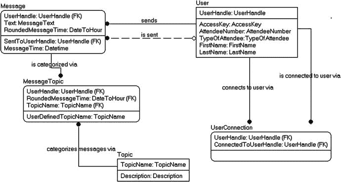

图 6-1.
会议消息数据库的简单逻辑模型

以下是模型中表和列的简要文档。为了保持简单，我将在我们单独处理每个需求时详细阐述这些需求。

*   `User`：表示消息传递系统的用户，从另一个系统预加载出席者信息。
    *   `UserHandle`：用户希望被知晓的名称。最初根据人的名字和姓氏加上一个整数值预加载，用户可以更改。
    *   `AccessKey`：在徽章上提供给用户的类似密码的值，用于获取访问权限。
    *   `AttendeeNumber`：分配给出席者以标识自己的号码，印在他们徽章的正面。
    *   `TypeOfAttendee`：用于给予用户特殊权限，例如访问演讲者材料、供应商区域等。
    *   `FirstName`, `LastName`：印在徽章上的用户名，供人们查看。
*   `UserConnection`：表示一个用户与另一个用户之间的连接，以便将结果过滤给一组特定的用户。
    *   `UserHandle`：将要连接到另一个用户的用户的句柄。
    *   `ConnectedToUser`：被连接到的用户的句柄。
*   `Message`：表示系统中的单个消息。
    *   `UserHandle`：发送消息的用户的句柄。
    *   `Text`：被发送消息的文本。
    *   `RoundedMessageTime`：消息的时间，四舍五入到小时。
    *   `SentToUserHandle`：消息正在发送到的用户的句柄。
    *   `MessageTime`：消息发送的时间，粒度为一秒。
*   `MessageTopic`：将消息与主题相关联。
    *   `UserHandle`：发送消息的用户的句柄。
    *   `RoundedMessgeTime`：消息的时间，四舍五入到小时。
    *   `TopicName`：被发送主题的名称。
    *   `UserDefinedTopicName`：允许用户选择`UserDefined`主题样式并设置他们自己的主题。
*   `Topic`：消息的预定义主题。
    *   `TopicName`：主题的名称。
    *   `Description`：主题目的和使用的描述。


## 为你的表选择物理模型

在 SQL Server 2014 之前，SQL Server 中只包含一个关系数据库引擎。每个表的工作方式都相同（而且我们喜欢这样，该死的！）。2014 年引入了第二个“内存中”“OLTP”引擎（也称为“内存优化”），其内部工作原理与原始引擎截然不同，但对于 SQL 程序员来说，它基本上以相同的声明性方式工作。在本节中，我将从高层次介绍一些差异，并在后续章节中更详细地介绍这些差异。在本章中，我还将提供一个脚本，尽可能使用内存中引擎来构建表和代码，以展示一些差异。

### 引擎选项

简而言之，你可以为对象选择两种引擎：

*   `磁盘上`： 自 SQL Server 7.0 从头重写以来，该经典模型经过了逐步改进。数据静态存储在磁盘上，但当查询处理器使用数据时，首先将其带入内存，放入模拟磁盘结构的页面中。更改会写入内存和事务日志，然后异步持久化到磁盘。并发/隔离控制通过使用锁（向其他进程发出信号，表明你正在使用资源，如表、行等）和闩锁（类似于锁，但主要用于物理资源）来阻止资源影响另一个连接的资源来实现。
*   `内存中 OLTP`：（在本书的其余部分，许多参考资料将简称为“内存中”。）数据始终位于 `RAM` 中，采用原生编译的结构（如果你深入挖掘 SQL Server 目录，可以找到 `C` 代码），并在创建时编译。更改会写入内存和事务日志，并异步写入增量文件，该文件用于在重启服务器时加载内存（有一个选项可以使表不可持久化；也就是说，如果服务器重启，数据将会消失）。并发/隔离控制通过使用版本控制（`MVCC`-多版本并发控制）来实现，因此，大多数并发冲突通过隔离级别失败来发出信号，而不是通过阻塞。2014 版功能非常有限，只有一个唯一约束，没有外键、检查约束。2016 版有了很大改进，支持大多数需要的约束类型。

### 优势与考虑因素

引擎选择的强大之处在于，你可以在表级别进行设置，因此你可以在每个模型中拥有表，并且这些表可以在连接中交互，也可以与解释型 `T-SQL`（与原生编译的 `T-SQL` 对象相对，本节稍后会提到）交互。内存中引擎专为比磁盘上引擎所能处理的更高性能场景而设计，因为它不使用阻塞操作进行并发控制。对于大多数常见的即时用例，它有两个主要问题：

*   在此模型中，你的所有数据必须驻留在 `RAM` 中，而拥有数百 GB 或 TB 内存的服务器仍然相当昂贵。
*   `MVCC` 是一个与许多 SQL Server 应用程序所构建的并发模型非常不同的并发模型。

这些差异，特别是后者，意味着内存中并非一个简单的“加速”按钮。

由于使用两种引擎的对象可以驻留在同一个数据库中，你可以在有意义时同时利用两者。例如，你可以有一个使用磁盘上模型的产品表，因为它是一个写入争用非常少的非常大的表，但订单表及其明细项可能需要支持每秒数万次写入操作。这只是一个简单场景，在该场景中使用内存中模型可能对你有用。

除了表可以位于内存中之外，还有存储过程、函数和触发器在创建时也是原生编译的（使用 `T-SQL` `DDL`，编译为本机代码），它们可以引用内存中对象（但不能引用磁盘上对象）。它们在编程语言表面上受到限制，但在许多场景下肯定值得。SQL Server 2016 的实现比 2014 版限制更少，但两者支持的语法都远少于正常的解释型 `T-SQL` 对象。

### 推荐场景

有几种场景你可以应用内存中模型。Microsoft 内存中 OLTP 网页 ([`https://msdn.microsoft.com/en-us/library/dn133186.aspx`](https://msdn.microsoft.com/en-us/library/dn133186.aspx)) 推荐将其用于以下场景：

*   高数据读取或插入速率：因为没有结构争用，内存中模型可以处理比磁盘上模型多得多的并发操作。
*   密集处理：如果你正在做大量可以编译成原生代码的业务逻辑，其性能将远优于解释版本。
*   低延迟：由于所有数据都包含在 `RAM` 中，并且代码可以原生编译，执行时间可以大大减少，特别是在操作需要毫秒级（甚至微秒级）计时的情况下。
*   高规模负载场景：例如会话状态管理，其争用非常小，并且可能不需要长时间持久化（尤其是在 SQL Server 机器重启的情况下）。

### 实用建议与工具

因此，在规划物理数据库设计时，考虑你的设计需要哪种模式是很有用的。在大多数情况下，磁盘上模型将是你会想要使用的模型（如果你真的不确定，从磁盘上模型开始，然后根据情况进行调整）。它以非常高效的方式支持了一些极大的数据集，并且当你正确设计数据库时，它将处理惊人的吞吐量。然而，随着内存变得更便宜，并且引擎在编码能力上接近我们已经使用了 20 年的解释模型，这种模型可能会成为默认模型。目前，需要极高吞吐量的数据库（例如，就像《星球大战：原力觉醒》时期的票务代理商）将是采用此模型的候选者。

如果你最初为表使用磁盘上模型，并在测试期间确定设计中存在可以使用内存中的热点，SQL Server 提供了工具来帮助你确定内存中引擎是否适合你的情况，这些工具在名为“确定表或存储过程是否应移植到内存中 OLTP” ([`https://msdn.microsoft.com/en-us/library/dn205133.aspx`](https://msdn.microsoft.com/en-us/library/dn205133.aspx)) 的页面中描述。

### 章节上下文与示例

在本书实现章节的这一早期部分，底线是你应该意识到，作为数据架构师，有两种查询处理模型可供你使用，并了解基本差异，这样在本书其余部分更详细地解释差异时，你能理解基础。

本章中的示例将仅在磁盘上模型中完成，因为考虑到需求是针对小型用户社区，这将是最典型的起点。如果用户社区大幅扩展，内存中模型可能会很有用，至少对于最高争用的区域（例如创建新消息）是如此。

注意

在整本书中，会有小段的旁注说明如果你采用内存中表可能会如何影响某些事情，但该主题并非本书的主要内容。该主题在第 10 章“索引结构与应用”中有更深入的介绍，因为理解这些表如何被索引的内部原理很重要；在第 11 章“并发问题”中，因为并发是最大的差异；并在第 13 章“系统架构设计”中再次有所涉及，因为我们将更详细地讨论何时选择引擎以及使用它进行编码。


## 选择名称

我们模型的目标数据库（显而易见）是 SQL Server，因此我们的表和列命名约定必须遵循此数据库系统施加的规则，同时保持一致性和逻辑性。在本节中，我将简要介绍在为表和列命名时需要考虑的一些不同因素。过去几个版本的 SQL Server（可追溯至 SQL Server 7.0），所有这些系统对名称的约束都保持不变。

列、表、存储过程等的名称在技术上被称为标识符。SQL Server 中的标识符存储在名为 `sysname` 的系统数据类型中。它被定义为一个使用 Unicode 字符的、最多 128 个字符的字符串。SQL Server 的标识符规则包含两种不同的命名方法：

*   **常规标识符**：无需定界符的标识符，但需遵循一系列规则来决定什么可以或不可以作为名称。这是首选方法，规则如下：
    *   第一个字符必须是 Unicode 标准 3.2 定义的字母（一般而言，指罗马字母 A 到 Z，包括大小写，以及其他语言的字母）或下划线字符 (`_`)。你可以在 [`www.unicode.org`](http://www.unicode.org) 找到 Unicode 标准。
    *   后续字符可以是 Unicode 字母、数字、“at” 符号 (`@`) 或美元符号 (`$`)。
    *   名称不能是 SQL Server 保留字。你可以在 SQL Server 2016 联机丛书的“保留关键字”主题中找到大量保留字列表。其中一些词很棘手，比如 `user`、`transaction` 和 `table`，因为它们在现实世界中确实经常出现。（请注意，我们原始模型中包含了名称 `User`，我们必须要修正它。）注意，有些词被认为是关键字但不是保留字（例如 `description`），可以作为标识符使用。（而有些词，比如 `int`，会是非常糟糕的标识符！）
    *   名称不能包含空格。
*   **分隔标识符**：这些标识符应使用方括号 ([ ]) 或双引号 (") 包裹（仅当 `SET QUOTED_IDENTIFIER` 选项设置为 `ON` 时才允许使用双引号）。通过在对象名称周围加上定界符，你可以使用任何字符串作为名称。例如，`[Table Name]`、`[3232 fjfa*&(&^(]` 或 `[Drop Database HR;]` 都是合法（但确实烦人且危险）的名称。在创建新表时，需要定隔符的名称通常是个坏主意，应尽可能避免，因为它们会使编码更加困难。然而，在与其他环境交互数据时，它们可能是必要的。在编写脚本对象时通常需要使用定界符，因为像 `[Drop Database HR;]` 这样的名称如果你不加定界符，可能会引起“问题”。

如果你需要在名称中放入右方括号 (]) 甚至双引号字符，你必须包含两个右方括号 (]]），就像需要在字符串中包含单引号一样。因此，名称 `fred]olicious` 必须被分隔为 `[fred]]olicious]`。然而，如果你发现自己需要在名称中包含任何特殊字符，请好好花点时间考虑你是否真的需要这样做（或者是否需要考虑其他就业机会）。如果你经过思考后确定需要，请向他人请教如何为你的对象命名，或者给我发邮件至 `louis@drsql.org`。这对你的同伴来说是一件相当糟糕的事情，并且会使处理你的对象变得非常麻烦。即使是只包含空格字符，也是一种足够糟糕的做法，会让你和你的用户后悔多年。另请注意，在某些上下文中，`[name]` 和 `[name]` 会被视为不同的名称（请看那个嵌入的空格），`[name]` 也是如此。

**注意**
使用基于策略的管理，你可以在创建新对象时创建命名标准检查。不过，基于策略的管理是一种管理工具而非设计工具，尽管创建命名标准检查以确保不会意外创建名称不可接受的对象可能是值得的。总的来说，我觉得这种方式限制性太强，因为规则总有例外，而自动化的策略执行只在独裁者的手下才有效。（你见过开发经理达斯·维达吗？他人不错！）

### 表命名

虽然创建对象名称的规则相当直接，但更重要的问题是：“应该选择什么样的名称？”我通常给出的答案是：“只要你觉得最好，只要其他人能读懂，并且遵循当地的命名标准即可。”这听起来像是推脱，但数据架构师比命名标准还多。（在撰写本段的第一天，我实际上进行了两次关于如何命名几个对象的独立讨论，而且两人都不想遵循相同的标准。）我通常遵循的标准是逻辑模型中使用的标准，即帕斯卡命名法（Pascal-cased）的名称，很少使用缩写，并且尽可能具有描述性。有了 128 个字符的空间，几乎没有理由进行太多缩写。帕斯卡命名法的形式是 `PartPartPart`，单词之间没有分隔符。驼峰命名法（Camel-cased）的名称则不以大写字母开头，例如 `partPartPart`。

**警告**
因为大多数公司都有现有系统，所以必须了解商店的命名标准，以便与现有系统匹配，并且让你的项目新开发者更有可能理解你的数据库并更快上手。关键是要确保为了文档目的，保留完整的逻辑名称。

举个例子，让我们考虑一下我们将在本章后面构建的 `UserConnection` 表的名称。以下列表展示了构建此对象名称的几种不同方式：

*   `user_connection`（或者有时，根据某些糟糕的命令，会是全大写版本 `USER_CONNECTION`）：使用下划线分隔值。大多数程序员不太喜欢下划线，因为习惯之前输入起来很麻烦。此外，它们有一种 COBOL 风格，很少有人喜欢。
*   `[user connection]` 或 `"user connection"`：这个名称用方括号或引号分隔。被迫使用定界符很烦人，而且许多其他语言使用双引号表示字符串。（在 SQL 中，你总是使用单引号。）另一方面，方括号 [ 和 ] 并不表示字符串，尽管它们是仅限微软的约定，如果你需要做任何跨平台编程，移植性会很差。
*   `UserConnection` 或 `userConnection`：分别是帕斯卡命名法或驼峰命名法，使用混合大小写来分隔单词。在大多数示例中，我会使用帕斯卡风格，因为这是我喜欢的风格。（嘿，这是我的书。你可以选择任何你想要的风格！）
*   `usrCnnct` 或 `usCnct`：缩写形式是有问题的，因为你必须小心地在所有数据库中以相同方式缩写同一个词。你必须维护一个缩写字典，否则你会得到同一个词的多种缩写——例如，“description” 可能变成 `desc`、`descr`、`descrip` 和/或 `description`。一些访问你数据的应用程序可能有 30 个字符之类的限制，使得缩写变得必要，所以要理解这些需求。

缩写确实有意义的一个特定场合是当该缩写在组织内非常标准时。例如，如果你正在编写一个采购系统，并且要为一个采购订单表命名，你可以将对象命名为 `PO`，因为这是广泛理解的。通常，用户会希望这样，即使有些缩写看起来不那么明显。只是要百分之百确定，这样你就不会让 `PO` 同时表示采购订单和不满的客户。


为对象命名终究是个人选择，但绝不能随意为之，应首先遵循现有的公司标准，其次参考已有软件，最后才考虑**可辨识性**和**可读性**。最重要的目标是努力实现**内部一致性**。作为架构师，你的目标是确保用户能够轻松地使用你的对象，并尽可能少地考虑其结构。即便多数糟糕的命名约定，也比任由对立的架构师/开发派系各自实施十种不同的优秀命名约定要好。

一种尤为恶劣且在从事过程式语言（特别是解释型语言）出身的人群中相当常见的做法，是在名称中加入某些内容以指示某物是一个表，例如 `tblSchool` 或 `tableBuilding`。请不要这样做（真的…我恳求你）。通过上下文完全可以清楚什么是一个表。这种做法，就像其他匈牙利式命名法一样，在过程式编程语言中很有意义，因为对象类型并非总能仅从上下文中明确；但对于 SQL 表来说，这种做法完全没必要。请注意，这种对前缀的反感仅限于供用户使用的名称。随着本书的推进，我们将为非用户可寻址的对象悄然建立前缀和命名模式。

**注意：**
关于公司标准的质量也有可说之处。如果你有一个陈旧的标准，比如基于大型机团队在 19 世纪制定的标准，那么在创建新数据库时，你真的需要考虑尝试改变这些标准，以免仅仅因为公司标准如此，最终得到像 `HWWG01_TAB_USR_CONCT_T` 这样的名称（是的，我确实知道 19 世纪是什么时候）。

### 列命名

就 SQL Server 而言，列的命名规则与表的命名规则相同。至于如何为列选择名称——再次强调，这是个体架构师基于相同类型的标准（公司标准、最佳用法等）自行决定的任务。本书遵循以下指南：

*   除了主键，我认为表名很少应包含在列名中。例如，在一个名为 `Person` 的实体中，没有必要创建名为 `PersonName` 或 `PersonSocialSecurityNumber` 的列。除了以下两种例外情况，大多数列名不应以表名为前缀：
    *   代理键，如 `PersonId`。这减少了对角色命名（修改属性名称以调整含义，尤其在存在多个迁移外键的情况下）的需求。
    *   其名称本身就自然包含实体名的列，例如 `PersonNumber`、`PurchaseOrderNumber`，或是客户端语言中常见并用作领域特定术语的名称。
*   名称应尽可能具有描述性。名称中少用缩写，除了前述的常见缩写，以及那些值自然被读作缩写的通用发音缩写。例如，我总是使用 `id` 而不是 `identifier`，首先因为它是一个大多数人已知的常见缩写，其次因为 `Widget` 表的代理键自然发音是 Widget-Eye-Dee，而不是 Widget-Identifier。
*   如果可能，遵循一个共同的模式。例如，一个归因于 ISO 11179 的标准是使用（角色名 + 属性 + 类词 + 规模）的模式构造名称，其中每一部分为：
    *   角色名 [可选]：当你需要在表的上下文中解释属性的用途时使用。
    *   属性 [可选]：被命名列的主要目的。如果省略，名称则直接指代实体用途。
    *   类词：一个通用的后缀，以非实现相关的术语标识列的用途。它不应与数据类型相同。例如，`Id` 是一个代理键，而不是 `IdInt` 或 `IdGUID`。（如果你需要扩展或更改类型但不更改目的，不应影响名称。）
    *   规模 [可选]：当数据的规模不易辨别时（如分钟或秒），或当典型货币是美元而该列代表欧元时，告知用户数据的规模。

    一些示例名称可能是：
    *   `StoreId` 是商店的标识符。
    *   `UserName` 是一个文本字符串，但它是 `varchar(30)` 还是 `nvarchar(128)` 无关紧要。
    *   `EndDate` 是某事结束的日期，不包括时间部分。
    *   `SaveTime` 是行被保存的时间点。
    *   `PledgeAmount` 是一笔金额（使用 `decimal(12,2)`、`money` 或任何类型）。
    *   `PledgeAmount Euros` 是以欧元计的金额。
    *   `DistributionDescription` 是一个用于描述资金如何分配的文本字符串。
    *   `TickerCode` 是用于标识股票代码行的短文本字符串。
    *   `OptInFlag` 是一个双值列（可能包括 `NULL` 是三值），指示一种状态，例如在此情况下表示个人是否出于某种特定原因选择了加入。

许多可能的类词都可以使用，而本书的目的并非为你提供该层面需要遵循的所有标准。组织间的太多变异使得这过于困难。最重要的是，如果你能建立一个标准，让它为你的组织工作并遵循它。

**注意：**
与表一样，避免使用像 `col` 这样的前缀来表示列，这真的是一种非常糟糕的做法。

对于实现模型，我将使用与逻辑模型相同的命名约定：Pascal 命名法（单词首字母大写），并带有一些缩写（主要在类词中，如用“id”表示“identifier”）。在本书后面，我将对表以外的对象（如约束）和编码对象（如存储过程）使用匈牙利式前缀。这主要是为了保持名称唯一性，避免与表名冲突，此外在包含多种类型对象的列表中也更易阅读（表是不带前缀的对象）。表和列通常被用户直接使用。他们直接使用数据库对象名称编写查询和构建报表，不应需要更改每个列和表的显示名称。


### 模型名称调整

在我们的示例模型中，首先要做的就是将 `User` 表重命名为 `MessagingUser`，因为“User”是 SQL Server 的一个保留关键字。虽然 `User` 是比 `MessagingUser` 更自然的名称，但这是我们必须为名称的合法性做出的权衡之一。在极少数情况下，当无法创建合适的名称时，我可能会使用带括号的名称，但即使这意味着我要花四个小时重绘图表并撤销最初选择 `User` 作为表名，我也不希望将此作为典型做法推荐给你。如果你发现你的模型中使用了一个保留关键字（而且你并非在撰写一本长达 80 多页、以此为主题的书籍章节），通常只需要进行非常微小的更改。

在图 6-2 所示的模型片段中，我已做出了这一更改。

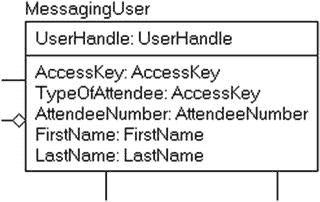

图 6-2.
表 `User` 已更改为 `MessagingUser`

接下来我们将要更改的是这个表中的几个列。我们将从 `TypeOfAttendee` 列开始。我们讨论过的标准是在列名末尾使用一个类别词。在这种情况下，`Type` 将是一个可接受的类别，当你看到 `AttendeeType` 时，其含义将一目了然。其实现将是一个最多 20 个字符的值。

第二个更改将针对 `AccessKey` 列。`Key` 本身作为类别词是可以接受的，但它会暗示该值是数据库中的一个键（这是我数据仓库维度数据库设计中采用的标准）。因此，在名称后加上 `Value` 后缀将使名称更清晰、更具区分度。图 6-3 反映了名称的更改。

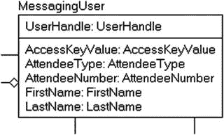

图 6-3.
更改 `AccessKey` 列名后的 `MessagingUser` 表

## 选择键的实现方式

该过程的下一步是选择如何实现表的键。此时模型中的每个表都标识了一个键，即主键。在本节中，我们将探讨围绕键选择的相关问题，并最终为示例模型设置键。我们将看看实现主键的几种选择，然后根据需要指出创建替代键的选择。

### 主键

为主键选择实现方式是一个重要的决定。根据你选择的样式，数据库项目其余部分的外观和感觉都会受到影响，因为无论你采用哪种方法，主键值都将作为对特定行的引用迁移到其他表中。在论坛上，偶尔也会在 SQL Saturday 活动后的晚餐上，主键样式的选择是最具争议的话题之一。在本书中，我对此将持相对中立的态度，并会在全书介绍几种选择主键实现方式的方法。当然，在本章中，我会对所有表使用一种非常具体的方法。

大概在逻辑设计阶段，你已经确定了唯一标识一行的不同方法。因此，主键应该有多种选择，包括：

*   使用现有列（或列组合）
*   派生一个新的代理列来表示该行

每种选择在实现上都有其优缺点。我将在以下各节中逐一探讨。

#### 基于现有列构建主键

在许多情况下，表会有一个明显且易于使用的主键。在讨论独立实体时尤其如此。例如，以 `product` 这样的表为例，它通常会定义一个 `productNumber`。一个人通常也会有某种标识符，无论是政府还是公司颁发的。（例如，我的公司有一个 `employeeNumber`，我必须把它写在所有文件上，特别是在公司需要给我开支票时。）

从属表的主键通常可以采用独立表的主键，再加上一个或多个属性——瞧！——主键就构成了。

例如，我曾经有一辆福特 SVT Focus，由福特汽车公司制造。因此，为了识别这个特定型号，我可能会在 `Manufacturer` 表中有一行表示福特汽车公司（与通用汽车相对）。然后，我会有一个 `automobileMake`，其键为 `manufacturerName = 'Ford Motor Company'` 和 `makeName = 'Ford'`（与林肯相对）、`style = 'SVT'` 等其他值。处理起来可能有点混乱，因为 `automobileModelStyle` 表的键将在许多地方用于描述哪些产品正被运往哪些经销商。请注意，这里讨论的不是键在性能方面的大小，而是构成键的值的数量。键越小，性能也会越好，但这不仅取决于列的数量，还取决于构成键的值或值的大小。使用三个 2 字节的值可能比一个 15 字节的键更好，尽管在三个列上进行连接会麻烦得多。

请注意，在这样一个真实系统中，复杂性会因以下事实而加剧：你必须考虑车型年份、可能的车身样式、不同的预装选装包等等。表的键可能经常包含多个部分，尤其是在那些子子孙孙孙的表中。


## 基于新的代理值设置主键

另一种常见的键样式是，无论其他键的大小如何，仅使用单个列作为主键。在这种情况下，你会指定每个表都有一个人工生成的单列主键列，并实现备用键来保护表中自然键的唯一性，如图 6-4 所示。

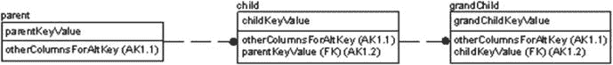

图 6-4. 单列键示例

请注意，在此场景中，你的所有关系在数据库中都将实现为非标识类型关系，尽管你会将它们实现为所有都是必需值（没有`NULL`s）。从功能上讲，这与`parentKeyValue`从`parent`经由`child`迁移到`grandChild`是一样的，尽管在模型中更难看出来。

在图 6-4 的模型中，你最需要注意的是每个表不仅有主键，还有一个备用键。“代理”这个术语有一个非常具体的含义，即使在计算机科学之外也是如此，那就是它充当替代品。因此，`parentKeyValue`的父对象的代理键可以用来替代定义的键，在本例中是`otherColumnsForAltKey`。

这种方法确实有一些有用的优势：

-   每个表都有一个单列主键：开发使用此键的应用程序要容易得多，因为每个表都有一个遵循相同模式的键。它还使代码生成更容易理解，因为总是了解表的结构，让你无需处理所有其他可能的键设置排列。
-   主键索引将尽可能小：如果使用数字，你可以使用尽可能小的整数类型。因此，如果你最多有 200 行，可以使用`tinyint`；20 亿行，可以使用 4 字节整数。使用索引访问表中行的操作将更快。大多数更新和删除操作可能通过使用此索引基于简单的主键访问数据来修改数据。（有些为了方便 UI 代码使用 16 字节的`GUID`，但`GUID`有其缺点，我们将在后面讨论。）
-   表之间的连接将更容易编码：这是因为所有迁移的键都将是单列。另外，如果你使用命名为`TableName` + 后缀（在我的示例中通常是`Id`）的代理键，那么在设置连接时需要思考的东西会更少。思考少也意味着错误少。

这种方法也有缺点，例如总是需要连接到一个表才能找出代理键值的含义。在图 6-4 的示例表中，你将不得不从`grandChild`表通过`child`表连接，以获取来自`parent`的键值。另一个问题是，关系的某些自文档性被忽略了，因为仅使用单列键消除了所有标识关系的明显性。因此，为了知道`parent`和`grandChild`之间的逻辑关系是标识性的，你必须仔细追踪关系并查看唯一性约束和外键。

假设你选择使用代理键，那么下一个决定是选择键值用什么。让我们看看实现这些键的两种方法，要么从其他数据派生键，要么使用无意义的代理值。

定义主键的一种流行方法是简单地使用无意义的代理键，就像我们之前建模的那样，例如使用具有`IDENTITY`属性的列或从`SEQUENCE`对象生成的列，它会自动生成一个唯一值。在这种情况下，你很少让用户访问键的值，而主要将其用于编程。

这正是在之前章节中处理的逻辑模型中大多数实体所采用的方法：在不知道主键的实际值会是什么的情况下，直接使用代理键。这种方法有一个很好的特性：

> 你永远不必担心当键值发生变化时该怎么办。

一旦为一行生成了键，它就永远不会改变，即使所有数据都改变了。当你需要随时间进行分析时，这是一个特别好的特性。无论表中的其他任何值被更改为什么，只要该行的代理键值（以及该行）代表相同的事物，你仍然可以将其与过去的用途联系起来。（这一点你也必须与 DBA/开发人员明确。有时，他们可能希望删除所有数据并重新加载，但如果代理键发生变化，你与代理键不变性质的链接很可能就会断裂。）考虑一个标识公司的行。如果公司名为 Bob’s Car Parts，位于堪萨斯州的托皮卡，然后它发展壮大，搬到底特律，并将公司名称更改为 Car Parts Amalgamated，那么只需要修改一行：名称所在的行。只需更改名称、地址等就完成了。键可能会改变，但主键不会。此外，如果确定唯一性的方法发生变化，除了删除一个`UNIQUE`约束并添加另一个之外，数据库结构无需更改。

使用代理键值绝不阻止你创建额外的单部分键，就像我们在上一节中所做的那样。事实上，它通常要求这样做。对于大多数表，拥有一个小的代码值可能是理想的事情。许多客户端讨厌长值，因为它们涉及“太多输入”。例如，假设你有一个值，如“Fred’s Car Mart”。你可能希望有一个代码“FREDS”作为名称的简写值。有些人甚至因为使用过具有神秘代码的古老数据库系统而形成习惯，以至于他们希望有像“XC10”这样的代码来指代“Fred’s Car Mart”。

在演示模型中，我根据逻辑模型的做法设置所有键使用自然键，因此在图 6-5 中的`MessagingUser`这样的表中，它使用用户的整个句柄作为键。

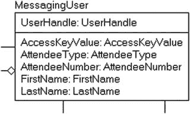

图 6-5. 更改为使用代理键之前的模型 MessagingUser 表

这个值是最符合逻辑的，但这个名称，根据（当前和未来的）需求，是可能改变的。将其更改为代理值将使名称更改变得更容易，并且不必担心此表及关联表中的现有数据。对模型进行此更改的结果如图 6-6 所示，现在，键是一个明显可识别为与`MessagingUser`关联的值，无论该行的唯一性是什么。请注意，当我将`UserHandle`从主键切换为备用键时，将其设置为了备用键。


图 6-6. 更改为使用代理键后的模型 MessagingUser 表

接下来，我们将看一下图 6-7 所示的`Message`表。请注意，两个原本名为`UserHandle`和`SentToUserHandle`的列，它们的角色名称已更改，以表明当`MessagingUser`的键是`UserHandle`时名称的变化。

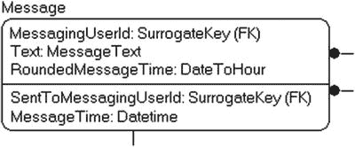

图 6-7. 更改为使用代理键之前的模型 Message 表

### 使用代理键

我们将通过以下方式转换此表以使用代理键：将所有三列移动到非键列，将它们放入唯一性约束，并添加新的`MessageId`列。同时请注意，在图 6-8 中，该表不再建模为圆角，因为主键不再建模有任何迁移键。

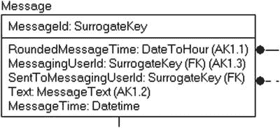

`图 6-8.`
在更改模型使用代理键之前的`Message`表

为每个表使用一个通用模式对于以表为对象进行编程也很有用。因为每个表都有一个不可更新且数据类型相同的单列键，所以可以在代码中利用这一点，使代码生成过程变得更为简单直接。再次注意，使用代理键不应丢失任何信息，因为这种风格的代理键只是代表现有的自然键。许多流行（尽管在数据库社区中存在争议）的对象关系映射（`ORM`）工具要求单列整数键作为其主要实现模式。我不赞成强迫数据库以任何方式设计来适应客户端工具，但有时，对数据库有利的东西对工具也有利，至少算是一个相对圆满的结局。

通过使用此模式实现表，我在两个方面得到了保障：我总是有一个单一的主键值，而且我总是有一个不可修改的键，这减轻了加载辅助副本（如数据仓库）的难度。无论选择何种人类可访问的键，代理键都是我在创建的数据库中几乎所有表（并且总是用于包含用户可修改数据的表，我们将在本章后面讨论“域”表时提到）中使用的键样式。在图 6-9 中，我已完成向代理键的转换。

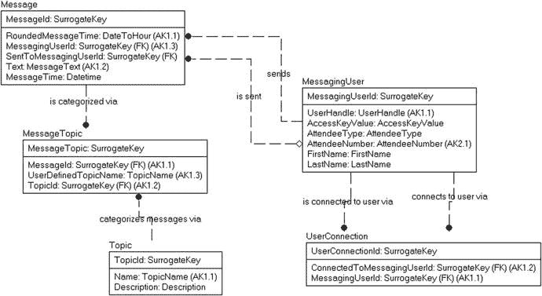

`图 6-9.`
选择代理键后的消息数据库模型进展

请记住，此时我还没有指定代理键的任何实现细节，而且很明显，在真实系统中，我应该在转换过程中已经完成此操作。对于本章示例，我使用了一个刻意详细的流程来分离每个单独的步骤，因此我将把该讨论推迟到本书的`DDL`部分，在那里我将提供处理此需求的代码以及创建对象。

### 替代键

在目前的模型中，我们已经将替代键识别为模型创建的一部分（`MessagingUser.AttendeeNumber`是我们唯一的初始替代键），但我想在模型上稍作停留，以防您错过它，明确说明一下。每个表应至少有一个自然键；也就是说，一个与表所建模的内容含义相关的键。如果您选择在逻辑模型中使用代理键，并且选择使用单部分代理键实现，那么建模过程中的这一步就极其重要，您至少应检查指定的键。

在逻辑模型中制造甚至无意义的主键不应该是您唯一定义的键。使用此类键的人最终犯的错误之一是忽略了一个事实：仅由系统生成值区分的两行数据并非不同。如果只使用人工生成的值作为键，就或多或少不可能区分一行与另一行。

例如，参见表 6-1，这是一个`Part`表的片段，其中`PartID`是一个`IDENTITY`列，并且是该表的主键。

`表 6-1.`
演示代理键为何不能作为良好逻辑键的样本数据

```text
| PartID | PartNumber | Description         |
|--------|------------|---------------------|
| 1      | XXXXXXXX   | The X part          |
| 2      | XXXXXXXX   | The X part          |
| 3      | YYYYYYYY   | The Y part          |
```

此表中的行代表了多少个独立项目？嗯，看起来有三个，但`PartID`为 1 和 2 的行实际上是同一行的重复吗？或者它们本应是两行不同的行，但输入时出错了？您需要在每一步考虑，一个人是否有可能在不了解代理键的情况下从表中选取所需行。这就是为什么表上应该有某种键来保证唯一性，在本例中很可能是在`PartNumber`上。

**注意**

作为规则，您的每个表都应有一个对用户有意义并且可以唯一标识表中每一行的自然键。在极少数情况下，您可能找不到自然键（例如，在记录可能发生在同一.000001 秒内事件的日志表中），那么构造一个人为的键是可以接受的，但通常它是帮助您区分两行数据的更大键的一部分。

在一个设计良好的逻辑模型中，您此时不应处理从需求角度保护数据唯一性的键。架构师（可能是您自己）已经确定了一些可以实现的唯一性方式。例如，在图 6-10 中，一个`MessagingUser`行可以通过`UserHandle`或`AttendeeNumber`来识别。

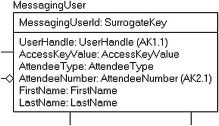

`图 6-10.`
待审阅的`MessagingUser`表

更有趣一点的是`Message`表，如图 6-11 所示。键是`RoundedMessageTime`（四舍五入到小时的时间）、消息文本和`UserId`。

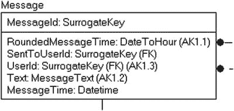

`图 6-11.`
待审阅的`Message`表

在业务规则中，已声明用户每小时不能发布超过一次相同的消息。此类约束并不十分容易以简单的方式实现，但将其分解为实现约束所需的数据可以使它更容易。在我们的例子中，通过在消息、用户和四舍五入到小时的时间（我们将在流程后期找到某种方法来实现）上设置键，配置结构就相当容易了。

当然，通过在表上设置此键，如果`UI`发送了两次相同的数据，当发送重复消息时将引发错误。此错误需要在客户端处理，通常是将错误消息转换为更友好的内容。

我在这里要介绍的最后一张表是`MessageTopic`表，如图 6-12 所示。

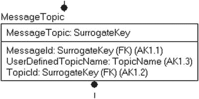

`图 6-12.`
待审阅的`MessageTopic`表

这个表有趣的地方在于可选的`UserDefinedTopicName`值。稍后，当我们创建此表时，我们将加载一些种子数据，表明`TopicId`是‘`UserDefined`’，这意味着可以使用`UserDefinedTopicName`列。与这些种子数据一起，在此表上将有一个检查约束，用于指示`TopicId`值是否代表用户定义的主题。我将使用一个`0`代理键值。在稍后的检查约束中，我们将创建一个检查约束以确保所有数据都符合要求的标准。

此时，回顾一下，我们的模型如图 6-13 所示。


`图 6-13.`
待审阅的消息模型


## 确定域的实现

在逻辑建模中，域的概念用于指定一个可重复使用的数据类型和列属性的模板。在物理建模中，域用于选择要使用的数据类型，并为我们提供需要实现的验证规则的指导。

例如，在逻辑建模阶段，会为数据库/企业中定期出现的列（如名称和描述）定义域。在逻辑设计时，定义域的原因可能并不完全显而易见（这看起来像是摆谱的数据架构师的工作，而非程序员的工作），但如果前期工作做得好，在物理建模阶段其价值就会变得清晰。在实现阶段，域有以下几个目的：

*   **一致性**：我们两次使用 `TopicName` 作为域。这提醒我们以完全相同的方式定义 `TopicName` 类型的每一列；对于如何处理该列将永远不会有任何疑问。
*   **易于实现**：如果你用于建模和实现数据库的工具支持创建域和模板列，你可以简单地使用模板来构建具有相同模式的类似列，而不必反复设置值，这能避免错误！如果你的工具支持域上的属性继承，那么当你在定义中更改一个属性时，所有地方的值都会改变。因此，如果所有描述类型的列都允许为空，而所有代码列都不允许为空，你只需在一个地方设置即可。
*   **文档记录**：即使每列使用不同的域且没有复用，列/域的文档对于程序员查看给定列应使用的数据类型也非常有用。在本章的最后一节，我将把域作为元数据的一部分，添加到实现列的扩展属性中。

域并非逻辑或物理数据库设计的必备要求，SQL Server 也没有真正让你轻松地使用它们，但即使你只是在电子表格或设计工具中使用它们，它们也能实现轻松且一致的设计，这是一个很好的主意。当然，无论你是否使用工具来完成工作，一致的建模始终是一个好主意。我个人曾见过，在缺乏正确定义域的情况下，一个特定的列类型在五个不同的列中以四种不同的方式实现。所以，无论是否使用工具，拥有一个通过定义标识共享公共类型的列的数据字典都极其有用。

### 域定义示例

例如，对于在我们的 `ConferenceMessage` 模型中的 `Topic` 和 `MessageTopic` 表中经常使用的 `TopicName` 域，其规范可能由表 6-2 的内容指定。

**表 6-2. 示例域：TopicName**

| 属性 | 设置 |
| --- | --- |
| 名称 | TopicName |
| 可选 | `否` |
| 数据类型 | `Unicode 文本，30 个字符` |
| 值限制 | 不能为空字符串或仅空格字符 |
| 默认值 | `n/a` |

我将把 `CHECK` 约束和 `DEFAULT` 部分留到本章后面再讨论，届时我会更深入地讨论实现。几个表将有一个 `TopicName` 列，你将使用这个模板来构建每一个，这将确保每次构建这样的列时，其类型都是 `nvarchar(30)`。请注意，我们将在本章后面讨论数据类型及其用法。

在我们的模型中经常使用的第二个域是 `SurrogateKey`，如表 6-3 所示。

**表 6-3. 示例域：SurrogateKey**

| 属性 | 设置 |
| --- | --- |
| 名称 | SurrogateKey |
| 可选 | 当用作主键时，不可选，通常自动生成。当用作非键外键引用时，可选性由关系中的使用方式决定。 |
| 数据类型 | `int` |
| 值限制 | `N/A` |
| 默认值 | `N/A` |

这个域有点不同，因为它对于主键属性将完全按照规范实现，但当它迁移用作外键时，一些属性会被更改。首先，如果代理键使用标识列，则不会设置 `IDENTITY` 属性。其次，对于可选关系，可选关系允许迁移的键为空，但当用作主键时，则不允许为空。

最后，让我们为示例再设置一个域定义，即 `UserHandle` 域，如表 6-4 所示。

**表 6-4. 示例域：UserHandle**

| 属性 | 设置 |
| --- | --- |
| 名称 | UserHandle |
| 可选 | `否` |
| 数据类型 | 基本字符集，最多 20 个字符 |
| 值限制 | 必须是 5–20 个简单的字母数字字符，并且必须以字母开头 |
| 默认值 | `n/a` |

### 实现主题

在接下来的四个小节中，我将讨论关于域实现的几个主题：

*   **实现为列或表**：你需要决定一个值是应简单地输入到列中，还是应实现一个新表来管理这些值。
*   **选择数据类型**：SQL Server 提供了广泛的数据类型供你使用，我将讨论一些关于做出正确选择的问题。
*   **选择可空性**：在本节中，我将演示如何在示例模型中实现数据类型选择。
*   **选择排序规则**：排序规则基于字符集和所用语言，决定数据如何排序和比较。

正确实现列的域是确保实现正确的重要步骤。太多数据库最终所有列都使用相同的数据类型和大小，允许为空（如果有主键，则主键除外），从而失去了正确设置大小和约束所带来的完整性。


### 在列中强制执行域，还是使用表？

尽管许多域对值只有最小的限制，但一个域通常会指定列可能具有的一个固定命名值集合，这个集合比基础数据类型能容纳的要小。例如，在图 6-14 所示的演示表 `MessagingUser` 中，`AttendeeType` 列的域是 `AttendeeType`。


图 6-14. 参考用的 MessageUser 表

这个域可以像表 6-5 中那样指定。

表 6-5. 域类型（Genre Domain）

| 属性 | 设置 |
| --- | --- |
| 名称 | AttendeeType |
| 可否为空 | `否` |
| 数据类型 | 基本字符集，最大 20 个字符 |
| 值限制 | Regular, Volunteer, Speaker, Administrator |
| 默认值 | Regular |

值限制将可选值限定在一个固定的列表中。我们可以选择使用声明式控制（一个 `CHECK` 约束，我们将在本章后面更详细地介绍）来实现该列，其断言为 `AttendeeType IN ('Regular', 'Volunteer', 'Speaker', 'Administrator')`，并使用字面量默认值 `'Regular'`。这种形式有几个小麻烦：

*   表使用者无处了解该域：除非你有一行包含所有值中的一个，并对该列进行 `DISTINCT` 查询（这通常性能很差），否则很难知道可能的值是什么，除非你事先了解系统或查看元数据。如果你正在按 `AttendeeType` 制作会议消息系统使用情况报告，要找出哪些与会者类型在某段时间内没有任何活动并不容易，肯定无法使用一个没有硬编码值的简单、直接的 SQL 查询来实现。
*   通常，像这样的值可以很容易地关联额外的信息：例如，这个域可能包含关于特定类型用户可以执行的操作的信息。例如，如果 `Volunteer` 与会者仅限于使用某些主题，那么你将不得不在另一个表中管理这些类型。理想情况下，如果你在表中定义域值，该域的其他任何用途都更易于维护。

我几乎总是为所有本质上是“列表”的项包含表，因为即使需要更多的表，这样也远更易于管理。域表的键选择可能与大多数表有所不同。有时，我使用代理键作为实际的主键，有时则使用自然键。主要区别在于值是否由用户管理，以及编程工具是否需要整数/GUID 方法（例如，如果前端代码使用在表值中反映的枚举）。在模型中，我有两个此类域实现的例子。在图 6-15 中，我添加了一个表来实现与会者类型的域，对于这个表，我将使用自然键。

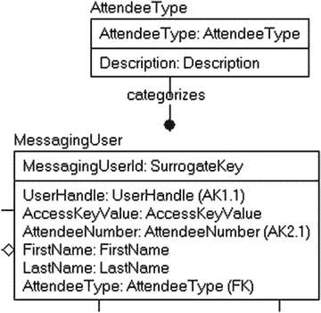

图 6-15. 实现为表的 AttendeeType 域

这使得应用程序可以像没有域表实现一样，将该值视为一个简单的值。因此，如果应用程序想将该值作为简单字符串值管理，从数据库的角度来看，我无需知道它的存在。我仍然能得到表实现所提供给我的值和验证，加上拥有一个 `Description` 列来描述每个值实际含义的能力（这在 12 月 25 日^(凌晨) 12:10 系统崩溃需要修复，而你当时正在想着还没组装完的自行车时，真的非常有用）。

在原始模型中，我们有 `Topic` 表，如图 6-16 所示，这是一个类似于 `AttendeeType` 的域，但设计为允许用户对主题列表进行更改。

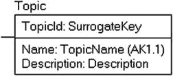

图 6-16. 参考用的 Topic 表

`Topic` 实体有一个特殊情况，即可以由应用程序管理员添加，因此它将实现为数值代理值。我们将在表中初始化一行，代表用户定义的主题，允许用户在 `MessageTopic` 表中输入他们自己的主题。

### 选择数据类型

选择合适的数据类型以匹配逻辑建模期间选择的域是一项重要任务。一种数据类型可能比同类型的另一种更高效。例如，你可以将整数数据存储在整数数据类型、数值数据类型、浮点数据类型，甚至是 `varchar(10)` 类型中，但这些数据类型在实现或性能上肯定不同。

注意

我将数据类型的讨论分为两部分。首先，是本节以及本章其他部分，我将提供一些关于 SQL Server 存在哪些数据类型的基本指导，并对使用什么进行一些简要的讨论。本书末尾的附录 A 是对所有数据类型的扩展探讨，致力于提供所有类型的示例和示例代码片段。

在构建列时，选择最佳可能的数据类型非常重要。以下列表包含固有数据类型（安装 SQL Server 时安装的内置类型）以及对每种类型的简要解释。当你将域转换为实现时，第一步将是首先查看这些类型中哪一个最符合需求，然后我们将寻找使用额外技术来进一步约束数据。


## 精确数值数据
存储不会丢失精度的数值数据。

### `bit`
存储 `1`、`0` 或 `NULL`；常用于类似布尔值的列（`1` = `True`，`0` = `False`，`NULL` = `Unknown`）。最多 8 个 `bit` 列可以容纳在 1 个字节中。无法执行某些典型的整数运算，如基本数学运算。

### `tinyint`
介于 `0` 和 `255` (0 到 2⁸ - 1) 之间的非负值（1 字节）。

### `smallint`
介于 `-32,768` 和 `32,767` (-2¹⁵ 到 2¹⁵ – 1) 之间的整数（2 字节）。

### `int`
介于 -2,147,483,648 和 2,147,483,647 (–2³¹ 到 2³¹ – 1) 之间的整数（4 字节）。

### `bigint`
介于 9,223,372,036,854,775,808 和 9,223,372,036,854,775,807 (-2⁶³ 到 2⁶³ – 1) 之间的整数（8 字节）。

### `decimal` (或 `numeric`)
在 SQL Server 中功能相同，但通常出于可移植性考虑首选 `decimal`。所有介于 –10³⁸ – 1 和 10³⁸ – 1 之间的数字（根据精度不同，占用 5 到 17 字节）。与整数后缀类型不同，允许小数。

## 近似数值数据
存储数字的近似值，通常用于科学用途。提供大范围的数值和高精度，但对于极大或极小的数字可能会丢失精度。

### `float(N)`
范围从 –1.79E + 308 到 1.79E + 308 的值（当 `N` 在 `1` 和 `24` 之间时，存储大小为 4 字节；当 `N` 在 `25` 和 `53` 之间时，存储大小为 8 字节）。

### `real`
范围从 –3.40E + 38 到 3.40E + 38 的值。`real` 是 `float(24)` 数据类型的 ISO 同义词，因此两者等效（4 字节）。

## 日期和时间
存储处理时序数据的值。

### `date`
仅日期的值，范围从公元 1 年 1 月 1 日到 9999 年 12 月 31 日（3 字节）。

### `time`
仅时间的值，精度到 100 纳秒（3 到 5 字节）。

### `datetime2(N)`
尽管名称不雅，但此类型将存储一个时间点，范围从公元 1 年 1 月 1 日到 9999 年 12 月 31 日，精度范围从 1 秒 (0) 到 100 纳秒 (7)（6 到 8 字节）。

### `datetimeoffset`
与 `datetime2` 相同，但包含时区偏移量（8 到 10 字节）。

### `smalldatetime`
时间点从 1900 年 1 月 1 日到 2079 年 6 月 6 日，精度为 1 分钟（4 字节）。（注意：建议逐步淘汰此类型的使用，并使用更符合标准的 `datetime2`，尽管 `smalldatetime` 在技术上并未被弃用。）

### `datetime`
时间点从 1753 年 1 月 1 日到 9999 年 12 月 31 日，精度为 3.33 毫秒（8 字节）。（注意：建议逐步淘汰此类型的使用，并使用更符合标准的 `datetime2`，尽管 `datetime` 在技术上并未被弃用。）

## 二进制数据
位串，例如文件或图像。这些数据类型的存储基于所存储数据的大小。

### `binary(N)`
长度固定的二进制数据，最长可达 8,000 字节。

### `varbinary(N)`
长度可变的二进制数据，最长可达 8,000 字节。

### `varbinary(max)`
长度可变的二进制数据，最长可达 (2³¹) – 1 字节（2GB）。

## 字符（或字符串）数据
### `char(N)`
长度固定的字符数据，最长可达 8,000 个字符。

### `varchar(N)`
长度可变的字符数据，最长可达 8,000 个字符。

### `varchar(max)`
长度可变的字符数据，最长可达 (2³¹) – 1 字节（2GB）。

### `nchar`、`nvarchar`、`nvarchar(max)`
分别是 `char`、`varchar` 和 `varchar(max)` 的 Unicode 等效类型。

## 其他数据类型
### `sql_variant`
存储（几乎）任何数据类型，除了基于 CLR 的数据类型（`hierarchyId`、空间类型）和任何最大长度超过 8,016 字节的类型。（CLR 是一个我不会过多涉及的主题，但它允许 Microsoft 和您使用 .NET 语言对 SQL Server 对象进行编程。更多信息，请查看 [`https://msdn.microsoft.com/en-us/library/ms131089.aspx`](https://msdn.microsoft.com/en-us/library/ms131089.aspx)）。除了少数边缘用途外，使用 `sql_variant` 通常不是一个好主意。它在您存储值之前不知道其数据类型的情况下可用。本书中此类型的唯一用途将在第 8 章中创建用户可扩展架构时（这本身就是一个边缘模式）。

### `rowversion` (`timestamp` 是其同义词)
用于乐观锁定以对行进行版本标记。它在每次修改时都会更改。在 2000 年之前的所有 SQL Server 版本中，此类型的名称是 `timestamp`，但在 ANSI SQL 标准中，`timestamp` 类型等同于 `datetime` 数据类型。我将在关于并发性的第 11 章中更详细地介绍 `rowversion` 数据类型。（16 年过去了，它仍然经常被称为 timestamp，因此这可能永远不会完全消失。）

### `uniqueidentifier`
存储 GUID 值。

### `XML`
允许您在列中存储 XML 文档。`XML` 类型为处理结构化数据提供了丰富的功能集，而这些数据无法使用典型的关系表轻松管理。您不应使用 `XML` 类型作为破坏第一范式（在单个列中存储多个值）的拐杖。本书的设计中不会使用 `XML`。

### 空间类型 (`geometry`、`geography`、`circularString`、`compoundCurve`、`curvePolygon`)
用于存储空间数据，例如地图数据。本书中不会使用这些类型。

### `hierarchyId`
用于存储有关层次结构的数据，并提供操作层次结构的方法。我们将在第 8 章中详细介绍如何操作层次结构。

数据类型的选择是此过程中极其重要的一部分，但如果您已经很好地定义了域，那么这不是一项艰巨的任务。在以下部分中，我们将探讨选择过程中几个较为重要的部分。我们将考虑的一些因素包括：

*   已弃用或不良的选择类型
*   常见的数据类型配置
*   大值数据类型列
*   复杂数据类型

我在示例模型中没有使用太多不同的数据类型，因为我的目标是让模型保持非常简单，而不是试图成为像 `AdventureWorks` 那样的模型——试图在一个模型中展示 SQL Server 的所有可能类型（或者即使是更新的 `WideWorldImporters` 数据库，它比 `AdventureWorks` 的不切实际的复杂性要低一些，并将在本书后面的几个章节中使用）。


#### 已弃用或不良选择的数据类型

我在之前的列表中未包含几种数据类型，因为它们已被弃用相当长一段时间。如果它们在 2016 版之后的 SQL Server 版本中被完全移除，也不会令人感到意外（尽管我在本书前几个版本中也说过同样的话，所以请务必尽快停止使用它们）。这些类型在 SQL Server 2005 之前的版本中很常用，但它们已被更易于使用的类型所取代：

*   `image`：替换为 `varbinary(max)`
*   `text` 或 `ntext`：替换为 `varchar(max)` 和 `nvarchar(max)`

如果你曾尝试在 SQL 代码中使用 `text` 数据类型，就会知道这并非愉快的体验。很少有通用的文本操作符能与之配合使用。总体而言，它的行为方式与存储字符串数据的其他原生类型不同。对于 `image` 和其他二进制类型，情况也类似。从 `text` 改为 `varchar(max)` 等类型，绝对是一个无需多想的选择。

第二种通常建议不要使用的类型是两种 `money` 类型：

*   `money`：范围从 `–922,337,203,685,477.5808` 到 `922,337,203,685,477.5807`（8 字节）
*   `smallmoney`：货币值范围从 `–214,748.3648` 到 `214,748.3647`（4 字节）

一般而言，`money` 数据类型听起来是个好主意，但使用它会带来一些令人困惑的后果。在附录 A 中，我花了更多篇幅讨论这些后果，但这里列出两个问题：

*   存在明显的舍入问题，因为计算的中间结果仅使用四位小数进行。
*   货币数据输入允许包含货币符号（如 $ 或 £），但插入 `$100` 和 `£100` 会在变量或列中表示相同的值。

因此，业界普遍认为最好将货币数据存储在 `decimal` 数据类型中。这样你还可以根据实际情况为数值类型分配合理的大小。例如，在杂货店中，即使考虑了严重的通货膨胀，将杂货商品的最大货币价值设定为超过 200,000 美元可能也是不必要的。请注意，在附录中，我将包含一个更详尽的示例，说明你可能遇到的此类问题。

#### 常见的数据类型配置

在本节中，我将简要讨论与布尔/逻辑值、大型数据类型以及复杂类型相关的注意事项和问题，然后总结数据类型注意事项，以便讨论选择数据类型时你需要了解的最重要事项。

##### 布尔/逻辑值

布尔值（`TRUE` 或 `FALSE`）是 SQL Server 数据中另一个争论激烈的选择。标准 SQL 中没有 `Boolean` 类型，因为每种类型都必须支持 `NULL`，而 `NULL` `Boolean` 会使 SQL 实现者的工作变得困难得多，因此需要选择一个合适的数据类型来表示布尔值。说实话，我们对 `Boolean` 真正想要的是能够说明所建模实体的某个基本属性“是”或“不是”。

实现此类值有三种常见选择：

*   使用 `bit` 数据类型，值 `1` 代表 `True`，`0` 代表 `False`：这是目前最常见的数据类型，因为它可以直接与 .NET 语言等编程语言配合使用，无需转换。复选框和选项控件可以直接连接到这些值，尽管像 `VB` 这样的语言使用 `-1` 表示 `True`。然而，这确实会引起纯粹主义者的不满，因为它太像 `Boolean` 了。通常以“flag”作为类词命名，例如特殊促销指示器：`SpecialSaleFlag`。一些不习惯使用后缀的人通常会以 `Is` 开头命名，比如 `IsSpecialSale`。Microsoft 在目录视图中经常使用前缀，例如在 `sys.databases` 中：`is_ansi_nulls_on`、`is_read_only` 等。
*   使用 `char(1)` 值，值域为 `'Y'`、`'N'`；`'T'`、`'F'` 或其他值：这对于不想思考 `0` 或 `1` 含义的临时用户来说最容易，但从编程角度来看，通常是最困难的。有时，使用 `char(3)` 配合 `'yes'` 和 `'no'` 甚至更好。通常命名与 `bit` 类型相同，但输出看起来稍好一些。
*   使用描述需求的完整文本值：例如，一个首选客户指示器，不使用 `PreferredCustomerFlag`、`PreferredCustomerIndicator`，而是使用值 `'Preferred Customer'` 和 `'Not Preferred Customer'`。这对于报告类型的数据库来说肯定很受欢迎，当值超过两个时也更灵活，因为如果你需要向 `PreferredCustomerIndicator` 的值域添加 `'Sorta Preferred Customer'`，数据库结构无需更改。

作为我们在消息传递数据库中 `Boolean` 列的示例，我将向 `MessagingUser` 表添加一个简单的标志，用于指示账户是否已被禁用，如图 6-17 所示。和之前一样，我们保持简单，在简单情况下，一个简单的标志可能就足够了。但当然，在一个复杂的系统中，你可能希望拥有更多信息，例如谁执行了禁用操作、他们为什么这样做、何时发生，甚至可能何时生效（这些都是设计时要考虑的问题，但考虑周全总没有坏处）。

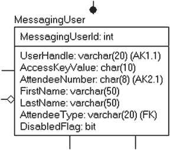

图 6-17.

带有 `DisabledFlag` `bit` 列的 `MessagingUser` 表


### 大值数据类型列

在 SQL Server 2005 中，处理大数据类型的方式发生了显著变化（希望微软有朝一日能彻底弃用 `text` 和 `image` 类型）。通过在 `varchar`、`nvarchar` 和 `varbinary` 类型上使用 `max` 说明符，你可以存储比先前版本使用“常规”类型所能存储的数据量多得多的数据，同时仍可以使用与处理简单 `varchar(10)` 列相同的函数和技术来操作这些数据，尽管性能会略有不同。

与所有数据类型问题一样，仅在需要时才使用 `varchar(max)` 类型，并始终使用尽可能小的数据类型。数据类型越大，可能存储的数据就越多，行大小对优化存储检索时间造成的麻烦也越大。在已知需要大量数据，或有时需要在单列中存储超过 8,000 字节的情况下，`max` 说明符是一个极好的选择。

**注意**
在开始实施时，请留意那些不满足规范化需求的使用情况。大多数数据库中都有某个“注释”列，它已从简单的注释演变成半结构化的混乱局面，迫使你的 DBA 团队后续不得不使用 `SUBSTRING` 和 `CHARINDEX` 函数来剖析它。

使用这些类型时有两个特别需要注意的地方：
*   从普通字符类型到大值类型没有自动的数据类型转换。
*   由于数据可能非常庞大，`UPDATE` 语句中添加了一个特殊的子句以允许对列进行部分修改。

第一个问题相当简单，但有时可能有点令人困惑。例如，连接 `'12345' + '67890'`。你取了两个 `char(5)` 值，结果将包含在一个自动转换为 `char(10)` 的值中。但如果你连接两个 `varchar(8000)` 值，你得到的既不是 `varchar(16000)` 值，也不是 `varchar(max)` 值。这些值会被截断为一个 `varchar(8000)` 值。这并非总是直观显而易见的。例如，考虑以下代码：

```sql
SELECT   LEN( CAST(REPLICATE ('a',8000) AS varchar(8000))
+ CAST(REPLICATE('a',8000) AS varchar(8000))
)
```

它返回值 8000，因为这两个列连接成了一个 `varchar(8000)` 类型。如果你将其中一个 `varchar(8000)` 值转换为 `varchar(max)`，那么结果将是 16,000：

```sql
SELECT    LEN(CAST(REPLICATE('a',8000) AS varchar(max))
+ CAST(REPLICATE('a',8000) AS varchar(8000))
)
```

其次，因为使用 `varchar(max)` 数据类型存储的列的大小可能非常巨大，总是像传递较小值那样传递这些值是不利的。由于 `varchar(max)` 值的最大大小为 2GB，想象一下需要完整地更新一个这么大的值。这样的更新会相当麻烦，因为客户端需要获取整个值，进行更改，然后将值发送回服务器。大多数客户端机器可能只有 2GB 的物理 RAM，因此客户端机器上很可能会发生分页，整个过程会变得非常缓慢，而且极有可能偶尔崩溃。所以，你可以进行所谓的**分块更新**。这是通过在 `UPDATE` 语句中使用 `.WRITE` 子句完成的。例如：

```sql
UPDATE TableName
SET    VarcharMaxCol.WRITE('the value', , )
WHERE  . . .
```

需要注意的一个重要点是，`varchar(max)` 值很容易导致行大小变得相当大。简而言之，一个能容纳在 8,060 字节内的行可以存储在一个物理单元中。如果行大于 8,060 字节，字符串数据可以被放置在所谓的**溢出页**上。溢出页效率不高，因为 SQL Server 必须去获取那些不与其他数据页连续的额外页。（物理结构，包括溢出页，在第 10 章讨论物理结构时会有更详细的介绍。）

在此我不再更详细地讨论大类型。只需理解，如果你允许存储海量数据，你可能需要以不同的方式处理 `(max)` 列中的数据。在我们的模型中，我们在 `Customer` 表中使用了一个 `varbinary(max)` 列来存储客户的图像。

这里需要理解的主要观点是，拥有一个存储能力几乎无限的数据类型是有代价的。从 2008 版本开始的 SQL Server 通过使用所谓的 **文件流存储** 将其放置在文件系统中，在处理 `varbinary(max)` 数据时为你提供了一些额外的自由。我将在第 8 章更详细地讨论大对象存储，包括文件表。

### 用户定义类型/别名

有一个听起来非常棒的功能可以帮助你使代码更清晰，那就是用户定义类型（UDT），它实际上是一个类型的别名。你可以使用数据类型别名来指定一个在多个地方使用的常用数据类型配置，语法如下：

```sql
CREATE TYPE [schema_name.] type_name
FROM  --any type that can be used as a column of a
--table, with precision and scale or length,
--as required by the intrinsic type
[NULL | NOT NULL];
```

在声明表时，如果没有指定可空性，则 `NULL` 或 `NOT NULL` 基于 `ANSI_NULL_DFLT_ON` 的设置，除非使用别名类型（变量将始终可为空）。一般来说，最好始终在表声明中指定可空性，这也是我在本书中将始终遵循的做法，尽管我在现实生活中有时会忘记。

例如，考虑 `UserHandle` 列。之前，我们将其域定义为 `varchar(20)`、非可选、字母数字，且数据长度要求在 5 到 20 个字符之间。数据类型别名允许我们指定：

```sql
CREATE TYPE UserHandle FROM varchar(20) NOT NULL;
```

然后，在 `CREATE TABLE` 语句中，我们可以指定：

```sql
CREATE TABLE MessagingUser
...
UserHandle UserHandle,
```

通过声明 `UserHandle` 类型将是 `varchar(20)`，你可以确保每次使用 `UserHandle` 类型时，无论是在表声明还是变量声明中，它都是 `varchar(20)`，并且只要你没有指定 `NULL` 或 `NOT NULL`。不可能在该类型上实现数据必须在 5 到 20 个字符之间的要求，包括 `NULL` 规范在内的任何其他约束都无法实现。

再举一个例子，考虑一个 `SSN` 类型。它是 `char(11)`，所以你当然不能放入一个 12 个字符的值。但如果用户输入了 `234433432` 而没有包括破折号呢？数据类型会允许它，但这并不符合要求。数据仍然需要通过其他方法（如 `CHECK` 约束）进行检查。

我个人不是这些类型的使用者。我从未真正使用过这类类型，因为除了简单地给类型起别名外，你无法对它们做任何其他事情。对类型的任何更改也需要移除对该类型的所有引用，使得更改类型成为一个两步过程。

然而，我要指出的是，我有几位架构师朋友广泛使用它们来帮助保持数据存储的一致性。我发现使用域和数据建模工具对我更有帮助，但我确实希望确保你至少听说过它们并了解其优缺点。


